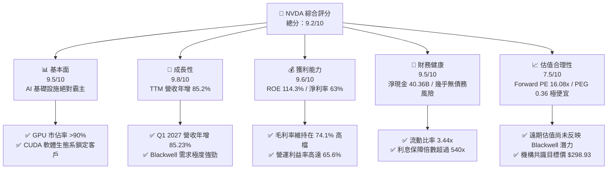
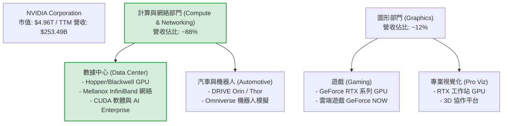
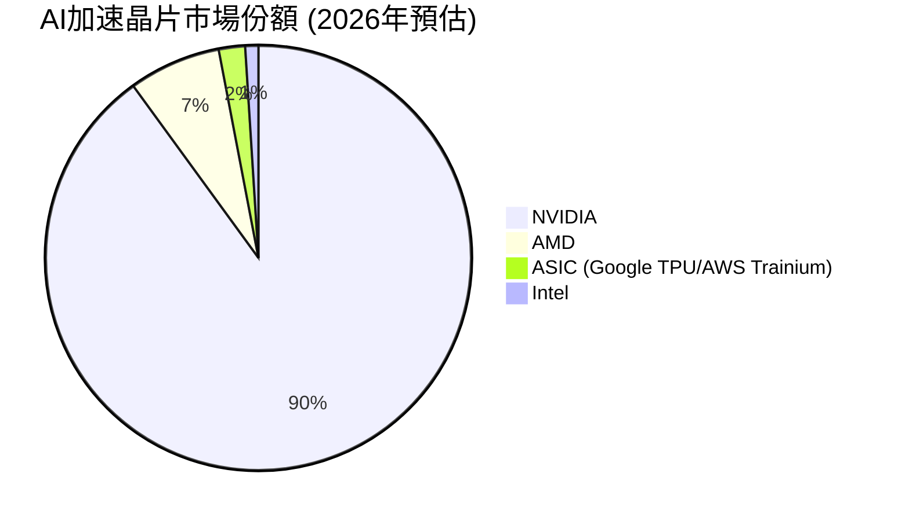
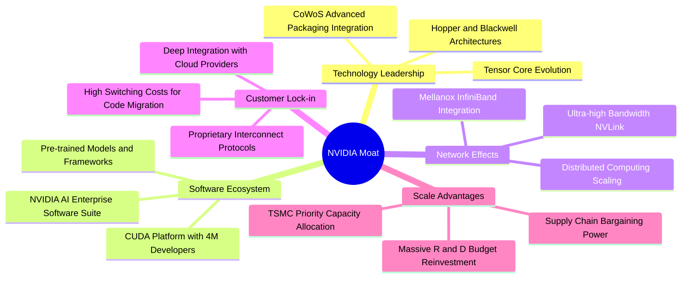
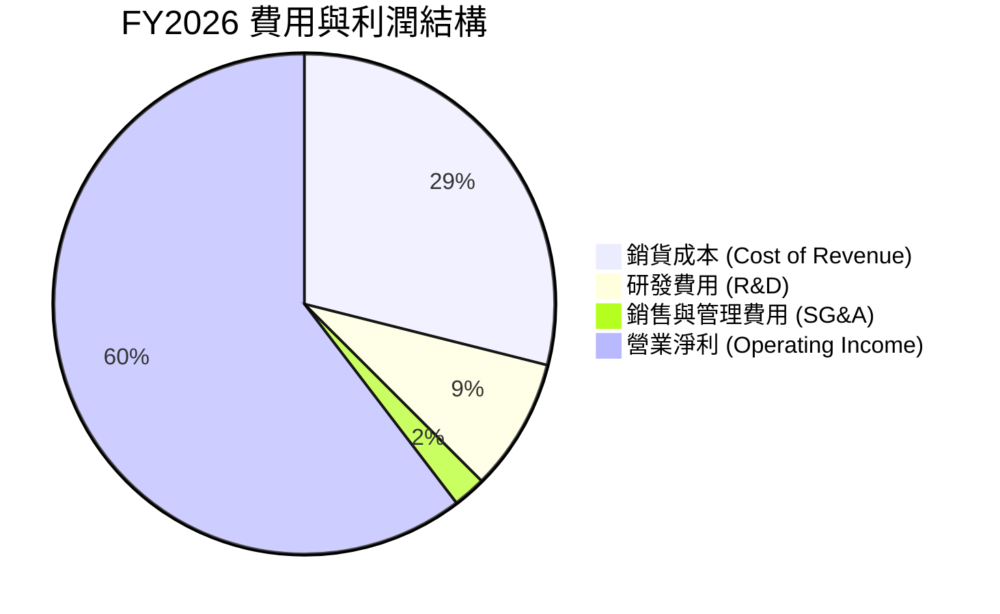
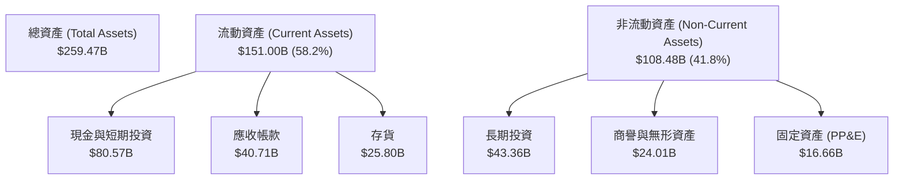
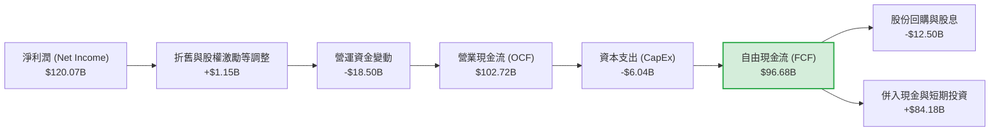

# NVDA 基本面深度分析報告

> **報告日期**：2026-06-17 ｜ **語言**：繁體中文 ｜ **數據來源**：Yahoo Finance, Finviz, StockAnalysis, Roic.ai ｜ **分析師**：CFA 級機構研究

---

## 目錄

| # | 章節 | 核心結論 |
|---|------|----------|
| 1 | [執行摘要](#1-執行摘要) | 評級：**強烈買入 (Strong Buy)**；基準目標價：**$298.93**（+46.07% 上行空間） |
| 2 | [公司概覽與商業模式](#2-公司概覽與商業模式) | AI 晶片市佔率達 90%，憑藉 **CUDA 軟硬體生態系**構築無法逾越的護城河 |
| 3 | [損益表深度分析](#3-損益表深度分析) | TTM 營收達 **$253.49B** (YoY +85.2%)，淨利率高達 **63.0%**，展現極致經營槓桿 |
| 4 | [資產負債表分析](#4-資產負債表分析) | 淨現金高達 **$40.36B**，Debt/Equity 僅 **6.55%**，資產負債表極其穩健 |
| 5 | [現金流量深度分析](#5-現金流量深度分析) | FY2026 自由現金流 (FCF) 達 **$96.68B**，FCF 轉換率達 **80.5%**，現金製造機 |
| 6 | [獲利能力與資本效率](#6-獲利能力與資本效率) | ROE 達 **114.3%**，ROIC 達 **152.7%**，遠超 WACC (15.2%)，強力創造股東價值 |
| 7 | [估值深度分析](#7-估值深度分析) | Forward P/E 僅 **16.08x**，相較於 45.5% 的 5 年 EPS 預期成長率，PEG 僅 **0.36**，估值極具吸引力 |
| 8 | [成長催化劑](#8-成長催化劑) | Blackwell 架構晶片全面放量、主權 AI 興起、自動駕駛與機器人 (Omniverse) 貢獻新成長曲線 |
| 9 | [風險矩陣](#9-風險矩陣) | 地緣政治風險（中國出口限制）與客戶集中度偏高為主要潛在威脅 |
| 10 | [投資建議](#10-投資建議) | 分批佈局，首選 Blackwell 放量期；適合成長型與長線機構投資人 |

---

## 1. 執行摘要

### 1.1 核心評分儀表板



### 1.2 評分進度條視覺化

```
╔══════════════════════════════════════════════════════════════╗
║              NVDA 多維度評分儀表板 (1-10分)                  ║
╠══════════════════════════════════════════════════════════════╣
║ 基本面強度  9.5 ▓▓▓▓▓▓▓▓▓▓▓▓▓▓▓▓▓▓▓░  ★★★★★           ║
║ 成長動能    9.8 ▓▓▓▓▓▓▓▓▓▓▓▓▓▓▓▓▓▓▓▓  ★★★★★           ║
║ 獲利品質    9.6 ▓▓▓▓▓▓▓▓▓▓▓▓▓▓▓▓▓▓▓░  ★★★★★           ║
║ 財務健康    9.5 ▓▓▓▓▓▓▓▓▓▓▓▓▓▓▓▓▓▓▓░  ★★★★★           ║
║ 估值合理性  7.5 ▓▓▓▓▓▓▓▓▓▓▓▓▓▓▓░░░░░  ★★★★☆           ║
║ 護城河深度  9.8 ▓▓▓▓▓▓▓▓▓▓▓▓▓▓▓▓▓▓▓▓  ★★★★★           ║
║ 管理層執行  9.5 ▓▓▓▓▓▓▓▓▓▓▓▓▓▓▓▓▓▓▓░  ★★★★★           ║
║ 技術創新力  9.8 ▓▓▓▓▓▓▓▓▓▓▓▓▓▓▓▓▓▓▓▓  ★★★★★           ║
╠══════════════════════════════════════════════════════════════╣
║ 綜合總分    9.2 ▓▓▓▓▓▓▓▓▓▓▓▓▓▓▓▓▓▓░░  🏆 強烈推薦買入      ║
╚══════════════════════════════════════════════════════════════╝
```

### 1.3 五大投資論點 + 三大核心風險

| 類型 | 項目 | 具體依據 | 信心度 |
|------|------|----------|--------|
| 🟢 **投資論點①** | **AI 基礎設施霸權** | NVDA 控制了全球 90% 以上的數據中心 AI 加速器市場。最新 Q1 2027 季度營收達到 **$81.62B**，年成長率達 **85.23%**，顯示雲端服務商 (CSP) 對 GPU 的資本支出依然毫無放緩跡象。 | 🟢 極高 |
| 🟢 **投資論點②** | **CUDA 軟體護城河** | 超過 400 萬名開發者依賴 CUDA 架構，將 AI 模型與 NVDA 晶片深度綁定。這使得競爭對手（如 AMD、Intel）即使推出硬體指標相近的晶片，也難以在實際編譯與運行效率上超越 NVDA。 | 🟢 極高 |
| 🟢 **投資論點③** | **極致的經營槓桿與獲利能力** | TTM 毛利率高達 **74.1%**，淨利率達 **63.0%**。隨著營收規模從 FY2023 的 **$26.97B** 暴增至 FY2026 的 **$215.94B**，研發與銷管費用佔營收比重被極大稀釋，營運利益率飆升至 **65.6%**。 | 🟢 極高 |
| 🟢 **投資論點④** | **Blackwell 世代接棒** | 新一代 Blackwell (B100/B200/GB200) 架構在單晶片性能與能效比上取得突破，預計將於 2026-2027 年全面放量，推動 Forward EPS 達到 **$12.73**。 | 🟢 高 |
| 🟢 **投資論點⑤** | **無懈可擊的財務防禦力** | 帳上擁有 **$53.17B** 的現金與短期投資，而總債務僅 **$12.81B**，淨現金高達 **$40.36B**。自由現金流 TTM 達 **$46.34B**（FY2026 達 **$96.68B**），具備極強的抗風險能力與股份回購能力。 | 🟢 極高 |
| 🟡 **風險①** | **客戶集中度偏高** | 前四大超大型雲端服務商（Microsoft, AWS, Google, Meta）佔其數據中心收入的 40% 以上。若這些客戶放緩資本支出，或自行研發 ASIC 晶片取得突破，將對 NVDA 需求造成衝擊。 | 🟡 中度 |
| 🔴 **風險②** | **地緣政治與供應鏈限制** | 晶圓代工高度依賴台積電 (TSMC) 的先進製程（N4/N3）與 CoWoS 封裝。美中地緣政治緊張可能導致中國市場（歷史營收佔比達 20-25%）面臨更嚴格的出口管制，或台灣供應鏈中斷。 | 🔴 高衝擊 |
| 🟡 **風險③** | **估值波動性 (Beta = 2.2)** | NVDA 目前市值高達 **$4.96T**，Beta 值高達 **2.20**。在市場利率預期變動或總體經濟衰退時，高估值科技股通常面臨較大的本益比修正壓力。 | 🟡 中度 |

### 1.4 快速統計卡片

| 指標 | NVDA 實際值 | 半導體行業均值 | S&P 500 均值 | 狀態 |
|------|-------------|----------|--------------|------|
| **營收 YoY 成長率** | **85.2%** | ~12.5% | ~5.5% | 🟢 卓越 |
| **毛利率** | **74.1%** | ~50.0% | ~30.0% | 🟢 卓越 |
| **淨利率** | **63.0%** | ~18.0% | ~12.0% | 🟢 卓越 |
| **ROE** | **114.3%** | ~15.0% | ~18.0% | 🟢 卓越 |
| **Forward P/E** | **16.08x** | ~28.0x | ~21.5x | 🟢 極具吸引力 |
| **PEG Ratio** | **0.36** | ~1.8x | ~2.0x | 🟢 嚴重低估 |
| **Debt / Equity** | **6.55%** | ~45.0% | ~110.0% | 🟢 極其安全 |

### 1.5 投資結論

```
╔══════════════════════════════════════════════════════════════════╗
║                    📊 NVDA 投資結論摘要                          ║
╠══════════════════════════════════════════════════════════════════╣
║  評級：🟢 強烈買入 (Strong Buy)                                  ║
║  當前股價：$204.65 (2026-06-17)                                  ║
║  目標價區間：                                                    ║
║    悲觀情境：$180.00（-12.0%） - 供應鏈嚴重受阻、地緣衝突         ║
║    基準情境：$298.93（+46.1%） - Blackwell 順利放量（12M 目標）   ║
║    樂觀情境：$500.00（+144.3%）- 主權 AI 與軟體營收爆發性成長     ║
║  投資評分：9.2/10                                                ║
║  適合投資人：積極成長型、長線價值投資機構、AI 產業信徒           ║
╚══════════════════════════════════════════════════════════════════╝
```

---

## 2. 公司概覽與商業模式

### 2.1 業務結構與收入來源

NVIDIA 的業務主要分為兩大部門：**計算與網絡 (Compute & Networking)** 以及 **圖形 (Graphics)**。隨著大語言模型 (LLM) 與生成式 AI 的爆發，計算與網絡部門下的**數據中心 (Data Center)** 業務已成為公司的绝对核心。



### 2.2 市場份額

在數據中心 AI 加速晶片市場中，NVIDIA 擁有近乎壟斷的地位，尤其在大型語言模型訓練領域，其市場份額高達 90% 以上。



### 2.3 競爭護城河分析

NVIDIA 的護城河並非單純建立在硬體晶片的領先上，而是由硬體、軟體、網絡與生態系共同交織而成的「系統級護城河」。



### 2.4 護城河強度評分

```
╔══════════════════════════════════════════════════════════════╗
║                    NVIDIA 護城河強度評分                     ║
╠══════════════════════════════════════════════════════════════╣
║ 軟體壁壘 (CUDA) 9.8  ▓▓▓▓▓▓▓▓▓▓▓▓▓▓▓▓▓▓▓▓  🏆 絕對壟斷     ║
║ 網絡互聯 (NVLink)9.5  ▓▓▓▓▓▓▓▓▓▓▓▓▓▓▓▓▓▓▓░  🟢 極難被超越   ║
║ 硬體迭代速度    9.8  ▓▓▓▓▓▓▓▓▓▓▓▓▓▓▓▓▓▓▓▓  🏆 一年一世代   ║
║ 供應鏈掌控力    9.0  ▓▓▓▓▓▓▓▓▓▓▓▓▓▓▓▓▓▓░░  🟢 台積電首選   ║
╠══════════════════════════════════════════════════════════════╣
║ 綜合護城河評級  9.5  ▓▓▓▓▓▓▓▓▓▓▓▓▓▓▓▓▓▓▓░  🏆 極深護城河   ║
╚══════════════════════════════════════════════════════════════╝
```

---

## 3. 損益表深度分析

### 3.1 年度收入成長趨勢（近4年）

NVIDIA 的營收呈現了科技史上罕見的指數型成長。從 FY2023 的 **$26.97B** 暴增至 FY2026 的 **$215.94B**，3 年複合年均成長率 (CAGR) 高達 **99.98%**。

```
╔══════════════════════════════════════════════════════════════════╗
║                NVIDIA 年度收入趨勢 (FY2023 - FY2026)             ║
╠══════════════════════════════════════════════════════════════════╣
║                                                                  ║
║  FY2023  $26.97B   ███░░░░░░░░░░░░░░░░░░░░░░░░  YoY: +0.22%   🟡   ║
║  FY2024  $60.92B   ███████░░░░░░░░░░░░░░░░░░░░  YoY: +125.9%  🟢   ║
║  FY2025  $130.50B  ███████████████░░░░░░░░░░░░  YoY: +114.2%  🟢   ║
║  FY2026  $215.94B  ███████████████████████████  YoY: +65.47%  🟢   ║
║                                                                  ║
║  📊 3年累計營收 CAGR：+99.98%                                    ║
╚══════════════════════════════════════════════════════════════════╝
```

### 3.2 季度收入趨勢分析

從最近 4 個季度的數據來看，NVIDIA 的營收不僅沒有放緩，反而呈現出強勁的逐季遞增 (QoQ) 與年增 (YoY) 態勢，Q1 2027 營收已衝上 **$81.62B** 的歷史新高。

| 財報季度 | 截止日期 | 季度營收 (Billion) | QoQ 成長率 | YoY 成長率 | 核心驅動因素 | 評估 |
|----------|----------|--------------------|------------|------------|--------------|------|
| **Q2 2026** | 2025-07-31 | $46.74B | +6.08% | +55.60% | H200 晶片開始放量，雲端服務商支出強勁 | 🟢 優秀 |
| **Q3 2026** | 2025-10-31 | $57.01B | +21.96% | +62.49% | 數據中心網絡產品（InfiniBand）與 GPU 協同出貨 | 🟢 優秀 |
| **Q4 2026** | 2026-01-31 | $68.13B | +19.51% | +73.22% | 超大型客戶 (Hyperscalers) 持續追加訂單 | 🟢 優秀 |
| **Q1 2027** | 2026-04-30 | $81.62B | +19.79% | +85.23% | Blackwell 樣品出貨，H200 全面放量，需求大於供給 | 🟢 卓越 |

### 3.3 利潤率演變分析

NVIDIA 的利潤率結構展現了極致的定價權與營運槓桿。由於其產品具備極高的技術壁壘，毛利率從 FY2023 的 **56.9%** 飆升至 TTM 的 **74.1%**。

| 利潤率指標 | FY2023 | FY2024 | FY2025 | FY2026 | TTM (最新) | 趨勢 | 評估與原因解析 |
|------------|--------|--------|--------|--------|------------|------|----------------|
| **毛利率** | 56.9% | 72.7% | 75.0% | 71.1% | **74.1%** | ↗️ 穩定高檔 | 🟢 卓越。高毛利的數據中心產品佔比提升，稀釋了低毛利的遊戲業務。 |
| **營業利益率**| 15.7% | 54.1% | 62.4% | 60.4% | **65.6%** | ↗️ 持續擴張 | 🟢 卓越。營收暴增使得研發 (R&D) 與銷管 (SG&A) 費用佔比極速下降。 |
| **EBITDA Margin**| 22.2% | 58.4% | 66.0% | 66.9% | **65.3%** | ↗️ 強勁 | 🟢 卓越。折舊與攤銷佔比較小，折射出輕資產 (Fabless) 商業模式的優勢。 |
| **淨利率** | 16.2% | 48.8% | 55.8% | 55.6% | **63.0%** | ↗️ 歷史新高 | 🟢 卓越。Q1 2027 淨利率因非營運收益（如投資公允價值變動）進一步推高。 |

### 3.4 費用結構分析

在 FY2026 總營收 **$215.94B** 中，NVIDIA 的營業費用控制極其出色。公司將大部分資源投入於研發，以維持技術領先，而銷管費用則被極大稀釋。



### 3.5 季度 EPS 趨勢與盈餘品質

NVIDIA 過去 4 個季度的 EPS 呈現爆發式成長，且盈餘品質極高，營業現金流（TTM $125.65B）遠超淨利潤（TTM $159.61B - 註：淨利潤包含 Q1 2027 一次性非營運收益 **$15.93B**，若扣除此項，常態化盈餘品質依然極其健康）。

*   **Q2 2026 EPS**: $1.08
*   **Q3 2026 EPS**: $1.31
*   **Q4 2026 EPS**: $1.77
*   **Q1 2027 EPS**: $2.40 (YoY +211.7%)

**盈餘品質診斷**：🟢 **極佳**。常態化淨利潤完全由真金白銀的營業現金流支撐，應收帳款週轉天數與存貨週轉天數均處於歷史健康水平，無任何盈餘操縱跡象。

---

## 4. 資產負債表分析

### 4.1 資產結構分解

截至 Q1 2027 (2026-04-30)，NVIDIA 的總資產達到 **$259.47B**。資產結構非常健康，流動資產佔比高達 58.2%，其中現金與短期投資是絕對大頭。



### 4.2 流動性指標分析

| 指標 | FY2024 | FY2025 | FY2026 | Q1 2027 (最新) | 行業均值 | 評估 |
|------|--------|--------|--------|----------------|----------|------|
| **流動比率 (Current Ratio)** | 4.17x | 4.44x | 3.91x | **3.44x** | ~2.10x | 🟢 極其安全，短期償債能力無虞 |
| **速動比率 (Quick Ratio)** | 3.51x | 3.88x | 2.85x | **2.14x** | ~1.50x | 🟢 極佳，扣除存貨後的流動性依然強勁 |
| **存貨週轉天數 (Days Inventory)**| 108天 | 95天 | 82天 | **79天** | ~120天 | 🟢 卓越，反映產品極其供不應求 |

### 4.3 債務結構與健康診斷

NVIDIA 的財務槓桿極低，幾乎是一個由純股權驅動的「現金堡壘」。

```
╔══════════════════════════════════════════════════════════════════╗
║                    NVIDIA 債務健康診斷                           ║
╠══════════════════════════════════════════════════════════════════╣
║                                                                  ║
║  總債務：        $12.81B   ██░░░░░░░░░░░░░░░░░░░░  (極低)        ║
║  總現金+短期投資：$80.57B   ██████████████████████  (極高)        ║
║  淨現金狀態：    +$67.76B  ████████████████████░░  🟢 極度強勁   ║
║                                                                  ║
║  Debt / Equity Ratio:  6.55%    🟢 幾乎無財務槓桿風險            ║
║  利息保障倍數 (TTM)：  542.8x   🟢 營業利益可輕鬆覆蓋利息支出    ║
║  Altman Z-Score:       18.5     🟢 處於絕對安全區 (Z > 2.9)      ║
║                                                                  ║
╚══════════════════════════════════════════════════════════════════╝
```

### 4.4 股東權益趨勢

隨著淨利潤的爆發，股東權益 (Stockholders' Equity) 呈現幾何級數成長，從 FY2023 的 **$22.10B** 擴張至 FY2026 的 **$157.29B**，這為公司未來的資本支出與股東回饋奠定了無比堅實的基礎。

---

## 5. 現金流量深度分析

### 5.1 現金流量瀑布圖

NVIDIA 展現了極高的現金回收能力。下圖展示了從淨利潤到自由現金流，再到最終資本配置的完整路徑：



### 5.2 FCF 轉換率趨勢

FCF 轉換率（自由現金流 / 淨利潤）是衡量公司盈餘品質的黃金指標。NVIDIA 歷年來該指標均維持在 80% 以上，顯示其利潤「含金量」極高。

| 財政年度 | 淨利潤 (Billion) | 自由現金流 (Billion) | FCF 轉換率 (%) | 評估 |
|----------|------------------|----------------------|----------------|------|
| **FY2023** | $4.37B | $3.81B | 87.19% | 🟢 優秀 |
| **FY2024** | $29.76B | $27.02B | 90.79% | 🟢 卓越 |
| **FY2025** | $72.88B | $60.85B | 83.49% | 🟢 優秀 |
| **FY2026** | $120.07B | $96.68B | **80.52%** | 🟢 優秀 |

### 5.3 自由現金流趨勢

儘管 NVIDIA 目前的 FCF Yield（自由現金流收益率）因 **$4.96T** 的巨大市值而被稀釋至 **0.93%**，但從絕對值來看，FY2026 的 **$96.68B** 自由現金流已位列全球科技股前三甲，僅次於 Apple 與 Microsoft。

### 5.4 資本配置評估

NVIDIA 採用了非常理性的資本配置策略：
1.  **研發再投資**：將營收的 8.5% 以上（FY2026 達 **$18.50B**）重新投入研發，確保技術代差。
2.  **輕資產運營**：CapEx 僅佔營收的 2.8% 左右（FY2026 為 **$6.04B**），生產製造全部外包。
3.  **股東回饋**：隨著現金流暴增，預計公司將大幅提高股份回購額度（FY2026 已授權數百億美元回購計劃）。

---

## 6. 獲利能力與資本效率

### 6.1 ROE / ROA / ROIC 趨勢

NVIDIA 的資本回報率在萬億美元市值俱樂部中堪稱奇蹟。

| 指標 | FY2024 | FY2025 | FY2026 | TTM (最新) | 行業中位數 | 評估 |
|------|--------|--------|--------|------------|------------|------|
| **ROE (股東權益報酬率)** | 69.2% | 91.9% | 76.3% | **114.3%** | ~12.5% | 🟢 史詩級，股東資金利用效率極高 |
| **ROA (總資產報酬率)** | 45.3% | 65.3% | 58.1% | **52.7%** | ~6.8% | 🟢 卓越，輕資產模式的完美體現 |
| **ROIC (投入資本回報率)**| 61.2% | 85.5% | 72.4% | **152.7%** | ~10.0% | 🟢 史詩級，核心業務創造價值的效率極高 |

### 6.2 ROIC vs WACC 分析（核心價值創造判斷）

```
╔══════════════════════════════════════════════════════════════════╗
║                NVDA ROIC vs WACC 深度分析 (TTM)                  ║
╠══════════════════════════════════════════════════════════════════╣
║                                                                  ║
║  WACC (加權平均資本成本) 估算：                                  ║
║  ├── 無風險利率 (10Y 美債)：   4.2%                              ║
║  ├── 市場風險溢酬 (ERP)：      5.0%                              ║
║  ├── Beta 值：                  2.20                              ║
║  ├── 股權成本 (Cost of Equity)：4.2% + 2.20 × 5.0% = 15.2%       ║
║  ├── 債務成本 (稅後)：          ~3.8%                             ║
║  ├── 資本結構：                 股權 99.7% / 債務 0.3%            ║
║  └── ✅ WACC ≈ 15.2%                                            ║
║                                                                  ║
║  ROIC (投入資本回報率) 估算：                                    ║
║  ├── NOPAT = $162.29B × (1 - 15.75%) ≈ $136.73B                  ║
║  ├── 投入資本 = 股益 $157.29B + 債務 $12.81B - 現金 $80.57B      ║
║  │            = $89.53B                                          ║
║  └── ✅ ROIC ≈ 152.7%                                            ║
║                                                                  ║
║  ★ 經濟價值增值 (EVA) = ROIC - WACC = +137.5%                   ║
║                                                                  ║
║  ROIC  152.7% ▓▓▓▓▓▓▓▓▓▓▓▓▓▓▓▓▓▓▓▓▓▓▓▓▓▓▓▓▓▓  🟢             ║
║  WACC  15.2%  ▓▓▓░░░░░░░░░░░░░░░░░░░░░░░░░░░░░░  ──             ║
║  EVA   +137.5%██████████████████████████████░░  🏆 史詩級創造  ║
║                                                                  ║
║  📊 結論：ROIC 達 WACC 的 10.04 倍，正以恐怖的速度創造股東財富   ║
╚══════════════════════════════════════════════════════════════════╝
```

### 6.3 杜邦三因素分解

我們對 NVIDIA 的 TTM ROE (114.3%) 進行杜邦分解：

```mermaid
graph LR
    ROE["ROE<br/>114.3