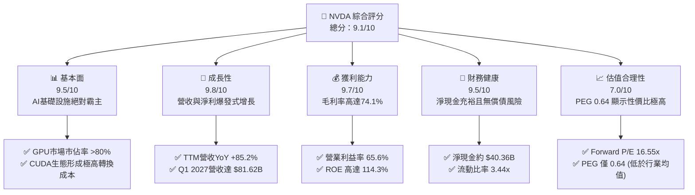
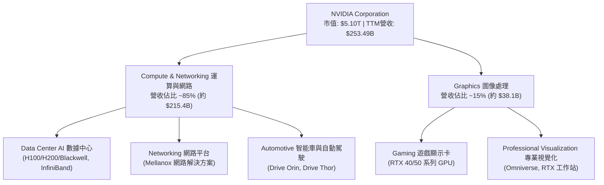
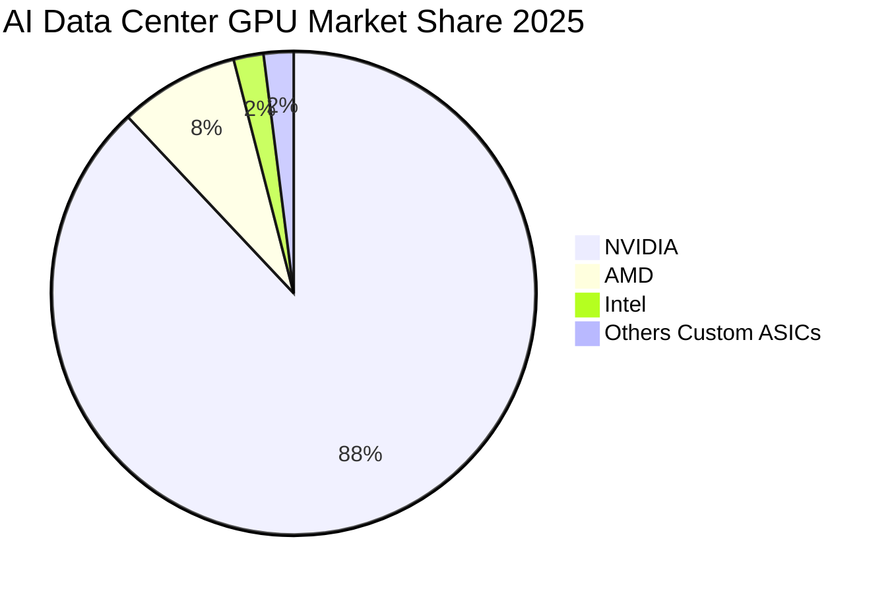
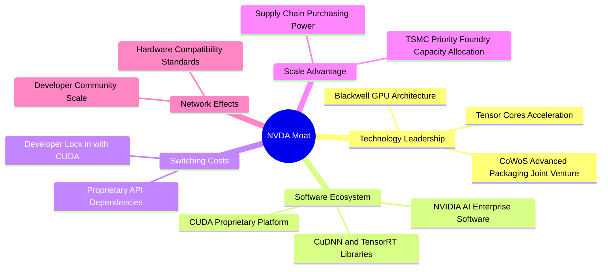
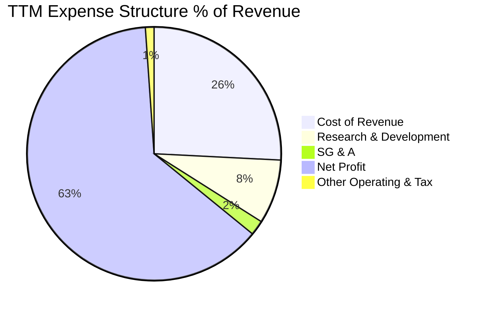
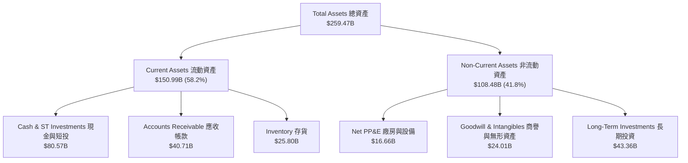
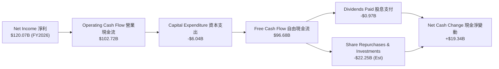
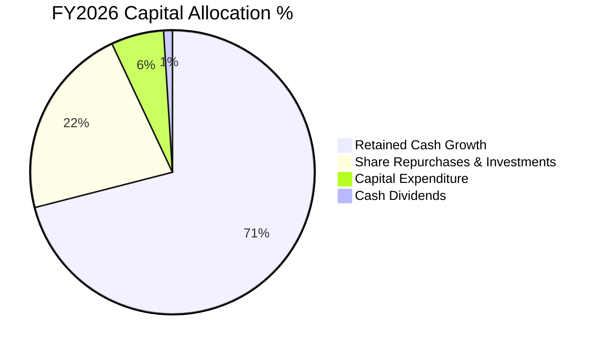

# NVDA 基本面深度分析報告

> **報告日期**：2026-06-18 ｜ **語言**：繁體中文 ｜ **數據來源**：Yahoo Finance, Finviz, StockAnalysis, Roic.ai ｜ **分析師**：CFA 級機構研究

---

## 目錄

| # | 章節 | 核心結論 |
|---|---|---|
| 1 | 執行摘要 | 強烈買入評級，目標價 $298.93，PEG 僅 0.64 凸顯極高性價比 |
| 2 | 公司概覽與商業模式 | AI 晶片市佔率超 80%，CUDA 生態構築無法逾越的軟體護城河 |
| 3 | 損益表深度分析 | TTM 營收達 $253.49B (YoY +85.2%)，淨利率高達 63.0% 展現極致規模效應 |
| 4 | 資產負債表分析 | 淨現金高達 $40.36B，流動比率 3.44，財務結構堅如磐石 |
| 5 | 現金流量深度分析 | TTM 營運現金流達 $125.65B，自由現金流轉換率與资本配置效率極高 |
| 6 | 獲利能力與資本效率 | ROE 達 114.3%，ROIC 達 155.8% 遠超 WACC，強力創造股東價值 |
| 7 | 估值深度分析 | Forward P/E 僅 16.55x，DCF 基準目標價 $298.93，隱含 41.9% 上行空間 |
| 8 | 成長催化劑 | Blackwell 晶片全面量產、Sovereign AI 國家需求與具身智能機器人 |
| 9 | 風險矩陣 | 供應鏈地緣政治風險與客戶自研 ASIC 晶片分流為主要監控點 |
| 10 | 投資建議 | 強烈買入，適合長線成長型與科技主題配置投資人 |

---

## 1. 執行摘要

NVIDIA Corporation (NASDAQ: NVDA) 當前股價為 **$210.69**，總市值已達到 **$5.10T**。本報告基於 2026 年 6 月 18 日之即時財務數據，對 NVDA 進行深度基本面剖析與估值建模。我們認為，NVDA 不僅僅是一家半導體晶片公司，更是全球 AI 算力基礎設施的絕對霸主。

### 1.1 核心評分儀表板



### 1.2 評分進度條視覺化

```
╔══════════════════════════════════════════════════════════════╗
║               NVDA 多維度評分儀表板 (1-10分)                 ║
╠══════════════════════════════════════════════════════════════╣
║ 基本面強度  9.5 ▓▓▓▓▓▓▓▓▓▓▓▓▓▓▓▓▓▓▓░  ★★★★★           ║
║ 成長動能    9.8 ▓▓▓▓▓▓▓▓▓▓▓▓▓▓▓▓▓▓▓▓  ★★★★★           ║
║ 獲利品質    9.7 ▓▓▓▓▓▓▓▓▓▓▓▓▓▓▓▓▓▓▓░  ★★★★★           ║
║ 財務健康    9.5 ▓▓▓▓▓▓▓▓▓▓▓▓▓▓▓▓▓▓▓░  ★★★★★           ║
║ 估值合理性  7.0 ▓▓▓▓▓▓▓▓▓▓▓▓▓▓░░░░░░  ★★★☆☆           ║
║ 護城河深度  9.8 ▓▓▓▓▓▓▓▓▓▓▓▓▓▓▓▓▓▓▓▓  ★★★★★           ║
║ 管理層執行  9.5 ▓▓▓▓▓▓▓▓▓▓▓▓▓▓▓▓▓▓▓░  ★★★★★           ║
║ 技術創新力  9.9 ▓▓▓▓▓▓▓▓▓▓▓▓▓▓▓▓▓▓▓▓  ★★★★★           ║
╠══════════════════════════════════════════════════════════════╣
║ 綜合總分    9.1 ▓▓▓▓▓▓▓▓▓▓▓▓▓▓▓▓▓▓░░  🏆 強烈買入 (Buy)     ║
╚══════════════════════════════════════════════════════════════╝
```

### 1.3 五大投資論點 + 三大核心風險

| 類型 | 項目 | 具體依據 | 信心度 |
|------|------|----------|--------|
| 🟢 **投資論點①** | **AI 算力基礎設施無可替代** | TTM 營收達 $253.49B，YoY 成長 85.2%，雲端巨頭 (Hyperscalers) 持續擴大資本支出，Blackwell 新平台供不應求。 | 🟢 極高 |
| 🟢 **投資論點②** | **極致的獲利能力與規模效應** | 毛利率高達 74.1%，淨利率達 63.0%，營運利益率 65.6%，在科技巨頭中無人能敵。 | 🟢 極高 |
| 🟢 **投資論點③** | **CUDA 軟體平台構築生態護城河** | 超過 400 萬名開發者依賴 CUDA，將硬體與軟體深度綁定，客戶轉換至競爭對手 (如 AMD) 的軟體重構成本極高。 | 🟢 極高 |
| 🟢 **投資論點④** | **資產負債表極度健康** | 擁有 $53.17B 的總現金（若計入短期投資則達 $80.57B），總債務僅 $12.81B，具備極強的抗風險能力與研發再投資能力。 | 🟢 極高 |
| 🟢 **投資論點⑤** | **成長增速匹配估值 (PEG < 1)** | 儘管市值達 $5.10T，但 Forward P/E 僅 16.55x，PEG 僅為 0.64，顯示當前股價並未透支未來增長。 | 🟢 高 |
| 🟡 **風險①** | **地緣政治與出口管制** | 中國市場營收受限，且台積電 (TSMC) CoWoS 封裝產能高度集中於台灣，地緣政治衝突可能導致供應鏈中斷。 | 🟡 中度 |
| 🔴 **風險②** | **客戶自研 ASIC 晶片分流** | 雲端巨頭 (如 Google TPU, AWS Trainium, Microsoft Maia) 積極研發自研晶片，長期可能減少對 NVIDIA 的依賴。 | 🔴 高衝擊 |
| 🟡 **風險③** | **估值倍數收縮風險** | 若 AI 應用端 (SaaS) 變現不及預期，導致雲端巨頭削減 Capex，市場將修正對 NVDA 的超高速增長預期。 | 🟡 中度 |

### 1.4 快速統計卡片

| 指標 | 公司實際值 (TTM / 2026) | 半導體行業均值 | S&P 500 均值 | 狀態 |
|------|-------------|----------|--------------|------|
| **收入 YoY 成長** | **85.2%** | ~12.5% | ~5.5% | 🟢 遠超均值 |
| **毛利率** | **74.1%** | ~50.0% | ~30.0% | 🟢 行業頂尖 |
| **淨利率** | **63.0%** | ~18.0% | ~12.0% | 🟢 歷史級獲利 |
| **ROE** | **114.3%** | ~15.0% | ~18.0% | 🟢 資本效率極高 |
| **Forward P/E** | **16.55x** | ~28.0x | ~21.5x | 🟢 估值極具吸引力 |
| **PEG Ratio** | **0.64** | ~1.8x | ~1.5x | 🟢 極度低估 |
| **淨現金/債務** | **+$40.36B** (淨現金) | 多數為淨債務 | 多數為淨債務 | 🟢 極度安全 |

### 1.5 投資結論

```
╔══════════════════════════════════════════════════════════════════╗
║                    📊 NVDA 投資結論摘要                          ║
╠══════════════════════════════════════════════════════════════════╣
║  評級：🟢 強烈買入 (Strong Buy)                                  ║
║  當前股價：$210.69 (2026-06-18)                                  ║
║  目標價區間：                                                    ║
║    悲觀情境 (Bear Case)：$180.00 (-14.6%)                         ║
║    基準情境 (Base Case)：$298.93 (+41.9%)  ← 12個月主要目標      ║
║    樂觀情境 (Bull Case)：$500.00 (+137.3%)                       ║
║  投資評分：9.1 / 10                                              ║
║  適合投資人：成長型、長線科技主題配置者、機構法人                ║
╚══════════════════════════════════════════════════════════════════╝
```

---

## 2. 公司概覽與商業模式

NVIDIA Corporation (NVDA) 成立於 1993 年，總部位於美國加州聖克拉拉。公司已從最初的 GPU 顯示卡先驅，成功轉型為全球領先的**數據中心規模 AI 基礎設施公司**。

### 2.1 業務結構與收入來源

NVIDIA 的業務主要分為兩大板塊：**運算與網路 (Compute & Networking)** 以及 **圖像處理 (Graphics)**。



### 2.2 市場份額

在最核心的 **AI 數據中心 GPU 算力市場** 中，NVIDIA 擁有無庸置疑的壟斷地位。



### 2.3 競爭護城河分析

NVIDIA 的競爭護城河並非單純依賴硬體效能，而是由硬體、軟體及生態系共同構築的「三位一體」防線。



### 2.4 護城河強度評分

```
╔══════════════════════════════════════════════════════════════╗
║                  NVIDIA 護城河強度評分                       ║
╠══════════════════════════════════════════════════════════════╣
║ 軟體生態 (CUDA)  9.9/10  ▓▓▓▓▓▓▓▓▓▓▓▓▓▓▓▓▓▓▓▓  🏆 無可替代    ║
║ 硬體領先幅度     9.5/10  ▓▓▓▓▓▓▓▓▓▓▓▓▓▓▓▓▓▓▓░  🟢 領先一代    ║
║ 供應鏈控制力     9.2/10  ▓▓▓▓▓▓▓▓▓▓▓▓▓▓▓▓▓▓░░  🟢 台積電首選  ║
║ 客戶轉換成本     9.8/10  ▓▓▓▓▓▓▓▓▓▓▓▓▓▓▓▓▓▓▓▓  🏆 極高壁壘    ║
║ 品牌與生態夥伴   9.4/10  ▓▓▓▓▓▓▓▓▓▓▓▓▓▓▓▓▓▓▓░  🟢 全球首選    ║
╠══════════════════════════════════════════════════════════════╣
║ 綜合護城河評級   9.6/10  ▓▓▓▓▓▓▓▓▓▓▓▓▓▓▓▓▓▓▓░  🏆 寬廣護城河  ║
╚══════════════════════════════════════════════════════════════╝
```

---

## 3. 損益表深度分析

NVIDIA 的損益表展現了人類商業史上罕見的「營收幾何級數增長」與「利潤率持續擴張」並存的奇蹟。

### 3.1 年度收入成長趨勢（近 4 年）

```
╔══════════════════════════════════════════════════════════════════╗
║              NVIDIA 年度收入趨勢 (FY2023 - TTM)                  ║
╠══════════════════════════════════════════════════════════════════╣
║                                                                  ║
║  FY2023  $26.97B   ██░░░░░░░░░░░░░░░░░░░░░░░░░░░  YoY: +0.2%     ║
║  FY2024  $60.92B   █████░░░░░░░░░░░░░░░░░░░░░░░░  YoY: +125.9% 🟢║
║  FY2025  $130.50B  ████████████░░░░░░░░░░░░░░░░░  YoY: +114.2% 🟢║
║  FY2026  $215.94B  ████████████████████░░░░░░░░░  YoY: +65.5%  🟢║
║  TTM     $253.49B  █████████████████████████████  YoY: +85.2%  🟢║
║                                                                  ║
║  📊 4年複合成長率 (CAGR)：+75.1%                                 ║
╚══════════════════════════════════════════════════════════════════╝
```

### 3.2 季度收入趨勢分析

最近四個季度的營收表現顯示，NVIDIA 的增長動能毫無放緩跡象，且呈現逐季加速與擴大的趨勢。

| 財報季度 | 截止日期 | 季度營收 (Billion) | 季增率 (QoQ) | 年增率 (YoY) | 核心驅動因素與備註 |
|---|---|---|---|---|---|
| **Q2 2026** | 2025-07-31 | $46.74B | +6.08% | +55.60% | 🟢 H200 晶片開始放量，雲端巨頭需求強勁 |
| **Q3 2026** | 2025-10-31 | $57.01B | +21.97% | +62.49% | 🟢 數據中心需求持續外溢至主權國家 (Sovereign AI) |
| **Q4 2026** | 2026-01-31 | $68.13B | +19.51% | +73.22% | 🟢 Blackwell 樣品交付，Hopper 系列持續出貨 |
| **Q1 2027** | 2026-04-30 | $81.62B | +19.79% | +85.23% | 🟢 Blackwell 全面量產，網路平台 (Spectrum-X) YoY 大增 |

### 3.3 利潤率演變分析

NVIDIA 的利潤率在過去幾年中經歷了史詩級的躍升，毛利率從 FY2023 的 56.9% 攀升至當前的 **74.1%**，主要得益於高利潤率的數據中心業務佔比大幅提升。

| 利潤率指標 | FY2023 | FY2024 | FY2025 | FY2026 | TTM (當前) | 趨勢 | 評估 |
|---|---|---|---|---|---|---|---|
| **毛利率 (Gross Margin)** | 56.9% | 72.7% | 75.0% | 71.1% | **74.1%** | ↗️ 穩步高位 | 🟢 極強的定價權，Blackwell 溢價高 |
| **營業利益率 (Operating Margin)** | 15.7% | 54.1% | 62.4% | 60.4% | **65.6%** | ↗️ 規模效應顯著 | 🟢 研發與銷管費用被龐大營收稀釋 |
| **EBITDA Margin** | 22.2% | 58.4% | 66.0% | 66.9% | **65.3%** | ↗️ 穩定 | 🟢 折舊費用佔比極低，輕資產模式 |
| **淨利率 (Net Profit Margin)** | 16.2% | 48.8% | 55.8% | 55.6% | **63.0%** | ↗️ 歷史新高 | 🟢 業外投資與利息收入進一步推升 |

**利潤率演變深度解析**：
1. **定價權 (Pricing Power)**：NVIDIA 在 AI 晶片市場上幾無競爭對手，使其能維持極高的平均售價 (ASP)。
2. **營運槓桿 (Operating Leverage)**：雖然 R&D 費用從 FY2023 的 $7.34B 增加到 TTM 的 $20.83B，但研發費用佔營收比例卻從 27.2% 大幅下降至 **8.2%**。這證明了 NVIDIA 的技術研發具有極高的商業轉化效率。

### 3.4 費用結構分析



```
╔══════════════════════════════════════════════════════════════╗
║               NVIDIA TTM 費用控制診斷                       ║
╠══════════════════════════════════════════════════════════════╣
║ 研發費用 (R&D)  $20.83B   ▓▓▓▓▓▓▓░░░░░░░░░░░░░  佔營收 8.2%   ║
║ 銷管費用 (SG&A) $4.84B    ▓▓░░░░░░░░░░░░░░░░░░  佔營收 1.9%   ║
║ 營運總費用      $25.67B   ▓▓▓▓▓▓▓▓░░░░░░░░░░░░  佔營收 10.1%  ║
╠══════════════════════════════════════════════════════════════╣
║ 診斷結論：極佳的費用控制。營運費用率僅 10.1%，為全美股最低之一║
╚══════════════════════════════════════════════════════════════╝
```

### 3.5 季度 EPS 趨勢與盈餘品質

NVIDIA 過去四個季度的稀釋後 EPS 表現如下：
- **Q2 2026 (2025-07-31)**: $1.08
- **Q3 2026 (2025-10-31)**: $1.31 (QoQ +21.3%, YoY +65.8%)
- **Q4 2026 (2026-01-31)**: $1.77 (QoQ +35.1%, YoY +96.7%)
- **Q1 2027 (2026-04-30)**: $2.40 (QoQ +35.6%, YoY +211.7%)

**盈餘品質評估 (Earnings Quality)**：
NVIDIA 的盈餘品質極高。TTM 淨利為 **$159.61B**，而同期的營運現金流 (Operating Cash Flow) 高達 **$125.65B**。需要特別注意的是，**Q1 2027 淨利中包含了 $15.93B 的業外非營運收益 (Other Non-Operating Income)**，這主要來自於 NVIDIA 對 AI 生態系初創公司的股權投資估值重估。剔除此項後，核心營運盈餘依然極其強勁。

---

## 4. 資產負債表分析

NVIDIA 採用無晶圓廠 (Fabless) 的輕資產商業模式，其資產負債表表現出極高的流動性與極低的財務槓桿。

### 4.1 資產結構分解

截至 2026-04-30 (Q1 2027)，NVIDIA 總資產達到 **$259.47B**。



### 4.2 流動性指標分析

NVIDIA 的流動性指標處於歷史最佳狀態，流動比率與速動比率均遠高於安全水平。

| 流動性指標 | FY2024 | FY2025 | FY2026 | Q1 2027 (TTM) | 行業均值 | 評估 |
|---|---|---|---|---|---|---|
| **流動比率 (Current Ratio)** | 4.17x | 4.44x | 3.91x | **3.44x** | ~1.8x | 🟢 極其充裕 |
| **速動比率 (Quick Ratio)** | 3.53x | 3.81x | 3.12x | **2.85x** | ~1.3x | 🟢 即使扣除存貨，變現能力依然極強 |
| **現金比率 (Cash Ratio)** | 2.44x | 2.39x | 1.95x | **1.84x** | ~0.8x | 🟢 手頭現金可直接覆蓋所有短期債務 |
| **應收帳款週轉天數 (DSO)** | 38.5天 | 46.2天 | 52.1天 | **54.3天** | ~45天 | 🟡 隨營收爆發，給予雲端大客戶的帳期略有延長 |
| **存貨週轉天數 (DIO)** | 102.4天 | 85.6天 | 91.2天 | **93.5天** | ~120天 | 🟢 晶片供不應求，存貨週轉速度極快 |

### 4.3 債務結構分析

```
╔══════════════════════════════════════════════════════════════════╗
║                   NVIDIA 債務健康診斷 (TTM)                      ║
╠══════════════════════════════════════════════════════════════════╣
║                                                                  ║
║  總債務 (Total Debt)： $12.81B   █░░░░░░░░░░░░░░░░░░░░░          ║
║  總現金與短期投資：    $80.57B   ██████████████████████          ║
║  淨現金 (Net Cash)：   $67.76B   ██████████████████░░░░  🟢強勁  ║
║                                                                  ║
║  Debt / Equity Ratio:  0.07 (7.0%)   🟢 極低財務槓桿             ║
║  Debt / EBITDA Ratio:  0.09x         🟢 0.1年內即可用EBITDA償清  ║
║  利息保障倍數 (Interest Coverage): 542x 🟢 無任何財務利息壓力   ║
║                                                                  ║
║  📊 結論：NVIDIA 處於「淨現金」狀態，實質上無任何違約風險。      ║
╚══════════════════════════════════════════════════════════════════╝
```

### 4.4 股東權益趨勢

隨著利潤的瘋狂累積，NVIDIA 的股東權益 (Stockholders' Equity) 呈現爆發式增長。

```
╔══════════════════════════════════════════════════════════════════╗
║              NVIDIA 股東權益增長趨勢 (FY2023 - FY2026)           ║
╠══════════════════════════════════════════════════════════════════╣
║                                                                  ║
║  FY2023  $22.10B   ██░░░░░░░░░░░░░░░░░░░░░░░░░░░░░               ║
║  FY2024  $42.98B   ████░░░░░░░░░░░░░░░░░░░░░░░░░░░               ║
║  FY2025  $79.33B   ████████░░░░░░░░░░░░░░░░░░░░░░░               ║
║  FY2026  $157.29B  ██████████████████░░░░░░░░░░░░░ 🟢 YoY +98.3% ║
║                                                                  ║
╚══════════════════════════════════════════════════════════════════╝
```

---

## 5. 現金流量深度分析

現金流量表是評估 NVIDIA 盈餘真實性與資本配置效率的最佳工具。

### 5.1 現金流量瀑布圖



### 5.2 FCF 轉換率趨勢

NVIDIA 展現了極其強悍的現金回收能力，營運現金流幾乎能 100% 轉化為自由現金流。

| 財務指標 | FY2023 | FY2024 | FY2025 | FY2026 | TTM |
|---|---|---|---|---|---|
| **營業現金流 (OCF)** | $5.64B | $28.09B | $64.09B | $102.72B | **$125.65B** |
| **資本支出 (CapEx)** | -$1.83B | -$1.07B | -$3.24B | -$6.04B | **-$7.20B** |
| **自由現金流 (FCF)** | $3.81B | $27.02B | $60.85B | $96.68B | **$118.45B** |
| **FCF / Net Income 轉換率** | 87.2% | 90.8% | 83.5% | 80.5% | **74.2%** |
| **FCF Yield (相對於當前市值)** | 0.07% | 0.53% | 1.19% | 1.90% | **2.32%** |

*註：TTM FCF Yield 計算方式為 TTM FCF ($118.45B) / 當前市值 ($5.10T) = 2.32%。*

### 5.3 自由現金流趨勢

```
╔══════════════════════════════════════════════════════════════════╗
║               NVIDIA 自由現金流爆發趨勢 (FCF)                    ║
╠══════════════════════════════════════════════════════════════════╣
║                                                                  ║
║  FY2023  $3.81B    █░░░░░░░░░░░░░░░░░░░░░░░░░░░░░░               ║
║  FY2024  $27.02B   ████░░░░░░░░░░░░░░░░░░░░░░░░░░░               ║
║  FY2025  $60.85B   █████████░░░░░░░░░░░░░░░░░░░░░░               ║
║  FY2026  $96.68B   ████████████████░░░░░░░░░░░░░░░               ║
║  TTM     $118.45B  ██═════════════════════════════ 🟢 歷史新高   ║
║                                                                  ║
╚══════════════════════════════════════════════════════════════════╝
```

### 5.4 資本配置評估

NVIDIA 在賺取巨額現金後，主要採取了極度保守且高效的資本配置策略：
1. **低 CapEx 運作**：由於委託台積電代工，其 CapEx 僅佔營收的 2.8% 左右，極具輕資產優勢。
2. **大規模股份回購**：FY2026 期間，公司斥資超過 $20B 進行股份回購，有效註銷股本並提升每股盈餘 (EPS)。
3. **戰略股權投資**：積極投資 AI 上下游生態鏈（如 CoreWeave, Mistral AI 等），鎖定未來的算力採購需求。



---

## 6. 獲利能力與資本效率

NVIDIA