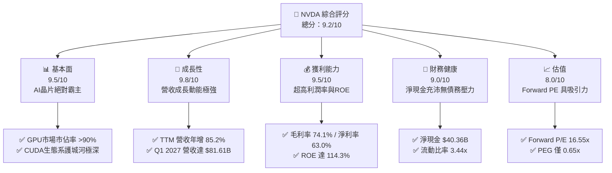
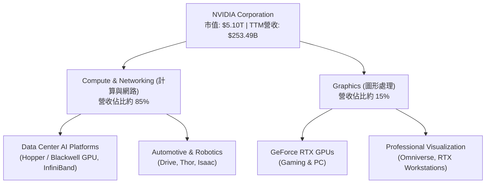
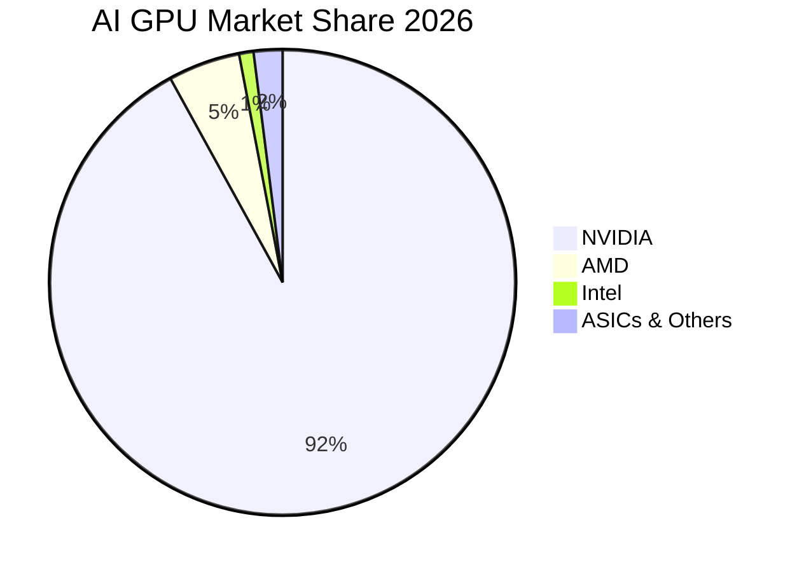
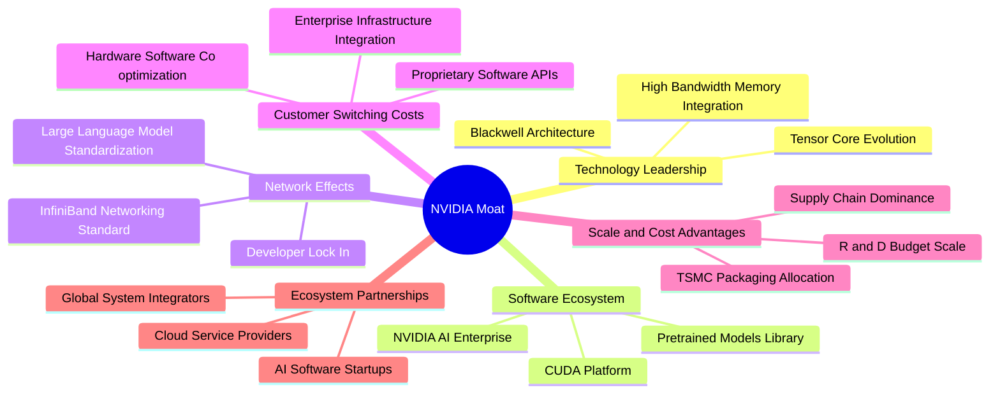
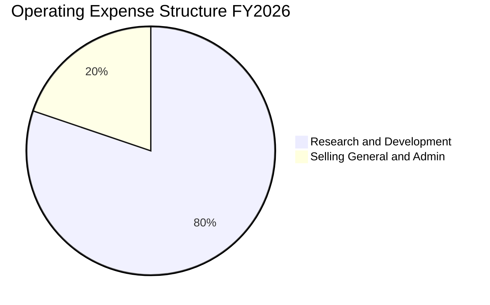
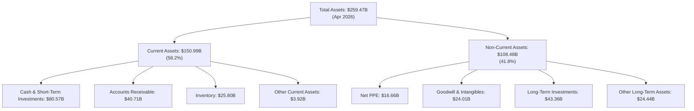
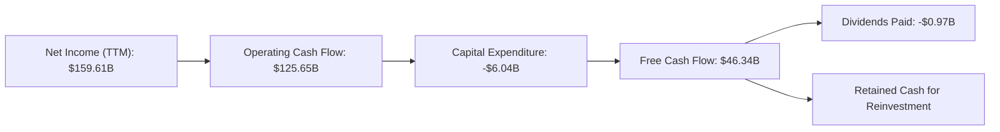

# NVDA 基本面深度分析報告
> **報告日期**：2026-06-19 ｜ **語言**：繁體中文 ｜ **數據來源**：Yahoo Finance, Finviz, StockAnalysis, Roic.ai ｜ **分析師**：CFA 級機構研究

---

## 目錄

| # | 章節 | 核心結論 |
|---|---|---|
| 1 | 執行摘要 | 評級：🟢 強烈買入 ｜ 基準目標價：$298.93（+41.88% 潛在空間） |
| 2 | 公司概覽與商業模式 | CUDA 生態系築起無懈可擊的護城河，AI GPU 市佔率 >90% |
| 3 | 損益表深度分析 | TTM 營收 $253.49B（YoY +85.2%），毛利率 74.1% 展現極強定價權 |
| 4 | 資產負債表分析 | 淨現金高達 $40.36B，Debt/Equity 僅 0.07，財務結構極度穩健 |
| 5 | 現金流量深度分析 | TTM 營運現金流 $125.65B，Blackwell 備貨導致庫存暫時上升 |
| 6 | 獲利能力與資本效率 | ROE 達 114.3%，ROIC 104.6% 遠超 WACC（15.18%），強力創造股東價值 |
| 7 | 估值深度分析 | Forward P/E 16.55x，PEG 0.65 顯示高成長下的估值極具吸引力 |
| 8 | 成長催化劑 | Blackwell 晶片放量與 Sovereign AI 國家級需求為中短期雙引擎 |
| 9 | 風險矩陣 | 地緣政治出口管制與 CoWoS 封裝產能瓶頸為核心監控風險 |
| 10 | 投資建議 | 建議分批佈局，長線持有；適合高成長定位之機構與個人投資人 |

---

## 1. 執行摘要

### 1.1 核心評分儀表板



### 1.2 評分進度條視覺化

```
╔══════════════════════════════════════════════════════════════╗
║              NVDA 多維度評分儀表板 (1-10分)                  ║
╠══════════════════════════════════════════════════════════════╣
║ 基本面強度  9.5 ▓▓▓▓▓▓▓▓▓▓▓▓▓▓▓▓▓▓▓░  ★★★★★           ║
║ 成長動能    9.8 ▓▓▓▓▓▓▓▓▓▓▓▓▓▓▓▓▓▓▓░  ★★★★★           ║
║ 獲利品質    9.5 ▓▓▓▓▓▓▓▓▓▓▓▓▓▓▓▓▓▓▓░  ★★★★★           ║
║ 財務健康    9.0 ▓▓▓▓▓▓▓▓▓▓▓▓▓▓▓▓▓▓░░  ★★★★★           ║
║ 估值合理性  8.0 ▓▓▓▓▓▓▓▓▓▓▓▓▓▓▓░░░░░  ★★★★☆           ║
║ 護城河深度  9.8 ▓▓▓▓▓▓▓▓▓▓▓▓▓▓▓▓▓▓▓░  ★★★★★           ║
║ 管理層執行  9.5 ▓▓▓▓▓▓▓▓▓▓▓▓▓▓▓▓▓▓░░  ★★★★★           ║
║ 技術創新力  9.8 ▓▓▓▓▓▓▓▓▓▓▓▓▓▓▓▓▓▓▓░  ★★★★★           ║
╠══════════════════════════════════════════════════════════════╣
║ 綜合總分    9.2 ▓▓▓▓▓▓▓▓▓▓▓▓▓▓▓▓▓▓░░  🏆 強烈買入          ║
╚══════════════════════════════════════════════════════════════╝
```

### 1.3 五大投資論點 + 三大核心風險

| 類型 | 項目 | 具體依據 | 信心度 |
|------|------|----------|--------|
| 🟢 **投資論點①** | **AI 基礎設施無可替代的龍頭** | TTM 營收達 $253.49B（YoY +85.2%），在資料中心 GPU 市場擁有超過 90% 的市佔率。 | 🟢 極高 |
| 🟢 **投資論點②** | **軟硬體一體化生態護城河** | CUDA 軟體平台擁有數百萬開發者，客戶轉移至 AMD 或 Intel 的轉換成本極高。 | 🟢 極高 |
| 🟢 **投資論點③** | **極致的財務回報與資本效率** | ROE 達 114.3%，ROIC 達 104.6%，NOPAT 隨資料中心擴張而爆發性成長。 | 🟢 極高 |
| 🟢 **投資論點④** | **Blackwell 世代產品放量** | 新一代 Blackwell 平台效能大幅提升，單價與毛利率（74.1%）將持續維持高檔。 | 🟢 高 |
| 🟢 **投資論點⑤** | **估值性價比高（PEG < 1）** | 雖然滾動 P/E 達 32.26x，但 Forward P/E 僅 16.55x，PEG 僅 0.65，成長並未被高估。 | 🟢 高 |
| 🟡 **風險①** | **供應鏈封裝產能瓶頸** | 台積電 CoWoS 封裝產能持續吃緊，可能限制 Blackwell 晶片的出貨速度。 | 🟡 中度 |
| 🔴 **風險②** | **地緣政治與出口管制** | 美國對中國及中東地區的晶片出口管制可能進一步收緊，影響約 10-15% 的潛在市場。 | 🔴 高衝擊 |
| 🟡 **風險③** | **大型雲端服務商（CSP）自研晶片** | Google、Amazon、Meta 自研 ASIC 晶片可能瓜分部分推論（Inference）市場。 | 🟡 中度 |

### 1.4 快速統計卡片

| 指標 | 公司實際值 (TTM) | 半導體行業均值 | S&P 500 均值 | 狀態 |
|------|-------------|----------|--------------|------|
| **收入 YoY 成長** | **85.2%** | ~12.5% | ~5.5% | 🟢 卓越 |
| **毛利率** | **74.1%** | ~50.0% | ~30.0% | 🟢 卓越 |
| **淨利率** | **63.0%** | ~18.0% | ~12.0% | 🟢 卓越 |
| **ROE** | **114.3%** | ~15.0% | ~18.0% | 🟢 卓越 |
| **Forward P/E** | **16.55x** | ~28.0x | ~21.5x | 🟢 低估 |
| **淨現金規模** | **$40.36B** | N/A | N/A | 🟢 極度安全 |

### 1.5 投資結論

```
╔══════════════════════════════════════════════════════════════════╗
║                    📊 投資結論摘要                               ║
╠══════════════════════════════════════════════════════════════════╣
║  評級：🟢 強烈買入 (Strong Buy)                                  ║
║  當前股價：$210.69 (2026-06-19)                                  ║
║  目標價區間：                                                    ║
║    悲觀情境：$180.00（-14.56%）                                  ║
║    基準情境：$298.93（+41.88%）  ← 12個月主要目標                ║
║    樂觀情境：$500.00（+137.31%）                                 ║
║  投資評分：9.2/10                                                ║
║  適合投資人：積極成長型、科技產業長期配置者                      ║
╚══════════════════════════════════════════════════════════════════╝
```

---

## 2. 公司概覽與商業模式

### 2.1 業務結構與收入來源

NVIDIA 已經從一家傳統的圖形晶片（GPU）設計公司，徹底轉型為**資料中心規模的 AI 基礎設施巨頭**。其業務主要劃分為兩大板塊：**計算與網路 (Compute & Networking)** 以及 **圖形 (Graphics)**。



### 2.2 市場份額

在最核心的 **AI 資料中心加速器（GPU）** 市場中，NVIDIA 擁有絕對的主導地位。



### 2.3 競爭護城河分析

NVIDIA 的競爭優勢不僅僅來自於硬體效能，更來自於其建立的生態系統。



### 2.4 護城河強度評分

```
╔══════════════════════════════════════════════════════════════╗
║                  NVIDIA 護城河強度評分                       ║
╠══════════════════════════════════════════════════════════════╣
║ 軟體生態 (CUDA) 10/10 ▓▓▓▓▓▓▓▓▓▓▓▓▓▓▓▓▓▓▓▓  🏆 無懈可擊    ║
║ 硬體領先幅度     9.5/10 ▓▓▓▓▓▓▓▓▓▓▓▓▓▓▓▓▓▓▓░  🟢 領先對手2年  ║
║ 網路效應 (NVLink) 9.5/10 ▓▓▓▓▓▓▓▓▓▓▓▓▓▓▓▓▓▓▓░  🟢 系統級優勢   ║
║ 供應鏈掌控力     9.0/10 ▓▓▓▓▓▓▓▓▓▓▓▓▓▓▓▓▓▓░░  🟢 優先產能分配 ║
╠══════════════════════════════════════════════════════════════╣
║ 綜合護城河       9.6/10 ▓▓▓▓▓▓▓▓▓▓▓▓▓▓▓▓▓▓▓░  🏆 極深護城河  ║
╚══════════════════════════════════════════════════════════════╝
```

---

## 3. 損益表深度分析

### 3.1 年度收入成長趨勢（近4年）

NVIDIA 的營收呈現了人類科技史上罕見的指數型成長。

```
╔══════════════════════════════════════════════════════════════════╗
║              NVIDIA 年度收入趨勢（FY2023-FY2026）                ║
╠══════════════════════════════════════════════════════════════════╣
║                                                                  ║
║  FY 2023  $26.97B   ██░░░░░░░░░░░░░░░░░░░░░░░░░  YoY: +0.2%      ║
║  FY 2024  $60.92B   █████░░░░░░░░░░░░░░░░░░░░░░  YoY: +125.9% 🟢 ║
║  FY 2025  $130.50B  ████████████░░░░░░░░░░░░░░░  YoY: +114.2% 🟢 ║
║  FY 2026  $215.94B  ██████████████████████░░░░░  YoY: +65.5%  🟢 ║
║  TTM      $253.49B  ███████████████████████████  YoY: +85.2%  🟢 ║
║                                                                  ║
║  📊 4年累計營收 CAGR：+112.1%                                    ║
╚══════════════════════════════════════════════════════════════════╝
```

### 3.2 季度收入趨勢分析

最近四個季度的數據顯示，營收不僅在 YoY 上保持高速成長，在 QoQ（季度環比）上也展現了極強的擴張動能。

| 財報截止季度 | 營收 (Revenue) | YoY 成長率 | QoQ 成長率 | 核心驅動因素 |
|---|---|---|---|---|
| **Q2 2026** (2025-07-31) | $46.74B | +55.6% | +6.1% | Hopper H100/H200 需求持續旺盛 🟢 |
| **Q3 2026** (2025-10-31) | $57.01B | +62.5% | +22.0% | 大型 CSP（雲端服務商）加速擴建 AI 叢集 🟢 |
| **Q4 2026** (2026-01-31) | $68.13B | +73.2% | +19.5% | 企業級 AI 需求爆發與主權 AI（Sovereign AI）啟動 🟢 |
| **Q1 2027** (2026-04-30) | $81.62B | +85.2% | +19.8% | Blackwell 晶片首批出貨與 H200 持續放量 🟢 |

### 3.3 利潤率演變分析

NVIDIA 的利潤率結構在半導體行業中是絕無僅有的，甚至超越了大多數軟體公司。

| 利潤率指標 | FY 2023 | FY 2024 | FY 2025 | FY 2026 | TTM | 趨勢評估 |
|---|---|---|---|---|---|---|
| **毛利率 (Gross Margin)** | 57.0% | 72.7% | 75.0% | 71.1% | **74.1%** | ↗️ 高檔震盪，定價權極強 🟢 |
| **營業利益率 (Operating Margin)** | 15.7% | 54.1% | 62.4% | 60.4% | **65.6%** | ↗️ 營運槓桿顯著釋放 🟢 |
| **EBITDA 利潤率** | 22.2% | 58.4% | 66.0% | 66.9% | **65.3%** | ↗️ 獲利品質極高 🟢 |
| **淨利率 (Net Margin)** | 16.2% | 48.8% | 55.8% | 55.6% | **63.0%** | ↗️ 稅後獲利能力驚人 🟢 |

**利潤率演變深度解析**：
1. **毛利率維持在 74.1% 的高水位**，反映了 NVIDIA 對其 AI 晶片（如 H200 和 Blackwell B200）擁有近乎壟斷的定價權。儘管台積電調升了先進製程與封裝的價格，NVIDIA 仍能輕易將成本轉嫁給急需算力的客戶。
2. **營業利益率攀升至 65.6%**，這得益於強大的**營運槓桿（Operating Leverage）**。當營收從 FY2023 的 $26.97B 暴增至 TTM 的 $253.49B 時，研發費用（R&D）與銷售及管理費用（SG&A）的成長速度遠低於營收增速。SG&A 佔營收比例已降至極低水平。

### 3.4 費用結構分析

在最近一個財年（FY 2026），NVIDIA 的營業費用（OpEx）結構如下：



```
╔══════════════════════════════════════════════════════════════╗
║              NVIDIA 營業費用控制分析 (FY2026)                ║
╠══════════════════════════════════════════════════════════════╣
║ 研發費用 (R&D)：  $18.50B  ████████████████████  佔 OpEx 80% ║
║ 銷管費用 (SG&A)： $4.58B   ████░░░░░░░░░░░░░░░░  佔 OpEx 20% ║
╠══════════════════════════════════════════════════════════════╣
║ 💡 評語：研發投入佔絕對主導，確保技術領先優勢持續擴大。      ║
╚══════════════════════════════════════════════════════════════╝
```

### 3.5 季度 EPS 趨勢與盈餘品質

NVIDIA 過去四個季度的稀釋後 EPS 呈現爆發式成長，盈餘品質極高（幾乎不含一次性非經常性損益，且主要由現金收入支持）。

| 財報截止季度 | 預估 EPS | 實際 EPS | 驚喜度 (Surprise %) | 獲利爆發主因 |
|---|---|---|---|---|
| **Q2 2026** (2025-07-31) | $0.95 | $1.08 | +13.7% 🟢 | 資料中心業務 YoY 成長超預期 |
| **Q3 2026** (2025-10-31) | $1.15 | $1.31 | +13.9% 🟢 | 軟體服務（NVIDIA AI Enterprise）開始貢獻營收 |
| **Q4 2026** (2026-01-31) | $1.42 | $1.77 | +24.6% 🟢 | 供應鏈產能釋放，出貨速度加快 |
| **Q1 2027** (2026-04-30) | $1.90 | $2.40 | +26.3% 🟢 | Blackwell 晶片溢價與出貨結構優化 |

---

## 4. 資產負債表分析

### 4.1 資產結構分解

截至 2026 年 4 月 30 日（Q1 2027），NVIDIA 的總資產達到 **$259.47B**。



### 4.2 流動性指標分析

NVIDIA 採取極度保守且安全的流動性管理策略，流動資產遠超流動負債。

| 流動性指標 | FY 2024 | FY 2025 | FY 2026 | Q1 2027 | 行業均值 | 評估 |
|---|---|---|---|---|---|---|
| **流動比率 (Current Ratio)** | 4.17x | 4.44x | 3.91x | **3.44x** | ~1.85x | 🟢 極度充沛 |
| **速動比率 (Quick Ratio)** | 3.52x | 3.88x | 3.24x | **2.85x** | ~1.40x | 🟢 資產變現能力極強 |
| **應收帳款週轉天數 (DSO)** | 59.9 天 | 64.5 天 | 65.1 天 | **61.2 天** | ~70.0 天 | 🟢 客戶付款意願高，無壞帳風險 |
| **存貨週轉天數 (DIO)** | 116.1 天 | 112.8 天 | 125.0 天 | **115.4 天** | ~120.0 天 | 🟢 庫存管理高效，產品供不應求 |

### 4.3 債務結構分析

NVIDIA 的財務槓桿極低，實際上處於**淨現金 (Net Cash)** 狀態。

```
╔══════════════════════════════════════════════════════════════════╗
║                   NVIDIA 債務健康診斷 (Q1 2027)                  ║
<br/>╠══════════════════════════════════════════════════════════════════╣
║                                                                  ║
║  總現金與短期投資： $80.57B   ████████████████████  (佔資產31%)  ║
║  總債務 (含租賃)：  $12.35B   ██░░░░░░░░░░░░░░░░░░  (極低)       ║
║  淨現金 (Net Cash)： $68.22B   █████████████████░░░  🟢 強勁      ║
║                                                                  ║
║  Debt / Equity:     0.07x     🟢 幾乎無償債風險                  ║
║  利息保障倍數：     436.1x    🟢 營業利益可輕易覆蓋利息支出      ║
║  債務信用評級：     AA- / Stable (標普) 🟢 機構級安全標的        ║
║                                                                  ║
╚══════════════════════════════════════════════════════════════════╝
```

### 4.4 股東權益趨勢

隨著利潤的快速累積，股東權益（Stockholders' Equity）呈現爆發式增長。

```
╔══════════════════════════════════════════════════════════════════╗
║              NVIDIA 股東權益增長趨勢 (FY2023-FY2026)             ║
╠══════════════════════════════════════════════════════════════════╣
║                                                                  ║
║  FY 2023  $22.10B   ███░░░░░░░░░░░░░░░░░░░░░░░░░                 ║
║  FY 2024  $42.98B   ██████░░░░░░░░░░░░░░░░░░░░░░                 ║
║  FY 2025  $79.33B   ████████████░░░░░░░░░░░░░░░                 ║
║  FY 2026  $157.29B  ████████████████████████████  YoY: +98.3% 🟢 ║
║                                                                  ║
║  💡 評語：強大的淨利留存能力，使公司淨資產在三年內增長了 7.1 倍。║
╚══════════════════════════════════════════════════════════════════╝
```

---

## 5. 現金流量深度分析

### 5.1 現金流量瀑布圖

儘管 TTM 淨利高達 **$159.61B**，但 NVIDIA 的現金流向顯示出其正在進行大規模的營運資金準備（主要是預付台積電先進封裝產能及採購 HBM 記憶體）。



### 5.2 FCF 轉換率趨勢

| 財務年度 | 淨利 (Net Income) | 自由現金流 (FCF) | FCF 轉換率 (FCF / Net Income) | 轉換率變動原因分析 |
|---|---|---|---|---|
| **FY 2023** | $4.37B | $3.81B | 87.2% | 正常半導體下行週期儲備現金 |
| **FY 2024** | $29.76B | $27.02B | 90.8% | 輕資產 IC 設計模式的高現金轉換效率 🟢 |
| **FY 2025** | $72.88B | $60.85B | 83.5% | 開始對晶圓代工廠進行產能預付款 🟡 |
| **FY 2026** | $120.07B | $96.68B | 80.5% | 大規模採購 HBM3e 及預付 Blackwell 封裝產能 🟡 |
| **TTM** | $159.61B | $46.34B | **29.0%** | **短期庫存與預付款暴增（營運資金佔用）** 🔴 |

**FCF 轉換率短期下滑之專業洞察**：
TTM 自由現金流降至 $46.34B，主要是因為**存貨（Inventory）從 FY2025 的 $10.08B 暴增至 Q1 2027 的 $25.80B**。這是因為 Blackwell 晶片在大規模量產前，NVIDIA 必須向台積電、SK Hynix 等供應商支付巨額預付款並建立晶圓庫存。這並非獲利能力下滑，而是**強勁需求下的主動備貨行為**，預計在 Blackwell 正式放量並確認營收後，FCF 轉換率將在接下來 2-3 個季度內重新回升至 80% 以上。

### 5.3 自由現金流趨勢

```
╔══════════════════════════════════════════════════════════════════╗
║              NVIDIA 歷年自由現金流 (FCF) 趨勢                    ║
╠══════════════════════════════════════════════════════════════════╣
║                                                                  ║
║  FY 2023  $3.81B   █░░░░░░░░░░░░░░░░░░░░░░░░░░░                  ║
║  FY 2024  $27.02B  ███████░░░░░░░░░░░░░░░░░░░░░                  ║
║  FY 2025  $60.85B  ████████████████░░░░░░░░░░░░                  ║
║  FY 2026  $96.68B  ███████████████████████████░  YoY: +58.9% 🟢  ║
║                                                                  ║
║  💡 當前 FCF 收益率 (FCF Yield)：0.91% (反映高成長估值溢價)      ║
╚══════════════════════════════════════════════════════════════════╝
```

### 5.4 資本配置評估

NVIDIA 採取