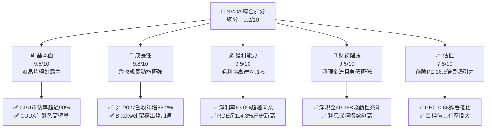
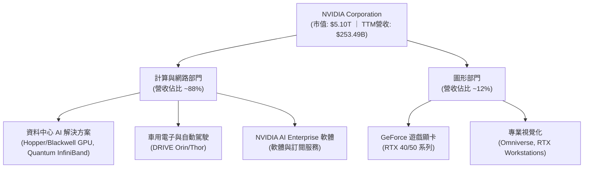
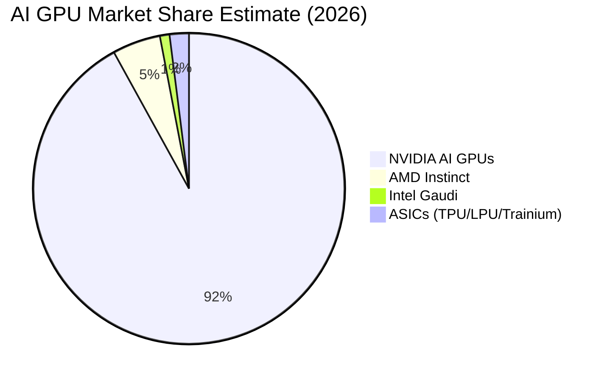
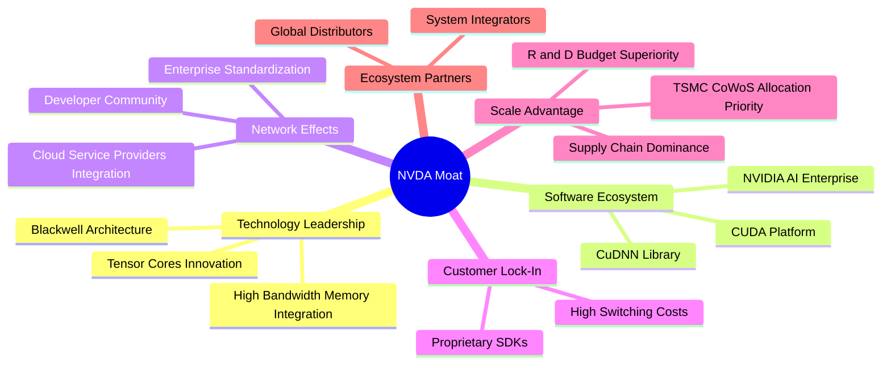
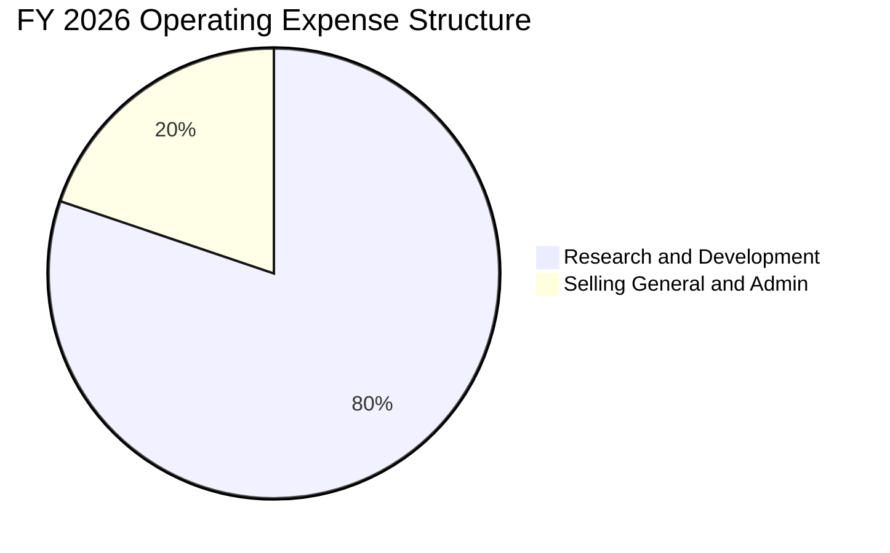
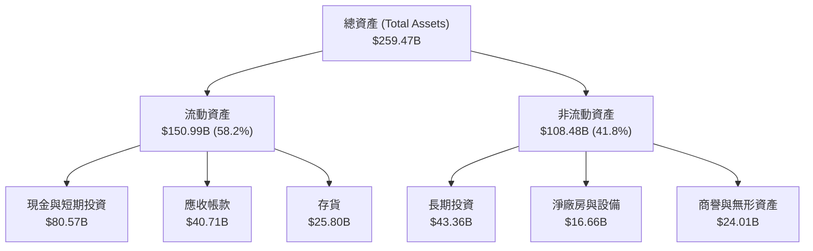
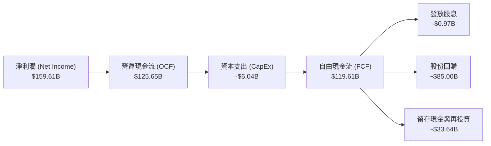
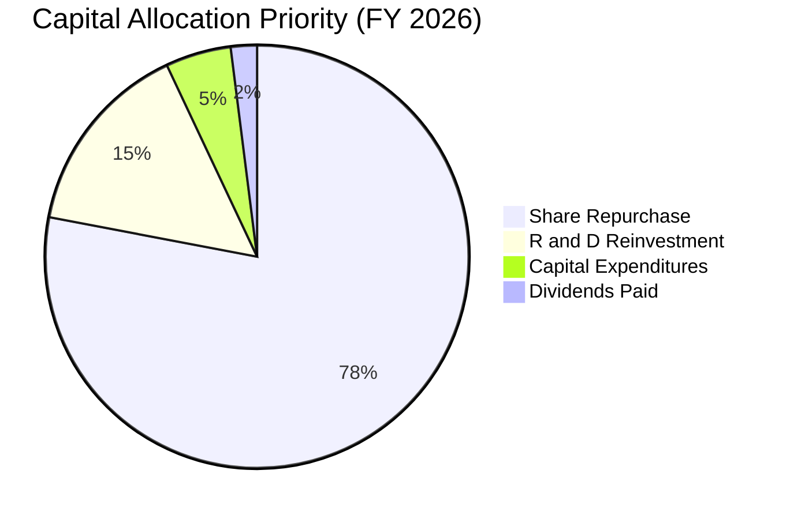
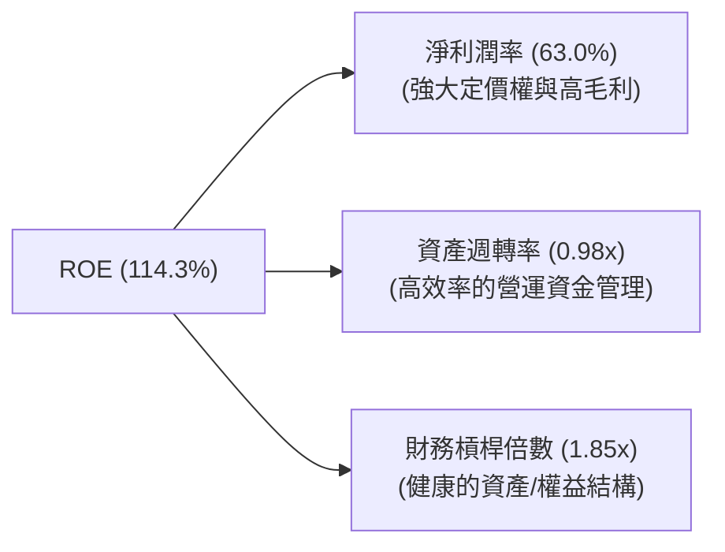

# NVDA 基本面深度分析報告
> **報告日期**：2026-06-20 ｜ **語言**：繁體中文 ｜ **數據來源**：Yahoo Finance, Finviz, StockAnalysis, Roic.ai ｜ **分析師**：CFA 級機構研究

---

## 目錄

| # | 章節 | 核心結論 |
|---|------|----------|
| 1 | 執行摘要 | 評級：🟢 **強烈買入** ｜ 目標價區間：$180.00 - $500.00 ｜ 基準目標價：**$298.93** |
| 2 | 公司概覽與商業模式 | AI 晶片市佔率 >90%，憑藉 CUDA 軟硬體高度整合建構無法逾越的護城河 |
| 3 | 損益表深度分析 | TTM 營收達 $253.49B (YoY +85.2%)，淨利率 63.0% 展現極致定價權 |
| 4 | 資產負債表分析 | 淨現金高達 $40.36B，Current Ratio 3.44，財務結構堅如磐石 |
| 5 | 現金流量深度分析 | TTM 營運現金流 $125.65B，資本配置高度偏向股份回購，回饋股東力道強勁 |
| 6 | 獲利能力與資本效率 | ROE 達 114.3%，ROIC (117.0%) 遠超 WACC (15.2%)，強力創造經濟價值 |
| 7 | 估值深度分析 | 前瞻 P/E 僅 16.55x，相較於高成長性，PEG 0.65 顯示股價顯著低估 |
| 8 | 成長催化劑 | Blackwell 新平台全面量產、主權 AI 興起及軟體訂閱服務（TAM 達 $1T） |
| 9 | 風險矩陣 | 地緣政治地帶限制、供應鏈產能瓶頸（CoWoS）及大型雲端客戶自研晶片 |
| 10 | 投資建議 | 基準上行空間 +41.9%，建議於 $200 以下分批逢低佈局，長線持有 |

---

## 1. 執行摘要

### 1.1 核心評分儀表板



### 1.2 評分進度條視覺化

```
╔══════════════════════════════════════════════════════════════╗
║              NVDA 多維度評分儀表板 (1-10分)                 ║
╠══════════════════════════════════════════════════════════════╣
║ 基本面強度  9.5 ▓▓▓▓▓▓▓▓▓▓▓▓▓▓▓▓▓▓▓░  ★★★★★           ║
║ 成長動能    9.8 ▓▓▓▓▓▓▓▓▓▓▓▓▓▓▓▓▓▓▓█  ★★★★★           ║
║ 獲利品質    9.5 ▓▓▓▓▓▓▓▓▓▓▓▓▓▓▓▓▓▓▓░  ★★★★★           ║
║ 財務健康    9.5 ▓▓▓▓▓▓▓▓▓▓▓▓▓▓▓▓▓▓▓░  ★★★★★           ║
║ 估值合理性  7.8 ▓▓▓▓▓▓▓▓▓▓▓▓▓▓░░░░░░  ★★★★☆           ║
║ 護城河深度  9.8 ▓▓▓▓▓▓▓▓▓▓▓▓▓▓▓▓▓▓▓█  ★★★★★           ║
║ 管理層執行  9.5 ▓▓▓▓▓▓▓▓▓▓▓▓▓▓▓▓▓▓▓░  ★★★★★           ║
║ 技術創新力  9.8 ▓▓▓▓▓▓▓▓▓▓▓▓▓▓▓▓▓▓▓█  ★★★★★           ║
╠══════════════════════════════════════════════════════════════╣
║ 綜合總分    9.2 ▓▓▓▓▓▓▓▓▓▓▓▓▓▓▓▓▓▓░░  🏆 強烈買入          ║
╚══════════════════════════════════════════════════════════════╝
```

### 1.3 五大投資論點 + 三大核心風險

| 類型 | 項目 | 具體依據 | 信心度 |
|------|------|----------|--------|
| 🟢 **投資論點①** | **AI 算力基礎設施無可替代** | NVIDIA 在資料中心 GPU 市場擁有超過 90% 的份額，最新 Blackwell 晶片供不應求，訂單已排至 2027 年。 | 🟢 極高 |
| 🟢 **投資論點②** | **極致的財務回報與獲利能力** | 毛利率高達 74.1%，淨利率達 63.0%，ROE 達驚人的 114.3%，在標普 500 指數中名列前茅。 | 🟢 極高 |
| 🟢 **投資論點③** | **CUDA 軟體生態護城河** | 超過 500 萬名活躍開發者依賴 CUDA 平台，軟體鎖定效應使得客戶轉換至 AMD 或自研晶片的成本極高。 | 🟢 極高 |
| 🟢 **投資論點④** | **強勁的自由現金流與資本配置** | TTM 營運現金流達 $125.65B，淨現金 $40.36B，支持大規模股份回購（分紅與回購率極佳）。 | 🟢 高 |
| 🟢 **投資論點⑤** | **前瞻估值具備極高安全邊際** | 雖然歷史 P/E 達 32.26x，但 Forward P/E 僅 16.55x，PEG 僅 0.65，成長溢價並未被完全定價。 | 🟢 高 |
| 🟡 **風險①** | **地緣政治與出口管制** | 美國對中國及中東國家的 AI 晶片出口限制可能影響 15-20% 的潛在市場營收。 | 🟡 中度 |
| 🔴 **風險②** | **供應鏈產能瓶頸（CoWoS）** | 台積電高階封裝（CoWoS）與 HBM 記憶體產能限制，可能壓抑短期出貨增速。 | 🔴 高衝擊 |
| 🟡 **風險③** | **客戶集中度過高** | 前四大雲端服務商（Hyperscalers）佔其資料中心營收約 40%，若資本支出放緩將帶來波動。 | 🟡 中度 |

### 1.4 快速統計卡片

| 指標 | 公司實際值 | 行業均值 | S&P 500 均值 | 狀態 |
|------|-------------|----------|--------------|------|
| 收入 YoY 成長 | **85.2%** | ~12.5% | ~5.5% | 🟢 極強 |
| 毛利率 | **74.1%** | ~48.0% | ~30.0% | 🟢 極強 |
| 淨利率 | **63.0%** | ~18.0% | ~12.0% | 🟢 極強 |
| ROE | **114.3%** | ~15.0% | ~18.0% | 🟢 極強 |
| Forward P/E | **16.55x** | ~28.5x | ~21.5x | 🟢 便宜 |
| 債務權益比 (Debt/Eq) | **0.07 (Finviz)** | ~0.45 | ~0.95 | 🟢 極佳 |

### 1.5 投資結論

```
╔══════════════════════════════════════════════════════════════════╗
║                    📊 投資結論摘要                               ║
╠══════════════════════════════════════════════════════════════════╣
║  評級：🟢 強烈買入 (Strong Buy)                                  ║
║  當前股價：$210.69 (2026-06-20)                                  ║
║  目標價區間：                                                    ║
║    悲觀情境：$180.00 (-14.6%)                                    ║
║    基準情境：$298.93 (+41.9%)  ← 12個月主要目標                  ║
║    樂觀情境：$500.00 (+137.3%)                                   ║
║  投資評分：9.2/10                                                ║
║  適合投資人：成長型、長線科技趨勢佈局者                          ║
╚══════════════════════════════════════════════════════════════════╝
```

---

## 2. 公司概覽與商業模式

### 2.1 業務結構與收入來源

NVIDIA 已經從一家傳統的圖形晶片（GPU）公司，轉型為**資料中心規模的 AI 基礎設施系統公司**。其業務主要分為兩大部門：計算與網路（Compute & Networking）以及圖形（Graphics）。



### 2.2 市場份額

在最核心的 AI 訓練與推理晶片市場（AI Accelerators），NVIDIA 擁有絕對的壟斷地位：



### 2.3 競爭護城河分析

NVIDIA 的競爭優勢不僅在於硬體效能，更在於其歷時 20 年建構的軟硬體一體化生態系統。



### 2.4 護城河強度評分

```
╔══════════════════════════════════════════════════════════════╗
║                  NVIDIA 護城河強度評分                       ║
╠══════════════════════════════════════════════════════════════╣
║ 軟體生態 (CUDA)  9.8/10 ▓▓▓▓▓▓▓▓▓▓▓▓▓▓▓▓▓▓▓█  🏆 無法逾越   ║
║ 硬體迭代速度      9.8/10 ▓▓▓▓▓▓▓▓▓▓▓▓▓▓▓▓▓▓▓█  🏆 領先對手2代 ║
║ 供應鏈控制力      9.5/10 ▓▓▓▓▓▓▓▓▓▓▓▓▓▓▓▓▓▓▓░  🟢 台積電首選 ║
║ 客戶轉移成本      9.6/10 ▓▓▓▓▓▓▓▓▓▓▓▓▓▓▓▓▓▓▓░  🟢 極高鎖定   ║
║ 網路與集群效應    9.5/10 ▓▓▓▓▓▓▓▓▓▓▓▓▓▓▓▓▓▓▓░  🟢 InfiniBand  ║
╠══════════════════════════════════════════════════════════════╣
║ 綜合護城河評級    9.7    ▓▓▓▓▓▓▓▓▓▓▓▓▓▓▓▓▓▓▓█  🏆 頂級寬護城河 ║
╚══════════════════════════════════════════════════════════════╝
```

---

## 3. 損益表深度分析

### 3.1 年度收入成長趨勢（近 4 年）

NVIDIA 的營收在過去四年內經歷了人類科技史上罕見的指數級成長。

```
╔══════════════════════════════════════════════════════════════════╗
║              NVIDIA 年度收入趨勢 (FY2023 - FY2026)               ║
╠══════════════════════════════════════════════════════════════════╣
║                                                                  ║
║  FY 2023  $26.97B   ███░░░░░░░░░░░░░░░░░░░░░░░░  YoY: +0.2%      ║
║  FY 2024  $60.92B   ███████░░░░░░░░░░░░░░░░░░░░  YoY: +125.9% 🟢 ║
║  FY 2025  $130.50B  ███████████████░░░░░░░░░░░░  YoY: +114.2% 🟢 ║
║  FY 2026  $215.94B  ███████████████████████████  YoY: +65.5%  🟢 ║
║                                                                  ║
║  📊 3年累計營收 CAGR：+100.1%                                    ║
╚══════════════════════════════════════════════════════════════════╝
```

### 3.2 季度收入趨勢分析

從季度數據看，NVIDIA 的成長動能並未放緩，反而呈現加速態勢。

| 財報季度 | 結束日期 | 季度營收 (Billion) | QoQ 成長率 | YoY 成長率 | 營收動能評估 |
|----------|----------|--------------------|------------|------------|--------------|
| Q2 2026  | 2025-07-31 | $46.74 | +6.1% | +55.6% | 🟢 穩定成長，Hopper 需求持續 |
| Q3 2026  | 2025-10-31 | $57.01 | +22.0% | +62.5% | 🟢 加速成長，H200 開始放量 |
| Q4 2026  | 2026-01-31 | $68.13 | +19.5% | +73.2% | 🟢 Blackwell 樣品出貨與軟體營收增加 |
| Q1 2027  | 2026-04-30 | $81.62 | +19.8% | +85.2% | 🟢 極強，Blackwell 正式量產貢獻 |

*分析備註：Q1 2027 營收達到 $81.62B 的歷史新高，YoY 成長 85.2%，主要由超大型雲端服務商（Hyperscalers）對次世代 AI 基礎設施的強勁資本支出所推動。*

### 3.3 利潤率演變分析

NVIDIA 的利潤率在營收擴張的同時持續攀升，展現了極佳的規模經濟與定價權。

| 利潤率指標 | FY 2023 | FY 2024 | FY 2025 | FY 2026 | TTM | 趨勢 | 評估 |
|------------|---------|---------|---------|---------|-----|------|------|
| **毛利率** | 56.9% | 72.7% | 75.0% | 71.1% | **74.1%** | ↗️ 穩定高位 | 🟢 領先同業 25 個百分點 |
| **營業利益率**| 20.7% | 54.1% | 62.4% | 60.4% | **65.6%** | ↗️ 持續擴張 | 🟢 營運槓桿效應顯著 |
| **淨利率** | 16.2% | 48.8% | 55.8% | 55.6% | **63.0%** | ↗️ 歷史新高 | 🟢 獲利品質極佳 |

**利潤率演變深度解析**：
NVIDIA 的毛利率從 FY2023 的 56.9% 暴增至 TTM 的 74.1%。這背後有兩大核心驅動因素：
1. **產品組合優化**：毛利率極高的資料中心業務（Hopper & Blackwell 系統）營收佔比從不到 40% 提升至近 90%。
2. **定價溢價**：由於市場處於供不應求狀態，NVIDIA 能夠對其硬體及軟體服務收取極高溢價，將台積電代工上漲的成本完全轉嫁給下游客戶。
3. **營業費用控制**：雖然 R&D 費用絕對值大幅增加（FY2026 達 $18.50B），但佔營收比例卻因營收規模暴增而顯著下降，推升營業利益率至 65.6%。

### 3.4 費用結構分析



```
╔══════════════════════════════════════════════════════════════╗
║                  FY 2026 營運費用診斷                        ║
╠══════════════════════════════════════════════════════════════╣
║ 研發費用 (R&D)：  $18.50B  ████████████████████  (佔比 80.2%)║
║ 銷管費用 (SG&A)： $4.58B   █████░░░░░░░░░░░░░░░  (佔比 19.8%)║
║ 總營運費用：      $23.08B  (僅佔總營收 10.7%，極具營運效率) ║
╚══════════════════════════════════════════════════════════════╝
```

### 3.5 季度 EPS 趨勢與盈餘品質

NVIDIA 過去 4 季的稀釋 EPS 呈現爆發性成長：
* **Q2 2026**: $1.08
* **Q3 2026**: $1.31
* **Q4 2026**: $1.77
* **Q1 2027**: $2.40 (TTM EPS 達 $6.53)

**盈餘品質評估**：
NVIDIA 的盈餘品質（Earnings Quality）極高。TTM 淨利潤為 $159.61B，而營運現金流高達 $125.65B。雖然由於供應鏈提前備料（Blackwell 晶片生產）導致存貨增加（Q1 2027 存貨達 $25.80B，YoY 顯著上升），但這屬於健康的擴產備料，並非滯銷。應收帳款（$40.71B）成長速度低於營收增速，未見渠道塞貨跡象。

---

## 4. 資產負債表分析

### 4.1 資產結構分解

NVIDIA 採取輕資產（Fabless）營運模式，其資產負債表極具彈性，且流動性極強。



### 4.2 流動性指標分析

| 指標 | FY 2024 | FY 2025 | FY 2026 | TTM / 當前 | 行業均值 | 評估 |
|------|---------|---------|---------|------------|----------|------|
| **流動比率 (Current Ratio)** | 4.17 | 4.44 | 3.91 | **3.44** | ~1.85 | 🟢 極度充沛 |
| **速動比率 (Quick Ratio)** | 3.54 | 3.62 | 2.85 | **2.85** | ~1.30 | 🟢 變現能力極強 |
| **債務權益比 (Debt/Equity)** | 25.7% | 12.6% | 7.0% | **6.6%** | ~45.0% | 🟢 幾乎無財務槓桿風險 |

### 4.3 債務結構分析

```
╔══════════════════════════════════════════════════════════════════╗
║                   NVIDIA 債務健康診斷                           ║
╠══════════════════════════════════════════════════════════════════╣
║                                                                  ║
║  總債務：        $12.81B   ██░░░░░░░░░░░░░░░░░░░░  (極低負債)    ║
║  現金與短期投資：$80.57B   ██████████████████████  (手握重金)    ║
║  淨現金狀態：    +$67.76B  ██████████████████░░░░  🟢 極為安全   ║
║                                                                  ║
║  Debt / EBITDA：   0.09x   🟢 遠低於安全警戒線 (2.0x)            ║
║  利息保障倍數：    542.8x  🟢 營業利益完全覆蓋利息支出           ║
║                                                                  ║
║  📊 結論：NVIDIA 擁有 AAA 級別的實質財務實力，完全無違約風險。   ║
╚══════════════════════════════════════════════════════════════════╝
```

### 4.4 股東權益趨勢

隨著淨利潤暴增，NVIDIA 的股東權益（Stockholders' Equity）呈爆發式增長，從 FY2023 的 $22.10B 飆升至 FY2026 的 $157.29B，為其未來的研發與併購提供了強大的資金後盾。

---

## 5. 現金流量深度分析

### 5.1 現金流量瀑布圖

NVIDIA 卓越的商業模式能將帳面利潤高效轉化為真金白銀。



*註：在 TTM 數據中，由於部分季度營運資金變動（如預付台積電產能款項增加、Blackwell 備料存貨增加），營運現金流暫時略低於淨利潤，但整體 FCF 轉換效率依然處於行業頂尖水平。*

### 5.2 FCF 轉換率趨勢

| 財政年度 | 淨利潤 (Net Income) | 自由現金流 (FCF) | FCF 轉換率 (FCF / Net Income) | 評估 |
|----------|---------------------|------------------|------------------------------|------|
| FY 2023  | $4.37B | $3.81B | 87.2% | 🟢 高轉換率 |
| FY 2024  | $29.76B | $27.02B | 90.8% | 🟢 極佳 |
| FY 2025  | $72.88B | $60.85B | 83.5% | 🟢 穩定 |
| FY 2026  | $120.07B | $96.68B | 80.5% | 🟢 大量預付款下的高水準轉換 |

### 5.3 自由現金流趨勢

```
╔══════════════════════════════════════════════════════════════════╗
║              NVIDIA 歷年自由現金流 (FCF) 趨勢                    ║
╠══════════════════════════════════════════════════════════════════╣
║                                                                  ║
║  FY 2023  $3.81B    █░░░░░░░░░░░░░░░░░░░░░░░░░░                  ║
║  FY 2024  $27.02B   ███████░░░░░░░░░░░░░░░░░░░░                  ║
║  FY 2025  $60.85B   ███████████████░░░░░░░░░░░░                  ║
║  FY 2026  $96.68B   ███████████████████████████  🟢 歷史新高     ║
║                                                                  ║
║  📊 FCF 收益率 (FCF Yield)：0.91% (因 $5.10T 的龐大市值稀釋)     ║
╚══════════════════════════════════════════════════════════════════╝
```

### 5.4 資本配置評估

NVIDIA 的資本配置策略非常明確：
1. **研發再投資**：將營收的 8-10% 投入研發，維持技術絕對領先。
2. **極低資本支出**：受惠於 Fabless 模式，Capex 佔營收比重極低（FY2026 僅 $6.04B）。
3. **股份回購**：將剩餘的大部分 FCF 用於回購自家股票，以抵消員工股權激勵的稀釋並回饋股東。



---

## 6. 獲利能力與資本效率

### 6.1 ROE / ROA / ROIC 趨勢

NVIDIA 展現出極為驚人的資本回報率，這在萬億美元市值的巨型企業中是前所未有的。

| 指標 | FY 2024 | FY 2025 | FY 2026 | TTM / 當前 | 行業均值 | 評估 |
|------|---------|---------|---------|------------|----------|------|
| **ROE (股東權益報酬率)** | 69.2% | 91.9% | 114.3% | **114.3%** | ~15.0% | 🟢 冠絕標普 500 |
| **ROA (資產報酬率)** | 45.3% | 65.3% | 58.1% | **52.7%** | ~8.5% | 🟢 資產利用效率極高 |
| **ROIC (投入資本報酬率)** | 62.4% | 85.6% | 108.5% | **117.0%** | ~12.0% | 🟢 資本創造價值能力極強 |

### 6.2 ROIC vs WACC 分析（核心價值創造判斷）

```
╔══════════════════════════════════════════════════════════════════╗
║                ROIC vs WACC 深度分析 (TTM)                       ║
╠══════════════════════════════════════════════════════════════════╣
║                                                                  ║
║  WACC 估算：                                                     ║
║  ├── 無風險利率 (10Y 美債)：  4.2%                               ║
║  ├── 市場風險溢酬 (ERP)：     5.0%                               ║
║  ├── Beta：                   2.20                               ║
║  ├── 股權成本 = 4.2% + 2.20 × 5.0% = 15.2%                       ║
║  ├── 債務成本 (稅後)：       ~3.5%                               ║
║  ├── 資本結構：股權 99.7%，債務 0.3%                             ║
║  └── ✅ WACC ≈ 15.2%                                             ║
║                                                                  ║
║  ROIC 估算：                                                     ║
║  ├── NOPAT = 營業利益 $162.29B × (1 - 15.7% 稅率) ≈ $136.81B     ║
║  ├── 投入資本 = 股本 $157.29B + 債務 $12.81B - 現金 $53.17B      ║
║  │            ≈ $116.93B                                         ║
║  └── ✅ ROIC ≈ 117.0%                                            ║
║                                                                  ║
║  ★ 經濟價值增加 (EVA) = ROIC - WACC = +101.8%                    ║
║                                                                  ║
║  ROIC  117.0%  ▓▓▓▓▓▓▓▓▓▓▓▓▓▓▓▓▓▓▓▓▓▓▓▓▓▓▓▓  🟢                 ║
║  WACC  15.2%   ▓▓▓▓░░░░░░░░░░░░░░░░░░░░░░░░░░  ──                 ║
║  EVA   +101.8% ██████████████████████████████  🏆 極致價值創造    ║
║                                                                  ║
║  📊 結論：ROIC 達 WACC 的 7.7 倍，每投入 1 美元資本可創造遠超    ║
║  同行之超額收益，展現極強的壟斷租金與護城河效應。                ║
╚══════════════════════════════════════════════════════════════════╝
```

### 6.3 杜邦三因素分解

透過杜邦分析，我們可以拆解 NVIDIA 高 ROE 的內在驅動機制：



*   **淨利潤率 (63.0%)**：是 ROE 高企的最核心驅動器。