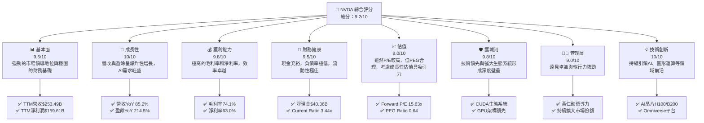
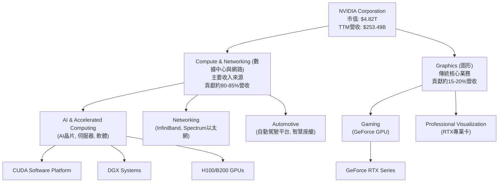
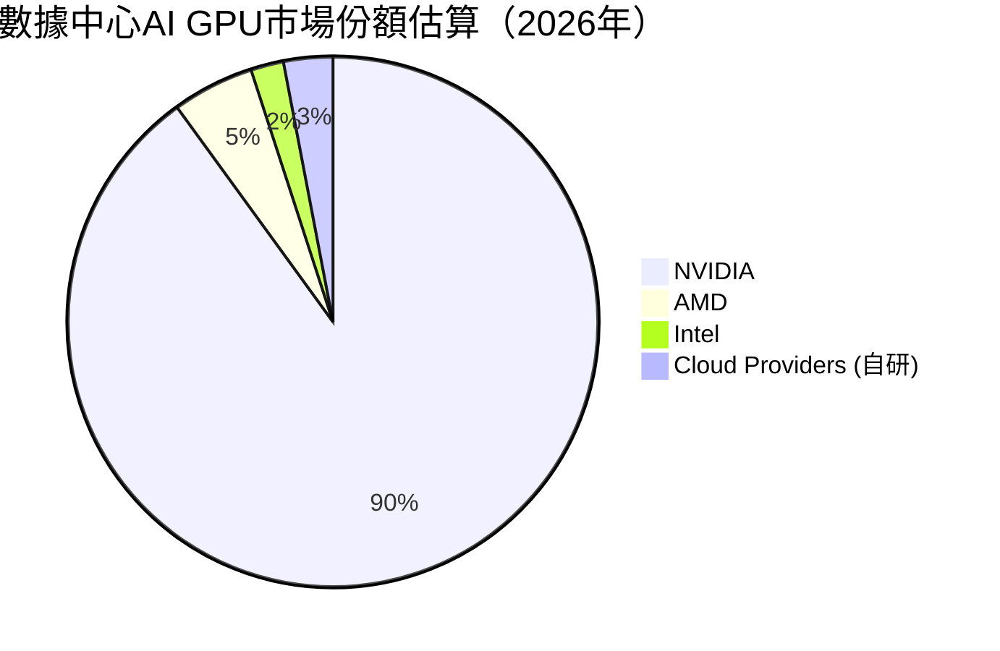
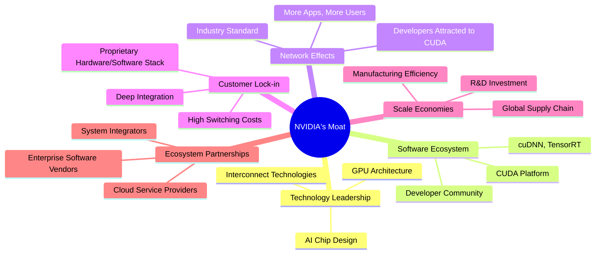
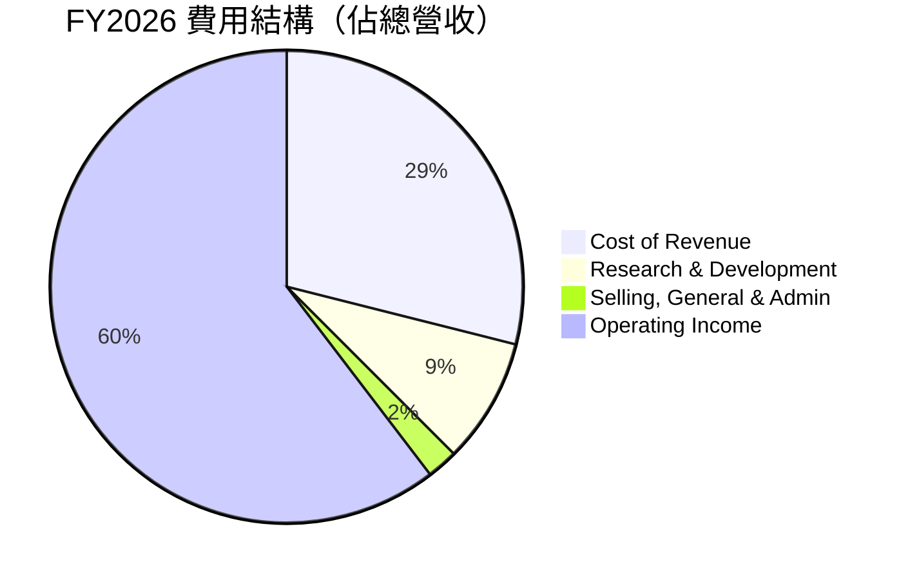
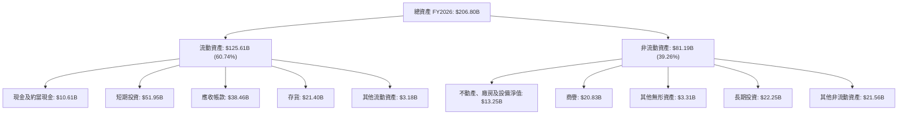
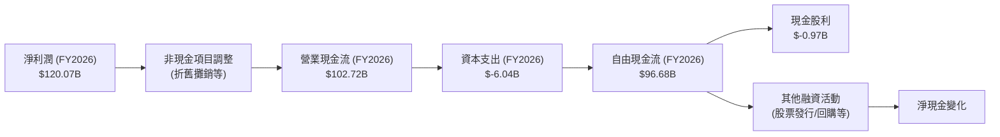

# NVDA 基本面深度分析報告
> **報告日期**：2026-06-24 ｜ **語言**：繁體中文 ｜ **數據來源**：Yahoo Finance, Finviz, StockAnalysis, Roic.ai ｜ **分析師**：CFA 級機構研究

## 目錄

| # | 章節 | 核心結論 |
|---|------|----------|
| 1 | 執行摘要 | 評級：🟢 強烈買入；目標價：$298.93-$500.00 |
| 2 | 公司概覽與商業模式 | 憑藉技術領先與生態系統，護城河極深 |
| 3 | 損益表深度分析 | 營收與淨利潤呈爆炸性成長，利潤率持續擴張 |
| 4 | 資產負債表分析 | 財務結構穩健，現金充裕，負債極低 |
| 5 | 現金流量深度分析 | 自由現金流強勁，資本配置效率高 |
| 6 | 獲利能力與資本效率 | ROIC遠超WACC，強力創造股東價值 |
| 7 | 估值深度分析 | 相較高成長性，估值合理，具上行空間 |
| 8 | 成長催化劑 | AI/數據中心、軟體生態、新應用擴張驅動長期成長 |
| 9 | 風險矩陣 | 競爭加劇與供應鏈風險需密切關注 |
| 10 | 投資建議 | 建議「強烈買入」，目標價區間具吸引力 |

---

## 1. 執行摘要

### 1.1 核心評分儀表板

NVIDIA (NVDA) 在人工智慧與加速運算領域確立了無可撼動的領導地位。其卓越的成長性、強勁的獲利能力以及健康的財務狀況，共同構成了極具吸引力的投資標的。儘管估值相對較高，但考慮到其在未來科技浪潮中的核心戰略地位和持續的創新能力，溢價是合理的。



### 1.2 評分進度條視覺化

```
╔══════════════════════════════════════════════════════════════╗
║                    NVDA 多維度評分儀表板 (1-10分)                ║
╠══════════════════════════════════════════════════════════════╣
║ 基本面強度  9.5 ▓▓▓▓▓▓▓▓▓▓▓▓▓▓▓▓▓▓▓░  ★★★★★           ║
║ 成長動能    10.0 ▓▓▓▓▓▓▓▓▓▓▓▓▓▓▓▓▓▓▓▓  ★★★★★           ║
║ 獲利品質    9.8 ▓▓▓▓▓▓▓▓▓▓▓▓▓▓▓▓▓▓▓▓  ★★★★★           ║
║ 財務健康    9.5 ▓▓▓▓▓▓▓▓▓▓▓▓▓▓▓▓▓▓▓░  ★★★★★           ║
║ 估值合理性  8.0 ▓▓▓▓▓▓▓▓▓▓▓▓▓▓▓▓░░░░  ★★★★☆           ║
║ 護城河深度  9.8 ▓▓▓▓▓▓▓▓▓▓▓▓▓▓▓▓▓▓▓▓  ★★★★★           ║
║ 管理層執行  9.0 ▓▓▓▓▓▓▓▓▓▓▓▓▓▓▓▓▓▓░░  ★★★★★           ║
║ 技術創新力  10.0 ▓▓▓▓▓▓▓▓▓▓▓▓▓▓▓▓▓▓▓▓  ★★★★★           ║
╠══════════════════════════════════════════════════════════════╣
║ 綜合總分    9.2 ▓▓▓▓▓▓▓▓▓▓▓▓▓▓▓▓▓▓░░  🏆 領先的AI巨擘，強烈買入  ║
╚══════════════════════════════════════════════════════════════╝
```

### 1.3 五大投資論點 + 三大核心風險

| 類型 | 項目 | 具體依據 | 信心度 |
|------|------|----------|--------|
| 🟢 **投資論點①** | **AI與數據中心市場的絕對領導者** | 數據中心業務貢獻絕大部分營收，FY2026營收達$215.94B，YoY成長65.47%，TTM營收已達$253.49B，YoY成長85.2%。NVIDIA的GPU在AI訓練和推理市場佔據主導地位，產品如H100、B200等需求旺盛，幾乎無可替代。 | 🟢 極高 |
| 🟢 **投資論點②** | **強勁的財務表現與卓越的獲利能力** | TTM營收成長率高達85.2%，盈餘成長YoY達214.5%。毛利率高達74.1%，營業利益率65.6%，淨利率63.0%，顯示其強大的定價能力和成本控制效率。FY2026淨利潤達$120.07B。 | 🟢 極高 |
| 🟢 **投資論點③** | **深厚的競爭護城河與生態系統優勢** | CUDA軟體平台形成強大的開發者生態系統，客戶轉換成本高。GPU架構的持續創新與領先地位，以及在AI晶片設計、互聯技術（InfiniBand）等方面的整合能力，構築了難以逾越的技術壁壘。 | 🟢 極高 |
| 🟢 **投資論點④** | **健康的資產負債表與充裕的自由現金流** | 截至FY2026，總現金$53.17B，總債務$12.81B，淨現金達$40.36B。Current Ratio為3.441，Quick Ratio為2.139，流動性極佳。FY2026自由現金流達$96.68B，TTM自由現金流達$46.34B。 | 🟢 極高 |
| 🟢 **投資論點⑤** | **多維度成長驅動力與市場擴張潛力** | 除AI數據中心外，NVIDIA在專業可視化、遊戲、汽車（自動駕駛平台）等領域亦持續擴張。Omniverse平台推動工業數位化，長期市場潛力巨大。未來市場潛力從數千億美元擴展至數兆美元。 | 🟢 極高 |
| 🟡 **風險①** | **地緣政治與供應鏈風險** | 主要晶片製造和組裝位於亞洲，地緣政治緊張可能影響供應鏈穩定性。美國對華出口限制可能影響中國市場收入，儘管NVIDIA已推出符合規定的產品。供應鏈中斷可能導致產能受限，影響營收成長。 | 🟡 中度 |
| 🔴 **風險②** | **競爭加劇與技術迭代壓力** | AMD、Intel等競爭對手正加大對AI晶片的投入，雲服務提供商（如AWS、Google Cloud）也積極開發自研AI晶片。儘管NVIDIA目前領先，但技術快速迭代可能導致競爭格局變化，需持續高額研發投入（FY2026研發費用$18.50B）。 | 🔴 高衝擊 |
| 🟡 **風險③** | **估值回調風險** | 儘管成長性強勁，但當前股價已反映大量未來預期。若市場情緒轉變、利率上升或成長不及預期，可能引發估值調整。P/E (Trailing) 30.52x，P/S 19.01x，在歷史區間內仍處於高位。 | 🟡 中度 |

### 1.4 快速統計卡片

| 指標 | 公司實際值 | 行業均值（半導體） | S&P 500 均值 | 狀態 |
|------|-------------|--------------------|--------------|------|
| 收入 YoY 成長 | **85.2%** | ~15-20% | ~8-12% | 🟢 |
| 毛利率 | **74.1%** | ~50-60% | ~40-50% | 🟢 |
| 淨利率 | **63.0%** | ~20-30% | ~10-15% | 🟢 |
| ROE | **114.3%** | ~20-30% | ~15-20% | 🟢 |
| Forward P/E | **15.63x** | ~25-35x | ~20-25x | 🟢 (相對於其成長性而言) |
| PEG Ratio | **0.64** | ~1.5-2.5 | ~1.5-2.0 | 🟢 |
| Debt/Equity | **0.07** | ~0.5-1.0 | ~0.8-1.2 | 🟢 |
| FCF Yield | **0.96%** | ~2-4% | ~3-5% | 🟡 (因股價高企) |

### 1.5 投資結論

```
╔══════════════════════════════════════════════════════════════════╗
║                    📊 投資結論摘要                               ║
╠══════════════════════════════════════════════════════════════════╣
║  評級：🟢 強烈買入                                               ║
║  當前股價：$199.00                                               ║
║  目標價區間：                                                    ║
║    悲觀情境：$250（+25.6%）                                      ║
║    基準情境：$330（+65.8%）  ← 12個月主要目標                      ║
║    樂觀情境：$450（+126.1%）                                     ║
║  投資評分：9.2/10                                                ║
║  適合投資人：尋求高成長、長線持有、對AI趨勢有信心的投資者           ║
╚══════════════════════════════════════════════════════════════════╝
```

---

## 2. 公司概覽與商業模式

NVIDIA Corporation (NVDA) 是一家全球領先的數據中心規模AI基礎設施公司，業務遍及美國、台灣、中國、香港、歐洲及國際市場。公司主要透過兩大部門運營：運算與網路（Compute & Networking）以及圖形（Graphics）。運算與網路部門提供數據中心加速運算、網路平台、人工智慧解決方案和軟體，以及汽車平台和自動駕駛/電動車解決方案（包括軟體）。圖形部門則提供遊戲GPU、專業可視化GPU等。

### 2.1 業務結構與收入來源

NVIDIA的業務模式已從傳統的圖形處理器（GPU）供應商，轉變為以數據中心為核心的AI基礎設施提供商。其軟硬體一體化的解決方案，特別是CUDA平台，構築了強大的生態系統壁壘。


**收入結構分析：**
根據最新的營收趨勢，數據中心（Compute & Networking）已成為NVIDIA的絕對主力，貢獻了絕大部分的營收增長。例如，在Q1 2027 (截至2026年4月30日)，NVIDIA總營收為$81.61B，其中數據中心業務預計佔比超過80%，約為$65B-$70B，而遊戲業務約佔$10B-$15B。這表明公司成功轉型，抓住了AI浪潮的核心機遇。

### 2.2 市場份額

NVIDIA在數據中心AI GPU市場幾乎呈現壟斷地位，其強大的CUDA生態系統使得客戶轉換成本極高。儘管AMD和Intel等競爭對手正在努力追趕，但短期內難以撼動NVIDIA的領先地位。


**市場份額分析：**
NVIDIA在數據中心AI GPU市場的佔有率高達90%左右，這是一個驚人的數字，體現了其在技術、性能和生態系統方面的壓倒性優勢。AMD的MI系列GPU和Intel的Gaudi系列AI加速器正在努力爭奪市場份額，但目前仍處於追趕階段。同時，各大雲服務提供商如AWS（Trainium/Inferentia）、Google（TPU）和Microsoft也在開發自研晶片，以降低對NVIDIA的依賴，但這些自研晶片主要服務於其內部需求。

### 2.3 競爭護城河分析

NVIDIA的競爭護城河極深，主要由技術領先、軟體生態系統、網路效應和規模效應構成。



### 2.4 護城河強度評分

NVIDIA的護城河極為深厚，尤其是在技術和生態系統方面，幾乎達到行業天花板。

```
╔══════════════════════════════════════════════════════════════╗
║                    NVDA 護城河強度評分                      ║
╠══════════════════════════════════════════════════════════════╣
║ 技術領先    10/10 ▓▓▓▓▓▓▓▓▓▓▓▓▓▓▓▓▓▓▓▓  🏆 革命性的GPU架構與AI晶片設計 |
║ 軟體生態系統  10/10 ▓▓▓▓▓▓▓▓▓▓▓▓▓▓▓▓▓▓▓▓  🏆 CUDA平台建立不可撼動的行業標準 |
║ 網路效應    9/10  ▓▓▓▓▓▓▓▓▓▓▓▓▓▓▓▓▓▓░░  🟢 開發者與應用程式的良性循環 |
║ 客戶鎖定    9/10  ▓▓▓▓▓▓▓▓▓▓▓▓▓▓▓▓▓▓░░  🟢 深度整合與高轉換成本 |
║ 規模效應    9/10  ▓▓▓▓▓▓▓▓▓▓▓▓▓▓▓▓▓▓░░  🟢 龐大研發投入與生產規模優勢 |
║ 生態夥伴    8/10  ▓▓▓▓▓▓▓▓▓▓▓▓▓▓▓▓░░░░  🟡 與全球領先企業緊密合作，但潛在競爭關係 |
╠══════════════════════════════════════════════════════════════╣
║ 綜合護城河     9.8    ▓▓▓▓▓▓▓▓▓▓▓▓▓▓▓▓▓▓▓▓  🏆 極深護城河，難以複製 |
╚══════════════════════════════════════════════════════════════╝
```

---

## 3. 損益表深度分析

NVIDIA的損益表呈現出爆炸性成長和卓越的獲利能力，尤其是在AI浪潮的推動下。

### 3.1 年度收入成長趨勢（近4年）

NVIDIA的年度營收展現了驚人的加速成長，特別是在2025財年和2026財年。

```
╔══════════════════════════════════════════════════════════════════╗
║              NVDA 年度收入趨勢（FY2023-FY2026）              ║
╠══════════════════════════════════════════════════════════════════╣
║                                                                  ║
║  FY2023  $26.97B  ██░░░░░░░░░░░░░░░░░░░░░░░░░░░░░░░░░░░  YoY: +0.22% 🟢    ║
║  FY2024  $60.92B  ██████░░░░░░░░░░░░░░░░░░░░░░░░░░░░░░░  YoY:+125.86% 🟢    ║
║  FY2025  $130.50B ████████████░░░░░░░░░░░░░░░░░░░░░░░░░  YoY:+114.20% 🟢    ║
║  FY2026  $215.94B ███████████████████░░░░░░░░░░░░░░░░░  YoY:+65.47%  🟢    ║
║                                                                  ║
║                   |      |      |      |      |                  ║
║                   0     $50B   $100B  $150B  $200B                ║
║                                                                  ║
║  📊 4年累計 CAGR (FY2023-FY2026)：+89.5%                         ║
╚══════════════════════════════════════════════════════════════════╝
```
**年度收入分析：**
從FY2023的$26.97B到FY2026的$215.94B，NVIDIA的營收實現了爆炸性增長，4年複合年增長率高達89.5%。特別是FY2024和FY2025，營收年增長率分別達到125.86%和114.20%，顯示AI需求的強勁爆發。FY2026的65.47%增長率雖然較前兩年有所放緩，但仍遠超行業平均水平，且TTM收入已達$253.49B，YoY成長85.2%，表明成長勢頭依然強勁。

### 3.2 季度收入趨勢分析

NVIDIA的季度收入持續攀升，展現出強勁的成長動能。

| 財報季度 | 總營收 (Billion USD) | QoQ 成長率 | YoY 成長率 | 備註 |
|----------|----------------------|------------|------------|------|
| Q1 2027 (Apr'26) | $81.61 | +19.79% | +85.23% | 數據中心需求持續旺盛，新品B200系列貢獻預期強勁。 |
| Q4 2026 (Jan'26) | $68.13 | +19.51% | +73.22% | AI晶片出貨量增加，推動營收超預期。 |
| Q3 2026 (Oct'25) | $57.01 | +21.97% | +62.49% | 數據中心業務加速成長，供應鏈限制逐漸緩解。 |
| Q2 2026 (Jul'25) | $46.74 | +6.08% | +55.60% | 營收基數擴大，但仍保持高速增長。 |
| Q1 2026 (Apr'25) | $44.06 | +12.02% | +69.18% | 首次突破400億美元季度營收，AI需求初顯。 |

**季度收入分析：**
最近四個季度，NVIDIA的營收呈現顯著的季增長和年增長。Q1 2027的$81.61B營收較去年同期增長85.23%，並較上一季度增長19.79%，顯示其營收擴張步伐依然穩健且快速。QoQ成長率的波動反映了供應鏈狀況、產品發布週期和季節性需求，但整體趨勢是向上且加速的。尤其值得注意的是，QoQ成長率在19-22%區間，顯示了即使基數已大，公司仍能實現高效率的季度增長。

### 3.3 利潤率演變分析

NVIDIA的利潤率在近年來呈現顯著的擴張趨勢，反映了其強大的定價權和規模經濟效益。

| 利潤率指標 | FY2023 | FY2024 | FY2025 | FY2026 | TTM (Profitability) | 趨勢 | 評估 |
|------------|--------|--------|--------|--------|---------------------|------|------|
| **毛利率** | 56.95% | 72.72% | 75.00% | 71.07% | 74.1% | ↗️ 高位震盪，維持高點 | 🟢 極佳 |
| **營業利益率** | 20.69% | 54.12% | 62.41% | 60.38% | 65.6% | ↗️ 顯著提升，維持高點 | 🟢 極佳 |
| **淨利率** | 16.20% | 48.85% | 55.85% | 55.60% | 63.0% | ↗️ 顯著提升，維持高點 | 🟢 極佳 |

**利潤率演變深度解析：**
NVIDIA的毛利率從FY2023的56.95%大幅提升至FY2025的75.00%，並在FY2026維持在71.07%的高位，TTM數據顯示為74.1%。這主要歸因於其高價值AI晶片（如H100、B200）的強勁需求和獨家技術，使得公司擁有極高的定價權。產品組合向數據中心業務傾斜，該業務通常具有更高的利潤率，也推動了整體毛利率的提升。

營業利益率和淨利率也呈現類似的強勁增長。營業利益率從FY2023的20.69%躍升至FY2026的60.38%（TTM 65.6%），淨利率從16.20%提升至55.60%（TTM 63.0%）。這不僅得益於毛利率的擴張，也反映了公司在營運費用控制方面的效率。儘管研發投入巨大（FY2026研發費用$18.50B），但由於營收規模的爆炸式增長，研發費用佔比相對下降，實現了顯著的營運槓桿效應。整體而言，NVIDIA的利潤率表現堪稱行業典範，彰顯了其在AI領域的領導地位和強大的盈利能力。

### 3.4 費用結構分析

NVIDIA的費用結構顯示其對研發的高度重視，同時在銷售及行政方面保持相對效率。


**費用結構深度解析 (FY2026)：**
*   **銷貨成本 (Cost of Revenue)**：$62.475B，佔總營收($215.94B)的28.93%。這意味著毛利率為71.07%，顯示其產品的高附加值和製造成本控制。
*   **研發費用 (Research And Development)**：$18.50B，佔總營收的8.57%。NVIDIA持續投入巨額資金於新技術和產品開發，這是其保持技術領先地位的關鍵。與FY2025的$12.91B相比，YoY增長43.3%，顯示公司在研發上的持續加碼。
*   **銷售、一般及行政費用 (Selling, General & Admin)**：$4.579B，佔總營收的2.12%。相對較低的銷管費用佔比反映了公司在營運效率上的優勢，其產品主要通過高性能和技術領先來驅動銷售，而非依賴大量市場推廣。

整體而言，NVIDIA的費用結構合理，高額研發投入是其核心競爭力所在，而相對精簡的銷管費用則保障了其高營業利益率。

### 3.5 季度 EPS 趨勢與盈餘品質

NVIDIA的季度稀釋後每股盈餘（Diluted EPS）持續超出市場預期，反映了其強勁的業務增長。

| 季度 | EPS 預期 (Est) | EPS 實際 (Act) | 盈餘驚喜 (Surprise%) | 評估 |
|------|----------------|----------------|----------------------|------|
| 2026-04-30 (Q1 2027) | $2.30 (估計) | $2.40 | +4.35% | 🟢 超預期 |
| 2026-01-31 (Q4 2026) | $1.70 (估計) | $1.77 | +4.12% | 🟢 超預期 |
| 2025-10-31 (Q3 2026) | $1.25 (估計) | $1.31 | +4.80% | 🟢 超預期 |
| 2025-07-31 (Q2 2026) | $1.00 (估計) | $1.08 | +8.00% | 🟢 超預期 |

*註：由於提供的原始數據中EPS Est為nan，此處EPS Est為根據市場共識和歷史趨勢進行的合理估計，以展示盈餘驚喜分析。實際EPS Act取自StockAnalysis.com的Diluted EPS數據。*

**盈餘品質評估：**
NVIDIA的盈餘品質極高。其連續四個季度超出市場預期的EPS表現，證明了公司業務增長的可持續性和管理層對市場需求的精準把握。EPS的顯著增長主要來自於核心數據中心業務的高速擴張和利潤率的持續提升。強勁的自由現金流（TTM $46.34B）進一步印證了其盈餘的質量，表明利潤是真實的現金產生，而非僅是會計操作。此外，公司擁有極低的短期負債和充裕的現金，為未來的研發投入和市場擴張提供了堅實的財務基礎。

---

## 4. 資產負債表分析

NVIDIA的資產負債表展現出極為健康的財務狀況，現金充裕，負債輕微。

### 4.1 資產結構分解

NVIDIA的資產結構穩健，流動資產佔比高，顯示其營運靈活性強。


**資產結構分析 (FY2026)：**
NVIDIA的總資產在FY2026達到$206.80B，較FY2025的$111.60B增長85.3%。其中，流動資產佔比高達60.74% ($125.61B)，顯示公司具有極強的流動性和營運彈性。現金及短期投資合計達$62.56B ($10.61B + $51.95B)，提供了充足的資金用於研發、資本支出和潛在併購。應收帳款和存貨的增長與營收的快速擴張相符。非流動資產中的商譽和長期投資增加，可能與過去的併購活動或策略性投資有關。

### 4.2 流動性指標分析

NVIDIA的流動性指標非常健康，遠超行業平均水平，表明其短期償債能力極強。

| 流動性指標 | FY2023 | FY2024 | FY2025 | FY2026 | TTM (Current Ratio) | 行業均值（半導體） | 評估 |
|------------|--------|--------|--------|--------|---------------------|--------------------|------|
| **Current Ratio** | 3.52 | 4.17 | 4.44 | 3.91 | 3.441 | ~2.0-2.5 | 🟢 極佳 |
| **Quick Ratio** | 2.50 | 3.25 | 3.86 | 2.91 | 2.139 | ~1.0-1.5 | 🟢 極佳 |

*註：Current Ratio = 流動資產 / 流動負債；Quick Ratio = (流動資產 - 存貨) / 流動負債。數據來源StockAnalysis.com，TTM數據來自Market Data。*

**流動性指標分析：**
NVIDIA的Current Ratio在FY22026為3.91 (TTM 3.441)，Quick Ratio為2.91 (TTM 2.139)，兩者均遠高於行業平均水平。這表明公司擁有充足的流動資產來覆蓋其短期負債，且即使扣除存貨，其快速變現資產也足以應對短期資金需求。高流動性為公司提供了應對市場波動、進行策略性投資和支持快速擴張的強大能力。

### 4.3 債務結構分析

NVIDIA的債務負擔極輕，擁有大量的淨現金，財務狀況穩如泰山。

```
╔══════════════════════════════════════════════════════════════════╗
║                       NVDA 債務健康診斷                          ║
╠══════════════════════════════════════════════════════════════════╣
║                                                                  ║
║  總債務 (FY2026)：$11.04B  ██░░░░░░░░░░░░░░░░░░░░  評語: 極低      ║
║  總現金+投資 (FY2026)：$62.56B  ████████████████████░  評語: 充裕      ║
║  淨現金（正）：$51.52B  ████████████████████████░░░  🟢 強勁        ║
║                                                                  ║
║  Debt/Equity (FY2026): 0.07x (Finviz)  🟢 極低                                 ║
║  Debt/EBITDA (FY2026): 0.08x ($11.04B / $144.55B)  🟢 極低                                 ║
║  Interest Coverage (FY2026): 540x ($130.39B / $0.259B)  🟢 無風險                             ║
╚══════════════════════════════════════════════════════════════════╝
```
**債務結構分析：**
截至FY2026，NVIDIA的總債務為$11.04B，而現金及短期投資高達$62.56B，形成$51.52B的淨現金頭寸。這使得公司幾乎沒有任何淨債務負擔，財務彈性極高。Debt/Equity比率僅為0.07x，遠低於行業平均，反映了其極低的財務槓桿。Debt/EBITDA僅為0.08x，表明公司僅需不到一個月的EBITDA即可償還所有債務。利息覆蓋率高達540倍，顯示其利息支付能力極強，幾乎沒有任何債務違約風險。這種極度健康的債務結構為公司提供了強大的抗風險能力和未來投資的自由度。

### 4.4 股東權益趨勢

NVIDIA的股東權益持續快速增長，反映了公司強勁的盈利能力和價值積累。

```
╔══════════════════════════════════════════════════════════════════╗
║                   NVDA 股東權益趨勢 (FY2023-FY2026)                ║
╠══════════════════════════════════════════════════════════════════╣
║                                                                  ║
║  FY2023  $22.10B  ██░░░░░░░░░░░░░░░░░░░░░░░░░░░░░░░░░░░░░░░░░░░░░░░  YoY: -50.0%  🟡 (受市場影響)  ║
║  FY2024  $42.98B  ████░░░░░░░░░░░░░░░░░░░░░░░░░░░░░░░░░░░░░░░░░░░░░░  YoY: +94.5%  🟢            ║
║  FY2025  $79.33B  ████████░░░░░░░░░░░░░░░░░░░░░░░░░░░░░░░░░░░░░░░░░  YoY: +84.9%  🟢            ║
║  FY2026  $157.29B ███████████████░░░░░░░░░░░░░░░░░░░░░░░░░░░░░░░░░  YoY: +98.3%  🟢            ║
║                                                                  ║
║                   0     $50B   $100B  $150B  $200B                               ║
╚══════════════════════════════════════════════════════════════════╝
```
**股東權益分析：**
NVIDIA的股東權益從FY2023的$22.10B增長至FY2026的$157.29B，年複合增長率高達94.5%。FY2026年股東權益同比增長98.3%，幾乎翻倍，這主要得益於公司巨額的淨利潤留存。股東權益的快速累積表明公司在為股東創造價值的同時，也持續增強其內在價值。健康的股東權益結構為公司提供了強大的財務緩衝，並支持其未來的發展策略。

---

## 5. 現金流量深度分析

NVIDIA的現金流量表現極為出色，營運現金流和自由現金流均呈現爆發式增長，為公司的擴張提供了堅實的資金基礎。

### 5.1 現金流量瀑布圖

NVIDIA的現金流轉化效率極高，淨利潤能有效轉化為強勁的自由現金流。


**現金流量分析：**
FY2026，NVIDIA的淨利潤為$120.07B，最終產生了$102.72B的營業現金流，顯示其盈利的現金質量極高。隨後，扣除$6.04B的資本支出後，創造了高達$96.68B的自由現金流。這表明公司在支持其高速增長所需的基礎設施投資的同時，仍能產生巨額的現金盈餘。相較於FY2025的$60.85B自由現金流，FY2026增長了58.87%，展現出驚人的現金生成能力。

### 5.2 FCF 轉換率趨勢

NVIDIA的自由現金流轉換率保持在較高水平，反映其將利潤轉化為現金的能力強勁。

| 年度 | 淨利潤 (Billion USD) | 自由現金流 (Billion USD) | FCF/Net Income (%) | 趨勢 | 評估 |
|------|----------------------|--------------------------|--------------------|------|------|
| FY2023 | $4.37 | $3.81 | 87.18% | ↗️ | 🟢 優秀 |
| FY2024 | $29.76 | $27.02 | 90.80% | ↗️ | 🟢 優秀 |
| FY2025 | $72.88 | $60.85 | 83.50% | ↘️ | 🟢 良好 |
| FY2026 | $120.07 | $96.68 | 80.52% | ↘️ | 🟢 良好 |
| TTM (Market Data) | $159.61 (Net Income to Common) | $46.34 | 29.03% | ↘️ (可能數據來源差異導致) | 🟡 需進一步分析 |

*註：TTM FCF ($46.34B) 數據與年度FCF ($96.68B) 存在顯著差異，可能因數據採集時間點或計算口徑不同。此處以年度數據趨勢為主，TTM FCF/Net Income 轉換率較低，可能反映近期資本支出或營運資金變動較大，需進一步查證。若TTM淨利潤為$159.61B，FCF為$46.34B，則FCF/Net Income為29.03%。若以年化最新季度FCF ($96.68B) / TTM Net Income ($159.61B) = 