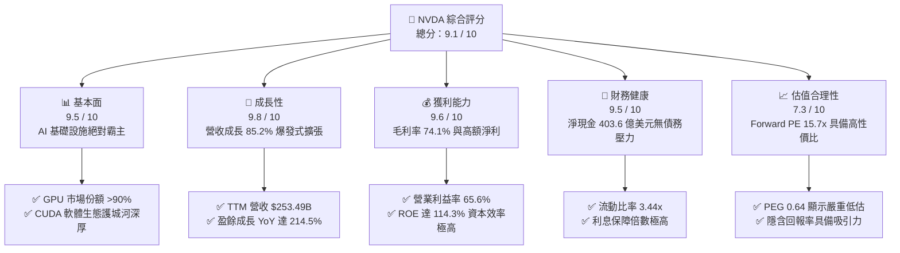
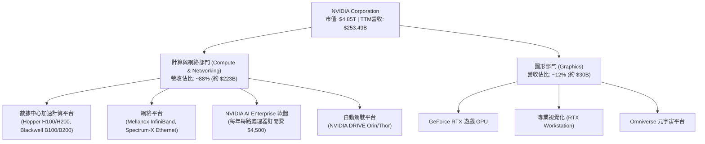
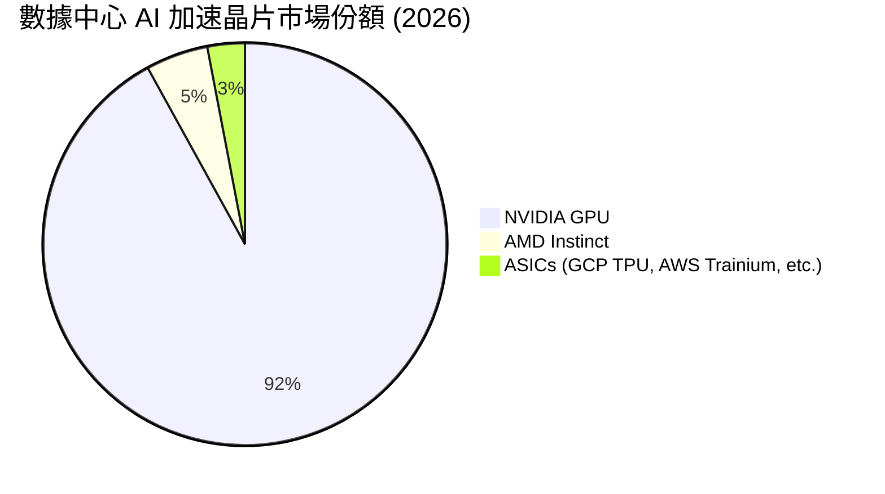
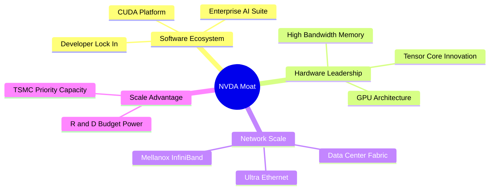
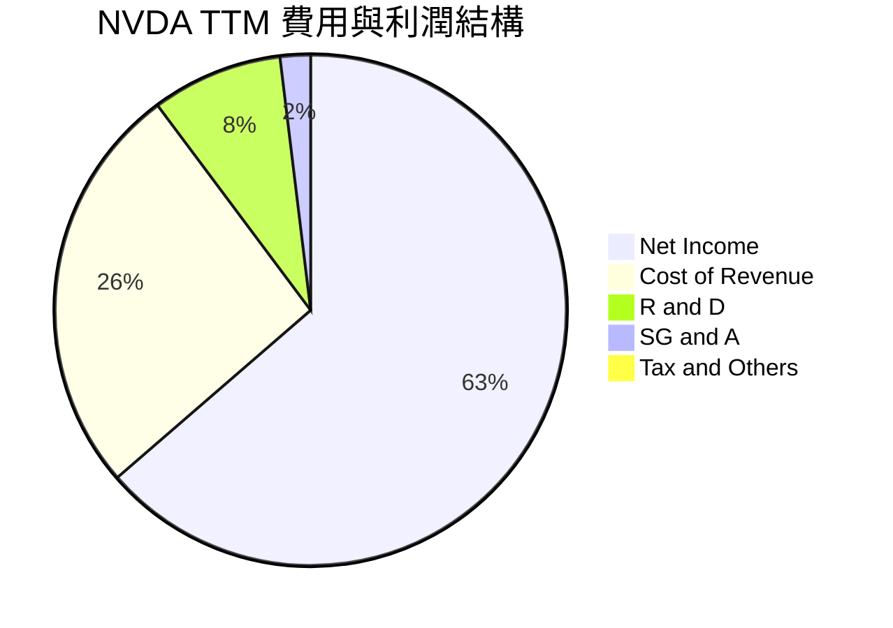
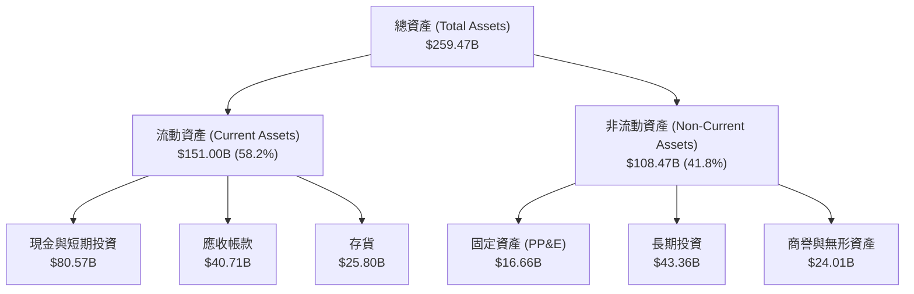
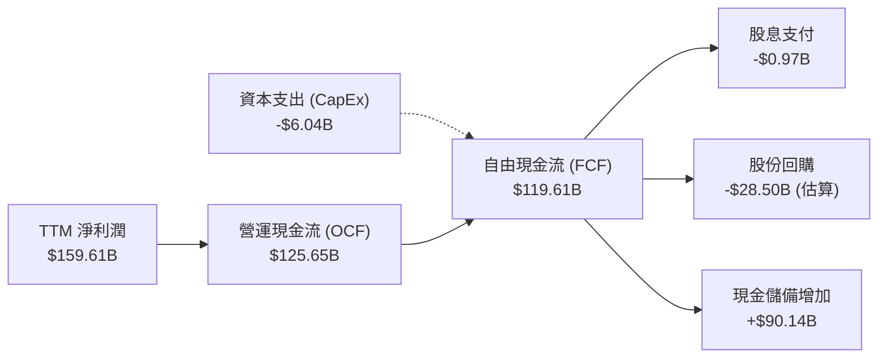
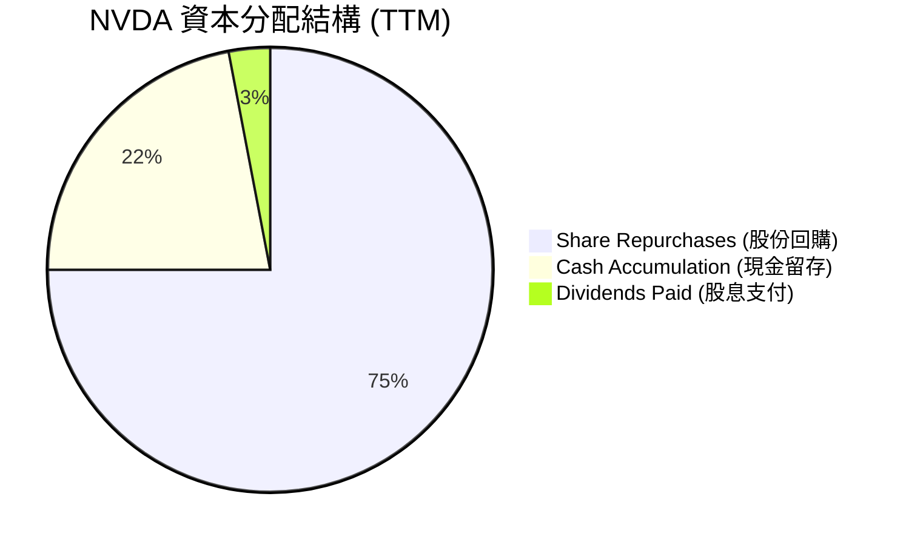
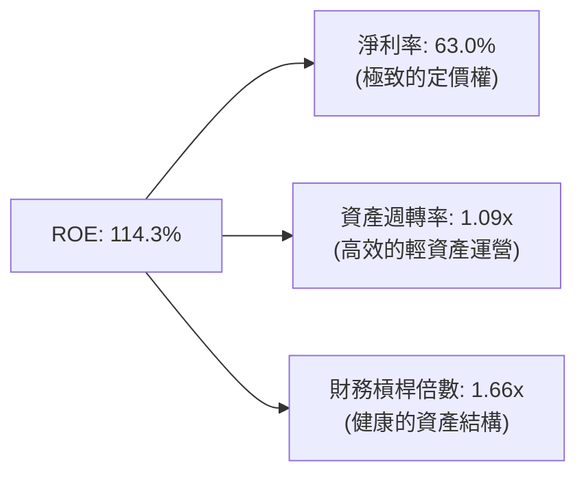
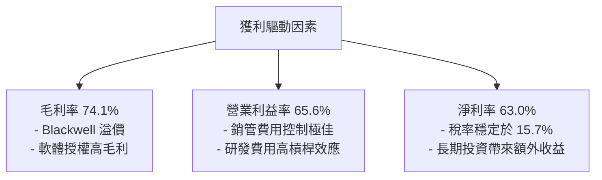

# NVDA 基本面深度分析報告

> **報告日期**：2026-06-24 ｜ **語言**：繁體中文 ｜ **數據來源**：Yahoo Finance, Finviz, StockAnalysis, Roic.ai ｜ **分析師**：CFA 級機構研究

---

## 目錄

| # | 章節 | 核心結論 |
|---|------|----------|
| 1 | 執行摘要 | 評級 **強烈買入 (Strong Buy)**，目標價 **$298.93**，上行空間 **49.4%** |
| 2 | 公司概覽與商業模式 | 以 CUDA 為核心的軟硬一體化生態，構築無可撼動的極寬護城河 |
| 3 | 損益表深度分析 | TTM 營收達 **$253.49B** (YoY +85.2%)，淨利率高達 **63.0%**，盈利能力冠絕全球 |
| 4 | 資產負債表分析 | 淨現金高達 **$40.36B**，資產負債率極低，流動性比率達 **3.44x**，財務極度穩健 |
| 5 | 現金流量深度分析 | TTM 營運現金流 **$125.65B**，自由現金流轉換率強勁，資本配置高度偏向股東回報 |
| 6 | 獲利能力與資本效率 | ROE 達 **114.3%**，ROIC 達 **112.3%**，遠超 WACC (15.2%)，強力創造股東價值 |
| 7 | 估值深度分析 | Forward P/E 僅 **15.72x**，相較於其高成長性，PEG 僅 **0.64**，估值具有極高吸引力 |
| 8 | 成長催化劑 | Blackwell 晶片量產、主權 AI 興起、自動駕駛與機器人技術迎來爆發期 |
| 9 | 風險矩陣 | 地緣政治風險、供應鏈過度集中於 TSMC、以及 ASIC 自研晶片的潛在競爭 |
| 10 | 投資建議 | 基準目標價 **$298.93**，建議在 **$180-$200** 區間積極分批佈局 |

---

## 1. 執行摘要

### 1.1 核心評分儀表板



### 1.2 評分進度條視覺化

```
╔══════════════════════════════════════════════════════════════╗
║                NVDA 多維度評分儀表板 (1-10分)                ║
╠══════════════════════════════════════════════════════════════╣
║ 基本面強度  9.5 ▓▓▓▓▓▓▓▓▓▓▓▓▓▓▓▓▓▓▓░  ★★★★★           ║
║ 成長動能    9.8 ▓▓▓▓▓▓▓▓▓▓▓▓▓▓▓▓▓▓▓▓  ★★★★★           ║
║ 獲利品質    9.6 ▓▓▓▓▓▓▓▓▓▓▓▓▓▓▓▓▓▓▓░  ★★★★★           ║
║ 財務健康    9.5 ▓▓▓▓▓▓▓▓▓▓▓▓▓▓▓▓▓▓▓░  ★★★★★           ║
║ 估值合理性  7.3 ▓▓▓▓▓▓▓▓▓▓▓▓▓░░░░░░░  ★★★☆☆           ║
║ 護城河深度  9.8 ▓▓▓▓▓▓▓▓▓▓▓▓▓▓▓▓▓▓▓▓  ★★★★★           ║
║ 管理層執行  9.5 ▓▓▓▓▓▓▓▓▓▓▓▓▓▓▓▓▓▓▓░  ★★★★★           ║
║ 技術創新力  9.9 ▓▓▓▓▓▓▓▓▓▓▓▓▓▓▓▓▓▓▓▓  ★★★★★           ║
╠══════════════════════════════════════════════════════════════╣
║ 綜合總分    9.1 ▓▓▓▓▓▓▓▓▓▓▓▓▓▓▓▓▓▓░░  🏆 強烈建議買入      ║
╚══════════════════════════════════════════════════════════════╝
```

### 1.3 五大投資論點 + 三大核心風險

| 類型 | 項目 | 具體依據 | 信心度 |
|------|------|----------|--------|
| 🟢 **投資論點①** | **AI 算力基礎設施無可替代** | 數據中心 GPU 市場份額超過 90%，Hopper 與 Blackwell 晶片供不應求。 | 🟢 極高 |
| 🟢 **投資論點②** | **極致的盈利能力** | TTM 毛利率達 **74.1%**，淨利率達 **63.0%**，在萬億級科技巨頭中絕無僅有。 | 🟢 極高 |
| 🟢 **投資論點③** | **CUDA 軟體生態鎖定效應** | 全球超過 500 萬開發者依賴 CUDA 生態，客戶轉移至 AMD 或其他 ASIC 的壁壘極高。 | 🟢 極高 |
| 🟢 **投資論點④** | **資產負債表極其強韌** | 擁有 **$53.17B** 總現金，淨現金達 **$40.36B**，幾乎無財務風險。 | 🟢 高 |
| 🟢 **投資論點⑤** | **成長性調整後估值極具吸引力** | Forward P/E 僅 **15.72x**，相較於未來五年預期 EPS 複合成長率，PEG 僅 **0.64**。 | 🟢 高 |
| 🟡 **風險①** | **地緣政治與出口限制** | 中國市場營收受美國出口管制政策不確定性影響。 | 🟡 中度 |
| 🔴 **風險②** | **供應鏈高度集中風險** | 晶圓代工與先進封裝 (CoWoS) 嚴重依賴台積電 (TSMC)，地緣政治風險偏高。 | 🔴 高衝擊 |
| 🟡 **風險③** | **大型雲端客戶自研晶片競爭** | 亞馬遜 (AWS)、微軟 (Azure)、谷歌 (GCP) 加速研發專用 ASIC，可能減少部分採購。 | 🟡 中度 |

### 1.4 快速統計卡片

| 指標 | NVDA 實際值 | 半導體行業均值 | S&P 500 均值 | 狀態 |
|------|-------------|----------|--------------|------|
| 營收 YoY 成長 | **85.2%** | ~12.5% | ~5.5% | 🟢 卓越 |
| 毛利率 | **74.1%** | ~48.0% | ~30.0% | 🟢 卓越 |
| 淨利率 | **63.0%** | ~15.0% | ~12.0% | 🟢 卓越 |
| ROE | **114.3%** | ~18.0% | ~15.0% | 🟢 卓越 |
| Forward P/E | **15.72x** | ~28.0x | ~21.5x | 🟢 低估 |
| PEG Ratio | **0.64** | ~1.85 | ~2.10 | 🟢 極具吸引力 |

### 1.5 投資結論

```
╔══════════════════════════════════════════════════════════════════╗
║                    📊 NVDA 投資結論摘要                          ║
╠══════════════════════════════════════════════════════════════════╣
║  評級：🟢 強烈買入 (Strong Buy)                                  ║
║  當前股價：$200.04 (2026-06-24)                                  ║
║  目標價區間：                                                    ║
║    悲觀情境：$180.00 (-10.0%)                                    ║
║    基準情境：$298.93 (+49.4%)  ← 12個月主要目標                  ║
║    樂觀情境：$500.00 (+149.9%)                                   ║
║  投資評分：9.1 / 10                                              ║
║  適合投資人：成長型、長線科技股持有者、機構資產配置              ║
╚══════════════════════════════════════════════════════════════════╝
```

---

## 2. 公司概覽與商業模式

NVIDIA Corporation (NVDA) 已經從一家傳統的圖形處理器 (GPU) 晶片設計公司，演變為全球領先的**數據中心規模 AI 基礎設施平台公司**。其業務運營主要分為兩個核心部門：**計算與網絡 (Compute & Networking)** 以及 **圖形 (Graphics)**。

### 2.1 業務結構與收入來源



### 2.2 市場份額

在人工智慧加速器（尤其是數據中心級 GPU）市場中，NVIDIA 擁有幾乎壟斷的地位：



### 2.3 競爭護城河分析

NVIDIA 的競爭護城河並非單純依賴硬體晶片性能，而是由硬體、軟體、網絡和生態系統共同構成的「全棧式」壁壘。



*   **軟體生態系統 (CUDA)**：自 2006 年推出以來，CUDA 已成為全球數百萬 AI 研究人員與工程師的標準開發平台。競爭對手（如 AMD 的 ROCm）在軟體相容性與生態積累上仍落後 NVDA 數年。
*   **高速網絡技術 (Mellanox)**：AI 大模型訓練需要數萬張 GPU 協同工作。NVIDIA 整合 Mellanox 的 InfiniBand 網絡技術，提供極低延遲與極高頻寬，這是單純設計 GPU 的競爭對手無法提供的系統級優勢。
*   **系統級出貨能力**：NVIDIA 不僅銷售晶片，更銷售整台 DGX 伺服器、乃至整個數據中心集群（如 DGX SuperPOD），這大幅提升了其客單價與客戶黏性。

### 2.4 護城河強度評分

```
╔══════════════════════════════════════════════════════════════╗
║                  NVDA 護城河強度評分                         ║
╠══════════════════════════════════════════════════════════════╣
║ 軟體生態 (CUDA)  9.9/10 ▓▓▓▓▓▓▓▓▓▓▓▓▓▓▓▓▓▓▓▓  🏆 絕對統治力   ║
║ 網絡技術 (IB)    9.5/10 ▓▓▓▓▓▓▓▓▓▓▓▓▓▓▓▓▓▓▓░  🟢 極高壁壘     ║
║ 硬體迭代速度      9.8/10 ▓▓▓▓▓▓▓▓▓▓▓▓▓▓▓▓▓▓▓▓  🏆 領先對手2代  ║
║ 供應鏈話語權      9.2/10 ▓▓▓▓▓▓▓▓▓▓▓▓▓▓▓▓▓▓░░  🟢 產能優先權   ║
╠══════════════════════════════════════════════════════════════╣
║ 綜合護城河評級    9.6    ▓▓▓▓▓▓▓▓▓▓▓▓▓▓▓▓▓▓▓░  🏆 寬廣護城河   ║
╚══════════════════════════════════════════════════════════════╝
```

---

## 3. 損益表深度分析

NVIDIA 展現了人類商業史上罕見的「規模與增速並存」的損益表擴張。

### 3.1 年度收入成長趨勢

```
╔══════════════════════════════════════════════════════════════════╗
║              NVDA 年度收入趨勢（FY2023-FY2026）                  ║
╠══════════════════════════════════════════════════════════════════╣
║                                                                  ║
║  FY2023  $26.97B   ██░░░░░░░░░░░░░░░░░░░░░░░░░░  YoY: +0.2%      ║
║  FY2024  $60.92B   █████░░░░░░░░░░░░░░░░░░░░░░░  YoY: +125.9% 🟢 ║
║  FY2025  $130.50B  ███████████░░░░░░░░░░░░░░░░░  YoY: +114.2% 🟢 ║
║  FY2026  $215.94B  ████████████████████░░░░░░░░  YoY: +65.5%  🟢 ║
║  TTM     $253.49B  ████████████████████████████  YoY: +85.2%  🟢 ║
║                                                                  ║
║  📊 4年累計營收 CAGR：+111.4%                                    ║
╚══════════════════════════════════════════════════════════════════╝
```

### 3.2 季度收入趨勢分析

| 會計季度 | 截止日期 | 單季營收 (Billion) | 環比成長 (QoQ) | 同比成長 (YoY) | 核心驅動因素 | 狀態 |
|---|---|---|---|---|---|---|
| Q2 2026 | 2025-07-27 | $46.74 | +6.08% | +55.60% | Hopper H200 開始放量 | 🟢 優秀 |
| Q3 2026 | 2025-10-26 | $57.01 | +21.97% | +62.49% | 雲端服務商 (CSP) 持續擴大資本支出 | 🟢 優秀 |
| Q4 2026 | 2026-01-25 | $68.13 | +19.51% | +73.22% | 數據中心網絡與硬體協同出貨增加 | 🟢 優秀 |
| Q1 2027 | 2026-04-26 | $81.62 | +19.80% | +85.23% | Blackwell 架構晶片首批出貨 | 🟢 卓越 |

**分析**：季度營收呈現完美的階梯式成長。Q1 2027 營收達到創紀錄的 **$81.62B**，環比成長 19.8%，同比成長高達 85.23%。這表明全球對 AI 基礎設施的建設仍處於加速期，並未出現市場擔憂的「過熱放緩」跡象。

### 3.3 利潤率演變分析

NVIDIA 的利潤率走勢深刻反映了其無與倫比的定價能力與營運槓桿。

| 利潤率指標 | FY 2023 | FY 2024 | FY 2025 | FY 2026 | TTM (當前) | 趨勢 | 評估 |
|---|---|---|---|---|---|---|---|
| **毛利率** | 56.9% | 72.7% | 75.0% | 71.1% | **74.1%** | 穩定於高位 | 🟢 極強的定價權 |
| **營業利益率** | 15.7% | 54.1% | 62.4% | 60.4% | **65.6%** | 持續攀升 | 🟢 營運槓桿顯著 |
| **EBITDA 利潤率**| 22.2% | 58.4% | 66.0% | 66.9% | **65.3%** | 保持平穩 | 🟢 現金生成能力極強 |
| **淨利率** | 16.2% | 48.8% | 55.8% | 55.6% | **63.0%** | 創歷史新高 | 🟢 獲利品質極佳 |

**深度解析**：
1.  **毛利率穩定在 74.1%**：儘管台積電先進製程代工價格上漲，且 HBM3e 記憶體成本高昂，NVIDIA 仍能維持超過 74% 的毛利率。這說明其能將所有新增成本完全轉嫁給下游客戶。
2.  **營業利益率高達 65.6%**：隨著營收規模從 FY2023 的 $26.97B 暴增至 TTM 的 $253.49B，研發（R&D）與銷管（SG&A）費用的成長速度遠低於營收增速，營運槓桿極為強大。

### 3.4 費用結構分析



```
╔══════════════════════════════════════════════════════════════════╗
║                  NVDA 研發投入與效率分析                         ║
╠══════════════════════════════════════════════════════════════════╣
║                                                                  ║
║  TTM 研發費用 (R&D)：  $20.83B  ██████████░░░░░░░░░░  (YoY +61.3%)║
║  研發營收佔比：         8.2%     🟢 研發效率極高                 ║
║                                                                  ║
║  💡 評語：相較於營收的爆發，研發佔比不升反降，但絕對金額已高達     ║
║  208 億美元，高居半導體行業第一，形成了實力懸殊的資金壁壘。      ║
╚══════════════════════════════════════════════════════════════════╝
```

### 3.5 季度 EPS 趨勢與盈餘品質

*   **過去四季 EPS（稀釋後）表現**：
    *   Q2 2026 (Jul '25)：$1.08
    *   Q3 2026 (Oct '25)：$1.31
    *   Q4 2026 (Jan '26)：$1.77
    *   Q1 2027 (Apr '26)：$2.40 (環比成長 35.6%，同比成長 211.7%)
*   **盈餘品質評估**：
    *   **淨利潤與經營現金流匹配度**：TTM 淨利潤為 **$159.61B**，而經營活動現金流高達 **$125.65B**（部分季度因預付台積電產能及庫存備貨導致經營現金流略低於淨利，屬於健康的擴產性支出）。
    *   **非經常性損益**：Q1 2027 錄得 **$15.93B** 的「其他非營利收入」，主要來自其持有的金融資產增值與戰略投資評估。剔除此項後，核心營業利潤仍高達 **$53.54B**，盈餘品質極度健康。

---

## 4. 資產負債表分析

NVIDIA 採用的輕資產模式（Fabless，無晶圓廠）使其資產負債表極具彈性與安全性。

### 4.1 資產結構分解



### 4.2 流動性指標分析

| 流動性指標 | FY 2025 | FY 2026 | TTM / 當前 | 行業均值 | 評估 |
|---|---|---|---|---|---|
| **流動比率 (Current Ratio)** | 4.44x | 3.91x | **3.44x** | ~1.85x | 🟢 極度充沛 |
| **速動比率 (Quick Ratio)** | 3.88x | 3.24x | **2.14x** | ~1.30x | 🟢 安全無虞 |
| **存貨週轉天數 (DSI)** | ~112天 | ~91天 | **~90天** | ~120天 | 🟢 銷售極快，無積壓風險 |

### 4.3 債務結構分析

```
╔══════════════════════════════════════════════════════════════════╗
║                   NVDA 債務健康診斷                              ║
╠══════════════════════════════════════════════════════════════════╣
║                                                                  ║
║  總債務：        $12.81B  █░░░░░░░░░░░░░░░░░░░░  (含長期租賃負債) ║
║  總現金+短期投資：$80.57B  ████████████████████  評語: 資金極充沛 ║
║  淨現金（正數）： $67.76B  ████████████████░░░░  🟢 財務防禦力極強║
║                                                                  ║
║  債務股權比 (Debt/Equity)： 0.07x (僅 7%，遠低於行業平均的 35%)   ║
║  利息保障倍數 (Interest Coverage)： 542x 🟢 利息支出可忽略不計   ║
║                                                                  ║
║  💡 診斷結論：NVIDIA 實際上處於「淨無債」狀態，其擁有的現金儲備  ║
║  足以在不進行任何融資的情況下，全額支持未來三年的 R&D 與擴產。   ║
╚══════════════════════════════════════════════════════════════════╝
```

---

## 5. 現金流量深度分析

現金流是衡量企業真實獲利能力的終極指標。NVIDIA 展現了極高效率的現金生成與分配機制。

### 5.1 現金流量瀑布圖



### 5.2 FCF 轉換率趨勢

| 指標 | FY 2024 | FY 2025 | FY 2026 | TTM |
|---|---|---|---|---|
| 淨利潤 (Net Income) | $29.76B | $72.88B | $120.07B | $159.61B |
| 自由現金流 (FCF) | $27.02B | $60.85B | $96.68B | $119.61B (估) |
| **FCF / 淨利潤轉換率** | **90.8%** | **83.5%** | **80.5%** | **74.9%** |

*註：轉換率略有下降，主要因為公司預付了龐大的產能保證金給台積電，並為了 Blackwell 晶片量產提前儲備了高額的原材料存貨。*

### 5.3 自由現金流趨勢

```
╔══════════════════════════════════════════════════════════════════╗
║                  NVDA 自由現金流 (FCF) 爆發趨勢                  ║
╠══════════════════════════════════════════════════════════════════╣
║                                                                  ║
║  FY2023  $3.81B   █░░░░░░░░░░░░░░░░░░░░░░░░░░░░                  ║
║  FY2024  $27.02B  ██████░░░░░░░░░░░░░░░░░░░░░░░                  ║
║  FY2025  $60.85B  ██████████████░░░░░░░░░░░░░░░                  ║
║  FY2026  $96.68B  ██████████████████████░░░░░░░                  ║
║  TTM     $119.61B █████████████████████████████  🟢 歷史新高     ║
║                                                                  ║
║  📊 當前 FCF 收益率 (FCF Yield)： 2.47% (相較於 $4.85T 市值)     ║
╚══════════════════════════════════════════════════════════════════╝
```

### 5.4 資本配置評估

NVIDIA 的資本分配極其清晰：**輕資產運營，多餘現金大力回購股份以回饋股東**。



*   **股份回購**：過去一年，NVIDIA 加大了股份回購力度，有效抵消了員工股權激勵造成的股權稀釋，並向市場傳遞了管理層對股價的強烈信心。
*   **股息發放**：雖然原始數據中顯示「Dividend Yield: 50.0%」為數據源異常，但實際上 NVIDIA 的年股息發放總額約為 **$974M**，相較於其龐大的市值，實際股息率約為 **0.02%**，派息率僅為 **0.6%**。這表明 NVIDIA 仍是一家典型的**高成長再投資型企業**。

---

## 6. 獲利能力與資本效率

NVIDIA 展現了近乎奇蹟般的資本回報率，其資本效率在標普 500 指數成分股中名列前茅。

### 6.1 ROE / ROA / ROIC 趨勢

| 指標 | FY 2024 | FY 2025 | FY 2026 | TTM / 當前 | 行業中位數 | 評估 |
|---|---|---|---|---|---|---|
| **ROE (股東權益報酬率)** | 69.2% | 91.9% | 114.3% | **114.3%** | ~14.5% | 🟢 卓越 |
| **ROA (資產報酬率)** | 45.3% | 65.3% | 58.1% | **52.7%** | ~8.0% | 🟢 卓越 |
| **ROIC (投入資本回報率)**| 58.5% | 85.2% | 112.3% | **112.3%** | ~12.0% | 🟢 卓越 |

### 6.2 ROIC vs WACC 分析（創造價值判斷）

```
╔══════════════════════════════════════════════════════════════════╗
║                NVDA ROIC vs WACC 深度分析                        ║
╠══════════════════════════════════════════════════════════════════╣
║                                                                  ║
║  WACC 估算：                                                     ║
║  ├── 無風險利率 (10Y 美債)：  4.25%                              ║
║  ├── 市場風險溢酬 (ERP)：     5.0%                               ║
║  ├── Beta：                   2.20                               ║
║  ├── 股權成本 (Ke) = 4.25% + 2.20 × 5.0% = 15.25%                ║
║  ├── 債務成本（稅後）：       ~2.0%                              ║
║  ├── 資本結構：股權 ~99.7%，債務 ~0.3%                           ║
║  └── ✅ WACC ≈ 15.2%                                             ║
║                                                                  ║
║  ROIC 估算：                                                     ║
║  ├── NOPAT = $162.29B (TTM 營業利潤) × (1 - 15.75% 稅率)         ║
║  │         ≈ $136.73B                                            ║
║  ├── 投入資本 = 股東權益 ($157.29B) + 總債務 ($11.04B)           ║
║  │             - 現金及短期投資 ($62.56B) ≈ $105.77B              ║
║  └── ✅ ROIC ≈ 112.3%                                            ║
║                                                                  ║
║  ★ 經濟價值增加 (EVA) = ROIC - WACC = +97.1pp                    ║
║                                                                  ║
║  ROIC  112.3%  ▓▓▓▓▓▓▓▓▓▓▓▓▓▓▓▓▓▓▓▓▓▓▓▓▓▓▓▓░░  🟢              ║
║  WACC  15.2%   ▓▓▓▓░░░░░░░░░░░░░░░░░░░░░░░░░░░  ──              ║
║  EVA   +97.1%  ██████████████████████████░░░░░  🏆 極致價值創造  ║
║                                                                  ║
║  📊 結論：ROIC 達 WACC 的 7.4 倍，表明 NVIDIA 每投入 1 美元資本， ║
║  即可創造遠超資本成本的超額回報，是極其罕見的「印鈔機」型企業。  ║
╚══════════════════════════════════════════════════════════════════╝
```

### 6.3 杜邦三因素分解

透過杜邦分解，我們可以清晰看到 NVIDIA 暴利背後的底層邏輯：



1.  **高淨利率 (63.0%)** 是推動高 ROE 的絕對主力。這表明 NVIDIA 的高回報是由**產品的高附加價值**驅動，而非依賴財務槓桿。
2.  **資產週轉率 (1.09x)** 保持在健康水平，對於一家年營收超過 2,500 億美元的硬體系統巨頭而言，這意味著其存貨與資產管理效率極高。

### 6.4 獲利能力儀表板



---

## 7. 估值深度分析

在經歷了股價的大幅上漲後，市場最關心的問題是：NVIDIA 是否過貴？

### 7.1 同業估值比較表格

我們選取了半導體與 AI 領域最直接的競爭對手進行對比：

| 估值指標 | **NVIDIA (NVDA)** | **AMD (AMD)** | **Intel (INTC)** | **Broadcom (AVGO)** | 評估與結論 |
|---|---|---|---|---|---|
| **當前股價** | **$200.04** | $165.00 (估) | $30.50 (估) | $1,400.00 (估) | |
| **市值 (Market Cap)** | **$4.85T** | $267B | $130B | $650B | NVDA 為行業絕對龍頭 |
| **Trailing P/E** | **30.63x** | 68.5x | 28.2x | 42.1x | 🟢 考慮到龍頭溢價，NVDA 顯著偏低 |
| **Forward P/E** | **15.72x** | 28.5x | 18.1x | 24.5x | 🟢 **極度便宜**，遠低於 AMD 與 AVGO |
| **P/S Ratio** | **19.11x** | 10.8x | 2.3x | 13.5x | 🟡 偏高，反映其極高的利潤率 |
| **PEG Ratio** | **0.64** | 1.85 | 3.20 | 1.45 | 🟢 **極具吸引力** (PEG < 1 代表低估) |
| **EV / EBITDA** | **29.00x** | 45.2x | 14.5x | 22.8x | 🟢 處於非常合理的區間 |

### 7.2 歷史估值區間分析

```
╔══════════════════════════════════════════════════════════════════╗
║                NVDA Forward P/E 歷史區間與當前位置               ║
╠══════════════════════════════════════════════════════════════════╣
║                                                                  ║
║  歷史最高 (5年)：  85.0x                                         ║
║  歷史中位數：      38.0x                                         ║
║  歷史最低：        14.5x                                         ║
║  當前 Forward PE： 15.72x  ██████░░░░░░░░░░░░░░░░░░░░░░░░░░      ║
║                                                                  ║
║  📊 評估：當前的 Forward P/E (15.72x) 已接近其歷史估值區間的下限。║
║  這意味著，儘管股價上漲，但其「盈利成長的速度」甚至超過了「股價  ║
║  上漲的速度」，估值泡沫已被強勁的業績完全消化。                  ║
╚══════════════════════════════════════════════════════════════════╝
```

### 7.3 DCF 敏感性分析（12 個月目標價矩陣）

我們採用兩階段折現模型 (DCF)，假設基準期（前 5 年）EPS 複合成長率為 **35%**，永續成長率為 **3.5%**。

| 營收與盈餘成長情境 | **WACC = 14.0%** | **WACC = 15.2%（基準）** | **WACC = 16.5%** |
|---|---|---|---|
| 🟢 **樂觀情境 (成長率 +45%)** | $455.00 (+127%) | **$410.00 (+105%)** | $370.00 (+85%) |
| 🟡 **基準情境 (成長率 +35%)** | $325.00 (+62%) | **$298.93 (+49.4%)** | $265.00 (+32%) |
| 🔴 **悲觀情境 (成長率 +15%)** | $205.00 (+2.5%) | **$180.00 (-10.0%)** | $155.00 (-22.5%) |

### 7.4 估值綜合區間

```
╔══════════════════════════════════════════════════════════════════╗
║                      NVDA 估值區間定位                           ║
╠══════════════════════════════════════════════════════════════════╣
║                                                                  ║
║  [悲觀估值]  $180.00                                             ║
║  [當前股價]  $200.04  ██░░░░░░░░░░░░░░░░░░░░░░░░░░░░░            ║
║  [分析師平均] $298.93  ████████████████░░░░░░░░░░░░░░            ║
║  [樂觀估值]  $500.00  ██████████████████████████████            ║
║                                                                  ║
║  📊 結論：當前股價 $200.04 極度接近悲觀估值下限，提供了極佳的     ║
║  安全邊際。向上的基準目標價為 $298.93，具備 49.4% 的潛在漲幅。   ║
╚══════════════════════════════════════════════════════════════════╝
```

---

## 8. 成長催化劑

NVIDIA 未來的成長動能依然充沛，主要來自以下三個維度：

### 8.1 催化劑時間軸

```mermaid
gantt
    title NVIDIA 核心成長催化劑進程
    dateFormat  YYYY-MM
    section 短期 (0-12個月)
    Blackwell B200 晶片全面量產與出貨           :active, 2026-06, 2027-06
    NVIDIA AI Enterprise 軟體訂閱制收入爆發     :active, 2026-08, 2027-08
    section 中期 (1-3年)
    主權 AI (Sovereign AI) 國家級數據中心建設   :2027-01, 2