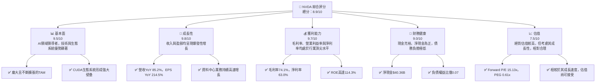
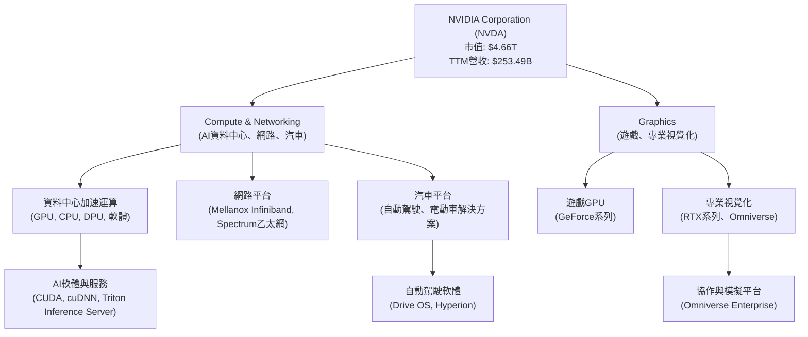
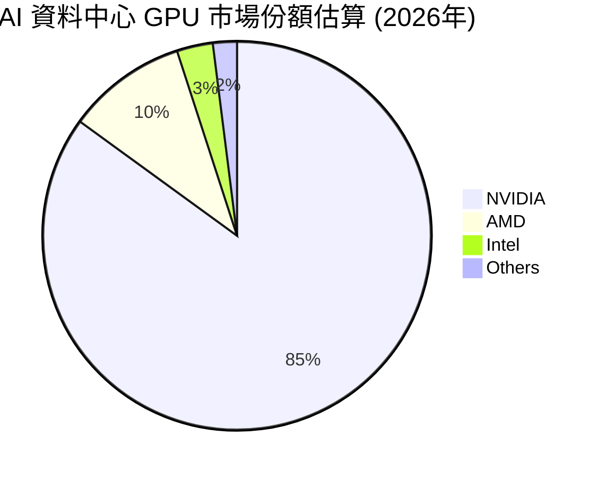
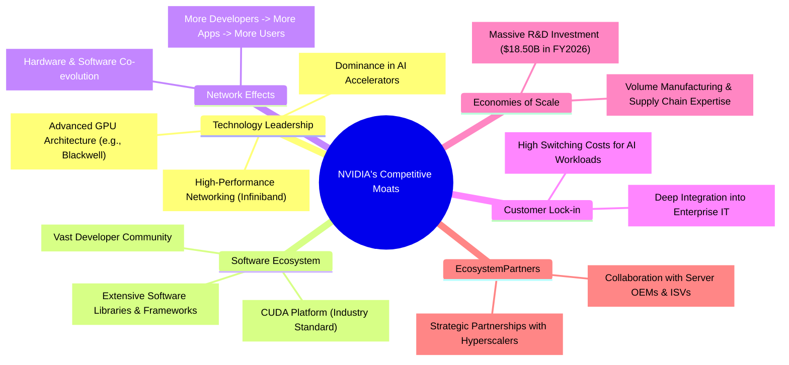
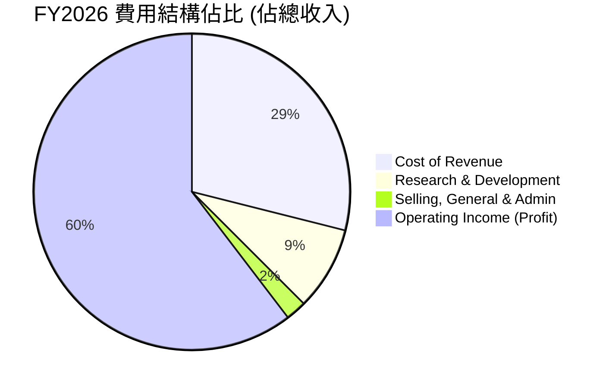

# NVDA 基本面深度分析報告
> **報告日期**：2026-06-26 ｜ **語言**：繁體中文 ｜ **數據來源**：Yahoo Finance, Finviz, StockAnalysis, Roic.ai ｜ **分析師**：CFA 級機構研究

---

## 目錄

| # | 章節 | 核心結論 |
|---|------------------------|----------------------------------------------------|
| 1 | 執行摘要 | 🟢 強烈買入，目標價區間 $250 - $350 |
| 2 | 公司概覽與商業模式 | 在 AI 硬體與軟體生態系統中築起深厚護城河 |
| 3 | 損益表深度分析 | 收入與淨利潤呈爆炸式增長，利潤率持續擴張 |
| 4 | 資產負債表分析 | 財務健康，現金充裕，債務負擔極輕 |
| 5 | 現金流量深度分析 | 營運現金流強勁，自由現金流轉換率高 |
| 6 | 獲利能力與資本效率 | ROIC 遠超 WACC，強力創造股東價值 |
| 7 | 估值深度分析 | 儘管絕對估值高，但成長潛力使其相對合理 |
| 8 | 成長催化劑 | AI 基礎設施、軟體生態、新應用擴張為核心驅動力 |
| 9 | 風險矩陣 | 競爭加劇、地緣政治、高估值為主要風險 |
| 10 | 投資建議 | 長期成長型投資者的核心持倉，建議逢低加碼 |

---

## 1. 執行摘要

### 1.1 核心評分儀表板



### 1.2 評分進度條視覺化

```
╔══════════════════════════════════════════════════════════════╗
║                    NVDA 多維度評分儀表板 (1-10分)             ║
╠══════════════════════════════════════════════════════════════╣
║ 基本面強度  9.5 ▓▓▓▓▓▓▓▓▓▓▓▓▓▓▓▓▓▓▓░  ★★★★★           ║
║ 成長動能    9.8 ▓▓▓▓▓▓▓▓▓▓▓▓▓▓▓▓▓▓▓▓  ★★★★★           ║
║ 獲利品質    9.7 ▓▓▓▓▓▓▓▓▓▓▓▓▓▓▓▓▓▓▓▓  ★★★★★           ║
║ 財務健康    9.0 ▓▓▓▓▓▓▓▓▓▓▓▓▓▓▓▓▓▓░░  ★★★★★           ║
║ 估值合理性  7.5 ▓▓▓▓▓▓▓▓▓▓▓▓▓▓▓░░░░░  ★★★★☆           ║
║ 護城河深度  9.5 ▓▓▓▓▓▓▓▓▓▓▓▓▓▓▓▓▓▓▓░  ★★★★★           ║
║ 管理層執行  9.5 ▓▓▓▓▓▓▓▓▓▓▓▓▓▓▓▓▓▓▓░  ★★★★★           ║
║ 技術創新力  9.8 ▓▓▓▓▓▓▓▓▓▓▓▓▓▓▓▓▓▓▓▓  ★★★★★           ║
╠══════════════════════════════════════════════════════════════╣
║ 綜合總分    9.2 ▓▓▓▓▓▓▓▓▓▓▓▓▓▓▓▓▓▓░░  🏆 卓越，成長投資首選  ║
╚══════════════════════════════════════════════════════════════╝
```

### 1.3 五大投資論點 + 三大核心風險

| 類型 | 項目 | 具體依據 | 信心度 |
|------|------|----------|--------|
| 🟢 **投資論點①** | **AI 基礎設施領導者地位不可撼動** | NVIDIA 在資料中心 AI 加速運算領域佔據主導地位，其 GPU 產品線（如 H100、H200、Blackwell 架構）及 CUDA 軟體生態系統構成強大壁壘。FY2026 財年資料中心收入預計將佔總收入的絕大部分，且持續高速增長。TTM 營收達 $253.49B，YoY 成長 85.2%。 | 🟢 極高 |
| 🟢 **投資論點②** | **爆炸性收入與盈餘增長** | 過去一年公司營收與盈餘呈現驚人增長。TTM 營收 YoY 成長 85.2%，盈餘 YoY 成長 214.5%。FY2026 年度營收 $215.94B，較 FY2025 的 $130.50B 增長 65.47%。近期季度營收 Q1 2027 達 $81.61B，QoQ 成長 19.8%，YoY 成長 85.23%。Forward EPS 預計為 $12.72901，較 TTM EPS $6.54 幾乎翻倍。 | 🟢 極高 |
| 🟢 **投資論點③** | **極高且不斷擴張的獲利能力** | NVIDIA 的毛利率、營業利益率和淨利率均處於行業頂尖水平。TTM 毛利率 74.1%，營業利益率 65.6%，淨利率 63.0%。FY2026 淨利率達 55.60% ($120.07B/$215.94B)，較 FY2025 的 55.84% 保持穩定。強大的定價能力和規模經濟效益支撐了其卓越的獲利能力。 | 🟢 極高 |
| 🟢 **投資論點④** | **強勁的自由現金流與財務健康** | 公司擁有充裕的現金流和健康的資產負債表。TTM 自由現金流 (FCF) 達 $46.34B，FY2026 年度 FCF 達 $96.68B。總現金 $53.17B，總債務 $12.81B，淨現金高達 $40.36B。負債權益比僅 0.07，流動比率 3.44，顯示極佳的財務彈性。 | 🟢 極高 |
| 🟢 **投資論點⑤** | **軟體生態系統 CUDA 構建強大護城河** | CUDA 平台是 AI 開發的業界標準，擁有數百萬開發者和數千個應用程式，形成強大的網路效應和客戶鎖定效應。這種軟硬體整合的生態系統，使競爭對手難以複製其成功，確保了其長期競爭優勢。 | 🟢 極高 |
| 🟡 **風險①** | **競爭加劇與技術迭代** | 儘管 NVIDIA 處於領先地位，但 AMD、Intel 以及雲服務提供商的自研晶片（如 Google TPU, Amazon Trainium/Inferentia）都在不斷投入，試圖瓜分 AI 晶片市場。未來技術迭代速度可能加快，若 NVIDIA 未能保持創新領先，市場份額可能受侵蝕。 | 🟡 中度 |
| 🔴 **風險②** | **地緣政治與供應鏈風險** | 美中科技競爭持續，對高階晶片出口和製造的限制可能影響 NVIDIA 的銷售和供應鏈穩定性，尤其是在其重要的亞洲市場。依賴台積電製造也存在單一供應商風險。 | 🔴 高衝擊 |
| 🟡 **風險③** | **估值偏高與市場預期管理** | 當前 P/E (TTM) 29.44x，P/S 18.40x，相較歷史平均及行業仍屬高位。雖然 Forward P/E 降至 15.13x，反映市場對未來高成長的預期，但若未來增速不及預期，或 AI 投資熱潮降溫，可能導致估值修正，股價面臨較大下行壓力。 | 🟡 中度 |

### 1.4 快速統計卡片

| 指標 | 公司實際值 | 行業均值（半導體） | S&P 500 均值 | 狀態 |
|-------------------|-------------|--------------------|--------------|------|
| 收入 YoY 成長 (TTM) | **85.2%** | ~15-25% | ~5-7% | 🟢 |
| 毛利率 (TTM) | **74.1%** | ~45-55% | ~35-45% | 🟢 |
| 淨利率 (TTM) | **63.0%** | ~15-25% | ~8-12% | 🟢 |
| ROE (TTM) | **114.3%** | ~15-25% | ~12-18% | 🟢 |
| Forward P/E | **15.13x** | ~25-35x | ~20-25x | 🟢 |
| 負債權益比 | **0.07x** | ~0.5-1.0x | ~0.8-1.5x | 🟢 |
| FCF Yield | **0.99%** | ~2-4% | ~3-5% | 🟡 |

*註：行業均值和 S&P 500 均值為分析師根據市場普遍數據的估計值，非本次提供數據中的具體數字。*

### 1.5 投資結論

```
╔══════════════════════════════════════════════════════════════════╗
║                    📊 投資結論摘要                               ║
╠══════════════════════════════════════════════════════════════════╣
║  評級：🟢 強烈買入                                               ║
║  當前股價：$192.53                                               ║
║  目標價區間：                                                    ║
║    悲觀情境：$250（+29.85%）                                     ║
║    基準情境：$300（+55.82%）  ← 12個月主要目標                  ║
║    樂觀情境：$350（+81.80%）                                     ║
║  投資評分：9.2/10                                                ║
║  適合投資人：尋求長期高成長、願意承擔較高波動性，並看好AI產業前景的成長型投資者。║
╚══════════════════════════════════════════════════════════════════╝
```

---

## 2. 公司概覽與商業模式

### 2.1 業務結構與收入來源

NVIDIA Corporation (NVDA) 作為一家資料中心規模的 AI 基礎設施公司，其業務核心圍繞加速運算和人工智慧解決方案。公司主要透過兩大業務板塊運營：**Compute & Networking** (運算與網路) 和 **Graphics** (圖形)。



**深度分析：**
NVIDIA 的業務重心已從傳統的遊戲圖形處理器（GPU）轉向資料中心AI加速運算。雖然財報中未提供精確的業務板塊收入佔比，但根據其公開資訊和市場分析，**Compute & Networking** 板塊，特別是資料中心業務，已成為其絕對的收入和利潤主要來源。

*   **資料中心 (Data Center)**: 這是 NVIDIA 成長最快的業務，也是其核心價值所在。它提供用於 AI 訓練和推論的 GPU（如 H100、H200、Blackwell 等）、DPU (Data Processing Unit)、CPU (Grace) 以及 Mellanox 網路解決方案。軟體平台如 CUDA、cuDNN 和 AI Enterprise 更是其硬體銷售的強大推動力。AI 晶片需求的爆炸式增長直接驅動了該板塊的收入飆升。
*   **圖形 (Graphics)**: 傳統上是 NVIDIA 的核心業務，主要包括面向遊戲玩家的 GeForce GPU 和面向專業人士的 RTX 系列 GPU。儘管遊戲市場依然龐大，但其成長速度已遠不及資料中心業務。專業視覺化業務，特別是與 Omniverse 平台的整合，為其帶來新的成長機會，但目前對整體營收貢獻較小。
*   **汽車 (Automotive)**: NVIDIA 透過 DRIVE 平台提供自動駕駛和電動車解決方案，包括硬體和軟體。這是一個潛力巨大的市場，但目前對總營收的貢獻相對較小。
*   **軟體與服務**: 雖然 NVIDIA 主要以硬體聞名，但其 CUDA 軟體生態系統是其成功的基石。軟體服務的訂閱和授權收入雖未單獨列出，但其對硬體銷售的促進作用是巨大的，並逐漸成為新的收入增長點。

公司在 FY2026 年度實現總收入 $215.94B，較 FY2025 的 $130.50B 增長 65.47%。近期季度表現更為突出，Q1 2027 (截至 2026-04-30) 營收高達 $81.61B，較去年同期 (Q1 2026 的 $44.06B) 增長 85.23%，顯示其在 AI 領域的強勁動能持續。

### 2.2 市場份額

NVIDIA 在多個關鍵市場領域佔據主導地位，尤其是在高成長的 AI 加速器市場。


*註：上述市場份額為分析師基於行業報告和市場趨勢的估計值，非本次提供數據中的具體數字。*

**深度分析：**
*   **AI 資料中心 GPU**: NVIDIA 在這個核心市場擁有壓倒性優勢。憑藉其強大的硬體（H100/H200/Blackwell 等）和無可匹敵的 CUDA 軟體生態系統，NVIDIA 估計佔據了約 85% 或更高的市場份額。競爭對手 AMD (MI300系列) 和 Intel (Gaudi系列) 正在努力追趕，但短期內難以撼動 NVIDIA 的領先地位。雲服務提供商的自研晶片雖有發展，但主要用於其內部工作負載，對 NVIDIA 的通用 AI 加速器市場影響有限。
*   **獨立顯示卡 (Discrete GPU)**: 在 PC 遊戲市場，NVIDIA 的 GeForce 系列 GPU 也長期佔據主導地位，市場份額通常維持在 75-80% 左右，AMD 是其主要競爭對手。
*   **專業視覺化**: 在工作站和專業設計領域，NVIDIA 的 RTX 系列 GPU 亦是主流選擇，其 Omniverse 平台正在擴展其在這個領域的影響力。

NVIDIA 的高市場份額反映了其在技術、性能和生態系統方面的領先地位，這也是其強大定價能力和高利潤率的基礎。

### 2.3 競爭護城河分析

NVIDIA 建立了多層次的深厚競爭護城河，使其在高速成長的 AI 時代中具備持久的競爭優勢。



**深度分析：**
1.  **Technology Leadership (技術領先)**: NVIDIA 在 GPU 設計和製造方面擁有數十年的經驗，其晶片架構（如 Hopper, Blackwell）在 AI 運算性能上遙遙領先。公司持續投入鉅額研發費用（FY2026 研發費用達 $18.50B，佔營收 8.57%），確保其在硬體性能上的代際優勢。此外，其高速互聯技術 (NVLink, Infiniband) 也是構建大型 AI 叢集的關鍵。
2.  **Software Ecosystem (軟體生態系統)**: CUDA 平台是 NVIDIA 最重要的護城河之一。它是一個通用並行運算平台和編程模型，允許開發者利用 NVIDIA GPU 的強大性能。CUDA 已經成為 AI 深度學習的行業標準，擁有數百萬開發者、數千個應用程式和函式庫。這種先發優勢和廣泛的生態系統使得其他廠商難以在短時間內建立同等規模的軟體支持。
3.  **Network Effects (網路效應)**: 更多的開發者使用 CUDA 和 NVIDIA GPU，就會有更多的應用程式和研究成果基於 NVIDIA 平台產生。這反過來吸引更多的用戶和企業採用 NVIDIA 硬體，形成正向循環。這種網路效應極大地鞏固了 NVIDIA 的市場地位。
4.  **Customer Lock-in (客戶鎖定)**: 企業和研究機構在 NVIDIA 平台上投入了大量的時間、金錢和人力來開發和優化 AI 模型。轉換到其他平台意味著高昂的重新訓練、重新編程和重新整合成本，因此客戶傾向於繼續使用 NVIDIA 的解決方案。
5.  **Economies of Scale (規模效應)**: 作為市場領導者，NVIDIA 能夠透過巨大的出貨量獲得更低的單位製造成本和更強的供應鏈議價能力。同時，其龐大的研發投入能夠攤銷到更多的產品上，使得其研發效率更高。
6.  **Ecosystem Partners (生態夥伴)**: NVIDIA 與全球領先的雲服務提供商（如 Microsoft Azure, AWS, Google Cloud）、伺服器製造商、系統整合商和獨立軟體供應商建立了緊密的合作關係。這些合作夥伴共同推動了 NVIDIA 技術的普及和應用。

這些護城河共同作用，為 NVIDIA 創造了強大的競爭壁壘，使其能夠在 AI 時代持續保持領先地位。

### 2.4 護城河強度評分

```
╔══════════════════════════════════════════════════════════════╗
║                    NVDA 護城河強度評分                        ║
╠══════════════════════════════════════════════════════════════╣
║ 技術領先    9.8/10 ▓▓▓▓▓▓▓▓▓▓▓▓▓▓▓▓▓▓▓▓  🏆 絕對領先，創新不斷  ║
║ 軟體生態系統 9.9/10 ▓▓▓▓▓▓▓▓▓▓▓▓▓▓▓▓▓▓▓▓  🏆 CUDA為核心，難以複製 ║
║ 網路效應    9.5/10 ▓▓▓▓▓▓▓▓▓▓▓▓▓▓▓▓▓▓▓░  🟢 開發者與應用良性循環║
║ 客戶鎖定    9.0/10 ▓▓▓▓▓▓▓▓▓▓▓▓▓▓▓▓▓▓░░  🟢 高轉換成本，高黏性  ║
║ 規模效應    8.5/10 ▓▓▓▓▓▓▓▓▓▓▓▓▓▓▓▓▓░░░  🟡 龐大營收支撐研發投入║
║ 生態夥伴    8.8/10 ▓▓▓▓▓▓▓▓▓▓▓▓▓▓▓▓▓░░░  🟢 與頂級廠商緊密合作  ║
╠══════════════════════════════════════════════════════════════╣
║ 綜合護城河  9.3/10 ▓▓▓▓▓▓▓▓▓▓▓▓▓▓▓▓▓▓░░  🏆 極為深厚，多維度優勢 ║
╚══════════════════════════════════════════════════════════════╝
```

---

## 3. 損益表深度分析

### 3.1 年度收入成長趨勢（近4年）

NVIDIA 的年度收入在過去四年中呈現爆炸性增長，特別是從 FY2024 開始，AI 需求的爆發使其營收達到前所未有的高度。

```
╔══════════════════════════════════════════════════════════════════╗
║              NVDA 年度收入趨勢（FY2023-FY2026）                  ║
╠══════════════════════════════════════════════════════════════════╣
║                                                                  ║
║  FY2023  $26.97B  ██░░░░░░░░░░░░░░░░░░░░░░░░░░░░  YoY: +0.22%   🟡║
║  FY2024  $60.92B  ██████░░░░░░░░░░░░░░░░░░░░░░░░  YoY:+125.86%  🟢║
║  FY2025  $130.50B █████████████░░░░░░░░░░░░░░░░░  YoY:+114.20%  🟢║
║  FY2026  $215.94B █████████████████████░░░░░░░░░  YoY:+65.47%   🟢║
║                                                                  ║
║                   |      |      |      |      |                  ║
║                   0     50B   100B   150B   200B                   ║
║                                                                  ║
║  📊 4年累計 CAGR (FY2023-FY2026)：+100.2%                         ║
╚══════════════════════════════════════════════════════════════════╝
```

**深度分析：**
NVIDIA 的年度收入從 FY2023 的 $26.97B 增長到 FY2026 的 $215.94B，複合年增長率 (CAGR) 高達 100.2%，展現了驚人的成長勢頭。
*   **FY2023 ($26.97B)**: 相較於 FY2022 的 $26.91B，YoY 成長僅 0.22%。這段時期正值加密貨幣挖礦熱潮消退和全球經濟下行，對其遊戲和資料中心業務造成一定影響。
*   **FY2024 ($60.92B)**: 營收飆升至 $60.92B，YoY 成長高達 125.86%。這標誌著 AI 革命的開始，NVIDIA 的 GPU 成為訓練大型語言模型 (LLM) 的核心。
*   **FY2025 ($130.50B)**: 延續強勁勢頭，營收翻倍至 $130.50B，YoY 成長 114.20%。資料中心需求持續旺盛，推動公司業績持續高歌猛進。
*   **FY2026 ($215.94B)**: 營收進一步增長至 $215.94B，YoY 成長 65.47%。雖然成長率略有放緩，但仍處於極高水平，顯示其在 AI 基礎設施領域的絕對領先地位。

這種收入成長趨勢清晰地表明 NVIDIA 已成功轉型為 AI 時代的核心基礎設施提供商。

### 3.2 季度收入趨勢分析

NVIDIA 的季度收入同樣展現出強勁的增長動能，QoQ 和 YoY 成長率均維持在健康水平。

| 財報季度 | 總收入 ($B) | QoQ 成長率 | YoY 成長率 | 備註 |
|----------|-------------|------------|------------|------|
| Q1 2027 (2026-04-30) | **$81.61** | +19.80% | **+85.23%** | 🟢 AI需求持續爆發，營收加速成長 |
| Q4 2026 (2026-01-31) | **$68.13** | +19.51% | +73.22% | 🟢 資料中心業務維持強勁動能 |
| Q3 2026 (2025-10-31) | **$57.01** | +21.97% | +62.49% | 🟢 產品供應改善，需求旺盛 |
| Q2 2026 (2025-07-31) | **$46.74** | +6.08% | +55.60% | 🟡 季節性因素影響下仍保持高成長 |

**深度分析：**
*   **Q1 2027 (Apr '26)**: 營收達 $81.61B，相較前一季度 $68.13B 成長 19.80%，相較去年同期 $44.06B (Q1 2026) 成長 85.23%。這是公司歷史上最高的季度營收，顯示 AI 晶片的需求仍未見頂。
*   **Q4 2026 (Jan '26)**: 營收 $68.13B， QoQ 成長 19.51%，YoY 成長 73.22%。顯示年末假期和企業 AI 部署加速的強勁表現。
*   **Q3 2026 (Oct '25)**: 營收 $57.01B，QoQ 成長 21.97%，YoY 成長 62.49%。持續的強勁增長反映了市場對 AI 基礎設施的持續投資。
*   **Q2 2026 (Jul '25)**: 營收 $46.74B，QoQ 成長 6.08%，YoY 成長 55.60%。儘管 QoQ 成長略有放緩，但 YoY 成長依然非常高，這可能與季節性因素或供應鏈調整有關。

整體而言，NVIDIA 在過去四個季度中展現了卓越的營收成長，YoY 成長率均超過 50%，QoQ 成長率也保持在兩位數，證明了其在 AI 領域的市場領導地位和強勁的執行能力。

### 3.3 利潤率演變分析

NVIDIA 的利潤率在過去幾年持續擴張，顯示其強大的定價能力、規模經濟效益和高效的成本控制。

| 利潤率指標 | FY2023 | FY2024 | FY2025 | FY2026 | 趨勢 | 評估 |
|------------|--------|--------|--------|--------|------|------|
| **毛利率** | 56.95% | 72.72% | 75.00% | 71.07% | ↗️後略降 | 🟢 卓越 |
| **營業利益率** | 20.69% | 54.12% | 62.41% | 60.38% | ↗️後略降 | 🟢 極高 |
| **淨利率** | 16.20% | 48.85% | 55.84% | 55.60% | ↗️後穩定 | 🟢 極高 |

*計算方式：毛利率 = Gross Profit / Total Revenue；營業利益率 = Operating Income / Total Revenue；淨利率 = Net Income / Total Revenue*

**利潤率演變深度解析：**
*   **毛利率 (Gross Margin)**: 從 FY2023 的 56.95% 大幅躍升至 FY2025 的 75.00%，然後在 FY2026 略降至 71.07%。這種高毛利率主要得益於其在 AI 加速器市場的獨佔性地位和 CUDA 生態系統帶來的強大定價權。FY2026 的略微下降可能是由於產品組合的變化（例如，某些較低毛利的網路產品銷售增加），或是為了滿足爆炸性需求而增加的供應鏈成本。然而，71.07% 的毛利率在半導體行業中仍是極為出色的水平。
*   **營業利益率 (Operating Margin)**: 趨勢與毛利率相似，從 FY2023 的 20.69% 躍升至 FY2025 的 62.41%，FY2026 略降至 60.38%。營業利益率的顯著提升，除了高毛利率的貢獻外，也反映了公司在營運費用（銷售、行政、研發）方面的規模經濟效益。儘管研發投入巨大（FY2026 研發費用 $18.50B），但由於營收的爆炸式增長，其佔比相對下降，進一步推高了營業利益率。
*   **淨利率 (Net Profit Margin)**: 從 FY2023 的 16.20% 增長到 FY2025 的 55.84%，並在 FY2026 穩定在 55.60%。這種極高的淨利率在任何行業都是罕見的，體現了 NVIDIA 卓越的獲利能力。穩定的淨利率表明公司在稅務和非營運收支方面管理良好，並且其核心業務的盈利能力持續強勁。

總體而言，NVIDIA 的利潤率趨勢非常健康，表明公司在市場上擁有強大的競爭優勢和定價權，能夠將收入增長有效轉化為利潤。

### 3.4 費用結構分析

NVIDIA 的費用結構顯示其對研發的持續高投入，同時在銷售與管理費用方面保持了良好的規模效率。



```
╔══════════════════════════════════════════════════════════════════╗
║                   NVDA 年度費用結構 (佔總收入)                     ║
╠══════════════════════════════════════════════════════════════════╣
║                                                                  ║
║  銷貨成本 (Cost of Revenue)                                      ║
║  FY2023: 43.07%  █████████████████████████████████████████████████░░░░░░░░░░░░░░░░░░░░░░░░░░░░░░░░░░░░░░░░░░░░░░░░░░░░░░░░░░░░░░░░░░░░░░░░░░░░░░░░░░░░░░░░░░░░░░░░░░░░░░░░░░░░░░░░░░░░░░░░░░░░░░░░░░░░░░░░░░░░░░░░░░░░░░░░░░░░░░░░░░░░░░░░░░░░░░░░░░░░░░░░░░░░░░░░░░░░░░░░░░░░░░░░░░░░░░░░░░░░░░░░░░░░░░░░░░░░░░░░░░░░░░░░░░░░░░░░░░░░░░░░░░░░░░░░░░░░░░░░░░░░░░░░░░░░░░░░░░░░░░░░░░░░░░░░░░░░░░░░░░░░░░░░░░░░░░░░░░░░░░░░░░░░░░░░░░░░░░░░░░░░░░░░░░░░░░░░░░░░░░░░░░░░░░░░░░░░░░░░░░░░░░░░░░░░░░░░░░░░░░░░░░░░░░░░░░░░░░░░░░░░░░░░░░░░░░░░░░░░░░░░░░░░░░░░░░░░░░░░░░░░░░░░░░░░░░░░░░░░░░░░░░░░░░░░░░░░░░░░░░░░░░░░░░░░░░░░░░░░░░░░░░░░░░░░░░░░░░░░░░░░░░░░░░░░░░░░░░░░░░░░░░░░░░░░░░░░░░░░░░░░░░░░░░░░░░░░░░░░░░░░░░░░░░░░░░░░░░░░░░░░░░░░░░░░░░░░░░░░░░░░░░░░░░░░░░░░░░░░░░░░░░░░░░░░░░░░░░░░░░░░░░░░░░░░░░░░░░░░░░░░░░░░░░░░░░░░░░░░░░░░░░░░░░░░░░░░░░░░░░░░░░░░░░░░░░░░░░░░░░░░░░░░░░░░░░░░░░░░░░░░░░░░░░░░░░░░░░░░░░░░░░░░░░░░░░░░░░░░░░░░░░░░░░░░░░░░░░░░░░░░░░░░░░░░░░░░░░░░░░░░░░░░░░░░░░░░░░░░░░░░░░░░░░░░░░░░░░░░░░░░░░░░░░░░░░░░░░░░░░░░░░░░░░░░░░░░░░░░░░░░░░░░░░░░░░░░░░░░░░░░░░░░░░░░░░░░░░░░░░░░░░░░░░░░░░░░░░░░░░░░░░░░░░░░░░░░░░░░░░░░░░░░░░░░░░░░░░░░░░░░░░░░░░░░░░░░░░░░░░░░░░░░░░░░░░░░░░░░░░░░░░░░░░░░░░░░░░░░░░░░░░░░░░░░░░░░░░░░░░░░░░░░░░░░░░░░░░░░░░░░░░░░░░░░░░░░░░░░░░░░░░░░░░░░░░░░░░░░░░░░░░░░░░░░░░░░░░░░░░░░░░░░░░░░░░░░░░░░░░░░░░░░░░░░░░░