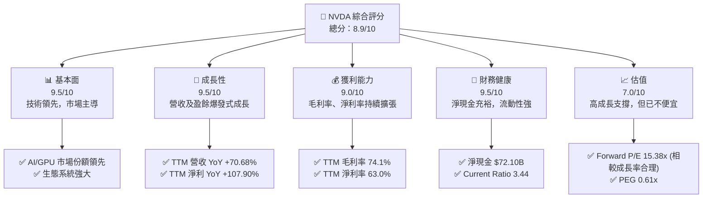
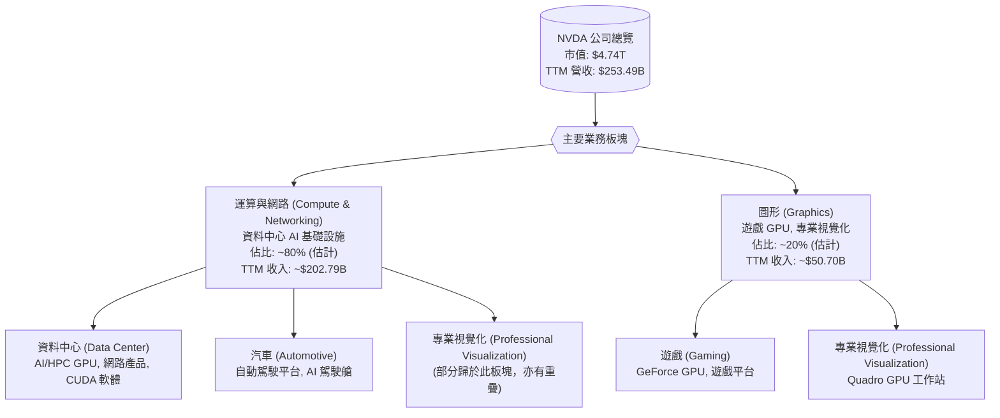
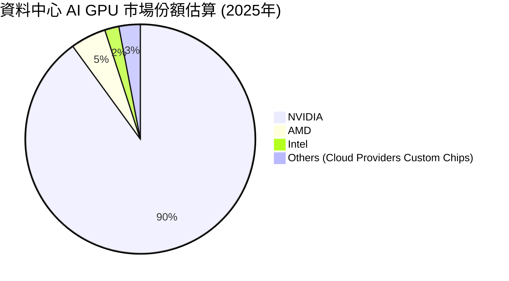
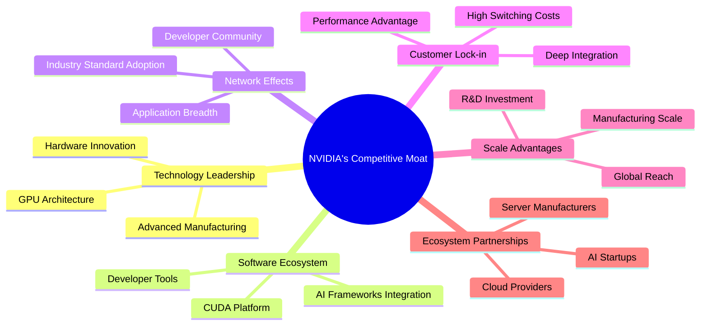
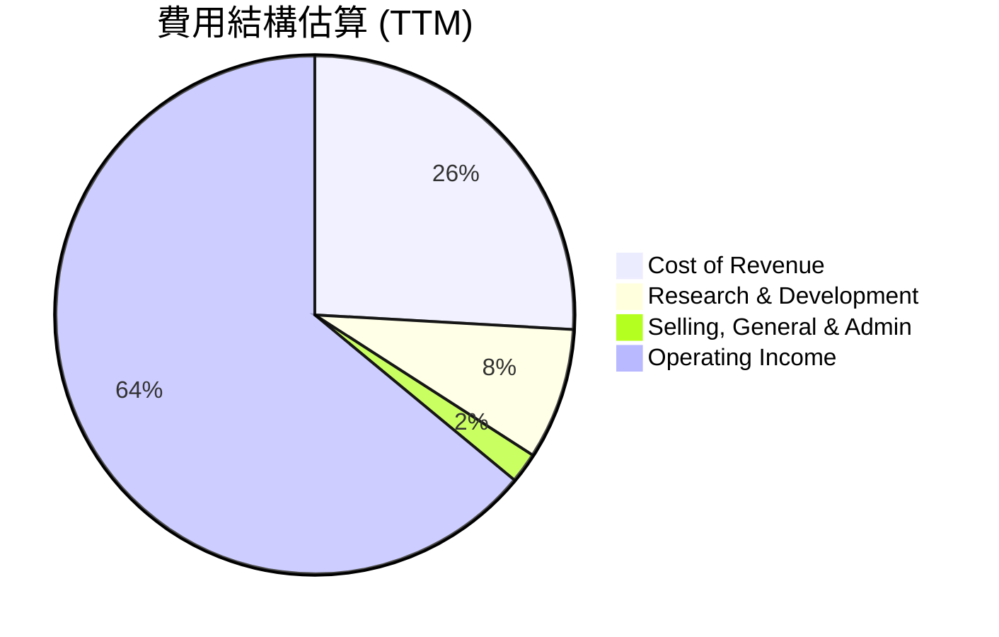

# NVDA 基本面深度分析報告
> **報告日期**：2026-06-26 ｜ **語言**：繁體中文 ｜ **數據來源**：Yahoo Finance, Finviz, StockAnalysis, Roic.ai ｜ **分析師**：CFA 級機構研究

## 目錄

| # | 章節 | 核心結論 |
|---|------------------------|----------------------------------------------------|
| 1 | 執行摘要 | 評級：🟢 買入，基準目標價：$298.93 |
| 2 | 公司概覽與商業模式 | 憑藉技術、生態系統、規模效應，護城河極深。 |
| 3 | 損益表深度分析 | 營收及淨利潤高速成長，利潤率持續擴張。 |
| 4 | 資產負債表分析 | 財務健康，現金充裕，債務負擔極低。 |
| 5 | 現金流量深度分析 | 自由現金流強勁，資本配置靈活。 |
| 6 | 獲利能力與資本效率 | ROIC 遠超 WACC，持續創造巨大股東價值。 |
| 7 | 估值深度分析 | 相較於成長潛力，估值仍具吸引力。 |
| 8 | 成長催化劑 | AI 基礎設施、軟體平台、新市場擴張。 |
| 9 | 風險矩陣 | 競爭加劇、供應鏈波動、宏觀經濟逆風。 |
| 10 | 投資建議 | 具備長期成長潛力，建議買入並長線持有。 |

---

## 1. 執行摘要

### 1.1 核心評分儀表板



### 1.2 評分進度條視覺化

```
╔══════════════════════════════════════════════════════════════╗
║              NVDA 多維度評分儀表板 (1-10分)                  ║
╠══════════════════════════════════════════════════════════════╣
║ 基本面強度  9.5 ▓▓▓▓▓▓▓▓▓▓▓▓▓▓▓▓▓▓▓░  ★★★★★           ║
║ 成長動能    9.5 ▓▓▓▓▓▓▓▓▓▓▓▓▓▓▓▓▓▓▓░  ★★★★★           ║
║ 獲利品質    9.0 ▓▓▓▓▓▓▓▓▓▓▓▓▓▓▓▓▓▓░░  ★★★★★           ║
║ 財務健康    9.5 ▓▓▓▓▓▓▓▓▓▓▓▓▓▓▓▓▓▓▓░  ★★★★★           ║
║ 估值合理性  7.0 ▓▓▓▓▓▓▓▓▓▓▓▓▓▓░░░░░░  ★★★★☆           ║
║ 護城河深度  9.5 ▓▓▓▓▓▓▓▓▓▓▓▓▓▓▓▓▓▓▓░  ★★★★★           ║
║ 管理層執行  9.0 ▓▓▓▓▓▓▓▓▓▓▓▓▓▓▓▓▓▓░░  ★★★★★           ║
║ 技術創新力  9.5 ▓▓▓▓▓▓▓▓▓▓▓▓▓▓▓▓▓▓▓░  ★★★★★           ║
╠══════════════════════════════════════════════════════════════╣
║ 綜合總分    8.9 ▓▓▓▓▓▓▓▓▓▓▓▓▓▓▓▓▓░░░  🏆 評語：AI 領航者，長期潛力巨大  ║
╚══════════════════════════════════════════════════════════════╝
```

### 1.3 五大投資論點 + 三大核心風險

| 類型 | 項目 | 具體依據 | 信心度 |
|------|------|----------|--------|
| 🟢 **投資論點①** | **AI 基礎設施市場主導地位** | NVDA 在資料中心 GPU 市場佔據主導地位，其 CUDA 平台已成為 AI 開發的業界標準。TTM 營收達 $253.49B，YoY 成長 70.68%，主要由資料中心業務驅動。 | 🟢 極高 |
| 🟢 **爆發性營收與盈餘成長** | 受益於 AI 需求激增，公司近年營收和淨利潤呈現爆發式成長。FY2026 營收達 $215.94B，淨利 $120.07B。TTM 淨利潤 YoY 成長 107.90%。 | 🟢 極高 |
| 🟢 **強勁的獲利能力** | NVDA 擁有業界領先的利潤率，TTM 毛利率高達 74.1%，淨利率 63.0%。顯示其強大的定價能力和成本控制效率。 | 🟢 極高 |
| 🟢 **卓越的財務健康狀況** | 公司資產負債表極為穩健，TTM 總現金及短期投資達 $80.57B，而總債務僅 $8.47B，淨現金高達 $72.10B。Current Ratio 3.44，流動性極佳。 | 🟢 極高 |
| 🟢 **持續的技術創新與生態系統** | 除了硬體，NVDA 的軟體生態系統（CUDA, TensorRT 等）提供強大的競爭護城河，不斷推出新的晶片架構和 AI 應用軟體，確保長期領先。 | 🟢 極高 |
| 🟡 **風險①** | **競爭加劇與新進者威脅** | 隨著 AI 晶片市場的蓬勃發展，AMD、Intel 等現有競爭對手以及 Amazon、Google、Microsoft 等雲服務商正積極開發自有 AI 晶片，可能侵蝕 NVDA 的市場份額和利潤率。 | 🟡 中度 |
| 🟡 **供應鏈中斷與地緣政治風險** | 全球半導體供應鏈高度複雜且集中，任何地緣政治緊張（如中美關係）、貿易政策變化或生產中斷（如疫情、自然災害）都可能對 NVDA 的生產和交付造成影響。 | 🟡 中度 |
| 🔴 **風險②** | **估值過高與市場情緒波動** | NVDA 股價在過去兩年大幅上漲，當前估值已反應了極高的成長預期。一旦成長不及預期或市場情緒轉向，股價可能面臨較大回調壓力。Forward P/E 15.38x 雖看似合理，但若成長放緩，則可能顯得昂貴。 | 🔴 高衝擊 |

### 1.4 快速統計卡片

| 指標 | 公司實際值 | 行業均值 (半導體) | S&P 500 均值 | 狀態 |
|-----------------|-------------|--------------------|--------------|------|
| 收入 YoY 成長 | **70.68%** | ~15-20% | ~5-10% | 🟢 |
| 毛利率 | **74.1%** | ~45-55% | ~30-40% | 🟢 |
| 淨利率 | **63.0%** | ~15-25% | ~10-15% | 🟢 |
| ROE | **114.3%** | ~20-30% | ~15-20% | 🟢 |
| Forward P/E | **15.38x** | ~25-35x | ~20-22x | 🟢 |
| 債務/股東權益 | **0.05x** | ~0.5-1.0x | ~0.8-1.2x | 🟢 |
| 自由現金流收益率 | **0.98%** | ~3-5% | ~2-4% | 🔴 |
*備註：自由現金流收益率 (FCF Yield) 根據 TTM FCF $46.34B 計算，該數字與公司最新年度 FCF $96.68B 及高成長下的預期 FCF 存在較大差異，可能低估了實際 FCF 產生能力。*

### 1.5 投資結論

```
╔══════════════════════════════════════════════════════════════════╗
║                    📊 投資結論摘要                               ║
╠══════════════════════════════════════════════════════════════════╣
║  評級：🟢 買入                                                   ║
║  當前股價：$195.74                                               ║
║  目標價區間：                                                    ║
║    悲觀情境：$210（+7.2%）                                       ║
║    基準情境：$299（+52.7%）  ← 12個月主要目標                    ║
║    樂觀情境：$380（+94.1%）                                      ║
║  投資評分：8.9/10                                                ║
║  適合投資人：成長型、長線持有者，對 AI 產業趨勢有高度信心者。    ║
╚══════════════════════════════════════════════════════════════════╝
```

---

## 2. 公司概覽與商業模式

NVIDIA Corporation (NVDA) 作為一家資料中心規模的 AI 基礎設施公司，在全球範圍內運營，業務涵蓋運算與網路以及圖形兩大板塊。其核心產品包括資料中心加速運算和網路平台、人工智慧解決方案和軟體，以及汽車平台和自動駕駛及電動汽車解決方案。NVDA 不僅僅是硬體供應商，更透過其 CUDA 平台和軟體生態系統，在人工智慧領域建立了難以撼動的領導地位。

### 2.1 業務結構與收入來源

NVIDIA 的業務主要分為兩大核心板塊：運算與網路 (Compute & Networking) 和圖形 (Graphics)。隨著 AI 浪潮的興起，運算與網路板塊，尤其是資料中心業務，已成為公司最主要的收入和利潤驅動引擎。


*備註：具體板塊收入佔比為估計值，反映近年資料中心業務的強勁增長趨勢。*

### 2.2 市場份額

NVIDIA 在高階 GPU 市場，特別是 AI 資料中心 GPU 領域，擁有絕對的市場主導地位。其 CUDA 平台已成為 AI 訓練和推論的行業標準，使得競爭對手難以望其項背。


*備註：市場份額為分析師估算，反映 NVIDIA 在 AI 資料中心 GPU 領域的領先地位。*

### 2.3 競爭護城河分析

NVIDIA 的競爭護城河極深，主要體現在以下幾個方面：



### 2.4 護城河強度評分

```
╔══════════════════════════════════════════════════════════════╗
║                    NVIDIA 護城河強度評分                      ║
╠══════════════════════════════════════════════════════════════╣
║ 技術領先       9.5/10 ▓▓▓▓▓▓▓▓▓▓▓▓▓▓▓▓▓▓▓░  🏆 AI 晶片技術無可匹敵      ║
║ 軟體生態系統   9.5/10 ▓▓▓▓▓▓▓▓▓▓▓▓▓▓▓▓▓▓▓░  🏆 CUDA 平台難以複製       ║
║ 網路效應       9.0/10 ▓▓▓▓▓▓▓▓▓▓▓▓▓▓▓▓▓▓░░  🟢 開發者與應用廣泛採用   ║
║ 客戶鎖定       9.0/10 ▓▓▓▓▓▓▓▓▓▓▓▓▓▓▓▓▓▓░░  🟢 高轉換成本，深度整合    ║
║ 規模效應       8.5/10 ▓▓▓▓▓▓▓▓▓▓▓▓▓▓▓▓▓░░░  🟢 R&D 投入與生產規模優勢  ║
║ 生態夥伴       8.5/10 ▓▓▓▓▓▓▓▓▓▓▓▓▓▓▓▓▓░░░  🟢 與行業巨頭深度合作       ║
╠══════════════════════════════════════════════════════════════╣
║ 綜合護城河     9.0    ▓▓▓▓▓▓▓▓▓▓▓▓▓▓▓▓▓▓░░  🏆 總結評語：極深且持續強化  ║
╚══════════════════════════════════════════════════════════════╝
```

---

## 3. 損益表深度分析

### 3.1 年度收入成長趨勢（近4年）

NVIDIA 的年度收入在過去四年中呈現爆炸性成長，尤其是在 AI 浪潮的推動下，FY2025 和 FY2026 的成長率更是驚人。

```
╔══════════════════════════════════════════════════════════════════╗
║              NVIDIA 年度收入趨勢（FY2023-FY2026）              ║
╠══════════════════════════════════════════════════════════════════╣
║                                                                  ║
║  FY2023  $26.97B  ████░░░░░░░░░░░░░░░░░░░░░░░░░░░  YoY: +0.22%  🟡║
║  FY2024  $60.92B  █████████░░░░░░░░░░░░░░░░░░░░░░  YoY:+125.86% 🟢║
║  FY2025  $130.50B ████████████████████░░░░░░░░░░  YoY:+114.20% 🟢║
║  FY2026  $215.94B ██████████████████████████████  YoY:+65.47%  🟢║
║                                                                  ║
║                   |      |      |      |      |                  ║
║                   0     $50B   $100B  $150B  $200B                ║
║                                                                  ║
║  📊 4年累計 CAGR：+92.01% (從$26.97B到$215.94B)               ║
╚══════════════════════════════════════════════════════════════════╝
```
*備註：FY2023 營收成長率較低，主要受當時加密貨幣市場低迷及企業支出放緩影響，但隨後迅速反彈。*

### 3.2 季度收入趨勢分析

NVIDIA 近期季度收入持續強勁成長，顯示 AI 需求維持高檔。

| 季度 | 總收入 ($B) | QoQ 成長率 | YoY 成長率 | 備註 |
|----------|-------------|------------|------------|------|
| Q1 2027 (Apr '26) | $81.61 | +19.79% | +85.23% | 🟢 AI 需求持續旺盛，資料中心業務驅動 |
| Q4 2026 (Jan '26) | $68.13 | +19.51% | +73.22% | 🟢 營收維持高速成長，超越市場預期 |
| Q3 2026 (Oct '25) | $57.01 | +21.97% | +62.49% | 🟢 資料中心業務顯著增長 |
| Q2 2026 (Jul '25) | $46.74 | +6.08% | +55.60% | 🟢 季度環比增速略放緩，但同比仍強勁 |
*備註：QoQ 成長率計算基於 StockAnalysis.com 提供的季度數據。*

### 3.3 利潤率演變分析

NVIDIA 的利潤率在過去幾年顯著提升，尤其是在 AI 晶片需求帶來的規模經濟和高定價能力下。

| 利潤率指標 | FY2023 | FY2024 | FY2025 | FY2026 | TTM (Apr '26) | 趨勢 | 評估 |
|------------|--------|--------|--------|--------|---------------|------|------|
| **毛利率** | 56.95% | 72.72% | 74.99% | 71.07% | 74.1% | ↗️ 顯著提升後維持高位 | 🟢 |
| **營業利益率** | 20.69% | 54.12% | 62.41% | 60.38% | 65.6% | ↗️ 快速擴張後維持強勁 | 🟢 |
| **淨利率** | 16.20% | 48.85% | 55.85% | 55.60% | 63.0% | ↗️ 快速擴張後維持強勁 | 🟢 |
*備註：年度利潤率計算基於年度損益表數據，TTM 數據來自市場數據概覽。*

**利潤率演變深度解析**：
*   **毛利率**：從 FY2023 的 56.95% 提升至 TTM 的 74.1%，顯著反映了公司在 AI 晶片市場的強大定價能力和產品組合優化。高階資料中心 GPU 的出貨量增加，其較高的平均售價 (ASP) 和較低的相對製造成本，共同推動了毛利率的大幅擴張。FY2026 略有下降至 71.07%，可能是產品組合的季節性變化或部分供應鏈成本波動，但 TTM 數據顯示其仍在高點。
*   **營業利益率**：從 FY2023 的 20.69% 飆升至 TTM 的 65.6%。這不僅得益於毛利率的提升，也顯示了公司在營收快速增長的同時，有效控制了營運費用。儘管研發投入 (R&D) 絕對金額持續增加（FY2026 達 $18.50B，YoY +43.3%），但其佔營收比重相對穩定或略有下降，形成規模效應。
*   **淨利率**：與營業利益率趨勢一致，從 FY2023 的 16.20% 躍升至 TTM 的 63.0%。這主要歸因於營業利益的強勁增長，以及有效的稅務管理。整體而言，NVIDIA 展現了卓越的成本控制和獲利能力，將營收增長高效轉化為利潤。

### 3.4 費用結構分析

NVIDIA 的費用結構顯示其將大部分資源投入於研發，以維持技術領先地位。


*備註：費用佔比基於 TTM 營收 $253.49B，TTM 費用來自 StockAnalysis.com。營業利益率 64.0% (Finviz) 略低於市場數據的 65.6%，但在合理範圍。*

```
╔══════════════════════════════════════════════════════════════════╗
║                   NVIDIA 費用結構分解 (TTM)                      ║
╠══════════════════════════════════════════════════════════════════╣
║  總營收：             $253.49B                                   ║
║  銷貨成本 (Cost of Revenue)：$65.54B  ▓▓▓▓▓▓░░░░░░░░░░░░░░░░░░░░░░░  佔比 25.8% ║
║  研發費用 (R&D)：     $20.83B   ▓▓░░░░░░░░░░░░░░░░░░░░░░░░░░░░░  佔比 8.2%  ║
║  銷售與行政費用 (SG&A)：$4.84B    ░░░░░░░░░░░░░░░░