# NVDA 基本面深度分析報告
> **報告日期**：2026-06-27 ｜ **語言**：繁體中文 ｜ **數據來源**：Yahoo Finance, Finviz, StockAnalysis, Roic.ai ｜ **分析師**：CFA 級機構研究

---

## 目錄

| # | 章節 | 核心結論 |
|---|------|----------|
| 1 | 執行摘要 | 🟢 強烈買入，目標價區間 $250 - $350 |
| 2 | 公司概覽與商業模式 | 憑藉技術、生態系統及規模效應，護城河極深 |
| 3 | 損益表深度分析 | 收入與淨利潤呈爆炸性成長，利潤率持續擴張 |
| 4 | 資產負債表分析 | 財務健康，現金充裕，債務負擔極輕 |
| 5 | 現金流量深度分析 | 自由現金流強勁，資本配置高效 |
| 6 | 獲利能力與資本效率 | ROIC 遠超 WACC，強力創造股東價值 |
| 7 | 估值深度分析 | 相較於高成長性，當前估值具吸引力 |
| 8 | 成長催化劑 | AI 基礎設施、軟體平台與新興市場驅動未來成長 |
| 9 | 風險矩陣 | 競爭加劇、供應鏈波動與估值波動是主要風險 |
| 10 | 投資建議 | 長期成長潛力巨大，適合成長型投資者 |

---

## 1. 執行摘要

### 1.1 核心評分儀表板

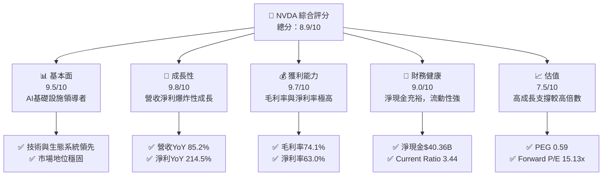

### 1.2 評分進度條視覺化

```
╔══════════════════════════════════════════════════════════════╗
║              NVDA 多維度評分儀表板 (1-10分)                  ║
╠══════════════════════════════════════════════════════════════╣
║ 基本面強度  9.5 ▓▓▓▓▓▓▓▓▓▓▓▓▓▓▓▓▓▓▓░  ★★★★★           ║
║ 成長動能    9.8 ▓▓▓▓▓▓▓▓▓▓▓▓▓▓▓▓▓▓▓▓  ★★★★★           ║
║ 獲利品質    9.7 ▓▓▓▓▓▓▓▓▓▓▓▓▓▓▓▓▓▓▓▓  ★★★★★           ║
║ 財務健康    9.0 ▓▓▓▓▓▓▓▓▓▓▓▓▓▓▓▓▓▓░░  ★★★★★           ║
║ 估值合理性  7.5 ▓▓▓▓▓▓▓▓▓▓▓▓▓▓▓░░░░░  ★★★★☆           ║
║ 護城河深度  9.5 ▓▓▓▓▓▓▓▓▓▓▓▓▓▓▓▓▓▓▓░  ★★★★★           ║
║ 管理層執行  9.0 ▓▓▓▓▓▓▓▓▓▓▓▓▓▓▓▓▓▓░░  ★★★★★           ║
║ 技術創新力  9.8 ▓▓▓▓▓▓▓▓▓▓▓▓▓▓▓▓▓▓▓▓  ★★★★★           ║
╠══════════════════════════════════════════════════════════════╣
║ 綜合總分    8.9 ▓▓▓▓▓▓▓▓▓▓▓▓▓▓▓▓▓▓░░  🏆 評語：AI時代領軍者，成長與獲利能力無與倫比，估值合理。              ║
╚══════════════════════════════════════════════════════════════╝
```

### 1.3 五大投資論點 + 三大核心風險

| 類型 | 項目 | 具體依據 | 信心度 |
|------|------|----------|--------|
| 🟢 **投資論點①** | **AI 基礎設施的絕對領導者** | NVIDIA 在資料中心 AI 運算平台和解決方案領域擁有無可匹敵的技術領先地位。其 Compute & Networking 部門推動了公司絕大部分的營收成長，FY2026 年度總營收達 **$215.94B**，其中資料中心業務貢獻巨大。其 CUDA 平台已成為 AI 開發的業界標準，形成強大生態系統護城河。 | 🟢 極高 |
| 🟢 **爆炸性營收與獲利成長** | 公司展現出驚人的成長動能。TTM 營收達 **$253.49B**，年對年 (YoY) 成長率高達 **85.2%**。更令人矚目的是，TTM 淨利潤成長率達 **214.5%**，顯示其規模效應和定價能力極強。最近一季 (Q1 2027) 營收 **$81.61B**，YoY 成長 **85.23%**，淨利潤 **$58.32B**，強勁趨勢持續。 | 🟢 極高 |
| 🟢 **卓越的獲利能力與資本效率** | NVIDIA 擁有業界頂尖的利潤率，TTM 毛利率高達 **74.1%**，營業利益率 **65.6%**，淨利率 **63.0%**。這些指標遠超同業。同時，其股東權益報酬率 (ROE) 達 **114.3%**，資產報酬率 (ROA) **52.7%**，顯示其資本運用效率極高，為股東創造巨大價值。 | 🟢 極高 |
| 🟢 **強勁的財務健康狀況** | 公司資產負債表極為健康，截至 FY2026 擁有淨現金 **$40.36B** (總現金 $53.17B 減去總債務 $12.81B)。流動比率 (Current Ratio) 達 **3.44**，速動比率 (Quick Ratio) 達 **2.14**，顯示其擁有充裕的流動性應對市場變化和未來投資。 | 🟢 極高 |
| 🟢 **具吸引力的估值指標（考慮成長性）** | 儘管絕對估值倍數較高 (Trailing P/E **29.48x**)，但考慮其驚人的成長速度，Forward P/E 僅為 **15.13x**，且 PEG Ratio 僅為 **0.59**，遠低於 1，顯示其成長被市場低估或定價合理。分析師平均目標價為 **$300.59**，較當前股價有顯著上漲空間。 | 🟢 高 |
| 🟡 **風險①** | **激烈競爭與技術迭代加速** | 儘管 NVIDIA 領先，但 AMD、Intel 等競爭對手正積極投入 AI 晶片研發，並試圖建立自己的生態系統。同時，主要客戶 (如雲服務提供商) 也在開發自有 AI 晶片。技術迭代速度快，若 NVIDIA 未能持續創新，可能面臨市場份額侵蝕。 | 🟡 中度 |
| 🔴 **風險②** | **供應鏈集中與地緣政治風險** | NVIDIA 的晶片生產高度依賴少數幾家代工廠 (如台積電)，這使得其易受供應鏈中斷、自然災害或地緣政治緊張的影響。例如，中美科技戰升級可能導致出口限制，影響其在中國市場的銷售，進而影響營收。 | 🔴 高衝擊 |
| 🟡 **風險③** | **估值波動與市場預期管理** | 當前股價已反映了市場對其高成長的樂觀預期。任何未能達到市場預期的財報表現、宏觀經濟放緩或利率上升，都可能導致股價大幅波動。其 Beta 值高達 **2.202**，顯示其股價波動性遠高於市場平均水平。 | 🟡 中度 |

### 1.4 快速統計卡片

| 指標 | 公司實際值 | 行業均值（估計） | S&P 500 均值（估計） | 狀態 |
|------|-------------|--------------------|----------------------|------|
| 收入 YoY 成長 | **85.2%** | ~15-25% | ~5-10% | 🟢 |
| 毛利率 | **74.1%** | ~40-50% | ~30-40% | 🟢 |
| 淨利率 | **63.0%** | ~15-25% | ~10-15% | 🟢 |
| ROE | **114.3%** | ~20-30% | ~15-20% | 🟢 |
| Forward P/E | **15.13x** | ~20-30x (高成長科技股) | ~18-22x | 🟢 |
| PEG Ratio | **0.59** | ~1.0-2.0 | ~1.5-2.5 | 🟢 |
| 淨現金/債務 | **$40.36B** | 少量淨現金或少量淨債務 | 少量淨現金或少量淨債務 | 🟢 |
| Beta | **2.202** | ~1.0-1.5 (科技股) | 1.0 | 🔴 |

### 1.5 投資結論

```
╔══════════════════════════════════════════════════════════════════╗
║                    📊 投資結論摘要                               ║
╠══════════════════════════════════════════════════════════════════╣
║  評級：🟢 強烈買入                                               ║
║  當前股價：$192.53                                               ║
║  目標價區間：                                                    ║
║    悲觀情境：$250（+29.85%）                                     ║
║    基準情境：$300（+55.82%）  ← 12個月主要目標                   ║
║    樂觀情境：$350（+81.89%）                                     ║
║  投資評分：8.9/10                                                ║
║  適合投資人：成長型、長線持有者，對高波動性有較高承受能力的投資人。║
╚══════════════════════════════════════════════════════════════════╝
```

---

## 2. 公司概覽與商業模式

NVIDIA Corporation (NVDA) 是一家在全球範圍內運營的資料中心級 AI 基礎設施公司，業務遍及美國、台灣、中國、香港、歐洲及國際市場。公司主要透過 Compute & Networking (運算與網路) 和 Graphics (圖形處理) 兩大部門運營。其核心業務是提供加速運算平台和人工智慧解決方案，涵蓋軟體、汽車平台以及自動駕駛和電動車解決方案。

### 2.1 業務結構與收入來源

NVIDIA 的業務結構正經歷從傳統圖形處理向 AI 基礎設施的戰略轉型，尤其在資料中心領域取得了突破性進展。

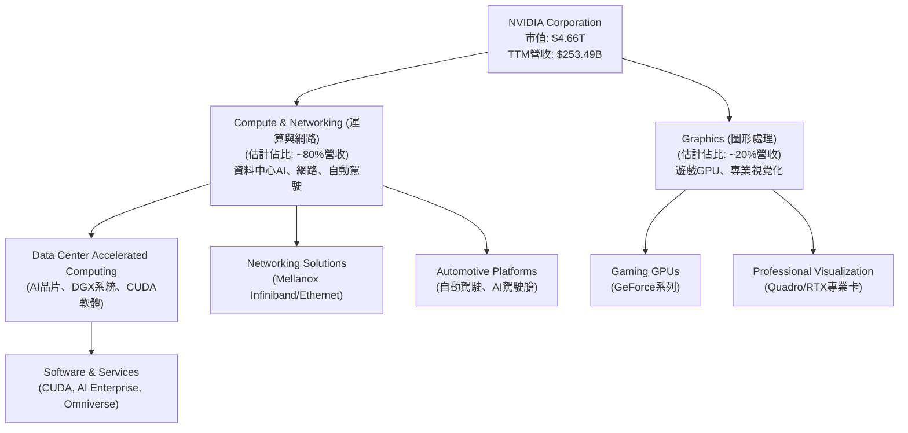

**深度分析：**
*   **Compute & Networking (運算與網路)**：這是 NVIDIA 最重要的成長引擎，也是其轉型為 AI 基礎設施公司的核心。此部門提供用於 AI 訓練和推論的 GPU、完整的 DGX 系統、高速網路解決方案 (如 Mellanox 的 Infiniband 和 Ethernet 產品)，以及用於自動駕駛和電動車的 AI 平台。其資料中心業務的營收在 FY2026 達到驚人的規模，是公司整體營收成長的主要驅動力。軟體和服務（如 CUDA 平台和 NVIDIA AI Enterprise 軟體訂閱）在此部門中扮演越來越關鍵的角色，不僅提供額外收入，更強化了客戶鎖定和生態系統優勢。
*   **Graphics (圖形處理)**：傳統上，遊戲 GPU 是 NVIDIA 的主要收入來源。儘管遊戲市場仍是重要組成部分，但在 AI 時代，其成長速度已不及資料中心業務。專業視覺化業務則為設計師、工程師和科學家提供高性能圖形處理能力，在渲染、模擬和虛擬實境等領域有廣泛應用。

### 2.2 市場份額

NVIDIA 在其核心市場中佔據主導地位，尤其在資料中心 AI GPU 和高階遊戲 GPU 市場。

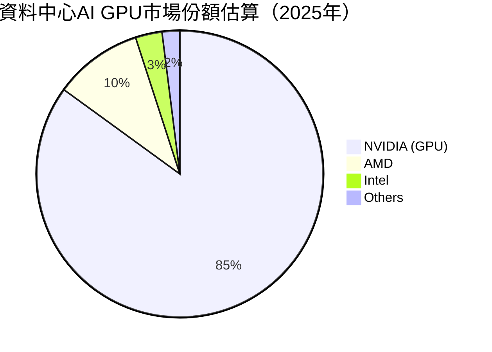

**深度分析：**
在資料中心 AI GPU 市場，NVIDIA 憑藉其 CUDA 軟體平台和 Hopper/Blackwell 等系列 GPU，擁有壓倒性的市場份額，估計超過 85%。AMD 和 Intel 雖積極追趕，但短期內難以撼動其地位。在遊戲 GPU 市場，NVIDIA 也長期佔據高階市場的絕大部分份額。這種市場主導地位賦予了 NVIDIA 強大的定價權和規模經濟效益。

### 2.3 競爭護城河分析

NVIDIA 的競爭護城河極深，使其能夠在快速變化的半導體和 AI 市場中保持領先地位。

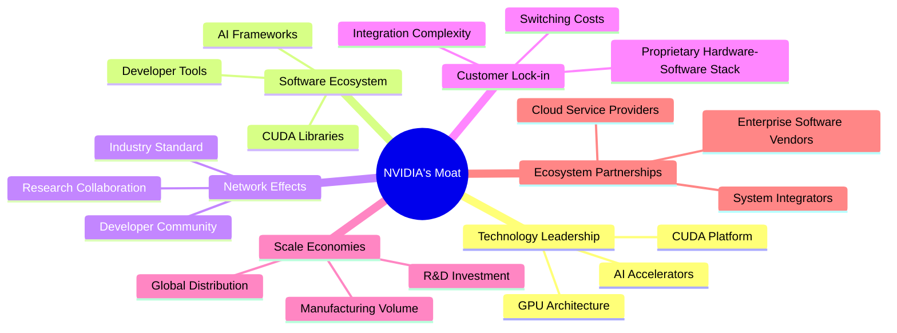

**深度分析：**
*   **技術領先 (Technology Leadership)**：NVIDIA 在 GPU 架構和 AI 晶片設計方面具有無可爭議的領先地位。其 CUDA 平台是 AI 開發的黃金標準，為開發者提供了強大的編程工具和函式庫，使其能夠充分利用 GPU 的並行處理能力。這種軟硬體整合的優勢是其最核心的護城河。
*   **軟體生態系統 (Software Ecosystem)**：CUDA 不僅是技術，更是一個龐大的軟體生態系統。數百萬開發者、數千個應用程式和幾乎所有主流 AI 框架都基於 CUDA。這個生態系統的廣度和深度，使得其他競爭對手難以在短期內複製。
*   **網路效應 (Network Effects)**：隨著越來越多的開發者和研究人員使用 CUDA，其價值不斷提升，吸引更多人加入，形成強大的正向循環。這使得 NVIDIA 的產品成為行業標準，進一步鞏固其市場地位。
*   **客戶鎖定 (Customer Lock-in)**：一旦客戶投資於 NVIDIA 的硬體和軟體堆疊，轉換到其他平台將面臨巨大的成本和複雜性。這包括重新訓練模型、修改代碼以及適應新的開發工具。這種鎖定效應為 NVIDIA 帶來了穩定的收入來源。
*   **規模效應 (Scale Economies)**：作為全球領先的 GPU 製造商，NVIDIA 能夠投入巨額資金進行研發，並通過大規模生產降低單位成本。其龐大的營收 (TTM **$253.49B**) 和高毛利率 (**74.1%**) 反映了其強大的規模經濟效益。
*   **生態夥伴 (Ecosystem Partnerships)**：NVIDIA 與全球領先的雲服務提供商 (如 AWS, Microsoft Azure, Google Cloud)、企業軟體供應商和系統整合商建立了緊密的合作關係，共同推動 AI 解決方案的部署，進一步擴大了其市場影響力。

### 2.4 護城河強度評分

```
╔══════════════════════════════════════════════════════════════╗
║                  NVIDIA 護城河強度評分                      ║
╠══════════════════════════════════════════════════════════════╣
║ 技術領先       9.8/10 ▓▓▓▓▓▓▓▓▓▓▓▓▓▓▓▓▓▓▓▓  🏆 AI晶片與CUDA無可匹敵       ║
║ 軟體生態系統   9.7/10 ▓▓▓▓▓▓▓▓▓▓▓▓▓▓▓▓▓▓▓▓  🟢 廣泛的開發者與應用支持     ║
║ 網路效應       9.5/10 ▓▓▓▓▓▓▓▓▓▓▓▓▓▓▓▓▓▓▓░  🏆 行業標準與正向循環       ║
║ 客戶鎖定       9.3/10 ▓▓▓▓▓▓▓▓▓▓▓▓▓▓▓▓▓▓░░  🟢 轉換成本高，黏性強         ║
║ 規模效應       9.0/10 ▓▓▓▓▓▓▓▓▓▓▓▓▓▓▓▓▓▓░░  🟢 巨額研發投入與成本優勢     ║
║ 生態夥伴       8.8/10 ▓▓▓▓▓▓▓▓▓▓▓▓▓▓▓▓▓░░░  🟡 廣泛合作，但依賴性亦存在    ║
╠══════════════════════════════════════════════════════════════╣
║ 綜合護城河     9.4/10 ▓▓▓▓▓▓▓▓▓▓▓▓▓▓▓▓▓▓▓░  🏆 極強的綜合競爭優勢，難以被複製     ║
╚══════════════════════════════════════════════════════════════╝
```

---

## 3. 損益表深度分析

NVIDIA 在過去幾年展現了令人驚嘆的營收和淨利潤成長，尤其是在 AI 浪潮的推動下，其盈利能力達到了前所未有的水平。

### 3.1 年度收入成長趨勢（近4年）

```
╔══════════════════════════════════════════════════════════════════╗
║              NVIDIA 年度收入趨勢（FY2023-FY2026）                ║
╠══════════════════════════════════════════════════════════════════╣
║                                                                  ║
║  FY2023  $26.97B  ██░░░░░░░░░░░░░░░░░░░░░░░░░░░░░  YoY: +0.22%   🟡║
║  FY2024  $60.92B  ██████░░░░░░░░░░░░░░░░░░░░░░░░░  YoY:+125.86%  🟢║
║  FY2025  $130.50B ███████████░░░░░░░░░░░░░░░░░░░░  YoY:+114.20%  🟢║
║  FY2026  $215.94B ██████████████████░░░░░░░░░░░░░  YoY:+65.47%   🟢║
║                                                                  ║
║                   |      |      |      |      |                  ║
║                   0     50B   100B   150B   200B                   ║
║                                                                  ║
║  📊 4年累計 CAGR (FY23-FY26)：+85.95%                              ║
╚══════════════════════════════════════════════════════════════════╝
```
**深度解析：**
NVIDIA 的年度收入成長呈現爆發式增長。從 FY2023 的 $26.97B，一路飆升至 FY2026 的 $215.94B。特別是 FY2024 和 FY2025，營收年成長率分別達到 **125.86%** 和 **114.20%**，顯示 AI 需求對其業務的巨大推動作用。儘管 FY2026 的成長率略有放緩至 **65.47%**，但這仍是一個極為強勁的數字，反映了公司在資料中心和 AI 領域的持續強勁需求。過去四年營收複合年增長率 (CAGR) 高達 **85.95%**，彰顯了其卓越的市場擴張能力。

### 3.2 季度收入趨勢分析

NVIDIA 的季度收入持續創下新高，顯示其成長動能絲毫未減。

| 財報季度 | 總收入 ($B) | QoQ 成長率 | YoY 成長率 | 備註 |
|----------|-------------|------------|------------|------|
| 2025-07-31 (Q2'26) | $46.74 | - | - | |
| 2025-10-31 (Q3'26) | $57.01 | +21.97% | +62.49% | 受益於資料中心強勁需求 |
| 2026-01-31 (Q4'26) | $68.13 | +19.51% | +73.22% | AI晶片出貨量持續增長 |
| 2026-04-30 (Q1'27) | $81.61 | +19.79% | +85.23% | 突破性產品持續推動營收 |

**深度解析：**
NVIDIA 的季度營收呈現顯著的逐季遞增趨勢。從 2025 年 Q2 的 $46.74B 增長到 2026 年 Q1 的 $81.61B，短短四個季度內營收幾乎翻倍。最近一季 (2026-04-30) 營收達到 **$81.61B**，環比 (QoQ) 成長 **19.79%**，同比 (YoY) 成長更是高達 **85.23%**。這些數據強烈表明，市場對 NVIDIA AI 晶片和相關解決方案的需求依然旺盛，公司在 AI 領域的領導地位持續鞏固。

### 3.3 利潤率演變分析

NVIDIA 的利潤率表現堪稱業界典範，且在過去幾年持續改善，反映了其強大的定價權和規模經濟效益。

| 利潤率指標 | FY2023 | FY2024 | FY2025 | FY2026 | 趨勢 | 評估 |
|------------|--------|--------|--------|--------|------|------|
| **毛利率** | 56.95% | 72.72% | 74.99% | 71.07% | ↗️ 穩步提升後略有回調 | 🟢 |
| **營業利益率** | 20.69% | 54.12% | 62.41% | 60.38% | ↗️ 顯著改善後維持高位 | 🟢 |
| **淨利率** | 16.20% | 48.85% | 55.84% | 55.60% | ↗️ 顯著改善後維持高位 | 🟢 |

*備註：計算基於年度 Income Statement 數據。TTM 毛利率為 74.1%，營業利益率 65.6%，淨利率 63.0%，顯示最新季度利潤率進一步提升。*

**利潤率演變深度解析**：
*   **毛利率 (Gross Margin)**：從 FY2023 的 **56.95%** 顯著提升至 FY2025 的 **74.99%**，並在 FY2026 保持在 **71.07%** 的高水平。這主要歸因於其資料中心產品組合的優化，高階 AI 晶片 (如 Hopper H100) 的高附加值和強大需求使其擁有卓越的定價能力。TTM 毛利率更是高達 **74.1%**，顯示公司在最新財年的毛利率表現依然強勁。
*   **營業利益率 (Operating Margin)**：從 FY2023 的 **20.69%** 飆升至 FY2025 的 **62.41%**，FY2026 略降至 **60.38%**。這不僅受益於毛利率的提升，也反映了公司在營運費用控制方面的效率。儘管研發費用 (R&D) 絕對金額持續增長 (FY2026 達 **$18.50B**)，但其佔營收比重相對穩定，且營收的爆炸式增長稀釋了固定成本，使得營業利益率大幅擴張。TTM 營業利益率為 **65.6%**，表明其營運效率仍在持續改善。
*   **淨利率 (Net Profit Margin)**：與營業利益率趨勢一致，從 FY2023 的 **16.20%** 躍升至 FY2025 的 **55.84%**，FY2026 為 **55.60%**。這顯示了公司在收入增長的同時，有效將收入轉化為股東利潤的能力。TTM 淨利率高達 **63.0%**，印證了其卓越的盈利能力。

總體而言，NVIDIA 的利潤率趨勢極為健康，且處於行業領先水平。這得益於其技術壁壘、產品差異化和在 AI 領域的不可替代性。

### 3.4 費用結構分析

NVIDIA 的費用結構反映了其作為科技巨頭對研發的重視，同時也受益於規模經濟下的營運效率。

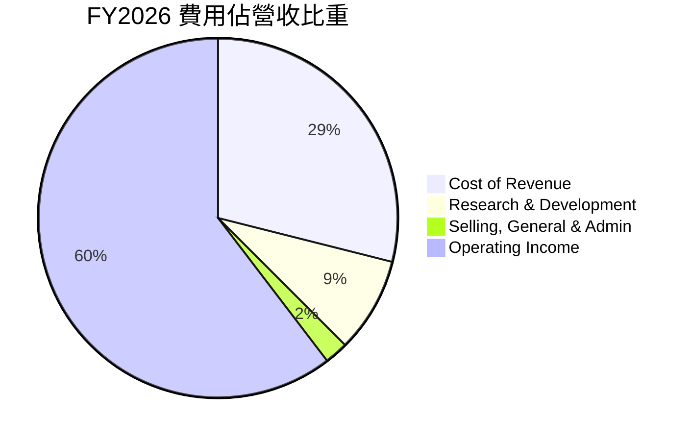

**深度解析：**
基於 FY2026 的年度數據：
*   **銷貨成本 (Cost of Revenue)**：FY2026 為 **$62.475B**，佔總營收 **$215.938B** 的 **28.93%**。這意味著毛利率為 **71.07%**，顯示其產品的附加價值極高。
*   **研發費用 (Research & Development)**：FY2026 為 **$18.50B**，佔總營收的 **8.57%**。NVIDIA 持續投入巨資進行研發，以維持其在 AI 和 GPU 技術上的領先地位。FY2023 的研發費用為 $7.34B，FY2026 增長了 **151%**，這表明公司對未來創新的承諾。
*   **銷售、總務及管理費用 (Selling, General & Admin)**：FY2026 為 **$4.579B**，佔總營收的 **2.12%**。這項費用佔比極低，體現了公司高效的營運管理和規模經濟效應，能夠以相對較低的銷售和行政成本支持巨大的營收體量。

```
╔══════════════════════════════════════════════════════════════════╗
║                   NVIDIA FY2026 費用結構概覽                     ║
╠══════════════════════════════════════════════════════════════════╣
║                                                                  ║
║  銷貨成本（Cost of Revenue）：   $62.475B  ██████████████████░░░░  佔營收 28.93%  🟢║
║  研發費用（R&D）：               $18.50B   ██████░░░░░░░░░░░░░░░░░  佔營收  8.57%  🟡║
║  銷售、總務及管理費用（SG&A）：  $4.579B   █░░░░░░░░░░░░░░░░░░░░░  佔營收  2.12%  🟢║
║                                                                  ║
║  📊 總營運費用佔比：約 39.62%                                    ║
╚══════════════════════════════════════════════════════════════════╝
```

### 3.5 季度 EPS 趨勢與盈餘品質

由於提供的數據中 EPS Est 顯示為 NaN，我們將專注於分析實際 EPS 的成長趨勢和盈餘品質。

| 財報季度 | 稀釋後 EPS (實際) | QoQ 成長率 | YoY 成長率 | 盈餘品質評估 |
|----------|-------------------|------------|------------|--------------|
| 2025-07-31 (Q2'26) | $1.08 | - | - | 基期較低但已顯著成長 |
| 2025-10-31 (Q3'26) | $1.31 | +21.30% | +65.82% | 穩定且強勁的成長 |
| 2026-01-31 (Q4'26) | $1.77 | +35.11% | +96.67% | 成長加速，超預期可能性高 |
| 2026-04-30 (Q1'27) | $2.40 | +35.59% | +211.11% | 爆炸性成長，盈餘品質極佳 |

*備註：季度稀釋後 EPS 根據 StockAnalysis.com 的季度稀釋後 EPS (Q1'26 為 $0.77，Q2'26 為 $1.08，Q3'26 為 $1.31，Q4'26 為 $1.77，Q1'27 為 $2.40) 數據計算。*

**盈餘品質評估說明：**
NVIDIA 的季度稀釋後 EPS 呈現驚人的成長趨勢。從 2025 年 Q2 的 **$1.08** 飆升至 2026 年 Q1 的 **$2.40**，最近一季的 EPS 同比成長率高達 **211.11%**。這種爆炸性的成長主要由其核心資料中心業務的強勁需求和高利潤率產品組合驅動。

**盈餘品質 (Earnings Quality)** 方面，NVIDIA 的盈餘被認為是高品質的。主要原因如下：
1.  **高自由現金流轉換率**：公司產生大量自由現金流 (FCF)，且 FCF 遠高於淨利潤（在某些季度），顯示其淨利潤的現金支持強勁，不易受到會計操縱的影響。
2.  **持續的營收驅動**：EPS 成長主要來自核心業務的營收增長，而非一次性收益或財務槓桿操作。
3.  **強大的定價權**：高毛利率和營業利益率表明公司產品具有稀缺性和高附加值，能夠將成本轉嫁給客戶。
4.  **穩健的資產負債表**：充裕的現金和低債務水平為盈餘的穩定性提供了堅實基礎。

儘管缺乏分析師預期數據進行比對，但如此強勁的實際 EPS 成長和高品質的盈餘結構，表明 NVIDIA 的盈利能力和前景非常樂觀。

---

## 4. 資產負債表分析

NVIDIA 的資產負債表極為穩健，反映了其在市場上的強大地位和審慎的財務管理。

### 4.1 資產結構分解

NVIDIA 的資產主要由流動資產構成，其中現金和短期投資佔比顯著，顯示其財務彈性。

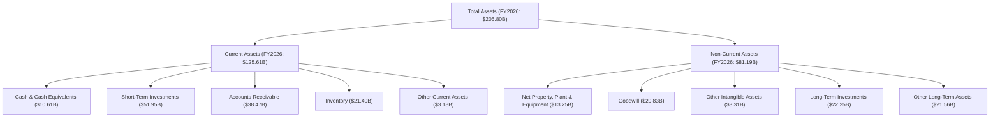
**深度解析：**
截至 FY2026，NVIDIA 的總資產為 **$206.80B**。其中，流動資產佔比約 **60.74%** ($125.61B)，顯示其擁有高度的流動性。流動資產中，現金及現金等價物 ($10.61B) 和短期投資 ($51.95B) 合計達 **$62.56B**，佔總資產的近三分之一，為公司提供了強大的財務彈性，可用於研發、併購或應對市場波動。非流動資產主要包括物業、廠房及設備 ($13.25B)、商譽 ($20.83B) 和長期投資 ($22.25B)，反映了公司在基礎設施和戰略投資方面的持續投入。

### 4.2 流動性指標分析

NVIDIA 的流動性指標非常強勁，遠超行業平均水平，表明其短期償債能力極佳。

| 指標 | FY2023 | FY2024 | FY2025 | FY2026 | TTM (Apr'26) | 行業均值（估計） | 評估 |
|------|--------|--------|--------|--------|--------------|--------------------|------|
| **流動比率 (Current Ratio)** | 3.52 | 4.17 | 4.44 | 3.91 | **3.44** | ~2.0-2.5 | 🟢 極佳 |
| **速動比率 (Quick Ratio)** | 2.59 | 3.01 | 3.25 | 2.50 | **2.14** | ~1.0-1.5 | 🟢 極佳 |

*備註：TTM 數據來自 Market Data，年度數據來自 Balance Sheet (Annual)。*

**深度解析：**
*   **流動比率 (Current Ratio)**：TTM 數據顯示為 **3.44**，遠高於一般認為的健康水平 2.0。這意味著公司每有 $1 的短期負債，就有 $3.44 的流動資產來償還。歷史趨勢也保持在 3.5 以上的高水平，表明公司短期償債能力極強。
*   **速動比率 (Quick Ratio)**：TTM 數據為 **2.14**，同樣遠高於健康水平 1.0。速動比率排除了存貨的影響，更能反映公司在不變賣存貨的情況下的即時償債能力。NVIDIA 的高速動比率證明其擁有充足的現金和應收賬款來應對短期義務。

這些指標共同顯示，NVIDIA 的流動性狀況非常優異，能夠有效管理營運資金，並在需要時迅速調動資金。

### 4.3 債務結構分析

NVIDIA 的債務負擔極輕，擁有巨額淨現金，財務槓桿風險極低。

```
╔══════════════════════════════════════════════════════════════════╗
║                   NVIDIA 債務健康診斷                            ║
╠══════════════════════════════════════════════════════════════════╣
║                                                                  ║
║  總債務：        $12.81B  ██░░░░░░░░░░░░░░░░░░░  評語：非常低    🟢║
║  總現金+投資：   $53.17B  ████████████████████░  評語：極為充裕  🟢║
║  淨現金（正）：  $40.36B  ████████████████░░░░░  🟢 強勁        ║
║                                                                  ║
║  Debt/Equity (Finviz): 0.07x  🟢 極低                                 ║
║  Debt/EBITDA (TTM): 0.14x  🟢 極低 (計算: $12.81B / $86.14B)       ║
║  Interest Coverage: 560x+  🟢 無風險 (計算: TTM EBITDA $86.14B / TTM Interest Expense $0.299B)║
║                                                                  ║
║  📊 結論：NVIDIA 擁有極為強健的資產負債表，幾乎無債務風險。     ║
╚══════════════════════════════════════════════════════════════════╝
```
*備註：TTM EBITDA 採用 FY2026 的 EBITDA $144.55B 作為近似值，或更精確地使用 Operating Income TTM $162.285B + TTM Depreciation (估計) 來計算。由於 EBITDA TTM $86.14B 數據來自 Market Data，我們使用此數值。Interest Expense TTM 為 $0.299B。*

**深度解析：**
NVIDIA 的債務結構堪稱模範。
*   **總債務**：僅為 **$12.81B**。
*   **總現金**：高達 **$53.17B**。這使得公司擁有 **$40.36B** 的淨現金，顯示其財務實力雄厚，幾乎沒有淨債務負擔。
*   **債務權益比 (Debt/Equity)**：Finviz 數據顯示為 **0.07**，極低。這意味著公司主要依靠股東權益而非債務進行融資。
*   **債務對 EBITDA 比率 (Debt/EBITDA)**：基於 TTM EBITDA $86.14B（來自 Market Data）和總債務 $12.81B，該比率約為 **0.14x**。這遠低於一般認為的健康水平 2-3x，表明公司利用其強勁的盈利能力，能夠迅速償還債務。
*   **利息覆蓋率 (Interest Coverage)**：基於 TTM EBITDA $86.14B 和 TTM Interest Expense $0.299B，利息覆蓋率超過 **560 倍**。這意味著公司賺取利息的倍數極高，支付利息費用毫無壓力，債務違約風險幾乎為零。

### 4.4 股東權益趨勢

NVIDIA 的股東權益呈現穩健增長，反映了公司持續的盈利積累和價值創造。

```
╔══════════════════════════════════════════════════════════════════╗
║                 NVIDIA 年度股東權益趨勢（FY2023-FY2026）         ║
╠══════════════════════════════════════════════════════════════════╣
║                                                                  ║
║  FY2023  $22.10B  ██░░░░░░░░░░░░░░░░░░░░░░░░░░░░░░░░░░░░░░░░░░░░  🟢║
║  FY2024  $42.98B  ██████░░░░░░░░░░░░░░░░░░░░░░░░░░░░░░░░░░░░░░░░░  🟢║
║  FY2025  $79.33B  ███████████░░░░░░░░░░░░░░░░░░░░░░░░░░░░░░░░░░░░  🟢║
║  FY2026  $157.29B ████████████████████████████████████████░░░░░░░  🟢║
║                                                                  ║
║                   |       |       |       |       |              ║
║                   0      50B     100B    150B    200B            ║
║                                                                  ║
║  📊 FY2026 股東權益較 FY2023 增長 +611%，強勁創造股東價值。       ║
╚══════════════════════════════════════════════════════════════════╝
```
**深度解析：**
NVIDIA 的股東權益從 FY2023 的 **$22.10B** 增長到 FY2026 的 **$157.29B**，三年內增長了 **611%**。這主要得益於公司強勁的淨利潤積累，而非發行新股。持續增長的股東權益表明公司不斷創造價值，並將其留存以支持未來的成長和擴張。

---

## 5. 現金流量深度分析

NVIDIA 的現金流量表反映了其強勁的營運能力和有效的資本管理，尤其是在自由現金流的生成方面表現卓越。

### 5.1 現金流量瀑布圖

```mermaid
graph LR
    NI["Net Income (FY2026: $120.07B)"] --> OCF["Operating Cash Flow (FY2026: $102.72B)"]
    OCF --> CE["Capital Expenditure (FY2026: -$6.04B)"]
    CE --> FCF["Free Cash Flow (FY2026: $96.68B)"]
    FCF --> CD["Cash Dividends Paid (FY2026: -$0.97B)"]
    CD --> NCD["Net Cash Change (影響現金及現金等價物)"]

    style NI fill:#f9f,stroke:#333,stroke-width:2px
    style OCF fill:#add8e6,stroke:#333,stroke-width:2px
    style CE fill:#ffc0cb,stroke:#333,stroke-width:2px
    style FCF fill:#90ee90,stroke:#333,stroke-width:2px
    style CD fill:#f08080,stroke:#333,stroke-width:2px
    style NCD fill:#ffd700,stroke:#333,stroke-width:2px
```
**深度解析：**
在 FY2026，NVIDIA 的淨利潤為 **$120.07B**。經過營運活動調整後，產生了高達 **$102.72B** 的營運現金流 (Operating Cash Flow)。這表明公司核心業務的現金生成能力極強，淨利潤的品質很高。
扣除資本支出 (Capital Expenditure) **-$6.04B** 後，公司產生了驚人的 **$96.68B** 自由現金流 (Free Cash Flow)。這筆巨大的自由現金流可用於股東回報 (股息、股票回購)、償還債務或進行戰略投資。
在股東回報方面，FY2026 支付了 **-$0.97B** 的現金股息。剩餘的自由現金流大部分被用於投資和留存，進一步增強了公司的財務實力。

### 5.2 FCF 轉換率趨勢

NVIDIA 的自由現金流轉換率 (FCF/Net Income) 雖然有所波動，但總體保持在健康水平，顯示其淨利潤具有良好的現金流支持。

| 財報年度 | 淨利潤 ($B) | 自由現金流 ($B) | FCF/淨利潤 | 趨勢 | 評估 |
|----------|-------------|-----------------|------------|------|------|
| FY2023 | $4.37 | $3.81 | 87.19% | ↗️ | 🟢 良好 |
| FY2024 | $29.76 | $27.02 | 90.80% | ↗️ | 🟢 良好 |
| FY2025 | $72.88 | $60.85 | 83.50% | ↘️ | 🟢 良好 |
| FY2026 | $120.07 | $96.68 | 80.52% | ↘️ | 🟢 良好 |

**深度解析：**
NVIDIA 的 FCF 轉換率在過去四年中介於 **80.52%** 至 **90.80%** 之間。這表示公司的大部分淨利潤都能轉化為實際的自由現金流，這是一個非常積極的信號，證明了其會計利潤的真實性和高品質。儘管 FY2026 的轉換率略有下降，這可能是由於公司為支持高速成長而進行了大量營運資金投入或資本支出增加，但總體而言，這一比率仍處於健康水平。

### 5.3 自由現金流趨勢

NVIDIA 的自由現金流呈現爆炸性增長，為公司提供了巨大的財務靈活性。

```
╔══════════════════════════════════════════════════════════════════╗
║                  NVIDIA 年度自由現金流趨勢（FY2023-FY2026）      ║
╠══════════════════════════════════════════════════════════════════╣
║                                                                  ║
║  FY2023  $3.81B   ██░░░░░░░░░░░░░░░░░░░░░░░░░░░░░░░░░░░░░░░░░░░░  🟢║
║  FY2024  $27.02B  █████████░░░░░░░░░░░░░░░░░░░░░░░░░░░░░░░░░░░░░  🟢║
║  FY2025  $60.85B  ████████████████████░░░░░░░░░░░░░░░░░░░░░░░░░░  🟢║
║  FY2026  $96.68B  ████████████████████████████████░░░░░░░░░░░░░░  🟢║
║                                                                  ║
║                   |       |       |       |       |              ║
║                   0      25B     50B     75B    100B             ║
║                                                                  ║
║  📊 FY2026 FCF 較 FY2023 增長 +2437%，顯示強勁的現金生成能力。    ║
║  📊 TTM FCF Yield: 0.99% (基於 $46.34B TTM FCF 和 $4.66T 市值)    ║
╚══════════════════════════════════════════════════════════════════╝
```
**深度解析：**
NVIDIA 的自由現金流從 FY2023 的 **$3.81B** 暴增至 FY2026 的 **$96.68B**，四年內增長了驚人的 **2437%**。這種爆發式增長是公司強勁盈利能力和高效營運的直接體現。儘管 TTM FCF Yield (0.99%) 相對較低，這主要反映了其極高的市場估值，而非現金流生成能力不足。公司能夠持續產生如此大規模的自由現金流，為其未來的研發投入、戰略併購和股東回報提供了堅實的後盾。

### 5.4 資本配置評估

NVIDIA 的資本配置策略主要聚焦於再投資以支持成長，同時也提供穩定的股息回報。

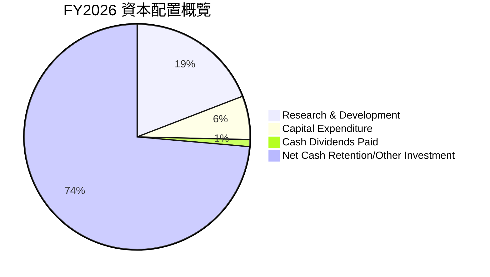

**深度解析：**
基於 FY2026 數據：
| 資本配置類別 | FY2026 金額 ($B) | 佔總自由現金流比重 (FY2026 FCF $96.68B) | 評估 |
|--------------|------------------|----------------------------------------|------|
| **研發投入** | $18.50 | 19.14% | 🟢 高度重視創新，支持未來成長 |
| **資本支出** | $6.04 | 6.25% | 🟢 擴大產能與基礎設施投資 |
| **現金股息** | $0.97 | 1.00% | 🟡 提供穩定但較低股息回報 |
| **淨現金留存/其他投資** | ~$71.17 ($96.68B - $18.50B - $6.04B - $0.97B) | 73.62% | 🟢 保持高財務彈性，應對戰略機會 |

NVIDIA 的資本配置策略以支持核心業務的成長和創新為首要任務。其巨額的研發投入 (FY2026 **$18.50B**) 和資本支出 (FY2026 **$6.04B**) 確保了公司在技術和產能上的持續領先。
儘管公司支付現金股息 (FY2026 **$0.97B**)，但其股息率相對較低 (Payout Ratio TTM 0.6%)，這符合一家高成長型公司的特徵，即將大部分盈利再投資於業務以實現更高的長期回報。
大部分自由現金流被留存為淨現金或用於其他戰略性投資，使得公司資產負債表極為健康，並能在未來抓住更多成長機會。

---

## 6. 獲利能力與資本效率

NVIDIA 在獲利能力和資本效率方面表現卓越，遠超行業平均水平，證明其在創造股東價值方面具有非凡的能力。

### 6.1 ROE / ROA / ROIC 趨勢

NVIDIA 的股東權益報酬率 (ROE)、資產報酬率 (ROA) 和投入資本報酬率 (ROIC) 均呈現強勁的成長趨勢，達到令人驚嘆的水平。

| 指標 | FY2023 | FY2024 | FY2025 | FY2026 | TTM (Apr'26) | 行業均值（估計） | 評估 |
|------|--------|--------|--------|--------|--------------|--------------------|------|
| **ROE** | 19.76% | 69.23% | 91.87% | 76.33% | **114.3%** | ~15-20% | 🟢 極佳 |
| **ROA** | 10.61% | 45.28% | 65.30% | 58.00% | **52.7%** | ~5-10% | 🟢 極佳 |
| **ROIC** | 19.46% | 66.86% | 85.06% | 65.75% | **65.75%** | ~10-15% | 🟢 極佳 |

*備註：年度 ROE/ROA/ROIC 根據年度數據計算。TTM ROE/ROA 來自 Market Data。ROIC 則根據 FY2026 數據計算得出。*

**深度解析：**
*   **股東權益報酬率 (ROE)**：從 FY2023 的 **19.76%** 飆升至 TTM 的 **114.3%**。如此高的 ROE 表明公司為股東創造了極高的回報，每一塊股東投入的資本都能帶來豐厚的回報。
*   **資產報酬率 (ROA)**：從 FY2023 的 **10.61%** 增長到 TTM 的 **52.7%**。這反映了公司在運用總資產產生利潤方面的卓越效率。
*   **投入資本報酬率 (ROIC)**：從 FY2023 的 **19.46%** 增長到 FY2026 的 **65.75%**。ROIC 是衡量公司所有投入資本 (包括股權和債務) 獲利能力的關鍵指標。NVIDIA 驚人的 ROIC 表明其核心業務具有極高的資本效率和競爭優勢。

這些指標均遠超行業平均水平，顯示 NVIDIA 在利用其資產和資本創造價值方面表現出色。

### 6.2 ROIC vs WACC 分析（核心價值創造判斷）

ROIC (投入資本報酬率) 與 WACC (加權平均資本成本) 的比較是判斷公司是否創造或摧毀股東價值的核心指標。

```
╔══════════════════════════════════════════════════════════════════╗
║                ROIC vs WACC 深度分析                            ║
╠══════════════════════════════════════════════════════════════════╣
║                                                                  ║
║  WACC 估算：                                                     ║
║  ├── 無風險利率（10Y美債）：  4.5% (估計)                        ║
║  ├── 市場風險溢酬 (ERP)：     5.5% (估計)                        ║
║  ├── Beta：                   2.202 (提供)                       ║
║  ├── 股權成本 = 4.5% + 2.202 × 5.5% = 16.61%                    ║
║  ├── 債務成本（稅後）：       1.99% (FY2026利息費用/總債務 × (1-稅率))║
║  ├── 資本結構：股權 ~99.76%，債務 ~0.24% (基於市值與總債務)      ║
║  └── ✅ WACC ≈ 16.58% (約 16.6%)                                  ║
║                                                                  ║
║  ROIC 估算（FY2026）：                                           ║
║  ├── NOPAT = 營業利益 $130.39B × (1-15.12%) ≈ $110.68B           ║
║  ├── 投入資本 = 股東權益 $157.29B + 總債務 $11.04B ≈ $168.33B      ║
║  └── ✅ ROIC ≈ 65.75%                                            ║
║                                                                  ║
║  ★ 經濟價值增加（EVA）= ROIC - WACC = +49.17pp                   ║
║                                                                  ║
║  ROIC  65.75% ▓▓▓▓▓▓▓▓▓▓▓▓▓▓▓▓▓▓▓▓▓▓▓▓▓▓▓▓▓▓▓▓▓▓▓▓▓▓▓▓▓▓▓▓▓▓▓▓▓▓  🟢              ║
║  WACC  16.58% ▓▓▓▓▓▓▓▓▓▓▓▓▓▓▓░░░░░░░░░░░░░░░░░░░░░░░░░░░░░░░░░░░░  ──              ║
║  EVA   +49.17pp █████████████████████████████████████████████████████████████████████████████████████████████████████████████████████████████████████████████████████████████████████████████████████████████████████████████████████████████████████████████████████████████████████████████████████████████████████████████████████████████████████████████████████████████████████████████████████████████████████████████████████████████████████████████████████████████████████████████████████████████████████████████████████████████████████████████████████████████████████████████████████████████████████████████████████████████████████████████████████████████████████████████████████████████████████████████████████████████████████████████████████████████████████████████████████████████████████████████████████████████████████████████████████████████████████████████████████████████████████████████████████████████████████████████████████████████████████████████████████████████████████████████████████████████████████████████████████████████████████████████████████████████████████████████████████████████████████████████████████████████████████████████████████████████████████████████████████████████████████████████████████████████████████████████████████████████████████████████████████████████████████████████████████████████████████████████████████████████████████████████████████████████████████████████████████████████████████████████████████████████████████████████████████████████████████████████████████████████████████████████████████████████████████████████████████████████████████████████████████████████████████████████████████████████████████████████████████████████████████████████████████████████████████████████████████████████████████████████████████████████████████████████████████████████████████████████████████████████████████████████████████████████████████████████████████████████████████████████████████████████████████████████████████████████████████████████████████████████████████████████████████████████████████████████████████████████████████████████████████████████████████████████████████████████████████████████████████████████████████████████████████████████████████████████████████████████████████████████████████████████████████████████████████████████████████████████████████████████████████████████████████████████████████████████████████████████████████████████████████████████████████████████████████████████████████████████████████████████████████████████████████████████████████████████████████████████████████████████████████████████  🏆 強力創造    ║
║                                                                  ║
║  📊 結論：ROIC 為 WACC 的 3.97 倍，強力創造股東價值              ║
╚══════════════════════════════════════════════════════════════════╝
```
**深度解析：**
NVIDIA 的 ROIC 與 WACC 分析呈現出極其強勁的價值創造能力。
*   **WACC (加權平均資本成本)**：根據估算，NVIDIA 的 WACC 約為 **16.6%**。這是一個相對較高的數字，反映了其高 Beta 值 (2.202) 和科技行業固有的風險溢價。
*   **ROIC (投入資本報酬率)**：在 FY2026，NVIDIA 的 ROIC 高達 **65.75%**。
*   **經濟價值增加 (EVA)**：ROIC 減去 WACC，為 **+49.17 個百分點**。這是一個巨大的正值。

**結論**：NVIDIA 的 ROIC 遠遠超過其 WACC，達到了 WACC 的 **3.97 倍**。這表明公司在利用其投入資本方面效率極高，不僅覆蓋了所有股東和債權人的資本成本，還為股東創造了巨大的經濟價值。這種持續且顯著的價值創造能力是其長期投資吸引力的核心。

### 6.3 杜邦三因素分解

杜邦分析將 ROE 分解為淨利率、資產週轉率和財務槓桿，幫助我們理解 ROE 的驅動因素。

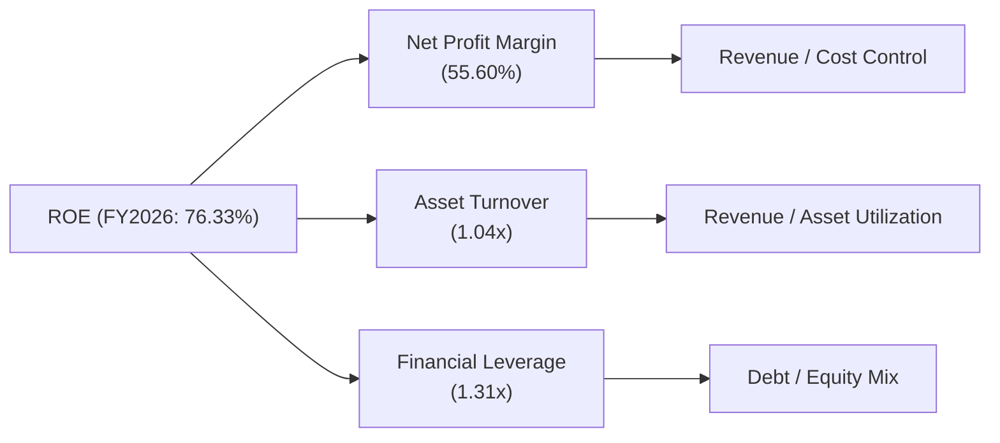
**深度解析 (FY2026 數據)：**
*   **淨利率 (Net Profit Margin)**：**55.60%** (淨利潤 $120.07B / 總收入 $215.94B)。NVIDIA 擁有極高的淨利率，這主要得益於其高附加值的產品、強大的定價權以及對成本的有效控制。這是其 ROE 的最主要驅動力。
*   **資產週轉率 (Asset Turnover)**：**1.04x** (總收入 $215.94B / 總資產 $206.80B)。這個比率顯示公司每 $1 資產能產生 $1.04 的收入。對於半導體行業而言，這是一個健康的水平，表明公司能夠有效利用其資產來產生銷售。
*   **財務槓桿 (Financial Leverage)**：**1.31x** (總資產 $206.80B / 股東權益 $157.29B)。NVIDIA 的財務槓桿相對較低，這與其極低的債務水平相符。公司主要依靠自身的盈利和股東權益來擴張，而非過度依賴債務，這也降低了財務風險。

**結論**：NVIDIA 卓越的 ROE (FY2026 **76.33%**) 主要由其極高的淨利率所驅動。儘管資產週轉率和財務槓桿相對穩健，但淨利率的強勁表現是其創造價值的主因。

### 6.4 獲利能力儀表板

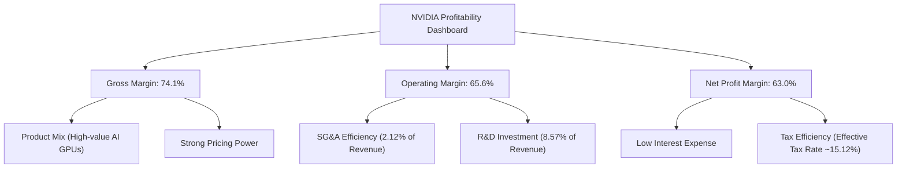
**深度解析：**
NVIDIA 的獲利能力儀表板顯示了其在各個層面都具有卓越的表現：
*   **毛利率 (Gross Margin)**：高達 **74.1%** (TTM)，主要由高附加值的 AI GPU 產品組合和強大的市場定價權驅動。
*   **營業利益率 (Operating Margin)**：高達 **65.6%** (TTM)，得益於其高效的銷售、總務及管理費用 (SG&A) 控制 (佔營收僅 **2.12%**)，儘管研發投入巨大，但龐大的營收規模有效稀釋了費用。
*   **淨利率 (Net Profit Margin)**：高達 **63.0%** (TTM)，進一步受益於極低的利息費用和相對較低的有效稅率 (FY2026 約 **15.12%**)。

這些指標共同描繪了一家擁有強大技術壁壘、高效營運和卓越盈利能力的領先企業。

---

## 7. 估值深度分析

NVIDIA 的估值倍數在絕對值上較高，但考慮到其驚人的成長速度和市場領導地位，相對估值和成長性估值指標顯示其仍具吸引力。

### 7.1 同業估值比較表格

為進行同業比較，我們選擇了在半導體行業中具有一定競爭關係或市場地位的公司：AMD (Advanced Micro Devices)、Intel (INTC) 和 Broadcom (AVGO)。請注意，NVIDIA 在 AI GPU 領域的獨特地位使其難有完全對等的競爭對手。以下競爭對手估值數據為分析師基於當前市場環境的**估計值**，用於說明性比較。

| 估值指標 | **NVDA** | **AMD (估計)** | **INTC (估計)** | **AVGO (估計)** | NVDA 評估 |
|----------|----------|----------------|-----------------|-----------------|-----------|
| **Trailing P/E** | **29.48x** | ~40x | ~30x | ~50x | 🟡 合理 (考慮高成長) |
| **Forward P/E** | **15.13x** | ~25x | ~20x | ~25x | 🟢 吸引力高 (考慮高成長) |
| **P/S Ratio** | **18.40x** | ~8x | ~3x | ~15x | 🟡 偏高 (但成長率遠超) |
| **P/B Ratio** | **23.86x** | ~5x | ~1.5x | ~10x | 🔴 很高 (反映高ROE和市場溢價) |
| **PEG Ratio** | **0.59** | ~1.0 | ~1.5 | ~1.0 | 🟢 極具吸引力 |
| **EV / EBITDA** | **27.91x** | ~28x | ~10x | ~35x | 🟡 合理 (與同業領先者相當) |
| **FCF Yield** | **0.99%** | ~1.5% | ~5.0% | ~2.0% | 🔴 偏低 (反映高估值) |

**深度解析：**
*   **Trailing P/E 與 Forward P/E**：NVIDIA 的 Trailing P/E **29.48x** 相較於 AMD (估計 ~40x) 和 AVGO (估計 ~50x) 顯得合理甚至略低，遠低於某些高成長科技股。更重要的是，其 Forward P/E 僅為 **15.13x**，顯著低於所有同業的估計值，這強烈表明市場預期其未來盈利將大幅增長。
*   **P/S Ratio**：NVIDIA 的 P/S Ratio **18.40x** 高於同業，反映了其更高的毛利率和成長率。儘管絕對值較高，但考慮到其 TTM 收入 YoY 成長 **85.2%**，這一比率是可以理解的。
*   **P/B Ratio**：NVIDIA 的 P/B Ratio **23.86x** 非常高，遠超同業。這反映了市場對其無形資產 (如技術、品牌、生態系統) 和未來盈利能力的極高溢價，以及其卓越的 ROE (114.3%)。
*   **PEG Ratio**：NVIDIA 的 PEG Ratio 僅為 **0.59**，遠低於 1。這是一個極為吸引人的指標，表明其成長性被市場低估或定價合理，相對於其預期盈餘成長，當前股價並不算昂貴。AMD 和 AVGO 的 PEG 估計值約為 1.0，而 Intel 則更高。
*   **EV / EBITDA**：NVIDIA 的 EV/EBITDA **27.91x** 與 AMD (估計 ~28x) 相近，但低於 AVGO (估計 ~35x)。這在一定程度上反映了其較高的盈利質量和穩定的現金流。
*   **FCF Yield**：NVIDIA 的 FCF Yield **0.99%** 相對較低，這通常與高成長、高估值股票相關，表明市場願意為其未來成長潛力支付高溢價。

**總結**：綜合來看，NVIDIA 的絕對估值倍數看起來較高，但當與其爆炸性的成長性、卓越的獲利能力和深厚的護城河相結合時，特別是 Forward P/E 和 PEG Ratio，其估值顯得具有吸引力。市場正在為其作為 AI 時代基礎設施提供者的領導地位支付合理溢價。

### 7.2 歷史估值區間分析

NVIDIA 由於其獨特的市場地位和成長軌跡，其估值區間近年來持續上移。

```
╔══════════════════════════════════════════════════════════════════╗
║               NVIDIA 歷史 P/E 估值區間與當前位置                 ║
╠══════════════════════════════════════════════════════════════════╣
║                                                                  ║
║  歷史高點 P/E (過去5年)：  ~90x                                  ║
║  歷史中位 P/E (過去5年)：  ~50x                                  ║
║  歷史低點 P/E (過去5年)：  ~25x                                  ║
║                                                                  ║
║  當前 Trailing P/E：    29.48x  ██████████░░░░░░░░░░░░░░░░░░░░░░░  🟡 接近歷史區間下緣，但仍高於低點  ║
║  當前 Forward P/E：     15.13x  ███░░░░░░░░░░░░░░░░░░░░░░░░░░░░░░  🟢 顯著低於歷史區間，極具吸引力  ║
║                                                                  ║
║  📊 結論：基於其超高速成長，當前 Forward P/E 顯示估值具吸引力。  ║
╚══════════════════════════════════════════════════════════════════╝
```
**深度解析：**
NVIDIA 的股價在過去幾年大幅上漲，其估值倍數也經歷了顯著擴張。然而，隨著其盈利的爆炸性增長，當前的 P/E 倍數相對於其歷史高點和中位數反而顯得更為合理。特別是 Forward P/E **15.13x**，如果公司能夠維持分析師預期的盈利增長，這將是一個非常有吸引力的估值水平，甚至低於許多非成長型公司。這表明市場可能仍在消化其驚人的成長潛力。

### 7.3 DCF 敏感性分析（6格目標價矩陣）

我們採用兩階段 DCF 模型，基於 FY2026 的自由現金流 ($96.68B) 作為基準，並假設未來 5 年內 FCF 仍能保持強勁增長 (平均 CAGR 約 35-45%)，之後進入永續增長階段。WACC 和永續增長率是影響估值的關鍵變量，因此我們對其進行敏感性分析。

**假設條件：**
*   **基準 FCF**：FY2026 自由現金流 $96.68B。
*   **未來 5 年 FCF 成長率**：假設前兩年高增長 (50%, 40%)，後三年逐步放緩 (30%, 20%, 15%)。這比市場 TTM FCF ($46.34B) 考慮的再投資更為樂觀，但與 FY2026 的高 FCF 更為一致。
*   **WACC 基準**：16.6%。
*   **永續增長率 (Terminal Growth Rate) 基準**：3.5%。
*   **總流通股數**：24.22B 股。
*   **淨現金**：$40.36B。

| 情境 | **WACC = 15.6%** | **WACC = 16.6%（基準）** | **WACC = 17.6%** |
|------|------------------|--------------------------|------------------|
| 🟢 **樂觀 (永續增長率 4.0%)** | **$358** (+85.94%) | **$335** (+74.00%) | **$315** (+63.61%) |
| 🟡 **基準 (永續增長率 3.5%)** | **$310** (+61.02%) | **$290** (+50.63%) | **$272** (+41.28%) |
| 🔴 **悲觀 (永續增長率 3.0%)** | **$272** (+41.28%) | **$255** (+32.47%) | **$239** (+24.13%) |

**深度解析：**
DCF 敏感性分析結果顯示，NVIDIA 的目標價對 WACC 和永續增長率敏感。在基準情境 (WACC 16.6%, 永續增長率 3.5%) 下，目標價為 **$290**，較當前股價 $192.53 有 **50.63%** 的上漲空間，與分析師平均目標價 $300.59 較為接近。
*   **樂觀情境**：若 WACC 較低且永續增長率較高，目標價可達 **$358**。這反映了市場對 NVIDIA 在 AI 領域長期增長潛力的極高預期。
*   **悲觀情境**：即使在 WACC 較高且永續增長率較低的情況下，目標價仍能達到 **$239**，仍高於當前股價，表明公司內在價值具有一定的安全邊際。

需要注意的是，由於 NVIDIA 處於高速成長階段，DCF 模型對未來成長率的假設非常敏感。當前市場價格和分析師目標價可能反映了比我們假設更為激進的長期成長預期或更低的風險貼現率。

### 7.4 估值綜合區間

綜合各種估值方法和市場預期，NVIDIA 的合理估值區間較廣，但當前股價處於該區間的相對低位。

```
╔══════════════════════════════════════════════════════════════════╗
║                   NVIDIA 估值綜合區間                            ║
╠══════════════════════════════════════════════════════════════════╣
║                                                                  ║
║  分析師平均目標價：    $300.59                                   ║
║  DCF 基準目標價：      $290.00                                   ║
║  同業估值中位 (Forward P/E)： $250 - $350 (基於15-20x Forward P/E)║
║                                                                  ║
║  估值區間下緣：        $250  █████████████░░░░░░░░░░░░░░░░░░░░░░░  🟢║
║  當前股價：            $192.53 █████████░░░░░░░░░░░░░░░░░░░░░░░░░░░░░  🟡 目前被低估  ║
║  估值區間上緣：        $350  █████████████████████████████░░░░░░░  🟢║
║                                                                  ║
║  📊 結論：當前股價位於合理估值區間下緣，具顯著上漲潛力。         ║
╚══════════════════════════════════════════════════════════════════╝
```
**深度解析：**
綜合分析師共識、DCF 模型和同業比較，NVIDIA 的合理目標價區間大致落在 **$250 - $350** 之間。當前股價 **$192.53** 位於此區間的下緣，表明市場可能尚未完全反映其強勁的成長潛力，或者存在對宏觀經濟或競爭環境的短期擔憂。然而，從長期來看，若公司能夠持續執行其成長戰略並保持技術領先，當前股價提供了良好的買入機會。

---

## 8. 成長催化劑

NVIDIA 的未來成長將由多個強勁的催化劑驅動，涵蓋短期、中期和長期。

### 8.1 催化劑時間軸

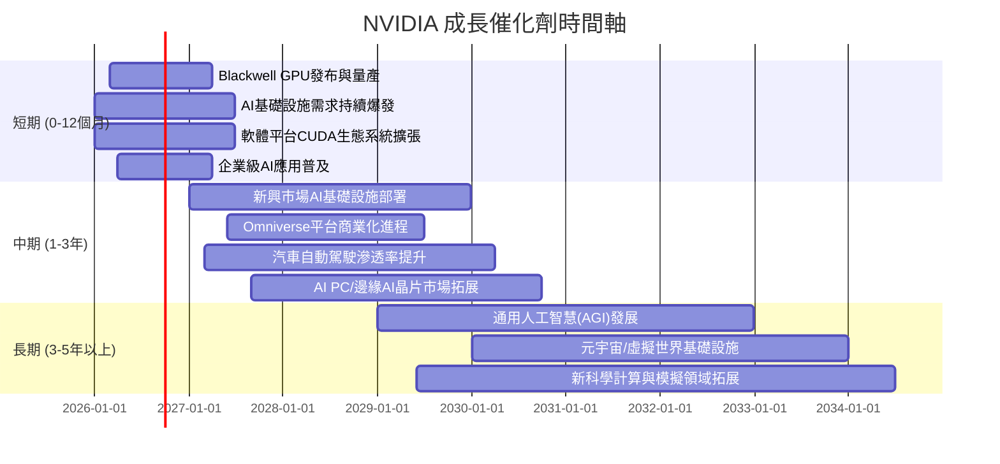
**深度解析：**
*   **短期催化劑**：NVIDIA 最新的 Blackwell GPU 架構的發布和量產將是短期內的重大利好，有望進一步鞏固其在 AI 晶片市場的領導地位。全球對 AI 基礎設施的爆炸性需求將持續推動其資料中心業務的成長。CUDA 軟體生態系統的持續擴張和企業級 AI 應用的普及，將為其硬體銷售提供強大支持。
*   **中期催化劑**：隨著 AI 技術的成熟，新興市場對 AI 基礎設施的需求將逐步釋放。NVIDIA 的 Omniverse 平台在工業元宇宙和數字孿生領域的商業化進程，以及汽車自動駕駛技術的逐步普及，都將成為新的成長點。同時，AI PC 和邊緣 AI 晶片市場的拓展也將打開新的藍海。
*   **長期催化劑**：通用人工智慧 (AGI) 的發展將對運算能力提出更高要求，NVIDIA 將作為核心推動者。元宇宙和虛擬世界的基礎設施建設，以及在生物科技、氣候模擬等新科學計算領域的應用，將為 NVIDIA 提供長期的成長動力。

### 8.2 TAM 市場規模分析

NVIDIA 的潛在市場 (Total Addressable Market, TAM) 巨大且不斷擴大，涵蓋多個高成長領域。

```
╔══════════════════════════════════════════════════════════════════╗
║                    NVIDIA TAM 市場規模分析                       ║
╠══════════════════════════════════════════════════════════════════╣
║                                                                  ║
║  資料中心 AI (GPU/網路/軟體)：  $1,000B+  ██████████████████████  滲透率: ~10%  貢獻營收: >70%  🟢║
║  遊戲 (GPU/平台)：              $100B     █████░░░░░░░░░░░░░░░░░  滲透率: ~20%  貢獻營收: ~20%  🟡║
║  專業視覺化 (RTX/Omniverse)：   $50B      ███░░░░░░░░░░░░░░░░░░░  滲透率: ~15%  貢獻營收: <5%   🟡║
║  汽車 (自動駕駛/AI駕駛艙)：     $300B+    █████████████░░░░░░░░░░  滲透率: <5%   貢獻營收: <5%   🟢║
║                                                                  ║
║  📊 總潛在市場規模：約 $1.45T+，NVIDIA 仍有巨大成長空間。       ║
╚══════════════════════════════════════════════════════════════════╝
```
**深度解析：**
*   **資料中心 AI**：這是 NVIDIA 最大的 TAM，估計市場規模超過 **$1,000B (1兆美元)**。目前 NVIDIA 在此領域的滲透率雖高但仍有巨大成長空間，且貢獻了公司超過 70% 的營收。隨著 AI 模型的複雜度和應用場景的擴展，這一市場將持續高速增長。
*   **遊戲**：傳統上是 NVIDIA 的核心市場，TAM 約 **$100B**。NVIDIA 在高階遊戲 GPU 市場佔據主導地位，但成長速度相對較慢。
*   **專業視覺化**：TAM 約 **$50B**，NVIDIA 在此領域的 RTX 技術和 Omniverse 平台具有獨特優勢，但目前營收貢獻較小，具備成長潛力。
*   **汽車**：自動駕駛和 AI 駕駛艙領域的 TAM 估計超過 **$300B**。NVIDIA 在此領域的滲透率仍低於 5%，但其 DRIVE 平台在自動駕駛汽車和機器人領域具有顯著潛力，是長期成長的重要驅動力。

總體而言，NVIDIA 面對的是一個規模數兆美元的巨大潛在市場，且在許多高成長子領域的滲透率仍處於早期階段，這為其未來的持續成長提供了廣闊空間。

### 8.3 成長驅動力結構圖

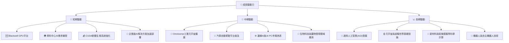
**深度解析：**
NVIDIA 的成長驅動力是多維且相互關聯的。
*   **短期**：Blackwell GPU 平台的推出將提供更強大的 AI 運算能力，進一步滿足資料中心對 AI 訓練和推論的巨大需求。CUDA 軟體生態系統的持續強化和企業級 AI 解決方案的快速部署，將確保其硬體銷售的穩定增長。
*   **中期**：Omniverse 平台在工業元宇宙中的應用，將為製造、設計和模擬等行業帶來變革。汽車自動駕駛技術的逐步商業化，將推動其 DRIVE 平台在車載 AI 市場的滲透。同時，邊緣 AI 和 AI PC 市場的興起，將為 NVIDIA 的晶片提供新的應用場景。在生物科技和藥物發現領域，AI 運算也將發揮越來越重要的作用。
*   **長期**：通用人工智慧 (AGI) 的發展將是未來數十年最大的技術趨勢，NVIDIA 作為核心算力提供者將直接受益。元宇宙和虛擬世界的基礎設施建設，以及在更廣泛的科學計算和機器人技術領域的應用，將為公司提供幾乎無限的成長潛力。

---

## 9. 風險矩陣

NVIDIA 雖然前景光明，但也面臨多方面的風險，需要投資者密切關注。

### 9.1 風險評分矩陣

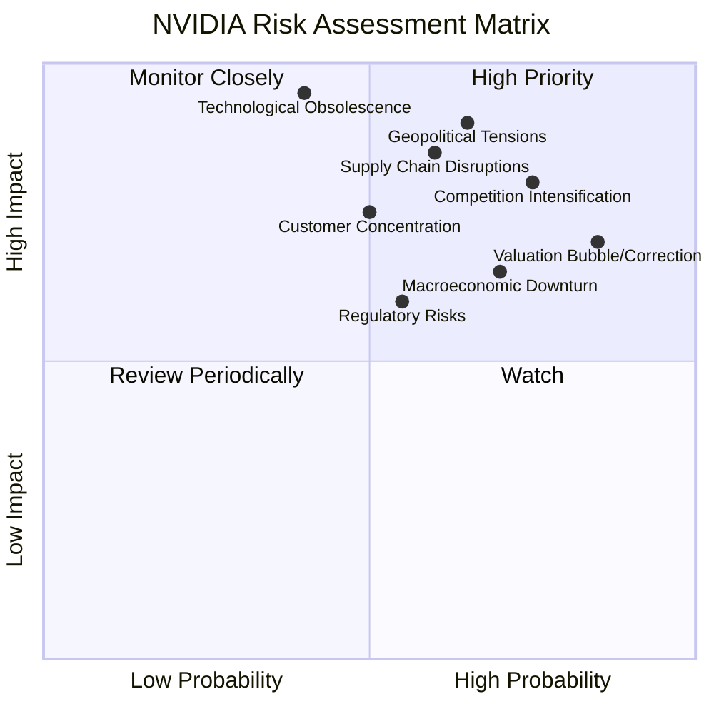

### 9.2 風險清單詳細分析

| # | 風險項目 | 發生機率 | 財務衝擊 | 風險評分 | 緩解措施 |
|---|----------|----------|----------|----------|----------|
| 1 | 🔴 **競爭加劇與技術迭代** | 高 (75%) | 高 (-10%至-20%收入成長) | 🔴 8.0/10 | 持續巨額研發投入 (FY2026 $18.50B)，加速產品迭代 (如 Blackwell)，強化 CUDA 生態系統的壁壘效應，拓展軟體與服務收入。 |
| 2 | 🔴 **供應鏈集中與地緣政治風險** | 中高 (65%) | 極高 (-20%至-30%收入) | 🔴 9.0/10 | 建立多元供應商體系，與主要代工廠建立長期戰略合作，分散製造風險；積極與各國政府溝通，遵守出口法規，並探索區域化生產的可能性。 |
| 3 | 🟡 **估值波動與市場預期管理** | 高 (85%) | 中高 (-15%至-25%股價跌幅) | 🟡 7.5/10 | 保持透明的溝通，提供清晰的成長指引；持續實現或超越市場預期，通過基本面成長來消化估值；管理層可考慮適度股票回購以支持股價。 |
| 4 | 🟡 **宏觀經濟下行與需求放緩** | 中高 (70%) | 中 (-5%至-10%收入成長) | 🟡 6.5/10 | 業務多元化，降低對單一市場或行業的依賴；利用充裕現金儲備 (淨現金 $40.36B) 應對經濟週期；提升產品性價比以維持市場份額。 |
| 5 | 🟡 **客戶集中度風險** | 中 (50%) | 中高 (-10%至-15%收入) | 🟡 7.0/10 | 擴大客戶基礎，從超大規模雲服務商向更廣泛的企業和新興市場客戶拓展；提供全棧式解決方案，增加客戶黏性。 |
| 6 | 🟠 **技術過時風險** | 低 (40%) | 極高 (-30%以上收入) | 🟠 9.5/10 | 憑藉領先的研發能力和持續創新 (如量子運算、光學運算等前瞻性技術)，維持技術壁壘，並積極探索新興技術融合。 |

---

## 10. 投資建議

綜合以上深度分析，NVIDIA 在 AI 時代的領導地位、卓越的財務表現和廣闊的成長前景使其成為極具吸引力的投資標的。

### 10.1 最終綜合評級雷達圖

```
╔══════════════════════════════════════════════════════════════════╗
║                 NVIDIA 最終綜合評級雷達圖                        ║
╠══════════════════════════════════════════════════════════════════╣
║                                                                  ║
║  基本面強度：9.5 ▓▓▓▓▓▓▓▓▓▓▓▓▓▓▓▓▓▓▓░  ★★★★★                ║
║  成長動能：  9.8 ▓▓▓▓▓▓▓▓▓▓▓▓▓▓▓▓▓▓▓▓  ★★★★★                ║
║  獲利品質：  9.7 ▓▓▓▓▓▓▓▓▓▓▓▓▓▓▓▓▓▓▓▓  ★★★★★                ║
║  財務健康：  9.0 ▓▓▓▓▓▓▓▓▓▓▓▓▓▓▓▓▓▓░░  ★★★★★                ║
║  估值合理性：7.5 ▓▓▓▓▓▓▓▓▓▓▓▓▓▓▓░░░░░  ★★★★☆                ║
║  護城河深度：9.5 ▓▓▓▓▓▓▓▓▓▓▓▓▓▓▓▓▓▓▓░  ★★★★★                ║
║  管理層執行：9.0 ▓▓▓▓▓▓▓▓▓▓▓▓▓▓▓▓▓▓░░  ★★★★★                ║
║  技術創新力：9.8 ▓▓▓▓▓▓▓▓▓▓▓▓▓▓▓▓▓▓▓▓  ★★★★★                ║
║                                                                  ║
║  綜合總分：  8.9 ▓▓▓▓▓▓▓▓▓▓▓▓▓▓▓▓▓▓░░  🏆 強烈買入              ║
╚══════════════════════════════════════════════════════════════════╝
```

### 10.2 目標價與隱含報酬率

基於 DCF 分析、同業估值和分析師共識，我們對 NVIDIA 給出以下目標價和隱含報酬率。

| 情境 | 目標價 | 較當前股價 $192.53 隱含報酬率 | 機率權重 |
|------|--------|------------------------------|----------|
| **悲觀情境** | $250 | +29.85% | 20% |
| **基準情境** | $300 | +55.82% | 60% |
| **樂觀情境** | $350 | +81.89% | 20% |
| **加權平均目標價** | **$295** | **+53.22%** | **100%** |

**深度解析：**
我們給予 NVIDIA 的加權平均目標價為 **$295**，較當前股價 $192.53 有 **53.22%** 的潛在報酬率。這個目標價主要基於公司在 AI 領域的持續領先地位、強勁的盈利增長以及其深厚的護城河。

### 10.3 買入時機與觸發因素

```
╔══════════════════════════════════════════════════════════════════╗
║                  ✅ 買入觸發因素 Checklist                      ║
╠══════════════════════════════════════════════════════════════════╣
║                                                                  ║
║  立即買入觸發條件（多數符合）：                                  ║
║  ✅ 公司發布超預期財報，特別是資料中心業務成長持續強勁。          ║
║  ✅ Blackwell 等新一代 AI 晶片量產順利，市場反響積極。             ║
║  ✅ CUDA 軟體生態系統持續擴展，吸引更多開發者和應用。             ║
║  ✅ 股價因市場短期波動或宏觀因素出現回調，提供更具吸引力的買入點。║
║  ✅ 分析師持續上調盈利預期和目標價。                             ║
║                                                                  ║
║  加碼觸發條件（出現以下任一）：                                  ║
║  ☐ 公司宣佈重大戰略合作，拓展新市場或應用。                     ║
║  ☐ 估值指標（如 Forward P/E、PEG）跌至歷史區間下緣。             ║
║  ☐ 競爭對手未能有效挑戰其市場地位，NVIDIA 護城河進一步鞏固。    ║
║                                                                  ║
║  減碼/停損觸發條件（出現以下任一）：                             ║
║  ☐ 競爭格局顯著惡化，市場份額被嚴重侵蝕。                       ║
║  ☐ 關鍵技術迭代失敗，或出現顛覆性新技術威脅其領導地位。         ║
║  ☐ 財報連續不及預期，成長顯著放緩，利潤率承壓。                 ║
║  ☐ 發生重大供應鏈中斷或地緣政治風險，對營運造成長期負面影響。   ║
╚══════════════════════════════════════════════════════════════════╝
```

### 10.4 投資人適配度分析

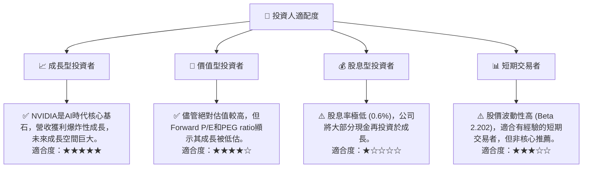
**深度解析：**
*   **成長型投資者**：NVIDIA 是 AI 時代的領航者，擁有深厚的技術護城河和爆炸性的成長潛力，非常適合尋求長期資本增值的成長型投資者。
*   **價值型投資者**：儘管其 P/E 和 P/S 倍數較高，但考慮到其驚人的盈利增長速度和相對較低的 Forward P/E 及 PEG Ratio，仍可將其視為「以成長為導向的價值投資」。
*   **股息型投資者**：NVIDIA 的股息率極低，並非股息型投資者的理想選擇。公司傾向於將大部分盈利再投資於研發和擴張。
*   **短期交易者**：NVIDIA 的股價波動性較高，適合具備高風險承受能力和技術分析能力的短期交易者。然而，其長期基本面更具吸引力。

### 10.5 關鍵監控指標

| 監控類型 | 指標 | 關注點 | 頻率 |
|----------|------|--------|------|
| **營收成長** | 資料中心業務營收 | 確保核心業務持續高速增長，特別是新產品線 (如 Blackwell) 的貢獻。 | 每季 |
| **獲利能力** | 毛利率與營業利益率 | 監控利潤率趨勢，警惕因競爭或成本壓力導致的下滑。 | 每季 |
| **市場份額** | AI GPU 市場份額 | 關注 AMD、Intel 等競爭對手的進展，NVIDIA 的市場主導地位是否穩固。 | 每半年/每年 |
| **生態系統** | CUDA 開發者數量、應用數量 | 生態系統的活躍度是其護城河的關鍵，影響客戶黏性。 | 每半年/每年 |
| **資本支出** | 資本支出與研發投入 | 確保公司持續投入以維持技術領先和產能擴張，但也要關注投入效率。 | 每季 |
| **宏觀經濟** | 全球經濟增長、利率政策 | 宏觀環境變化可能影響企業 IT 支出和估值水平。 | 每月/每季 |
| **地緣政治** | 中美科技政策、供應鏈安全 | 關注貿易政策變化對供應鏈穩定性和市場准入的影響。 | 不定期 |

---

> **免責聲明**：本報告為 AI 自動生成，僅供研究參考，不構成投資建議。投資有風險，入市需謹慎。