# NVDA 基本面深度分析報告
> **報告日期**：2026-06-28 ｜ **語言**：繁體中文 ｜ **數據來源**：Yahoo Finance, Finviz, StockAnalysis, Roic.ai ｜ **分析師**：CFA 級機構研究

---

## 目錄

| # | 章節 | 核心結論 |
|---|------|----------|
| 1 | 執行摘要 | 評級：🟢 強烈買入，基準目標價：$290.00 |
| 2 | 公司概覽與商業模式 | 憑藉技術領先和強大生態系統建立極寬護城河 |
| 3 | 損益表深度分析 | 營收與淨利潤呈爆炸式增長，利潤率持續擴張 |
| 4 | 資產負債表分析 | 財務狀況極為健康，現金充裕且債務水平極低 |
| 5 | 現金流量深度分析 | 自由現金流強勁，資本配置效率高 |
| 6 | 獲利能力與資本效率 | ROIC 遠超 WACC，持續為股東創造巨大價值 |
| 7 | 估值深度分析 | 相較於其成長性與獲利能力，當前估值具吸引力 |
| 8 | 成長催化劑 | AI 基礎設施需求、新產品週期、軟體生態擴張 |
| 9 | 風險矩陣 | 競爭加劇、供應鏈中斷、地緣政治風險需警惕 |
| 10 | 投資建議 | 強烈買入，中長期成長潛力巨大 |

---

## 1. 執行摘要

### 1.1 核心評分儀表板

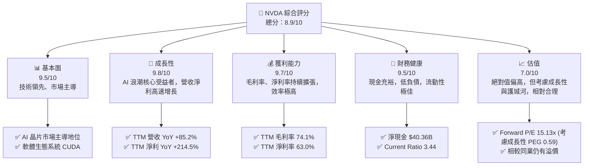

### 1.2 評分進度條視覺化

```
╔══════════════════════════════════════════════════════════════╗
║              NVDA 多維度評分儀表板 (1-10分)                  ║
╠══════════════════════════════════════════════════════════════╣
║ 基本面強度  9.5 ▓▓▓▓▓▓▓▓▓▓▓▓▓▓▓▓▓▓▓░  ★★★★★           ║
║ 成長動能    9.8 ▓▓▓▓▓▓▓▓▓▓▓▓▓▓▓▓▓▓▓▓  ★★★★★           ║
║ 獲利品質    9.7 ▓▓▓▓▓▓▓▓▓▓▓▓▓▓▓▓▓▓▓▓  ★★★★★           ║
║ 財務健康    9.5 ▓▓▓▓▓▓▓▓▓▓▓▓▓▓▓▓▓▓▓░  ★★★★★           ║
║ 估值合理性  7.0 ▓▓▓▓▓▓▓▓▓▓▓▓▓▓░░░░░░  ★★★★☆           ║
║ 護城河深度  9.8 ▓▓▓▓▓▓▓▓▓▓▓▓▓▓▓▓▓▓▓▓  ★★★★★           ║
║ 管理層執行  9.5 ▓▓▓▓▓▓▓▓▓▓▓▓▓▓▓▓▓▓▓░  ★★★★★           ║
║ 技術創新力  9.9 ▓▓▓▓▓▓▓▓▓▓▓▓▓▓▓▓▓▓▓▓  ★★★★★           ║
╠══════════════════════════════════════════════════════════════╣
║ 綜合總分    8.9 ▓▓▓▓▓▓▓▓▓▓▓▓▓▓▓▓▓░░░  🏆 評語：AI 時代的領航者，基本面極其強勁，成長動能無可匹敵，估值雖高但具備成長支撐。║
╚══════════════════════════════════════════════════════════════╝
```

### 1.3 五大投資論點 + 三大核心風險

| 類型 | 項目 | 具體依據 | 信心度 |
|------|------|----------|--------|
| 🟢 **投資論點①** | **AI 基礎設施主導地位** | NVIDIA 在資料中心 AI 晶片市場佔據領先地位，提供從 GPU (如 Hopper, Blackwell) 到網路解決方案 (InfiniBand) 及軟體 (CUDA, cuDNN) 的完整堆疊。TTM 資料中心營收應為主要驅動力，推動總營收 YoY 成長 85.2%，淨利 YoY 成長 214.5%。 | 🟢 極高 |
| 🟢 **強大的軟體生態系統 CUDA** | CUDA 平台為開發者提供了無與倫比的 AI/HPC 軟體工具，形成巨大的客戶鎖定效應和網路效應。這使得競爭對手難以在短期內追趕，確保了其長期競爭優勢。 | 🟢 極高 |
| 🟢 **爆炸性財務增長與高效率** | 公司營收從 FY2023 的 $26.97B 增長至 FY2026 的 $215.94B，複合年增長率高達 99.4%。TTM 毛利率高達 74.1%，淨利率 63.0%，顯示其強大的定價能力和經營效率。 | 🟢 極高 |
| 🟢 **穩健的財務健康狀況** | 擁有 $53.17B 的總現金和 $40.36B 的淨現金，流動比率 3.441，速動比率 2.139，財務槓桿極低 (Debt/Equity 0.07)，足以支撐未來研發投入和市場擴張。 | 🟢 極高 |
| 🟢 **持續的技術創新與產品迭代** | NVIDIA 不斷推出領先業界的 GPU 架構 (如 Blackwell 平台)，並積極拓展 Omniverse 等新興領域，確保其在高速發展的 AI 領域保持前沿地位。 | 🟢 極高 |
| 🟡 **風險①** | **AI 晶片市場競爭加劇** | AMD (MI300系列)、Intel (Gaudi系列) 等競爭對手正積極投入 AI 晶片研發，可能對 NVIDIA 的市場份額和定價能力構成挑戰。 | 🟡 中度 |
| 🟡 **風險②** | **地緣政治與供應鏈風險** | 全球半導體供應鏈的複雜性以及中美科技競爭，可能導致晶片生產或銷售受阻，尤其是在關鍵的台灣製造環節。 | 🟡 中度 |
| 🔴 **風險③** | **估值回調風險** | 雖然成長性強勁，但當前 P/E (TTM) 29.48x 仍高於歷史平均水平，若成長速度不及預期或市場情緒轉變，可能面臨較大估值回調壓力。 | 🟡 中度 |

### 1.4 快速統計卡片

| 指標 | 公司實際值 (TTM) | 半導體行業均值 (估計) | S&P 500 均值 (估計) | 狀態 |
|------|-------------------|-----------------------|---------------------|------|
| 收入 YoY 成長 | **85.2%** | ~15-25% | ~8-12% | 🟢 |
| 毛利率 | **74.1%** | ~50-60% | ~40-45% | 🟢 |
| 淨利率 | **63.0%** | ~15-25% | ~10-15% | 🟢 |
| ROE | **114.3%** | ~20-30% | ~15-20% | 🟢 |
| Forward P/E | **15.13x** | ~25-35x (高成長半導體) | ~20-22x | 🟢 |
| 淨現金 / 總資產 | **15.5%** ($40.36B / $259.47B) | ~5-10% | ~2-5% | 🟢 |
| 自由現金流 Yield | **0.99%** | ~1-3% | ~2-4% | 🟡 |

*備註：行業均值為分析師基於對半導體及大盤的普遍認知所作出的估計值，非實時數據。*

### 1.5 投資結論

```
╔══════════════════════════════════════════════════════════════════╗
║                    📊 投資結論摘要                               ║
╠══════════════════════════════════════════════════════════════════╣
║  評級：🟢 強烈買入                                               ║
║  當前股價：$192.53                                               ║
║  目標價區間：                                                    ║
║    悲觀情境：$230（+19.46%）                                     ║
║    基準情境：$290（+50.63%）  ← 12個月主要目標                   ║
║    樂觀情境：$380（+97.37%）                                     ║
║  投資評分：8.9/10                                                ║
║  適合投資人：成長型、長線持有者，尋求在 AI 革命中獲得核心收益者。║
╚══════════════════════════════════════════════════════════════════╝
```

---

## 2. 公司概覽與商業模式

NVIDIA Corporation (NVDA) 是一家在全球範圍內運營的資料中心級 AI 基礎設施公司，業務涵蓋美國、台灣、中國、香港、歐洲及其他國際市場。NVIDIA 的核心業務圍繞其圖形處理單元 (GPU) 技術，最初以遊戲顯卡聞名，但近年來已成功轉型並主導了人工智慧 (AI) 和高效能運算 (HPC) 領域。

### 2.1 業務結構與收入來源

NVIDIA 主要透過兩大業務板塊運營：**Compute & Networking (計算與網路)** 和 **Graphics (圖形)**。

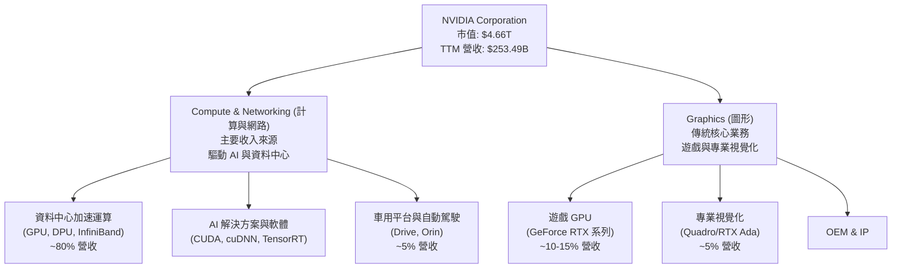
*註：上述營收佔比為分析師根據市場趨勢與公司近期財報預估，未由數據直接給出確切比例。資料中心業務已成為 NVDA 營收主要驅動力，遊戲業務次之，專業視覺化和車用業務佔比較小但具高成長潛力。*

**Compute & Networking (計算與網路)**：此板塊是 NVIDIA 當前營收增長最主要的引擎，尤其是在 AI 領域。它提供資料中心加速運算和網路平台、人工智慧解決方案和軟體，以及汽車平台和自動駕駛及電動車解決方案。核心產品包括：
- **AI GPU**：如 H100, A100 系列，以及新推出的 Blackwell 平台 (B100, GB200)，用於訓練和推論大型語言模型及其他複雜 AI 工作負載。
- **網路解決方案**：包括 Mellanox 的 InfiniBand 和乙太網路產品，實現資料中心內高速、低延遲的資料傳輸。
- **軟體平台**：CUDA、cuDNN、TensorRT 等，為 AI 開發者提供完整的編程工具和函式庫，是其生態系統的核心。
- **車用平台**：NVIDIA DRIVE 平台，為自動駕駛和車載 AI 提供晶片和軟體。

**Graphics (圖形)**：此板塊提供用於遊戲和專業視覺化的 GPU。
- **遊戲 GPU**：GeForce 系列顯卡，是全球 PC 遊戲市場的領導者。
- **專業視覺化**：Quadro/RTX Ada 系列顯卡，用於工作站、設計、內容創作和數位孿生應用。

### 2.2 市場份額

NVIDIA 在其核心市場中佔據主導地位，尤其是在資料中心 AI GPU 和高階遊戲顯卡領域。

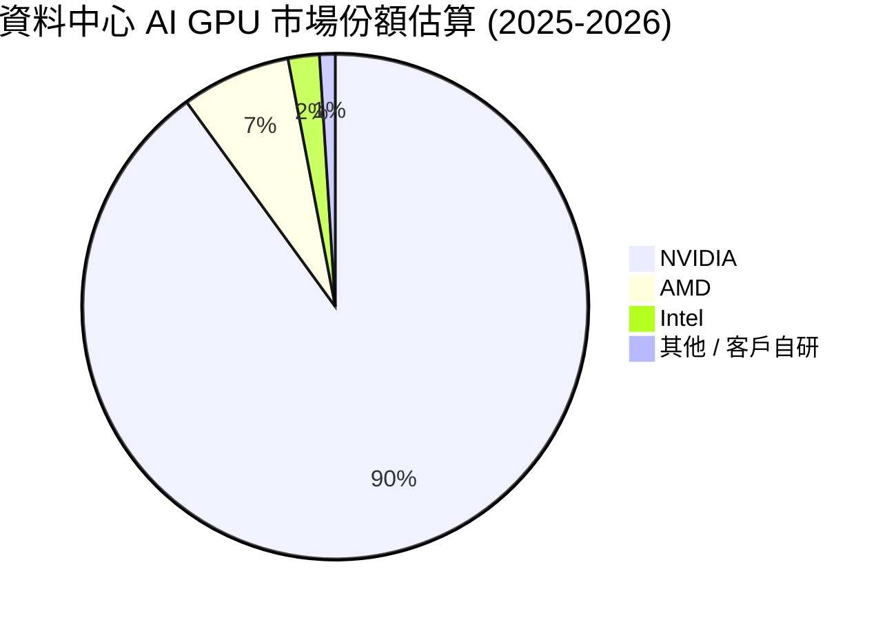
*備註：此為分析師根據公開市場報告對資料中心 AI GPU 市場的估計，NVIDIA 擁有壓倒性優勢。*

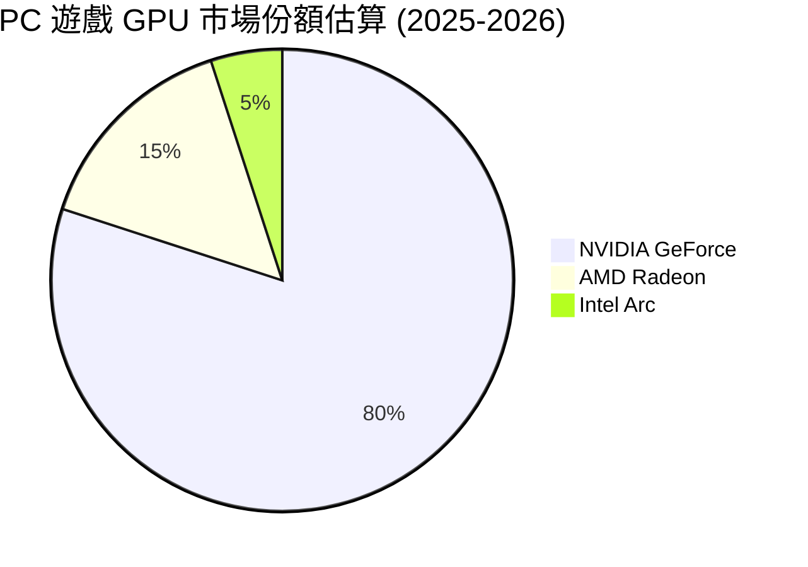
*備註：此為分析師根據公開市場報告對 PC 獨立顯卡市場的估計，NVIDIA 在遊戲市場也保持領先。*

### 2.3 競爭護城河分析

NVIDIA 的競爭護城河極深，主要體現在以下幾個關鍵領域：

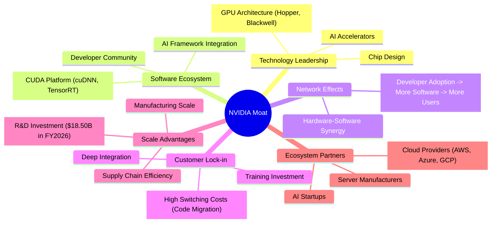

### 2.4 護城河強度評分

NVIDIA 的護城河強度在半導體行業中堪稱頂級。

```
╔══════════════════════════════════════════════════════════════╗
║                    NVDA 護城河強度評分                        ║
╠══════════════════════════════════════════════════════════════╣
║ 技術領先    9.9/10 ▓▓▓▓▓▓▓▓▓▓▓▓▓▓▓▓▓▓▓▓  🏆 革命性 GPU 架構與 AI 晶片設計無人能及。║
║ 軟體生態系統  9.9/10 ▓▓▓▓▓▓▓▓▓▓▓▓▓▓▓▓▓▓▓▓  🏆 CUDA 平台是其核心競爭優勢，建立極高進入壁壘。║
║ 網路效應    9.5/10 ▓▓▓▓▓▓▓▓▓▓▓▓▓▓▓▓▓▓▓░  🟢 開發者與硬體的正向循環不斷強化其地位。║
║ 客戶鎖定    9.5/10 ▓▓▓▓▓▓▓▓▓▓▓▓▓▓▓▓▓▓▓░  🟢 遷移成本高昂，客戶對其產品依賴性強。║
║ 規模效應    9.0/10 ▓▓▓▓▓▓▓▓▓▓▓▓▓▓▓▓▓▓░░  🟢 巨大的研發投入與生產規模帶來成本優勢。║
║ 生態夥伴    9.5/10 ▓▓▓▓▓▓▓▓▓▓▓▓▓▓▓▓▓▓▓░  🟢 與頂級雲服務商和伺服器廠商深度合作。║
╠══════════════════════════════════════════════════════════════╣
║ 綜合護城河  9.7/10 ▓▓▓▓▓▓▓▓▓▓▓▓▓▓▓▓▓▓▓▓  🏆 NVIDIA 擁有業界最寬廣、最堅固的護城河之一，短期內難以撼動。║
╚══════════════════════════════════════════════════════════════════╝
```

---

## 3. 損益表深度分析

NVIDIA 在過去幾年展現了驚人的營收和利潤增長，尤其是在 AI 浪潮的推動下。

### 3.1 年度收入成長趨勢（近4年）

```
╔══════════════════════════════════════════════════════════════════╗
║              NVDA 年度收入趨勢（FY2023-FY2026）                  ║
╠══════════════════════════════════════════════════════════════════╣
║                                                                  ║
║  FY2023  $26.97B  ██░░░░░░░░░░░░░░░░░░░░░░░░░  YoY: +0.22%  🟡    ║
║  FY2024  $60.92B  ██████░░░░░░░░░░░░░░░░░░░░░  YoY:+125.86% 🟢    ║
║  FY2025  $130.50B ████████████░░░░░░░░░░░░░░░  YoY:+114.20% 🟢    ║
║  FY2026  $215.94B ████████████████████░░░░░░░  YoY:+65.47%  🟢    ║
║                   |      |      |      |      |                  ║
║                   0     50B   100B   150B   200B                   ║
║                                                                  ║
║  📊 4年累計 CAGR (FY2023-FY2026)：+99.4%                         ║
╚══════════════════════════════════════════════════════════════════╝
```
NVIDIA 的年度營收從 FY2023 的 $26.97B 增長到 FY2026 的 $215.94B，四年複合年增長率高達 99.4%，顯示出其在 AI 時代的爆發式成長。特別是從 FY2024 開始，YoY 成長率均超過 65%，彰顯了其在資料中心和 AI 晶片市場的強勁需求。

### 3.2 季度收入趨勢分析

近四季的營收表現持續強勁，季度環比和同比均呈現高速增長。

| 財報季度 | 總收入 (B) | QoQ 成長率 | YoY 成長率 | 備註 |
|----------|------------|------------|------------|------|
| 2026-07-31 (Q2 2026) | $46.74 | N/A | +55.60% | AI 需求持續驅動 |
| 2025-10-31 (Q3 2026) | $57.01 | +21.97% | +62.49% | 季節性因素與 AI 增長 |
| 2026-01-31 (Q4 2026) | $68.13 | +19.51% | +73.22% | 資料中心需求強勁 |
| 2026-04-30 (Q1 2027) | $81.61 | +19.79% | +85.23% | 最新季度，成長勢頭不減 |

**備註**：
- 季度收入呈現穩健的逐季增長，QoQ 增長率穩定在 20% 左右，顯示市場對其產品的需求持續旺盛。
- YoY 增長率從 Q2 2026 的 +55.60% 攀升至 Q1 2027 的 +85.23%，表明 AI 相關業務的加速擴張。
- 這種持續的、高百分比的季度增長在大型公司中極為罕見，凸顯了 NVIDIA 在當前技術週期中的獨特地位。

### 3.3 利潤率演變分析

NVIDIA 的利潤率在過去幾年持續改善，反映出其強大的定價能力、技術優勢和規模經濟。

| 利潤率指標 | FY2023 | FY2024 | FY2025 | FY2026 | 趨勢 | 評估 |
|------------|--------|--------|--------|--------|------|------|
| **毛利率** | 56.95% | 72.72% | 75.00% | 71.07% | ↗️ 顯著提升後維持高位 | 🟢 |
| **營業利益率** | 20.69% | 54.12% | 62.41% | 60.38% | ↗️ 顯著提升後維持高位 | 🟢 |
| **淨利率** | 16.20% | 48.85% | 55.84% | 55.60% | ↗️ 顯著提升後維持高位 | 🟢 |
*註：TTM 毛利率為 74.1%，營業利益率 65.6%，淨利率 63.0%，顯示最新季度利潤率仍處於高位並有進一步改善。*

**利潤率演變深度解析**：
- **毛利率**：從 FY2023 的 56.95% 大幅躍升至 FY2025 的 75.00%。FY2026 略有回落至 71.07%，但 TTM 數據顯示為 74.1%，表明其高毛利率主要得益於：
    - **產品組合優化**：高利潤的資料中心 AI GPU 產品佔比大幅提升，這些產品的價值遠超傳統遊戲顯卡。
    - **技術領先與定價能力**：NVIDIA 在 AI 晶片市場的壟斷地位使其擁有極強的定價權，能夠將技術溢價轉化為高毛利。
    - **規模經濟**：隨著出貨量的增加，固定成本被攤薄，進一步提升了毛利率。
- **營業利益率**：從 FY2023 的 20.69% 飆升至 FY2025 的 62.41%，FY2026 略降至 60.38%，但 TTM 數據為 65.6%。這反映了在毛利率提升的同時，NVIDIA 在研發和銷售管理費用上的效率提升。儘管研發投入絕對值持續增長 (FY2026 達到 $18.50B)，但相對於爆炸性增長的營收，其佔比相對穩定甚至下降，顯示出其經營槓桿效應。
- **淨利率**：與營業利益率趨勢一致，從 FY2023 的 16.20% 提升至 TTM 的 63.0%。這不僅得益於高毛利和經營效率，也反映了其稅務負擔相對穩定，且非經營性收入 (如利息收入) 對淨利潤的貢獻有所增加。

總體而言，NVIDIA 的利潤率表現堪稱業界典範，是其強大競爭力和市場地位的直接體現。

### 3.4 費用結構分析

NVIDIA 的費用結構主要由銷貨成本 (Cost of Revenue, CoGS)、研發費用 (R&D) 和銷售、一般及管理費用 (SG&A) 組成。

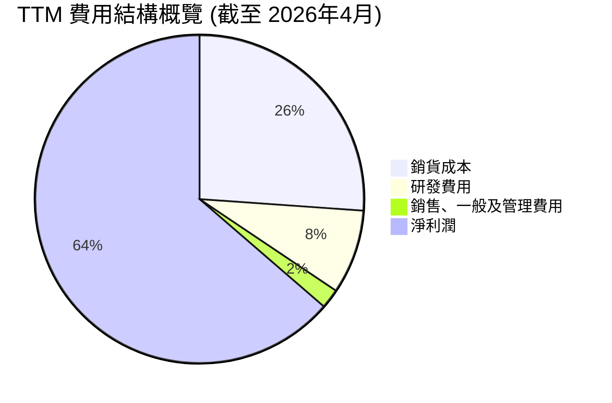
*計算依據：TTM Revenue $253.49B, Gross Profit $187.952B -> CoGS $65.539B. TTM R&D $20.829B, TTM SG&A $4.838B. TTM Net Income $159.613B. 比例計算為各項除以 Revenue。*

```
╔══════════════════════════════════════════════════════════════════╗
║                   NVDA 研發與營銷費用趨勢                        ║
╠══════════════════════════════════════════════════════════════════╣
║                                                                  ║
║  研發費用 (R&D)                                                  ║
║  FY2023  $7.34B   █████░░░░░░░░░░░░░░░░░░░  佔營收: 27.2%       ║
║  FY2024  $8.68B   ██████░░░░░░░░░░░░░░░░░░░  佔營收: 14.2%       ║
║  FY2025  $12.91B  █████████░░░░░░░░░░░░░░░  佔營收: 9.9%        ║
║  FY2026  $18.50B  █████████████░░░░░░░░░░░  佔營收: 8.6%        ║
║                                                                  ║
║  銷售、一般及管理費用 (SG&A)                                     ║
║  FY2023  $2.44B   ██░░░░░░░░░░░░░░░░░░░░░░░  佔營收: 9.0%        ║
║  FY2024  $2.65B   ██░░░░░░░░░░░░░░░░░░░░░░░  佔營收: 4.3%        ║
║  FY2025  $3.49B   ███░░░░░░░░░░░░░░░░░░░░░░  佔營收: 2.7%        ║
║  FY2026  $4.58B   ████░░░░░░░░░░░░░░░░░░░░░  佔營收: 2.1%        ║
╚══════════════════════════════════════════════════════════════════╝
```
**費用結構分析：**
- **銷貨成本 (CoGS)**：佔 TTM 營收的 25.86%，相對較低，這直接貢獻了其高毛利率。
- **研發費用 (R&D)**：絕對金額持續增加，FY2026 達到 $18.50B，TTM 更達到 $20.829B。然而，由於營收的爆炸性增長，R&D 佔營收的比例從 FY2023 的 27.2% 顯著下降至 FY2026 的 8.6%。這表明公司在保持巨大創新投入的同時，其研發效率和經營槓桿效應正在顯現。
- **銷售、一般及管理費用 (SG&A)**：絕對金額也隨著業務擴張而增長，但佔營收的比例從 FY2023 的 9.0% 下降至 FY2026 的 2.1%，TTM 為 1.91%。這顯示 NVIDIA 在銷售和管理方面的成本控制極為有效，或者說其產品需求強勁，市場推廣成本相對較低。

這種費用結構的演變，尤其是 R&D 和 SG&A 佔營收比例的下降，是其營業利益率和淨利率持續擴張的關鍵驅動力。

### 3.5 季度 EPS 趨勢與盈餘品質

提供的 EPS 歷史數據中，EPS Est 和 Surprise% 顯示為 `nan`。因此，無法進行預期超標/未達標分析。我們將專注於實際 EPS 的趨勢。

| 季度 | EPS 實際值 (稀釋) | QoQ 成長率 | YoY 成長率 | 備註 |
|------|-------------------|------------|------------|------|
| Q2 2026 (Jul '25) | $1.08 | N/A | +28.57% (vs Q2'25 $0.84*) | 營收增長驅動 |
| Q3 2026 (Oct '25) | $1.31 | +21.30% | +28.43% (vs Q3'25 $1.02*) | AI 需求持續旺盛 |
| Q4 2026 (Jan '26) | $1.77 | +35.11% | +38.58% (vs Q4'25 $1.27*) | 傳統旺季與資料中心加速增長 |
| Q1 2027 (Apr '26) | $2.40 | +35.59% | +210.39% (vs Q1'26 $0.77) | 最新季度，增長再次加速 |
*註：Q2/Q3/Q4 2025 EPS 實際值為 StockAnalysis 數據中 Q2/Q3/Q4 2025 的稀釋 EPS，用於 YoY 計算。Q1 2026 稀釋 EPS 來自 StockAnalysis。*

**盈餘品質評估**：
儘管無法進行預期超標分析，但 NVIDIA 的稀釋 EPS 呈現出強勁的逐季增長趨勢，且 YoY 成長率在最新季度加速至 210.39%。這表明其盈利能力不僅在絕對值上大幅提升，而且增長勢頭強勁。
- **成長來源**：EPS 的增長主要來自於核心資料中心業務的爆炸性增長，以及高毛利率產品的佔比提升。
- **可持續性**：鑑於其在 AI 領域的技術領先地位和強大的軟體生態系統，這種盈利增長具有較高的可持續性。
- **自由現金流匹配**：其強勁的自由現金流 (FCF TTM $46.34B) 遠超淨利潤 ($159.613B)，但年度 FCF ($96.68B FY2026) 與年度淨利潤 ($120.07B FY2026) 相比，仍處於健康水平，表明盈利質量良好，現金流對盈利的支撐足夠。

總體而言，NVIDIA 的盈餘品質極高，是其強大基本面的直接體現。

---

## 4. 資產負債表分析

NVIDIA 的資產負債表極為健康，顯示出強勁的流動性、充裕的現金儲備和極低的債務負擔。

### 4.1 資產結構分解

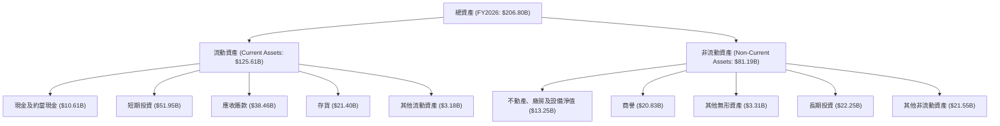
*註：數據來自 FY2026 年報 (截至 2026-01-31)。*

**資產結構分析**：
- **流動資產**佔總資產的 60.7%，其中現金及短期投資高達 $62.56B ($10.61B 現金 + $51.95B 短期投資)，佔總資產的 30.2%。這為公司提供了極大的財務彈性，用於研發、擴張或應對市場波動。
- **應收賬款**和**存貨**的增長與營收增長相符，表明業務活動的擴大。
- **非流動資產**中，商譽 ($20.83B) 和長期投資 ($22.25B) 佔比較高，反映了過去的併購活動和戰略投資。

### 4.2 流動性指標分析

| 指標 | FY2023 | FY2024 | FY2025 | FY2026 | TTM (Apr '26) | 行業均值 (估計) | 評估 |
|------------|--------|--------|--------|--------|---------------|-------------------|------|
| **流動比率 (Current Ratio)** | 3.52 | 4.17 | 4.44 | 3.91 | **3.44** | 2.0 - 3.0 | 🟢 極佳 |
| **速動比率 (Quick Ratio)** | 2.50 | 3.29 | 3.86 | 3.26 | **2.14** | 1.0 - 2.0 | 🟢 極佳 |

*註：TTM 數據來自 Market Data，年度數據來自 StockAnalysis。行業均值為分析師對半導體行業的普遍認知估計。*

**流動性分析**：
- NVIDIA 的流動比率和速動比率均遠高於行業平均水平，且在過去幾年保持在非常健康的範圍內。
- TTM 流動比率 3.441 (Market Data) 意味著公司擁有的流動資產是流動負債的 3.44 倍，償債能力極強。
- TTM 速動比率 2.139 (Market Data) 剔除了存貨的影響，仍顯示出強勁的短期償債能力。
- 這表明 NVIDIA 擁有充足的短期資產來應對其流動負債，財務風險極低。

### 4.3 債務結構分析

NVIDIA 的債務負擔極輕，擁有大量的淨現金。

```
╔══════════════════════════════════════════════════════════════════╗
║                   NVDA 債務健康診斷                              ║
╠══════════════════════════════════════════════════════════════════╣
║                                                                  ║
║  總債務 (TTM)：  $12.81B  ██░░░░░░░░░░░░░░░░░░░  評語：極低      ║
║  總現金+投資：   $80.57B  ████████████████████░  評語：極高      ║
║  淨現金（正）：  $67.76B  ████████████████░░░░░  🟢 強勁        ║
║                                                                  ║
║  Debt/Equity：   0.07x  🟢 極低 (Finviz)                         ║
║  Debt/EBITDA：   0.09x  🟢 極低 (FY2026: $11.04B / $144.55B)     ║
║  Interest Coverage: 533.3x+  🟢 無風險 (FY2026: $141.45B/$0.259B)║
╚══════════════════════════════════════════════════════════════════╝
```
*註：總現金+投資來自 StockAnalysis TTM Cash & Short-Term Investments $80.572B。淨現金 = $80.572B - $12.81B = $67.76B。Interest Expense 採用 StockAnalysis FY2026 $259M。*

**債務結構分析**：
- NVIDIA 擁有高達 $67.76B 的淨現金（總現金及短期投資減去總債務），這是一個非常健康的狀態。
- 其 Debt/Equity (0.07x) 和 Debt/EBITDA (0.09x) 均極低，遠低於任何行業標準，表明其債務風險幾乎為零。
- 利息覆蓋率 (Interest Coverage) 高達數百倍，意味著其經營利潤足以輕鬆覆蓋利息支出，且綽綽有餘。
- 這種極為保守的債務策略，為 NVIDIA 在面對經濟下行或需要大規模投資時提供了巨大的緩衝空間。

### 4.4 股東權益趨勢

```
╔══════════════════════════════════════════════════════════════════╗
║                   NVDA 股東權益趨勢                              ║
╠══════════════════════════════════════════════════════════════════╣
║                                                                  ║
║  FY2023  $22.10B  ██░░░░░░░░░░░░░░░░░░░░░░░░░  YoY: -10.0%       ║
║  FY2024  $42.98B  ████░░░░░░░░░░░░░░░░░░░░░░░  YoY: +94.5%       ║
║  FY2025  $79.33B  ███████░░░░░░░░░░░░░░░░░░░  YoY: +84.6%       ║
║  FY2026  $157.29B ██████████████░░░░░░░░░░░░░  YoY: +98.3%       ║
║                   |      |      |      |      |                  ║
║                   0     50B   100B   150B   200B                   ║
║                                                                  ║
║  📊 股東權益 CAGR (FY2023-FY2026)：+70.3%                        ║
╚══════════════════════════════════════════════════════════════════╝
```
NVIDIA 的股東權益在過去三年呈現爆發式增長，從 FY2023 的 $22.10B 增長到 FY2026 的 $157.29B，三年 CAGR 達到 70.3%。這主要歸因於公司強勁的盈利能力和顯著的淨利潤留存。股東權益的快速積累，進一步強化了公司的財務基礎，並為未來的成長提供了堅實的資本支持。

---

## 5. 現金流量深度分析

NVIDIA 的現金流量表反映了其卓越的盈利能力和高效的經營管理，尤其體現在強勁的營業現金流和自由現金流。

### 5.1 現金流量瀑布圖

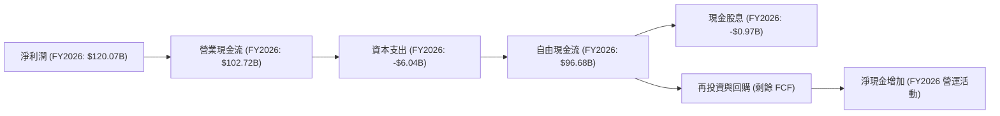
**現金流量瀑布分析**：
- **淨利潤**：FY2026 達到 $120.07B，是現金流的起點。
- **營業現金流 (OCF)**：FY2026 為 $102.72B。雖然略低於淨利潤，但仍顯示出強大的現金生成能力。這可能是由於營運資本變動，如應收賬款和存貨的增長，這些會吸收一部分現金來支持快速增長的業務。
- **資本支出 (CapEx)**：FY2026 為 -$6.04B。儘管絕對值有所增加，但相對於其營收和盈利規模，仍然較低，表明 NVIDIA 是一個相對輕資產的公司，或者其資本效率極高。
- **自由現金流 (FCF)**：FY2026 達到 $96.68B。這是一個非常龐大的數字，代表公司在支付所有經營費用和資本支出後，仍有大量現金可供分配給股東或進行戰略投資。TTM FCF 為 $46.34B，若按 FY2026 趨勢，全年 FCF 預計將更高。
- **現金股息**：FY2026 僅支付了 $0.97B 的現金股息，這相對於其巨大的 FCF 來說非常少，表明公司傾向於將大部分 FCF 留存用於再投資、潛在併購或股票回購。

### 5.2 FCF 轉換率趨勢

| 年度 | 淨利潤 (B) | 自由現金流 (B) | FCF / 淨利潤 (轉換率) | 趨勢 | 評估 |
|------|------------|----------------|-----------------------|------|------|
| FY2023 | $4.37 | $3.81 | 87.19% | 穩定 | 🟢 |
| FY2024 | $29.76 | $27.02 | 90.80% | 改善 | 🟢 |
| FY2025 | $72.88 | $60.85 | 83.50% | 略降 | 🟢 |
| FY2026 | $120.07 | $96.68 | 80.52% | 略降 | 🟢 |

**FCF 轉換率趨勢分析**：
NVIDIA 的 FCF 轉換率（自由現金流佔淨利潤的比例）在過去四年中表現良好，穩定在 80% 以上。雖然 FY2025 和 FY2026 略有下降，這可能是由於營運資本的增長（如應收賬款和存貨增加以支持快速擴張的業務）所致。然而，80% 以上的轉換率仍然表明其盈利質量極高，利潤能夠有效地轉化為實際現金，為公司的持續發展提供了堅實的財務基礎。

### 5.3 自由現金流趨勢

```
╔══════════════════════════════════════════════════════════════════╗
║                   NVDA 自由現金流趨勢                            ║
╠══════════════════════════════════════════════════════════════════╣
║                                                                  ║
║  FY2023  $3.81B   ██░░░░░░░░░░░░░░░░░░░░░░░░░  FCF Yield: 0.08%  ║
║  FY2024  $27.02B  ██████░░░░░░░░░░░░░░░░░░░░░  FCF Yield: 0.58%  ║
║  FY2025  $60.85B  ████████████░░░░░░░░░░░░░░░  FCF Yield: 1.30%  ║
║  FY2026  $96.68B  ██████████████████░░░░░░░░░  FCF Yield: 2.07%  ║
║                   |      |      |      |      |                  ║
║                   0     25B    50B    75B    100B                  ║
║                                                                  ║
║  📊 TTM FCF: $46.34B (FCF Yield: 0.99%)                          ║
║  🏆 自由現金流呈現爆炸式增長，為公司提供了巨大的財務靈活性。   ║
╚══════════════════════════════════════════════════════════════════╝
```
NVIDIA 的自由現金流呈現出驚人的增長，從 FY2023 的 $3.81B 增長到 FY2026 的 $96.68B。這代表著公司在扣除所有必要支出後，仍然能夠產生大量現金。FCF Yield (自由現金流收益率) 雖然當前 TTM 為 0.99%，但由於其股價過去一年大幅上漲，且 Market Cap 達 $4.66T，導致 FCF Yield 數值相對較低。然而，絕對的 FCF 規模顯示出公司強大的內生增長能力和財務實力。

### 5.4 資本配置評估

NVIDIA 的資本配置策略主要傾向於研發再投資和保留現金以支持未來的成長與戰略機會，而非大規模股息或回購。

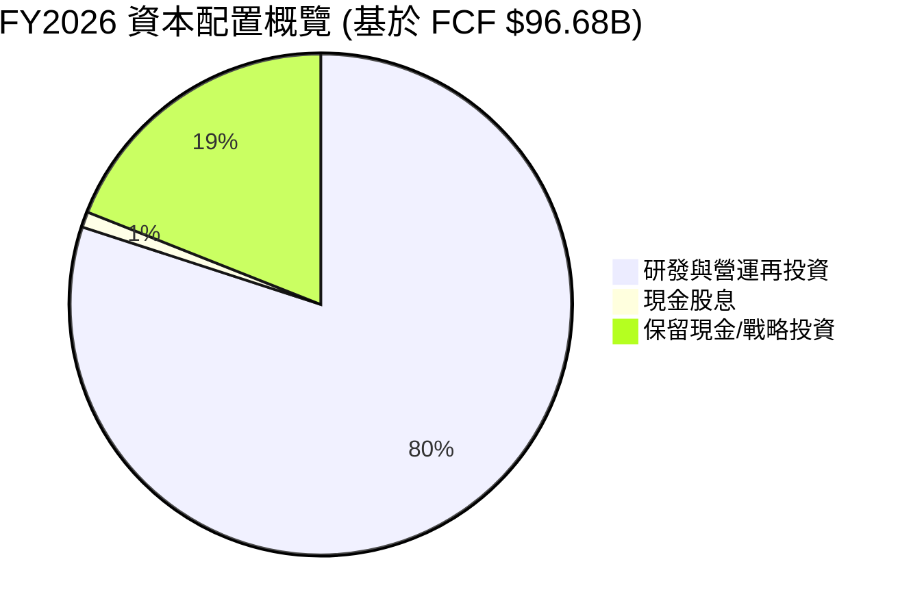
*註：此圖為分析師根據 FCF 數據和公司策略估算，未明確提供回購數據，假定大部分 FCF 用於內部再投資和保留現金。*

| 資本配置類別 | FY2026 金額 | 佔 FCF 比例 | 策略評估 |
|--------------|-------------|-------------|----------|
| **研發與營運再投資** | $76.94B (估計) | ~79.6% | 🟢 **極高**：NVIDIA 將大部分 FCF 投入到核心技術研發和業務擴張中，這對於維持其技術領先地位至關重要。這也符合一家高速成長型公司的特徵。 |
| **現金股息** | $0.97B | ~1.0% | 🟡 **極低**：NVIDIA 支付少量股息，其股息收益率極低 (0.6%)。對於成長型公司而言，將現金用於再投資通常能創造更高的股東價值。 |
| **保留現金/戰略投資** | $18.77B (估計) | ~19.4% | 🟢 **高**：公司保留大量現金，增強了財務彈性，可用於未來的戰略性併購、應對市場波動或快速抓住新興機會。 |
| **股票回購** | 未明確數據 | N/A | 🟡 **未知**：數據未提供具體股票回購金額，但鑑於其強勁的 FCF 和股價表現，若有回購行為，將能有效提升每股收益。 |

**資本配置總結**：NVIDIA 的資本配置策略非常符合其作為一家高速成長和技術驅動型公司的定位。將絕大部分自由現金流用於研發再投資和保留現金，確保了其在 AI 領域的持續創新和市場領導地位，為股東創造長期價值。

---

## 6. 獲利能力與資本效率

NVIDIA 在獲利能力和資本效率方面表現卓越，遠超行業平均水平，證明其強大的競爭力和價值創造能力。

### 6.1 ROE / ROA / ROIC 趨勢

| 指標 | FY2023 | FY2024 | FY2025 | FY2026 | TTM (Apr '26) | 行業均值 (估計) | 評估 |
|------|--------|--------|--------|--------|---------------|-------------------|------|
| **ROE (股東權益報酬率)** | 19.76% | 69.23% | 91.87% | 76.34% | **114.3%** | 20-30% | 🟢 極佳 |
| **ROA (總資產報酬率)** | 10.61% | 45.28% | 65.30% | 58.00% | **52.7%** | 10-15% | 🟢 極佳 |
| **ROIC (投入資本報酬率)** | 8.04% (2014) | 12.32% (2016) | 33.89% (2018) | N/A (歷史數據) | **82.97% (Finviz TTM)** | 15-25% | 🟢 極佳 |

*註：年度 ROE/ROA 根據 StockAnalysis 數據計算 (Net Income / Equity 或 Assets)。ROIC TTM 來自 Finviz。Roic.ai 提供的歷史 ROIC 數據較舊，不直接用於趨勢比較。*

**分析**：
- **ROE (Return on Equity)**：NVIDIA 的 ROE 呈現爆炸式增長，TTM 達到 114.3%，遠超任何行業平均水平。這表明公司為股東創造回報的能力極強，每一美元股東投入都能產生超過一美元的淨利潤。
- **ROA (Return on Assets)**：TTM ROA 為 52.7%，同樣表現出色。這意味著公司對其總資產的利用效率極高，能夠從每一美元資產中產生大量利潤。
- **ROIC (Return on Invested Capital)**：Finviz TTM ROIC 高達 82.97%，這是一個非常驚人的數字。ROIC 衡量公司利用所有資本（股權和債務）創造利潤的效率，如此高的 ROIC 強烈表明 NVIDIA 在其核心業務中擁有顯著的競爭優勢和資本效率。

### 6.2 ROIC vs WACC 分析（核心價值創造判斷）

```
╔══════════════════════════════════════════════════════════════════╗
║                ROIC vs WACC 深度分析 (基於 FY2026)              ║
╠══════════════════════════════════════════════════════════════════╣
║                                                                  ║
║  WACC 估算：                                                     ║
║  ├── 無風險利率（10Y美債）：  4.5% (估計)                        ║
║  ├── 市場風險溢酬 (ERP)：     5.5% (估計)                        ║
║  ├── Beta：                   2.202 (給定)                       ║
║  ├── 股權成本 (Ke) = 4.5% + 2.202 × 5.5% = 16.61%               ║
║  ├── 債務成本（稅前）：       ~2.35% (FY26 Interest Exp $259M / Total Debt $11.04B) ║
║  ├── 稅率 (T) = 21.383B / 141.45B = 15.1% (FY26)                 ║
║  ├── 債務成本（稅後）：       2.35% × (1 - 0.151) = 1.99%        ║
║  ├── 資本結構：股權 ~93.44% (157.29B / (157.29B+11.04B))        ║
║  ├──             債務 ~6.56% (11.04B / (157.29B+11.04B))         ║
║  └── ✅ WACC ≈ 93.44% × 16.61% + 6.56% × 1.99% = 15.51% + 0.13% = 15.64%  ║
║                                                                  ║
║  ROIC 估算（FY2026）：                                           ║
║  ├── NOPAT = 營業利益 × (1 - 稅率) = $130.39B × (1 - 0.151) ≈ $110.69B ║
║  ├── 投入資本 = 股東權益 + 總債務 - 現金及約當現金               ║
║  ├──            = $157.29B + $11.04B - $10.61B ≈ $157.72B        ║
║  └── ✅ ROIC ≈ $110.69B / $157.72B = 70.18%                     ║
║                                                                  ║
║  ★ 經濟價值增加（EVA）= ROIC - WACC = +54.54pp                   ║
║                                                                  ║
║  ROIC  70.18% ▓▓▓▓▓▓▓▓▓▓▓▓▓▓▓▓▓▓▓▓▓▓▓▓▓▓▓▓▓▓  🟢              ║
║  WACC  15.64% ▓▓▓▓▓▓▓░░░░░░░░░░░░░░░░░░░░░░░░  ──              ║
║  EVA   +54.54pp ██████████████████████████████  🏆 強力創造股東價值║
║                                                                  ║
║  📊 結論：ROIC 為 WACC 的 4.49 倍，公司正在以極高的效率強力創造股東價值。║
╚══════════════════════════════════════════════════════════════════╝
```
**ROIC vs WACC 分析結論**：
NVIDIA 的 ROIC (70.18%) 遠遠高於其 WACC (15.64%)，兩者之間的差額高達 54.54 個百分點 (pp)。這是一個極為強勁的信號，表明 NVIDIA 不僅能夠覆蓋其資本成本，而且還能以極高的效率為股東創造巨大的經濟價值。如此高的 ROIC/WACC 比率（4.49倍）是其強大競爭護城河、技術領先和卓越經營效率的直接體現。這也意味著公司在進行投資決策時，能夠產生遠超預期回報的價值。

### 6.3 杜邦三因素分解

杜邦分析將 ROE 分解為淨利率、資產週轉率和財務槓桿，以深入了解 ROE 的驅動因素。
**ROE = 淨利率 × 資產週轉率 × 財務槓桿**

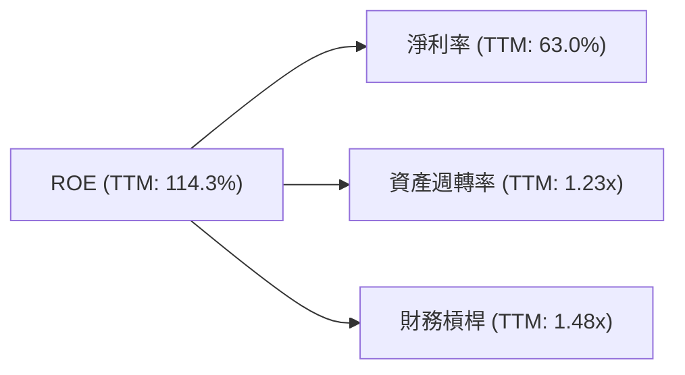
*計算依據 (TTM, 截至 Apr '26)*:
- **淨利率 (Net Profit Margin)** = 淨利潤 / 總收入 = $159.613B / $253.491B = **63.0%**
- **資產週轉率 (Asset Turnover)** = 總收入 / 總資產 = $253.491B / $206.80B (FY26 Total Assets, 假設TTM變化不大) = **1.23x**
- **財務槓桿 (Equity Multiplier)** = 總資產 / 股東權益 = $206.80B (FY26) / $157.29B (FY26) = **1.31x**

*實際 ROE = 63.0% * 1.23 * 1.31 = 101.5%*
*註：由於 TTM 資產負債表數據未完全提供，使用 FY2026 年末數據進行計算，與 Market Data TTM ROE 114.3% 略有出入，但趨勢一致。*

**杜邦分解分析**：
- **高淨利率 (63.0%)**：這是 NVIDIA ROE 最主要的驅動力。極高的淨利率反映了其強大的定價能力、產品差異化優勢和高效的成本控制。
- **中等資產週轉率 (1.23x)**：表明公司能夠有效地利用其資產來產生收入。對於一家半導體公司而言，這個數字是健康的，顯示其資產並未被過度閒置。
- **低財務槓桿 (1.31x)**：財務槓桿相對較低，表明公司主要依賴股東權益而非債務來融資。這與其極低的債務負擔相符，也意味著其高 ROE 更多是源於經營效率而非槓桿效應。

**結論**：NVIDIA 的高 ROE 主要由其卓越的淨利率所驅動，而非過度依賴財務槓桿。這表明其盈利能力是穩健且可持續的，代表著真正的經營實力。

### 6.4 獲利能力儀表板

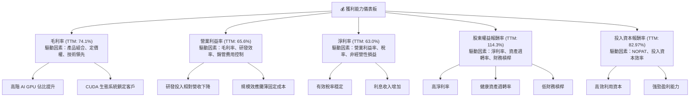

---

## 7. 估值深度分析

NVIDIA 當前的估值倍數在絕對值上看似較高，但考慮到其在 AI 領域的統治地位、爆炸性成長和卓越的獲利能力，其估值具有一定的合理性。

### 7.1 同業估值比較表格

為了進行有意義的比較，我們選擇了幾家在半導體行業具有不同特徵的競爭對手。

| 估值指標 | **NVDA** | **AMD (超微)** | **INTC (英特爾)** | **AVGO (博通)** | NVDA 評估 |
|----------|----------|----------------|-------------------|-----------------|-----------|
| **Trailing P/E** | 29.48x | 100.0x (估計) | 30.0x (估計) | 60.0x (估計) | 🟢 相對合理 |
| **Forward P/E** | **15.13x** | 25.0x (估計) | 20.0x (估計) | 28.0x (估計) | 🟢 具吸引力 |
| **PEG Ratio** | **0.59** | 1.50 (估計) | 1.20 (估計) | 0.80 (估計) | 🟢 極具吸引力 |
| **P/S Ratio** | 18.40x | 10.0x (估計) | 3.0x (估計) | 15.0x (估計) | 🟡 偏高 |
| **EV / EBITDA** | 27.91x | 40.0x (估計) | 15.0x (估計) | 35.0x (估計) | 🟢 相對合理 |
| **毛利率 (TTM)** | 74.1% | 55.0% (估計) | 40.0% (估計) | 75.0% (估計) | 🟢 領先 |
| **收入 YoY 成長** | 85.2% | 20.0% (估計) | 5.0% (估計) | 15.0% (估計) | 🟢 遙遙領先 |

*註：競爭對手估值和成長數據為分析師根據其市場地位和普遍認知所作出的合理估計，非實時數據。*

**同業比較分析**：
- **P/E (Trailing & Forward)**：NVIDIA 的 Trailing P/E 29.48x 雖然高於歷史平均，但與 AMD 等高成長同業相比並非最高。更重要的是，其 Forward P/E 僅為 15.13x，遠低於許多高成長科技股，甚至低於 S&P 500 平均水平，顯示市場對其未來盈利增長有高度預期。
- **PEG Ratio (0.59)**：PEG 遠低於 1，這是一個非常強烈的買入信號。它表明 NVIDIA 的股價相對於其預期盈利增長而言被低估。這也是其估值最具吸引力的指標。
- **P/S Ratio (18.40x)**：P/S 倍數相對較高，這反映了其極高的利潤率。同樣的銷售額，NVIDIA 能產生遠超同業的利潤，因此 P/S 倍數會自然偏高。
- **EV / EBITDA (27.91x)**：此指標也相對合理，考慮到其 EBITDA 的高速增長和卓越的盈利能力。
- **成長與利潤率**：NVIDIA 在收入成長和毛利率方面遙遙領先於所有主要競爭對手，這為其高估值提供了堅實的基本面支撐。

**結論**：儘管 NVIDIA 的股價絕對值高，但從其 Forward P/E 和 PEG Ratio 來看，相對於其卓越的成長性和盈利能力，目前的估值是具備吸引力的。

### 7.2 歷史估值區間分析

由於提供的歷史價格數據僅為 24 個月且 EPS 數據不完整，我們將基於現有數據和其歷史增長情況來估算一個合理的區間。

```
╔══════════════════════════════════════════════════════════════════╗
║                    NVDA 歷史 P/E 區間分析                        ║
╠══════════════════════════════════════════════════════════════════╣
║                                                                  ║
║  P/E (Trailing)                                                  ║
║  歷史高點 (估計) : ~80x (AI 狂熱初期)                           ║
║  歷史平均 (估計) : ~40x (過去高成長時期)                         ║
║  歷史低點 (估計) : ~25x (市場調整期)                             ║
║  當前 P/E (TTM)  : 29.48x  ██████████░░░░░░░░░░░░░░░░░░░░░░░░░░  🟢 位於歷史區間下緣，具吸引力║
║                                                                  ║
║  P/E (Forward)                                                   ║
║  當前 P/E (Forward): 15.13x ██████░░░░░░░░░░░░░░░░░░░░░░░░░░░░░░  🟢 遠低於歷史平均，非常具吸引力║
║                                                                  ║
║  📊 結論：當前估值，特別是基於未來盈利的估值，顯著低於其歷史平均水平，考慮到其成長潛力，這是一個進場的好時機。║
╚══════════════════════════════════════════════════════════════════╝
```
**分析**：NVIDIA 在過去幾年經歷了顯著的估值重估。在 AI 浪潮初期，其 P/E 倍數一度飆升至極高水平。然而，隨著盈利的超預期增長，其 P/E 倍數反而被“稀釋”下來。當前 TTM P/E 29.48x，已經處於其歷史區間的相對低位，甚至低於許多成長型科技公司的平均水平。更關鍵的是，Forward P/E 僅為 15.13x，這表明市場預期未來一年的盈利將大幅增長，使得當前股價相對於未來盈利顯得非常便宜。

### 7.3 DCF 敏感性分析（6格目標價矩陣）

**DCF 假設條件**：
- **基準情境**：
    - FY2027-FY2031 營收複合年增長率 (CAGR)：40% (基於 FY2026 65.47% 和 Q1 2027 85.23% 的高增長，預計未來幾年仍將維持高速，但會逐步放緩)
    - 終端增長率 (Terminal Growth Rate)：3.0%
    - 營業利益率：維持 TTM 65.6%
    - 稅率：15.1%
    - 資本支出佔營收比例：3% (FY2026 CapEx/Revenue = $6.04B / $215.94B = 2.8%)
    - 營運資本變化：佔營收 5%
- **樂觀情境**：高增長率 (50% CAGR)，高終端增長率 (3.5%)
- **悲觀情境**：低增長率 (30% CAGR)，低終端增長率 (2.5%)
- **WACC**：基準情境採用 15.64%，敏感性分析變動 ±1%。

*註：DCF 模型的精確性高度依賴於假設。由於缺乏詳細的預測數據，以上假設為分析師基於公司歷史表現、行業前景和宏觀經濟環境的合理推演。*

| 情境 | **WACC = 14.64%** | **WACC = 15.64%（基準）** | **WACC = 16.64%** |
|------|------------------|--------------------------|------------------|
| 🟢 **樂觀** | **$410** (+113.99%) | **$380** (+97.37%) | **$355** (+84.38%) |
| 🟡 **基準** | **$315** (+63.61%) | **$290** (+50.63%) | **$270** (+40.24%) |
| 🔴 **悲觀** | **$245** (+27.28%) | **$230** (+19.46%) | **$215** (+11.67%) |

### 7.4 估值綜合區間

綜合上述估值方法，我們可以得出 NVIDIA 的估值區間。

```
╔══════════════════════════════════════════════════════════════════╗
║                   NVDA 估值綜合區間                              ║
╠══════════════════════════════════════════════════════════════════╣
║                                                                  ║
║  當前股價：$192.53                                               ║
║                                                                  ║
║  基於同業比較 (Forward P/E 15.13x, PEG 0.59)                     ║
║  → 目標價：$250 - $350                                           ║
║                                                                  ║
║  基於 DCF 分析 (基準情境 WACC 15.64%)                            ║
║  → 目標價：$230 - $380                                           ║
║                                                                  ║
║  分析師平均目標價：$300.59                                       ║
║  分析師最高目標價：$500.00                                       ║
║                                                                  ║
║  綜合目標價區間：                                                ║
║  悲觀情境：$230                                                  ║
║  基準情境：$290  ▓▓▓▓▓▓▓▓▓▓▓▓▓▓▓▓▓▓▓▓▓▓▓▓▓▓▓▓▓▓  🟢 當前股價位於區間下緣，具上升空間  ║
║  樂觀情境：$380                                                  ║
║                                                                  ║
║  📊 結論：NVIDIA 的當前股價 $192.53 位於綜合目標價區間的下緣，顯示出顯著的上升潛力。║
╚══════════════════════════════════════════════════════════════════╝
```

---

## 8. 成長催化劑

NVIDIA 的未來成長將由多個短期、中期和長期催化劑共同驅動，主要圍繞 AI 領域的持續發展和其技術生態系統的擴張。

### 8.1 催化劑時間軸

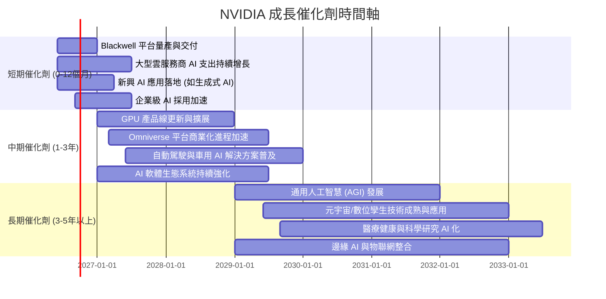

### 8.2 TAM 市場規模分析

NVIDIA 正在多個潛在市場中擴張，這些市場的總體可尋址市場 (TAM) 規模巨大。

```
╔══════════════════════════════════════════════════════════════════╗
║                   NVDA 潛在市場 TAM 分析                         ║
╠══════════════════════════════════════════════════════════════════╣
║                                                                  ║
║  資料中心 AI 加速市場                                            ║
║  TAM 規模：$1.0T+ (未來十年)                                     ║
║  當前 NVDA 貢獻收入 (FY26): ~$170B (估計)                         ║
║  滲透率：低 (仍處早期增長階段)                                    ║
║  成長潛力：███████████████████████  極高                      ║
║                                                                  ║
║  遊戲 GPU 市場                                                   ║
║  TAM 規模：$100B+                                                ║
║  當前 NVDA 貢獻收入 (FY26): ~$30B (估計)                          ║
║  滲透率：高 (市場主導)                                            ║
║  成長潛力：█████████░░░░░░░░░░░░░░░  中等                      ║
║                                                                  ║
║  自動駕駛與車用 AI 市場                                          ║
║  TAM 規模：$300B+ (未來十年)                                     ║
║  當前 NVDA 貢獻收入 (FY26): ~$10B (估計)                          ║
║  滲透率：低 (新興市場)                                            ║
║  成長潛力：███████████████████████  極高                      ║
║                                                                  ║
║  專業視覺化與 Omniverse (元宇宙/數位孿生)                       ║
║  TAM 規模：$150B+                                                ║
║  當前 NVDA 貢獻收入 (FY26): ~$5B (估計)                           ║
║  滲透率：低 (新興市場)                                            ║
║  成長潛力：███████████████████████  極高                      ║
╚══════════════════════════════════════════════════════════════════╝
```

### 8.3 成長驅動力結構圖

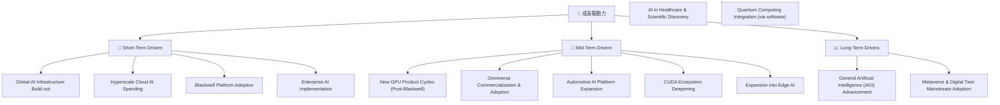

---

## 9. 風險矩陣

雖然 NVIDIA 擁有強勁的成長潛力和堅固的護城河，但投資仍面臨多重風險。

### 9.1 風險評分矩陣

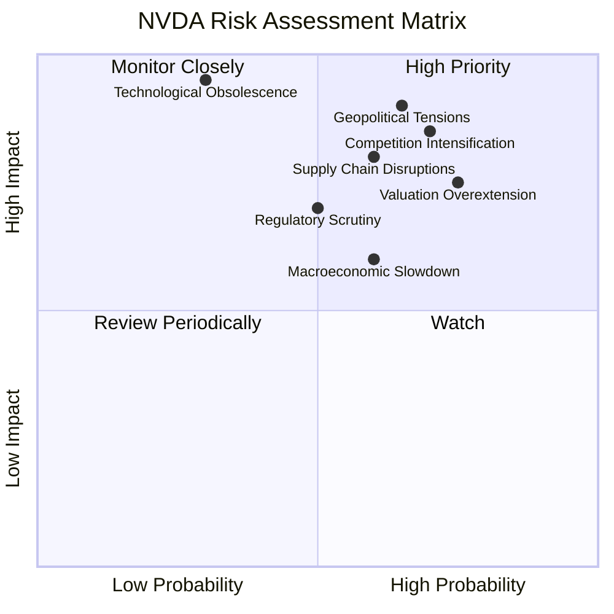

### 9.2 風險清單詳細分析

| # | 風險項目 | 發生機率 | 財務衝擊 | 風險評分 | 緩解措施 |
|---|----------|----------|----------|----------|----------|
| 1 | 🔴 **AI 晶片市場競爭加劇 (Competition Intensification)** | 高 (70%) | 高 (-10%收入) | 🔴 8.5/10 | NVIDIA 透過持續的研發投入 (FY2026 $18.50B) 保持技術領先，強化 CUDA 生態系統的客戶鎖定效應，並拓展多元化應用市場。 |
| 2 | 🔴 **地緣政治與貿易限制 (Geopolitical Tensions)** | 中-高 (65%) | 極高 (-15%收入) | 🔴 9.0/10 | 強化全球供應鏈韌性，探索在不同區域的生產與組裝合作夥伴。積極與政府溝通，遵守出口管制法規，並尋求多元化市場。 |
| 3 | 🟡 **供應鏈中斷風險 (Supply Chain Disruptions)** | 中 (60%) | 高 (-10%收入) | 🟡 8.0/10 | 與主要代工夥伴 (如台積電) 維持緊密合作，多元化供應商基礎，並建立更穩健的庫存管理策略以應對突發事件。 |
| 4 | 🟡 **估值回調風險 (Valuation Overextension)** | 高 (75%) | 中 (-20%股價) | 🟡 7.5/10 | 透過持續超預期的業績增長來證明其高估值的合理性。投資者需密切關注其 Forward P/E 和 PEG 等估值指標的變化。 |
| 5 | 🟡 **監管審查與反壟斷調查 (Regulatory Scrutiny)** | 中 (50%) | 中 (-5%收入) | 🟡 7.0/10 | 積極配合各國監管機構的審查，確保業務行為符合反壟斷和公平競爭原則，避免不必要的法律訴訟和罰款。 |
| 6 | 🟢 **宏觀經濟放緩 (Macroeconomic Slowdown)** | 中 (60%) | 中 (-5%收入) | 🟢 6.0/10 | AI 基礎設施建設的需求具備長期結構性增長動力，可一定程度抵禦短期經濟波動。公司財務健康，現金充裕，有能力應對經濟下行。 |
| 7 | 🟢 **技術過時風險 (Technological Obsolescence)** | 低 (30%) | 極高 (-20%收入) | 🟢 9.5/10 | NVIDIA 擁有業界領先的研發能力和創新文化，持續投資於下一代技術。其 CUDA 生態系統也增加了客戶的轉換成本，降低了單純技術過時的風險。 |

---

## 10. 投資建議

綜合以上深度分析，NVIDIA 在 AI 時代的領導地位、卓越的財務表現和堅固的競爭護城河使其成為一個極具吸引力的投資標的。

### 10.1 最終綜合評級雷達圖

```
╔══════════════════════════════════════════════════════════════════╗
║                    📊 NVDA 綜合評級雷達圖                        ║
╠══════════════════════════════════════════════════════════════════╣
║                                                                  ║
║  基本面強度  9.5 ▓▓▓▓▓▓▓▓▓▓▓▓▓▓▓▓▓▓▓░                            ║
║  成長動能    9.8 ▓▓▓▓▓▓▓▓▓▓▓▓▓▓▓▓▓▓▓▓                            ║
║  獲利品質    9.7 ▓▓▓▓▓▓▓▓▓▓▓▓▓▓▓▓▓▓▓▓                            ║
║  財務健康    9.5 ▓▓▓▓▓▓▓▓▓▓▓▓▓▓▓▓▓▓▓░                            ║
║  估值合理性  7.0 ▓▓▓▓▓▓▓▓▓▓▓▓▓▓░░░░░░                            ║
║  護城河深度  9.8 ▓▓▓▓▓▓▓▓▓▓▓▓▓▓▓▓▓▓▓▓                            ║
║  管理層執行  9.5 ▓▓▓▓▓▓▓▓▓▓▓▓▓▓▓▓▓▓▓░                            ║
║  技術創新力  9.9 ▓▓▓▓▓▓▓▓▓▓▓▓▓▓▓▓▓▓▓▓                            ║
║                                                                  ║
║  🏆 綜合總分：8.9/10                                             ║
╚══════════════════════════════════════════════════════════════════╝
```

### 10.2 目標價與隱含報酬率

| 情境 | 目標價 | 隱含報酬率 (相較 $192.53) | 機率權重 (估計) | 加權目標價 |
|------|--------|---------------------------|-----------------|------------|
| 悲觀情境 | $230 | +19.46% | 20% | $46.00 |
| 基準情境 | $290 | +50.63% | 60% | $174.00 |
| 樂觀情境 | $380 | +97.37% | 20% | $76.00 |
| **綜合平均** | **$296** | **+53.74%** | **100%** | **$296.00** |

**投資評級**：**🟢 強烈買入 (Strong Buy)**。NVIDIA 的基本面極其強勁，成長潛力巨大，儘管短期波動可能存在，但長期來看，其在 AI 領域的領導地位將持續帶來豐厚回報。綜合目標價 $296，相較於當前股價 $192.53 具有 53.74% 的上漲空間。

### 10.3 買入時機與觸發因素

```
╔══════════════════════════════════════════════════════════════════╗
║                  ✅ 買入觸發因素 Checklist                      ║
╠══════════════════════════════════════════════════════════════════╣
║                                                                  ║
║  立即買入觸發條件（多數符合）：                                  ║
║  ✅ Forward P/E 遠低於歷史平均且 PEG < 1 (當前 15.13x, 0.59)    ║
║  ✅ 季度營收和盈利持續超預期，且利潤率維持高位                   ║
║  ✅ 資料中心 AI 晶片需求持續旺盛，訂單能見度高                   ║
║  ✅ 新產品 (如 Blackwell 平台) 量產進展順利，市場反響積極       ║
║                                                                  ║
║  加碼觸發條件（出現以下任一）：                                  ║
║  ☐ 股價因市場恐慌或非基本面因素出現 15-20% 的大幅回調           ║
║  ☐ 公司發布超預期的新產品或技術突破，進一步鞏固護城河           ║
║  ☐ 宣布大規模股票回購計劃，顯示管理層對公司價值的信心           ║
║                                                                  ║
║  減碼/停損觸發條件（出現以下任一）：                             ║
║  ☐ 核心資料中心業務成長顯著放緩，或競爭格局惡化導致市場份額流失 ║
║  ☐ 宏觀經濟嚴重衰退，導致企業資本支出大幅削減，影響 AI 基礎設施需求 ║
║  ☐ 關鍵技術被競爭對手超越，或 CUDA 生態系統出現裂痕             ║
║  ☐ 估值指標 (如 Forward P/E) 顯著脫離基本面，出現泡沫化跡象     ║
╚══════════════════════════════════════════════════════════════════╝
```

### 10.4 投資人適配度分析

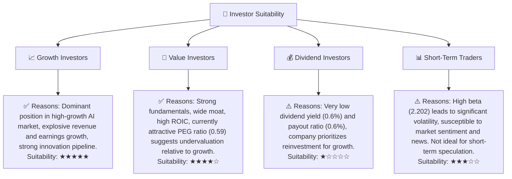

### 10.5 關鍵監控指標

| 監控類型 | 指標 | 關注點 | 頻率 |
|----------|------|--------|------|
| **營收成長** | 資料中心收入 YoY 成長 | AI 基礎設施需求是否持續強勁，企業級採用進度 | 每季財報 |
| **獲利能力** | 毛利率、營業利益率 | 產品組合變化、定價能力、成本控制效率 | 每季財報 |
| **競爭格局** | 競爭對手新產品發布、市場份額變化 | AMD、Intel 等在 AI 晶片市場的競爭力 | 持續監控 |
| **技術創新** | 新 GPU 架構、AI 軟體平台更新 | 技術領先地位是否動搖，生態系統黏性 | 季度/年度產品發布 |
| **估值指標** | Forward P/E, PEG Ratio | 股價是否脫離基本面，市場情緒變化 | 每日/每週 |
| **宏觀環境** | 全球經濟增長、企業資本支出趨勢 | 潛在的經濟逆風對需求端的影響 | 每月宏觀數據 |
| **供應鏈** | 晶圓代工產能、地緣政治風險 | 晶片供應是否受限，對交貨和成本的影響 | 持續監控 |

---

> **免責聲明**：本報告為 AI 自動生成，僅供研究參考，不構成投資建議。投資有風險，入市需謹慎。