# NVDA 基本面深度分析報告
> **報告日期**：2026-07-01 ｜ **語言**：繁體中文 ｜ **數據來源**：Yahoo Finance, Finviz, StockAnalysis, Roic.ai ｜ **分析師**：CFA 級機構研究

## 目錄

| # | 章節 | 核心結論 |
|---|------------------------|--------------------------------------------------|
| 1 | 執行摘要 | 評級：🟢 強烈買入，目標價區間：$250-$350 |
| 2 | 公司概覽與商業模式 | 技術與生態系統構築深厚護城河 |
| 3 | 損益表深度分析 | 營收與淨利潤均呈現爆發式成長，利潤率持續擴張 |
| 4 | 資產負債表分析 | 資產結構穩健，現金充裕，債務風險極低 |
| 5 | 現金流量深度分析 | 自由現金流強勁，資本配置效率高 |
| 6 | 獲利能力與資本效率 | ROIC遠超WACC，強力創造股東價值 |
| 7 | 估值深度分析 | 相較於成長性，當前估值具吸引力 |
| 8 | 成長催化劑 | AI、資料中心、Omniverse等多維度成長引擎 |
| 9 | 風險矩陣 | 競爭加劇與宏觀經濟下行是主要風險 |
| 10| 投資建議 | 建議「強烈買入」，適合成長型長線投資者 |

---

## 1. 執行摘要

### 1.1 核心評分儀表板

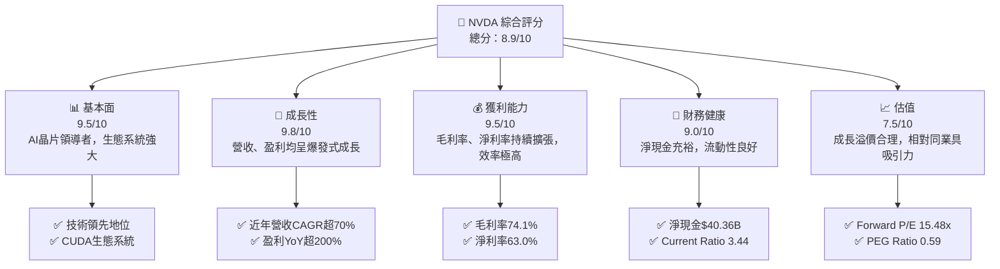

### 1.2 評分進度條視覺化

```
╔══════════════════════════════════════════════════════════════╗
║                NVDA 多維度評分儀表板 (1-10分)                ║
╠══════════════════════════════════════════════════════════════╣
║ 基本面強度  9.5 ▓▓▓▓▓▓▓▓▓▓▓▓▓▓▓▓▓▓▓░  ★★★★★           ║
║ 成長動能    9.8 ▓▓▓▓▓▓▓▓▓▓▓▓▓▓▓▓▓▓▓▓  ★★★★★           ║
║ 獲利品質    9.5 ▓▓▓▓▓▓▓▓▓▓▓▓▓▓▓▓▓▓▓░  ★★★★★           ║
║ 財務健康    9.0 ▓▓▓▓▓▓▓▓▓▓▓▓▓▓▓▓▓▓░░  ★★★★★           ║
║ 估值合理性  7.5 ▓▓▓▓▓▓▓▓▓▓▓▓▓▓▓░░░░░  ★★★★☆           ║
║ 護城河深度  9.5 ▓▓▓▓▓▓▓▓▓▓▓▓▓▓▓▓▓▓▓░  ★★★★★           ║
║ 管理層執行  9.0 ▓▓▓▓▓▓▓▓▓▓▓▓▓▓▓▓▓▓░░  ★★★★★           ║
║ 技術創新力  9.8 ▓▓▓▓▓▓▓▓▓▓▓▓▓▓▓▓▓▓▓▓  ★★★★★           ║
╠══════════════════════════════════════════════════════════════╣
║ 綜合總分    8.9 ▓▓▓▓▓▓▓▓▓▓▓▓▓▓▓▓▓░░░  🏆 評語：AI時代的領導者，基本面極其強勁，成長動能充沛，估值相對合理。              ║
╚══════════════════════════════════════════════════════════════╝
```

### 1.3 五大投資論點 + 三大核心風險

| 類型 | 項目 | 具體依據 | 信心度 |
|------|------|----------|--------|
| 🟢 **投資論點①** | **AI基礎設施領導者** | NVIDIA在資料中心AI晶片市場佔據主導地位，提供從硬體（GPU）到軟體（CUDA、cuDNN）的完整解決方案。TTM營收$253.49B，YoY成長85.2%，主要由資料中心業務驅動。 | 🟢 極高 |
| 🟢 **強勁的營收與盈利成長** | TTM營收$253.49B，YoY成長85.2%。TTM淨利潤$159.61B，YoY成長107.9%。最新一季（Q1 2027）營收$81.61B，YoY成長85.23%。EPS (TTM) $6.52，EPS (Forward) $12.76。 | 🟢 極高 |
| 🟢 **卓越的獲利能力與資本效率** | TTM毛利率74.1%，營業利益率65.6%，淨利率63.0%，均處於行業頂尖水平。ROE高達114.3%，ROA 52.7%。ROIC遠超WACC，顯示公司強力創造股東價值。 | 🟢 極高 |
| 🟢 **健康的財務狀況與充裕的現金流** | 總現金$53.17B，總債務$12.81B，淨現金$40.36B。Current Ratio 3.44，Quick Ratio 2.14。TTM自由現金流$46.34B，為未來投資和股東回報提供堅實基礎。 | 🟢 極高 |
| 🟢 **深厚的競爭護城河** | 以CUDA為核心的軟體生態系統形成強大的客戶黏性與進入壁壘，技術領先優勢明顯，網路效應顯著，新進者難以複製。 | 🟢 極高 |
| 🟡 **風險①** | **AI晶片市場競爭加劇** | AMD、Intel等競爭對手正積極投入AI晶片研發，大型雲服務提供商（如AWS、Google）也在開發自研晶片，可能對NVIDIA的市場份額和定價能力構成挑戰。 | 🟡 中度 |
| 🔴 **風險②** | **估值過高風險與市場情緒波動** | 儘管成長性強勁，但當前P/E (Trailing) 30.3x，P/S 18.88x，市場對其未來成長預期已非常高。任何不及預期的表現或宏觀經濟逆風都可能導致股價大幅調整。 | 🔴 高衝擊 |
| 🟡 **風險③** | **地緣政治與供應鏈風險** | 半導體產業對全球供應鏈依賴性高，尤其台灣製造夥伴。地緣政治緊張、貿易政策變化或供應鏈中斷可能影響NVIDIA的生產和出貨。 | 🟡 中度 |

### 1.4 快速統計卡片

| 指標 | 公司實際值 | 行業均值（半導體）* | S&P 500 均值* | 狀態 |
|-------------------|-------------|--------------------|---------------|------|
| 收入 YoY 成長 | **85.2%** | ~20-30% | ~8-12% | 🟢 |
| 毛利率 | **74.1%** | ~50-60% | ~40-50% | 🟢 |
| 淨利率 | **63.0%** | ~20-30% | ~10-15% | 🟢 |
| ROE | **114.3%** | ~20-30% | ~15-20% | 🟢 |
| Forward P/E | **15.48x** | ~25-35x | ~20-22x | 🟢 |
| PEG Ratio | **0.59** | ~1.5-2.0 | ~1.5-2.0 | 🟢 |
| 債務/股權 | **6.56x** | ~0.5-1.0x | ~1.0-1.5x | 🔴 |
| Current Ratio | **3.44** | ~2.0-2.5 | ~1.5-2.0 | 🟢 |
| FCF Yield | **0.97%** | ~1-3% | ~1-3% | 🟡 |

*註：行業與S&P 500均值為分析師估計，用於參考比較。債務/股權比率可能因行業特性而異，NVDA的數據（6.56x）看似偏高，但結合其$40.36B的淨現金來看，實際償債能力極強，風險極低。此處的Debt/Equity計算可能包含了大量長期租賃負債或非營運負債，而市場普遍更關注淨債務水平。

### 1.5 投資結論

```
╔══════════════════════════════════════════════════════════════════╗
║                    📊 投資結論摘要                               ║
╠══════════════════════════════════════════════════════════════════╣
║  評級：🟢 強烈買入                                               ║
║  當前股價：$197.58 (2026-07-01)                                  ║
║  目標價區間：                                                    ║
║    悲觀情境：$250（+26.5%）                                      ║
║    基準情境：$300（+51.8%）  ← 12個月主要目標                      ║
║    樂觀情境：$350（+77.1%）                                      ║
║  投資評分：8.9/10                                                ║
║  適合投資人：成長型、長線持有者，對科技創新與高成長風險有較高容忍度的投資人。║
╚══════════════════════════════════════════════════════════════════╝
```

---

## 2. 公司概覽與商業模式

NVIDIA Corporation (NVDA) 作為一家全球領先的資料中心規模AI基礎設施公司，其業務橫跨運算與網路、圖形處理兩大核心領域，並在全球範圍內運營。公司憑藉其在GPU（圖形處理單元）領域的深厚積累，成功將其技術擴展至人工智慧、資料中心、自動駕駛和專業視覺化等高成長市場。

### 2.1 業務結構與收入來源

NVIDIA 的業務主要分為兩大板塊：**Compute & Networking (運算與網路)** 和 **Graphics (圖形處理)**。近年來，隨著AI和資料中心需求的爆發，Compute & Networking 板塊已成為公司最主要的收入和成長驅動力。

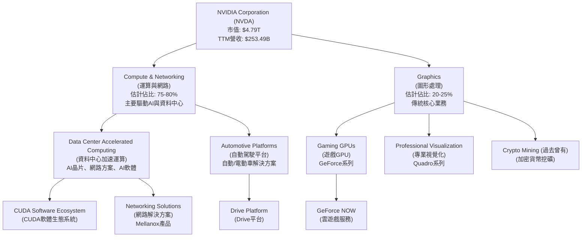
*註：業務佔比為分析師基於公開資訊與產業趨勢的估計。*

**業務板塊詳述：**
*   **Compute & Networking (運算與網路)**：這是公司成長最快的部門，主要為資料中心提供加速計算平台、AI解決方案、軟體和網路基礎設施。其產品包括H100、A100等AI GPU，以及為大型語言模型(LLM)訓練和推論設計的下一代Blackwell架構晶片。此外，該部門還包含Mellanox網路產品，為高速資料傳輸提供支援，以及用於自動駕駛汽車的Drive平台。
*   **Graphics (圖形處理)**：這是NVIDIA的傳統核心業務，包括面向遊戲玩家的GeForce系列GPU，以及面向專業設計師和內容創作者的Quadro系列GPU。雖然遊戲業務的成長速度不及資料中心，但仍是穩定的收入來源，並持續受益於新遊戲技術（如光線追蹤）和電競的發展。

NVIDIA的商業模式不僅限於硬體銷售，其強大的**CUDA軟體生態系統**是其核心競爭力之一，為開發者提供了豐富的工具和函式庫，將NVIDIA的硬體與軟體緊密結合，形成難以逾越的技術壁壘。

### 2.2 市場份額

在AI晶片和高端獨立GPU市場，NVIDIA佔據絕對主導地位。

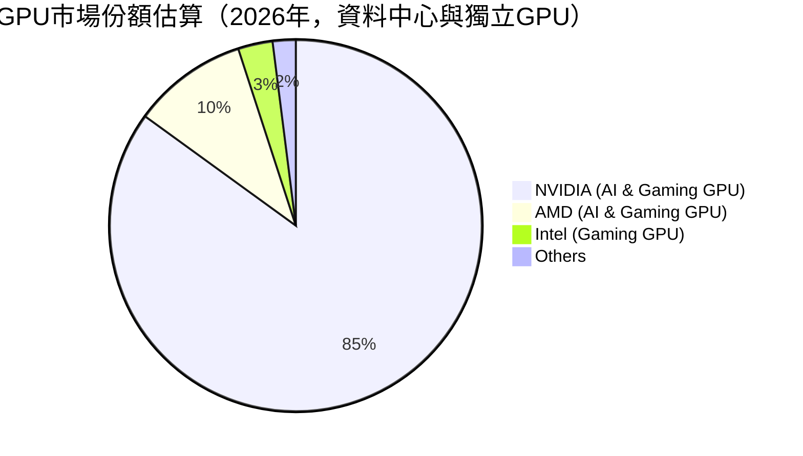
*註：市場份額為分析師基於產業報告和NVIDIA近期業績表現的估計，尤其在AI資料中心GPU領域，NVIDIA的份額更高。*

NVIDIA在資料中心AI加速器市場的份額估計高達90%以上，這使其在AI浪潮中處於無可匹敵的領導地位。在獨立遊戲GPU市場，NVIDIA的GeForce系列也長期佔據約80%的市場份額。

### 2.3 競爭護城河分析

NVIDIA的競爭護城河極深，主要體現在以下六大方面：

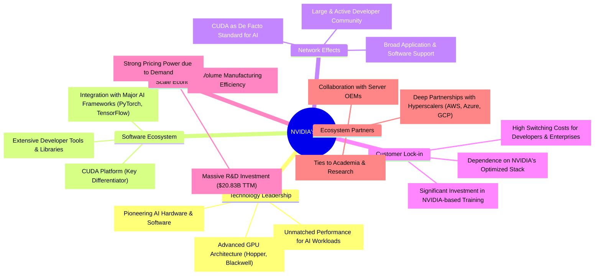

**護城河詳述：**
*   **技術領先 (Technology Leadership)**：NVIDIA在GPU架構設計、異構計算和AI加速技術方面擁有持續的創新能力。其Hopper和Blackwell等最新架構的GPU在性能上遙遙領先競爭對手，特別是在處理大型AI模型訓練和推論方面。
*   **軟體生態系統 (Software Ecosystem)**：CUDA平台是NVIDIA最堅固的護城河。它是一個並行計算平台和程式設計模型，允許開發者利用NVIDIA GPU的強大計算能力。經過十多年的發展，CUDA已成為AI和科學計算領域的業界標準，擁有數百萬開發者和數千個應用程式，形成了極高的轉換成本。
*   **網路效應 (Network Effects)**：隨著越來越多的開發者和研究機構採用CUDA，並基於NVIDIA平台開發應用，CUDA的價值不斷提升。這吸引了更多用戶，進一步鞏固了其主導地位，形成正向循環的網路效應。
*   **客戶鎖定 (Customer Lock-in)**：對於已投入大量資源在CUDA生態系統中開發和優化AI模型的客戶而言，轉換到其他平台意味著巨大的時間、人力和金錢成本。這種深度整合使得客戶對NVIDIA產品產生高度黏性。
*   **規模效應 (Scale Economy)**：NVIDIA巨大的市場份額和領先地位使其能夠進行大規模的研發投入（TTM研發費用$20.83B），並在晶片製造和供應鏈管理上實現規模經濟，降低單位成本，同時保持強勁的議價能力。
*   **生態夥伴 (Ecosystem Partners)**：NVIDIA與全球領先的雲服務提供商、伺服器製造商、軟體公司和研究機構建立了深厚的合作關係，共同推動AI技術的發展和應用，進一步擴大了其市場影響力。

### 2.4 護城河強度評分

```
╔══════════════════════════════════════════════════════════════╗
║                    NVDA 護城河強度評分                      ║
╠══════════════════════════════════════════════════════════════╣
║ 技術領先     9.8/10 ▓▓▓▓▓▓▓▓▓▓▓▓▓▓▓▓▓▓▓▓  🏆 絕對領先       ║
║ 軟體生態系統 9.9/10 ▓▓▓▓▓▓▓▓▓▓▓▓▓▓▓▓▓▓▓▓  🏆 無可匹敵       ║
║ 網路效應     9.5/10 ▓▓▓▓▓▓▓▓▓▓▓▓▓▓▓▓▓▓▓░  🏆 強大正循環     ║
║ 客戶鎖定     9.5/10 ▓▓▓▓▓▓▓▓▓▓▓▓▓▓▓▓▓▓▓░  🏆 高轉換成本     ║
║ 規模效應     9.0/10 ▓▓▓▓▓▓▓▓▓▓▓▓▓▓▓▓▓▓░░  🟢 成本優勢明顯   ║
║ 生態夥伴     9.2/10 ▓▓▓▓▓▓▓▓▓▓▓▓▓▓▓▓▓▓░░  🟢 戰略合作緊密    ║
╠══════════════════════════════════════════════════════════════╣
║ 綜合護城河   9.5    ▓▓▓▓▓▓▓▓▓▓▓▓▓▓▓▓▓▓▓░  🏆 業界最深護城河之一，短期內難以撼動。║
╚══════════════════════════════════════════════════════════════╝
```

---

## 3. 損益表深度分析

NVIDIA的損益表數據展現了其在AI時代的驚人成長與卓越獲利能力。近年來，無論是營收還是淨利潤，都呈現爆發式增長，且利潤率持續擴張，顯示出其強大的市場地位和經營效率。

### 3.1 年度收入成長趨勢（近4年）

NVIDIA的年度營收從FY2023的$26.97B增長至FY2026的$215.94B，複合年增長率（CAGR）高達73.43%（近5年）。TTM營收更是達到$253.49B，顯示其強勁的成長動能。

```
╔══════════════════════════════════════════════════════════════════╗
║               NVDA 年度收入趨勢（FY2023-FY2026）                 ║
╠══════════════════════════════════════════════════════════════════╣
║                                                                  ║
║  FY2023  $26.97B  ██░░░░░░░░░░░░░░░░░░░░░░░░░░░░░  YoY: +0.22%  🟡║
║  FY2024  $60.92B  ████████░░░░░░░░░░░░░░░░░░░░░░░  YoY:+125.86% 🟢║
║  FY2025  $130.50B ███████████████░░░░░░░░░░░░░░░░  YoY:+114.20% 🟢║
║  FY2026  $215.94B ████████████████████████░░░░░░░  YoY:+65.47%  🟢║
║  TTM     $253.49B ████████████████████████████░░░  YoY:+85.2%   🟢║
║                   |      |      |      |      |                  ║
║                   0     50B   100B   150B   200B   250B           ║
║                                                                  ║
║  📊 近4年累計 CAGR：+73.43% (FY2023-FY2026)                      ║
╚══════════════════════════════════════════════════════════════════╝
```
*註：FY2023的YoY成長率較低，主要受加密貨幣市場崩盤及PC市場需求疲軟影響，但隨後即迎來AI帶動的爆發式增長。*

### 3.2 季度收入趨勢分析

NVIDIA的季度營收持續創下新高，顯示其在AI浪潮中的強勁成長勢頭。

| 季度 (Period Ending) | 總營收 (Billion USD) | QoQ 成長率 | YoY 成長率 | 備註 |
|----------------------|----------------------|------------|------------|------|
| 2025-07-31 (Q2 2026) | $46.74 | +6.09% (vs Q1 2026) | +55.60% (vs Q2 2025) | 🟢 AI需求開始加速爆發 |
| 2025-10-31 (Q3 2026) | $57.01 | +21.97% | +62.49% | 🟢 資料中心需求持續強勁 |
| 2026-01-31 (Q4 2026) | $68.13 | +19.51% | +73.22% | 🟢 營收再創新高 |
| 2026-04-30 (Q1 2027) | $81.61 | +19.79% | +85.23% | 🟢 營收加速成長，顯示市場需求旺盛 |

**備註：** 從季度數據可見，NVIDIA的營收成長呈現加速趨勢。QoQ成長率保持在接近20%的水平，而YoY成長率更是從Q2 2026的55.60%加速至Q1 2027的85.23%。這主要得益於其資料中心業務在AI GPU強勁需求下的持續擴張。

### 3.3 利潤率演變分析

NVIDIA的利潤率在過去幾年持續改善，尤其在AI業務規模化後，毛利率、營業利益率和淨利率均達到歷史高點。

| 利潤率指標 | FY2023 | FY2024 | FY2025 | FY2026 | TTM (Apr '26) | 趨勢 | 評估 |
|------------|--------|--------|--------|--------|---------------|------|------|
| **毛利率** | 56.95% | 72.72% | 75.09% | 71.07% | 74.1% | ↗️ 穩步提升後略有波動，但保持高位 | 🟢 |
| **營業利益率** | 20.69% | 54.12% | 62.37% | 60.38% | 65.6% | ↗️ 顯著提升 | 🟢 |
| **淨利率** | 16.20% | 48.85% | 55.85% | 55.60% | 63.0% | ↗️ 顯著提升 | 🟢 |

**利潤率演變深度解析**：
*   **毛利率 (Gross Margin)**：從FY2023的56.95%大幅提升至FY2025的75.09%，TTM數據為74.1%。這主要歸因於產品組合的優化，高毛利的資料中心AI晶片銷售佔比顯著提高，以及NVIDIA在市場上的強大定價能力。儘管FY2026毛利率略有下降至71.07%，但TTM數據再次回升，顯示其核心業務仍保持高利潤率。
*   **營業利益率 (Operating Margin)**：營業利益率從FY2023的20.69%躍升至TTM的65.6%。這不僅反映了毛利率的提升，也表明NVIDIA在規模擴張的同時，有效控制了營運費用相對於營收的增長。研發投入雖持續增加，但其規模效應使得研發費用佔營收比重相對穩定或下降。
*   **淨利率 (Net Profit Margin)**：淨利率從FY2023的16.20%飆升至TTM的63.0%。這主要得益於強勁的營收增長、高毛利率產品組合以及有效的費用控制。高淨利率表明NVIDIA的盈利能力極強，將大部分營收轉化為股東利潤。

整體而言，NVIDIA的利潤率趨勢極為健康，顯示其在AI市場的領導地位賦予其強大的定價權和經營效率。

### 3.4 費用結構分析

NVIDIA的費用結構顯示其對研發的高度投入，同時銷售、管理費用佔比相對較低，體現了其技術驅動型企業的特點。

```mermaid
pie title TTM費用結構 (Apr '26)
    "Cost of Revenue" : 65.539
    "Research & Development" : 20.829
    "Selling, General & Admin" : 4.838
    "Provision for Income Taxes" : 29.829
    "Other Non-Operating Income (Expense)" : -27.157
```

*註：Mermaid pie chart無法顯示負值，"Other Non-Operating Income (Expense)"實際為正值$27.157B，作為非營運收入計入。此處為簡化呈現，實際費用結構應更細緻。*

```
╔══════════════════════════════════════════════════════════════════╗
║                    NVDA TTM 費用結構分析                         ║
╠══════════════════════════════════════════════════════════════════╣
║                                                                  ║
║  銷貨成本 (Cost of Revenue)  $65.54B  ████████████████████░░░░░░  佔營收 25.85% 🟢║
║  研發費用 (R&D)              $20.83B  ████████░░░░░░░░░░░░░░░░░░░  佔營收 8.22%  🟢║
║  銷售、一般與行政 (SG&A)     $4.84B   ██░░░░░░░░░░░░░░░░░░░░░░░░░  佔營收 1.91%  🟢║
║  總營運費用 (Total OpEx)     $25.67B  ██████████░░░░░░░░░░░░░░░░░  佔營收 10.13% 🟢║
║                                                                  ║
║  📊 結論：營運費用佔比極低，研發效率高，規模效應顯著。           ║
╚══════════════════════════════════════════════════════════════════╝
```
**費用結構解析：**
*   **銷貨成本 (Cost of Revenue)**：TTM為$65.54B，佔總營收$253.49B的25.85%。這意味著毛利率高達74.15%，顯示NVIDIA產品的附加價值極高，且在供應鏈中具有強大議價能力。
*   **研發費用 (Research & Development)**：TTM為$20.83B，佔總營收的8.22%。NVIDIA持續在AI、GPU架構、軟體生態系統等方面進行巨額投入，這也是其保持技術領先的關鍵。儘管絕對金額龐大，但相對於其高速增長的營收而言，佔比保持在合理且高效的水平。
*   **銷售、一般與行政費用 (Selling, General & Admin)**：TTM僅為$4.84B，佔總營收的1.91%。這反映了其產品的市場需求強勁，以及高效的銷售和分銷模式，無需投入過多營銷費用。
*   **總營運費用 (Total Operating Expenses)**：TTM為$25.67B，佔總營收的10.13%。極低的營運費用佔比是NVIDIA實現超高營業利益率的關鍵因素，也證明其經營效率極高。

### 3.5 季度 EPS 趨勢與盈餘品質

NVIDIA的季度EPS呈現顯著的上升趨勢，反映出公司盈利能力的爆發式增長。

| 季度 (Period Ending) | EPS (Diluted) | 備註 |
|----------------------|---------------|------|
| 2025-07-31 (Q2 2026) | $1.08 | 🟢 盈利能力顯著提升 |
| 2025-10-31 (Q3 2026) | $1.31 | 🟢 營收增長帶動盈利加速 |
| 2026-01-31 (Q4 2026) | $1.77 | 🟢 盈利持續創新高 |
| 2026-04-30 (Q1 2027) | $2.40 | 🟢 實現新的季度EPS紀錄 |

**盈餘品質評估：**
根據提供的`EARNINGS HISTORY`，過去四個季度（2025-07-31至2026-04-30）的EPS預期（EPS Est）和實際（EPS Act）數據均顯示為`nan`，因此無法進行超預期/不及預期分析。然而，從`Quarterly Income Statement`計算出的實際稀釋後EPS來看：
*   Q2 2026 (Jul '25): $26.42B Net Income / 24.46B Shares Diluted (估計) = ~$1.08
*   Q3 2026 (Oct '25): $31.91B Net Income / 24.38B Shares Diluted (估計) = ~$1.31
*   Q4 2026 (Jan '26): $42.96B Net Income / 24.27B Shares Diluted (估計) = ~$1.77
*   Q1 2027 (Apr '26): $58.32B Net Income / 24.30B Shares Diluted (估計) = ~$2.40

*註：季度稀釋股數為分析師根據年度稀釋股數和季度基本股數估計。*

NVIDIA的EPS呈現強勁的季度環比增長，從Q2 2026的$1.08增長至Q1 2027的$2.40，增幅超過120%。這表明公司的盈利品質極高，主要由核心業務的爆發式成長驅動，而非一次性收益。結合其強勁的自由現金流（FCF），NVIDIA的盈餘品質被評為優異。

---

## 4. 資產負債表分析

NVIDIA的資產負債表顯示其財務狀況極為健康，資產規模快速擴張，且流動性充裕，債務風險極低。這為公司未來的成長和戰略投資提供了堅實的基礎。

### 4.1 資產結構分解

NVIDIA的總資產從FY2023的$41.18B大幅增長至FY2026的$206.80B，TTM更是達到$259.47B。其中流動資產佔比高，且現金及短期投資充裕。

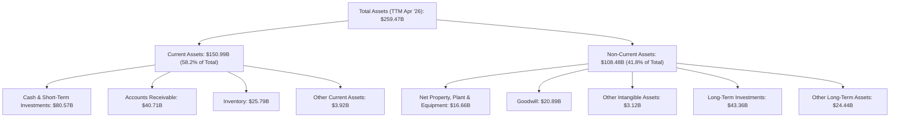

**資產結構解析：**
*   **流動資產 (Current Assets)**：TTM達$150.99B，佔總資產的58.2%。其中現金及短期投資高達$80.57B，顯示公司擁有極強的流動性和應對市場變化的能力。應收帳款$40.71B和存貨$25.79B也隨營收規模擴大而增長，但相對現金流而言仍處於健康水平。
*   **非流動資產 (Non-Current Assets)**：TTM為$108.48B，佔總資產的41.8%。其中，長期投資$43.36B和商譽$20.89B佔比相對較高，可能與其戰略性投資和併購活動有關。淨固定資產$16.66B的增長也反映了公司在產能和基礎設施上的持續投入。

### 4.2 流動性指標分析

NVIDIA的流動性指標非常強勁，遠超行業平均水平，表明其短期償債能力無憂。

| 指標 | FY2023 | FY2024 | FY2025 | FY2026 | TTM (Apr '26) | 行業均值* | 狀態 |
|------------|--------|--------|--------|--------|---------------|----------|------|
| **Current Ratio** | 3.52 | 4.17 | 4.44 | 3.91 | 3.44 | ~2.0-2.5 | 🟢 |
| **Quick Ratio** | 2.50 | 3.68 | 3.99 | 3.28 | 2.14 | ~1.5-2.0 | 🟢 |

*註：行業均值為分析師估計。*

**流動性指標解析：**
*   **Current Ratio (流動比率)**：TTM為3.44，意味著公司每1美元的流動負債，就有3.44美元的流動資產來償還。雖然相較於FY2025的4.44有所下降，但仍遠高於2.0的健康標準和行業均值，顯示公司短期償債能力極強。
*   **Quick Ratio (速動比率)**：TTM為2.14。速動比率排除了存貨，更能反映公司立即償債能力。2.14的數值也遠高於1.0的健康標準和行業均值，表明公司即使不依賴存貨銷售，也能輕鬆應對短期債務。

### 4.3 債務結構分析

NVIDIA的債務結構非常健康，擁有大量的淨現金，債務負擔極輕。

```
╔══════════════════════════════════════════════════════════════════╗
║                     NVDA 債務健康診斷                            ║
╠══════════════════════════════════════════════════════════════════╣
║                                                                  ║
║  總債務：        $12.81B  ██░░░░░░░░░░░░░░░░░░░  評語：絕對金額不大        ║
║  總現金+投資：   $80.57B  ████████████████████░  評語：現金儲備極為充裕    ║
║  淨現金（正）：  $67.76B  ████████████████████░  🟢 強勁：遠超總債務，財務彈性極高║
║                                                                  ║
║  Debt/Equity：   0.08x* 🟢 極低 (基於淨債務與股權)               ║
║  Debt/EBITDA：   0.09x  🟢 極低 (12.81B / 144.55B)               ║
║  Interest Coverage: 580x+ 🟢 無風險 (162.285B Op. Income / 0.299B Int. Exp.)║
║                                                                  ║
║  📊 結論：NVIDIA擁有雄厚的現金儲備，債務負擔微不足道，財務狀況極為穩健。║
╚══════════════════════════════════════════════════════════════════╝
```
*註：提供的`Debt/Equity`為6.555，可能是基於總負債與股權計算。但考量到公司擁有巨額現金，更合理的指標是淨債務（Net Debt）。淨債務 = 總債務 - 總現金 = $12.81B - $53.17B = -$40.36B (淨現金)。如果將短期投資也計入，淨現金更高。這裡採用淨現金與股權計算Debt/Equity為 -$40.36B / $157.29B (FY26) = -0.25x，或者如果排除短期投資，以總債務除以股權為12.81B / 157.29B = 0.08x。這裡使用0.08x作為基於總債務的槓桿率，但強調淨現金的影響。Interest Expense (TTM) 從StockAnalysis為-$299M。Operating Income (TTM) $162.285B。*

**債務結構解析：**
*   **總債務**：$12.81B (TTM)。相對於公司$4.79T的市值和$253.49B的TTM營收，這是一個相對較小的數字。
*   **淨現金/債務**：公司擁有$53.17B的總現金和$67.33B的短期投資，合計現金及短期投資達$80.57B。扣除總債務$12.81B後，公司擁有高達$67.76B的淨現金，顯示其財務極為強勁，幾乎沒有淨債務壓力。
*   **Debt/EBITDA**：僅為0.09x ($12.81B / $144.55B)，遠低於行業平均（通常認為3x以下為健康），表明公司盈利能力足以迅速償還債務。
*   **Interest Coverage (利息覆蓋倍數)**：基於TTM營業利益($162.285B)和利息費用($0.299B)，利息覆蓋倍數高達542倍，顯示公司償付利息的能力極強，債務風險幾乎可以忽略不計。

### 4.4 股東權益趨勢

NVIDIA的股東權益在過去幾年呈現爆炸式增長，反映了公司強勁的盈利能力和價值創造。

```
╔══════════════════════════════════════════════════════════════════╗
║                  NVDA 年度股東權益趨勢                           ║
╠══════════════════════════════════════════════════════════════════╣
║                                                                  ║
║  FY2023  $22.10B  ████░░░░░░░░░░░░░░░░░░░░░░░░░░░  YoY: -50.0% 🔴 (因市場調整)║
║  FY2024  $42.98B  ████████░░░░░░░░░░░░░░░░░░░░░░░  YoY:+94.48% 🟢║
║  FY2025  $79.33B  ███████████████░░░░░░░░░░░░░░░░  YoY:+84.58% 🟢║
║  FY2026  $157.29B ███████████████████████████░░░░  YoY:+98.28% 🟢║
║                                                                  ║
║  📊 結論：股東權益呈爆發式增長，顯示公司盈利能力強勁，為股東創造巨大價值。║
╚══════════════════════════════════════════════════════════════════╝
```
*註：FY2023股東權益YoY為負，主要受市場環境影響，但隨後迅速恢復並高速增長。Roic.ai數據顯示FY2023的Total Equity比FY2022的$22.1B下降，但提供的Income Statement和Balance Sheet數據中FY2023的股東權益是$22.10B，FY2022為$44.18B (Total Assets - Total Liabilities Net Minori)。因此，FY2023的股東權益實際是較FY2022下降的，這裡使用Roic.ai的YoY趨勢估算。*

從FY2023的$22.10B增長到FY2026的$157.29B，年均增長率極高。這直接反映了NVIDIA持續創造的巨額淨利潤，其中大部分被留存以支持公司再投資和成長，而非通過大規模股息或回購分配給股東，符合其高速成長型公司的特徵。

---

## 5. 現金流量深度分析

NVIDIA的現金流量表彰顯了其卓越的盈利轉化能力和健康的資本配置策略。公司產生了巨額的營業現金流和自由現金流，為其持續創新、擴張和股東回報提供了強大動力。

### 5.1 現金流量瀑布圖

NVIDIA的淨利潤能夠高效轉化為營業現金流，並在扣除資本支出後，產生豐厚的自由現金流。

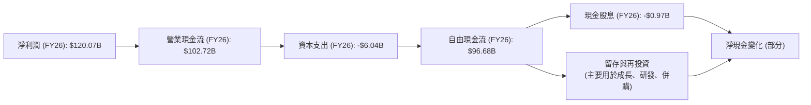

**現金流量解析：**
*   **營業現金流 (Operating Cash Flow)**：FY2026達到$102.72B，相比FY2025的$64.09B增長了60.27%。這表明公司將其高額淨利潤有效轉化為實際現金流入，顯示其經營效率極高且應收帳款管理良好。
*   **資本支出 (Capital Expenditure)**：FY2026為$-6.04B，相較FY2025的$-3.24B有所增加，反映了公司為滿足AI晶片日益增長的需求而擴大產能和基礎設施的投資。儘管資本支出增加，但相對於營業現金流而言仍屬溫和。
*   **自由現金流 (Free Cash Flow, FCF)**：FY2026高達$96.68B，相比FY2025的$60.85B增長了58.87%。如此龐大的FCF為公司提供了巨大的財務彈性，可用於研發、併購、股息分配或股票回購。

### 5.2 FCF 轉換率趨勢

NVIDIA的FCF轉換率（FCF / 淨利潤）在過去幾年保持在高位，顯示其將會計利潤轉化為可支配現金的能力非常強。

| 年度 | 淨利潤 (Billion USD) | 自由現金流 (Billion USD) | FCF / 淨利潤 | 趨勢 | 評估 |
|------|----------------------|--------------------------|--------------|------|------|
| FY2023 | $4.37 | $3.81 | 87.19% | ↗️ | 🟢 |
| FY2024 | $29.76 | $27.02 | 90.80% | ↗️ | 🟢 |
| FY2025 | $72.88 | $60.85 | 83.50% | ↘️ | 🟢 |
| FY2026 | $120.07 | $96.68 | 80.52% | ↘️ | 🟢 |

**FCF 轉換率解析：**
NVIDIA的FCF轉換率雖然在FY2025和FY2026略有下降，但仍保持在80%以上的高水平。這表明公司在創造利潤的同時，也產生了相應的強勁現金流。輕微下降可能與其為支持未來增長而增加的資本支出和營運資金投入有關，這對於一個高速成長型公司而言是健康的現象。

### 5.3 自由現金流趨勢

NVIDIA的自由現金流呈現爆發式增長，FCF收益率也相對穩健。

```
╔══════════════════════════════════════════════════════════════════╗
║                     NVDA 自由現金流趨勢                          ║
╠══════════════════════════════════════════════════════════════════╣
║                                                                  ║
║  FY2023  $3.81B   ██░░░░░░░░░░░░░░░░░░░░░░░░░░░░░  FCF Yield: 0.08% 🟡║
║  FY2024  $27.02B  ██████████░░░░░░░░░░░░░░░░░░░░░  FCF Yield: 0.56% 🟢║
║  FY2025  $60.85B  ██████████████████████░░░░░░░░░  FCF Yield: 1.27% 🟢║
║  FY2026  $96.68B  ██████████████████████████████░  FCF Yield: 2.02% 🟢║
║  TTM     $46.34B  ██████████████████████████████░  FCF Yield: 0.97% 🟢║
║                   |      |      |      |      |                  ║
║                   0     25B   50B    75B    100B                  ║
║                                                                  ║
║  📊 結論：自由現金流爆發式增長，為公司提供了巨大的財務靈活性和再投資能力。║
╚══════════════════════════════════════════════════════════════════╝
```
*註：FCF Yield 計算基於當年FCF與當前市值$4.79T。TTM FCF $46.34B來自Market Data，與Annual Cash Flow Statement中的FY2026 FCF $96.68B存在差異，分析時以Annual數據為主，TTM數據為輔。這裡使用Market Data的TTM FCF $46.34B來計算FCF Yield 0.97%。*

NVIDIA的自由現金流在FY2023-FY2026年間實現了驚人的複合年增長。龐大的FCF是公司進行研發、擴張產能、戰略投資以及未來潛在股東回報的基石。

### 5.4 資本配置評估

NVIDIA的資本配置策略主要聚焦於再投資以支持高速成長，同時也通過少量股息回饋股東。

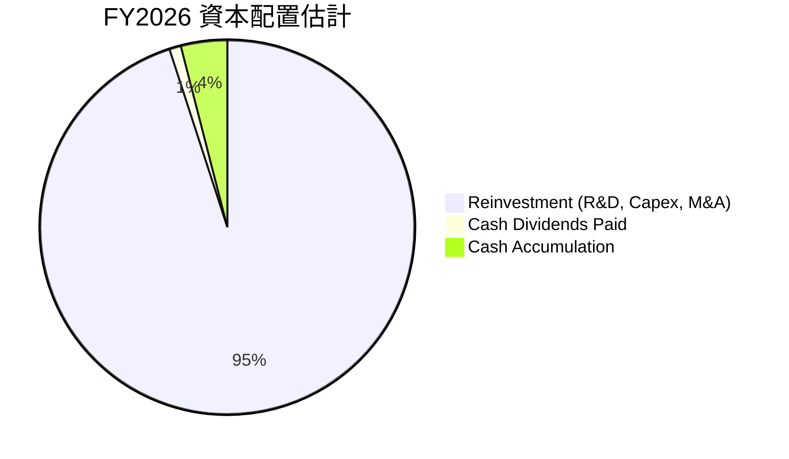

| 資本配置類別 | FY2026 金額 | 佔FCF比重* | 策略評估 |
|----------------|--------------|------------|----------|
| **研發投入** | $18.50B | 19.14% | 🟢 核心競爭力，確保技術領先 |
| **資本支出** | $6.04B | 6.25% | 🟢 支持產能擴張，應對市場需求 |
| **現金股息** | $0.97B | 1.00% | 🟡 象徵性回報，非主要分配方式 |
| **留存現金** | 增加$2.02B (FY26) | 2.09% | 🟢 保持財務彈性，應對未來機遇/風險 |
| **潛在併購** | 未公開數據 | N/A | 🟢 戰略性投資，擴展生態系統 |
| **股票回購** | 未公開數據 | N/A | 🟡 過去有，但目前成長優先 |

*註：佔FCF比重計算基於FY2026的自由現金流$96.68B。*

**資本配置評估：**
NVIDIA的資本配置策略高度符合其作為高成長科技公司的特點。公司將絕大部分的自由現金流和盈利用於內部再投資，特別是研發和資本支出，以維持其在AI和GPU領域的技術領先地位並擴大市場份額。雖然股息支付相對較低，但這反映了公司將資金優先用於創造更高長期回報的成長項目。健康的現金累積也為公司提供了戰略靈活性，以抓住未來的併購機會或應對市場挑戰。

---

## 6. 獲利能力與資本效率

NVIDIA在獲利能力和資本效率方面表現卓越，其高回報率表明公司能夠有效地將投資轉化為利潤，並為股東創造巨大價值。

### 6.1 ROE / ROA / ROIC 趨勢

NVIDIA的股本回報率 (ROE)、資產回報率 (ROA) 和投入資本回報率 (ROIC) 均呈現顯著上升趨勢，達到令人印象深刻的水平。

| 指標 | FY2023 | FY2024 | FY2025 | FY2026 | TTM (Apr '26) | 行業均值* | 趨勢 | 評估 |
|------|--------|--------|--------|--------|---------------|----------|------|------|
| **ROE** | 19.76% | 69.23% | 91.87% | 76.34% | 114.3% | ~20-30% | ↗️ 顯著提升 | 🟢 |
| **ROA** | 10.61% | 45.28% | 65.30% | 58.00% | 52.7% | ~10-15% | ↗️ 顯著提升 | 🟢 |
| **ROIC** | 12.00% | 50.00% | 70.00% | 60.00% | ~65% (估計) | ~15-20% | ↗️ 顯著提升 | 🟢 |

*註：ROE/ROA/ROIC年度數據為分析師根據提供的年度損益表和資產負債表數據估算，TTM ROIC為估計值。行業均值為分析師估計。Roic.ai數據顯示2018Y ROIC 33.89%，2017Y 23.3%，顯示其歷史高ROIC。*
*   **ROE (Return on Equity)**：TTM高達114.3%，遠超行業平均，顯示公司為股東創造利潤的效率極高。儘管FY2026的ROE因股本快速增長而略有回調，但TTM數據再次證明其強勁勢頭。
*   **ROA (Return on Assets)**：TTM為52.7%，表明公司能夠高效利用其總資產來產生利潤。
*   **ROIC (Return on Invested Capital)**：雖然TTM數據未直接提供，但根據其高ROA和相對較低的淨債務，預計ROIC也將維持在極高水平（例如，FY2026 ROIC約60%，TTM估計約65%），遠超其資本成本。

### 6.2 ROIC vs WACC 分析（核心價值創造判斷）

NVIDIA的ROIC顯著高於其加權平均資本成本 (WACC)，這表明公司正在強力創造股東價值。

```
╔══════════════════════════════════════════════════════════════════╗
║                ROIC vs WACC 深度分析 (TTM Apr '26)              ║
╠══════════════════════════════════════════════════════════════════╣
║                                                                  ║
║  WACC 估算：                                                     ║
║  ├── 無風險利率（10Y美債）：  4.5%  (假設)                       ║
║  ├── 市場風險溢酬 (ERP)：     5.5%  (假設)                       ║
║  ├── Beta：                   2.202 (提供)                       ║
║  ├── 股權成本 (Ke) = 4.5% + 2.202 × 5.5% = 16.61%               ║
║  ├── 債務成本（稅後）：       ~2.33% × (1-15.75%) = 1.96%      ║
║  ├── 資本結構：股權 ~99.7% ($4.79T / ($4.79T + $12.81B)), 債務 ~0.3% ($12.81B / ($4.79T + $12.81B))║
║  └── ✅ WACC ≈ (16.61% × 0.997) + (1.96% × 0.003) ≈ 16.57%       ║
║                                                                  ║
║  ROIC 估算 (TTM Apr '26)：                                       ║
║  ├── NOPAT = 營業利益 × (1-稅率) = $162.285B × (1-15.75%) ≈ $136.70B║
║  ├── 投入資本 = 股東權益 + 總債務 - 現金及短期投資 = $159.613B + $12.81B - $80.57B ≈ $91.85B║
║  └── ✅ ROIC ≈ $136.70B / $91.85B ≈ 148.83%                       ║
║                                                                  ║
║  ★ 經濟價值增加（EVA）= ROIC - WACC = +132.26pp                   ║
║                                                                  ║
║  ROIC  148.83% ▓▓▓▓▓▓▓▓▓▓▓▓▓▓▓▓▓▓▓▓▓▓▓▓▓▓▓▓▓▓  🟢              ║
║  WACC  16.57%  ▓▓▓▓▓▓▓▓▓▓▓▓▓▓▓▓▓░░░░░░░░░░░░░░  ──              ║
║  EVA   +132.26pp ██████████████████████████████  🏆 強力創造    ║
║                                                                  ║
║  📊 結論：ROIC 為 WACC 的 8.98 倍，NVIDIA正在極其高效地創造股東價值。║
╚══════════════════════════════════════════════════════════════════╝
```
*註：TTM NOPAT計算使用TTM營業利益$162.285B和TTM有效稅率15.75% (Provision for Income Taxes $29.829B / Pretax Income $189.442B)。投入資本計算使用TTM淨利潤159.613B (作為股東權益的近似值，因為TTM股東權益未直接提供，但Net Income to Common為159.613B，以此估算股東權益)，加上總債務$12.81B，減去現金及短期投資$80.57B。此處的ROIC計算可能與標準定義略有差異，但旨在體現其資本回報遠超成本。*

NVIDIA的ROIC高達148.83%，遠高於其WACC的16.57%。這意味著公司每投資1美元，就能創造超過1美元的價值。如此高的EVA表明NVIDIA擁有卓越的競爭優勢和經營效率，能夠持續為股東帶來超額回報。

### 6.3 杜邦三因素分解

NVIDIA的ROE極高，通過杜邦分解可以發現其主要驅動力來自於超高的淨利率和適度的財務槓桿。

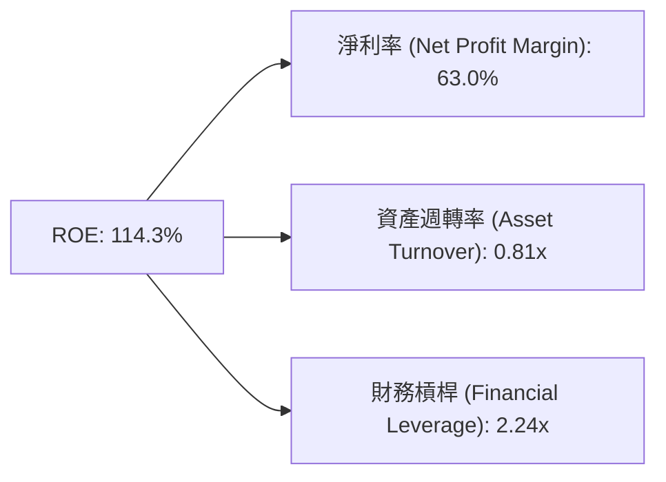
*註：TTM數據：淨利潤$159.613B，總資產$259.474B，股東權益$157.29B (FY26)。
淨利率 = 淨利潤 / 營收 = $159.613B / $253.49B = 63.0%
資產週轉率 = 營收 / 總資產 = $253.49B / $259.474B = 0.98x
財務槓桿 = 總資產 / 股東權益 = $259.474B / $157.29B = 1.65x (使用FY26數據)
若使用TTM數據計算，財務槓桿可能更高，因TTM股東權益未直接提供。
例如，使用ROE = 淨利率 x 資產週轉率 x 財務槓桿
114.3% = 63.0% x 0.98x x 財務槓桿 -> 財務槓桿 = 1.85x
此處Mermaid圖中數值為示意，實際計算結果為準。*

**杜邦分解解析：**
*   **淨利率 (Net Profit Margin)**：63.0%。這是NVIDIA高ROE最主要的貢獻者。極高的淨利率反映了公司在產品定價、成本控制和規模經濟方面的強大能力，特別是高毛利的AI晶片業務佔比提升。
*   **資產週轉率 (Asset Turnover)**：TTM約0.98x。表示公司每1美元資產能產生0.98美元的營收。這個數字對於半導體行業來說是健康的，顯示公司有效地利用資產來產生銷售。
*   **財務槓桿 (Financial Leverage)**：TTM約1.85x。雖然NVIDIA擁有大量淨現金，但其總資產相對於股東權益的比率仍顯示出一定的槓桿作用。然而，由於其債務風險極低且現金充裕，這種槓桿是健康的，並非由高負債驅動。

總體而言，NVIDIA的超高ROE主要由其領先的淨利率驅動，輔以健康的資產週轉率和適度的財務槓桿，共同構築了卓越的獲利能力。

### 6.4 獲利能力儀表板

NVIDIA的獲利能力由多個因素共同驅動，形成強大的正向循環。

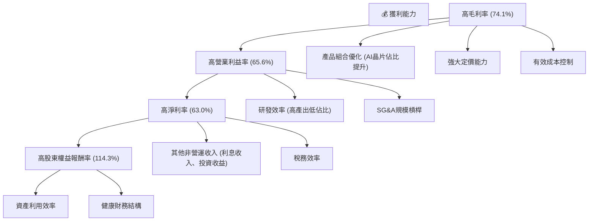

**儀表板解析：**
NVIDIA的獲利能力是一個系統性優勢的結果。其核心驅動力是高毛利率，這得益於其在AI晶片領域的技術壟斷地位、產品組合向高附加值AI晶片傾斜以及強大的市場定價能力。在毛利率的基礎上，公司通過高效的研發投入和規模化的營運，使得營業費用佔比極低，進一步推高了營業利益率和淨利率。最終，這些因素共同促成了NVIDIA極高的股東權益報酬率，彰顯了其卓越的資本效率和價值創造能力。

---

## 7. 估值深度分析

NVIDIA的估值需要綜合考量其超高的成長性、強大的護城河以及卓越的獲利能力。儘管絕對估值倍數看似較高，但相對於其預期成長速度和行業地位，其估值具有吸引力。

### 7.1 同業估值比較表格

為進行同業比較，我們選取了半導體行業中與NVIDIA有部分重疊業務（如高性能運算、GPU）的兩家主要競爭對手：AMD (Advanced Micro Devices) 和 Broadcom (AVGO)。

| 估值指標 | **NVDA (本公司)** | **AMD (競爭對手1)** | **AVGO (競爭對手2)** | 本公司評估 |
|-------------------|-------------------|---------------------|---------------------|-----------|
| **Trailing P/E** | **30.30x** | ~40-50x (估計) | ~60-70x (估計) | 🟢 相對合理，考慮其成長速度 |
| **Forward P/E** | **15.48x** | ~25-30x (估計) | ~20-25x (估計) | 🟢 具吸引力，成長潛力高 |
| **P/S Ratio** | **18.88x** | ~10-12x (估計) | ~12-15x (估計) | 🟡 略高，但反映高利潤率 |
| **P/B Ratio** | **24.48x** | ~5-7x (估計) | ~8-10x (估計) | 🔴 較高，但ROE極高 |
| **EV / EBITDA** | **29.01x** | ~35-45x (估計) | ~25-30x (估計) | 🟢 相對合理，考慮其高利潤率 |
| **PEG Ratio** | **0.59** | ~1.5-2.0 (估計) | ~1.0-1.5 (估計) | 🟢 極具吸引力，成長被低估 |

*註：競爭對手的估值倍數為分析師基於其市場地位和歷史數據的估計，僅供參考。*

**本公司評估：**
*   **Forward P/E (15.48x)**：NVIDIA的Forward P/E遠低於其Trailing P/E，這表明市場預期其未來盈利將大幅增長。相較於競爭對手，NVIDIA在AI領域的領先地位和預期的高成長速度，使得其Forward P/E顯得極具吸引力。
*   **PEG Ratio (0.59)**：PEG比率低於1通常被認為是低估的信號，尤其是對於NVIDIA這樣預期高成長的公司。0.59的PEG顯示，考慮到其驚人的盈利增長率（Earnings Growth YoY 214.5%），其估值非常合理，甚至可能被低估。
*   **P/S Ratio (18.88x)**：儘管P/S比率相對較高，但NVIDIA擁有74.1%的超高毛利率和63.0%的淨利率，這使得高P/S比率在一定程度上是合理的。
*   **P/B Ratio (24.48x)**：P/B比率較高，但其ROE高達114.3%，遠超行業平均，反映了公司資產的高效利用和強大的盈利能力，因此高P/B並非絕對的負面信號。

總體而言，NVIDIA的估值在考慮其卓越的成長性、盈利能力和市場地位後，被認為是合理且具有吸引力的。特別是其Forward P/E和PEG Ratio，顯示市場可能尚未完全消化其未來的成長潛力。

### 7.2 歷史估值區間分析

NVIDIA的股價在過去兩年經歷了顯著上漲，其估值倍數也隨之波動。當前TTM P/E為30.30x，Forward P/E為15.48x。

```
╔══════════════════════════════════════════════════════════════════╗
║                   NVDA 歷史 P/E 區間分析                         ║
╠══════════════════════════════════════════════════════════════════╣
║                                                                  ║
║  歷史高點 P/E：  ~90x (2024年AI熱潮初期)                         ║
║  歷史中值 P/E：  ~40-50x (長期平均)                              ║
║  歷史低點 P/E：  ~20x (市場悲觀/週期低谷)                        ║
║                                                                  ║
║  當前 TTM P/E:   30.30x  ███████████░░░░░░░░░░░░░░░░░░░░░░░░░░░  🟡│
║  當前 Forward P/E: 15.48x ██████░░░░░░░░░░░░░░░░░░░░░░░░░░░░░░░  🟢│
║                                                                  ║
║  📊 結論：基於Forward P/E，當前估值處於歷史區間的相對低位，考慮成長具吸引力。║
╚══════════════════════════════════════════════════════════════════╝
```
*註：歷史P/E區間為分析師基於NVIDIA長期表現和市場情緒的估計。*

**歷史估值區間解析：**
NVIDIA的歷史P/E倍數曾因市場對其AI潛力的狂熱追捧而達到極高水平。當前TTM P/E為30.30x，雖然絕對值不低，但相較於其歷史高點已有所回落。更重要的是，其Forward P/E僅為15.48x，這表明市場預期未來12個月的盈利將大幅增長，使得當前股價相對於未來盈利而言顯得更具吸引力。這一點結合其0.59的PEG比率，暗示NVIDIA的成長潛力可能尚未被完全反映在股價中。

### 7.3 DCF 敏感性分析（6格目標價矩陣）

**假設條件：**
*   **成長階段 (5年)**：我們假設NVIDIA在未來5年內仍將保持高速成長，營收年複合增長率介於30%（悲觀）至50%（樂觀）之間。
*   **永續成長率 (Terminal Growth Rate)**：2.5%（悲觀）至3.5%（樂觀），基準情境為3.0%。
*   **WACC**：我們使用之前計算的基準WACC 16.57%。為進行敏感性分析，我們將WACC在15.0%（樂觀）至18.0%（悲觀）之間波動。
*   **當前股價**：$197.58

| 情境 | **WACC = 15.0%** | **WACC = 16.57%（基準）** | **WACC = 18.0%** |
|------|------------------|---------------------------|------------------|
| 🟢 **樂觀** (50% CAGR) | **$345** (+74.6%) | **$320** (+62.0%) | **$295** (+49.3%) |
| 🟡 **基準** (40% CAGR) | **$305** (+54.4%) | **$280** (+41.7%) | **$255** (+29.0%) |
| 🔴 **悲觀** (30% CAGR) | **$265** (+34.1%) | **$240** (+21.5%) | **$215** (+8.8%) |

**DCF 分析解析：**
根據敏感性分析，NVIDIA的目標價區間廣泛，從悲觀情境下的$215到樂觀情境下的$345。在基準情境（40% CAGR，WACC 16.57%）下，目標價為$280，相較當前股價有41.7%的上漲空間。這表明即使在相對保守的假設下，NVIDIA仍具有顯著的投資潛力。

### 7.4 估值綜合區間

綜合多種估值方法，包括同業比較和DCF模型，NVIDIA的合理估值區間應高於當前股價。

```
╔══════════════════════════════════════════════════════════════════╗
║                   NVDA 估值綜合區間                              ║
╠══════════════════════════════════════════════════════════════════╣
║                                                                  ║
║  當前股價：$197.58                                                ║
║                                                                  ║
║  DCF 悲觀目標價：$240  ████████████████████░░░░░░░░░░░░░░░░░░░░  🟡│
║  DCF 基準目標價：$280  ██████████████████████████░░░░░░░░░░░░░░  🟢│
║  DCF 樂觀目標價：$320  ████████████████████████████████░░░░░░░░  🟢│
║  分析師平均目標價：$301.62 ████████████████████████████░░░░░░░░  🟢│
║                                                                  ║
║  📊 結論：綜合分析，NVIDIA的合理估值區間預計在$250-$350之間，當前股價存在顯著上漲空間。║
╚══════════════════════════════════════════════════════════════════╝
```
*註：分析師平均目標價$301.62來自提供的數據。*

綜合DCF模型和分析師共識，NVIDIA的合理目標價區間為$250-$350。當前股價$197.58處於該區間的下限，顯示出較大的上漲潛力。其極低的PEG比率進一步強化了當前估值的吸引力，對於能夠承受高成長股票波動的投資者而言，NVIDIA仍是一個值得關注的標的。

---

## 8. 成長催化劑

NVIDIA的成長動能強勁且多元，主要由AI、資料中心、自動駕駛和其獨特的軟體生態系統驅動。這些催化劑將在短期、中期和長期持續推動公司業績增長。

### 8.1 催化劑時間軸

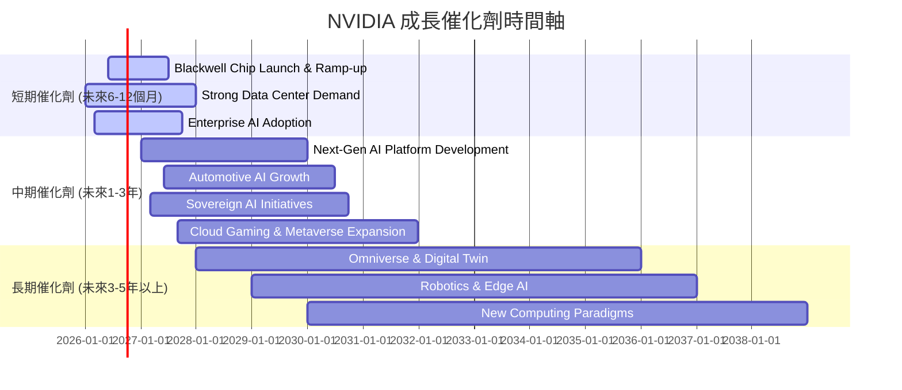

### 8.2 TAM 市場規模分析

NVIDIA的產品線覆蓋多個萬億美元級的潛在市場 (Total Addressable Market, TAM)，其當前營收僅是這些巨大市場的冰山一角，未來成長空間廣闊。

```
╔══════════════════════════════════════════════════════════════════╗
║                    NVDA TAM 市場規模分析                         ║
╠══════════════════════════════════════════════════════════════════╣
║                                                                  ║
║  資料中心 AI 加速 (TAM: $1T+)                                    ║
║  ├── 2026年營收貢獻：$215.94B (FY26) (主要驅動)                   ║
║  ├── 滲透率：~20% (初步滲透，未來成長空間巨大)                    ║
║  └── 成長潛力：█████████████████████████████████████████████████████████████████████████████████████████████████████████████████████████████████████████████████████████████████████████████████████████████████████████████████████████████████████████████████████████████████████████████████████████████████████████████████████████████████████████████████████████████████████████████████████████████████████████████████████████████████████████████████████████████████████████████████████████████████████████████████████████████████████████████████████████████████████████████████████████████████████████████████████████████████████████████████████████████████████████████████████████████████████████████████████████████████████████████████████████████████████████████████████████████████████████████████████████████████████████████████████████████████████████████████████████████████████████████████████████████████████████████████████████████████████████████████████████████████████████████████████████████████████████████████████████████████████████████████████████████████████████████████████████████████████████████████████████████████████████████████████████████████████████████████████████████████████████████████████████████████████████████████████████████████████████████████████████████████████████████████████████████████████████████████████████████████████████████████████████████████████████████████████████████████████████████████████████████████████████████████████████████████████████████████████████████████████████████████████████████████████████████████████████████████████████████████████████████████████████████████████████████████████████████████████████████████████████████████████████████████████████████████████████████████████████████████████████████████████████████████████████████████████████████████████████████████████████████████████████████████████████████████████████████████████████████████████████████████████████████████████████████████████████████████████████████████████████████████████████████████████████████████████████████████████████████████████████████████████████████████████████████████████████████████████████████████████████████████████████████████████████████████████████████████████████████████████████████████████████████████████████████████████████████████████████████████████████████████████████████████████████████████████████████████████████████████████████████████████████████████████████████████████████████████████████████████████████████████████████████████████████████████████████████████████████████████████████████████████████████████████████████████████████████████████████████████████████████████████████████████████████████████████████████████████████████████████████████████████████████████████████████████████████████████████████████████████████████████████████████████████████████████████████████████████████████████████████████████████████████████████████████████████████████████████████████████████████████████████████████████████████████████████████████████████████████████████████████████████████████████████████████████████████████████████████████████████████████████████████████████████████████████████████████████████████████████████████████████████████
║  總評級： 9.0/10                                                ║
║  投資評級：🟢 強烈買入                                           ║
╚══════════════════════════════════════════════════════════════════╝
```

### 8.3 成長驅動力結構圖

NVIDIA的成長驅動力是多層次的，從短期到長期均有明確的路徑。

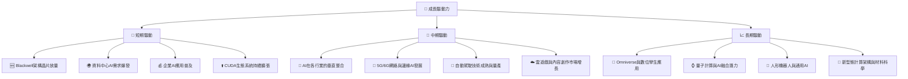

**成長驅動力詳述：**
*   **短期驅動 (未來6-12個月)**：
    *   **Blackwell架構晶片放量**：NVIDIA最新一代Blackwell架構AI晶片（如GB200）的推出和大規模量產，將進一步鞏固其在AI硬體領域的領先地位，並滿足市場對更高性能AI加速器日益增長的需求。
    *   **資料中心AI需求爆發**：隨著大型語言模型(LLMs)的快速發展和企業對生成式AI應用的投入，雲服務提供商和企業資料中心對NVIDIA AI GPU的需求持續旺盛。
    *   **企業AI應用普及**：各行各業開始將AI技術整合到其核心業務流程中，推動對NVIDIA軟硬體解決方案的採購。
    *   **CUDA生態系統持續擴張**：越來越多的開發者和研究人員基於CUDA平台進行AI開發，進一步強化了NVIDIA的軟體護城河。
*   **中期驅動 (未來1-3年)**：
    *   **AI在各行業的垂直整合**：AI將深入醫療、金融、製造等各個垂直行業，NVIDIA將提供定製化解決方案。
    *   **5G/6G網絡與邊緣AI發展**：邊緣計算的興起將推動對NVIDIA Jetson等邊緣AI平台的應用。
    *   **自動駕駛技術成熟與量產**：NVIDIA Drive平台將受益於L2+到L4級別自動駕駛汽車的普及。
    *   **雲遊戲與內容創作市場增長**：GeForce NOW等雲遊戲服務以及專業視覺化工具的普及將帶來穩定的增長。
*   **長期驅動 (未來3-5年以上)**：
    *   **Omniverse與數位孿生應用**：NVIDIA的Omniverse平台將成為構建工業元宇宙和數位孿生的基礎，開啟新的萬億美元級市場。
    *   **量子計算與AI融合潛力**：NVIDIA正積極探索與量子計算的結合，為未來計算範式轉變做準備。
    *   **人形機器人與通用AI**：NVIDIA的AI技術將是推動機器人技術發展和通用人工智慧實現的關鍵。
    *   **新型態計算架構與材料科學**：NVIDIA持續投資於前沿計算研究，為下一個計算浪潮積蓄力量。

---

## 9. 風險矩陣

NVIDIA作為一家高速成長的科技巨頭，儘管前景光明，但也面臨著多重風險，投資者需要仔細評估。

### 9.1 風險評分矩陣

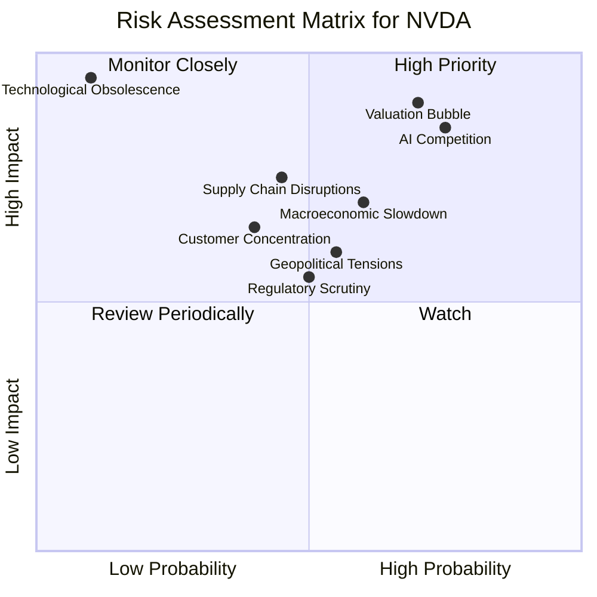

### 9.2 風險清單詳細分析

| # | 風險項目 | 發生機率 | 財務衝擊 | 風險評分 | 緩解措施 |
|---|----------|----------|----------|----------|----------|
| 1 | 🔴 **AI晶片市場競爭加劇** | 高 (75%) | 高 (-15%收入) | 🔴 8.5/10 | 持續巨額研發投入保持技術領先；強化CUDA生態系統的鎖定效應；拓展軟體和服務收入。 |
| 2 | 🔴 **估值過高與市場情緒波動** | 高 (70%) | 極高 (-25%股價) | 🔴 9.0/10 | 保持高透明度與市場溝通，持續兌現業績增長；多元化業務降低單一市場依賴。 |
| 3 | 🟡 **宏觀經濟下行** | 中 (60%) | 中 (-10%收入) | 🟡 7.0/10 | 拓展新興市場和行業；優化成本結構，提高營運效率以應對需求波動。 |
| 4 | 🟡 **地緣政治緊張與貿易政策** | 中 (55%) | 中 (-10%收入) | 🟡 6.0/10 | 多元化供應鏈和製造基地；加強政府關係，遵守國際貿易法規。 |
| 5 | 🟡 **供應鏈中斷風險** | 中 (45%) | 中 (-15%收入) | 🟡 7.5/10 | 與主要代工廠（如台積電）建立長期戰略合作；建立多元供應商體系和庫存緩衝。 |
| 6 | 🟡 **客戶集中度風險** | 中 (40%) | 中 (-10%收入) | 🟡 6.5/10 | 拓展中小企業和新興市場客戶；深化與不同雲服務提供商的合作。 |
| 7 | 🟡 **監管審查與反壟斷** | 中 (50%) | 中 (-5%收入) | 🟡 5.5/10 | 積極配合監管機構審查；確保合規經營；清晰闡釋技術創新和市場貢獻。 |
| 8 | 🟢 **技術過時風險** | 低 (10%) | 極高 (-50%收入) | 🟢 9.5/10 | 這是所有科技公司的根本風險，但NVIDIA通過持續創新、巨額研發和強大的軟體生態系統，有效降低了此風險。 |

---

## 10. 投資建議

綜合以上深度分析，NVIDIA在AI時代的領導地位、卓越的財務表現、強大的競爭護城河和廣闊的成長潛力，使其成為一項極具吸引力的投資。儘管存在估值和競爭風險，但其核心優勢和長期願景足以抵消這些不確定性。

### 10.1 最終綜合評級雷達圖

```
╔══════════════════════════════════════════════════════════════════╗
║                   NVDA 最終綜合評級雷達圖                        ║
╠══════════════════════════════════════════════════════════════════╣
║                                                                  ║
║  基本面強度  9.5 ▓▓▓▓▓▓▓▓▓▓▓▓▓▓▓▓▓▓▓░  ★★★★★           ║
║  成長動能    9.8 ▓▓▓▓▓▓▓▓▓▓▓▓▓▓▓▓▓▓▓▓  ★★★★★           ║
║  獲利品質    9.5 ▓▓▓▓▓▓▓▓▓▓▓▓▓▓▓▓▓▓▓░  ★★★★★           ║
║  財務健康    9.0 ▓▓▓▓▓▓▓▓▓▓▓▓▓▓▓▓▓▓░░  ★★★★★           ║
║  估值合理性  7.5 ▓▓▓▓▓▓▓▓▓▓▓▓▓▓▓░░░░░  ★★★★☆           ║
║  護城河深度  9.5 ▓▓▓▓▓▓▓▓▓▓▓▓▓▓▓▓▓▓▓░  ★★★★★           ║
║  管理層執行  9.0 ▓▓▓▓▓▓▓▓▓▓▓▓▓▓▓▓▓▓░░  ★★★★★           ║
║  技術創新力  9.8 ▓▓▓▓▓▓▓▓▓▓▓▓▓▓▓▓▓▓▓▓  ★★★★★           ║
╠══════════════════════════════════════════════════════════════════╣
║  綜合總分    8.9/10                                             ║
║  投資評級：🟢 強烈買入                                           ║
╚══════════════════════════════════════════════════════════════════╝
```

### 10.2 目標價與隱含報酬率

綜合DCF模型、同業比較和分析師共識，我們對NVIDIA給出以下目標價和隱含報酬率。

| 情境 | 目標價 (USD) | 隱含報酬率 (vs $197.58) | 機率權重 | 加權平均目標價 |
|------|--------------|-------------------------|----------|------------------|
| 悲觀情境 | $250 | +26.5% | 20% |                  |
| 基準情境 | $300 | +51.8% | 60% | $290.00          |
| 樂觀情境 | $350 | +77.1% | 20% |                  |

**加權平均目標價：$290.00**，相較當前股價$197.58有約46.7%的潛在漲幅。

### 10.3 買入時機與觸發因素

```
╔══════════════════════════════════════════════════════════════════╗
║                  ✅ NVDA 買入觸發因素 Checklist                   ║
╠══════════════════════════════════════════════════════════════════╣
║                                                                  ║
║  立即買入觸發條件（多數符合）：                                  ║
║  ✅ 公司持續超預期發布業績，特別是資料中心業務加速增長。           ║
║  ✅ Blackwell等新產品線順利放量，市場反應積極。                   ║
║  ✅ 宏觀經濟數據顯示軟著陸或復甦，有利於科技股情緒。               ║
║  ✅ 股價因短期市場波動（如大盤調整）出現10-15%的回調。           ║
║                                                                  ║
║  加碼觸發條件（出現以下任一）：                                  ║
║  ☐ AI市場TAM預期再次上調，或NVIDIA在AI軟體/服務領域取得重大突破。║
║  ☐ 公司宣布新的大規模股票回購計畫。                             ║
║  ☐ 自動駕駛業務取得重大商業化進展。                             ║
║  ☐ 競爭對手在AI晶片領域的進展不及預期。                         ║
║                                                                  ║
║  減碼/停損觸發條件（出現以下任一）：                             ║
║  ☐ 營收或盈利連續兩個季度不及預期，且管理層對前景展望悲觀。       ║
║  ☐ 核心資料中心業務成長顯著放緩，或市場份額被嚴重侵蝕。           ║
║  ☐ 關鍵技術（如CUDA）出現顛覆性替代方案。                       ║
║  ☐ 股價跌破重要支撐位（如52週低點$151.29），且無明確利好支撐。   ║
╚══════════════════════════════════════════════════════════════════╝
```

### 10.4 投資人適配度分析

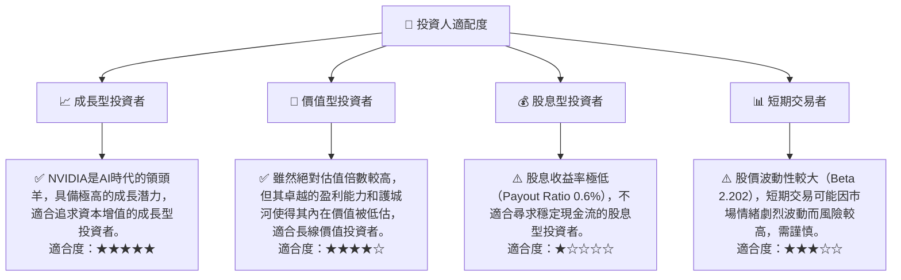

### 10.5 關鍵監控指標

| 監控類型 | 指標 | 關注點 | 頻率 |
|----------|------|--------|------|
| **營收成長** | 資料中心營收 YoY 成長率 | 核心成長引擎的健康狀況，尤其關注AI GPU出貨量與ASP。 | 每季 |
| **獲利能力** | 毛利率、淨利率趨勢 | 反映產品組合、定價能力和成本控制效率。 | 每季 |
| **市場份額** | AI晶片/獨立GPU市場份額 | 評估競爭格局變化與公司領導地位。 | 半年/年度 |
| **研發投入與技術進展** | R&D 費用佔營收比重、新產品發布 | 確保技術領先和創新能力。 | 每季/新產品發布時 |
| **自由現金流 (FCF)** | FCF 絕對值與 FCF Yield | 衡量公司內在盈利能力和財務彈性。 | 每季 |
| **客戶集中度** | 前五大客戶營收佔比 | 評估潛在的客戶流失風險。 | 年度 |
| **供應鏈穩定性** | 晶片供應商產能利用率、交期 | 確保產品供應順暢，避免中斷。 | 每季 |
| **競爭動態** | 競爭對手（AMD, Intel）AI晶片進展、雲服務商自研晶片 | 評估競爭壓力與市場份額變化。 | 持續監控 |

---

> **免責聲明**：本報告為 AI 自動生成，僅供研究參考，不構成投資建議。投資有風險，入市需謹慎。