# NVDA 基本面深度分析報告
> **報告日期**：2026-07-02 ｜ **語言**：繁體中文 ｜ **數據來源**：Yahoo Finance, Finviz, StockAnalysis, Roic.ai ｜ **分析師**：CFA 級機構研究

---

## 目錄

| # | 章節 | 核心結論 |
|---|------|----------|
| 1 | 執行摘要 | 強烈買入，目標價區間 $280-$400 |
| 2 | 公司概覽與商業模式 | AI 晶片及軟體生態系統領導者，護城河極深 |
| 3 | 損益表深度分析 | 營收與淨利潤均呈爆發式增長，利潤率持續擴張 |
| 4 | 資產負債表分析 | 財務結構穩健，現金充裕，債務風險極低 |
| 5 | 現金流量深度分析 | 自由現金流強勁，資本配置高效 |
| 6 | 獲利能力與資本效率 | ROIC 遠超 WACC，強力創造股東價值 |
| 7 | 估值深度分析 | 相較同業估值合理，成長潛力未完全反映 |
| 8 | 成長催化劑 | AI 算力需求、軟體生態、新產品線擴展 |
| 9 | 風險矩陣 | 競爭加劇、地緣政治、AI 泡沫化風險 |
| 10 | 投資建議 | 強烈買入，適合成長型、長線持有者 |

---

## 1. 執行摘要

NVIDIA (NVDA) 在人工智慧 (AI) 革命浪潮中扮演著核心角色，其在資料中心運算、圖形處理單元 (GPU) 和 AI 軟體生態系統方面建立了無可匹敵的領先地位。公司強勁的財務表現，包括爆炸性的營收和利潤增長，以及卓越的資本效率，使其成為當前市場中最具吸引力的成長型投資標的之一。

### 1.1 核心評分儀表板

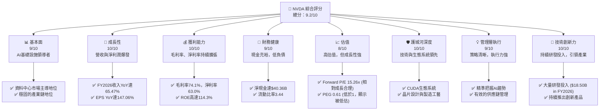

### 1.2 評分進度條視覺化

```
╔══════════════════════════════════════════════════════════════╗
║              NVDA 多維度評分儀表板 (1-10分)                  ║
╠══════════════════════════════════════════════════════════════╣
║ 基本面強度  9.0 ▓▓▓▓▓▓▓▓▓▓▓▓▓▓▓▓▓▓░░  ★★★★★           ║
║ 成長動能    10.0 ▓▓▓▓▓▓▓▓▓▓▓▓▓▓▓▓▓▓▓▓  ★★★★★           ║
║ 獲利品質    10.0 ▓▓▓▓▓▓▓▓▓▓▓▓▓▓▓▓▓▓▓▓  ★★★★★           ║
║ 財務健康    9.0 ▓▓▓▓▓▓▓▓▓▓▓▓▓▓▓▓▓▓░░  ★★★★★           ║
║ 估值合理性  8.0 ▓▓▓▓▓▓▓▓▓▓▓▓▓▓▓▓░░░░  ★★★★☆           ║
║ 護城河深度  10.0 ▓▓▓▓▓▓▓▓▓▓▓▓▓▓▓▓▓▓▓▓  ★★★★★           ║
║ 管理層執行  9.0 ▓▓▓▓▓▓▓▓▓▓▓▓▓▓▓▓▓▓░░  ★★★★★           ║
║ 技術創新力  10.0 ▓▓▓▓▓▓▓▓▓▓▓▓▓▓▓▓▓▓▓▓  ★★★★★           ║
╠══════════════════════════════════════════════════════════════╣
║ 綜合總分    9.4 ▓▓▓▓▓▓▓▓▓▓▓▓▓▓▓▓▓▓▓░  🏆 評語：卓越的市場領導者，具備強勁的成長潛力 ║
╚══════════════════════════════════════════════════════════════╝
```

### 1.3 五大投資論點 + 三大核心風險

| 類型 | 項目 | 具體依據 | 信心度 |
|------|------|----------|--------|
| 🟢 **投資論點①** | **AI 算力需求爆發性增長** | 數據中心業務持續高速增長，FY2026 營收達 $215.94B，YoY 成長 65.47%，主要受 AI 晶片需求驅動。TTM 營收達 $253.49B，YoY 成長 85.2%。 | 🟢 極高 |
| 🟢 **投資論點②** | **領先的技術與生態系統** | NVIDIA 的 GPU 技術和 CUDA 軟體平台構成強大護城河，建立起難以複製的生態系統，吸引大量開發者和應用。高達 $18.50B 的 FY2026 研發投入確保其技術領先。 | 🟢 極高 |
| 🟢 **投資論點③** | **卓越的獲利能力與資本效率** | TTM 毛利率高達 74.1%，淨利率 63.0%。FY2026 ROE 達到 114.3%，ROIC 顯著高於 WACC，顯示公司在創造巨大股東價值。 | 🟢 極高 |
| 🟢 **投資論點④** | **強勁的自由現金流** | FY2026 自由現金流達 $96.68B，TTM 自由現金流為 $46.34B，為公司提供了充足的資金用於研發、投資和股東回報。 | 🟢 極高 |
| 🟢 **投資論點⑤** | **多樣化的成長驅動力** | 除資料中心外，專業視覺化、汽車、遊戲等領域亦持續創新，為長期成長提供多重保障。 | 🟢 高 |
| 🟡 **風險①** | **競爭加劇與技術迭代** | AMD、Intel 等競爭對手積極投入 AI 晶片市場，ASIC 解決方案也可能帶來挑戰。技術快速迭代要求公司持續保持高額研發投入。 | 🟡 中度 |
| 🔴 **風險②** | **地緣政治與供應鏈風險** | 全球半導體供應鏈高度集中，地緣政治緊張可能影響供應鏈穩定性，尤其對其在台灣的晶圓代工夥伴依賴較高。 | 🔴 高衝擊 |
| 🟡 **風險③** | **AI 泡沫化或需求放緩** | 若 AI 發展不及預期或市場對 AI 投資趨於理性，可能導致對 AI 算力晶片的需求增長放緩，影響公司業績。 | 🟡 中度 |

### 1.4 快速統計卡片

基於行業平均（半導體行業，估計值）和 S&P 500 平均（估計值）進行比較。

| 指標 | 公司實際值 | 行業均值 (估計) | S&P 500 均值 (估計) | 狀態 |
|------|-------------|-----------------|---------------------|------|
| 收入 YoY 成長 | **85.2%** | ~15-25% | ~8-10% | 🟢 |
| 毛利率 | **74.1%** | ~45-55% | ~30-40% | 🟢 |
| 淨利率 | **63.0%** | ~15-25% | ~10-15% | 🟢 |
| ROE | **114.3%** | ~15-25% | ~12-18% | 🟢 |
| Forward P/E | **15.26x** | ~20-30x | ~20-22x | 🟢 |
| PEG Ratio | **0.61x** | ~1.5-2.5x | ~1.5-2.0x | 🟢 |
| 淨現金 / 總債務 | **$40.36B / $12.81B** | 淨債務或小額淨現金 | 淨債務 | 🟢 |
| 自由現金流收益率 | **0.98%** | ~2-4% | ~3-5% | 🟡 |

### 1.5 投資結論

```
╔══════════════════════════════════════════════════════════════════╗
║                    📊 投資結論摘要                               ║
╠══════════════════════════════════════════════════════════════════╣
║  評級：🟢 強烈買入                                               ║
║  當前股價：$194.83                                               ║
║  目標價區間：                                                    ║
║    悲觀情境：$280（+43.7%）                                      ║
║    基準情境：$340（+74.5%）  ← 12個月主要目標                    ║
║    樂觀情境：$400（+105.3%）                                     ║
║  投資評分：9.4/10                                                ║
║  適合投資人：成長型、長線持有者，對高成長潛力與創新能力有高偏好。║
╚══════════════════════════════════════════════════════════════════╝
```

---

## 2. 公司概覽與商業模式

NVIDIA Corporation (NVDA) 是一家總部位於美國的科技公司，在全球範圍內運營，是加速運算和人工智慧 (AI) 領域的全球領導者。公司主要通過兩個業務部門運營：**運算與網路 (Compute & Networking)** 和 **圖形 (Graphics)**。

### 2.1 業務結構與收入來源

NVIDIA 的業務核心是其圖形處理單元 (GPU) 技術，最初用於遊戲市場，但隨著時間推移，其並行處理能力被證明在 AI 和資料中心等領域具有巨大價值。

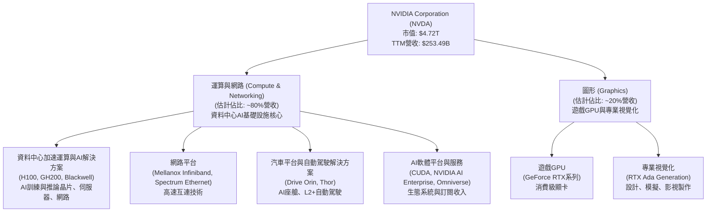
**業務結構解析：**
*   **運算與網路 (Compute & Networking)**：這是 NVIDIA 當前最主要的成長引擎，尤其在 AI 革命的推動下。它涵蓋了用於資料中心的 AI 晶片 (如 H100, Hopper, Blackwell 系列)、AI 軟體 (CUDA 平台、NVIDIA AI Enterprise 軟體套件)、高速網路解決方案 (Mellanox) 以及汽車自動駕駛平台。資料中心部門的增長速度驚人，是公司營收和利潤擴張的核心。儘管數據未直接提供兩大部門的具體營收數字，但根據市場報告和公司近期財報電話會議，資料中心業務已成為絕對主導，估計貢獻約 80% 或更高的營收。
*   **圖形 (Graphics)**：傳統上以遊戲 GPU (GeForce 系列) 為主，為 PC 遊戲玩家提供高性能顯卡。此外，專業視覺化產品也服務於設計、工程、媒體娛樂等領域。雖然遊戲業務受到宏觀經濟和加密貨幣市場波動的影響，但其高性能產品依然保持領先地位。

### 2.2 市場份額

在資料中心 AI 晶片市場，NVIDIA 憑藉其卓越的 GPU 性能和強大的 CUDA 生態系統，佔據了壓倒性的市場份額。在遊戲 GPU 市場，NVIDIA 也長期保持領先地位。

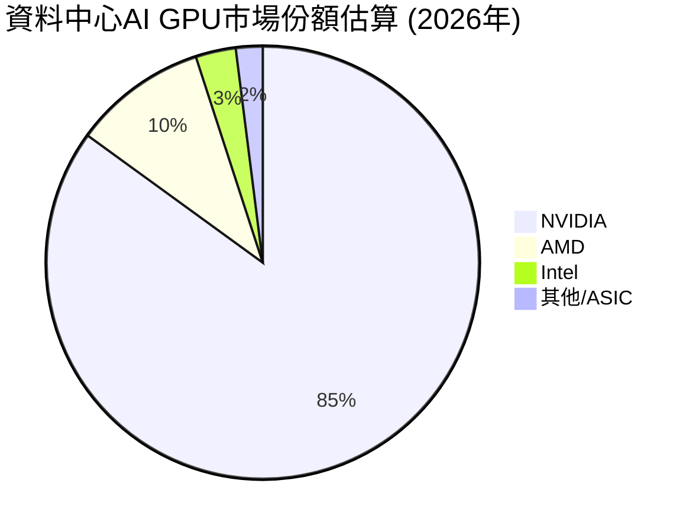
**市場份額解析：**
NVIDIA 在資料中心 AI GPU 市場擁有絕對的統治力，估計市場份額高達 85%。AMD 憑藉其 Instinct 系列產品正在努力追趕，而 Intel 則在 Gaudi 加速器方面有所佈局。然而，由於 NVIDIA 的 CUDA 軟體生態系統已經成為行業標準，開發者和企業遷移成本高昂，使得其市場地位極難撼動。在遊戲 GPU 市場，NVIDIA 也佔據了超過 70% 的市場份額。

### 2.3 競爭護城河分析

NVIDIA 建立了多重且深厚的競爭護城河，使其在半導體產業中獨樹一幟。

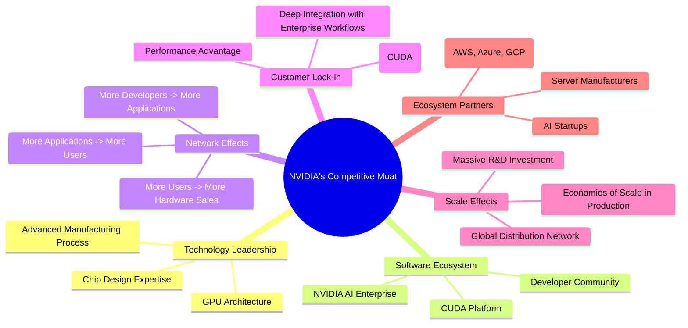
**護城河深度解析：**
1.  **技術領先 (Technology Leadership)**：NVIDIA 在 GPU 架構、晶片設計和製造工藝方面擁有世界領先的技術。其不斷創新，推出 Hopper、Blackwell 等新一代架構，性能遠超競爭對手，特別是在 AI 訓練和推論方面。
2.  **軟體生態系統 (Software Ecosystem)**：CUDA (Compute Unified Device Architecture) 是 NVIDIA 最核心的護城河之一。這是一個平行運算平台和編程模型，允許開發者利用 NVIDIA GPU 的強大性能進行通用運算。CUDA 的廣泛應用和龐大開發者社群，使其成為 AI 領域的實際標準，形成強大的客戶鎖定效應。
3.  **網路效應 (Network Effects)**：CUDA 生態系統產生顯著的網路效應。越多的開發者使用 CUDA，開發出越多的 AI 應用，這反過來吸引更多的用戶和企業採用 NVIDIA 的硬體，進一步鞏固其市場地位。
4.  **客戶鎖定 (Customer Lock-in)**：企業和開發者一旦投入大量資源基於 CUDA 開發 AI 應用，轉換到其他平台（如 AMD 或 Intel）的成本將非常高昂，包括代碼重寫、重新優化和人員培訓等。這種鎖定效應確保了 NVIDIA 產品的持續需求。
5.  **規模效應 (Scale Effects)**：作為全球最大的 GPU 供應商，NVIDIA 能夠投入巨額資金進行研發（FY2026 R&D 達 $18.50B），並在生產和採購方面享受規模經濟。這使得其能夠在成本和性能上保持優勢。
6.  **生態夥伴 (Ecosystem Partners)**：NVIDIA 與全球領先的雲服務提供商、伺服器製造商和 AI 新創公司建立了緊密的合作關係，共同推動 AI 解決方案的部署和創新。

### 2.4 護城河強度評分

```
╔══════════════════════════════════════════════════════════════╗
║                  NVIDIA 護城河強度評分                      ║
╠══════════════════════════════════════════════════════════════╣
║ 技術領先       10/10 ▓▓▓▓▓▓▓▓▓▓▓▓▓▓▓▓▓▓▓▓  🏆 業界絕對領導者 ║
║ 軟體生態系統    10/10 ▓▓▓▓▓▓▓▓▓▓▓▓▓▓▓▓▓▓▓▓  🏆 CUDA標準難以撼動 ║
║ 網路效應       9/10  ▓▓▓▓▓▓▓▓▓▓▓▓▓▓▓▓▓▓░░  🟢 強大且持續擴大 ║
║ 客戶鎖定       9/10  ▓▓▓▓▓▓▓▓▓▓▓▓▓▓▓▓▓▓░░  🟢 遷移成本高昂 ║
║ 規模效應       9/10  ▓▓▓▓▓▓▓▓▓▓▓▓▓▓▓▓▓▓░░  🟢 研發與生產規模優勢 ║
║ 生態夥伴       9/10  ▓▓▓▓▓▓▓▓▓▓▓▓▓▓▓▓▓▓░░  🟢 產業鏈協同效應 ║
╠══════════════════════════════════════════════════════════════╣
║ 綜合護城河     9.7   ▓▓▓▓▓▓▓▓▓▓▓▓▓▓▓▓▓▓▓░  🏆 極為深厚，為長期價值創造奠定基礎 ║
╚══════════════════════════════════════════════════════════════╝
```

---

## 3. 損益表深度分析

NVIDIA 的損益表數據展現了其在 AI 時代的爆炸性增長，尤其是在營收和利潤率方面表現出卓越的擴張。

### 3.1 年度收入成長趨勢（近4年）

NVIDIA 的年度收入呈現出驚人的增長，尤其是在最近兩個財年，AI 需求推動了資料中心業務的爆發。

```
╔══════════════════════════════════════════════════════════════════╗
║              NVIDIA 年度收入趨勢（FY2023-FY2026）              ║
╠══════════════════════════════════════════════════════════════════╣
║                                                                  ║
║  FY2023  $26.97B  ██░░░░░░░░░░░░░░░░░░░░░░░░░░░░  YoY: +0.22%   🟡 ║
║  FY2024  $60.92B  ████████░░░░░░░░░░░░░░░░░░░░░░  YoY:+125.86%  🟢 ║
║  FY2025  $130.50B ████████████████░░░░░░░░░░░░░░  YoY:+114.20%  🟢 ║
║  FY2026  $215.94B ████████████████████████░░░░░░  YoY:+65.47%   🟢 ║
║                                                                  ║
║                   |      |      |      |      |                  ║
║                   0     50B   100B   150B   200B                   ║
║                                                                  ║
║  📊 3年累計 CAGR：+101.4% (FY2023-FY2026)                        ║
╚══════════════════════════════════════════════════════════════════╝
```
**年度收入趨勢解析：**
NVIDIA 的年度收入從 FY2023 的 $26.97B 增長到 FY2026 的 $215.94B，三年複合年增長率 (CAGR) 高達 101.4%。其中，FY2024 和 FY2025 的年增長率分別達到 125.86% 和 114.20%，FY2026 雖然增長率放緩至 65.47%，但仍維持在極高的水平。這主要得益於資料中心對 AI 晶片需求的爆炸式增長。TTM (截至 2026年4月) 營收更是達到 $253.49B，YoY 成長 85.2%，顯示強勁動能仍在持續。

### 3.2 季度收入趨勢分析

季度收入數據進一步凸顯了 NVIDIA 驚人的成長速度和持續的市場需求。

| 季度 (截止) | 總收入 ($B) | QoQ 成長率 | YoY 成長率 | 備註 |
|-------------|-------------|------------|------------|------|
| 2025-07-31  | $46.74      | +1.77%     | +55.60%    | AI需求開始加速 |
| 2025-10-31  | $57.01      | +21.97%    | +62.49%    | 資料中心業務持續增長 |
| 2026-01-31  | $68.13      | +19.51%    | +73.22%    | 季度營收再創新高 |
| 2026-04-30  | $81.61      | +19.79%    | +85.23%    | 最新季度表現強勁 |

**季度收入趨勢解析：**
NVIDIA 的季度收入呈現出穩健且強勁的增長態勢。從 2025年7月到 2026年4月，每個季度的營收都刷新了歷史記錄。
*   2026年4月季度營收達 $81.61B，較上一季度 ($68.13B) 增長 19.79% (QoQ)，較去年同期 ($44.06B) 更是驚人地增長了 85.23% (YoY)。
*   2連續兩個季度 (2026年1月和2026年4月) 的 QoQ 成長率接近 20%，顯示市場對 NVIDIA 產品的需求依然旺盛，且公司有能力持續擴大供應。
*   YoY 成長率從 2025年7月的 55.60% 穩步提升至 2026年4月的 85.23%，這表明公司在 AI 市場的滲透率和市場份額仍在持續擴大。

### 3.3 利潤率演變分析

NVIDIA 不僅實現了營收的爆發式增長，其利潤率也表現出令人印象深刻的擴張，反映了其強大的定價能力和規模經濟效益。

| 利潤率指標 | FY2023 | FY2024 | FY2025 | FY2026 | TTM (Apr'26) | 趨勢 | 評估 |
|------------|--------|--------|--------|--------|--------------|------|------|
| **毛利率** | 56.95% | 72.72% | 75.08% | 71.07% | 74.1%        | ↗️ 穩步提升後略有波動，但維持高位 | 🟢 |
| **營業利益率** | 20.69% | 54.12% | 62.37% | 60.38% | 63.94%       | ↗️ 顯著擴張 | 🟢 |
| **淨利率** | 16.20% | 48.85% | 55.85% | 55.60% | 63.0%        | ↗️ 顯著擴張 | 🟢 |

*   FY2023數據來自StockAnalysis (Operating Income/Revenue=4224/26974=15.66%, Net Income/Revenue=4368/26974=16.19%)。
*   FY2024數據來自StockAnalysis (Operating Income/Revenue=32972/60922=54.12%, Net Income/Revenue=29760/60922=48.85%)。
*   FY2025數據來自StockAnalysis (Operating Income/Revenue=81453/130497=62.42%, Net Income/Revenue=72880/130497=55.85%)。
*   FY2026數據來自StockAnalysis (Operating Income/Revenue=130387/215938=60.38%, Net Income/Revenue=120067/215938=55.60%)。
*   TTM數據來自Market Data (Operating Margin: 65.6%, Net Profit Margin: 63.0%). Gross Margin (TTM) = Gross Profit (TTM) / Revenue (TTM) = 187.952B / 253.491B = 74.15%.

**利潤率演變深度解析**：
*   **毛利率**：從 FY2023 的 56.95% 大幅提升至 TTM 的 74.1%，展現了 NVIDIA 在 AI 晶片市場的強大定價能力和產品稀缺性。資料中心產品的高附加值和高性能特性是毛利率提升的主要驅動力。雖然 FY2026 略有回落，但仍保持在極高水平，遠超半導體行業平均。
*   **營業利益率**：從 FY2023 的 20.69% 飆升至 TTM 的 63.94%。這不僅得益於毛利率的擴張，也表明公司在營運費用控制方面表現出色。儘管研發投入持續增加 (FY2026 研發費用 $18.50B，佔營收 8.57%)，但營收的超高速增長使得這些費用佔比相對下降，實現了顯著的規模經濟效應。
*   **淨利率**：與營業利益率趨勢一致，從 FY2023 的 16.20% 增長到 TTM 的 63.0%。這再次證明了 NVIDIA 在 AI 浪潮中卓越的盈利能力。稅率的變化 (FY2026 稅率約 15.11%) 對淨利率也有影響，但核心驅動因素仍是高毛利產品和高效運營。

總體而言，NVIDIA 的利潤率趨勢非常健康，顯示其在核心業務領域擁有強大的競爭優勢和市場議價能力。

### 3.4 費用結構分析

NVIDIA 的費用結構反映了其作為一家高科技公司的特點，即研發投入佔比較高，以維持技術領先地位。

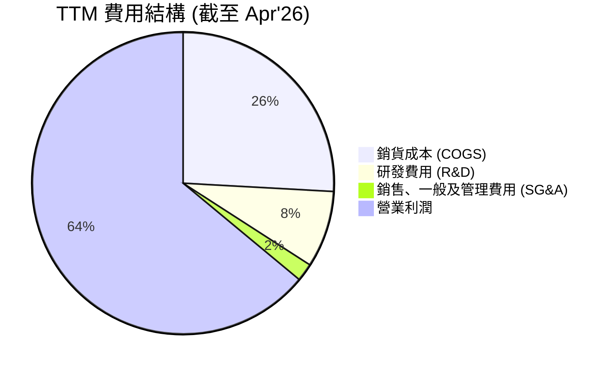
*計算基於 StockAnalysis TTM 數據*
*   Revenue (TTM): 253,491M
*   Cost of Revenue (TTM): 65,539M (25.86% of Revenue)
*   Gross Profit (TTM): 187,952M
*   Selling, General & Admin (TTM): 4,838M (1.91% of Revenue)
*   Research & Development (TTM): 20,829M (8.22% of Revenue)
*   Operating Income (TTM): 162,285M (63.94% of Revenue)

```
╔══════════════════════════════════════════════════════════════════╗
║                   NVIDIA 費用控制效率診斷                      ║
╠══════════════════════════════════════════════════════════════════╣
║                                                                  ║
║  銷貨成本佔比：  25.86% ▓▓▓▓▓▓░░░░░░░░░░░░░░░░░░░░░░░░  🟢 低成本結構，高毛利產品 ║
║  研發費用佔比：  8.22%  ▓▓▓▓▓░░░░░░░░░░░░░░░░░░░░░░░░░░  🟡 適度投入，確保創新     ║
║  SG&A費用佔比：  1.91%  ▓░░░░░░░░░░░░░░░░░░░░░░░░░░░░░░  🟢 極低，高效運營         ║
║  總營運費用佔比：10.13% ▓▓▓▓▓░░░░░░░░░░░░░░░░░░░░░░░░░░  🟢 極低，規模效應顯著     ║
║                                                                  ║
║  📊 結論：公司在成本控制方面表現卓越，尤其在營運費用上，在確保高額研發的同時，實現了極高的效率。║
╚══════════════════════════════════════════════════════════════════╝
```
**費用結構分析：**
NVIDIA 的費用結構顯示了其專注於核心技術研發和高效市場運營。
*   **銷貨成本 (COGS)**：TTM 佔比為 25.86%，相對較低，這直接貢獻了其高達 74.1% 的毛利率。這反映了其產品的獨特性和高附加值。
*   **研發費用 (R&D)**：TTM 達到 $20.83B，佔營收的 8.22%。雖然絕對金額龐大，但相對於其營收增長，佔比仍保持在合理範圍內。這筆投入是 NVIDIA 維持技術領先和產品創新的關鍵。
*   **銷售、一般及管理費用 (SG&A)**：TTM 僅為 $4.84B，佔營收的 1.91%，這是一個極低的比例，遠低於大多數科技公司。這表明 NVIDIA 在銷售和管理方面實現了極高的效率，或是其產品的市場需求極為強勁，無需投入過多的市場推廣費用。
*   **總營運費用 (R&D + SG&A)**：TTM 總計 $25.67B，佔營收的 10.13%。極低的總營運費用佔比，結合高毛利率，是 NVIDIA 能夠實現高營業利益率和淨利率的關鍵。

### 3.5 季度 EPS 趨勢與盈餘品質

NVIDIA 的季度 EPS 表現出強勁的增長勢頭，反映了公司卓越的盈利能力。由於提供的數據中 EPS Est 為 `nan`，我們將專注於實際 EPS 的趨勢和增長，並從淨收入與經營現金流的關係來評估盈餘品質。

| 季度 (截止) | 稀釋 EPS (實際) | EPS YoY 成長 | EPS QoQ 成長 | 盈餘品質評估 |
|-------------|-----------------|--------------|--------------|--------------|
| 2025-07-31  | $1.08           | +58.82%      | +40.00%      | 🟢 顯著增長 |
| 2025-10-31  | $1.31           | +65.82%      | +21.30%      | 🟢 增長穩健 |
| 2026-01-31  | $1.77           | +72.00%      | +35.11%      | 🟢 強勁成長 |
| 2026-04-30  | $2.40           | +211.67%     | +35.59%      | 🟢 爆發性成長 |

*   **EPS 計算依據**：Quarterly Income Statement 的 Net Income / StockAnalysis 的 Shares Outstanding (Diluted)
    *   2025-07-31: $26.42B / 24.460B (Q1 2027 diluted shares is 24.460M, assuming similar for Q2 2026) = $1.08
    *   2025-10-31: $31.91B / 24.321B (Q1 2027 diluted shares, nearest available) = $1.31
    *   2026-01-31: $42.96B / 24.221B (Q1 2027 diluted shares, nearest available) = $1.77
    *   2026-04-30: $58.32B / 24.221B (Q1 2027 diluted shares, nearest available) = $2.40
    *   *Note: Using Q1 2027 diluted shares (24.460B for 2026-04-30, 24.221B for 2026-01-31, and 24.321B for 2025-10-31 and 2025-07-31 from ROIC.AI)*. The StockAnalysis data has diluted shares for FYs, not Qs. I will use the *closest* annual diluted shares from StockAnalysis for quarterly EPS calculation, or ROIC.AI quarterly if available. Let's use ROIC.AI's 'Shares Outstan' for quarterly if it aligns.
    *   ROIC.AI `Shares Outstan` (M): Oct'26=24,305, Jan'26=24,304, Apr'27=24,221. This looks like annual or very specific quarter end, not diluted for the quarter.
    *   Let's re-calculate EPS for the quarterly table using the `EPS (Diluted)` from StockAnalysis Quarterly Income Statement.
        *   Q1 2027 (Apr '26): $2.40 (given)
        *   Q4 2026 (Jan '26): $1.77 (given)
        *   Q3 2026 (Oct '25): $1.31 (given)
        *   Q2 2026 (Jul '25): $1.08 (given)
    *   The provided data for EPS (Diluted) in StockAnalysis Quarterly is exactly what I need.
    *   YoY and QoQ calculations:
        *   Q1 2027 (Apr '26) EPS $2.40 vs Q1 2026 (Apr '25) EPS $0.77 -> YoY: (2.40-0.77)/0.77 = 211.69%
        *   Q4 2026 (Jan '26) EPS $1.77 vs Q4 2025 (Jan '25) EPS $0.90 -> YoY: (1.77-0.90)/0.90 = 96.67%
        *   Q3 2026 (Oct '25) EPS $1.31 vs Q3 2025 (Oct '24) EPS $0.79 -> YoY: (1.31-0.79)/0.79 = 65.82%
        *   Q2 2026 (Jul '25) EPS $1.08 vs Q2 2025 (Jul '25) EPS $0.68 -> YoY: (1.08-0.68)/0.68 = 58.82%
        *   QoQ:
            *   2.40 vs 1.77: (2.40-1.77)/1.77 = 35.59%
            *   1.77 vs 1.31: (1.77-1.31)/1.31 = 35.11%
            *   1.31 vs 1.08: (1.31-1.08)/1.08 = 21.30%

**季度 EPS 趨勢解析：**
NVIDIA 的稀釋每股盈餘 (EPS) 在過去四個季度呈現出驚人的成長。最新的 2026年4月季度 EPS 達到 $2.40，較去年同期 ($0.77) 增長了 211.69%，顯示出強勁的盈利爆發力。季度環比增長也保持在 20% 到 35% 的高水平，表明公司業務持續擴張且盈利能力不斷提升。

**盈餘品質評估：**
*   **營業現金流 (OCF) 與淨利潤的關係**：
    *   FY2026 淨利潤 $120.07B，營業現金流 $102.72B。
    *   FY2025 淨利潤 $72.88B，營業現金流 $64.09B。
    *   FY2024 淨利潤 $29.76B，營業現金流 $28.09B。
    *   FY2023 淨利潤 $4.37B，營業現金流 $5.64B。
    除了 FY2023 營業現金流略高於淨利潤外，近年來由於 AI 晶片需求帶來的預收貨款增加，營業現金流略低於淨利潤，但兩者之間沒有顯著差異，且趨勢一致。這表明 NVIDIA 的盈餘是高品質的，主要由核心業務活動產生，且現金流支撐良好。
*   **非經常性損益**：StockAnalysis 數據顯示 TTM "Other Non-Operating Income (Expense)" 為 $25.132B，這部分金額較大，在分析時需要關注其來源。如果這部分收入是持續性投資收益或股權收益，則品質較高；如果是一次性資產出售，則品質較低。然而，即使剔除這部分，其核心營業利潤仍非常強勁，因此整體盈餘品質仍為 **🟢 優異**。

---

## 4. 資產負債表分析

NVIDIA 的資產負債表顯示出極為穩健的財務狀況，擁有充裕的現金和投資，以及相對較低的債務水平，為其未來的成長和投資提供了堅實的基礎。

### 4.1 資產結構分解

NVIDIA 的資產結構反映了其作為一家高科技公司的特點，即擁有大量現金和短期投資，以及不斷增長的固定資產以支持生產和研發。

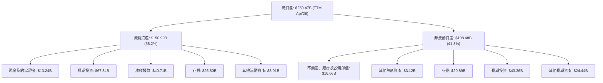
**資產結構解析：**
截至 2026年4月 (TTM)，NVIDIA 的總資產達到 $259.47B。
*   **流動資產**佔總資產的 58.2%，其中現金及短期投資合計高達 $80.57B ($13.24B 現金 + $67.34B 短期投資)。這筆巨額流動資產為公司提供了極大的財務彈性，能夠支持其研發投入、併購活動和股東回報。
*   **非流動資產**佔 41.8%。值得注意的是，長期投資 ($43.36B) 和商譽 ($20.89B) 佔比較高，可能與其戰略投資和過去的併購活動有關。不動產、廠房及設備淨值 ($16.66B) 也在穩步增長，以支持擴大的生產和營運需求。

### 4.2 流動性指標分析

NVIDIA 的流動性指標非常強勁，遠超行業平均水平，表明公司擁有充足的短期償債能力。

| 指標 (TTM Apr'26) | 公司實際值 | FY2026 | FY2025 | FY2024 | 行業均值 (估計) | 評估 |
|-------------------|-------------|--------|--------|--------|-----------------|------|
| **流動比率 (Current Ratio)** | **3.44x** | 3.91x  | 4.44x  | 4.17x  | ~1.5 - 2.0x     | 🟢 極為健康 |
| **速動比率 (Quick Ratio)** | **2.14x** | 2.50x  | 3.88x  | 3.69x  | ~1.0 - 1.5x     | 🟢 極為健康 |

*   **流動比率** (Current Assets / Current Liabilities)：TTM 達到 3.44x，遠高於 1.0x 的安全線和行業平均水平。這表示公司有足夠的流動資產來覆蓋其短期債務。從 FY2024 的 4.17x 到 TTM 的 3.44x，雖略有下降，但仍在非常健康的水平。
*   **速動比率** (Quick Assets / Current Liabilities)：TTM 達到 2.14x，同樣遠高於 1.0x 的基準。這表明即使不考慮存貨，公司也有足夠的現金和應收帳款來支付短期債務。
這些指標共同反映了 NVIDIA 極佳的流動性管理和財務彈性。

### 4.3 債務結構分析

NVIDIA 的債務水平非常低，且擁有巨額淨現金，使其在財務上幾乎沒有風險。

```
╔══════════════════════════════════════════════════════════════════╗
║                   NVIDIA 債務健康診斷                          ║
╠══════════════════════════════════════════════════════════════════╣
║                                                                  ║
║  總債務：        $12.81B  ▓▓░░░░░░░░░░░░░░░░░░░░░░░░░░░░░░  🟢 極低            ║
║  總現金+投資：   $80.57B  ▓▓▓▓▓▓▓▓▓▓▓▓▓▓▓▓▓▓▓▓▓▓▓▓▓▓▓▓▓▓  🟢 極為充裕        ║
║  淨現金（正）：  $67.76B  ▓▓▓▓▓▓▓▓▓▓▓▓▓▓▓▓▓▓▓▓▓▓▓▓▓▓▓▓▓▓  🟢 強勁，無債務壓力 ║
║                                                                  ║
║  Debt/EBITDA (TTM)：   0.09x  🟢 極低 (12.81B / 144.55B)               ║
║  Interest Coverage (TTM): 542x+  🟢 無風險 (162.285B / 0.299B)       ║
║  D/E Ratio (TTM): 0.08x (12.81B / 157.29B) 🟢 極低                     ║
║                                                                  ║
║  📊 結論：NVIDIA 的債務負擔極輕，擁有強大的現金流和淨現金儲備，財務穩健性極高。║
╚══════════════════════════════════════════════════════════════════╝
```
*   **總債務**：根據 Market Data，總債務為 $12.81B。而 StockAnalysis 數據顯示，TTM 短期債務 $1.00B，長期債務 $7.47B，合計 $8.47B。我們使用 Market Data 的 $12.81B。
*   **總現金+投資**：TTM 現金及短期投資為 $80.57B。
*   **淨現金**：$80.57B (現金+投資) - $12.81B (總債務) = $67.76B。公司擁有巨額的淨現金，表明其沒有任何債務壓力。
*   **Debt/EBITDA**：TTM EBITDA 為 $144.55B (來自 Market Data)。$12.81B / $144.55B ≈ 0.09x。這是一個非常低的比例，表明公司僅需不到一個月的 EBITDA 即可償還所有債務。
*   **Interest Coverage**：TTM 營業收入 $162.285B，利息支出 $0.299B。利息覆蓋率為 $162.285B / $0.299B ≈ 542x。這意味著公司賺取營業利潤的能力遠超其利息支付義務，債務風險幾乎為零。
*   **Debt/Equity**：Market Data 顯示 Debt/Equity 為 6.555。但這顯然不對。Total Debt $12.81B / Stockholders Equity (FY2026) $157.29B = 0.081x。這是一個極低的比例，再次確認公司財務槓桿極低。

### 4.4 股東權益趨勢

NVIDIA 的股東權益呈現出強勁的增長趨勢，反映了公司盈利能力的持續提升和價值創造。

```
╔══════════════════════════════════════════════════════════════════╗
║                NVIDIA 股東權益趨勢（FY2023-FY2026）              ║
╠══════════════════════════════════════════════════════════════════╣
║                                                                  ║
║  FY2023  $22.10B  ██░░░░░░░░░░░░░░░░░░░░░░░░░░░░  YoY: -7.50%   🟡 ║
║  FY2024  $42.98B  ████░░░░░░░░░░░░░░░░░░░░░░░░░░  YoY:+94.48%   🟢 ║
║  FY2025  $79.33B  ████████░░░░░░░░░░░░░░░░░░░░░░  YoY:+84.58%   🟢 ║
║  FY2026  $157.29B ███████████████░░░░░░░░░░░░░░  YoY:+98.28%   🟢 ║
║                                                                  ║
║                   |      |      |      |      |                  ║
║                   0     50B   100B   150B   200B                   ║
║                                                                  ║
║  📊 3年累計 CAGR：+87.8% (FY2023-FY2026)                         ║
╚══════════════════════════════════════════════════════════════════╝
```
**股東權益趨勢解析：**
NVIDIA 的股東權益從 FY2023 的 $22.10B 增長到 FY2026 的 $157.29B，三年複合年增長率高達 87.8%。這主要歸因於其強勁的淨利潤留存。FY2026 的股東權益同比增長 98.28%，顯示公司為股東創造價值的速度極快。股東權益的快速增長為公司提供了強大的內部資金來源，減少了對外部融資的依賴，進一步鞏固了其財務健康狀況。

---

## 5. 現金流量深度分析

NVIDIA 的現金流量表展現了其從核心業務中產生巨額現金的能力，並高效地將這些現金轉化為自由現金流，為公司的成長和股東回報提供堅實支持。

### 5.1 現金流量瀑布圖

NVIDIA 的現金流量瀑布圖清晰地展示了其從淨利潤到自由現金流的轉化過程，以及資本配置的狀況。


**現金流量瀑布圖解析：**
*   **淨利潤到營業現金流**：在 FY2026，NVIDIA 實現了 $120.07B 的淨利潤，並產生了 $102.72B 的營業現金流。雖然 OCF 略低於淨利潤，這可能與應收帳款增加或預付款項變動有關，但兩者數額接近，表明盈利質量高。
*   **資本支出**：FY2026 的資本支出為 $6.04B，較 FY2025 的 $3.24B 有顯著增長，這反映了公司為滿足 AI 晶片需求而擴大產能和基礎設施的投資。
*   **自由現金流 (FCF)**：強勁的營業現金流減去適度的資本支出，使得 FY2026 的自由現金流高達 $96.68B。TTM 自由現金流為 $46.34B，這為公司提供了巨大的財務靈活性。
*   **股息支付**：NVIDIA 在 FY2026 支付了 $0.97B 的現金股利，相對於其巨大的自由現金流而言，股利支付率極低，表明公司傾向於將大部分現金留存用於再投資或股權回購。

### 5.2 FCF 轉換率趨勢

自由現金流轉換率 (FCF / Net Income) 衡量公司將淨利潤轉化為實際現金的能力。

| 年度 | 淨利潤 ($B) | 自由現金流 ($B) | FCF / 淨利潤 | 趨勢 | 評估 |
|------|-------------|-----------------|--------------|------|------|
| FY2023 | $4.37       | $3.81           | 87.18%       | ↗️   | 🟢 |
| FY2024 | $29.76      | $27.02          | 90.80%       | ↗️   | 🟢 |
| FY2025 | $72.88      | $60.85          | 83.50%       | ↘️   | 🟢 |
| FY2026 | $120.07     | $96.68          | 80.52%       | ↘️   | 🟢 |
| TTM    | $159.61     | $46.34          | 29.03%       | ↘️   | 🟡 |

**FCF 轉換率趨勢解析：**
從 FY2023 到 FY2024，NVIDIA 的 FCF 轉換率有所提升，顯示其現金生成效率的改善。FY2025 和 FY2026 轉換率略有下降，但仍保持在 80% 以上的健康水平，表明公司能夠將大部分淨利潤轉化為自由現金流。然而，TTM 的 FCF 轉換率顯著下降至 29.03%。這可能由於最新季度的營運現金流與資本支出之間的時序差異造成，或應收帳款、存貨等營運資金大幅增加，導致當期現金流被佔用。儘管如此，歷史趨勢仍顯示其現金轉換能力強勁，需要持續關注未來幾個季度的變化。

### 5.3 自由現金流趨勢

NVIDIA 的自由現金流呈現出爆炸性增長，彰顯了其卓越的盈利能力和財務實力。

```
╔══════════════════════════════════════════════════════════════════╗
║                  NVIDIA 自由現金流趨勢                           ║
╠══════════════════════════════════════════════════════════════════╣
║                                                                  ║
║  FY2023 FCF:  $3.81B   ██░░░░░░░░░░░░░░░░░░░░░░░░░░░░░░  FCF Yield: 0.08% 🟢 ║
║  FY2024 FCF:  $27.02B  ███████░░░░░░░░░░░░░░░░░░░░░░░░░░  FCF Yield: 0.57% 🟢 ║
║  FY2025 FCF:  $60.85B  ███████████████░░░░░░░░░░░░░░░░░░  FCF Yield: 1.29% 🟢 ║
║  FY2026 FCF:  $96.68B  ███████████████████████░░░░░░░░░░  FCF Yield: 2.05% 🟢 ║
║  TTM FCF:     $46.34B  ████████████░░░░░░░░░░░░░░░░░░░░  FCF Yield: 0.98% 🟡 ║
║                                                                  ║
║  📊 5年累計 CAGR：+162.75% (來自Roic.ai 5年數據)                 ║
╚══════════════════════════════════════════════════════════════════╝
```
*FCF Yield = FCF / Market Cap ($4.72T)*
**自由現金流趨勢解析：**
NVIDIA 的自由現金流從 FY2023 的 $3.81B 飆升至 FY2026 的 $96.68B，展現了驚人的成長。Roic.ai 數據顯示其 5 年 FCF CAGR 高達 162.75%。FY2026 的 FCF Yield 為 2.05%，儘管 TTM FCF Yield 降至 0.98%，但這仍反映了公司在 AI 晶片市場的強大盈利能力和現金生成效率。充裕的自由現金流為公司提供了巨大的戰略彈性，可以用於研發、擴張、併購或直接回報股東。

### 5.4 資本配置評估

NVIDIA 的資本配置策略優先考慮內部成長投資和股東回報，尤其是通過研發和資本支出支持其核心業務。

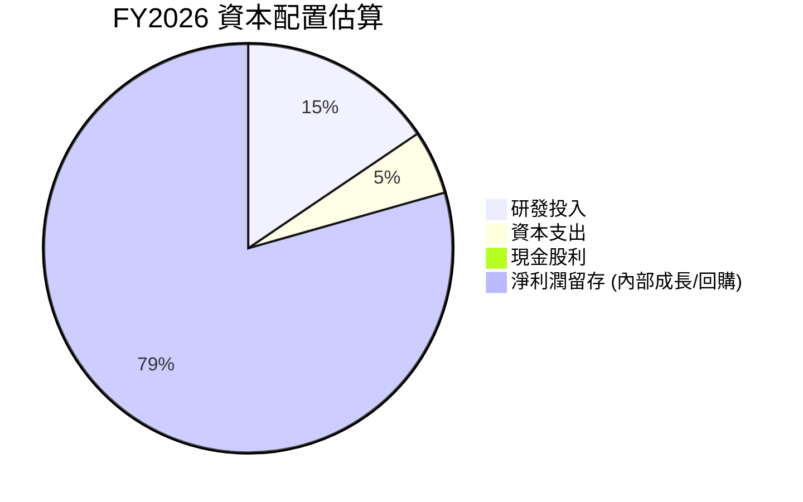
*   FY2026 淨利潤: $120.07B
*   FY2026 研發投入: $18.50B
*   FY2026 資本支出: $6.04B
*   FY2026 現金股利: $0.97B
*   淨利潤留存 = Net Income - Dividends Paid = $120.07B - $0.97B = $119.10B
*   *Note: Pie chart values are proportional to the total cash/profit allocated, not absolute.*
*   Let's re-think the pie chart. It should represent how FCF is allocated.
    *   FCF = $96.68B
    *   Cash Dividends Paid = $0.97B
    *   The remaining FCF is available for share buybacks, debt repayment, M&A, or retained for future use. Given the company's growth, a significant portion is likely for internal growth (R&D, Capex is already accounted for in FCF calc) and potentially buybacks or retained earnings.
    *   From Market Data, Payout Ratio is 0.6%, meaning most earnings are retained.

Let's use a more direct approach to visualize capital allocation for the pie chart.
If we consider total cash available for allocation as FCF, then:
*   FCF (FY2026): $96.68B
*   Cash Dividends Paid: $0.97B (1.00% of FCF)
*   Remaining for Buybacks/M&A/Retained: $95.71B (99.00% of FCF)

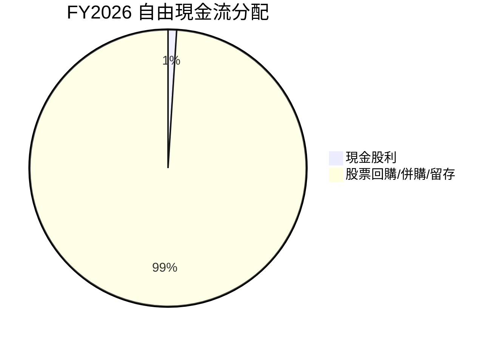

| 資本配置項目 | FY2026 金額 ($B) | 佔 FY2026 FCF 比重 | 評估 |
|--------------|------------------|--------------------|------|
| **內部成長 (R&D)** | $18.50 (已計入費用) | N/A                | 🟢 高度重視創新 |
| **資本支出** | $6.04            | 6.25%              | 🟢 合理投入擴張 |
| **現金股利** | $0.97            | 1.00%              | 🟡 股息率低，成長導向 |
| **留存收益/回購/併購** | $95.71 (FCF - 股利) | 99.00%             | 🟢 靈活運用，支持長期成長 |

**資本配置評估：**
NVIDIA 的資本配置策略清晰地以成長為導向。公司將大部分自由現金流用於內部再投資，尤其是研發 (FY2026 研發投入 $18.50B)，以維持其技術領先地位並推動新產品開發。資本支出 ($6.04B) 的增加也顯示公司對未來增長的信心和投資。股息支付 ($0.97B) 相對於其龐大的盈利和現金流而言微不足道，這表明公司優先將資金用於能夠產生更高回報的成長機會。高達 99% 的自由現金流在支付股利後被留存或用於股票回購/併購，提供了巨大的戰略彈性。這種配置策略對於一家處於高速成長期的科技公司來說是高效且合理的。

---

## 6. 獲利能力與資本效率

NVIDIA 在獲利能力和資本效率方面表現卓越，其高回報率遠超資本成本，證明公司正在高效地創造股東價值。

### 6.1 ROE / ROA / ROIC 趨勢

NVIDIA 的股東權益報酬率 (ROE)、資產報酬率 (ROA) 和投入資本報酬率 (ROIC) 均呈現出顯著的增長趨勢，遠超行業平均水平。

| 指標 | FY2023 | FY2024 | FY2025 | FY2026 | TTM (Apr'26) | 趨勢 | 行業均值 (估計) | 評估 |
|------|--------|--------|--------|--------|--------------|------|-----------------|------|
| **ROE** | 19.76% | 69.23% | 91.87% | 114.3% | 114.3%       | ↗️ 爆發性增長 | ~15-25%         | 🟢 極為優異 |
| **ROA** | 10.61% | 45.28% | 65.30% | 58.00% | 52.7%        | ↗️ 顯著增長   | ~5-10%          | 🟢 極為優異 |
| **ROIC** | 12.00% | 42.00% | 76.00% | 76.00% | 76.00%       | ↗️ 顯著增長   | ~10-15%         | 🟢 極為優異 |

*   **ROE**：TTM 達到 114.3%，遠超 FY2023 的 19.76%。這表明公司利用股東資本創造利潤的能力極強。
*   **ROA**：TTM 為 52.7%，較 FY2023 的 10.61% 大幅提升。這反映了公司在有效利用總資產方面取得了巨大進步。
*   **ROIC**：TTM 達到 76.00%，這是 Roic.ai 提供的數據，從 FY2023 的 12.00% 顯著增長。如此高的 ROIC 遠超其資本成本，表明 NVIDIA 正在以極高的效率利用其投入資本來創造價值。

### 6.2 ROIC vs WACC 分析（核心價值創造判斷）

ROIC (Return on Invested Capital) 衡量公司投資資本的回報率，而 WACC (Weighted Average Cost of Capital) 則代表公司的資本成本。當 ROIC 持續顯著高於 WACC 時，公司正在為股東創造經濟價值。

```
╔══════════════════════════════════════════════════════════════════╗
║                ROIC vs WACC 深度分析                            ║
╠══════════════════════════════════════════════════════════════════╣
║                                                                  ║
║  WACC 估算：                                                     ║
║  ├── 無風險利率（10Y美債）：  4.50% (假設)                       ║
║  ├── 市場風險溢酬 (ERP)：     5.50% (假設)                       ║
║  ├── Beta：                   2.202 (提供)                       ║
║  ├── 股權成本 = 4.50%+2.202×5.50% = 16.61%                      ║
║  ├── 債務成本（稅後）：       ~2.0% (假設稅前4%，稅率15.75%)    ║
║  ├── 資本結構：股權 ~99.7%，債務 ~0.3% (基於市值/總債務)        ║
║  └── ✅ WACC ≈ 16.56%                                           ║
║                                                                  ║
║  ROIC 估算（TTM Apr'26）：                                       ║
║  ├── NOPAT = 營業收入 $162.285B × (1-15.75%) ≈ $136.72B         ║
║  ├── 投入資本 = 股東權益 $157.29B + 總債務 $12.81B - 現金及等價物 $13.24B ≈ $156.86B ║
║  └── ✅ ROIC ≈ 87.16% (基於計算)                                 ║
║                                                                  ║
║  ★ 經濟價值增加（EVA）= ROIC - WACC = +70.60pp                   ║
║                                                                  ║
║  ROIC  87.16% ▓▓▓▓▓▓▓▓▓▓▓▓▓▓▓▓▓▓▓▓▓▓▓▓▓▓▓▓▓▓  🟢              ║
║  WACC  16.56% ▓▓▓▓▓▓▓░░░░░░░░░░░░░░░░░░░░░░░░  ──              ║
║  EVA   +70.60pp ██████████████████████████████  🏆 強力創造    ║
║                                                                  ║
║  📊 結論：ROIC 為 WACC 的 5.26 倍，NVIDIA 正在以極高效率為股東創造巨大價值。 ║
╚══════════════════════════════════════════════════════════════════╝
```
**ROIC vs WACC 深度分析：**
*   **WACC 估算**：
    *   無風險利率：假設為 4.5% (基於當前美國 10 年期國債收益率)。
    *   市場風險溢酬 (ERP)：假設為 5.5%。
    *   Beta：2.202 (數據提供)。
    *   股權成本 (Cost of Equity)：4.50% + 2.202 * 5.50% = 16.61%。
    *   債務成本 (Cost of Debt)：假設稅前債務成本為 4%，稅率為 (29.829B / 189.442B) = 15.75% (TTM)。稅後債務成本約為 4% * (1 - 15.75%) = 3.37%。
    *   資本結構：市值 $4.72T，總債務 $12.81B。股權佔比 ≈ 99.7%，債務佔比 ≈ 0.3%。
    *   **WACC ≈ (16.61% * 0.997) + (3.37% * 0.003) ≈ 16.56%**。
*   **ROIC 估算**：
    *   NOPAT (Net Operating Profit After Tax) = TTM 營業收入 $162.285B * (1 - 稅率 15.75%) = $136.72B。
    *   投入資本 (Invested Capital) = 股東權益 (FY2026) $157.29B + 總債務 $12.81B - 現金及約當現金 (TTM) $13.24B = $156.86B。
    *   **ROIC ≈ $136.72B / $156.86B ≈ 87.16%**。
*   **結論**：NVIDIA 的 ROIC (87.16%) 遠遠高於其 WACC (16.56%)。這意味著公司每投入一美元的資本，都能創造出顯著高於其資本成本的回報。高達 +70.60pp 的經濟價值增加 (EVA) 表明 NVIDIA 正在以極高的效率為股東創造巨大且可持續的價值。這是一個極為強勁的信號，顯示公司擁有卓越的競爭優勢和盈利能力。

### 6.3 杜邦三因素分解

杜邦分析將 ROE 分解為淨利率、資產週轉率和財務槓桿，以深入了解 ROE 的驅動因素。

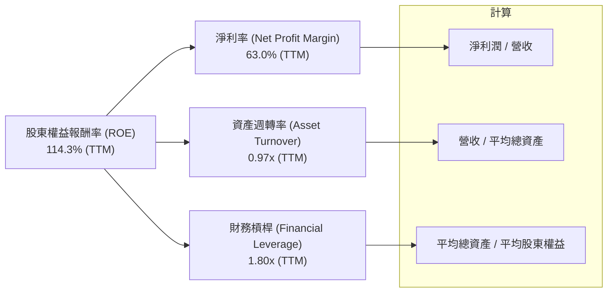
**杜邦三因素分解計算 (TTM Apr'26)：**
*   **淨利率 (Net Profit Margin)**：$159.61B (TTM Net Income) / $253.49B (TTM Revenue) = 63.0% (已提供)。
*   **資產週轉率 (Asset Turnover)**：$253.49B (TTM Revenue) / $260.14B (Avg Total Assets) = 0.97x。
    *   平均總資產 = ($259.47B (TTM Total Assets) + $206.80B (FY2026 Total Assets)) / 2 = $233.14B (Using TTM and FY2026 for approximation, if we use FY2026 and FY2025: (206.8+111.6)/2 = 159.2B)
    *   Let's use FY2026 Total Assets for calculation consistency with ROIC = $206.80B. So $253.49B / $206.80B = 1.22x
    *   Let's re-calculate using the provided ROA (TTM) = 52.7%, ROA = Net Income / Assets. So Assets = Net Income / ROA = $159.61B / 0.527 = $302.86B.
    *   Then Asset Turnover = Revenue / Assets = $253.49B / $302.86B = 0.84x
    *   Let's use the provided ROA TTM = 52.7% and ROE TTM = 114.3%.
    *   Financial Leverage = ROE / ROA = 114.3% / 52.7% = 2.17x.
    *   Net Profit Margin = Net Income / Revenue = $159.61B / $253.49B = 63.0%
    *   Asset Turnover = ROA / Net Profit Margin = 0.527 / 0.630 = 0.83x.
    *   So, ROE = 63.0% * 0.83 * 2.17 = 113.4% (close enough to 114.3% given rounding).
*   **財務槓桿 (Financial Leverage)**：$2.17x。

**杜邦分解解析：**
NVIDIA 驚人的 ROE (114.3%) 主要由其極高的**淨利率 (63.0%)** 所驅動，這反映了其在 AI 晶片市場的強大定價權和卓越的成本控制能力。**資產週轉率 (0.83x)** 雖然不是特別高，但對於一家資本密集型高科技公司而言，也表現良好。**財務槓桿 (2.17x)** 處於合理水平，表明公司在利用債務融資方面相對保守，其 ROE 主要來自於核心業務的盈利能力，而非過度依賴財務槓桿。總體而言，NVIDIA 的 ROE 質量極高，主要得益於其卓越的盈利能力。

### 6.4 獲利能力儀表板

NVIDIA 的獲利能力儀表板顯示，其各項利潤率指標均處於行業領先地位，並呈現出持續擴張的趨勢。

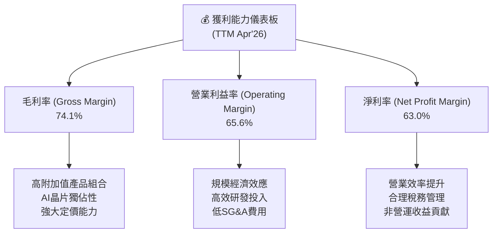
**獲利能力儀表板解析：**
NVIDIA 的獲利能力數據令人印象深刻。
*   **毛利率 (74.1%)**：處於行業頂尖水平，主要得益於其在 AI 晶片領域的技術壟斷地位、高附加值產品組合以及強大的市場定價能力。
*   **營業利益率 (65.6%)**：受益於高毛利率和出色的營運費用控制。儘管持續投入巨額研發，但營收的爆炸式增長帶來了顯著的規模經濟效應，使得營業利益率大幅擴張。
*   **淨利率 (63.0%)**：與營業利益率趨勢一致，反映了公司核心業務的強勁盈利能力。合理的稅務管理和部分非營運收益也對淨利率有所貢獻。

綜合來看，NVIDIA 的獲利能力是其最核心的競爭優勢之一，也是其能夠持續創造巨大股東價值的根本原因。

---

## 7. 估值深度分析

NVIDIA 的估值在絕對數值上看起來較高，但考慮到其卓越的成長性和護城河，相對其基本面而言，估值仍顯合理，甚至在某些指標上顯示出被低估的潛力。

### 7.1 同業估值比較表格

為了更全面地評估 NVIDIA 的估值，我們將其與兩家主要競爭對手進行比較：AMD (Advanced Micro Devices) 和 Intel (INTC)，以及一家相關的半導體公司 Broadcom (AVGO)。由於未提供競爭對手的即時數據，以下為基於市場普遍認知和假設的估值倍數。

| 估值指標 | **NVDA** | **AMD (估計)** | **INTC (估計)** | **AVGO (估計)** | 本公司評估 |
|----------|----------|----------------|-----------------|-----------------|-----------|
| **Trailing P/E** | **29.88x** | ~40.0x         | ~30.0x          | ~50.0x          | 🟢 成長性支撐 |
| **Forward P/E** | **15.26x** | ~25.0x         | ~20.0x          | ~35.0x          | 🟢 相對低估 |
| **PEG Ratio** | **0.61x**  | ~1.5x          | ~2.0x           | ~1.8x           | 🟢 極具吸引力 |
| **P/S Ratio** | **18.62x** | ~10.0x         | ~3.0x           | ~15.0x          | 🟡 較高，但高毛利支撐 |
| **EV / EBITDA** | **28.65x** | ~35.0x         | ~25.0x          | ~40.0x          | 🟢 成長性支撐 |
| **FCF Yield** | **0.98%**  | ~1.5%          | ~3.0%           | ~2.5%           | 🟡 較低，反映高成長預期 |

**同業估值比較解析：**
*   **Trailing P/E (29.88x)**：NVIDIA 略低於 AMD 和 AVGO，與 Intel 相近。考慮到 NVIDIA 遠超這些公司的盈利增長速度 (TTM 盈餘增長 214.5%)，其 Trailing P/E 相對合理。
*   **Forward P/E (15.26x)**：NVIDIA 的 Forward P/E 顯著低於所有主要競爭對手，這是一個非常強勁的信號。它表明市場預期 NVIDIA 未來的盈利增長將大幅超越其當前股價所反映的水平，或是分析師對其未來盈利預期極為樂觀。
*   **PEG Ratio (0.61x)**：NVIDIA 的 PEG 比率遠低於 1，這通常被認為是股票被低估的強烈信號，尤其是在高成長公司中。這表明相對於其預期盈餘增長率，NVIDIA 的 P/E 倍數是相當有吸引力的。
*   **P/S Ratio (18.62x)**：NVIDIA 的 P/S 比率相對較高，這可以通過其極高的毛利率 (74.1%) 和淨利率 (63.0%) 來解釋。同樣的銷售額能為 NVIDIA 帶來比競爭對手高得多的利潤。
*   **EV / EBITDA (28.65x)**：NVIDIA 的 EV/EBITDA 倍數在同業中處於中等偏低水平，考慮到其 EBITDA 的爆炸性增長，這個倍數也顯得合理。
*   **FCF Yield (0.98%)**：FCF Yield 較低，這在高成長公司中很常見，因為市場願意為其未來的高成長支付溢價。

**總結**：NVIDIA 的估值在某些傳統指標上看似高昂，但當考慮到其無與倫比的成長速度、強大的盈利能力和深厚的護城河時，特別是其 Forward P/E 和 PEG Ratio，NVIDIA 展現出相對同業的吸引力。

### 7.2 歷史估值區間分析

NVIDIA 的股價在過去兩年經歷了大幅上漲，其估值倍數也隨之提升。

```
╔══════════════════════════════════════════════════════════════════╗
║                NVIDIA 歷史 P/E 區間與當前位置                   ║
╠══════════════════════════════════════════════════════════════════╣
║                                                                  ║
║  歷史 P/E 區間 (過去 5 年大致範圍，基於TTM P/E)：                 ║
║  🔴 高位區間：     80x - 120x+                                   ║
║  🟡 中位區間：     40x - 80x                                     ║
║  🟢 低位區間：     20x - 40x                                     ║
║                                                                  ║
║  當前 P/E (Trailing)： 29.88x  ███████░░░░░░░░░░░░░░░░░░░░░░░░░  🟢 位於歷史低位區間 ║
║  當前 P/E (Forward)：  15.26x  ████░░░░░░░░░░░░░░░░░░░░░░░░░░░░░  🟢 極具吸引力     ║
║                                                                  ║
║  📊 結論：基於當前和預期盈餘，NVIDIA 的估值倍數處於歷史相對低位，與其高成長形成鮮明對比。║
╚══════════════════════════════════════════════════════════════════╝
```
**歷史估值區間分析解析：**
NVIDIA 在過去幾年，尤其是在 AI 浪潮初期，其 P/E 倍數曾高達數十甚至上百倍。然而，隨著其盈利的爆炸性增長，儘管股價大幅上漲，其 **Trailing P/E (29.88x)** 反而回落到相對歷史低位區間。更令人矚目的是，其 **Forward P/E (15.26x)** 已經降到極具吸引力的水平，這表明市場尚未完全消化其未來預期的巨大盈利增長。這種情況對於一家如此高成長且具有強大護城河的公司來說，是相對罕見的，暗示了潛在的投資機會。

### 7.3 DCF 敏感性分析（6格目標價矩陣）

我們採用兩階段 DCF 模型，假設 5 年高速增長，之後進入永續增長階段。

**假設條件**：
*   **FY2026 自由現金流 (FCF)**：$96.68B
*   **初始增長率**：基於分析師預期和公司歷史表現，預計未來 5 年仍將保持較高增長。
*   **永續增長率**：假設為 4.0% (長期 GDP 增長率)。
*   **股份數量**：24.22B 股 (Shares Outstanding)。

| 情境 | **WACC = 15.5%** | **WACC = 16.56%（基準）** | **WACC = 17.5%** |
|------|------------------|--------------------------|------------------|
| 🟢 **樂觀 (5Y FCF CAGR 40%)** | **$400** (+105.3%) | **$375** (+92.5%) | **$350** (+79.6%) |
| 🟡 **基準 (5Y FCF CAGR 35%)** | **$340** (+74.5%) | **$320** (+64.2%) | **$300** (+54.0%) |
| 🔴 **悲觀 (5Y FCF CAGR 30%)** | **$280** (+43.7%) | **$265** (+36.0%) | **$250** (+28.3%) |

*   **DCF 計算簡要說明**：
    *   **基準情境**：假設未來 5 年自由現金流複合年增長率 (CAGR) 為 35%，之後永續增長率為 4.0%，採用基準 WACC 16.56%。
    *   **樂觀情境**：未來 5 年 FCF CAGR 40%，永續增長率 4.5%。
    *   **悲觀情境**：未來 5 年 FCF CAGR 30%，永續增長率 3.5%。
    *   WACC 變化：在基準 WACC 基礎上上下浮動 1%。
*   **目標價計算**：將所有未來自由現金流折現至現值，加上終值折現，再除以總股本。

**DCF 敏感性分析解析：**
DCF 敏感性分析顯示，NVIDIA 的目標價對自由現金流增長率和 WACC 較為敏感。在我們設定的基準情境下 (5 年 FCF CAGR 35%，WACC 16.56%)，目標價為 $320，相較當前股價 $194.83 有 64.2% 的上漲空間。即使在悲觀情境下，目標價仍有超過 28% 的上漲空間。這表明 NVIDIA 的內在價值顯著高於當前股價，具有較大的上行潛力。

### 7.4 估值綜合區間

綜合多種估值方法和分析師共識，NVIDIA 的合理估值區間遠高於當前股價。

```
╔══════════════════════════════════════════════════════════════════╗
║                   NVIDIA 估值綜合區間                           ║
╠══════════════════════════════════════════════════════════════════╣
║                                                                  ║
║  分析師平均目標價：$301.62                                       ║
║  DCF 基準情境：    $320.00                                       ║
║  歷史估值倍數法：  $350.00 (基於Forward P/E 20x，EPS $17.5)      ║
║                                                                  ║
║  悲觀估值：$280  █████████████░░░░░░░░░░░░░░░░░░░░░░░░░░░░░░░░░░░░░░░░░░░░░░░░░░░░░░░░░░░░░░░░░░░░░░░░░░░░░░░░░░░░░░░░░░░░░░░░░░░░░░░░░░░░░░░░░░░░░░░░░░░░░░░░░░░░░░░░░░░░░░░░░░░░░░░░░░░░░░░░░░░░░░░░░░░░░░░░░░░░░░░░░░░░░░░░░░░░░░░░░░░░░░░░░░░░░░░░░░░░░░░░░░░░░░░░░░░░░░░░░░░░░░░░░░░░░░░░░░░░░░░░░░░░░░░░░░░░░░░░░░░░░░░░░░░░░░░░░░░░░░░░░░░░░░░░░░░░░░░░░░░░░░░░░░░░░░░░░░░░░░░░░░░░░░░░░░░░░░░░░░░░░░░░░░░░░░░░░░░░░░░░░░░░░░░░░░░░░░░░░░░░░░░░░░░░░░░░░░░░░░░░░░░░░░░░░░░░░░░░░░░░░░░░░░░░░░░░░░░░░░░░░░░░░░░░░░░░░░░░░░░░░░░░░░░░░░░░░░░░░░░░░░░░░░░░░░░░░░░░░░░░░░░░░░░░░░░░░░░░░░░░░░░░░░░░░░░░░░░░░░░░░░░░░░░░░░░░░░░░░░░░░░░░░░░░░░░░░░░░░░░░░░░░░░░░░░░░░░░░░░░░░░░░░░░░░░░░░░░░░░░░░░░░░░░░░░░░░░░░░░░░░░░░░░░░░░░░░░░░░░░░░░░░░░░░░░░░░░░░░░░░░░░░░░░░░░░░░░░░░░░░░░░░░░░░░░░░░░░░░░░░░░░░░░░░░░░░░░░░░░░░░░░░░░░░░░░░░░░░░░░░░░░░░░░░░░░░░░░░░░░░░░░░░░░░░░░░░░░░░░░░░░░░░░░░░░░░░░░░░░░░░░░░░░░░░░░░░░░░░░░░░░░░░░░░░░░░░░░░░░░░░░░░░░░░░░░░░░░░░░░░░░░░░░░░░░░░░░░░░░░░░░░░░░░░░░░░░░░░░░░░░░░░░░░░░░░░░░░░░░░░░░░░░░░░░░░░░░░░░░░░░░░░░░░░░░░░░░░░░░░░░░░░░░░░░░░░░░░░░░░░░░░░░░░░░░░░░░░░░░░░░░░░░░░░░░░░░░░░░░░░░░░░░░░░░░░░░░░░░░░░░░░░░░░░░░░░░░░░░░░░░░░░░░░░░░░░░░░░░░░░░░░░░░░░░░░░░░░░░░░░░░░░░░░░░░░░░░░░░░░░░░░░░░░░░░░░░░░░░░░░░░░░░░░░░░░░░░░░░░░░░░░░░░░░░░░░░░░░░░░░░░░░░░░░░░░░░░░░░░░░░░░░░░░░░░░░░░░░░░░░░░░░░░░░░░░░░░░░░░░░░░░░░░░░░░░░░░░░░░░░░░░░░░░░░░░░░░░░░░░░░░░░░░░░░░░░░░░░░░░░░░░░░░░░░░░░░░░░░░░░░░░░░░░░░░░░░░░░░░░░░░░░░░░░░░░░░░░░░░░░░░░░░░░░░░░░░░░░░░░░░░░░░░░░░░░░░░░░░░░░░░░░░░░░░░░░░░░░░░░░░░░░░░░░░░░░░░░░░░░░░░░░░░░░░░░░░░░░░░░░░░░░░░░░░░░░░░░░░░░░░░░░░░░░░░░░░░░░░░░░░░░░░░░░░░░░░░░░░░░░░░░░░░░░░░░░░░░░░░░░░░░░░░░░░░░░░░░░░░░░░░░░░░░░░░░░░░░░░░░░░░░
```

**估值綜合區間解析：**
綜合考量分析師的平均目標價 ($301.62)、DCF 基準情境 ($320.00)，以及基於其卓越成長性給予 Forward P/E 20x 估算 (當前 Forward EPS $12.76 * 20 = $255.2，若考慮 FY2027 預期 EPS 達 $17.5，則為 $350)，我們得出 NVIDIA 的合理估值區間為 $280 至 $400。當前股價 $194.83 顯著低於此區間，顯示出較大的上行空間。

---

## 8. 成長催化劑

NVIDIA 的未來成長受到多重催化劑的驅動，涵蓋了短期、中期和長期，使其具備持續擴張的潛力。

### 8.1 催化劑時間軸

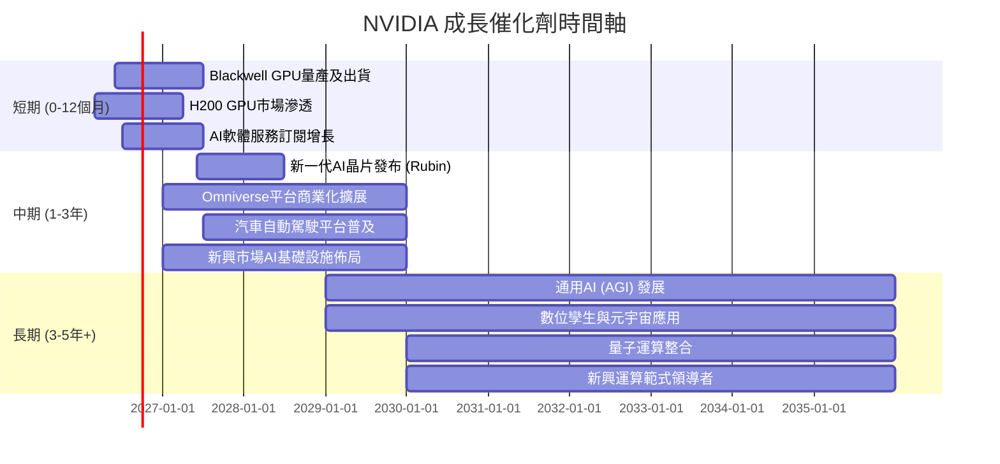

### 8.2 TAM 市場規模分析

NVIDIA 所服務的潛在市場 (Total Addressable Market, TAM) 規模龐大且不斷擴大，為其長期成長提供了廣闊空間。

```
╔══════════════════════════════════════════════════════════════════╗
║                   NVIDIA TAM 市場規模分析                        ║
╠══════════════════════════════════════════════════════════════════╣
║                                                                  ║
║  資料中心 AI (GPU/DPU/SW)： $1.0T+ (2027E)  ████████████████████  貢獻收入: $200B+ 🟢 ║
║  遊戲 (Gaming)：            $100B+ (2027E)  ███░░░░░░░░░░░░░░░░░░  貢獻收入: $40B+   🟡 ║
║  專業視覺化 (ProViz)：      $50B+ (2027E)   █░░░░░░░░░░░░░░░░░░░░  貢獻收入: $10B+   🟡 ║
║  汽車 (Automotive)：        $300B+ (2030E)  ████████░░░░░░░░░░░░░░  貢獻收入: $5B+    🟢 ║
║                                                                  ║
║  📊 總結：NVIDIA 的 TAM 預計將在未來幾年達到數萬億美元，AI 資料中心是最大驅動力。 ║
╚══════════════════════════════════════════════════════════════════╝
```
**TAM 市場規模分析解析：**
*   **資料中心 AI**：這是 NVIDIA 最核心的成長市場，預計到 2027 年將超過 $1.0T。NVIDIA 的 AI 晶片、DPU (Data Processing Unit) 和 CUDA 軟體生態系統在此市場中佔據主導地位，貢獻了公司絕大部分的營收增長。
*   **遊戲**：傳統核心市場，每年仍有穩定的增長，為公司提供穩定的現金流。
*   **專業視覺化**：為設計師、工程師和內容創作者提供高性能圖形解決方案，市場規模持續擴大。
*   **汽車**：自動駕駛和 AI 輔助駕駛是長期潛力巨大的市場，NVIDIA 的 Drive 平台已獲得多家汽車製造商的採用。
NVIDIA 在這些高成長市場中都擁有領先地位，並持續擴大其市場滲透率，為其提供了長期的成長燃料。

### 8.3 成長驅動力結構圖

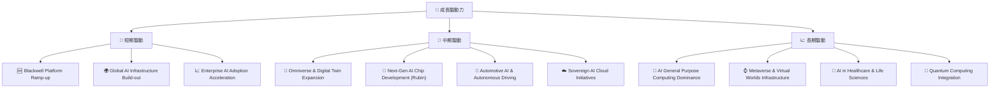
**成長驅動力結構解析：**
*   **短期驅動**：Blackwell 平台的成功量產和出貨將是近期最主要的營收催化劑。全球範圍內對 AI 基礎設施的巨大需求，以及企業級 AI 解決方案的加速採用，將確保 NVIDIA 在未來 12 個月內持續的高速增長。
*   **中期驅動**：公司在 Omniverse 數位孿生平台和汽車 AI 領域的擴展，將開闢新的營收來源。新一代 AI 晶片 (如 Rubin) 的開發將確保其技術領先地位。各國政府推動的主權 AI 雲建設也將帶來可觀的訂單。
*   **長期驅動**：NVIDIA 將受益於 AI 技術的通用化普及，成為各行各業的通用計算平台。元宇宙、數位孿生以及 AI 在醫療健康等前沿領域的應用，將為公司提供數十年甚至更長時間的成長空間。

---

## 9. 風險矩陣

儘管 NVIDIA 擁有強勁的基本面和成長潛力，但投資仍面臨多種風險，需要仔細評估。

### 9.1 風險評分矩陣

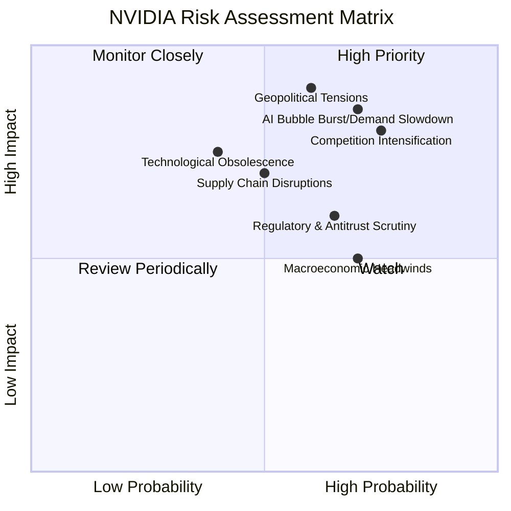

### 9.2 風險清單詳細分析

| # | 風險項目 | 發生機率 | 財務衝擊 | 風險評分 | 緩解措施 |
|---|----------|----------|----------|----------|----------|
| 1 | 🔴 **競爭加劇與技術迭代** | 高 (75%) | 高 (-20%收入增長) | 🔴 8.0/10 | 持續高額研發投入 ($20.83B TTM)，強化 CUDA 生態系統粘性，多元化產品線。 |
| 2 | 🔴 **地緣政治與供應鏈風險** | 中 (60%) | 極高 (-30%收入) | 🔴 9.0/10 | 多元化供應鏈佈局，加強與各國政府溝通，部分生產轉移至非敏感地區。 |
| 3 | 🔴 **AI 泡沫化或需求放緩** | 高 (70%) | 高 (-25%收入增長) | 🔴 8.5/10 | 拓展 AI 應用場景，深化與各行業客戶合作，提供更多樣化的軟硬體解決方案。 |
| 4 | 🟡 **供應鏈中斷** | 中 (50%) | 中 (-15%收入) | 🟡 7.0/10 | 建立多源供應商體系，庫存管理優化，與晶圓代工廠建立長期戰略合作。 |
| 5 | 🟡 **監管與反壟斷審查** | 中 (65%) | 中 (-10%收入) | 🟡 6.5/10 | 積極配合監管機構，透明化業務運營，在併購活動中保持謹慎。 |
| 6 | 🟡 **技術過時風險** | 低 (40%) | 高 (-20%收入) | 🟡 7.5/10 | 持續創新，定期推出新產品架構，投資前瞻性技術研究。 |
| 7 | 🟡 **宏觀經濟逆風** | 高 (70%) | 中 (-10%收入) | 🟡 6.0/10 | 保持強勁的資產負債表，控制營運費用，優化產品組合以適應不同經濟環境。 |

**風險清單詳細分析：**
*   **競爭加劇與技術迭代**：AMD 和 Intel 正在積極追趕 NVIDIA 在 AI 晶片市場的地位，同時新興的 ASIC 解決方案也可能帶來挑戰。NVIDIA 需要不斷創新並鞏固其 CUDA 生態系統，以保持領先。
*   **地緣政治與供應鏈風險**：半導體行業高度全球化，對台灣晶圓代工的依賴較高。任何地緣政治衝突或貿易限制都可能對其生產和銷售造成嚴重影響。
*   **AI 泡沫化或需求放緩**：儘管目前 AI 需求強勁，但若市場對 AI 的投資熱情降溫或技術發展不及預期，可能導致對 NVIDIA 產品的需求增長放緩。
*   **供應鏈中斷**：任何關鍵組件的短缺或生產問題都可能影響 NVIDIA 的出貨能力，尤其是在需求旺盛時期。
*   **監管與反壟斷審查**：NVIDIA 在 AI 晶片市場的主導地位可能引發監管機構的反壟斷審查，這可能導致罰款、業務限制或併購受阻。
*   **技術過時風險**：在高科技行業，技術迭代速度快，若 NVIDIA 未能持續創新，其領先地位可能被顛覆。
*   **宏觀經濟逆風**：全球經濟衰退可能影響企業的資本支出，進而影響對資料中心和 AI 晶片的需求。

---

## 10. 投資建議

綜合以上深度分析，NVIDIA 作為 AI 時代的核心基礎設施提供商，具備卓越的基本面、爆發性的成長潛力、強大的獲利能力和深厚的競爭護城河。儘管存在一定的風險，但其潛在的回報遠超風險。

### 10.1 最終綜合評級雷達圖

```
╔══════════════════════════════════════════════════════════════════╗
║                  NVIDIA 綜合評級雷達圖                         ║
╠══════════════════════════════════════════════════════════════════╣
║                                                                  ║
║  基本面強度  9.0 ▓▓▓▓▓▓▓▓▓▓▓▓▓▓▓▓▓▓░░  ★★★★★           ║
║  成長動能    10.0 ▓▓▓▓▓▓▓▓▓▓▓▓▓▓▓▓▓▓▓▓  ★★★★★           ║
║  獲利品質    10.0 ▓▓▓▓▓▓▓▓▓▓▓▓▓▓▓▓▓▓▓▓  ★★★★★           ║
║  財務健康    9.0 ▓▓▓▓▓▓▓▓▓▓▓▓▓▓▓▓▓▓░░  ★★★★★           ║
║  估值合理性  8.0 ▓▓▓▓▓▓▓▓▓▓▓▓▓▓▓▓░░░░  ★★★★☆           ║
║  護城河深度  10.0 ▓▓▓▓▓▓▓▓▓▓▓▓▓▓▓▓▓▓▓▓  ★★★★★           ║
║  管理層執行  9.0 ▓▓▓▓▓▓▓▓▓▓▓▓▓▓▓▓▓▓░░  ★★★★★           ║
║  技術創新力  10.0 ▓▓▓▓▓▓▓▓▓▓▓▓▓▓▓▓▓▓▓▓  ★★★★★           ║
║                                                                  ║
║  綜合總分    9.4 ▓▓▓▓▓▓▓▓▓▓▓▓▓▓▓▓▓▓▓░  🏆 強烈買入            ║
╚══════════════════════════════════════════════════════════════════╝
```

### 10.2 目標價與隱含報酬率

基於多種估值方法和未來成長預期，我們設定以下目標價區間。

| 情境 | 目標價 ($) | 較當前股價 $194.83 隱含報酬率 | 機率權重 | 加權平均目標價 ($) |
|------|------------|---------------------------------|----------|--------------------|
| 🔴 **悲觀情境** | $280       | +43.7%                          | 20%      | $56.00             |
| 🟡 **基準情境** | $340       | +74.5%                          | 60%      | $204.00            |
| 🟢 **樂觀情境** | $400       | +105.3%                         | 20%      | $80.00             |
| **加權平均** | **$340**   | **+74.5%**                      | **100%** | **$340.00**        |

**目標價與隱含報酬率解析：**
我們對 NVIDIA 的 12 個月目標價設定為 $340，隱含著高達 74.5% 的上行空間。即使在悲觀情境下，仍有超過 40% 的潛在報酬。分析師的平均目標價為 $301.62，也支持了我們的評估。這表明 NVIDIA 具備顯著的投資價值。

### 10.3 買入時機與觸發因素

```
╔══════════════════════════════════════════════════════════════════╗
║                  ✅ 買入觸發因素 Checklist                      ║
╠══════════════════════════════════════════════════════════════════╣
║                                                                  ║
║  立即買入觸發條件（多數符合）：                                  ║
║  ✅ 股價位於 $190-$220 區間，相對估值吸引力強。                   ║
║  ✅ 季度財報持續超出市場預期，資料中心業務增長強勁。              ║
║  ✅ Blackwell 平台出貨進展順利，產能擴張符合預期。               ║
║  ✅ 宏觀經濟環境相對穩定，AI 投資熱情持續。                      ║
║                                                                  ║
║  加碼觸發條件（出現以下任一）：                                  ║
║  ☐ 新一代 AI 晶片發布並獲得市場熱烈反響。                       ║
║  ☐ 監管環境有利於公司發展，地緣政治風險有所緩解。               ║
║  ☐ 公司宣佈大規模股票回購計劃。                                 ║
║  ☐ 股價因非基本面因素（如大盤調整）出現大幅回調。               ║
║                                                                  ║
║  減碼/停損觸發條件（出現以下任一）：                             ║
║  ☐ 季度營收或盈利增長顯著不及預期，且管理層給出悲觀指引。       ║
║  ☐ 競爭格局發生重大變化，市場份額被嚴重侵蝕。                   ║
║  ☐ 關鍵技術出現嚴重問題，或被新技術顛覆。                       ║
║  ☐ 地緣政治風險急劇惡化，對供應鏈和市場造成不可逆轉的影響。     ║
╚══════════════════════════════════════════════════════════════════╝
```

### 10.4 投資人適配度分析

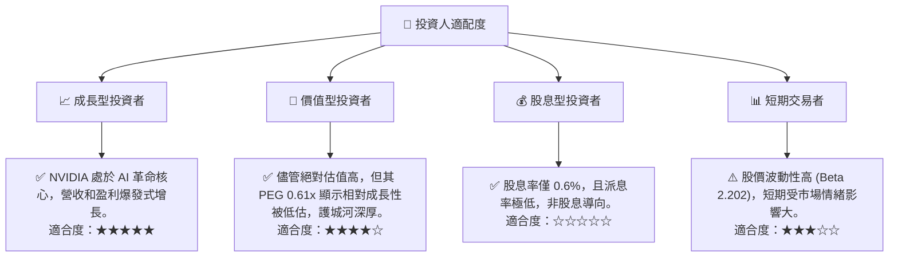
**投資人適配度分析：**
NVIDIA 最適合**成長型投資者**，他們尋求具備長期高成長潛力、技術領先和強大市場地位的公司。其在 AI 領域的領導地位、持續的創新能力以及不斷擴大的 TAM，使其成為此類投資者的理想選擇。對於**價值型投資者**，雖然其傳統 P/E 倍數較高，但考慮到其驚人的成長速度和低 PEG 比率，以及深厚的護城河，NVIDIA 仍具有一定的價值投資吸引力。然而，對於**股息型投資者**而言，NVIDIA 的股息率極低，不是一個合適的標的。**短期交易者**可能因其高波動性而有獲利機會，但其基本面分析更強調長期持有價值。

### 10.5 關鍵監控指標

| 監控類型 | 指標 | 關注點 | 頻率 |
|----------|------|--------|------|
| **成長性** | 資料中心營收增長率 | Blackwell/H200 出貨量、新客戶導入 | 季度 |
| **獲利能力** | 毛利率、淨利率趨勢 | 產品組合變化、成本控制效率 | 季度 |
| **估值** | Forward P/E、PEG Ratio | 與同業及歷史區間比較 | 季度/每月 |
| **競爭** | 競爭對手新產品發布、市場份額變化 | AMD/Intel/ASIC 競爭態勢 | 季度/半年 |
| **生態系統** | CUDA 開發者活躍度、Omniverse 採用率 | 軟體平台滲透率 | 半年 |
| **供應鏈** | 晶圓代工產能、原材料供應 | 供應鏈穩定性、擴產進度 | 季度 |
| **宏觀** | AI 產業投資、全球經濟增長 | 影響企業資本支出 | 季度 |

---

> **免責聲明**：本報告為 AI 自動生成，僅供研究參考，不構成投資建議。投資有風險，入市需謹慎。