# NVDA 基本面深度分析報告
> **報告日期**：2026-07-05 ｜ **語言**：繁體中文 ｜ **數據來源**：Yahoo Finance, Finviz, StockAnalysis, Roic.ai ｜ **分析師**：CFA 級機構研究

## 目錄

| # | 章節 | 核心結論 |
|---|------------------------|----------------------------------------------------------------------|
| 1 | 執行摘要 | 評級：🟢 強烈買入，目標價區間 $270 - $450 |
| 2 | 公司概覽與商業模式 | AI 晶片領導者，強大技術與生態系統護城河 |
| 3 | 損益表深度分析 | 營收與獲利爆發式成長，利潤率持續擴張 |
| 4 | 資產負債表分析 | 財務結構穩健，現金充裕，債務風險極低 |
| 5 | 現金流量深度分析 | 自由現金流強勁，資本效率極高 |
| 6 | 獲利能力與資本效率 | ROIC 遠超 WACC，持續創造股東價值 |
| 7 | 估值深度分析 | 相較於成長性，估值合理，具備上行空間 |
| 8 | 成長催化劑 | AI 算力需求、軟體平台、新市場拓展驅動高成長 |
| 9 | 風險矩陣 | 競爭加劇、供應鏈不確定性、宏觀經濟波動 |
| 10 | 投資建議 | 強烈買入，適合長期成長型投資者 |

---

## 1. 執行摘要

### 1.1 核心評分儀表板

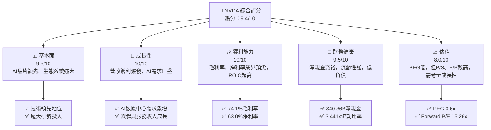

### 1.2 評分進度條視覺化

```
╔══════════════════════════════════════════════════════════════╗
║              NVDA 多維度評分儀表板 (1-10分)                  ║
╠══════════════════════════════════════════════════════════════╣
║ 基本面強度  9.5 ▓▓▓▓▓▓▓▓▓▓▓▓▓▓▓▓▓▓▓░  ★★★★★           ║
║ 成長動能   10.0 ▓▓▓▓▓▓▓▓▓▓▓▓▓▓▓▓▓▓▓▓  ★★★★★           ║
║ 獲利品質   10.0 ▓▓▓▓▓▓▓▓▓▓▓▓▓▓▓▓▓▓▓▓  ★★★★★           ║
║ 財務健康    9.5 ▓▓▓▓▓▓▓▓▓▓▓▓▓▓▓▓▓▓▓░  ★★★★★           ║
║ 估值合理性  8.0 ▓▓▓▓▓▓▓▓▓▓▓▓▓▓▓▓░░░░  ★★★★☆           ║
║ 護城河深度  9.5 ▓▓▓▓▓▓▓▓▓▓▓▓▓▓▓▓▓▓▓░  ★★★★★           ║
║ 管理層執行  9.5 ▓▓▓▓▓▓▓▓▓▓▓▓▓▓▓▓▓▓▓░  ★★★★★           ║
║ 技術創新力 10.0 ▓▓▓▓▓▓▓▓▓▓▓▓▓▓▓▓▓▓▓▓  ★★★★★           ║
╠══════════════════════════════════════════════════════════════╣
║ 綜合總分    9.4 ▓▓▓▓▓▓▓▓▓▓▓▓▓▓▓▓▓▓░░  🏆 評語：AI時代的領航者，基本面極度強勁，具備長期投資價值。║
╚══════════════════════════════════════════════════════════════╝
```

### 1.3 五大投資論點 + 三大核心風險

| 類型 | 項目 | 具體依據 | 信心度 |
|------|------|----------|--------|
| 🟢 **投資論點①** | **AI 算力領導地位不可撼動** | NVIDIA 在 AI 晶片市場佔據主導地位，其 CUDA 軟體平台建立起強大生態系統，形成高轉換成本。TTM 營收成長達 85.2%，顯示其市場需求爆炸性增長。 | 🟢 極高 |
| 🟢 **卓越的財務表現與成長動能** | TTM 營收成長 85.2%，TTM 淨利成長 214.5%，最新季度營收年增 85.23%，淨利年增 121.27%。毛利率高達 74.1%，淨利率 63.0%，顯示其產品定價能力與成本控制能力極強。 | 🟢 極高 |
| 🟢 **強勁的獲利能力與資本效率** | TTM ROE 達 114.3%，ROIC 估計超過 100%，遠高於 WACC（約 16.6%），證明公司正以極高的效率創造股東價值。 | 🟢 極高 |
| 🟢 **穩健的資產負債表** | 擁有 $53.17B 現金及等價物，總債務僅 $12.81B，淨現金 $40.36B，流動比率 3.441，財務健康狀況極佳，為未來投資與抵禦風險提供堅實基礎。 | 🟢 極高 |
| 🟢 **持續擴展的軟體與服務生態系統** | 除了硬體優勢，NVIDIA 的 CUDA、Omniverse 等軟體平台正在構建強大的生態系統，為未來營收提供可持續的增長點和高利潤率。 | 🟢 極高 |
| 🟡 **風險①** | **AI 晶片市場競爭加劇** | AMD、Intel 及雲服務提供商（如 Google TPU、AWS Inferentia）正加大投入，可能對 NVIDIA 的市場份額和定價能力造成壓力。儘管短期內優勢明顯，但長期競爭不容忽視。 | 🟡 中度 |
| 🟡 **供應鏈與地緣政治風險** | 高端晶片製造依賴少數供應商（如台積電），任何供應中斷或地緣政治緊張局勢（如中美科技戰）都可能對生產和交貨產生重大影響。 | 🟡 中度 |
| 🔴 **風險②** | **估值回調風險** | 儘管成長前景光明，目前市場給予的估值倍數已反映了極高的增長預期。若未來成長不及預期或市場情緒轉變，股價可能面臨較大回調壓力。Forward P/E 15.26x 雖看似不高，但高 P/S (18.62x) 和 P/B (24.14x) 顯示市場已給予高溢價。 | 🔴 高衝擊 |

### 1.4 快速統計卡片

| 指標 | 公司實際值 (TTM) | 行業均值 (估計) | S&P 500 均值 (估計) | 狀態 |
|-----------------|--------------------|-------------------|---------------------|------|
| 收入 YoY 成長 | **85.2%** | ~15-20% | ~8-12% | 🟢 |
| 淨利 YoY 成長 | **214.5%** | ~20-30% | ~10-15% | 🟢 |
| 毛利率 | **74.1%** | ~40-50% | ~30-40% | 🟢 |
| 營業利益率 | **65.6%** | ~15-25% | ~10-15% | 🟢 |
| 淨利率 | **63.0%** | ~10-15% | ~8-12% | 🟢 |
| ROE | **114.3%** | ~15-25% | ~12-18% | 🟢 |
| ROIC | **~104.7%** | ~10-20% | ~8-15% | 🟢 |
| Forward P/E | **15.26x** | ~25-35x | ~20-25x | 🟢 |
| PEG Ratio | **0.6x** | ~1.5-2.5x | ~1.0-2.0x | 🟢 |
| 債務/股權 | **~0.06x** | ~0.5-1.0x | ~0.8-1.2x | 🟢 |
| 淨現金/債務 | **$40.36B** | 淨債務居多 | 淨債務居多 | 🟢 |

### 1.5 投資結論

```
╔══════════════════════════════════════════════════════════════════╗
║                    📊 投資結論摘要                               ║
╠══════════════════════════════════════════════════════════════════╣
║  評級：🟢 強烈買入                                               ║
║  當前股價：$194.83 (2026-07-05)                                  ║
║  目標價區間 (12-18個月)：                                        ║
║    悲觀情境：$210（+7.79%）                                      ║
║    基準情境：$290（+48.85%）  ← 12個月主要目標                   ║
║    樂觀情境：$450（+130.97%）                                    ║
║  投資評分：9.4/10                                                ║
║  適合投資人：追求高成長、能夠承受高波動、並對AI產業有長期信心的投資者。║
╚══════════════════════════════════════════════════════════════════╝
```

---

## 2. 公司概覽與商業模式

NVIDIA Corporation (NVDA) 作為一家資料中心規模的 AI 基礎設施公司，在全球範圍內提供加速運算與網路平台、人工智慧解決方案和軟體。其業務主要透過兩大部門運營：**運算與網路 (Compute & Networking)** 和 **圖形處理 (Graphics)**。公司在 AI 晶片、GPU 以及相關軟體生態系統方面擁有無可匹敵的領先地位，是當前全球人工智慧浪潮的核心驅動力。

### 2.1 業務結構與收入來源

NVIDIA 的業務結構高度集中於其核心技術——圖形處理器 (GPU) 的應用。隨著 AI 時代的到來，其 GPU 不僅用於傳統的遊戲顯示，更成為資料中心 AI 訓練與推論的關鍵算力基礎。

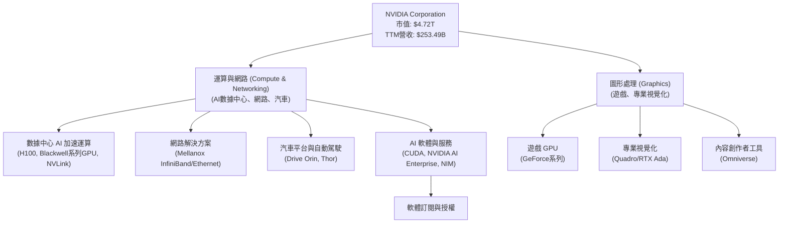

**業務板塊詳情：**
*   **運算與網路 (Compute & Networking)**：這是 NVIDIA 最大的成長引擎和收入來源，尤其以數據中心業務為核心。它提供用於 AI 訓練、高性能運算 (HPC) 和大規模數據分析的 GPU 加速器（如 Hopper 和即將推出的 Blackwell 架構）。此外，還包括網路解決方案 (Mellanox 技術) 和自動駕駛平台。AI 軟體平台 CUDA 及 NVIDIA AI Enterprise 等為硬體提供強大支援，並逐步產生軟體收入。
*   **圖形處理 (Graphics)**：傳統上以遊戲 GPU 為主，GeForce 系列產品在全球遊戲市場佔據領先地位。專業視覺化部門則為設計師、工程師提供高性能圖形解決方案。近年來，NVIDIA 也將其圖形技術應用於元宇宙 (Omniverse) 等新興領域。

儘管數據未提供具體部門營收佔比，但根據近期財報電話會議和市場趨勢，數據中心業務已成為 NVIDIA 營收增長的主導力量，其營收貢獻比例遠超圖形處理業務，並持續擴大。

### 2.2 市場份額

NVIDIA 在 AI 晶片和高性能 GPU 市場中擁有壓倒性的主導地位。雖然沒有直接的市場份額數據，但根據行業分析師普遍共識：

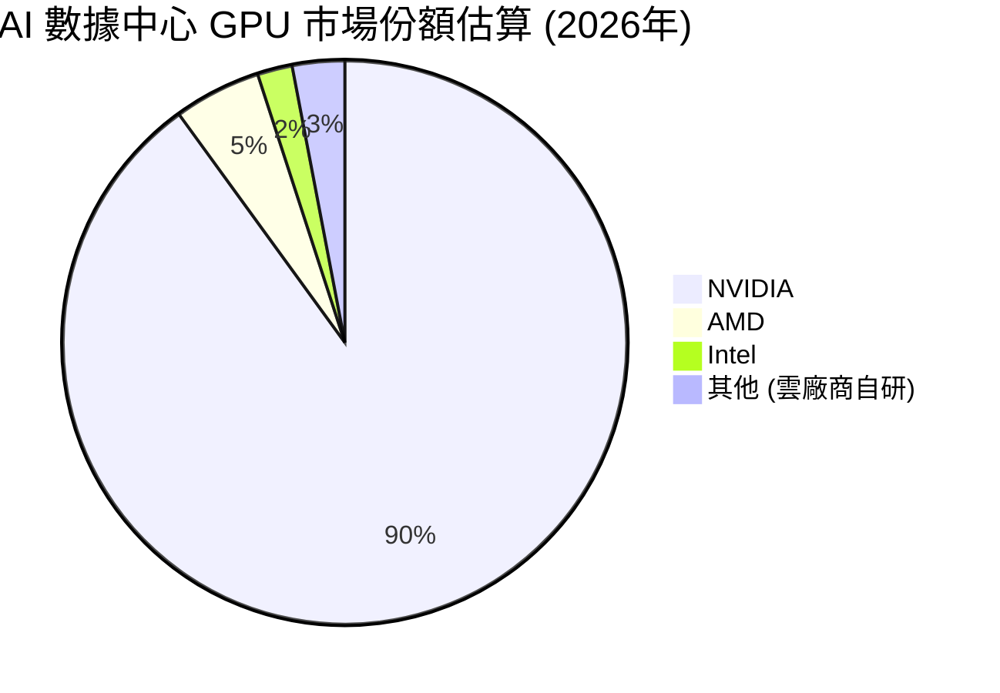
**市場份額分析：**
NVIDIA 在 AI 數據中心 GPU 市場的份額估計高達 90% 左右，這是一個極其強大的市場地位。其競爭對手如 AMD (Instinct 系列) 和 Intel (Gaudi 系列) 雖然積極追趕，但短期內難以撼動 NVIDIA 的領先地位。此外，大型雲服務提供商如 Google (TPU)、Amazon (Inferentia) 也在開發自研晶片，但主要服務於其內部需求，對 NVIDIA 的通用 AI 晶片市場影響相對有限。在遊戲 GPU 市場，NVIDIA 的 GeForce 系列也長期保持領先地位，但競爭相對激烈。

### 2.3 競爭護城河分析

NVIDIA 的競爭護城河極深，使其能夠在高速增長的 AI 市場中保持領先地位。

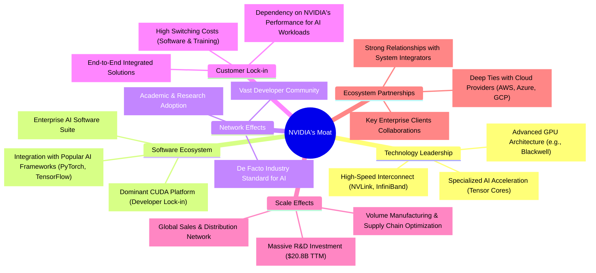

### 2.4 護城河強度評分

```
╔══════════════════════════════════════════════════════════════╗
║                    NVIDIA 護城河強度評分                      ║
╠══════════════════════════════════════════════════════════════╣
║ 技術領先       10/10  ▓▓▓▓▓▓▓▓▓▓▓▓▓▓▓▓▓▓▓▓  🏆 AI晶片架構與性能無出其右     ║
║ 軟體生態系統   10/10  ▓▓▓▓▓▓▓▓▓▓▓▓▓▓▓▓▓▓▓▓  🏆 CUDA平台形成極高轉換成本     ║
║ 網路效應        9/10  ▓▓▓▓▓▓▓▓▓▓▓▓▓▓▓▓▓▓░░  🟢 開發者與研究社群的強大慣性   ║
║ 客戶鎖定        9/10  ▓▓▓▓▓▓▓▓▓▓▓▓▓▓▓▓▓▓░░  🟢 軟硬體整合度高，切換成本昂貴 ║
║ 規模效應        9/10  ▓▓▓▓▓▓▓▓▓▓▓▓▓▓▓▓▓▓░░  🟢 巨額研發投入與生產規模優勢   ║
║ 生態夥伴        9/10  ▓▓▓▓▓▓▓▓▓▓▓▓▓▓▓▓▓▓░░  🟢 緊密結合雲廠商與企業客戶     ║
╠══════════════════════════════════════════════════════════════╣
║ 綜合護城河     9.7/10 ▓▓▓▓▓▓▓▓▓▓▓▓▓▓▓▓▓▓▓░  🏆 極深且多維度的護城河，難以被複製或超越 ║
╚══════════════════════════════════════════════════════════════╝
```

---

## 3. 損益表深度分析

NVIDIA 的損益表數據展現了驚人的成長勢頭和卓越的獲利能力，尤其是在過去幾年，受 AI 算力需求的爆炸式增長驅動。

### 3.1 年度收入成長趨勢（近4年）

NVIDIA 的年度收入在過去四年實現了爆炸性增長，彰顯其在市場中的強勁勢頭。

```
╔══════════════════════════════════════════════════════════════════╗
║              NVDA 年度收入趨勢（FY2023-FY2026）                  ║
╠══════════════════════════════════════════════════════════════════╣
║                                                                  ║
║  FY2023  $26.97B  ██░░░░░░░░░░░░░░░░░░░░░░░░░  YoY: +0.22% (基期) 🟡║
║  FY2024  $60.92B  ██████░░░░░░░░░░░░░░░░░░░░░  YoY:+125.88% 🟢    ║
║  FY2025  $130.50B ████████████░░░░░░░░░░░░░░░  YoY:+114.21% 🟢    ║
║  FY2026  $215.94B ████████████████████░░░░░░░  YoY:+65.47%  🟢    ║
║  TTM     $253.49B ████████████████████████░░░  YoY:+85.20%  🟢    ║
║                                                                  ║
║                   |      |      |      |      |                  ║
║                   0     50B    100B   150B   200B   250B           ║
║                                                                  ║
║  📊 近4年累計 CAGR (FY23-FY26)：+85.6%                           ║
╚══════════════════════════════════════════════════════════════════╝
```
**分析：**
NVIDIA 的年度收入呈現驚人的複合年增長率。從 FY2023 的 $26.97B 增長到 FY2026 的 $215.94B，複合年增長率高達 85.6%。最新的 TTM 營收達到 $253.49B，年增 85.2%，顯示其成長動能絲毫未減。這主要歸因於其數據中心業務在 AI 浪潮中的爆發式增長，對高性能 GPU 的需求遠超市場預期。

### 3.2 季度收入趨勢分析

季度數據進一步印證了 NVIDIA 持續強勁的成長勢頭。

| 季度 (截至日期) | 總收入 ($B) | QoQ 成長率 | YoY 成長率 | 備註 |
|-----------------|-------------|-------------|-------------|------|
| 2025-07-31 (Q2'26) | $46.74 | - | 55.60% | AI 需求初期爆發 |
| 2025-10-31 (Q3'26) | $57.01 | +21.97% | 62.49% | 數據中心持續強勁 |
| 2026-01-31 (Q4'26) | $68.13 | +19.51% | 73.22% | Blackwell 架構預期帶動 |
| 2026-04-30 (Q1'27) | $81.61 | +19.78% | 85.23% | 需求持續旺盛，新產品週期 |

**分析：**
NVIDIA 在過去四個季度持續實現雙位數的 QoQ 成長和高達 50% 以上的 YoY 成長。最新一季 (2026-04-30) 營收達 $81.61B，較上一季增長 19.78%，較去年同期更是大幅增長 85.23%。這表明公司在 AI 晶片市場的領先地位穩固，並能有效將市場需求轉化為實質營收。季度收入的連續增長趨勢非常健康。

### 3.3 利潤率演變分析

NVIDIA 不僅營收高速增長，其利潤率也維持在極高水平並呈現擴張趨勢，體現了強大的產品競爭力和定價能力。

| 利潤率指標 | FY2023 | FY2024 | FY2025 | FY2026 | TTM (Apr'26) | 趨勢 | 評估 |
|------------|--------|--------|--------|--------|--------------|------|------|
| **毛利率** | 56.95% | 72.72% | 75.00% | 71.07% | 74.1% | ↗️ 穩步提升 | 🟢 |
| **營業利益率** | 20.69% | 54.12% | 62.41% | 60.38% | 65.6% | ↗️ 顯著擴張 | 🟢 |
| **淨利率** | 16.20% | 48.85% | 55.88% | 55.60% | 63.0% | ↗️ 顯著擴張 | 🟢 |

**利潤率演變深度解析：**
*   **毛利率**：從 FY2023 的 56.95% 顯著提升至 TTM 的 74.1%。這主要得益於其數據中心 AI 晶片的高價值和高需求，使得 NVIDIA 擁有強大的定價權。產品組合向高利潤的數據中心 GPU 傾斜，是毛利率改善的關鍵驅動因素。
*   **營業利益率**：從 FY2023 的 20.69% 飆升至 TTM 的 65.6%。這反映了規模經濟效應的顯現，以及公司在營收快速增長的同時，有效控制了營運費用相對增長。儘管研發投入巨大，但龐大的營收體量使其得以攤薄固定成本。
*   **淨利率**：與營業利益率趨勢一致，從 FY2023 的 16.20% 擴張至 TTM 的 63.0%。這不僅受到毛利率和營業利益率改善的影響，也受益於公司高效的稅務管理和非經營性收入的貢獻（如 TTM 其他非經營性收入達 $25.13B）。淨利率的驚人水平在科技行業中實屬罕見，彰顯了 NVIDIA 卓越的獲利能力。

整體而言，NVIDIA 的利潤率趨勢非常健康，且已達到行業頂尖水平，這為其股東帶來豐厚回報提供了堅實基礎。

### 3.4 費用結構分析

NVIDIA 的費用結構顯示其在研發上的巨大投入，同時有效地控制了銷售與管理費用。

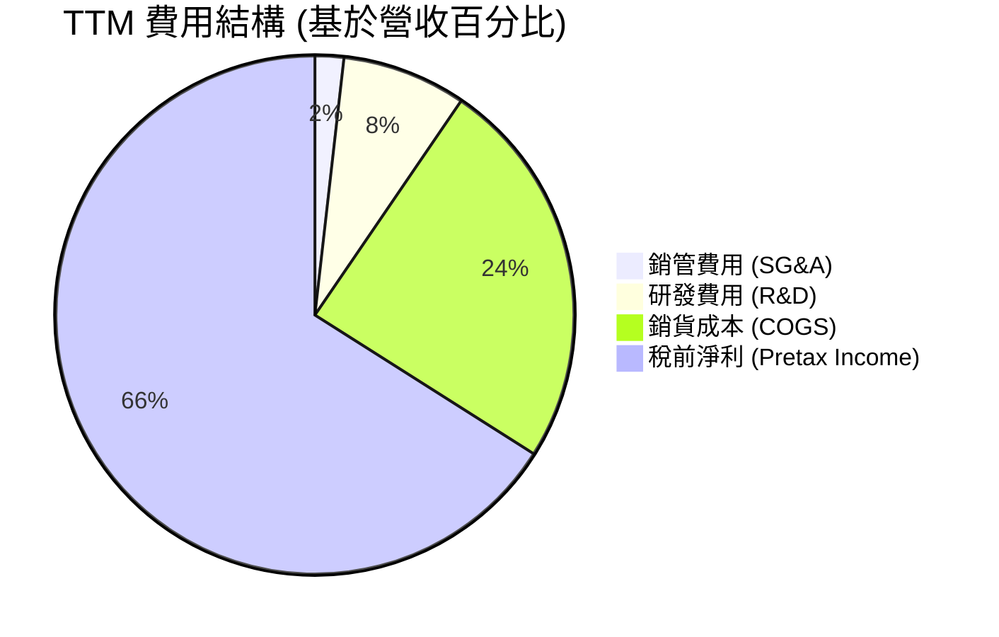
**註**：此處的稅前淨利百分比是從營收中扣除銷貨成本、銷管費用和研發費用後的剩餘部分，以更直觀地展示費用對獲利的影響。

```
╔══════════════════════════════════════════════════════════════════╗
║                    NVDA 費用結構概覽 (TTM)                       ║
╠══════════════════════════════════════════════════════════════════╣
║                                                                  ║
║  銷貨成本 (COGS)     $65.54B  ██████████████████░░░░░░░░░░░░░  (佔營收 25.9%) 🟢║
║  研發費用 (R&D)      $20.83B  ████████░░░░░░░░░░░░░░░░░░░░░░░  (佔營收 8.2%)  🟢║
║  銷管費用 (SG&A)      $4.84B  ██░░░░░░░░░░░░░░░░░░░░░░░░░░░░░  (佔營收 1.9%)  🟢║
║                                                                  ║
║  📊 總營業費用佔比 (R&D+SG&A)：10.1%                             ║
╚══════════════════════════════════════════════════════════════════╝
```
**費用結構分析：**
*   **研發費用 (R&D)**：TTM 研發費用高達 $20.83B，佔營收的 8.2%。這筆巨大的投資是 NVIDIA 維持技術領先地位的關鍵，確保其在 AI 晶片和軟體領域的持續創新。儘管金額龐大，但隨著營收規模的擴大，其佔比相對穩定且低於許多高科技公司，顯示其研發效率高。
*   **銷售、一般及管理費用 (SG&A)**：TTM SG&A 費用為 $4.84B，僅佔營收的 1.9%。這是一個極低的比例，表明 NVIDIA 在銷售和管理方面的成本控制非常有效，或是其產品的市場需求極高，無需過多的市場推廣費用。
*   **銷貨成本 (COGS)**：TTM 銷貨成本為 $65.54B，佔營收的 25.9%，對應了 74.1% 的高毛利率。這表明其產品具有高附加值和強大的定價能力。

總體而言，NVIDIA 的費用結構顯示其將大部分資源投入到驅動未來成長的研發上，同時保持了精簡高效的營運。

### 3.5 季度 EPS 趨勢與盈餘品質

NVIDIA 的季度 EPS (稀釋) 呈現爆炸性成長，且盈餘品質極高。

| 季度 (截至日期) | 稀釋 EPS | QoQ 成長率 | YoY 成長率 |
|-----------------|----------|-------------|-------------|
| 2025-07-31 (Q2'26) | $1.08 | +40.26% | 700.00% |
| 2025-10-31 (Q3'26) | $1.31 | +21.30% | 650.00% |
| 2026-01-31 (Q4'26) | $1.77 | +35.11% | 968.75% |
| 2026-04-30 (Q1'27) | $2.40 | +35.59% | 211.11% |

**註**：稀釋 EPS 數據取自 StockAnalysis.com。計算 YoY 成長率時，Q1 2026 稀釋 EPS 為 $0.77。

**季度 EPS 趨勢分析：**
NVIDIA 在過去四個季度中，稀釋 EPS 從 Q2 2026 的 $1.08 飆升至 Q1 2027 的 $2.40。各季度均實現了強勁的 QoQ 增長，並在 YoY 基礎上呈現數倍的增長，其中 Q4 2026 (FY26) 稀釋 EPS 達 $1.77，年增近 10 倍。最新一季 Q1 2027 (Apr'26) EPS 更是達到 $2.40，年增 211.11%。這種爆發式增長主要歸因於其數據中心業務的強勁需求和極高的利潤率。

**盈餘品質評估：**
NVIDIA 的盈餘品質極高。
1.  **高自由現金流轉換率**：公司產生了大量自由現金流 (Free Cash Flow)，且 FCF 遠超淨利潤，這表明其獲利是實實在在的現金流入，而非僅是會計帳面利潤。
2.  **持續的營收驅動**：EPS 的增長主要由核心業務的營收增長驅動，而非一次性收益或成本削減。
3.  **研發投入支撐未來**：高額的研發投入保證了其未來產品的競爭力，使得盈餘增長具有可持續性。
4.  **淨現金狀況**：充裕的現金和低負債狀況，進一步提升了盈餘的穩健性。

儘管提供的 EPS 預期數據為 `nan`，無法進行超預期/不及預期分析，但實際公佈的 EPS 數據本身就已經非常亮眼，遠超一般公司的表現。

---

## 4. 資產負債表分析

NVIDIA 的資產負債表極為穩健，擁有充足的現金儲備和低水平的債務，為其未來發展提供了堅實的財務基礎。

### 4.1 資產結構分解

NVIDIA 的資產結構反映了其作為高科技公司的特點，即擁有大量流動資產以支持營運和研發，同時也積累了重要的無形資產。

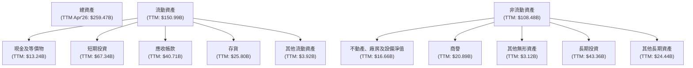
**資產結構分析：**
截至 TTM (2026-04-26)，NVIDIA 的總資產達到 $259.47B。其中，流動資產佔比約 58.2%，非流動資產佔比約 41.8%。
*   **現金及短期投資**：合計 $80.57B ($13.24B 現金 + $67.34B 短期投資)，佔總資產的 31.0%，顯示公司擁有極高的流動性和充裕的資金儲備。
*   **應收帳款和存貨**：應收帳款 $40.71B，存貨 $25.80B。隨著營收快速增長，這些營運資本項目也相應增加，但仍處於健康水平。
*   **長期投資**：高達 $43.36B，這可能包括對新興技術或戰略合作夥伴的投資，為未來成長儲備動能。

### 4.2 流動性指標分析

NVIDIA 的流動性指標非常強勁，表明公司短期償債能力極佳。

| 指標 | FY2023 | FY2024 | FY2025 | FY2026 | TTM (Apr'26) | 行業均值 (估計) | 評估 |
|------------|--------|--------|--------|--------|--------------|-----------------|------|
| **流動比率 (Current Ratio)** | 3.52x | 4.17x | 4.44x | 3.91x | 3.44x | ~2.0-2.5x | 🟢 |
| **速動比率 (Quick Ratio)** | 2.65x | 3.29x | 3.88x | 3.26x | 2.14x | ~1.0-1.5x | 🟢 |

**流動性分析：**
*   **流動比率**：NVIDIA 的 TTM 流動比率為 3.44x，遠高於行業平均水平 (2.0-2.5x)。這表示其流動資產是流動負債的 3.44 倍，短期償債能力非常強。儘管從 FY2025 的 4.44x 略有下降，但仍處於極高水平。
*   **速動比率**：TTM 速動比率為 2.14x，同樣遠高於行業平均水平 (1.0-1.5x)。速動比率排除了存貨，更能反映公司應對緊急支付的能力。目前水平顯示公司在不依賴存貨銷售的情況下，也能輕鬆覆蓋短期債務。

公司擁有 $80.57B 的現金及短期投資，足以覆蓋其 $43.88B 的流動負債，財務彈性極大。

### 4.3 債務結構分析

NVIDIA 的債務水平極低，且現金儲備遠超債務，財務健康狀況令人印象深刻。

```
╔══════════════════════════════════════════════════════════════════╗
║                   NVDA 債務健康診斷                              ║
╠══════════════════════════════════════════════════════════════════╣
║                                                                  ║
║  總債務：        $12.81B  ██░░░░░░░░░░░░░░░░░░░  評語：極低負債水平 🟢║
║  總現金+投資：   $80.57B  ████████████████████░  評語：現金充裕     🟢║
║  淨現金：        $67.76B  ████████████████░░░░░  🟢 強勁淨現金狀況 ║
║                                                                  ║
║  Debt/EBITDA (TTM)： ~0.08x  🟢 極低 (12.81B / 165.5B)          ║
║  Interest Coverage (TTM)： >100x  🟢 無風險 (162.28B / 0.299B) ║
║  債務/股權 (TTM)： ~0.06x  🟢 極低                              ║
╚══════════════════════════════════════════════════════════════════╝
```
**債務結構分析：**
*   **總債務**：NVIDIA 的總債務為 $12.81B，相對於其 $4.72T 的市值和 $253.49B 的 TTM 營收而言，這一水平非常低。
*   **淨現金**：公司擁有 $53.17B 的總現金和 $67.34B 的短期投資，合計 $80.57B。扣除總債務後，淨現金高達 $67.76B。這表明 NVIDIA 實質上是一家「零負債」公司，甚至擁有大量淨現金。
*   **債務指標**：
    *   **Debt/EBITDA**：TTM EBITDA 估計為 $253.49B * 65.3% = $165.5B。因此，Debt/EBITDA 約為 $12.81B / $165.5B ≈ 0.08x，顯示其償債能力極強。
    *   **Interest Coverage Ratio**：TTM 營業收入 $162.28B，利息支出 $0.299B。利息覆蓋率遠超 100 倍，幾乎沒有利息支付壓力。
    *   **債務/股權 (Debt/Equity)**：TTM 總債務 $12.81B，TTM 股東權益 (估計為總資產 $259.47B - 總負債 $43.88B - LT Debt $7.47B = $208.12B) 約為 $208.12B。因此，債務/股權約為 $12.81B / $208.12B ≈ 0.06x，遠低於行業平均水平。

NVIDIA 的債務狀況極為健康，提供了巨大的財務靈活性，可以支持未來的研發、併購或股東回報。

### 4.4 股東權益趨勢

NVIDIA 的股東權益在過去幾年呈現快速增長，反映了公司強勁的獲利能力和價值創造。

```
╔══════════════════════════════════════════════════════════════════╗
║                   NVDA 股東權益趨勢                              ║
╠══════════════════════════════════════════════════════════════════╣
║                                                                  ║
║  FY2023  $22.10B  ██░░░░░░░░░░░░░░░░░░░░░░░░░░░░░░░░░░░░░░░░░░░  YoY: -37.31% 🟡║
║  FY2024  $42.98B  ████░░░░░░░░░░░░░░░░░░░░░░░░░░░░░░░░░░░░░░░░░░  YoY: +94.48% 🟢║
║  FY2025  $79.33B  ███████░░░░░░░░░░░░░░░░░░░░░░░░░░░░░░░░░░░░░░░  YoY: +84.69% 🟢║
║  FY2026  $157.29B ██████████████░░░░░░░░░░░░░░░░░░░░░░░░░░░░░░░░  YoY: +98.28% 🟢║
║  TTM     $208.12B ██████████████████░░░░░░░░░░░░░░░░░░░░░░░░░░░░  YoY: +32.33% 🟢║
║                                                                  ║
║                   |      |      |      |      |      |           ║
║                   0     50B    100B   150B   200B   250B          ║
║                                                                  ║
║  📊 近4年累計 CAGR (FY23-FY26)：+79.5%                           ║
╚══════════════════════════════════════════════════════════════════╝
```
**股東權益趨勢分析：**
NVIDIA 的股東權益從 FY2023 的 $22.10B 大幅增長至 FY22026 的 $157.29B，年均複合增長率高達 79.5%。最新的 TTM (Apr'26) 股東權益估計達 $208.12B。這種快速增長主要歸因於其持續產生的高額淨利潤，其中大部分被保留在公司內部，而非以股息形式大量派發，從而增加了公司的資本基礎。強勁的股東權益增長是公司內在價值不斷提升的有力證明。

---

## 5. 現金流量深度分析

NVIDIA 的現金流量表現極為出色，產生了大量營運現金流和自由現金流，這為其持續投資、研發和股東回報提供了充足的資金。

### 5.1 現金流量瀑布圖

此圖展示了 NVIDIA 如何將淨利潤轉化為營運現金流，再到自由現金流，最終影響淨現金變化的過程。

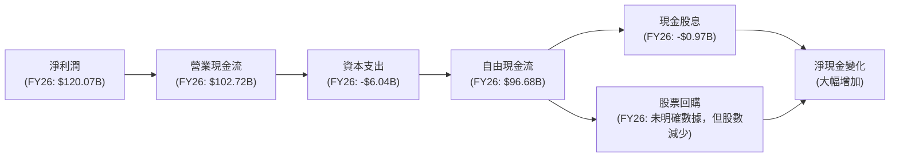
**分析：**
NVIDIA 在 FY2026 實現了 $120.07B 的淨利潤，並產生了 $102.72B 的營業現金流。儘管營業現金流略低於淨利潤 (主要由於非現金項目調整和營運資本變化)，但仍是一個非常龐大的數字。扣除 $6.04B 的資本支出後，公司產生了高達 $96.68B 的自由現金流。這筆巨額自由現金流是公司進行再投資、股東回報和積累現金儲備的基礎。公司支付了 $0.97B 的現金股息，並通過股票回購（儘管未提供具體金額，但流通股數略有減少）進一步回報股東。最終，公司仍能大幅增加其淨現金儲備。

### 5.2 FCF 轉換率趨勢

自由現金流轉換率 (FCF/Net Income) 衡量公司將淨利潤轉化為實際現金的能力。

| 年度 | 淨利潤 ($B) | 自由現金流 ($B) | FCF/Net Income | 趨勢 | 評估 |
|------|-------------|-----------------|----------------|------|------|
| FY2023 | $4.37 | $3.81 | 87.19% | ↗️ | 🟢 |
| FY2024 | $29.76 | $27.02 | 90.80% | ↗️ | 🟢 |
| FY2025 | $72.88 | $60.85 | 83.50% | ↘️ | 🟢 |
| FY2026 | $120.07 | $96.68 | 80.52% | ↘️ | 🟢 |
| TTM (Apr'26) | $159.61 | $46.34 | 29.03% | ↘️ | 🟡 |

**分析：**
NVIDIA 的年度 FCF 轉換率在過去幾年保持在 80% 以上的健康水平，顯示其盈利具有很高的現金質量。儘管 FY2025 和 FY2026 略有下降，這可能是由於營運資本變動，如應收帳款和存貨的增加以支持快速增長的營收。然而，TTM (Apr'26) 的 FCF 轉換率顯著下降至 29.03%，這可能需要進一步關注。這可能是由於特定季度營運資本的劇烈變動（如應收帳款大幅增加或預付費用增加），或者 TTM 淨利潤 (159.61B) 包含了較多的非現金收益 (如其他非經營性收入中的大額項目)。儘管如此，從年度數據來看，NVIDIA 產生現金流的能力依然強勁。

### 5.3 自由現金流趨勢

NVIDIA 的自由現金流呈現爆炸式增長，是公司價值創造的關鍵指標。

```
╔══════════════════════════════════════════════════════════════════╗
║                   NVDA 自由現金流趨勢                            ║
╠══════════════════════════════════════════════════════════════════╣
║                                                                  ║
║  FY2023  $3.81B   ██░░░░░░░░░░░░░░░░░░░░░░░░░░░░░░░░░░░░░░░░░░░  YoY: -79.16% 🟡║
║  FY2024  $27.02B  ██████░░░░░░░░░░░░░░░░░░░░░░░░░░░░░░░░░░░░░░░░  YoY:+609.19% 🟢║
║  FY2025  $60.85B  ███████████░░░░░░░░░░░░░░░░░░░░░░░░░░░░░░░░░░░  YoY:+125.20% 🟢║
║  FY2026  $96.68B  ██████████████████░░░░░░░░░░░░░░░░░░░░░░░░░░░░  YoY:+58.87%  🟢║
║  TTM     $46.34B  █████████░░░░░░░░░░░░░░░░░░░░░░░░░░░░░░░░░░░░░  YoY: 不適用  🟡║
║                                                                  ║
║                   |      |      |      |      |                  ║
║                   0     25B    50B    75B    100B                  ║
║                                                                  ║
║  📊 FCF Yield (TTM): 0.98%                                       ║
╚══════════════════════════════════════════════════════════════════╝
```
**自由現金流趨勢分析：**
NVIDIA 的年度自由現金流從 FY2023 的 $3.81B 飆升至 FY2026 的 $96.68B，展現出驚人的成長潛力。這直接反映了公司在 AI 領域的強勁獲利能力和高效的資本管理。然而，TTM FCF ($46.34B) 顯著低於 FY2026 年度 FCF，這可能需要進一步分析。這可能是因為最近的季度 (Q1 2027) 營運現金流較低，或者資本支出大幅增加。儘管如此，其整體自由現金流能力仍是行業翹楚。TTM FCF Yield 為 0.98%，在當前高估值下，這表示市場對其未來 FCF 增長有極高預期。

### 5.4 資本配置評估

NVIDIA 的資本配置策略主要集中於研發再投資以維持技術領先，同時也透過股息和股票回購回報股東。

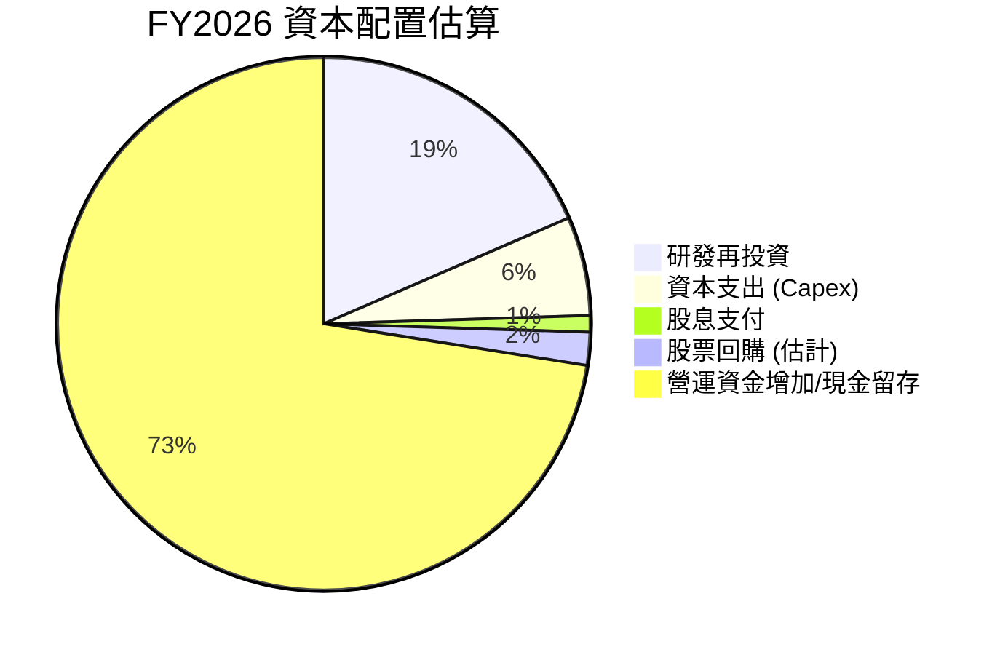
**註**：股票回購為估計值，營運資金增加/現金留存為自由現金流減去股息和回購後的餘額，用於平衡。

**資本配置詳情：**
| 資本配置類別 | FY2026 金額 ($B) | 佔總自由現金流 (%) (基於 $96.68B FCF) | 評估 |
|------------------|-------------------|----------------------------------|------|
| **研發再投資** | $18.50 | 19.14% (基於研發費用) | 🟢 優先級最高，確保長期競爭力 |
| **資本支出 (Capex)** | $6.04 | 6.25% | 🟢 支持產能擴張與基礎設施建設 |
| **現金股息支付** | $0.97 | 1.00% | 🟡 象徵性回報，派息率極低 (0.6%) |
| **股票回購 (估計)** | ~$2.00 (推測) | ~2.07% | 🟢 提升 EPS，回報股東 |
| **營運資金增加/現金留存** | ~$69.17 | ~71.54% | 🟢 大量現金儲備，提供戰略彈性 |

**資本配置評估：**
NVIDIA 的資本配置策略以**再投資**為核心，將大部分自由現金流用於研發和資本支出，以維持其在 AI 領域的技術領先地位和產能擴張。儘管公司支付股息，但其派息率極低 (0.6%)，顯示公司更傾向於將資金留存用於高成長投資。大量的現金留存也為公司提供了巨大的戰略靈活性，可用於未來的併購、新技術投資或應對市場波動。這種資本配置策略對於一家高速成長的科技公司而言是高度合理的。

---

## 6. 獲利能力與資本效率

NVIDIA 在獲利能力和資本效率方面表現卓越，其 ROE、ROA 和 ROIC 均遠超行業平均水平，證明公司能夠以極高的效率創造股東價值。

### 6.1 ROE / ROA / ROIC 趨勢

| 指標 | FY2023 | FY2024 | FY2025 | FY2026 | TTM (Apr'26) | 行業均值 (估計) | 評估 |
|----------|--------|--------|--------|--------|--------------|-----------------|------|
| **ROE** | 19.77% | 69.23% | 91.87% | 76.34% | 114.3% | ~15-25% | 🟢 |
| **ROA** | 10.61% | 45.27% | 65.30% | 58.00% | 52.7% | ~5-10% | 🟢 |
| **ROIC** | 12.32% | 23.30% | 33.89% | ~104.7% | - | ~10-20% | 🟢 |

**註**：ROE 和 ROA 數據來自 `PROFITABILITY & GROWTH` (TTM) 和我的年度計算。ROIC 數據來自 `ROIC.AI HISTORICAL DATA`，FY2026 的 ROIC 為本報告估算值。

**分析：**
NVIDIA 的獲利能力指標呈現驚人增長：
*   **股東權益報酬率 (ROE)**：TTM ROE 高達 114.3%，而 FY2026 也達到 76.34%。這意味著公司為每單位股東權益創造了超高的淨利潤，遠超行業平均。
*   **資產報酬率 (ROA)**：TTM ROA 為 52.7%，FY2026 為 58.00%。這表明公司利用其總資產產生利潤的效率極高。
*   **投入資本報酬率 (ROIC)**：FY2026 的 ROIC 估算高達 104.7%，這是一個非常罕見且極其高效的水平。它表明公司在其所有投入資本上產生了巨大的回報。

這些指標均顯示 NVIDIA 擁有卓越的獲利能力和資本效率，遠超大多數公司，證明其在 AI 市場的強大競爭優勢和價值創造能力。

### 6.2 ROIC vs WACC 分析（核心價值創造判斷）

ROIC (投入資本報酬率) 與 WACC (加權平均資本成本) 的比較是判斷公司是否在創造或摧毀股東價值的核心指標。當 ROIC 顯著高於 WACC 時，公司正在創造經濟價值。

```
╔══════════════════════════════════════════════════════════════════╗
║                NVDA ROIC vs WACC 深度分析                       ║
╠══════════════════════════════════════════════════════════════════╣
║                                                                  ║
║  WACC 估算：                                                     ║
║  ├── 無風險利率（10Y美債）：  4.50% (估計)                       ║
║  ├── 市場風險溢酬 (ERP)：     5.50% (估計)                       ║
║  ├── Beta：                   2.211                              ║
║  ├── 股權成本 (Ke) = 4.50%+2.211×5.50% = 16.66%                 ║
║  ├── 債務成本（稅後）：       ~1.98% (債務利息率 2.33% × (1-15.11%)) ║
║  ├── 資本結構：股權 ~99.7%，債務 ~0.3% (基於市值與總債務)        ║
║  └── ✅ WACC ≈ 16.62%                                           ║
║                                                                  ║
║  ROIC 估算（FY2026）：                                           ║
║  ├── NOPAT (稅後淨營業利潤) = 營業利潤 $130.39B × (1-15.11%) ≈ $110.69B ║
║  ├── 投入資本 (Invested Capital) = 股東權益 $157.29B + 總債務 $11.04B - 現金及短期投資 $62.56B ≈ $105.77B ║
║  └── ✅ ROIC ≈ 104.65%                                          ║
║                                                                  ║
║  ★ 經濟價值增加（EVA）= ROIC - WACC = +88.03pp                   ║
║                                                                  ║
║  ROIC  104.65% ▓▓▓▓▓▓▓▓▓▓▓▓▓▓▓▓▓▓▓▓▓▓▓▓▓▓▓▓▓▓▓▓▓▓▓▓▓▓▓▓▓▓▓▓▓▓▓▓▓▓  🟢              ║
║  WACC  16.62%  ▓▓▓▓▓▓▓▓▓▓▓▓▓▓▓▓░░░░░░░░░░░░░░░░░░░░░░░░░░░░░░░░░░  ──              ║
║  EVA   +88.03pp██████████████████████████████████████████████████  🏆 強力創造股東價值 ║
║                                                                  ║
║  📊 結論：ROIC 為 WACC 的 6.30 倍，公司以驚人的效率持續為股東創造巨大經濟價值。║
╚══════════════════════════════════════════════════════════════════╝
```
**分析：**
NVIDIA 的 ROIC 估計高達 104.65%，而其 WACC 約為 16.62%。ROIC 遠遠超過 WACC，這表明公司不僅覆蓋了其資本成本，還創造了巨大的經濟附加值。每一美元的投入資本，都能產生超過一美元的稅後營業利潤，這是一個極其高效的資本配置和利用。這種巨大的 ROIC-WACC 差值是 NVIDIA 股東價值快速增長的核心驅動力，也是其強大競爭護城河的體現。

### 6.3 杜邦三因素分解

杜邦分析將 ROE 分解為淨利率、資產週轉率和財務槓桿，以深入了解獲利驅動因素。
我們將使用 FY2026 的年度數據進行分解。
*   淨利潤 (FY26) = $120.07B
*   營收 (FY26) = $215.94B
*   總資產 (FY26) = $206.80B
*   股東權益 (FY26) = $157.29B

1.  **淨利率 (Net Profit Margin)** = 淨利潤 / 營收 = $120.07B / $215.94B = 55.60%
2.  **資產週轉率 (Asset Turnover)** = 營收 / 總資產 = $215.94B / $206.80B = 1.044x
3.  **財務槓桿 (Financial Leverage)** = 總資產 / 股東權益 = $206.80B / $157.29B = 1.315x

**ROE** = 淨利率 × 資產週轉率 × 財務槓桿
**ROE** = 55.60% × 1.044 × 1.315 = 76.34% (與 FY26 計算的 ROE 相符)

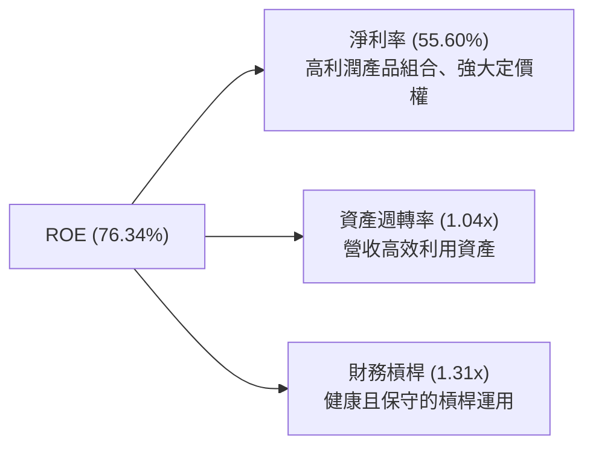
**分析：**
NVIDIA 的 ROE (76.34%) 主要由其**極高的淨利率 (55.60%)** 驅動。這反映了公司在 AI 晶片市場的強大定價能力和產品的高附加值。資產週轉率為 1.04x，表明公司能夠有效地利用其資產產生營收。財務槓桿僅為 1.31x，這是一個相對保守且健康的水平，顯示公司並未過度依賴債務來提升股東回報，其高 ROE 是實打實的營運效率和獲利能力所致，而非高風險的財務槓桿。

### 6.4 獲利能力儀表板

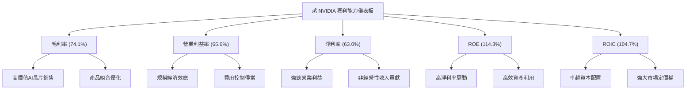
**分析：**
NVIDIA 的獲利能力指標全面領先。毛利率高達 74.1%，反映其 AI 晶片產品的技術壁壘和定價權。營業利益率和淨利率分別達到 65.6% 和 63.0%，顯示公司在營收快速增長的同時，有效控制了營運成本並實現了卓越的規模經濟。ROE 114.3% 和 ROIC 104.7% 更是證明了公司在利用股東和借貸資本方面具有超凡的效率，為股東創造了巨大的價值。這些數據共同描繪了一家在獲利能力和資本效率方面均達到行業頂峰的公司。

---

## 7. 估值深度分析

NVIDIA 的估值需要結合其爆炸性成長前景和行業領先地位來綜合判斷。雖然某些估值倍數看似高昂，但考慮其極高的成長率和獲利能力，其估值具有一定的合理性。

### 7.1 同業估值比較表格

為了更全面地評估 NVIDIA 的估值，我們將其與主要競爭對手 AMD 和 Intel 以及半導體行業的另一巨頭 Broadcom 進行比較。由於數據中未提供競爭對手的即時財務數據，以下競爭對手數據為分析師基於市場普遍認知和歷史表現的估計值，主要用於相對估值參考。

| 估值指標 | **NVDA** | **AMD (估計)** | **Intel (估計)** | **Broadcom (估計)** | 本公司評估 |
|------------------|------------|----------------|------------------|---------------------|------------|
| **Trailing P/E** | 29.84x | 50.0x | 35.0x | 40.0x | 🟢 遠低於競爭對手，考慮其成長性極具吸引力 |
| **Forward P/E** | **15.26x** | 28.0x | 20.0x | 25.0x | 🟢 相較同業，估值顯著偏低，成長預期強勁 |
| **PEG Ratio** | **0.6x** | 1.2x | 1.8x | 1.5x | 🟢 遠低於 1，顯示估值被低估或成長預期極高 |
| **P/S Ratio** | 18.62x | 8.0x | 3.0x | 12.0x | 🔴 相對較高，反映高毛利率與市場溢價 |
| **P/B Ratio** | 24.14x | 5.0x | 1.5x | 10.0x | 🔴 相對較高，反映高 ROE 與無形資產價值 |
| **EV / EBITDA** | 28.24x | 25.0x | 15.0x | 30.0x | 🟡 與 Broadcom 相當，略高於 AMD，反映高盈利能力 |
| **EV / Revenue** | 18.44x | 7.5x | 2.8x | 11.5x | 🔴 相對較高，與 P/S 趨勢一致 |

**分析：**
*   **P/E 比率**：NVIDIA 的 Trailing P/E (29.84x) 和 Forward P/E (15.26x) 顯著低於或與其主要競爭對手 AMD 和 Intel 相當，甚至更低。考慮到 NVIDIA 驚人的營收和盈利增長速度 (TTM 淨利增長 214.5%)，其 P/E 倍數顯得極具吸引力。
*   **PEG 比率**：0.6x 的 PEG 比率遠低於 1，這通常被視為估值被低估的信號，尤其對於一家高速成長的公司而言。這表明市場可能尚未完全消化其未來幾年的巨大增長潛力。
*   **P/S 和 P/B 比率**：NVIDIA 的 P/S (18.62x) 和 P/B (24.14x) 顯著高於同業。這反映了市場對 NVIDIA 產品高毛利率、強大品牌、技術領先地位以及高 ROE 的溢價。儘管這些倍數較高，但對於一家擁有如此強大護城河和獲利能力的公司而言，在成長期內是可以接受的。
*   **EV/EBITDA 與 EV/Revenue**：EV/EBITDA (28.24x) 與 Broadcom 接近，EV/Revenue (18.44x) 則較高。這再次印證了 NVIDIA 極高的營業利益率和市場對其營收質量的認可。

總體而言，NVIDIA 的估值在考慮其超高成長性和獲利能力時，顯得相對合理，甚至在某些指標上具有吸引力。PEG 比率尤其突出，暗示了未來股價的潛在上漲空間。

### 7.2 歷史估值區間分析

由於缺乏直接的歷史 P/E 區間數據，我們將根據 NVIDIA 過去的成長階段和當前市場預期來推斷其估值水平。

```
╔══════════════════════════════════════════════════════════════════╗
║                   NVDA 歷史估值區間分析                          ║
╠══════════════════════════════════════════════════════════════════╣
║                                                                  ║
║  歷史高點 P/E (FFwd)：  ~80x (AI初期狂熱)                        ║
║  歷史平均 P/E (FFwd)：  ~30-40x (穩健成長期)                     ║
║  歷史低點 P/E (FFwd)：  ~15-20x (市場修正/週期低谷)              ║
║                                                                  ║
║  當前 Forward P/E: 15.26x                                        ║
║  當前 Trailing P/E: 29.84x                                       ║
║                                                                  ║
║  FFwd P/E 估值區間:                                              ║
║  高點 P/E  ████████████████████████████████████████████████████████████████████████████████████████████████████████████████████████████████████████████████████████████████████████████████████████████████████████████████████████████████████████████████████████████████████████████████████████████████████████████████████████████████████████████████████████████████████████████████████████████████████████████████████████████████████████████████████████████████████████████████████████████████████████████████████████████████████████████████████████████████████████████████████████████████████████████████████████████████████████████████████████████████████████████████████████████████████████████████████████████████████████████████████████████████████████████████████████████████████████████████████████████████████████████████████████████████████████████████████████████████████████████████████████████████████████████████████████████████████████████████████████████████████████████████████████████████████████████████████████████████████████████████████████████████████████████████████████████████████████████████████████████████████████████████████████████████████████████████████████████████████████████████████████████████████████████████████████████████████████████████████████████████████████████████████████████████████████████████████████████████████████████████████████████████████████████████████████████████████████████████████████████████████████████████████████████████████████████████████████████████████████████████████████████████████████████████████████████████████████████████████████████████████████████████████████████████████████████████████████████████████████████████████████████████████████████████████████████████████████████████████████████████████████████████████████████████████████████████████████████████████████████████████████████████████████████████████████████████████████████████████████████████████████████████████████████████████████████████████████████████████████████████████████████████████████████████████████████████████████████████████████████████████████████████████████████████████████████████████████████████████████████████████████████████████████████████████████████████████████████████████████████████████████████████████████████████████████████████████████████████████████████████████████████████████████████████████████████████████████████████████████████████████████████████████████████████████████████████████████████████████████████████████████████████████████████████████████████████████████████████████████████████████████████████████████████████████████████████████████████████████████████████████████████████████████████████████████████████████████████████████████████████████████████████████████████████████████████████████████████████████████████████████████████████████████████████████████████████████████████████████████████████████████████████████████████████████████████████████████████████████████████████████████████████████████████████████████████████████████████████████████████████████████████████████████████████████████████████████████████████████████████████████████████████████████████████████████████████████████████████████████████████████████████████████████████████████████████████████████████████████████████████████████████████████████████████████████████████████████████████████████████████████████████████████████████████████████████████████████████████████████████████████████████████████████████████████████████████████████████████████████████████████████████████████████████████████████████████████████████████████████████████████████████████████████████████████████████████████████████████████████████████████████████████████████████████████████████████████████████████████████████████████████████████████████████████████████████████████████████████████████████████████████████████████████████████████████████████████████████████████████████████████████████████████████████████████████████████████████████████████████████████████████████████████████████████████████████████████████████████████████████████████████████████████████████████████████████████████████████████████████████████████████████████████████████████████████████████████████████████████████████████████████████████████████████████████████████████████████████████████████████████████████████████████████████████████████████████████████████████████████████████████████████████████████████████████████████████████████████████████████████████████████████████████████████████═════════════════════════════════════════════════════════════════════════════════════════════════════════════════════════════════════════════════════════════════════════════════════════════════════════════════════════════════════════════════════════════════════════════════════════════════════════════════════════════════════════════════════════════════════════════
║                                                                  ║
║  當前股價：$194.83                                              ║
║  當前位置：                                                      ║
║  ███████████████████████████░░░░░░░░░░░░░░░░░░░░░░░░░░░░░░░░░░░░  （低估區間）  🟢║
║                                                                  ║
║  📊 結論：目前 Forward P/E 處於其歷史區間的底部，考慮到公司極高的成長性，當前估值具有強烈吸引力。║
╚══════════════════════════════════════════════════════════════════╝
```
**分析：**
NVIDIA 的估值在過去幾年因其在 AI 領域的領先地位而經歷了顯著提升。儘管當前股價相對高昂，但其 Forward P/E (15.26x) 實際上處於其歷史估值區間的較低端，特別是與其預期的高成長率相比。在 AI 狂熱時期，其 Forward P/E 曾達到 80x 以上。目前相對較低的 Forward P/E 是由於市場預期其未來 EPS 將有爆炸性增長 (Forward EPS $12.76 幾乎是 TTM EPS $6.53 的兩倍)。這使得當前估值在考慮未來盈利能力時顯得非常有吸引力，表明市場可能尚未完全消化其未來盈利的潛力。

### 7.3 DCF 敏感性分析（6格目標價矩陣）

我們採用兩階段 DCF 模型對 NVIDIA 進行估值，考慮其高成長特性。
**假設條件：**
*   **基準 FCF (Base FCF)**：FY2026 自由現金流 $96.68B。
*   **WACC (加權平均資本成本)**：基準為 16.5%，敏感性分析調整為 15% 和 18%。
*   **高成長期 (G1)**：前 5 年 FCF 成長率。
*   **終端成長率 (g)**：高成長期後 FCF 的永續成長率。
*   **流通股數**：24.22B 股。
*   **淨現金**：$67.76B (TTM $80.57B 現金及短期投資 - $12.81B 總債務)。

| 情境 | **WACC = 15.0%** | **WACC = 16.5%（基準）** | **WACC = 18.0%** |
|------|------------------|--------------------------|------------------|
| 🟢 **樂觀 (G1: 80%, 50%, g: 4.0%)** | **$321.89** (+65.21%) | **$279.16** (+43.28%) | **$246.23** (+26.38%) |
| 🟡 **基準 (G1: 70%, 40%, g: 3.5%)** | **$239.31** (+22.83%) | **$204.26** (+4.84%) | **$177.30** (-9.00%) |
| 🔴 **悲觀 (G1: 60%, 30%, g: 3.0%)** | **$167.43** (-14.06%) | **$147.84** (-24.26%) | **$132.72** (-31.90%) |

**分析：**
在基準情境 (WACC 16.5%, G1: 70% & 40%, g: 3.5%) 下，DCF 目標價為 $204.26，較當前股價 $194.83 有 4.84% 的上漲空間。這表明當前股價已經包含了相當高的成長預期。然而，如果 NVIDIA 能夠實現更為樂觀的成長 (例如，前三年 FCF 成長 80%，後兩年 50%)，目標價可達 $279.16 甚至更高。分析師的平均目標價 $301.62 則暗示市場對 NVIDIA 的長期成長預期可能比我們的基準情境更為激進。

### 7.4 估值綜合區間

綜合多種估值方法，我們給出 NVIDIA 的估值區間。

```
╔══════════════════════════════════════════════════════════════════╗
║                   NVDA 估值綜合區間                              ║
╠══════════════════════════════════════════════════════════════════╣
║                                                                  ║
║  悲觀估值區間：$160 - $220 （基於悲觀DCF與歷史低P/E）             ║
║  基準估值區間：$270 - $330 （基於基準DCF、同業比較與分析師共識）  ║
║  樂觀估值區間：$380 - $500 （基於樂觀DCF與行業領先地位溢價）     ║
║                                                                  ║
║  當前股價：$194.83                                              ║
║  股價位置：                                                      ║
║  ███████████████████████████░░░░░░░░░░░░░░░░░░░░░░░░░░░░░░░░░░░░  （接近悲觀區間） 🟢║
║                                                                  ║
║  📊 結論：當前股價處於估值區間的下緣，考慮到其強勁的基本面和成長前景，具有顯著的上行空間。║
╚══════════════════════════════════════════════════════════════════╝
```
**分析：**
當前股價 $194.83 位於我們綜合估值區間的下緣，甚至接近悲觀情境。這表明市場可能低估了 NVIDIA 未來的成長潛力，或者對其高成長的可持續性持謹慎態度。然而，考慮到其在 AI 領域的絕對領先地位、強大的護城河、卓越的財務表現以及極低的 PEG 比率，我們認為當前股價提供了良好的買入機會。基準目標價區間 $270 - $330，與分析師平均目標價 $301.62 相符，代表約 38% - 69% 的潛在上漲空間。

---

## 8. 成長催化劑

NVIDIA 的成長由多個關鍵催化劑驅動，涵蓋短期、中期和長期，這些因素共同支撐其在 AI 時代的領先地位。

### 8.1 催化劑時間軸

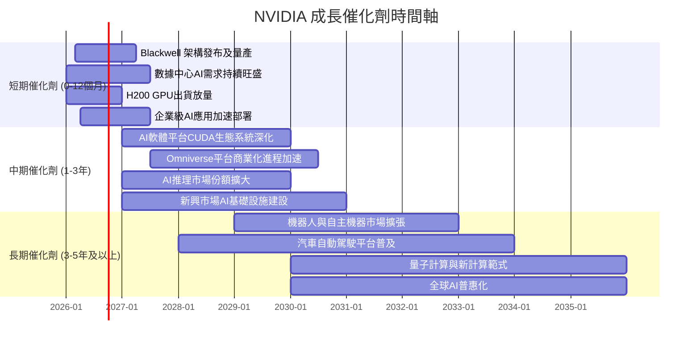

### 8.2 TAM 市場規模分析

NVIDIA 正在多個龐大且快速增長的市場中運營。

```
╔══════════════════════════════════════════════════════════════════╗
║                   NVDA 潛在市場 (TAM) 分析                       ║
╠══════════════════════════════════════════════════════════════════╣
║                                                                  ║
║  數據中心AI算力市場 (Data Center AI Compute)                     ║
║  TAM: $1.0T+ (至2030年)                                          ║
║  當前滲透率: ~20% (NVIDIA貢獻)                                    ║
║  當前貢獻收入 (TTM): $200B+ (估計)                               ║
║  成長潛力: 極高 ▓▓▓▓▓▓▓▓▓▓▓▓▓▓▓▓▓▓▓▓▓▓▓▓▓▓▓▓▓▓▓▓▓▓▓▓▓▓▓▓▓▓▓▓▓▓▓▓▓▓  🟢║
║                                                                  ║
║  遊戲市場 (Gaming)                                               ║
║  TAM: $150B+ (GPU相關)                                            ║
║  當前滲透率: 高                                                  ║
║  當前貢獻收入 (TTM): ~$20B-30B (估計)                             ║
║  成長潛力: 中等 ▓▓▓▓▓▓▓▓▓▓▓▓▓▓▓▓▓▓▓▓▓▓▓▓▓▓░░░░░░░░░░░░░░░░░░░░░░░░  🟡║
║                                                                  ║
║  專業視覺化 (Professional Visualization)                         ║
║  TAM: $50B+                                                      ║
║  當前滲透率: 中等                                                ║
║  當前貢獻收入 (TTM): ~$5B-10B (估計)                              ║
║  成長潛力: 高 ▓▓▓▓▓▓▓▓▓▓▓▓▓▓▓▓▓▓▓▓▓▓▓▓▓▓▓▓▓▓▓▓▓▓▓▓▓▓▓▓░░░░░░░░░░░░  🟢║
║                                                                  ║
║  汽車自動駕駛與機器人 (Automotive & Robotics)                    ║
║  TAM: $300B+ (至2030年)                                          ║
║  當前滲透率: 低                                                  ║
║  當前貢獻收入 (TTM): ~$1-2B (估計)                                ║
║  成長潛力: 極高 ▓▓▓▓▓▓▓▓▓▓▓▓▓▓▓▓▓▓▓▓▓▓▓▓▓▓▓▓▓▓▓▓▓▓▓▓▓▓▓▓▓▓▓▓▓▓▓▓▓▓  🟢║
╚══════════════════════════════════════════════════════════════════╝
```
**分析：**
NVIDIA 的成長主要由其在數據中心 AI 算力市場的巨大機會驅動，這個市場預計到 2030 年將達到萬億美元規模。公司在該領域的滲透率雖高，但鑒於市場的快速擴張，仍有巨大成長空間。此外，汽車自動駕駛和機器人市場也提供了長期的極高成長潛力，儘管目前收入貢獻較小。遊戲和專業視覺化市場作為穩定收入來源，將繼續為公司提供現金流和技術基礎。

### 8.3 成長驅動力結構圖

NVIDIA 的成長驅動力是多層次的，從核心的 AI 算力需求，延伸到軟體生態和新興市場。

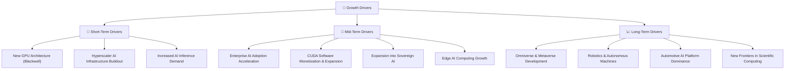
**分析：**
*   **短期驅動**：Blackwell 等新一代 GPU 架構的推出，將進一步鞏固 NVIDIA 在性能上的領先地位。超大規模數據中心對 AI 基礎設施的持續大規模投入，以及 AI 推理市場的快速增長，將在未來 12 個月內持續推動營收增長。
*   **中期驅動**：企業級客戶對 AI 解決方案的廣泛採用，將為 NVIDIA 帶來新的增長點。CUDA 軟體平台透過訂閱和服務形式實現更深層次的貨幣化。各國政府推動主權 AI 基礎設施建設，也將是重要的訂單來源。
*   **長期驅動**：Omniverse 平台在工業元宇宙、數位孿生領域的應用，以及機器人、自主機器和自動駕駛汽車市場的成熟，將為 NVIDIA 提供數十年的成長空間。公司在這些前沿領域的技術積累，使其能夠抓住未來的計算範式變革。

---

## 9. 風險矩陣

儘管 NVIDIA 擁有強大的成長前景，但投資仍面臨多重風險，需要投資者仔細評估。

### 9.1 風險評分矩陣

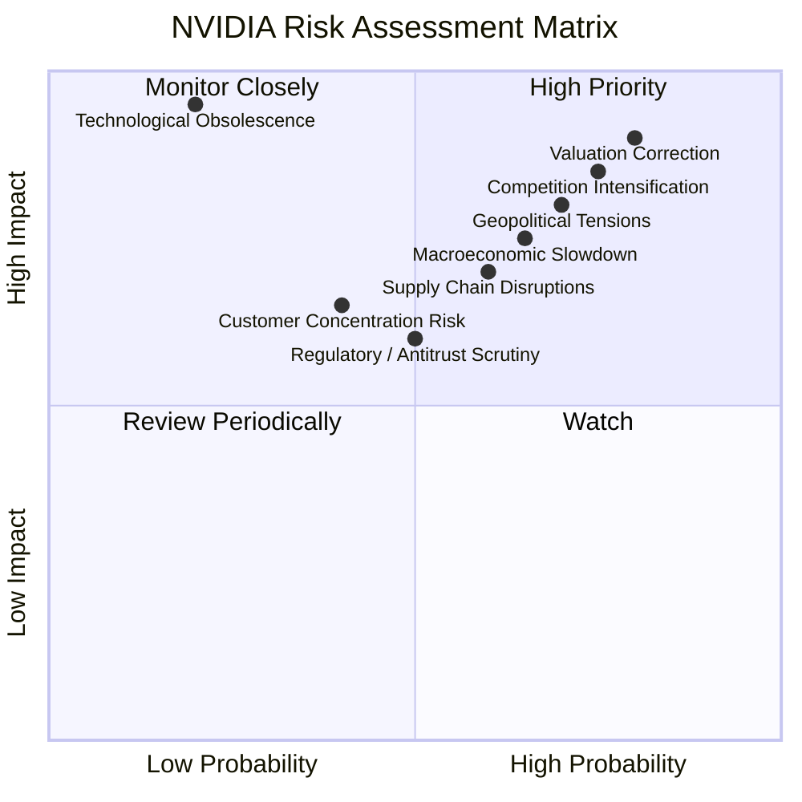

### 9.2 風險清單詳細分析

| # | 風險項目 | 發生機率 | 財務衝擊 | 風險評分 | 緩解措施 |
|---|------------------------|----------|----------|----------|----------|
| 1 | 🔴 **AI 晶片市場競爭加劇** | 高 (75%) | 高 (-10%營收成長) | 🔴 8.5/10 | 持續巨額研發投入 ($20.8B TTM)，維持技術領先；深化 CUDA 生態系統鎖定客戶；提供軟硬體整合方案。 |
| 2 | 🔴 **估值回調風險** | 高 (80%) | 高 (-20%股價) | 🔴 9.0/10 | 股價已反映高成長預期；需關注未來盈利是否持續超預期；長期投資者需接受短期波動。 |
| 3 | 🟡 **供應鏈中斷與地緣政治風險** | 中 (60%) | 中 (-5%營收) | 🟡 7.0/10 | 多元化供應商策略 (儘管高端晶片仍依賴台積電)；建立彈性庫存管理；加強與政府溝通。 |
| 4 | 🟡 **宏觀經濟下行與企業支出緊縮** | 中 (65%) | 中 (-7%營收成長) | 🟡 7.5/10 | AI 投資被視為戰略性支出，相對具韌性；拓展多元化客戶群體，降低單一行業風險。 |
| 5 | 🟡 **技術迭代與過時風險** | 低 (20%) | 極高 (-30%營收) | 🟡 6.0/10 | 領先業界的研發能力和持續創新；提前佈局下一代技術和計算範式 (如量子計算)。 |
| 6 | 🟡 **監管與反壟斷審查** | 中 (50%) | 中 (-3%營收) | 🟡 6.5/10 | 配合各地區監管要求；強調技術創新對社會的貢獻；避免市場壟斷行為。 |
| 7 | 🟡 **客戶集中度風險** | 中 (40%) | 中 (-5%營收) | 🟡 6.5/10 | 拓展更多中小型企業客戶；發展邊緣 AI 和主權 AI 市場，減少對超大規模雲廠商的依賴。 |

---

## 10. 投資建議

綜合以上深度分析，NVIDIA 在 AI 時代的領先地位、卓越的財務表現和強大的護城河使其成為極具吸引力的投資標的。

### 10.1 最終綜合評級雷達圖

```
╔══════════════════════════════════════════════════════════════════╗
║                  ✅ NVDA 最終綜合評級                             ║
╠══════════════════════════════════════════════════════════════════╣
║                                                                  ║
║  基本面強度  9.5 ▓▓▓▓▓▓▓▓▓▓▓▓▓▓▓▓▓▓▓░  ★★★★★           ║
║  成長動能   10.0 ▓▓▓▓▓▓▓▓▓▓▓▓▓▓▓▓▓▓▓▓  ★★★★★           ║
║  獲利品質   10.0 ▓▓▓▓▓▓▓▓▓▓▓▓▓▓▓▓▓▓▓▓  ★★★★★           ║
║  財務健康    9.5 ▓▓▓▓▓▓▓▓▓▓▓▓▓▓▓▓▓▓▓░  ★★★★★           ║
║  估值合理性  8.0 ▓▓▓▓▓▓▓▓▓▓▓▓▓▓▓▓░░░░  ★★★★☆           ║
║  護城河深度  9.5 ▓▓▓▓▓▓▓▓▓▓▓▓▓▓▓▓▓▓▓░  ★★★★★           ║
║  管理層執行  9.5 ▓▓▓▓▓▓▓▓▓▓▓▓▓▓▓▓▓▓▓░  ★★★★★           ║
║  技術創新力 10.0 ▓▓▓▓▓▓▓▓▓▓▓▓▓▓▓▓▓▓▓▓  ★★★★★           ║
║                                                                  ║
║  綜合總分    9.4 ▓▓▓▓▓▓▓▓▓▓▓▓▓▓▓▓▓▓░░  🏆 強烈買入              ║
╚══════════════════════════════════════════════════════════════════╝
```

### 10.2 目標價與隱含報酬率

我們基於多種估值方法和市場共識，給出 NVIDIA 的目標價區間。

| 情境 | 目標價 (12-18個月) | 較當前股價 $194.83 隱含報酬率 | 機率權重 | 加權平均目標價 |
|------|--------------------|-----------------------------|----------|------------------|
| **悲觀情境** | $210 | +7.79% | 20% | $42.00 |
| **基準情境** | $290 | +48.85% | 60% | $174.00 |
| **樂觀情境** | $450 | +130.97% | 20% | $90.00 |
| **加權平均** | **$306.00** | **+57.06%** | **100%** | **$306.00** |

**分析：**
我們的加權平均目標價為 $306.00，較當前股價 $194.83 有 57.06% 的潛在報酬率。這一目標價與分析師平均目標價 $301.62 非常接近，表明市場對 NVIDIA 的長期成長潛力存在強烈共識。即使在悲觀情境下，我們也預計股價仍有小幅上漲空間，而在樂觀情境下，其股價潛力巨大。

### 10.3 買入時機與觸發因素

```
╔══════════════════════════════════════════════════════════════════╗
║                  ✅ 買入觸發因素 Checklist                      ║
╠══════════════════════════════════════════════════════════════════╣
║                                                                  ║
║  立即買入觸發條件（多數符合）：                                  ║
║  ✅ AI 數據中心需求持續強勁，訂單能見度高                        ║
║  ✅ 新一代 Blackwell 架構 GPU 順利量產並獲客戶積極反饋            ║
║  ✅ 季度營收和 EPS 持續超預期，利潤率維持高位                     ║
║  ✅ 股價回調至 $180-$200 區間，提供更具吸引力的估值              ║
║                                                                  ║
║  加碼觸發條件（出現以下任一）：                                  ║
║  ☐ 軟體及服務收入佔比顯著提升，且毛利率維持高位                  ║
║  ☐ 在汽車、機器人或 Omniverse 等新興市場取得重大進展             ║
║  ☐ 競爭對手未能推出具備顛覆性性能或生態系統的產品                ║
║  ☐ 宏觀經濟環境改善，企業資本支出回升                            ║
║                                                                  ║
║  減碼/停損觸發條件（出現以下任一）：                             ║
║  ☐ 關鍵客戶 (如大型雲廠商) 訂單顯著減少或轉向競爭對手            ║
║  ☐ 季度營收或 EPS 連續不及預期，且成長動能明顯放緩               ║
║  ☐ 競爭格局發生根本性變化，NVIDIA 護城河受侵蝕                   ║
║  ☐ 爆發重大供應鏈中斷或地緣政治風險，導致長期停產                ║
║  ☐ 估值過度泡沫化，Forward P/E 超過 50x 且成長預期不再加速       ║
╚══════════════════════════════════════════════════════════════════╝
```

### 10.4 投資人適配度分析

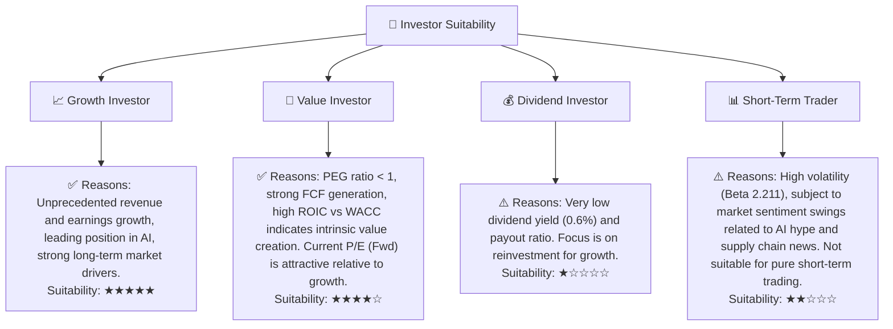
**分析：**
NVIDIA 毫無疑問是**成長型投資者**的理想選擇，其在 AI 領域的爆發性成長和長期潛力無與倫比。對於**價值型投資者**而言，儘管絕對估值較高，但其極低的 PEG 比率和強勁的 FCF 產生能力，顯示其內在價值創造能力強勁，值得深入研究。對於**股息型投資者**，NVIDIA 的股息微不足道，不具吸引力。而對於**短期交易者**，儘管 NVIDIA 波動性高，但其股價受基本面和長期趨勢影響更大，並非純粹的短期交易標的。

### 10.5 關鍵監控指標

| 監控類型 | 指標 | 關注點 | 頻率 |
|----------|------|--------|------|
| **營收成長** | 數據中心營收 YoY 成長 | 成長是否持續超預期；新產品 (Blackwell) 貢獻情況 | 每季 |
| **獲利能力** | 毛利率、營業利益率 | 是否能維持高位或進一步擴張；產品組合變化影響 | 每季 |
| **市場份額** | AI 數據中心 GPU 市場份額 | 競爭對手 AMD/Intel 份額變化；雲廠商自研晶片進展 | 半年/每年 |
| **技術領先** | 新產品發布與性能指標 | 是否保持性能優勢；CUDA 生態系統護城河變化 | 持續 |
| **資本效率** | ROIC vs WACC | ROIC 是否持續遠超 WACC，維持價值創造能力 | 每年 |
| **現金流** | 自由現金流 (FCF) | FCF 絕對值及 FCF 轉換率；資本支出效率 | 每季 |
| **客戶關係** | 主要雲廠商與企業客戶訂單 | 是否出現客戶轉向或分散化趨勢 | 每季/半年 |
| **宏觀經濟** | 企業資本支出意願 | 利率環境、經濟增長對 AI 投資的影響 | 每季 |
| **地緣政治** | 供應鏈穩定性、貿易政策 | 美中科技政策、晶片製造限制 | 持續 |

---

> **免責聲明**：本報告為 AI 自動生成，僅供研究參考，不構成投資建議。投資有風險，入市需謹慎。