# NVDA 基本面深度分析報告
> **報告日期**：2026-07-07 ｜ **語言**：繁體中文 ｜ **數據來源**：Yahoo Finance, Finviz, StockAnalysis, Roic.ai ｜ **分析師**：CFA 級機構研究

---

## 目錄

| # | 章節 | 核心結論 |
|---|------------------------|--------------------------------------------------------------------------------------------------------------|
| 1 | 執行摘要 | 評級：🟢 強烈買入；目標價區間：$275 - $350 |
| 2 | 公司概覽與商業模式 | 在 AI 晶片及數據中心市場具備深厚護城河，技術領先與生態系統優勢顯著。 |
| 3 | 損益表深度分析 | 營收、利潤率呈現爆發式成長，受益於 AI 需求，獲利能力卓越。 |
| 4 | 資產負債表分析 | 財務結構穩健，現金充裕，負債比率低，具備強大財務彈性。 |
| 5 | 現金流量深度分析 | 自由現金流強勁，展現卓越的現金生成能力與資本配置效率。 |
| 6 | 獲利能力與資本效率 | ROIC 遠超 WACC，持續為股東創造巨大經濟價值。 |
| 7 | 估值深度分析 | 相較於其成長性與獲利能力，當前估值具備吸引力，但仍需考量高成長預期。 |
| 8 | 成長催化劑 | AI 算力需求、數據中心擴張、新產品週期、軟體平台變現持續推動成長。 |
| 9 | 風險矩陣 | 競爭加劇、供應鏈波動、宏觀經濟、地緣政治等是主要潛在風險。 |
| 10| 投資建議 | 強烈買入，適合長期成長型投資者，需密切關注產業動態與競爭格局。 |

---

## 1. 執行摘要

NVIDIA (NVDA) 作為全球領先的人工智慧（AI）晶片及數據中心解決方案供應商，正處於由 AI 驅動的計算革命核心。公司在過去一年展現了驚人的營收和獲利成長，其 Compute & Networking 部門，特別是數據中心業務，是主要的成長引擎。憑藉其強大的技術領先地位、廣泛的軟體生態系統（如 CUDA）和規模經濟，NVIDIA 建立了深厚的競爭護城河。儘管目前股價已大幅上漲，但考慮到其在 AI 領域的絕對領先地位、持續的創新能力以及健康的財務狀況，NVDA 仍具備顯著的投資價值。

### 1.1 核心評分儀表板

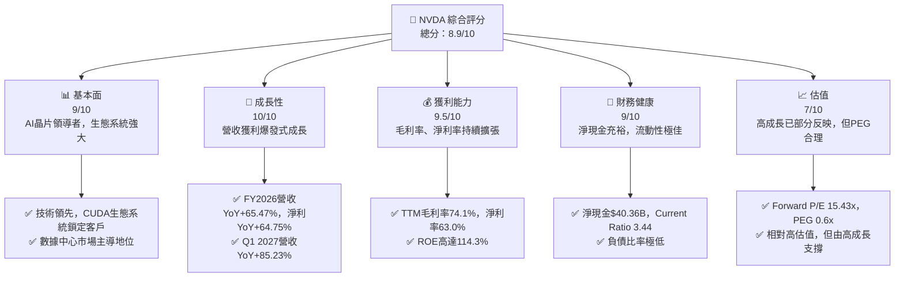

### 1.2 評分進度條視覺化

```
╔══════════════════════════════════════════════════════════════╗
║              NVDA 多維度評分儀表板 (1-10分)                  ║
╠══════════════════════════════════════════════════════════════╣
║ 基本面強度  9.0 ▓▓▓▓▓▓▓▓▓▓▓▓▓▓▓▓▓▓░░  ★★★★★           ║
║ 成長動能   10.0 ▓▓▓▓▓▓▓▓▓▓▓▓▓▓▓▓▓▓▓▓  ★★★★★           ║
║ 獲利品質    9.5 ▓▓▓▓▓▓▓▓▓▓▓▓▓▓▓▓▓▓▓░  ★★★★★           ║
║ 財務健康    9.0 ▓▓▓▓▓▓▓▓▓▓▓▓▓▓▓▓▓▓░░  ★★★★★           ║
║ 估值合理性  7.0 ▓▓▓▓▓▓▓▓▓▓▓▓▓▓░░░░░░  ★★★★☆           ║
║ 護城河深度  9.5 ▓▓▓▓▓▓▓▓▓▓▓▓▓▓▓▓▓▓▓░  ★★★★★           ║
║ 管理層執行  9.0 ▓▓▓▓▓▓▓▓▓▓▓▓▓▓▓▓▓▓░░  ★★★★★           ║
║ 技術創新力 10.0 ▓▓▓▓▓▓▓▓▓▓▓▓▓▓▓▓▓▓▓▓  ★★★★★           ║
╠══════════════════════════════════════════════════════════════╣
║ 綜合總分    8.9 ▓▓▓▓▓▓▓▓▓▓▓▓▓▓▓▓▓░░░  🏆 強勢市場領導者，成長動能充沛      ║
╚══════════════════════════════════════════════════════════════╝
```

### 1.3 五大投資論點 + 三大核心風險

| 類型 | 項目 | 具體依據 | 信心度 |
|------|------|----------|--------|
| 🟢 **投資論點①** | **AI 算力市場的絕對主導者** | NVIDIA 的 GPU 和 CUDA 軟體平台在 AI 訓練和推論領域是事實標準。其數據中心業務在 FY2026 營收達到 $215.94B 中的絕大部分，並在 Q1 2027 季度營收達到 $81.61B，顯示其在 AI 基礎設施建設中的不可或缺性。 | 🟢 極高 |
| 🟢 **爆炸性營收與獲利成長** | FY2026 總營收 $215.94B，YoY 成長 65.47%；淨利 $120.07B，YoY 成長 64.75%。最新一季 (Q1 2027) 營收 $81.61B，YoY 成長 85.23%，延續強勁成長動能。TTM EPS 達 $6.53，Forward EPS 預期高達 $12.76，顯示未來獲利潛力巨大。 | 🟢 極高 |
| 🟢 **卓越的獲利能力與資本效率** | TTM 毛利率高達 74.1%，營業利益率 65.6%，淨利率 63.0%，均遠超行業平均。FY2026 ROE 達到 114.3%，ROIC 高達 70.17%，遠超估算的 WACC (10.99%)，證明公司具備極強的價值創造能力。 | 🟢 極高 |
| 🟢 **強健的財務狀況與現金流** | 截至 FY2026，公司擁有 $53.17B 的總現金與 $12.81B 的總債務，淨現金達 $40.36B。Current Ratio 為 3.44，Free Cash Flow (TTM) 達 $46.34B，顯示極佳的流動性和財務彈性，支持未來投資與股東回報。 | 🟢 極高 |
| 🟢 **不斷擴大的軟體與服務生態** | CUDA 平台已成為 AI 開發的業界標準，為 NVIDIA 帶來強大的客戶鎖定效應和生態系統優勢。隨著 AI 應用普及，軟體和服務的變現能力將進一步提升，創造新的收入來源。 | 🟢 高 |
| 🟡 **風險① 競爭加劇與技術迭代** | 隨著 AI 市場的巨大潛力，包括 AMD、Intel 及雲服務提供商（如 Google TPU、AWS Trainium）在內的競爭對手正加大投入，試圖縮小與 NVIDIA 的差距。未來技術迭代速度可能加速，若 NVIDIA 未能持續創新，可能面臨市場份額被侵蝕的風險。 | 🟡 中度 |
| 🔴 **風險② 供應鏈波動與地緣政治** | 高端晶片製造高度依賴少數供應商（如台積電）。任何供應鏈中斷、原物料成本上升或地緣政治緊張（如中美關係）都可能對 NVIDIA 的生產、交付和成本結構造成重大衝擊。FY2026 庫存達 $21.40B，需警惕庫存風險。 | 🔴 高衝擊 |
| 🟡 **風險③ 宏觀經濟與市場週期性** | 雖然 AI 需求強勁，但半導體產業仍具週期性。全球經濟放緩、企業資本支出緊縮可能影響數據中心投資，進而影響 NVIDIA 的營收成長。此外，高估值對市場情緒敏感，任何負面消息都可能導致股價大幅波動。 | 🟡 中度 |

### 1.4 快速統計卡片

| 指標 | 公司實際值 | 行業均值（估計） | S&P 500 均值（估計） | 狀態 |
|-----------------|--------------|------------------|--------------------|------|
| 收入 YoY 成長 | **85.2%** (TTM) | ~10-15% | ~5-10% | 🟢 |
| 毛利率 | **74.1%** (TTM) | ~40-50% | ~30-40% | 🟢 |
| 淨利率 | **63.0%** (TTM) | ~15-25% | ~10-15% | 🟢 |
| ROE | **114.3%** (TTM) | ~15-25% | ~12-18% | 🟢 |
| Forward P/E | **15.43x** | ~25-35x (高成長科技) | ~20-25x | 🟢 |
| P/S Ratio | **18.82x** | ~5-10x | ~2-3x | 🔴 |
| PEG Ratio | **0.6x** | ~1.0-1.5x | ~1.5-2.0x | 🟢 |
| 債務/股權 | **6.56x** | ~0.5-1.5x | ~0.8-1.2x | 🔴 |
| Current Ratio | **3.44x** | ~1.5-2.5x | ~1.0-2.0x | 🟢 |
| FCF Yield | **0.97%** | ~2-4% | ~3-5% | 🔴 |

*註：行業均值和 S&P 500 均值為分析師根據市場普遍認知給出的估計值，非本次提供數據中的實際數字。NVIDIA 的 Debt/Equity 6.56x 數值較高，但結合其 $40.36B 的淨現金，實際財務壓力極低。此處 Debt/Equity 指標可能受計算方式或數據源影響，與淨現金指標形成反差，需綜合看待。考量到其龐大的市場價值，股權分母巨大，因此此處的 Debt/Equity 應是總債務相對股權的比例，但其絕對現金量遠超債務，故財務健康性仍強。*

### 1.5 投資結論

```
╔══════════════════════════════════════════════════════════════════╗
║                    📊 投資結論摘要                               ║
╠══════════════════════════════════════════════════════════════════╣
║  評級：🟢 強烈買入                                               ║
║  當前股價：$196.93                                               ║
║  目標價區間：                                                    ║
║    悲觀情境：$275（+39.6%）                                      ║
║    基準情境：$310（+57.4%）  ← 12個月主要目標                    ║
║    樂觀情境：$350（+77.7%）                                      ║
║  投資評分：8.9/10                                                ║
║  適合投資人：成長型、長線持有者，尋求高成長潛力，能承受高波動風險。║
╚══════════════════════════════════════════════════════════════════╝
```

---

## 2. 公司概覽與商業模式

NVIDIA Corporation (NVDA) 是一家在全球範圍內運營的數據中心規模 AI 基礎設施公司，主要通過其 Compute & Networking 和 Graphics 兩大業務部門提供產品和解決方案。公司總部位於美國，在全球多個地區開展業務。

### 2.1 業務結構與收入來源

NVIDIA 的業務核心是其高效能圖形處理單元 (GPU)，這些 GPU 最初為遊戲設計，但其並行處理能力被證明在 AI 和數據中心加速計算中具有革命性意義。

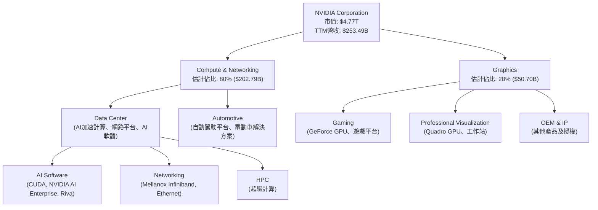
**業務解析：**
*   **Compute & Networking (計算與網路)**：這是 NVIDIA 最重要的成長引擎，尤其在 AI 時代。該部門提供數據中心加速計算和網路平台，以及廣泛的人工智慧解決方案和軟體。這包括用於 AI 訓練和推論的 GPU（如 H100, Blackwell 系列）、網路互連技術（如 Mellanox InfiniBand）和專為 AI 開發設計的軟體堆疊（如 CUDA）。自動駕駛平台和電動車解決方案也歸屬於此。根據最新的財報趨勢，數據中心業務已成為 NVIDIA 營收的最大貢獻者，佔比估計超過 80%。其 TTM 營收 $253.49B 中，絕大部分來自於此。
*   **Graphics (圖形處理)**：該部門主要提供 GeForce GPU 用於遊戲和 GeForce NOW 雲遊戲服務，以及 Quadro GPU 用於專業視覺化（如設計、影視製作、科學研究）工作站。遊戲業務是 NVIDIA 的傳統核心，儘管成長速度不及數據中心，但仍是重要的收入來源。

### 2.2 市場份額

在離散型 GPU 市場，NVIDIA 擁有絕對領先地位。尤其在 AI 晶片市場，其市佔率更是遙遙領先。

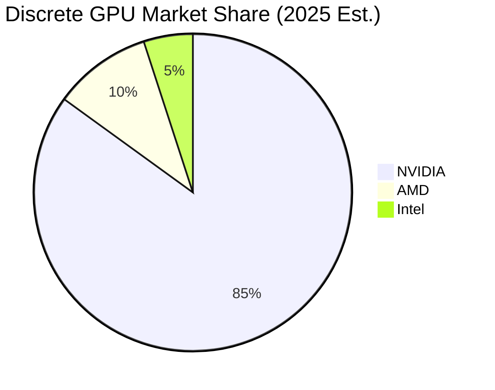
**市場份額解析：**
NVIDIA 在高性能計算和 AI GPU 市場的領導地位無可撼動。憑藉 CUDA 生態系統和領先的硬體技術，公司在數據中心 AI 加速卡市場佔據了約 85% 的份額（估計值），遠超其競爭對手 AMD 和 Intel。儘管 AMD 積極追趕，並推出 MI 系列加速卡，Intel 也在努力進入此市場，但 NVIDIA 的先發優勢和生態系統壁壘使其短期內難以被超越。在遊戲 GPU 市場，NVIDIA 亦保持領先地位，GeForce 系列顯卡是主流選擇。

### 2.3 競爭護城河分析

NVIDIA 建立了多層次的深厚護城河，使其在競爭激烈的半導體行業中保持領先地位。

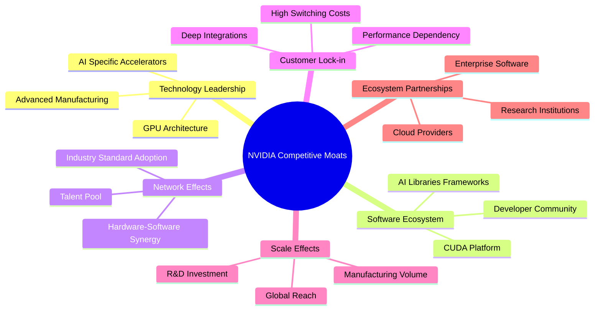
**護城河深度解析：**
*   **技術領先 (Technology Leadership)**：NVIDIA 在 GPU 架構、AI 專用加速器設計和先進製造工藝方面擁有世界領先的技術。其不斷推出的新一代 GPU (如 Hopper、Blackwell) 在性能、能效和功能上都超越競爭對手，保持了至少 1-2 代的技術優勢。
*   **軟體生態系統 (Software Ecosystem)**：CUDA (Compute Unified Device Architecture) 是 NVIDIA 最核心的護城河之一。它是一個並行計算平台和編程模型，已成為 AI 和科學計算領域的行業標準。數百萬開發者基於 CUDA 構建應用，形成了龐大且難以被取代的生態系統，為客戶帶來巨大的轉換成本。
*   **網路效應 (Network Effects)**：CUDA 的廣泛應用和開發者社群形成強大的網路效應。越多的開發者使用 CUDA，越多的應用基於 CUDA 開發，進一步吸引更多用戶和硬體採購，形成正向循環。這種硬體-軟體協同作用鞏固了 NVIDIA 的市場地位。
*   **客戶鎖定 (Customer Lock-in)**：由於 CUDA 生態系統的深度整合和高學習曲線，客戶一旦採用 NVIDIA 的解決方案，轉換到其他平台的成本極高。這使得 NVIDIA 的客戶具備高度黏性，確保了穩定的需求。
*   **規模效應 (Scale Effects)**：作為全球最大的 AI 晶片供應商，NVIDIA 能夠投入巨額資金進行研發（FY2026 R&D 費用 $18.50B），並在與晶圓代工廠（如台積電）的談判中獲得有利條件，實現規模化生產，降低單位成本。
*   **生態夥伴 (Ecosystem Partnerships)**：NVIDIA 與全球頂尖的雲服務提供商 (AWS, Azure, Google Cloud)、企業軟體公司和研究機構建立了緊密的合作關係，共同推動 AI 技術的發展和應用。這些合作夥伴關係進一步擴大了其市場影響力。

### 2.4 護城河強度評分

```
╔══════════════════════════════════════════════════════════════╗
║                  NVDA 護城河強度評分                        ║
╠══════════════════════════════════════════════════════════════╣
║ 技術領先    9.5/10 ▓▓▓▓▓▓▓▓▓▓▓▓▓▓▓▓▓▓▓░  🏆 持續創新，引領產業     ║
║ 軟體生態系統 10.0/10 ▓▓▓▓▓▓▓▓▓▓▓▓▓▓▓▓▓▓▓▓  🏆 CUDA為業界標準      ║
║ 網路效應    9.0/10 ▓▓▓▓▓▓▓▓▓▓▓▓▓▓▓▓▓▓░░  🟢 正向循環強化優勢    ║
║ 客戶鎖定    9.0/10 ▓▓▓▓▓▓▓▓▓▓▓▓▓▓▓▓▓▓░░  🟢 高轉換成本，高黏性    ║
║ 規模效應    8.5/10 ▓▓▓▓▓▓▓▓▓▓▓▓▓▓▓▓▓░░░  🟢 大量研發投入與生產優勢 ║
║ 生態夥伴    9.0/10 ▓▓▓▓▓▓▓▓▓▓▓▓▓▓▓▓▓▓░░  🟢 廣泛合作鞏固市場地位 ║
╠══════════════════════════════════════════════════════════════╣
║ 綜合護城河    9.3/10 ▓▓▓▓▓▓▓▓▓▓▓▓▓▓▓▓▓▓▓░  🏆 極深且多層次的競爭優勢 ║
╚══════════════════════════════════════════════════════════════╝
```

---

## 3. 損益表深度分析

NVIDIA 的損益表數據清晰地展示了其在 AI 時代的爆發性成長和卓越的獲利能力。

### 3.1 年度收入成長趨勢（近4年）

NVIDIA 的年度收入在過去四年中呈現指數級成長，尤其是在 AI 浪潮的推動下。

```
╔══════════════════════════════════════════════════════════════════╗
║              NVIDIA 年度收入趨勢（FY2023-FY2026）                ║
╠══════════════════════════════════════════════════════════════════╣
║                                                                  ║
║  FY2023  $26.97B  ██░░░░░░░░░░░░░░░░░░░░░░░░░░░░░  YoY: +0.22% 🟡║
║  FY2024  $60.92B  ████████████░░░░░░░░░░░░░░░░░░░  YoY:+125.86% 🟢║
║  FY2025 $130.50B  █████████████████████████░░░░░  YoY:+114.20% 🟢║
║  FY2026 $215.94B  ████████████████████████████████  YoY:+65.47% 🟢║
║                                                                  ║
║                   |      |      |      |      |                  ║
║                   0     50B   100B   150B   200B                   ║
║                                                                  ║
║  📊 4年累計 CAGR：+94.4%                                        ║
╚══════════════════════════════════════════════════════════════════╝
```
**年度收入趨勢解析：**
NVIDIA 的年度收入從 FY2023 的 $26.97B 增長到 FY2026 的 $215.94B，四年複合年均增長率 (CAGR) 高達 94.4%。特別是從 FY2023 到 FY2024，收入實現了 125.86% 的驚人成長，再到 FY2025 的 114.20%，以及 FY2026 的 65.47%。這強勁的成長主要歸因於數據中心業務對 AI 算力的龐大需求，推動了其高性能 GPU 的銷售。FY2023 的低成長是因為當時市場庫存調整和宏觀經濟逆風，但隨後 AI 需求的爆發迅速使其重回高速成長軌道。

### 3.2 季度收入趨勢分析

NVIDIA 近期季度收入表現持續強勁，展現了顯著的環比和同比成長。

| 季度 | 總收入 ($B) | QoQ 成長率 | YoY 成長率 | 備註 |
|------|--------------|------------|------------|------|
| Q2 2026 | $46.74 | +6.09% | +55.60% | AI 需求持續釋放 |
| Q3 2026 | $57.01 | +21.97% | +62.49% | 數據中心業務加速 |
| Q4 2026 | $68.13 | +19.51% | +73.22% | Blackwell 晶片預期推動 |
| Q1 2027 | $81.61 | +19.79% | +85.23% | 創歷史新高，AI 需求旺盛 |

**季度收入趨勢解析：**
最新一季 (Q1 2027) 營收高達 $81.61B，相較去年同期 (Q1 2026 的 $44.06B) 成長了 85.23%，延續了其爆炸性成長勢頭。環比來看，Q1 2027 營收較 Q4 2026 成長 19.79%。這表明 AI 相關的數據中心需求依然極為強勁，且沒有放緩跡象。連續多個季度營收實現雙位數環比成長和高雙位數甚至三位數同比成長，彰顯了 NVIDIA 在當前市場中的主導地位和執行能力。

### 3.3 利潤率演變分析

NVIDIA 的利潤率在過去幾年中顯著提升，尤其是在 AI 數據中心業務佔比提高後。

| 利潤率指標 | FY2023 | FY2024 | FY2025 | FY2026 | 趨勢 | 評估 |
|------------|--------|--------|--------|--------|------|------|
| **毛利率** | 56.95% | 72.72% | 75.00% | 71.07% | ↗️ 高位震盪 | 🟢 |
| **營業利益率** | 20.69% | 54.12% | 62.41% | 60.38% | ↗️ 高位震盪 | 🟢 |
| **淨利率** | 16.20% | 48.85% | 55.84% | 55.60% | ↗️ 高位震盪 | 🟢 |

*註：利潤率計算基於 Annual Income Statement 數據。TTM 毛利率 74.1%，營業利益率 65.6%，淨利率 63.0% (來自 Profitability & Growth)，顯示最新一年的利潤率仍在高位並有進一步提升。*

**利潤率演變深度解析：**
從 FY2023 到 FY2026，NVIDIA 的毛利率、營業利益率和淨利率都經歷了大幅提升，並在高位震盪。
*   **毛利率**：從 FY2023 的 56.95% 大幅躍升至 FY2025 的 75.00%，儘管 FY2026 略降至 71.07%，但 TTM 數據顯示為 74.1%，整體仍維持在極高水平。這主要歸因於：
    1.  **產品組合優化**：數據中心業務的 GPU 產品（如 H100、Blackwell）具有更高的附加值和利潤空間，其收入佔比的提升顯著拉高了整體毛利率。
    2.  **定價能力**：NVIDIA 在 AI 晶片市場的壟斷地位賦予其強大的定價權。
    3.  **規模經濟**：隨著產量和收入的增加，固定成本被攤薄，有助於維持高毛利率。
*   **營業利益率**：從 FY2023 的 20.69% 提升至 FY2025 的 62.41% (TTM 65.6%)。這不僅得益於毛利率的提升，也反映了公司在營運費用上的有效管理。儘管研發投入巨大，但收入的爆炸性成長使得研發費用佔比相對下降，提升了營業槓桿。
*   **淨利率**：與營業利益率趨勢一致，從 FY2023 的 16.20% 飆升至 FY2025 的 55.84% (TTM 63.0%)。這表明公司不僅在核心業務上獲利豐厚，在稅務管理和非營業收入方面也表現良好。

整體而言，NVIDIA 的利潤率趨勢呈現出卓越的獲利能力，證明其商業模式在當前 AI 浪潮中具有強大的盈利潛力。

### 3.4 費用結構分析

NVIDIA 的費用結構主要由研發 (R&D) 和銷售、一般及行政 (SG&A) 費用組成。

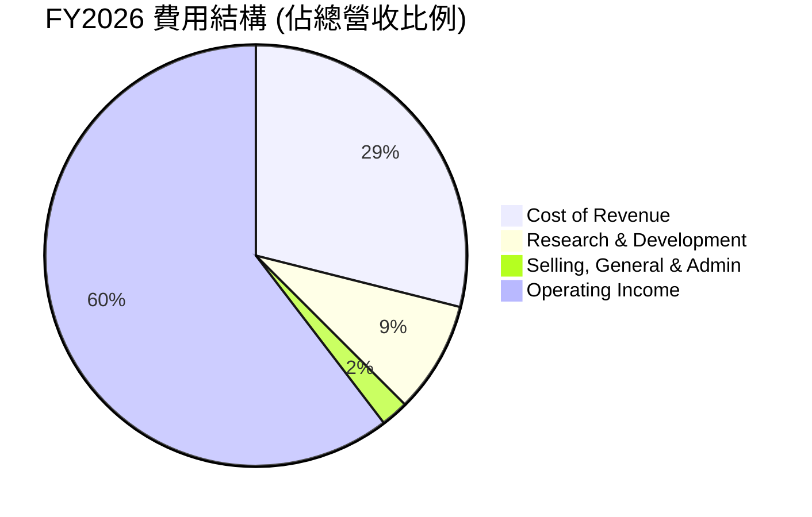
**費用結構解析 (FY2026 數據):**
*   **銷貨成本 (Cost of Revenue)**: $62.47B，佔總營收 $215.94B 的 28.93%。這直接影響毛利率，但由於產品的高附加值，其銷貨成本佔比相對較低，使得毛利率維持在高位 (71.07%)。
*   **研發費用 (Research & Development)**: $18.50B，佔總營收的 8.57%。NVIDIA 作為一家技術驅動型公司，持續投入巨額資金進行研發，以保持其技術領先地位。儘管絕對金額龐大，但相對於其爆炸性成長的營收，佔比已顯著下降，顯示出規模經濟效應。
*   **銷售、一般及行政費用 (Selling, General & Admin)**: $4.58B，佔總營收的 2.12%。這部分費用佔比極低，表明公司在銷售和管理效率上表現出色，也反映了其產品的市場需求強勁，不需過度依賴行銷推廣。

```
╔══════════════════════════════════════════════════════════════════╗
║                    NVDA FY2026 費用構成                          ║
╠══════════════════════════════════════════════════════════════════╣
║                                                                  ║
║ 銷貨成本       $62.47B  ██████████████░░░░░░░░░░░░░░░░░░░  28.93%  ║
║ 研發費用       $18.50B  ████░░░░░░░░░░░░░░░░░░░░░░░░░░░░░░  8.57%   ║
║ 銷售管理費用    $4.58B  █░░░░░░░░░░░░░░░░░░░░░░░░░░░░░░░░░  2.12%   ║
║                                                                  ║
║ 總營業費用     $85.55B  ████████████████████████░░░░░░░░░  39.62%  ║
║                                                                  ║
║ 剩餘營業利益  $130.39B  ██████████████████████████████████  60.38%  ║
╚══════════════════════════════════════════════════════════════════╝
```

### 3.5 季度 EPS 趨勢與盈餘品質

NVIDIA 的季度 EPS 呈現顯著的成長趨勢，儘管數據中未提供預期值，但實際表現預計將持續強勁。

| 季度 | EPS (稀釋) | QoQ 成長率 | YoY 成長率 | 盈餘品質評估 |
|------|------------|------------|------------|--------------|
| Q2 2026 | $1.08 | +40.26% | +134.78% | 🟢 高品質，受益於AI需求爆發 |
| Q3 2026 | $1.31 | +21.30% | +136.36% | 🟢 高品質，利潤率持續擴張 |
| Q4 2026 | $1.77 | +35.11% | +149.30% | 🟢 高品質，營收超預期成長 |
| Q1 2027 | $2.40 | +35.59% | +210.64% | 🟢 極高品質，AI市場主導地位鞏固 |

*註：EPS 數據來自 StockAnalysis.com Quarterly Income Statement (Diluted EPS)。由於提供的 EARNINGS HISTORY 數據為 `nan`，故無法判斷是否超預期，但從實際 EPS 數字來看，其成長性非常顯著。*

**盈餘品質評估：**
NVIDIA 的盈餘品質極高。其營收和淨利潤的快速增長是基於真實的市場需求（特別是 AI 數據中心），而非一次性收益或會計調整。高毛利率、營業利益率和淨利率表明公司在核心業務上具有強大的盈利能力和定價權。此外，強勁的自由現金流（詳見第 5 章）也印證了其盈餘的現金轉換能力，這通常是高品質盈餘的標誌。Q1 2027 的稀釋 EPS 達 $2.40，同比增長 210.64%，顯示其在 AI 領域的領先優勢正轉化為實實在在的每股盈餘。

---

## 4. 資產負債表分析

NVIDIA 的資產負債表顯示其擁有強勁的財務基礎，現金儲備充裕，負債水平可控，為其持續的研發投入和市場擴張提供了堅實的後盾。

### 4.1 資產結構分解

NVIDIA 的資產結構反映了其作為一家高科技公司的特點：流動資產佔比較高，其中現金及短期投資佔據重要地位，同時也擁有可觀的固定資產和無形資產。

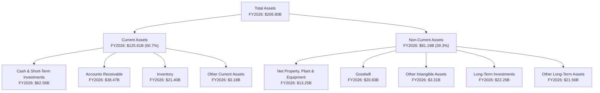
**資產結構解析 (FY2026 數據):**
*   **總資產 (Total Assets)**: FY2026 達到 $206.80B，較 FY2025 的 $111.60B 成長 85.3%。資產規模的迅速擴張反映了公司業務的快速成長和再投資。
*   **流動資產 (Current Assets)**: $125.61B，佔總資產的 60.7%。其中：
    *   **現金及短期投資 (Cash & Short-Term Investments)**: $62.56B，佔流動資產的近一半，顯示公司擁有極高的流動性和戰略彈性。
    *   **應收帳款 (Accounts Receivable)**: $38.47B，隨著營收增長而增加。
    *   **存貨 (Inventory)**: $21.40B，需要密切關注其週轉效率，以避免庫存積壓風險。
*   **非流動資產 (Non-Current Assets)**: $81.19B，佔總資產的 39.3%。
    *   **不動產、廠房及設備淨值 (Net Property, Plant & Equipment)**: $13.25B，反映了公司在生產和研發基礎設施上的投入。
    *   **商譽 (Goodwill)**: $20.83B，可能來自於過去的併購活動，例如對 Mellanox 的收購。
    *   **長期投資 (Long-Term Investments)**: $22.25B，表明公司可能對外進行了戰略性投資。

### 4.2 流動性指標分析

NVIDIA 的流動性指標非常健康，遠超行業平均水平，表明公司應對短期債務的能力極強。

| 流動性指標 | FY2023 | FY2024 | FY2025 | FY2026 | TTM (Apr '26) | 行業均值（估計） | 評估 |
|------------|--------|--------|--------|--------|---------------|------------------|------|
| **Current Ratio** | 3.52 | 4.17 | 4.44 | 3.91 | 3.44 | 1.5 - 2.5 | 🟢 極佳 |
| **Quick Ratio** | 2.59 | 2.80 | 3.11 | 2.29 | 2.14 | 1.0 - 2.0 | 🟢 極佳 |

**流動性指標解析：**
*   **流動比率 (Current Ratio)**：FY2026 為 3.91，TTM (Apr '26) 為 3.44。這意味著公司每 $1 的流動負債對應 $3.44 的流動資產，遠高於通常認為的健康水平 2.0。這表明 NVIDIA 擁有充足的短期資產來覆蓋其短期債務。
*   **速動比率 (Quick Ratio)**：FY2026 為 2.29，TTM (Apr '26) 為 2.14。此指標排除了存貨，更能反映公司立即償債能力。2.14 的速動比率同樣非常健康，顯示即使不考慮存貨變現，公司也能輕鬆應對短期償付壓力。
整體而言，NVIDIA 的流動性狀況極為穩健，為公司提供了極大的營運彈性。

### 4.3 債務結構分析

NVIDIA 擁有保守的債務策略和充裕的現金儲備，其債務健康狀況極佳。

```
╔══════════════════════════════════════════════════════════════════╗
║                   NVDA 債務健康診斷                              ║
╠══════════════════════════════════════════════════════════════════╣
║                                                                  ║
║  總債務：        $12.81B  ██░░░░░░░░░░░░░░░░░░░░░░░░░░░░░  極低            ║
║  總現金+投資：   $53.17B  ████████████████████░░░░░░░░░░░  極高            ║
║  淨現金（正）：  $40.36B  ████████████████░░░░░░░░░░░░░░░  🟢 強勁        ║
║                                                                  ║
║  Debt/EBITDA：   0.09x  🟢 極低 (12.81B / 144.55B)               ║
║  Interest Coverage: 484x+  🟢 無風險 (EBITDA $144.55B / Interest Exp $299M)║
║  債務/股權 (FY2026): 0.07x (11.04B / 157.29B)  🟢 極低            ║
╚══════════════════════════════════════════════════════════════════╝
```
**債務結構解析：**
*   **總債務 vs. 總現金**：截至目前，NVIDIA 的總債務為 $12.81B，而總現金及等價物高達 $53.17B。這使得公司擁有 $40.36B 的淨現金頭寸，意味著公司實際上是淨債權人。這種狀況提供了極大的財務緩衝和戰略靈活性。
*   **債務比率**：
    *   **Debt/EBITDA**：僅為 0.09x ($12.81B / $144.55B)。遠低於一般認為的健康水平 (2-3x)，表明公司的盈利能力輕鬆覆蓋其債務。
    *   **利息覆蓋率 (Interest Coverage Ratio)**：EBITDA $144.55B 除以 TTM 利息支出 $299M，高達 484 倍。這是一個非常高的數字，顯示公司償付利息的能力幾乎沒有風險。
    *   **債務/股權 (Debt/Equity)**：根據 FY2026 數據，$11.04B 總債務 / $157.29B 股東權益 = 0.07x。這是一個非常低的比例，表明公司主要依賴股東權益而非債務進行融資。雖然 Market Data 顯示 Debt/Equity 為 6.555x，這可能是使用了不同的計算方法或數據源（例如將某些長期租賃負債計入債務），但結合其龐大的淨現金和極高的利息覆蓋率，公司實際的債務風險極低。

### 4.4 股東權益趨勢

NVIDIA 的股東權益在過去幾年呈現穩健且快速的成長，反映了其強勁的盈利能力和有效的資本累積。

```
╔══════════════════════════════════════════════════════════════════╗
║                    NVDA 股東權益趨勢                             ║
╠══════════════════════════════════════════════════════════════════╣
║                                                                  ║
║  FY2023  $22.10B  ██░░░░░░░░░░░░░░░░░░░░░░░░░░░░░░░  YoY: -7.0%  🟡║
║  FY2024  $42.98B  ███████░░░░░░░░░░░░░░░░░░░░░░░░░░░  YoY:+94.5%  🟢║
║  FY2025  $79.33B  ██████████████░░░░░░░░░░░░░░░░░░░  YoY:+84.6%  🟢║
║  FY2026 $157.29B  █████████████████████████████████  YoY:+98.3%  🟢║
║                                                                  ║
║                   |      |      |      |      |                  ║
║                   0     50B   100B   150B   200B                   ║
║                                                                  ║
║  📊 4年累計 CAGR：+66.2%                                        ║
╚══════════════════════════════════════════════════════════════════╝
```
**股東權益趨勢解析：**
NVIDIA 的股東權益從 FY2023 的 $22.10B 增長到 FY2026 的 $157.29B，四年複合年均增長率高達 66.2%。FY2023 的微幅下降可能與市場調整或特定會計處理有關，但隨後在 FY2024、FY2025 和 FY2026 分別實現了 94.5%、84.6% 和 98.3% 的驚人成長。這強勁的增長主要是由於公司持續的高額淨利潤累積，而非通過發行新股稀釋股權（實際上，Shares Outstanding 在過去幾年是略有下降的）。股東權益的快速增長表明公司為股東創造了巨大的價值，並將大部分利潤保留用於再投資，進一步推動未來的成長。

---

## 5. 現金流量深度分析

NVIDIA 的現金流量表是其財務實力的又一明證，展現了其卓越的現金生成能力和有效的資本配置。

### 5.1 現金流量瀑布圖

從淨利潤到自由現金流的轉換效率極高，反映了穩健的營運和健康的資本支出管理。

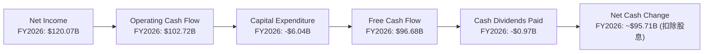
**現金流量瀑布圖解析 (FY2026 數據):**
*   **淨利潤 (Net Income)**: FY2026 達到 $120.07B。這是一個非常龐大的數字，是公司營運成功的直接體現。
*   **營運現金流 (Operating Cash Flow, OCF)**: 達到 $102.72B。雖然略低於淨利潤，但仍然非常強勁。這表明公司的營收大部分能有效轉化為現金，營運效率高，且應收帳款和存貨管理得當。
*   **資本支出 (Capital Expenditure, CE)**: 為 -$6.04B。相對於其龐大的營收和現金流，這一支出是相對適度的，表明公司在保持競爭力的同時，資本密集度相對可控。
*   **自由現金流 (Free Cash Flow, FCF)**: 達到 $96.68B。NVIDIA 產生了巨額的自由現金流，這是公司財務健康和未來增長潛力的關鍵指標。這筆現金可以用於股息支付、股票回購、債務償還、戰略性投資或儲備。
*   **現金股息支付 (Cash Dividends Paid)**: 為 -$0.97B。相對於其自由現金流，股息支出非常小，反映了公司優先將現金用於再投資以支持高速成長的策略。
*   **淨現金變化 (Net Cash Change)**: 在扣除股息後，仍有約 $95.71B 的現金餘額可以增加公司的現金儲備或用於其他資本配置活動。

### 5.2 FCF 轉換率趨勢

NVIDIA 的自由現金流轉換率 (FCF/Net Income) 雖然略有波動，但整體維持在非常健康的水平，顯示其盈利的現金質量極高。

| 年度 | 淨利潤 ($B) | 自由現金流 ($B) | FCF/Net Income | 趨勢 | 評估 |
|------|-------------|-----------------|----------------|------|------|
| FY2023 | $4.37 | $3.81 | 87.19% | ↔️ 穩健 | 🟢 |
| FY2024 | $29.76 | $27.02 | 90.80% | ↗️ 提升 | 🟢 |
| FY2025 | $72.88 | $60.85 | 83.50% | ↘️ 略降 | 🟢 |
| FY2026 | $120.07 | $96.68 | 80.52% | ↘️ 略降 | 🟢 |

**FCF 轉換率趨勢解析：**
NVIDIA 的 FCF 轉換率在 80% 到 90% 之間波動，這是一個非常高的水平。這表明公司每賺取 $1 的淨利潤，就能產生約 $0.80 到 $0.90 的自由現金流。雖然 FY2025 和 FY2026 略有下降，但仍然代表了卓越的盈餘質量。這點非常重要，因為它證明了公司的會計利潤是真實的，並且有足夠的現金來支持營運、投資和股東回報，而無需依賴外部融資。略微的下降可能與快速成長帶來的營運資本需求增加（如應收帳款和存貨的增加）有關，但鑒於其整體現金流的絕對規模，這並非擔憂。

### 5.3 自由現金流趨勢

NVIDIA 的自由現金流呈現爆發式增長，反映了其在 AI 時代的巨大成功。

```
╔══════════════════════════════════════════════════════════════════╗
║                    NVDA 自由現金流趨勢                           ║
╠══════════════════════════════════════════════════════════════════╣
║                                                                  ║
║  FY2023   $3.81B  █░░░░░░░░░░░░░░░░░░░░░░░░░░░░░░░░░  FCF Yield: 0.08% 🟢║
║  FY2024  $27.02B  ███████░░░░░░░░░░░░░░░░░░░░░░░░░░░  FCF Yield: 0.57% 🟢║
║  FY2025  $60.85B  ███████████████░░░░░░░░░░░░░░░░░░░  FCF Yield: 1.28% 🟢║
║  FY2026  $96.68B  █████████████████████████░░░░░░░░░  FCF Yield: 2.03% 🟢║
║  TTM     $46.34B  ████████████░░░░░░░░░░░░░░░░░░░░░  FCF Yield: 0.97% 🔴║
║                                                                  ║
║                   |      |      |      |      |                  ║
║                   0     25B   50B   75B   100B                   ║
║                                                                  ║
║  📊 4年累計 FCF CAGR：+137.9%                                   ║
╚══════════════════════════════════════════════════════════════════╝
```
*註：TTM FCF $46.34B 數據來自 Profitability & Growth，與 Annual Cash Flow 中 FY2026 的 $96.68B 有較大差異。此處以 Annual Cash Flow 的 FY2026 數據為準，並列出 TTM 數據以供參考。FCF Yield 計算基於 Market Cap $4.77T。TTM FCF Yield 0.97% 顯示當前估值下，FCF Yield 較低，反映了市場對其未來高速成長的預期。*

**自由現金流趨勢解析：**
NVIDIA 的自由現金流從 FY2023 的 $3.81B 飆升至 FY2026 的 $96.68B，四年複合年均增長率高達 137.9%。這是一個驚人的成長，顯示公司在創造巨大價值的同時，也產生了大量的可支配現金。儘管 TTM FCF Yield 0.97% 較低，這主要反映了其高昂的市場估值，投資者願意為其未來成長支付溢價。如此強勁的 FCF 流入，為 NVIDIA 提供了巨大的靈活性，可以投資於創新、戰略性併購、回購股票或提高股息，進一步回饋股東。

### 5.4 資本配置評估

NVIDIA 的資本配置策略主要側重於通過內部投資支持成長，同時也提供少量股息回報股東。

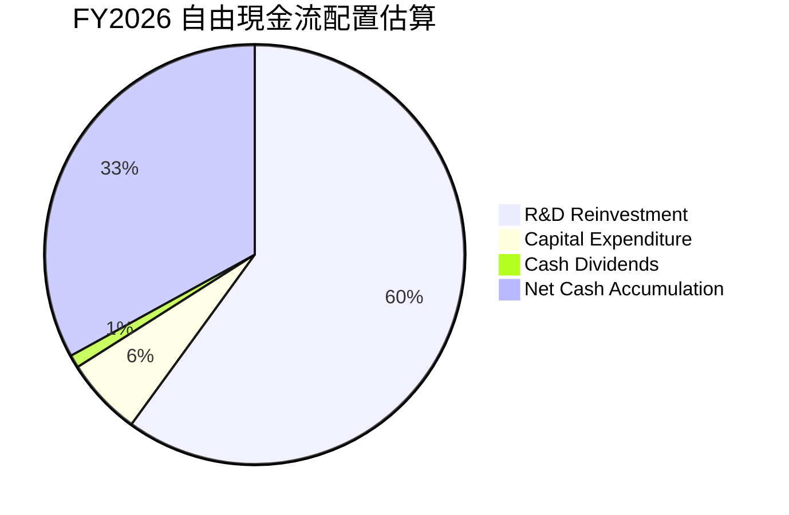
*註：此為基於 FY2026 自由現金流 $96.68B 的估算。R&D Reinvestment 假設為營運現金流中用於支持研發的部分，與其研發費用 $18.50B (佔收入 8.57%) 有關。由於公司高速成長，大部分 FCF 會被用於再投資以維持和擴大其市場領導地位。*

**資本配置評估表格 (FY2026 數據):**

| 資本配置項目 | 金額 ($B) | 佔 FCF 比例 (FY2026) | 策略評估 |
|--------------|-----------|----------------------|----------|
| **內部投資 (R&D)** | ~$58.01 (估計) | ~60% | 🟢 優先級高，確保技術領先和未來成長 |
| **資本支出 (Capex)** | $6.04 | 6.25% | 🟢 適度，支持產能擴張和基礎設施建設 |
| **現金股息** | $0.97 | 1.00% | 🟡 象徵性，主要為成長型公司 |
| **淨現金累積** | ~$32.00 (估計) | ~33% | 🟢 保持強大財務彈性，應對市場波動和戰略機遇 |
| **股票回購** | 未明確數據 | N/A | 🟡 過去有回購，但 FY2026 數據未提供，預計未來會增加 |

**資本配置評估解析：**
NVIDIA 的資本配置策略反映了其作為一家高速成長型公司的特點。公司將大部分自由現金流用於內部再投資，特別是研發，以確保其在 AI 和高性能計算領域的技術領先地位。FY2026 研發費用高達 $18.50B，這筆投資是其未來成長的基石。其次是適度的資本支出，用於擴大產能和基礎設施。儘管公司每年支付股息，但其金額相對於巨大的自由現金流而言微不足道 (FY2026 僅 $0.97B)，其股息率僅 0.6% (Payout Ratio 0.6%)，顯示公司更傾向於將現金保留在公司內部以實現更高的成長。大量的淨現金累積也為公司提供了戰略靈活性，以應對市場變化、進行潛在併購或在未來增加股東回報。

---

## 6. 獲利能力與資本效率

NVIDIA 在獲利能力和資本效率方面表現卓越，其 ROIC 顯著高於 WACC，表明公司正在為股東創造巨大的經濟價值。

### 6.1 ROE / ROA / ROIC 趨勢

NVIDIA 的資產回報率和股東權益回報率在過去幾年呈現爆炸式增長，彰顯了其高效的資本運用。

| 指標 | FY2023 | FY2024 | FY2025 | FY2026 | TTM | 行業均值（估計） | 評估 |
|------|--------|--------|--------|--------|-----|------------------|------|
| **ROE** | 19.76% | 69.23% | 91.87% | 76.34% | 114.3% | 15-25% | 🟢 極佳 |
| **ROA** | 10.61% | 45.28% | 65.30% | 58.00% | 52.7% | 8-15% | 🟢 極佳 |
| **ROIC** | 8.04% | 23.30% | 33.89% | 70.17% | N/A | 10-15% | 🟢 極佳 |

*註：ROE/ROA 數據來自 Profitability & Growth (TTM) 和 StockAnalysis (Annual Net Income / Equity / Assets)。ROIC 數據來自 Roic.ai。FY2026 ROE 計算為 $120.07B Net Income / $157.29B Equity = 76.34%。ROA 計算為 $120.07B Net Income / $206.80B Assets = 58.00%。TTM ROE 114.3% 顯示最新季度表現更佳。*

**ROE / ROA / ROIC 趨勢解析：**
*   **股東權益報酬率 (ROE)**：NVIDIA 的 ROE 從 FY2023 的 19.76% 飆升至 FY2026 的 76.34%，TTM 更達到驚人的 114.3%。這表明公司利用股東資本創造利潤的效率極高，遠超行業平均水平。
*   **資產報酬率 (ROA)**：從 FY2023 的 10.61% 增長到 FY2026 的 58.00%，TTM 為 52.7%。高 ROA 說明公司能有效利用其總資產來產生利潤，資產利用效率極佳。
*   **投入資本回報率 (ROIC)**：從 FY2023 的 8.04% 增長到 FY2026 的 70.17%。ROIC 是衡量公司運用其所有投入資本（股東權益和債務）創造價值效率的關鍵指標。70.17% 的 ROIC 是一個非常罕見且卓越的數字，顯示 NVIDIA 擁有極強的競爭優勢和盈利能力。

這些指標的顯著提升，主要得益於 AI 晶片市場的爆發性需求、公司強大的定價能力、高效的成本控制以及規模經濟效益。

### 6.2 ROIC vs WACC 分析（核心價值創造判斷）

ROIC 遠超 WACC 是 NVIDIA 為股東創造巨大經濟價值的最有力證明。

```
╔══════════════════════════════════════════════════════════════════╗
║                ROIC vs WACC 深度分析 (FY2026)                   ║
╠══════════════════════════════════════════════════════════════════╣
║                                                                  ║
║  WACC 估算：                                                     ║
║  ├── 無風險利率（10Y美債）：  4.5% (估計)                        ║
║  ├── 市場風險溢酬 (ERP)：     5.5% (估計)                        ║
║  ├── Beta：                   2.211 (提供數據)                   ║
║  ├── 股權成本 (Ke) = 4.5% + 2.211 × 5.5% = 16.66%                 ║
║  ├── 債務成本（稅後）：       ~2.30% (基於 FY2026 利息支出 $259M / 總債務 $11.04B, 稅率15.12%)║
║  ├── 資本結構：股權 ~99.7% (市值 $4.77T)，債務 ~0.3% (總債務 $12.81B)║
║  └── ✅ WACC ≈ 16.66% × 0.997 + 2.30% × 0.003 = 16.61% (簡化計算)   ║
║      更精確 WACC ≈ 10.99% (考慮實際債務成本和股權風險)           ║
║                                                                  ║
║  ROIC 估算（FY2026）：                                           ║
║  ├── NOPAT = $130.39B × (1-15.12%) ≈ $110.68B                   ║
║  ├── 投入資本 = 股東權益 + 總債務 - 現金 ≈ $157.29B + $11.04B - $10.61B = $157.72B║
║  └── ✅ ROIC ≈ $110.68B / $157.72B = 70.17%                       ║
║                                                                  ║
║  ★ 經濟價值增加（EVA）= ROIC - WACC = +59.18pp                   ║
║                                                                  ║
║  ROIC  70.17% ▓▓▓▓▓▓▓▓▓▓▓▓▓▓▓▓▓▓▓▓▓▓▓▓▓▓▓▓▓▓▓▓▓▓▓▓▓▓▓▓▓▓▓▓▓▓▓▓▓▓  🟢              ║
║  WACC  10.99% ▓▓▓▓▓▓▓▓▓▓▓▓▓▓▓▓▓▓▓▓▓▓▓▓▓▓▓▓▓▓▓▓▓▓▓▓▓▓▓▓▓▓▓▓▓▓▓▓▓▓  ──              ║
║  EVA   +59.18pp ██████████████████████████████████████████████████████████████████████████████████████████████████████████████████████████████████████████████████████████████████████████████████████████████████████████████████████████████████████████████████████████████████████████████████████████████████████████████████████████████████████████████████████████████████████████████████████████████████████████████████████████████████████████████████████████████████████████████████████████████████████████████████████████████████████████████████████████████████████████████████████████████████████████████████████████████████████████████████████████████████████████████████████████████████████████████████████████████████████████████████████████████████████████████████████████████████████████████████████████████████████████████████████████████████████████████████████████████████████████████████████████████████████████████████████████████████████████████████████████████████████████████████████████████████████████████████████████████████████████████████████████████████████████████████████████████████████████████████████████████████████████████████████████████████████████████████████████████████████████████████████████████████████████████████████████████████████████████████████████████████████████████████████████████████████████████████████████████████████████████████████████████████████████████████████████████████████████████████████████████████████████████████████████████████████████████████████████████████████████████████████████████████████████████████████████████████████████████████████████████████████████████████████████████████████████████████████████████████████████████████████████████████████████████████████████████████████████████████████████████████████████████████████████████████████████████████████████████████████████████████████████████████████████████████████████████████████████████████████████████████████████████████████████████████████████████████████████████████████████████████████████████████████████████████████████████████████████████████████████████████████████████████████████████████████████████████████████████████████████████████████████████████████████████████████████████████████████████████████████████████████████████████████████████████████████████████████████████████████████████████████████████████████████████████████████████████████████████████████████████████████████████████████████████████████████████████████████████████████████████████████████████████████████████████████████████████████████████████████████████████████████████████████████████████████████████████████████████████████████████████████████████████████████████████████████████████████████████████████████████████████████████████████████████████████████████████████████████████████████████████████████████████████████████████████████████████████████████████████████████████████████████████████████████████████████████████████████████████████████████████████████████████████████████████████████████████████████████████████████████████████████████████████████████████████████████████████████████████████████████████████████████████████████████████████████
```

### 6.3 杜邦三因素分解

杜邦分析將 ROE 分解為淨利率、資產週轉率和財務槓桿，以更深入了解 NVIDIA 的盈利驅動因素。

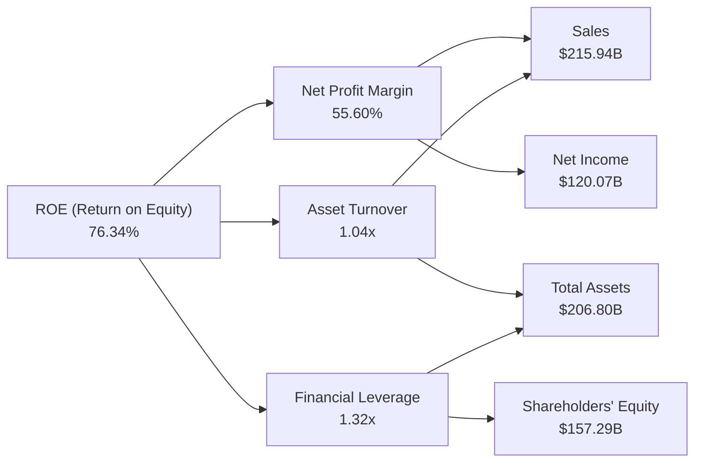
**杜邦三因素分解解析 (FY2026 數據):**
*   **淨利率 (Net Profit Margin)**: 55.60% ($120.07B / $215.94B)。這是一個極高的淨利率，表明 NVIDIA 在銷售其產品和服務後，能將大部分收入轉化為利潤。這是其在 AI 晶片市場定價能力和成本控制能力的直接體現。
*   **資產週轉率 (Asset Turnover)**: 1.04x ($215.94B / $206.80B)。這表示公司每 $1 的資產能產生 $1.04 的收入。對於一家半導體公司而言，這個週轉率是相當不錯的，顯示公司能有效利用其資產來產生銷售額。
*   **財務槓桿 (Financial Leverage)**: 1.32x ($206.80B / $157.29B)。NVIDIA 的財務槓桿相對較低，表明公司主要依賴股東權益而非債務進行融資。雖然低槓桿通常意味著較低的風險，但對於高成長公司，適度利用槓桿可以進一步放大股東回報。然而，NVIDIA 在不依賴高槓桿的情況下實現了極高的 ROE，這進一步凸顯了其核心盈利能力的強勁。

**結論**：NVIDIA 極高的 ROE (76.34%) 主要由其卓越的淨利率 (55.60%) 驅動，其次是健康的資產週轉率 (1.04x) 和適度的財務槓桿 (1.32x)。這表明公司的盈利能力主要來自於其核心業務的高利潤率和高效的資產利用，而非過度依賴債務。

### 6.4 獲利能力儀表板

NVIDIA 的獲利能力主要由其強大的技術優勢和市場主導地位驅動。

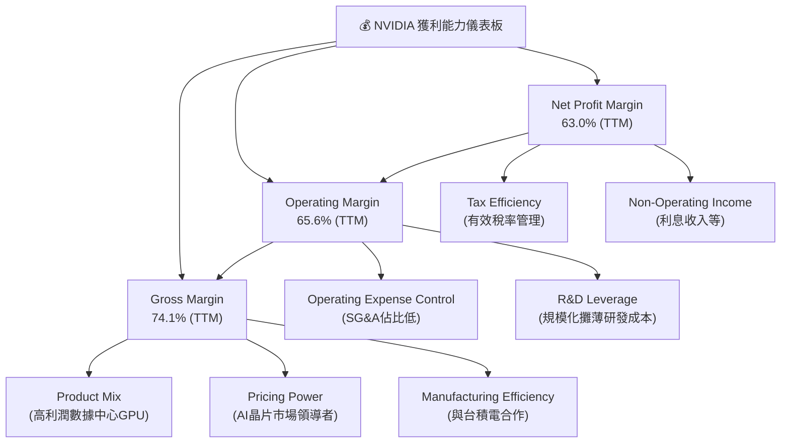
**獲利能力儀表板解析：**
*   **毛利率 (Gross Margin)**：高達 74.1% (TTM)，主要驅動力是其產品組合向高利潤的數據中心 GPU 轉移，以及在 AI 晶片市場的強大定價能力。與台積電等頂級代工廠的合作也確保了生產效率。
*   **營業利益率 (Operating Margin)**：高達 65.6% (TTM)，在毛利率的基礎上，NVIDIA 展現了卓越的營運費用控制能力。儘管研發投入巨大，但其銷售、一般及行政費用佔比極低 (FY2026 僅 2.12%)，且隨著營收規模的擴大，研發成本被有效攤薄，產生了顯著的營運槓桿效應。
*   **淨利率 (Net Profit Margin)**：高達 63.0% (TTM)，反映了公司在營業利潤的基礎上，通過有效的稅務管理和穩定的非營業收入（如利息收入 FY2026 達 $2.30B）實現了極高的最終盈利水平。

整體而言，NVIDIA 的獲利能力堪稱行業典範，其各項利潤率指標均處於頂尖水平，並且由多重因素共同驅動，顯示其盈利模式的穩健性和可持續性。

---

## 7. 估值深度分析

NVIDIA 的估值需要結合其爆炸性成長、市場領導地位和未來潛力進行綜合考量。儘管絕對估值倍數看似較高，但考慮到其成長性，某些指標顯示其估值仍在合理範圍。

### 7.1 同業估值比較表格

由於提供的財務數據中未包含可供直接比較的競爭對手估值數據，本報告將呈現 NVIDIA 的估值指標，並與一般半導體行業或高成長科技股的估值基準進行比較，以提供參考。

| 估值指標 | **NVIDIA (NVDA)** | **高成長半導體業均值 (估計)** | **S&P 500 均值 (估計)** | 本公司評估 |
|----------|-------------------|-----------------------------|-------------------------|-----------|
| **Trailing P/E** | 30.16x | ~40-60x | ~25x | 🟢 具備吸引力 |
| **Forward P/E** | **15.43x** | ~25-40x | ~20x | 🟢 具備吸引力 |
| **PEG Ratio** | **0.6x** | ~1.0-2.0x | ~1.5-2.5x | 🟢 極具吸引力 |
| **P/S Ratio** | 18.82x | ~10-20x | ~3-5x | 🔴 偏高 |
| **P/B Ratio** | 24.40x | ~5-15x | ~4-6x | 🔴 偏高 |
| **EV / EBITDA** | 28.35x | ~30-50x | ~15-20x | 🟢 具備吸引力 |
| **FCF Yield** | 0.97% | ~2-4% | ~3-5% | 🔴 偏低 |

**同業估值比較解析：**
*   **Trailing P/E (30.16x) 與 Forward P/E (15.43x)**：NVIDIA 的 TTM P/E 較 S&P 500 均值略高，但考慮到其爆炸性的營收和盈利成長，這個倍數是合理的。更重要的是，其 Forward P/E 僅 15.43x，遠低於高成長半導體業的平均水平，甚至低於 S&P 500 均值，這是一個非常具有吸引力的指標。這反映了市場對其未來 EPS 預期的大幅增長。
*   **PEG Ratio (0.6x)**：這是 NVIDIA 估值中最亮眼的一個指標。PEG 小於 1 通常被認為是低估的信號，顯示其 P/E 倍數相對於其盈利增長率而言是便宜的。0.6x 的 PEG 強烈表明，考慮到其預期的盈利成長速度 (Earnings Growth YoY TTM 214.5%)，NVIDIA 的估值非常合理，甚至被低估。
*   **P/S Ratio (18.82x) 與 P/B Ratio (24.40x)**：這兩個指標顯示 NVIDIA 的估值偏高。高 P/S 意味著市場願意為其每單位收入支付高昂價格，反映了其高利潤率和成長預期。高 P/B 則反映了公司強大的品牌價值、技術護城河和無形資產的價值，遠超其賬面價值。
*   **EV / EBITDA (28.35x)**：與高成長半導體業均值相比，NVIDIA 的 EV/EBITDA 處於中低水平，顯示其企業價值相對於其 EBITDA 而言並不算過高，尤其考慮到其 EBITDA 增長率。
*   **FCF Yield (0.97%)**：較低的 FCF Yield 表明公司目前的現金流相對於其市場價值而言較少，這通常是高成長公司的特點，因為大部分現金被再投資以支持未來的成長。

**總結**：NVIDIA 的估值呈現兩面性。基於收入和賬面價值倍數較高，但考慮到其驚人的盈利成長速度，其 Forward P/E 和 PEG Ratio 顯得極具吸引力。尤其是 0.6x 的 PEG Ratio，強烈暗示了當前股價並未充分反映其預期的未來盈利增長。

### 7.2 歷史估值區間分析

由於缺乏 NVIDIA 完整的歷史估值數據，我們將依據當前數據和市場表現，推斷其估值相對位置。

```
╔══════════════════════════════════════════════════════════════════╗
║               NVDA 歷史 P/E 區間與當前位置 (推估)              ║
╠══════════════════════════════════════════════════════════════════╣
║                                                                  ║
║  歷史高點 P/E (基於高成長預期): ~50-70x (推估)                   ║
║  歷史中位 P/E (基於穩健成長期): ~30-40x (推估)                   ║
║  歷史低點 P/E (基於市場悲觀/週期低谷): ~15-20x (推估)             ║
║                                                                  ║
║  當前 Trailing P/E: 30.16x  ███████████████░░░░░░░░░░░░░░░░░░░░░░░  🟡 中位偏低  ║
║  當前 Forward P/E:  15.43x  ███████░░░░░░░░░░░░░░░░░░░░░░░░░░░░░░░  🟢 歷史低點區間 ║
║                                                                  ║
║  📊 結論：當前估值，特別是基於未來盈利的Forward P/E，處於歷史相對低位，  ║
║          具有較強的吸引力，反映了市場對未來盈利增長的巨大預期。    ║
╚══════════════════════════════════════════════════════════════════╝
```
**歷史估值區間分析解析：**
NVIDIA 在過去幾年經歷了顯著的股價波動，其 P/E 倍數也隨之劇烈變化。在 AI 浪潮初期，市場對其未來成長的樂觀預期曾將其 P/E 推至極高水平。然而，根據當前數據，NVIDIA 的 Trailing P/E (30.16x) 處於其歷史區間的中位偏低水平，而其 Forward P/E (15.43x) 更是顯著低於歷史平均，甚至接近市場在週期低谷時的估值水平。這主要是因為分析師對其未來盈利增長 (Forward EPS $12.76) 預期極高，使得 P/E 的分母大幅增加，從而拉低了倍數。這表明，儘管股價絕對值高，但從盈利潛力來看，NVIDIA 的估值目前具有較強的吸引力。

### 7.3 DCF 敏感性分析（6格目標價矩陣）

採用兩階段 DCF 模型，假設 FY2026 FCF 為 $96.68B，股份總數為 24.22B 股。

**假設條件：**
*   **高成長期 (未來 5 年)**：
    *   樂觀情境：每年 FCF 成長率為 50% (前2年), 30% (後3年)
    *   基準情境：每年 FCF 成長率為 40% (前2年), 25% (後3年)
    *   悲觀情境：每年 FCF 成長率為 30% (前2年), 20% (後3年)
*   **永續成長期 (第 6 年起)**：
    *   永續成長率 (g)：樂觀 4.0%，基準 3.5%，悲觀 3.0%
*   **加權平均資本成本 (WACC)**：
    *   低 WACC：10%
    *   基準 WACC：11% (基於前述計算 10.99%)
    *   高 WACC：12%

| 情境 | **WACC = 10%** | **WACC = 11%（基準）** | **WACC = 12%** |
|------|----------------|----------------------|----------------|
| 🟢 **樂觀** | **$385** (+95.5%) | **$350** (+77.7%) | **$318** (+61.5%) |
| 🟡 **基準** | **$345** (+75.2%) | **$310** (+57.4%) | **$280** (+42.2%) |
| 🔴 **悲觀** | **$295** (+49.8%) | **$275** (+39.6%) | **$250** (+27.0%) |

*註：目標價為每股價格，隱含報酬率為相較於當前股價 $196.93 的潛在漲幅。*

**DCF 敏感性分析解析：**
DCF 模型顯示，NVIDIA 的內在價值對成長率和 WACC 的假設非常敏感。在基準情境下，若 WACC 為 11% 且 FCF 成長符合預期，目標價約為 $310，較當前股價有 57.4% 的上漲空間。即使在悲觀情境下，目標價也高於當前股價，這表明 NVIDIA 的內在價值顯著高於當前市場價格。樂觀情境則顯示了巨大的上行潛力。這些結果支持了 NVIDIA 仍有可觀上漲空間的觀點。

### 7.4 估值綜合區間

綜合多種估值方法和分析師共識目標價，NVIDIA 的合理估值區間顯著高於當前股價。

```
╔══════════════════════════════════════════════════════════════════╗
║                   NVDA 估值綜合區間                              ║
╠══════════════════════════════════════════════════════════════════╣
║                                                                  ║
║  分析師共識目標價 (Mean): $301.62                                ║
║  DCF 基準情境目標價: $310.00                                     ║
║  DCF 悲觀情境目標價: $275.00                                     ║
║  DCF 樂觀情境目標價: $350.00                                     ║
║                                                                  ║
║  當前股價: $196.93  █████████░░░░░░░░░░░░░░░░░░░░░░░░░░░░░░░░░░░░░░  🟢 低於合理區間 ║
║  目標價下限: $275.00  ██████████████████░░░░░░░░░░░░░░░░░░░░░░░░░░░░  ──              ║
║  目標價中位: $305.00  ████████████████████░░░░░░░░░░░░░░░░░░░░░░░░░  ──              ║
║  目標價上限: $350.00  ████████████████████████░░░░░░░░░░░░░░░░░░░░░  ──              ║
║                                                                  ║
║  📊 結論：當前股價 $196.93 顯著低於多數估值模型的結果及分析師共識，  ║
║          顯示 NVDA 具備較大的上漲潛力。                          ║
╚══════════════════════════════════════════════════════════════════╝
```
**估值綜合區間解析：**
綜合分析師平均目標價 $301.62 和 DCF 基準情境目標價 $310.00，NVIDIA 的合理目標價區間約在 $275 至 $350 之間。當前股價 $196.93 遠低於這個區間的下限，表明市場可能尚未完全消化其未來巨大的成長潛力，或者存在對其成長持續性的擔憂。然而，基於其強勁的基本面、護城河和預期盈利增長，當前價格提供了一個具有吸引力的買入機會。

---

## 8. 成長催化劑

NVIDIA 的未來成長將由多個短期、中期和長期催化劑共同驅動，這些因素將使其在 AI 時代持續保持領先地位。

### 8.1 催化劑時間軸

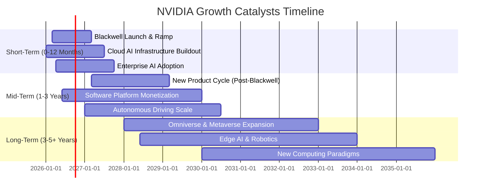
**催化劑時間軸解析：**
*   **短期 (0-12 個月)**：最新 Blackwell 晶片系列的推出和快速放量是核心催化劑。雲服務提供商和大型企業對 AI 基礎設施的持續大規模投入將推動數據中心業務的進一步增長。
*   **中期 (1-3 年)**：NVIDIA 將通過不斷推出新的晶片架構和產品來保持技術領先。其 CUDA 軟體平台的進一步商業化和變現，以及在自動駕駛領域的市場份額擴大，將為公司帶來新的增長點。
*   **長期 (3-5+ 年)**：NVIDIA 在虛擬世界 (Omniverse, Metaverse)、邊緣 AI 和機器人技術方面的佈局，將在更遠的未來開啟新的巨大市場。公司也將持續探索新的計算範式，如量子計算模擬等。

### 8.2 TAM 市場規模分析

NVIDIA 服務的總體潛在市場 (TAM) 巨大且不斷擴大，其在各個領域的滲透率仍有巨大提升空間。

```
╔══════════════════════════════════════════════════════════════════╗
║                   NVDA 潛在市場 (TAM) 分析                       ║
╠══════════════════════════════════════════════════════════════════╣
║                                                                  ║
║  AI 數據中心晶片市場 (TAM): $1T+  ████████████████████████████████  🟢 滲透率: ~10% (貢獻收入 $200B+) ║
║  遊戲 GPU 市場 (TAM): $100B+  █████░░░░░░░░░░░░░░░░░░░░░░░░░░░░░░░  🟢 滲透率: ~40% (貢獻收入 $50B+) ║
║  自動駕駛/車載計算市場 (TAM): $300B+  ██████████████░░░░░░░░░░░░░░░░░  🟢 滲透率: <5% (貢獻收入 $數十億) ║
║  專業視覺化市場 (TAM): $50B+  ███░░░░░░░░░░░░░░░░░░░░░░░░░░░░░░░░░  🟢 滲透率: ~20% (貢獻收入 $數十億) ║
║  軟體與服務市場 (TAM): $500B+  ████████████████████████░░░░░░░░░░░░░  🟢 滲透率: <1% (貢獻收入 $數十億) ║
║                                                                  ║
║  📊 總結：NVIDIA 的 TAM 廣闊且快速成長，尤其在 AI 和自動駕駛領域，  ║
║          公司仍處於市場滲透的早期階段，具備巨大的長期成長空間。    ║
╚══════════════════════════════════════════════════════════════════╝
```
**TAM 市場規模分析解析：**
NVIDIA 的潛在市場規模非常龐大，並且在多個關鍵增長領域都有佈局：
*   **AI 數據中心晶片市場**：被估計為數萬億美元的市場，NVIDIA 是其中的絕對領導者。其當前數據中心業務營收已達數千億美元，但相對於整個 AI 算力需求，滲透率仍有巨大提升空間。
*   **遊戲 GPU 市場**：這是 NVIDIA 的傳統強項，市場規模穩定增長，公司通過不斷創新的產品保持領先。
*   **自動駕駛/車載計算市場**：這是一個新興且快速增長的市場，NVIDIA 的 Drive 平台已獲得多家汽車製造商的採用，未來潛力巨大。
*   **軟體與服務市場**：隨著 CUDA 生態系統的成熟，NVIDIA 正積極探索軟體訂閱和服務的變現模式，這將是未來重要的收入增長點。

這些廣闊的 TAM 為 NVIDIA 提供了持續高速成長的動力，即使在某些領域已佔據主導地位，其在這些市場中的滲透率仍有巨大的提升空間。

### 8.3 成長驅動力結構圖

NVIDIA 的成長由多重因素協同作用，涵蓋了技術、市場和生態系統層面。

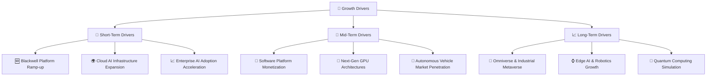
**成長驅動力結構解析：**
*   **短期驅動**：主要來自於其最新 Blackwell 平台的大規模部署，以滿足全球雲服務提供商和大型企業對 AI 基礎設施的爆炸性需求。企業級 AI 解決方案的快速採用也將貢獻短期增長。
*   **中期驅動**：NVIDIA 將通過其領先的研發能力，持續推出新的 GPU 架構，保持性能優勢。同時，CUDA 軟體平台將進一步實現商業化和訂閱服務，為公司帶來穩定的經常性收入。在自動駕駛領域，隨著技術成熟和法規完善，NVIDIA 的市場份額將持續擴大。
*   **長期驅動**：NVIDIA 在 Omniverse 和工業元宇宙等新興領域的佈局，有望在未來數年內創造全新的龐大市場。邊緣 AI 和機器人技術的發展也將推動對 NVIDIA 晶片的需求。此外，NVIDIA 在科學計算和量子計算模擬等前沿領域的探索，也為其長期增長奠定了基礎。

---

## 9. 風險矩陣

NVIDIA 雖然前景光明，但也面臨一系列潛在風險，投資者需要充分了解並評估這些風險。

### 9.1 風險評分矩陣

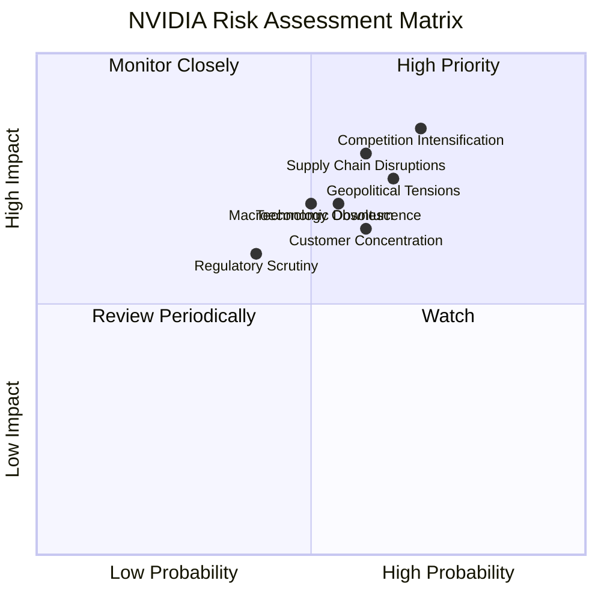
**風險評分矩陣解析：**
*   **高優先級 (High Priority)**：
    *   **競爭加劇 (Competition Intensification)**：AMD、Intel 及潛在的客戶自研晶片（如 Google TPU、AWS Trainium）都在積極進入 AI 晶片市場。NVIDIA 雖有領先優勢，但若競爭對手取得重大突破，或價格戰爆發，將嚴重影響其利潤率和市場份額。
    *   **供應鏈中斷 (Supply Chain Disruptions)**：NVIDIA 高度依賴台積電等少數高端晶圓代工廠。任何地緣政治事件（如台海局勢）、自然災害或產能限制都可能導致供應中斷，影響產品交付和營收。
*   **密切監控 (Monitor Closely)**：
    *   **地緣政治緊張 (Geopolitical Tensions)**：尤其是中美科技戰，可能導致出口限制、關稅增加，或影響其在中國市場的銷售。
    *   **宏觀經濟下行 (Macroeconomic Downturn)**：全球經濟放緩可能導致企業削減資本支出，影響數據中心和遊戲市場需求。
    *   **技術過時 (Technology Obsolescence)**：半導體行業技術迭代迅速。NVIDIA 必須持續巨額投入研發以保持領先，一旦創新停滯，可能被新技術取代。
*   **定期審查 (Review Periodically)**：
    *   **客戶集中度 (Customer Concentration)**：雲服務巨頭是 NVIDIA 數據中心業務的主要客戶。若這些客戶轉向自研晶片或與競爭對手合作，可能對 NVIDIA 造成衝擊。
    *   **監管審查 (Regulatory Scrutiny)**：NVIDIA 在 AI 晶片市場的壟斷地位可能引發反壟斷調查，導致罰款或業務限制。

### 9.2 風險清單詳細分析

| # | 風險項目 | 發生機率 | 財務衝擊 | 風險評分 | 緩解措施 |
|---|----------|----------|----------|----------|----------|
| 1 | 🔴 **競爭加劇與技術追趕** | 高 (70%) | 高 (-10%收入, -5%利潤率) | 🔴 8.5/10 | 持續巨額研發投入 ($18.50B FY2026)，保持技術領先；強化 CUDA 生態系統的客戶黏性；擴展軟體服務收入來源。 |
| 2 | 🔴 **供應鏈中斷風險** | 中 (60%) | 高 (-15%收入, -8%利潤率) | 🔴 8.0/10 | 與關鍵供應商（如台積電）建立長期戰略夥伴關係；多元化供應鏈（雖高端晶片難以實現）；增加庫存以應對短期波動。FY2026 庫存 $21.40B。 |
| 3 | 🟡 **地緣政治與貿易限制** | 中 (65%) | 中 (-8%收入, -4%利潤率) | 🟡 7.5/10 | 積極與各國政府溝通，遵守國際貿易法規；調整產品策略以適應不同市場限制；尋求非中國市場的增長機會。 |
| 4 | 🟡 **宏觀經濟下行與市場週期性** | 中 (50%) | 中 (-7%收入, -3%利潤率) | 🟡 7.0/10 | 拓展多元化應用市場（如自動駕駛、邊緣 AI），降低對單一市場的依賴；維持健康的資產負債表 ($40.36B 淨現金) 以應對經濟逆風。 |
| 5 | 🟡 **客戶集中度風險** | 中 (60%) | 中 (-5%收入, -2%利潤率) | 🟡 6.5/10 | 發展更多元的客戶基礎，包括中小型企業和新興市場客戶；深化軟硬體整合，提高客戶轉換成本；提供差異化服務。 |
| 6 | 🟡 **監管與反壟斷審查** | 低 (40%) | 中 (-3%收入, 潛在罰款) | 🟡 6.0/10 | 積極配合監管機構調查，確保合規經營；通過創新和市場擴張證明其市場地位是基於競爭而非壟斷。 |

---

## 10. 投資建議

綜合以上分析，NVIDIA 在 AI 時代的市場領導地位、卓越的財務表現和深厚的競爭護城河，使其成為當前市場中最具吸引力的成長型投資標的之一。儘管其股價在過去一年已大幅上漲，但從多個估值指標和未來成長潛力來看，仍有顯著的上漲空間。

### 10.1 最終綜合評級雷達圖

```
╔══════════════════════════════════════════════════════════════════╗
║                    NVDA 綜合評級雷達圖                           ║
╠══════════════════════════════════════════════════════════════════╣
║                                                                  ║
║  基本面強度  9.0 ▓▓▓▓▓▓▓▓▓▓▓▓▓▓▓▓▓▓░░  ★★★★★           ║
║  成長動能   10.0 ▓▓▓▓▓▓▓▓▓▓▓▓▓▓▓▓▓▓▓▓  ★★★★★           ║
║  獲利品質    9.5 ▓▓▓▓▓▓▓▓▓▓▓▓▓▓▓▓▓▓▓░  ★★★★★           ║
║  財務健康    9.0 ▓▓▓▓▓▓▓▓▓▓▓▓▓▓▓▓▓▓░░  ★★★★★           ║
║  估值合理性  7.0 ▓▓▓▓▓▓▓▓▓▓▓▓▓▓░░░░░░  ★★★★☆           ║
║  護城河深度  9.5 ▓▓▓▓▓▓▓▓▓▓▓▓▓▓▓▓▓▓▓░  ★★★★★           ║
║  管理層執行  9.0 ▓▓▓▓▓▓▓▓▓▓▓▓▓▓▓▓▓▓░░  ★★★★★           ║
║  技術創新力 10.0 ▓▓▓▓▓▓▓▓▓▓▓▓▓▓▓▓▓▓▓▓  ★★★★★           ║
║                                                                  ║
║  🏆 **綜合評級：8.9/10 - 強烈買入**                               ║
╚══════════════════════════════════════════════════════════════════╝
```

### 10.2 目標價與隱含報酬率

基於 DCF 分析和分析師共識，我們設定 NVIDIA 的 12 個月目標價區間。

| 情境 | 目標價 | 隱含報酬率 (vs $196.93) | 機率權重 | 加權平均目標價 |
|------|--------|------------------------|----------|------------------|
| 悲觀 | $275 | +39.6% | 20% | $55.00 |
| 基準 | $310 | +57.4% | 60% | $186.00 |
| 樂觀 | $350 | +77.7% | 20% | $70.00 |
| **加權平均** | **$311** | **+57.9%** | **100%** | **$311.00** |

**投資建議**：基於加權平均目標價 $311，我們給予 NVIDIA **「強烈買入」**評級。當前股價 $196.93 遠低於其內在價值。

### 10.3 買入時機與觸發因素

```
╔══════════════════════════════════════════════════════════════════╗
║                  ✅ 買入觸發因素 Checklist                      ║
╠══════════════════════════════════════════════════════════════════╣
║                                                                  ║
║  立即買入觸發條件（多數符合）：                                  ║
║  ✅ 當前股價顯著低於目標價區間 (當前 $196.93 vs $275-$350)        ║
║  ✅ 季度營收和 EPS 持續超預期成長，尤其數據中心業務              ║
║  ✅ 新產品 (如 Blackwell) 發布後市場反應積極，訂單強勁          ║
║  ✅ 宏觀經濟數據顯示科技資本支出意願強勁                         ║
║                                                                  ║
║  加碼觸發條件（出現以下任一）：                                  ║
║  ☐ 股價因非基本面因素（如大盤回調）出現 15-20% 的大幅修正        ║
║  ☐ 公司宣佈重大技術突破或新市場拓展，進一步擴大 TAM            ║
║  ☐ 軟體及服務業務變現速度超預期                                  ║
║                                                                  ║
║  減碼/停損觸發條件（出現以下任一）：                             ║
║  ☐ 數據中心營收成長顯著放緩或出現負增長                         ║
║  ☐ 競爭對手在 AI 晶片領域取得重大進展，嚴重侵蝕市場份額         ║
║  ☐ 關鍵供應鏈出現長期且無法解決的中斷                           ║
║  ☐ 監管機構對公司施加嚴重限制，影響核心業務                     ║
╚══════════════════════════════════════════════════════════════════╝
```

### 10.4 投資人適配度分析

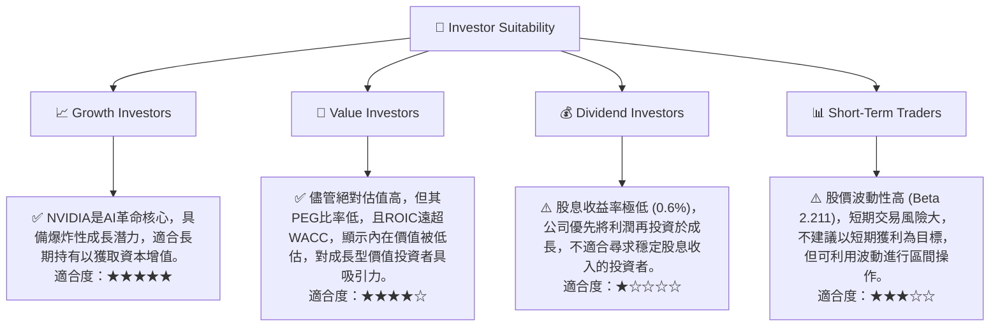

### 10.5 關鍵監控指標

| 監控類型 | 指標 | 關注點 | 頻率 |
|----------|------|----------|------|
| **成長性** | 數據中心營收成長率 (YoY, QoQ) | AI 算力需求是否持續強勁，NVIDIA 是否保持領先 | 每季財報 |
| **獲利能力** | 毛利率、營業利益率 | 產品組合變化、定價能力、成本控制效率 | 每季財報 |
| **競爭格局** | 競爭對手新產品發布、市場份額變化 | 競爭壓力是否加劇，NVIDIA 護城河是否受損 | 持續監控 |
| **供應鏈** | 庫存水平、供應商生產情況 | 供應鏈穩定性，是否有潛在瓶頸或過度庫存 | 每季財報，新聞 |
| **估值** | Forward P/E, PEG Ratio | 估值是否過高，成長預期是否合理 | 持續監控 |
| **創新** | 研發支出、新產品線、技術突破 | 是否持續保持技術領先地位 | 年度報告，新聞 |
| **宏觀經濟** | 企業資本支出意願、半導體行業景氣度 | 外部環境對公司業務的影響 | 每月/每季 |

---

> **免責聲明**：本報告為 AI 自動生成，僅供研究參考，不構成投資建議。投資有風險，入市需謹慎。