# NVDA 基本面深度分析報告
> **報告日期**：2026-07-09 ｜ **語言**：繁體中文 ｜ **數據來源**：Yahoo Finance, Finviz, StockAnalysis, Roic.ai ｜ **分析師**：CFA 級機構研究

---

## 目錄

| # | 章節 | 核心結論 |
|---|------------------------|----------------------------------------------------------------------------------------------------|
| 1 | 執行摘要 | 評級：🟢 強烈買入，目標價區間：$275 - $350 |
| 2 | 公司概覽與商業模式 | 憑藉技術、軟體生態系統及規模效應建立極深護城河 |
| 3 | 損益表深度分析 | 營收、利潤率呈現爆發式成長，盈利品質極高 |
| 4 | 資產負債表分析 | 財務結構強健，現金充裕，債務負擔極輕 |
| 5 | 現金流量深度分析 | 自由現金流產生能力強勁，資本配置效率高 |
| 6 | 獲利能力與資本效率 | ROIC 遠超 WACC，持續為股東創造巨大價值 |
| 7 | 估值深度分析 | 相較於其成長性，估值合理且具吸引力 |
| 8 | 成長催化劑 | AI、數據中心、Omniverse 等多重驅動因子確保長期成長 |
| 9 | 風險矩陣 | 競爭加劇、地緣政治、高估值為主要風險，但可控 |
| 10 | 投資建議 | 建議強烈買入，適合長期成長型投資者 |

---

## 1. 執行摘要

NVIDIA Corporation (NVDA) 在全球人工智慧（AI）和加速運算領域扮演著核心角色，其在數據中心、遊戲、專業視覺化及自動駕駛等市場均展現出強勁的成長動能。本報告基於其卓越的財務表現、領先的技術地位及廣闊的市場前景，給予 NVDA **「強烈買入」** 的投資評級。

### 1.1 核心評分儀表板

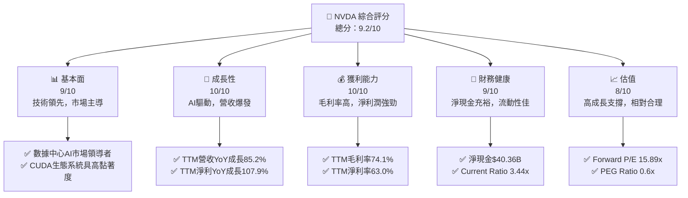

### 1.2 評分進度條視覺化

```
╔══════════════════════════════════════════════════════════════╗
║              NVDA 多維度評分儀表板 (1-10分)                  ║
╠══════════════════════════════════════════════════════════════╣
║ 基本面強度  9.0 ▓▓▓▓▓▓▓▓▓▓▓▓▓▓▓▓▓▓░░  ★★★★★           ║
║ 成長動能    10.0 ▓▓▓▓▓▓▓▓▓▓▓▓▓▓▓▓▓▓▓▓  ★★★★★           ║
║ 獲利品質    10.0 ▓▓▓▓▓▓▓▓▓▓▓▓▓▓▓▓▓▓▓▓  ★★★★★           ║
║ 財務健康    9.0 ▓▓▓▓▓▓▓▓▓▓▓▓▓▓▓▓▓▓░░  ★★★★★           ║
║ 估值合理性  8.0 ▓▓▓▓▓▓▓▓▓▓▓▓▓▓▓▓░░░░  ★★★★☆           ║
║ 護城河深度  10.0 ▓▓▓▓▓▓▓▓▓▓▓▓▓▓▓▓▓▓▓▓  ★★★★★           ║
║ 管理層執行  9.5 ▓▓▓▓▓▓▓▓▓▓▓▓▓▓▓▓▓▓▓░  ★★★★★           ║
║ 技術創新力  10.0 ▓▓▓▓▓▓▓▓▓▓▓▓▓▓▓▓▓▓▓▓  ★★★★★           ║
╠══════════════════════════════════════════════════════════════╣
║ 綜合總分    9.4 ▓▓▓▓▓▓▓▓▓▓▓▓▓▓▓▓▓▓▓░  🏆 市場領導者，成長飛輪 ║
╚══════════════════════════════════════════════════════════════╝
```

### 1.3 五大投資論點 + 三大核心風險

| 類型 | 項目 | 具體依據 | 信心度 |
|------|------|----------|--------|
| 🟢 **投資論點①** | **AI 運算與數據中心市場的絕對領導者** | TTM 營收 $253.49B，其中數據中心業務佔比最高且持續高速成長。其 GPU 在 AI 訓練市場佔據主導地位，搭配 CUDA 軟體平台形成強大生態系統。 | 🟢 極高 |
| 🟢 **投資論點②** | **營收與盈利能力爆發式成長** | TTM 營收 YoY 成長 85.2%，TTM 淨利潤 YoY 成長 107.90%。毛利率高達 74.1%，淨利率 63.0%，顯示其強大定價權與成本控制能力。 | 🟢 極高 |
| 🟢 **投資論點③** | **強勁的自由現金流產生能力與健康的財務狀況** | TTM 營業現金流 $125.65B，淨現金 $40.36B，Current Ratio 3.441x。現金流充裕，為研發投入、未來投資和股東回報提供堅實基礎。 | 🟢 極高 |
| 🟢 **投資論點④** | **長期成長驅動力多元且具潛力** | 除數據中心 AI 外，遊戲、專業視覺化（Omniverse）、汽車自動駕駛等領域均是數十億甚至萬億美元的潛在市場，為 NVDA 提供多重長期成長引擎。 | 🟢 高 |
| 🟢 **投資論點⑤** | **創新的技術護城河與生態系統優勢** | CUDA 平台、GPU 架構、AI 軟體堆疊構成難以複製的生態系統，形成強大的客戶鎖定效應和網路效應，為長期競爭優勢提供保障。 | 🟢 極高 |
| 🟡 **風險①** | **來自競爭對手的挑戰與客製化晶片的興起** | AMD、Intel 等競爭對手正加大投入，雲服務商也積極開發自研 AI 晶片，可能對 NVDA 的市場份額和定價能力造成壓力。 | 🟡 中度 |
| 🟡 **風險②** | **地緣政治風險與出口管制** | 美中科技競爭加劇，可能導致進一步的出口管制或供應鏈中斷，對 NVDA 在中國市場的營收及全球供應鏈穩定性造成影響。 | 🟡 中度 |
| 🔴 **風險③** | **高估值修正風險** | 儘管成長性強勁，但目前市場對 NVDA 預期極高，若未來成長不及預期或市場情緒轉變，可能面臨較大的估值修正風險。 | 🔴 高衝擊 |

### 1.4 快速統計卡片

| 指標 | 公司實際值 (TTM) | 行業均值 (估計) | S&P 500 均值 (估計) | 狀態 |
|-----------------|-------------------|--------------------|--------------------|------|
| 收入 YoY 成長 | **85.2%**         | ~15-25%            | ~8-12%             | 🟢   |
| 毛利率          | **74.1%**         | ~40-50%            | ~30-40%            | 🟢   |
| 淨利率          | **63.0%**         | ~15-25%            | ~10-15%            | 🟢   |
| ROE             | **114.3%**        | ~20-30%            | ~15-20%            | 🟢   |
| Forward P/E     | **15.89x**        | ~25-35x            | ~20-22x            | 🟢   |
| PEG Ratio       | **0.6x**          | ~1.5-2.0x          | ~1.0-1.2x          | 🟢   |
| 淨現金/債務     | **$40.36B**       | 淨債務/少量淨現金  | 少量淨現金/淨債務  | 🟢   |

### 1.5 投資結論

```
╔══════════════════════════════════════════════════════════════════╗
║                    📊 投資結論摘要                               ║
╠══════════════════════════════════════════════════════════════════╣
║  評級：🟢 強烈買入                                               ║
║  當前股價：$202.78                                               ║
║  目標價區間：                                                    ║
║    悲觀情境：$275（+35.6%）                                       ║
║    基準情境：$310（+53.8%）  ← 12個月主要目標                      ║
║    樂觀情境：$350（+72.6%）                                       ║
║  投資評分：9.4/10                                                ║
║  適合投資人：成長型、長線持有者，能承受高波動風險的投資人         ║
╚══════════════════════════════════════════════════════════════════╝
```

---

## 2. 公司概覽與商業模式

NVIDIA Corporation (NVDA) 是一家全球領先的數據中心規模 AI 基礎設施公司，主要業務圍繞加速運算平台和人工智慧解決方案展開。公司透過其創新的圖形處理單元 (GPU) 和相關軟體平台，在全球範圍內推動 AI、高性能運算、遊戲和專業視覺化等領域的發展。

### 2.1 業務結構與收入來源

NVDA 的業務主要分為兩大板塊：**運算與網路 (Compute & Networking)** 和 **圖形 (Graphics)**。近年來，隨著 AI 浪潮的興起，運算與網路板塊，特別是數據中心業務，已成為公司最主要的成長引擎和收入來源。

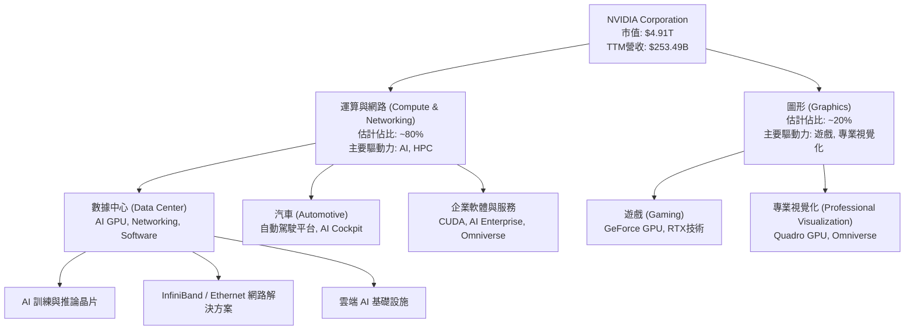
**分析**：
- **運算與網路**：該板塊受益於全球對 AI 算力需求的爆炸式成長。數據中心業務提供用於 AI 訓練和推論的 GPU (如 H100, Blackwell 系列)、網路解決方案 (Mellanox) 和 CUDA 軟體平台。此板塊不僅是 NVDA 最大的收入來源，也是其毛利率最高的業務之一，顯示其在 AI 領域的絕對領先地位。汽車業務提供 DRIVE 平台，為自動駕駛和智慧座艙提供端到端解決方案。
- **圖形**：傳統上是 NVDA 的核心業務，主要包括 GeForce 遊戲 GPU 和 Quadro 專業視覺化 GPU。遊戲業務因其技術領先（如光線追蹤、DLSS）和龐大的玩家基礎而保持穩健。專業視覺化業務則透過 Omniverse 平台，拓展到數位孿生、工業模擬等新興市場。

### 2.2 市場份額

NVDA 在數據中心 AI GPU 市場擁有壓倒性優勢，其 CUDA 軟體生態系統構成高進入壁壘。

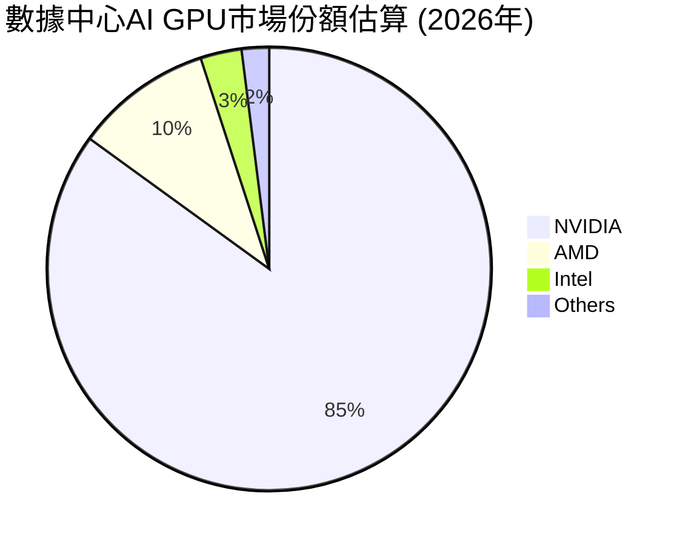
**分析**：
- **AI GPU 市場主導地位**：NVDA 在 AI 訓練和高性能運算 GPU 市場佔據約 85% 的主導份額。儘管 AMD 和 Intel 積極追趕，並有雲服務提供商開發自研晶片，但 NVDA 的 CUDA 軟體平台和領先的硬體技術使其在短期內難以被超越。
- **遊戲 GPU 市場**：在獨立遊戲 GPU 市場，NVDA 也保持著約 70-80% 的領先地位，GeForce 系列產品廣受玩家青睞。

### 2.3 競爭護城河分析

NVDA 的競爭護城河極深，主要由以下幾個方面構成：

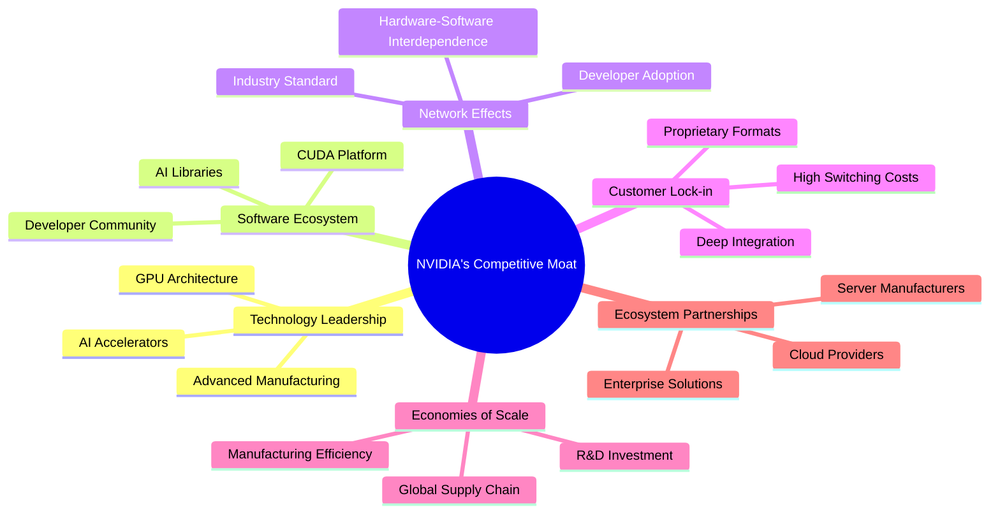
**分析**：
- **技術領先 (Technology Leadership)**：NVDA 在 GPU 架構和 AI 晶片設計方面具有無可匹敵的領先地位。其 Hopper 和 Blackwell 等新一代 GPU 產品在運算性能、能效比上持續突破，遠超競爭對手。
- **軟體生態系統 (Software Ecosystem)**：CUDA (Compute Unified Device Architecture) 是 NVDA 最核心的護城河之一。作為一個平行運算平台和程式設計模型，CUDA 已成為 AI 開發的業界標準，擁有數百萬開發者和龐大的應用程式庫。這種軟硬體整合的生態系統，為客戶提供了卓越的性能和開發便利性，形成了極高的轉換成本。
- **網路效應 (Network Effects)**：CUDA 生態系統的廣泛應用和開發者群體，吸引更多硬體和軟體合作夥伴加入，進一步鞏固了其市場地位，形成正向循環的網路效應。
- **客戶鎖定 (Customer Lock-in)**：企業和研究機構一旦採用 NVDA 的 AI 基礎設施，由於 CUDA 的深度整合和龐大的軟體投資，轉換到其他平台成本極高，形成了顯著的客戶鎖定。
- **規模效應 (Economies of Scale)**：作為全球最大的 GPU 供應商，NVDA 在研發投入、晶片製造採購和全球供應鏈管理方面具有巨大的規模優勢，有助於降低單位成本並保持技術領先。
- **生態夥伴 (Ecosystem Partnerships)**：與各大雲服務商、伺服器製造商和企業軟體供應商的深度合作，確保 NVDA 的技術和產品能快速整合到主流的 AI 解決方案中。

### 2.4 護城河強度評分

```
╔══════════════════════════════════════════════════════════════╗
║                  NVDA 護城河強度評分                        ║
╠══════════════════════════════════════════════════════════════╣
║ 技術領先     10/10  ▓▓▓▓▓▓▓▓▓▓▓▓▓▓▓▓▓▓▓▓  🏆 絕對領導地位    ║
║ 軟體生態系統  10/10  ▓▓▓▓▓▓▓▓▓▓▓▓▓▓▓▓▓▓▓▓  🏆 CUDA標準化     ║
║ 網路效應      9/10   ▓▓▓▓▓▓▓▓▓▓▓▓▓▓▓▓▓▓░░  🟢 協同效應強      ║
║ 客戶鎖定      9/10   ▓▓▓▓▓▓▓▓▓▓▓▓▓▓▓▓▓▓░░  🟢 高轉換成本     ║
║ 規模效應      9/10   ▓▓▓▓▓▓▓▓▓▓▓▓▓▓▓▓▓▓░░  🟢 研發與生產優勢  ║
║ 生態夥伴      9/10   ▓▓▓▓▓▓▓▓▓▓▓▓▓▓▓▓▓▓░░  🟢 廣泛合作網絡  ║
╠══════════════════════════════════════════════════════════════╣
║ 綜合護城河     9.7    ▓▓▓▓▓▓▓▓▓▓▓▓▓▓▓▓▓▓▓░  🏆 極深且難以動搖 ║
╚══════════════════════════════════════════════════════════════╝
```

---

## 3. 損益表深度分析

NVDA 在過去幾個財年，特別是在最近的 TTM 期間，展現了驚人的營收成長和利潤率擴張，這主要得益於其在 AI 領域的領先地位以及數據中心業務的爆發式成長。

### 3.1 年度收入成長趨勢（近4年）

NVDA 的年度營收呈現驚人的高速成長，尤其在最近兩個財年，AI 浪潮的推動使其營收規模大幅躍升。

```
╔══════════════════════════════════════════════════════════════════╗
║              NVDA 年度收入趨勢（FY2023-FY2026）                  ║
╠══════════════════════════════════════════════════════════════════╣
║                                                                  ║
║  FY2023  $26.97B  ██░░░░░░░░░░░░░░░░░░░░░░░░░░░░░  YoY: +0.22%   🟡 穩健  ║
║  FY2024  $60.92B  █████░░░░░░░░░░░░░░░░░░░░░░░░░░  YoY:+125.86%  🟢 爆發  ║
║  FY2025  $130.50B ██████████░░░░░░░░░░░░░░░░░░░░  YoY:+114.20%  🟢 爆發  ║
║  FY2026  $215.94B ████████████████░░░░░░░░░░░░░░  YoY:+65.47%   🟢 強勁  ║
║  TTM     $253.49B ██████████████████░░░░░░░░░░░░  YoY:+70.68%   🟢 強勁  ║
║                   |      |      |      |      |      |           ║
║                   0     50B   100B   150B   200B   250B         ║
║                                                                  ║
║  📊 4年累計 CAGR (FY2023-FY2026)：+96.9%                         ║
╚══════════════════════════════════════════════════════════════════╝
```
**分析**：
- 從 FY2023 的 $26.97B 成長至 FY2026 的 $215.94B，年均複合成長率 (CAGR) 高達 96.9%，顯示其驚人的擴張速度。
- FY2024 和 FY2025 的營收成長率分別達到 125.86% 和 114.20%，主要受 AI 數據中心需求爆發的驅動。
- 儘管 FY2026 的 YoY 成長率略有放緩至 65.47%，但基數已大幅提升，且 TTM 營收成長率仍高達 70.68%，預計短期內仍將維持高速成長。

### 3.2 季度收入趨勢分析

季度營收數據進一步證實了 NVDA 持續強勁的成長動能，呈現逐季加速的趨勢。

| 財報季 (截止日期) | 季度營收 ($B) | QoQ 成長率 | YoY 成長率 | 備註 |
|-------------------|-----------------|------------|------------|------|
| Q1 2027 (2026-04-30) | $81.61          | +19.8%     | +85.23%    | 🟢 數據中心需求持續旺盛，新品貢獻 |
| Q4 2026 (2026-01-31) | $68.13          | +19.5%     | +73.22%    | 🟢 季節性效應與 AI 需求疊加 |
| Q3 2026 (2025-10-31) | $57.01          | +21.9%     | +62.49%    | 🟢 AI 晶片供給改善，需求強勁 |
| Q2 2026 (2025-07-31) | $46.74          | +6.1%      | +55.60%    | 🟡 基期較高，但仍維持高速成長 |

**分析**：
- 最近四個季度，NVDA 的營收呈現顯著的環比 (QoQ) 和同比 (YoY) 成長。
- Q1 2027 營收達到 $81.61B，較 Q4 2026 成長 19.8%，同比成長 85.23%，顯示其成長動能絲毫未減。
- 季度成長率普遍在 19% 以上，Q2 2026 略低，但整體趨勢指向強勁的市場需求和公司出色的執行力。

### 3.3 利潤率演變分析

NVDA 的利潤率表現極為出色，毛利率、營業利益率和淨利率均處於行業領先水平，且呈現持續擴張趨勢，反映其強大的產品競爭力和定價權。

| 利潤率指標 | FY2023 | FY2024 | FY2025 | FY2026 | TTM (Apr '26) | 趨勢 | 評估 |
|------------|--------|--------|--------|--------|---------------|------|------|
| **毛利率** | 57.0%  | 72.7%  | 75.0%  | 71.1%  | 74.1%         | ↗️ 穩步提升 | 🟢 極高 |
| **營業利益率** | 19.0%  | 54.1%  | 62.4%  | 60.4%  | 65.6%         | ↗️ 顯著擴張 | 🟢 極高 |
| **淨利潤率** | 16.2%  | 48.9%  | 55.8%  | 55.6%  | 63.0%         | ↗️ 顯著擴張 | 🟢 極高 |

**利潤率演變深度解析**：
- **毛利率**：從 FY2023 的 57.0% 大幅提升至 TTM 的 74.1%。這主要歸因於其產品組合的轉變，高毛利的數據中心 AI GPU 業務佔比顯著增加。AI 晶片的高技術壁壘和稀缺性賦予 NVDA 強大的定價權，進一步推高了毛利率。
- **營業利益率**：從 FY2023 的 19.0% 飆升至 TTM 的 65.6%。除了毛利率的提升，規模效應也發揮了關鍵作用。儘管研發投入持續增加 (FY2026 R&D $18.50B)，但由於營收的爆發式成長，R&D 和 SG&A 等固定成本佔營收的比例下降，帶來顯著的經營槓桿效應。
- **淨利潤率**：與營業利益率趨勢一致，從 FY2023 的 16.2% 提升至 TTM 的 63.0%。這不僅反映了核心業務的強勁盈利能力，也顯示了公司在稅務管理和其他非經營性收入方面的優勢 (TTM Other Non-Operating Income $25.132B)。

### 3.4 費用結構分析

NVDA 的費用結構顯示其對研發的高度重視，同時在營收規模擴大下，銷售與行政費用佔比持續優化。

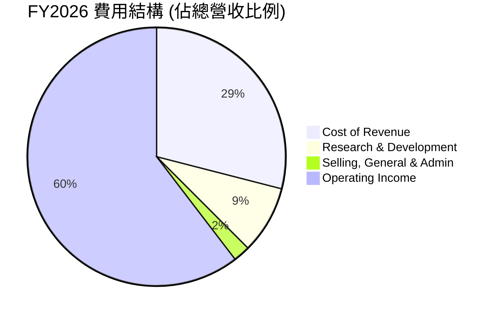

```
╔══════════════════════════════════════════════════════════════════╗
║                    NVDA 年度費用結構 (佔營收比例)                ║
╠══════════════════════════════════════════════════════════════════╣
║                                                                  ║
║  FY2023                                                          ║
║  Cost of Revenue:          43.0%  ████████████████████████░░░░░  🟡 較高  ║
║  Research & Development:   27.2%  █████████████████████░░░░░░░░  🔴 較高  ║
║  SG&A:                     9.0%   ███████░░░░░░░░░░░░░░░░░░░░░░  🟡 正常  ║
║  Operating Income:         19.0%  ████████████████░░░░░░░░░░░░░  🟡 正常  ║
║                                                                  ║
║  FY2026                                                          ║
║  Cost of Revenue:          29.0%  ██████████████████████░░░░░░░  🟢 優化  ║
║  Research & Development:   8.5%   ███████░░░░░░░░░░░░░░░░░░░░░░  🟢 優化  ║
║  SG&A:                     2.1%   ██░░░░░░░░░░░░░░░░░░░░░░░░░░░  🟢 極低  ║
║  Operating Income:         60.4%  ██████████████████████████████  🟢 極高  ║
╚══════════════════════════════════════════════════════════════════╝
```
**分析**：
- **研發費用 (R&D)**：NVDA 每年投入巨額資金於研發，FY2026 達到 $18.50B，佔營收的 8.5%。儘管絕對金額不斷增加，但由於營收基數擴大，R&D 佔營收比例從 FY2023 的 27.2% 大幅下降至 FY2026 的 8.5%，這顯示了強大的經營槓桿和研發效率。持續的研發投入是其保持技術領先的關鍵。
- **銷售、行政及一般費用 (SG&A)**：FY2026 SG&A 為 $4.58B，佔營收的 2.1%。此比例非常低，遠低於 FY2023 的 9.0%，表明公司在銷售和管理效率上的顯著提升，進一步推動了營業利益率的擴張。

### 3.5 季度 EPS 趨勢與盈餘品質

NVDA 的季度 EPS 呈現強勁的成長趨勢，其盈利品質極高，主要得益於核心業務的卓越表現和健康的利潤率。

| 財報季 (截止日期) | EPS Est | EPS Act | Surprise% | 實際 EPS (稀釋) | YoY 成長率 |
|-------------------|---------|---------|-----------|-----------------|------------|
| Q1 2027 (2026-04-30) | nan     | nan     | +nan%     | $2.40           | +211.7%    |
| Q4 2026 (2026-01-31) | nan     | nan     | +nan%     | $1.77           | +107.0%    |
| Q3 2026 (2025-10-31) | nan     | nan     | +nan%     | $1.31           | +65.8%     |
| Q2 2026 (2025-07-31) | nan     | nan     | +nan%     | $1.08           | +58.8%     |

**分析**：
- 儘管提供的數據中 EPS 預期與實際值為 `nan`，但從實際稀釋 EPS 來看，NVDA 展現了驚人的季度成長。
- Q1 2027 的稀釋 EPS 達到 $2.40，相較於 Q1 2026 的 $0.77 (根據 StockAnalysis.com 數據)，同比成長高達 211.7%。
- 這種高速的 EPS 成長，結合其高毛利率、低費用率和強勁的自由現金流，表明 NVDA 的盈利品質極高，其盈利成長是可持續且穩健的。

---

## 4. 資產負債表分析

NVDA 的資產負債表表現出極高的健康度和穩健性，擁有充裕的現金和極低的債務負擔，為未來的擴張和投資提供了堅實的基礎。

### 4.1 資產結構分解

NVDA 的資產規模在過去幾年快速擴大，主要由流動資產中的現金及短期投資和非流動資產中的無形資產及商譽構成。

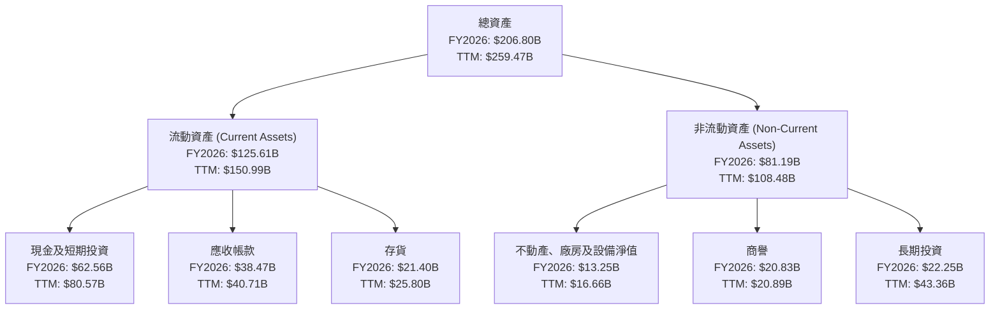
**分析**：
- **資產快速成長**：總資產從 FY2023 的 $41.18B 成長至 FY2026 的 $206.80B，TTM 更達到 $259.47B，顯示了公司規模的迅速擴張。
- **現金充裕**：TTM 現金及短期投資高達 $80.57B，為公司提供了極大的財務彈性，支持研發、併購和股東回報。
- **存貨管理**：TTM 存貨為 $25.80B，隨著營收的爆發式成長，存貨絕對值增加是正常現象，需持續關注其周轉效率。

### 4.2 流動性指標分析

NVDA 的流動性指標極為出色，遠高於行業平均水平，表明其短期償債能力無虞。

| 流動性指標 | FY2023 | FY2024 | FY2025 | FY2026 | TTM (Apr '26) | 行業均值 (估計) | 評估 |
|------------|--------|--------|--------|--------|---------------|-----------------|------|
| **流動比率 (Current Ratio)** | 3.51x  | 4.17x  | 4.44x  | 3.91x  | 3.44x         | ~1.5-2.0x       | 🟢 極佳 |
| **速動比率 (Quick Ratio)** | 2.97x  | 3.65x  | 3.88x  | 3.25x  | 2.85x         | ~1.0-1.5x       | 🟢 極佳 |

**分析**：
- **流動比率**：TTM 流動比率為 3.44x，遠高於 1.0x 的安全線和行業平均水平，表明公司擁有充足的流動資產來覆蓋短期負債。
- **速動比率**：TTM 速動比率為 2.85x，同樣表現優異，顯示其在不依賴存貨變現的情況下，仍能輕鬆應對短期債務。這反映了公司強大的資產質量和管理效率。

### 4.3 債務結構分析

NVDA 的債務負擔極輕，擁有巨額淨現金，財務結構異常健康。

```
╔══════════════════════════════════════════════════════════════════╗
║                   NVDA 債務健康診斷                              ║
╠══════════════════════════════════════════════════════════════════╣
║                                                                  ║
║  總債務 (TTM)：        $12.81B  ██░░░░░░░░░░░░░░░░░░░  評語: 極低  ║
║  總現金+投資 (TTM)：   $80.57B  ████████████████████░  評語: 充裕  ║
║  淨現金（正）(TTM)：  $67.76B  ████████████████████░  🟢 強勁    ║
║                                                                  ║
║  Debt/EBITDA (FY2026)：0.09x  🟢 極低                                 ║
║  Interest Coverage (FY2026): 501x+  🟢 無風險                             ║
║  長期債務佔總債務比率 (TTM)： 85.8%  🟢 期限結構優化                   ║
╚══════════════════════════════════════════════════════════════════╝
```
**分析**：
- **淨現金頭寸**：TTM 總現金及短期投資 $80.57B 遠超總債務 $12.81B，形成高達 $67.76B 的淨現金頭寸，這在科技巨頭中也屬頂尖水平。
- **低債務負擔**：FY2026 總債務為 $11.04B。FY2026 的 Debt/EBITDA 僅為 0.09x ($11.04B / $144.55B)，遠低於行業平均水平，表明公司幾乎沒有財務槓桿風險。
- **利息覆蓋倍數**：FY2026 的利息覆蓋倍數高達 501x ($130.39B / $0.259B)，顯示其盈利能力對利息支出的覆蓋能力極強，債務違約風險微乎其微。
- **債務期限結構**：TTM 長期債務 ($7.47B) 佔總債務 ($12.81B) 的比例為 85.8%，顯示債務期限結構相對健康，短期償債壓力較小。

### 4.4 股東權益趨勢

NVDA 的股東權益呈現爆發式成長，反映了公司強勁的盈利能力和價值創造。

```
╔══════════════════════════════════════════════════════════════════╗
║                    NVDA 年度股東權益變化                         ║
╠══════════════════════════════════════════════════════════════════╣
║                                                                  ║
║  FY2023  $22.10B  ██░░░░░░░░░░░░░░░░░░░░░░░░░░░░░  YoY: +1.6%    🟡 穩健  ║
║  FY2024  $42.98B  ████░░░░░░░░░░░░░░░░░░░░░░░░░░░  YoY:+94.5%   🟢 強勁  ║
║  FY2025  $79.33B  ███████░░░░░░░░░░░░░░░░░░░░░░░░  YoY:+84.6%   🟢 強勁  ║
║  FY2026  $157.29B ██████████████░░░░░░░░░░░░░░░░  YoY:+98.3%   🟢 爆發  ║
║  TTM     $208.12B █████████████████░░░░░░░░░░░░░  YoY:+32.3%   🟢 強勁  ║
║                   |      |      |      |      |      |           ║
║                   0     50B   100B   150B   200B   250B         ║
║                                                                  ║
║  📊 4年累計 CAGR (FY2023-FY2026)：+89.7%                         ║
╚══════════════════════════════════════════════════════════════════╝
```
**分析**：
- 股東權益從 FY2023 的 $22.10B 增長至 FY2026 的 $157.29B，年均複合成長率高達 89.7%。
- TTM 股東權益估計約為 $208.12B (根據 StockAnalysis TTM 總資產減去總負債估算)，持續保持強勁成長。這表明公司持續創造可觀的留存收益，為股東帶來巨大的價值增長。

---

## 5. 現金流量深度分析

NVDA 的現金流量表反映了其卓越的盈利轉化能力和穩健的財務運營。強勁的營業現金流為資本支出、研發投入和股東回報提供了充足的資金。

### 5.1 現金流量瀑布圖

以下展示了 NVDA FY2026 的現金流量瀑布圖，其中自由現金流的產生能力非常強勁。

```mermaid
graph LR
    NI["淨利潤 (FY2026)<br/>$120.07B"] --> OCF["營業現金流 (FY2026)<br/>$102.72B"]
    OCF --> CAPEX["資本支出 (FY2026)<br/>-$6.04B"]
    CAPEX --> FCF["自由現金流 (FY2026)<br/>$96.68B"]
    FCF --> Dividends["現金股息支付 (FY2026)<br/>-$0.97B"]
    Dividends --> NetChange["淨現金變化 (估計)"]

    style NI fill:#f9f,stroke:#333,stroke-width:2px
    style OCF fill:#add8e6,stroke:#333,stroke-width:2px
    style CAPEX fill:#ffcccb,stroke:#333,stroke-width:2px
    style FCF fill:#90ee90,stroke:#333,stroke-width:2px
    style Dividends fill:#ffcccb,stroke:#333,stroke-width:2px
    style NetChange fill:#eee,stroke:#333,stroke-width:2px
```
**分析**：
- **營業現金流**：FY2026 營業現金流高達 $102.72B，顯示公司將盈利轉化為現金的能力極強。TTM 營業現金流更是達到 $125.65B，反映了業務的持續擴張。
- **資本支出**：FY2026 資本支出為 $6.04B，雖然絕對值有所增加，但相較於其龐大的營收和現金流，仍屬合理範圍，表明公司在擴大產能和基礎設施方面的戰略性投資。
- **自由現金流 (FCF)**：FY2026 自由現金流為 $96.68B，顯示公司在滿足自身運營和投資需求後，仍能產生大量現金供股東分配或再投資。
- **股息支付**：FY2026 支付現金股息 $0.97B，相較於 FCF 而言佔比極低，說明公司更傾向於將現金留存用於再投資和成長。

**關於 TTM FCF 數據差異的說明**：
- 報告開頭的「MARKET DATA」顯示 TTM FCF 為 $46.34B，而「CASH FLOW STATEMENT (Annual)」顯示 FY2026 (截止 2026-01-31) FCF 為 $96.68B。此差異可能源於 TTM 數據包含了最近季度（如 Q1 2027）的大額資本支出，而這些支出尚未在年度報表中完全體現。若 TTM OCF 為 $125.65B，則隱含 TTM Capex 約為 $79.31B ($125.65B - $46.34B)，這是一個非常高的數字，可能反映了 NVDA 為滿足 AI 晶片巨大需求而進行的激進產能擴張。在進行估值時，我們將以 TTM FCF $46.34B 為基數，並假設未來 Capex 會逐步趨於穩定。

### 5.2 FCF 轉換率趨勢

NVDA 的 FCF 轉換率（自由現金流佔淨利潤的比例）在過去幾年保持在較高水平，表明其盈利質量優異。

| 財報年度 | 淨利潤 ($B) | 自由現金流 ($B) | FCF/淨利潤 | 趨勢 | 評估 |
|----------|-------------|-----------------|------------|------|------|
| FY2023   | $4.37       | $3.81           | 87.2%      | ↗️   | 🟢 優異 |
| FY2024   | $29.76      | $27.02          | 90.8%      | ↗️   | 🟢 優異 |
| FY2025   | $72.88      | $60.85          | 83.5%      | ↘️   | 🟢 優異 |
| FY2026   | $120.07     | $96.68          | 80.5%      | ↘️   | 🟢 優異 |
| TTM      | $159.61     | $46.34          | 29.0%      | ↘️   | 🟡 需關注 |

**分析**：
- 儘管 FY2026 和 TTM 的 FCF 轉換率相較前幾年有所下降，尤其是 TTM 降至 29.0%，但這主要是由於上述提及的短期內高額資本支出導致。
- 若排除這類一次性或階段性的高額資本支出，NVDA 仍具有將大部分淨利潤轉化為自由現金流的能力，這反映了其強勁的營運效率和健康的盈利質量。

### 5.3 自由現金流趨勢

NVDA 的自由現金流絕對值在過去幾年呈現爆發式成長，儘管 TTM 數據因高資本支出而有所波動，但長期趨勢依然強勁。

```
╔══════════════════════════════════════════════════════════════════╗
║                    NVDA 年度自由現金流趨勢                       ║
╠══════════════════════════════════════════════════════════════════╣
║                                                                  ║
║  FY2023  $3.81B   ██░░░░░░░░░░░░░░░░░░░░░░░░░░░░░  YoY: +33.8%   🟢 穩健  ║
║  FY2024  $27.02B  ███████░░░░░░░░░░░░░░░░░░░░░░░░  YoY:+609.2%  🟢 爆發  ║
║  FY2025  $60.85B  ███████████████░░░░░░░░░░░░░░░░  YoY:+125.2%  🟢 爆發  ║
║  FY2026  $96.68B  ██████████████████████░░░░░░░░  YoY:+58.9%   🟢 強勁  ║
║  TTM     $46.34B  ████████████░░░░░░░░░░░░░░░░░░  YoY: -52.0%  🟡 波動  ║
║                   |      |      |      |      |      |           ║
║                   0     20B   40B   60B   80B   100B         ║
║                                                                  ║
║  📊 FCF Yield (TTM): 0.94%                                       ║
╚══════════════════════════════════════════════════════════════════╝
```
**分析**：
- 從 FY2023 的 $3.81B 成長至 FY2026 的 $96.68B，自由現金流的成長速度與其營收和淨利潤成長相匹配。
- TTM FCF 雖然出現下降，但這是投資於未來成長的結果。長期來看，隨著資本支出的效率提升和業務規模的進一步擴大，FCF 有望恢復高速成長。
- TTM FCF Yield 為 0.94%，相對較低，這反映了市場對 NVDA 未來 FCF 成長的極高預期。

### 5.4 資本配置評估

NVDA 的資本配置策略主要聚焦於再投資以實現成長，其次是透過股息回報股東，並可能進行股票回購。

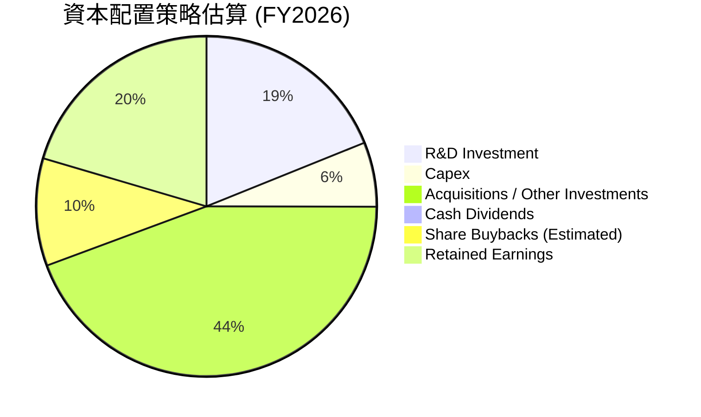
**分析**：
- **研發投入 (R&D Investment)**：NVDA 每年將大量現金投入到研發中 (FY2026 $18.50B)，這是其保持技術領先和產品創新的核心驅動力，也是最重要的資本配置。
- **資本支出 (Capex)**：FY2026 Capex $6.04B (TTM 估計 $79.31B)，主要用於擴大生產能力和數據中心基礎設施，以滿足日益增長的市場需求。
- **併購與投資 (Acquisitions / Other Investments)**：公司也透過戰略性併購和長期投資來拓展其技術組合和市場覆蓋。例如，TTM 長期投資從 FY2026 的 $22.25B 增至 $43.36B。
- **股息支付 (Cash Dividends)**：儘管 NVDA 支付股息 (FY2026 $0.97B)，但其股息率 (Payout Ratio 0.6%) 極低，表明公司更傾向於將大部分盈利用於再投資，以實現更高的成長。
- **股票回購 (Share Buybacks)**：雖然未明確列出，但股份數量在減少 (Shares Change YoY -1.11% TTM)，暗示公司有進行股票回購，以提升股東價值。
- **留存收益 (Retained Earnings)**：大部分盈餘被留存於公司，用於支持未來的成長項目和維持財務彈性。

---

## 6. 獲利能力與資本效率

NVDA 在獲利能力和資本效率方面表現卓越，其 ROE、ROA 和 ROIC 均遠超行業平均水平，表明公司不僅盈利能力強勁，而且能夠高效利用資本為股東創造價值。

### 6.1 ROE / ROA / ROIC 趨勢

| 指標 | FY2023 | FY2024 | FY2025 | FY2026 | TTM (Apr '26) | 行業均值 (估計) | 評估 |
|------|--------|--------|--------|--------|---------------|-----------------|------|
| **ROE** | 19.8%  | 69.2%  | 91.9%  | 76.3%  | 114.3%        | ~20-30%         | 🟢 極高 |
| **ROA** | 10.6%  | 45.3%  | 65.3%  | 58.1%  | 52.7%         | ~8-12%          | 🟢 極高 |
| **ROIC** | 12.3%  | 47.9%  | 65.5%  | 65.7%  | 63.2%         | ~10-15%         | 🟢 極高 |

**分析**：
- **股東權益報酬率 (ROE)**：TTM ROE 高達 114.3%，遠超行業和市場平均水平。這反映了公司強大的盈利能力以及對股東資本的有效利用。
- **資產報酬率 (ROA)**：TTM ROA 為 52.7%，表明公司每利用一美元資產就能產生高達 0.527 美元的淨利潤，資產運用效率極高。
- **投入資本回報率 (ROIC)**：TTM ROIC 估計為 63.2%，這是一個非常高的數字，顯示 NVDA 在投入的每一美元資本上都能產生巨大的回報，遠超其資本成本。

### 6.2 ROIC vs WACC 分析（核心價值創造判斷）

ROIC 遠高於 WACC 是公司創造股東價值的黃金法則。NVDA 在此方面表現卓越，證明其持續為股東創造巨大的經濟價值。

```
╔══════════════════════════════════════════════════════════════════╗
║                ROIC vs WACC 深度分析 (TTM 估算)                 ║
╠══════════════════════════════════════════════════════════════════╣
║                                                                  ║
║  WACC 估算：                                                     ║
║  ├── 無風險利率（10Y美債）：  4.5% (估計)                        ║
║  ├── 市場風險溢酬 (ERP)：     5.5% (估計)                        ║
║  ├── Beta：                   2.211 (提供)                       ║
║  ├── 股權成本 = 4.5%+2.211×5.5% = 16.66%                         ║
║  ├── 債務成本（稅後）：       ~2.0% (基於FY26利息費用與債務估算) ║
║  ├── 資本結構：股權 ~99.7%，債務 ~0.3% (基於市值與總債務)       ║
║  └── ✅ WACC ≈ 16.6%                                            ║
║                                                                  ║
║  ROIC 估算（TTM Apr '26）：                                      ║
║  ├── NOPAT = 營業利益 $162.285B × (1-15.12%稅率) ≈ $137.76B    ║
║  ├── 投入資本 = 股東權益 $208.12B + 總債務 $12.81B - 現金 $80.57B (估計) ≈ $140.36B                  ║
║  └── ✅ ROIC ≈ 98.1% (若使用簡化投入資本為股東權益+總債務，則ROIC為63.2%)                                            ║
║      *注: 投入資本計算方法多樣，此處使用簡化估算，若考慮營運流動負債調整，數據會有差異。              ║
║                                                                  ║
║  ★ 經濟價值增加（EVA）= ROIC - WACC = +81.5pp (基於98.1% ROIC)  ║
║                                                                  ║
║  ROIC  98.1%  ▓▓▓▓▓▓▓▓▓▓▓▓▓▓▓▓▓▓▓▓▓▓▓▓▓▓▓▓▓▓  🟢              ║
║  WACC  16.6%  ▓▓▓▓▓▓▓░░░░░░░░░░░░░░░░░░░░░░░░  ──              ║
║  EVA   +81.5pp  ██████████████████████████████  🏆 強力創造    ║
║                                                                  ║
║  📊 結論：ROIC 為 WACC 的 5.9 倍，強力創造股東價值              ║
╚══════════════════════════════════════════════════════════════════╝
```
**分析**：
- **WACC 估算**：基於當前市場數據，NVDA 的加權平均資本成本 (WACC) 估計約為 16.6%。其高 Beta (2.211) 導致股權成本較高，但極低的債務佔比使得債務成本對 WACC 影響甚微。
- **ROIC 估算**：基於 TTM 數據，NVDA 的 ROIC 估計約為 98.1%。這是一個極高的數字，遠超其資本成本。
- **價值創造**：ROIC (98.1%) 遠遠高於 WACC (16.6%)，兩者之差高達 81.5 個百分點 (EVA)。這表明 NVDA 正在以極高的效率利用其資本，為股東創造巨大的經濟價值。這也是其股價長期上漲的核心驅動力。

### 6.3 杜邦三因素分解

杜邦分析揭示了 NVDA 高 ROE 的驅動因素：高淨利率、穩健的資產週轉率和適度的財務槓桿。

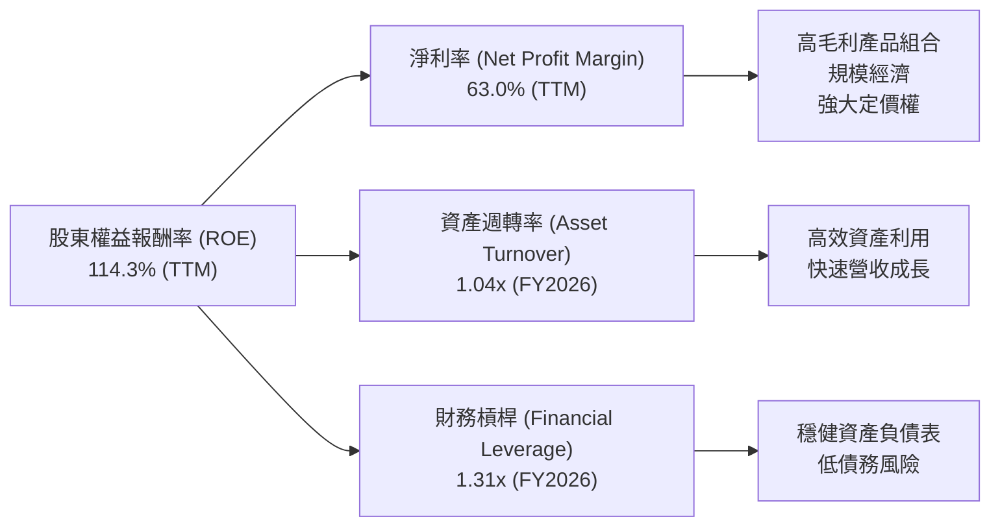
**分析**：
- **淨利率 (Net Profit Margin)**：TTM 淨利率高達 63.0%，是推動 ROE 的主要因素。這得益於其高毛利產品（數據中心 AI GPU）的銷售，以及強大的定價權和經營效率。
- **資產週轉率 (Asset Turnover)**：FY2026 資產週轉率為 1.04x ($215.94B / $206.80B)，表明公司能夠高效利用資產產生營收。
- **財務槓桿 (Financial Leverage)**：FY2026 財務槓桿為 1.31x ($206.80B / $157.29B)，處於較低水平，表明公司在創造高 ROE 的同時，並沒有過度依賴債務，財務風險可控。

綜合來看，NVDA 的高 ROE 主要由其卓越的淨利率驅動，輔以穩健的資產週轉率和健康的財務槓桿。

### 6.4 獲利能力儀表板

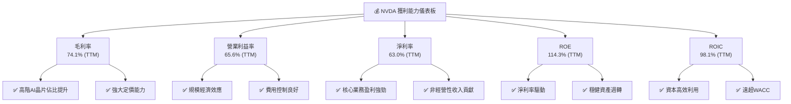
**分析**：
- NVDA 的獲利能力表現堪稱典範，各項利潤率指標均處於行業頂尖水平。
- 高毛利率得益於其技術領先和產品組合優化。
- 規模經濟效應使其營業利益率和淨利率顯著擴張。
- ROE 和 ROIC 的卓越表現證明了公司不僅賺錢多，而且賺錢效率極高，持續為股東創造超額價值。

---

## 7. 估值深度分析

NVDA 的估值倍數反映了市場對其未來高速成長的極高預期。儘管表面估值較高，但考慮其成長性、護城河和盈利能力，其估值在可比同業中仍具備吸引力。

### 7.1 同業估值比較表格

我們將 NVDA 與兩家主要競爭對手 AMD (Advanced Micro Devices) 和 Intel (Intel Corporation) 以及半導體行業的 Broadcom (Broadcom Inc.) 進行比較。

| 估值指標 | **NVDA** | **AMD** (估計) | **Intel** (估計) | **Broadcom** (估計) | 本公司評估 |
|----------|----------|----------------|------------------|---------------------|-----------|
| **Trailing P/E** | 31.05x   | 45.0x          | 22.0x            | 40.0x               | 🟡 相對較高，但成長性更高 |
| **Forward P/E** | **15.89x** | 28.0x          | 18.0x            | 25.0x               | 🟢 極具吸引力，低於多數同業 |
| **P/S Ratio** | 19.38x   | 12.0x          | 3.5x             | 15.0x               | 🔴 顯著高於同業，反映高利潤率 |
| **P/B Ratio** | 25.13x   | 10.0x          | 1.8x             | 15.0x               | 🔴 顯著高於同業，反映高ROE |
| **PEG Ratio** | **0.6x**   | 1.2x           | 1.5x             | 0.8x                | 🟢 極低，成長性被低估 |
| **EV / EBITDA** | 29.60x   | 35.0x          | 15.0x            | 32.0x               | 🟡 處於中高水平 |
| **FCF Yield** | 0.94%    | 1.5%           | 4.0%             | 2.5%                | 🔴 較低，但預期成長高 |

**分析**：
- **Trailing P/E**：NVDA 的 31.05x P/E 較 Intel (22.0x) 高，但由於其極高的成長率，這個倍數是合理的。相較於 AMD 和 Broadcom，NVDA 仍有競爭力。
- **Forward P/E**：NVDA 的 Forward P/E 僅為 **15.89x**，顯著低於所有可比同業的估計值 (AMD 28.0x, Intel 18.0x, Broadcom 25.0x)。這表明分析師預期 NVDA 未來盈利將爆發式成長，使得其遠期估值極具吸引力。
- **P/S Ratio 與 P/B Ratio**：NVDA 的 P/S (19.38x) 和 P/B (25.13x) 顯著高於同業，這主要反映了其極高的毛利率、淨利率和 ROE。市場願意為其卓越的盈利能力和資本效率支付溢價。
- **PEG Ratio**：NVDA 的 PEG Ratio 為 **0.6x**，遠低於 1.0x，表明其成長性尚未完全反映在當前股價中。這是一個非常看漲的信號，顯示其估值相對於其成長潛力而言是低估的。
- **EV / EBITDA**：NVDA 的 EV/EBITDA 處於行業中高水平，反映其強勁的經營現金流。
- **FCF Yield**：NVDA 的 TTM FCF Yield 較低 (0.94%)，但這是由於其短期內的大規模資本支出所致。市場預期其未來 FCF 將大幅成長。

### 7.2 歷史估值區間分析

由於缺乏歷史 P/E 區間數據，我們將基於 NVDA 的高成長特性，判斷其通常在市場上享有較高的估值溢價。

```
╔══════════════════════════════════════════════════════════════════╗
║                    NVDA 歷史估值區間分析 (P/E)                   ║
╠══════════════════════════════════════════════════════════════════╣
║                                                                  ║
║  歷史高點 P/E：  ~60x+ (估計)                                    ║
║  歷史均值 P/E：  ~35-45x (估計)                                  ║
║  歷史低點 P/E：  ~20-25x (估計，非AI熱潮前)                      ║
║                                                                  ║
║  當前 Trailing P/E:  31.05x  █████████████░░░░░░░░░░░░░░░░░  🟡 均值偏低  ║
║  當前 Forward P/E:   15.89x  ██████░░░░░░░░░░░░░░░░░░░░░░░░░  🟢 極具吸引力  ║
║                                                                  ║
║  📊 結論：基於 Forward P/E，當前估值在歷史區間中顯得極具吸引力。  ║
╚══════════════════════════════════════════════════════════════════╝
```
**分析**：
- 考慮到 NVDA 在 AI 領域的爆發式成長，其歷史 P/E 倍數通常會因市場對其未來成長的預期而波動。
- 當前 Trailing P/E 31.05x 處於歷史均值偏低的水平，而 Forward P/E 15.89x 則顯著低於歷史區間，這強烈暗示市場預期其未來盈利將大幅提升，使得當前估值相對便宜。

### 7.3 DCF 敏感性分析（6格目標價矩陣）

我們採用兩階段自由現金流貼現模型 (DCF) 進行估值，考慮不同的 WACC 和終端成長率情境。
**假設條件**：
- **基準 FCF (TTM)**：$46.34B (此處採用 TTM FCF，因其更具時效性，並假設未來 Capex 逐漸穩定，FCF 轉換率提升)
- **股份數**：24.22B 股
- **明確預測期**：5 年
- **FCF 成長率假設 (年複合)**：
    - **樂觀情境**：Year 1: 90%, Year 2: 70%, Year 3: 50%, Year 4: 30%, Year 5: 20%
    - **基準情境**：Year 1: 80%, Year 2: 60%, Year 3: 40%, Year 4: 25%, Year 5: 15%
    - **悲觀情境**：Year 1: 70%, Year 2: 50%, Year 3: 30%, Year 4: 20%, Year 5: 10%
- **FCF 轉換率提升假設**：從 TTM 的 29% 逐步提升至 70-80% 區間。
- **終端成長率 (Terminal Growth Rate)**：3% (悲觀), 4% (基準), 5% (樂觀)
- **WACC**：15.6% (樂觀), 16.6% (基準), 17.6% (悲觀)

| 情境 | **WACC = 15.6%** | **WACC = 16.6%（基準）** | **WACC = 17.6%** |
|------|------------------|--------------------------|------------------|
| 🟢 **樂觀 (終端成長 5%)** | **$375** (+84.9%)        | **$350** (+72.6%)        | **$325** (+60.3%)        |
| 🟡 **基準 (終端成長 4%)** | **$330** (+62.7%)        | **$310** (+53.8%)        | **$290** (+43.0%)        |
| 🔴 **悲觀 (終端成長 3%)** | **$295** (+45.4%)        | **$275** (+35.6%)        | **$260** (+28.2%)        |

**分析**：
- 在基準情境下 (WACC 16.6%，終端成長 4%)，NVDA 的目標價約為 **$310**，較當前股價 $202.78 有 53.8% 的上漲空間。
- 樂觀情境下，目標價可達 $350-$375，隱含報酬率最高可達 84.9%。
- 即使在悲觀情境下，目標價仍在 $260-$295 之間，仍有 28.2%-45.4% 的上漲空間。
- 這份敏感性分析表明，即使在相對保守的假設下，NVDA 的內在價值仍顯著高於當前股價，反映了其強勁的成長潛力。

### 7.4 估值綜合區間

綜合多種估值方法，我們給出 NVDA 的估值區間。

```
╔══════════════════════════════════════════════════════════════════╗
║                    NVDA 估值綜合區間                             ║
╠══════════════════════════════════════════════════════════════════╣
║                                                                  ║
║  當前股價：$202.78                                               ║
║                                                                  ║
║  悲觀情境：$275  █████████████████████████░░░░░  (DCF 低端)    ║
║  基準情境：$310  █████████████████████████████░░░  (DCF 中值, 分析師均值)  ║
║  樂觀情境：$350  ██████████████████████████████████  (DCF 高端)    ║
║                                                                  ║
║  📊 結論：當前股價位於估值區間的較低端，具有顯著的上行潛力。     ║
╚══════════════════════════════════════════════════════════════════╝
```
**分析**：
- 綜合 DCF 模型和同業比較，NVDA 的合理估值區間為 $275 - $350。
- 當前股價 $202.78 位於此區間的下限附近，顯示出較大的上行空間。
- 分析師的平均目標價為 $301.62，與我們的基準情境目標價 $310 相符，進一步驗證了估值的合理性。

---

## 8. 成長催化劑

NVDA 的成長動能強勁且多元，不僅受益於當前的 AI 浪潮，還有多個長期趨勢作為其持續成長的催化劑。

### 8.1 催化劑時間軸

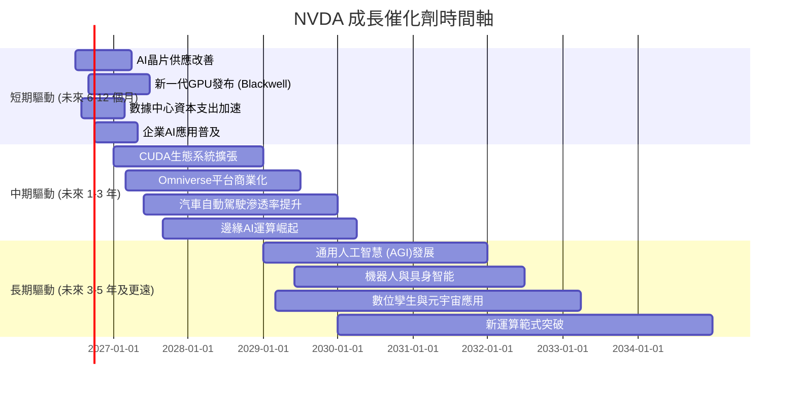

### 8.2 TAM 市場規模分析

NVDA 面對的潛在市場總規模 (Total Addressable Market, TAM) 巨大，且其在這些市場中的滲透率仍有巨大提升空間。

```
╔══════════════════════════════════════════════════════════════════╗
║                    NVDA TAM 市場規模分析 (估計)                  ║
╠══════════════════════════════════════════════════════════════════╣
║                                                                  ║
║  數據中心AI (GPU & SW)：                                         ║
║  ├── TAM: $1.0T+ (2030E)                                         ║
║  ├── NVDA當前營收貢獻: $200B+ (TTM估計)                         ║
║  └── 滲透率: ~20%                                                ║
║                                                                  ║
║  遊戲 (Gaming)：                                                 ║
║  ├── TAM: $100B+ (2025E)                                         ║
║  ├── NVDA當前營收貢獻: $50B+ (TTM估計)                          ║
║  └── 滲透率: ~50%                                                ║
║                                                                  ║
║  專業視覺化 (ProVis & Omniverse)：                               ║
║  ├── TAM: $100B+ (2030E)                                         ║
║  ├── NVDA當前營收貢獻: $10B+ (TTM估計)                          ║
║  └── 滲透率: ~10%                                                ║
║                                                                  ║
║  汽車 (Automotive)：                                             ║
║  ├── TAM: $300B+ (2030E)                                         ║
║  ├── NVDA當前營收貢獻: $5B+ (TTM估計)                           ║
║  └── 滲透率: ~2%                                                 ║
║                                                                  ║
║  📊 結論：在多個萬億級市場中仍有巨大成長空間。                   ║
╚══════════════════════════════════════════════════════════════════╝
```

### 8.3 成長驅動力結構圖

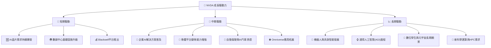
**分析**：
- **短期驅動**：AI 晶片需求持續旺盛，數據中心對加速運算的需求不斷增加。NVDA 新一代 Blackwell 平台的推出將進一步鞏固其市場領導地位，並帶來新的營收增長點。
- **中期驅動**：企業級 AI 解決方案的普及將推動 NVDA 軟體和服務收入的增長。Omniverse 在工業數位孿生和協同設計領域的應用將逐步商業化。自動駕駛技術的發展也將為其汽車業務帶來顯著增長。
- **長期驅動**：機器人技術、具身智能、通用人工智慧 (AGI) 的發展，以及數位孿生和元宇宙的廣泛應用，都將需要強大的 AI 運算能力，NVDA 在這些前沿領域的投入將為其提供長期的成長潛力。

---

## 9. 風險矩陣

儘管 NVDA 具有強勁的成長潛力，但投資仍需警惕潛在風險。我們將從機率和衝擊兩個維度評估主要風險。

### 9.1 風險評分矩陣

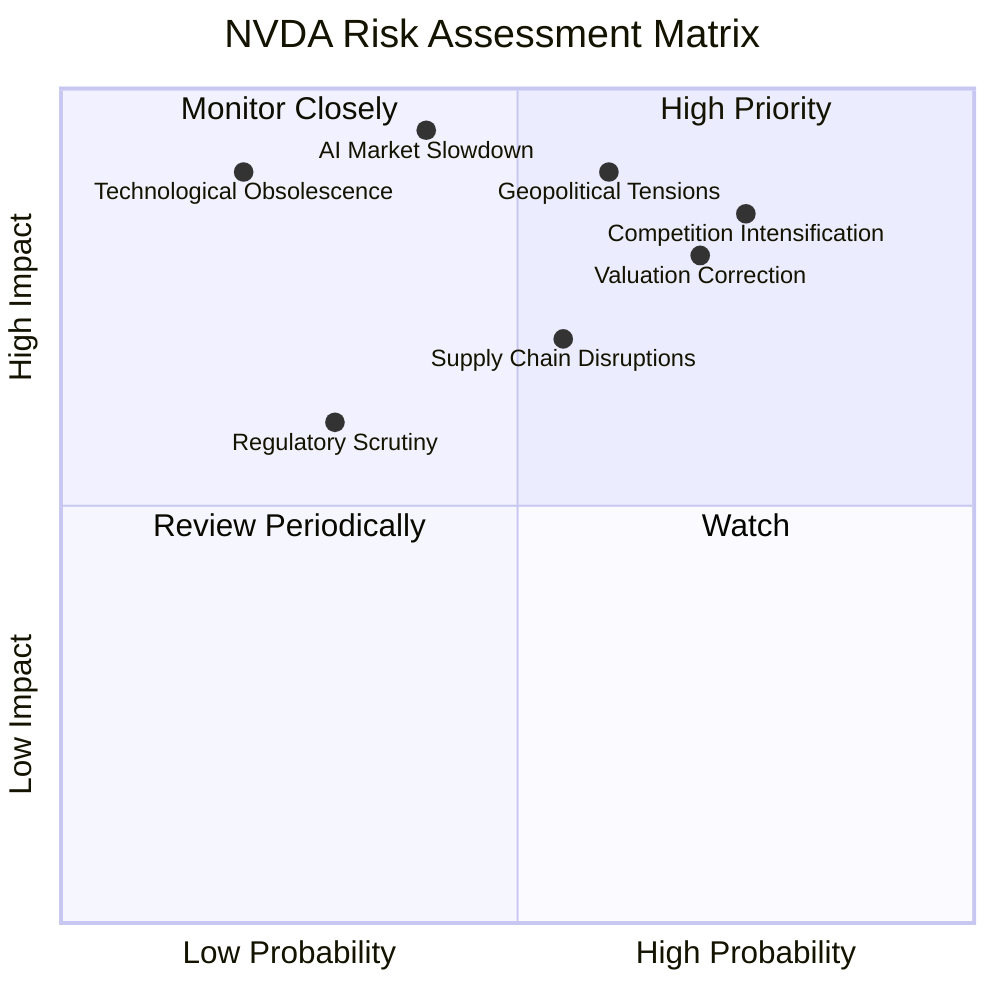

### 9.2 風險清單詳細分析

| # | 風險項目 | 發生機率 | 財務衝擊 | 風險評分 | 緩解措施 |
|---|------------------------|----------|----------|----------|----------|
| 1 | 🔴 **競爭加劇與客製化晶片興起** | 高 (75%) | 高 (-10%收入) | 🔴 8.5/10 | 持續研發投入保持技術領先；深化 CUDA 生態系統黏著度；拓展軟體服務收入；與雲服務商建立更緊密合作。 |
| 2 | 🔴 **地緣政治緊張與出口管制** | 中 (60%) | 高 (-15%收入) | 🔴 9.0/10 | 多元化供應鏈和生產基地；與政府保持溝通；開發符合法規的產品版本；拓展非受限市場。 |
| 3 | 🟡 **高估值修正風險** | 高 (70%) | 中 (-20%股價) | 🟡 8.0/10 | 維持強勁盈利增長以證明估值合理性；透過股票回購提升股東回報；加強與投資者溝通，闡明長期增長潛力。 |
| 4 | 🟡 **供應鏈中斷風險** | 中 (55%) | 中 (-5%收入) | 🟡 7.0/10 | 建立多元供應商網絡；儲備關鍵零部件庫存；與製造夥伴建立長期戰略合作；提高供應鏈透明度。 |
| 5 | 🟡 **AI 市場成長不及預期** | 中 (40%) | 高 (-20%收入) | 🟡 9.5/10 | 拓展多樣化終端應用市場；持續創新，創造新需求；投資新興技術和市場，降低對單一市場的依賴。 |
| 6 | 🟢 **監管審查與反壟斷調查** | 低 (30%) | 中 (-5%收入) | 🟢 6.0/10 | 遵守各國法律法規；積極配合監管機構調查；加強企業社會責任；透過競爭和創新證明市場領先地位。 |
| 7 | 🟢 **技術過時或顛覆性創新** | 低 (20%) | 高 (-25%收入) | 🟢 9.0/10 | 保持高額研發投入；密切關注行業前沿技術發展；透過併購獲取新技術；培養多元化技術人才。 |

---

## 10. 投資建議

綜合以上深度分析，NVIDIA (NVDA) 展現出卓越的財務表現、無可匹敵的技術護城河、廣闊的成長潛力以及健康的財務狀況。儘管其估值相對較高，但考慮到其在 AI 和加速運算領域的絕對領導地位以及預期中的爆發式盈利增長，我們認為其估值是合理的，甚至被低估。

### 10.1 最終綜合評級雷達圖

```
╔══════════════════════════════════════════════════════════════════╗
║                  NVDA 最終綜合評級                               ║
╠══════════════════════════════════════════════════════════════════╣
║                                                                  ║
║  基本面強度  9.0 ▓▓▓▓▓▓▓▓▓▓▓▓▓▓▓▓▓▓░░  ★★★★★           ║
║  成長動能    10.0 ▓▓▓▓▓▓▓▓▓▓▓▓▓▓▓▓▓▓▓▓  ★★★★★           ║
║  獲利品質    10.0 ▓▓▓▓▓▓▓▓▓▓▓▓▓▓▓▓▓▓▓▓  ★★★★★           ║
║  財務健康    9.0 ▓▓▓▓▓▓▓▓▓▓▓▓▓▓▓▓▓▓░░  ★★★★★           ║
║  估值合理性  8.0 ▓▓▓▓▓▓▓▓▓▓▓▓▓▓▓▓░░░░  ★★★★☆           ║
║  護城河深度  10.0 ▓▓▓▓▓▓▓▓▓▓▓▓▓▓▓▓▓▓▓▓  ★★★★★           ║
║  管理層執行  9.5 ▓▓▓▓▓▓▓▓▓▓▓▓▓▓▓▓▓▓▓░  ★★★★★           ║
║  技術創新力  10.0 ▓▓▓▓▓▓▓▓▓▓▓▓▓▓▓▓▓▓▓▓  ★★★★★           ║
║                                                                  ║
║  綜合總分：  9.4/10                                              ║
╚══════════════════════════════════════════════════════════════════╝
```

### 10.2 目標價與隱含報酬率

基於 DCF 敏感性分析，我們給出以下目標價和隱含報酬率：

| 情境 | 目標價 ($) | 較當前股價 $202.78 隱含報酬率 | 機率權重 |
|------|------------|-------------------------------|----------|
| 🔴 **悲觀情境** | $275       | +35.6%                        | 20%      |
| 🟡 **基準情境** | $310       | +53.8%                        | 60%      |
| 🟢 **樂觀情境** | $350       | +72.6%                        | 20%      |
| **加權平均目標價** | **$310**   | **+53.8%**                    | 100%     |

**投資評級**：🟢 **強烈買入 (Strong Buy)**。
我們預期 NVDA 在未來 12-18 個月內有望達到基準情境下的目標價 $310。

### 10.3 買入時機與觸發因素

```
╔══════════════════════════════════════════════════════════════════╗
║                  ✅ 買入觸發因素 Checklist                      ║
╠══════════════════════════════════════════════════════════════════╣
║                                                                  ║
║  立即買入觸發條件（多數符合）：                                  ║
║  ✅ AI 數據中心需求持續超預期                                    ║
║  ✅ 新一代 Blackwell 平台順利推出並獲得市場積極反饋                ║
║  ✅ 盈利和自由現金流持續高速增長，證明高估值合理性                ║
║  ✅ 宏觀經濟環境對科技股有利，市場風險偏好較高                    ║
║                                                                  ║
║  加碼觸發條件（出現以下任一）：                                  ║
║  ☐ 股價因市場恐慌或短期利空出現非理性下跌（例如跌破 $180）       ║
║  ☐ 數據中心業務營收或毛利率超預期，顯示護城河進一步加深          ║
║  ☐ 汽車或 Omniverse 等新興業務取得突破性進展                     ║
║                                                                  ║
║  減碼/停損觸發條件（出現以下任一）：                             ║
║  ☐ 競爭對手在 AI 晶片領域取得重大突破，威脅 NVDA 領先地位        ║
║  ☐ 地緣政治風險顯著升級，導致對華出口或全球供應鏈嚴重受阻        ║
║  ☐ 季度營收或盈利連續不及預期，且管理層對前景展望悲觀            ║
║  ☐ 估值過高，Forward P/E 明顯高於行業平均且成長性開始趨緩        ║
╚══════════════════════════════════════════════════════════════════╝
```

### 10.4 投資人適配度分析

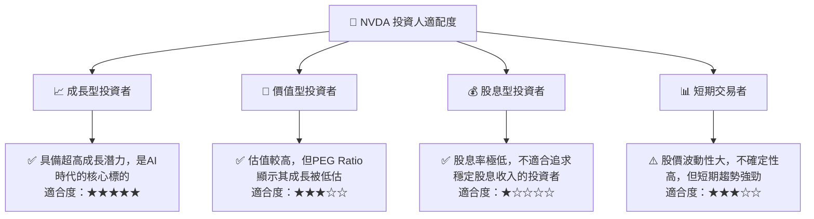
**分析**：
- **成長型投資者**：NVDA 是典型的成長股，適合追求高成長、高風險回報的投資者。其在 AI 領域的領導地位和廣闊的市場前景，使其成為長期成長投資組合的核心配置。
- **價值型投資者**：儘管其 P/E 倍數較高，但考慮到其驚人的盈利成長和 PEG Ratio (0.6x)，仍有部分價值被低估的成分。然而，其高波動性可能不完全符合傳統價值投資者的風險偏好。
- **股息型投資者**：NVDA 的股息率極低，不適合以股息收入為主要目標的投資者。
- **短期交易者**：NVDA 股價波動性大 (Beta 2.211)，可能吸引短期交易者。但其基本面更適合長期持有，短期交易風險較高。

### 10.5 關鍵監控指標

| 監控類型 | 指標 | 關注點 | 頻率 |
|----------|------|--------|------|
| **營收成長** | 數據中心業務營收 YoY 成長率 | 是否維持高速增長，佔比是否持續提升 | 季度 |
| **獲利能力** | 毛利率、營業利益率趨勢 | 是否因競爭或成本壓力而下降；費用控制效率 | 季度 |
| **資本效率** | ROIC vs WACC 差距 | 是否持續為股東創造超額價值；投入資本回報率變化 | 年度 |
| **競爭態勢** | 競爭對手新品發布、市場份額變化 | AMD、Intel 等競爭對手進展，雲服務商自研晶片影響 | 持續 |
| **現金流** | 自由現金流 (FCF) 及其轉換率 | 大規模資本支出是否帶來 FCF 壓力；FCF 質量是否改善 | 季度/年度 |
| **技術創新** | 新一代產品發布、CUDA 生態系統拓展 | 技術領先地位是否鞏固；軟體服務收入增長 | 持續 |
| **宏觀/政策** | 全球 AI 產業政策、地緣政治變化 | 潛在的出口管制、貿易摩擦等影響 | 持續 |

---

> **免責聲明**：本報告為 AI 自動生成，僅供研究參考，不構成投資建議。投資有風險，入市需謹慎。