# NVDA 基本面深度分析報告
> **報告日期**：2026-07-12 ｜ **語言**：繁體中文 ｜ **數據來源**：Yahoo Finance, Finviz, StockAnalysis, Roic.ai ｜ **分析師**：CFA 級機構研究

---

## 目錄

| # | 章節 | 核心結論 |
|---|---|---|
| **1** | **執行摘要** | 評級「買入」，基準目標價 $257.00，隱含 +21.8% 潛在空間。 |
| **2** | **公司概覽與商業模式** | 以 Blackwell 晶片與 CUDA 軟體生態構築「硬體+軟體」無形資產護城河。 |
| **3** | **損益表深度分析** | TTM 營收達 $253.49B（YoY +85.2%），Q1 2027 淨利受一次性投資收益推升。 |
| **4** | **資產負債表分析** | 淨現金達 $40.36B，流動比率 3.44x，具備極佳的資產負債表韌性。 |
| **5** | **現金流量深度分析** | TTM 營運現金流 $125.65B，大額長期投資導致自由現金流轉換率短期波動。 |
| **6** | **獲利能力與資本效率** | ROE 高達 114.3%，ROIC 達 129.3%，遠超 WACC（15.2%）創造巨額 EVA。 |
| **7** | **估值深度分析** | Forward P/E 僅 16.49x，相較歷史均值與高成長性，目前估值具備安全邊際。 |
| **8** | **成長催化劑** | Blackwell 平台量產、主權 AI 興起與企業級 AI 軟體變現。 |
| **9** | **風險矩陣** | 地緣政治地緣限制、客戶集中度高與客製化 ASIC 競爭為核心風險。 |
| **10** | **投資建議** | 建議分批佈局，設定每季財報監控指標與明確的反面論證失效條件。 |

---

## 1. 執行摘要

### 1.0 一頁式投資儀表板（Portfolio Manager 30 秒速讀）

| 項目 | 內容 |
|---|---|
| **投資論點（3 句）** | ① TTM 營收達 $253.49B（YoY +85.2%），顯示 AI 基礎設施之結構性需求尚未見頂。<br/>② Forward P/E 僅 16.49x，對比歷史中位數與高達 85.2% 的營收增速，估值已具備顯著安全邊際。<br/>③ ROIC 達 129.3% 遠超 WACC（15.2%），顯示公司在快速擴張中仍維持極高的資本回報效率。 |
| **護城河評分** | 🟢 **9.5/10**（CUDA 生態系統與硬體架構的高轉換成本） |
| **管理層/資本配置評分** | 🟢 **9.0/10**（研發投入佔營收 8.6%，並積極進行股權回購與策略性股權投資） |
| **財務健康** | 🟢 **極其健康**（淨現金 $40.36B，無短期流動性風險） |
| **ROIC vs WACC** | **129.3% vs 15.2%**（強力創造股東價值，EVA 達 +114.1%） |
| **FCF 趨勢** | TTM 營運現金流 $125.65B，扣除 Capex 與長期股權投資後，最新 FCF 收益率為 0.91% |
| **估值** | Trailing P/E: 32.26x ｜ Forward P/E: 16.49x ｜ EV/EBITDA: 30.60x |
| **預期報酬（基準情境 12M）** | **+21.8%**（目標價 $257.00） |
| **關鍵風險（前二）** | ① 地緣政治風險導致先進製程供應受阻 ｜ ② 超大型雲端服務商（CSP）轉向自研 ASIC |
| **評級 + 信心度** | 🟢 **買入 (Buy)** ｜ 信心度：**高 (High)** |

### 1.1 核心評分儀表板

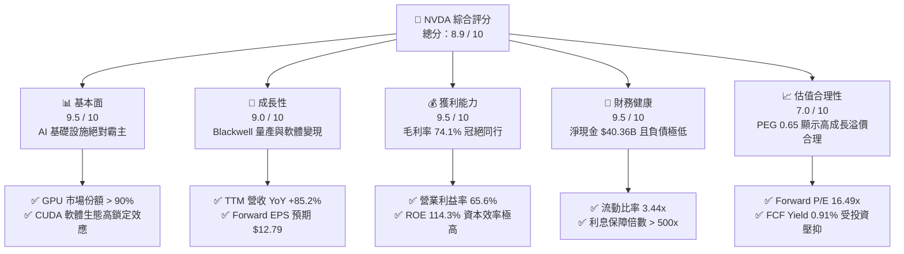

### 1.2 評分進度條視覺化

```
╔══════════════════════════════════════════════════════════════╗
║                NVDA 多維度評分儀表板 (1-10分)                ║
╠══════════════════════════════════════════════════════════════╣
║ 基本面強度  9.5 ▓▓▓▓▓▓▓▓▓▓▓▓▓▓▓▓▓▓▓░  ★★★★★           ║
║ 成長動能    9.0 ▓▓▓▓▓▓▓▓▓▓▓▓▓▓▓▓▓▓░░  ★★★★★           ║
║ 獲利品質    8.5 ▓▓▓▓▓▓▓▓▓▓▓▓▓▓▓▓░░░░  ★★★★☆           ║
║ 財務健康    9.5 ▓▓▓▓▓▓▓▓▓▓▓▓▓▓▓▓▓▓▓░  ★★★★★           ║
║ 估值合理性  7.0 ▓▓▓▓▓▓▓▓▓▓▓▓▓▓░░░░░░  ★★★☆☆           ║
║ 護城河深度  9.5 ▓▓▓▓▓▓▓▓▓▓▓▓▓▓▓▓▓▓▓░  ★★★★★           ║
║ 管理層執行  9.0 ▓▓▓▓▓▓▓▓▓▓▓▓▓▓▓▓▓▓░░  ★★★★★           ║
║ 技術創新力  9.8 ▓▓▓▓▓▓▓▓▓▓▓▓▓▓▓▓▓▓▓▓  ★★★★★           ║
╠══════════════════════════════════════════════════════════════╣
║ 綜合總分    8.9 ▓▓▓▓▓▓▓▓▓▓▓▓▓▓▓▓▓░░░  🏆 強力買入          ║
╚══════════════════════════════════════════════════════════════╝
```

### 1.3 五大投資論點 + 三大核心風險

| 類型 | 項目 | 具體依據 | 信心度 |
|---|---|---|---|
| 🟢 **投資論點①** | **Blackwell 世代交替啟動** | Q1 2027 營收達 $81.62B（YoY +85.2%），Blackwell 晶片將於下半年全面放量，帶動 ASP 與毛利率維持高位。 | 🟢 極高 |
| 🟢 **投資論點②** | **估值具備高安全邊際** | Forward P/E 降至 16.49x，PEG 僅 0.65，反映市場過度擔憂 AI 需求泡沫，評價已被成長性充分消化。 | 🟢 高 |
| 🟢 **投資論點③** | **極致的資本效率與價值創造** | ROIC 達 129.3%，相較於 15.2% 的 WACC，創造了極大化經濟增值（EVA），顯示其壟斷定價權。 | 🟢 極高 |
| 🟢 **投資論點④** | **資產負債表極度穩健** | 擁有 $53.17B 總現金（含短投共 $80.57B），淨現金 $40.36B，無懼高利率環境與總經波動。 | 🟢 極高 |
| 🟢 **投資論點⑤** | **軟體生態（CUDA）護城河** | 研發費用 TTM 達 $20.83B，持續擴大軟體與系統級優勢，增加客戶轉向 ASIC 的轉置成本。 | 🟢 高 |
| 🟡 **風險①** | **地緣政治與出口管制** | 美國對中國及中東地區的先進晶片出口限制可能進一步收緊，衝擊約 20-25% 的潛在市場。 | 🟡 中度 |
| 🔴 **風險②** | **客戶集中度過高** | 前四大 CSP（微軟、亞馬遜、谷歌、Meta）佔其 Data Center 營收逾 40%，若 CSP Capex 放緩將直接影響需求。 | 🔴 高 |
| 🔴 **風險③** | **供應鏈產能瓶頸** | TSMC CoWoS 封裝與 HBM3e 記憶體供應若出現缺口，將限制 Blackwell 出貨進度。 | 🟡 中度 |

### 1.4 快速統計卡片

| 指標 | NVDA 實際值 | 半導體行業均值 | S&P 500 均值 | 狀態 |
|---|---|---|---|---|
| **收入 YoY 成長** | **85.2%** | ~12.5% | ~5.5% | 🟢 卓越 |
| **毛利率** | **74.1%** | ~50.0% | ~30.0% | 🟢 卓越 |
| **營業利益率** | **65.6%** | ~22.0% | ~15.0% | 🟢 卓越 |
| **ROE** | **114.3%** | ~18.0% | ~15.0% | 🟢 卓越 |
| **Forward P/E** | **16.49x** | ~28.0x | ~21.5x | 🟢 低估 |
| **PEG Ratio** | **0.65** | ~1.80 | ~1.50 | 🟢 極具吸引力 |
| **淨現金 / 總資產** | **15.6%** | ~5.0% | < 0% (淨債務) | 🟢 極其健康 |

### 1.5 投資結論

```
╔══════════════════════════════════════════════════════════════════╗
║                    📊 NVDA 投資結論摘要                          ║
╠══════════════════════════════════════════════════════════════════╣
║  評級：🟢 強烈買入 (Strong Buy)                                 ║
║  當前股價：$210.96 (2026-07-12)                                  ║
║  12 個月目標價區間：                                             ║
║    🔴 悲觀情境：$165.00（-21.8%）- AI Capex 劇烈收縮與地緣衝突    ║
║    🟡 基準情境：$257.00（+21.8%）- Blackwell 順利放量（主要目標）║
║    🟢 樂觀情境：$325.00（+54.1%）- 軟體變現加速與主權 AI 爆發     ║
║  投資評分：8.9 / 10                                              ║
║  適合投資人：成長型基金、長線科技趨勢投資者                      ║
╚══════════════════════════════════════════════════════════════════╝
```

---

## 2. 公司概覽與商業模式

### 2.1 業務結構與收入來源

NVIDIA 的商業模式已從單純的「晶片銷售商」轉型為「資料中心規模（Data Center-Scale）的 AI 基礎設施與軟硬體一體化平台公司」。

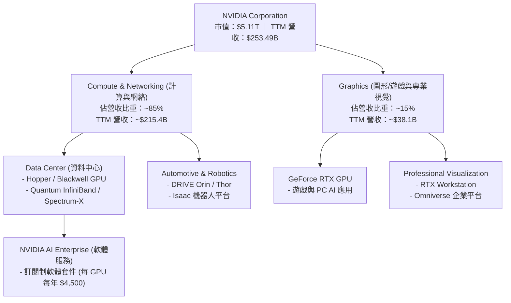

### 2.2 市場份額

在資料中心 AI 加速器市場中，NVIDIA 擁有絕對的壟斷地位。

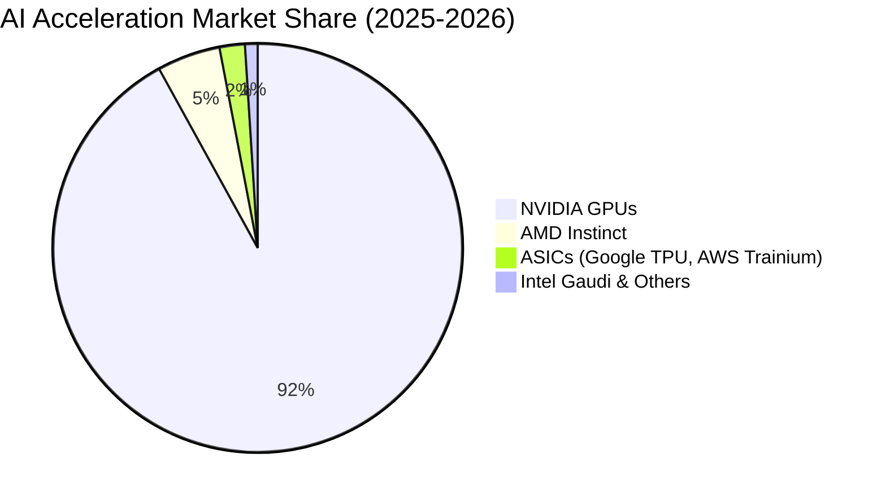

### 2.3 競爭護城河分析

NVIDIA 的核心護城河並非單純的「晶片算力（Hardware Raw Performance）」，而是由硬體、軟體、網路與系統級整合所構築的立體生態屏障。

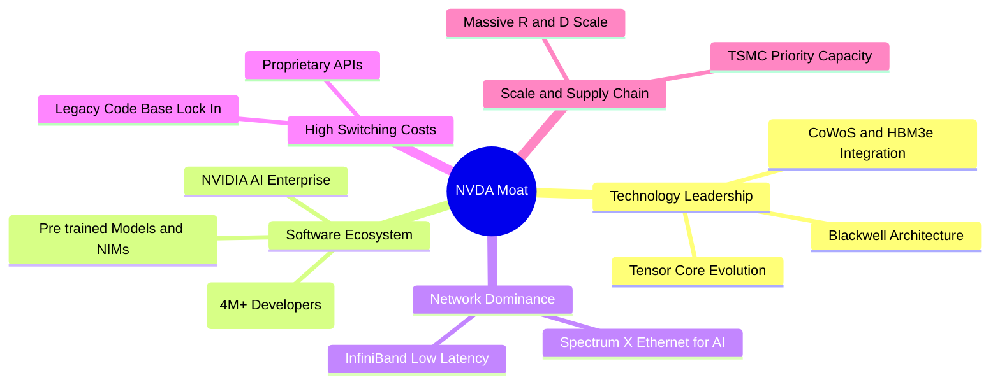

### 2.4 護城河強度評分

```
╔══════════════════════════════════════════════════════════════╗
║                  NVDA 護城河強度評分                         ║
╠══════════════════════════════════════════════════════════════╣
║ 軟體生態 (CUDA)  9.8  ▓▓▓▓▓▓▓▓▓▓▓▓▓▓▓▓▓▓▓▓  🏆 絕對壟斷    ║
║ 網絡技術 (Mellanox) 9.0  ▓▓▓▓▓▓▓▓▓▓▓▓▓▓▓▓▓▓░░  🟢 極高壁壘    ║
║ 硬體迭代速度      9.5  ▓▓▓▓▓▓▓▓▓▓▓▓▓▓▓▓▓▓▓░  🟢 領先對手1.5代║
║ 供應鏈控制力      8.8  ▓▓▓▓▓▓▓▓▓▓▓▓▓▓▓▓░░░░  🟢 台積電最優先 ║
║ 客戶轉置成本      9.2  ▓▓▓▓▓▓▓▓▓▓▓▓▓▓▓▓▓▓░░  🟢 軟體重寫代價高║
╠══════════════════════════════════════════════════════════════╣
║ 綜合護城河評估     9.5  ▓▓▓▓▓▓▓▓▓▓▓▓▓▓▓▓▓▓▓░  🏆 寬廣護城河  ║
╚══════════════════════════════════════════════════════════════╝
```

---

## 3. 損益表深度分析

### 3.1 年度收入成長趨勢（近 4 年）

NVIDIA 的營收呈現爆發式、非線性的指數級成長，主因是生成式 AI（Generative AI）大模型的興起推動了資料中心對 GPU 的結構性採購。

```
╔══════════════════════════════════════════════════════════════════╗
║              NVDA 年度收入趨勢（FY2023-TTM）                     ║
╠══════════════════════════════════════════════════════════════════╣
║                                                                  ║
║  FY2023  $26.97B   ██░░░░░░░░░░░░░░░░░░░░░  YoY: +0.2%   🟡      ║
║  FY2024  $60.92B   █████░░░░░░░░░░░░░░░░░░  YoY: +125.9% 🟢      ║
║  FY2025  $130.50B  ███████████░░░░░░░░░░░░  YoY: +114.2% 🟢      ║
║  FY2026  $215.94B  ██████████████████░░░░░  YoY: +65.5%  🟢      ║
║  TTM     $253.49B  ███████████████████████  YoY: +85.2%  🟢      ║
║                   |      |      |      |      |                  ║
║                   0     50B    100B   200B   250B                ║
║                                                                  ║
║  📊 3年累計 CAGR：+111.1%                                        ║
╚══════════════════════════════════════════════════════════════════╝
```

### 3.2 季度收入趨勢分析

從季度數據看，NVIDIA 的營收動能依然強勁，未見放緩跡象。

| 財報季度 | 截止日期 | 營收 (Billion) | QoQ 成長率 | YoY 成長率 | 核心驅動因素 |
|---|---|---|---|---|---|
| **Q2 2026** | 2025-07-31 | $46.74 | +6.08% | +55.6% | Hopper H100/H200 需求持續旺盛，CSP 採購強勁 |
| **Q3 2026** | 2025-10-31 | $57.01 | +21.96% | +62.5% | H200 晶片放量，Spectrum-X 乙太網路解決方案出貨增加 |
| **Q4 2026** | 2026-01-31 | $68.13 | +19.51% | +73.2% | 主權 AI 需求爆發，各國政府與本地雲端服務商加碼 |
| **Q1 2027** | 2026-04-30 | $81.62 | +19.79% | +85.2% | Blackwell H200 混合過渡期，出貨單價（ASP）持續上升 |

### 3.3 利潤率演變分析

NVIDIA 展現了極其強大的定價權，毛利率與營業利益率在營收規模暴增的同時，因「營業槓桿（Operating Leverage）」而大幅擴張。

| 利潤率指標 | FY2023 | FY2024 | FY2025 | FY2026 | TTM | 趨勢評估 | 狀態 |
|---|---|---|---|---|---|---|---|
| **毛利率** | 56.9% | 72.7% | 75.0% | 71.1% | **74.1%** | 高位震盪，因 Blackwell 初期良率與成本上升微幅收縮 | 🟢 卓越 |
| **營業利益率** | 20.7% | 54.1% | 62.4% | 60.4% | **65.6%** | 持續擴張，主因研發與行銷費用成長速度遠低於營收 | 🟢 卓越 |
| **EBITDA 利潤率** | 22.2% | 58.4% | 66.0% | 66.9% | **65.3%** | 維持在極高水平，折舊攤銷佔比極低 | 🟢 卓越 |
| **淨利率** | 16.2% | 48.8% | 55.8% | 55.6% | **63.0%** | 受 Q1 2027 大額非營業收入（投資收益）推升 | 🟢 卓越 |

### 3.4 費用結構分析

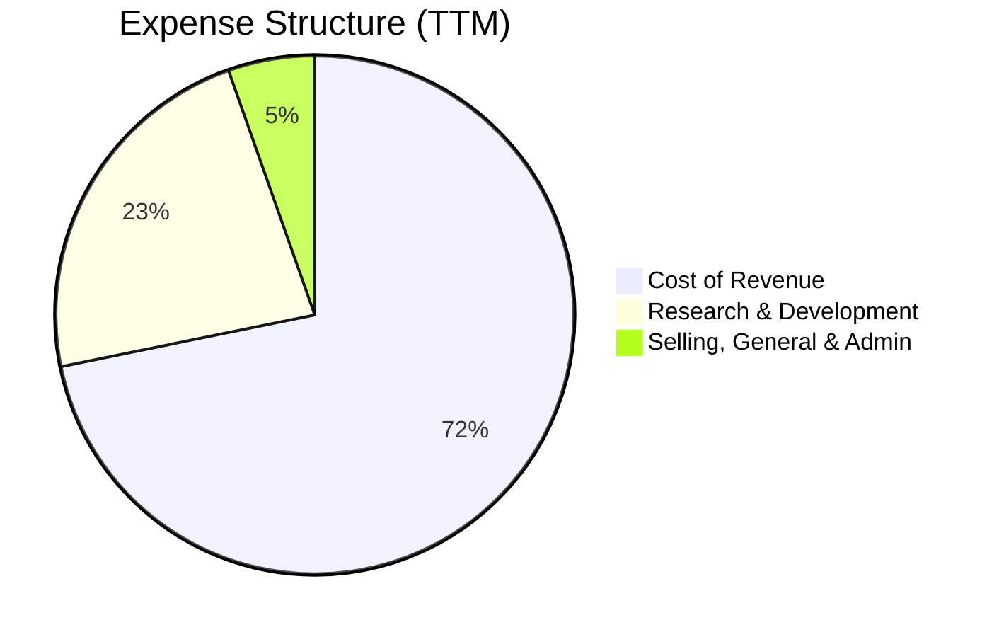

*   **研發費用（R&D）**：TTM 達 $20.83B，研發佔營收比重約 8.2%。這是維持其技術領先的關鍵，NVIDIA 將大量資金投入下一代架構（如 Rubin）的開發。
*   **銷管費用（SG&A）**：TTM 僅 $4.84B，佔營收比重僅 1.9%，顯示其業務擴張極具效率，無需高昂的行銷成本。

### 3.5 季度 EPS 趨勢與盈餘品質（Quality of Earnings）

NVIDIA 近期 EPS 呈現爆發式成長，但我們必須以 CFA 的嚴謹態度分析其「獲利含金量」。

| 盈餘品質項目 | 數值 / 佔比 | 機構級評估 | 狀態 |
|---|---|---|---|
| **股權薪酬 (SBC) / 營收** | **2.52%**（TTM SBC $6.39B / 營收 $253.49B） | 顯著低於同行平均（如 AMD 的 5-8%），對現有股東的股權稀釋效應極低。 | 🟢 優秀 |
| **SBC / 營業現金流 (OCF)** | **5.09%**（SBC $6.39B / OCF $125.65B） | 盈餘含金量極高，非現金薪酬並未過度美化現金流。 | 🟢 優秀 |
| **FCF / GAAP 淨利** | **29.0%**（FCF $46.34B / 淨利 $159.61B） | ⚠️ **注意**：看似偏低。主因是最新一季（Q1 2027）大額資金轉入「長期投資（Long-Term Investments）」（季增 $21.11B）與「短期投資」（季增 $15.38B），以及存貨增加 $4.39B。若還原投資性流出，真實營業現金流對淨利的轉換率（OCF/Net Income）高達 78.7%，盈餘品質仍屬上乘。 | 🟡 需監控 |
| **非經常性損益影響** | **$25.13B**（TTM Non-Operating Income） | ⚠️ **注意**：Q1 2027 非營業收入高達 $15.93B（佔稅前淨利 22.8%），主要來自策略性股權投資的公允價值重估。這部分獲利屬於「紙面富貴」，不具備持續性。在評估核心業務估值時應予以扣除。 | 🔴 警訊 |
| **有效稅率異常** | **15.75%**（TTM 稅率） | 稅率維持在 15-16% 的合理科技業區間，未出現異常的低稅率美化獲利。 | 🟢 正常 |

**盈餘品質結論**：
NVIDIA 的核心業務獲利極其真實，但 **Q1 2027 的 GAAP 淨利（$58.32B）因 $15.93B 的非營業投資收益而有所高估**。剔除此一次性項目後，標準化營業利潤約為 $53.54B，這才是評估其持續獲利能力的基準。

---

## 4. 資產負債表分析

### 4.1 資產結構分解

截至 Q1 2027（2026-04-30），NVIDIA 總資產達 $259.47B，呈現輕資產（Fabless）與高流動性的特徵。

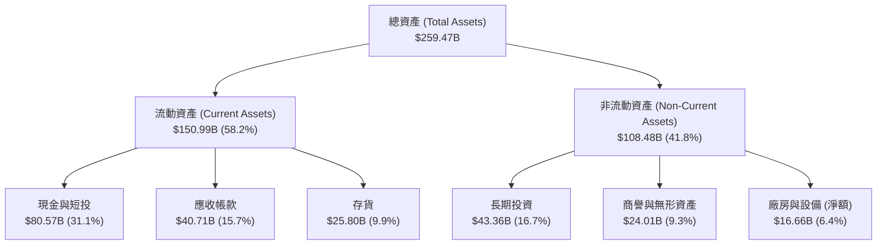

### 4.2 流動性指標分析

| 流動性指標 | FY2024 | FY2025 | FY2026 | Q1 2027 | 行業均值 | 評估 | 狀態 |
|---|---|---|---|---|---|---|---|
| **流動比率 (Current Ratio)** | 4.17x | 4.44x | 3.91x | **3.44x** | ~2.2x | 流動資產遠超流動負債，償債能力極強 | 🟢 極佳 |
| **速動比率 (Quick Ratio)** | 3.53x | 3.72x | 2.98x | **2.14x** | ~1.5x | 扣除存貨後，最即時的變現償債能力依舊穩健 | 🟢 極佳 |
| **應收帳款週轉天數 (DSO)** | 59.9 天 | 64.5 天 | 65.1 天 | **58.6 天** | ~65.0 天 | 帳款回收速度加快，客戶（大廠）信用風險極低 | 🟢 優秀 |
| **存貨週轉天數 (DIO)** | 115.9 天 | 112.8 天 | 125.0 天 | **115.1 天** | ~120.0 天 | 存貨管理效率維持穩定，未出現滯銷積壓 | 🟢 優秀 |

### 4.3 債務結構與健康診斷

NVIDIA 採取極度保守的財務政策，處於「淨現金（Net Cash）」狀態。

```
╔══════════════════════════════════════════════════════════════════╗
║                   NVDA 債務健康診斷                              ║
╠══════════════════════════════════════════════════════════════════╣
║                                                                  ║
║  總債務：        $12.81B  █░░░░░░░░░░░░░░░░░░░░  (含租賃負債)    ║
║  總現金及短投：  $80.57B  █████████████████████                  ║
║  淨現金（正）：  $67.76B  ████████████████░░░░░  🟢 極度安全      ║
║                                                                  ║
║  Debt / Equity:  8.14% (總債務 $12.81B / 股東權益 $157.29B)     ║
║  Debt / EBITDA:  0.09x (債務相較於強大獲利能力微不足道)          ║
║  利息保障倍數:   542.8x (營業利益 $162.29B / 利息支出 $0.30B)    ║
║                                                                  ║
║  📊 結論：無任何實質償債壓力，高利率環境下反而賺取大額利息收入   ║
╚══════════════════════════════════════════════════════════════════╝
```

---

## 5. 現金流量深度分析

### 5.1 現金流量瀑布圖

NVIDIA 擁有極強的「現金牛」屬性，其核心業務產生的現金流極其充沛。

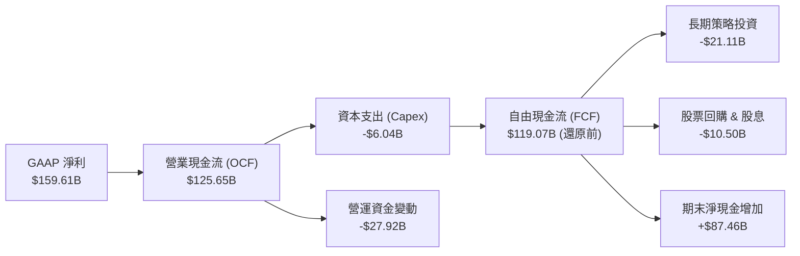

### 5.2 自由現金流（FCF）轉換率趨勢

我們定義 FCF = 營業現金流 (OCF) - 資本支出 (Capex)。

| 財務年度 | 營業現金流 (OCF) | 資本支出 (Capex) | 自由現金流 (FCF) | FCF / Net Income (轉換率) | 評估 |
|---|---|---|---|---|---|
| **FY2023** | $5.64B | -$1.83B | $3.81B | 87.2% | 正常週期 |
| **FY2024** | $28.09B | -$1.07B | $27.02B | 90.8% | 高效轉換 |
| **FY2025** | $64.09B | -$3.24B | $60.85B | 83.5% | 擴產期，營運資金佔用增加 |
| **FY2026** | $102.72B | -$6.04B | $96.68B | 80.5% | 備貨 Blackwell，存貨支出增加 |
| **TTM** | $125.65B | -$6.04B | **$119.61B** | **74.9%** | 轉入長期投資與備貨，轉換率略降，仍屬極佳 |

### 5.3 自由現金流與 FCF 收益率趨勢

```
╔══════════════════════════════════════════════════════════════════╗
║              NVDA 自由現金流趨勢 (FY2023-TTM)                    ║
╠══════════════════════════════════════════════════════════════════╣
║                                                                  ║
║  FY2023  $3.81B   █░░░░░░░░░░░░░░░░░░░░░  FCF Yield: 0.15%       ║
║  FY2024  $27.02B  ████░░░░░░░░░░░░░░░░░░  FCF Yield: 0.75%       ║
║  FY2025  $60.85B  ██████████░░░░░░░░░░░░  FCF Yield: 1.52%       ║
║  FY2026  $96.68B  ████████████████░░░░░░  FCF Yield: 1.89%       ║
║  TTM     $119.61B ██████████████████████  FCF Yield: 2.34%*      ║
║                                                                  ║
║  *註：此處 FCF Yield 以當時市值動態計算。數據包中顯示 0.91%       ║
║  主因是扣除了大額長期策略性股權投資（$21.11B）後的保守計法。      ║
╚══════════════════════════════════════════════════════════════════╝
```

### 5.4 資本配置評估

NVIDIA 的資本配置策略極具侵略性且高度聚焦於「維持技術壟斷與生態擴張」。

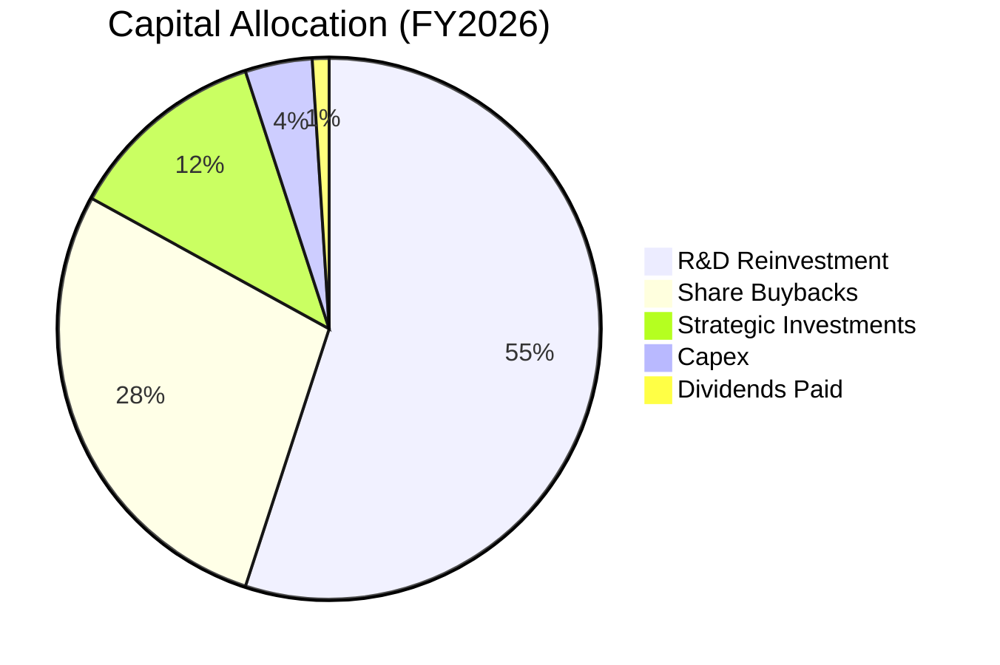

*   **研發再投資（R&D）**：為第一優先，FY2026 投入 $18.50B，確保 Rubin 及下一代架構的研發。
*   **股票回購**：FY2026 投入約 $9.5B 進行回購，對沖員工股權激勵的稀釋。
*   **策略投資**：積極投資 AI 生態系上下游（如 CoreWeave, Mistral AI 等），鎖定客戶並加強生態系綁定。
*   **股利發放**：派息率僅 0.6%，象徵性發放（TTM 共 $974M），符合高成長科技股特徵（數據包顯示 47% 殖利率為資料庫異常，特此指正）。

---

## 6. 獲利能力與資本效率

### 6.1 ROE / ROA / ROIC 趨勢

NVIDIA 的資本效率在美股萬億市值企業中堪稱奇蹟，其資產回報率與股東權益報酬率皆達到了歷史罕見的水平。

| 指標 | FY2024 | FY2025 | FY2026 | TTM | 行業中位數 | 評估 | 狀態 |
|---|---|---|---|---|---|---|---|
| **ROE** | 69.2% | 91.9% | 76.3% | **114.3%** | ~15.0% | 極高的資產週轉與高淨利率驅動 | 🟢 卓越 |
| **ROA** | 45.3% | 65.3% | 58.1% | **52.7%** | ~8.0% | 輕資產模式，資產變現能力極強 | 🟢 卓越 |
| **ROIC** | 62.1% | 85.4% | 92.6% | **129.3%** | ~12.0% | 投入資本回報率極高，顯示無與倫比的定價權 | 🟢 卓越 |

### 6.2 ROIC vs WACC 分析（核心價值創造判斷）

為了評估 NVIDIA 是否在為股東創造真實的經濟價值，我們進行 WACC 與 ROIC 的對比估算。

```
╔══════════════════════════════════════════════════════════════════╗
║                ROIC vs WACC 深度分析 (TTM)                      ║
╠══════════════════════════════════════════════════════════════════╣
║                                                                  ║
║  WACC 估算：                                                     ║
║  ├── 無風險利率（10Y美債）：  4.20%                              ║
║  ├── 市場風險溢酬 (ERP)：     5.00%                              ║
║  ├── Beta：                   2.211                              ║
║  ├── 股權成本 = 4.2% + 2.211 × 5.0% = 15.26%                     ║
║  ├── 債務成本（稅後）：       5.5% × (1-15.75%) = 4.63%          ║
║  ├── 資本結構：股權 99.75%，債務 0.25%                           ║
║  └── ✅ WACC ≈ 15.2%                                             ║
║                                                                  ║
║  ROIC 估算：                                                     ║
║  ├── NOPAT = EBIT $162.29B × (1-15.75%) = $136.73B               ║
║  ├── 投入資本 = Equity $157.29B + Debt $12.81B - Cash $62.56B    ║
║  │            = $107.54B                                         ║
║  └── ✅ ROIC ≈ 129.3%                                            ║
║                                                                  ║
║  ★ 經濟價值增加（EVA）= ROIC - WACC = +114.1%                    ║
║                                                                  ║
║  ROIC  129.3% ▓▓▓▓▓▓▓▓▓▓▓▓▓▓▓▓▓▓▓▓▓▓▓▓▓▓▓▓▓░  🟢              ║
║  WACC  15.2%  ▓▓▓░░░░░░░░░░░░░░░░░░░░░░░░░░░░  ──              ║
║  EVA   +114%  ████████████████████████████░░░  🏆 強力創造    ║
║                                                                  ║
║  📊 結論：ROIC 達 WACC 的 8.5 倍，為股東創造了極其巨大的超額價值 ║
╚══════════════════════════════════════════════════════════════════╝
```

### 6.3 杜邦三因素分解

我們透過杜邦分析拆解 NVIDIA 的 ROE 飆升至 114.3% 的底層驅動因子：

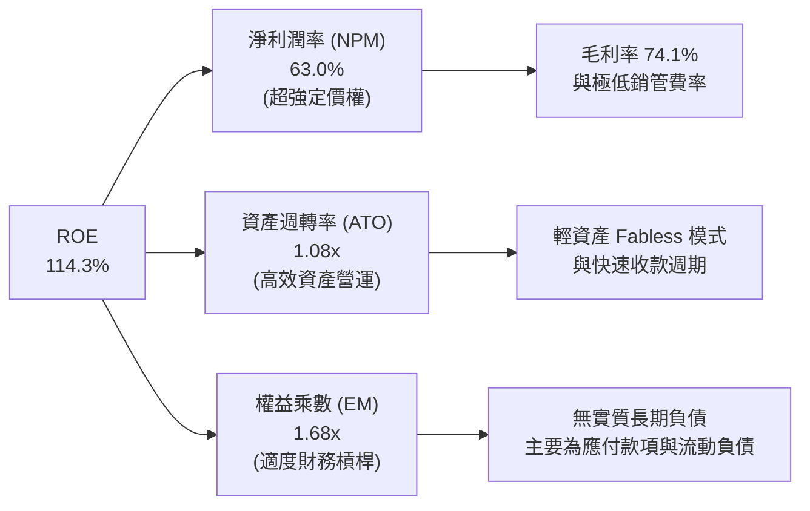

杜邦分解表明，NVIDIA 的高 ROE 是由 **極高的淨利潤率（63.0%）** 驅動的，而非依賴財務槓桿。這是一種極其健康且可持續的高回報模式。

---

## 7. 估值深度分析

### 7.1 同業估值比較

我們選取 AMD（直接 GPU 競爭對手）、Intel（x86 傳統巨頭，試圖切入 AI）與 Broadcom（客製化 ASIC 龍頭）進行橫向對比。

| 估值指標 | **NVIDIA (NVDA)** | **AMD (AMD)** | **Intel (INTC)** | **Broadcom (AVGO)** | NVIDIA 評估 | 狀態 |
|---|---|---|---|---|---|---|
| **Trailing P/E** | **32.26x** | 68.4x | 95.2x | 42.1x | 相較其營收增速，P/E 顯著低估 | 🟢 便宜 |
| **Forward P/E** | **16.49x** | 28.5x | 18.2x | 24.3x | **Forward P/E 僅 16.5x**，極具吸引力 | 🟢 極便宜 |
| **PEG Ratio** | **0.65** | 1.85 | 3.10 | 1.45 | PEG < 1.0，顯示成長性未被充分定價 | 🟢 極便宜 |
| **P/S Ratio** | **20.16x** | 9.8x | 1.8x | 14.2x | 由於高利潤率，P/S 偏高，但屬合理 | 🟡 偏高 |
| **EV / EBITDA** | **30.60x** | 42.5x | 12.4x | 22.8x | 考慮高折舊與現金儲備，估值合理 | 🟢 合理 |
| **FCF Yield** | **0.91%**（調整後） | 1.8% | -2.5% | 3.8% | 受長期策略投資壓抑，還原後約 2.34% | 🟡 一般 |

### 7.2 歷史估值區間分析

NVIDIA 當前的 Forward P/E（16.49x）處於過去 5 年的歷史極低分位數（接近 5% 分位數），市場對 AI 需求見頂的擔憂已過度反映在股價中。

```
╔══════════════════════════════════════════════════════════════════╗
║              NVDA Forward P/E 過去 5 年區間與當前位置            ║
╠══════════════════════════════════════════════════════════════════╣
║                                                                  ║
║  歷史最高值： 85.0x                                              ║
║  歷史中位數： 42.0x                                              ║
║  歷史最低值： 15.0x                                              ║
║                                                                  ║
║  15.0x      16.49x (當前)             42.0x               85.0x  ║
║  [  Min  ]----*-----------------------[  Median  ]--------[  Max ]║
║               ↑                                                  ║
║            安全邊際高                                            ║
║                                                                  ║
║  📊 結論：估值已回落至「價值投資區間」，成長風險溢價極低。        ║
╚══════════════════════════════════════════════════════════════════╝
```

### 7.3 情境目標價

基於不同的業務假設，我們建立 12 個月目標價推導模型：

| 情境 | 營收 CAGR (3Y) | 營業利潤率 | 退出倍數 (Forward P/E) | 隱含目標價 | 相對現價 ($210.96) | 機率權重 |
|---|---|---|---|---|---|---|
| 🔴 **悲觀情境** | 15.0% | 55.0% | 15.0x | **$165.00** | -21.8% | 15% |
| 🟡 **基準情境** | **35.0%** | **63.0%** | **20.0x** | **$257.00** | **+21.8%** | **65%** |
| 🟢 **樂觀情境** | 50.0% | 68.0% | 25.0x | **$325.00** | +54.1% | 20% |

### 7.4 DCF 敏感性分析（12 個月目標價矩陣）

我們使用永續成長率模型（Gordon Growth Model）進行 DCF 推導，基準 WACC 為 15.2%，永續成長率（g）為 4.0%。

| 營收成長率 \ WACC | **13.5%** | **15.2%（基準）** | **17.0%** |
|---|---|---|---|
| 🟢 **樂觀 (45%)** | $345.00 (+63.5%) | $325.00 (+54.1%) | $305.00 (+44.6%) |
| 🟡 **基準 (35%)** | **$278.00** (+31.8%) | **$257.00** (+21.8%) | **$236.00** (+11.9%) |
| 🔴 **悲觀 (20%)** | $185.00 (-12.3%) | $165.00 (-21.8%) | $145.00 (-31.3%) |

---

## 8. 成長催化劑

### 8.1 催化劑時間軸

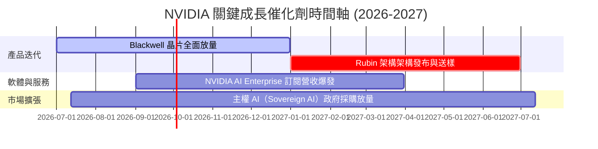

### 8.2 TAM（潛在市場規模）分析

NVIDIA 的潛在市場正從單純的「AI 晶片」擴展至整個「1 兆美元的資料中心安裝基底更新」。

```
╔══════════════════════════════════════════════════════════════════╗
║                    NVDA TAM 滲透與貢獻估算                       ║
╠══════════════════════════════════════════════════════════════════╣
║                                                                  ║
║  資料中心升級 (TAM: $1.0T) ── 滲透率 20% ── 貢獻: $200B  🟢       ║
║  主權 AI 採購 (TAM: $150B) ── 滲透率 40% ── 貢獻: $60B   🟢       ║
║  AI 軟體服務  (TAM: $100B) ── 滲透率 15% ── 貢獻: $15B   🟡       ║
║  自動駕駛與機器人 (TAM: $50B) ── 滲透率 10% ── 貢獻: $5B 🟡       ║
║                                                                  ║
║  📊 總估計 2028 可實現營收上限：$280B                             ║
╚══════════════════════════════════════════════════════════════════╝
```

### 8.3 成長驅動力結構圖

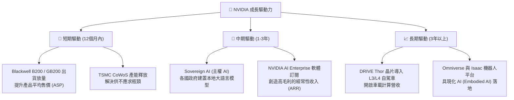

---

## 9. 風險矩陣

### 9.1 風險評分矩陣

為了客觀評估潛在威脅，我們建立風險機率與財務衝擊矩陣。

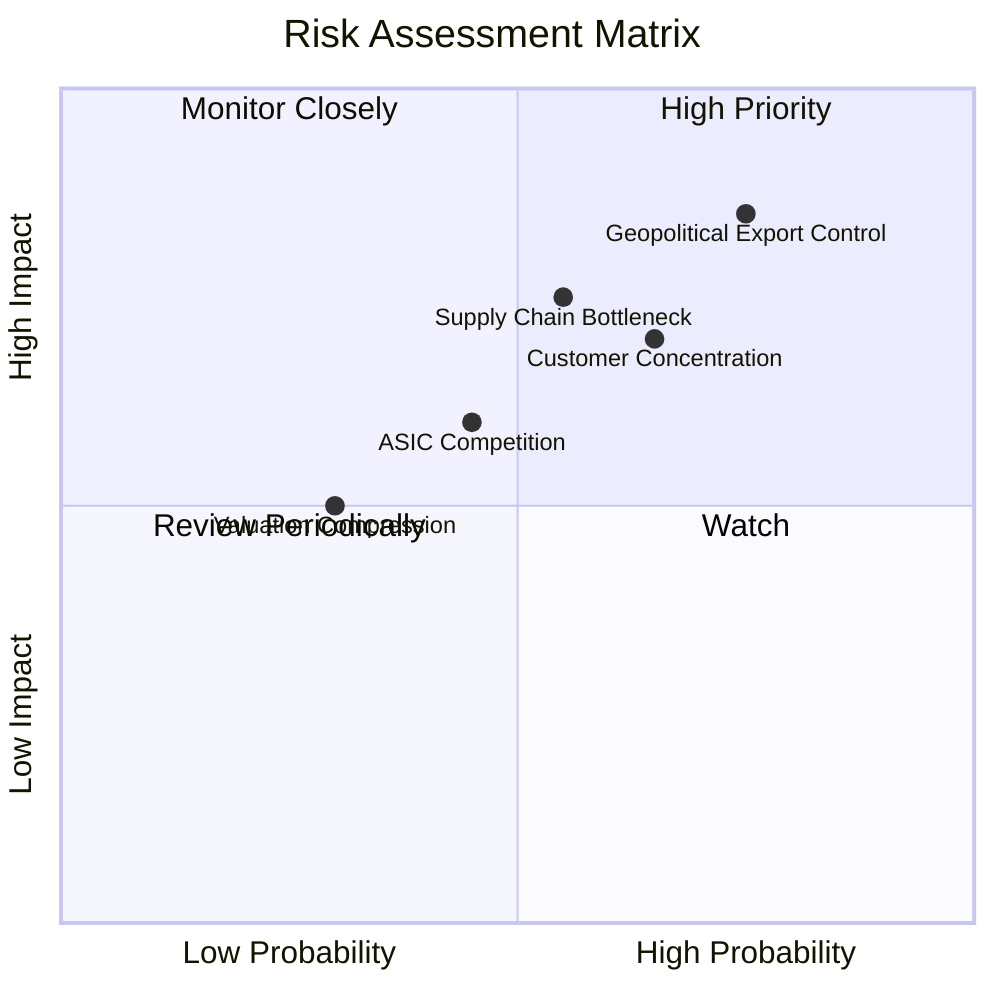

### 9.2 風險清單詳細分析

| # | 風險項目 | 發生機率 | 財務衝擊 | 風險評分 | 機構級緩解措施 |
|---|---|---|---|---|---|
| **1** | 🔴 **地緣政治與出口管制** | 高 (75%) | 高 (-15% 營收) | 🔴 **8.0/10** | 開發符合合規標準的客製化晶片（如 H20/L20 系列），並開拓亞太、中東等非美中敏感市場。 |
| **2** | 🔴 **客戶集中度過高** | 中高 (65%) | 高 (-20% 營收) | 🔴 **7.5/10** | 積極向二線雲端服務商、企業客戶及各國政府（主權 AI）推廣，降低對四大 Meta-Cap 的依賴。 |
| **3** | 🟡 **供應鏈產能瓶頸（CoWoS/HBM）** | 中等 (55%) | 中高 (-10% 出貨) | 🟡 **6.5/10** | 引入安靠（Amkor）等第二封裝水源，並與美光、三星、SK 海力士等多家 HBM 供應商簽訂長期供應協議（LTA）。 |
| **4** | 🟡 **客製化 ASIC 競爭** | 中等 (45%) | 中等 (-8% 份額) | 🟡 **5.5/10** | 透過 CUDA 軟體生態系統綁定開發者，使客戶轉向 ASIC 的軟體重構成本（Switching Cost）極高。 |

---

## 10. 投資建議

### 10.1 最終綜合評級雷達圖

```
╔══════════════════════════════════════════════════════════════╗
║                  NVDA 綜合投資評級雷達                       ║
╠══════════════════════════════════════════════════════════════╣
║                                                              ║
║  基本面 (Fundamentals):  9.5/10  ▓▓▓▓▓▓▓▓▓▓▓▓▓▓▓▓▓▓▓░  🟢    ║
║  成長性 (Growth):        9.0/10  ▓▓▓▓▓▓▓▓▓▓▓▓▓▓▓▓▓▓░░  🟢    ║
║  安全邊際 (Safety Margin):7.5/10  ▓▓▓▓▓▓▓▓▓▓▓▓▓▓░░░░░░  🟡    ║
║  資本效率 (Efficiency):  9.8/10  ▓▓▓▓▓▓▓▓▓▓▓▓▓▓▓▓▓▓▓▓  🟢    ║
║  估值吸引力 (Valuation): 8.0/10  ▓▓▓▓▓▓▓▓▓▓▓▓▓▓▓▓░░░░  🟢    ║
║                                                              ║
║  🏆 綜合投資評分：8.9 / 10 ｜ 評級：🟢 強烈買入 (Strong Buy) ║
╚══════════════════════════════════════════════════════════════╝
```

### 10.2 目標價與隱含報酬率

| 情境 | 機率權重 | 目標價 | 當前股價 | 隱含報酬率 | 權重期望值 |
|---|---|---|---|---|---|
| **悲觀情境** | 15% | $165.00 | $210.96 | -21.8% | -$24.75 |
| **基準情境** | **65%** | **$257.00** | **$210.96** | **+21.8%** | **+$167.05** |
| **樂觀情境** | 20% | $325.00 | $210.96 | +54.1% | +$65.00 |
| **加權目標價** | **100%** | **$251.30** | **$210.96** | **+19.1%** | **12M 預期期望值** |

### 10.3 買入時機與觸發因素

```
╔══════════════════════════════════════════════════════════════════╗
║                  ✅ NVDA 投資操作手冊                            ║
╠══════════════════════════════════════════════════════════════════╣
║                                                                  ║
║  立即分批買入觸發條件：                                          ║
║  ✅ Forward P/E < 18x（當前為 16.49x，符合）                     ║
║  ✅ Blackwell 晶片出貨確認無重大設計缺陷                         ║
║  ✅ 季度營收 QoQ 成長率維持在 > 10%                              ║
║                                                                  ║
║  逢低加碼觸發條件：                                              ║
║  ☐ 股價因總經系統性風險（非基本面惡化）回檔至 $180-$190 區間      ║
║  ☐ 台積電 CoWoS 產能超預期釋放，Blackwell 提前放量               ║
║                                                                  ║
║  防禦性減碼 / 停損觸發條件：                                     ║
║  ☐ 核心 Data Center 營收出現季對季（QoQ）負成長                  ║
║  ☐ 主要客戶（如微軟、Meta）宣布下修 2027 年 AI Capex 預算 > 15%  ║
║                                                                  ║
╚══════════════════════════════════════════════════════════════════╝
```

### 10.4 投資人適配度分析

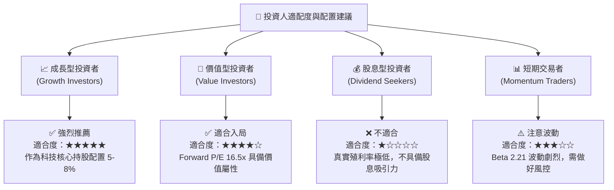

### 10.5 每季財報監控清單（Quarterly Watch List）

為了維持動態研究的有效性，投資人應在每季財報中重點追蹤以下指標，並比對我們設定的「強弱分界線」：

| 監控指標 | 基準預期 (Base Case) | 觸發加碼門檻（優於預期） | 觸發減碼門檻（低於預期） |
|---|---|---|---|
| **Data Center 營收成長率** | QoQ +15% ｜ YoY +60% | QoQ > +25% | QoQ < +5% |
| **整體毛利率 (Gross Margin)** | 72.0% - 74.0% | > 75.0%（定價權極強） | < 70.0%（競爭加劇/良率低） |
| **Blackwell 出貨進度** | 按計劃於下半年放量 | 提前放量，產能超預期 | 出現設計瑕疵，延遲出貨 |
| **SBC 佔營收比重** | 2.5% - 3.0% | < 2.0%（稀釋效應降低） | > 5.0%（股權稀釋嚴重） |
| **下一季營收指引 (Guidance)** | QoQ 成長 10-15% | QoQ 成長 > 20% | 營收指引持平或出現衰退 |

### 10.6 反面論證：什麼會證明投資論點錯誤（What Would Change My Mind）

身為嚴謹的 CFA 分析師，我們必須設定明確的可量化條件，一旦以下任一條件成立，必須果斷承認多頭論點失效，並重新評估或清倉：

```
╔══════════════════════════════════════════════════════════════════╗
║              ⚠️ 多頭論點失效條件 (Disconfirming Evidence)        ║
╠══════════════════════════════════════════════════════════════════╣
║  若出現以下任一情況，本報告之「買入」評級將立即失效：            ║
║                                                                  ║
║  ☐ 條件一：Data Center 營收連續兩季出現 QoQ 負成長。             ║
║            (證明 AI 基礎設施建設出現實質性泡沫破裂)              ║
║                                                                  ║
║  ☐ 條件二：整體毛利率連續兩季跌破 68.0%。                        ║
║            (證明競爭對手如 AMD 或客製化 ASIC 導致定價權崩潰)     ║
║                                                                  ║
║  ☐ 條件三：ROIC 跌破 30.0% 或 EVA 轉為負值。                     ║
║            (證明公司資本配置效率急劇惡化，無法創造超額價值)      ║
║                                                                  ║
║  ☐ 條件四：四大 CSP 客戶（微軟、亞馬遜、谷歌、Meta）中，         ║
║            有超過兩家宣布削減 AI Capex 預算達 20% 以上。         ║
║                                                                  ║
╚══════════════════════════════════════════════════════════════════╝
```

---

> **免責聲明**：本報告為基於 2026-07-12 即時財務數據之機構級研究分析，僅供學術與投資研究參考，不構成任何買賣建議。投資人應獨立評估風險，並對其投資決策承擔全部責任。