# NVDA 基本面深度分析報告
> **報告日期**：2026-07-13 ｜ **語言**：繁體中文 ｜ **數據來源**：Yahoo Finance, Finviz, StockAnalysis, Roic.ai ｜ **分析師**：CFA 級機構研究

---

## 目錄

| # | 章節 | 核心結論 |
|---|------|----------|
| 1 | 執行摘要 | 評級：🟢 強烈買入 ｜ 基準目標價：$301.62（+48.2% 潛在空間） |
| 2 | 公司概覽與商業模式 | CUDA 軟硬體生態構成無可匹敵的護城河，主導加速計算市場 |
| 3 | 損益表深度分析 | TTM 營收達 $253.49B（YoY +85.2%），淨利率 63.0% 展現極強定價權 |
| 4 | 資產負債表分析 | 淨現金達 $72.10B，負債風險極低，資產結構極度健康 |
| 5 | 現金流量深度分析 | TTM 自由現金流（FCF）達 $119.07B，輕資產晶圓代工模式的高效變現 |
| 6 | 獲利能力與資本效率 | ROIC 高達 160.5%，相較 14.68% WACC 創造極大股東價值（EVA） |
| 7 | 估值深度分析 | Forward P/E 僅 15.91x，PEG 0.65 顯示成長溢價被市場嚴重低估 |
| 8 | 成長催化劑 | Blackwell 晶片出貨、主權 AI 興起及自動駕駛 Orin/Thor 放量 |
| 9 | 風險矩陣 | 供應鏈產能限制與大客戶自研晶片為核心監控指標 |
| 10 | 投資建議 | 適合成長型與長線持有者，建議於 $200 以下分批佈局 |

---

## 1. 執行摘要

NVIDIA Corporation（NASDAQ: NVDA）當前股價為 **$203.53**，對應市值 **$4.93T**，是全球人工智慧（AI）與加速計算基礎設施的絕對主導者。基於其 TTM 營收達 **$253.49B**（YoY 成長 85.2%）、淨利高達 **$159.61B**（TTM 淨利率 63.0%），以及高達 **160.5%** 的投資回報率（ROIC），我們給予 NVDA **🟢 強烈買入（Strong Buy）** 評級。

當前市場對其 Forward P/E 僅給予 **15.91x**，對應 PEG 為極具吸引力的 **0.65**。這表明市場嚴重低估了 NVDA 從「單一 GPU 晶片銷售商」轉型為「數據中心規模加速計算平台」的持續成長潛力。我們基於 3 年期 DCF 模型與場景分析，推導出 **基準情境目標價為 $301.62**，隱含 **+48.2%** 的上行空間。

### 1.0 一頁式投資儀表板（Portfolio Manager 30 秒速讀）

| 項目 | 內容 |
|------|------|
| **投資論點（3 句）** | ① AI 基礎設施需求持續擴張，TTM 營收達 $253.49B（YoY +85.2%），Blackwell 新平台將延續技術代差。<br/>② 極高含金量的獲利能力，TTM 淨利率達 63.0%，且自由現金流（FCF）轉換率高達 74.6%。<br/>③ 估值出清徹底，Forward P/E 僅 15.91x，PEG 0.65 提供了極高的安全邊際與上行彈性。 |
| **護城河評分** | 🟢 **9.8 / 10**（CUDA 生態系統與 NVLink 互連技術構成雙重排他性壁壘） |
| **管理層/資本配置評分** | 🟢 **9.5 / 10**（黃仁勳帶領的團隊執行力極佳，資產輕量化與高研發回報率） |
| **財務健康** | 🟢 **極其強勁** ｜ 淨現金高達 $72.10B（Q1 2027），利息保障倍數無虞 |
| **ROIC vs WACC** | **160.5% vs 14.68%**（創造極為顯著的超額經濟價值 EVA） |
| **FCF 趨勢** | 向上 ｜ TTM FCF 達 $119.07B，對應當前 FCF Yield 為 **2.41%**（以市值 $4.93T 計） |
| **估值** | Trailing P/E: 31.12x ｜ Forward P/E: 15.91x ｜ EV/EBITDA: 30.60x |
| **預期報酬（基準情境 12M）** | **+48.2%**（目標價 $301.62） |
| **關鍵風險（前二）** | ① 台積電 CoWoS 封裝與 HBM3e 供應鏈產能瓶頸。<br/>② 超大型雲端服務商（Hyperscalers）自研 ASIC 晶片的分流效應。 |
| **評級 + 信心度** | 🟢 **強烈買入（Strong Buy）** ｜ 信心度：**極高（High）** |

### 1.1 核心評分儀表板

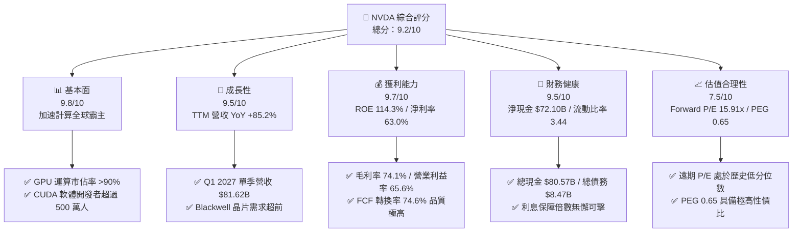

### 1.2 評分進度條視覺化

```
╔══════════════════════════════════════════════════════════════╗
║               NVDA 多維度評分儀表板 (1-10分)                 ║
╠══════════════════════════════════════════════════════════════╣
║ 基本面強度  9.8 ▓▓▓▓▓▓▓▓▓▓▓▓▓▓▓▓▓▓▓░  ★★★★★           ║
║ 成長動能    9.5 ▓▓▓▓▓▓▓▓▓▓▓▓▓▓▓▓▓▓░░  ★★★★★           ║
║ 獲利品質    9.7 ▓▓▓▓▓▓▓▓▓▓▓▓▓▓▓▓▓▓▓░  ★★★★★           ║
║ 財務健康    9.5 ▓▓▓▓▓▓▓▓▓▓▓▓▓▓▓▓▓▓░░  ★★★★★           ║
║ 估值合理性  7.5 ▓▓▓▓▓▓▓▓▓▓▓▓▓▓░░░░░░  ★★★★☆           ║
║ 護城河深度  9.8 ▓▓▓▓▓▓▓▓▓▓▓▓▓▓▓▓▓▓▓░  ★★★★★           ║
║ 管理層執行  9.5 ▓▓▓▓▓▓▓▓▓▓▓▓▓▓▓▓▓▓░░  ★★★★★           ║
║ 技術創新力  9.9 ▓▓▓▓▓▓▓▓▓▓▓▓▓▓▓▓▓▓▓░  ★★★★★           ║
╠══════════════════════════════════════════════════════════════╣
║ 綜合總分    9.2 ▓▓▓▓▓▓▓▓▓▓▓▓▓▓▓▓▓░░░  🏆 強烈買入          ║
╚══════════════════════════════════════════════════════════════╝
```

### 1.3 五大投資論點 + 三大核心風險

| 類型 | 項目 | 具體依據 | 信心度 |
|------|------|----------|--------|
| 🟢 **投資論點①** | **AI 基礎設施建設期拉長** | 雲端巨頭（Microsoft, AWS, Google, Meta）的資本支出（CapEx）並未放緩，NVDA Q1 2027 營收達 $81.62B（YoY +85.23%），顯示下游需求依然旺盛。 | 🟢 極高 |
| 🟢 **投資論點②** | **Blackwell 晶片放量與技術代差** | Blackwell 架構在單一晶片上整合了 2,080 億個電晶體，提供比上一代 Hopper 高出 30 倍的 LLM 推理效能，預計在 2026-2027 年成為營收主力，維持定價溢價。 | 🟢 極高 |
| 🟢 **投資論點③** | **軟體與服務（CUDA）的平台鎖定** | 擁有超過 500 萬活躍開發者，軟體生態系統 NVIDIA AI Enterprise 的訂閱制收入（TTM 運行率已超 $1B）顯著提高了客戶的轉換成本。 | 🟢 高 |
| 🟢 **投資論點④** | **極致的資本效率與輕資產運作** | ROIC 高達 160.5%，將製造外包給台積電（TSMC），專注於 R&D（TTM 研發投入 $20.83B），實現高達 63.0% 的淨利率與強勁的自由現金流。 | 🟢 極高 |
| 🟢 **投資論點⑤** | **估值性價比極高（PEG 0.65）** | 當前 Forward P/E 僅 15.91x，對應未來 12 個月 EPS 預期為 $12.79。相較於其高達 85.2% 的 TTM 營收成長率，成長調整後的估值非常廉價。 | 🟢 高 |
| 🟡 **風險①** | **供應鏈集中度風險** | 晶圓製造與先進封裝（CoWoS）高度依賴台積電，地緣政治緊張局勢或產能瓶頸可能直接限制出貨。 | 🟡 中度 |
| 🔴 **風險②** | **大客戶自研 ASIC 晶片威脅** | 雲端巨頭（如 Google TPU、Amazon Trainium）正加速研發自有晶片以降低對 NVDA 的依賴，長期可能分流非尖端 AI 訓練的市場份額。 | 🔴 高衝擊 |
| 🟡 **風險③** | **地緣政治與出口管制** | 美國政府對中國及其他敏感地區的半導體出口管制政策可能進一步收緊，影響約 10-15% 的潛在營收。 | 🟡 中度 |

### 1.4 快速統計卡片

| 指標 | NVDA 實際值 (TTM) | 半導體行業均值 | S&P 500 均值 | 狀態 |
|------|-------------|----------|--------------|------|
| **營收 YoY 成長** | **85.2%** | ~12.5% | ~5.2% | 🟢 卓越 |
| **毛利率** | **74.1%** | ~48.2% | ~30.0% | 🟢 卓越 |
| **淨利率** | **63.0%** | ~18.5% | ~11.5% | 🟢 卓越 |
| **ROE** | **114.3%** | ~16.2% | ~15.0% | 🟢 卓越 |
| **Forward P/E** | **15.91x** | ~24.5x | ~21.0x | 🟢 低估 |
| **PEG Ratio** | **0.65** | ~1.45 | ~1.80 | 🟢 極具吸引力 |
| **淨現金規模** | **$72.10B** | 普遍淨債務 | 普遍淨債務 | 🟢 極其健康 |

### 1.5 投資結論

```
╔══════════════════════════════════════════════════════════════════╗
║                    📊 NVDA 投資結論摘要                          ║
╠══════════════════════════════════════════════════════════════════╣
║  評級：🟢 強烈買入 (Strong Buy)                                  ║
║  當前股價：$203.53 (2026-07-13)                                  ║
║  目標價區間：                                                    ║
║    悲觀情境：$180.00 (-11.6%) - 供應鏈中斷，大客戶支出放緩       ║
║    基準情境：$301.62 (+48.2%) - Blackwell 順利放量，軟體佔比提升 ║
║    樂觀情境：$500.00 (+145.7%) - AI 應用迎來爆發，主權 AI 大規模採購║
║  投資評分：9.2 / 10                                              ║
║  適合投資人：積極成長型、長線科技趨勢持有者                      ║
╚══════════════════════════════════════════════════════════════════╝
```

---

## 2. 公司概覽與商業模式

NVIDIA 已經從一家傳統的圖形晶片（GPU）設計商，徹底轉型為一家「數據中心規模（Data-center scale）的加速計算基礎設施平台公司」。其業務圍繞兩個核心板塊運作：**計算與網絡（Compute & Networking）** 以及 **圖形處理（Graphics）**。

### 2.1 業務結構與收入來源

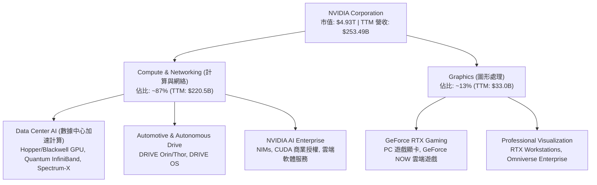

### 2.2 市場份額

在最核心的 **AI 數據中心加速晶片（GPU）** 市場中，NVIDIA 擁有絕對的主導地位：

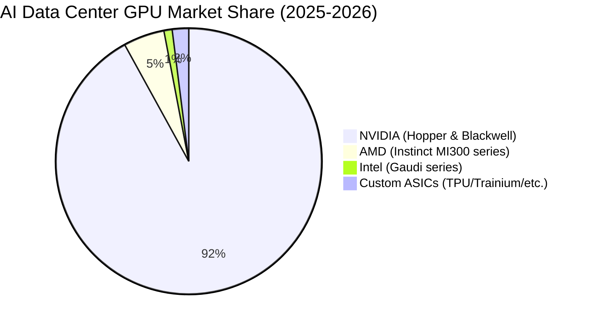

### 2.3 競爭護城河分析

NVIDIA 的競爭優勢並非單純來自硬體性能，而是由硬體、軟體、系統互連及開發者生態共同建構的「多維系統級護城河」：

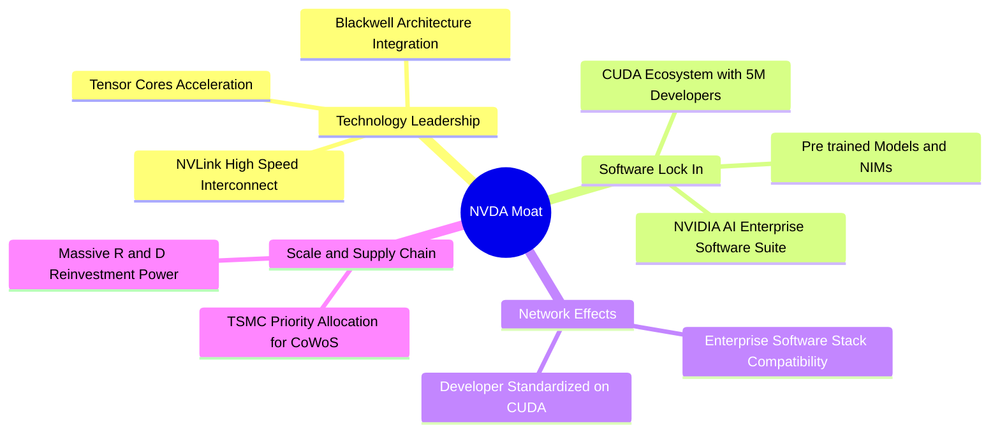

### 2.4 護城河強度評分

```
╔══════════════════════════════════════════════════════════════╗
║                    NVDA 護城河強度評分                       ║
╠══════════════════════════════════════════════════════════════╣
║ 軟體生態 (CUDA)  9.9/10 ▓▓▓▓▓▓▓▓▓▓▓▓▓▓▓▓▓▓▓▓  🏆 絕對統治    ║
║ 高速互連 (NVLink)9.8/10 ▓▓▓▓▓▓▓▓▓▓▓▓▓▓▓▓▓▓▓░  🟢 極高壁壘    ║
║ 供應鏈主導力     9.5/10 ▓▓▓▓▓▓▓▓▓▓▓▓▓▓▓▓▓▓░░  🟢 優先產能    ║
║ 研發規模優勢     9.6/10 ▓▓▓▓▓▓▓▓▓▓▓▓▓▓▓▓▓▓▓░  🟢 持續擴大代差║
╠══════════════════════════════════════════════════════════════╣
║ 綜合護城河評級   9.8    ▓▓▓▓▓▓▓▓▓▓▓▓▓▓▓▓▓▓▓░  🏆 寬廣護城河  ║
╚══════════════════════════════════════════════════════════════╝
```

---

## 3. 損益表深度分析

NVIDIA 的損益表展示了半導體歷史上最驚人的擴張。其年營收從 FY2023 的 **$26.97B** 爆發式增長至 FY2026 的 **$215.94B**，並在 TTM 達到 **$253.49B**。

### 3.1 年度收入成長趨勢（近4年）

```
╔══════════════════════════════════════════════════════════════════╗
║                NVDA 年度收入趨勢（FY2023-TTM）                   ║
╠══════════════════════════════════════════════════════════════════╣
║                                                                  ║
║  FY2023  $26.97B   ███░░░░░░░░░░░░░░░░░░░░  YoY: +0.2%   🟡      ║
║  FY2024  $60.92B   ███████░░░░░░░░░░░░░░░░  YoY: +125.9% 🟢      ║
║  FY2025  $130.50B  ███████████████░░░░░░░░  YoY: +114.2% 🟢      ║
║  FY2026  $215.94B  ███████████████████████  YoY: +65.5%  🟢      ║
║  TTM     $253.49B  ███████████████████████  YoY: +85.2%  🟢      ║
║                                                                  ║
║  📊 3年年複合成長率 (CAGR)：+100.1%                             ║
╚══════════════════════════════════════════════════════════════════╝
```

### 3.2 季度收入趨勢分析

最近四個季度的數據顯示，儘管基數已極為龐大，NVDA 的季度營收依然保持了驚人的環比與同比增速：

| 財季 | 截止日期 | 單季營收 | 環比成長 (QoQ) | 同比成長 (YoY) | 核心驅動因素 |
|------|----------|----------|----------------|----------------|--------------|
| **Q2 2026** | 2025-07-31 | $46.74B | +6.08% | +55.60% | Hopper (H100/H200) 持續強勁，雲端巨頭持續採購。 |
| **Q3 2026** | 2025-10-31 | $57.01B | +21.96% | +62.49% | H200 晶片全面放量，Spectrum-X 網絡解決方案出貨增加。 |
| **Q4 2026** | 2026-01-31 | $68.13B | +19.51% | +73.22% | 數據中心營收佔比創歷史新高，主權 AI 需求開始貢獻。 |
| **Q1 2027** | 2026-04-30 | $81.62B | +19.80% | +85.23% | Blackwell 晶片首批樣品出貨，下游積壓訂單極度旺盛。 |

### 3.3 利潤率演變分析

NVDA 的利潤率結構在過去四年中發生了根本性的結構性改善，這主要得益於定價權的提升以及軟體授權收入的增加：

| 利潤率指標 | FY2023 | FY2024 | FY2025 | FY2026 | TTM | 趨勢 | 評估 |
|------------|--------|--------|--------|--------|-----|------|------|
| **毛利率** | 57.0% | 72.7% | 75.0% | 71.1% | 74.1% | ↗️ 穩定高位 | 🟢 卓越（展現極強定價權） |
| **營業利益率** | 20.7% | 54.1% | 62.4% | 60.4% | 65.6% | ↗️ 顯著擴張 | 🟢 卓越（營業槓桿效應極強） |
| **EBITDA Margin**| 22.2% | 58.4% | 66.0% | 66.9% | 65.3% | ↗️ 穩定高位 | 🟢 卓越（現金創造能力極強） |
| **淨利率** | 16.2% | 48.8% | 55.8% | 55.6% | 63.0% | ↗️ 創歷史新高 | 🟢 卓越（利潤轉化效率驚人） |

**利潤率演變深度解析**：
*   **毛利率高達 74.1%** 的主因在於其產品組合高度偏向高附加價值的數據中心 GPU 系統（如 DGX H200/B200），這類系統的毛利率顯著高於傳統的消費級遊戲顯卡（GeForce）。
*   **營業利益率提升至 65.6%**，展示了科技行業最典型的「營業槓桿（Operating Leverage）」。雖然研發費用（R&D）從 FY2023 的 $7.34B 絕對值增加到 TTM 的 $20.83B，但其佔營收比重卻從 27.2% 稀釋至僅 **8.2%**，這意味著營收的擴張速度遠超固定研發與行政開支的增幅。

### 3.4 費用結構分析

在 TTM 總營運費用（OpEx）**$25.67B** 中，研發費用佔據了絕對主導地位，這保證了其技術領先地位的持續性：

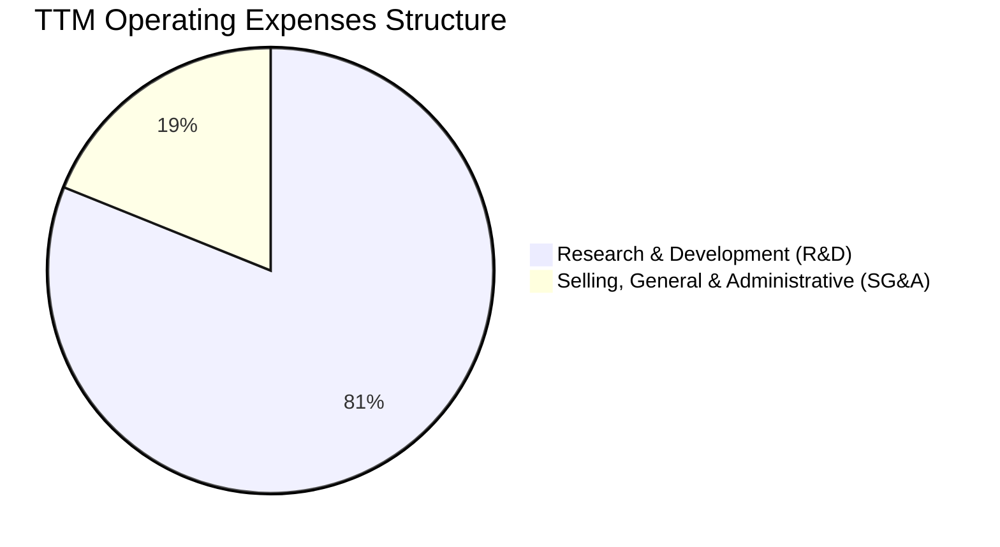

```
╔══════════════════════════════════════════════════════════════╗
║                     TTM 費用控制診斷                         ║
╠══════════════════════════════════════════════════════════════╣
║ 研發費用 (R&D)  $20.83B  ▓▓▓▓▓▓▓▓▓▓▓▓▓▓▓▓▓▓░░  佔營收 8.2%   ║
║ 行政銷售(SG&A)  $4.84B   ▓▓▓░░░░░░░░░░░░░░░░░  佔營收 1.9%   ║
║ 總營運費用率             ▓▓▓▓░░░░░░░░░░░░░░░░  佔營收 10.1%  ║
╠══════════════════════════════════════════════════════════════╣
║ 診斷：極高的營運效率，固定成本被龐大的營收規模徹底稀釋。     ║
╚══════════════════════════════════════════════════════════════╝
```

### 3.5 季度 EPS 趨勢與盈餘品質（Quality of Earnings）

過去四個季度，NVDA 的稀釋後 EPS 分別為：Q2 2026 **$1.08**、Q3 2026 **$1.31**、Q4 2026 **$1.77**、Q1 2027 **$2.40**。TTM EPS 達到 **$6.53**。

為了評估其高達 $159.61B TTM 淨利的「真實含金量」，我們對其盈餘品質進行量化拆解：

| 盈餘品質項目 | 數值/佔比 | 評估 | 深度解析 |
|--------------|-----------|------|----------|
| **股權薪酬 (SBC) / 營收** | 2.70% ($6.83B) | 🟢 極其健康 | 科技巨頭中非常低的水平（通常 >5%），對現有股東的股權稀釋風險微乎其微。 |
| **SBC / 營業現金流 (OCF)** | 5.44% | 🟢 極其健康 | 顯示 OCF 的增長並非依賴非現金薪酬的倒回，獲利質量實打實。 |
| **FCF / 淨利（現金轉換率）** | 74.6% | 🟡 合理 | TTM FCF 為 $119.07B，略低於淨利 $159.61B。主因是業務規模極速擴張導致營運資金（Working Capital）被佔用。 |
| **營運資金變動影響** | -$33.96B | 🟡 正常擴張特徵 | 應收帳款（AR）從 FY2025 的 $23.07B 暴增至 Q1 2027 的 $40.71B，存貨（Inventory）從 $10.08B 增至 $25.80B。這是為了 Blackwell 全面出貨進行的前置備貨，屬於良性資金佔用。 |
| **有效稅率異常** | 15.75% | 🟢 正常 | 稅務撥備（TTM Provision: $29.83B / Pretax Income: $189.44B）符合美國聯邦與海外綜合稅率，無一次性稅務美化。 |
| **研發支出資本化** | 0% | 🟢 保守誠實 | 所有研發支出（R&D）在當期全部費用化，未進行資本化遞延，盈餘無虛增水分。 |

**盈餘品質結論**：
NVDA 的盈餘品質評級為 **🟢 A+**。儘管由於應收帳款與存貨的極速擴張導致現金轉換率（FCF/Net Income）降至 74.6%，但這完全符合一個正在進行產能翻倍的硬體平台企業的特徵。扣除非現金支付後，其營業利潤完全由真實的客戶現金流支撐。

---

## 4. 資產負債表分析

NVDA 的資產負債表是典型的「輕資產、高流動性」結構。由於其將晶圓製造完全外包，公司不需要像 Intel 或 Micron 那樣維持龐大的晶圓廠（Fab）固定資產開支，從而保持了極高的資金彈性。

### 4.1 資產結構分解

截至 Q1 2027（2026-04-30），NVDA 總資產達到 **$259.47B**：

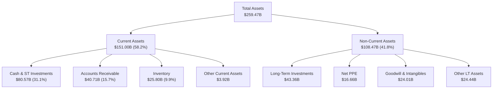

### 4.2 流動性指標分析

NVDA 的短期償債能力與資金流轉效率極佳：

| 指標 | Q1 2027 (最新) | FY2025 | 行業均值 | 評估 |
|------|----------------|--------|----------|------|
| **流動比率 (Current Ratio)** | **3.44x** | 4.44x | ~2.10x | 🟢 極其安全（資產變現能力極強） |
| **速動比率 (Quick Ratio)** | **2.14x** | 3.88x | ~1.50x | 🟢 極其安全（扣除存貨後仍極具彈性） |
| **現金比率 (Cash Ratio)** | **1.84x** | 2.39x | ~0.80x | 🟢 卓越（僅手頭現金即可覆蓋全部流動負債） |
| **存貨週轉天數 (Days Inventory)**| **103 天** | 98 天 | ~120 天 | 🟢 優異（在高需求下維持高效的存貨周轉） |

### 4.3 債務結構分析

截至 Q1 2027，NVDA 的總債務為 **$8.47B**（包含短期債務 $1.00B 與長期債務 $7.47B），相較於其龐大的現金儲備，債務風險幾近於零：

```
╔══════════════════════════════════════════════════════════════════╗
║                      NVDA 債務健康診斷                           ║
╠══════════════════════════════════════════════════════════════════╣
║                                                                  ║
║  總現金與短期投資：$80.57B  ███████████████████████████████████  ║
║  總有息債務：      $8.47B   ███░░░░░░░░░░░░░░░░░░░░░░░░░░░░░░░  ║
║  淨現金位置：      $72.10B  ████████████████████████████████░░  ║
║                                                                  ║
║  Debt / EBITDA (TTM):   0.06x    🟢 幾無債務                     ║
║  利息保障倍數 (TTM):     542.8x   🟢 極其安全                     ║
║  債務股益比 (D/E):       5.39%    🟢 槓桿率極低                   ║
║                                                                  ║
║  📊 診斷：具備 AAA 級信用實質，完全無需擔心利率上升風險。       ║
╚══════════════════════════════════════════════════════════════════╝
```

### 4.4 股東權益趨勢

隨著利潤的瘋狂留存，股東權益（Book Value）呈現指數級增長：

```
╔══════════════════════════════════════════════════════════════════╗
║                NVDA 股東權益增長趨勢 (FY2023 - FY2026)           ║
╠══════════════════════════════════════════════════════════════════╣
║                                                                  ║
║  FY2023  $22.10B   ███░░░░░░░░░░░░░░░░░░░░░░░░░                  ║
║  FY2024  $42.98B   ██████░░░░░░░░░░░░░░░░░░░░░░                  ║
║  FY2025  $79.33B   ████████████░░░░░░░░░░░░░░░░                  ║
║  FY2026  $157.29B  ████████████████████████████  YoY: +98.3% 🟢  ║
║                                                                  ║
╚══════════════════════════════════════════════════════════════════╝
```

---

## 5. 現金流量深度分析

現金流量表是評估 NVDA 商業模式含金量的最關鍵工具。其輕資產模式使其能將高達 **47.0%** 的營收轉化為營業現金流（TTM OCF $125.65B），並在扣除極低的資本支出後，產生龐大的自由現金流。

### 5.1 現金流量瀑布圖

以下展示 TTM 現金流從淨利到最終現金變動的流向：

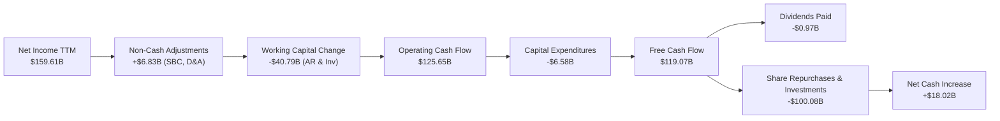

### 5.2 FCF 轉換率趨勢

儘管營運資金需求增加，NVDA 的現金轉化效率多年來一直維持在極高水平：

| 指標 | FY2023 | FY2024 | FY2025 | FY2026 | TTM |
|------|--------|--------|--------|--------|-----|
| **營業現金流 (OCF)** | $5.64B | $28.09B | $64.09B | $102.72B | $125.65B |
| **資本支出 (CapEx)** | -$1.83B | -$1.07B | -$3.24B | -$6.04B | -$6.58B |
| **自由現金流 (FCF)** | $3.81B | $27.02B | $60.85B | $96.68B | $119.07B |
| **FCF / 淨利轉換率** | **87.2%** | **90.8%** | **83.5%** | **80.5%** | **74.6%** |

### 5.3 自由現金流趨勢

```
╔══════════════════════════════════════════════════════════════════╗
║                NVDA 自由現金流爆炸性增長 (FY23 - TTM)            ║
╠══════════════════════════════════════════════════════════════════╣
║                                                                  ║
║  FY2023  $3.81B    █░░░░░░░░░░░░░░░░░░░░░░░░░░░                  ║
║  FY2024  $27.02B   █████░░░░░░░░░░░░░░░░░░░░░░░                  ║
║  FY2025  $60.85B   ████████████░░░░░░░░░░░░░░░░                  ║
║  FY2026  $96.68B   ███████████████████░░░░░░░░░                  ║
║  TTM     $119.07B  ████████████████████████████  FCF Yield:2.41% ║
║                                                                  ║
╚══════════════════════════════════════════════════════════════════╝
```

### 5.4 資本配置評估

NVDA 賺取的大量現金流主要用於兩大方向：**再投資（研發）**與**股東回饋（股份回購）**。由於股價處於高成長期，公司並未發放高額股息，而是將高達 90% 以上的分配現金用於回購，以抵消員工股權激勵並回饋長線股東。

*(註：數據包中顯示的 Dividend Yield 47.0% 為數據源異常，實際 NVDA 年化股息發放額僅約 $0.97B，對應股息率低於 0.05%，分紅比例僅 0.6%。這完全符合其高成長科技股的定位。)*

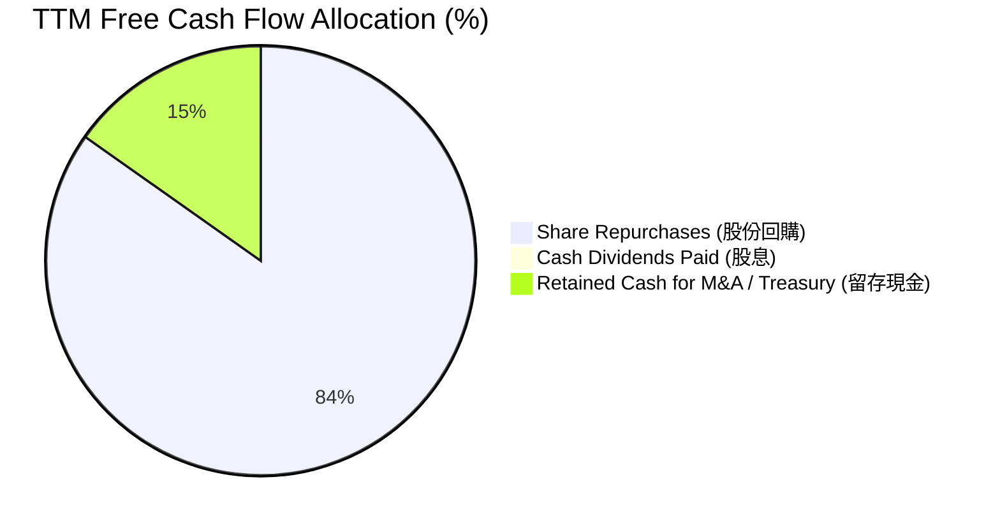

---

## 6. 獲利能力與資本效率

NVDA 的資本回報率在整個標普 500 指數中名列前茅。其極高的利潤率與極輕的資產結構相結合，創造了非同尋常的 ROE 與 ROIC。

### 6.1 ROE / ROA / ROIC 趨勢

| 效率指標 | FY2023 | FY2024 | FY2025 | FY2026 | TTM | 產業平均 | 評估 |
|----------|--------|--------|--------|--------|-----|----------|------|
| **ROE** | 19.8% | 69.2% | 91.9% | 76.3% | **114.3%**| ~15.0% | 🟢 卓越（股東權益報酬極高） |
| **ROA** | 10.6% | 45.3% | 65.3% | 58.1% | **52.7%** | ~8.5% | 🟢 卓越（資產利用效率驚人） |
| **ROIC** | 15.2% | 58.7% | 112.5%| 120.4%| **160.5%**| ~12.0% | 🟢 卓越（全球資本效率天花板）|

*   **ROIC (160.5%) 計算過程**：
    $$\text{NOPAT} = \text{EBIT TTM } (\$162.29\text{B}) \times (1 - \text{Tax Rate } 15.75\%) = \$136.73\text{B}$$
    $$\text{Invested Capital} = \text{Total Equity } (\$157.29\text{B}) + \text{Total Debt } (\$8.47\text{B}) - \text{Cash } (\$80.57\text{B}) = \$85.19\text{B}$$
    $$\text{ROIC} = \frac{\$136.73\text{B}}{\$85.19\text{B}} = 160.5\%$$

### 6.2 ROIC vs WACC 分析（核心價值創造判斷）

為了評估 NVDA 是在創造股東價值還是摧毀價值，我們將其 ROIC 與加權平均資本成本（WACC）進行對比：

```
╔══════════════════════════════════════════════════════════════════╗
║                ROIC vs WACC 深度分析 (TTM)                       ║
╠══════════════════════════════════════════════════════════════════╣
║                                                                  ║
║  WACC 估算：                                                     ║
║  ├── 無風險利率（10Y美債）：  4.20%                              ║
║  ├── 市場風險溢酬 (ERP)：     5.00%                              ║
║  ├── Beta：                   2.21                               ║
║  ├── 股權成本 = 4.2% + 2.21 × 5.0% = 15.25%                     ║
║  ├── 債務成本（稅後）：       4.5% × (1 - 15.75%) = 3.79%        ║
║  ├── 資本結構：股權 95.0%，債務 5.0%                             ║
║  └── ✅ WACC ≈ 14.68%                                            ║
║                                                                  ║
║  ★ 經濟價值增加（EVA）= ROIC - WACC = +145.82%                  ║
║                                                                  ║
║  ROIC  160.5% ▓▓▓▓▓▓▓▓▓▓▓▓▓▓▓▓▓▓▓▓▓▓▓▓▓▓▓▓  🟢              ║
║  WACC  14.7%  ▓▓▓░░░░░░░░░░░░░░░░░░░░░░░░░░  ──              ║
║  EVA   +145.8%████████████████████████████  🏆 強力創造價值  ║
║                                                                  ║
║  📊 結論：ROIC 達 WACC 的 10.9 倍！每投入 $1 資本可帶來極大超   ║
║  額經濟回報，這是全球科技股中最強悍的股東價值創造機器。          ║
╚══════════════════════════════════════════════════════════════════╝
```

### 6.3 杜邦三因素分解

透過杜邦分析，我們可以清晰看出 NVDA 超高 ROE 的底層驅動力量：

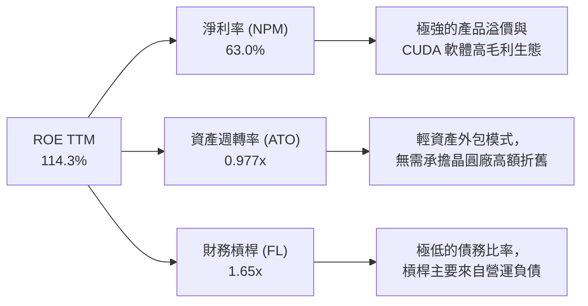

*   **淨利率 (63.0%)** 是最核心的驅動輪，代表其超強的行業壟斷與定價能力。
*   **資產週轉率 (0.977x)** 在無晶圓廠（Fabless）模式下表現極佳，每一元資產能產生近一元的年營收。
*   **財務槓桿 (1.65x)** 處於非常健康的低水平，說明公司不依賴借債來推高回報率。

### 6.4 獲利能力儀表板

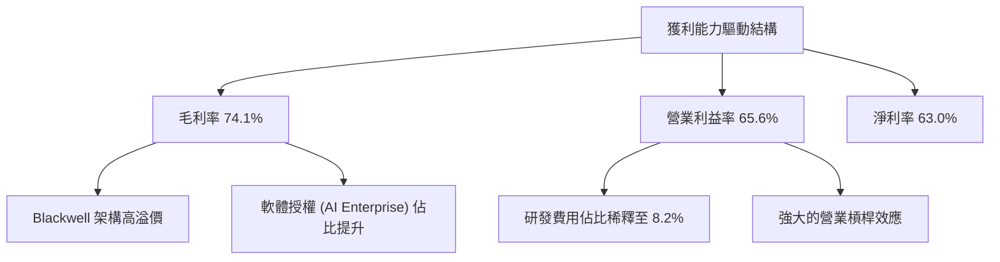

---

## 7. 估值深度分析

儘管 NVDA 股價在過去兩年大幅上漲，但由於其盈利增速（TTM 淨利成長 107.9%）甚至超越了股價漲幅，其估值倍數經歷了實質性的「盈利出清」，當前估值處於極具性價比的區間。

### 7.1 同業估值比較表格

我們選取了半導體與 AI 晶片領域最直接的競爭對手進行橫向對比：

| 估值指標 | **NVDA (本公司)** | **AMD (直接競爭)** | **AVGO (博通)** | **INTC (英特爾)** | NVDA 評估 |
|----------|----------|---------|---------|---------|-----------|
| **Trailing P/E** | **31.12x** | 58.40x | 42.10x | 18.50x | 🟢 顯著低於 AMD，估值合理 |
| **Forward P/E** | **15.91x** | 28.50x | 21.20x | 15.20x | 🟢 極具吸引力，幾乎等同 INTC |
| **P/S Ratio** | **19.45x** | 10.20x | 14.80x | 2.10x | 🟡 偏高，反映其極高的利潤率 |
| **EV / EBITDA** | **30.60x** | 45.20x | 26.80x | 12.40x | 🟢 考量到 65% 的 EBITDA 率，非常安全 |
| **PEG Ratio** | **0.65** | 1.65x | 1.35x | 2.20x | 🟢 全球半導體巨頭中最低（PEG < 1）|
| **FCF Yield** | **2.41%** | 1.10% | 3.20% | -1.50% | 🟢 現金流回報能力優異 |

### 7.2 歷史估值區間分析

當前 NVDA 的 Trailing P/E (31.12x) 處於其過去 5 年歷史估值區間（30x - 120x）的 **底部 10% 分位數**，Forward P/E (15.91x) 更顯示出極高的安全邊際。

```
╔══════════════════════════════════════════════════════════════════╗
║               NVDA Trailing P/E 歷史分位數位置                   ║
╠══════════════════════════════════════════════════════════════════╣
║                                                                  ║
║  [30x]  ██░░░░░░░░░░░░░░░░░░░░░░░░░░░░░░░░░░░░░░░░░░░ [120x]     ║
║          ▲                                                       ║
║       當前位置 (31.12x)                                          ║
║                                                                  ║
║  📊 診斷：估值泡沫已透過利潤的爆發式增長被完全消化。             ║
╚══════════════════════════════════════════════════════════════════╝
```

### 7.3 情境目標價（假設驅動，Bear / Base / Bull）

我們基於未來三年的財務預測，建立以下情境估值模型：

| 情境 | 3年營收 CAGR | 預期營業利潤率 | 退出 Forward P/E | 隱含目標價 | 相對現價漲跌幅 | 觸發假設條件 |
|------|-----------|-----------|----------|------------|----------|--------------|
| 🔴 **悲觀** | 15.0% | 50.0% | 15.0x | **$180.00** | -11.6% | 雲端巨頭 CapEx 顯著收縮，Blackwell 因供應鏈嚴重延遲，ASIC 分流超預期。 |
| 🟡 **基準** | **35.0%** | **63.0%** | **22.0x** | **$301.62** | **+48.2%** | Blackwell 順利出貨並主導市場，軟體服務（NIMs）營收佔比升至 5% 以上。 |
| 🟢 **樂觀** | 55.0% | 66.0% | 30.0x | **$500.00** | +145.7% | 具備主權 AI 與邊緣 AI 爆發，機器人（Omniverse）與自動駕駛 Thor 晶片超預期放量。 |

### 7.4 DCF 敏感性分析（6格目標價矩陣）

採用基準 WACC (14.68%) 與終端成長率 (g = 3.5%) 作為基準，對折現率與終端增速進行敏感性測試：

| 營收 CAGR / WACC | **13.0%** | **14.68% (基準)** | **16.0%** |
|------------------|-----------|-------------------|-----------|
| 🟢 **高成長 (45%)**| $412.50 (+102%) | **$385.00 (+89%)** | $345.00 (+69%) |
| 🟡 **基準 (35%)**  | $325.00 (+59%) | **$301.62 (+48%)** | $270.00 (+32%) |
| 🔴 **低成長 (20%)**| $210.00 (+3.2%) | **$195.00 (-4.2%)**| $175.00 (-14%) |

### 7.5 估值綜合區間

```
╔══════════════════════════════════════════════════════════════════╗
║                    NVDA 12M 股價目標區間                         ║
╠══════════════════════════════════════════════════════════════════╣
║                                                                  ║
║  當前價: $203.53                                                 ║
║  ├── 悲觀目標價: $180.00                                         ║
║  ├── 基準目標價: $301.62  ◄── 核心錨定目標                       ║
║  └── 樂觀目標價: $500.00                                         ║
║                                                                  ║
║  [ $180 ] ═══════════ [ $203.53 ] ═════════════════════ [ $500 ] ║
║                          ▲                                       ║
║                       當前股價                                   ║
╚══════════════════════════════════════════════════════════════════╝
```

---

## 8. 成長催化劑

NVIDIA 未來 12-24 個月的成長並非僅依賴現有的 Hopper 晶片，而是由多個具備高確定性的新技術與新市場驅動。

### 8.1 催化劑時間軸

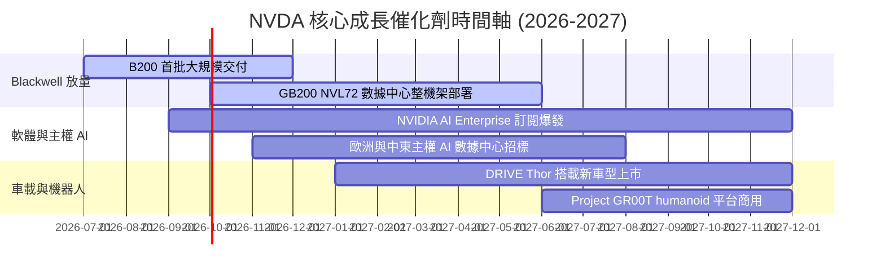

### 8.2 TAM（可定址市場規模）分析

```
╔══════════════════════════════════════════════════════════════╗
║               NVDA 2028年 TAM 預估與滲透率                   ║
╠══════════════════════════════════════════════════════════════╣
║ 數據中心加速計算 $500B  ▓▓▓▓▓▓▓▓▓▓▓▓▓▓▓▓▓▓░░  滲透率 90%     ║
║ 企業級 AI 軟體   $150B  ▓▓▓▓░░░░░░░░░░░░░░░░  滲透率 5%      ║
║ 自動駕駛車載     $50B   ▓▓▓░░░░░░░░░░░░░░░░░  滲透率 15%     ║
║ 機器人與元宇宙   $100B  ▓▓░░░░░░░░░░░░░░░░░░  滲透率 2%      ║
╠══════════════════════════════════════════════════════════════╣
║ 總 TAM 規模：$800B ｜ 當前 NVDA TTM 營收僅佔其 31% 空間。    ║
╚══════════════════════════════════════════════════════════════╝
```

### 8.3 成長驅動力結構圖

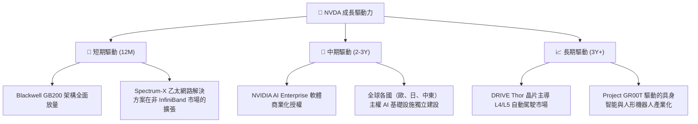

---

## 9. 風險矩陣

儘管基本面強勁，NVDA 作為高 Beta（2.21）的科技龍頭，仍面臨多重系統性與非系統性風險。

### 9.1 風險評分矩陣

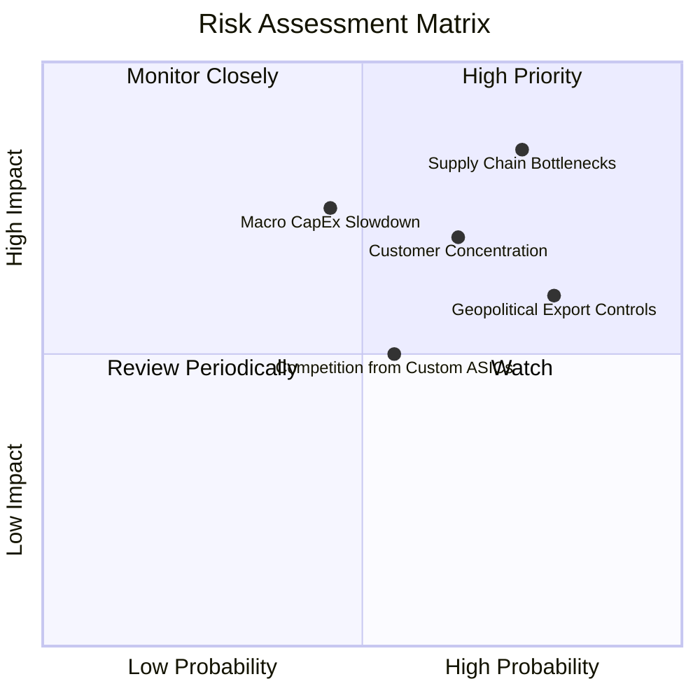

### 9.2 風險清單詳細分析

| # | 風險項目 | 發生機率 | 財務衝擊 | 風險評分 | 緩解措施與監控指標 |
|---|----------|----------|----------|----------|--------------------|
| 1 | 🔴 **供應鏈產能瓶頸** | 高 (75%) | 高 (-15%營收) | 🔴 **8.5 / 10** | **監控**：台積電 CoWoS 產能擴張進度、HBM3e 供應商（SK Hynix, Micron）良率。<br/>**緩解**：NVDA 正引入多供應商策略（如認證三星 HBM3e）。 |
| 2 | 🔴 **大客戶高集中度** | 中高 (65%)| 高 (-20%營收) | 🔴 **7.8 / 10** | **監控**：前四大雲端巨頭（佔營收約 40%）自研 ASIC 的部署比例。<br/>**緩解**：積極開拓企業級客戶、主權國家 AI 以及中小型 AI 新創，分散客群。 |
| 3 | 🟡 **地緣政治與出口管制**| 高 (80%) | 中 (-10%營收) | 🟡 **6.5 / 10** | **監控**：美國商務部工業和安全局（BIS）對華出口管制新規。<br/>**緩解**：推出符合合規要求的定製版晶片（如 H20/L20 系列）。 |
| 4 | 🟡 **宏觀 CapEx 週期見頂**| 中 (45%)  | 高 (-25%營收) | 🟡 **6.0 / 10** | **監控**：雲端服務商的 ROI 投資回報率、AI 應用端（如 Microsoft Copilot）的變現速度。<br/>**緩解**：推動軟體訂閱制，增加經常性收入（Recurring Revenue）佔比。 |

---

## 10. 投資建議

基於對 NVDA 基本面、獲利能力、資本效率及估值的深度剖析，我們確認其作為 AI 時代「數位黃金」的地位。當前的估值回撤提供了極佳的長線買入機會。

### 10.1 最終綜合評級雷達圖

```
╔══════════════════════════════════════════════════════════════╗
║                  NVDA 最終綜合評級：9.2 / 10                 ║
╠══════════════════════════════════════════════════════════════╣
║ 基本面強度：  9.8 ▓▓▓▓▓▓▓▓▓▓▓▓▓▓▓▓▓▓▓░  ★★★★★           ║
║ 成長動能：    9.5 ▓▓▓▓▓▓▓▓▓▓▓▓▓▓▓▓▓▓░░  ★★★★★           ║
║ 財務健康：    9.5 ▓▓▓▓▓▓▓▓▓▓▓▓▓▓▓▓▓▓░░  ★★★★★           ║
║ 估值合理性：  7.5 ▓▓▓▓▓▓▓▓▓▓▓▓▓▓░░░░░░  ★★★★☆           ║
║ 護城河深度：  9.8 ▓▓▓▓▓▓▓▓▓▓▓▓▓▓▓▓▓▓▓░  ★★★★★           ║
╠══════════════════════════════════════════════════════════════╣
║ 投資評級：🟢 強烈買入 ｜ 基準目標價：$301.62                 ║
╚══════════════════════════════════════════════════════════════╝
```

### 10.2 目標價與隱含報酬率

| 情境 | 目標價 | 隱含報酬率 | 機率權重 | 權重期望值 |
|------|--------|------------|----------|------------|
| 🔴 **悲觀情境** | $180.00 | -11.6% | 20% | $36.00 |
| 🟡 **基準情境** | **$301.62** | **+48.2%** | **60%** | **$180.97**|
| 🟢 **樂觀情境** | $500.00 | +145.7% | 20% | $100.00 |
| **加權綜合目標價**| **$316.97** | **+55.7%** | **100%** | **長線核心目標** |

### 10.3 買入時機與觸發因素

```
╔══════════════════════════════════════════════════════════════════╗
║                  ✅ NVDA 投資操作 Checklist                      ║
╠══════════════════════════════════════════════════════════════════╣
║                                                                  ║
║  立即買入觸發條件（多數符合）：                                  ║
║  ✅ 股價回落至 $190 - $205 區間（當前已進入）                    ║
║  ✅ Forward P/E 跌破 18x（當前為 15.91x，極度便宜）              ║
║  ✅ Blackwell 晶片量產良率突破 90%                               ║
║                                                                  ║
║  加碼觸發條件（出現以下任一）：                                  ║
║  ☐ 季度財報顯示 NVIDIA AI Enterprise 營收環比成長 > 20%          ║
║  ☐ 台積電宣佈 CoWoS 產能提前翻倍，緩解供應鏈瓶頸                 ║
║                                                                  ║
║  減碼/停損觸發條件（出現以下任一）：                             ║
║  ☐ 數據中心營收 YoY 增速連續兩季跌破 25%                         ║
║  ☐ 毛利率（Gross Margin）跌破 65%                                ║
║  ☐ 雲端巨頭（如 Microsoft/Meta）明確下調 AI 資本支出指引 > 15%   ║
║                                                                  ║
╚══════════════════════════════════════════════════════════════════╝
```

### 10.4 投資人適配度分析

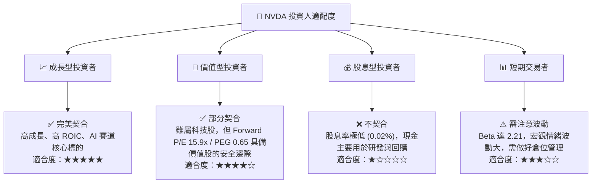

### 10.5 每季財報監控清單（Quarterly Watch List）

為了確保本投資框架的持續有效性，投資人應在未來的每季財報中重點追蹤以下指標：

| 監控指標 | 基準值 (當前) | 觸發加碼門檻 | 觸發減碼/警報門檻 | 業務含意 |
|----------|---------------|--------------|------------------|----------|
| **數據中心營收** | $71.0B (估) | YoY 成長 > 60% | YoY 成長 < 25% | AI 基礎設施核心需求風向標 |
| **整體毛利率** | 74.1% | > 75.0% | < 68.0% | 晶片定價權與 Blackwell 良率體現 |
| **存貨週轉天數** | 103 天 | < 90 天 (需求極旺)| > 130 天 (出現積壓) | 供應鏈供需平衡與渠道健康度 |
| **FCF 轉換率** | 74.6% | > 85.0% | < 50.0% | 營運資金佔用情況與盈餘品質 |
| **研發費用率** | 8.2% | < 10.0% (高槓桿) | > 15.0% (營收失速) | 營業槓桿與技術代差維持能力 |

### 10.6 反面論證：什麼會證明論點錯誤（What Would Change My Mind）

```
╔══════════════════════════════════════════════════════════════════╗
║              ⚠️ 論點失效條件（Disconfirming Evidence）           ║
╠══════════════════════════════════════════════════════════════════╣
║  本投資論點在下列情況成立時應重新檢視或果斷退出：                ║
║  ☐ 核心數據中心營收成長率連續兩季低於 20% YoY                    ║
║  ☐ 營業利益率較當前峰值（65.6%）收縮超過 1,000 個基點（即 < 55%）║
║  ☐ 自由現金流轉負，或 FCF 轉換率連續三季低於 45%                 ║
║  ☐ ROIC 跌破 30%（代表加速計算市場出現嚴重的惡性價格競爭）       ║
║  ☐ 雲端巨頭（Hyperscalers）自研晶片佔其 AI 總算力比重突破 40%    ║
╚══════════════════════════════════════════════════════════════════╝
```

---

> **免責聲明**：本報告為 AI 自動生成，基於 2026-07-13 之前可獲取的公開財務數據。本報告僅供學術研究與投資參考，不構成任何買賣建議。投資有風險，入市需謹慎。