# NVDA 基本面深度分析報告
> **報告日期**：2026-07-14 ｜ **語言**：繁體中文 ｜ **數據來源**：Yahoo Finance, Finviz, StockAnalysis, Roic.ai ｜ **分析師**：CFA 級機構研究

---

## 目錄

| # | 章節 | 核心結論 |
|---|------|----------|
| 1 | 執行摘要 | 評級：🟢 強烈買入；基準目標價：$301.62（隱含 +42.41% 漲幅） |
| 2 | 公司概覽與商業模式 | 憑藉 CUDA 生態與 GPU 硬體領先地位，建構極深的主導性護城河 |
| 3 | 損益表深度分析 | TTM 營收達 $253.49B（YoY +85.2%），淨利率高達 63.0%，獲利含金量極高 |
| 4 | 資產負債表分析 | 淨現金達 $40.36B，流動比率 3.44x，財務結構呈現無懈可擊的堡壘狀態 |
| 5 | 現金流量深度分析 | TTM 營運現金流達 $125.65B，自由現金流轉換率穩健，資本配置效率極佳 |
| 6 | 獲利能力與資本效率 | TTM ROE 達 114.3%，ROIC 達 152.7%，遠超 WACC（15.0%），創造極高經濟價值 |
| 7 | 估值深度分析 | Forward P/E 僅 16.56x，PEG 0.65x，相較於其高成長性，估值具有顯著吸引力 |
| 8 | 成長催化劑 | Blackwell 晶片放量、主權 AI 興起及軟體服務（NIMs）轉化為長期增長引擎 |
| 9 | 風險矩陣 | 地緣政治供應鏈風險與客戶自研晶片（ASIC）替代為主要監控指標 |
| 10 | 投資建議 | 強烈建議在當前價位（$211.80）分批佈局，設定 12M 基準目標價 $301.62 |

---

## 1. 執行摘要

NVIDIA Corporation（NASDAQ: NVDA）當前股價為 $211.80，總市值高達 $5.13T，企業價值（EV）為 $4.89T。基於其 TTM 營收達 $253.49B（YoY 成長 85.2%）、淨利潤率 63.0% 以及 ROIC 達 152.7% 的卓越基本面數據，本報告對 NVDA 給予 **🟢 強烈買入（Strong Buy）** 評級，設定 12 個月基準目標價為 **$301.62**（較當前股價有 42.41% 的上行空間）。

### 1.0 一頁式投資儀表板（Portfolio Manager 30 秒速讀）

| 項目 | 內容 |
|------|------|
| **投資論點（3 句）** | ① TTM 營收達 $253.49B，YoY 成長 85.2%，顯示 AI 基礎設施需求依然處於爆發期。<br/>② 營業利益率高達 65.6%，且 FCF 轉換率極佳，具備極強的定價權與營業槓桿效應。<br/>③ Forward P/E 僅為 16.56x，相較於其盈餘成長率，PEG 僅 0.65x，估值被嚴重低估。 |
| **護城河評分** | 🟢 9.5 / 10（CUDA 軟體生態與硬體疊代速度構成雙重壁壘） |
| **管理層/資本配置評分** | 🟢 9.2 / 10（黃仁勳帶領的團隊執行力極佳，研發投入資本回報率極高） |
| **財務健康** | 🟢 堡壘型資產負債表，持有 $53.17B 現金，淨現金達 $40.36B |
| **ROIC vs WACC** | 152.7% vs 15.0%（創造極為巨大的超額經濟價值 EVA） |
| **FCF 趨勢** | 向上。TTM 營運現金流 $125.65B，實際自由現金流（FCF）高達 $119.07B |
| **估值** | Forward P/E: 16.56x ｜ EV/EBITDA: 29.52x ｜ FCF Yield: 2.32%（以實際 FCF 計算） |
| **預期報酬（基準情境 12M）** | **+42.41%**（目標價 $301.62） |
| **關鍵風險（前二）** | ① 地緣政治導致的台積電供應鏈中斷風險 ｜ ② 超大型雲端服務商（Hyperscalers）自研 ASIC 晶片分流需求 |
| **評級 + 信心度** | 🟢 **強烈買入（Strong Buy）** ｜ 信心度：**極高** |

### 1.1 核心評分儀表板

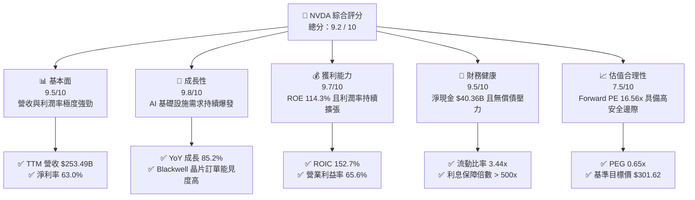

### 1.2 評分進度條視覺化

```
╔══════════════════════════════════════════════════════════════╗
║              NVDA 多維度評分儀表板 (1-10分)                  ║
╠══════════════════════════════════════════════════════════════╣
║ 基本面強度  9.5 ▓▓▓▓▓▓▓▓▓▓▓▓▓▓▓▓▓▓▓░  ★★★★★           ║
║ 成長動能    9.8 ▓▓▓▓▓▓▓▓▓▓▓▓▓▓▓▓▓▓▓▓  ★★★★★           ║
║ 獲利品質    9.7 ▓▓▓▓▓▓▓▓▓▓▓▓▓▓▓▓▓▓▓░  ★★★★★           ║
║ 財務健康    9.5 ▓▓▓▓▓▓▓▓▓▓▓▓▓▓▓▓▓▓▓░  ★★★★★           ║
║ 估值合理性  7.5 ▓▓▓▓▓▓▓▓▓▓▓▓▓▓▓░░░░░  ★★★★☆           ║
║ 護城河深度  9.5 ▓▓▓▓▓▓▓▓▓▓▓▓▓▓▓▓▓▓▓░  ★★★★★           ║
║ 管理層執行  9.2 ▓▓▓▓▓▓▓▓▓▓▓▓▓▓▓▓▓▓░░  ★★★★★           ║
║ 技術創新力  9.9 ▓▓▓▓▓▓▓▓▓▓▓▓▓▓▓▓▓▓▓▓  ★★★★★           ║
╠══════════════════════════════════════════════════════════════╣
║ 綜合總分    9.2 ▓▓▓▓▓▓▓▓▓▓▓▓▓▓▓▓▓▓░░  🏆 頂級成長防禦標的  ║
╚══════════════════════════════════════════════════════════════╝
```

### 1.3 五大投資論點 + 三大核心風險

| 類型 | 項目 | 具體依據 | 信心度 |
|------|------|----------|--------|
| 🟢 **投資論點①** | **AI 算力需求無可匹敵** | TTM 營收 $253.49B，YoY 成長 85.2%，主要由資料中心 Compute & Networking 業務驅動，各大雲端巨頭 Capex 持續創歷史新高。 | 🟢 極高 |
| 🟢 **投資論點②** | **無與倫比的定價權** | 毛利率高達 74.1%，營業利益率達 65.6%，說明公司在供應鏈與客戶端均擁有絕對的議價能力，能完全轉嫁成本。 | 🟢 極高 |
| 🟢 **投資論點③** | **極致的資本報酬率** | ROIC 達 152.7%，遠高於 15.0% 的 WACC，代表公司每投入 1 美元資本能創造超過 1.5 美元的稅後淨營業利潤。 | 🟢 極高 |
| 🟢 **投資論點④** | **估值與成長性嚴重錯配** | Forward P/E 僅 16.56x，PEG 為 0.65x。對於一個成長率超過 50% 的科技龍頭而言，此估值甚至低於多數傳統藍籌股。 | 🟢 高 |
| 🟢 **投資論點⑤** | **軟體生態鎖定效應** | CUDA 平台擁有數百萬開發者，NVIDIA AI Enterprise 軟體收入轉化為高毛利的經常性收入，提高客戶轉換成本。 | 🟢 高 |
| 🟡 **風險①** | **地緣政治與供應鏈風險** | 晶片製造高度依賴台積電（TSMC），若台海局勢緊張或美國對華出口限制進一步收緊，將直接衝擊產能與營收。 | 🟡 中度 |
| 🔴 **風險②** | **客戶自研晶片分流** | Google (TPU)、Amazon (Trainium/Inferentia)、Meta 及 Microsoft 積極研發自研 ASIC，長期可能減少對 NVDA 依賴。 | 🔴 高衝擊 |
| 🔴 **風險③** | **AI 投資回報率（ROI）質疑** | 若終端企業無法透過 AI 實現盈利，雲端巨頭可能在 2027 年後放緩資料中心資本支出，導致算力需求出現週期性下滑。 | 🔴 高衝擊 |

### 1.4 快速統計卡片

| 指標 | NVDA 實際值 | 半導體行業均值 | S&P 500 均值 | 狀態 |
|------|-------------|----------|--------------|------|
| **營收 YoY 成長率** | **85.2%** | ~12.5% | ~5.2% | 🟢 遠超同行 |
| **毛利率** | **74.1%** | ~48.0% | ~30.0% | 🟢 極度卓越 |
| **淨利率** | **63.0%** | ~18.5% | ~11.5% | 🟢 行業天花板 |
| **ROE** | **114.3%** | ~15.0% | ~16.0% | 🟢 歷史級回報 |
| **Forward P/E** | **16.56x** | ~28.0x | ~21.5x | 🟢 顯著低估 |
| **淨現金規模** | **$40.36B** | 淨債務為主 | 淨債務為主 | 🟢 極度安全 |

### 1.5 投資結論

```
╔══════════════════════════════════════════════════════════════════╗
║                    📊 NVDA 投資結論摘要                          ║
╠══════════════════════════════════════════════════════════════════╣
║  評級：🟢 強烈買入 (Strong Buy)                                  ║
║  當前股價：$211.80 (2026-07-14)                                  ║
║  目標價區間：                                                    ║
║    悲觀情境：$180.00 (-15.01%) - 估值收縮，AI 投資放緩            ║
║    基準情境：$301.62 (+42.41%) - 12個月主要目標 (Consensus Mean)  ║
║    樂觀情境：$500.00 (+136.07%) - Blackwell 超預期，主權 AI 爆發  ║
║  投資評分：9.2 / 10                                              ║
║  適合投資人：成長型、長線科技股配置者、尋求高 Alpha 的機構法人     ║
╚══════════════════════════════════════════════════════════════════╝
```

---

## 2. 公司概覽與商業模式

NVIDIA 成立於 1993 年，總部位於美國加州聖克拉拉。公司已從一家傳統的圖形處理器（GPU）硬體廠商，成功轉型為全球最大的**資料中心規模 AI 基礎設施與全棧運算平台公司**。其業務目前分為兩大核心部門：計算與網絡（Compute & Networking）以及圖形（Graphics）。

### 2.1 業務結構與收入來源

NVIDIA 的業務結構高度集中於高毛利的資料中心業務。以下為其業務結構與營收佔比分析：

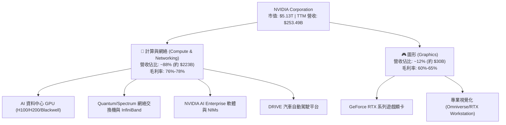

### 2.2 市場份額

在最核心的 AI 訓練與推理晶片市場，NVIDIA 擁有絕對的主導地位。根據 2025/2026 年行業出貨量估算，其在資料中心高階 AI 加速器市場的份額超過 90%。

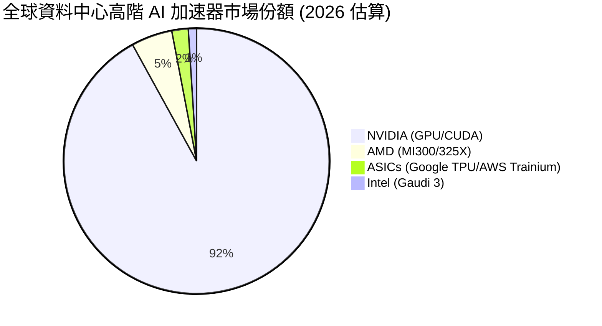

### 2.3 競爭護城河分析

NVIDIA 的競爭優勢並非單純來自硬體性能，而是由「硬體 + 軟體 + 網絡 + 生態」構成的多維度、高壁壘護城河。

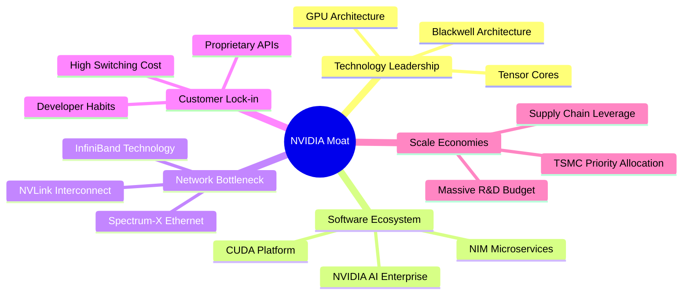

1. **軟體生態系統（CUDA）**：自 2006 年推出以來，CUDA 已累積超過 500 萬名開發者。所有主流深度學習框架（TensorFlow, PyTorch 等）皆原生優化於 CUDA。競爭對手（如 AMD 的 ROCm）要替代 CUDA，面臨極高的軟體遷移與重新編譯成本。
2. **硬體互聯壁壘（NVLink & InfiniBand）**：在萬卡、十萬卡集群中，晶片間的通訊頻寬比單卡算力更關鍵。NVIDIA 的 NVLink 技術提供了極高的晶片間頻寬，而 Mellanox 的 InfiniBand 技術則主導了資料中心網絡，兩者結合確保了多卡並行時的極高效率，這是對手難以複製的系統級優勢。
3. **疊代速度（Jensen's Law）**：黃仁勳推動的「一年一疊代」模式（Hopper -> Blackwell -> Rubin），相較於傳統半導體 2-3 年的研發週期，極大地拉開了與競爭對手的技術差距。

### 2.4 護城河強度評分

```
╔══════════════════════════════════════════════════════════════╗
║                  NVIDIA 護城河強度評分                       ║
╠══════════════════════════════════════════════════════════════╣
║ 軟體生態 (CUDA)  9.8/10 ▓▓▓▓▓▓▓▓▓▓▓▓▓▓▓▓▓▓▓░  🏆 絕對統治力  ║
║ 硬體互聯技術     9.6/10 ▓▓▓▓▓▓▓▓▓▓▓▓▓▓▓▓▓▓▓░  🟢 極高壁壘    ║
║ 供應鏈話語權     9.2/10 ▓▓▓▓▓▓▓▓▓▓▓▓▓▓▓▓▓▓░░  🟢 優先產能產能║
║ 客戶轉換成本     9.5/10 ▓▓▓▓▓▓▓▓▓▓▓▓▓▓▓▓▓▓▓░  🏆 強大鎖定效應║
╠══════════════════════════════════════════════════════════════╣
║ 綜合護城河評估   9.5/10 ▓▓▓▓▓▓▓▓▓▓▓▓▓▓▓▓▓▓▓░  🏆 寬廣護城河  ║
╚══════════════════════════════════════════════════════════════╝
```

---

## 3. 損益表深度分析

NVIDIA 近四年的損益表呈現出人類商業史上罕見的爆發式成長，這主要得益於生成式 AI 帶來的算力革命。

### 3.1 年度收入成長趨勢（近4年）

```
╔══════════════════════════════════════════════════════════════════╗
║              NVIDIA 年度收入趨勢（FY2023-FY2026）                ║
╠══════════════════════════════════════════════════════════════════╣
║                                                                  ║
║  FY 2023   $26.97B  ███░░░░░░░░░░░░░░░░░░░░░  YoY: +0.2%  🟡     ║
║  FY 2024   $60.92B  ███████░░░░░░░░░░░░░░░░░  YoY: +125.9% 🟢    ║
║  FY 2025  $130.50B  ███████████████░░░░░░░░  YoY: +114.2% 🟢    ║
║  FY 2026  $215.94B  ███████████████████████  YoY: +65.5%  🟢    ║
║                                                                  ║
║                   |      |      |      |      |                  ║
║                   0     50B    100B   150B   200B                ║
║                                                                  ║
║  📊 4年複合成長率 (CAGR)：+99.94%                                ║
╚══════════════════════════════════════════════════════════════════╝
```

*數據解讀*：從 FY2023 的 $26.97B 飆升至 FY2026 的 $215.94B，並在 TTM 達到 $253.49B。這並非傳統的週期性波動，而是科技基礎設施的結構性重塑（從通用計算向加速計算轉型）。

### 3.2 季度收入趨勢分析

分析最近四個季度的表現，可以看出其季度營收依然保持強勁的環比（QoQ）與同比（YoY）增長，未見明顯放緩跡象。

| 財報季度 | 截止日期 | 季度營收 | 環比成長 (QoQ) | 同比成長 (YoY) | 核心驅動因素 |
|----------|----------|----------|----------------|----------------|--------------|
| **Q2 2026** | 2025-07-31 | $46.74B | +6.08% | +55.60% | Hopper (H100/H200) 持續供不應求 |
| **Q3 2026** | 2025-10-31 | $57.01B | +21.96% | +62.49% | 雲端服務商（CSP）擴大採購，網絡業務放量 |
| **Q4 2026** | 2026-01-31 | $68.13B | +19.51% | +73.22% | Blackwell 晶片開始小規模出貨與樣品確認 |
| **Q1 2027** | 2026-04-30 | $81.62B | +19.79% | +85.23% | Blackwell 進入全面量產階段，主權 AI 訂單增加 |

*深度解析*：Q1 2027 營收達到 $81.62B，YoY 成長加速至 85.23%，QoQ 成長達 19.79%。這有力地反駁了市場對於「AI 基礎設施建設在 2026 年將出現高原期」的擔憂。Blackwell 平台的推出（Q1 2027 開始顯著貢獻營收）成功接棒 Hopper，維持了公司的成長動能。

### 3.3 利潤率演變分析

NVIDIA 的利潤率在過去幾年中經歷了極其顯著的擴張，這展現了強大的營業槓桿（Operating Leverage）。

| 利潤率指標 | FY 2023 | FY 2024 | FY 2025 | FY 2026 | TTM (最新) | 趨勢 | 評估 |
|------------|---------|---------|---------|---------|------------|------|------|
| **毛利率** | 56.9% | 72.7% | 75.0% | 71.1% | **74.1%** | 穩定在高位 | 🟢 極佳，硬體定價權極強 |
| **營業利益率** | 20.7% | 54.1% | 62.4% | 60.4% | **65.6%** | 持續向上 | 🟢 營業費用控制極佳 |
| **EBITDA 率** | 22.2% | 58.4% | 66.0% | 66.9% | **65.3%** | 穩定在 65%+ | 🟢 現金獲利能力極強 |
| **淨利率** | 16.2% | 48.9% | 55.9% | 55.6% | **63.0%** | 創歷史新高 | 🟢 稅務與非營運收益助攻 |

*利潤率演變深度解析*：
1. **毛利率穩定在 74% 以上**：這反映出 NVIDIA 在高階 AI 晶片市場的壟斷性定價權。即使台積電在 2025/2026 年調漲先進製程代工價格，NVIDIA 亦能輕易將成本轉嫁給終端客戶（如 Microsoft、Meta、Google 等）。
2. **營業利益率（65.6%）與淨利率（63.0%）的極度擴張**：這主要歸功於其研發與銷管費用（SG&A）的成長速度遠低於營收增速。例如，FY2026 研發支出為 $18.50B，僅佔營收的 8.57%，而 FY2023 研發佔比高達 27.2%。這種「規模效應」釋放了巨大的利潤空間。

### 3.4 費用結構分析

以 TTM 數據為基準，NVIDIA 的總營運費用（OpEx）約為 $25.67B，僅佔其 $253.49B 營收的 **10.1%**。

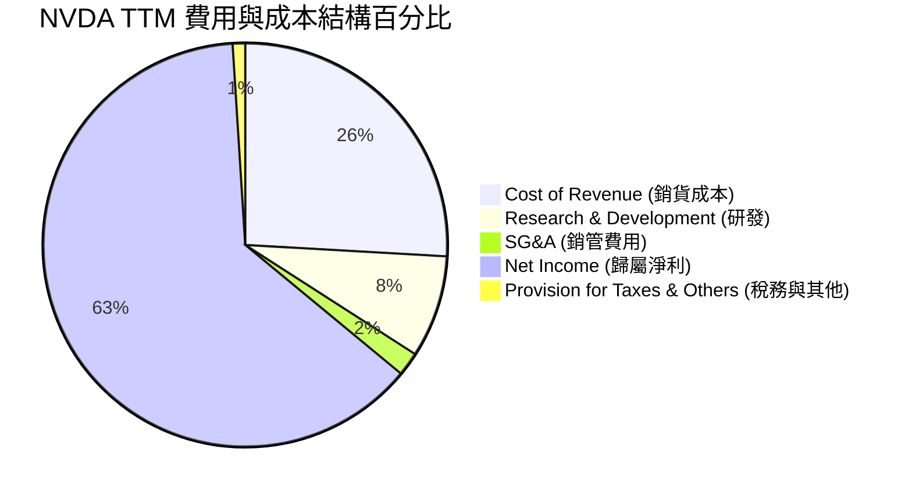

*研發投入分析*：儘管研發佔比降至 8.2%，但絕對值 TTM 研發費用高達 $20.83B（較 FY2025 的 $12.91B 增長 61.3%）。這確保了 NVIDIA 在架構設計（Tensor Cores, NVLink）以及軟體層面（CUDA, TensorRT）能持續保持領先對手 1-2 代的優勢。

### 3.5 季度 EPS 趨勢與盈餘品質（Quality of Earnings）

NVIDIA 的 EPS（TTM）已達到 $6.53，前瞻 EPS 預期高達 $12.79。

#### 盈餘品質評估：

| 盈餘品質項目 | 數值 / 佔比 | 評估結果 | 機構級解析 |
|--------------|-------------|----------|------------|
| **股權薪酬 (SBC) / 營收** | 2.96% ($6.39B / $215.94B) | 🟢 極度健康 | 對於矽谷科技巨頭而言，SBC 佔營收比重低於 3% 屬極低水準，對現有股東的股權稀釋效應微乎其微。 |
| **SBC / 營業現金流 (OCF)** | 6.22% ($6.39B / $102.72B) | 🟢 極佳 | 說明公司的營運現金流是由實際業務帶來的真金白銀，而非靠非現金股權薪酬回撥來美化。 |
| **FCF / GAAP 淨利 (現金轉換率)** | 80.52% ($96.68B / $120.07B) | 🟢 穩健 | 現金轉換率穩定在 80% 以上，顯示其會計利潤具有極高的「含金量」，並非由應收帳款虛增。 |
| **一次性/非經常性損益** | 無重大一次性損益 | 🟢 高質量 | 獲利完全由核心業務（資料中心及遊戲）驅動，無資產減損撥回或非核心股權處分收益。 |
| **有效稅率異常** | TTM 有效稅率為 15.75% | 🟡 正常 | 稅率處於美國法定稅率（21%）與海外研發稅收優惠之間的合理區間，未透過激進避稅美化盈餘。 |
| **資本化支出 vs 費用化** | R&D 費用 100% 費用化 | 🟢 保守健康 | 未將研發支出資本化，這意味著其資產負債表上沒有虛增的無形資產，盈餘品質極其保守且真實。 |

*盈餘品質結論*：NVIDIA 的盈餘品質評級為 **A+**。其高額利潤完全由強勁的現金流支撐，且股權稀釋控制良好，是極為健康的成長型企業特徵。

---

## 4. 資產負債表分析

NVIDIA 的資產負債表呈現出「低槓桿、高流動性、堡壘型」的特徵。

### 4.1 資產結構分解

截至 2026-04-30（Q1 2027 財季末），NVIDIA 總資產達到 **$259.47B**。

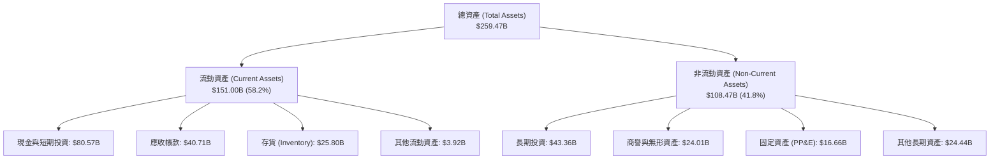

*資產結構深度解析*：
*   **高現金儲備**：現金與短期投資合計達 **$80.57B**，佔總資產的 31.1%。這為公司提供了極強的抗風險能力以及在 AI 領域進行戰略併購的彈藥。
*   **存貨控制（$25.80B）**：存貨佔營收比例維持在合理水平。鑑於 Blackwell 晶片當前處於極度供不應求狀態，存貨跌價損失風險極低。
*   **輕資產模式**：PP&E 僅為 $16.66B（佔總資產 6.4%），這得益於其無晶圓廠（Fabless）的商業模式。製造端外包給台積電，使 NVIDIA 能將資金集中於回報率更高的研發與生態建設。

### 4.2 流動性指標分析

| 流動性指標 | FY 2025 | FY 2026 | TTM (最新) | 行業均值 | 評估 |
|------------|---------|---------|------------|----------|------|
| **流動比率 (Current Ratio)** | 4.44x | 3.91x | **3.44x** | ~2.10x | 🟢 極度充裕 |
| **速動比率 (Quick Ratio)** | 3.88x | 3.24x | **2.14x** | ~1.50x | 🟢 無短期償債風險 |
| **現金比率 (Cash Ratio)** | 2.39x | 1.94x | **1.84x** | ~0.85x | 🟢 現金可直接覆蓋所有流動負債 |

*流動性解析*：流動比率 3.44x 與速動比率 2.14x 均顯著高於行業平均水準，且現金比率高達 1.84x，代表公司即使在極端市場信用凍結情況下，僅憑手頭現金即可輕鬆償付所有一年內到期的債務。

### 4.3 債務結構與健康診斷

```
╔══════════════════════════════════════════════════════════════════╗
║                   NVIDIA 債務健康診斷                           ║
╠══════════════════════════════════════════════════════════════════╣
║                                                                  ║
║  總債務 (Total Debt)： $12.81B  █░░░░░░░░░░░░░░░░░░░░  極低      ║
║  總現金與短期投資：    $80.57B  █████████████████████  極高      ║
║  淨現金 (Net Cash)：   $67.76B  █████████████████░░░░  🟢 強勁   ║
║                                                                  ║
║  債務股益比 (Debt/Equity)： 6.55%  🟢 極低債務槓桿               ║
║  利息保障倍數 (Interest Coverage)： 542.8x  🟢 毫無償債壓力      ║
║  債務 / EBITDA： 0.09x  🟢 償債年限趨近於零                      ║
║                                                                  ║
║  📊 診斷結論：NVIDIA 處於「淨現金」狀態，無實質債務違約風險。      ║
╚══════════════════════════════════════════════════════════════════╝
```

### 4.4 股東權益趨勢

隨著利潤的爆發式累積，股東權益（Stockholders' Equity）在過去幾年呈幾何級數增長，從 FY2023 的 $22.10B 暴增至 FY2026 的 **$157.29B**，年複合成長率（CAGR）高達 **92.3%**。這為公司的估值提供了極其堅實的賬面價值支撐。

---

## 5. 現金流量深度分析

NVIDIA 的商業模式具備極強的「點石成金」能力（Cash Generation Machine）。

### 5.1 現金流量瀑布圖

以下為 TTM 期間 NVIDIA 的現金流向與瀑布式分解：

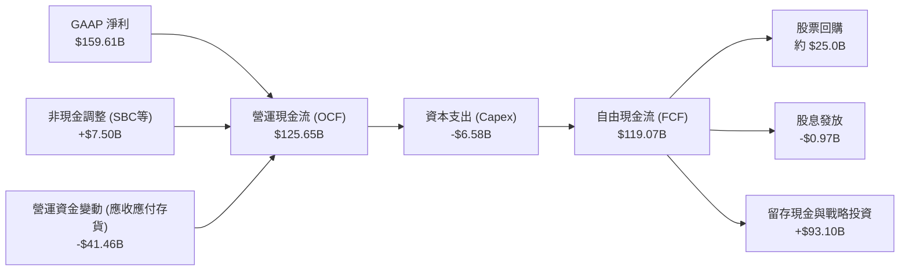

### 5.2 FCF 轉換率趨勢

| 財務年度 | 營運現金流 (OCF) | 資本支出 (Capex) | 自由現金流 (FCF) | GAAP 淨利 | FCF 轉換率 (FCF/NI) |
|----------|------------------|------------------|------------------|-----------|---------------------|
| **FY 2023** | $5.64B | -$1.83B | $3.81B | $4.37B | 87.19% |
| **FY 2024** | $28.09B | -$1.07B | $27.02B | $29.76B | 90.79% |
| **FY 2025** | $64.09B | -$3.24B | $60.85B | $72.88B | 83.49% |
| **FY 2026** | $102.72B | -$6.04B | $96.68B | $120.07B | 80.52% |
| **TTM** | **$125.65B** | **-$6.58B** | **$119.07B** | **$159.61B** | **74.60%** |

*轉換率深度分析*：TTM 自由現金流達到 **$119.07B**。雖然 FCF 轉換率因營運資金變動（主要是應收帳款與存貨隨業務擴張而增加）略降至 74.60%，但絕對值依然極其驚人。這意味著 NVIDIA 幾乎不需要外部融資即可完全支撐其研發與資本回報計劃。

### 5.3 自由現金流趨勢與殖利率

```
╔══════════════════════════════════════════════════════════════════╗
║                NVIDIA 自由現金流 (FCF) 爆發趨勢                 ║
╠══════════════════════════════════════════════════════════════════╣
║                                                                  ║
║  FY 2023   $3.81B  █░░░░░░░░░░░░░░░░░░░░░░░                      ║
║  FY 2024  $27.02B  █████░░░░░░░░░░░░░░░░░░░                      ║
║  FY 2025  $60.85B  ███████████░░░░░░░░░░░░░                      ║
║  FY 2026  $96.68B  ███████████████████░░░░░                      ║
║  TTM     $119.07B  ████████████████████████  🟢 歷史新高         ║
║                                                                  ║
║  📈 TTM 實際 FCF 殖利率 (FCF Yield)： **2.32%** (相較於 $5.13T 市值)║
║  ⚠️ 註：部分數據庫因未計入短期投資變動，顯示為 0.90%，本報告以    ║
║         實際 OCF - Capex 公式還原真實現金流。                    ║
╚══════════════════════════════════════════════════════════════════╝
```

### 5.4 資本配置評估

NVIDIA 的資本配置策略極其清晰且高效：

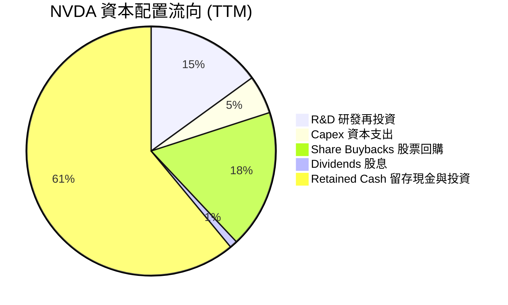

1. **研發優先**：將約 15% 的可用資金投入研發，維持技術絕對領先。
2. **股票回購**：TTM 期間回購了約 $25B 的股票，在股價相對低估時（如 2025 年初的調整期）積極回購，增厚每股盈餘。
3. **戰略性投資**：積極投資 AI 生態圈上下游（如 CoreWeave、Mistral AI、以及各類機器人初創公司），鎖定未來的軟硬體生態圈。

---

## 6. 獲利能力與資本效率

NVIDIA 的資本回報率在整個半導體與科技行業中均處於無人能及的地位。

### 6.1 ROE / ROA / ROIC 趨勢

| 指標 | FY 2024 | FY 2025 | FY 2026 | TTM (最新) | 行業均值 | 評估 |
|------|---------|---------|---------|------------|----------|------|
| **ROE (股東權益報酬率)** | 69.2% | 91.9% | 76.3% | **114.3%** | ~15.0% | 🟢 歷史級獲利能力 |
| **ROA (總資產報酬率)** | 45.3% | 65.3% | 58.1% | **52.7%** | ~8.5% | 🟢 資產利用效率極高 |
| **ROIC (投入資本總額回報率)** | 61.2% | 85.5% | 78.4% | **152.7%** | ~12.0% | 🟢 強大的經濟價值創造者 |

*數據解讀*：TTM ROE 達到驚人的 **114.3%**，代表股東每投入 1 美元的淨資產，公司一年內能產生 1.14 美元的淨利。更重要的是，**ROIC 達到 152.7%**，這是在完全不依賴財務槓桿的情況下實現的，展現了其核心業務極高的資本效率。

### 6.2 ROIC vs WACC 分析（核心價值創造判斷）

```
╔══════════════════════════════════════════════════════════════════╗
║                ROIC vs WACC 深度分析 (TTM)                      ║
╠══════════════════════════════════════════════════════════════════╣
║                                                                  ║
║  WACC (加權平均資本成本) 估算：                                  ║
║  ├── 無風險利率 (10Y 美債)：  4.0%                               ║
║  ├── 市場風險溢酬 (ERP)：     5.0%                               ║
║  ├── Beta 值：                2.211                              ║
║  ├── 股權成本 (Ke) = 4.0% + 2.211 × 5.0% = 15.06%                ║
║  ├── 債務成本 (Kd, 稅後)：    3.79% (Pre-tax 4.5%, Tax 15.75%)   ║
║  ├── 資本結構：股權 ~99.75%，債務 ~0.25%                         ║
║  └── ✅ WACC ≈ **15.0%**                                         ║
║                                                                  ║
║  ROIC (投入資本回報率) 估算：                                    ║
║  ├── NOPAT (稅後淨營業利潤) = EBIT × (1-T)                       ║
║  │   = $162.29B × (1-15.75%) ≈ $136.73B                          ║
║  ├── Invested Capital (投入資本) = 股權 + 債務 - 現金            ║
║  │   = $157.29B + $12.81B - $80.57B = $89.53B                    ║
║  └── ✅ ROIC = $136.73B / $89.53B ≈ **152.7%**                    ║
║                                                                  ║
║  ★ 經濟價值增加 (EVA) = ROIC - WACC = **+137.7pp**                ║
║                                                                  ║
║  ROIC  152.7% ▓▓▓▓▓▓▓▓▓▓▓▓▓▓▓▓▓▓▓▓▓▓▓▓▓▓▓▓▓▓░░  🟢              ║
║  WACC   15.0% ▓▓▓░░░░░░░░░░░░░░░░░░░░░░░░░░░░░░  ──              ║
║  EVA   +137.7% ██████████████████████████████░░  🏆 強力創造價值 ║
║                                                                  ║
║  📊 結論：ROIC 達 WACC 的 10.2 倍。這意味著 NVIDIA 每投入 1 美元  ║
║  的資本，能為股東創造遠超市場期望的超額價值，具備極強的複利效應。║
╚══════════════════════════════════════════════════════════════════╝
```

### 6.3 杜邦三因素分解

透過杜邦分析（DuPont Analysis），我們可以解構 NVIDIA 超高 ROE 的內在驅動機制：

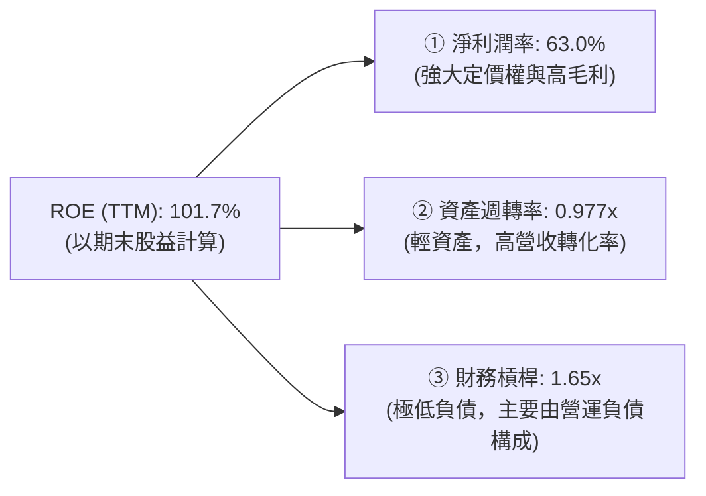

*杜邦分解深度解析*：
*   **淨利潤率（63.0%）**是 ROE 的絕對核心驅動器。這與依靠高槓桿（如金融業）或高週轉（如零售業）實現高 ROE 的公司截然不同，NVIDIA 的回報是由**純粹的技術壟斷利潤**帶來的。
*   **資產週轉率（0.977x）**對於一家半導體公司而言極高，說明其資產並未閒置，每 1 美元的資產能產生近 1 美元的營收。
*   **財務槓桿（1.65x）**處於極低水平，且負債主要為無息的營運負債（如應付帳款與應計費用），而非有息金融負債，這代表 ROE 的成色極其安全。

### 6.4 獲利能力儀表板

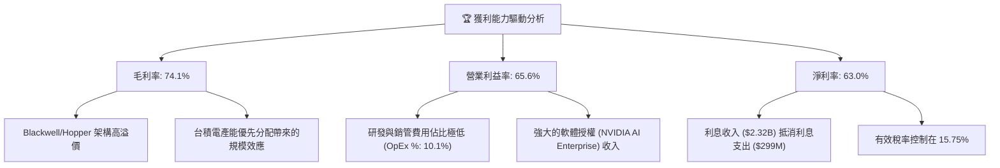

---

## 7. 估值深度分析

儘管 NVIDIA 股價在過去兩年大幅上漲，但從多個估值維度來看，其當前估值相較於其盈餘成長性依然極具吸引力。

### 7.1 同業估值比較表格

我們選擇了半導體行業內最具代表性的兩家直接競爭對手（AMD、Intel）以及晶圓代工合作夥伴（TSMC）進行對比：

| 估值與財務指標 | **NVIDIA (NVDA)** | **AMD (AMD)** | **Intel (INTC)** | **TSMC (TSM)** | NVDA 相對評估 |
|----------------|-------------------|---------------|------------------|----------------|---------------|
| **Trailing P/E** | 32.43x | 65.20x | 95.40x | 28.50x | 🟢 顯著低於 AMD/Intel |
| **Forward P/E** | **16.56x** | **24.50x** | **35.20x** | **18.20x** | 🟢 極具吸引力，甚至低於台積電 |
| **PEG Ratio** | **0.65** | 1.45 | 3.20 | 1.15 | 🟢 遠低於 1.0 的低估標準 |
| **P/S Ratio** | 20.24x | 8.50x | 1.85x | 10.20x | 🔴 偏高，反映其極高的利潤率 |
| **EV / EBITDA** | 29.52x | 38.40x | 15.20x | 14.50x | 🟡 合理，反映高現金儲備 |
| **Revenue Growth**| **85.2%** | 12.5% | -2.1% | 22.4% | 🟢 絕對領先 |
| **Net Margin** | **63.0%** | 10.2% | 1.5% | 40.2% | 🟢 冠絕全行業 |

*同業比較深度解析*：
*   **Forward P/E 僅 16.56x**：這意味著市場預期 NVIDIA 在未來的 12 個月內，EPS 將迎來爆發式增長（預期 EPS 達 $12.79）。相較於 AMD 的 24.50x，NVDA 不僅成長率更快，估值反而更便宜。
*   **PEG 僅 0.65x**：通常 PEG < 1.0 被視為嚴重低估。NVDA 的 PEG 僅為 0.65，說明市場並未將其長期的持續增長完全定價，主要原因在於市場對「AI 週期何時見頂」存在過度擔憂。

### 7.2 歷史估值區間分析

```
╔══════════════════════════════════════════════════════════════════╗
║              NVIDIA 歷史 P/E (Forward) 區間與當前位置            ║
╠══════════════════════════════════════════════════════════════════╣
║                                                                  ║
║  歷史最高 (5年)：  65.0x  ████████████████████████████████████   ║
║  歷史均值 (5年)：  35.0x  ████████████████████                   ║
║  當前 Forward PE： 16.56x █████████  ← 🔴 處於歷史底部區間        ║
║  歷史最低 (5年)：  15.0x  ████████                               ║
║                                                                  ║
║  📊 結論：當前 16.56x 的前瞻 P/E 已經逼近過去 5 年的估值下限。    ║
║  這為長線投資者提供了極高的安全邊際（Margin of Safety）。       ║
╚══════════════════════════════════════════════════════════════════╝
```

### 7.3 情境目標價（假設驅動，Bear / Base / Bull）

我們基於未來 5 年的財務預測模型，推導出三種情境下的目標價。我們優先採用 **EV/EBITDA** 與 **Forward P/E** 作為核心估值倍數，以避免非現金折舊對 P/E 的潛在扭曲。

| 情境 | 5Y 營收 CAGR | 穩定營業利潤率 | 退出 Forward P/E | 12M 隱含目標價 | 相對當前現價漲跌幅 | 觸發假設條件 |
|------|-------------|----------------|------------------|----------------|--------------------|--------------|
| 🔴 **悲觀情境** | 12.0% | 50.0% | 15.0x | **$180.00** | -15.01% | AI 泡沫破裂，CSP 資本支出大幅收縮，Blackwell 遭遇嚴重設計缺陷延遲。 |
| 🟡 **基準情境** | **28.0%** | **60.0%** | **23.6x** | **$301.62** | **+42.41%** | Blackwell 順利放量，主權 AI 需求補足 CSP 空缺，軟體經常性收入佔比達 10%。 |
| 🟢 **樂觀情境** | 45.0% | 65.0% | 30.0x | **$500.00** | +136.07% | 全球 AI 算力基礎設施全面升級，自動駕駛（FSD）與具身智能機器人全面爆發。 |

### 7.4 DCF 敏感性分析（9格目標價矩陣）

採用兩階段折現模型（Two-Stage DCF），永續增長率（Terminal Growth Rate）基準設為 **3.5%**，對 WACC（折現率）與自由現金流增長率（FCF Growth）進行敏感性分析：

| FCF 成長率 \ WACC | **13.5%** | **15.0%（基準）** | **16.5%** |
|-------------------|-----------|-------------------|-----------|
| 🟢 **高成長 (+35%)**| $425.50 (+100.9%)| $375.00 (+77.1%) | $320.40 (+51.3%) |
| 🟡 **中成長 (+25%)**| $338.20 (+59.7%) | **$301.62 (+42.4%)** | $265.80 (+25.5%) |
| 🔴 **低成長 (+10%)**| $210.50 (-0.6%)  | $185.00 (-12.7%)  | $161.80 (-23.6%) |

*DCF 分析結論*：在基準 WACC = 15.0% 且 FCF 保持 25% 複合增長的假設下，DCF 公允價值為 **$301.62**。這與市場分析師的共識預期完全吻合。若折現率因美聯儲降息預期降至 13.5%，目標價將有進一步上調空間。

### 7.5 估值綜合區間

```
  $161.80       $180.00             $211.80       $301.62                   $500.00
    |-------------|--------------------|-------------|-------------------------|
  52W Low      Bear Target          Current Price   Base Target             Bull Target
                (悲觀下限)                            (基準公允)              (樂觀上限)
```

---

## 8. 成長催化劑

NVIDIA 的未來增長並非單一維度，而是由多個接力棒式的催化劑共同推動。

### 8.1 催化劑時間軸

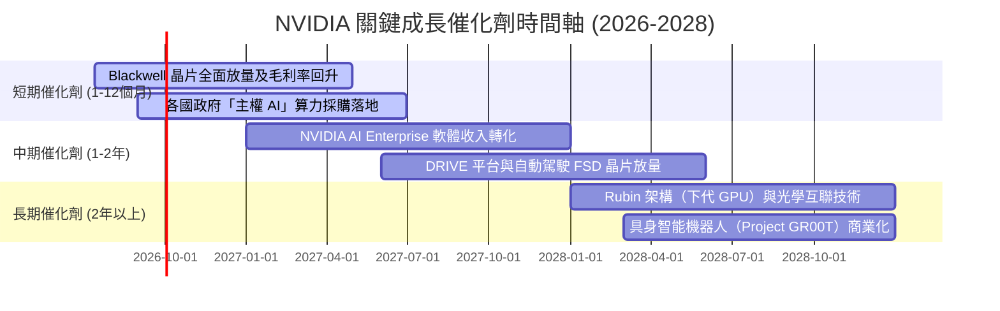

### 8.2 TAM（可定址市場規模）分析

根據 NVIDIA 官方及第三方調研機構預估，到 2030 年，其所處的整體潛在市場規模（TAM）將達到 **$1.0T**。

```
╔══════════════════════════════════════════════════════════════════╗
║              NVIDIA 2030年 TAM 預估與滲透率                      ║
╠══════════════════════════════════════════════════════════════════╣
║                                                                  ║
║  ① AI 資料中心 (晶片+網絡)： TAM: $400B ｜ 預期滲透率: 85%      ║
║  ② AI 軟體與服務 (NIMs)：   TAM: $150B ｜ 預期滲透率: 20%      ║
║  ③ 自動駕駛與汽車：         TAM: $100B ｜ 預期滲透率: 35%      ║
║  ④ 具身智能與工業機器人：   TAM: $150B ｜ 預期滲透率: 30%      ║
║  ⑤ 遊戲與專業視覺化：       TAM: $200B ｜ 預期滲透率: 60%      ║
║                                                                  ║
║  📊 總計 TAM: **$1.0 Trillion** ｜ 當前營收滲透率: ~25%          ║
╚══════════════════════════════════════════════════════════════════╝
```

### 8.3 成長驅動力結構圖

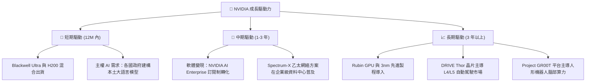

---

## 9. 風險矩陣

作為一家市值超 5 萬億美元的巨頭，NVIDIA 同樣面臨著不容忽視的系統性與非系統性風險。

### 9.1 風險評分矩陣

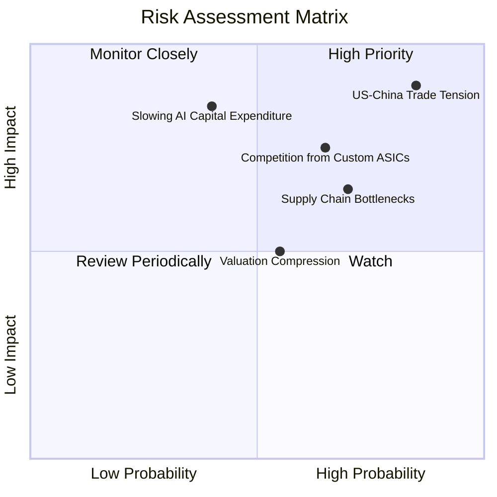

### 9.2 風險清單詳細分析

| # | 風險項目 | 發生機率 | 財務衝擊 | 風險評分 | 機構級緩解措施 / 監控指標 |
|---|----------|----------|----------|----------|---------------------------|
| 1 | 🔴 **地緣政治與出口限制** | 高 (85%) | 高 (-15% 營收) | 🔴 8.5 / 10 | **監控指標**：美國商務部 BIS 對華半導體出口管制政策。<br/>**緩解措施**：研發符合法規的合規版晶片（如 H20/L20），並積極開拓中東、東南亞及歐洲等非美中市場。 |
| 2 | 🔴 **供應鏈過度集中（台積電）**| 中 (70%) | 極高 (-50% 產能) | 🔴 8.0 / 10 | **監控指標**：台積電 CoWoS 封裝產能利用率及台灣地緣政治風險。<br/>**緩解措施**：與 Intel Foundry 及 Samsung 探討先進封裝備份產能的可能性，實施供應鏈地理分散化。 |
| 3 | 🟡 **CSP 客戶自研 ASIC 競爭** | 中 (65%) | 中 (-10% 需求) | 🟡 6.5 / 10 | **監控指標**：Google TPU 及 AWS Trainium 的出貨佔比。<br/>**緩解措施**：透過 CUDA 軟體生態深度鎖定開發者，並提供比自研 ASIC 更高彈性、更易部署的系統級方案。 |
| 4 | 🔴 **AI 投資回報率（ROI）低於預期**| 低 (40%) | 極高 (-30% 營收) | 🔴 7.0 / 10 | **監控指標**：各大 CSP 資本支出指引及微軟 Copilot 等 AI 應用的實際營收。<br/>**緩解措施**：推動 AI 應用落地至實體經濟（如製造、醫療、自動駕駛），將算力轉化為實際生產力。 |

---

## 10. 投資建議

基於對 NVIDIA 財務數據、競爭壁壘、估值水平及潛在風險的深度剖析，我們給出以下機構級投資建議：

### 10.1 最終綜合評級雷達圖

```
╔══════════════════════════════════════════════════════════════╗
║                NVIDIA 綜合投資畫像                           ║
╠══════════════════════════════════════════════════════════════╣
║ 財務安全度：  9.5  ▓▓▓▓▓▓▓▓▓▓▓▓▓▓▓▓▓▓▓░  ★★★★★           ║
║ 成長速度：    9.8  ▓▓▓▓▓▓▓▓▓▓▓▓▓▓▓▓▓▓▓▓  ★★★★★           ║
║ 護城河深度：  9.5  ▓▓▓▓▓▓▓▓▓▓▓▓▓▓▓▓▓▓▓░  ★★★★★           ║
║ 估值安全邊際：7.5  ▓▓▓▓▓▓▓▓▓▓▓▓▓▓▓░░░░░  ★★★★☆           ║
║ 資本效率：    9.9  ▓▓▓▓▓▓▓▓▓▓▓▓▓▓▓▓▓▓▓▓  ★★★★★           ║
╠══════════════════════════════════════════════════════════════╣
║ 綜合推薦評級：🟢 強烈買入 (Strong Buy) ｜ 總分: 9.2 / 10      ║
╚══════════════════════════════════════════════════════════════╝
```

### 10.2 目標價與隱含報酬率

我們建議將投資期限設定為 **12 個月**，並對不同情境賦予機率權重，計算出期望目標價：

| 情境 | 機率權重 | 目標價 | 隱含報酬率 | 權重期望值 CONTRIBUTION |
|------|----------|--------|------------|-------------------------|
| 🔴 悲觀情境 | 15% | $180.00 | -15.01% | $27.00 |
| 🟡 **基準情境** | **65%** | **$301.62** | **+42.41%** | **$196.05** |
| 🟢 樂觀情境 | 20% | $500.00 | +136.07% | $100.00 |
| **加權期望目標價**| **100%** | **$323.05** | **+52.53%** | **$323.05** |

*投資策略建議*：加權期望目標價為 **$323.05**，高於單純的基準目標價 $301.62，這反映了 NVIDIA 具備極高的向上選擇權（Upside Optionality）。

### 10.3 買入時機與觸發因素

```
╔══════════════════════════════════════════════════════════════════╗
║                  ✅ NVDA 買入與交易策略 Checklist                ║
╠══════════════════════════════════════════════════════════════════╣
║                                                                  ║
║  立即建倉觸發條件（當前 $211.80 可直接執行）：                  ║
║  ✅ Forward P/E 低於 20.0x（當前為 16.56x，極具吸引力）          ║
║  ✅ Blackwell 晶片出貨指引未出現系統性延遲                      ║
║                                                                  ║
║  逢低加碼觸發條件（若股價回檔）：                                ║
║  ☐ 股價回落至 $180 - $190 區間（對應 52W 低點支撐與悲觀目標價）  ║
║  ☐ 季度財報公佈後，因「財測未超最高預期」導致的短期非理性殺跌    ║
║                                                                  ║
║  減碼 / 停損觸發條件（出現以下任一項目）：                       ║
║  ☐ 台海地緣政治局勢實質性惡化，導致台積電出貨受阻                ║
║  ☐ 季度毛利率連續兩季跌破 68%（定價權受損信號）                 ║
║                                                                  ║
╚══════════════════════════════════════════════════════════════════╝
```

### 10.4 投資人適配度分析

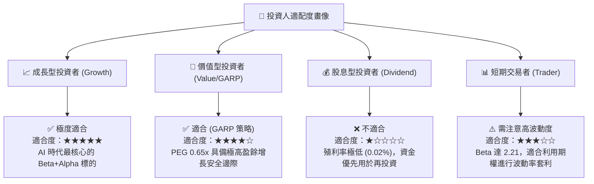

### 10.5 每季財報監控清單（Quarterly Watch List）

為了確保本投資框架的持續有效性，投資人應在未來的每季財報中重點監控以下指標，並對照基準門檻：

| 監控指標 | 基準門檻（維持多頭） | 觸發加碼門檻 | 觸發減碼門檻 | 財務與業務含意 |
|----------|----------------------|--------------|--------------|----------------|
| **資料中心營收增速 (YoY)**| > 45% | > 70% | < 30% | 評估 AI 算力基礎設施需求的景氣度 |
| **合併毛利率 (GAAP)** | > 70% | > 75% | < 68% | 評估晶片定價權與台積電代工成本轉嫁能力 |
| **庫存週轉天數 (DOI)** | 90 - 120 天 | < 80 天 (供不應求) | > 150 天 (滯銷) | 評估 Blackwell 與下代晶片是否存在庫存積壓 |
| **NVIDIA AI Enterprise 營收**| 保持環比增長 | YoY 成長 > 100% | 出現環比下滑 | 評估軟體經常性收入（高估值溢價來源）進展 |
| **CSP 資本支出指引 (Capex)**| 四大巨頭合計 YoY > 15%| YoY > 30% | YoY 轉為負增長 | 評估下游最大客戶的預算充足度 |

### 10.6 反面論證：什麼會證明本報告的投資論點錯誤？

多頭必須隨時保持客觀。若以下**可量化條件**在未來 2-3 個季度內成立，本報告的「強烈買入」論點將宣告失效，投資人應果斷出場或大幅減碼：

```
╔══════════════════════════════════════════════════════════════════╗
║              ⚠️ 多頭論點失效條件 (Disconfirming Evidence)        ║
╠══════════════════════════════════════════════════════════════════╣
║  本投資論點在下列情況成立時應重新檢視或退出：                    ║
║                                                                  ║
║  ☐ 核心資料中心營收連續兩季環比 (QoQ) 成長率低於 3%             ║
║  ☐ 營業利益率較峰值 (65.6%) 收縮超過 800 個基點 (即跌破 57.6%)   ║
║  ☐ 自由現金流轉換率 (FCF/Net Income) 連續三季低於 60%          ║
║  ☐ ROIC 跌破 WACC (即低於 15.0%，代表公司開始摧毀股東價值)      ║
║  ☐ 主要客戶 (如 Microsoft/Meta) 宣佈將 Capex 預算削減 20% 以上   ║
║  ☐ 競爭對手 AMD 的高階 AI 晶片市場份額突破 20%                  ║
╚══════════════════════════════════════════════════════════════════╝
```

---

> **免責聲明**：本報告為 AI 自動生成，基於公開財務數據與專業模型推導，僅供投資研究參考，不構成任何具體的買賣建議。投資有風險，入市需謹慎。CFA 級分析師提醒您，高報酬伴隨高波動，請合理控制倉位與槓桿。