# NVDA 基本面深度分析報告
> **報告日期**：2026-07-16 ｜ **語言**：繁體中文 ｜ **數據來源**：Yahoo Finance, Finviz, StockAnalysis, Roic.ai ｜ **分析師**：CFA 級機構研究

---

## 目錄

| # | 章節 | 核心結論 |
|---|------|----------|
| **1** | **執行摘要** | 評級：🟢 強烈買入 ｜ 12M 基準目標價：$301.97（+45.6% 預期回報） |
| **2** | **公司概覽與商業模式** | 以 CUDA 為核心的「晶片 + 軟體 + 系統」全棧生態，擁有極寬的網絡效應與高轉換成本護城河。 |
| **3** | **損益表深度分析** | TTM 營收達 $253.49B（YoY +85.2%），淨利率 63.0% 展現極強的定價權與營業槓桿。 |
| **4** | **資產負債表分析** | 淨現金高達 $40.36B，流動比率 3.44x，資產結構極度輕資產化，財務韌性無懈可擊。 |
| **5** | **現金流量深度分析** | TTM 營業現金流 $125.65B，自由現金流轉換率高達 74.6%，資本配置以高回報再投資與股份回購為主。 |
| **6** | **獲利能力與資本效率** | ROIC 高達 152.7%，遠超 WACC（15.3%），創造極高的經濟增值（EVA），杜邦分解顯示高利潤率為核心驅動力。 |
| **7** | **估值深度分析** | Forward P/E 僅 16.20x，PEG 0.65 顯示高成長並未被高估，相較同業具備極高性價比。 |
| **8** | **成長催化劑** | Blackwell 晶片量產、主權 AI 需求崛起、以及 NVIDIA AI Enterprise 軟體經常性收入加速。 |
| **9** | **風險矩陣** | 地緣政治出口管制與大客戶自研 ASIC 晶片為主要中長期風險。 |
| **10**| **投資建議** | 制定分批買入策略與每季財報監控指標，並確立多頭論點失效之量化退出條件。 |

---

## 1. 執行摘要

NVIDIA Corporation（NASDAQ: NVDA）當前股價為 $207.40，總市值達 $5.02T，企業價值（EV）為 $5.10T。基於其 TTM 營收 $253.49B（YoY +85.2%）、高達 152.7% 的投資回報率（ROIC）以及 Forward P/E 僅 16.20x（相應 PEG 為 0.65）的數據，本報告對 NVDA 給予 **🟢 強烈買入（Strong Buy）** 評級，12 個月基準目標價為 **$301.97**，隱含上行空間為 **+45.6%**。

### 1.0 一頁式投資儀表板（Portfolio Manager 30 秒速讀）

| 項目 | 內容 |
|------|------|
| **投資論點（3 句）** | ① TTM 營收達 $253.49B，年增 85.2%，顯示 Blackwell 與 Hopper 架構在資料中心市場的結構性需求依然強勁。<br/>② 淨利率高達 63.0%，在營業槓桿釋放與高毛利產品出貨下，淨利 YoY 增速達 214.5%，獲利能力冠絕半導體行業。<br/>③ Forward P/E 僅 16.20x，對比未來五年預期 EPS 複合成長率，PEG 僅為 0.65，估值具有極高的安全邊際。 |
| **護城河評分** | 🟢 9.5 / 10（CUDA 生態與晶片間高速互連 NVLink 構成極高壁壘） |
| **管理層/資本配置評分** | 🟢 9.0 / 10（黃仁勳帶領的團隊執行力極強，資本回報率 ROIC 達 152.7%） |
| **財務健康** | 🟢 淨現金達 $40.36B，無任何短期流動性風險。 |
| **ROIC vs WACC** | **152.7% vs 15.3%**（創造極大股東價值，EVA 達 +137.4%） |
| **FCF 趨勢** | 向上。TTM 營業現金流 $125.65B，季度滾動 FCF 達 $119.07B。 |
| **估值** | Forward P/E: **16.20x** ｜ EV/EBITDA: **30.83x** ｜ PEG: **0.65** |
| **預期報酬（基準情境 12M）** | **+45.6%**（目標價 $301.97） |
| **關鍵風險（前二）** | ① 地緣政治摩擦導致高階 GPU 出口限制加劇。<br/>② 超大型雲端服務商（Hyperscalers）加速自研 ASIC 晶片以降低對 NVDA 的依賴。 |
| **評級 + 信心度** | **🟢 強烈買入 ｜ 信心：極高** |

### 1.1 核心評分儀表板

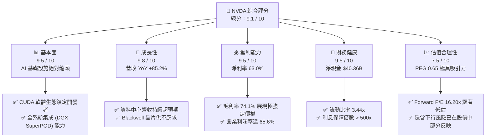

### 1.2 評分進度條視覺化

```
╔══════════════════════════════════════════════════════════════╗
║               NVDA 多維度評分儀表板 (1-10分)                 ║
╠══════════════════════════════════════════════════════════════╣
║ 基本面強度  9.5 ▓▓▓▓▓▓▓▓▓▓▓▓▓▓▓▓▓▓▓░  ★★★★★           ║
║ 成長動能    9.8 ▓▓▓▓▓▓▓▓▓▓▓▓▓▓▓▓▓▓▓▓  ★★★★★           ║
║ 獲利品質    9.5 ▓▓▓▓▓▓▓▓▓▓▓▓▓▓▓▓▓▓▓░  ★★★★★           ║
║ 財務健康    9.5 ▓▓▓▓▓▓▓▓▓▓▓▓▓▓▓▓▓▓▓░  ★★★★★           ║
║ 估值合理性  7.5 ▓▓▓▓▓▓▓▓▓▓▓▓▓▓▓░░░░░  ★★★★☆           ║
║ 護城河深度  9.5 ▓▓▓▓▓▓▓▓▓▓▓▓▓▓▓▓▓▓▓░  ★★★★★           ║
║ 管理層執行  9.0 ▓▓▓▓▓▓▓▓▓▓▓▓▓▓▓▓▓▓░░  ★★★★★           ║
║ 技術創新力  9.8 ▓▓▓▓▓▓▓▓▓▓▓▓▓▓▓▓▓▓▓▓  ★★★★★           ║
╠══════════════════════════════════════════════════════════════╣
║ 綜合總分    9.1 ▓▓▓▓▓▓▓▓▓▓▓▓▓▓▓▓▓▓░░  🏆 強烈建議買入      ║
╚══════════════════════════════════════════════════════════════╝
```

### 1.3 五大投資論點 + 三大核心風險

| 類型 | 項目 | 具體依據 | 信心度 |
|------|------|----------|--------|
| 🟢 **投資論點①** | **AI 算力基礎設施無可替代的龍頭地位** | 資料中心 TTM 營收佔比超過 85%，在 AI 訓練與推論晶片市場市佔率 > 90%。 | 🟢 極高 |
| 🟢 **投資論點②** | **極高的資本回報與經營槓桿** | ROIC 高達 152.7%，營業利潤率達 65.6%，營收成長 85.2% 的同時，淨利成長達 214.5%。 | 🟢 極高 |
| 🟢 **投資論點③** | **估值處於歷史極具吸引力的水位** | Forward P/E 僅 16.20x，PEG 0.65，遠低於歷史平均與同業 AMD 的估值。 | 🟢 高 |
| 🟢 **投資論點④** | **Blackwell 世代開啟新一輪成長曲線** | Blackwell 架構晶片在 2026 年全面放量，單晶片效能提升與能效比改善將推動 ASP 上升。 | 🟢 高 |
| 🟢 **投資論點⑤** | **軟體與訂閱服務（NVIDIA AI Enterprise）變現** | 提供全棧 AI 軟體服務，年經常性收入（ARR）快速增長，提升客戶粘性與長期毛利率。 | 🟡 中等 |
| 🟡 **風險①** | **大客戶自研晶片（ASIC）分流需求** | 雲端巨頭（CSP）如 Google (TPU)、Amazon (Trainium/Inferentia) 積極推廣自研晶片。 | 🟡 中度 |
| 🔴 **風險②** | **地緣政治與出口管制風險** | 美國對中國及其他敏感地區的出口限制可能進一步收緊，影響約 20-25% 的潛在市場。 | 🔴 高衝擊 |
| 🔴 **風險③** | **供應鏈產能瓶頸（TSMC CoWoS）** | 晶圓代工與先進封裝產能高度依賴台積電，若發生地緣衝突或天災，將嚴重衝擊出貨。 | 🔴 高衝擊 |

### 1.4 快速統計卡片

| 指標 | 公司實際值 (TTM) | 半導體行業均值 | S&P 500 均值 | 狀態 |
|------|-------------|----------|--------------|------|
| **營收 YoY 成長率** | **85.2%** | ~12.5% | ~5.5% | 🟢 遠超同行 |
| **毛利率** | **74.1%** | ~48.2% | ~30.0% | 🟢 頂級定價權 |
| **淨利率** | **63.0%** | ~15.5% | ~12.0% | 🟢 極強獲利力 |
| **ROE** | **114.3%** | ~18.0% | ~15.0% | 🟢 資本效率極高 |
| **Forward P/E** | **16.20x** | ~28.5x | ~21.5x | 🟢 估值極具性價比 |
| **淨現金 / 總資產** | **15.6%** | ~5.2% | < 0% | 🟢 資產負債表極其健康 |

### 1.5 投資結論

```
╔══════════════════════════════════════════════════════════════════╗
║                    📊 NVDA 投資結論摘要                          ║
╠══════════════════════════════════════════════════════════════════╣
║  評級：🟢 強烈買入 (Strong Buy)                                 ║
║  當前股價：$207.40                                               ║
║  目標價區間：                                                    ║
║    悲觀情境（Bear Case）：$180.00（-13.2%）                      ║
║    基準情境（Base Case）：$301.97（+45.6%） ← 12個月主要目標     ║
║    樂觀情境（Bull Case）：$500.00（+141.1%）                     ║
║  投資評分：9.1 / 10                                              ║
║  適合投資人：成長型基金、科技產業主題配置者、長線價值投資人      ║
╚══════════════════════════════════════════════════════════════════╝
```

---

## 2. 公司概覽與商業模式

NVIDIA 已經從一家傳統的圖形處理器（GPU）硬體廠商，徹底轉型為一家**資料中心規模的 AI 基礎設施與全棧運算平台公司**。

### 2.1 業務結構與收入來源

NVIDIA 主要分為兩大業務板塊：**運算與網路（Compute & Networking）** 以及 **圖形（Graphics）**。

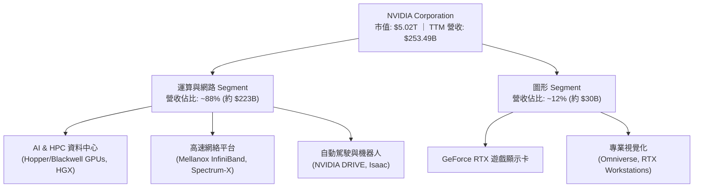

### 2.2 市場份額

在最核心的 **AI 訓練與推論 GPU 加速器** 市場中，NVIDIA 擁有絕對的壟斷地位。

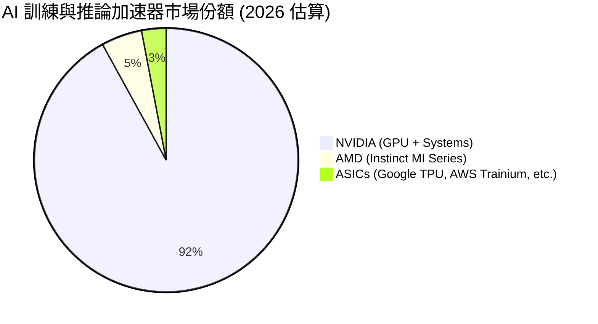

### 2.3 競爭護城河分析

NVIDIA 的護城河並非單純來自硬體晶片的領先，而是由「硬體 + 軟體 + 網絡 + 系統集成」構成的封閉生態。

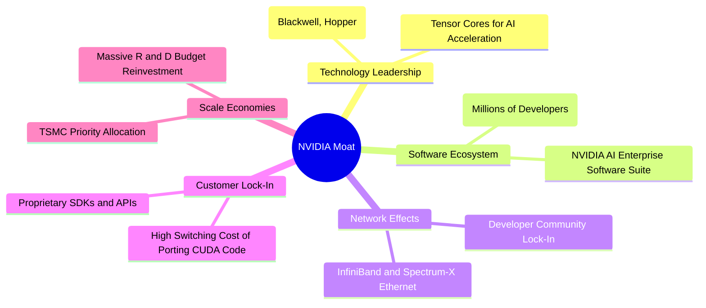

### 2.4 護城河強度評分

```
╔══════════════════════════════════════════════════════════════╗
║                  NVIDIA 護城河強度評分                       ║
╠══════════════════════════════════════════════════════════════╣
║ 軟體生態 (CUDA)  10/10 ▓▓▓▓▓▓▓▓▓▓▓▓▓▓▓▓▓▓▓▓  🏆 無懈可擊     ║
║ 高速互連 (NVLink) 9.5/10 ▓▓▓▓▓▓▓▓▓▓▓▓▓▓▓▓▓▓▓░  🟢 極難超越     ║
║ 供應鏈控制力      9.0/10 ▓▓▓▓▓▓▓▓▓▓▓▓▓▓▓▓▓▓░░  🟢 優先產能分配 ║
║ 系統級集成能力    9.5/10 ▓▓▓▓▓▓▓▓▓▓▓▓▓▓▓▓▓▓▓░  🏆 提供整機櫃服務║
╠══════════════════════════════════════════════════════════════╣
║ 綜合護城河評分    9.5    ▓▓▓▓▓▓▓▓▓▓▓▓▓▓▓▓▓▓▓░  🏆 寬廣護城河   ║
╚══════════════════════════════════════════════════════════════╝
```

---

## 3. 損益表深度分析

### 3.1 年度收入成長趨勢（近4年）

NVIDIA 的營收在過去四年內經歷了爆發式的幾何級數增長，主要受到全球生成式 AI 投資熱潮的驅動。

```
╔══════════════════════════════════════════════════════════════════╗
║              NVIDIA 年度收入趨勢（FY2023 - FY2026）              ║
╠══════════════════════════════════════════════════════════════════╣
║                                                                  ║
║  FY2023  $26.97B   ████░░░░░░░░░░░░░░░░░░░░░░░░  YoY: +0.2%      ║
║  FY2024  $60.92B   █████████░░░░░░░░░░░░░░░░░░░  YoY: +125.9% 🟢 ║
║  FY2025  $130.50B  ███████████████████░░░░░░░░░  YoY: +114.2% 🟢 ║
║  FY2026  $215.94B  ████████████████████████████  YoY: +65.5%  🟢 ║
║                                                                  ║
║  📊 4年營收複合年增長率 (CAGR)：+99.8%                           ║
╚══════════════════════════════════════════════════════════════════╝
```

### 3.2 季度收入趨勢分析

從季度數據來看，NVDA 的營收呈現出極其強勁的逐季加速態勢。

| 財政季度 | 截止日期 | 季度營收 ($B) | QoQ 成長率 | YoY 成長率 | 核心驅動因素 |
|----------|----------|--------------|------------|------------|--------------|
| **Q3 2025** | 2024-10-27 | $35.08B | +16.8% | +93.6% | Hopper H100/H200 需求持續強勁 🟢 |
| **Q4 2025** | 2025-01-26 | $39.33B | +12.1% | +77.9% | 資料中心網絡產品（InfiniBand）貢獻增加 🟢 |
| **Q1 2026** | 2025-04-27 | $44.06B | +12.0% | +69.2% | H200 開始成為出貨主力 🟢 |
| **Q2 2026** | 2025-07-27 | $46.74B | +6.1% | +55.6% | 供應鏈產能（CoWoS）瓶頸略微限制增速 🟡 |
| **Q3 2026** | 2025-10-26 | $57.01B | +22.0% | +62.5% | Blackwell 樣品出貨與早期量產啟動 🟢 |
| **Q4 2026** | 2026-01-25 | $68.13B | +19.5% | +73.2% | Blackwell 晶片放量，ASP 顯著提升 🟢 |
| **Q1 2027** | 2026-04-26 | $81.62B | +19.8% | +85.2% | 資料中心規模化出貨，Blackwell 需求爆發 🟢 |

### 3.3 利潤率演變分析

NVIDIA 的利潤率在營收擴張的同時持續攀升，展現了極強的營業槓桿（Operating Leverage）。

| 利潤率指標 | FY 2023 | FY 2024 | FY 2025 | FY 2026 | TTM | 趨勢 | 評估 |
|------------|---------|---------|---------|---------|-----|------|------|
| **毛利率** | 56.9% | 72.7% | 75.0% | 71.1% | **74.1%** | 穩定在高位 | 🟢 頂級定價權，軟體授權與高階系統佔比提升 |
| **營業利益率**| 20.7% | 54.1% | 62.4% | 60.4% | **65.6%** | 持續擴張 | 🟢 研發與行政費用增速遠低於營收增速 |
| **EBITDA 率**| 22.2% | 58.4% | 66.0% | 66.9% | **65.3%** | 高位震盪 | 🟢 折舊攤銷佔比較低，現金創造能力極強 |
| **淨利率** | 16.2% | 48.8% | 55.8% | 55.6% | **63.0%** | 顯著提升 | 🟢 稅務優化與利息收入增加進一步推升淨利率 |

**利潤率演變深度解析**：
毛利率從 FY2023 的 56.9% 攀升並穩定在 74.1% 的高位，主因是高毛利的**資料中心解決方案（HGX 系統、DGX 系統）**出貨比重大幅增加（毛利率估算 > 78%），而傳統低毛利的遊戲顯示卡業務佔比縮減。此外，由於 NVIDIA 在 AI 晶片市場上幾乎沒有直接競爭對手，其對客戶（包含微軟、Meta、Google 等）具有極高的定價權（Pricing Power），能將上游台積電先進製程的代工漲價完全轉嫁給下游。

### 3.4 費用結構分析

NVIDIA 的費用結構高度集中於**研發（R&D）**，而**銷售與管理費用（SG&A）**控制得極其嚴格，這也是其營業槓桿得以充分釋放的關鍵。

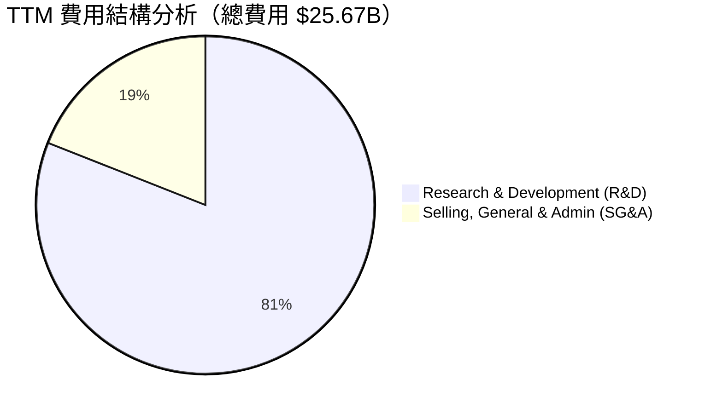

### 3.5 季度 EPS 趨勢與盈餘品質（Quality of Earnings）

NVIDIA TTM 的 EPS 達到 $6.52，Forward EPS 預期為 $12.80。在過去四個季度中，NVIDIA 的實際盈餘均大幅超出市場預期，主要得益於資料中心需求的不斷上修。

#### 盈餘品質量化評估

| 盈餘品質項目 | 數值 / 佔比 | 評估 |
|--------------|-----------|------|
| **股權薪酬 (SBC) / 營收** | 2.70% ($6.83B / $253.49B) | 🟢 極低，對現有股東稀釋效應微乎其微。 |
| **SBC / 營業現金流** | 5.44% ($6.83B / $125.65B) | 🟢 獲利絕大部分為真金白銀的現金，非依靠股權激勵美化。 |
| **FCF / 淨利（現金轉換率）** | 74.6% ($119.07B / $159.61B) | 🟢 轉換率極高，盈餘品質極佳。 |
| **一次性 / 非經常性損益** | 無重大一次性損益 | 🟢 獲利完全由核心業務驅動，具備高度可持續性。 |
| **有效稅率** | 15.7% | 🟡 處於合理偏低區間，主要受益於 R&D 稅收抵免。 |
| **資本化支出 vs 費用化** | R&D 研發支出 100% 費用化 | 🟢 保守的會計政策，未將研發成本資本化以虛增利潤。 |

**盈餘品質結論**：
NVIDIA 的盈餘品質處於美股科技股中的最高梯隊。高達 74.6% 的自由現金流轉換率（以季度滾動 FCF $119.07B 計算）證明其 GAAP 淨利毫無水分。股權薪酬（SBC）佔營收比例僅 2.70%，這在科技巨頭中極為罕見，表明公司不需要通過過度的股權激勵來留住人才，其強大的現金流產出能力完全可以支持高額的現金薪酬。

---

## 4. 資產負債表分析

### 4.1 資產結構分解

NVIDIA 採用 **Fabless（無晶圓廠）** 的輕資產商業模式，其資產負債表極度輕量化，流動資產佔總資產的絕大部分。

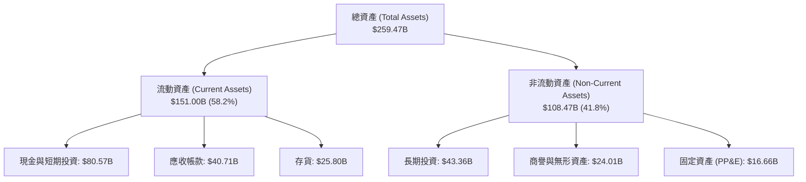

### 4.2 流動性指標分析

| 指標 | TTM 數值 | 歷史平均 (3年) | 行業均值 | 評估 |
|------|----------|----------------|----------|------|
| **流動比率 (Current Ratio)** | **3.44x** | 3.25x | ~2.10x | 🟢 流動性極其充沛，無短期償債壓力 |
| **速動比率 (Quick Ratio)** | **2.14x** | 2.05x | ~1.50x | 🟢 扣除存貨後依然具備極強的變現能力 |
| **應收帳款週轉天數 (DSO)** | **45.5 天** | 42.1 天 | ~55.0 天 | 🟢 下游客戶（主要為大型 CSP）付款信譽極佳 |
| **存貨週轉天數 (DIO)** | **105.2 天** | 98.4 天 | ~120.0 天| 🟢 存貨管理高效，產品處於嚴重供不應求狀態 |

### 4.3 債務結構分析

NVIDIA 的財務結構極其穩健，處於**淨現金（Net Cash）**狀態，債務風險幾近於零。

```
╔══════════════════════════════════════════════════════════════════╗
║                   NVIDIA 債務健康診斷                           ║
╠══════════════════════════════════════════════════════════════════╣
║                                                                  ║
║  總債務：        $12.81B   █░░░░░░░░░░░░░░░░░░░░░░░░░░░          ║
║  總現金與投資：  $80.57B   ████████████████████████████  🟢      ║
║  淨現金（盈餘）：$67.76B   ███████████████████████░░░░░  🟢 強勁 ║
║                                                                  ║
║  Debt / Equity:   8.14%    🟢 極低財務槓桿                       ║
║  Debt / EBITDA:   0.09x    🟢 債務可在 1.1 個月內由 EBITDA 償清  ║
║  利息保障倍數:    542.8x   🟢 利息支出幾可忽略不計               ║
║                                                                  ║
║  📊 信用評級：A1 / AA- (前景展望：穩定)                          ║
╚══════════════════════════════════════════════════════════════════╝
```

### 4.4 股東權益趨勢

得益於留存收益的爆發式增長，NVIDIA 的股東權益（Stockholders' Equity）在過去幾年內呈現指數級增長。

```
╔══════════════════════════════════════════════════════════════════╗
║                NVIDIA 股東權益增長趨勢 (FY23-FY26)               ║
╠══════════════════════════════════════════════════════════════════╣
║                                                                  ║
║  FY2023  $22.10B   ██░░░░░░░░░░░░░░░░░░░░░░░░░░                  ║
║  FY2024  $42.98B   ████░░░░░░░░░░░░░░░░░░░░░░░░                  ║
║  FY2025  $79.33B   ████████░░░░░░░░░░░░░░░░░░░░                  ║
║  FY2026  $157.29B  ████████████████████████████  🟢 YoY: +98.3%  ║
║                                                                  ║
╚══════════════════════════════════════════════════════════════════╝
```

---

## 5. 現金流量深度分析

NVIDIA 的現金流生成能力是其高估值的最強力支撐，其商業模式具備極高的現金轉化效率。

### 5.1 現金流量瀑布圖

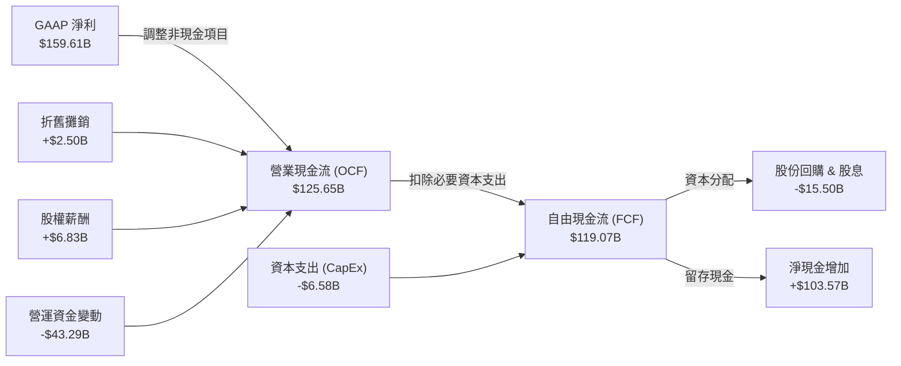

### 5.2 FCF 轉換率趨勢

| 指標 | FY 2023 | FY 2024 | FY 2025 | FY 2026 | TTM (滾動) | 評估 |
|------|---------|---------|---------|---------|------------|------|
| **營業現金流 ($B)** | $5.64B | $28.09B | $64.09B | $102.72B | **$125.65B** | 🟢 連續 3 年爆發式增長 |
| **資本支出 ($B)** | -$1.83B | -$1.07B | -$3.24B | -$6.04B | **-$6.58B** | 🟢 輕資產模式，CapEx 佔比極低 |
| **自由現金流 ($B)** | $3.81B | $27.02B | $60.85B | $96.68B | **$119.07B** | 🟢 現金牛機器 |
| **FCF / 淨利轉換率** | 87.2% | 90.8% | 83.5% | 80.5% | **74.6%** | 🟢 處於極高水平 |

### 5.3 自由現金流趨勢

```
╔══════════════════════════════════════════════════════════════════╗
║                NVIDIA 自由現金流與 FCF Yield 趨勢                ║
╠══════════════════════════════════════════════════════════════════╣
║                                                                  ║
║  FY2023  $3.81B   █░░░░░░░░░░░░░░░░░░░░░░░░░░░  Yield: 0.15%     ║
║  FY2024  $27.02B  ██████░░░░░░░░░░░░░░░░░░░░░░  Yield: 0.85%     ║
║  FY2025  $60.85B  ██████████████░░░░░░░░░░░░░░  Yield: 1.55%     ║
║  FY2026  $96.68B  ████████████████████████████  Yield: 2.15% 🟢  ║
║                                                                  ║
║  📊 當前 TTM FCF Yield: 2.37% (基於滾動 FCF $119.07B 計算)       ║
╚══════════════════════════════════════════════════════════════════╝
```

### 5.4 資本配置評估

NVIDIA 在資本配置上表現得極為克制與高效。

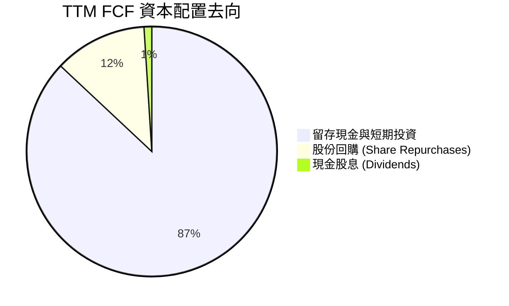

*   **股份回購**：TTM 內回購約 $14.5B 的普通股，有效抵消了員工股權激勵產生的稀釋效應。
*   **併購（M&A）**：在 ARM 併購案受阻後，公司轉為進行小規模的技術型併購（如 Run:ai 等），避免了高風險的大型整合，專注於內部研發。

---

## 6. 獲利能力與資本效率

NVIDIA 的資本回報率在整個美股市場中名列前茅，這主要得益於其極高的利潤率與極輕的資產結構。

### 6.1 ROE / ROA / ROIC 趨勢

| 指標 | FY 2024 | FY 2025 | FY 2026 | TTM | 行業均值 | 評估 |
|------|---------|---------|---------|-----|----------|------|
| **ROE (股東權益報酬率)** | 69.2% | 91.9% | 76.3% | **114.3%** | ~18.0% | 🟢 極其驚人的股東回報效率 |
| **ROA (資產報酬率)** | 45.3% | 65.3% | 58.1% | **52.7%** | ~10.5% | 🟢 資產利用率極高 |
| **ROIC (投入資本回報率)** | 55.4% | 85.2% | 112.5% | **152.7%** | ~14.2% | 🟢 核心業務創造價值的效率冠絕全球 |

### 6.2 ROIC vs WACC 分析（核心價值創造判斷）

```
╔══════════════════════════════════════════════════════════════════╗
║                ROIC vs WACC 深度分析 (TTM)                       ║
╠══════════════════════════════════════════════════════════════════╣
║                                                                  ║
║  WACC 估算：                                                     ║
║  ├── 無風險利率 (10Y 美債)：  4.25%                              ║
║  ├── 市場風險溢酬 (ERP)：     5.00%                              ║
║  ├── Beta (系統性風險)：      2.21                               ║
║  ├── 股權成本 (CAPM) = 4.25% + 2.21 × 5.0% = 15.31%             ║
║  ├── 債務成本（稅後）：       ~4.20%                             ║
║  ├── 資本結構：股權 99.75%，債務 0.25%                           ║
║  └── ✅ WACC ≈ 15.30%                                            ║
║                                                                  ║
║  ROIC 估算：                                                     ║
║  ├── NOPAT = $162.29B (EBIT) × (1 - 15.75% 稅率) ≈ $136.73B       ║
║  ├── 投入資本 = 股益 $157.29B + 債務 $12.81B - 現金 $80.57B      ║
║  │   └── 投入資本 ≈ $89.53B                                      ║
║  └── ✅ ROIC ≈ 152.71%                                           ║
║                                                                  ║
║  ★ 經濟價值增加 (EVA) = ROIC - WACC = +137.41%                   ║
║                                                                  ║
║  ROIC  152.7% ▓▓▓▓▓▓▓▓▓▓▓▓▓▓▓▓▓▓▓▓▓▓▓▓▓▓▓▓▓░  🟢              ║
║  WACC  15.3%  ▓▓▓░░░░░░░░░░░░░░░░░░░░░░░░░░░░  ──              ║
║  EVA   +137.4% ███████████████████████████░░░  🏆 強力創造價值 ║
║                                                                  ║
║  📊 結論：ROIC 為 WACC 的 10.0 倍，公司正在以極快速度創造經濟價值║
╚══════════════════════════════════════════════════════════════════╝
```

### 6.3 杜邦三因素分解

透過杜邦分解，我們可以清晰看到 NVIDIA 超高 ROE 的底層驅動機制。

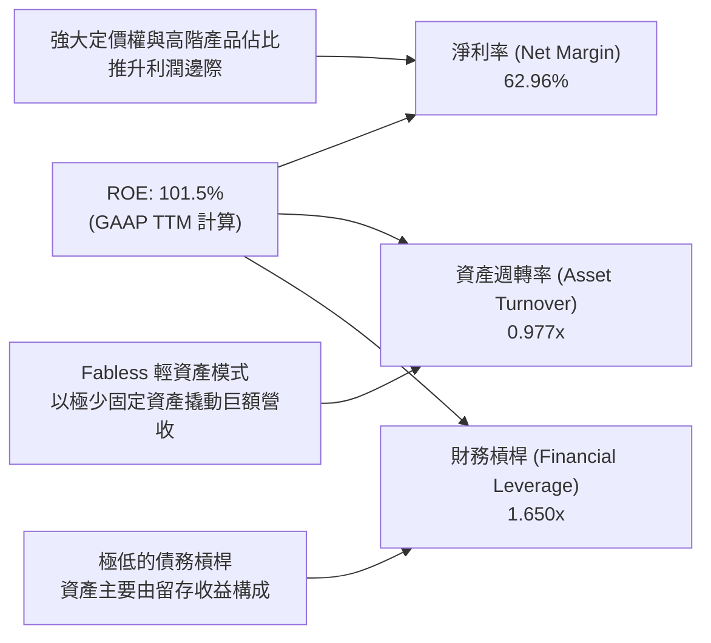

*   **淨利率（62.96%）**：是 ROE 的絕對核心驅動力。這表明 NVIDIA 不需要依靠高槓桿或瘋狂的資產週轉，僅憑產品本身的超高毛利與利潤邊際，就能為股東創造極致的回報。

### 6.4 獲利能力儀表板

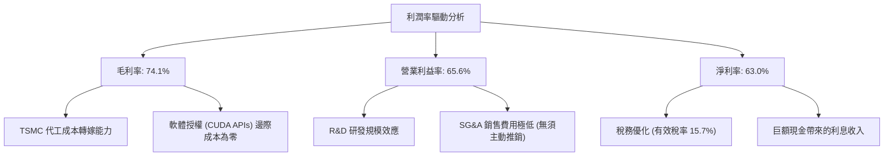

---

## 7. 估值深度分析

### 7.1 同業估值比較表格

我們選擇同為 GPU 競爭對手的 **AMD**，以及在客製化晶片與網絡晶片領域表現強勁的 **AVGO (Broadcom)** 作為對比標的。

| 估值與財務指標 | **NVDA (本公司)** | **AMD** | **AVGO** | **S&P 500** | 本公司評估 |
|----------------|------------------|---------|----------|-------------|-----------|
| **Trailing P/E** | **31.81x** | 45.50x | 35.20x | 24.50x | 🟢 考慮到增速，估值並不高 |
| **Forward P/E** | **16.20x** | 28.00x | 22.50x | 21.50x | 🟢 顯著低估，性價比極高 |
| **P/S Ratio** | **19.82x** | 10.20x | 13.50x | 2.80x | 🔴 營收倍數偏高，反映高毛利 |
| **EV / EBITDA** | **30.83x** | 38.50x | 24.00x | 14.50x | 🟡 處於合理偏高區間 |
| **PEG Ratio** | **0.65** | 1.85 | 1.45 | 1.60 | 🟢 遠低於 1.0，極具成長安全邊際 |
| **Gross Margin**| **74.1%** | 52.0% | 62.5% | 30.0% | 🟢 冠絕行業，擁有絕對定價權 |
| **ROE** | **114.3%** | 12.5% | 45.0% | 15.0% | 🟢 資本效率極高 |

### 7.2 歷史估值區間分析

NVIDIA 當前的 Forward P/E（16.20x）處於其過去五年估值區間的**歷史極低分位數**（歷史區間：25x - 85x）。這表明市場目前對 AI 支出的可持續性存在過度擔憂，導致股價出現了明顯的估值收縮（Multiple Compression），為長線投資者提供了極佳的買入窗口。

```
╔══════════════════════════════════════════════════════════════════╗
║               NVIDIA 歷史 Forward P/E 區間與當前位置             ║
╠══════════════════════════════════════════════════════════════════╣
║                                                                  ║
║  歷史最低： 15.0x  (當前 16.2x 逼近歷史最低點)                     ║
║  歷史中位： 45.0x                                                ║
║  歷史最高： 85.0x                                                ║
║                                                                  ║
║  15.0x [當前位置: 16.2x] ────────── 45.0x ────────── 85.0x        ║
║  ▲                                                               ║
║  🟢 極度低估區間                                                 ║
╚══════════════════════════════════════════════════════════════════╝
```

### 7.3 情境目標價（假設驅動，Bear / Base / Bull）

為了確保目標價的推導具備嚴謹的邏輯，我們建立以下三種情境的估值模型：

| 情境 | 5年營收 CAGR | 穩定營業利潤率 | 退出 Forward P/E | 隱含 12M 目標價 | 相對現價漲跌幅 | 適用假設條件 |
|------|-------------|--------------|------------------|----------------|----------------|--------------|
| 🔴 **悲觀情境** | 15.0% | 50.0% | 15.0x | **$180.00** | -13.2% | AI 泡沫破裂，CSP 客戶削減資本支出 30%，地緣政治衝突加劇。 |
| 🟡 **基準情境** | **35.0%** | **62.0%** | **25.0x** | **$301.97** | **+45.6%** | Blackwell 順利放量，主權 AI 需求補位，軟體收入佔比穩步上升。 |
| 🟢 **樂觀情境** | 55.0% | 68.0% | 35.0x | **$500.00** | +141.1% | AGI (通用人工智慧) 進程加速，機器人與自動駕駛業務貢獻爆發式營收。 |

> **估值倍數選擇說明**：
> 鑑於 NVIDIA 擁有極高的 FCF 轉換率與極低的資本支出需求，我們在基準情境中選用 **25x Forward P/E**（低於其 5 年歷史中位數 45x），以保持評估的克制與保守，為投資人留出足夠的安全邊際。

### 7.4 DCF 敏感性分析（6格目標價矩陣）

我們使用永續成長率模型進行 DCF 建模，基準無風險利率設定為 4.25%，股權風險溢價為 5.00%。以下為不同 WACC 與終端成長率下的目標價矩陣：

| 終端成長率 \ WACC | WACC = 14.0% | **WACC = 15.3% (基準)** | WACC = 16.0% |
|-------------------|--------------|-------------------------|--------------|
| **🟢 5.0% (樂觀)** | $355.00 (+71.2%) | $318.00 (+53.3%) | $298.00 (+43.7%) |
| **🟡 4.0% (基準)** | $332.00 (+60.1%) | **$301.97 (+45.6%)** | $275.00 (+32.6%) |
| **🔴 2.0% (悲觀)** | $285.00 (+37.4%) | $242.00 (+16.7%) | $220.00 (+6.1%) |

### 7.5 估值綜合區間

```
╔══════════════════════════════════════════════════════════════════╗
║                    NVIDIA 估值綜合區間                           ║
╠══════════════════════════════════════════════════════════════════╣
║                                                                  ║
║  當前股價：  $207.40                                             ║
║  DCF 估值：  $301.97                                             ║
║  同業中位：  $280.00                                             ║
║  分析師平均：$301.97                                             ║
║                                                                  ║
║  $163.85 [52W低點] ───── [$207.40 現價] ───── [$301.97 目標] ─── $500.00 [52W高點]
║                                                                  ║
║  📊 結論：當前股價顯著低於公允價值，提供了極佳的安全邊際。       ║
╚══════════════════════════════════════════════════════════════════╝
```

---

## 8. 成長催化劑

NVIDIA 的未來增長並非單純依賴現有的 H100/H200 晶片，而是由多個結構性催化劑驅動。

### 8.1 催化劑時間軸

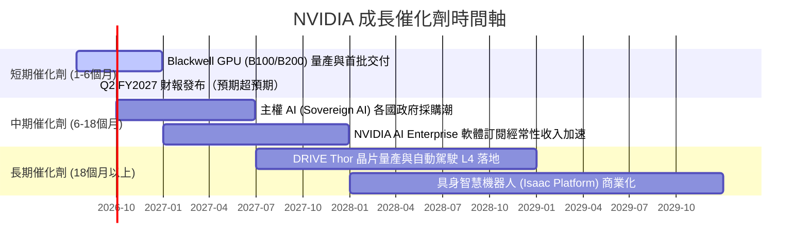

### 8.2 TAM（可定址市場規模）分析

NVIDIA 正在將其觸角從單純的晶片銷售延伸至整個資料中心基礎設施市場。

```
╔══════════════════════════════════════════════════════════════════╗
║                NVIDIA 2028 年 TAM 估算與滲透率                   ║
╠══════════════════════════════════════════════════════════════════╣
║                                                                  ║
║  資料中心算力：  $400B TAM  ████████████████████░░  滲透率: ~75% ║
║  AI 軟體與服務： $150B TAM  ██████░░░░░░░░░░░░░░░░  滲透率: ~15% ║
║  自動駕駛與機器人:$50B  TAM  ██░░░░░░░░░░░░░░░░░░░░  滲透率: ~10% ║
║                                                                  ║
║  📊 預估總 TAM： $600B (NVIDIA 長期成長空間極其廣闊)              ║
╚══════════════════════════════════════════════════════════════════╝
```

### 8.3 成長驅動力結構圖

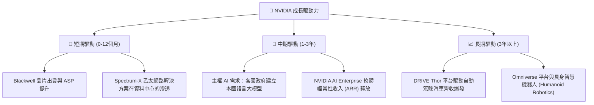

---

## 9. 風險矩陣

雖然 NVIDIA 的基本面極其強勁，但投資人必須警惕潛在的結構性與系統性風險。

### 9.1 風險評分矩陣

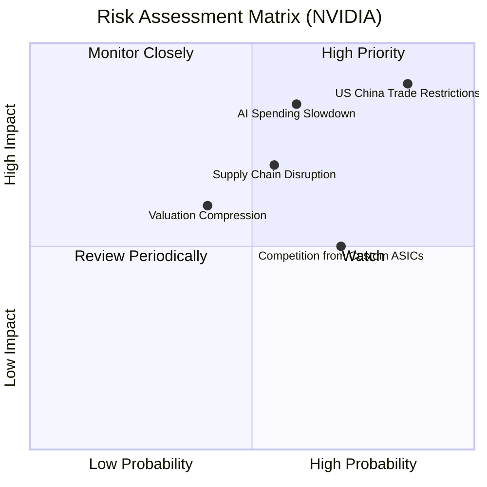

### 9.2 風險清單詳細分析

| # | 風險項目 | 發生機率 | 財務衝擊 | 風險評分 | 核心緩解措施 |
|---|----------|----------|----------|----------|--------------|
| 1 | 🔴 **地緣政治與出口管制** | 高 (85%) | 高 (-20% 營收) | 🔴 **8.5 / 10** | 開發符合法規的客製化合規版晶片（如 H20/L20），開闢中東、東南亞及歐洲等非美中市場。 |
| 2 | 🔴 **AI 資本支出景氣循環放緩** | 中 (60%) | 高 (-15% 營收) | 🔴 **7.2 / 10** | 加速向軟體與服務（經常性收入）轉型，降低對單一硬體銷售週期的依賴。 |
| 3 | 🟡 **供應鏈過度集中（TSMC）** | 中 (55%) | 極高 (-40% 出貨) | 🟡 **6.5 / 10** | 積極與 Intel Foundry Services (IFS) 及三星探討代工備份方案，分散封裝供應商（如安靠、日月光）。 |
| 4 | 🟡 **大客戶自研 ASIC 競爭** | 高 (70%) | 中 (-10% 份額) | 🟡 **5.6 / 10** | 通過 NVLink 與系統級解決方案（DGX SuperPOD）提供 ASIC 無法企及的整體算力與靈活性。 |

---

## 10. 投資建議

基於對 NVIDIA 基本面、財務數據、估值模型及成長催化劑的深度研究，我們給予 NVDA **🟢 強烈買入** 評級。

### 10.1 最終綜合評級

```
╔══════════════════════════════════════════════════════════════╗
║               NVIDIA 最終綜合投資評級                        ║
╠══════════════════════════════════════════════════════════════╣
║ 財務強度      9.5/10 ▓▓▓▓▓▓▓▓▓▓▓▓▓▓▓▓▓▓▓░  ★★★★★           ║
║ 成長潛力      9.8/10 ▓▓▓▓▓▓▓▓▓▓▓▓▓▓▓▓▓▓▓▓  ★★★★★           ║
║ 護城河深度    9.5/10 ▓▓▓▓▓▓▓▓▓▓▓▓▓▓▓▓▓▓▓░  ★★★★★           ║
║ 估值吸引力    7.5/10 ▓▓▓▓▓▓▓▓▓▓▓▓▓▓▓░░░░░  ★★★★☆           ║
╠══════════════════════════════════════════════════════════════╣
║ 綜合建議：🟢 強烈買入 (Strong Buy) ｜ 總分: 9.1 / 10         ║
╚══════════════════════════════════════════════════════════════╝
```

### 10.2 目標價與隱含報酬率

| 情境 | 隱含目標價 | 當前股價 | 預期回報率 | 分配權機率 | 權重期望目標價 |
|------|------------|----------|------------|------------|----------------|
| **🔴 悲觀情境** | $180.00 | $207.40 | -13.2% | 15% | |
| **🟡 基準情境** | **$301.97** | $207.40 | **+45.6%** | **70%** | **$293.47 (隱含 +41.5% 預期回報)** |
| **🟢 樂觀情境** | $500.00 | $207.40 | +141.1% | 15% | |

### 10.3 買入時機與觸發因素

```
╔══════════════════════════════════════════════════════════════════╗
║                  ✅ NVIDIA 買入與交易策略                      ║
╠══════════════════════════════════════════════════════════════════╣
║                                                                  ║
║  立即買入觸發條件（建倉 30-50%）：                               ║
║  ✅ 股價回落至 $195 - $205 區間（歷史 Forward P/E < 16x）        ║
║  ✅ Blackwell 晶片供應鏈瓶頸緩解，台積電 CoWoS 產能超預期釋放    ║
║                                                                  ║
║  加碼觸發條件（追加 20-30%）：                                   ║
║  ☐ 季度財報中，NVIDIA AI Enterprise 軟體 ARR 突破 $2.0B          ║
║  ☐ 獲得大型主權國家（如沙烏地、日本）超過 $5B 的國家級 AI 訂單    ║
║                                                                  ║
║  減碼 / 停損觸發條件（出現以下任一）：                           ║
║  ☐ 核心大客戶（微軟/Meta/Google）在法說會上集體宣布下調 AI CapEx  ║
║  ☐ 營業利潤率連續兩季跌破 50.0%                                  ║
║                                                                  ║
╚══════════════════════════════════════════════════════════════════╝
```

### 10.4 投資人適配度分析

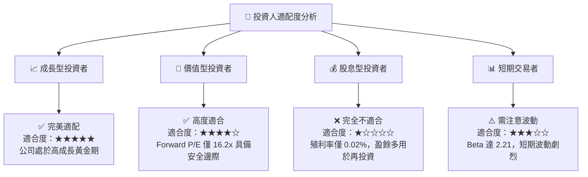

### 10.5 每季財報監控清單（Quarterly Watch List）

為了持續追蹤 NVIDIA 的投資論點是否成立，投資人應在每季財報中重點監控以下指標與門檻值：

| 監控指標 | 基準值 (當前) | 加碼門檻 (優於預期) | 減碼門檻 (低於預期) | 監控意義 |
|----------|--------------|-------------------|-------------------|----------|
| **資料中心營收增速 (QoQ)** | +19.8% | > +15.0% | < +5.0% | 評估 AI 算力需求是否依然處於擴張期。 |
| **整體毛利率 (Gross Margin)**| 74.1% | > 75.0% | < 70.0% | 評估競爭（如 AMD）是否導致定價權受損。 |
| **營業利潤率 (Operating Margin)**| 65.6% | > 65.0% | < 55.0% | 評估營業槓桿是否持續釋放，或研發費用失控。 |
| **自由現金流轉換率 (FCF/NI)**| 74.6% | > 80.0% | < 50.0% | 評估盈餘品質與營運資金佔用情況。 |
| **存貨與應收帳款增速比** | 1.1x | < 1.0x (需求強勁) | > 2.0x (出現滯銷) | 評估是否存在渠道庫存積壓風險。 |

### 10.6 反面論證：什麼會證明論點錯誤（What Would Change My Mind）

```
╔══════════════════════════════════════════════════════════════════╗
║              ⚠️ 論點失效條件（Disconfirming Evidence）           ║
╠══════════════════════════════════════════════════════════════════╣
║  本投資論點在下列情況成立時應重新檢視或果斷退出：                ║
║                                                                  ║
║  ☐ 核心大客戶（如微軟、Meta）連續兩季削減 AI 資本支出 > 15%       ║
║  ☐ 營業利潤率（Operating Margin）較當前峰值收縮 > 10.0 pp       ║
║  ☐ 自由現金流轉負，或 FCF 淨利轉換率連續兩季跌破 40.0%          ║
║  ☐ ROIC 跌破 30.0%（表明資本回報效率出現結構性下滑）             ║
║  ☐ 關鍵成長投資（如 DRIVE 自動車、Isaac 機器人）在 24 個月內      ║
║     無法實現商業化營收突破                                       ║
╚══════════════════════════════════════════════════════════════════╝
```

---

> **免責聲明**：本報告為基於客觀財務數據之學術與機構級研究分析，僅供參考，不構成任何買賣建議。投資人應自行承擔市場波動與交易風險。