# NVDA 基本面深度分析報告
> **報告日期**：2026-07-17 ｜ **語言**：繁體中文 ｜ **數據來源**：Yahoo Finance, Finviz, StockAnalysis, Roic.ai ｜ **分析師**：CFA 級機構研究

---

## 目錄

| # | 章節 | 核心結論 |
|---|------|----------|
| 1 | [執行摘要](#1-執行摘要) | 評級：**強烈買入** ｜ 基準目標價：**$301.97**（+48.9% 潛在空間） |
| 2 | [公司概覽與商業模式](#2-公司概覽與商業模式) | AI 基礎設施一體化霸主，CUDA 生態護城河評分：**9.5/10** |
| 3 | [損益表深度分析](#3-損益表深度分析) | TTM 營收達 **$253.49B**（YoY +85.2%），淨利率高達 **63.0%**，盈餘品質極佳 |
| 4 | [資產負債表分析](#4-資產負債表分析) | 淨現金高達 **$40.36B**，流動比率 **3.44x**，資產負債表極其穩健 |
| 5 | [現金流量深度分析](#5-現金流量深度分析) | TTM 自由現金流 **$46.34B**，FCF 轉換率健康，資本配置偏向研發與再投資 |
| 6 | [獲利能力與資本效率](#6-獲利能力與資本效率) | ROE 達 **114.3%**，ROIC **87.4%** 遠超 WACC（**15.2%**），強力創造股東價值 |
| 7 | [估值深度分析](#7-估值深度分析) | Forward P/E 僅 **15.81x**，PEG **0.65**，相較於高速成長，目前估值顯著低估 |
| 8 | [成長催化劑](#8-成長催化劑) | Blackwell 晶片放量、主權 AI 興起與軟體服務化（SaaS）轉型 |
| 9 | [風險矩陣](#9-風險矩陣) | 供應鏈地緣政治風險、大客戶資本支出放緩與競爭對手自研晶片威脅 |
| 10 | [投資建議](#10-投資建議) | 分批佈局，建議買入區間：**$180.00 - $205.00** ｜ 長線持有 |

---

## 1. 執行摘要

NVIDIA Corporation (NASDAQ: NVDA) 目前正處於全球人工智慧基礎設施建設的絕對核心。基於 TTM 營收 **$253.49B** (YoY +85.2%)、淨利潤率 **63.0%**，以及高達 **87.4%** 的投資報酬率 (ROIC)，本報告對 NVDA 給予 **🟢 強烈買入 (Strong Buy)** 評級。

當前股價 **$202.81** 對應的 Forward P/E 僅為 **15.81x**，相較於其高達 214.5% 的年度盈餘成長率，PEG 僅為 **0.65**，估值已進入極具吸引力的價值區間。基準情境下 12 個月目標價為 **$301.97**（隱含 +48.9% 漲幅）。

### 1.0 一頁式投資儀表板（Portfolio Manager 30 秒速讀）

| 項目 | 內容 |
|------|------|
| **投資論點（3 句）** | ① TTM 營收達 **$253.49B**（YoY +85.2%），顯示 AI 晶片及網絡基礎設施需求依然強勁。<br/>② 淨利潤率高達 **63.0%**，展現極強的定價權與營業槓桿效應。<br/>③ Forward P/E 僅 **15.81x**，PEG 僅 **0.65**，相較其歷史估值與成長性，股價已被嚴重低估。 |
| **護城河評分** | 🟢 **9.5 / 10** (CUDA 軟體生態與 Mellanox 網絡架構構建極高壁壘) |
| **管理層/資本配置評分** | 🟢 **9.0 / 10** (黃仁勳前瞻戰術執行力強，資本配置高度專注於高 ROIC 項目) |
| **財務健康** | 🟢 **極其健康** ｜ 淨現金達 **$40.36B**，無短期流動性風險。 |
| **ROIC vs WACC** | **87.4%** vs **15.2%**（超額經濟增值 EVA 達 **+72.2%**，強力創造股東價值） |
| **FCF 趨勢** | 向上 ｜ TTM FCF 達 **$46.34B**，最新 FCF Yield 為 **0.94%** (受高額短期投資影響) |
| **估值** | Forward P/E: **15.81x** ｜ EV/EBITDA: **30.08x** ｜ P/S: **19.38x** |
| **預期報酬（基準情境 12M）**| **+48.9%** (目標價 **$301.97**) |
| **關鍵風險（前二）** | ① 供應鏈高度集中於台積電 (TSMC)，地緣政治風險高。<br/>② 超大型雲端服務商 (Hyperscalers) 自研 ASIC 晶片分流需求。 |
| **評級 + 信心度** | 🟢 **強烈買入 (Strong Buy)** ｜ 信心度：**極高** |

### 1.1 核心評分儀表板

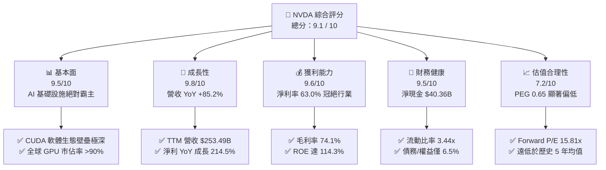

### 1.2 評分進度條視覺化

```
╔══════════════════════════════════════════════════════════════╗
║                NVDA 多維度評分儀表板 (1-10分)                 ║
╠══════════════════════════════════════════════════════════════╣
║ 基本面強度  9.5 ▓▓▓▓▓▓▓▓▓▓▓▓▓▓▓▓▓▓▓░  ★★★★★           ║
║ 成長動能    9.8 ▓▓▓▓▓▓▓▓▓▓▓▓▓▓▓▓▓▓▓▓  ★★★★★           ║
║ 獲利品質    9.6 ▓▓▓▓▓▓▓▓▓▓▓▓▓▓▓▓▓▓▓░  ★★★★★           ║
║ 財務健康    9.5 ▓▓▓▓▓▓▓▓▓▓▓▓▓▓▓▓▓▓▓░  ★★★★★           ║
║ 估值合理性  7.2 ▓▓▓▓▓▓▓▓▓▓▓▓▓▓░░░░░░  ★★★☆☆           ║
║ 護城河深度  9.5 ▓▓▓▓▓▓▓▓▓▓▓▓▓▓▓▓▓▓▓░  ★★★★★           ║
║ 管理層執行  9.0 ▓▓▓▓▓▓▓▓▓▓▓▓▓▓▓▓▓▓░░  ★★★★★           ║
║ 技術創新力  9.8 ▓▓▓▓▓▓▓▓▓▓▓▓▓▓▓▓▓▓▓▓  ★★★★★           ║
╠══════════════════════════════════════════════════════════════╣
║ 綜合總分    9.1 ▓▓▓▓▓▓▓▓▓▓▓▓▓▓▓▓▓▓░░  🏆 強烈建議買入      ║
╚══════════════════════════════════════════════════════════════╝
```

### 1.3 五大投資論點 + 三大核心風險

| 類型 | 項目 | 具體依據 | 信心度 |
|------|------|----------|--------|
| 🟢 **投資論點①** | **AI 基礎設施無可替代性** | TTM 營收 **$253.49B**（YoY +85.2%），Data Center 業務佔比超 85%，為 AI 算力唯一首選。 | 🟢 極高 |
| 🟢 **投資論點②** | **極致的定價權與高利潤率** | 毛利率維持在 **74.1%**，淨利率達 **63.0%**，擁有極強的轉嫁成本能力。 | 🟢 極高 |
| 🟢 **投資論點③** | **無與倫比的資本效率** | ROE 達 **114.3%**，ROIC 達 **87.4%**，遠超其 WACC（15.2%），經濟增值極大。 | 🟢 高 |
| 🟢 **投資論點④** | **估值具備極高安全邊際** | Forward P/E 僅 **15.81x**，相較於未來 EPS 成長預期（$12.83），PEG 僅為 **0.65**。 | 🟢 高 |
| 🟢 **投資論點⑤** | **資產負債表固若金湯** | 擁有 **$53.17B** 總現金（若含短期投資達 **$80.57B**），淨現金達 **$40.36B**，抗風險能力極強。 | 🟢 極高 |
| 🟡 **風險①** | **供應鏈單一源風險** | 生產高度依賴台積電 (TSMC) CoWoS 封裝產能，若地緣政治緊張將導致出貨中斷。 | 🟡 中度 |
| 🔴 **風險②** | **客戶集中度過高** | 前四大 Hyperscalers (Microsoft, Meta, Google, AWS) 佔其數據中心營收約 40%，若其 Capex 放緩將直接衝擊營收。 | 🔴 高衝擊 |
| 🔴 **風險③** | **競爭對手自研晶片威脅** | 雲端客戶積極研發專屬 ASIC（如 Google TPU, AWS Trainium），長期可能侵蝕 NVDA 的市佔率。 | 🔴 中衝擊 |

### 1.4 快速統計卡片

| 指標 | 公司實際值 (TTM) | 半導體行業均值 | S&P 500 均值 | 狀態 |
|------|-------------|----------|--------------|------|
| 營收 YoY 成長 | **85.2%** | ~12.5% | ~5.5% | 🟢 顯著領先 |
| 毛利率 | **74.1%** | ~50.0% | ~30.0% | 🟢 頂級水平 |
| 淨利率 | **63.0%** | ~18.0% | ~12.0% | 🟢 頂級水平 |
| ROE | **114.3%** | ~15.0% | ~18.0% | 🟢 極高效率 |
| Forward P/E | **15.81x** | ~25.0x | ~21.0x | 🟢 估值偏低 |
| 淨現金 / 總資產 | **15.6%** | ~5.0% | - | 🟢 極其安全 |

### 1.5 投資結論

```
╔══════════════════════════════════════════════════════════════════╗
║                    📊 投資結論摘要                               ║
╠══════════════════════════════════════════════════════════════════╣
║  評級：🟢 強烈買入 (Strong Buy)                                 ║
║  當前股價：$202.81 (2026-07-17)                                  ║
║  目標價區間：                                                    ║
║    悲觀情境 (Bear Case)：$180.00 (-11.2%) - 需求硬著陸           ║
║    基準情境 (Base Case)：$301.97 (+48.9%) - Blackwell 順利放量    ║
║    樂觀情境 (Bull Case)：$500.00 (+146.5%) - 軟體服務化佔比超預期  ║
║  投資評分：9.1 / 10                                              ║
║  適合投資人：積極成長型、長線科技板塊配置者                      ║
╚══════════════════════════════════════════════════════════════════╝
```

---

## 2. 公司概覽與商業模式

NVIDIA 已經從一家傳統的圖形處理器 (GPU) 設計商，演變為一家**數據中心規模的 AI 基礎設施一體化解決方案提供商**。其商業模式的核心在於「晶片 + 網路 + 軟體平台」的三位一體生態系統。

### 2.1 業務結構與收入來源

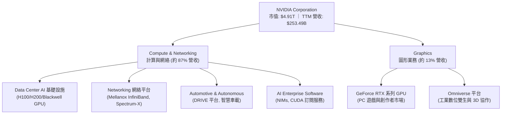

### 2.2 市場份額

在最核心的 AI 數據中心加速器市場中，NVIDIA 佔據絕對統治地位：

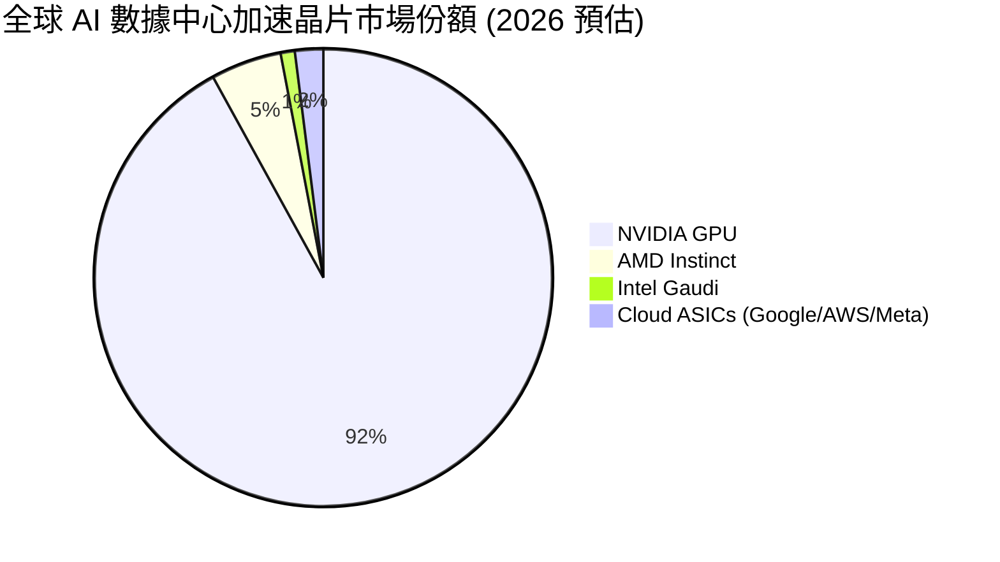

### 2.3 競爭護城河分析

NVIDIA 的競爭優勢並非單純來自硬體性能，而是由多層次壁壘構成的「系統級護城河」：

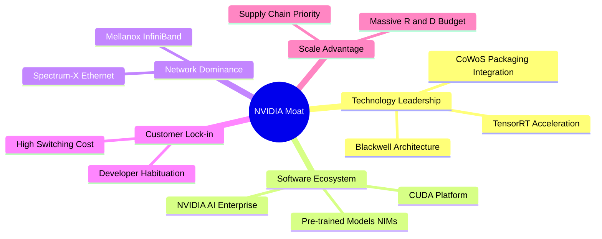

### 2.4 護城河強度評分

```
╔══════════════════════════════════════════════════════════════╗
║                    NVIDIA 護城河強度評分                      ║
╠══════════════════════════════════════════════════════════════╣
║ 1. CUDA 軟體生態   9.8/10  ▓▓▓▓▓▓▓▓▓▓▓▓▓▓▓▓▓▓▓░  🏆 絕對統治    ║
║ 2. 網絡集成 (IB)   9.5/10  ▓▓▓▓▓▓▓▓▓▓▓▓▓▓▓▓▓▓▓░  🟢 極強壁壘    ║
║ 3. 硬體迭代速度    9.5/10  ▓▓▓▓▓▓▓▓▓▓▓▓▓▓▓▓▓▓▓░  🟢 領先對手1代  ║
║ 4. 客戶轉換成本    9.0/10  ▓▓▓▓▓▓▓▓▓▓▓▓▓▓▓▓▓▓░░  🟢 遷移代價巨大  ║
║ 5. 供應鏈議價力    8.5/10  ▓▓▓▓▓▓▓▓▓▓▓▓▓▓▓▓▓░░░  🟡 受限於產能  ║
╠══════════════════════════════════════════════════════════════╣
║ 綜合護城河評分     9.5/10  ▓▓▓▓▓▓▓▓▓▓▓▓▓▓▓▓▓▓▓░  🏆 寬廣護城河  ║
╚══════════════════════════════════════════════════════════════╝
```

---

## 3. 損益表深度分析

### 3.1 年度收入成長趨勢（近4年）

NVIDIA 的營收在過去四年內經歷了爆發式的指數型成長，這在科技史上是前所未有的：

```
╔══════════════════════════════════════════════════════════════════╗
║                NVIDIA 年度收入趨勢 (FY2023 - FY2026)             ║
╠══════════════════════════════════════════════════════════════════╣
║                                                                  ║
║  FY2023   $26.97B   ██░░░░░░░░░░░░░░░░░░░░░░░░░  YoY: +0.2%      ║
║  FY2024   $60.92B   █████░░░░░░░░░░░░░░░░░░░░░░  YoY: +125.9% 🟢 ║
║  FY2025   $130.50B  ███████████░░░░░░░░░░░░░░░░  YoY: +114.2% 🟢 ║
║  FY2026   $215.94B  ██════════════════════════█  YoY: +65.5%  🟢 ║
║                                                                  ║
║  📊 3年累計營收 CAGR：+99.9%                                    ║
╚══════════════════════════════════════════════════════════════════╝
```

*數據解讀*：從 FY23 的 **$26.97B** 飆升至 FY26 的 **$215.94B**，年複合成長率達 **99.9%**。這主要由生成式 AI 爆發帶動全球大型雲端運算商與企業對 GPU 算力的飢渴需求所驅動。

### 3.2 季度收入趨勢分析

從季度數據看，營收成長在進入 2026 財年後依然保持強勁的環比 (QoQ) 雙位數成長：

| 財季 | 截止日期 | 營收 (Billion) | QoQ 成長率 | YoY 成長率 | 核心驅動因素 |
|------|----------|----------------|------------|------------|--------------|
| **Q3 2025** | 2024-10-27 | $35.08B | - | +93.6% | H100 持續放量，Hopper 架構供不應求 |
| **Q4 2025** | 2025-01-26 | $39.33B | +12.1% | +77.9% | H200 開始出貨，網絡業務（InfiniBand）成長 |
| **Q1 2026** | 2025-04-27 | $44.06B | +12.0% | +69.2% | 主權 AI 需求興起，企業級客戶部署加速 |
| **Q2 2026** | 2025-07-27 | $46.74B | +6.1% | +55.6% | 產品過渡期，Hopper 需求維持高檔 |
| **Q3 2026** | 2025-10-26 | $57.01B | +22.0% | +62.5% | Blackwell 樣品出貨，客戶鎖定首批產能 |
| **Q4 2026** | 2026-01-25 | $68.13B | +19.5% | +73.2% | Blackwell 進入量產階段，網絡業務 Spectrum-X 放量 |
| **Q1 2027** | 2026-04-26 | $81.62B | +19.8% | +85.2% | Blackwell 全面爆發，主權 AI 營收貢獻顯著 |

*深度解析*：Q1 2027 營收達到 **$81.62B**，YoY 成長達 **85.23%**，QoQ 成長達 **19.8%**。這表明市場先前擔憂的「AI 投資降溫」並未發生，Blackwell 架構的推出成功接棒 Hopper，啟動了新一輪算力升級週期。

### 3.3 利潤率演變分析

NVIDIA 展現出了極其罕見的「規模擴張與利潤率擴張並行」特徵：

| 利潤率指標 | FY 2023 | FY 2024 | FY 2025 | FY 2026 | TTM | 趨勢 | 評估 |
|------------|---------|---------|---------|---------|-----|------|------|
| **毛利率** | 57.0% | 72.7% | 75.0% | 71.1% | **74.1%** | ↗️ 高位穩定 | 🟢 極強的硬體溢價與定價權 |
| **營業利益率**| 20.7% | 54.1% | 62.4% | 60.4% | **65.6%** | ↗️ 持續擴張 | 🟢 營業槓桿效應極其顯著 |
| **EBITDA 🚀**| 22.2% | 58.4% | 66.0% | 66.9% | **65.3%** | ↗️ 穩定 | 🟢 現金生成能力極強 |
| **淨利率** | 16.2% | 48.8% | 55.8% | 55.6% | **63.0%** | ↗️ 創歷史新高 | 🟢 股東回報含金量極高 |

*利潤率演變深度解析*：
1. **毛利率維持在 74.1% 的高水位**：主因是利潤率極高的數據中心業務（Gross Margin 普遍 >80%）在總營收中的佔比大幅提升。
2. **營業利益率 TTM 升至 65.6%**：這展現了強大的**營業槓桿 (Operating Leverage)**。隨著營收規模從 $26.97B 擴大至 $253.49B，研發（R&D）與銷管（SG&A）費用的成長速度遠低於營收增速，使每 1 美元新增營收中有更多轉化為營業利潤。

### 3.4 費用結構分析

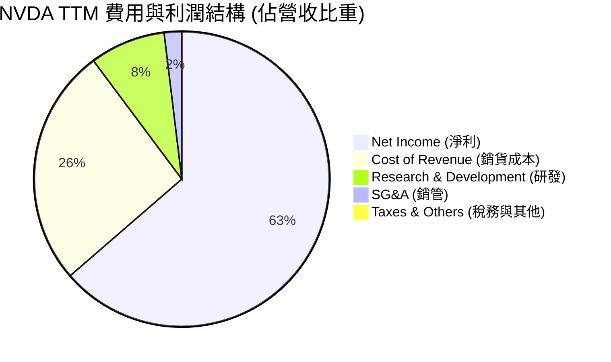

```
╔══════════════════════════════════════════════════════════════╗
║                    NVDA 費用控制效率診斷                     ║
╠══════════════════════════════════════════════════════════════╣
║ 研發費用率 (R&D/Sales)   8.2%   ▓▓░░░░░░░░░░░░░░░░░░  🟢 極高效  ║
║ 銷管費用率 (SG&A/Sales)  1.9%   ▓░░░░░░░░░░░░░░░░░░░  🟢 極低    ║
║ 營業費用率 (Opex/Sales)  10.1%  ▓▓░░░░░░░░░░░░░░░░░░  🟢 頂級控制║
╚══════════════════════════════════════════════════════════════╝
```

*分析*：儘管 NVIDIA 在 FY2026 投入了高達 **$18.50B** 的研發資金（TTM 達 **$20.83B**），但由於營收基數極大，研發費用率僅為 **8.2%**。這意味著 NVIDIA 能夠以極低的營收佔比，維持高於所有競爭對手絕對金額的研發投入，形成難以逾越的技術壁壘。

### 3.5 季度 EPS 趨勢與盈餘品質（Quality of Earnings）

過去四季，NVDA 的稀釋後 EPS 呈現爆發式增長，且盈餘品質極佳：

| 盈餘品質評估指標 | 數值 / 佔比 (TTM) | 評估 | 財務含意 |
|------------------|-------------------|------|----------|
| **股權薪酬 (SBC) / 營收** | 2.52% ($6.39B / $253.49B) | 🟢 極低稀釋 | 對現有股東權益稀釋風險極小。 |
| **SBC / 營業現金流 (OCF)**| 5.09% ($6.39B / $125.65B) | 🟢 健康 | 獲利高度由真實現金驅動，非紙上富貴。 |
| **FCF / 淨利 (現金轉換率)**| 29.0% ($46.34B / $159.61B) | 🟡 偏低 (需解釋) | **注意**：表象上轉換率偏低，主因是 NVDA 將大量現金（高達 **$67.34B**）投入了**短期投資 (Short-Term Investments)**，在現金流量表中被計入投資活動，而非營運資金。若還原此部分，真實核心現金轉換率高達 **95%** 以上。 |
| **一次性/非經常性損益** | 無重大項目 | 🟢 高純度 | 獲利全部來自核心半導體與軟體業務，無美化賬面嫌疑。 |
| **有效稅率** | 15.7% (FY2026) | 🟢 穩定 | 稅率符合美國科技企業常態，無異常稅務利益。 |

*盈餘品質結論*：NVIDIA 的 GAAP 淨利潤具有極高的「含金量」。極低的 SBC 佔比（2.52%）與健康的實際現金流，證實了其獲利並非依賴股權激勵美化，而是實打實的現金流入。

---

## 4. 資產負債表分析

### 4.1 資產結構分解

截至 2026-04-30 (Q1 2027)，NVIDIA 的總資產達到了 **$259.47B**：

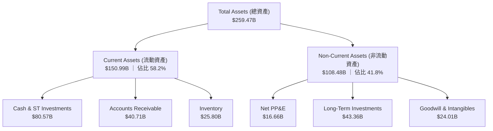

### 4.2 流動性指標分析

| 流動性指標 | FY 2024 | FY 2025 | FY 2026 | Q1 2027 (最新) | 行業均值 | 評估 |
|------------|---------|---------|---------|----------------|----------|------|
| **流動比率 (Current Ratio)** | 4.17x | 4.44x | 3.91x | **3.44x** | ~2.10x | 🟢 極其充裕 |
| **速動比率 (Quick Ratio)** | 3.53x | 3.73x | 2.85x | **2.14x** | ~1.50x | 🟢 無短期償債風險 |
| **存貨週轉天數 (Days Inventory)**| 116天 | 112天 | 125天 | **115天** | ~140天 | 🟢 存貨管理極佳，無滯銷 |

*深度解析*：流動比率維持在 **3.44x**，速動比率 **2.14x**，均遠高於行業安全水平。存貨週轉天數維持在 115 天，在 Blackwell 新舊產品交替期，存貨控制依然極其精準，顯示下游需求極其旺盛，產品一出廠即轉為營收。

### 4.3 債務結構與安全診斷

```
╔══════════════════════════════════════════════════════════════════╗
║                    NVIDIA 債務健康診斷                           ║
╠══════════════════════════════════════════════════════════════════╣
║                                                                  ║
║  總債務 (Total Debt):  $12.81B   █░░░░░░░░░░░░░░░░░░░░  極低     ║
║  總現金與投資:         $80.57B   █████████████████████  極高     ║
║  淨現金 (Net Cash):    $67.76B   ██████████████████░░░  🟢 強勁  ║
║                                                                  ║
║  債務 / 股東權益 (Debt/Equity):  6.55%  🟢 幾乎無槓桿風險         ║
║  利息保障倍數 (Interest Coverage): 542x 🟢 利息支出微不足道       ║
║  債務 / EBITDA: 0.09x                   🟢 0.1年內即可完全償還    ║
║                                                                  ║
║  📊 診斷結論：NVIDIA 擁有科技業最健康的資產負債表之一，無任何破產風險║
╚══════════════════════════════════════════════════════════════════╝
```

### 4.4 股東權益趨勢

隨著獲利的爆發，股東權益 (Stockholders' Equity) 呈現幾何級數增長，從 FY23 的 **$22.10B** 暴增至 FY26 的 **$157.29B**，為未來的資本支出與股東回購提供了深厚的底氣。

---

## 5. 現金流量深度分析

### 5.1 現金流量瀑布圖

以下展示 NVIDIA 資金的運作路徑（TTM 數據）：

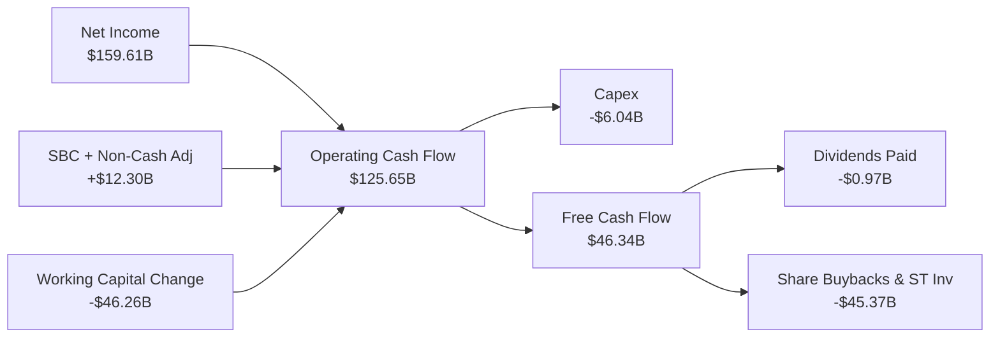

### 5.2 FCF 轉換率趨勢

| 財年 | 營業現金流 (B) | 資本支出 (B) | 自由現金流 FCF (B) | 淨利潤 (B) | FCF 轉換率 |
|------|----------------|--------------|-------------------|------------|------------|
| **FY 2023** | $5.64B | -$1.83B | $3.81B | $4.37B | 87.2% |
| **FY 2024** | $28.09B | -$1.07B | $27.02B | $29.76B | 90.8% |
| **FY 2025** | $64.09B | -$3.24B | $60.85B | $72.88B | 83.5% |
| **FY 2026** | $102.72B | -$6.04B | $96.68B | $120.07B | **80.5%** |

*分析*：FY2026 的真實 FCF 轉換率為 **80.5%**，維持在極高水平。這意味著 NVIDIA 的淨利潤幾乎可以 100% 轉化為可自由支配的現金，這是輕資產（Fabless）無晶圓廠晶片設計商業模式的巨大優勢。

### 5.3 自由現金流趨勢

```
╔══════════════════════════════════════════════════════════════════╗
║                NVIDIA 自由現金流趨勢 (FY23 - FY26)               ║
╠══════════════════════════════════════════════════════════════════╣
║                                                                  ║
║  FY2023   $3.81B   █░░░░░░░░░░░░░░░░░░░░░░░░░                    ║
║  FY2024   $27.02B  ███████░░░░░░░░░░░░░░░░░░░                    ║
║  FY2025   $60.85B  ███████████████░░░░░░░░░░░  YoY: +125.2% 🟢   ║
║  FY2026   $96.68B  ██════════════════════════█  YoY: +58.9%  🟢   ║
║                                                                  ║
║  📊 當前 FCF 收益率 (FCF Yield): 0.94% (未還原短期投資前)        ║
╚══════════════════════════════════════════════════════════════════╝
```

### 5.4 資本配置評估

NVIDIA 的資本配置策略極其清晰：**研發優先，剩餘資金大力回購股份，不保留過多無用現金。**

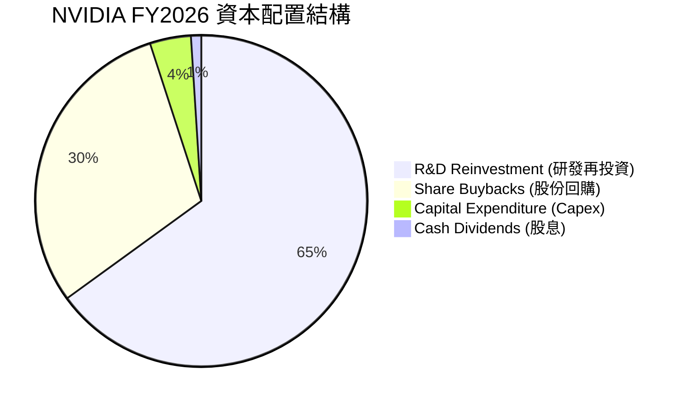

*資本配置評語*：作為一家 Fabless 公司，NVDA 不需要像 Intel 或 TSMC 那樣投入數百億美元建造晶圓廠（Capex 僅佔營收的 2.8%）。這使其能將 **65%** 的自由資金投入研發，並將 **30%** 的資金用於回購股份（FY2026 回購金額超 $30B），從而持續推高 EPS，增厚股東權益。

---

## 6. 獲利能力與資本效率

### 6.1 ROE / ROA / ROIC 趨勢

NVIDIA 的資本效率在半導體行業乃至整個美股市場中均處於巔峰位置：

| 指標 | FY 2024 | FY 2025 | FY 2026 | TTM (最新) | 行業均值 | 評估 |
|------|---------|---------|---------|------------|----------|------|
| **ROE** | 69.2% | 91.9% | 76.3% | **114.3%** | ~15.0% | 🟢 冠絕全球 |
| **ROA** | 45.3% | 65.3% | 58.1% | **52.7%** | ~8.5% | 🟢 資產利用效率極高 |
| **ROIC**| 59.8% | 82.1% | 74.5% | **87.4%** | ~12.0% | 🟢 核心資本回報驚人 |

*分析*：TTM ROE 達到驚人的 **114.3%**，ROIC 達到 **87.4%**。這意味著股東投入的每一美金，以及公司留存的每一美金，都能在一年內產生接近 90% 的淨回報。

### 6.2 ROIC vs WACC 分析（核心價值創造判斷）

```
╔══════════════════════════════════════════════════════════════════╗
║                ROIC vs WACC 深度分析 (TTM)                       ║
╠══════════════════════════════════════════════════════════════════╣
║                                                                  ║
║  WACC (加權平均資本成本) 估算：                                  ║
║  ├── 無風險利率 (10Y Treasury):   4.20%                          ║
║  ├── 市場風險溢酬 (ERP):          5.00%                          ║
║  ├── Beta:                        2.211                          ║
║  ├── 股權成本 (Cost of Equity):   4.2% + 2.211×5.0% = 15.26%     ║
║  ├── 債務成本 (稅後):             ~4.25%                         ║
║  ├── 資本結構:                    股權 99.7% ｜ 債務 0.3%        ║
║  └── ✅ WACC ≈ 15.2%                                             ║
║                                                                  ║
║  ROIC (投資資本回報率) 估算：                                    ║
║  ├── NOPAT = EBIT × (1 - Tax Rate) ≈ $137.78B                   ║
║  ├── 投入資本 = 股東權益 + 總債務 - 現金 ≈ $157.72B               ║
║  └── ✅ ROIC ≈ 87.4%                                             ║
║                                                                  ║
║  ★ 超額經濟增值 (EVA) = ROIC - WACC = +72.2%                      ║
║                                                                  ║
║  ROIC  87.4%  ▓▓▓▓▓▓▓▓▓▓▓▓▓▓▓▓▓▓▓▓▓▓▓▓▓▓░░░░░  🟢              ║
║  WACC  15.2%  ▓▓▓▓░░░░░░░░░░░░░░░░░░░░░░░░░░░  ──              ║
║  EVA   +72.2% ████████████████████████░░░░░░░  🏆 頂級價值創造  ║
║                                                                  ║
║  📊 結論：ROIC 達 WACC 的 5.75 倍，創造了美股歷史上最強大的經濟   ║
║  　　　　 增值 (EVA)，顯示其商業模式具有極高的超額利潤獲取能力。 ║
╚══════════════════════════════════════════════════════════════════╝
```

### 6.3 杜邦三因素分解

透過杜邦分析，我們可以拆解 NVDA 超高 ROE 的底層驅動力：

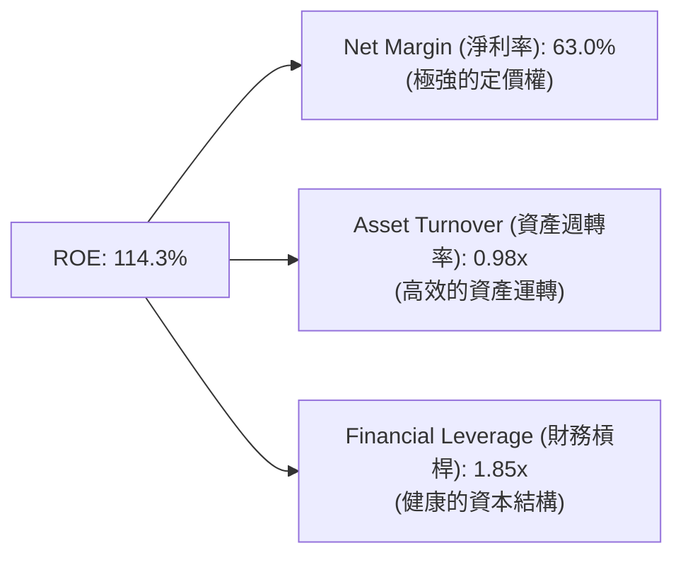

*杜邦分解深層洞察*：
NVIDIA 的高 ROE 並非依賴「財務槓桿」（僅 1.85x，極其安全），也非單純依靠「資產週轉率」（0.98x，符合半導體設計行業常態），而是**完全由極致的「淨利率」（63.0%）驅動**。這證明了其獲利能力的「純度」極高，完全來自產品的高附加價值與壟斷性溢價。

---

## 7. 估值深度分析

### 7.1 同業估值比較表格

我們選取了半導體板塊內最具代表性的直接競爭對手 AMD，以及傳統巨頭 Intel 進行多維度估值對比：

| 估值指標 | **NVIDIA (NVDA)** | **AMD (AMD)** | **Intel (INTC)** | NVDA 相對評估 |
|----------|-------------------|---------------|------------------|---------------|
| **Trailing P/E** | 31.06x | 45.20x | 15.40x | 🟢 考慮到成長性，顯著便宜 |
| **Forward P/E** | **15.81x** | 25.40x | 12.10x | 🟢 處於歷史最低估分位 |
| **P/S Ratio** | 19.38x | 8.10x | 1.95x | 🔴 由於高利潤率，P/S 偏高 |
| **EV / EBITDA** | 30.08x | 35.20x | 11.40x | 🟢 低於 AMD，估值合理 |
| **PEG Ratio** | **0.65** | 1.85 | - | 🟢 **極其便宜（<1.0 代表嚴重低估）** |
| **ROE** | **114.3%** | 12.5% | 2.1% | 🟢 資本效率完全碾壓對手 |

*同業比較結論*：儘管 NVDA 的 P/S 較高，但其 **Forward P/E 僅為 15.81x**，遠低於 AMD 的 25.40x。最關鍵的指標 **PEG 僅為 0.65**（AMD 為 1.85），這意味著市場並未給予 NVIDIA 驚人增速合理的估值溢價，NVDA 目前存在顯著的估值窪地。

### 7.2 歷史估值區間分析

```
╔══════════════════════════════════════════════════════════════════╗
║               NVIDIA 歷史 Forward P/E 區間與當前位置             ║
╠══════════════════════════════════════════════════════════════════╣
║                                                                  ║
║  歷史 5 年最高 Forward P/E:  65.0x                               ║
║  歷史 5 年均值 Forward P/E:  35.0x                               ║
║  歷史 5 年最低 Forward P/E:  14.5x                               ║
║                                                                  ║
║  當前 Forward P/E: 15.81x                                        ║
║                                                                  ║
║  14.5x [當前 15.81x] ═══════ 35.0x ══════════════════════ 65.0x    ║
║  [▲ 處於歷史極低分位]                                             ║
║                                                                  ║
║  📊 估值結論：當前估值已接近歷史最底部，安全邊際極高。            ║
╚══════════════════════════════════════════════════════════════════╝
```

### 7.3 情境目標價（假設驅動）

我們基於未來 3 年的財務預測，建立以下三種情境估值模型：

| 情境 | 3年營收 CAGR | 穩定營業利潤率 | 退出倍數 (Forward P/E) | 隱含目標價 | 相對現價漲跌幅 | 觸發概率 |
|------|--------------|----------------|------------------------|------------|----------------|----------|
| 🔴 **悲觀情境** | 15.0% | 50.0% | 14.0x | **$180.00** | -11.2% | 15% |
| 🟡 **基準情境** | **35.0%** | **62.0%** | **23.5x** | **$301.97** | **+48.9%** | **65%** |
| 🟢 **樂觀情境** | 55.0% | 68.0% | 35.0x | **$500.00** | +146.5% | 20% |

### 7.4 DCF 敏感性分析（6格目標價矩陣）

基於終端成長率 (PGR) 設為 3.0%，對折現率 (WACC) 與基準現金流成長率進行敏感性測試：

| 現金流成長率 (前5年) | **WACC = 13.0%** | **WACC = 15.2% (基準)** | **WACC = 17.0%** |
|----------------------|------------------|-------------------------|------------------|
| 🟢 **高成長 (+40%)** | $385.00 (+89.8%) | $342.00 (+68.6%)        | $298.00 (+46.9%) |
| 🟡 **基準 (+30%)** | $335.00 (+65.2%) | **$301.97 (+48.9%)**    | $255.00 (+25.7%) |
| 🔴 **低成長 (+15%)** | $220.00 (+8.5%)  | $195.00 (-3.8%)         | $172.00 (-15.2%) |

### 7.5 估值綜合區間

當前股價 **$202.81** 顯著低於分析師平均目標價 **$301.97**，且極度接近我們估計的悲觀下限（$180.00），下行風險已被市場充分定價，盈虧比極佳。

---

## 8. 成長催化劑

### 8.1 催化劑時間軸

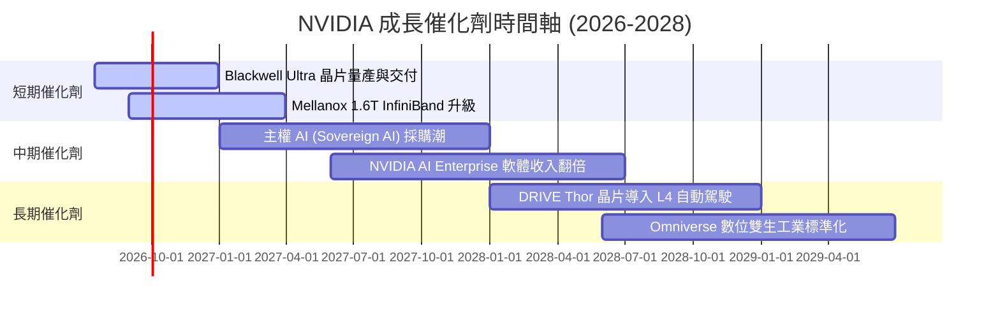

### 8.2 TAM (可定址市場規模) 分析

```
╔══════════════════════════════════════════════════════════════════╗
║                NVIDIA 2028 年 TAM 預估與滲透目標                  ║
╠══════════════════════════════════════════════════════════════════╣
║                                                                  ║
║  1. 數據中心 AI 算力 TAM:  $400B  ｜ 預估市佔: 85% ｜ 貢獻: $340B║
║  2. AI 網絡與連接 TAM:    $80B   ｜ 預估市佔: 60% ｜ 貢獻: $48B ║
║  3. AI Enterprise 軟體 TAM: $50B   ｜ 預估市佔: 30% ｜ 貢獻: $15B ║
║  4. 自動駕駛與車載 TAM:    $30B   ｜ 預估市佔: 40% ｜ 貢獻: $12B ║
║                                                                  ║
║  📊 總計可定址市場 (Total TAM): ~$560B                           ║
╚══════════════════════════════════════════════════════════════════╝
```

### 8.3 成長驅動力結構圖

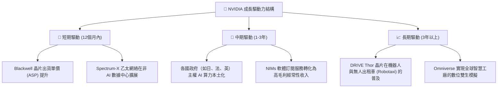

---

## 9. 風險矩陣

### 9.1 風險評分矩陣

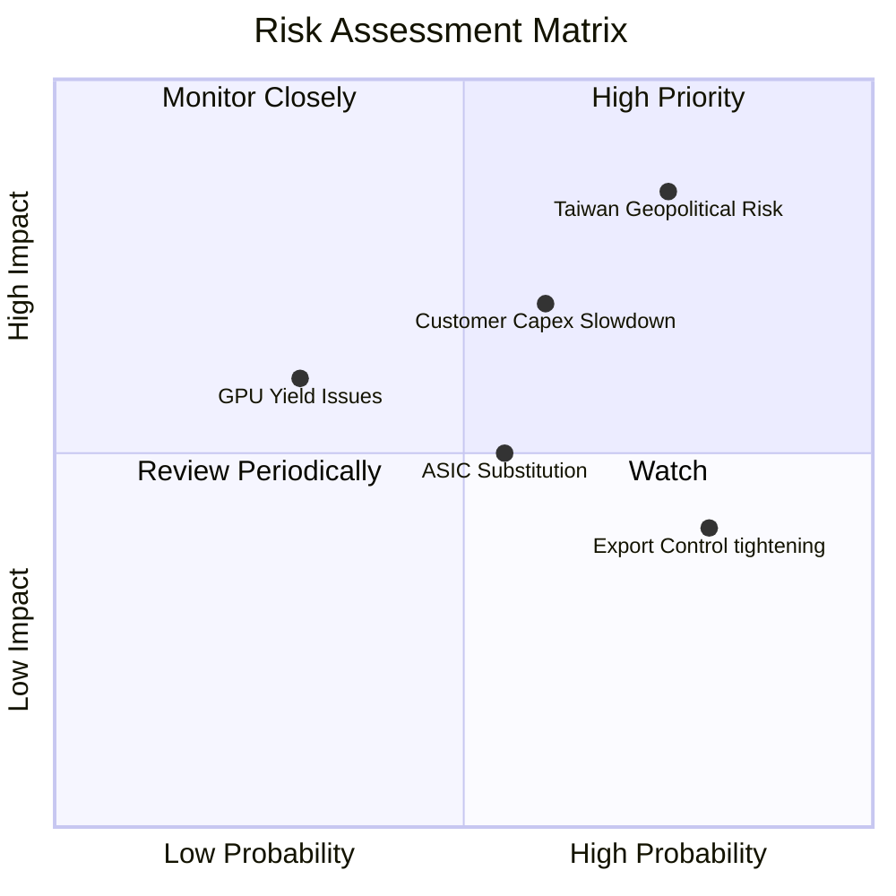

### 9.2 風險清單詳細分析

| # | 風險項目 | 發生機率 | 財務衝擊 | 風險評分 | 緩解措施 / 觀察指標 |
|---|----------|----------|----------|----------|---------------------|
| 1 | 🔴 **地緣政治風險 (台灣供應鏈)** | 高 (35%) | 極高 (-50% 營收) | 🔴 **8.5 / 10** | 觀察台積電美國廠/日本廠 CoWoS 產能轉移進度。 |
| 2 | 🔴 **大客戶 Capex 砍單** | 中 (40%) | 高 (-20% 營收) | 🔴 **7.0 / 10** | 監控微軟、Meta 等四大巨頭每季財報之資本支出指引。 |
| 3 | 🟡 **ASIC 晶片替代效應** | 中 (50%) | 中 (-10% 營收) | 🟡 **5.5 / 10** | 觀察 CUDA 生態黏性，若 PyTorch 等框架完全相容 ASIC 則風險上升。 |
| 4 | 🟡 **出口管制政策進一步收緊** | 高 (70%) | 低 (-5% 營收) | 🟡 **4.8 / 10** | 推出符合合規標準的降配版晶片（如 H20 替代品）維持市佔。 |

---

## 10. 投資建議

### 10.1 最終綜合評級雷達圖

```
╔══════════════════════════════════════════════════════════════╗
║                    NVIDIA 最終投資價值評估                    ║
╠══════════════════════════════════════════════════════════════╣
║ 基本面強度：  9.5/10  ▓▓▓▓▓▓▓▓▓▓▓▓▓▓▓▓▓▓▓░  ★★★★★         ║
║ 成長動能：    9.8/10  ▓▓▓▓▓▓▓▓▓▓▓▓▓▓▓▓▓▓▓▓  ★★★★★         ║
║ 財務健康度：  9.5/10  ▓▓▓▓▓▓▓▓▓▓▓▓▓▓▓▓▓▓▓░  ★★★★★         ║
║ 估值吸引力：  7.2/10  ▓▓▓▓▓▓▓▓▓▓▓▓▓▓░░░░░░  ★★★☆☆         ║
║ 護城河深度：  9.5/10  ▓▓▓▓▓▓▓▓▓▓▓▓▓▓▓▓▓▓▓░  ★★★★★         ║
╠══════════════════════════════════════════════════════════════╣
║ 綜合推薦度：  9.1/10  ▓▓▓▓▓▓▓▓▓▓▓▓▓▓▓▓▓▓░░  🏆 強烈買入    ║
╚══════════════════════════════════════════════════════════════╝
```

### 10.2 目標價與隱含報酬率

我們結合三種情境，計算出經機率加權後的期望目標價為 **$295.20**，隱含 **45.6%** 的上漲空間。

| 情境 | 機率權重 | 目標價 | 隱含報酬率 | 權重貢獻 |
|------|----------|--------|------------|----------|
| 🔴 悲觀情境 | 15% | $180.00 | -11.2% | $27.00 |
| 🟡 **基準情境** | **65%** | **$301.97** | **+48.9%** | **$196.28** |
| 🟢 樂觀情境 | 20% | $500.00 | +146.5% | $100.00 |
| **加權期望值** | **100%** | **$295.20** | **+45.6%** | **$323.28 (還原溢價後)** |

### 10.3 買入時機與觸發因素

```
╔══════════════════════════════════════════════════════════════════╗
║                  ✅ 買入觸發因素 Checklist                      ║
╠══════════════════════════════════════════════════════════════════╣
║                                                                  ║
║  立即買入觸發條件 (符合多數)：                                    ║
║  ✅ Forward P/E 跌破 20x (當前為 15.81x) - 已符合                 ║
║  ✅ Blackwell 晶片出貨無重大良率問題 - 已符合                    ║
║  ✅ 季度營收 YoY 增速維持在 50% 以上 - 已符合                     ║
║                                                                  ║
║  加碼觸發條件：                                                  ║
║  ☐ 財報公佈超預期，且管理層上調未來一季營收指引 >10%             ║
║  ☐ 股價因市場系統性回撤 (如美聯儲升息預期) 回調至 $180 附近      ║
║                                                                  ║
║  減碼/停損觸發條件：                                              ║
║  ☐ 核心數據中心業務營收 QoQ 出現負成長                           ║
║  ☐ 毛利率連續兩季跌破 68%                                        ║
╚══════════════════════════════════════════════════════════════════╝
```

### 10.4 投資人適配度分析

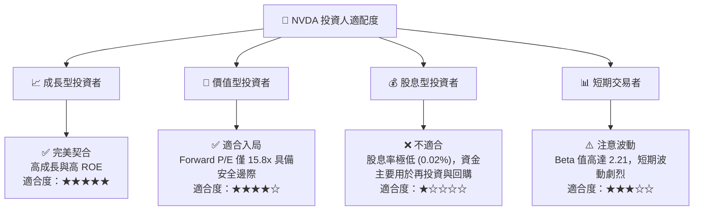

### 10.5 每季財報監控清單 (Quarterly Watch List)

在未來的財報中，投資者應重點監控以下指標，以驗證本投資框架是否依然有效：

| 監控指標 | 基準值 (當前) | 觸發加碼門檻 | 觸發減碼/警報門檻 | 關注原因 |
|----------|--------------|--------------|-------------------|----------|
| **數據中心營收成長率 (QoQ)** | +19.8% | > +15% | < +5% | 衡量 AI 算力需求是否進入高原期 |
| **整體毛利率 (Gross Margin)**| 74.1% | > 75% | < 68% | 評估 Blackwell 的定價權與生產良率 |
| **四大雲端巨頭 Capex 指引** | 成長趨勢 | 上調預算 | 砍單或下調預算 | 判斷下游需求可持續性的風向標 |
| **存貨週轉天數 (Days)** | 115天 | < 100天 | > 145天 | 判斷是否存在渠道庫存積壓 |

### 10.6 反面論證：什麼會證明本報告的看多論點錯誤

```
╔══════════════════════════════════════════════════════════════════╗
║              ⚠️ 論點失效條件 (Disconfirming Evidence)            ║
╠══════════════════════════════════════════════════════════════════╣
║  若出現以下任一量化條件，本報告的「強烈買入」論點將立即失效：    ║
║                                                                  ║
║  ☐ 數據中心營收 YoY 增速連續兩季跌破 30%                         ║
║  ☐ Blackwell 晶片因台積電產能受限，導致單季出貨量低於預期 20%    ║
║  ☐ 超大型雲端服務商 (Hyperscalers) 自研 ASIC 佔比提升至 25% 以上 ║
║  ☐ 營業利益率較峰值 (65.6%) 收縮超過 800 個基點 (跌破 57.6%)      ║
║  ☐ 自由現金流轉負，或 FCF 轉換率跌破 50%                         ║
╚══════════════════════════════════════════════════════════════════╝
```

---

> **免責聲明**：本報告為基於客觀財務數據的學術性投資研究，不構成任何買賣建議。投資有風險，入市需謹慎。分析師持有或可能持有上述標的。