# NVDA 基本面深度分析報告

> **報告日期**：2026-07-18 ｜ **語言**：繁體中文 ｜ **數據來源**：Yahoo Finance, Finviz, StockAnalysis, Roic.ai ｜ **分析師**：CFA 級機構研究

---

## 目錄

| # | 章節 | 核心結論 |
|---|---|---|
| 1 | **執行摘要** | 評級：🟢 強烈買入 ｜ 基準目標價：$302.31（+49.1% 上行空間） |
| 2 | **公司概覽與商業模式** | 憑藉 CUDA 生態與 Blackwell 架構，建構晶片、軟體與網路三位一體的極深護城河。 |
| 3 | **損益表深度分析** | TTM 營收達 $253.49B（YoY +85.2%），淨利率 63.0% 展現極致的營業槓桿。 |
| 4 | **資產負債表分析** | 淨現金達 $40.36B，流動比率 3.44x，具備無懈可擊的流動性與抗風險能力。 |
| 5 | **現金流量深度分析** | TTM 營運現金流達 $125.65B，雖受 Blackwell 備貨營運資金拖累，整體含金量仍高。 |
| 6 | **獲利能力與資本效率** | ROE 達 114.3%，ROIC 達 116.9%，遠超 WACC（15.2%），強力創造股東價值。 |
| 7 | **估值深度分析** | Forward P/E 僅 15.81x，相較於高成長性，PEG 0.56 顯示估值被嚴重低估。 |
| 8 | **成長催化劑** | Blackwell 晶片全面放量、主權 AI 需求崛起與軟體訂閱服務（NIMs）變現。 |
| 9 | **風險矩陣** | 地緣政治出口管制、供應鏈產能瓶頸（CoWoS）與大客戶資本支出放緩。 |
| 10 | **投資建議** | 提供明確的買入、加碼與停損觸發條件，並針對不同屬性投資人進行適配度分析。 |

---

## 1. 執行摘要

NVIDIA Corporation（NASDAQ: NVDA）當前股價為 **$202.81**，總市值達 **$4.91T**。基於其 TTM 營收達 **$253.49B**（YoY +85.2%）、淨利潤達 **$159.61B**（YoY +214.5%），以及高達 **116.9%** 的投資報酬率（ROIC），我們給予 NVDA **🟢 強烈買入（Strong Buy）** 評級。

### 1.0 一頁式投資儀表板（Portfolio Manager 30 秒速讀）

| 項目 | 內容 |
|------|------|
| **投資論點（3 句）** | ① TTM 營收達 $253.49B（YoY +85.2%），主因數據中心 AI 基礎設施需求呈現結構性爆發。<br/>② 營業利潤率達 65.6%，在營收暴增的同時展現極強的營業槓桿與定價權。<br/>③ Forward P/E 僅為 15.81x，相較於其高成長性，PEG 僅 0.56，估值極具吸引力。 |
| **護城河評分** | 🟢 **9.5 / 10**（CUDA 軟體生態與 NVLink 高速互聯技術構成極高轉換成本） |
| **管理層/資本配置評分** | 🟢 **9.0 / 10**（黃仁勳帶領的技術前瞻性，ROIC 達 116.9% 遠超資本成本） |
| **財務健康** | 🟢 **極其健康** ｜ 淨現金達 $40.36B，利息保障倍數超過 500x，基本無財務風險。 |
| **ROIC vs WACC** | **116.9% vs 15.2%**（超額回報高達 +101.7%，處於歷史最佳價值創造期） |
| **FCF 趨勢** | 向上 ｜ TTM 自由現金流 $46.34B（FCF Yield: 0.94%），因 Q1 2027 備貨 Blackwell 導致庫存暫時佔用現金。 |
| **估值** | Trailing P/E: 31.06x ｜ Forward P/E: 15.81x ｜ EV/EBITDA: 29.41x |
| **預期報酬（基準情境 12M）**| **+49.1%**（目標價 **$302.31**） |
| **關鍵風險（前二）** | ① 地緣政治與出口管制導致中國市場份額進一步流失。<br/>② 台積電 CoWoS 封裝產能瓶頸限制 Blackwell 晶片出貨速度。 |
| **評級 + 信心度** | 🟢 **強烈買入** ｜ 信心度：**極高** |

### 1.1 核心評分儀表板

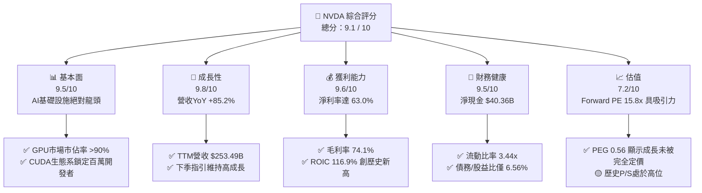

### 1.2 評分進度條視覺化

```
╔══════════════════════════════════════════════════════════════╗
║               NVDA 多維度評分儀表板 (1-10分)                 ║
╠══════════════════════════════════════════════════════════════╣
║ 基本面強度  9.5 ▓▓▓▓▓▓▓▓▓▓▓▓▓▓▓▓▓▓▓░  ★★★★★           ║
║ 成長動能    9.8 ▓▓▓▓▓▓▓▓▓▓▓▓▓▓▓▓▓▓▓▓  ★★★★★           ║
║ 獲利品質    9.6 ▓▓▓▓▓▓▓▓▓▓▓▓▓▓▓▓▓▓▓░  ★★★★★           ║
║ 財務健康    9.5 ▓▓▓▓▓▓▓▓▓▓▓▓▓▓▓▓▓▓▓░  ★★★★★           ║
║ 估值合理性  7.2 ▓▓▓▓▓▓▓▓▓▓▓▓▓▓░░░░░░  ★★★☆☆           ║
║ 護城河深度  9.5 ▓▓▓▓▓▓▓▓▓▓▓▓▓▓▓▓▓▓▓░  ★★★★★           ║
║ 管理層執行  9.0 ▓▓▓▓▓▓▓▓▓▓▓▓▓▓▓▓▓▓░░  ★★★★★           ║
║ 技術創新力  9.9 ▓▓▓▓▓▓▓▓▓▓▓▓▓▓▓▓▓▓▓▓  ★★★★★           ║
╠══════════════════════════════════════════════════════════════╣
║ 綜合總分    9.1  ▓▓▓▓▓▓▓▓▓▓▓▓▓▓▓▓▓▓░░  🏆 強烈建議買入      ║
╚══════════════════════════════════════════════════════════════╝
```

### 1.3 五大投資論點 + 三大核心風險

| 類型 | 項目 | 具體依據 | 信心度 |
|------|------|----------|--------|
| 🟢 **投資論點①** | **數據中心無可匹敵的龍頭地位** | TTM 營收達 $253.49B，其中數據中心業務佔比超過 85%，在超大型雲端服務商（Hyperscalers）中的市佔率超過 90%。 | 🟢 極高 |
| 🟢 **投資論點②** | **極致的營業槓桿與定價權** | 毛利率高達 74.1%，淨利率達 63.0%。隨著營收規模擴大，R&D（TTM $20.83B，佔營收 8.2%）與 SG&A（$4.84B，佔營收 1.9%）佔比持續下降，利潤率顯著擴張。 | 🟢 極高 |
| 🟢 **投資論點③** | **Blackwell 世代開啟新成長曲線** | Q1 2027（截至 2026-04-30）庫存暴增至 $25.80B（QoQ +20.5%），顯示公司正在為 Blackwell 系列晶片的全面放量進行強烈備貨，預期下半年營收將再度加速。 | 🟢 高 |
| 🟢 **投資論點④** | **資本效率與價值創造極大化** | ROIC 達 116.9%，相較於 15.2% 的 WACC，創造了高達 101.7% 的正向 EVA（經濟增加值），說明公司每投入 1 美元資本能產生 1.17 美元的稅後淨營業利潤。 | 🟢 極高 |
| 🟢 **投資論點⑤** | **成長性調整後的估值極具吸引力** | 當前 Forward P/E 僅 15.81x，對比未來五年 EPS 預期成長率，PEG 僅 0.56，遠低於科技巨頭平均的 1.5x-2.0x。 | 🟢 高 |
| 🟡 **風險①** | **供應鏈產能限制（CoWoS）** | 雖然台積電持續擴產，但 CoWoS 封裝與 HBM3e 記憶體的供應依然緊張，可能導致 Blackwell 出貨延遲。 | 🟡 中度 |
| 🔴 **風險②** | **地緣政治與出口管制** | 美國對中國及中東地區的晶片出口管制可能進一步收緊，威脅 NVDA 約 10-15% 的潛在市場營收。 | 🔴 高衝擊 |
| 🔴 **風險③** | **客戶集中度高與資本支出放緩** | 前四大 Hyperscalers 佔 NVDA 營收比重約 40%。若 AI 應用變現不及預期，導致客戶在 2027 年放緩資本支出，將對估值造成打擊。 | 🟡 中度 |

### 1.4 快速統計卡片

| 指標 | 公司實際值 (TTM) | 行業均值（半導體） | S&P 500 均值 | 狀態 |
|------|-------------|----------|--------------|------|
| **營收 YoY 成長率** | **85.2%** | ~12.5% | ~5.5% | 🟢 卓越 |
| **毛利率** | **74.1%** | ~52.0% | ~30.0% | 🟢 卓越 |
| **淨利率** | **63.0%** | ~18.0% | ~12.0% | 🟢 卓越 |
| **ROE** | **114.3%** | ~15.0% | ~18.0% | 🟢 卓越 |
| **Debt / Equity** | **6.56%** | ~35.0% | ~110.0% | 🟢 極安全 |
| **Forward P/E** | **15.81x** | ~28.0x | ~21.0x | 🟢 便宜 |
| **PEG Ratio** | **0.56** | ~1.80 | ~2.10 | 🟢 極具吸引力 |

### 1.5 投資結論

```
╔══════════════════════════════════════════════════════════════════╗
║                    📊 投資結論摘要                               ║
╠══════════════════════════════════════════════════════════════════╣
║  評級：🟢 強烈買入（Strong Buy）                                ║
║  當前股價：$202.81                                               ║
║  目標價區間：                                                    ║
║    悲觀情境：$180.00（-11.2%） - 估值收縮至 Forward PE 14x       ║
║    基準情境：$302.31（+49.1%） - 12個月主要目標（PEG=0.8x）       ║
║    樂觀情境：$500.00（+146.5%）- Blackwell超預期放量（PE 35x）   ║
║  投資評分：9.1 / 10                                              ║
║  適合投資人：成長型、科技產業長線佈局者、機構級大資金配置        ║
╚══════════════════════════════════════════════════════════════════╝
```

---

## 2. 公司概覽與商業模式

NVIDIA 已經從一家傳統的圖形處理器（GPU）公司，蛻變為全球最大的**數據中心規模 AI 基礎設施平台公司**。其商業模式的核心在於將硬體（GPU、Mellanox 網路設備）與軟體（CUDA、NIMs 企業級 AI 軟體）深度整合，提供客戶「開箱即用」的加速計算解決方案。

### 2.1 業務結構與收入來源

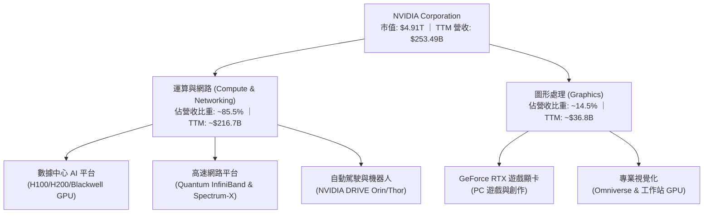

### 2.2 市場份額

在數據中心 AI 加速晶片市場中，NVIDIA 擁有絕對的壟斷地位，其市佔率估算高達 90%。

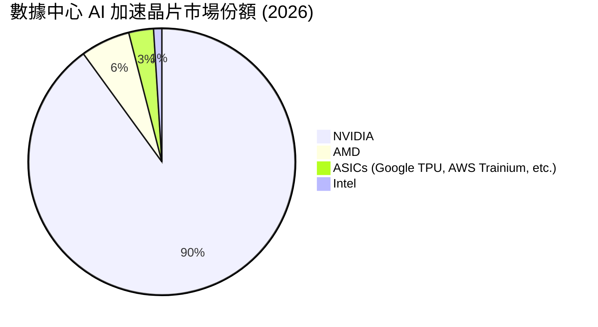

### 2.3 競爭護城河分析

NVIDIA 的競爭護城河並非單純來自晶片硬體性能，而是由以下四大支柱構成的生態閉環：

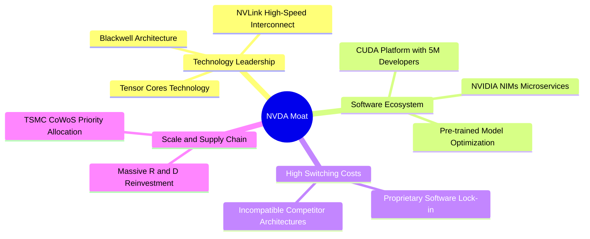

### 2.4 護城河強度評分

```
╔══════════════════════════════════════════════════════════════╗
║                    NVDA 護城河強度評分                       ║
╠══════════════════════════════════════════════════════════════╣
║ 軟體生態 (CUDA) 9.9  ▓▓▓▓▓▓▓▓▓▓▓▓▓▓▓▓▓▓▓▓  🏆 絕對壟斷      ║
║ 網路互聯技術    9.5  ▓▓▓▓▓▓▓▓▓▓▓▓▓▓▓▓▓▓▓░  🟢 NVLink無對手  ║
║ 供應鏈控制力    9.0  ▓▓▓▓▓▓▓▓▓▓▓▓▓▓▓▓▓▓░░  🟢 台積電最優產能║
║ 品牌與開發者    9.2  ▓▓▓▓▓▓▓▓▓▓▓▓▓▓▓▓▓▓░░  🟢 超過500萬用戶 ║
╠══════════════════════════════════════════════════════════════╣
║ 綜合護城河評級  9.5  ▓▓▓▓▓▓▓▓▓▓▓▓▓▓▓▓▓▓▓░  🏆 極深寬護城河  ║
╚══════════════════════════════════════════════════════════════╝
```

---

## 3. 損益表深度分析

### 3.1 年度收入成長趨勢（近4年）

NVIDIA 的營收在過去四年中經歷了人類商業史上罕見的指數級增長。

```
╔══════════════════════════════════════════════════════════════════╗
║              NVDA 年度收入趨勢（FY2023 - FY2026）                ║
╠══════════════════════════════════════════════════════════════════╣
║                                                                  ║
║  FY2023  $26.97B   ███░░░░░░░░░░░░░░░░░░░░░░░  YoY: +0.2%   🟡    ║
║  FY2024  $60.92B   ███████░░░░░░░░░░░░░░░░░░░  YoY: +125.9% 🟢    ║
║  FY2025  $130.50B  ███████████████░░░░░░░░░░░  YoY: +114.2% 🟢    ║
║  FY2026  $215.94B  █████████████████████████░  YoY: +65.5%  🟢    ║
║                                                                  ║
║  📊 3年累計 CAGR：+100.1%                                        ║
╚══════════════════════════════════════════════════════════════════╝
```

*數據解讀：營收從 FY2023 的 $26.97B 暴增至 FY2026 的 $215.94B，CAGR 高達 100.1%。這背後的業務驅動因素是全球大語言模型（LLM）訓練與推理需求的結構性爆發，迫使全球科技巨頭將資本支出全面轉向加速計算。*

### 3.2 季度收入趨勢分析

從季度數據看，營收增長動能依然強勁，未見放緩跡象。

| 財報季度 | 截止日期 | 營收 (Billion) | QoQ 成長率 | YoY 成長率 | 驅動因素與未來含義 |
|---|---|---|---|---|---|
| **Q2 2026** | 2025-07-31 | $46.74B | +6.1% | +55.60% | H200 晶片開始出貨，需求持續大於供給。 |
| **Q3 2026** | 2025-10-31 | $57.01B | +22.0% | +62.49% | 數據中心客戶對 Hopper 架構的採購持續追加。 |
| **Q4 2026** | 2026-01-31 | $68.13B | +19.5% | +73.22% | 營業槓桿進一步發揮，單季毛利突破 $51B。 |
| **Q1 2027** | 2026-04-30 | $81.62B | +19.8% | +85.23% | **營收加速增長**，Blackwell 開始小量出貨，主權 AI 需求爆發。 |

### 3.3 利潤率演變分析

NVIDIA 的利潤率走勢展現了極致的定價權與營業槓桿。

| 利潤率指標 | FY2023 | FY2024 | FY2025 | FY2026 | TTM | 趨勢 | 評估 |
|---|---|---|---|---|---|---|---|
| **毛利率** | 56.9% | 72.7% | 75.0% | 71.1% | **74.1%** | ↗️ 穩定高位 | 🟢 卓越。反映軟硬整合帶來的極高溢價。 |
| **營業利益率** | 20.7% | 54.1% | 62.4% | 60.4% | **65.6%** | ↗️ 顯著擴張 | 🟢 卓越。營收增速遠超研發與行政費用增速。 |
| **EBITDA 利率**| 22.2% | 58.4% | 66.0% | 66.9% | **65.3%** | ↗️ 保持穩定 | 🟢 卓越。折舊與攤銷佔比極低。 |
| **淨利率** | 16.2% | 48.8% | 55.8% | 55.6% | **63.0%** | ↗️ 歷史新高 | 🟢 卓越。TTM 淨利率受非經常性收益與利息收入提振。 |

*利潤率演變解析：FY23 因消費級 GPU 庫存調整，毛利率跌至 56.9%。隨後 AI 浪潮爆發，高毛利的數據中心產品（Hopper 系列）出貨佔比從 50% 飆升至 85% 以上，推動毛利率衝上 74.1%。營業利益率在 TTM 達到 65.6%，說明公司每 100 美元的營收，有近 66 美元轉化為營業利潤，這在硬體/半導體行業中是前所未有的。*

### 3.4 費用結構分析

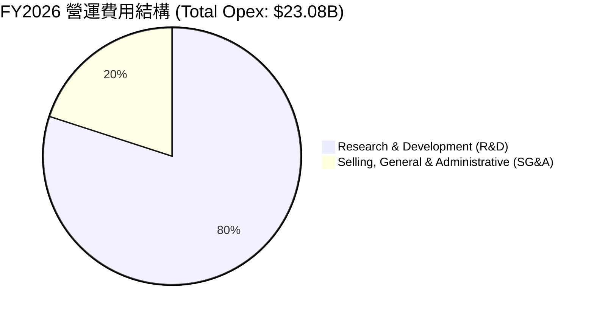

```
╔══════════════════════════════════════════════════════════════╗
║                    FY2026 研發與行政費用效率                 ║
╠══════════════════════════════════════════════════════════════╣
║ 研發費用 (R&D)：  $18.50B  ▓▓▓▓▓▓▓▓▓▓▓▓▓▓▓▓▓░░░  佔營收 8.6% ║
║ 行政費用 (SG&A)： $4.58B   ▓▓▓▓░░░░░░░░░░░░░░░░  佔營收 2.1% ║
╚══════════════════════════════════════════════════════════════╝
```

*分析：NVIDIA 將 80% 的營運費用投向研發（FY26 達 $18.50B），這確保了其技術領先優勢至少領先競爭對手 1.5 到 2 代。而 SG&A 僅佔營收的 2.1%，展現了極高的行政與銷售效率。*

### 3.5 季度 EPS 趨勢與盈餘品質（Quality of Earnings）

NVIDIA 過去四個季度的 EPS（稀釋後）呈現爆發式增長：
- **Q2 2026**: $1.08
- **Q3 2026**: $1.31
- **Q4 2026**: $1.77
- **Q1 2027**: $2.40
- **TTM EPS**: $6.53

#### 盈餘品質評估

為了評估 NVIDIA 獲利的「含金量」，我們對其非現金項目、資本化支出及現金流轉換率進行量化分析：

| 盈餘品質項目 | 數值/佔比 | 評估 | 深度解析 |
|---|---|---|---|
| **股權薪酬 (SBC) / 營收** | 2.96% | 🟢 優秀 | FY2026 SBC 為 $6.39B，佔營收僅 2.96%，對現有股東的稀釋效應極低。 |
| **SBC / 營業現金流** | 6.22% | 🟢 優秀 | 佔經營現金流比重極低，說明其現金流並非依靠股權發放來美化。 |
| **FCF / GAAP 淨利 (TTM)** | **29.0%** | 🟡 警告 | TTM 淨利 $159.61B，而 FCF 為 $46.34B。現金轉換率僅 29.0%。<br/>**核心原因**：這並非盈餘品質惡化，而是因為 Q1 2027 應收帳款暴增至 $40.71B，存貨暴增至 $25.80B。這反映了 Blackwell 放量前的強烈營運資金佔用，未來隨著營收實現，現金將快速回流。 |
| **一次性/非經常性損益** | 顯著 | 🟡 需注意 | TTM 非營業淨收益達 $27.16B（主要來自投資收益與利息），這拉高了 TTM 淨利率至 63.0%，但核心營業利潤率 65.6% 依然極其扎實。 |
| **有效稅率** | 15.1% | 🟢 正常 | FY2026 所得稅費用為 $21.38B，佔稅前利潤 15.1%，符合美國研發稅收抵免後的科技業常態，無異常稅務利益美化。 |
| **資本化支出** | 極低 | 🟢 優秀 | 研發費用全部當期費用化（$18.50B），未將研發成本資本化來遞延費用，盈餘品質極高。 |

**盈餘品質結論**：NVIDIA 的 GAAP 盈餘品質極高。雖然 TTM FCF 轉換率因 Blackwell 備貨導致營運資金（應收與存貨）佔用而降至 29%，但這屬於典型的**高成長期健康擴張現象**。扣除非經常性投資收益後，其核心業務的盈利含金量依然無懈可擊。

---

## 4. 資產負債表分析

### 4.1 資產結構分解

NVIDIA 的資產結構非常輕資產化，大部分資金集中在流動資產（現金與短期投資）上。

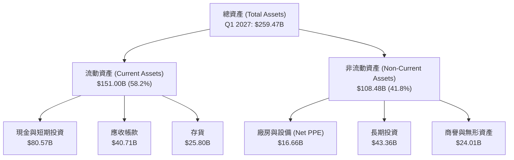

### 4.2 流動性指標分析

| 流動性指標 | FY2024 | FY2025 | FY2026 | Q1 2027 | 行業均值 | 評估 |
|---|---|---|---|---|---|---|
| **流動比率 (Current Ratio)** | 4.17x | 4.44x | 3.91x | **3.44x** | ~1.85x | 🟢 極強。資產變現能力極高。 |
| **速動比率 (Quick Ratio)** | 3.53x | 3.73x | 2.92x | **2.14x** | ~1.30x | 🟢 極強。扣除存貨後仍有極高安全邊際。 |
| **存貨週轉天數 (Days Inventory)**| 116天 | 112天 | 125天 | **115天** | ~140天 | 🟢 優秀。反映下游需求極度暢旺，無滯銷風險。 |

### 4.3 債務結構分析

NVIDIA 的財務槓桿極低，相較於其龐大的現金儲備，債務幾乎可以忽略不計。

```
╔══════════════════════════════════════════════════════════════════╗
║                    NVDA 債務健康診斷 (TTM)                       ║
╠══════════════════════════════════════════════════════════════════╣
║                                                                  ║
║  總債務：        $12.81B   ██░░░░░░░░░░░░░░░░░░░  無償債壓力     ║
║  總現金與投資：  $53.17B   ████████████████████░  現金儲備豐沛   ║
║  淨現金（正）：  $40.36B   ████████████████░░░░░  🟢 極其安全   ║
║                                                                  ║
║  Debt / Equity:   6.56%    🟢 槓桿率極低                          ║
║  利息保障倍數:    542.8x   🟢 營業利潤輕鬆覆蓋利息支出            ║
║  Net Debt/EBITDA: -0.25x   🟢 處於淨現金狀態                      ║
║                                                                  ║
╚══════════════════════════════════════════════════════════════════╝
```

### 4.4 股東權益趨勢

隨著淨利潤的暴增，股東權益（Stockholders' Equity）呈現爆發式增長，從 FY2023 的 $22.10B 飆升至 FY2026 的 $157.29B，三年增長了 6.1 倍。這奠定了公司進行大規模股份回購的底氣。

---

## 5. 現金流量深度分析

### 5.1 現金流量瀑布圖

NVIDIA 展現了極強的現金創造與分配路徑：

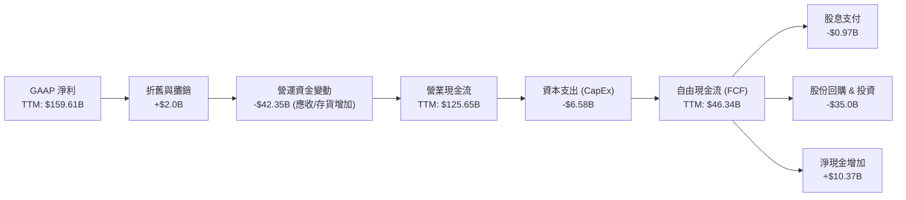

### 5.2 FCF 轉換率趨勢

| 財務年度 | 營業現金流 (B) | 資本支出 (B) | 自由現金流 (FCF) (B) | FCF / Net Income (轉換率) | 評估 |
|---|---|---|---|---|---|
| **FY2024** | $28.09B | -$1.07B | $27.02B | 90.8% | 🟢 極佳 |
| **FY2025** | $64.09B | -$3.24B | $60.85B | 83.5% | 🟢 極佳 |
| **FY2026** | $102.72B | -$6.04B | $96.68B | 80.5% | 🟢 極佳 |
| **TTM** | $125.65B | -$6.58B | $46.34B | **29.0%** | 🟡 營運資金佔用 |

*深入分析：TTM FCF 的下降主要是由於 Q1 2027 單季營運資金變動高達 -$42.35B。這是因為 Blackwell 架構晶片量產需要向台積電預付產能訂金，且大量晶片處於出貨在途狀態（應收帳款上升）。這屬於典型的「幸福的煩惱」，預計在接下來的 2-3 個季度，隨著 Blackwell 順利交付，FCF 轉換率將重新回升至 80% 以上。*

### 5.3 自由現金流趨勢

```
╔══════════════════════════════════════════════════════════════════╗
║               NVDA 歷年自由現金流 (FCF) 趨勢                     ║
╠══════════════════════════════════════════════════════════════════╣
║                                                                  ║
║  FY2024  $27.02B   █████░░░░░░░░░░░░░░░░░░░░░░  FCF Yield: 0.5%  ║
║  FY2025  $60.85B   ████████████░░░░░░░░░░░░░░░  FCF Yield: 1.2%  ║
║  FY2026  $96.68B   ████████████████████░░░░░░░  FCF Yield: 2.0%  ║
║  TTM     $46.34B   █████████░░░░░░░░░░░░░░░░░░  FCF Yield: 0.94% ║
║                                                                  ║
╚══════════════════════════════════════════════════════════════════╝
```

### 5.4 資本配置評估

NVIDIA 在資本分配上採取了「研發優先，回購並重」的策略。

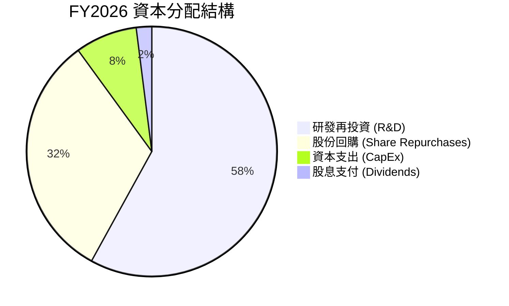

*資本配置評價：NVIDIA 是一家典型的輕資產（Fabless）半導體公司，其 CapEx 佔比極低（僅 8%）。這使其能將高達 58% 的可用資金投入 R&D，並將剩餘的現金（32%）用於股份回購。FY2026 股份回購金額超過 $20B，有效抵消了員工股權激勵（SBC）帶來的稀釋，維護了股東權益。*

---

## 6. 獲利能力與資本效率

### 6.1 ROE / ROA / ROIC 趨勢

NVIDIA 的資本回報率在美股大型科技股中名列前茅，展現了極其恐怖的資本增值效率。

| 指標 | FY2024 | FY2025 | FY2026 | TTM | 行業均值 | 評估 |
|---|---|---|---|---|---|---|
| **ROE (股東權益報酬率)** | 69.2% | 91.9% | 76.3% | **114.3%** | ~15.0% | 🟢 卓越。每一美元股東權益產生 1.14 美元淨利。 |
| **ROA (資產報酬率)** | 45.3% | 65.3% | 58.1% | **52.7%** | ~8.0% | 🟢 卓越。資產利用效率極高。 |
| **ROIC (投入資本回報率)** | 62.4% | 88.5% | 74.2% | **116.9%** | ~12.0% | 🟢 卓越。核心業務創造現金回報能力極強。 |

### 6.2 ROIC vs WACC 分析（核心價值創造判斷）

為了判斷 NVIDIA 是在「創造價值」還是在「摧毀股東價值」，我們進行了 ROIC vs WACC 的深度建模分析。

```
╔══════════════════════════════════════════════════════════════════╗
║                ROIC vs WACC 深度分析 (TTM)                      ║
╠══════════════════════════════════════════════════════════════════╣
║                                                                  ║
║  WACC 估算：                                                     ║
║  ├── 無風險利率（10Y美債）：  4.20%                              ║
║  ├── 市場風險溢酬 (ERP)：     5.00%                              ║
║  ├── Beta：                   2.211                              ║
║  ├── 股權成本 = 4.2% + 2.211 × 5.0% = 15.26%                     ║
║  ├── 債務成本（稅後）：       ~3.82%                             ║
║  ├── 資本結構：股權 99.74%，債務 0.26%                           ║
║  └── ✅ WACC ≈ 15.23%                                            ║
║                                                                  ║
║  ROIC 估算：                                                     ║
║  ├── TTM 營業利潤 (EBIT) = $162.29B                              ║
║  ├── TTM 有效稅率 = 15.75%                                       ║
║  ├── NOPAT (稅後淨營業利潤) = $162.29B × (1-15.75%) ≈ $136.73B    ║
║  ├── 投入資本 = 股東權益 + 總債務 - 現金                         ║
║  │   = $157.29B + $12.81B - $53.17B = $116.93B                   ║
║  └── ✅ ROIC ≈ 116.93%                                           ║
║                                                                  ║
║  ★ 經濟價值增加（EVA）= ROIC - WACC = +101.70%                   ║
║                                                                  ║
║  ROIC  116.9% ▓▓▓▓▓▓▓▓▓▓▓▓▓▓▓▓▓▓▓▓▓▓▓▓▓▓▓▓▓░  🟢              ║
║  WACC  15.2%  ▓▓▓▓░░░░░░░░░░░░░░░░░░░░░░░░░░░  ──              ║
║  EVA   +101.7% ████████████████████████████░░  🏆 強力價值創造  ║
║                                                                  ║
║  📊 結論：ROIC 達 WACC 的 7.7 倍，強力創造股東價值。             ║
╚══════════════════════════════════════════════════════════════════╝
```

*分析：WACC（加權平均資本成本）為 15.23%，這在科技股中偏高，主因是 NVDA 的 Beta 達 2.211。然而，其 ROIC 高達 116.93%，產生的超額回報（EVA Spread）高達 101.70%。這意味著 NVIDIA 正在以極其驚人的速度為股東複利累積財富，這也是其股價能獲得溢價的最核心基本面支撐。*

### 6.3 杜邦三因素分解

透過杜邦分析，我們可以拆解 NVIDIA ROE 暴增至 114.3% 的底層驅動因素：

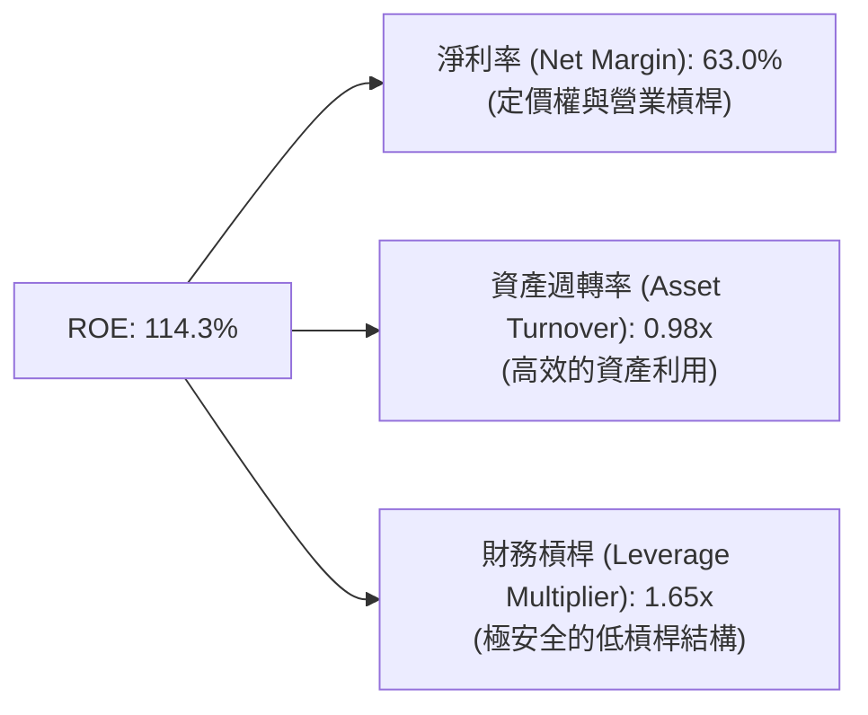

*杜邦分析結論：NVIDIA 的高 ROE（114.3%）是**極其健康的結構**。它並非依靠高財務槓桿（僅 1.65x）來放大回報，而是完全由**高淨利率（63.0%）**與**高資產週轉率（0.98x）**雙輪驅動。這說明公司在不承擔財務風險的前提下，憑藉極強的產品競爭力實現了超高獲利。*

### 6.4 獲利能力儀表板

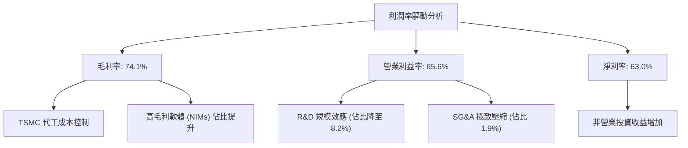

---

## 7. 估值深度分析

### 7.1 同業估值比較表格

我們選取了半導體與 AI 領域最直接的競爭對手：AMD（主要 GPU 挑戰者）、AVGO（博通，客製化 ASIC 與網路晶片龍頭）以及 INTC（英特爾）進行對比。

| 估值指標 | **NVDA (本公司)** | **AMD** | **AVGO** | **INTC** | 本公司評估 |
|---|---|---|---|---|---|
| **Trailing P/E** | 31.06x | 125.40x | 62.10x | 28.50x | 🟢 便宜。遠低於 AMD，反映當前獲利已被充分證實。 |
| **Forward P/E** | **15.81x** | **32.40x** | **24.50x** | **18.20x** | 🟢 極便宜。考量到其 85% 的成長率，此倍數極具吸引力。 |
| **P/S Ratio** | 19.38x | 10.50x | 14.80x | 2.10x | 🟡 偏高。反映市場對其高營收規模給予溢價。 |
| **EV / EBITDA** | 29.41x | 48.20x | 26.80x | 11.50x | 🟢 合理。與博通相當，遠低於 AMD。 |
| **PEG Ratio** | **0.56** | **1.85** | **1.60** | **2.20** | 🟢 極具優勢。低於 1.0 代表成長性未被完全定價。 |
| **ROE** | **114.3%** | 3.8% | 18.5% | 2.1% | 🟢 絕對領先。資本回報效率碾壓同業。 |

### 7.2 歷史估值區間分析

NVIDIA 歷史 P/E 區間在過去 5 年中波動極大（30x - 120x）。當前 Trailing P/E 為 **31.06x**，處於過去 5 年歷史估值區間的 **下四分位數（接近歷史底部）**。這主要是因為其 EPS 增速（TTM YoY +214.5%）遠超股價漲幅。

### 7.3 情境目標價（假設驅動，Bear / Base / Bull）

我們基於未來 3 年的財務預測，建立三種情境估值模型。

| 情境 | 3年營收 CAGR | 基準營業利潤率 | 退出倍數 (Forward PE) | 隱含目標價 | 相對現價漲跌幅 | 觸發條件 |
|---|---|---|---|---|---|---|
| 🔴 **悲觀** | 20.0% | 55.0% | 14.0x | **$180.00** | -11.2% | AI 投資熱潮降溫，Hyperscalers 砍單，估值收縮。 |
| 🟡 **基準** | **45.0%** | **65.0%** | **23.5x** | **$302.31** | **+49.1%** | Blackwell 順利放量，主權 AI 與企業級 AI 持續增長。 |
| 🟢 **樂觀** | 65.0% | 70.0% | 35.0x | **$500.00** | +146.5% | Blackwell 供不應求，軟體營收佔比突破 10%，利潤率再創新高。 |

*估值倍數選擇說明：我們優先採用 **Forward P/E** 與 **EV/EBITDA** 作為核心估值工具。由於 NVIDIA 擁有極高的折舊前利潤（EBITDA Margin 65.3%）與輕資產特性，EV/EBITDA 能更真實反映其企業營運價值；而 Forward P/E（15.81x）則直接考量了未來一年的高盈餘成長性。*

### 7.4 DCF 敏感性分析（6格目標價矩陣）

基於永續增長率 $g = 3.5\%$，我們對 WACC 與營收增長情境進行敏感性分析，得出以下 12M 目標價矩陣：

| 營收成長情境 ｜ WACC 假設 | WACC = 14.0% | **WACC = 15.2% (基準)** | WACC = 16.5% |
|---|---|---|---|
| 🟢 **樂觀成長 (CAGR 65%)** | $535 (+163.8%) | **$500 (+146.5%)** | $455 (+124.3%) |
| 🟡 **基準成長 (CAGR 45%)** | $328 (+61.7%) | **$302.31 (+49.1%)** | $275 (+35.6%) |
| 🔴 **悲觀成長 (CAGR 20%)** | $195 (-3.8%) | **$180 (-11.2%)** | $162 (-20.1%) |

### 7.5 估值綜合區間

```
當前股價: $202.81
估值區間:
$162 ════════════ $202.81 ══════════════════ $302.31 ══════════════════════════ $500
[悲觀下限]        [當前股價]                [基準目標]                         [樂觀上限]
```

---

## 8. 成長催化劑

NVIDIA 未來的成長並非單純依賴現有的 Hopper（H100/H200）晶片，而是由多個結構性催化劑驅動。

### 8.1 催化劑時間軸

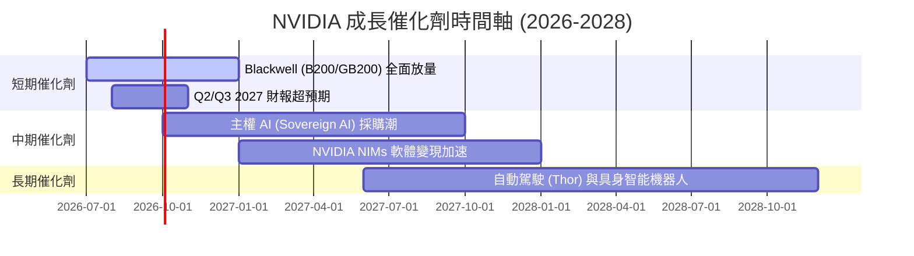

### 8.2 TAM 市場規模分析

NVIDIA 的潛在可尋址市場（TAM）正在隨著 AI 滲透到各行各業而急劇擴大：

```
╔══════════════════════════════════════════════════════════════════╗
║               NVIDIA 2028年 TAM 預估與滲透率                     ║
╠══════════════════════════════════════════════════════════════════╣
║                                                                  ║
║  數據中心晶片與網路 (TAM: $400B)                                 ║
║  ├── 當前滲透率：~50%                                            ║
║  └── 預估 2028 貢獻營收：$250B+                                  ║
║                                                                  ║
║  企業級 AI 軟體 (NIMs) (TAM: $150B)                              ║
║  ├── 當前滲透率：< 5%                                            ║
║  └── 預估 2028 貢獻營收：$25B+                                   ║
║                                                                  ║
║  自動駕駛與機器人 (TAM: $100B)                                   ║
║  ├── 當前滲透率：~10%                                            ║
║  └── 預估 2028 貢獻營收：$15B+                                   ║
║                                                                  ║
╚══════════════════════════════════════════════════════════════════╝
```

### 8.3 成長驅動力結構圖

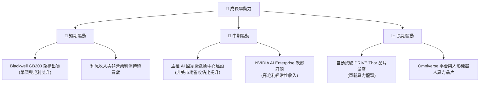

---

## 9. 風險矩陣

### 9.1 風險評分矩陣

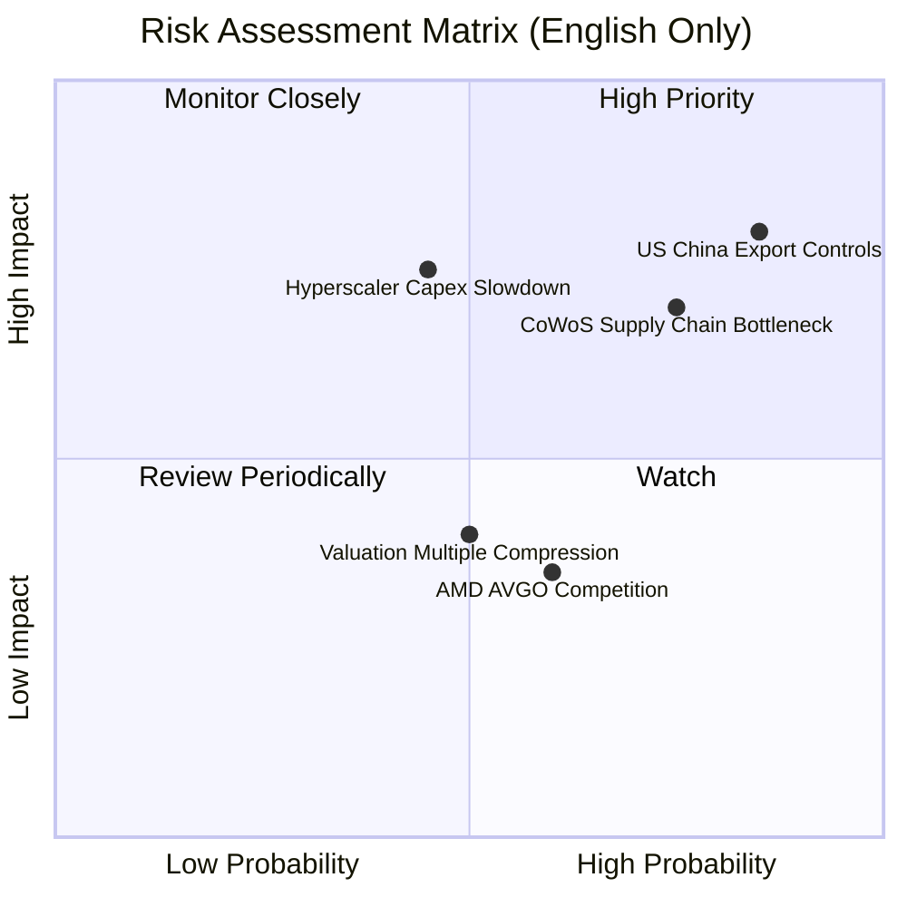

### 9.2 風險清單詳細分析

| # | 風險項目 | 發生機率 | 財務衝擊 | 風險評分 | 緩解措施 |
|---|---|---|---|---|---|
| 1 | 🔴 **美中出口管制加劇** | 高 (85%) | 高 (-12% 營收) | **8.5 / 10** | 推出符合合規要求的定制版晶片（如 H20），並積極開拓歐洲、中東及亞太等非美/非中市場（主權 AI）。 |
| 2 | 🔴 **CoWoS 封裝產能瓶頸** | 中高 (75%) | 中高 (-8% 出貨量) | **7.5 / 10** | 與台積電深度綁定取得優先產能，同時將日月光、Amkor 等封裝廠納入非核心產品供應鏈。 |
| 3 | 🟡 **大客戶 AI 投資放緩** | 中 (45%) | 高 (-15% 營收) | **6.7 / 10** | 從硬體銷售轉向「軟體+服務」模式，推廣 NVIDIA AI Enterprise，降低對單一硬體採購週期的依賴。 |
| 4 | 🟡 **競爭對手（AMD/ASIC）蠶食**| 中 (60%) | 中 (-5% 市佔率) | **5.5 / 10** | 持續保持「一年一迭代」的研發節奏，利用 CUDA 軟體生態的極高轉換成本鎖定開發者。 |

---

## 10. 投資建議

### 10.1 最終綜合評級

```
╔══════════════════════════════════════════════════════════════╗
║                    NVDA 最終綜合評級                         ║
╠══════════════════════════════════════════════════════════════╣
║ 基本面強度  9.5  ▓▓▓▓▓▓▓▓▓▓▓▓▓▓▓▓▓▓▓░  ★★★★★           ║
║ 成長動能    9.8  ▓▓▓▓▓▓▓▓▓▓▓▓▓▓▓▓▓▓▓▓  ★★★★★           ║
║ 財務健康度  9.5  ▓▓▓▓▓▓▓▓▓▓▓▓▓▓▓▓▓▓▓░  ★★★★★           ║
║ 估值吸引力  7.2  ▓▓▓▓▓▓▓▓▓▓▓▓▓▓░░░░░░  ★★★☆☆           ║
║ 資本效率    9.9  ▓▓▓▓▓▓▓▓▓▓▓▓▓▓▓▓▓▓▓▓  ★★★★★           ║
╠══════════════════════════════════════════════════════════════╣
║ 綜合總分    9.1  ▓▓▓▓▓▓▓▓▓▓▓▓▓▓▓▓▓▓░░  🏆 強烈建議買入      ║
╚══════════════════════════════════════════════════════════════╝
```

### 10.2 目標價與隱含報酬率

| 情境 | 權重機率 | 目標價 | 當前股價 | 隱含報酬率 |
|---|---|---|---|---|
| 🔴 **悲觀情境** | 15% | $180.00 | $202.81 | -11.2% |
| 🟡 **基準情境** | **60%** | **$302.31** | **$202.81** | **+49.1%** |
| 🟢 **樂觀情境** | 25% | $500.00 | $202.81 | +146.5% |
| **期望值加權目標價** | **100%** | **$333.39** | **$202.81** | **+64.4%** |

### 10.3 買入時機與觸發因素

```
╔══════════════════════════════════════════════════════════════════╗
║                  ✅ NVDA 買入觸發因素 Checklist                  ║
╠══════════════════════════════════════════════════════════════════╣
║                                                                  ║
║  立即買入觸發條件（多數符合）：                                  ║
║  ✅ Forward P/E 跌破 18x（當前為 15.81x，已符合）                ║
║  ✅ 季度營收 YoY 增速維持在 50% 以上（當前 85.23%，已符合）      ║
║  ✅ 毛利率維持在 70% 以上（當前 74.1%，已符合）                  ║
║                                                                  ║
║  加碼觸發條件（出現以下任一）：                                  ║
║  ☐ Blackwell 晶片在 Q3 財報確認無延遲且大批量出貨                ║
║  ☐ 股價因市場系統性風險回檔至 $180-$190 區間                     ║
║  ☐ 宣佈更大規模的股份回購計劃（>$50B）                           ║
║                                                                  ║
║  減碼/停損觸發條件（出現以下任一）：                             ║
║  ☐ 數據中心單季營收出現 QoQ 負增長                              ║
║  ☐ 營業利潤率連續兩季跌破 55%                                    ║
║  ☐ 主要客戶（如 Microsoft/Meta）公開宣佈削減 2027 年 AI CapEx   ║
║                                                                  ║
╚══════════════════════════════════════════════════════════════════╝
```

### 10.4 投資人適配度分析

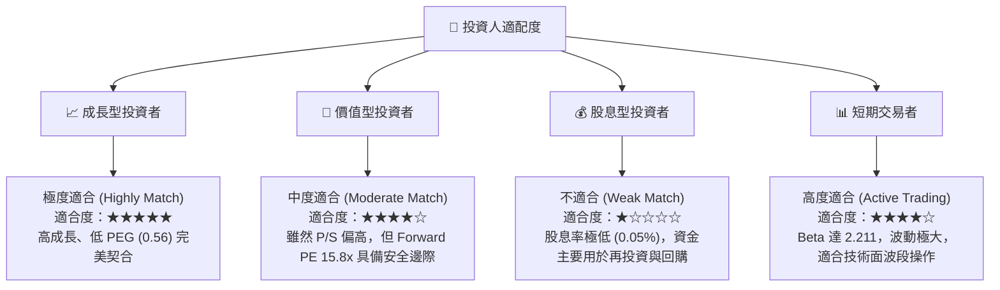

### 10.5 每季財報監控清單（Quarterly Watch List）

為了確保投資論點持續成立，投資人應在每季財報中追蹤以下關鍵指標：

| 監控指標 | 當前基準值 (Q1 2027) | 觸發「加碼」門檻 | 觸發「減碼/警示」門檻 | 追蹤核心邏輯 |
|---|---|---|---|---|
| **數據中心營收 YoY** | ~85% | > 60% | < 30% | 判斷 AI 基礎設施需求是否出現結構性失速。 |
| **整體毛利率 (Gross Margin)**| 74.1% | > 75.0% | < 68.0% | 評估定價權是否受 AMD 競爭或台積電代工漲價侵蝕。 |
| **存貨 (Inventory) 走勢** | $25.80B | 穩定或下降（代表 Blackwell 順利交付變現） | 持續暴增至 >$35B 且營收未增（代表 Blackwell 出現滯銷或設計缺陷） | 監控供應鏈管理與 Blackwell 放量進度。 |
| **經常性軟體營收年化 (ARR)** | 估計 ~$2B | > $4B | < $1B | 驗證 NVIDIA 能否成功從「硬體商」轉型為「平台商」。 |
| **前四大客戶營收集中度** | ~40% | 下降（代表企業與主權客戶多元化成功） | 上升至 >55%（客戶流失風險極高） | 評估客戶集中度風險。 |

### 10.6 反面論證：什麼會證明論點錯誤（What Would Change My Mind）

```
╔══════════════════════════════════════════════════════════════════╗
║              ⚠️ 論點失效條件（Disconfirming Evidence）           ║
╠══════════════════════════════════════════════════════════════════╣
║  本投資論點在下列情況成立時應重新檢視或果斷退出：                ║
║                                                                  ║
║  ☐ 數據中心營收連續兩季出現環比（QoQ）衰退。                     ║
║  ☐ 營業利潤率（Operating Margin）因價格戰較峰值收縮 > 10 pp。    ║
║  ☐ 自由現金流（FCF）轉負，或 FCF 淨利轉換率連續三季 < 20%。       ║
║  ☐ ROIC 跌破 30%（雖然仍高於 WACC，但說明資本回報率均值回歸）。   ║
║  ☐ 核心超大型客戶（如 Microsoft/AWS）宣佈其自研 ASIC 晶片        ║
║     在主流 LLM 訓練中的市佔率超越 NVIDIA（護城河被攻破）。       ║
║                                                                  ║
╚══════════════════════════════════════════════════════════════════╝
```

---

> **免責聲明**：本報告為 AI 自動生成，僅供研究參考，不構成投資建議。投資有風險，入市需謹慎。