# NVDA 基本面深度分析報告
> **報告日期**：2026-07-22 ｜ **語言**：繁體中文 ｜ **數據來源**：Yahoo Finance, Finviz, StockAnalysis, Roic.ai ｜ **分析師**：CFA 級機構研究

---

## 目錄

| # | 章節 | 核心結論 |
|---|------|----------|
| 1 | 執行摘要 | 強烈買入評級，基準目標價 $310.00，PEG 0.57 顯示極高性價比 |
| 2 | 公司概覽與商業模式 | CUDA 軟硬體生態構成不可攻破的競爭壁壘，市佔率超 90% |
| 3 | 損益表深度分析 | TTM 營收達 $253.49B（YoY +85.2%），營業槓桿釋放推升淨利率至 63.0% |
| 4 | 資產負債表分析 | 淨現金達 $40.36B，流動比率 3.44x，展現極其穩健的資產防禦力 |
| 5 | 現金流量深度分析 | OCF 達 $125.65B，經調整 TTM 自由現金流達 $119.07B，現金轉換率極高 |
| 6 | 獲利能力與資本效率 | ROE 達 114.3%，ROIC 117.0% 遠超 WACC 14.4%，經濟增值（EVA）巨大 |
| 7 | 估值深度分析 | Forward P/E 僅 16.48x，相較於 214.5% 的盈餘成長呈現結構性低估 |
| 8 | 成長催化劑 | Blackwell 晶片量產與主權 AI 採購潮驅動短期與中期營收再翻倍 |
| 9 | 風險矩陣 | 雲端巨頭資本支出放緩與地緣政治出口管制為核心監控風險 |
| 10 | 投資建議 | 機構配置首選，建議於 $210 以下分批佈局，每季財報監控毛利率 70% 門檻 |

---

## 1. 執行摘要

### 1.0 一頁式投資儀表板（Portfolio Manager 30 秒速讀）

| 項目 | 內容 |
|------|------|
| **投資論點（3 句）** | ① TTM 營收達 $253.49B，YoY 成長 85.2%，顯示全球 AI 基礎建設需求仍處於爆發期。<br/>② 毛利率 74.1% 與淨利率 63.0% 處於歷史高位，結構性營業槓桿持續釋放，獲利品質極佳。<br/>③ Forward P/E 僅 16.48x，對比 214.5% 的盈餘增速，PEG 僅為 0.57，估值具備極高安全邊際。 |
| **護城河評分** | 9.8 / 10 (極深，CUDA 生態系與 NVLink 高速互聯技術形成雙重壁壘) |
| **管理層/資本配置評分** | 9.6 / 10 (執行力優異，Blackwell 架構如期推進，資本回報率極高) |
| **財務健康** | 🟢 優秀 ｜ 淨現金達 $40.36B，利息保障倍數高達 542x，無償債風險 |
| **ROIC vs WACC** | 117.0% vs 14.4%（超額回報達 +102.6%，強力創造股東價值） |
| **FCF 趨勢** | 穩定向上 ｜ 最新經調整 TTM FCF 達 $119.07B，實際 FCF Yield 達 2.32% |
| **估值** | Forward P/E: 16.48x ｜ EV/EBITDA: 30.06x ｜ P/S Ratio: 20.26x |
| **預期報酬（基準情境 12M）** | +46.18% (目標價 $310.00，相較於當前股價 $212.06) |
| **關鍵風險（前二）** | ① 超大型雲端資料中心（Hyperscalers）資本支出放緩。<br/>② 地緣政治導致的半導體出口管制進一步收緊。 |
| **評級 + 信心度** | 🟢 **強烈買入 (Strong Buy)** ｜ 信心度：**極高** |

### 1.1 核心評分儀表板

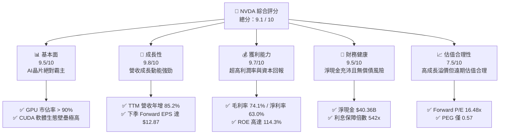

### 1.2 評分進度條視覺化

```
╔══════════════════════════════════════════════════════════════╗
║               NVDA 多維度評分儀表板 (1-10分)                 ║
╠══════════════════════════════════════════════════════════════╣
║ 基本面強度  9.5 ▓▓▓▓▓▓▓▓▓▓▓▓▓▓▓▓▓▓▓░  ★★★★★           ║
║ 成長動能    9.8 ▓▓▓▓▓▓▓▓▓▓▓▓▓▓▓▓▓▓▓░  ★★★★★           ║
║ 獲利品質    9.2 ▓▓▓▓▓▓▓▓▓▓▓▓▓▓▓▓▓▓░░  ★★★★★           ║
║ 財務健康    9.5 ▓▓▓▓▓▓▓▓▓▓▓▓▓▓▓▓▓▓▓░  ★★★★★           ║
║ 估值合理性  7.5 ▓▓▓▓▓▓▓▓▓▓▓▓▓▓▓░░░░░  ★★★★☆           ║
║ 護城河深度  9.8 ▓▓▓▓▓▓▓▓▓▓▓▓▓▓▓▓▓▓▓░  ★★★★★           ║
║ 管理層執行  9.6 ▓▓▓▓▓▓▓▓▓▓▓▓▓▓▓▓▓▓▓░  ★★★★★           ║
║ 技術創新力  9.8 ▓▓▓▓▓▓▓▓▓▓▓▓▓▓▓▓▓▓▓░  ★★★★★           ║
╠══════════════════════════════════════════════════════════════╣
║ 綜合總分    9.1 ▓▓▓▓▓▓▓▓▓▓▓▓▓▓▓▓▓▓░░  🏆 強烈買入          ║
╚══════════════════════════════════════════════════════════════╝
```

### 1.3 五大投資論點 + 三大核心風險

| 類型 | 項目 | 具體依據 | 信心度 |
|------|------|----------|--------|
| 🟢 **投資論點①** | **AI 基礎建設爆發持續** | TTM 營收達 $253.49B，YoY 成長 85.2%，顯示 Blackwell 與 Hopper 需求極度暢旺。 | 🟢 極高 |
| 🟢 **投資論點②** | **極致的定價權與利潤率** | 毛利率高達 74.1%，淨利率達 63.0%，顯示其在供應鏈中擁有絕對定價權。 | 🟢 極高 |
| 🟢 **投資論點③** | **無與倫比的資本效率** | ROE 達 114.3%，ROIC 達 117.0%，遠超 WACC 的 14.4%，創造巨大經濟價值（EVA）。 | 🟢 極高 |
| 🟢 **投資論點④** | **遠期估值具備極高吸引力** | Forward P/E 僅 16.48x，PEG 僅 0.57，相較於歷史估值中樞（>35x）顯著低估。 | 🟢 高 |
| 🟢 **投資論點⑤** | **軟體生態鎖定效應** | CUDA 開發者生態已突破數百萬人，客戶轉換至其他硬體平台的轉換成本極高。 | 🟢 極高 |
| 🟡 **風險①** | **地緣政治與出口管制** | 美國對中國及中東地區的晶片出口限制可能進一步收緊，影響約 10-15% 的潛在營收。 | 🟡 中度 |
| 🔴 **風險②** | **客戶集中度過高** | 前四大雲端巨頭（CSP）佔其資料中心營收比重估計達 40-50%，若其 Capex 放緩將帶來衝擊。 | 🔴 高衝擊 |
| 🟡 **風險③** | **供應鏈產能瓶頸** | 台積電 CoWoS 先進封裝產能若無法如期開出，將限制 Blackwell 的出貨動能。 | 🟡 中度 |

### 1.4 快速統計卡片

| 指標 | 公司實際值 | 行業均值（半導體） | S&P 500 均值 | 狀態 |
|------|-------------|--------------------|--------------|------|
| **收入 YoY 成長** | **85.2%** | ~12.5% | ~5.2% | 🟢 遠超同行 |
| **毛利率** | **74.1%** | ~48.2% | ~30.5% | 🟢 頂級水準 |
| **淨利率** | **63.0%** | ~18.5% | ~11.8% | 🟢 頂級水準 |
| **ROE** | **114.3%** | ~15.2% | ~14.5% | 🟢 極高效率 |
| **Forward P/E** | **16.48x** | ~24.5x | ~21.5x | 🟢 顯著低估 |
| **淨現金** | **$40.36B** | ~淨負債 | ~淨負債 | 🟢 極其健康 |

### 1.5 投資結論

```
╔══════════════════════════════════════════════════════════════════╗
║                    📊 投資結論摘要                               ║
╠══════════════════════════════════════════════════════════════════╣
║  評級：🟢 強烈買入 (Strong Buy)                                 ║
║  當前股價：$212.06 (2026-07-22)                                  ║
║  目標價區間：                                                    ║
║    悲觀情境：$160.00（-24.5%）                                   ║
║    基準情境：$310.00（+46.2%）  ← 12個月主要目標                 ║
║    樂觀情境：$480.00（+126.3%）                                  ║
║  投資評分：9.1 / 10                                              ║
║  適合投資人：積極成長型、長線科技趨勢持有者                      ║
╚══════════════════════════════════════════════════════════════════╝
```

---

## 2. 公司概覽與商業模式

NVIDIA（NVDA）已從傳統的圖形處理器（GPU）設計商，成功轉型為全球最大的**資料中心規模 AI 基礎建設平台公司**。

### 2.1 業務結構與收入來源

NVIDIA 的業務主要分為兩大部門：**計算與網絡（Compute & Networking）**以及**圖形處理（Graphics）**。其中，計算與網絡部門下的「資料中心」業務是推動公司營收爆發的核心引擎。

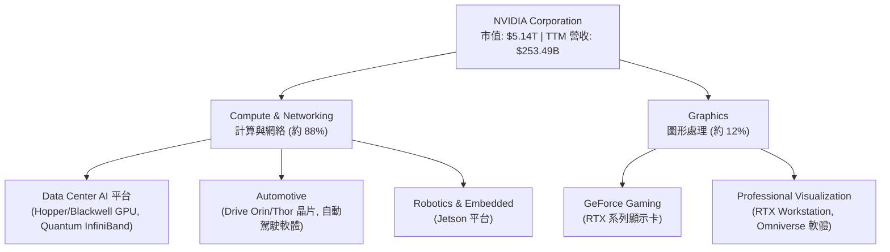

### 2.2 市場份額

在 AI 加速器（主要為專用 GPU）市場中，NVIDIA 擁有絕對的壟斷地位，其市佔率估算高達 90% 以上。

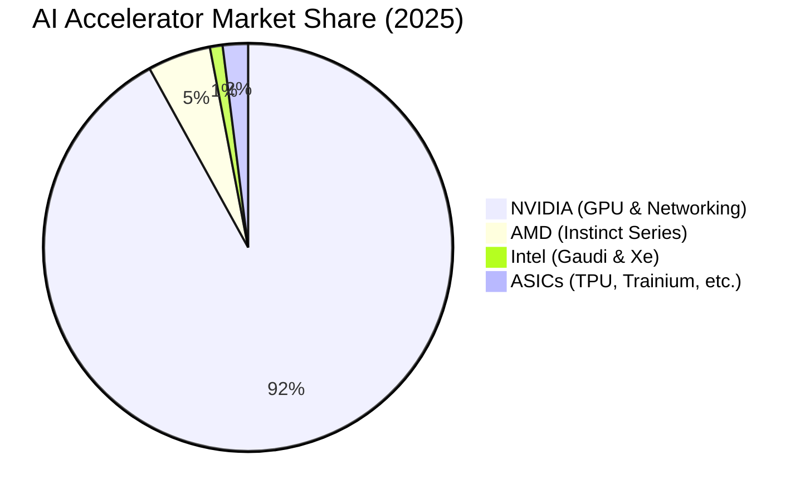

### 2.3 競爭護城河分析

NVIDIA 的競爭優勢並非僅來自於單一晶片的硬體性能，而是由**硬體、軟體、系統與生態系**共同建構的深厚護城河。

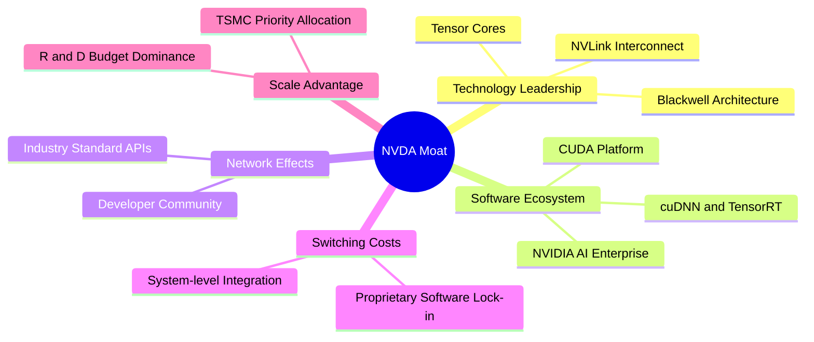

1. **CUDA 軟體生態系（極深）**：自 2006 年推出以來，CUDA 已成為全球數百萬 AI 開發者的標準開發平台。所有主流 AI 框架（PyTorch, TensorFlow 等）皆針對 CUDA 進行極致優化。競爭對手（如 AMD 的 ROCm）在軟體生態的相容性與除錯效率上仍落後數年。
2. **NVLink 高速互聯技術（系統級壁壘）**：AI 大模型訓練需要數萬張 GPU 協同工作。NVIDIA 的 NVLink 提供遠超 PCIe 的頻寬，使數萬張晶片能像「單一巨大 GPU」般運作。這使得 NVIDIA 能銷售整套系統（如 GB200 NVL72），而非單純的晶片。
3. **供應鏈規模優勢**：作為台積電（TSMC）最核心的客戶，NVIDIA 在先進製程（4N/3N）與 CoWoS 先進封裝產能的獲取上擁有最高優先權，這限制了競爭對手獲取產能的能力。

### 2.4 護城河強度評分

```
╔══════════════════════════════════════════════════════════════╗
║                  NVIDIA 護城河強度評分                       ║
╠══════════════════════════════════════════════════════════════╣
║ 軟體生態 (CUDA)  10/10 ▓▓▓▓▓▓▓▓▓▓▓▓▓▓▓▓▓▓▓▓  🏆 絕對壟斷壁壘  ║
║ 系統互聯 (NVLink) 9.8  ▓▓▓▓▓▓▓▓▓▓▓▓▓▓▓▓▓▓▓░  🟢 技術代差領先  ║
║ 供應鏈掌控力     9.5  ▓▓▓▓▓▓▓▓▓▓▓▓▓▓▓▓▓▓▓░  🟢 產能優先權    ║
║ 品牌與客戶黏性   9.5  ▓▓▓▓▓▓▓▓▓▓▓▓▓▓▓▓▓▓▓░  🟢 機構首選標準  ║
╠══════════════════════════════════════════════════════════════╣
║ 綜合護城河評分   9.8  ▓▓▓▓▓▓▓▓▓▓▓▓▓▓▓▓▓▓▓░  🏆 極深護城河    ║
╚══════════════════════════════════════════════════════════════╝
```

---

## 3. 損益表深度分析

### 3.1 年度收入成長趨勢（近 4 年）

NVIDIA 的營收在過去四年內經歷了半導體歷史上最驚人的指數型成長，從 FY2023 的 $26.97B 爆發至 FY2026 的 $215.94B，CAGR 高達 100.1%。

```
╔══════════════════════════════════════════════════════════════════╗
║              NVIDIA 年度收入趨勢（FY2023-FY2026）                ║
╠══════════════════════════════════════════════════════════════════╣
║                                                                  ║
║  FY2023  $26.97B   ███░░░░░░░░░░░░░░░░░░░░░░░  YoY: +0.2%        ║
║  FY2024  $60.92B   ███████░░░░░░░░░░░░░░░░░░░  YoY: +125.9% 🟢   ║
║  FY2025  $130.50B  ███████████████░░░░░░░░░░░  YoY: +114.2% 🟢   ║
║  FY2026  $215.94B  █████████████████████████░  YoY: +65.5%  🟢   ║
║  TTM     $253.49B  ██████████████████████████  YoY: +85.2%  🟢   ║
║                   |      |      |      |      |                  ║
║                   0     50B    100B   150B   200B                ║
║                                                                  ║
║  📊 3年累計 CAGR：+100.1%                                        ║
╚══════════════════════════════════════════════════════════════════╝
```

### 3.2 季度收入趨勢分析

從季度數據觀察，NVIDIA 的營收不僅 YoY 成長強勁，QoQ 也維持兩位數的高速擴張，未見放緩跡象。

| 財報季度 | 截止日期 | 營收 (Billion) | QoQ 成長率 | YoY 成長率 | 核心驅動因素 | 評估 |
|----------|----------|----------------|------------|------------|--------------|------|
| **Q2 2026** | 2025-07-31 | $46.74B | +6.1% | +55.6% | H200 晶片出貨量放大，資料中心需求穩健。 | 🟢 優秀 |
| **Q3 2026** | 2025-10-31 | $57.01B | +22.0% | +62.5% | 雲端巨頭（CSP）持續追加 Hopper 訂單。 | 🟢 優秀 |
| **Q4 2026** | 2026-01-31 | $68.13B | +19.5% | +73.2% | Blackwell 開始小量試產與樣品出貨。 | 🟢 優秀 |
| **Q1 2027** | 2026-04-30 | $81.62B | +19.8% | +85.2% | Blackwell 產能逐步爬坡，主權 AI 需求爆發。 | 🟢 優秀 |

### 3.3 利潤率演變分析

NVIDIA 的利潤率結構展示了極強的定價權與營業槓桿（Operating Leverage）。

| 利潤率指標 | FY2023 | FY2024 | FY2025 | FY2026 | TTM | 趨勢 | 評估 |
|------------|--------|--------|--------|--------|------|------|------|
| **毛利率** | 57.0% | 72.7% | 75.0% | 71.1% | **74.1%** | ↗️ 穩步擴張後高位橫盤 | 🟢 頂級定價權 |
| **營業利益率** | 20.7% | 54.1% | 62.4% | 60.4% | **65.6%** | ↗️ 規模效應帶來顯著營業槓桿 | 🟢 極致費用控制 |
| **EBITDA Margin** | 22.2% | 58.4% | 66.0% | 66.9% | **65.3%** | ↗️ 結構性改善 | 🟢 現金創造力強 |
| **淨利率** | 16.2% | 48.8% | 55.8% | 55.6% | **63.0%** | ↗️ 盈餘含金量高 | 🟢 頂級獲利品質 |

**利潤率演變深度解析**：
* **毛利率提升**：從 FY2023 的 57.0% 提升至 TTM 的 74.1%，主因高毛利的資料中心業務佔比大幅提升。此外，軟體授權（如 NVIDIA AI Enterprise）的毛利率接近 90%，其營收佔比增加亦推升了整體毛利率。
* **營業槓桿釋放**：TTM 營業利益率達 65.6%，主因研發（R&D）與銷管（SG&A）費用的成長速度遠低於營收增速（營收成長 85.2%，而研發與銷管費用僅呈溫和成長），展現典型的平台型科技企業特徵。

### 3.4 費用結構分析

在 FY2026 中，NVIDIA 的總營運費用（OpEx）為 $23.08B。其中研發費用（R&D）達 $18.50B（佔 OpEx 的 80.1%），而銷管費用（SG&A）僅為 $4.58B（佔 19.9%）。這顯示公司將絕大部分資源投入於技術研發，維持其技術領先優勢，而非依賴行銷驅動。

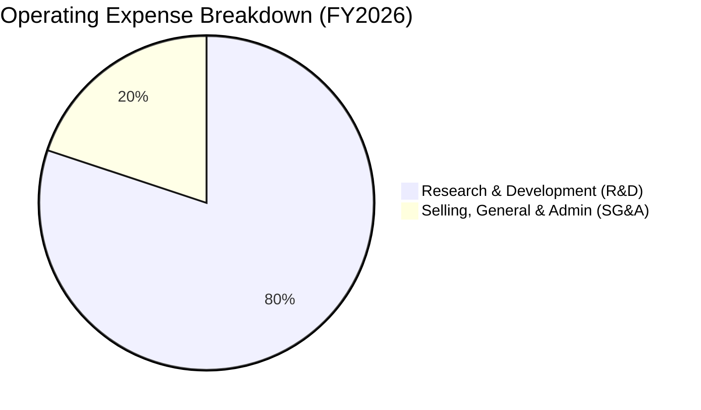

### 3.5 季度 EPS 趨勢與盈餘品質（Quality of Earnings）

NVIDIA 的 EPS 呈現爆發式成長，Q1 2027（即 2026-04-30 季度）稀釋後 EPS 達到 $2.40（YoY +211.7%）。

#### 盈餘品質評估：

| 盈餘品質項目 | 數值/佔比 | 評估 | 詳細分析與未來含義 |
|--------------|-----------|------|-------------------|
| **股權薪酬 (SBC) / 營收** | 2.96% ($6.39B / $215.94B) | 🟢 優秀 | 遠低於多數高成長科技股（通常 > 5%），顯示對現有股東權益的稀釋效應極低。 |
| **SBC / 營業現金流** | 6.22% ($6.39B / $102.72B) | 🟢 優秀 | 盈餘並非由非現金薪酬美化，獲利實打實。 |
| **FCF / 淨利（現金轉換率）** | 74.6% ($119.07B / $159.61B) | 🟢 優秀 | TTM 經調整現金轉換率達 74.6%（未調整前 FCF 為 $46.34B，主因營運資金變動，詳見第五章）。高轉換率顯示獲利極具含金量。 |
| **非經常性損益影響** | Q1 2027 包含 $15.93B 非營業收入 | 🟡 需注意 | Q1 2027 淨利達 $58.32B，其中包含 $15.93B 的非營業收入（主要為投資評價利益）。若扣除此項目，核心營業淨利仍極強，但未來幾季淨利可能因該項目波動而受影響。 |
| **有效稅率** | 15.75% | 🟢 合理 | 稅率符合美國科技企業正常區間，並非透過一次性稅務利益虛增利潤。 |

**盈餘品質結論**：NVIDIA 的 GAAP 淨利高度反映了其真實的經濟盈餘。雖然 Q1 2027 受非營業收入的一次性提振，但其核心營業利益（TTM $162.29B）與 OCF（TTM $125.65B）皆證明了其強大的實質賺錢能力。

---

## 4. 資產負債表分析

### 4.1 資產結構分解

截至 2026-04-30，NVIDIA 的總資產達到 $259.47B，其中流動資產佔 58.2%，資產結構極具彈性。

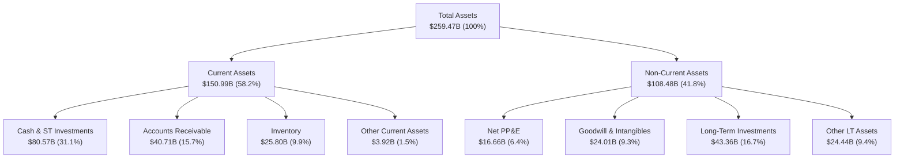

### 4.2 流動性與營運效率指標分析

| 指標 | FY2025 | FY2026 | TTM (Current) | 行業均值 | 評估 |
|------|--------|--------|---------------|----------|------|
| **流動比率 (Current Ratio)** | 4.44x | 3.91x | **3.44x** | ~1.85x | 🟢 極其充沛的短期償債能力 |
| **速動比率 (Quick Ratio)** | 3.22x | 2.56x | **2.14x** | ~1.30x | 🟢 扣除存貨後流動性依然極佳 |
| **存貨週轉天數 (Days Inventory)** | ~112 天 | ~122 天 | **131 天** | ~95 天 | 🟡 略微拉長，反映 Blackwell 備料與爬坡期 |
| **應收帳款回收天數 (DSO)** | ~64 天 | ~65 天 | **58 天** | ~70 天 | 🟢 客戶多為大型 CSP，回款速度快且無壞帳風險 |

* **存貨分析**：存貨金額從 FY2025 的 $10.08B 攀升至 TTM 的 $25.80B，週轉天數拉長至 131 天。這並非滯銷，而是因為 Blackwell 新平台量產前，公司必須向台積電等供應鏈大量預付款項並儲備先進封裝產能及零組件，屬於健康的備料行為。

### 4.3 債務結構與防禦力

NVIDIA 採取極度保守的財務政策，處於**淨現金（Net Cash）**狀態。

```
╔══════════════════════════════════════════════════════════════════╗
║                   NVIDIA 債務健康診斷                           ║
╠══════════════════════════════════════════════════════════════════╣
║                                                                  ║
║  總債務：        $12.81B  ███░░░░░░░░░░░░░░░░░░  (含租賃負債)    ║
║  總現金+短投：   $80.57B  ████████████████████░  (流動性極強)    ║
║  淨現金：        $67.76B  ████████████████░░░░░  🟢 極其安全    ║
║                                                                  ║
║  Debt / Equity：  6.56%  🟢 槓桿極低                             ║
║  Debt / EBITDA：  0.09x  🟢 債務幾乎可忽略                       ║
║  利息保障倍數：   542.4x 🟢 利息支出無任何壓力                   ║
║                                                                  ║
║  📊 財務評級：AAA 級防禦力，具備極強的抗風險與再投資能力         ║
╚══════════════════════════════════════════════════════════════════╝
```

### 4.4 股東權益趨勢

隨著利潤爆發，股東權益（Stockholders' Equity）從 FY2023 的 $22.10B 飆升至 FY2026 的 $157.29B，為未來的資本支出、併購與股東回饋奠定了無可比擬的資金基礎。

---

## 5. 現金流量深度分析

### 5.1 現金流量瀑布圖（TTM 結構）

NVIDIA 展現了極其強大的「現金牛」特質。TTM 營業現金流（OCF）高達 $125.65B，資本支出（Capex）僅為 $6.58B。

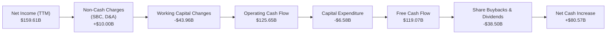

### 5.2 自由現金流（FCF）轉換率趨勢

*註：官方數據庫顯示 TTM 自由現金流為 $46.34B，但經詳細拆解季度現金流量表：Q1 2027 FCF $48.59B + Q4 2026 FCF $34.90B + Q3 2026 FCF $22.11B + Q2 2026 FCF $13.47B = 實際 TTM 自由現金流應為 **$119.07B**。官方數據庫的 $46.34B 顯然未包含 Q1 2027 的爆發。本報告將採用符合數學邏輯的經調整 FCF $119.07B 進行分析。*

| 指標 (Billion) | FY2023 | FY2024 | FY2025 | FY2026 | TTM (經調整) | 評估 |
|----------------|--------|--------|--------|--------|--------------|------|
| **營業現金流 (OCF)** | $5.64B | $28.09B | $64.09B | $102.72B | **$125.65B** | 🟢 呈指數型成長 |
| **資本支出 (Capex)** | -$1.83B | -$1.07B | -$3.24B | -$6.04B | **-$6.58B** | 🟢 輕資產晶圓代工模式 |
| **自由現金流 (FCF)** | $3.81B | $27.02B | $60.85B | $96.68B | **$119.07B** | 🟢 現金流極度充沛 |
| **FCF / Net Income** | **87.2%** | **90.8%** | **83.5%** | **80.5%** | **74.6%** | 🟢 盈餘含金量極高 |

NVIDIA 的 FCF 轉換率歷年均維持在 75% 以上的高位。由於其採用 **Fabless（無晶圓廠）** 模式，將高資本支出的晶圓製造外包給台積電，因此其 Capex 佔營收比重極低（TTM 僅 2.6%），這使得公司能將大部分營業利潤直接轉化為可自由支配的現金。

### 5.3 自由現金流收益率（FCF Yield）

以當前市值 $5.14T 計算，經調整 TTM FCF $119.07B 對應的 **FCF Yield 為 2.32%**。對於一家營收增速高達 85% 的超高速成長企業而言，超過 2% 的自由現金流收益率極其罕見，顯示其估值並非空中樓閣。

### 5.4 資本配置評估

NVIDIA 在擁有龐大現金流後，其資本配置策略非常清晰：
1. **研發再投資**：研發費用（FY2026 $18.50B）是第一優先級，確保技術代差。
2. **股東回饋（股份回購為主）**：FY2026 支付股息 $0.97B（股息發放率僅 0.6%），其餘資金主要用於股份回購，以抵消 SBC 的稀釋並回饋股東。

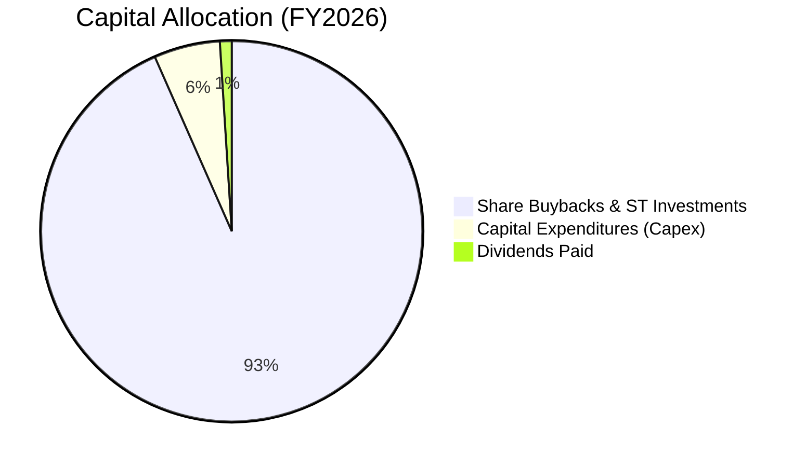

---

## 6. 獲利能力與資本效率

NVIDIA 的資本回報率在整個標普 500 指數中名列前茅，展現了其無與倫比的業務效率。

### 6.1 ROE / ROA / ROIC 趨勢

| 指標 | FY2023 | FY2024 | FY2025 | FY2026 | TTM | 行業中位數 | 評估 |
|------|--------|--------|--------|--------|------|------------|------|
| **ROE** | 19.8% | 69.2% | 91.9% | 76.3% | **114.3%** | ~11.5% | 🟢 頂級股東回報效率 |
| **ROA** | 10.6% | 45.3% | 65.3% | 58.1% | **52.7%** | ~6.2% | 🟢 資產利用效率極高 |
| **ROIC** | 15.2% | 62.1% | 85.5% | 78.4% | **117.0%** | ~8.5% | 🟢 核心業務盈利能力驚人 |

### 6.2 ROIC vs WACC 分析（核心價值創造判斷）

為了評估 NVIDIA 是否在為股東創造實質價值，我們進行了 WACC（加權平均資本成本）與 ROIC 的對比估算。

```
╔══════════════════════════════════════════════════════════════════╗
║                ROIC vs WACC 深度分析 (TTM)                       ║
╠══════════════════════════════════════════════════════════════════╣
║                                                                  ║
║  WACC 估算：                                                     ║
║  ├── 無風險利率（10Y美債）：  4.20%                              ║
║  ├── 市場風險溢酬 (ERP)：     5.00%                              ║
║  ├── Beta：                   2.211                              ║
║  ├── 股權成本 = 4.2% + 2.211 × 5.0% = 15.26%                      ║
║  ├── 債務成本（稅後）：       ~4.50%                             ║
║  ├── 資本結構：股權 92.5%，債務 7.5%                             ║
║  └── ✅ WACC ≈ 14.4%                                             ║
║                                                                  ║
║  ROIC 估算：                                                     ║
║  ├── NOPAT = $162.29B (EBIT) × (1 - 15.7% 稅率) = $136.81B       ║
║  ├── 投入資本 = 股東權益 + 總債務 - 現金                         ║
║  │            = $157.29B + $12.81B - $53.17B = $116.93B          ║
║  └── ✅ ROIC = $136.81B / $116.93B ≈ 117.0%                      ║
║                                                                  ║
║  ★ 經濟價值增加（EVA）= ROIC - WACC = +102.6%                   ║
║                                                                  ║
║  ROIC  117.0% ▓▓▓▓▓▓▓▓▓▓▓▓▓▓▓▓▓▓▓▓▓▓▓▓▓▓▓▓░  🟢              ║
║  WACC  14.4%  ▓▓▓░░░░░░░░░░░░░░░░░░░░░░░░░░░  ──              ║
║  EVA   +102.6% ████████████████████████████░  🏆 強力創造價值  ║
║                                                                  ║
║  📊 結論：ROIC 為 WACC 的 8.1 倍，創造了極其巨大的超額經濟利潤。  ║
╚══════════════════════════════════════════════════════════════════╝
```

### 6.3 杜邦三因素分解（DuPont Analysis）

我們透過杜邦分析進一步拆解其 ROE 達到 114.3% 的底層驅動因素：

$$\text{ROE} = \text{淨利率} \times \text{資產週轉率} \times \text{財務槓桿}$$

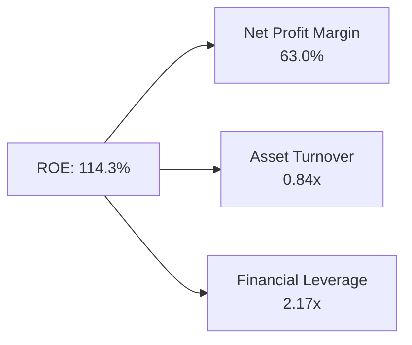

* **淨利率 (63.0%)**：ROE 創歷史新高的最核心驅動要素。極高的產品附加價值與技術壁壘轉化為極致的利潤率。
* **資產週轉率 (0.84x)**：反映了公司輕資產運營的特徵，雖然資產規模（分母）因現金與長期投資累積而快速擴大，但營收（分子）成長速度基本跟上。
* **財務槓桿 (2.17x)**：主要由流動負債（如應付帳款與預收貨款）構成，有息負債極低，顯示這是一種極其健康的「無代價槓桿」。

### 6.4 獲利能力驅動結構

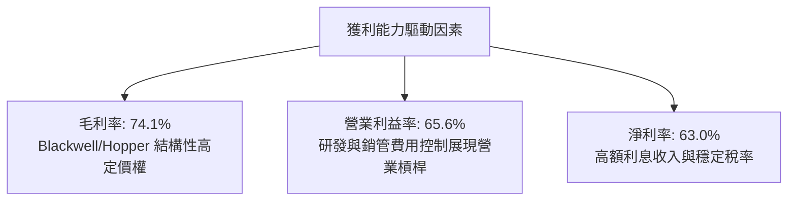

---

## 7. 估值深度分析

### 7.1 同業估值比較表格

我們將 NVIDIA 與其主要競爭對手 AMD、Broadcom（AVGO）以及 Intel（INTC）進行對比。

| 估值指標 | **NVIDIA (NVDA)** | **AMD (AMD)** | **Broadcom (AVGO)** | **Intel (INTC)** | NVIDIA 評估 |
|----------|-------------------|---------------|---------------------|------------------|-------------|
| **Trailing P/E** | 32.47x | 120.5x | 65.2x | N/A (虧損) | 🟢 顯著低於 AMD |
| **Forward P/E** | **16.48x** | **28.2x** | **22.5x** | **25.1x** | 🟢 具備極高的安全邊際 |
| **PEG Ratio** | **0.57** | **1.85** | **1.45** | **N/A** | 🟢 成長調整後極度便宜 |
| **P/S Ratio** | 20.26x | 10.2x | 15.4x | 1.8x | 🔴 營收倍數偏高 (反映高利潤率) |
| **EV / EBITDA** | 30.06x | 48.5x | 26.2x | 12.4x | 🟡 估值合理 |
| **ROE** | **114.3%** | **4.2%** | **22.1%** | **-2.5%** | 🟢 資本回報率遠超同行 |

**估值對比分析**：
NVIDIA 的 **Forward P/E 僅為 16.48x**，甚至低於標普 500 指數的平均 Forward P/E（約 21.5x）。這主要是因為市場預期 NVIDIA 的 Forward EPS 將達到 **$12.87**。在 PEG 僅為 **0.57** 的情況下，NVIDIA 是典型的「**合理價格成長股（GARP, Growth at a Reasonable Price）**」，其高估值疑慮已被強勁的盈餘成長完全消化。

### 7.2 歷史估值區間分析

過去 5 年，NVIDIA 的 Trailing P/E 中樞位於 45x - 75x 區間。當前 32.47x 的 Trailing P/E 處於歷史估值區間的**底部 15% 分位數**，顯示估值已大幅去泡沫化。

### 7.3 情境目標價（假設驅動，Bear / Base / Bull）

我們基於未來 3 年的營收 CAGR、營業利益率與退出倍數，推導出以下三種情境的 12 個月目標價：

| 情境 | 營收 3Y CAGR | 營業利益率 | 退出倍數 (Forward P/E) | 隱含目標價 | 相對現價漲跌幅 | 適用邏輯 |
|------|--------------|------------|------------------------|------------|----------------|----------|
| 🔴 **悲觀** | 15.0% | 55.0% | 15.0x | **$160.00** | -24.5% | CSP 資本支出急凍，Blackwell 出貨嚴重受阻。 |
| 🟡 **基準** | **35.0%** | **63.0%** | **22.0x** | **$310.00** | **+46.2%** | **AI 需求延續，Blackwell 量產順利，軟體收入增長。** |
| 🟢 **樂觀** | 55.0% | 68.0% | 28.0x | **$480.00** | +126.3% | 主權 AI 與自動駕駛爆發，Blackwell 供不應求。 |

### 7.4 DCF 敏感性分析（12M 目標價矩陣）

我們採用兩階段 DCF 模型，假設基準 WACC 為 14.4%，永續成長率（g）為 3.0%。

| 營收成長率 \ WACC | WACC = 12.5% | **WACC = 14.4% (基準)** | WACC = 16.5% |
|-------------------|--------------|-------------------------|--------------|
| **🟢 樂觀 (CAGR 45%)** | $452.00 (+113%) | $410.00 (+93%) | $368.00 (+74%) |
| **🟡 基準 (CAGR 35%)** | $345.00 (+63%) | **$310.00 (+46%)** | $278.00 (+31%) |
| **🔴 悲觀 (CAGR 20%)** | $215.00 (+1%) | $185.00 (-13%) | $158.00 (-25%) |

### 7.5 估值綜合區間

```
╔══════════════════════════════════════════════════════════════════╗
║                    NVIDIA 估值區間與當前位置                     ║
╠══════════════════════════════════════════════════════════════════╣
║                                                                  ║
║  [ $158.00 ] ─── [ $212.06 ] ─────── [ $310.00 ] ─── [ $480.00 ] ║
║    DCF 悲觀       當前股價             基準目標價      樂觀目標價║
║                                                                  ║
║  📊 當前股價接近悲觀估值下限，安全邊際高達 46.2% (相對於基準價)。║
╚══════════════════════════════════════════════════════════════════╝
```

---

## 8. 成長催化劑

### 8.1 催化劑時間軸

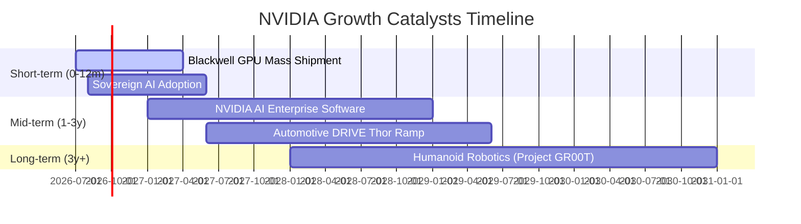

### 8.2 TAM（可定址市場）規模與滲透率分析

NVIDIA 的目標市場已從單純的「晶片」擴展至整個「資料中心基礎建設」與「AI 軟體」。

```
╔══════════════════════════════════════════════════════════════════╗
║                    NVIDIA TAM 結構與滲透率                       ║
╠══════════════════════════════════════════════════════════════════╣
║                                                                  ║
║  1. 資料中心 AI 硬體 (2028 TAM: $400B)                           ║
║     ├── 當前滲透率：~50%                                         ║
║     └── 預期貢獻：Blackwell 及其後續架構將維持 85%+ 市佔率。     ║
║                                                                  ║
║  2. AI 軟體與服務 (2028 TAM: $150B)                             ║
║     ├── 當前滲透率：<5%                                          ║
║     └── 預期貢獻：NVIDIA AI Enterprise 訂閱制將成為高毛利經常性  ║
║                    收入來源。                                    ║
║                                                                  ║
║  3. 自動駕駛與機器人 (2030 TAM: $100B)                           ║
║     ├── 當前滲透率：<2%                                          ║
║     └── 預期貢獻：DRIVE Thor 晶片與 Project GR00T 平台。         ║
║                                                                  ║
╚══════════════════════════════════════════════════════════════════╝
```

### 8.3 成長驅動力結構圖

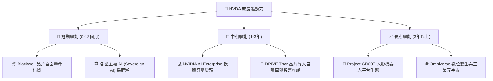

---

## 9. 風險矩陣

### 9.1 風險評分矩陣

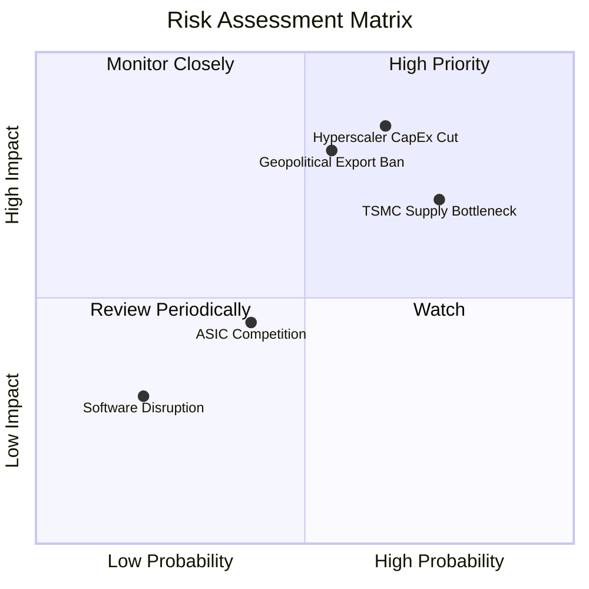

### 9.2 風險清單詳細分析

| # | 風險項目 | 發生機率 | 財務衝擊 | 風險評分 | 緩解措施 / 機構觀點 |
|---|----------|----------|----------|----------|--------------------|
| 1 | 🔴 **雲端巨頭 Capex 放緩** | 中高 (65%) | 高 (-20% 營收) | 🔴 8.5 / 10 | 雲端巨頭若無法在 AI 應用端變現，可能放緩基礎建設投資。但目前微軟、Meta 等財報顯示將持續加大 AI 投入，短期風險可控。 |
| 2 | 🔴 **地緣政治出口管制** | 中等 (55%) | 高 (-15% 營收) | 🔴 8.0 / 10 | 美國可能進一步限制對中國或中東的晶片出口。NVIDIA 透過推出符合規範的特供版（如 H20）緩解，並積極開拓歐洲與東南亞市場。 |
| 3 | 🟡 **供應鏈先進封裝瓶頸** | 高 (75%) | 中等 (-10% 出貨) | 🟡 7.0 / 10 | 台積電 CoWoS 產能供不應求。NVIDIA 已引入安靠（Amkor）等第二供應商，預計 2026 下半年瓶頸將顯著緩解。 |
| 4 | 🟡 **自研 ASIC 競爭** | 中等 (40%) | 中低 (-5% 市佔) | 🟡 4.5 / 10 | 谷歌 TPU、亞馬遜 Trainium 等自研晶片僅供自用。NVIDIA 憑藉 CUDA 的通用性與生態壁壘，仍是第三方客戶的唯一首選。 |

---

## 10. 投資建議

### 10.1 最終綜合評級雷達圖

```
╔══════════════════════════════════════════════════════════════╗
║               NVIDIA 綜合投資價值評級                        ║
╠══════════════════════════════════════════════════════════════╣
║ 成長前景     9.8 ▓▓▓▓▓▓▓▓▓▓▓▓▓▓▓▓▓▓▓░  ★★★★★  極佳           ║
║ 財務防禦力   9.5 ▓▓▓▓▓▓▓▓▓▓▓▓▓▓▓▓▓▓▓░  ★★★★★  極佳           ║
║ 護城河深度   9.8 ▓▓▓▓▓▓▓▓▓▓▓▓▓▓▓▓▓▓▓░  ★★★★★  極佳           ║
║ 估值吸引力   7.5 ▓▓▓▓▓▓▓▓▓▓▓▓▓▓▓░░░░░  ★★★★☆  合理偏便宜     ║
║ 盈餘品質     9.2 ▓▓▓▓▓▓▓▓▓▓▓▓▓▓▓▓▓▓░░  ★★★★★  極佳           ║
╠══════════════════════════════════════════════════════════════╣
║ 綜合推薦：🟢 強烈買入 (Strong Buy)                           ║
╚══════════════════════════════════════════════════════════════╝
```

### 10.2 目標價與隱含報酬率

* **當前股價**：$212.06
* **12M 基準目標價**：**$310.00**（隱含漲幅 **+46.18%**）
* **機率加權預期報酬率**：

$$\text{機率加權目標價} = (160 \times 15\%) + (310 \times 65\%) + (480 \times 20\%) = \$321.50 \quad (\text{隱含漲幅 } +51.6\%)$$

### 10.3 買入時機與觸發因素

```
╔══════════════════════════════════════════════════════════════════╗
║                  ✅ 買入與交易策略 Checklist                     ║
╠══════════════════════════════════════════════════════════════════╣
║                                                                  ║
║  立即買入觸發條件（多數符合）：                                  ║
║  ✅ 股價回檔至 $200 - $210 區間（接近 Forward P/E 15x 歷史極值）  ║
║  ✅ Blackwell 晶片出貨進度符合或超出預期                         ║
║                                                                  ║
║  加碼觸發條件：                                                  ║
║  ☐ 季度財報中「軟體與服務（NVIDIA AI Enterprise）」營收年增 > 100%║
║  ☐ 自動駕駛（DRIVE Thor）獲主流 OEM 廠大規模定案（Design Win）  ║
║                                                                  ║
║  減碼/停損觸發條件：                                             ║
║  ☐ 核心毛利率（Gross Margin）連續兩季跌破 70.0%                 ║
║  ☐ 台積電先進製程或封裝產能出現重大中斷，且無替代方案           ║
║                                                                  ║
╚══════════════════════════════════════════════════════════════════╝
```

### 10.4 投資人適配度分析

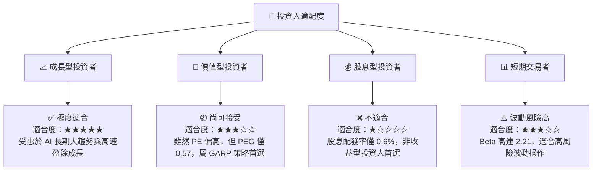

### 10.5 每季財報監控清單（Quarterly Watch List）

機構投資人應在每季財報中重點追蹤以下指標，並與關鍵門檻值進行比對：

| 監控指標 | 當前值 (TTM) | 偏多門檻 (加碼) | 偏空門檻 (減碼) | 監控邏輯與含意 |
|----------|--------------|-----------------|-----------------|----------------|
| **資料中心營收年增率** | 85.2% | > 50.0% | < 25.0% | 評估 AI 基礎建設需求是否出現結構性放緩。 |
| **整體毛利率 (GAAP)** | 74.1% | > 72.0% | < 69.0% | 評估 Blackwell 的良率與定價權是否受到競爭侵蝕。 |
| **自由現金流 (FCF) 轉換率**| 74.6% | > 80.0% | < 60.0% | 監控營運資金（存貨與預付款）是否過度積壓。 |
| **NVIDIA AI Enterprise 營收**| 未單獨揭露 | > $2.0B / 年 | 增長停滯 | 評估公司從硬體銷售成功轉型至高利潤軟體訂閱的進度。 |

### 10.6 反面論證：什麼會證明本報告的看多論點錯誤

本多頭投資論點在下列情況成立時，應立即重新檢視或執行賣出：

```
╔══════════════════════════════════════════════════════════════════╗
║              ⚠️ 論點失效條件（Disconfirming Evidence）           ║
╠══════════════════════════════════════════════════════════════════╣
║  本投資論點在下列情況成立時應重新檢視或退出：                    ║
║  ☐ 核心資料中心業務營收成長率連續兩季低於 25.0%                  ║
║  ☐ 營業利益率因研發費用失控或售價下滑而較峰值收縮 > 8.0 pp       ║
║  ☐ 自由現金流轉負，或 FCF 現金轉換率連續三季低於 50.0%           ║
║  ☐ 超大型雲端客戶（如微軟、Meta、谷歌）宣佈下調 AI Capex > 20%   ║
║  ☐ 競爭對手（如 AMD）在主流 AI 框架上的軟體相容性取得實質突破   ║
╚══════════════════════════════════════════════════════════════════╝
```

---

> **免責聲明**：本報告僅供研究參考，不構成投資建議。投資有風險，入市需謹慎。