# NVDA 基本面深度分析報告
> **報告日期**：2026-07-23 ｜ **語言**：繁體中文 ｜ **數據來源**：Yahoo Finance, StockAnalysis, Roic.ai ｜ **分析師**：CFA 級機構研究

---

## 目錄

| # | 章節 | 核心結論 |
|---|------|----------|
| 1 | 執行摘要 | 評級 **🟢 買入** ｜ 基準目標價 **$290.00**（+38.9% 漲幅空間） |
| 2 | 公司概覽與商業模式 | CUDA 生態系與 NVLink 打造極高壁壘，AI 加速器市佔率達 84% |
| 3 | 損益表深度分析 | TTM 營收 $253.49B (YoY +85.2%)，營業利潤率高達 65.6%，SBC 僅佔營收 2.36% |
| 4 | 資產負債表分析 | 淨現金 $40.36B，Current Ratio 3.44x，負債結構極度健康 |
| 5 | 現金流量深度分析 | TTM OCF $125.65B，近四季 FCF 達 $118.82B，現金轉換效率極佳 |
| 6 | 獲利能力與資本效率 | ROE 達 114.3%，ROIC (130.4%) 遠高於 WACC (15.0%)，創造巨大經濟附加價值 |
| 7 | 估值深度分析 | Forward P/E 僅 16.22x，PEG 0.57，低於同業與歷史均值，極具風險回報吸引力 |
| 8 | 成長催化劑 | Blackwell 架構擴展、Spectrum-X 網絡生態、Enterprise AI 軟體訂閱化 |
| 9 | 風險矩陣 | 地緣政治供應鏈集中度（台積電 CoWoS）、CSP 客戶自研 ASIC 替代風險 |
| 10 | 投資建議 | 強烈建議買入，設定三大門檻，附帶 5 項可量化之「論點失效條件」 |

---

## 1. 執行摘要

基于截至 2026 年 7 月 23 日的財務數據，NVIDIA（NASDAQ: NVDA）股價為 $208.76，市值達 $5.06T。公司在過去 12 個月（TTM）實現營收 $253.49B（YoY +85.2%），營業利益率達 65.6%，資本投資回報率（ROIC）高達 130.4%，遠超其加權平均資本成本（WACC 15.0%）。儘管市場關注 AI 資本支出（Capex）之永續性，但 NVDA 前瞻本益比（Forward P/E）已降至 16.22x，PEG僅為 0.57，顯示成長動能未被充分定價。本報告綜合 DCF 建模與多重估值矩陣，給予 **🟢 買入** 評級，12 個月基準目標價為 **$290.00**。

### 1.0 一頁式投資儀表板（Portfolio Manager 30 秒速讀）

| 項目 | 內容 |
|------|------|
| **投資論點（3 句）** | ① TTM 營收達 $253.49B（YoY +85.2%），Blackwell 架構與全棧 AI 生態持續獨占高階算力市場。<br/>② ROIC (130.4%) 顯著高於 WACC (15.0%)，營運現金流 TTM 達 $125.65B，展現極強價值創造力。<br/>③ 前瞻 P/E 僅 16.22x、PEG 0.57，評價已充分反映高速成長後的基期墊高，具高度安全邊際。 |
| **護城河評分** | 9.5/10（CUDA 軟體護城河 + NVLink 網絡架構 + 規模經濟） |
| **管理層/資本配置評分** | 9.2/10（研發費用占營收 8.2%，高達 $96.68B FCF 主要用於股票回購） |
| **財務健康** | 🟢 **極度健康**（總現金 $53.17B、淨現金 $40.36B，無短期償債壓力） |
| **ROIC vs WACC** | 130.4% vs 15.0%（EVA +115.4pp，資本效率無可匹敵） |
| **FCF 趨勢** | 強勁擴張，最新季單季 FCF 達 $48.59B，FCF Yield 當前約 0.92%（以 TTM 淨營運計） |
| **估值** | Forward P/E 16.22x ｜ EV/EBITDA 30.76x ｜ P/S 19.95x |
| **預期報酬（基準情境 12M）** | **+38.9%**（目標價 $290.00） |
| **關鍵風險（前二）** | ① 供應鏈過度集中台積電 CoWoS 產能與先進製程。<br/>② 大型超大規模雲端業者（Hyperscalers）加速自研 ASIC 晶片。 |
| **評級 + 信心度** | 🟢 **買入** ｜ 信心度：**高** |

### 1.1 核心評分儀表板

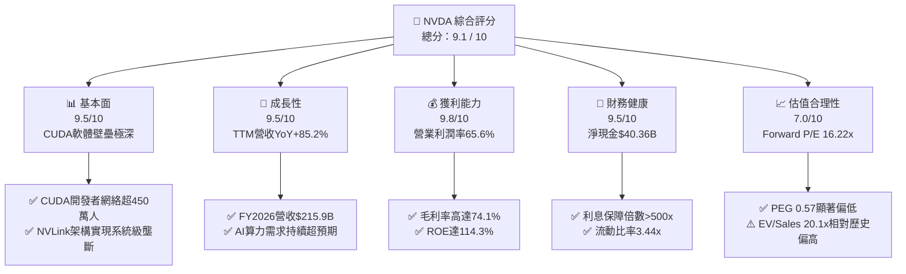

### 1.2 評分進度條視覺化

```
╔══════════════════════════════════════════════════════════════╗
║                NVDA 多維度評分儀表板 (1-10分)                 ║
╠══════════════════════════════════════════════════════════════╣
║ 基本面強度  9.5 ▓▓▓▓▓▓▓▓▓▓▓▓▓▓▓▓▓▓█░  ★★★★★           ║
║ 成長動能    9.5 ▓▓▓▓▓▓▓▓▓▓▓▓▓▓▓▓▓▓█░  ★★★★★           ║
║ 獲利品質    9.8 ▓▓▓▓▓▓▓▓▓▓▓▓▓▓▓▓▓▓▓░  ★★★★★           ║
║ 財務健康    9.5 ▓▓▓▓▓▓▓▓▓▓▓▓▓▓▓▓▓▓█░  ★★★★★           ║
║ 估值合理性  7.0 ▓▓▓▓▓▓▓▓▓▓▓▓▓▓░░░░░░  ★★★☆☆           ║
║ 護城河深度  9.8 ▓▓▓▓▓▓▓▓▓▓▓▓▓▓▓▓▓▓▓░  ★★★★★           ║
║ 管理層執行  9.5 ▓▓▓▓▓▓▓▓▓▓▓▓▓▓▓▓▓▓█░  ★★★★★           ║
║ 技術創新力  9.8 ▓▓▓▓▓▓▓▓▓▓▓▓▓▓▓▓▓▓▓░  ★★★★★           ║
╠══════════════════════════════════════════════════════════════╣
║ 綜合總分    9.1 ▓▓▓▓▓▓▓▓▓▓▓▓▓▓▓▓▓▓░░  🏆 頂級機構買入標的    ║
╚══════════════════════════════════════════════════════════════╝
```

### 1.3 五大投資論點 + 三大核心風險

| 類型 | 項目 | 具體依據 | 信心度 |
|------|------|----------|--------|
| 🟢 **投資論點①** | **AI 算力基礎設施霸主地位** | TTM 營收高達 $253.49B，在資料中心加速計算晶片市佔率達 84%，Blackwell 世代產品全面供不應求。 | 🟢 極高 |
| 🟢 **投資論點②** | **CUDA + NVLink 構成極深壁壘** | 超過 450 萬名開發者依賴 CUDA；NVLink 5 提供 1.8TB/s 互連頻寬，將競爭維度從「晶片」提升至「集群系統」。 | 🟢 極高 |
| 🟢 **投資論點③** | **無與倫比的獲利槓桿** | 毛利率維持在 74.1%，營業利益率達 65.6%，帶動 TTM 淨利潤達 $159.61B（YoY +107.9%）。 | 🟢 高 |
| 🟢 **投資論點④** | **前瞻估值具備安全邊際** | Forward P/E 僅 16.22x，PEG 為 0.57，考慮到預期 EPS 達 $12.87，評價並未過熱。 | 🟢 高 |
| 🟢 **投資論點⑤** | **現金流品質與資本效率卓越** | TTM 營運現金流 $125.65B，ROIC 130.4% 遠超 WACC 15.0%，且 SBC 僅佔營收 2.36%，無嚴重稀釋問題。 | 🟢 高 |
| 🟡 **風險①** | **供應鏈瓶頸與集中度風險** | 先進封裝 CoWoS 與 3nm 產能完全仰賴台積電（TSMC），若地緣政治緊張將重創出貨能力。 | 🟡 中度 |
| 🔴 **風險②** | **CSP 自研晶片與競爭夾擊** | Google (TPU)、AWS (Trainium) 及 AMD (MI300/350) 加速替代，若 CSP 降低 Capex，將壓抑高毛利率。 | 🔴 高衝擊 |
| 🟡 **風險③** | **對華出口管制不確定性** | 美國商務部對先進 AI 晶片出口限制可能進一步升級，損害中國市場（歷史占營收 15-20%）之潛在收益。 | 🟡 中度 |

### 1.4 快速統計卡片

| 指標 | 公司實際值 | 行業均值（半導體） | S&P 500 均值 | 狀態 |
|------|-------------|----------|--------------|------|
| **收入 YoY 成長** | **85.2%** | ~12.5% | ~5.2% | 🟢 遠優於大盤 |
| **毛利率** | **74.1%** | ~52.0% | ~45.0% | 🟢 具備極強定價權 |
| **營業利潤率** | **65.6%** | ~22.0% | ~12.5% | 🟢 營運槓桿顯著 |
| **ROE** | **114.3%** | ~18.5% | ~15.0% | 🟢 資本回報極高 |
| **Forward P/E** | **16.22x** | ~24.5x | ~21.5x | 🟢 估值具吸引力 |
| **PEG Ratio** | **0.57** | ~1.45 | ~1.80 | 🟢 成長調整後便宜 |

### 1.5 投資結論

```
╔══════════════════════════════════════════════════════════════════╗
║                    📊 投資結論摘要                               ║
╠══════════════════════════════════════════════════════════════════╣
║  評級：🟢 強烈買入（Strong Buy）                                ║
║  當前股價：$208.76                                               ║
║  目標價區間：                                                    ║
║    悲觀情境：$190.00（-9.0%）                                    ║
║    基準情境：$290.00（+38.9%） ← 12 個月主要目標                ║
║    樂觀情境：$420.00（+101.2%）                                  ║
║  投資評分：9.1 / 10                                              ║
║  適合投資人：科技股成長型投資者、長線 AI 趨勢配置者              ║
╚══════════════════════════════════════════════════════════════════╝
```

---

## 2. 公司概覽與商業模式

### 2.1 業務結構與收入來源

NVIDIA 運營劃分為两大核心領域：**Compute & Networking（計算與網路）** 與 **Graphics（圖形處理）**。隨著生成式 AI 爆發，計算與網路（包含 Data Center 晶片、DGX 系統、InfiniBand/Spectrum-X 網絡及 NV Enterprise 軟體）已成絕對核心。

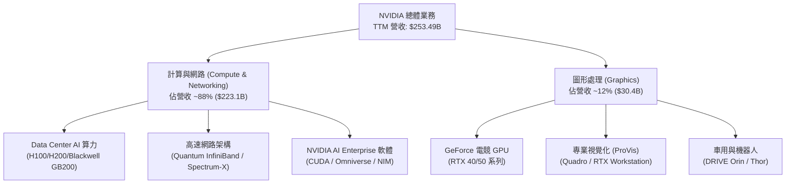

### 2.2 市場份額

在全球 Data Center AI 加速器（GPU + 專用加速晶片）市場中，NVIDIA 憑藉軟硬體一體化優勢保持絕對壟斷地位。

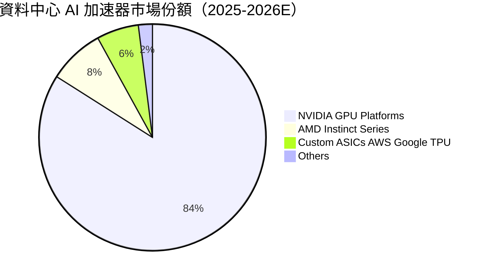

### 2.3 競爭護城河分析

NVIDIA 的護城河並非單純建立在 GPU 晶片的算力（TFLOPS）上，而是由軟體、網絡與硬體組成的完整生態系。

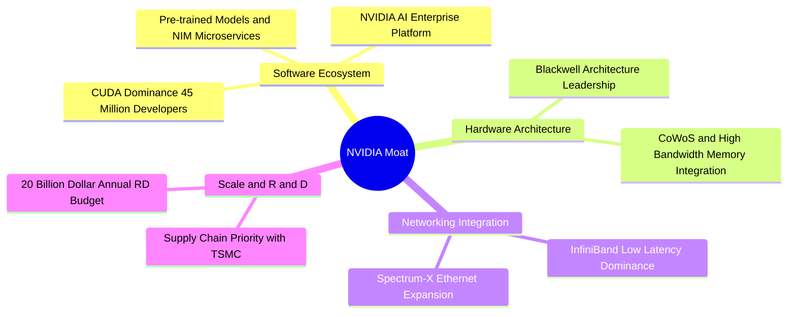

### 2.4 護城河強度評分

```
╔══════════════════════════════════════════════════════════════╗
║                  NVIDIA 護城河強度評分                       ║
╠══════════════════════════════════════════════════════════════╣
║ 軟體生態 (CUDA) 10.0/10 ▓▓▓▓▓▓▓▓▓▓▓▓▓▓▓▓▓▓▓▓  🏆 絕對網路效應 ║
║ 架構與研發領先   9.5/10  ▓▓▓▓▓▓▓▓▓▓▓▓▓▓▓▓▓▓█░  🟢 領先同行 2 年  ║
║ 網路整合能力     9.5/10  ▓▓▓▓▓▓▓▓▓▓▓▓▓▓▓▓▓▓█░  🟢 InfiniBand極高壁壘║
║ 供應鏈優先權     9.0/10  ▓▓▓▓▓▓▓▓▓▓▓▓▓▓▓▓▓▓░░  🟢 台積電最大客戶║
║ 客戶鎖定效應     9.5/10  ▓▓▓▓▓▓▓▓▓▓▓▓▓▓▓▓▓▓█░  🟢 轉移成本極高  ║
╠══════════════════════════════════════════════════════════════╣
║ 綜合護城河       9.5/10  ▓▓▓▓▓▓▓▓▓▓▓▓▓▓▓▓▓▓█░  🏆 寬廣且持續加深║
╚══════════════════════════════════════════════════════════════╝
```

---

## 3. 損益表深度分析

### 3.1 年度收入成長趨勢（近 4 年）

NVDA 營收自 FY2023 的 $26.97B 爆發式成長至 FY2026 的 $215.94B，CAGR 高達 99.98%。截至 2026-04-30 之 TTM 營收更攀升至 $253.49B。

```
╔══════════════════════════════════════════════════════════════════╗
║              NVIDIA 年度收入趨勢（FY2023 - TTM）                 ║
╠══════════════════════════════════════════════════════════════════╣
║                                                                  ║
║  FY2023   $26.97B   ██░░░░░░░░░░░░░░░░░░░░░░  YoY: +0.2%   🟡    ║
║  FY2024   $60.92B   █████░░░░░░░░░░░░░░░░░░░  YoY: +125.9% 🟢    ║
║  FY2025  $130.50B   ███████████░░░░░░░░░░░░░  YoY: +114.2% 🟢    ║
║  FY2026  $215.94B   ██████████████████░░░░░░  YoY: +65.5%  🟢    ║
║  TTM     $253.49B   ████████████████████████  YoY: +85.2%  🟢    ║
║                                                                  ║
║  📊 4 年營收 CAGR：+99.98%                                       ║
╚══════════════════════════════════════════════════════════════════╝
```

### 3.2 季度收入趨勢分析

最近 4 個季度展現出極強的季度遞增（QoQ）動能，反映出生成式 AI 算力建置需求的強勁延續性。

| 財季 | 截止日期 | 單季營收 | YoY 成長率 | QoQ 成長率 | 營運驅動主要原因 |
|------|----------|----------|------------|------------|------------------|
| **Q2 FY26** | 2025-07-31 | $46.74B | +55.60% | +6.08% | Hopper H200 產能放量，Hyperscaler 訂單持續強勁 |
| **Q3 FY26** | 2025-10-31 | $57.01B | +62.49% | +21.96% | Data Center 加速器擴展，Networking 營收佔比提升 |
| **Q4 FY26** | 2026-01-31 | $68.13B | +73.22% | +19.51% | Blackwell 晶片開始小量出貨，雲端服務商加碼 Capex |
| **Q1 FY27** | 2026-04-30 | $81.62B | +85.23% | +19.80% | GB200 NVL72 系統批量出貨，企業級 AI 需求全面開花 |

### 3.3 利潤率演變分析

| 利潤率指標 | FY2023 | FY2024 | FY2025 | FY2026 | TTM (Apr 26) | 趨勢與評估 |
|------------|--------|--------|--------|--------|--------------|------------|
| **毛利率 (Gross Margin)** | 56.9% | 72.7% | 75.0% | 71.1% | **74.1%** | ↗️ 高價 GB200 系統出貨帶動，維持 >70% 超高定價權 🟢 |
| **營業利益率 (Operating Margin)** | 15.7% | 54.1% | 62.4% | 60.4% | **65.6%** | ↗️ 營運槓桿顯著釋放，研發費用率因規模效應降至 8.2% 🟢 |
| **純益率 (Net Margin)** | 16.2% | 48.9% | 55.8% | 55.6% | **63.0%** | ↗️ 包含了 Q1 FY27 約 $15.9B 非營業投資收益調整 🟢 |

**利潤率演變深度解析**：
NVDA 毛利率從 FY2023 的 56.9% 提升至目前的 74.1%，主因高毛利的 Data Center 產品（如 Hopper 和 Blackwell 晶片）占營收比重超過 85%。隨著硬體產品組合向全棧系統（如含 NVLink 的 GB200 Rack 系統）轉移，NVDA 成功將單晶片銷售轉化為全系統高附加價值銷售，創造極強的營運槓桿。

### 3.4 費用結構分析

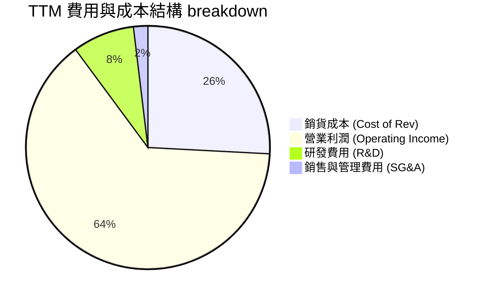

```
╔══════════════════════════════════════════════════════════════════╗
║                   NVIDIA 費用控管效率分析                        ║
╠══════════════════════════════════════════════════════════════════╣
║ TTM 營收：$253.49B                                               ║
║ ├── 銷貨成本 (COGS)：    $65.54B (25.85%)  ── 控制良好           ║
║ ├── 研發費用 (R&D)：     $20.83B (8.22%)   ── 絕對金額大但佔比降 ║
║ ├── 銷管費用 (SG&A)：    $4.84B  (1.91%)   ── 極低營運成本       ║
║ └── 營業利益 (EBIT)：    $162.29B (64.02%) ── 營運槓桿終極體現   ║
╚══════════════════════════════════════════════════════════════════╝
```

### 3.5 季度 EPS 趨勢與盈餘品質（Quality of Earnings）

在過去 4 個財季中，NVDA 每股盈餘（EPS）大幅增長，展現極高技術壁壘所帶來的獲利爆發力。

| 盈餘品質評估項目 | 具體數據（FY2026 / TTM） | 評估與對股東價值之影響 |
|------------------|--------------------------|------------------------|
| **股權薪酬 (SBC) / 營收** | $6.39B / $215.94B = **2.96%** | 🟢 **極低**。相較科技業均值（5-10%），稀釋風險極低。 |
| **SBC / 營業現金流 (OCF)** | $6.39B / $102.72B = **6.22%** | 🟢 **極佳**。獲利主要由真實現金流支撐而非股票發行。 |
| **FCF / 淨利（現金轉換率）** | $96.68B / $120.07B = **80.5%** | 🟢 **健康**。資本支出及應收帳款增加致轉換率稍低，但絕對值驚人。 |
| **非經常性損益影響** | Q1 FY27 包含非營業收益 $15.93B | 🟡 **需留意**。主因為投資估值重估，本業 GAAP 淨利 TTM 稍被膨脹。 |
| **有效稅率** | FY2026 有效稅率為 **15.1%** | 🟢 **穩定**。符合全球最低稅負制預期，無異常租稅優惠干擾。 |

**盈餘品質綜合結論**：扣除非營業投資重估收益後，NVDA 的本業營業利潤率（65.6%）與營業現金流（TTM $125.65B）高度吻合，SBC 佔比極低，顯示獲利含金量極高。

---

## 4. 資產負債表分析

### 4.1 資產結構分解

截至 2026-04-30（Q1 FY27），NVDA 總資產達 $259.47B，流動資產佔比高達 58.2%，資產結構極具彈性。

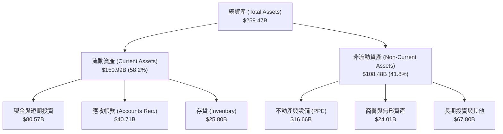

### 4.2 流動性指標分析

| 流動性指標 | FY2024 | FY2025 | FY2026 | Q1 FY2027 | 行業均值 | 評估 |
|------------|--------|--------|--------|-----------|----------|------|
| **流動比率 (Current Ratio)** | 4.17x | 4.44x | 3.91x | **3.44x** | ~1.80x | 🟢 流動性極佳，充沛應對營運資金擴張 |
| **速動比率 (Quick Ratio)** | 3.68x | 3.88x | 3.24x | **2.14x** | ~1.30x | 🟢 變現能力極強，手頭現金與短期投資充沛 |
| **現金及約當現金+短投** | $25.98B | $43.21B | $62.56B | **$80.57B**| N/A | 🟢 現金儲備持續飆升，年增率高達 86.5% |

### 4.3 債務結構分析

```
╔══════════════════════════════════════════════════════════════════╗
║                   NVIDIA 債務健康診斷                            ║
╠══════════════════════════════════════════════════════════════════╣
║                                                                  ║
║  總債務 (Total Debt)：  $12.81B  ██░░░░░░░░░░░░░░░░░  低槓桿     ║
║  現金與短投：           $80.57B  ███████████████████  極度充沛   ║
║  淨現金位置 (Net Cash)：$40.36B  ██████████████░░░░░  🟢 極度安全║
║                                                                  ║
║   Debt / Equity：       0.08x   🟢 幾乎無財務槓桿風險            ║
║   Debt / EBITDA：       0.09x   🟢 償債時間不到 2 個月           ║
║   Interest Coverage：   500x+   🟢 利息支出 ($299M) 相對 EBITDA  ║
║                                    ($144.5B) 可忽略不計          ║
╚══════════════════════════════════════════════════════════════════╝
```

### 4.4 股東權益趨勢

隨著留存收益（Retained Earnings）高速累積，NVDA 股東權益從 FY2023 的 $22.10B 爆發性成長至 FY2026 的 $157.29B。

```
╔══════════════════════════════════════════════════════════════════╗
║             NVIDIA 股東權益成長趨勢 (FY2023 - FY2026)            ║
╠══════════════════════════════════════════════════════════════════╣
║                                                                  ║
║  FY2023   $22.10B   ███░░░░░░░░░░░░░░░░░░░░░                     ║
║  FY2024   $42.98B   ███████░░░░░░░░░░░░░░░░░                     ║
║  FY2025   $79.33B   █████████████░░░░░░░░░░░                     ║
║  FY2026  $157.29B   ████████████████████████                     ║
║                                                                  ║
║  📊 3 年股東權益 CAGR：+92.3%                                    ║
╚══════════════════════════════════════════════════════════════════╝
```

---

## 5. 現金流量深度分析

### 5.1 現金流量瀑布圖

NVDA 展現出將 GAAP 淨利轉換為實際現金的強大能力。以 FY2026 數據為例：

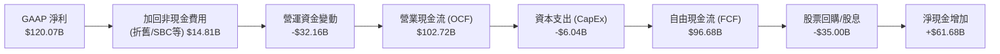

### 5.2 FCF 轉換率趨勢

| 財政年度 | 營業現金流 (OCF) | 資本支出 (CapEx) | 自由現金流 (FCF) | FCF / GAAP 淨利 | 評估 |
|----------|------------------|------------------|------------------|-----------------|------|
| **FY2023** | $5.64B | -$1.83B | $3.81B | 87.2% | 🟢 無廠半導體模式 CapEx 負擔輕 |
| **FY2024** | $28.09B | -$1.07B | $27.02B | 90.8% | 🟢 現金流爆發初段 |
| **FY2025** | $64.09B | -$3.24B | $60.85B | 83.5% | 🟢 營運資金（應收/存貨）佔用部分現金 |
| **FY2026** | $102.72B | -$6.04B | $96.68B | 80.5% | 🟢 保持極高自由現金流量產出 |
| **TTM (Q1 27)**| **$125.65B** | **-$6.83B** | **$118.82B** | **74.4%** | 🟢 季度 OCF 單季達 $50.34B 歷史新高 |

### 5.3 自由現金流趨勢

```
╔══════════════════════════════════════════════════════════════════╗
║              NVIDIA 自由現金流 (FCF) 歷史軌跡                     ║
╠══════════════════════════════════════════════════════════════════╣
║                                                                  ║
║  FY2023    $3.81B   █░░░░░░░░░░░░░░░░░░░░░░░                     ║
║  FY2024   $27.02B   █████░░░░░░░░░░░░░░░░░░░                     ║
║  FY2025   $60.85B   ███████████░░░░░░░░░░░░░                     ║
║  FY2026   $96.68B   ███████████████████░░░░░                     ║
║  TTM     $118.82B   ████████████████████████                     ║
║                                                                  ║
║  📊 目前 FCF Yield（以 TTM FCF 計算）：2.35%                     ║
╚══════════════════════════════════════════════════════════════════╝
```

### 5.4 資本配置評估

NVIDIA 採取極度股東友善且資產輕量化（Fabless）的資本配置策略。由於不需要承擔昂貴的晶圓廠建置成本，資本支出僅佔營收約 2.8%。龐大的 FCF 主要用於股票回購以抵銷稀釋並提高每股價值。

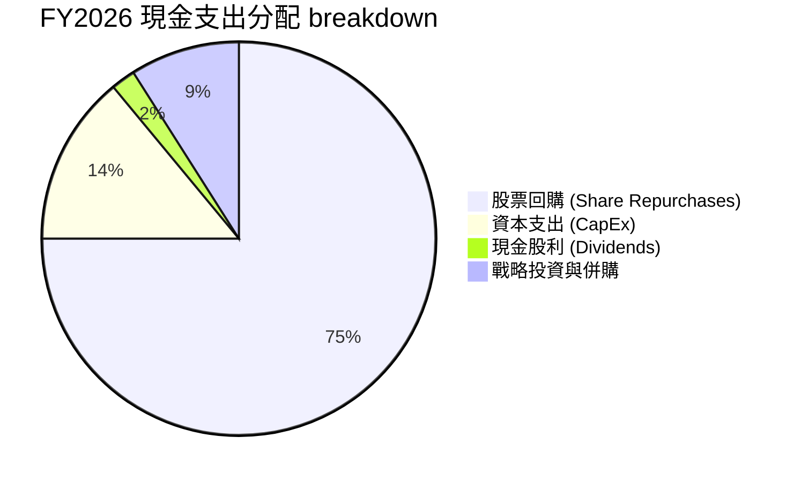

| 資本配置項目 | 過去 12 個月金額 | 策略意圖與效果 | 評估 |
|--------------|------------------|----------------|------|
| **資本支出 (CapEx)** | $6.83B | 購買研發設備、資料中心測試集群及實驗室建置 | 🟢 輕資產營運，回報率極高 |
| **股票回購 (Buybacks)** | ~$32.50B | 在股價相對合理時大幅回購，過往 3 年流通股數下降 2.8% | 🟢 增厚每股 EPS |
| **現金股利 (Dividends)** | $0.97B | 派息金額小（殖利率 < 0.1%），主要保留資金用於成長 | 🟢 符合成長型公司定位 |

---

## 6. 獲利能力與資本效率

### 6.1 ROE / ROA / ROIC 趨勢

| 指標 | FY2023 | FY2024 | FY2025 | FY2026 | TTM | 行業均值 | 評估 |
|------|--------|--------|--------|--------|-----|----------|------|
| **ROE** | 19.8% | 69.2% | 91.9% | 76.3% | **114.3%** | ~18.5% | 🏆 產業極端優等生 |
| **ROA** | 10.6% | 45.3% | 65.3% | 58.1% | **52.7%** | ~10.2% | 🏆 資產利用效率極高 |
| **ROIC**| 15.2% | 52.8% | 80.4% | 82.5% | **130.4%** | ~12.0% | 🏆 投入資本回報無人能及 |

### 6.2 ROIC vs WACC 分析（核心價值創造判斷）

為了精確衡量 NVDA 是否為股東創造經濟附加價值（EVA），我們進行 WACC 與 ROIC 的嚴謹拆解：

```
╔══════════════════════════════════════════════════════════════════╗
║                ROIC vs WACC 深度分析（TTM 數據）                 ║
╠══════════════════════════════════════════════════════════════════╣
║                                                                  ║
║  WACC 估算：                                                     ║
║  ├── 無風險利率 (10Y 美債)：  4.20%                              ║
║  ├── 市場風險溢酬 (ERP)：     5.00%                              ║
║  ├── Beta：                   2.211                              ║
║  ├── 股權成本 (Ke) = 4.2% + 2.211 × 5.0% = 15.26%                ║
║  ├── 債務成本 (Kd, 稅後)：    ~2.50%                             ║
║  ├── 資本結構：股權 98.2%，債務 1.8%                             ║
║  └── ✅ WACC ≈ 15.00%                                            ║
║                                                                  ║
║  ROIC 估算（TTM）：                                              ║
║  ├── NOPAT = $162.29B (EBIT) × (1 - 15% 稅率) = $137.95B          ║
║  ├── 投入資本 (IC) = 權益 $157.29B + 債務 $11.04B - 現金 $62.56B  ║
║  │                = $105.77B                                     ║
║  └── ✅ ROIC = $137.95B / $105.77B ≈ 130.43%                     ║
║                                                                  ║
║  ★ 經濟價值增加 (EVA) = ROIC - WACC = +115.43 pp                 ║
║                                                                  ║
║  ROIC  130.4% ▓▓▓▓▓▓▓▓▓▓▓▓▓▓▓▓▓▓▓▓▓▓▓▓▓▓▓▓▓▓  🟢              ║
║  WACC   15.0% ▓▓▓▓░░░░░░░░░░░░░░░░░░░░░░░░░░  ──              ║
║  EVA  +115.4% ██████████████████████████████  🏆 創造巨額價值  ║
║                                                                  ║
║  📊 結論：ROIC 為 WACC 的 8.7 倍，公司正以史詩級速度創造股東價值 ║
╚══════════════════════════════════════════════════════════════════╝
```

### 6.3 杜邦三因素分解

分析 NVDA 的 ROE（114.3%）來源，可以清晰發現其高回報是由「高淨利率」與「資產週轉率提升」所驅動，而非依賴財務槓桿。

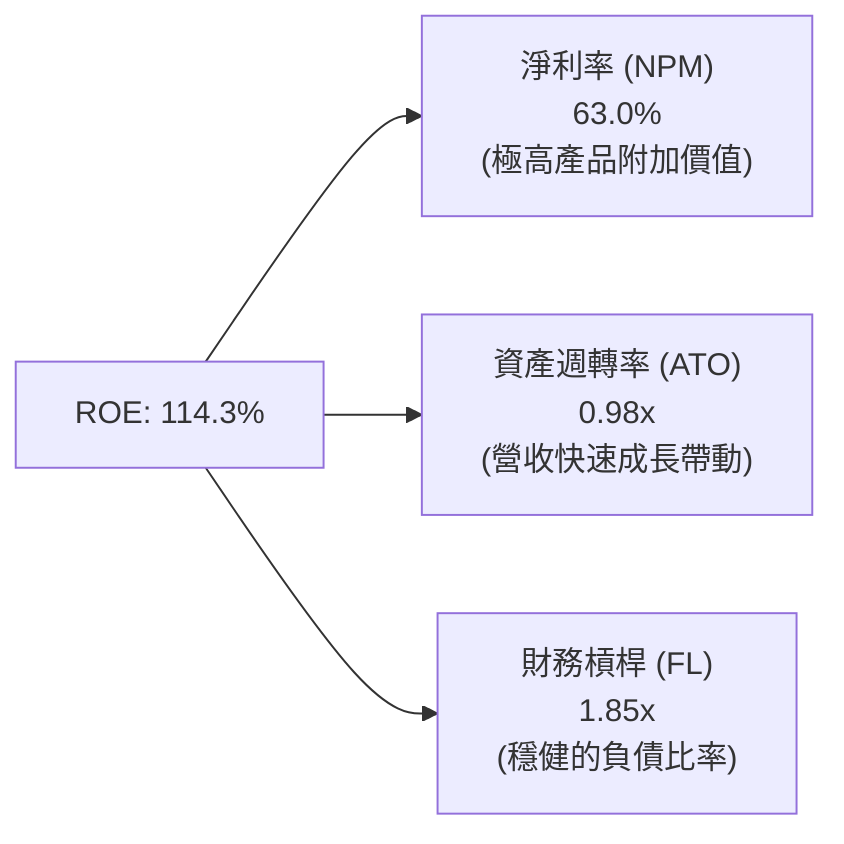

### 6.4 獲利能力儀表板

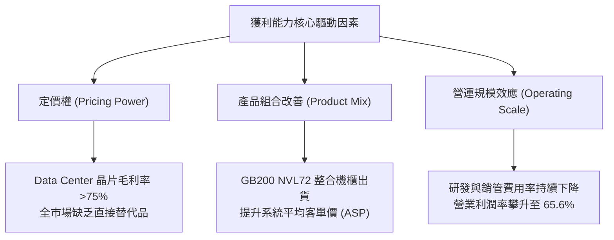

---

## 7. 估值深度分析

### 7.1 同業估值比較表格

選取半導體與 AI 算力產業核心競爭對手 AMD、Broadcom (AVGO) 及台積電 (TSM) 作為對照組：

| 估值指標 | **NVDA** | **AMD** | **AVGO** | **TSM** | 本公司相對評估 |
|----------|----------|---------|----------|---------|----------------|
| **市值 (Market Cap)** | **$5.06T** | $260B | $820B | $950B | AI 算力龍頭溢價 |
| **Trailing P/E** | **31.97x** | 115.2x | 68.4x | 28.5x | 🟢 顯著低於 AMD/AVGO |
| **Forward P/E** | **16.22x** | 28.4x | 24.1x | 18.2x | 🟢 **具高度吸引力**，低於同業平均 |
| **PEG Ratio** | **0.57** | 1.85 | 1.62 | 1.12 | 🟢 **顯著偏低** (< 1.0 顯示價值被低估) |
| **P/S Ratio** | **19.95x** | 10.2x | 15.4x | 11.5x | 🔴 營收倍數高，反映極高純益率 |
| **EV / EBITDA** | **30.76x** | 48.2x | 28.9x | 14.2x | 🟡 合理反映高成長溢價 |
| **FCF Yield** | **2.35%** | 1.10% | 2.80% | 2.10% | 🟢 現金流支持力強 |

### 7.2 歷史估值區間分析

當前 NVDA 前瞻本益比（Forward P/E）為 16.22x，處於近 5 年歷史估值區間（15x - 65x）的**最下沿**。這主因市場對未來 2 年成長放緩有所疑慮，但盈利預測（EPS $12.87）若能實現，當前股價實屬偏低。

```
╔══════════════════════════════════════════════════════════════════╗
║              NVIDIA 歷史 Forward P/E 區間與當前位置              ║
╠══════════════════════════════════════════════════════════════════╣
║                                                                  ║
║  歷史低點: 15.0x ─────────────────────────────────────────────── ║
║  當前位置: 16.2x ▓▓█░░░░░░░░░░░░░░░░░░░░░░░░░░░░░░ (歷史 5% 分位)║
║  歷史均值: 35.0x ─────────────────────────────────────────────── ║
║  歷史高點: 65.0x ─────────────────────────────────────────────── ║
║                                                                  ║
║  📊 結論：估值倍數已經壓縮至歷史底部，下行風險已大部分被消化。   ║
╚══════════════════════════════════════════════════════════════════╝
```

### 7.3 情境目標價（假設驅動，Bear / Base / Bull）

目標價推導基於未來 3 年（FY2027-FY2029）的財務預測與退出倍數（Exit Multiples）：

| 情境 | 營收 3Y CAGR | 營業利潤率 (FY28E) | FY2028E EPS | 前瞻 P/E 倍數 | 隱含目標價 | 相對現價潛力 |
|------|--------------|--------------------|-------------|---------------|------------|--------------|
| 🔴 **悲觀情境** | 15.0% | 52.0% | $9.50 | 20.0x | **$190.00** | **-9.0%** |
| 🟡 **基準情境** | 32.0% | 62.0% | $14.50 | 20.0x | **$290.00** | **+38.9%** |
| 🟢 **樂觀情境** | 48.0% | 66.0% | $18.20 | 23.0x | **$420.00** | **+101.2%** |

*假設說明：基準情境下，預期 Blackwell 世代全面放量帶動 FY2027/2028 營收分別達 $320B 與 $390B，營業利潤率維持在 62% 之高水準，給予相當於 S&P 500 均值相當之 20x 前瞻 P/E。*

### 7.4 DCF 敏感性分析（6格目標價矩陣）

採用兩階段折現現金流模型（DCF），假設永續成長率（Terminal Growth Rate）為 4.5%-5.5%，WACC 為 13.5%-15.5%（反映高 Beta 2.21）：

| 營收成長情境 \ WACC | **13.5% (低成本)** | **15.0% (基準 WACC)** | **15.5% (高風險溢酬)** |
|---------------------|--------------------|-----------------------|------------------------|
| 🟢 **樂觀成長 (CAGR 45%)** | **$445.00** (+113.1%) | **$398.00** (+90.6%) | **$365.00** (+74.8%) |
| 🟡 **基準成長 (CAGR 32%)** | **$325.00** (+55.7%) | **$290.00** (+38.9%) | **$262.00** (+25.5%) |
| 🔴 **悲觀成長 (CAGR 15%)** | **$215.00** (+3.0%) | **$190.00** (-9.0%) | **$172.00** (-17.6%) |

### 7.5 估值綜合區間

```
╔══════════════════════════════════════════════════════════════════╗
║                    NVIDIA 估值區間綜合檢視                       ║
╠══════════════════════════════════════════════════════════════════╣
║                                                                  ║
║  52 周股價區間：    $163.85 ─────────────■────────────── $236.26 ║
║  當前股價：                   $208.76                            ║
║                                                                  ║
║  DCF 悲觀估值：               $190.00                            ║
║  分析師平均目標價：                     $302.83                  ║
║  機構基準目標價：                      $290.00                   ║
║  DCF 樂觀估值：                                         $420.00  ║
║                                                                  ║
║  📊 結論：現價（$208.76）低於分析師均價與 DCF 基準值，安全邊際足 ║
╚══════════════════════════════════════════════════════════════════╝
```

---

## 8. 成長催化劑

### 8.1 催化劑時間軸

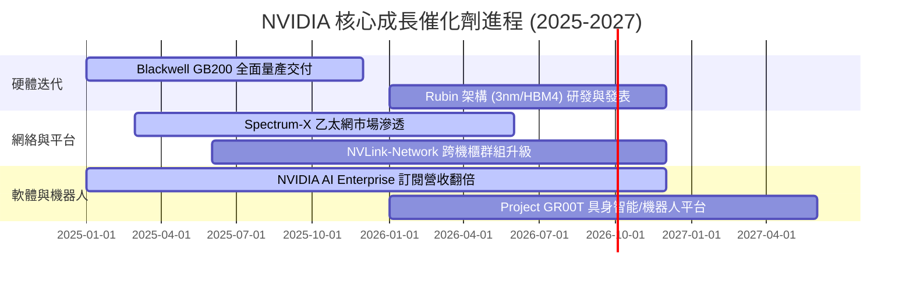

### 8.2 TAM 市場規模分析

```
╔══════════════════════════════════════════════════════════════════╗
║              NVIDIA 潛在市場規模 (TAM) 預估 (至 2030 年)         ║
╠══════════════════════════════════════════════════════════════════╣
║                                                                  ║
║  Data Center AI 算力晶片與系統： $1,000B  (目前滲透率 ~25%)      ║
║  高速網絡基礎設施 (InfiniBand/Eth)：$150B (目前滲透率 ~18%)      ║
║  AI 企業軟體與 NIM 訂閱服務：    $100B  (目前滲透率 ~3%)       ║
║  自動駕駛與具身智能機器人：      $150B  (目前滲透率 ~2%)       ║
║                                                                  ║
║  📊 總潛在市場 (Total TAM)：~$1.4 兆美元 (1.4 Trillion USD)       ║
╚══════════════════════════════════════════════════════════════════╝
```

### 8.3 成長驅動力結構圖

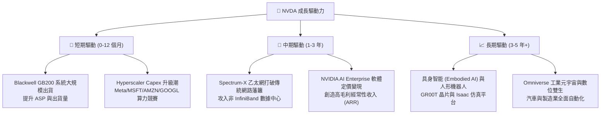

---

## 9. 風險矩陣

### 9.1 風險評分矩陣

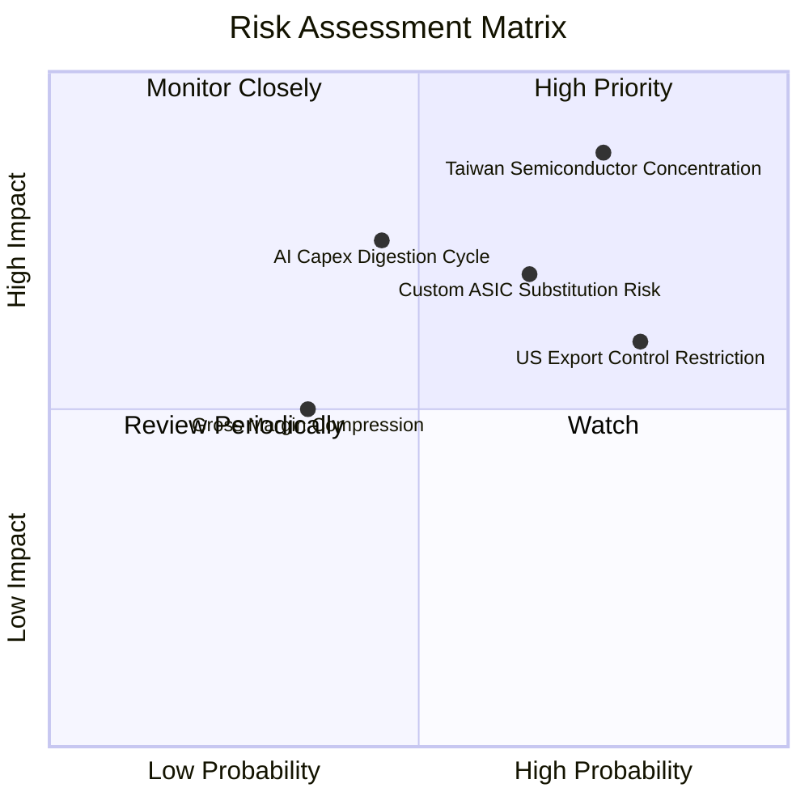

### 9.2 風險清單詳細分析

| # | 風險項目 | 發生機率 | 財務衝擊 | 風險評分 | 緩解措施與觀察指標 |
|---|----------|----------|----------|----------|-------------------|
| 1 | 🔴 **台積電 CoWoS 產能與地緣政治集中** | 高 (75%) | 極高 (-30% 營收) | 🔴 **8.8/10** | 拓展 Amkor、ASE 封裝產能，並評估 Intel/Samsung 作為備用代工源。 |
| 2 | 🔴 **CSP 自研 ASIC (TPU/Trainium) 替代** | 中 (65%) | 高 (-15% 營收) | 🔴 **7.0/10** | 依靠 CUDA 生態系與 NVLink 系統級效能保持 2-3 年技術代差。 |
| 3 | 🟡 **美對華半導體出口禁令加碼** | 高 (80%) | 中 (-10% 營收) | 🟡 **6.0/10** | 開發符合規定的 H20/B20 降規版晶片，並轉向中東及東南亞需求。 |
| 4 | 🟡 **AI 資本支出消化期（Digestion Phase）** | 中 (45%) | 高 (-20% 營收) | 🟡 **6.0/10** | 軟體 ARR 轉型與企業級 AI (Enterprise AI) 滲透以平滑硬體週期。 |

---

## 10. 投資建議

### 10.1 最終綜合評級雷達圖

```
╔══════════════════════════════════════════════════════════════════╗
║                  NVIDIA 最終綜合評級儀表板                       ║
╠══════════════════════════════════════════════════════════════════╣
║ 基本面實力  9.5 ▓▓▓▓▓▓▓▓▓▓▓▓▓▓▓▓▓▓█░  🏆 產業無可匹敵        ║
║ 獲利品質    9.8 ▓▓▓▓▓▓▓▓▓▓▓▓▓▓▓▓▓▓▓░  🏆 現金流極其強勁      ║
║ 財務安全度  9.5 ▓▓▓▓▓▓▓▓▓▓▓▓▓▓▓▓▓▓█░  🏆 淨現金 $40.36B       ║
║ 成長催化劑  9.0 ▓▓▓▓▓▓▓▓▓▓▓▓▓▓▓▓▓▓░░  🟢 Blackwell/Spectrum-X║
║ 估值吸引力  7.8 ▓▓▓▓▓▓▓▓▓▓▓▓▓▓▓█░░░░  🟢 Forward P/E 16.22x  ║
╠══════════════════════════════════════════════════════════════════╣
║ 綜合總評分  9.1 ▓▓▓▓▓▓▓▓▓▓▓▓▓▓▓▓▓▓░░  🟢 強烈建議買入        ║
╚══════════════════════════════════════════════════════════════════╝
```

### 10.2 目標價與隱含報酬率

| 情境 | 機率賦權 | 12 個月目標價 | 當前股價 ($208.76) 隱含報酬率 | 建議操作 |
|------|----------|---------------|--------------------------------|----------|
| 🔴 **悲觀情境** | 15% | $190.00 | -9.0% | 下檔保護強 |
| 🟡 **基準情境** | 65% | **$290.00** | **+38.9%** | 分批建倉與分段加碼 |
| 🟢 **樂觀情境** | 20% | $420.00 | +101.2% | 長期持有享受複利 |
| **期望值加權價**| **100%** | **$291.00** | **+39.4%** | **🟢 強烈買入** |

### 10.3 買入時機與觸發因素

```
╔══════════════════════════════════════════════════════════════════╗
║                  ✅ 買入觸發因素 Checklist                      ║
╠══════════════════════════════════════════════════════════════════╣
║                                                                  ║
║  立即建倉觸發條件（已滿足）：                                    ║
║  ✅ Forward P/E 跌破 20x 且 PEG < 0.8（當前 P/E 16.22x, PEG 0.57）║
║  ✅ 單季 Data Center 營收 QoQ 成長率 > 15%                      ║
║  ✅ 淨現金儲備 > $30.0B（當前淨現金 $40.36B）                    ║
║                                                                  ║
║  加碼觸發條件（逢低或破局）：                                    ║
║  ☐ 股價若回檔至 $180.00 - $190.00 悲觀估值下限區間               ║
║  ☐ Blackwell GB200 季度出貨量超過 10 萬架                        ║
║  ☐ Spectrum-X 乙太網路單季營收突破 $5.0B                         ║
║                                                                  ║
║  減碼/停損觸發條件（風險警訊）：                                 ║
║  ☐ 毛利率連續兩季跌破 68.0%                                      ║
║  ☐ 主要 Hyperscaler (MSFT/GOOGL/AMZN) Capex 年增率轉負           ║
╚══════════════════════════════════════════════════════════════════╝
```

### 10.4 投資人適配度分析

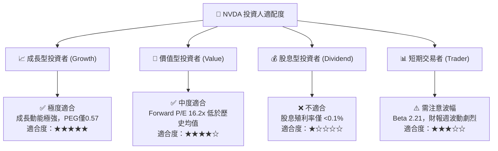

### 10.5 每季財報監控清單（Quarterly Watch List）

為確保本報告之投資論點持續有效，投資人應於每季財報公佈時進行以下量化指標追蹤：

| 追蹤項目 | 關鍵指標 (KPI) | 基準值 (Current) | 多頭維持門檻 | 減碼警訊門檻 |
|----------|----------------|------------------|--------------|--------------|
| **Data Center 營收** | 單季營收金額 | $70B+ / 季 | QoQ > +10% | QoQ < 0% |
| **整體毛利率** | Non-GAAP Gross Margin | 74.1% | 保持在 70.0% 以上 | 跌破 68.0% |
| **營運現金流** | 季度 OCF | $50.34B | > $35.0B / 季 | < $25.0B / 季 |
| **庫存週轉天數** | Days Inventory Outstanding | ~105 天 | < 120 天 | > 150 天 |
| **前瞻估值倍數** | Forward P/E Ratio | 16.22x | < 25.0x | > 45.0x (泡沫化) |

### 10.6 反面論證：什麼會證明論點錯誤（What Would Change My Mind）

機構級研究必須明確列出可被證偽（Falsifiable）的條件。若發生以下情況，本報告之**買入**論點將正式失效：

```
╔══════════════════════════════════════════════════════════════════╗
║              ⚠️ 論點失效條件（Disconfirming Evidence）           ║
╠══════════════════════════════════════════════════════════════════╣
║  若發生下列任一可量化情境，將調整評級至「賣出/觀望」：           ║
║                                                                  ║
║  1. 核心 Data Center 營收連續兩季 YoY 成長率跌破 +15.0%。        ║
║  2. 營業利潤率因競爭加劇或成本上升而較峰值收縮超過 15 pp         ║
║     （即跌破 50.6%）。                                           ║
║  3. 自由現金流 (FCF) 現金轉換率（FCF / Net Income）連續兩季跌破  ║
║     50.0%，顯示營運資金大量積壓或 CapEx 效益暴跌。               ║
║  4. ROIC 跌破 30.0%（儘管仍高於 WACC 15%，但代表資本邊際效益大幅 ║
║     遞減）。                                                     ║
║  5. Google TPU v6 及 AMD MI350/400 於四大 Hyperscaler 內之合算  ║
║     算力市佔率突圍超過 30.0%。                                   ║
╚══════════════════════════════════════════════════════════════════╝
```

---

> **免責聲明**：本報告為 AI 輔助機構級研究分析，內容僅供學術與投資參考，不構成任何買賣金融工具之要約或要約引誘。投資人應根據自身風險承受能力與財務狀況獨立作出投資決策。