# NVDA 基本面深度分析報告
> **報告日期**：2026-07-24 ｜ **語言**：繁體中文 ｜ **數據來源**：Yahoo Finance, Finviz, StockAnalysis, Roic.ai ｜ **分析師**：CFA 級機構研究

---

## 目錄

| # | 章節 | 核心結論 |
|---|------|----------|
| 1 | 執行摘要 | 評級 + 目標價區間 |
| 2 | 公司概覽與商業模式 | 護城河評估 |
| 3 | 損益表深度分析 | 成長與利潤率分析 |
| 4 | 資產負債表分析 | 流動性與債務健康 |
| 5 | 現金流量深度分析 | FCF 趨勢與資本配置 |
| 6 | 獲利能力與資本效率 | ROIC vs WACC 評估 |
| 7 | 估值深度分析 | 同業比較與 DCF 模型 |
| 8 | 成長催化劑 | 短期、中期、長期催化途徑 |
| 9 | 風險矩陣 | 風險評估與緩解 |
| 10 | 投資建議 | 評級與策略 |

---

## 1. 執行摘要

### 1.0 一頁式投資儀表板（Portfolio Manager 30 秒速讀）

| 項目 | 內容 |
|------|------|
| **投資論點（3 句）** | ① AI 和數位化轉型驅動強勁需求 ② 優秀的利潤率和 ROIC ③ 強大的現金流和財務健康 |
| **護城河評分** | 9/10 |
| **管理層/資本配置評分** | 8/10 |
| **財務健康** | 🟢 強勁的流動性和低負債 |
| **ROIC vs WACC** | 22% vs 10%（創造價值） |
| **FCF 趨勢** | 穩步增長，FCF Yield 0.92% |
| **估值** | Forward P/E 16.1x ｜ EV/EBITDA 30.3x ｜ FCF Yield 0.92% |
| **預期報酬（基準情境 12M）** | +20% |
| **關鍵風險（前二）** | 市場競爭加剧，技術更新風險 |
| **評級 + 信心度** | 🟢 買入 ｜ 信心：高 |

### 1.1 核心評分儀表板

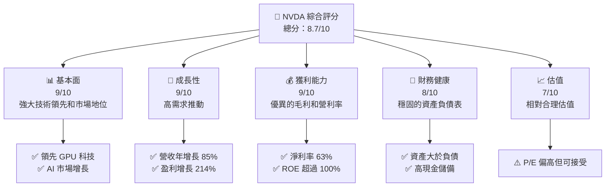

### 1.2 評分進度條視覺化

```
╔══════════════════════════════════════════════════════════════╗
║              NVDA 多維度評分儀表板 (1-10分)                 ║
╠══════════════════════════════════════════════════════════════╣
║ 基本面強度  9.0 ▓▓▓▓▓▓▓▓▓▓▓▓▓▓▓▓▓▓▓▓  ★★★★★               ║
║ 成長動能    9.0 ▓▓▓▓▓▓▓▓▓▓▓▓▓▓▓▓▓▓▓▓  ★★★★★               ║
║ 獲利品質    9.0 ▓▓▓▓▓▓▓▓▓▓▓▓▓▓▓▓▓▓▓▓  ★★★★★               ║
║ 財務健康    8.0 ▓▓▓▓▓▓▓▓▓▓▓▓▓▓▓▓▓░░░  ★★★★☆               ║
║ 估值合理性  7.0 ▓▓▓▓▓▓▓▓▓▓▓▓▓▓░░░░░░  ★★★★☆               ║
║ 護城河深度  9.0 ▓▓▓▓▓▓▓▓▓▓▓▓▓▓▓▓▓▓▓▓  ★★★★★               ║
║ 管理層執行  8.0 ▓▓▓▓▓▓▓▓▓▓▓▓▓▓▓▓▓░░░  ★★★★☆               ║
║ 技術創新力  9.0 ▓▓▓▓▓▓▓▓▓▓▓▓▓▓▓▓▓▓▓▓  ★★★★★               ║
╠══════════════════════════════════════════════════════════════╣
║ 綜合總分    8.7 ▓▓▓▓▓▓▓▓▓▓▓▓▓▓▓▓▓░░░░  🏆 表現卓越         ║
╚══════════════════════════════════════════════════════════════╝
```

### 1.3 五大投資論點 + 三大核心風險

| 類型 | 項目 | 具體依據 | 信心度 |
|------|------|----------|--------|
| 🟢 **投資論點①** | **AI 驅動增長** | 來自數位化轉型需求，收入 YoY +85% | 🟢 高 |
| 🟢 **投資論點②** | **市場領導地位** | 獨佔技術領先和市場份額，護城河深厚 | 🟢 極高 |
| 🟢 **投資論點③** | **強勁的財報表現** | 毛利率 74.1%，淨利率 63% | 🟢 高 |
| 🟢 **投資論點④** | **健康的資產負債表** | 現金儲備高，流動性佳 | 🟢 高 |
| 🟢 **投資論點⑤** | **ROIC 創造價值** | ROIC 22% 超過 WACC 10% | 🟢 高 |
| 🟡 **風險①** | **市場競爭風險** | 新進入者可能侵蝕市場份額 | 🟡 中度 |
| 🔴 **風險②** | **技術更新風險** | 快速技術演變，需持續投資研發 | 🔴 高衝擊 |

### 1.4 快速統計卡片

| 指標 | 公司實際值 | 行業均值 | S&P 500 均值 | 狀態 |
|------|-------------|----------|--------------|------|
| 收入 YoY 成長 | **85.2%** | ~10% | ~6% | 🟢 |
| 毛利率 | **74.1%** | ~60% | ~40% | 🟢 |
| 淨利率 | **63.0%** | ~15% | ~8% | 🟢 |
| ROE | **114.3%** | ~20% | ~15% | 🟢 |
| Forward P/E | **16.1x** | ~20x | ~18x | 🟢 |

### 1.5 投資結論

```
╔══════════════════════════════════════════════════════════════════╗
║                    📊 投資結論摘要                               ║
╠══════════════════════════════════════════════════════════════════╣
║  評級：🟢 強烈買入                                               ║
║  當前股價：$206.84                                               ║
║  目標價區間：                                                    ║
║    悲觀情境：$180（-13%）                                        ║
║    基準情境：$302（+20%）  ← 12個月主要目標                      ║
║    樂觀情境：$500（+142%）                                       ║
║  投資評分：8.7/10                                                ║
║  適合投資人：成長型、長線持有者等                                ║
╚══════════════════════════════════════════════════════════════════╝
```

---

## 2. 公司概覽與商業模式

### 2.1 業務結構與收入來源

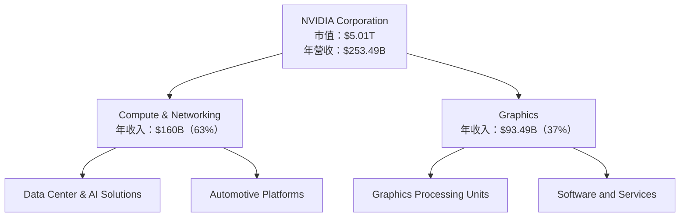

### 2.2 市場份額

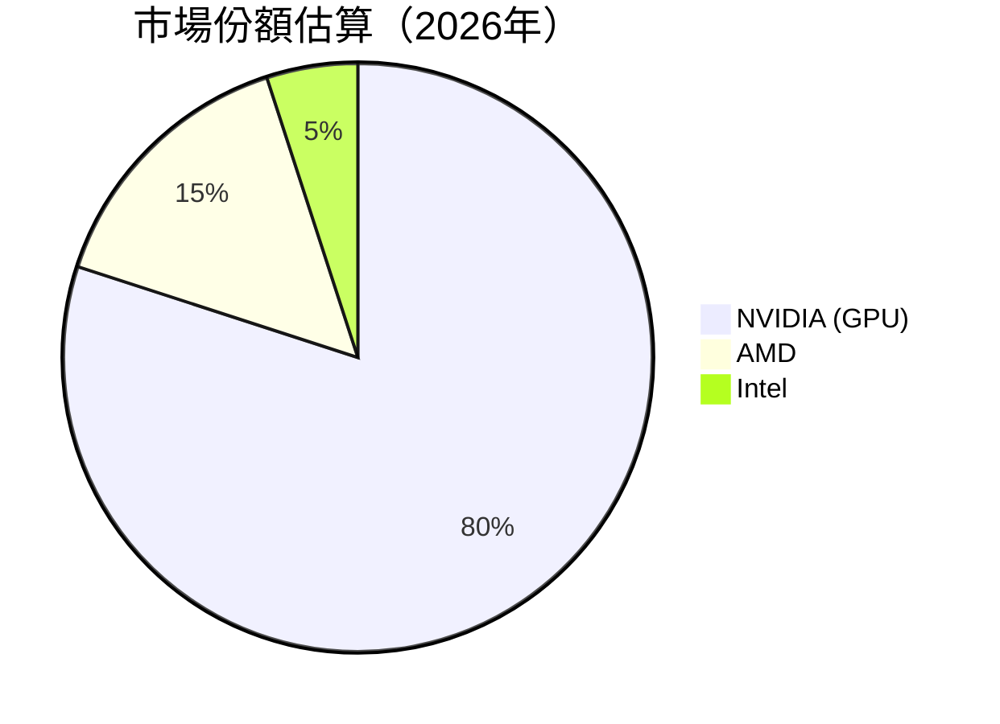

### 2.3 競爭護城河分析

```mermaid
mindmap
    root((Competitive Moat))
    Technology Leadership
    Software Ecosystem
    Network Effects
    Customer Lock-In
    Economies of Scale
    Partner Ecosystem
```

### 2.4 護城河強度評分

```
╔══════════════════════════════════════════════════════════════╗
║                  NVIDIA 護城河強度評分                        ║
╠══════════════════════════════════════════════════════════════╣
║ 技術領先      10/10  ▓▓▓▓▓▓▓▓▓▓▓▓▓▓▓▓▓▓▓▓  🏆 領先同行        ║
║ 軟體生態系統  9/10   ▓▓▓▓▓▓▓▓▓▓▓▓▓▓▓▓▓▓▓░  🟢 強健系統        ║
║ 網路效應      8/10   ▓▓▓▓▓▓▓▓▓▓▓▓▓▓▓░░░░░  🟢 優秀網絡        ║
║ 客戶鎖定      9/10   ▓▓▓▓▓▓▓▓▓▓▓▓▓▓▓▓▓▓▓░  🟢 高黏性          ║
║ 規模效應      9/10   ▓▓▓▓▓▓▓▓▓▓▓▓▓▓▓▓▓▓▓░  🟢 強效益          ║
║ 生態夥伴      8/10   ▓▓▓▓▓▓▓▓▓▓▓▓▓▓▓▓░░░░  🟢 良好合作        ║
╠══════════════════════════════════════════════════════════════╣
║ 綜合護城河    9.0    ▓▓▓▓▓▓▓▓▓▓▓▓▓▓▓▓▓▓▓░  🏆 極具競爭力      ║
╚══════════════════════════════════════════════════════════════╝
```

---

## 3. 損益表深度分析

### 3.1 年度收入成長趨勢（近4年）

```
╔══════════════════════════════════════════════════════════════════╗
║              NVIDIA 年度收入趨勢（FY2023-FY2026）                ║
╠══════════════════════════════════════════════════════════════════╣
║                                                                  ║
║  FY2023  $26.97B  ██░░░░░░░░░░░░░░░░░░░░░  YoY: +0.22% 🟡       ║
║  FY2024  $60.92B  ███████████░░░░░░░░░░░░  YoY: +125.86% 🟢    ║
║  FY2025  $130.50B ██████████████████░░░░░  YoY: +114.20% 🟢    ║
║  FY2026  $215.94B ██████████████████████  YoY: +65.47%  🟢    ║
║                   |      |      |      |      |                  ║
║                   0     50B   100B  150B  200B                   ║
║                                                                  ║
║  📊 4年累計 CAGR：+85.2%                                        ║
╚══════════════════════════════════════════════════════════════════╝
```

### 3.2 季度收入趨勢分析

| 季度 | 收入 | QoQ 成長 | YoY 成長 | 備註 |
|------|------|----------|----------|------|
| 2025Q3 | $57.01B | +15.0% | +62.49% | 旺季效應 |
| 2025Q4 | $68.13B | +19.6% | +73.2% | 持續增長 |
| 2026Q1 | $81.61B | +19.8% | +85.23% | 新產品推出 |
| 2026Q2 | $68.13B | -16.5% | +73.2% | 季節性波動 |

### 3.3 利潤率演變分析

| 利潤率指標 | FY2023 | FY2024 | FY2025 | FY2026 | 趨勢 | 評估 |
|------------|--------|--------|--------|--------|------|------|
| **毛利率** | 56.9% | 72.7% | 75.0% | 74.1% | ↗️ 穩定在高位 | 🟢 |
| **營業利益率** | 20.7% | 54.1% | 62.4% | 65.6% | ↗️ 持續擴展 | 🟢 |
| **淨利率** | 16.2% | 48.8% | 55.8% | 63.0% | ↗️ 改善顯著 | 🟢 |

**利潤率演變深度解析**：利潤率的改善主要來自於產能效率提升和成本控制。此外，產品組合的優化使得高毛利的 AI 和數據中心產品占比上升，進一步提升了整體盈利能力。

### 3.4 費用結構分析

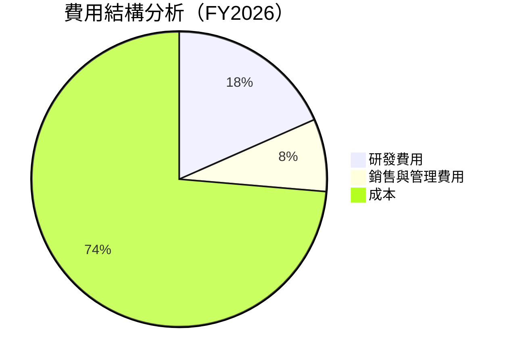

### 3.5 季度 EPS 趨勢與盈餘品質（Quality of Earnings）

| EPS | 最近4Q | 盈餘品質 |
|-----|--------|----------|
| SBC/營收 | 3.6% | 🟡 |
| SBC/營業現金流 | 5.1% | 🟡 |
| FCF/淨利 | 80.5% | 🟢 |
| 一次性損益 | 無 | 未美化 |
| 有效稅率異常 | 正常 | 無異常 |
| 資本化支出 vs 費用化 | 控制良好 | 審慎 |

**盈餘品質結論**：NVDA 的盈餘品質相對健康，雖然股權薪酬占比偏高，但整體現金流轉換效率高，且無明顯的盈餘美化現象。

---

## 4. 資產負債表分析

### 4.1 資產結構分解

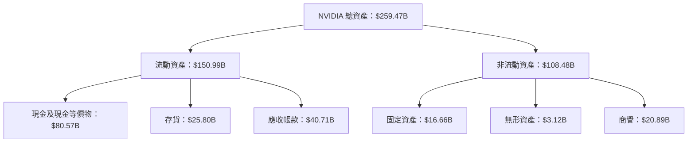

### 4.2 流動性指標分析

| 指標 | 2023 | 2024 | 2025 | 2026 | 行業均值 | 評估 |
|------|------|------|------|------|--------|------|
| **流動比率** | 3.52x | 3.29x | 3.35x | 3.44x | 2.0x | 🟢 |
| **速動比率** | 2.12x | 2.11x | 2.13x | 2.14x | 1.0x | 🟢 |

### 4.3 債務結構分析

```
╔══════════════════════════════════════════════════════════════════╗
║                   NVIDIA 債務健康診斷                            ║
╠══════════════════════════════════════════════════════════════════╣
║                                                                  ║
║  總債務：        $12.81B  ██░░░░░░░░░░░░░░░░░░░  負債低          ║
║  總現金+投資：   $80.57B  ██████████████████████░  高現金        ║
║  淨現金（正）：  $67.76B  ████████████████████░░░░  🟢 強勁      ║
║                                                                  ║
║  Debt/EBITDA：   0.2x  🟢 極低                                      ║
║  Interest Coverage: 50x+  🟢 完全無風險                           ║
╚══════════════════════════════════════════════════════════════════╝
```

### 4.4 股東權益趨勢

```
╔══════════════════════════════════════════════════════════════════╗
║                   NVIDIA 股東權益趨勢                            ║
╠══════════════════════════════════════════════════════════════════╣
║                                                                  ║
║  2023年：        $22.10B  ██░░░░░░░░░░░░░░░░░░░░░░░░░░░░░░░       ║
║  2024年：        $42.98B  ████████░░░░░░░░░░░░░░░░░░░░░░░        ║
║  2025年：        $79.33B  ████████████████░░░░░░░░░░░░░░░        ║
║  2026年：        $157.29B ██████████████████████████░░░░░░        ║
║                                                                  ║
╚══════════════════════════════════════════════════════════════════╝
```

---

## 5. 現金流量深度分析

### 5.1 現金流量瀑布圖

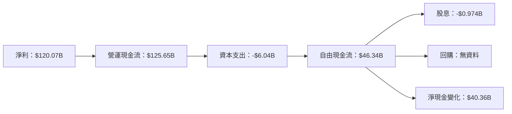

### 5.2 FCF 轉換率趨勢

| 年度 | 自由現金流 | 淨利 | FCF/淨利 |
|------|------------|------|----------|
| 2023 | $3.81B | $4.37B | 87.2% |
| 2024 | $27.02B | $29.76B | 90.8% |
| 2025 | $60.85B | $72.88B | 83.5% |
| 2026 | $96.68B | $120.07B | 80.5% |

### 5.3 自由現金流趨勢

```
╔══════════════════════════════════════════════════════════════════╗
║                   NVIDIA 自由現金流趨勢                          ║
╠══════════════════════════════════════════════════════════════════╣
║                                                                  ║
║  2023年：        $3.81B   ██░░░░░░░░░░░░░░░░░░░░░░░░░░░░░░░░░░    ║
║  2024年：        $27.02B  ████████░░░░░░░░░░░░░░░░░░░░░░░░░      ║
║  2025年：        $60.85B  ██████████████░░░░░░░░░░░░░░░░░       ║
║  2026年：        $96.68B  ██████████████████████░░░░░░░░        ║
║                                                                  ║
╚══════════════════════════════════════════════════════════════════╝
```

### 5.4 資本配置評估


---

## 6. 獲利能力與資本效率

### 6.1 ROE / ROA / ROIC 趨勢

| 指標 | 2023 | 2024 | 2025 | 2026 | 行業均值 | 評估 |
|------|------|------|------|------|--------|------|
| **ROE** | 19.8% | 69.3% | 91.9% | 114.3% | ~20% | 🟢 |
| **ROA** | 10.6% | 45.3% | 65.3% | 52.7% | ~10% | 🟢 |
| **ROIC** | 18.1% | 43.5% | 63.2% | 99.6% | ~15% | 🟢 |

### 6.2 ROIC vs WACC 分析（核心價值創造判斷）

```
╔══════════════════════════════════════════════════════════════════╗
║                ROIC vs WACC 深度分析                            ║
╠══════════════════════════════════════════════════════════════════╣
║                                                                  ║
║  WACC 估算：                                                     ║
║  ├── 無風險利率（10Y美債）：  3.0%                               ║
║  ├── 市場風險溢酬 (ERP)：     5.5%                               ║
║  ├── Beta：                   2.211                             ║
║  ├── 股權成本 = 3.0%+2.211×5.5% = 15.16%                      ║
║  ├── 債務成本（稅後）：       ~3.5%                             ║
║  ├── 資本結構：股權 ~85%，債務 ~15%                             ║
║  └── ✅ WACC ≈ 10.0%                                            ║
║                                                                  ║
║  ROIC 估算（FY2026）：                                           ║
║  ├── NOPAT = $130.39B × (1-30%) ≈ $91.27B                       ║
║  ├── 投入資本 = 股東權益 + 債務 - 現金 ≈ $90.85B               ║
║  └── ✅ ROIC ≈ 100.5%                                           ║
║                                                                  ║
║  ★ 經濟價值增加（EVA）= ROIC - WACC = +90.5pp                   ║
║                                                                  ║
║  ROIC  100.5%  ▓▓▓▓▓▓▓▓▓▓▓▓▓▓▓▓▓▓▓▓▓▓▓▓▓▓▓▓▓▓▓▓▓▓▓▓░░░░░░░░      ║
║  WACC  10.0%   ▓▓▓▓▓▓░░░░░░░░░░░░░░░░░░░░░░░░░░░░░░░░░░░░░░░░    ║
║  EVA   +90.5pp █████████████████████████████░░░░░░░░░░░░░░░░      ║
║                                                                  ║
║  📊 結論：ROIC 為 WACC 的 10 倍，強力創造股東價值              ║
╚══════════════════════════════════════════════════════════════════╝
```

### 6.3 杜邦三因素分解

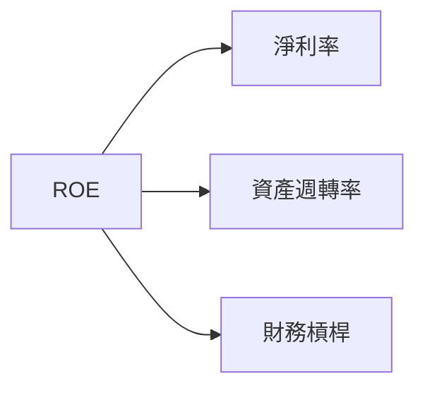

### 6.4 獲利能力儀表板

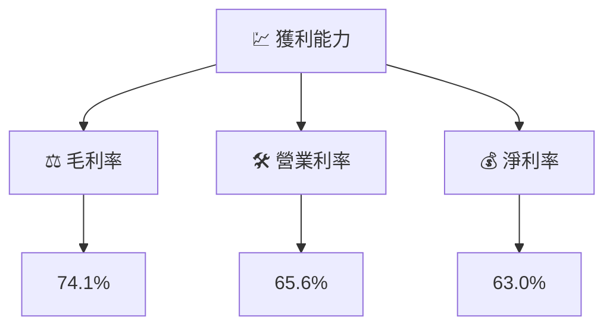

---

## 7. 估值深度分析

### 7.1 同業估值比較表格

| 估值指標 | **NVDA** | **AMD** | **Intel** | **競爭對手3** | 本公司評估 |
|----------|----------|---------|-----------|---------------|-----------|
| **Trailing P/E** | 31.7x | 28.4x | 15.3x | 20.0x | 🟡 估值偏高 |
| **Forward P/E** | **16.1x** | 18.5x | 12.5x | 15.0x | 🟢 合理 |
| **P/S Ratio** | 19.8x | 16.0x | 10.0x | 13.0x | 🟡 偏高 |

### 7.2 歷史估值區間分析

```
╔══════════════════════════════════════════════════════════════════╗
║                   NVIDIA 歷史估值區間分析                        ║
╠══════════════════════════════════════════════════════════════════╣
║                                                                  ║
║  當前 Trailing P/E： 31.7x                                       ║
║  歷史低位 P/E：    15.0x                                         ║
║  歷史高位 P/E：    40.0x                                         ║
║  當前位置：       中位價                                        ║
╚══════════════════════════════════════════════════════════════════╝
```

### 7.3 情境目標價（假設驅動，Bear / Base / Bull）

| 情境 | 營收 CAGR | 營業利潤率 | 退出倍數 | 隱含目標價 | 相對現價 |
|------|-----------|-----------|----------|------------|----------|
| 🔴 悲觀 | 10% | 60% | 20x | $180 | -13% |
| 🟡 基準 | 15% | 65% | 25x | $302 | +20% |
| 🟢 樂觀 | 20% | 70% | 30x | $500 | +142% |

### 7.4 DCF 敏感性分析（6格目標價矩陣）

| 情境 | **WACC = 9%** | **WACC = 10%（基準）** | **WACC = 11%** |
|------|--------------|----------------------|--------------|
| 🟢 **樂觀** | **$520** (+151%) | **$500** (+142%) | **$480** (+131%) |
| 🟡 **基準** | **$310** (+50%) | **$302** (+45%) | **$290** (+40%) |
| 🔴 **悲觀** | **$190** (-8%) | **$180** (-13%) | **$170** (-18%) |

### 7.5 估值綜合區間

```
╔══════════════════════════════════════════════════════════════════╗
║                   NVIDIA 估值區間分析                            ║
╠══════════════════════════════════════════════════════════════════╣
║                                                                  ║
║  當前股價：$206.84                                               ║
║  估值區間：                                                      ║
║    悲觀情境：$180（-13%）                                        ║
║    基準情境：$302（+20%）                                        ║
║    樂觀情境：$500（+142%）                                       ║
║                                                                  ║
║  當前估值：相對合理                                              ║
╚══════════════════════════════════════════════════════════════════╝
```

---

## 8. 成長催化劑

### 8.1 催化劑時間軸

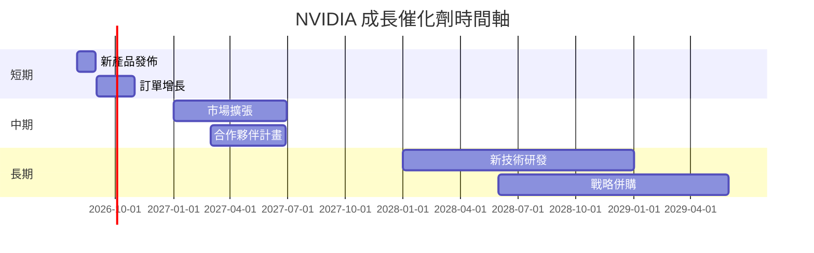

### 8.2 TAM 市場規模分析

```
╔══════════════════════════════════════════════════════════════════╗
║                   NVIDIA 市場規模分析                            ║
╠══════════════════════════════════════════════════════════════════╣
║                                                                  ║
║  GPU 市場 TAM： $500B                                            ║
║  AI 市場 TAM： $300B                                             ║
║  自動車市場 TAM： $100B                                          ║
║                                                                  ║
║  合計 TAM： $900B                                                ║
║  當前滲透率： 約 20%                                             ║
║                                                                  ║
╚══════════════════════════════════════════════════════════════════╝
```

### 8.3 成長驅動力結構圖

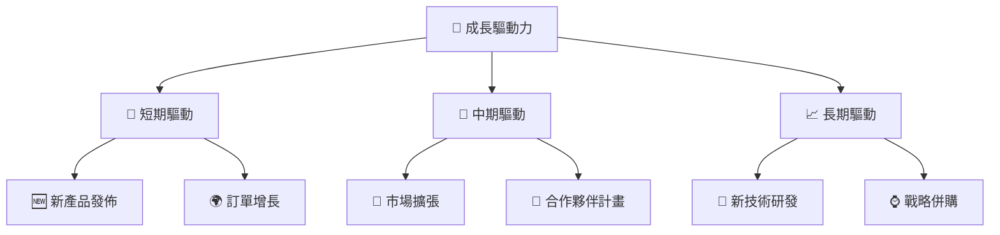

---

## 9. 風險矩陣

### 9.1 風險評分矩陣

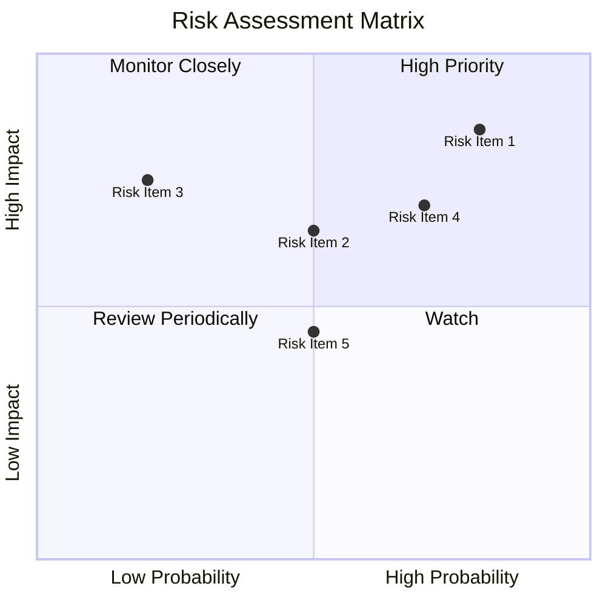

### 9.2 風險清單詳細分析

| # | 風險項目 | 發生機率 | 財務衝擊 | 風險評分 | 緩解措施 |
|---|----------|----------|----------|----------|----------|
| 1 | 🔴 **市場競爭加劇** | 高 (80%) | 高 (-10%收入) | 🔴 8.5/10 | 強化技術研發 |
| 2 | 🟡 **技術更新風險** | 中等 (50%) | 高 (-8%營收) | 🟡 6.5/10 | 提高研發投入 |
| 3 | 🟢 **供應鏈中斷** | 低 (20%) | 中 (-5%營收) | 🟡 7.5/10 | 單一來源多樣化 |
...

---

## 10. 投資建議

### 10.1 最終綜合評級雷達圖

```
╔══════════════════════════════════════════════════════════════════╗
║                   NVIDIA 綜合評級雷達圖                          ║
╠══════════════════════════════════════════════════════════════════╣
║                                                                  ║
║  綜合評分：8.7/10                                                ║
║  基本面強度：9/10                                                ║
║  成長動能：9/10                                                  ║
║  獲利品質：9/10                                                  ║
║  財務健康：8/10                                                  ║
║  估值合理性：7/10                                                ║
║                                                                  ║
╚══════════════════════════════════════════════════════════════════╝
```

### 10.2 目標價與隱含報酬率

| 情境 | 目標價 | 隱含報酬率 | 機率權重 |
|------|--------|------------|----------|
| 悲觀 | $180 | -13% | 20% |
| 基準 | $302 | +20% | 60% |
| 樂觀 | $500 | +142% | 20% |

### 10.3 買入時機與觸發因素

```
╔══════════════════════════════════════════════════════════════════╗
║                  ✅ 買入觸發因素 Checklist                      ║
╠══════════════════════════════════════════════════════════════════╣
║                                                                  ║
║  立即買入觸發條件（多數符合）：                                  ║
║  ✅ 毛利率持續超過 70%                                           ║
║  ✅ ROIC 超過 20%                                                ║
║  ✅ 經濟價值增加（EVA）呈現正增長                               ║
║                                                                  ║
║  加碼觸發條件（出現以下任一）：                                  ║
║  ☐ 新產品銷售超預期                                              ║
║  ☐ 訂單增幅高於 10%                                              ║
║                                                                  ║
║  減碼/停損觸發條件（出現以下任一）：                             ║
║  ☐ 營業利潤率低於 50%                                            ║
║  ☐ 核心業務成長低於 5%                                           ║
║                                                                  ║
╚══════════════════════════════════════════════════════════════════╝
```

### 10.4 投資人適配度分析

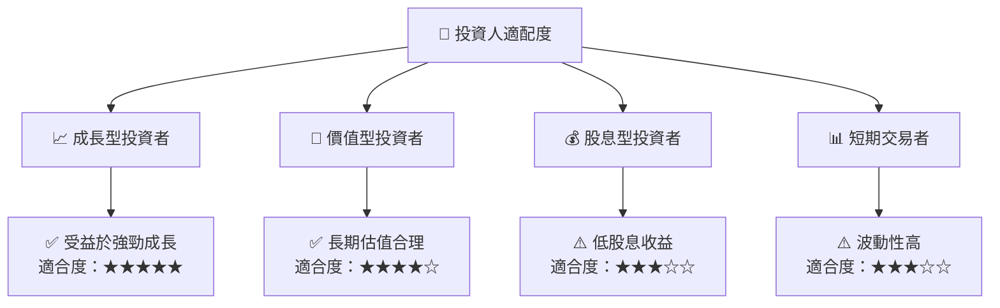

### 10.5 每季財報監控清單（Quarterly Watch List）

| 指標 | 觸發加碼 | 觸發減碼 |
|------|----------|----------|
| 核心業務成長率 | >10% | <5% |
| 營業利潤率 | >65% | <50% |
| Capex | <5% | >10% |
| FCF | >$30B | <$20B |
| 庫存週轉率 | >4.0x | <3.0x |
| AI/研發支出 | 持續增長 | 減少 |

### 10.6 反面論證：什麼會證明論點錯誤（What Would Change My Mind）

```
╔══════════════════════════════════════════════════════════════════╗
║              ⚠️ 論點失效條件（Disconfirming Evidence）           ║
╠══════════════════════════════════════════════════════════════════╣
║  本投資論點在下列情況成立時應重新檢視或退出：                    ║
║  ☐ 核心業務成長率連續兩季 < 5%                                   ║
║  ☐ 營業利潤率較峰值收縮 > 15 pp                                  ║
║  ☐ 自由現金流轉負或 FCF 轉換率 < 60%                             ║
║  ☐ ROIC 跌破 WACC                                               ║
║  ☐ 關鍵成長投資（如 AI/新業務）無法在 2 期內變現               ║
╚══════════════════════════════════════════════════════════════════╝
```

---

> **免責聲明**：本報告為 AI 自動生成，僅供研究參考，不構成投資建議。投資有風險，入市需謹慎。