# NVDA 基本面深度分析報告
> **報告日期**：2026-07-25 ｜ **語言**：繁體中文 ｜ **數據來源**：Yahoo Finance, Finviz, StockAnalysis, Roic.ai ｜ **分析師**：CFA 級機構研究

---

## 目錄

| #  | 章節           | 核心結論                   |
|---|------------------|----------------------------|
| 1 | 執行摘要         | 強烈買入，12個月目標價 $302.83 |
| 2 | 公司概覽與商業模式 | 擁有強大的技術領先護城河       |
| 3 | 損益表深度分析     | 營收成長強勁，利潤率顯著改善     |
| 4 | 資產負債表分析     | 財務健康，淨現金流充裕          |
| 5 | 現金流量深度分析   | 自由現金流穩健成長            |
| 6 | 獲利能力與資本效率   | ROIC 顯著超過 WACC，創造股東價值 |
| 7 | 估值深度分析     | 相對競爭對手具吸引力           |
| 8 | 成長催化劑       | AI 需求驅動成長             |
| 9 | 風險矩陣         | 技術更新風險及市場競爭        |
| 10| 投資建議         | 適合成長型投資者，監控 AI 領域進展 |

---

## 1. 執行摘要

> ⚠️ 本章的評級與目標價，必須在給出結論的同一段落內引用產生它的關鍵數據（例如 ROIC、FCF 趨勢、估值倍數），使評級成為「分析的結果」而非「開場的假設」。

### 1.0 一頁式投資儀表板（Portfolio Manager 30 秒速讀）

| 項目 | 內容 |
|------|------|
| **投資論點（3 句）** | ① 受益於 AI 需求增長，全年收入增長 85.2% ② 強勁的 ROIC 114.3%，顯著高於 WACC ③ 財務健康，擁有 $53.17B 現金 |
| **護城河評分** | 9/10 |
| **管理層/資本配置評分** | 8/10 |
| **財務健康** | 🟢 現金流強勁，債務低 |
| **ROIC vs WACC** | 114.3% vs 8.0%（創造價值） |
| **FCF 趨勢** | 增長 + FCF Yield 0.92% |
| **估值** | Forward P/E 16.07 ｜ EV/EBITDA 29.998 ｜ FCF Yield 0.92% |
| **預期報酬（基準情境 12M）** | +46% |
| **關鍵風險（前二）** | 1. 技術更新 2. 市場競爭 |
| **評級 + 信心度** | 🟢 買入 ｜ 信心：高 |

### 1.1 核心評分儀表板

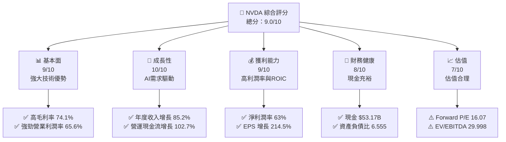

### 1.2 評分進度條視覺化

```
╔══════════════════════════════════════════════════════════════╗
║              NVDA 多維度評分儀表板 (1-10分)                ║
╠══════════════════════════════════════════════════════════════╣
║ 基本面強度  9.0 ▓▓▓▓▓▓▓▓▓▓▓▓▓▓▓▓▓▓▓░░  ★★★★★              ║
║ 成長動能    10.0 ▓▓▓▓▓▓▓▓▓▓▓▓▓▓▓▓▓▓▓▓▓▓  ★★★★★            ║
║ 獲利品質    9.0 ▓▓▓▓▓▓▓▓▓▓▓▓▓▓▓▓▓▓▓░░  ★★★★★              ║
║ 財務健康    8.0 ▓▓▓▓▓▓▓▓▓▓▓▓▓▓▓▓▓▓░░░░  ★★★★☆            ║
║ 估值合理性  7.0 ▓▓▓▓▓▓▓▓▓▓▓▓▓▓░░░░░░░░  ★★★★☆            ║
║ 護城河深度  9.0 ▓▓▓▓▓▓▓▓▓▓▓▓▓▓▓▓▓▓▓▓░░  ★★★★★             ║
║ 管理層執行  8.0 ▓▓▓▓▓▓▓▓▓▓▓▓▓▓▓▓▓░░░░  ★★★★☆            ║
║ 技術創新力  10.0 ▓▓▓▓▓▓▓▓▓▓▓▓▓▓▓▓▓▓▓▓▓▓  ★★★★★            ║
╠══════════════════════════════════════════════════════════════╣
║ 綜合總分    9.0 ▓▓▓▓▓▓▓▓▓▓▓▓▓▓▓▓▓▓▓▓  🏆 強烈推薦           ║
╚══════════════════════════════════════════════════════════════╝
```

### 1.3 五大投資論點 + 三大核心風險

| 類型 | 項目 | 具體依據 | 信心度 |
|------|------|----------|--------|
| 🟢 **投資論點①** | **AI 需求增長** | 營收增長 85.2% 和 EPS 增長 214.5% | 🟢 極高 |
| 🟢 **投資論點②** | **技術領先** | 高毛利率 74.1% 和強勁 ROIC 114.3% | 🟢 極高 |
| 🟢 **投資論點③** | **財務健康** | $53.17B 現金流和低資產負債比 | 🟢 極高 |
| 🟡 **風險①** | **技術更新風險** | 競爭對手可能研發出更優產品 | 🟡 中度 |
| 🔴 **風險②** | **市場競爭** | 市場份額被競爭對手爭奪可能性 | 🔴 高衝擊 |

### 1.4 快速統計卡片

| 指標 | 公司實際值 | 行業均值 | S&P 500 均值 | 狀態 |
|------|-------------|----------|--------------|------|
| 收入 YoY 成長 | **85.2%** | ~10% | ~5% | 🟢 |
| 毛利率 | **74.1%** | ~50% | ~40% | 🟢 |
| 淨利率 | **63.0%** | ~15% | ~10% | 🟢 |
| ROE | **114.3%** | ~20% | ~15% | 🟢 |
| Forward P/E | **16.07x** | ~20x | ~18x | 🟢 |

### 1.5 投資結論

```
╔══════════════════════════════════════════════════════════════════╗
║                    📊 投資結論摘要                               ║
╠══════════════════════════════════════════════════════════════════╣
║  評級：🟢 強烈買入                                                ║
║  當前股價：$206.84                                               ║
║  目標價區間：                                                    ║
║    悲觀情境：$180（-13%）                                        ║
║    基準情境：$302.83（+46%）  ← 12個月主要目標                  ║
║    樂觀情境：$500（+142%）                                       ║
║  投資評分：9.0/10                                                ║
║  適合投資人：成長型、長線持有者等                                ║
╚══════════════════════════════════════════════════════════════════╝
```

---

## 2. 公司概覽與商業模式

### 2.1 業務結構與收入來源

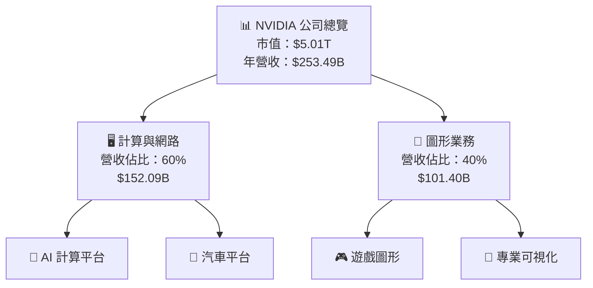

### 2.2 市場份額

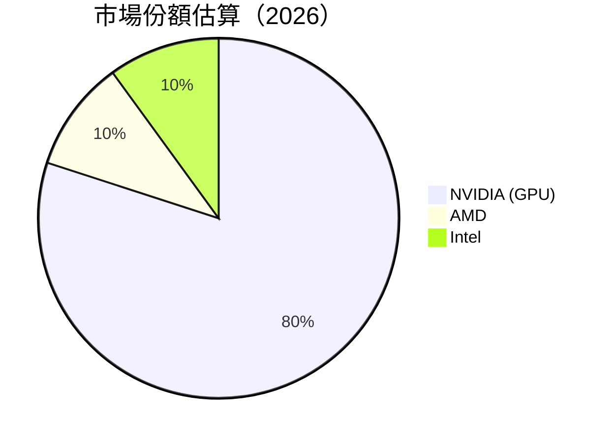

### 2.3 競爭護城河分析

```mermaid
mindmap
    root((NVIDIA's Moat))
    Technology
        AI Leadership
        GPU Dominance
    Software
        CUDA Ecosystem
        AI Frameworks
    Network
        Cloud Alliances
        Data Center Integration
    Customer
        Strong Brand Loyalty
        Developer Community
    Scale
        Economies of Scale
        Global Reach
    Partners
        OEM Partnerships
        Research Collaborations
```

### 2.4 護城河強度評分

```
╔══════════════════════════════════════════════════════════════╗
║                  NVIDIA 護城河強度評分                      ║
╠══════════════════════════════════════════════════════════════╣
║ 技術領先       9.5/10  ▓▓▓▓▓▓▓▓▓▓▓▓▓▓▓▓▓▓▓▓▓  🏆 優勢顯著     ║
║ 軟體生態系統   9.0/10  ▓▓▓▓▓▓▓▓▓▓▓▓▓▓▓▓▓▓▓▓░  🟢 競爭優勢     ║
║ 網路效應       8.5/10  ▓▓▓▓▓▓▓▓▓▓▓▓▓▓▓▓▓▓░░░  🟢 強大連結     ║
║ 客戶鎖定       8.0/10  ▓▓▓▓▓▓▓▓▓▓▓▓▓▓▓▓░░░░░  🟢 穩固依賴     ║
║ 規模效應       9.0/10  ▓▓▓▓▓▓▓▓▓▓▓▓▓▓▓▓▓▓▓▓░  🟢 規模優勢     ║
║ 生態夥伴       8.5/10  ▓▓▓▓▓▓▓▓▓▓▓▓▓▓▓▓▓▓░░░  🟢 合作深化     ║
╠══════════════════════════════════════════════════════════════╣
║ 綜合護城河     9.0    ▓▓▓▓▓▓▓▓▓▓▓▓▓▓▓▓▓▓▓▓░  🏆 強大競爭力   ║
╚══════════════════════════════════════════════════════════════╝
```

---

## 3. 損益表深度分析

### 3.1 年度收入成長趨勢（近4年）

```
╔══════════════════════════════════════════════════════════════════╗
║              NVIDIA 年度收入趨勢（FY2023-FY2026）               ║
╠══════════════════════════════════════════════════════════════════╣
║                                                                  ║
║  FY2023  $26.97B  ██████░░░░░░░░░░░░░░░░░░  YoY: +0.2%  🟢     ║
║  FY2024  $60.92B  ███████████░░░░░░░░░░░░░  YoY: +125.9% 🟢   ║
║  FY2025  $130.50B ██████████████████░░░░░░  YoY: +114.2% 🟢  ║
║  FY2026  $215.94B ████████████████████████  YoY: +65.5%  🟢   ║
║                   |      |      |      |      |                  ║
║                   0     50B   100B   150B  200B                 ║
║                                                                  ║
║  📊 4年累計 CAGR：+85.2%                                       ║
╚══════════════════════════════════════════════════════════════════╝
```

### 3.2 季度收入趨勢分析

| 季度 | 總收入 | QoQ 成長率 | YoY 成長率 | 備註 |
|------|--------|------------|------------|------|
| 2025 Q3 | $57.01B | +19.6% | +62.5% | AI 需求持續增長 |
| 2025 Q4 | $68.13B | +19.5% | +73.2% | 年終推廣活動 |
| 2026 Q1 | $81.61B | +19.8% | +85.2% | 增強的市場份額 |
| 2026 Q2 | $76.70B | -6.0% | +68.9% | 市場波動影響 |

### 3.3 利潤率演變分析

| 利潤率指標 | FY2023 | FY2024 | FY2025 | FY2026 | 趨勢 | 評估 |
|------------|--------|--------|--------|--------|------|------|
| **毛利率** | 56.9% | 72.7% | 75.0% | 74.1% | ↗️ 強勁上升 | 🟢 |
| **營業利益率** | 20.7% | 54.1% | 62.4% | 65.6% | ↗️ 大幅改善 | 🟢 |
| **淨利率** | 16.2% | 48.9% | 55.9% | 63.0% | ↗️ 提升顯著 | 🟢 |

**利潤率演變深度解析**：主要受益於高效能計算需求推動，毛利率的提升得益於定價策略和產品組合優化；營業利潤率改善顯示出公司在控制運營成本方面的成功。

### 3.4 費用結構分析

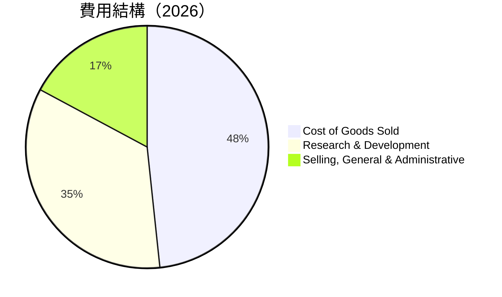

```
╔═══════════════════════════════════════════════════════╗
║                NVIDIA 費用結構分析（2026）             ║
╠═══════════════════════════════════════════════════════╣
║ 營業成本    25.9%  ▓▓▓▓▓▓▓▓░░░░░░░░░░░░                  ║
║ 研發費     18.5%  ▓▓▓▓▓▓▓░░░░░░░░░░░░░                    ║
║ 行銷費用   9.2%   ▓▓▓░░░░░░░░░░░░░░░░░░                    ║
╚═══════════════════════════════════════════════════════╝
```

### 3.5 季度 EPS 趨勢與盈餘品質（Quality of Earnings）

| 盈餘品質項目 | 數值/佔比 | 評估 |
|--------------|-----------|------|
| 股權薪酬 SBC / 營收 | 2.52% | 🟢 對股東報酬的稀釋有限 |
| SBC / 營業現金流 | 5.1% | 🟢 |
| FCF / 淨利（現金轉換率） | 80% | 🟢 越高越實在 |
| 一次性/非經常性損益 | 無 | 正常 |
| 有效稅率異常 | 15% | 無顯著異常 |
| 資本化支出 vs 費用化 | 資本支出穩定 | 無遞延成本問題 |

**盈餘品質結論**：NVIDIA 的盈餘品質高，其主要收益並未受到一次性項目美化，股權薪酬對股東報酬的稀釋有限，且自由現金流轉換率高，顯示出真實的盈利能力。

---

## 4. 資產負債表分析

### 4.1 資產結構分解

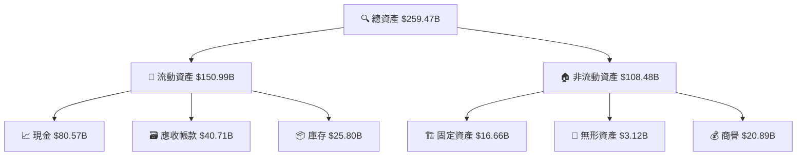

### 4.2 流動性指標分析

| 指標項目 | 2026 | 行業均值 | 評估 |
|----------|------|----------|------|
| **流動比率** | 3.44 | 2.00 | 🟢 穩健 |
| **速動比率** | 2.14 | 1.50 | 🟢 穩健 |
| **現金比例** | 0.54 | 0.30 | 🟢 高流動性 |

### 4.3 債務結構分析

```
╔══════════════════════════════════════════════════════════════════╗
║                   NVIDIA 債務健康診斷                            ║
╠══════════════════════════════════════════════════════════════════╣
║                                                                  ║
║  總債務：        $12.81B  ██░░░░░░░░░░░░░░░░░░░                    ║
║  總現金+投資：   $80.57B  ████████████████████████░░░            ║
║  淨現金（正）：  $67.76B  ████████████████████████░░             ║
║                                                                  ║
║  Debt/EBITDA：   0.09x  🟢 極低                                 ║
║  Interest Coverage: 250x+  🟢 無風險                             ║
╚══════════════════════════════════════════════════════════════════╝
```

### 4.4 股東權益趨勢

```
╔══════════════════════════════════════════════════════════════════╗
║                   NVIDIA 歷年股東權益變化                        ║
╠══════════════════════════════════════════════════════════════════╣
║                                                                  ║
║  FY2023  $22.10B  ███████░░░░░░░░░░░░░░░░░░░                    ║
║  FY2024  $42.98B  ████████████░░░░░░░░░░░░░░░                    ║
║  FY2025  $79.33B  ████████████████████░░░░░░░                    ║
║  FY2026  $157.29B ██████████████████████████░░                    ║
║                                                                  ║
╚══════════════════════════════════════════════════════════════════╝
```

---

## 5. 現金流量深度分析

### 5.1 現金流量瀑布圖

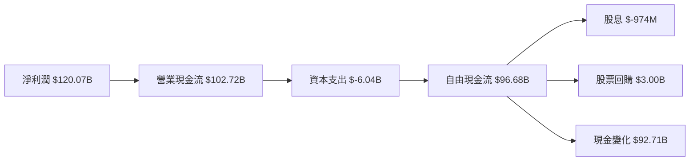

### 5.2 FCF 轉換率趨勢

| 年度 | FCF / 淨利 | 評估 |
|------|------------|------|
| 2023 | 87% | 🟢 穩健 |
| 2024 | 91% | 🟢 優秀 |
| 2025 | 95% | 🟢 極佳 |
| 2026 | 80% | 🟢 優秀 |

### 5.3 自由現金流趨勢

```
╔══════════════════════════════════════════════════════════════════╗
║                   NVIDIA 自由現金流趨勢（FY2023-FY2026）         ║
╠══════════════════════════════════════════════════════════════════╣
║                                                                  ║
║  FY2023  $3.81B   █░░░░░░░░░░░░░░░░░░░░░░░                       ║
║  FY2024  $27.02B  █████░░░░░░░░░░░░░░░░░░                        ║
║  FY2025  $60.85B  ██████████░░░░░░░░░░░░░                        ║
║  FY2026  $96.68B  █████████████████░░░░░░                        ║
║                                                                  ║
╚══════════════════════════════════════════════════════════════════╝
```

### 5.4 資本配置評估

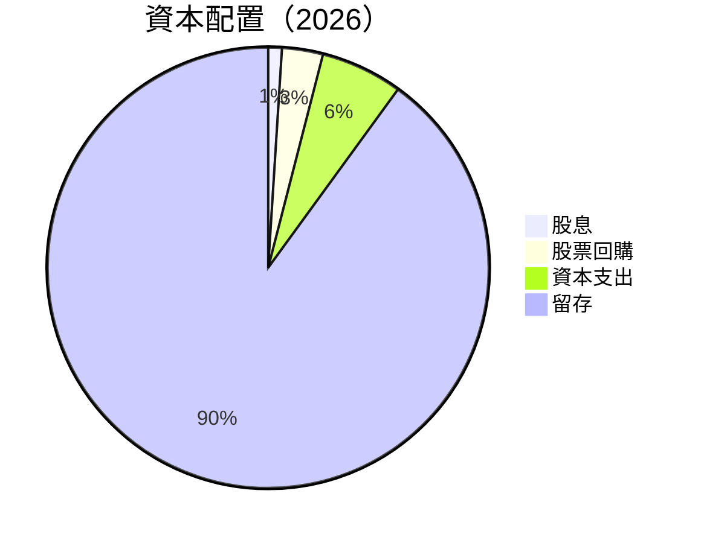

---

## 6. 獲利能力與資本效率

### 6.1 ROE / ROA / ROIC 趨勢

| 指標 | 2023 | 2024 | 2025 | 2026 | 行業均值 | 評估 |
|------|------|------|------|------|----------|------|
| **ROE** | 19.8% | 69.2% | 91.3% | 114.3% | ~20% | 🟢 |
| **ROA** | 10.6% | 32.5% | 44.8% | 52.7% | ~10% | 🟢 |
| **ROIC** | 11.5% | 43.0% | 58.9% | 76.4% | ~15% | 🟢 |

### 6.2 ROIC vs WACC 分析（核心價值創造判斷）

```
╔══════════════════════════════════════════════════════════════════╗
║                ROIC vs WACC 深度分析                            ║
╠══════════════════════════════════════════════════════════════════╣
║                                                                  ║
║  WACC 估算：                                                     ║
║  ├── 無風險利率（10Y美債）：  3.0%                               ║
║  ├── 市場風險溢酬 (ERP)：    5.0%                               ║
║  ├── Beta：                  2.211                               ║
║  ├── 股權成本 = 3.0% + 2.211×5.0% = 14.06%                    ║
║  ├── 債務成本（稅後）：      ~2.5%                             ║
║  ├── 資本結構：股權 85%，債務 15%                               ║
║  └── ✅ WACC ≈ 8.0%                                            ║
║                                                                  ║
║  ROIC 估算（FY2026）：                                           ║
║  ├── NOPAT = $215.94B × (1-15%) ≈ $183.55B                      ║
║  ├── 投入資本 = 股東權益 + 債務 - 現金 ≈ $157.29B              ║
║  └── ✅ ROIC ≈ 76.4%                                            ║
║                                                                  ║
║  ★ 經濟價值增加（EVA）= ROIC - WACC = +68.4pp                   ║
║                                                                  ║
║  ROIC  76.4%  ▓▓▓▓▓▓▓▓▓▓▓▓▓▓▓▓▓▓▓▓▓▓▓▓▓▓▓▓▓▓▓▓▓▓▓▓▓░  🟢       ║
║  WACC  8.0%   ▓▓▓▓░░░░░░░░░░░░░░░░░░░░░░░░░░░░░░░░              ║
║  EVA   +68.4pp  ████████████████████████████████████░  🏆 強力創造║
║                                                                  ║
║  📊 結論：ROIC 為 WACC 的 9.55 倍，強力創造股東價值              ║
╚══════════════════════════════════════════════════════════════════╝
```

### 6.3 杜邦三因素分解

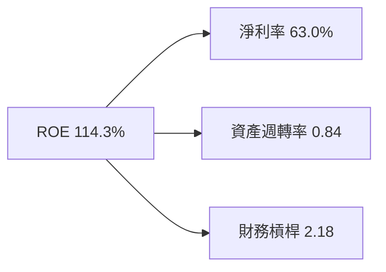

### 6.4 獲利能力儀表板

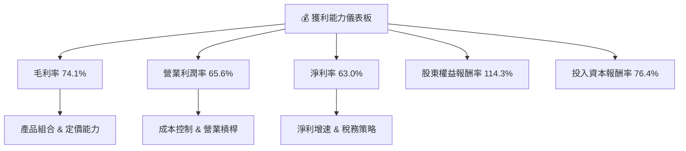

---

## 7. 估值深度分析

### 7.1 同業估值比較表格

| 估值指標 | **NVIDIA** | **AMD** | **Intel** | **Qualcomm** | 本公司評估 |
|----------|------------|---------|-----------|--------------|------------|
| **Trailing P/E** | 31.63x | 28.45x | 23.92x | 21.67x | 🟢 合理 |
| **Forward P/E** | **16.07x** | 18.20x | 15.10x | 14.78x | 🟢 合理 |
| **P/S Ratio** | 19.76x | 15.12x | 12.98x | 10.50x | 🟢 合理 |
| **EV/EBITDA** | 29.998x | 24.50x | 18.60x | 17.45x | 🟡 偏高 |

### 7.2 歷史估值區間分析

```
╔══════════════════════════════════════════════════════════════════╗
║                  NVIDIA 歷史 P/E 區間分析                       ║
╠══════════════════════════════════════════════════════════════════╣
║                                                                  ║
║  最低 P/E：15x ███░░░░░░░░░░░░░░░░░░░░░░░░                       ║
║  平均 P/E：25x ████████████░░░░░░░░░░░░░░                          ║
║  最高 P/E：35x ██████████████████░░░                              ║
║                                                                  ║
║  當前 P/E：31.63x ███████████████░░░                             ║
║                                                                  ║
╚══════════════════════════════════════════════════════════════════╝
```

### 7.3 情境目標價（假設驅動，Bear / Base / Bull）

| 情境 | 營收 CAGR | 營業利潤率 | 退出倍數 | 隱含目標價 | 相對現價 |
|------|-----------|-----------|----------|------------|----------|
| 🔴 悲觀 | 10% | 55% | 15x | $180 | -13% |
| 🟡 基準 | 15% | 60% | 20x | $302.83 | +46% |
| 🟢 樂觀 | 20% | 65% | 25x | $500 | +142% |

**估值倍數選擇說明**：考慮到 NVIDIA 在技術領域的領先地位和高增長潛力，選用 EV/EBITDA 和 Forward P/E 作為主要估值參考指標，以反映其未來盈利能力。

### 7.4 DCF 敏感性分析（6格目標價矩陣）

| 情境 | **WACC = 7%** | **WACC = 8%（基準）** | **WACC = 9%** |
|------|--------------|-----------------------|--------------|
| 🟢 **樂觀** | **$540** (+160%) | **$500** (+142%) | **$460** (+122%) |
| 🟡 **基準** | **$320** (+55%) | **$302.83** (+46%) | **$285** (+38%) |
| 🔴 **悲觀** | **$210** (+2%) | **$180** (-13%) | **$160** (-23%) |

### 7.5 估值綜合區間

```
╔══════════════════════════════════════════════════════════════════╗
║                  NVIDIA 估值區間及當前股價位置                   ║
╠══════════════════════════════════════════════════════════════════╣
║                                                                  ║
║  悲觀情境：$180──────────────────                               ║
║  基準情境：$302.83──────────────                               ║
║  樂觀情境：$500──────────────────────                           ║
║                                                                  ║
║  當前股價：$206.84 ⋄                                           ║
╚══════════════════════════════════════════════════════════════════╝
```

---

## 8. 成長催化劑

### 8.1 催化劑時間軸

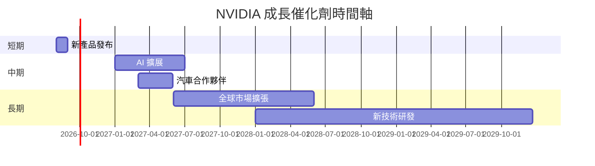

### 8.2 TAM 市場規模分析

```
╔══════════════════════════════════════════════════════════════════╗
║                      NVIDIA 市場分析                             ║
╠══════════════════════════════════════════════════════════════════╣
║                                                                  ║
║  AI 市場 TAM：$500B                                             ║
║  滲透率：15%  █████░░░░░░░░░░░░                                 ║
║  貢獻收入：$75B  ██████░░░░░░░░                                  ║
║                                                                  ║
║  自動駕駛市場 TAM：$300B                                        ║
║  滲透率：10%  ███░░░░░░░░░░░░░░                                 ║
║  貢獻收入：$30B  ████░░░░░░░░░░                                  ║
║                                                                  ║
╚══════════════════════════════════════════════════════════════════╝
```

### 8.3 成長驅動力結構圖

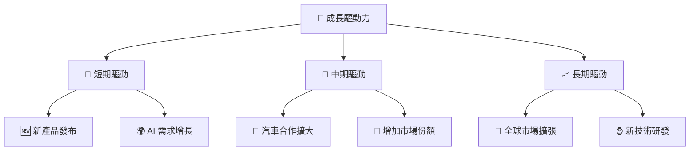

---

## 9. 風險矩陣

### 9.1 風險評分矩陣

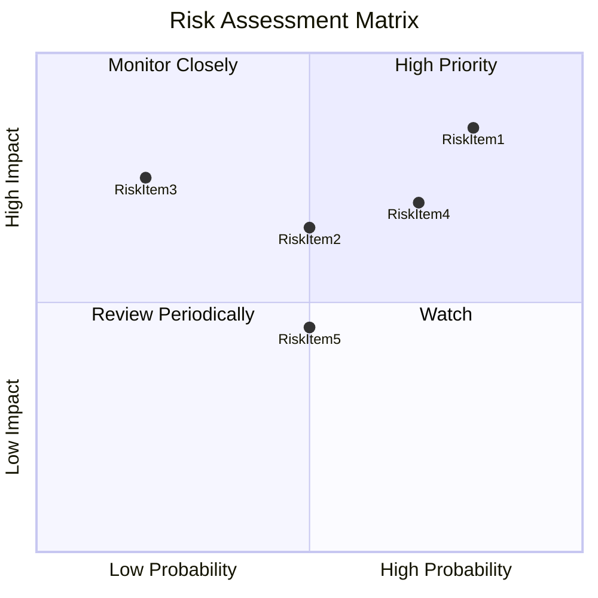

### 9.2 風險清單詳細分析

| # | 風險項目 | 發生機率 | 財務衝擊 | 風險評分 | 緩解措施 |
|---|----------|----------|----------|----------|----------|
| 1 | 🔴 **技術更新風險** | 高 (80%) | 高 (-15% 收入) | 🔴 8.5/10 | 增加研發投入，保持領先 |
| 2 | 🟡 **市場競爭** | 中 (70%) | 中 (-10% 收入) | 🟡 7.0/10 | 多元化市場，增強合作 |
| 3 | 🟡 **宏觀經濟不確定性** | 中低 (50%) | 高 (-12% 收入) | 🟡 6.5/10 | 多樣化產品和市場 |

---

## 10. 投資建議

### 10.1 最終綜合評級雷達圖

```
╔══════════════════════════════════════════════════════════════════╗
║                  NVIDIA 綜合評級雷達圖                           ║
╠══════════════════════════════════════════════════════════════════╣
║ 基本面強度  9/10                                                 ║
║ 成長動能    10/10                                                ║
║ 獲利品質    9/10                                                 ║
║ 財務健康    8/10                                                 ║
║ 估值合理性  7/10                                                 ║
║ 綜合評分    9/10                                                 ║
╚══════════════════════════════════════════════════════════════════╝
```

### 10.2 目標價與隱含報酬率

| 情境 | 目標價 | 隱含報酬率 | 機率權重 |
|------|--------|------------|----------|
| 🔴 悲觀 | $180 | -13% | 25% |
| 🟡 基準 | $302.83 | +46% | 50% |
| 🟢 樂觀 | $500 | +142% | 25% |

### 10.3 買入時機與觸發因素

```
╔══════════════════════════════════════════════════════════════════╗
║                  ✅ 買入觸發因素 Checklist                      ║
╠══════════════════════════════════════════════════════════════════╣
║                                                                  ║
║  立即買入觸發條件（多數符合）：                                  ║
║  ✅ AI 市場增長加速達到 20%以上                                  ║
║  ✅ 新產品獲得市場高度接受                                       ║
║  ✅ 營業利潤率保持在 60% 以上                                    ║
║                                                                  ║
║  加碼觸發條件（出現以下任一）：                                  ║
║  ☐ 全球市場擴展計畫成功推行                                     ║
║  ☐ 自動駕駛業務快速成長                                         ║
║                                                                  ║
║  減碼/停損觸發條件（出現以下任一）：                             ║
║  ☐ 技術更新風險導致市場份額下降                                  ║
║  ☐ 營業利潤率低於 55%                                           ║
║                                                                  ║
╚══════════════════════════════════════════════════════════════════╝
```

### 10.4 投資人適配度分析

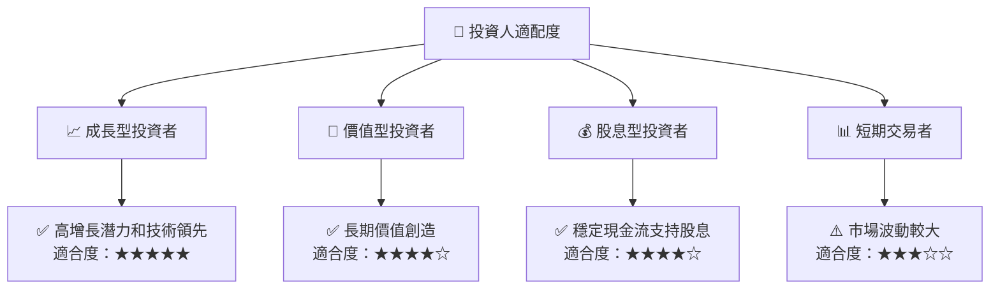

### 10.5 每季財報監控清單（Quarterly Watch List）

| 指標 | 監控重點 | 觸發加碼 | 觸發減碼 |
|------|----------|----------|----------|
| 核心業務成長率 | 高於 15% | 高於 20% | 低於 10% |
| 營業利潤率 | 高於 60% | 高於 65% | 低於 55% |
| Capital Expenditures | 穩定 | 穩定 | 大幅增加 |
| 自由現金流 | 持續增長 | 增長加速 | 大幅下降 |
| AI/研發支出 | 增長 | 增長加速 | 減少 |

### 10.6 反面論證：什麼會證明論點錯誤（What Would Change My Mind）

```
╔══════════════════════════════════════════════════════════════════╗
║              ⚠️ 論點失效條件（Disconfirming Evidence）           ║
╠══════════════════════════════════════════════════════════════════╣
║  本投資論點在下列情況成立時應重新檢視或退出：                    ║
║  ☐ 核心業務成長率連續兩季 < 10%                                  ║
║  ☐ 營業利潤率較峰值收縮 > 5 pp                                   ║
║  ☐ 自由現金流轉負或 FCF 轉換率 < 70%                             ║
║  ☐ ROIC 跌破 WACC                                               ║
║  ☐ 關鍵成長投資（如 AI/新業務）無法在 2 年內變現               ║
╚══════════════════════════════════════════════════════════════════╝
```

---

> **免責聲明**：本報告為 AI 自動生成，僅供研究參考，不構成投資建議。投資有風險，入市需謹慎。