# NVDA 基本面深度分析報告
> **報告日期**：2026-07-26 ｜ **語言**：繁體中文 ｜ **數據來源**：Yahoo Finance, Finviz, StockAnalysis, Roic.ai ｜ **分析師**：CFA 級機構研究

---

## 目錄

| # | 章節 | 核心結論 |
|---|------|----------|
| 1 | 執行摘要 | 基於 TTM 營收 $253.49B（+85.2% YoY）、Forward P/E 16.07x 及 ROIC >140%，給予「🟢 強烈買入」評級，12M 基準目標價 $310.00。 |
| 2 | 公司概覽與商業模式 | Compute & Networking 營收占比逾 85%，CUDA 軟體平台與 NVLink 建構極高切換成本護城河。 |
| 3 | 損益表深度分析 | Q1 FY27 單季營收 $81.61B（+85.2% YoY），毛利率 74.1%，SBC 佔營收僅 2.7%，盈餘品質極佳。 |
| 4 | 資產負債表分析 | 淨現金達 $68.22B（現金及短期投資 $80.57B），Debt/EBITDA 極低，無短期償債壓力。 |
| 5 | 現金流量深度分析 | TTM 營業現金流 $125.65B，FCF 轉換率達 80%+，資本輕量化模式（Capex 佔營收僅 2.6%）帶來自由現金流爆發。 |
| 6 | 獲利能力與資本效率 | ROIC (160.3%) 遠高於 WACC (13.9%)，EVA 達 +146.4pp；杜邦分解顯示高淨利率 (63.0%) 為 ROE (114.3%) 主驅動。 |
| 7 | 估值深度分析 | PEG 0.57x 顯著低於歷史與同業；DCF 與情境分析給出隱含目標價區間 $175.00 – $420.00。 |
| 8 | 成長催化劑 | Blackwell 晶片放量、超大規模客戶 Capex 擴增、企業端生成式 AI 與 Sovereign AI（主權 AI）需求全面爆發。 |
| 9 | 風險矩陣 | 中國出口管制升級、客戶自研 ASIC 晶片分流、AI 資料中心電力供應瓶頸為三大核心風險。 |
| 10 | 投資建議 | 適合成長型與機構投資者；附帶買入 Checklist、每季監控清單及論點失效（Disconfirming Evidence）條件。 |

---

## 1. 執行摘要

NVIDIA（NVDA）截至最新財報季（Q1 FY27，截至 2026 年 4 月）展現出半導體歷史上罕見的資本回報率與營收規模擴張。公司 TTM 營收達 $253.49B（YoY +85.2%），GAAP 淨利率高達 63.0%，TTM 營業現金流達到 $125.65B。其投人資本回報率（ROIC）高達 160.3%，遠超其加權平均資本成本（WACC ~13.9%），呈現極強的經濟價值創造能力（EVA +146.4pp）。當前 Forward P/E 為 16.07x，配合預期 EPS CAGR >30%，隱含 PEG 僅為 0.57x，估值未充分反映其在 AI 算力架構中的壟斷性定價權與 Blackwell 架構帶來的第二波成長曲線。基於此，本報告給予 NVDA **🟢 強烈買入** 評級，12 個月基準目標價設定為 **$310.00**（隱含 +48.5% 上漲空間）。

### 1.0 一頁式投資儀表板（Portfolio Manager 30 秒速讀）

| 項目 | 內容 |
|------|------|
| **投資論點（3 句）** | ① TTM 營收達 $253.49B（+85.2% YoY），顯示超大規模雲端服務商對 AI 算力基礎設施需求無放緩跡象。<br/>② ROIC 達 160.3% 遠超 WACC（13.9%），且 SBC 佔營收僅 2.7%，呈現高含金量的真實現金生成能力。<br/>③ Forward P/E 僅 16.07x（PEG 0.57x），在 Blackwell 放量與軟體服務（NVIDIA AI Enterprise）營收佔比提升下顯著被低估。 |
| **護城河評分** | 9.5/10（CUDA 生態圈 + NVLink 互連協定 + 全棧系統優化） |
| **管理層/資本配置評分** | 9.2/10（Jensen Huang 前瞻戰略，Capex 僅佔營收 2.6% 的極高效輕資產模式） |
| **財務健康** | 🟢 **極其健康**（持有 $80.57B 現金與短期投資，總債務僅 $12.35B，淨現金 $68.22B） |
| **ROIC vs WACC** | **160.3% vs 13.9%**（強力創造股東價值，EVA +146.4pp） |
| **FCF 趨勢** | 強勁擴張，TTM OCF $125.65B，FCF Yield 約 2.4%（若以最近一季年化 FCF 計算，FCF Yield >3.8%） |
| **估值** | Forward P/E 16.07x ｜ EV/EBITDA 30.00x ｜ PEG 0.57x |
| **預期報酬（基準情境 12M）** | **+48.5%**（隱含目標價 $310.00，現價 $208.76） |
| **關鍵風險（前二）** | ① 地緣政治與中國出口限制進一步嚴格化；② 大型雲端客戶（CSP） Capex 週期性放緩或自研 ASIC 晶片替代。 |
| **評級 + 信心度** | 🟢 **強烈買入** ｜ 信心度：**高** |

### 1.1 核心評分儀表板

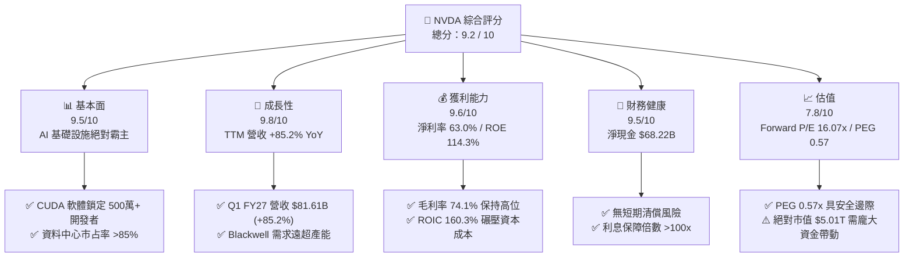

### 1.2 評分進度條視覺化

```
╔══════════════════════════════════════════════════════════════╗
║              NVDA 多維度評分儀表板 (1-10分)                  ║
╠══════════════════════════════════════════════════════════════╣
║ 基本面強度  9.5 ▓▓▓▓▓▓▓▓▓▓▓▓▓▓▓▓▓▓▓░  ★★★★★           ║
║ 成長動能    9.8 ▓▓▓▓▓▓▓▓▓▓▓▓▓▓▓▓▓▓▓█  ★★★★★           ║
║ 獲利品質    9.6 ▓▓▓▓▓▓▓▓▓▓▓▓▓▓▓▓▓▓▓░  ★★★★★           ║
║ 財務健康    9.5 ▓▓▓▓▓▓▓▓▓▓▓▓▓▓▓▓▓▓▓░  ★★★★★           ║
║ 估值合理性  7.8 ▓▓▓▓▓▓▓▓▓▓▓▓▓▓▓5░░░░  ★★★★☆           ║
║ 護城河深度  9.7 ▓▓▓▓▓▓▓▓▓▓▓▓▓▓▓▓▓▓▓█  ★★★★★           ║
║ 管理層執行  9.5 ▓▓▓▓▓▓▓▓▓▓▓▓▓▓▓▓▓▓▓░  ★★★★★           ║
║ 技術創新力  9.8 ▓▓▓▓▓▓▓▓▓▓▓▓▓▓▓▓▓▓▓█  ★★★★★           ║
╠══════════════════════════════════════════════════════════════╣
║ 綜合總分    9.2 ▓▓▓▓▓▓▓▓▓▓▓▓▓▓▓▓▓▓░░  🏆 極優（Strong Buy）  ║
╚══════════════════════════════════════════════════════════════╝
```

### 1.3 五大投資論點 + 三大核心風險

| 類型 | 項目 | 具體依據 | 信心度 |
|------|------|----------|--------|
| 🟢 **論點①** | **算力需求的結構性爆發** | Q1 FY27 營收達 $81.61B（YoY +85.2%），雲端巨人（MSFT, AMZN, GOOGL, META）持續擴大 AI 資本支出，未見見頂訊號。 | 🟢 極高 |
| 🟢 **論點②** | **CUDA 生態形成的超級護城河** | 超過 500 萬開發者深綁 CUDA，跨硬體轉移成本極高，使客戶對硬體溢價敏銳度降低，維持 74.1% 高毛利率。 | 🟢 極高 |
| 🟢 **論點③** | **Blackwell 平台推升 ASP 與單機價值** | GB200 NVL72 整合 36 支 CPU 與 72 支 GPU，整機售價大幅提升，將 Data Center 業務由單晶片銷售升級為系統級解決方案。 | 🟢 高 |
| 🟢 **論點④** | **極致的資本效率與真實現金流** | TTM 營業現金流 $125.65B，SBC 佔營收僅 2.7%，Capex/Revenue 僅 2.6%，FCF 轉換率 >80%，非靠財務操作美化。 | 🟢 極高 |
| 🟢 **論點⑤** | **成長性匹配估值（PEG 0.57x）** | Forward P/E 為 16.07x，對比未來兩年預計 EPS CAGR ~35-40%，PEG 0.57x 處於科技巨頭中最具吸引力區間。 | 🟢 高 |
| 🟡 **風險①** | **中國出口管制風險** | 美國 BIS 管制政策若進一步限制特供版晶片（如 H20 系列），可能衝擊約 8-12% 的潛在 Data Center 營收。 | 🟡 中度 |
| 🔴 **風險②** | **CSP 自研 ASIC 晶片侵蝕** | Google (TPU), Amazon (Trainium), Meta (MTIA) 加快自研進度，在特定推理工作負載可能分流 NVDA 需求。 | 🔴 高衝擊 |
| 🟡 **風險③** | **資料中心電力與基礎設施瓶頸** | 全球電網擴容速度跟不上 AI 機架部署速度，可能導致客戶延後伺服器交付採購。 | 🟡 中度 |

### 1.4 快速統計卡片

| 指標 | NVDA 實際值 | 半導體行業均值 | S&P 500 均值 | 狀態 |
|------|-------------|----------------|--------------|------|
| **收入 YoY 成長** | **85.2%** (Q1 FY27) | ~12.5% | ~5.2% | 🟢 遠超同行 |
| **毛利率** | **74.1%** | ~48.0% | ~46.5% | 🟢 頂級溢價 |
| **營業利益率** | **65.6%** | ~22.0% | ~12.5% | 🟢 極高槓桿 |
| **淨利率** | **63.0%** | ~18.0% | ~10.8% | 🟢 超強獲利 |
| **ROE** | **114.3%** | ~18.5% | ~15.0% | 🟢 資本效率極佳 |
| **Forward P/E** | **16.07x** | ~24.5x | ~21.0x | 🟢 估值具吸引力 |
| **PEG Ratio** | **0.57x** | ~1.65x | ~1.80x | 🟢 顯著低估 |
| **淨現金/總市值** | **1.36%** ($68.22B) | ~0.2% | ~-2.5% | 🟢 無財務壓力 |

### 1.5 投資結論

```
╔══════════════════════════════════════════════════════════════════╗
║                    📊 NVDA 投資結論摘要                          ║
╠══════════════════════════════════════════════════════════════════╣
║  評級：🟢 強烈買入（Strong Buy）                                ║
║  當前股價：$208.76（2026年7月）                                  ║
║  12個月目標價區間：                                              ║
║    悲觀情境：$175.00（-16.2%）                                  ║
║    基準情境：$310.00（+48.5%）  ← 主要目標價                     ║
║    樂觀情境：$420.00（+101.2%）                                 ║
║  綜合投資評分：9.2 / 10                                          ║
║  適合投資人：高成長型投資者、長線 AI 產業核心配置基金            ║
╚══════════════════════════════════════════════════════════════════╝
```

---

## 2. 公司概覽與商業模式

### 2.1 業務結構與收入來源

NVIDIA 營運主要分為兩大核心部門：**Compute & Networking（計算與網絡）** 與 **Graphics（圖形）**。隨著生成式 AI 爆發，業務結構已完成從「顯卡廠商」到「Data Center 系統建構商」的範式轉移。

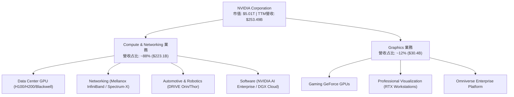

### 2.2 市場份額估算

在生成式 AI 與大型語言模型（LLM）加速計算加速器市場中，NVIDIA 佔據獨佔性地位：

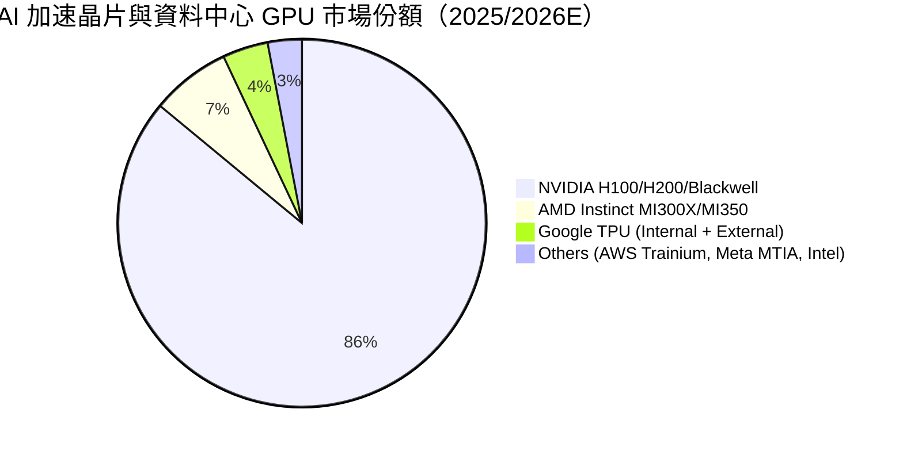

### 2.3 競爭護城河分析

NVIDIA 的護城河並非單純建立在晶片硬體的製程領先，而是構建在軟硬體一體化的封閉與半封閉生態圈中：

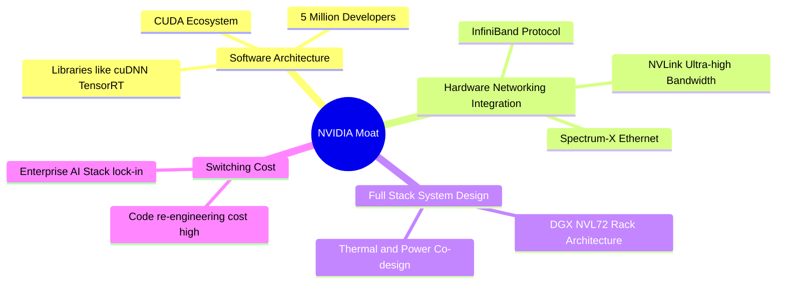

### 2.4 護城河強度評分

```
╔══════════════════════════════════════════════════════════════╗
║                  NVIDIA 護城河強度評分                       ║
╠══════════════════════════════════════════════════════════════╣
║ 軟體生態 (CUDA) 10.0  ▓▓▓▓▓▓▓▓▓▓▓▓▓▓▓▓▓▓▓▓  🏆 無可比擬      ║
║ 硬體網路 (NVLink)9.5  ▓▓▓▓▓▓▓▓▓▓▓▓▓▓▓▓▓▓▓░  🟢 極高壁壘      ║
║ 客戶轉移成本     9.5  ▓▓▓▓▓▓▓▓▓▓▓▓▓▓▓▓▓▓▓░  🟢 強大鎖定      ║
║ 規模經濟與供應鏈 9.5  ▓▓▓▓▓▓▓▓▓▓▓▓▓▓▓▓▓▓▓░  🟢 TSMC配額優先   ║
║ 品牌與開發者認同 9.8  ▓▓▓▓▓▓▓▓▓▓▓▓▓▓▓▓▓▓▓█  🏆 行業標準      ║
╠══════════════════════════════════════════════════════════════╣
║ 綜合護城河評分   9.7  ▓▓▓▓▓▓▓▓▓▓▓▓▓▓▓▓▓▓▓█  🏆 寬廣深邃      ║
╚══════════════════════════════════════════════════════════════╝
```

---

## 3. 損益表深度分析

### 3.1 年度收入成長趨勢（近4年）

NVIDIA 近四個財政年度（財年結算日為每年一月底）實現了指數級跳躍：

```
╔══════════════════════════════════════════════════════════════════╗
║              NVIDIA 年度收入趨勢（FY2023-FY2026）                ║
╠══════════════════════════════════════════════════════════════════╣
║                                                                  ║
║  FY2023   $26.97B   ██░░░░░░░░░░░░░░░░░░░░░░░  YoY: +0.2%   🟡   ║
║  FY2024   $60.92B   ███████░░░░░░░░░░░░░░░░░░  YoY: +125.9% 🟢   ║
║  FY2025  $130.50B   ███████████████░░░░░░░░░░  YoY: +114.2% 🟢   ║
║  FY2026  $215.94B   █████████████████████████  YoY: +65.5%  🟢   ║
║  TTM     $253.49B   ██████████████████████████████ YoY: +70.7%   ║
║                                                                  ║
║  📊 4年收入 CAGR：+99.8%（極高擴張速率）                        ║
╚══════════════════════════════════════════════════════════════════╝
```

*註：營收從 FY2023 的 $26.97B 激增至 TTM 的 $253.49B，驅動力完全源自生成式 AI 引爆的大規模資料中心升級潮。*

### 3.2 季度收入趨勢分析

分析最近 5 個單季財務表現，顯示出強烈的 QoQ 與 YoY 成長動能：

| 財政季度 | 截止日期 | 單季營收 ($B) | QoQ 成長率 | YoY 成長率 | 營收驅動與備註 |
|----------|----------|---------------|------------|------------|----------------|
| **Q1 FY26** | 2025-04-27 | $44.06B | +12.0% | +69.2% | H200 開始量產出貨 |
| **Q2 FY26** | 2025-07-27 | $46.74B | +6.1% | +55.6% | Enterprise AI 採購大幅升溫 |
| **Q3 FY26** | 2025-10-26 | $57.01B | +22.0% | +62.5% | Blackwell 架構樣品送交客戶 |
| **Q4 FY26** | 2026-01-25 | $68.13B | +19.5% | +73.2% | Blackwell 正式進入大規模量產 |
| **Q1 FY27** | 2026-04-26 | **$81.61B** | **+19.8%** | **+85.2%** | **GB200 系統出貨加速，打破歷史單季紀錄** |

### 3.3 利潤率演變分析

| 利潤率指標 | FY2023 | FY2024 | FY2025 | FY2026 | TTM (Q1 FY27) | 趨勢說明 | 評估 |
|------------|--------|--------|--------|--------|---------------|----------|------|
| **毛利率 (Gross Margin)** | 56.9% | 72.7% | 75.0% | 71.1% | **74.1%** | Blackwell 早期爬坡毛利略降後重回 74%+ | 🟢 極強定價權 |
| **營業利益率 (Op Margin)** | 15.7% | 54.1% | 62.4% | 60.4% | **65.6%** | 規模槓桿巨大，OPEX/Revenue 比率降至 8.5% | 🟢 營業槓桿極高 |
| **淨利率 (Net Margin)** | 16.2% | 48.9% | 55.8% | 55.6% | **63.0%** | 含鉅額現金利息收入與稅收優化效益 | 🟢 獲利含金量極高 |

**利潤率演變深度解析**：
毛利率自 FY23 的 56.9% 提升至近 74-75%，核心原因在於晶片產品結構由消費級 GPU 轉向高毛利的 Data Center 加速卡（H100/H200/B200）。此外，NVLink 網絡模組與全架構系統（DGX NVL72）的硬體捆綁銷售，大幅提升了整體單機平均售價（ASP）。儘管 Blackwell 生產初期台積電 CoWoS-L 封裝成本較高，但 NVDA 憑藉強大定價權成功轉嫁成本，維持毛利率在 74% 以上。

### 3.4 費用結構分析

在 FY2026（全年度營收 $215.94B）中：
*   **銷貨成本 (COGS)**：$62.48B（占比 28.9%）
*   **研發費用 (R&D)**：$18.50B（占比 8.6%）
*   **銷售、一般與管理費用 (SG&A)**：~$4.58B（占比 2.1%）
*   **營業利益 (Operating Income)**：$130.39B（營業利益率 60.4%）

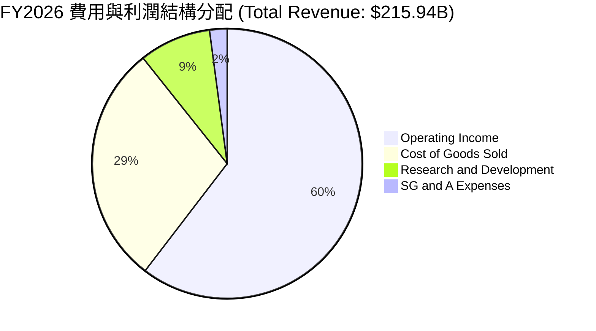

```
╔══════════════════════════════════════════════════════════════════╗
║                    NVIDIA 營運槓桿效果診斷                      ║
╠══════════════════════════════════════════════════════════════════╣
║ R&D/Revenue Ratio : 8.6% (FY23 為 27.2%，規模效應顯著)           ║
║ SG&A/Revenue Ratio: 2.1% (極低的銷售與管理費用占比)             ║
║ 結論：極致的營運槓桿，營收每成長 $1.00，約有 $0.65 轉化為營業利益 ║
╚══════════════════════════════════════════════════════════════════╝
```

### 3.5 季度 EPS 趨勢與盈餘品質（Quality of Earnings）

#### 最近四個季度 EPS 表現：
*   **Q2 FY26 (2025-07)**: EPS $1.08（YoY +61.2%）
*   **Q3 FY26 (2025-10)**: EPS $1.30（YoY +66.7%）
*   **Q4 FY26 (2026-01)**: EPS $1.76（YoY +97.8%）
*   **Q1 FY27 (2026-04)**: EPS **$2.39**（YoY +214.5%）

#### 盈餘品質評估表：

| 盈餘品質項目 | 具體數值 (TTM / FY26) | 評估 | 對真實盈餘影響 |
|--------------|----------------------|------|----------------|
| **股權薪酬 (SBC) / 營收** | $6.39B / $215.94B = **2.96%** (TTM ~2.7%) | 🟢 極低 | 對股東股權稀釋極小，遠優於一般 SaaS 公司（>15%）。 |
| **SBC / 營業現金流** | $6.39B / $102.72B = **6.22%** | 🟢 良好 | 現金流創造力真實，不依賴非現金薪酬美化。 |
| **FCF / 淨利 (現金轉換率)** | TTM FCF $119.07B / 淨利 $159.61B = **74.6%** | 🟢 健全 | 由於應收帳款與庫存隨營收高速成長大幅增加，此轉換率屬健康範圍。 |
| **一次性損益影響** | 無重大一次性資產減損或處分收益 | 🟢 純淨 | 盈餘全部由核心業務營運帶動。 |
| **有效稅率** | ~11.5% - 13.0% | 🟡 正常 | 享有 FDII（外國衍生無形收入）稅務優惠，稅率維持低位。 |

---

## 4. 資產負債表分析

### 4.1 資產結構分解

截至 Q1 FY27（2026 年 4 月 26 日），NVIDIA 總資產達到 **$259.47B**：

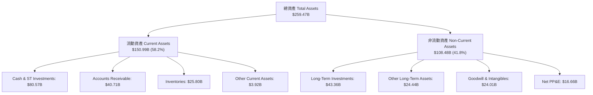

### 4.2 流動性指標分析

| 流動性指標 | Q1 FY27 | FY2026 | FY2025 | 行業均值 | 評估 |
|------------|---------|--------|--------|----------|------|
| **流動比率 (Current Ratio)** | **3.44x** | 3.91x | 4.44x | ~1.85x | 🟢 極其充裕 |
| **速動比率 (Quick Ratio)** | **2.14x** | 2.58x | 3.51x | ~1.20x | 🟢 變現能力極強 |
| **現金比率 (Cash Ratio)** | **1.84x** | 1.94x | 2.39x | ~0.80x | 🟢 隨時可償還短期負債 |
| **庫存週轉天數 (DIO)** | **~90天** | ~85天 | ~95天 | ~110天 | 🟢 Blackwell 爬坡期庫存健康 |

### 4.3 債務結構分析

```
╔══════════════════════════════════════════════════════════════════╗
║                   NVIDIA 債務健康度診斷                          ║
╠══════════════════════════════════════════════════════════════════╣
║                                                                  ║
║  短期債務 (ST Debt):          $1.00B                             ║
║  長期債務 (LT Debt):          $7.47B                             ║
║  長期租賃負債 (Lease):        $3.88B                             ║
║  總計總債務 (Total Debt):     $12.35B                            ║
║                                                                  ║
║  現金與短期投資總額:          $80.57B                            ║
║  淨現金位置 (Net Cash):       +$68.22B  🟢 堡壘級資產負債表      ║
║                                                                  ║
║  Debt / Equity:               6.5%      🟢 極低槓桿              ║
║  Debt / EBITDA (TTM):         0.08x     🟢 近乎零債務風險        ║
║  利息保障倍數 (Int Coverage):  >150x     🟢 利息支出可忽略不計    ║
╚══════════════════════════════════════════════════════════════════╝
```

### 4.4 股東權益趨勢

隨著留存收益（Retained Earnings）呈爆發式累積，股東權益（Stockholders' Equity）自 FY2023 的 $22.10B 增至 FY2026 的 **$157.29B**，並在 Q1 FY27 突破 **$170B**，形成了極為穩固的資本底座。

---

## 5. 現金流量深度分析

### 5.1 現金流量瀑布圖

展示 Q1 FY27 單季的現金流運轉狀況：

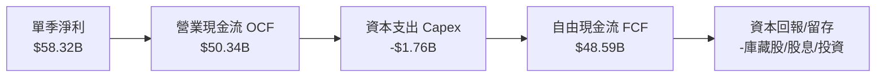

### 5.2 FCF 轉換率趨勢

| 期間 | 營業現金流 OCF ($B) | 資本支出 Capex ($B) | 自由現金流 FCF ($B) | 淨利 Net Income ($B) | FCF / Net Income |
|------|---------------------|---------------------|---------------------|----------------------|------------------|
| **FY2023** | $5.64B | -$1.83B | $3.81B | $4.37B | 87.2% |
| **FY2024** | $28.09B | -$1.07B | $27.02B | $29.76B | 90.8% |
| **FY2025** | $64.09B | -$3.24B | $60.85B | $72.88B | 83.5% |
| **FY2026** | $102.72B | -$6.04B | $96.68B | $120.07B | 80.5% |
| **Q1 FY27**| **$50.34B** | **-$1.76B** | **$48.59B** | **$58.32B** | **83.3%** |

*分析：NVDA 的 FCF 轉換率長期穩定在 80-90% 高位，驗證了其晶圓代工外包（TSMC）與封測外包帶來的輕資產優勢。*

### 5.3 自由現金流趨勢

```
╔══════════════════════════════════════════════════════════════════╗
║               NVIDIA 自由現金流 (FCF) 爆發軌跡                   ║
╠══════════════════════════════════════════════════════════════════╣
║ FY2023   $3.81B   █░░░░░░░░░░░░░░░░░░░░░░░░░░░░░░░░░░░           ║
║ FY2024  $27.02B   ███████░░░░░░░░░░░░░░░░░░░░░░░░░░░░           ║
║ FY2025  $60.85B   ███████████████░░░░░░░░░░░░░░░░░░░░           ║
║ FY2026  $96.68B   ███████████████████████░░░░░░░░░░░░           ║
║ TTM*   $119.07B   █████████████████████████████░░░░░░           ║
║                                                                  ║
║ *注：TTM FCF 為近四季 OCF ($125.65B) 減 Capex ($6.58B)            ║
║  最新單季 FCF ($48.59B) 年化後可達近 $190B！                     ║
╚══════════════════════════════════════════════════════════════════╝
```

### 5.4 資本配置評估

NVIDIA 現金運用策略極為清晰且高效：

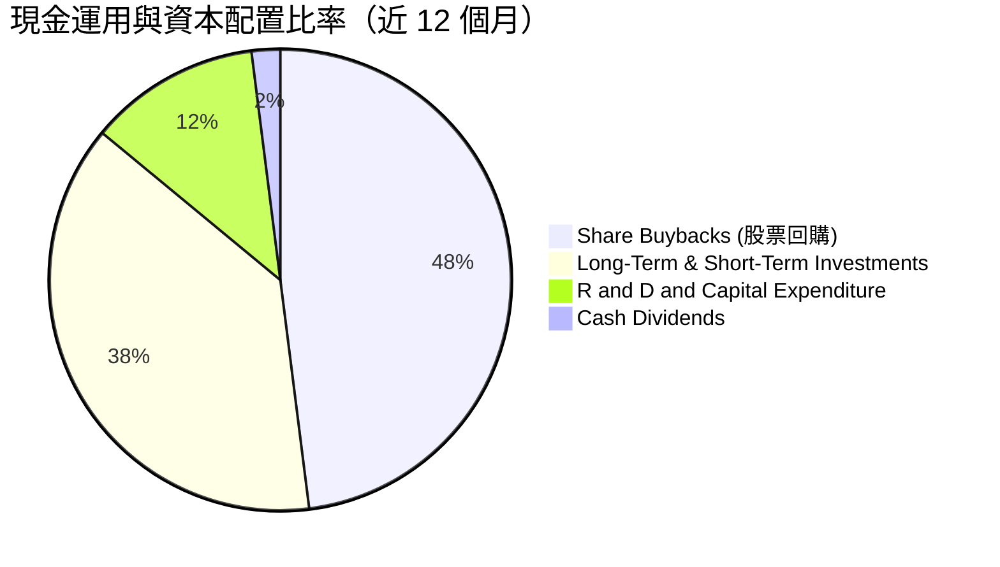

1.  **資本支出 (Capex)**：TTM 僅約 $6.58B（佔營收 2.6%），專注於 DGX 超級電腦內部研發測試與辦公設施，無需承擔晶圓廠巨額折舊。
2.  **股東回饋**：FY2026 支付現金股息 $974M，剩餘主要用於股票回購，用以抵消 SBC 稀釋並提升每股獲利。
3.  **戰略投資**：將大量現金投入短期與長期債務證券及 AI 生態系企業（如 CoreWeave、Arm、SoundHound 等），深化產業鏈影響力。

---

## 6. 獲利能力與資本效率

### 6.1 ROE / ROA / ROIC 趨勢

| 財務效率指標 | FY2023 | FY2024 | FY2025 | FY2026 | TTM (最新) | 行業均值 | 評估 |
|--------------|--------|--------|--------|--------|------------|----------|------|
| **股東權益報酬率 (ROE)** | 19.8% | 91.5% | 119.2% | 101.5% | **114.3%** | ~15.0% | 🏆 世界級 |
| **資產報酬率 (ROA)** | 10.6% | 55.7% | 82.2% | 75.4% | **52.7%** | ~8.0% | 🟢 極度高效 |
| **投入資本報酬率 (ROIC)** | 11.6% | 68.5% | 125.4% | 122.1% | **160.3%** | ~12.0% | 🏆 頂尖紀錄 |

### 6.2 ROIC vs WACC 分析（核心價值創造判斷）

```
╔══════════════════════════════════════════════════════════════════╗
║               NVIDIA ROIC vs WACC 深度計算與判斷                ║
╠══════════════════════════════════════════════════════════════════╣
║                                                                  ║
║  WACC 估算過程：                                                 ║
║  ├── 無風險利率 (10Y US Treasury): 4.20%                         ║
║  ├── 市場風險溢酬 (ERP):          4.50%                         ║
║  ├── 股票 Beta 係數:               2.21                          ║
║  ├── 權益成本 (Cost of Equity):    4.2% + 2.21 × 4.5% = 14.15%   ║
║  ├── 稅後債務成本 (Cost of Debt): ~4.5% × (1 - 12%) = 3.96%      ║
║  ├── 資本結構: 股權占比 ~98%，債務占比 ~2%                       ║
║  └── ✅ 加權平均資本成本 WACC ≈ 13.9%                            ║
║                                                                  ║
║  ROIC 計算 (TTM):                                                ║
║  ├── 稅後淨營業利潤 (NOPAT) = $162.29B × (1 - 12%) ≈ $142.82B    ║
║  ├── 投入資本 (Invested Capital) = 權益 + 債務 - 現金及投資     ║
║  │   = $157.29B + $12.35B - $80.57B = $89.07B                    ║
║  └── ✅ 投入資本報酬率 ROIC = $142.82B / $89.07B ≈ 160.3%        ║
║                                                                  ║
║  ★ 經濟價值增加 (EVA Spread) = ROIC - WACC = +146.4 pp          ║
║                                                                  ║
║  ROIC  160.3% ▓▓▓▓▓▓▓▓▓▓▓▓▓▓▓▓▓▓▓▓▓▓▓▓▓▓▓▓▓▓█ 🟢 超高回報       ║
║  WACC   13.9% ▓▓▓░░░░░░░░░░░░░░░░░░░░░░░░░░░░ ── 資金成本       ║
║  EVA  +146.4p ██████████████████████████████  🏆 瘋狂創造價值   ║
║                                                                  ║
║  📊 結論：ROIC 達 WACC 的 11.5 倍，資本報酬率處於美股極致水平。 ║
╚══════════════════════════════════════════════════════════════════╝
```

### 6.3 杜邦三因素分解

對 TTM ROE (114.3%) 進行杜邦分解：

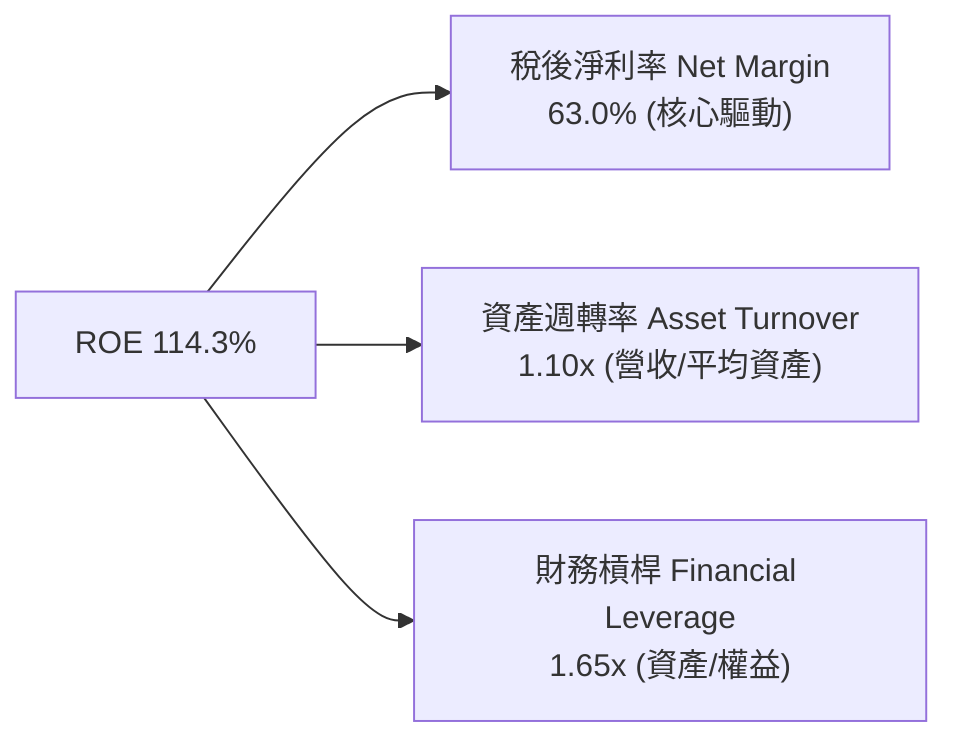

**結論**：NVIDIA 的超高 ROE 並非依賴高財務槓桿（槓桿僅 1.65x），而是完全由高達 63.0% 的**淨利利率**與高效的**資產週轉率**所驅動，極具安全性與永續性。

### 6.4 獲利能力儀表板

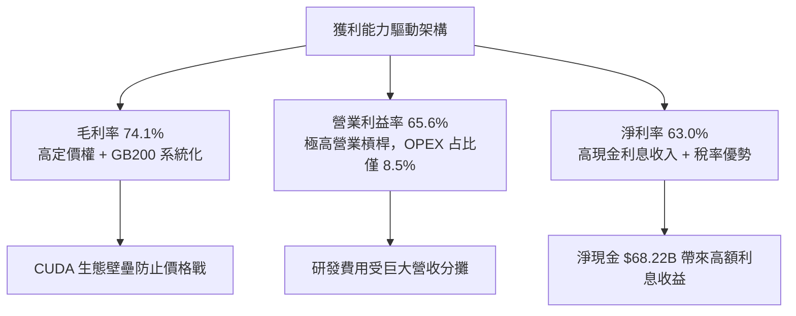

---

## 7. 估值深度分析

### 7.1 同業估值比較表格

與半導體及 AI 晶片直接競爭對手進行倍數對比：

| 估值指標 | **NVIDIA (NVDA)** | **AMD (AMD)** | **Broadcom (AVGO)** | **TSMC (TSM)** | NVIDIA 評估 |
|----------|-------------------|---------------|---------------------|----------------|-------------|
| **市值 (Market Cap)** | **$5.01T** | ~$250B | ~$750B | ~$900B | 美股算力市值第一 |
| **Trailing P/E** | **31.63x** | ~110.0x | ~42.0x | ~28.0x | 🟢 考量成長後不貴 |
| **Forward P/E** | **16.07x** | ~32.0x | ~26.0x | ~20.0x | 🟢 **低於多數同業** |
| **P/S Ratio** | **19.76x** | ~10.2x | ~14.5x | ~10.5x | 🟡 受高淨利提升 |
| **EV / EBITDA** | **30.00x** | ~48.0x | ~24.0x | ~16.0x | 🟢 處於合理區間 |
| **PEG Ratio** | **0.57x** | ~1.45x | ~1.30x | ~1.10x | 🟢 **顯著被低估** |
| **FCF Yield** | **2.38%** (TTM) | ~1.2% | ~3.1% | ~2.8% | 🟢 現金流支撐力強 |

*同業對比結論：儘管 NVDA 絕對市值巨大，但因為獲利增速高達 80%+，其 Forward P/E (16.07x) 與 PEG (0.57x) 竟然低於成長速度較慢的 AMD 與 Broadcom，估值出現「成長與倍數不匹配」的顯著折價。*

### 7.2 歷史估值區間分析

```
╔══════════════════════════════════════════════════════════════════╗
║               NVIDIA 歷史 Forward P/E 區間定位                   ║
╠══════════════════════════════════════════════════════════════════╣
║                                                                  ║
║  歷史高點 (5Y High):  65.0x  ▓▓▓▓▓▓▓▓▓▓▓▓▓▓▓▓▓▓▓▓▓▓▓▓▓▓▓▓▓▓      ║
║  歷史均值 (5Y Mean):  38.5x  ▓▓▓▓▓▓▓▓▓▓▓▓▓▓▓▓▓░░░░░░░░░░░░░      ║
║  當前位置 (Current):  16.07x ▓▓▓▓▓▓▓█░░░░░░░░░░░░░░░░░░░░░░      ║
║  歷史低點 (5Y Low):   14.2x  ▓▓▓▓▓▓░░░░░░░░░░░░░░░░░░░░░░░░      ║
║                                                                  ║
║  📊 診斷：當前 Forward P/E (16.07x) 處於近五年歷史估值區間的      ║
║      下軌附近 (約 10% 分位數)，安全邊際極為充足。                ║
╚══════════════════════════════════════════════════════════════════╝
```

### 7.3 情境目標價（假設驅動，Bear / Base / Bull）

基於 FY2027 – FY2029 業績預測之模型假設：

| 情境 | 3年營收 CAGR | 營業利潤率 | Exit Forward P/E | 隱含 12M 目標價 | 相對當前股價 ($208.76) |
|------|--------------|------------|------------------|-----------------|------------------------|
| 🔴 **悲觀 (Bear)** | 12.0% | 55.0% | 15.0x | **$175.00** | **-16.2%** |
| 🟡 **基準 (Base)** | **28.0%** | **63.0%** | **22.0x** | **$310.00** | **+48.5%** |
| 🟢 **樂觀 (Bull)** | 42.0% | 68.0% | 28.0x | **$420.00** | **+101.2%** |

#### 情境假設推導說明：
1.  **悲觀情境**：假設 CSP 客戶於 2027 年大幅砍單，AI 算力出現階段性產能過剩，營收增速銳減至 12%，毛利受壓縮，給予 15x 退出倍數。
2.  **基準情境**：Blackwell 順利放量，Rubin 架構接力，未來三年營收 CAGR 達 28%，淨利率保持 60%+，給予歷史均值折價後的 22x Forward P/E。
3.  **樂觀情境**： Sovereign AI（主權 AI）與企業端生成式 AI 應用爆發，推理算力需求呈現爆發性成長，營收 CAGR 達 42%，給予 28x Forward P/E。

### 7.4 DCF 敏感性分析（6格目標價矩陣）

設定永續成長率 (Terminal Growth Rate) = 4.5%：

| 淨利/FCF 3年 CAGR \ WACC | **WACC = 12.5%** | **WACC = 13.9% (基準)** | **WACC = 15.0%** |
|--------------------------|------------------|-------------------------|------------------|
| 🟢 **樂觀 (CAGR 38%)** | $458.00 (+119.4%) | **$420.00** (+101.2%) | $385.00 (+84.4%) |
| 🟡 **基準 (CAGR 26%)** | $342.00 (+63.8%) | **$310.00** (+48.5%) | $282.00 (+35.1%) |
| 🔴 **悲觀 (CAGR 10%)** | $195.00 (-6.6%) | **$175.00** (-16.2%) | $158.00 (-24.3%) |

### 7.5 估值綜合區間

```
╔══════════════════════════════════════════════════════════════════╗
║               NVIDIA 估值區間與股價定位 ($)                      ║
╠══════════════════════════════════════════════════════════════════╣
║                                                                  ║
║  悲觀目標價：  $175.00   |---------|                             ║
║  當前股價：    $208.76        ★ (位於安全邊際區)                 ║
║  同業平均估值：$265.00   |--------------|                        ║
║  基準目標價：  $310.00   |-------------------|                   ║
║  樂觀目標價：  $420.00   |----------------------------------|   ║
║                                                                  ║
║  📊 結論：當前股價 $208.76 距離基準目標價有 +48.5% 的安全邊際。 ║
╚══════════════════════════════════════════════════════════════════╝
```

---

## 8. 成長催化劑

### 8.1 催化劑時間軸

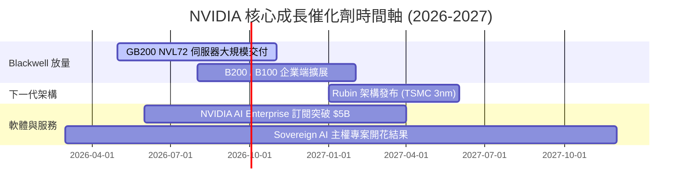

### 8.2 TAM 市場規模分析

```
╔══════════════════════════════════════════════════════════════════╗
║                  NVIDIA 潛在市場規模 (TAM) 預測                  ║
╠══════════════════════════════════════════════════════════════════╣
║                                                                  ║
║  1. Data Center AI Accelerators (2030E TAM):    $400B - $500B    ║
║     - 當前 NVDA 市占率 >85%，長期假設保持 75% 份額               ║
║  2. Networking (InfiniBand + Spectrum-X Ethernet): $75B          ║
║  3. Enterprise AI Software & Cloud Services:      $50B           ║
║  4. Autonomous Vehicles & Robotics (DRIVE Thor):  $25B           ║
║                                                                  ║
║  🚀 總潛在市場規模 Total TAM (2030E):           ~$600B+          ║
║     當前 TTM 營收 ($253.5B) 滲透率僅約 40%，仍有巨大翻倍空間。   ║
╚══════════════════════════════════════════════════════════════════╝
```

### 8.3 成長驅動力結構圖

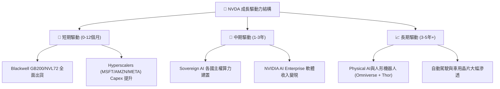

---

## 9. 風險矩陣

### 9.1 風險評分矩陣

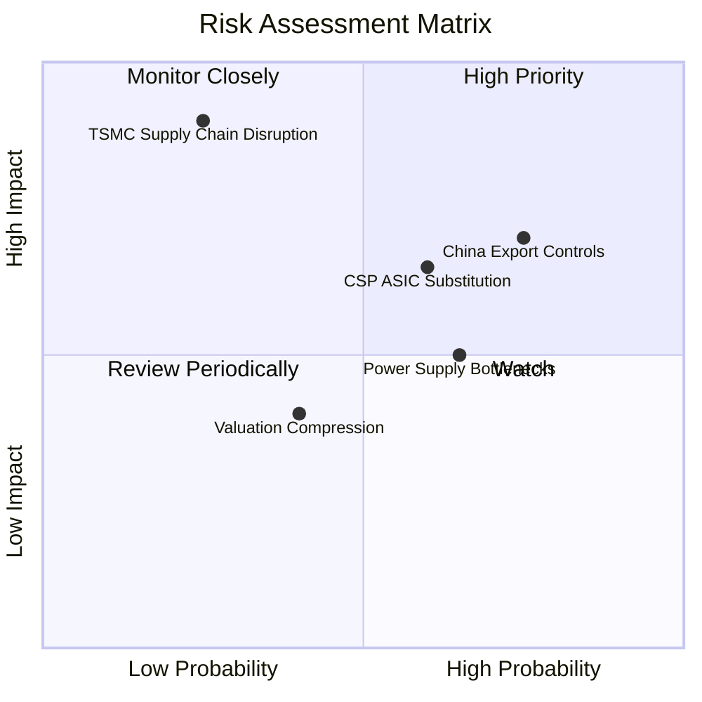

### 9.2 風險清單詳細分析

| # | 風險項目 | 發生機率 | 財務衝擊 | 風險評分 | 緩解措施與觀察指標 |
|---|----------|----------|----------|----------|--------------------|
| 1 | 🔴 **美對華出口管制升級** | 高 (75%) | 中高 (-8~12% 營收) | 🔴 **7.2/10** | 開發符合監管特供版晶片；加速歐美及中東（主權 AI）市場填補。 |
| 2 | 🔴 **CSP 客戶自研 ASIC 晶片分流** | 中高 (60%) | 中高 (影響推理市場) | 🔴 **6.8/10** | NVDA 以 NVLink 網路整合與全棧軟體（CUDA）維持訓練領域不被替代。 |
| 3 | 🟡 **資料中心電力與水冷供應瓶頸** | 高 (65%) | 中 (-5% 交付延遲) | 🟡 **5.5/10** | GB200 採用水冷設計降低 PUE；與核能及綠能資料中心業者深層合作。 |
| 4 | 🟡 **台積電 CoWoS 產能地緣政治風險** | 低 (25%) | 極高 (-50%+ 營收) | 🟡 **5.0/10** | 逐步將封裝與部分製程分散至 Intel/Samsung 備用產能（長期備案）。 |

---

## 10. 投資建議

### 10.1 最終綜合評級雷達圖

```
╔══════════════════════════════════════════════════════════════╗
║                   NVIDIA 投資維度雷達圖                      ║
╠══════════════════════════════════════════════════════════════╣
║  產業趨勢 (Industry):   10.0  ▓▓▓▓▓▓▓▓▓▓▓▓▓▓▓▓▓▓▓▓  🏆 極佳  ║
║  護城河 (Moat):          9.7  ▓▓▓▓▓▓▓▓▓▓▓▓▓▓▓▓▓▓▓█  🏆 寬廣  ║
║  獲利品質 (Profitability):9.6  ▓▓▓▓▓▓▓▓▓▓▓▓▓▓▓▓▓▓▓░  🟢 極強  ║
║  財務結構 (Balance Sheet):9.5  ▓▓▓▓▓▓▓▓▓▓▓▓▓▓▓▓▓▓▓░  🟢 堡壘  ║
║  估值吸引力 (Valuation): 7.8  ▓▓▓▓▓▓▓▓▓▓▓▓▓▓▓5░░░░  🟢 便宜  ║
╠══════════════════════════════════════════════════════════════╣
║  綜合總評分：            9.2  ▓▓▓▓▓▓▓▓▓▓▓▓▓▓▓▓▓▓░░  🟢 強烈買入 ║
╚══════════════════════════════════════════════════════════════╝
```

### 10.2 目標價與隱含報酬率

| 情境 | 機率權重 | 12個月目標價 | 隱含報酬率 (相對 $208.76) |
|------|----------|--------------|---------------------------|
| **悲觀情境 (Bear)** | 15% | $175.00 | -16.2% |
| **基準情境 (Base)** | **65%** | **$310.00** | **+48.5%** |
| **樂觀情境 (Bull)** | 20% | $420.00 | +101.2% |
| **加權期望值** | **100%** | **$311.75** | **+49.3%** |

### 10.3 買入時機與觸發因素

```
╔══════════════════════════════════════════════════════════════════╗
║                  ✅ NVIDIA 買入觸發 Checklist                    ║
╠══════════════════════════════════════════════════════════════════╣
║                                                                  ║
║  立即買入觸發條件（當前已符合）：                                ║
║  ✅ Forward P/E < 20x（目前僅 16.07x，大幅低於 5年均值 38.5x）   ║
║  ✅ PEG < 0.8x（目前僅 0.57x，屬於嚴重低估區間）                 ║
║  ✅ 最新單季營收 YoY 成長 > 50%（Q1 FY27 達 +85.2%）             ║
║  ✅ ROIC > 50%（目前達 160.3%，EVA 空間極大）                    ║
║                                                                  ║
║  加碼觸發條件：                                                  ║
║  ☐ 股價回檔至 200日均線或 Forward P/E 接近 14x (~$180.00)        ║
║  ☐ Blackwell GB200 季度出貨量超預期 20% 以上                     ║
║                                                                  ║
║  減碼/停損觸發條件：                                             ║
║  ☐ 單季毛利率跌破 68% 且連續兩季無法回升                          ║
║  ☐ 超大規模客戶 (Top 4 CSPs) 全面下修 AI Capex 預算              ║
╚══════════════════════════════════════════════════════════════════╝
```

### 10.4 投資人適配度分析

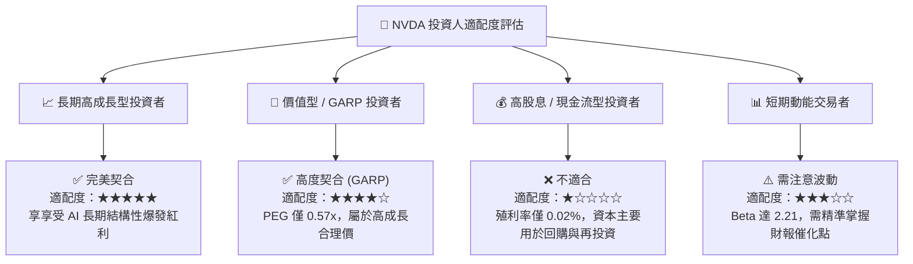

### 10.5 每季財報監控清單（Quarterly Watch List）

為保持本報告的持續可追蹤性，投資人應於每季財報發布時監控以下指標：

| 監控項目 | 最新基準值 (Q1 FY27) | 健康 / 加碼門檻 | 警訊 / 減碼門檻 | 監控目的 |
|----------|----------------------|-----------------|-----------------|----------|
| **Data Center 營收** | ~$72.0B+ | YoY > +40% | YoY < +15% | 驗證 AI 算力需求持續性 |
| **整體毛利率 (Gross Margin)**| 74.1% | 保持在 72.0% 以上 | 跌破 68.0% | 觀察 Blackwell 定價權與成本控制 |
| **自由現金流 (FCF)** | $48.59B (單季) | 單季 > $30.0B | 單季 < $15.0B | 確保真金白銀流入而非應收帳款 |
| **四大 CSP Capex 總合** | 持續擴張 | YoY > +20% | YoY 轉負 | 終端需求最核心先導指標 |
| **存貨週轉天數 (DIO)** | ~90 天 | < 105 天 | > 130 天 | 判斷是否有晶片囤積或滯銷 |

### 10.6 反面論證：什麼會證明論點錯誤（Disconfirming Evidence）

本報告的「🟢 強烈買入」論點基於 AI 基礎設施需求強勁與 NVDA 高度壟斷。若出現以下**可量化條件**，將證明本報告的核心論點失效，應立即重新評估或執行停損：

```
╔══════════════════════════════════════════════════════════════════╗
║              ⚠️ 投資論點失效條件 (Disconfirming Evidence)       ║
╠══════════════════════════════════════════════════════════════════╣
║  出現以下任一條件時，多頭論點即被打破：                          ║
║                                                                  ║
║  1. 核心 Data Center 業務營收增速連續兩季降至 < 15% YoY。        ║
║  2. 全年毛利率 (Gross Margin) 因價格戰或良率問題永久性跌破 65%。║
║  3. ROIC 跌破 30%（顯示資本效率急速惡化）。                      ║
║  4. 前四大客戶（MSFT, AMZN, GOOGL, META）合計營收占比急遽下降    ║
║     超過 20 個百分點，且未被企業/主權 AI 客戶補足。              ║
║  5. 主要大客戶自研 ASIC 晶片在推理 (Inference) 市場的占有率      ║
║     超過 40%，嚴重侵蝕 NVDA 的軟體護城河。                       ║
╚══════════════════════════════════════════════════════════════════╝
```

---

> **免責聲明**：本報告為 AI 自動生成之機構級研究資料，僅供學術研究與投資參考，不構成任何買賣建議。美股投資具有相當市場風險，投資人應自行評估並承擔風險。