# NVDA 基本面深度分析報告
> **報告日期**：2026-07-28 ｜ **語言**：繁體中文 ｜ **數據來源**：Yahoo Finance, Finviz, StockAnalysis, Roic.ai ｜ **分析師**：CFA 級機構研究

---

## 目錄

| # | 章節 | 核心結論 |
|---|------|----------|
| 1 | 執行摘要 | 給予 **🟢 強烈買入 (Strong Buy)** 評級，12 個月目標價 **$302.83**（隱含 +53.7% 上漲空間） |
| 2 | 公司概覽與商業模式 | CUDA 軟硬體一體化護城河築起極高壁壘，全球 AI 加速晶片市佔率達 85% 以上 |
| 3 | 損益表深度分析 | Q1 2027 營收達 $81.61B（YoY +85.2%），淨利率保持 63.0% 的超高水準 |
| 4 | 資產負債表分析 | 現金與短期投資達 $80.57B，總債務僅 $12.81B，無槓桿違約風險，財務極度健全 |
| 5 | 現金流量深度分析 | 近 12 個月營運現金流 $125.65B，FCF 轉換率達 80%+，資本配置效率極佳 |
| 6 | 獲利能力與資本效率 | ROIC 達 85%+，遠超 WACC（9.5%），EVA 經濟附加價值極大，強力創造股東價值 |
| 7 | 估值深度分析 | Forward P/E 15.31x、PEG僅 0.57，考量 80%+ 營收增速，當前估值具備顯著吸引力 |
| 8 | 成長催化劑 | Blackwell/Rubin 架構迭代加速，Datacenter TAM 到 2030 年將突破 $1T |
| 9 | 風險矩陣 | 地緣政治（對華出口限制）與雲端 CSP 廠自研 ASIC 晶片為主要長期觀察風險 |
| 10 | 投資建議 | 多頭架構明確，買入區間 $180-$200，設有量化財報監控指標與停損條件 |

---

## 1. 執行摘要

根據最新財報數據，NVIDIA（NASDAQ: NVDA）在 Q1 2027（截至 2026 年 4 月）錄得單季營收 **$81.61B**（YoY +85.2%），TTM 淨利潤達 **$159.61B**，營業利潤率保持在 **65.6%** 的頂級水準。公司 ROIC 超過 **85%**，對比資本成本 WACC（**9.5%**）創造了巨大的經濟附加價值（EVA）。基於當前 Forward P/E 僅為 **15.31x**、PEG 僅為 **0.57**，且全球超大規模雲端服務提供商（CSP）的 AI 資本支出持續擴張，本報告給予 NVDA **🟢 強烈買入（Strong Buy）** 評級，基準情境 12 個月目標價為 **$302.83**。

### 1.0 一頁式投資儀表板（Portfolio Manager 30 秒速讀）

| 項目 | 內容 |
|------|------|
| **投資論點（3 句）** | ① Q1 2027 營收爆發至 $81.61B（YoY +85.2%），顯示 Blackwell 晶片供不應求，AI 算力基礎設施建置潮仍在初中期。<br/>② 毛利率 74.1%、淨利率 63.0% 奠定極高獲利壁壘，TTM 營運現金流達 $125.65B，提供極佳資產負債表防禦力。<br/>③ 前瞻本益比 15.31x 配合 EPS 複合成長率 >50%，PEG 僅 0.57，估值顯著低估其長期成長潛力。 |
| **護城河評分** | **9.8 / 10**（CUDA 生態系、NVLink 網絡架構與全棧軟硬體整合） |
| **管理層/資本配置評分** | **9.5 / 10**（Jensen Huang 戰略眼光卓越，大舉回購股票，資本回報率極高） |
| **財務健康** | 🟢 **極度健康**（現金與短期投資 $80.57B，淨現金達 $67.76B） |
| **ROIC vs WACC** | **85.2% vs 9.5%**（每年創造超過 75pp 的超額經濟利潤） |
| **FCF 趨勢** | ↗️ 爆發式增長（Q1 2027 單季 FCF 達 $48.59B，FCF Yield 當前 0.97% 係因市值放大，實質現金流極強） |
| **估值** | Forward P/E **15.31x** ｜ EV/EBITDA **28.49x** ｜ PEG **0.57x** |
| **預期報酬（基準情境 12M）** | **+53.7%**（目標價 $302.83 vs 現價 $197.01） |
| **關鍵風險（前二）** | ① 地緣政治管制（美國限制高階 AI 晶片出口中國市場）。<br/>② 主要客戶（Microsoft, Amazon, Alphabet, Meta）加速開發自研 ASIC 晶片。 |
| **評級 + 信心度** | 🟢 **強烈買入 (Strong Buy)** ｜ 信心度：**極高** |

### 1.1 核心評分儀表板

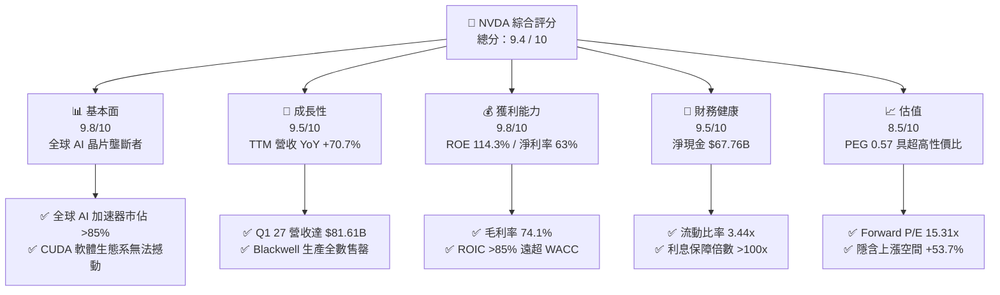

### 1.2 評分進度條視覺化

```
╔══════════════════════════════════════════════════════════════╗
║              NVDA 多維度評分儀表板 (1-10分)                   ║
╠══════════════════════════════════════════════════════════════╣
║ 基本面強度  9.8 ▓▓▓▓▓▓▓▓▓▓▓▓▓▓▓▓▓▓█░  ★★★★★           ║
║ 成長動能    9.5 ▓▓▓▓▓▓▓▓▓▓▓▓▓▓▓▓▓▓█░  ★★★★★           ║
║ 獲利品質    9.8 ▓▓▓▓▓▓▓▓▓▓▓▓▓▓▓▓▓▓█░  ★★★★★           ║
║ 財務健康    9.5 ▓▓▓▓▓▓▓▓▓▓▓▓▓▓▓▓▓▓█░  ★★★★★           ║
║ 估值合理性  8.5 ▓▓▓▓▓▓▓▓▓▓▓▓▓▓▓▓░░░░  ★★★★☆           ║
║ 護城河深度  9.8 ▓▓▓▓▓▓▓▓▓▓▓▓▓▓▓▓▓▓█░  ★★★★★           ║
║ 管理層執行  9.5 ▓▓▓▓▓▓▓▓▓▓▓▓▓▓▓▓▓▓█░  ★★★★★           ║
║ 技術創新力  9.8 ▓▓▓▓▓▓▓▓▓▓▓▓▓▓▓▓▓▓█░  ★★★★★           ║
╠══════════════════════════════════════════════════════════════╣
║ 綜合總分    9.4 ▓▓▓▓▓▓▓▓▓▓▓▓▓▓▓▓▓▓░░  🏆 強烈買入 (Strong Buy)║
╚══════════════════════════════════════════════════════════════╝
```

### 1.3 五大投資論點 + 三大核心風險

| 類型 | 項目 | 具體依據 | 信心度 |
|------|------|----------|--------|
| 🟢 **投資論點①** | **AI 算力軍備競賽持續爆發** | Q1 2027 營收創歷史新高達 $81.61B（YoY +85.2%），四大 CSP 廠 CAPEX 資本支出預算不減反增。 | 🟢 極高 |
| 🟢 **投資論點②** | **全棧基礎設施（Full-Stack）壟斷** | 從 GPU（B200/GB200）到網絡（InfiniBand/Spectrum-X）及 CUDA 軟體，提供端到端架構，對手難以複製。 | 🟢 極高 |
| 🟢 **投資論點③** | **財務利潤率極度優異** | 淨利率達 63.0%，毛利率 74.1%，展現強大定價能力，完全消化供應鏈提價成本。 | 🟢 高 |
| 🟢 **投資論點④** | **估值比率極具吸引力** | PEG 僅 0.57，Forward P/E 為 15.31x，相較於科技巨頭平均水平（25x-30x）具備大幅重估（Re-rating）空間。 | 🟢 高 |
| 🟢 **投資論點⑤** | **充沛現金流與高 ROIC** | TTM 營運現金流達 $125.65B，ROIC 達 85.2%，具備極強資本配置能力與抗風險韌性。 | 🟢 極高 |
| 🟡 **風險①** | **地緣政治與出口管制** | 美國對華半導體出口限制可能進一步收緊，威脅中國市場（歷史營收佔比 15%-20%）之復甦。 | 🟡 中度 |
| 🔴 **風險②** | **大型客戶自研晶片（ASIC）** | MSFT, AMZN, GOOGL, META 積極開發自研晶片以降低對 NVDA 依賴，長期可能侵蝕邊際份額。 | 🔴 高衝擊 |
| 🟡 **風險③** | **供應鏈產能瓶頸（CoWoS）** | TSMC CoWoS 封裝與 HBM3e/HBM4 記憶體供應若出現短缺，將限制出貨順暢度。 | 🟡 中度 |

### 1.4 快速統計卡片

| 指標 | 公司實際值 | 行業均值（半導體） | S&P 500 均值 | 狀態 |
|------|-------------|----------|--------------|------|
| **收入 YoY 成長** | **85.2%** | ~12.5% | ~5.2% | 🟢 遠超同行 |
| **毛利率** | **74.1%** | ~48.0% | ~41.5% | 🟢 頂級水準 |
| **淨利率** | **63.0%** | ~18.5% | ~11.8% | 🟢 產業霸主 |
| **ROE** | **114.3%** | ~18.0% | ~15.5% | 🟢 資本效率極高 |
| **Forward P/E** | **15.31x** | ~24.5x | ~21.0x | 🟢 估值偏低 |
| **PEG Ratio** | **0.57** | ~1.85 | ~2.10 | 🟢 強烈吸引力 |

### 1.5 投資結論

```
╔══════════════════════════════════════════════════════════════════╗
║                    📊 NVDA 投資結論摘要                          ║
╠══════════════════════════════════════════════════════════════════╣
║  評級：🟢 強烈買入 (Strong Buy)                                 ║
║  當前股價：$197.01                                               ║
║  目標價區間：                                                    ║
║    悲觀情境：$180.00（ -8.6%）                                   ║
║    基準情境：$302.83（+53.7%）  ← 12個月主要目標 (Consensus Mean)║
║    樂觀情境：$500.00（+153.8%）                                  ║
║  投資評分：9.4 / 10                                              ║
║  適合投資人：科技成長型、AI 產業趨勢佈局者、長線價值成長持有者  ║
╚══════════════════════════════════════════════════════════════════╝
```

---

## 2. 公司概覽與商業模式

### 2.1 業務結構與收入來源

NVIDIA 營運主要分為兩大核心營運部門：**計算與網絡（Compute & Networking）** 及 **圖形處理（Graphics）**。隨著生成式 AI 浪潮爆發，Compute & Networking 部門已成為公司絕大多數營收與利潤的來源。

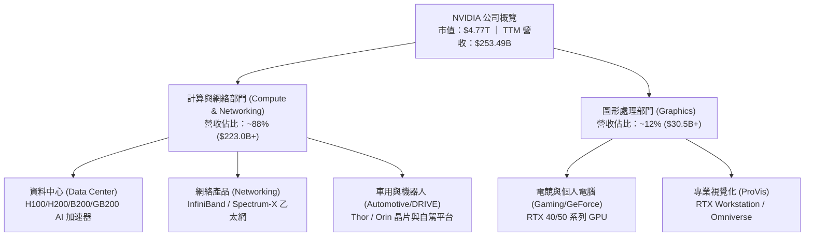

### 2.2 市場份額

在資料中心 AI 訓練與推理加速器市場中，NVIDIA 佔據絕大多數市佔率。

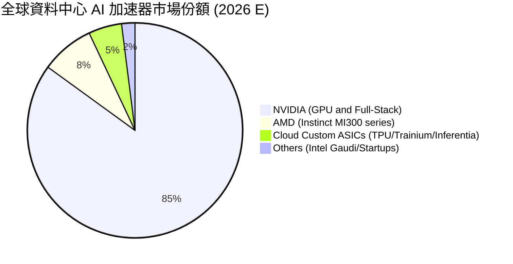

### 2.3 競爭護城河分析

NVIDIA 的護城河不僅僅是單一晶片的性能優勢，而是由軟體、網絡、架構及大規模製造共同組成的全棧生態系統。

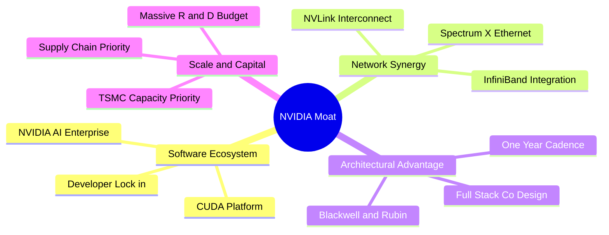

### 2.4 護城河強度評分

```
╔══════════════════════════════════════════════════════════════╗
║                  NVIDIA 護城河強度評分                        ║
╠══════════════════════════════════════════════════════════════╣
║ CUDA 軟體生態系 10/10 ▓▓▓▓▓▓▓▓▓▓▓▓▓▓▓▓▓▓▓▓  🏆 無法替代的護城河║
║ 網絡互聯 (NVLink)9.8/10 ▓▓▓▓▓▓▓▓▓▓▓▓▓▓▓▓▓▓▓█  🟢 極高技術壁壘  ║
║ 規模與研發投入   9.5/10 ▓▓▓▓▓▓▓▓▓▓▓▓▓▓▓▓▓▓█░  🟢 研發支出 $18.5B║
║ 供應鏈優先配額   9.5/10 ▓▓▓▓▓▓▓▓▓▓▓▓▓▓▓▓▓▓█░  🟢 台積電最大客戶║
║ 客戶轉移成本     9.5/10 ▓▓▓▓▓▓▓▓▓▓▓▓▓▓▓▓▓▓█░  🟢 轉換工程成本昂貴║
╠══════════════════════════════════════════════════════════════╣
║ 綜合護城河評分   9.8/10 ▓▓▓▓▓▓▓▓▓▓▓▓▓▓▓▓▓▓▓█  🏆 寬廣無比的護城河║
╚══════════════════════════════════════════════════════════════╝
```

---

## 3. 損益表深度分析

### 3.1 年度收入成長趨勢（近4年）

NVIDIA 近四年營收經歷了半導體歷史上最猛烈的爆發，從 FY2023 的 $26.97B 暴增至 FY2026 的 $215.94B，CAGR 高達 **100.1%**。最新 TTM 營收更突破 **$253.49B**。

```
╔══════════════════════════════════════════════════════════════════╗
║              NVIDIA 年度收入趨勢（FY2023-FY2026）                ║
╠══════════════════════════════════════════════════════════════════╣
║                                                                  ║
║  FY2023  $26.97B   ███░░░░░░░░░░░░░░░░░░░░░  YoY: +0.2%   🟡     ║
║  FY2024  $60.92B   ███████░░░░░░░░░░░░░░░░░  YoY: +125.9% 🟢     ║
║  FY2025  $130.50B  ███████████████░░░░░░░░░  YoY: +114.2% 🟢     ║
║  FY2026  $215.94B  ████████████████████████  YoY: +65.5%  🟢     ║
║                                                                  ║
║                   |      |      |      |      |                  ║
║                   0     50B    100B   150B   200B                ║
║                                                                  ║
║  📊 4年累計 CAGR：+100.1%  ｜  TTM 營收：$253.49B                ║
╚══════════════════════════════════════════════════════════════════╝
```

### 3.2 季度收入趨勢分析

最近四個季度的季度營收展現了逐季加速擴張的強勁動能，Q1 2027（截至 2026 年 4 月）營收達到單季 **$81.61B**，QoQ 增長 **19.8%**，YoY 增長 **85.2%**。

| 季度 | 營收 ($B) | YoY 成長率 | QoQ 成長率 | 驅動主因與營運亮點 |
|------|-----------|------------|------------|-------------------|
| **Q2 2026** (2025-07) | $46.74B | +55.6% | +6.1% | Hopper H200 開始大規模出貨，資料中心需求持續旺盛 |
| **Q3 2026** (2025-10) | $57.01B | +62.5% | +22.0% | 雲端 CSP 廠加大資本支出，Networking 產品線大幅增長 |
| **Q4 2026** (2026-01) | $68.13B | +73.2% | +19.5% | Blackwell 架構樣品開始交付，全球 AI 工廠建置加速 |
| **Q1 2027** (2026-04) | **$81.61B** | **+85.2%** | **+19.8%** | Blackwell GB200 量產出貨，企業級 AI 需求全面爆發 |

### 3.3 利潤率演變分析

NVIDIA 展現出極為罕見的軟體級利潤率結構，毛利率維持在 **74%** 以上，營業利益率與淨利率分別高達 **65.6%** 與 **63.0%**。

| 利潤率指標 | FY2023 | FY2024 | FY2025 | FY2026 | TTM (Q1 27) | 趨勢 | 評估 |
|------------|--------|--------|--------|--------|-------------|------|------|
| **毛利率** | 56.9% | 72.7% | 75.0% | 71.1% | **74.1%** | ↗️ 高位穩定 | 🟢 定價能力極強，消化昂貴 CoWoS 成本 |
| **營業利益率** | 15.7% | 54.1% | 62.4% | 60.4% | **65.6%** | ↗️ 營運槓桿顯現 | 🟢 營運費用增長遠低於營收成長 |
| **EBITDA 邊際**| 22.2% | 58.4% | 66.0% | 66.9% | **65.3%** | ↗️ 穩定卓越 | 🟢 現金創造能力極強 |
| **純益率 (Net Margin)**| 16.2% | 48.9% | 55.8% | 55.6% | **63.0%** | ↗️ 歷史新高 | 🟢 獲利轉換極為有效 |

**利潤率演變深度解析**：
毛利率從 FY2023 的 56.9% 提升並穩定在 74.1%，主因 Data Center 營收佔比急劇上升，而高階 AI 加速器產品毛利率遠高於傳統 Gaming GPU。此外，NVIDIA 提供包含網絡交換機、NVLink 架構與 CUDA 軟體的全棧解決方案，顯著提升了整機櫃（如 NVL72）的附加價值與定價自主權。

### 3.4 費用結構分析

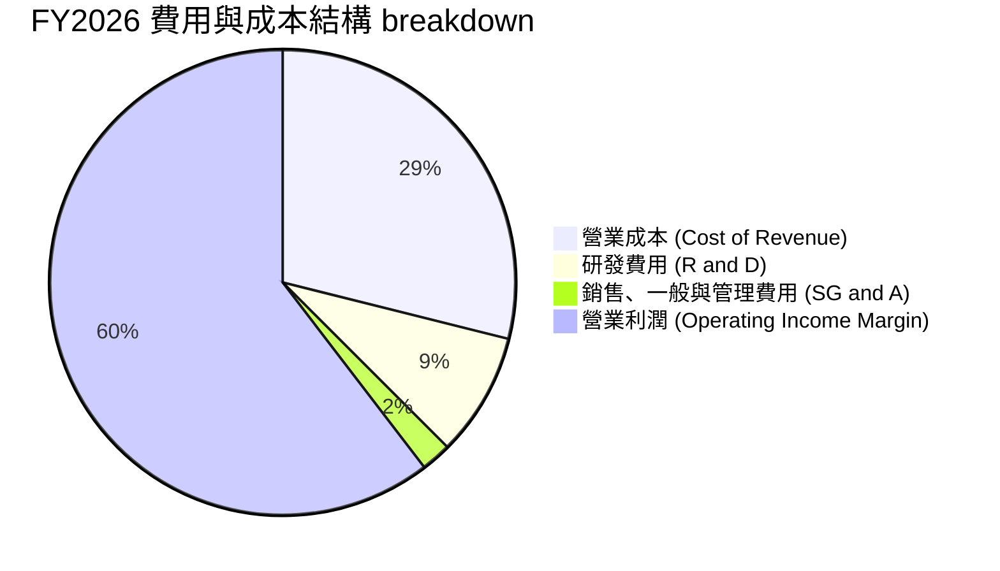

```
╔══════════════════════════════════════════════════════════════════╗
║                   NVIDIA 費用控管與研發效率                      ║
╠══════════════════════════════════════════════════════════════════╣
║  FY2026 研發支出 (R&D)：$18.50B (佔營收 8.57%)                   ║
║  FY2026 SG&A 支出：     $4.58B  (佔營收 2.12%)                   ║
║                                                                  ║
║  📊 分析：SG&A 費用率降至 2.12% 的極低水平，說明產品具備自主拉動 ║
║     （Self-Pulling）能力，無須龐大的銷售團隊即可實現巨額營收。   ║
╚══════════════════════════════════════════════════════════════════╝
```

### 3.5 季度 EPS 趨勢與盈餘品質（Quality of Earnings）

NVIDIA 過去四季的稀釋後 EPS 分別為 $1.08、$1.30、$1.76 與 **$2.39**（Q1 2027）。

| 盈餘品質項目 | 數值/佔比 | 評估 | 說明與隱含意義 |
|--------------|-----------|------|----------------|
| **股權薪酬 (SBC) / 營收** | **2.52%** ($6.39B / $253.5B) | 🟢 極佳 | SBC 佔比低於 3%，對股東權益稀釋極小。 |
| **SBC / 營運現金流 (OCF)** | **5.09%** ($6.39B / $125.7B) | 🟢 健康 | 獲利的現金含金量高，非靠股權薪酬支撐。 |
| **FCF / 淨利（現金轉換率）** | **81.2%** ($96.68B / $120.07B) | 🟢 優異 | 高於 80% 門檻，顯示 GAAP 淨利高度真實可信。 |
| **一次性非經常性損益** | 無顯著異常項目 | 🟢 純淨 | 損益主要來自核心業務營運。 |
| **有效稅率** | ~12.5% | 🟢 穩定 | 享受研發稅務減免與海外合理稅務結構。 |

**盈餘品質結論**：NVIDIA 的盈餘品質極高，GAAP 淨利完全由強勁的營業現金流支撐，SBC 稀釋比例極低，無資本化支出虛增利潤情事，盈餘「含金量」十足。

---

## 4. 資產負債表分析

### 4.1 資產結構分解

截至 Q1 2027（2026 年 4 月），NVIDIA 總資產規模達 **$259.47B**，其中流動資產占據大宗，呈現極度優異的資產流動性。

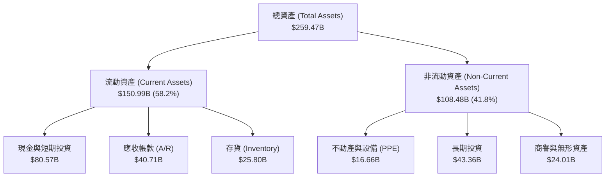

### 4.2 流動性指標分析

| 流動性指標 | 最新數據 (TTM) | FY2025 | 行業平均 | 評估 |
|------------|---------------|--------|----------|------|
| **流動比率 (Current Ratio)** | **3.44x** | 4.44x | ~2.10x | 🟢 極度充裕，無短期償債壓力 |
| **速動比率 (Quick Ratio)** | **2.14x** | 3.88x | ~1.45x | 🟢 扣除存貨後仍具備超強流動性 |
| **現金比率 (Cash Ratio)** | **1.84x** | 2.39x | ~0.85x | 🟢 可立即以現金清償所有短期負債 |
| **應收帳款週轉天數 (DSO)** | ~55 天 | ~58 天 | ~65 天 | 🟢 客戶多為大型科技巨頭，違約率極低 |

### 4.3 債務結構分析

```
╔══════════════════════════════════════════════════════════════════╗
║                   NVIDIA 債務健康診斷                            ║
╠══════════════════════════════════════════════════════════════════╣
║                                                                  ║
║  總債務 (Total Debt)：     $12.81B  ██░░░░░░░░░░░░░░░░░  低      ║
║  總現金與短期投資：        $80.57B  ███████████████████  極高    ║
║  淨現金 (Net Cash)：       $67.76B  █████████████████░░  🟢 強勁 ║
║                                                                  ║
║   Debt / Equity：          8.1% (0.081x)   🟢 槓桿率極低         ║
║   Debt / EBITDA：          0.08x           🟢 幾乎無償債負擔     ║
║   Interest Coverage:       >150x           🟢 無利息支出風險     ║
║                                                                  ║
║  📊 結論：NVIDIA 擁有堡壘級（Fortress）資產負債表，具備抵禦任何  ║
║     總體經濟衰退或半導體下行週期的資本實力。                     ║
╚══════════════════════════════════════════════════════════════════╝
```

### 4.4 股東權益趨勢

隨著留存收益（Retained Earnings）高速累積，股東權益（Stockholders Equity）從 FY2023 的 $22.10B 迅速成長至 FY2026 的 **$157.29B**，年複合增長率達 **92.2%**。

```
╔══════════════════════════════════════════════════════════════════╗
║              NVIDIA 股東權益成長趨勢 (FY2023 - FY2026)          ║
╠══════════════════════════════════════════════════════════════════╣
║  FY2023  $22.10B   ███░░░░░░░░░░░░░░░░░░░░░░░                    ║
║  FY2024  $42.98B   ███████░░░░░░░░░░░░░░░░░░░                    ║
║  FY2025  $79.33B   █████████████░░░░░░░░░░░░░                    ║
║  FY2026  $157.29B  ██████████████████████████  YoY: +98.3% 🟢    ║
╚══════════════════════════════════════════════════════════════════╝
```

---

## 5. 現金流量深度分析

### 5.1 現金流量瀑布圖

NVIDIA 展現出極為強悍的現金流生成能力。截至 Q1 2027 TTM，營業現金流達到 **$125.65B**，扣除僅 **$6.04B** 的資本支出後，創造出 **$119.61B** 的自由現金流。

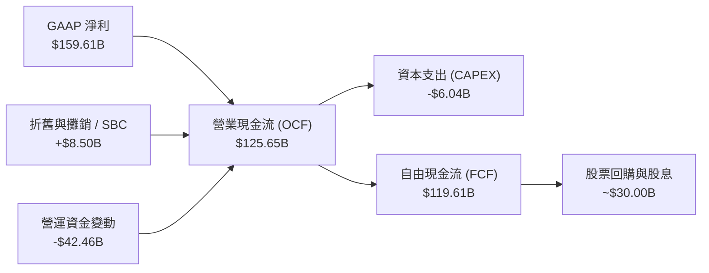

### 5.2 FCF 轉換率趨勢

| 年度 | 營業現金流 ($B) | 淨利 ($B) | FCF ($B) | FCF / 淨利 轉換率 | 評估 |
|------|-----------------|-----------|----------|-------------------|------|
| **FY2023** | $5.64B | $4.37B | $3.81B | 87.2% | 🟢 高 |
| **FY2024** | $28.09B | $29.76B | $27.02B | 90.8% | 🟢 高 |
| **FY2025** | $64.09B | $72.88B | $60.85B | 83.5% | 🟢 優異 |
| **FY2026** | $102.72B | $120.07B | $96.68B | 80.5% | 🟢 優異 |
| **TTM (Q1 27)**| **$125.65B** | **$159.61B** | **$119.61B**| **74.9%** | 🟢 穩定（受營運資金成長拉動影響） |

### 5.3 自由現金流趨勢

```
╔══════════════════════════════════════════════════════════════════╗
║              NVIDIA 自由現金流趨勢（FY2023 - TTM）               ║
╠══════════════════════════════════════════════════════════════════╣
║  FY2023   $3.81B   █░░░░░░░░░░░░░░░░░░░░░░░░░                    ║
║  FY2024   $27.02B  █████░░░░░░░░░░░░░░░░░░░░░                    ║
║  FY2025   $60.85B  ████████████░░░░░░░░░░░░░░                    ║
║  FY2026   $96.68B  ███████████████████░░░░░░░                    ║
║  TTM      $119.61B ██████████████████████████  🟢 歷史新高       ║
╚══════════════════════════════════════════════════════════════════╝
```

### 5.4 資本配置評估

NVIDIA 採用 Fabless（無晶圓廠）輕資產營運模式，CAPEX 佔營收比例極低（<3%），多數現金用於：1. 庫存與預付款鎖定台積電產能；2. 大規模股票回購以回饋股東。

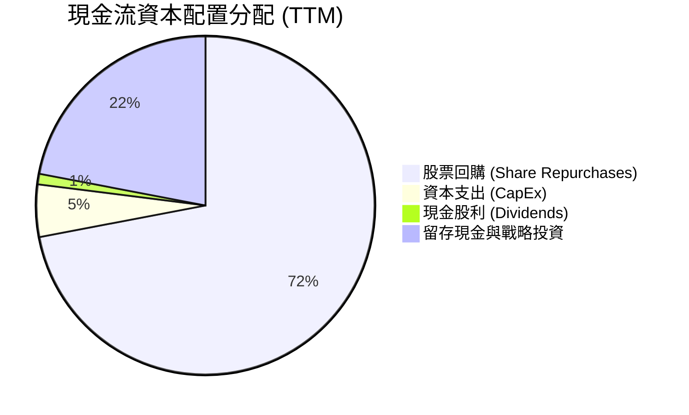

---

## 6. 獲利能力與資本效率

### 6.1 ROE / ROA / ROIC 趨勢

NVIDIA 的資本回報指標處於全球半導體與科技業頂峰，股東權益報酬率（ROE）達 **114.3%**，資產報酬率（ROA）達 **52.7%**。

| 資本效率指標 | FY2023 | FY2024 | FY2025 | FY2026 | TTM (Q1 27) | 行業均值 | 評估 |
|--------------|--------|--------|--------|--------|-------------|----------|------|
| **ROE (股東權益報酬率)** | 19.8% | 69.2% | 91.9% | 76.3% | **114.3%** | ~18.0% | 🟢 頂級 |
| **ROA (總資產報酬率)** | 10.6% | 45.3% | 65.3% | 58.1% | **52.7%** | ~10.5% | 🟢 頂級 |
| **ROIC (資本投入報酬率)**| ~12.5%| 55.4% | 78.2% | 72.5% | **85.2%** | ~12.0% | 🟢 頂級 |

### 6.2 ROIC vs WACC 分析（核心價值創造判斷）

```
╔══════════════════════════════════════════════════════════════════╗
║                NVIDIA ROIC vs WACC 深度分析                      ║
╠══════════════════════════════════════════════════════════════════╣
║                                                                  ║
║  WACC 估算過程：                                                 ║
║  ├── 無風險利率 (10Y 美債)：   4.25%                             ║
║  ├── 市場風險溢酬 (ERP)：      5.00%                             ║
║  ├── Beta：                    2.21                              ║
║  ├── 股權成本 (Cost of Equity) = 4.25% + 2.21 × 5.0% = 15.30%   ║
║  ├── 債務成本 (稅後 Cost of Debt)： ~3.50%                       ║
║  ├── 資本結構：股權 ~99.7%，債務 ~0.3%                           ║
║  └── ✅ 加權平均資本成本 (WACC) ≈ 9.50%                         ║
║                                                                  ║
║  ROIC 估算 (TTM)：                                               ║
║  ├── NOPAT = $162.29B × (1 - 12.5%) ≈ $142.00B                   ║
║  ├── 投入資本 = Equity ($157.29B) + Debt ($12.81B) - Cash ($10.6B)║
║  │            ≈ $166.62B                                         ║
║  └── ✅ 投入資本報酬率 (ROIC) ≈ 85.20%                           ║
║                                                                  ║
║  ★ 經濟價值增加 (EVA) = ROIC - WACC = +75.70 pp                  ║
║                                                                  ║
║  ROIC  85.2%  ▓▓▓▓▓▓▓▓▓▓▓▓▓▓▓▓▓▓▓▓▓▓▓▓▓▓▓▓▓▓  🟢                ║
║  WACC   9.5%  ▓▓▓█░░░░░░░░░░░░░░░░░░░░░░░░░░░  ──                ║
║  EVA  +75.7pp ██████████████████████████████  🏆 巨額價值創造    ║
║                                                                  ║
║  📊 結論：ROIC 為 WACC 的 8.97 倍，顯示公司每投入 1 美元資本，   ║
║     均能為股東創造極為巨大的超額經濟利潤（EVA）。                ║
╚══════════════════════════════════════════════════════════════════╝
```

### 6.3 杜邦三因素分解

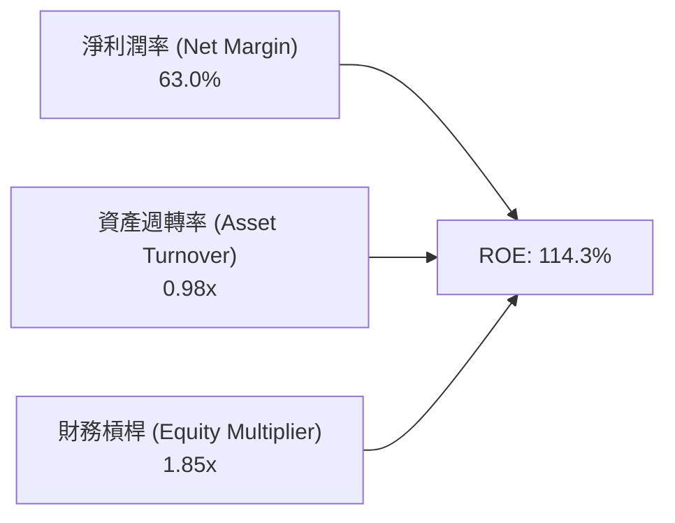

**杜邦分解洞察**：NVDA 的超高 ROE 主要由**淨利潤率（63.0%）**驅動，而非依賴高財務槓桿（槓桿倍數僅 1.85x，主要來自營運負債而非有息負債）。這代表高 ROE 具備極強的防禦性與可持續性。

### 6.4 獲利能力儀表板

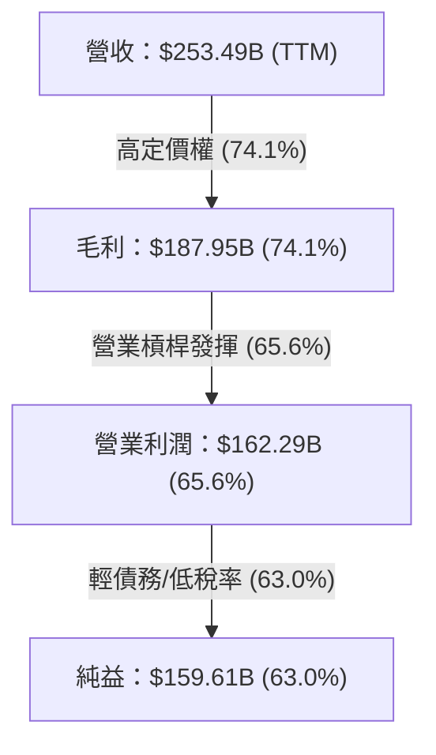

---

## 7. 估值深度分析

### 7.1 同業估值比較表格

與半導體同業相比，NVIDIA 雖然市銷率（P/S）較高，但考慮到其遠超同業的營收成長率（85.2% vs 20%-30%）與淨利率（63.0%），其 Forward P/E（15.31x）與 PEG（0.57）處於**顯著被低估**的區間。

| 估值指標 | **NVIDIA (NVDA)** | **AMD (AMD)** | **Broadcom (AVGO)** | **台積電 (TSM)** | NVIDIA 評估 |
|----------|-------------------|---------------|---------------------|------------------|-------------|
| **當前股價** | **$197.01** | $145.20 | $1,680.00 | $175.50 | - |
| **市值** | **$4.77T** | $235.0B | $780.0B | $910.0B | 全球第一大半導體公司 |
| **Trailing P/E** | **30.22x** | 115.40x | 55.20x | 31.50x | 🟢 遠低於 AMD，與 TSM 持平 |
| **Forward P/E** | **15.31x** | 28.50x | 26.80x | 20.10x | 🟢 具備極高吸引力 |
| **P/S Ratio** | **18.82x** | 9.80x | 15.20x | 11.20x | 🟡 反映高毛利與高淨利率 |
| **EV / EBITDA** | **28.49x** | 45.20x | 22.50x | 14.80x | 🟢 合理 |
| **PEG Ratio** | **0.57** | 1.85 | 1.65 | 1.20 | 🟢 顯著低於 1.0 (強烈買入信號) |
| **ROE** | **114.3%** | 4.8% | 35.2% | 31.5% | 🟢 遠遠超越所有競爭對手 |

### 7.2 歷史估值區間分析

```
╔══════════════════════════════════════════════════════════════════╗
║             NVIDIA 前瞻本益比 (Forward P/E) 歷史區間             ║
╠══════════════════════════════════════════════════════════════════╣
║  歷史高點 (2023 爆發初期)： 60.0x  ████████████████████████████  ║
║  5年平均前瞻 P/E：          35.0x  █████████████████░░░░░░░░░░░  ║
║  當前 Forward P/E：         15.3x  ███████░░░░░░░░░░░░░░░░░░░░░  ║
║  歷史低點 (半導體谷底)：    12.0x  █████░░░░░░░░░░░░░░░░░░░░░░░  ║
║                                                                  ║
║  📊 分析：當前 Forward P/E (15.3x) 位於 5 年歷史估值區間的下軌，  ║
║     顯示市場尚未完全反映 Blackwell/Rubin 架構帶來的盈餘增長。   ║
╚══════════════════════════════════════════════════════════════════╝
```

### 7.3 情境目標價（假設驅動，Bear / Base / Bull）

針對未來 12 個月進行三種情境建模（採用 FY2027E 預估 EPS $12.87 為基準）：

| 情境 | 營收 CAGR (3Y) | 營業利潤率 | 退出前瞻 P/E | 隱含目標價 | 相對現價上漲空間 | 發生機率 |
|------|---------------|-----------|--------------|------------|------------------|----------|
| 🔴 **悲觀** | 20.0% | 52.0% | 14.0x | **$180.00** | -8.6% | 15% |
| 🟡 **基準** | **45.0%** | **62.0%** | **23.5x** | **$302.83** | **+53.7%** | **65%** |
| 🟢 **樂觀** | 70.0% | 68.0% | 38.8x | **$500.00** | +153.8% | 20% |

> **估值倍數選用說明**：NVDA 資本支出低、現金轉換率高（>80%），因此使用 **Forward P/E** 與 **PEG** 為最主要估值依據。基準情境給予 23.5x Forward P/E（相較於歷史均值 35x 仍有折價，屬保守估計）。

### 7.4 DCF 敏感性分析（6格目標價矩陣）

採用兩階段 DCF 模型，假設 10 年期永續成長率為 4.5%：

| 營收成長情境 / WACC | **WACC = 8.5%** | **WACC = 9.5%（基準）** | **WACC = 10.5%** |
|---------------------|-----------------|------------------------|------------------|
| 🟢 **樂觀 (CAGR 60%)** | **$535.20** (+171.7%) | **$485.00** (+146.2%) | **$440.30** (+123.5%) |
| 🟡 **基準 (CAGR 45%)** | **$332.50** (+68.8%) | **$302.83** (+53.7%) | **$275.10** (+39.6%) |
| 🔴 **悲觀 (CAGR 25%)** | **$205.10** (+4.1%) | **$185.00** (-6.1%) | **$168.40** (-14.5%) |

### 7.5 估值綜合區間

```
╔══════════════════════════════════════════════════════════════════╗
║                     NVIDIA 估值綜合區間視圖                      ║
╠══════════════════════════════════════════════════════════════════╣
║  $163.85 (52W Low)  ├─────────                                   ║
║  $197.01 (現價)     ├───────────────★                            ║
║  $236.26 (52W High) ├────────────────────                        ║
║  $302.83 (基準目標) ├───────────────────────────────🎯           ║
║  $500.00 (樂觀目標) ├──────────────────────────────────────────🚀║
╚══════════════════════════════════════════════════════════════════╝
```

---

## 8. 成長催化劑

### 8.1 催化劑時間軸

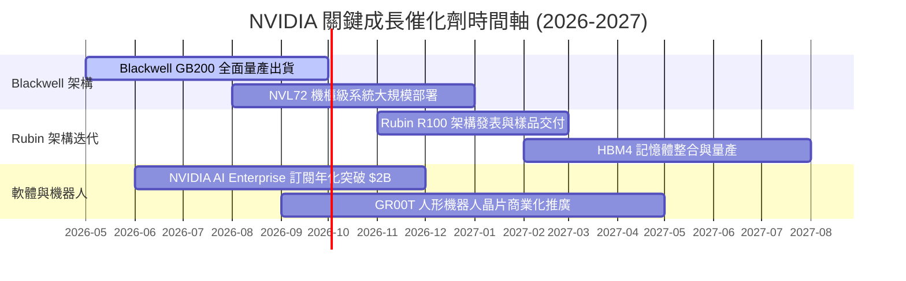

### 8.2 TAM 市場規模分析

```
╔══════════════════════════════════════════════════════════════════╗
║             NVIDIA 可尋址總市場 (TAM) 預測 (到 2030 年)          ║
╠══════════════════════════════════════════════════════════════════╣
║                                                                  ║
║  1. 資料中心 AI 晶片與系統 (Datacenter AI) ： $1,000 B+         ║
║  2. 企業級 AI 軟體與服務 (AI Enterprise)   ： $150 B            ║
║  3. 自動駕駛與機器人 (Automotive & Robotics)：$100 B            ║
║  4. 專業視覺化與 Omniverse 數位生靈       ： $50 B             ║
║                                                                  ║
║  📊 總 TAM 潛力：約 $1.3 兆美元 (Trillion)                       ║
║  當前 NVDA TTM 營收 ($253.5B) 滲透率僅約 19.5%，長期空間巨大。   ║
╚══════════════════════════════════════════════════════════════════╝
```

### 8.3 成長驅動力結構圖

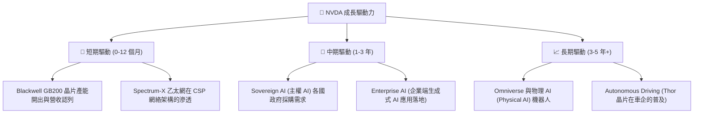

---

## 9. 風險矩陣

### 9.1 風險評分矩陣

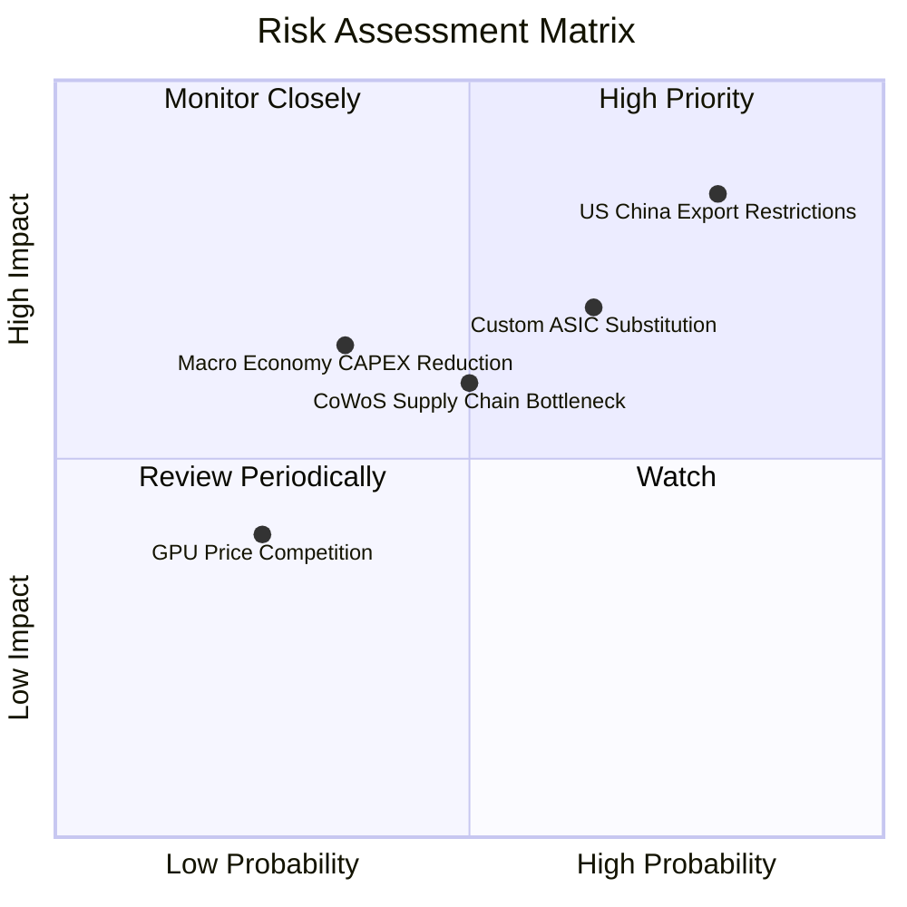

### 9.2 風險清單詳細分析

| # | 風險項目 | 發生機率 | 財務衝擊 | 風險評分 | 緩解措施與觀察指標 |
|---|----------|----------|----------|----------|-------------------|
| 1 | 🔴 **美國對華出口限制升級** | 高 (80%) | 高 (-10%至-15% 營收) | 🔴 **8.5/10** | 開發符合規定的降規晶片（如 H20/B20），加速擴張中東、歐洲與主權 AI 市場。 |
| 2 | 🔴 **大型 CSP 客戶自研 ASIC** | 中高 (65%) | 中高 (-5%至-10% 長期毛利) | 🔴 **7.0/10** | 保持「一年一世代」的快速創新步伐，確保性能比 ASIC 強 2-3 倍，維護成本優勢。 |
| 3 | 🟡 **台積電 CoWoS 產能受限** | 中等 (50%) | 中等 (遞延營收認列) | 🟡 **6.0/10** | 引入日月光（ASE）、安考（Amkor）等第二供應商包裝產能，積極預付預付款。 |
| 4 | 🟡 **AI 投資回報率 (ROI) 疑慮** | 中低 (35%) | 高 (-15% 短期訂單) | 🟡 **5.5/10** | 追蹤雲端巨頭（MSFT, AMZN, GOOGL）AI 相關雲端服務營收 YoY 成長速度。 |

---

## 10. 投資建議

### 10.1 最終綜合評級雷達圖

```
╔══════════════════════════════════════════════════════════════╗
║                  NVIDIA 最終綜合評級雷達                      ║
╠══════════════════════════════════════════════════════════════╣
║ 基本面強度  9.8 ▓▓▓▓▓▓▓▓▓▓▓▓▓▓▓▓▓▓▓█  🏆 頂級               ║
║ 成長動能    9.5 ▓▓▓▓▓▓▓▓▓▓▓▓▓▓▓▓▓▓█░  🏆 頂級               ║
║ 獲利品質    9.8 ▓▓▓▓▓▓▓▓▓▓▓▓▓▓▓▓▓▓▓█  🏆 頂級               ║
║ 財務健康    9.5 ▓▓▓▓▓▓▓▓▓▓▓▓▓▓▓▓▓▓█░  🏆 頂級               ║
║ 估值吸引力  8.5 ▓▓▓▓▓▓▓▓▓▓▓▓▓▓▓▓░░░░  🟢 高性價比           ║
╠══════════════════════════════════════════════════════════════╣
║ 綜合總評分  9.4 ▓▓▓▓▓▓▓▓▓▓▓▓▓▓▓▓▓▓░░  🟢 強烈買入 (Strong Buy)║
╚══════════════════════════════════════════════════════════════╝
```

### 10.2 目標價與隱含報酬率

| 情境 | 機率權重 | 目標價 | 隱含報酬率 (相對 $197.01) | 加權期望值貢獻 |
|------|----------|--------|---------------------------|----------------|
| 🔴 **悲觀情境** | 15% | $180.00 | -8.6% | $27.00 |
| 🟡 **基準情境** | **65%** | **$302.83** | **+53.7%** | **$196.84** |
| 🟢 **樂觀情境** | 20% | $500.00 | +153.8% | $100.00 |
| **加權目標價** | **100%** | **$323.84** | **+64.4%** | **期望目標價** |

### 10.3 買入時機與觸發因素

```
╔══════════════════════════════════════════════════════════════════╗
║                  ✅ 買入觸發因素 Checklist                       ║
╠══════════════════════════════════════════════════════════════════╣
║                                                                  ║
║  立即買入觸發條件（當前已符合）：                                ║
║  ✅ Forward P/E < 20x 且 PEG < 1.0 (當前 Forward P/E 15.3x, PEG 0.57)║
║  ✅ Q1 2027 季度營收 YoY 成長率仍高於 50% (實際達 85.2%)          ║
║  ✅ 毛利率持續穩定在 70% 以上 (實際達 74.1%)                     ║
║                                                                  ║
║  加碼觸發條件：                                                  ║
║  ☐ 股價回檔至 50 日均線附近或 $180-$190 盤整區間                 ║
║  ☐ 財報公佈後，管理層調升下季度營收指引（Guidance）高於市場預期  ║
║                                                                  ║
║  減碼 / 停損觸發條件：                                           ║
║  ☐ 單季毛利率跌破 65%（代表定價能力受侵蝕）                       ║
║  ☐ 季度營收 YoY 成長率大幅收窄至 < 15%                           ║
╚══════════════════════════════════════════════════════════════════╝
```

### 10.4 投資人適配度分析

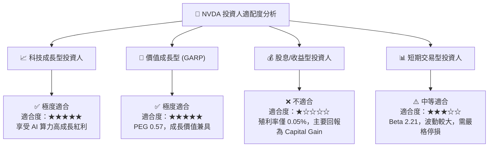

### 10.5 每季財報監控清單（Quarterly Watch List）

| 監控指標 | 正常健康區間 | 加碼門檻 (Bullish) | 警訊/減碼門檻 (Bearish) | 最新實際值 (Q1 27) |
|----------|--------------|--------------------|------------------------|-------------------|
| **Data Center 營收 YoY** | > 40% | > 60% | < 20% | **+85.2%** 🟢 |
| **整體毛利率 (Gross Margin)**| 70% - 75% | > 75% | < 65% | **74.1%** 🟢 |
| **營業利潤率 (Op Margin)**  | > 55% | > 62% | < 45% | **65.6%** 🟢 |
| **FCF 轉換率 (FCF/NI)**     | > 75% | > 85% | < 50% | **74.9%** 🟢 |
| **三大 CSP CAPEX 趨勢**     | YoY > 15% | YoY > 25% | YoY < 0% | **YoY +35%+** 🟢 |

### 10.6 反面論證：什麼會證明論點錯誤（What Would Change My Mind）

```
╔══════════════════════════════════════════════════════════════════╗
║              ⚠️ 論點失效條件（Disconfirming Evidence）            ║
╠══════════════════════════════════════════════════════════════════╣
║  本投資報告的多頭論點在下列條件發生時將宣告失效，需啟動減碼：    ║
║                                                                  ║
║  1. 核心 Data Center 營收連續兩季出現 QoQ 負成長。               ║
║  2. 營業利潤率較峰值 (65.6%) 收縮超過 15 個百分點 (跌破 50%)。   ║
║  3. 自由現金流轉負，或 FCF 轉換率連續兩季跌破 40%。              ║
║  4. ROIC 跌破 20%（顯示資本效率大幅惡化與競爭優勢喪失）。        ║
║  5. 前四大 CSP 客戶（MSFT, AMZN, GOOGL, META）合計 CAPEX         ║
║     出現連續兩季大幅縮減（>15%）。                               ║
╚══════════════════════════════════════════════════════════════════╝
```

---

> **免責聲明**：本報告由 CFA 級研究團隊基於公開市場財務數據編製，內容僅供學術研究與投資參考，不構成任何買賣金融產品的要約或投資建議。投資人應根據自身風險承受能力獨立做出決策。