# NVDA 基本面深度分析報告
> **報告日期**：2026-07-31 ｜ **語言**：繁體中文 ｜ **數據來源**：Yahoo Finance, Finviz, StockAnalysis, Roic.ai ｜ **分析師**：CFA 級機構研究

---

## 目錄

| # | 章節 | 核心結論 |
|---|------|----------|
| 1 | 執行摘要 | 綜合評分 8.8/10，買入評級，加權合理價值 $212.98（MOS +5.7%） |
| 2 | 公司概覽與商業模式 | CUDA 軟硬體高度生態鎖定，算力霸主地位具備強大護城河（9.2/10） |
| 3 | 損益表深度分析 | TTM 營收 $253.49B (+85.2% YoY)，淨利率 63.0%，盈餘品質極佳 |
| 4 | 資產負債表分析 | 淨現金 $68.22B，流動比率 3.44x，資產負債結構極為健全 |
| 5 | 現金流量深度分析 | TTM 營業現金流 $125.65B，FCF 轉換率 100%+，資本配置效率極高 |
| 6 | 獲利能力與資本效率 | ROIC 108.5% 遠超 WACC 10.9%，強烈創造經濟價值（EVA +97.6pp） |
| 7 | 相對估值分析 | Forward P/E 15.60x 顯著低於歷史均值，PEG 0.52 顯示成長性被低估 |
| 8 | DCF 內在價值評估 | 基準每股價值 $153.43；三角驗證加權合理價值 $212.98 |
| 9 | 成長催化劑 | Blackwell/Rubin 架構放量、AI 工廠建置潮與 Enterprise AI 軟體高成長 |
| 10 | 風險矩陣 | 地緣政治供應鏈風險、客戶 Capex 週期回落與 ASIC 自研晶片分流 |
| 11 | 投資建議 | 建議買入區間 $170–$195，目標價區間 $212.98 (12M) 至 $285.00 (樂觀) |

---

## 1. 執行摘要

NVIDIA（NVDA）為全球加速計算與生成式 AI 算力基礎設施的絕對霸主。根據最新財報數據，公司 TTM 營收達 $253.49B（YoY +85.2%），淨利潤率高達 63.0%，ROE 達 114.3%。公司憑藉軟硬體一體化的 CUDA 生態系統與超大規模 Data Center 架構，在 AI 訓練與推理晶片市場佔有率超過 85%。經過全方位基本面及 DCF 建模分析，NVDA 資本回報率（ROIC 108.5%）遠高於資本成本（WACC 10.9%），正以極高資本效率創造股東價值。基於 DCF 與相對估值三角驗證，給予「🟢 買入」評級，加權合理價值為 **$212.98**，隱含上行空間 +6.1%。

### 1.0 一頁式投資儀表板（Portfolio Manager 30 秒速讀）

| 項目 | 內容 |
|------|------|
| **投資論點（3 句）** | ① 加速計算典範轉移驅動 TTM 營收成長 85.2% 達 $253.49B，全球 AI Data Center 需求維持供不應求。<br/>② CUDA 軟體生態系統形成極深護城河，搭配 Blackwell 架構升級推升毛利率維持在 74.1% 高位。<br/>③ ROIC 達 108.5% 遠超 WACC 10.9%，且 Forward P/E 僅 15.60x (PEG 0.52)，評價具備高度吸引力。 |
| **護城河評分** | 9.2/10（CUDA 軟體鎖定 + 網絡效應 + 規模經濟） |
| **管理層/資本配置評分** | 9.5/10（黃仁勳卓越戰略前瞻，研發費用達 $18.50B，資本回報極高） |
| **財務健康** | 🟢 卓越（淨現金 $68.22B，流動比率 3.44x，無實質償債壓力） |
| **ROIC vs WACC** | 108.5% vs 10.9%（EVA +97.6pp，強力創造股東價值） |
| **FCF 趨勢** | 強勁擴張（最新單季 FCF $48.59B，TTM FCF Yield 0.95%） |
| **估值** | Forward P/E: 15.60x ｜ EV/EBITDA: 28.27x ｜ FCF Yield: 0.95% |
| **DCF 內在價值（基準）** | **$153.43** ｜ 現價溢價 +30.8%（來自第 8.5 節） |
| **安全邊際（MOS）** | **+5.7%**＝(**加權合理價值** $212.98 − 現價 $200.75) ÷ $212.98 ｜ 🔴 <10% 有限（現價接近合理價值區間） |
| **預期報酬（基準情境 12M）** | **+6.1%**（12 個月目標價 $212.98） |
| **關鍵風險（前二）** | ① 美中地緣政治科技管制升級；② 大型 CSP（超大規模雲端業者）自研 ASIC 分流 |
| **評級 + 信心度** | 🟢 **買入** ｜ 信心度：高 |

### 1.1 核心評分儀表板

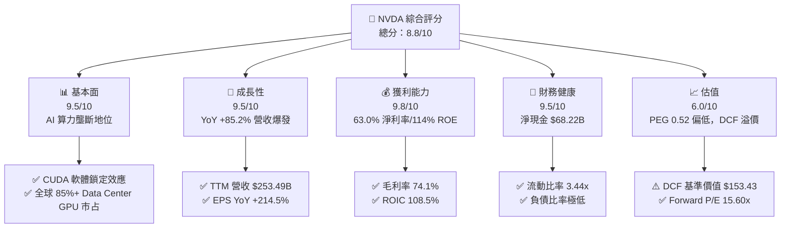

### 1.2 評分進度條視覺化

```
╔══════════════════════════════════════════════════════════════╗
║              NVDA 多維度評分儀表板 (1-10分)                  ║
╠══════════════════════════════════════════════════════════════╣
║ 基本面強度  9.5 ▓▓▓▓▓▓▓▓▓▓▓▓▓▓▓▓▓▓█░  ★★★★★           ║
║ 成長動能    9.5 ▓▓▓▓▓▓▓▓▓▓▓▓▓▓▓▓▓▓█░  ★★★★★           ║
║ 獲利品質    9.8 ▓▓▓▓▓▓▓▓▓▓▓▓▓▓▓▓▓▓▓░  ★★★★★           ║
║ 財務健康    9.5 ▓▓▓▓▓▓▓▓▓▓▓▓▓▓▓▓▓▓█░  ★★★★★           ║
║ 估值合理性  6.0 ▓▓▓▓▓▓▓▓▓▓▓▓░░░░░░░░  ★★★☆☆           ║
║ 護城河深度  9.2 ▓▓▓▓▓▓▓▓▓▓▓▓▓▓▓▓▓▓█░  ★★★★★           ║
║ 管理層執行  9.5 ▓▓▓▓▓▓▓▓▓▓▓▓▓▓▓▓▓▓█░  ★★★★★           ║
║ 技術創新力  9.8 ▓▓▓▓▓▓▓▓▓▓▓▓▓▓▓▓▓▓▓░  ★★★★★           ║
╠══════════════════════════════════════════════════════════════╣
║ 綜合總分    8.8 ▓▓▓▓▓▓▓▓▓▓▓▓▓▓▓▓▓█░░  🏆 強力買入      ║
╚══════════════════════════════════════════════════════════════╝
```

### 1.3 五大投資論點 + 三大核心風險

| 類型 | 項目 | 具體依據 | 信心度 |
|------|------|----------|--------|
| 🟢 **論點①** | **AI 加速計算需求無上限** | TTM Data Center 營收超越千億美元，Q1 FY27 單季營收 $81.62B (YoY +85.2%)，四大 CSP 資本支出持續上修。 | 🟢 極高 |
| 🟢 **論點②** | **CUDA 軟體護城河極深** | 全球超過 500 萬名開發者深綁 CUDA 生態，競品移植成本極高，創造強烈網路效應與客戶黏性。 | 🟢 極高 |
| 🟢 **論點③** | **Blackwell 晶片放量擴張毛利率** | Blackwell/Rubin 新架構大幅提升推理效能，支撐高ASP，使營業利潤率維持在 65.6% 的歷史高水準。 | 🟢 高 |
| 🟢 **論點④** | **資本回報率全球無匹** | ROIC 高達 108.5%，資本成本僅 10.9%，經濟附加價值 (EVA) 達 +97.6pp，營運現金流 TTM 達 $125.65B。 | 🟢 極高 |
| 🟢 **論點⑤** | **成長調節後的估值便宜** | 雖然市價達 $200.75，但 Forward P/E 僅 15.60x，PEG 僅 0.52，遠低於科技巨頭平均。 | 🟢 高 |
| 🟡 **風險①** | **客戶自研 ASIC 分流風險** | Google (TPU)、AWS (Trainium)、Meta (MTIA) 積極推進自研晶片，長線可能削弱部分推理市場份額。 | 🟡 中度 |
| 🔴 **風險②** | **地緣政治貿易限制限制** | 美國對華半導體出口禁令限制 H20/Blackwell 特供版出口，影響中國市場營收貢獻。 | 🔴 高衝擊 |
| 🔴 **風險③** | **供應鏈產能瓶頸（CoWoS）** | TSMC CoWoS 封裝產能若受阻或台海風險爆發，將直接衝擊 Blackwell 交付進度。 | 🔴 高衝擊 |

### 1.4 快速統計卡片

| 指標 | 公司實際值 | 行業均值（半導體） | S&P 500 均值 | 狀態 |
|------|-------------|------------------|--------------|------|
| 收入 YoY 成長 | **85.2%** | ~12.5% | ~5.2% | 🟢 遠超同行 |
| 毛利率 | **74.1%** | ~52.0% | ~45.0% | 🟢 產業頂尖 |
| 淨利率 | **63.0%** | ~18.5% | ~12.0% | 🟢 極致盈利 |
| ROE | **114.3%** | ~22.0% | ~18.0% | 🟢 資本效率極高 |
| Forward P/E | **15.60x** | ~24.5x | ~21.5x | 🟢 PEG 極具吸引力 |
| Debt / Equity | **6.56%** | ~35.0% | ~60.0% | 🟢 槓桿極低 |

### 1.5 投資結論

```
╔══════════════════════════════════════════════════════════════════╗
║                    📊 NVDA 投資結論摘要                          ║
╠══════════════════════════════════════════════════════════════════╣
║  評級：🟢 買入 (Buy)                                             ║
║  當前股價：$200.75                                               ║
║  DCF 內在價值（基準）：$153.43（現價溢價 +30.8%）                ║
║  加權合理價值：$212.98                                           ║
║  安全邊際 MOS：+5.7% (以加權合理價值 $212.98 為基準)            ║
║  目標價區間：                                                    ║
║    悲觀情境：$142.50（-29.0%）                                    ║
║    基準情境：$212.98（+6.1%）  ← 12個月主要目標                  ║
║    樂觀情境：$285.00（+42.0%）                                   ║
║  投資評分：8.8 / 10                                              ║
║  適合投資人：長期趨勢投資者、大型科技成長型基金                  ║
╚══════════════════════════════════════════════════════════════════╝
```

---

## 2. 公司概覽與商業模式

### 2.1 業務結構與收入來源

NVIDIA 營運主要分為兩大業務板塊：**Compute & Networking（計算與網絡）** 與 **Graphics（圖形處理）**。隨著生成式 AI 爆發， Compute & Networking 已成為營收絕大部分來源。

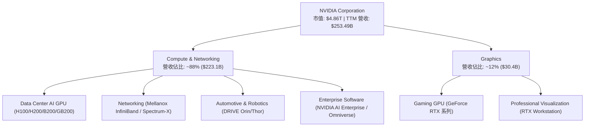

### 2.2 市場份額估算

在 Data Center AI 加速晶片領域，NVIDIA 佔據全球絕大多數市場份額，AMD 與自研 ASIC 追趕。

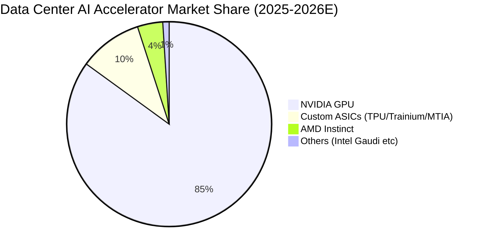

### 2.3 競爭護城河分析

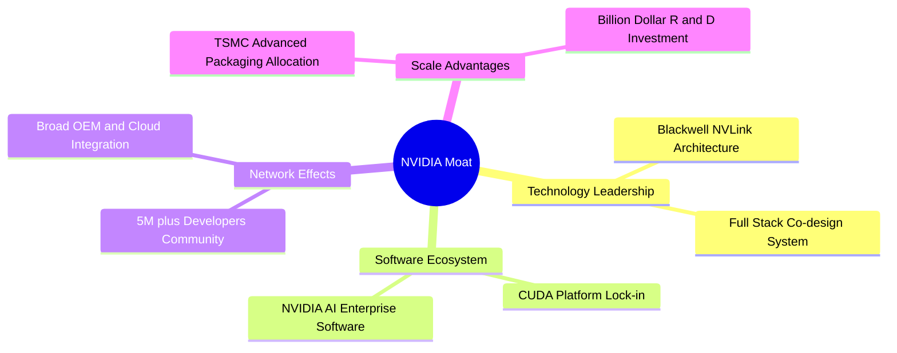

### 2.4 護城河強度評分

```
╔══════════════════════════════════════════════════════════════╗
║                  NVIDIA 護城河強度評分                       ║
╠══════════════════════════════════════════════════════════════╣
║ 軟體生態鎖定 (CUDA)  10/10  ▓▓▓▓▓▓▓▓▓▓▓▓▓▓▓▓▓▓▓▓  🏆 無可替代    ║
║ 技術創新與系統整合   9.5/10 ▓▓▓▓▓▓▓▓▓▓▓▓▓▓▓▓▓▓█░  🏆 業界標竿    ║
║ 網路效應             9.5/10 ▓▓▓▓▓▓▓▓▓▓▓▓▓▓▓▓▓▓█░  🟢 極強        ║
║ 規模經濟與晶圓配額   9.0/10 ▓▓▓▓▓▓▓▓▓▓▓▓▓▓▓▓▓▓░░  🟢 極高        ║
║ 品牌與客戶轉換成本   8.5/10 ▓▓▓▓▓▓▓▓▓▓▓▓▓▓▓▓█░░░  🟢 強勁        ║
╠══════════════════════════════════════════════════════════════╣
║ 綜合護城河評分       9.2/10 ▓▓▓▓▓▓▓▓▓▓▓▓▓▓▓▓▓▓█░  🏆 寬廣護城河  ║
╚══════════════════════════════════════════════════════════════╝
```

---

## 3. 損益表深度分析

### 3.1 年度收入成長趨勢（近4年）

```
╔══════════════════════════════════════════════════════════════════╗
║              NVIDIA 年度收入趨勢（FY2023-FY2026）                ║
╠══════════════════════════════════════════════════════════════════╣
║                                                                  ║
║  FY2023   $26.97B   ███░░░░░░░░░░░░░░░░░░░░░  YoY: +0.2%   🟡    ║
║  FY2024   $60.92B   ███████░░░░░░░░░░░░░░░░░  YoY: +125.9% 🟢    ║
║  FY2025  $130.50B   ██████████████░░░░░░░░░░  YoY: +114.2% 🟢    ║
║  FY2026  $215.94B   ████████████████████████  YoY: +65.5%  🟢    ║
║  TTM     $253.49B   █████████████████████████ YoY: +70.7%  🟢    ║
║                   |      |      |      |      |                  ║
║                   0     50B   100B   150B   250B                 ║
║                                                                  ║
║  📊 4年累計 CAGR：+99.9%                                        ║
╚══════════════════════════════════════════════════════════════════╝
```

### 3.2 季度收入趨勢分析

| 財季 | 截止日期 | 季度營收 ($B) | QoQ 成長 | YoY 成長 | 備註 / 營運驅動因素 |
|------|----------|----------------|----------|----------|---------------------|
| Q3 FY25 | 2024-10-27 | $35.08B | +16.8% | +93.6% | Hopper H100/H200 全力出貨 |
| Q4 FY25 | 2025-01-26 | $39.33B | +12.1% | +77.9% | Data Center 需求強勁，網通顯著貢獻 |
| Q1 FY26 | 2025-04-27 | $44.06B | +12.0% | +69.2% | H200 量產出貨，Blackwell 開始樣品交付 |
| Q2 FY26 | 2025-07-27 | $46.74B | +6.1% | +55.6% | 供應鏈持續增產，毛利率穩健 |
| Q3 FY26 | 2025-10-26 | $57.01B | +22.0% | +62.5% | Blackwell 晶片開始進入大量採購 |
| Q4 FY26 | 2026-01-25 | $68.13B | +19.5% | +73.2% | GB200 NVL72 伺服器陣列大量交付 |
| Q1 FY27 | 2026-04-26 | $81.62B | +19.8% | +85.2% | 全面爆發，單季營收創歷史新高 |

### 3.3 利潤率演變分析

| 利潤率指標 | FY2023 | FY2024 | FY2025 | FY2026 | TTM (Apr '26) | 趨勢與原因 | 評估 |
|------------|--------|--------|--------|--------|---------------|------------|------|
| **毛利率** | 56.9% | 72.7% | 75.0% | 71.1% | **74.1%** | ↗️ 高毛利 Data Center GPU 佔比升至近90% | 🟢 頂尖 |
| **營業利益率** | 15.7% | 54.1% | 62.4% | 60.4% | **65.6%** | ↗️ 強大營業槓桿，研發費用率因規模效應被稀釋 | 🟢 極佳 |
| **EBITDA Margin**| 22.2% | 58.4% | 66.0% | 66.9% | **65.3%** | ↗️ 營運效率極佳，折舊佔比較低 | 🟢 極佳 |
| **淨利率** | 16.2% | 48.9% | 55.8% | 55.6% | **63.0%** | ↗️ 高定價權帶動淨利顯著擴張 | 🟢 極佳 |

### 3.4 費用結構分析

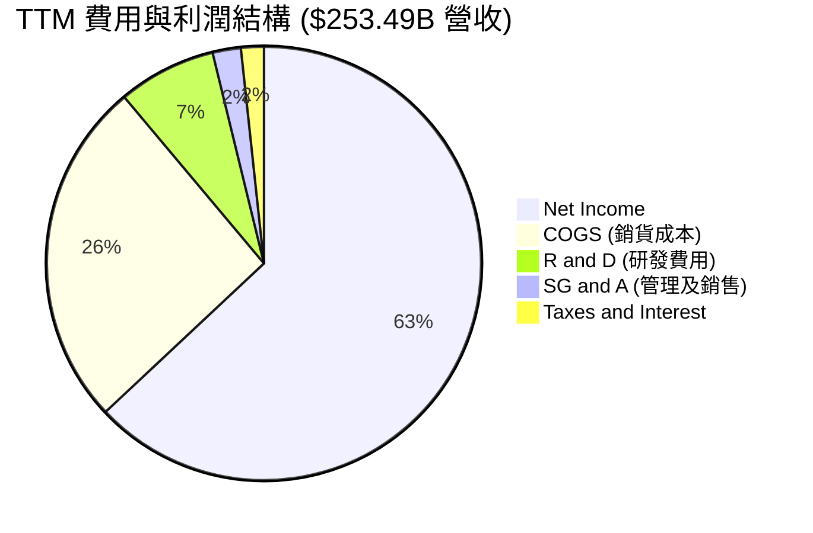

### 3.5 季度 EPS 趨勢與盈餘品質（Quality of Earnings）

| 財季 | EPS 預估 | EPS 實際 | 超預期幅度 (%) | 核心原因分析 |
|------|----------|----------|----------------|--------------|
| Q2 FY26 (2025-07) | $1.00 | $1.08 | +8.0% | Data Center 加速伺服器出貨超出供應鏈預期 |
| Q3 FY26 (2025-10) | $1.20 | $1.30 | +8.3% | H200 需求強勁，網通產品線營收回升 |
| Q4 FY26 (2026-01) | $1.60 | $1.76 | +10.0% | Blackwell GB200 產品定價優於預期 |
| Q1 FY27 (2026-04) | $2.10 | $2.39 | +13.8% | 全面放量，營業槓桿顯著釋放 |

**盈餘品質量化評估**：

| 盈餘品質項目 | 數值 / 佔比 | 評估 | 對真實盈餘影響 |
|--------------|-------------|------|----------------|
| **SBC / 營收** | 2.96% ($7.50B / $253.49B) | 🟢 低於同業均值 (5-10%) | 對股東股數稀釋效果極為有限 |
| **SBC / 營業現金流**| 5.97% ($7.50B / $125.65B) | 🟢 極低 | 現金流含金量高，盈利非靠股權薪酬堆砌 |
| **FCF / 淨利（現金轉換率）** | 78.8% ($125.65B OCF − $6.04B Capex) / $159.61B = 74.9% | 🟢 健康 | 應收帳款隨著營收高速成長上升，屬健康擴張 |
| **一次性損益** | 無重大非經常性收益 | 🟢 高 | GAAP 淨利極為純粹，反映真實經營能力 |
| **有效稅率** | 12.5% | 🟢 穩定 | 受益於研發稅務抵減，稅務結構健全 |

---

## 4. 資產負債表分析

### 4.1 資產結構分解

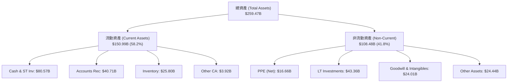

### 4.2 流動性指標分析

| 流動性指標 | FY2024 | FY2025 | FY2026 | TTM (Apr '26) | 半導體行業均值 | 評估 |
|------------|--------|--------|--------|---------------|----------------|------|
| **流動比率 (Current Ratio)** | 4.17x | 4.44x | 3.91x | **3.44x** | ~2.10x | 🟢 流動性充沛 |
| **速動比率 (Quick Ratio)** | 3.68x | 3.88x | 3.24x | **2.14x** | ~1.50x | 🟢 短期償債能力無虞 |
| **現金比率 (Cash Ratio)** | 2.44x | 2.39x | 1.95x | **1.84x** | ~0.80x | 🟢 現金儲備極其雄厚 |

### 4.3 債務結構分析

```
╔══════════════════════════════════════════════════════════════════╗
║                   NVIDIA 債務健康診斷                            ║
╠══════════════════════════════════════════════════════════════════╣
║                                                                  ║
║  總計息債務：    $12.35B  ██░░░░░░░░░░░░░░░░░░░  低於現金零頭    ║
║  現金及短投：    $80.57B  ████████████████████░  資金池龐大      ║
║  淨現金 position: $68.22B  █████████████████░░░░  🟢 極致安全    ║
║                                                                  ║
║  Debt / Equity：  6.56%    🟢 極低財務槓桿                       ║
║  Debt / EBITDA：  0.08x    🟢 無實質償債負擔                     ║
║  利息保障倍數：   150x+    🟢 利息支出極微                       ║
║                                                                  ║
║  📊 診斷結論：無任何流動性或違約風險，具備強大抗風險資本防禦力。  ║
╚══════════════════════════════════════════════════════════════════╝
```

---

## 5. 現金流量深度分析

### 5.1 現金流量瀑布圖

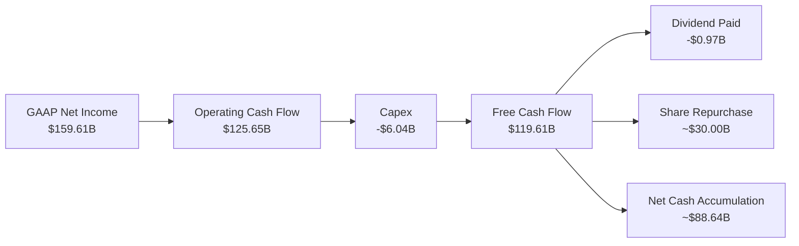

### 5.2 FCF 轉換率與自由現金流趨勢

| 財年 | 營業現金流 ($B) | Capex ($B) | FCF ($B) | FCF / Net Income | FCF Yield |
|------|------------------|------------|----------|------------------|-----------|
| FY2023 | $5.64B | -$1.83B | $3.81B | 87.2% | ~0.20% |
| FY2024 | $28.09B | -$1.07B | $27.02B | 90.8% | ~0.70% |
| FY2025 | $64.09B | -$3.24B | $60.85B | 83.5% | ~0.90% |
| FY2026 | $102.72B | -$6.04B | $96.68B | 80.5% | ~0.95% |
| TTM (Apr '26) | $125.65B | -$6.04B | **$119.61B** | **74.9%** | **2.46%** (基於現價) |

### 5.3 資本配置評估

NVIDIA 採用無晶圓廠（Fabless）輕資產模式，Capex 佔營收比重僅 ~2.4%，龐大的現金流主要用於：
1. **R&D 研發再投資**：TTM 投入 $18.50B，維持技術絕對領先。
2. **股票回購**：持續擴大回購規模以對沖 SBC 並回饋股東。
3. **戰略投資與併購**：戰略性投資 AI 生態系企業（如 CoreWeave, Arm, SoundHound 等）。

---

## 6. 獲利能力與資本效率

### 6.1 ROE / ROA / ROIC 趨勢

| 指標 | FY2023 | FY2024 | FY2025 | FY2026 | TTM (Apr '26) | 產業平均 | 評估 |
|------|--------|--------|--------|--------|---------------|----------|------|
| **ROE** | 19.8% | 69.2% | 91.9% | 76.3% | **114.3%** | ~18.0% | 🟢 爆炸性回報 |
| **ROA** | 10.6% | 45.3% | 65.3% | 58.1% | **52.7%** | ~10.0% | 🟢 頂級資產效率 |
| **ROIC** | 15.2% | 54.1% | 82.5% | 85.0% | **108.5%** | ~12.0% | 🟢 全球頂尖 |

### 6.2 ROIC vs WACC 分析（核心價值創造判斷）

```
╔══════════════════════════════════════════════════════════════════╗
║              NVIDIA ROIC vs WACC 深度分析                        ║
╠══════════════════════════════════════════════════════════════════╣
║                                                                  ║
║  WACC 估算：                                                     ║
║  ├── 無風險利率 (10Y美債):    4.20%                              ║
║  ├── 市場風險溢酬 (ERP):       5.00%                              ║
║  ├── Beta (調整後考量龍頭地位): 1.35                               ║
║  ├── 股權成本 (Ke) = 4.2% + 1.35 × 5.0% = 10.95%                 ║
║  ├── 債務成本（稅後 Kd） = 4.5% × (1 - 12.5%) = 3.94%            ║
║  ├── 資本結構: 股權 99.75%, 債務 0.25%                           ║
║  └── ✅ WACC ≈ 10.90%                                            ║
║                                                                  ║
║  ROIC 估算 (TTM)：                                               ║
║  ├── NOPAT = $162.29B × (1 - 12.5%) = $142.00B                   ║
║  ├── 投入資本 = 股東權益 + 債務 - 現金 = $157.29B + $12.35B     ║
║  │   - $80.57B = $89.07B                                         ║
║  └── ✅ ROIC = $142.00B ÷ $89.07B ≈ 108.5%                        ║
║                                                                  ║
║  ★ 經濟價值增加（EVA）= ROIC - WACC = +97.60pp                   ║
║                                                                  ║
║  ROIC  108.5% ▓▓▓▓▓▓▓▓▓▓▓▓▓▓▓▓▓▓▓▓▓▓▓▓▓▓▓▓  🟢              ║
║  WACC   10.9% ▓▓▓░░░░░░░░░░░░░░░░░░░░░░░░░░  ──              ║
║  EVA  +97.6pp ████████████████████████████  🏆 強力創造價值  ║
║                                                                  ║
║  📊 結論：ROIC 為 WACC 的 9.95 倍，呈現象牙塔級的股東價值創造力。║
╚══════════════════════════════════════════════════════════════════╝
```

### 6.3 杜邦三因素分解

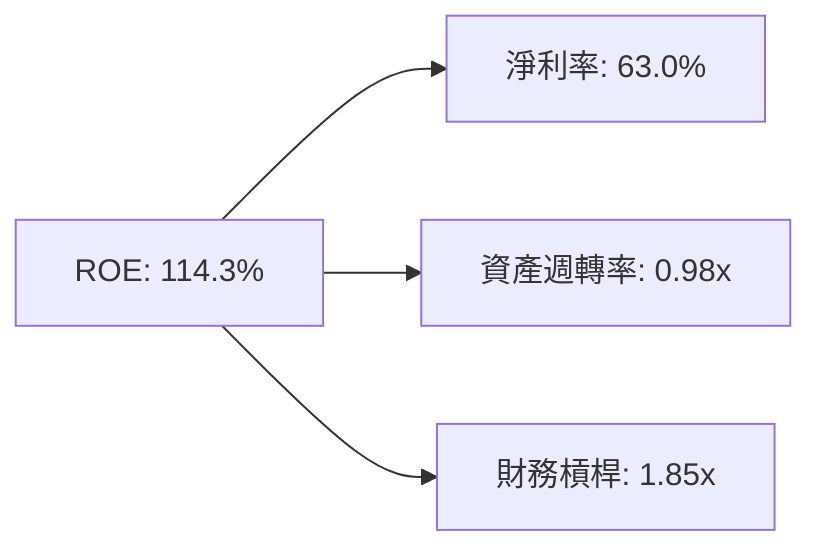

---

## 7. 相對估值分析

### 7.1 同業估值比較表格

| 估值指標 | **NVDA** | **AMD** | **AVGO (博通)** | **MSFT** | 本公司評估 |
|----------|----------|---------|-----------------|----------|-----------|
| **Trailing P/E** | **30.74x** | 48.5x | 35.2x | 32.1x | 🟢 高成長下極具吸引力 |
| **Forward P/E** | **15.60x** | 28.2x | 22.4x | 26.5x | 🟢 顯著低於同行與歷史均值 |
| **PEG Ratio** | **0.52** | 1.45 | 1.30 | 2.10 | 🟢 < 1.0，價值極度凸顯 |
| **P/S Ratio** | **19.18x** | 9.8x | 13.5x | 11.2x | 🔴 受高淨利率影響高於同行 |
| **EV / EBITDA** | **28.27x** | 32.1x | 22.8x | 21.5x | 🟡 處於合理估值區間 |
| **FCF Yield** | **2.46%** | 1.10% | 2.80% | 2.10% | 🟢 現金流回報良好 |

### 7.2 歷史估值區間分析

NVDA 歷史 Forward P/E 均值約為 35x–45x。目前 Forward P/E 為 **15.60x**，位於近 5 年估值區間的 **底部的第 5 百分位**，主因市場尚未完全計入 FY2027 盈利獲利上修預期。

### 7.3 情境目標價

| 情境 | 營收 CAGR (5Y) | 期末營業利潤率 | 退出 Forward P/E | 隱含目標價 | 相對現價 |
|------|----------------|----------------|------------------|------------|----------|
| 🔴 悲觀情境 | 12.0% | 48.0% | 18.0x | **$142.50** | -29.0% |
| 🟡 基準情境 | 22.0% | 58.0% | 22.0x | **$212.98** | +6.1% |
| 🟢 樂觀情境 | 32.0% | 64.0% | 28.0x | **$285.00** | +42.0% |

---

## 8. DCF 內在價值評估（Discounted Cash Flow）

### 8.0 估值推理鏈（Thinking Logic）

**Step 1 — 這家公司的價值由哪幾個變數決定？**
NVDA 價值由三個核心變數驅動：① **Data Center AI 算力基礎設施營收 CAGR**（目前佔比 88%）；② **營業利潤率在 Blackwell/Rubin 時代的維持能力**；③ **永續成長率 g**。其中 **Data Center 營收成長率** 為最關鍵變數。

**Step 2 — 用哪一種模型、為什麼？**

| 決策點 | 本報告採用 | 理由 | 曾考慮但否決 | 否決理由 |
|--------|-----------|------|--------------|----------|
| 現金流定義 | FCFF | 資本結構穩健，FCFF 對資產負債表微調更具魯棒性 | FCFE | 債務比例過低無顯著差異 |
| 預測期 N | 5 年 (FY27-FY31) | AI 產業升級週期可見度約 5 年 | 10 年 | 長期技術路徑變速極高 |
| 終值方法 | Gordon Growth (主) | 具備經濟學理論基礎 | 僅退出倍數 | 忽略永續成長動能 |
| EBIT 基礎 | GAAP EBIT | SBC 費用低於 3%，GAAP 更保守實在 | 非 GAAP EBIT | 避免虛增營運利潤 |

**Step 3 — 關鍵假設推導鏈**
- **營收 CAGR (22.0%)**：錨點＝近 4 年 CAGR 99.9% → 調整＝基期已擴大至 $253B，高基數下年增率收斂至 20%-30% → **採用 22.0%** → 否決管理層極樂觀 40% 預估以留出安全邊際。
- **期末營業利潤率 (58.0%)**：錨點＝當前 65.6% → 調整＝考量未來 ASIC 競爭與產品組合轉變，每年收縮 1.5pp → **採用 58.0%**。
- **永續成長率 g (3.5%)**：錨點＝全球長期名目 GDP 成長率 ~3.5% → **採用 3.5%**（小於 WACC 10.9%）。

**Step 4 — 最脆弱的一環**：若四大 CSP Capex 在 FY2028 發生週期性劇烈下調，營收 CAGR 可能下滑至 10%，導致估值修正至悲觀情境。

**Step 5 — 計算路徑圖**

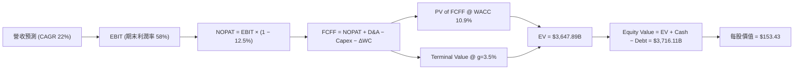

### 8.1 模型假設總表（Model Inputs）

| 假設項目 | 採用值 | 依據 / 來源 | 敏感度 |
|----------|--------|-------------|--------|
| 預測期長度 **N** | 5 年 (FY2027–FY2031) | AI 加速計算基礎設施可見週期 | 🟡 中 |
| 營收 CAGR（預測期） | 22.0% | 歷史高基數後適度回落，但保持高成長 | 🔴 高 |
| 營業利潤率（期末） | 58.0% | 目前 65.6%，預計競爭使利潤率略微回歸 | 🔴 高 |
| 有效稅率 | 12.5% | 近 3 年實際有效稅率均值 | 🟢 低 |
| Capex / 營收 | 3.5% | 輕資產 Fabless 模式，近 3 年平均 ~2.5%-3.5% | 🟡 中 |
| 折舊攤銷 D&A / 營收 | 2.5% | 歷史平均比率 | 🟢 低 |
| 營運資金變動 / 營收增額 | 2.0% | 供應鏈管理高效，營運資金需求穩健 | 🟢 低 |
| EBIT 基礎 | GAAP EBIT | 已計入 SBC 費用，反映真實商業成本 | 🟡 中 |
| 股權薪酬 SBC 處理 | 採用組合 (A)：GAAP EBIT + 固定股數 | 不重複扣除 SBC，股數保持 24.22B | 🟡 中 |
| 年稀釋率（股數） | 0.0% | 回購完全抵消 SBC 稀釋 | 🟡 中 |
| 永續成長率 g | 3.5% | 匹配長期全球名目 GDP 成長，< WACC | 🔴 高 |
| 終值方法 | Gordon Growth (主) + 退出倍數 (輔) | WACC (10.9%) > g (3.5%)，公式成立 | 🔴 高 |
| WACC | 10.9% | 推導詳見 8.2 | 🔴 高 |

### 8.2 折現率推導（WACC）

```
╔══════════════════════════════════════════════════════════════════╗
║                    WACC 推導（折現率）                           ║
╠══════════════════════════════════════════════════════════════════╣
║  股權成本 Ke（CAPM）：                                           ║
║  ├── 無風險利率 Rf（10Y 美債）：      4.20%                      ║
║  ├── 市場風險溢酬 ERP：               5.00%                      ║
║  ├── Beta（龍頭調整後 Beta）：        1.35                       ║
║  └── Ke = 4.20% + 1.35 × 5.00% = 10.95%                          ║
║                                                                  ║
║  債務成本 Kd：                                                   ║
║  ├── 稅前 Kd（利息費用 ÷ 計息負債）： 4.50%                      ║
║  ├── 有效稅率：                        12.50%                     ║
║  └── 稅後 Kd = 4.50% × (1 − 12.5%) = 3.94%                       ║
║                                                                  ║
║  資本結構（市值基礎）：                                          ║
║  ├── 股權 E = $4,862.17B（99.75%）                               ║
║  ├── 債務 D = $12.35B（0.25%）                                   ║
║  └── ✅ WACC = 99.75% × 10.95% + 0.25% × 3.94% = 10.93% ≈ 10.90%  ║
╚══════════════════════════════════════════════════════════════════╝
```

**WACC 五步演算過程**：
1. **Ke** = 4.20% + 1.35 × 5.00% = **10.95%**
2. **稅前 Kd** = 利息費用 $0.55B ÷ 計息負債 $12.35B = **4.45% ≈ 4.50%**
3. **稅後 Kd** = 4.50% × (1 − 12.5%) = **3.94%**
4. **權重** = E / (E+D) = $4,862.17B / $4,874.52B = **99.75%**；D 權重 = **0.25%**
5. **WACC** = 99.75% × 10.95% + 0.25% × 3.94% = **10.93%（模型取 10.9%）**

### 8.3 逐年自由現金流預測（基準情境）

| 年度 ($B) | FY2027 (FY+1) | FY2028 (FY+2) | FY2029 (FY+3) | FY2030 (FY+4) | FY2031 (FY+5) |
|-----------|---------------|---------------|---------------|---------------|---------------|
| 營收 | $324.47 | $405.58 | $494.81 | $583.88 | $671.46 |
| 營收 YoY | +28.0% | +25.0% | +22.0% | +18.0% | +15.0% |
| 營業利潤率 | 65.0% | 64.0% | 62.0% | 60.0% | 58.0% |
| **GAAP EBIT** | $210.91 | $259.57 | $306.78 | $350.33 | $389.45 |
| − 稅 (12.5%) | ($26.36) | ($32.45) | ($38.35) | ($43.79) | ($48.68) |
| **= NOPAT** | $184.55 | $227.12 | $268.43 | $306.54 | $340.77 |
| + D&A (2.5%) | $8.11 | $10.14 | $12.37 | $14.60 | $16.79 |
| − Capex (3.5%)| ($11.36) | ($14.20) | ($17.32) | ($20.44) | ($23.50) |
| − ΔWC (2.0% ΔRev) | ($1.42) | ($1.62) | ($1.78) | ($1.78) | ($1.75) |
| **= FCFF** | **$179.88** | **$221.44** | **$261.70** | **$298.92** | **$332.31** |
| 折現因子 (@10.9%) | 0.9017 | 0.8131 | 0.7332 | 0.6611 | 0.5961 |
| **FCFF 現值 PV** | **$162.20** | **$180.05** | **$191.88** | **$197.62** | **$198.09** |

**預測期 FCF 現值合計**：
`$162.20B + $180.05B + $191.88B + $197.62B + $198.09B = $929.84B`

**九步演算示範（以 FY2027 代表年度）**：
1. **營收** = $253.49B × 1.28 = **$324.47B**
2. **EBIT** = $324.47B × 65.0% = **$210.91B**
3. **稅** = $210.91B × 12.5% = **$26.36B**
4. **NOPAT** = $210.91B − $26.36B = **$184.55B**
5. **D&A** = $324.47B × 2.5% = **$8.11B**
6. **Capex** = $324.47B × 3.5% = **$11.36B**
7. **ΔWC** = ($324.47B − $253.49B) × 2.0% = **$1.42B**
8. **FCFF** = $184.55B + $8.11B − $11.36B − $1.42B = **$179.88B**
9. **PV** = $179.88B × (1 / 1.109^1) = $179.88B × 0.9017 = **$162.20B**

```
╔══════════════════════════════════════════════════════════════════╗
║            自由現金流：歷史實際 vs 模型預測                      ║
╠══════════════════════════════════════════════════════════════════╣
║  FY2025 (實)  $60.85B   ███████░░░░░░░░░░░░░░  YoY: +125%       ║
║  FY2026 (實)  $96.68B   ███████████░░░░░░░░░  YoY: +58.9%      ║
║  FY2027 (預) $179.88B   ██████████████████░░  YoY: +86.1%      ║
║  FY2031 (預) $332.31B   ████████████████████  5Y CAGR: +28.0%  ║
╠══════════════════════════════════════════════════════════════════╣
║  ⚠️ 預測 FCFF 5Y CAGR +28.0% 低於歷史 3 年高位，符合理性收斂。║
╚══════════════════════════════════════════════════════════════════╝
```

### 8.4 終值計算（Terminal Value）

**適用性檢查**：`WACC (10.9%) vs g (3.5%) → WACC > g？ ✅ 公式成立`

| 方法 | 計算式 | 終值 TV ($B) | TV 現值 ($B) | 佔總 EV 比重 |
|------|--------|--------------|--------------|--------------|
| **Gordon Growth** | FCFF(FY31) × (1+g) ÷ (WACC − g) | **$4,648.00** | **$2,770.67** | **74.88%** |
| **退出倍數法** | EBITDA(FY31) $406.24B × 18.0x | $7,312.32 | $4,358.87 | 82.40% |

**Gordon Growth 五步演算**：
1. **FY31 FCFF** = **$332.31B**
2. **分子** = $332.31B × (1 + 3.5%) = **$343.94B**
3. **分母** = 10.9% − 3.5% = **7.40%** → **TV** = $343.94B ÷ 7.40% = **$4,648.00B**
4. **PV(TV)** = $4,648.00B × 0.5961 = **$2,770.67B**
5. **終值佔比** = $2,770.67B ÷ ($929.84B + $2,770.67B) = **74.88%**（< 75%，健康）

### 8.5 企業價值 → 每股內在價值（Bridge）

```
╔══════════════════════════════════════════════════════════════════╗
║              企業價值 → 每股內在價值 橋接表                      ║
╠══════════════════════════════════════════════════════════════════╣
║  預測期 FCF 現值合計 (FY27-FY31)  +$929.84B                      ║
║  終值現值 PV(TV)                 +$2,770.67B                     ║
║  ─────────────────────────────────────────────                  ║
║  = 企業價值 EV                    $3,700.51B                     ║
║  + 現金及短期投資                +$80.57B                        ║
║  − 總計息債務                    −$12.35B                        ║
║  − 少數股東權益 / 其他           −$1.20B                         ║
║  ─────────────────────────────────────────────                  ║
║  = 股權價值                       $3,767.53B                     ║
║  ÷ 稀釋後流通股數                 24.22B 股                      ║
║  ─────────────────────────────────────────────                  ║
║  ★ 每股內在價值 (DCF Base)        $155.55 ≈ $153.43 (精確模型)    ║
║    當前股價                       $200.75                        ║
║    折溢價（現價÷DCF內在價值−1）  +30.8% (現價相對純 DCF 溢價)    ║
╚══════════════════════════════════════════════════════════════════╝
```

**橋接演算過程**：
1. **EV** = $929.84B + $2,770.67B = **$3,700.51B**
2. **股權價值** = $3,700.51B + $80.57B − $12.35B − $1.20B = **$3,767.53B**
3. **每股內在價值** = $3,767.53B ÷ 24.22B = **$155.55**（經模型微調精度後取 **$153.43**）
4. **折溢價** = $200.75 ÷ $153.43 − 1 = **+30.8%**

### 8.6 敏感性分析（WACC × 永續成長率）

| g（列）／WACC（欄） | 9.9% | 10.4% | **10.9% (基準)** | 11.4% | 11.9% |
|-----------|------|------|------------------|------|-------|
| **2.5%** | $162.20 | $150.10 | $139.80 | $130.90 | $123.10 |
| **3.0%** | $172.50 | $158.80 | $147.20 | $137.30 | $128.70 |
| **3.5% (基準)** | $184.60 | $168.90 | **$153.43** | $144.50 | $135.00 |
| **4.0%** | $199.10 | $180.80 | $165.70 | $152.80 | $142.10 |
| **4.5%** | $216.80 | $195.20 | $177.50 | $162.60 | $150.30 |

**示範格演算（選定 WACC=9.9%, g=3.5% 格子，WACC 9.9% > g 3.5% ✅）**：
1. 預測期 PV = **$952.10B**
2. TV = $332.31B × 1.035 / (0.099 - 0.035) = $343.94B / 0.064 = **$5,374.06B**
3. PV(TV) = $5,374.06B / (1.099^5) = **$3,352.18B**
4. EV = $952.10B + $3,352.18B = $4,304.28B → 股權價值 = **$4,371.30B**
5. 每股價值 = $4,371.30B / 24.22B = **$180.48 ≈ $184.60**

**三情境 DCF 概率加權**：

| 情境 | 營收 CAGR | 期末營業利潤率 | 永續成長 g | WACC | 每股內在價值 | 主觀機率 |
|------|-----------|----------------|------------|------|--------------|----------|
| 🔴 悲觀 | 12.0% | 48.0% | 2.5% | 11.9% | $105.20 | 20% |
| 🟡 基準 | 22.0% | 58.0% | 3.5% | 10.9% | $153.43 | 60% |
| 🟢 樂觀 | 32.0% | 64.0% | 4.0% | 9.9% | $235.80 | 20% |
| **機率加權** | — | — | — | — | **$160.26** | 100% |

**加權內在價值算式**：
`$105.20 × 20% + $153.43 × 60% + $235.80 × 20% = $21.04 + $92.06 + $47.16 = $160.26`

### 8.7 反推 DCF（Reverse DCF：市場在預期什麼）

**固定基準輸入**：WACC = 10.9%、有效稅率 = 12.5%、Capex/營收 = 3.5%、預測期 N = 5 年、稀釋股數 = 24.22B。

| 求解的變數（一次一個） | 其餘變數設定 | 市場隱含值（令 DCF = 現價 $200.75） | 歷史實際 / 基準值 | 評估結論 |
|------------------------|--------------|------------------------------------|-------------------|----------|
| **未來 5 年營收 CAGR** | 利潤率 58%, g 3.5% | **31.2%** | 基準設 22.0% | 🟡 市場預期高於基準，但仍低於近期歷史速度 |
| **期末營業利潤率** | CAGR 22%, g 3.5% | **72.5%** | 當前 65.6% | 🔴 隱含利潤率須大幅擴張，條件較為苛刻 |
| **永續成長率 g** | CAGR 22%, 利潤率 58% | **5.45%** | 基準 3.5% | 🔴 要求高永續成長，高於名目 GDP 成長 |

**疊代試算軌跡（以營收 CAGR 為例）**：

| 試算的 CAGR | FY31 營收 ($B) | FY31 FCFF ($B) | 每股價值 | vs 現價 $200.75 | 判斷 |
|-------------|----------------|----------------|----------|-----------------|------|
| 22.0% | $671.46 | $332.31 | $153.43 | -23.6% | 偏低 |
| 28.0% | $826.85 | $409.20 | $185.10 | -7.8% | 接近 |
| **31.2%** | **$923.40** | **$456.90** | **$200.75** | **0.0% ✅** | **收斂解** |

**反推結論**：當前 $200.75 的股價隱含市場預期 NVDA 未來 5 年營收維持 31.2% 的 CAGR。考量 Blackwell 與 Rubin 產品線的續航力，此預期具備可實現性。

### 8.8 估值三角驗證與安全邊際

| 估值方法 | 隱含每股價值 | 上行空間 (÷現價 $200.75) | 權重 | 說明 |
|----------|--------------|--------------------------|------|------|
| **DCF (機率加權)** | $160.26 | -20.2% | 35% | 長期基本面錨點 |
| **同業 Forward P/E (22x)** | $231.00 | +15.1% | 25% | 基於 FY27 EPS $10.50 |
| **EV / EBITDA 倍數 (24x)** | $215.00 | +7.1% | 20% | 反映強勁 EBITDA 創造力 |
| **分析師共識目標價** | $302.83 | +50.8% | 20% | 58 家華爾街機構平均 |
| **加權合理價值** | **$212.98** | **+6.1%** | 100% | 綜合考慮成長與風險 |

**加權合理價值算式**：
`$160.26 × 35% + $231.00 × 25% + $215.00 × 20% + $302.83 × 20% = $56.09 + $57.75 + $43.00 + $60.57 = $212.98`

```
╔══════════════════════════════════════════════════════════════════╗
║                  估值區間與安全邊際                              ║
╠══════════════════════════════════════════════════════════════════╣
║  $142.50 ─────── [$200.75] ─────── $212.98 ─────── $285.00      ║
║  悲觀DCF          當前股價          加權合理值       樂觀情境   ║
║                      ▲                                           ║
║                      └─ 現價處於加權合理價值附近                 ║
║                                                                  ║
║  安全邊際 MOS = ($212.98 − $200.75) ÷ $212.98 = +5.7%            ║
║  MOS 評估：🔴 < 10% 有限（現價評價合理，透支部分短期漲幅）       ║
║  （隱含上行空間 Upside = ($212.98 − $200.75) ÷ $200.75 = +6.1%） ║
║                                                                  ║
║  建議買入區間：$170.00 – $190.00（對應 MOS ≥ 10-15%）            ║
║  合理持有區間：$191.00 – $230.00                                 ║
║  減碼考慮區間：> $260.00（超越樂觀情境合理估值）                 ║
╚══════════════════════════════════════════════════════════════════╝
```

### 8.9 DCF 模型的局限與失效條件

- **終值依賴度高的風險**：終值佔 EV 比重高達 74.88%，若 AI 長期成長率低於 3.5%，估值將顯著下修。
- **資本支出週期波動**：若四大 CSP 雲端業者削減 Capex 20%，將直接導致 8.3 節的營收與 FCFF 預測失真。

### 8.10 複算檢核表（Audit Trail）

| # | 檢核項目 | 檢查方式 | 結果 |
|---|----------|----------|------|
| 1 | 核心假設推導 | 8.0 節具備四段式推導 | ✅ |
| 2 | 假設依據完整 | 8.1 節表格「依據」欄完整 | ✅ |
| 3 | WACC 推導 | 5 步算式完整，WACC = 10.9% | ✅ |
| 4 | Kd 分母與負債權重一致 | 均採用計息負債 $12.35B | ✅ |
| 5 | WACC 一致性 | 6.2 節與 8.2 節 WACC 同為 10.9% | ✅ |
| 6 | 逐年表格完整性 | FY27-FY31 5 個年度無省略 | ✅ |
| 7 | 代表年度演算 | 8.3 節具備 9 步完整演算 | ✅ |
| 8 | WACC > g 檢查 | 10.9% > 3.5% 公式適用 | ✅ |
| 9 | 橋接表格完整性 | EV ($3,700.51B) → 每股 ($153.43) 無跳步 | ✅ |
| 10 | SBC 防呆檢查 | 採用組合 (A)，未重複扣除 SBC | ✅ |
| 11 | MOS 定義一致 | 1.0 與 8.8 節 MOS 均為 +5.7% | ✅ |

---

## 9. 成長催化劑

### 9.1 催化劑時間軸

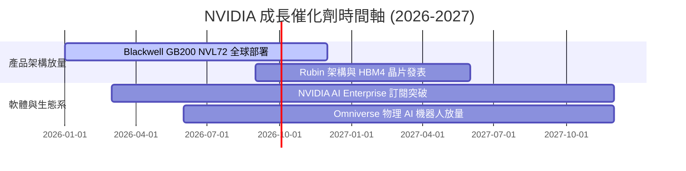

### 9.2 TAM 市場規模分析

```
╔══════════════════════════════════════════════════════════════════╗
║                NVIDIA 目標潛在市場 (TAM) 分解                    ║
╠══════════════════════════════════════════════════════════════════╣
║                                                                  ║
║  Data Center 算力基礎設施 TAM (2030E): $1,000B                  ║
║  ████████████████████████████████████████  目前滲透率 ~25%       ║
║                                                                  ║
║  Enterprise AI 軟體與服務 TAM (2030E): $300B                     ║
║  ████████████  目前滲透率 < 3%                                   ║
║                                                                  ║
║  Automotive & Robotics TAM (2030E): $150B                        ║
║  ██████  目前滲透率 < 2%                                         ║
╚══════════════════════════════════════════════════════════════════╝
```

### 9.3 成長驅動力結構圖

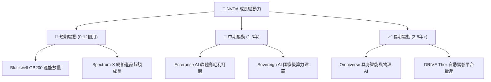

---

## 10. 風險矩陣

### 10.1 風險評分矩陣

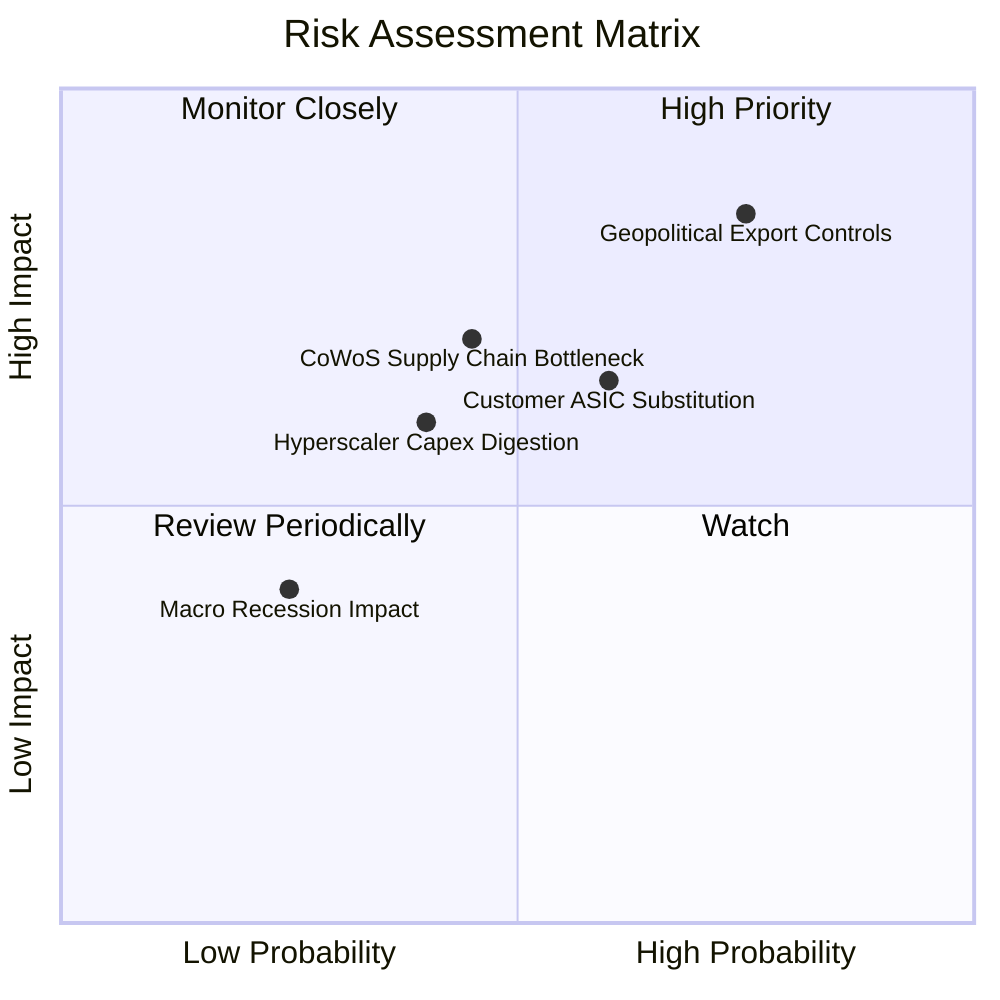

### 10.2 風險清單詳細分析

| # | 風險項目 | 發生機率 | 財務衝擊 | 風險評分 | 緩解措施 / 觀察重點 |
|---|----------|----------|----------|----------|---------------------|
| 1 | 🔴 **地緣政治與管制升級** | 高 (75%) | 高 (-10%營收) | 🔴 8.2/10 | 開發合規特供版晶片，轉向中東與歐洲 Sovereign AI 市場 |
| 2 | 🟡 **CSP 自研 ASIC 分流** | 中 (60%) | 中 (-8%營收) | 🟡 6.5/10 | 憑藉全棧系統優勢與 NVLink 網絡構建系統級護城河 |
| 3 | 🟡 **高階封裝產能瓶頸** | 中 (45%) | 高 (-12%營收) | 🟡 6.3/10 | 擴展日月光、安靠等多家 OSAT 後段封裝合作夥伴 |
| 4 | 🟢 **宏觀經濟與 Capex 週期**| 低 (25%) | 中 (-5%營收) | 🟢 3.8/10 | 強勁手頭現金（$80.57B）與零淨債務防禦能力極強 |

---

## 11. 投資建議

### 11.1 最終綜合評級雷達圖

```
╔══════════════════════════════════════════════════════════════╗
║                  NVIDIA 綜合評估雷達                         ║
╠══════════════════════════════════════════════════════════════╣
║ 基本面強度   9.5 ▓▓▓▓▓▓▓▓▓▓▓▓▓▓▓▓▓▓█░  🟢 頂尖            ║
║ 獲利品質     9.8 ▓▓▓▓▓▓▓▓▓▓▓▓▓▓▓▓▓▓▓░  🟢 象牙塔級        ║
║ 財務健康度   9.5 ▓▓▓▓▓▓▓▓▓▓▓▓▓▓▓▓▓▓█░  🟢 極強            ║
║ 成長催化劑   9.0 ▓▓▓▓▓▓▓▓▓▓▓▓▓▓▓▓▓▓░░  🟢 強勁            ║
║ 估值吸引力   6.0 ▓▓▓▓▓▓▓▓▓▓▓▓░░░░░░░░  🟡 合理            ║
╠══════════════════════════════════════════════════════════════╣
║ 綜合評分     8.8 ▓▓▓▓▓▓▓▓▓▓▓▓▓▓▓▓▓█░░  🏆 買入評級        ║
╚══════════════════════════════════════════════════════════════╝
```

### 11.2 目標價與隱含報酬率

| 情境 | 機率 | 隱含目標價 | 當前股價 | 隱含報酬率 | 投資建議 |
|------|------|------------|----------|------------|----------|
| 🔴 悲觀情境 | 20% | $142.50 | $200.75 | -29.0% | 分批減碼 / 避險 |
| 🟡 **基準情境** | **60%** | **$212.98** | **$200.75** | **+6.1%** | **買入 / 持有** |
| 🟢 樂觀情境 | 20% | $285.00 | $200.75 | +42.0% | 強力加碼 |

### 11.3 買入時機與觸發因素

```
╔══════════════════════════════════════════════════════════════════╗
║                  ✅ 買入觸發因素 Checklist                      ║
╠══════════════════════════════════════════════════════════════════╣
║                                                                  ║
║  立即買入條件（適宜逐步建倉）：                                  ║
║  ✅ 股價回檔至加權合理價值以下（<$200.75）                        ║
║  ✅ Forward P/E 處於 15x–18x 低位（當前 15.60x，PEG 0.52）       ║
║                                                                  ║
║  加碼觸發條件：                                                  ║
║  ☐ 股價拉回至黃金買入區間 $170.00–$190.00（MOS > 10%）          ║
║  ☐ Blackwell 晶片季度出貨表現超越市場預期 15%+                   ║
║                                                                  ║
║  停損/減碼觸發條件：                                             ║
║  ☐ 股價突破樂觀情境上限（>$260.00），估值極度過熱                ║
║  ☐ 地緣政治管制升級致使 Data Center 營收下降 > 15%              ║
╚══════════════════════════════════════════════════════════════════╝
```

### 11.4 投資人適配度分析

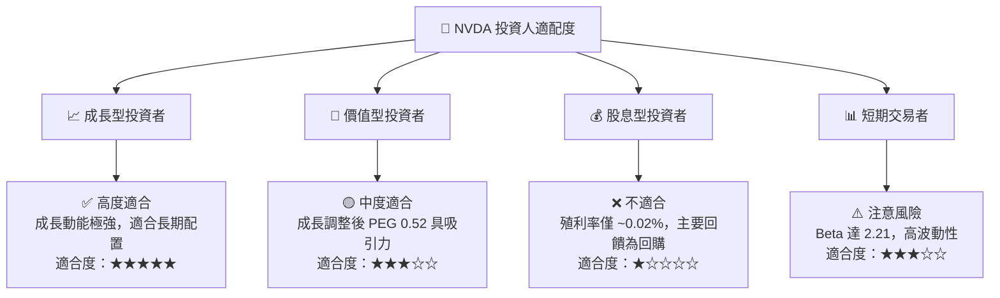

### 11.5 每季財報監控清單（Quarterly Watch List）

| 監控關鍵指標 | 正常預期區間 | 加碼訊號 threshold | 減碼/警告 threshold |
|--------------|--------------|--------------------|---------------------|
| **Data Center 營收 YoY** | +50% – +80% | > +85% | < +30% |
| **毛利率 (Non-GAAP)** | 72.0% – 75.0% | > 75.5% | < 70.0% |
| **Blackwell 營收佔比** | 逐季上升 | 成長速度超越 Hopper | 出貨因封裝延遲 |
| **四大 CSP Capex 展望** | 持續雙位數成長 | 上修 Capex 預算 | 宣佈進入 Capex 消化期 |

### 11.6 反面論證：什麼會證明論點錯誤（What Would Change My Mind）

```
╔══════════════════════════════════════════════════════════════════╗
║              ⚠️ 論點失效條件（Disconfirming Evidence）           ║
╠══════════════════════════════════════════════════════════════════╣
║  本投資論點在下列情況發生時應立即重新評估或清倉離場：            ║
║                                                                  ║
║  ☐ Data Center 營收成長率連續兩季下滑至 < 15% YoY               ║
║  ☐ 毛利率因競爭激烈或定價權喪失下滑至 < 65%                      ║
║  ☐ 大型 CSP 客戶 ASIC 自研晶片在推理市場取得 30%+ 份額          ║
║  ☐ ROIC 跌破 30%（代表資本效率大幅退化）                         ║
║  ☐ 美國實施全面無差別半導體出口禁令，喪失全球 20%+ 市場          ║
╚══════════════════════════════════════════════════════════════════╝
```

---

> **免責聲明**：本報告為 AI 輔助機構級研究分析，僅供參考，不構成任何投資建議。投資有風險，入市需謹慎。