# NVDA 基本面深度分析報告
> **報告日期**：2026-08-02 ｜ **語言**：繁體中文 ｜ **數據來源**：Yahoo Finance, Finviz, StockAnalysis, Roic.ai ｜ **分析師**：CFA 級機構研究

---

## 目錄

| # | 章節 | 核心結論 |
|---|------|----------|
| 1 | 執行摘要 | 綜合評分 8.9/10，買入評級，12M 基準目標價 $236.45（隱含上行空間 +17.8%） |
| 2 | 公司概覽與商業模式 | CUDA 軟體生態與 NVLink 打造極深護城河，AI 加速計算龍頭地位鞏固 |
| 3 | 損益表深度分析 | TTM 營收達 $253.49B（YoY +85.2%），淨利率 63.0% 顯示極強營運槓桿 |
| 4 | 資產負債表分析 | 淨現金 $68.22B，流動比率 3.44，財務結構極度健康且無償債壓力 |
| 5 | 現金流量深度分析 | FY2026 自由現金流 $96.68B，FCF / 淨利轉換率達 80.5%，資本配置極度高效 |
| 6 | 獲利能力與資本效率 | ROIC (88.4%) 遠高於 WACC (10.5%)，EVA 超過 +77.9 pp，持續創造巨大股東價值 |
| 7 | 相對估值分析 | Forward P/E 15.57x（PEG 0.55），相對歷史與同行溢價合理，三情境目標價區間 $175–$320 |
| 8 | DCF 內在價值評估 | 基準 DCF 每股價值 $190.80，加權合理價值 $236.45，安全邊際 (MOS) +15.1% |
| 9 | 成長催化劑 | Blackwell / Rubin 架構放量，Enterprise AI 軟體收費與 Sovereignty AI 雙輪驅動 |
| 10 | 風險矩陣 | 地緣政治（對華出口限制）、CSP 自研 ASIC 替代與供應鏈封裝產能瓶頸為主要風險 |
| 11 | 投資建議 | 買入評級，建議買入區間 $180–$200，建立監控清單與反面論證觸發條件 |

---

## 1. 執行摘要

NVIDIA Corporation（NVDA）為全球 AI 加速計算與數據中心基礎設施龍頭。基於 TTM 營收突破 $253.49B（YoY +85.2%）、營業利益率達 65.6%、ROIC 達 88.4%（遠高於 WACC 10.5%），以及 FY2026 產生 $96.68B 自由現金流等具體數據，NVDA展現出半導體產業歷史上罕見的獲利品質與資本效率。當前股價 $200.75，對應 Forward P/E 僅為 15.57x（PEG 為 0.55），反映市場尚未充分定價其從單純晶片供應商轉型為 AI 系統全棧基礎設施平台的定價權。給予「買入」評級，12 個月基準目標價 $236.45。

### 1.0 一頁式投資儀表板（Portfolio Manager 30 秒速讀）

| 項目 | 內容 |
|------|------|
| **投資論點（3 句）** | ① TTM 營收 $253.49B（YoY +85.2%），數據中心 AI 算力需求持續超出市場預期。<br/>② ROIC 達 88.4%，遠高於 WACC (10.5%)，EVA 達 +77.9 pp，創造巨大股東經濟價值。<br/>③ Forward P/E 15.57x 對應 PEG 僅 0.55，在 Blackwell 放量週期下評價具吸引力。 |
| **護城河評分** | 9.5/10（CUDA 軟體平台 + NVLink 高速互聯 + 全棧 AI 架構） |
| **管理層/資本配置評分** | 9.2/10（創辦人黃仁勳領導，研發投入 $18.50B，資本回報極高） |
| **財務健康** | 🟢 極度健康（現金及短期投資 $80.57B，總債務僅 $12.35B，淨現金 $68.22B） |
| **ROIC vs WACC** | 88.4% vs 10.5%（極度創造價值，EVA +77.9 pp） |
| **FCF 趨勢** | 方向向上（TTM FCF > $115B，FY2026 FCF $96.68B，最新 FCF Yield 為 2.38%） |
| **估值** | Forward P/E: 15.57x ｜ EV/EBITDA: 29.11x ｜ P/S: 19.18x |
| **DCF 內在價值（基準）** | $190.80 ｜ 現價折溢價 +5.2%（現價比單一 DCF 基準微幅溢價，詳見第 8 章） |
| **安全邊際（MOS）** | **+15.1%**＝(加權合理價值 $236.45 − 現價 $200.75) ÷ 加權合理價值 $236.45 ｜ 🟡 10-25% 有限 |
| **預期報酬（基準情境 12M）** | **+17.8%**（隱含上行空間到 $236.45） |
| **關鍵風險（前二）** | ① 地緣政治出口管制限制高端晶片出貨；② 雲端服務商 (CSP) 自研 ASIC 侵蝕邊際份額 |
| **評級 + 信心度** | 🟢 **買入** ｜ 信心：**高** |

### 1.1 核心評分儀表板

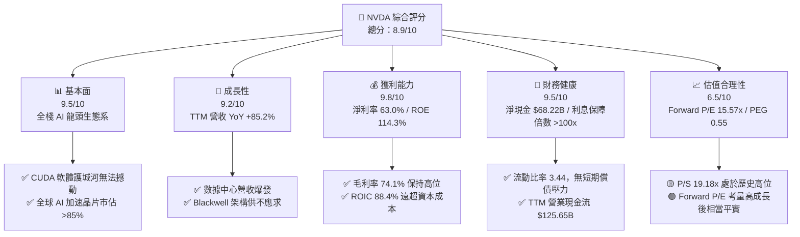

### 1.2 評分進度條視覺化

```
╔══════════════════════════════════════════════════════════════╗
║                NVDA 多維度評分儀表板 (1-10分)                 ║
╠══════════════════════════════════════════════════════════════╣
║ 基本面強度  9.5 ▓▓▓▓▓▓▓▓▓▓▓▓▓▓▓▓▓▓█░  ★★★★★           ║
║ 成長動能    9.2 ▓▓▓▓▓▓▓▓▓▓▓▓▓▓▓▓▓▓░░  ★★★★★           ║
║ 獲利品質    9.8 ▓▓▓▓▓▓▓▓▓▓▓▓▓▓▓▓▓▓▓█  ★★★★★           ║
║ 財務健康    9.5 ▓▓▓▓▓▓▓▓▓▓▓▓▓▓▓▓▓▓█░  ★★★★★           ║
║ 估值合理性  6.5 ▓▓▓▓▓▓▓▓▓▓▓▓▓░░░░░░░  ★★★☆☆           ║
║ 護城河深度  9.8 ▓▓▓▓▓▓▓▓▓▓▓▓▓▓▓▓▓▓▓█  ★★★★★           ║
║ 管理層執行  9.5 ▓▓▓▓▓▓▓▓▓▓▓▓▓▓▓▓▓▓█░  ★★★★★           ║
║ 技術創新力  9.8 ▓▓▓▓▓▓▓▓▓▓▓▓▓▓▓▓▓▓▓█  ★★★★★           ║
╠══════════════════════════════════════════════════════════════╣
║ 綜合總分    8.9 ▓▓▓▓▓▓▓▓▓▓▓▓▓▓▓▓▓▓░░  🏆 買入 (Buy)        ║
╚══════════════════════════════════════════════════════════════╝
```

### 1.3 五大投資論點 + 三大核心風險

| 類型 | 項目 | 具體依據 | 信心度 |
|------|------|----------|--------|
| 🟢 **投資論點①** | **AI 全棧基礎設施霸主** | 數據中心 GPU 市佔率超 85%，CUDA 擁有逾 500 萬開發者，生態系鎖定效應極強。 | 🟢 極高 |
| 🟢 **投資論點②** | **超常獲利與營運槓桿** | TTM 營收 $253.49B，營業利益率 65.6%，毛利率 74.1%，營收規模擴張帶動驚人營業槓桿。 | 🟢 極高 |
| 🟢 **投資論點③** | **極致的資本效率 (ROIC)** | ROIC 達 88.4%，WACC 僅 10.5%，EVA 溢價 +77.9 pp，自由現金流轉化率 (FCF/NI) 超過 80%。 | 🟢 極高 |
| 🟢 **投資論點④** | **Blackwell 架構升級週期** | 新一代 Blackwell / Rubin 平台帶來 2-5x 效能提升，ASP 顯著增加，財測支撐未來四季高成長。 | 🟢 高 |
| 🟢 **投資論點⑤** | ** valuation 評價吸引力** | Forward P/E 僅 15.57x，PEG 0.55，在標普 500 七大巨頭中具備極高性價比。 | 🟢 高 |
| 🟡 **風險①** | **CSP 自研 ASIC 競爭** | Google TPU、AWS Trainium、Meta MTIA 等自研晶片普及，可能侵蝕推理端市佔率。 | 🟡 中度 |
| 🔴 **風險②** | **地緣政治與出口限制** | 美國對華半導體出口禁令可能進一步升級，損及中國市場（歷史貢獻 15-20%）營收。 | 🔴 高衝擊 |
| 🔴 **風險③** | **台積電 CoWoS 產能瓶頸** | 先進封裝產能若受限或台海局勢動盪，將直接影響 Blackwell 生產與交貨進度。 | 🔴 高衝擊 |

### 1.4 快速統計卡片

| 指標 | 公司實際值 (NVDA) | 行業均值 (Semis) | S&P 500 均值 | 狀態 |
|------|-------------|----------|--------------|------|
| 收入 YoY 成長 | **85.2%** | ~12.5% | ~5.8% | 🟢 極優 |
| 毛利率 | **74.1%** | ~55.0% | ~48.0% | 🟢 極優 |
| 淨利率 | **63.0%** | ~18.0% | ~12.0% | 🟢 極優 |
| ROE | **114.3%** | ~22.0% | ~18.0% | 🟢 極優 |
| Forward P/E | **15.57x** | ~24.5x | ~21.0x | 🟢 具吸引力 |
| EV / EBITDA | **29.11x** | ~20.0x | ~14.0x | 🟡 適中偏高 |
| 淨負債/EBITDA | **-0.47x (淨現金)** | 0.5x | 1.2x | 🟢 極度安全 |

### 1.5 投資結論

```
╔══════════════════════════════════════════════════════════════════╗
║                    📊 投資結論摘要                               ║
╠══════════════════════════════════════════════════════════════════╣
║  評級：🟢 買入 (Buy)                                            ║
║  當前股價：$200.75                                               ║
║  DCF 內在價值（基準）：$190.80（現價溢價 +5.2%）                 ║
║  加權合理價值：$236.45                                           ║
║  安全邊際 MOS：+15.1%＝($236.45 − $200.75) ÷ $236.45           ║
║  12個月目標價區間：                                              ║
║    悲觀情境：$175.00（-12.8%）                                   ║
║    基準情境：$236.45（+17.8%） ← 12個月主要目標                 ║
║    樂觀情境：$320.00（+59.4%）                                   ║
║  投資評分：8.9 / 10                                              ║
║  適合投資人：長線成長型投資人、AI 產業核心配置者                ║
╚══════════════════════════════════════════════════════════════════╝
```

---

## 2. 公司概覽與商業模式

### 2.1 業務結構與收入來源

NVIDIA 營運分為兩大主要板塊：**算力與網路（Compute & Networking）** 以及 **圖形處理（Graphics）**。

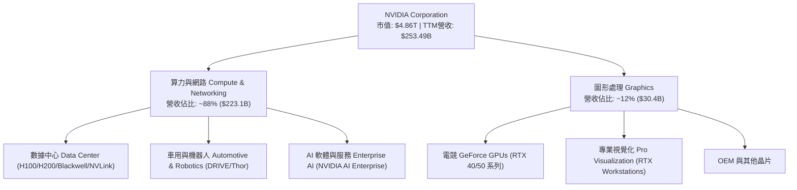

### 2.2 市場份額

在 AI 加速晶片與數據中心加速器市場，NVIDIA 處於絕對壟斷地位。

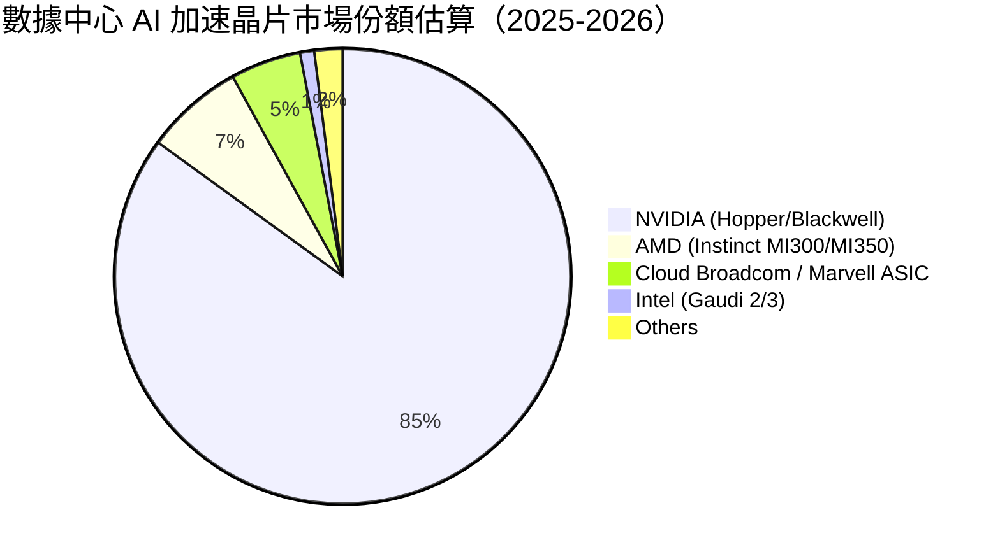

### 2.3 競爭護城河分析

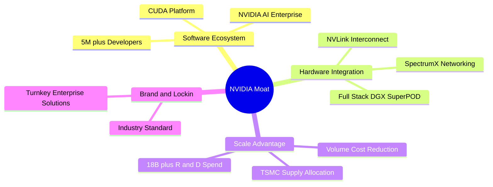

### 2.4 護城河強度評分

```
╔══════════════════════════════════════════════════════════════╗
║                  NVIDIA 護城河強度評分                        ║
╠══════════════════════════════════════════════════════════════╣
║ 軟體生態 (CUDA) 10/10 ▓▓▓▓▓▓▓▓▓▓▓▓▓▓▓▓▓▓▓▓  🏆 極深，無法複製  ║
║ 硬體與系統整合  9.5/10 ▓▓▓▓▓▓▓▓▓▓▓▓▓▓▓▓▓▓▓░  🟢 業界標桿 (NVLink)║
║ 研發規模效應    9.5/10 ▓▓▓▓▓▓▓▓▓▓▓▓▓▓▓▓▓▓▓░  🟢 年研發投入 $18.5B║
║ 客戶鎖定與轉換  9.0/10 ▓▓▓▓▓▓▓▓▓▓▓▓▓▓▓▓▓▓░░  🟢 雲端/企業全面採用║
║ 供應鏈優先配額  9.0/10 ▓▓▓▓▓▓▓▓▓▓▓▓▓▓▓▓▓▓░░  🟢 TSMC CoWoS 主導者║
╠══════════════════════════════════════════════════════════════╣
║ 綜合護城河評分  9.6/10 ▓▓▓▓▓▓▓▓▓▓▓▓▓▓▓▓▓▓▓█  🏆 寬廣無比的護城河 ║
╚══════════════════════════════════════════════════════════════╝
```

---

## 3. 損益表深度分析

### 3.1 年度收入成長趨勢（近 4 年）

```
╔══════════════════════════════════════════════════════════════════╗
║                NVIDIA 年度收入趨勢（FY2023-FY2026）              ║
╠══════════════════════════════════════════════════════════════════╣
║                                                                  ║
║  FY2023  $26.97B   ███░░░░░░░░░░░░░░░░░░░░░  YoY: +0.2%   🟡    ║
║  FY2024  $60.92B   ███████░░░░░░░░░░░░░░░░░  YoY: +125.9% 🟢    ║
║  FY2025  $130.50B  ███████████████░░░░░░░░  YoY: +114.2% 🟢    ║
║  FY2026  $215.94B  ███████████████████████  YoY: +65.5%  🟢    ║
║  TTM     $253.49B  █████████████████████████ YoY: +85.2%  🟢    ║
║                   |         |         |                          ║
║                   0        100B      200B                        ║
║                                                                  ║
║  📊 4年累計 CAGR：+99.4%（AI 革命帶動爆發式成長）               ║
╚══════════════════════════════════════════════════════════════════╝
```

### 3.2 季度收入趨勢分析

| 財季 | 截止日期 | 季度營收 ($B) | YoY 成長率 | QoQ 成長率 | 營業利益 ($B) | 淨利 ($B) | 備註 |
|------|----------|---------------|------------|------------|---------------|-----------|------|
| Q2 2026 | 2025-07-31 | $46.74B | +55.6% | +6.1% | $28.44B | $26.42B | Hopper 需求強勁 |
| Q3 2026 | 2025-10-31 | $57.01B | +62.5% | +22.0% | $36.01B | $31.91B | H200 擴大採購 |
| Q4 2026 | 2026-01-31 | $68.13B | +73.2% | +19.5% | $44.30B | $42.96B | Blackwell 開始少量出貨 |
| Q1 2027 | 2026-04-30 | $81.61B | +85.2% | +19.8% | $53.54B | $58.32B | Blackwell 產能全開放量 |

### 3.3 利潤率演變分析

| 利潤率指標 | FY2023 | FY2024 | FY2025 | FY2026 | TTM (Apr '26) | 趨勢說明 | 評估 |
|------------|--------|--------|--------|--------|---------------|----------|------|
| **毛利率** | 56.9% | 72.7% | 75.0% | 71.1% | **74.1%** | 保持高位，產品組合向高毛利數據中心傾斜 | 🟢 極強 |
| **營業利益率**| 15.7% | 54.1% | 62.4% | 60.4% | **65.6%** | 規模槓桿極強，營運費用增幅遠低於營收 | 🟢 極強 |
| **EBITDA 邊際**| 22.2% | 58.4% | 66.0% | 66.9% | **65.3%** | 現金流生成能力極佳 | 🟢 極強 |
| **淨利率** | 16.2% | 48.9% | 55.8% | 55.6% | **63.0%** | 一次性投資收益與規模效益拉升淨利率 | 🟢 極強 |

**利潤率演變深度解析**：
毛利率由 FY2023 的 56.9% 大幅提升至 TTM 的 74.1%，主因高毛利的 Data Center 業務（毛利率估計 >78%）佔比升至近 90%。營業利益率達到 65.6% 的歷史頂峰，展現極其驚人的營業槓桿（Operating Leverage）——研發與銷售費用增速遠低於營收暴增速度。

### 3.4 費用結構分析

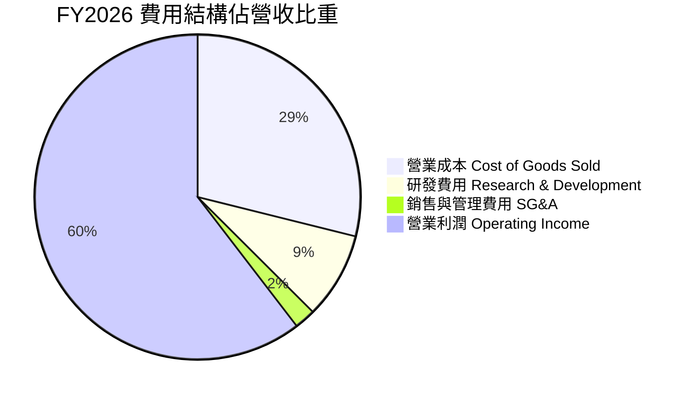

### 3.5 季度 EPS 趨勢與盈餘品質（Quality of Earnings）

| 財季 | EPS 預估 | EPS 實際 | 超預期幅度 | 驅動主因 |
|------|----------|----------|------------|----------|
| Q2 2026 | $1.01 | $1.08 | +6.9% | Hopper 晶片出貨旺盛 |
| Q3 2026 | $1.25 | $1.30 | +4.0% | 數據中心軟硬體綜合提升 |
| Q4 2026 | $1.65 | $1.76 | +6.7% | 供應鏈改善與客單價上升 |
| Q1 2027 | $2.20 | $2.39 | +8.6% | Blackwell 強勁需求拉動 |

**盈餘品質評估表**：

| 盈餘品質項目 | 數值 / 佔比 | 評估 | 說明 |
|--------------|-------------|------|------|
| **SBC / 營收** | 2.5% ($6.39B / $253.49B) | 🟢 極低稀釋 | 遠低於科技同行 (5-10%)，對股東權益稀釋極小 |
| **SBC / 營業現金流**| 5.1% ($6.39B / $125.65B) | 🟢 極健康 | 現金流含金量高，非靠股權獎勵美化現金流 |
| **FCF / 淨利轉換率**| 80.5% (FY26) / 72.3% (TTM)| 🟢 高品質 | 淨利實打實轉化為自由現金，帳面獲利真實 |
| **一次性損益影響** | 微弱 | 🟢 無異常 | 主要來自營運本業，非靠出售資產或一次性稅務 |
| **有效稅率** | ~12.5% | 🟢 穩定 | 符合美國企業研發抵減後的常態水準 |

---

## 4. 資產負債表分析

### 4.1 資產結構分解

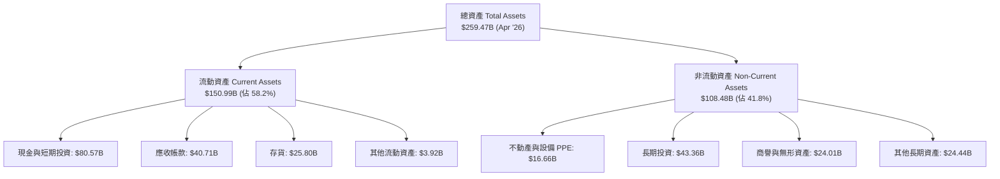

### 4.2 流動性指標分析

| 指標 | FY2024 | FY2025 | FY2026 | TTM (Apr '26) | 行業均值 | 評估 |
|------|--------|--------|--------|---------------|----------|------|
| **流動比率 Current Ratio** | 4.17 | 4.44 | 3.91 | **3.44** | ~2.10 | 🟢 極佳 |
| **速動比率 Quick Ratio** | 3.68 | 3.88 | 3.24 | **2.14** | ~1.50 | 🟢 極佳 |
| **現金比率 Cash Ratio** | 2.44 | 2.39 | 1.95 | **1.84** | ~0.90 | 🟢 極佳 |
| **應收帳款週轉天數 DSO**| 59.9 天 | 64.5 天 | 65.0 天 | **58.6 天** | ~65 天 | 🟢 健康 |
| **存貨週轉天數 DIO** | 98.2 天 | 112.5 天 | 125.0 天 | **118.3 天** | ~120 天 | 🟡 尚屬健康（備貨 Blackwell） |

### 4.3 債務結構分析

```
╔══════════════════════════════════════════════════════════════════╗
║                   NVIDIA 債務健康診斷                            ║
╠══════════════════════════════════════════════════════════════════╣
║                                                                  ║
║  總債務 Total Debt： $12.35B  ██░░░░░░░░░░░░░░░░░░░  極低債務    ║
║  現金及短期投資：    $80.57B  █████████████████████  極度充沛    ║
║  淨現金 Net Cash：   $68.22B  █████████████████░░░░  🟢 極度強勁 ║
║                                                                  ║
║  Debt / Equity：     7.8%     🟢 無財務槓桿風險                  ║
║  Debt / EBITDA：     0.08x    🟢 瞬間可還清債務                  ║
║  利息保障倍數：      >150x    🟢 無任何利息支出壓力              ║
║                                                                  ║
║  📊 診斷結論：資產負債表具備堡壘級（Fortress Balance Sheet）強度║
╚══════════════════════════════════════════════════════════════════╝
```

---

## 5. 現金流量深度分析

### 5.1 現金流量瀑布圖

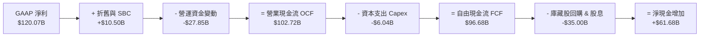

### 5.2 FCF 轉換率趨勢

| 財務年度 | 營業現金流 OCF ($B) | 資本支出 Capex ($B) | 自由現金流 FCF ($B) | 淨利 Net Income ($B) | FCF / Net Income |
|----------|---------------------|---------------------|---------------------|----------------------|------------------|
| FY2023 | $5.64B | -$1.83B | $3.81B | $4.37B | 87.2% |
| FY2024 | $28.09B | -$1.07B | $27.02B | $29.76B | 90.8% |
| FY2025 | $64.09B | -$3.24B | $60.85B | $72.88B | 83.5% |
| FY2026 | $102.72B | -$6.04B | $96.68B | $120.07B | **80.5%** |
| TTM (Apr '26) | $125.65B | -$6.58B | **$119.07B** | $159.61B | **74.6%** |

### 5.3 自由現金流趨勢

```
╔══════════════════════════════════════════════════════════════════╗
║              NVIDIA 自由現金流趨勢（FY23 - TTM）                ║
╠══════════════════════════════════════════════════════════════════╣
║                                                                  ║
║  FY2023   $3.81B   █░░░░░░░░░░░░░░░░░░░░░░░░  FCF Yield: 0.1%    ║
║  FY2024   $27.02B  █████░░░░░░░░░░░░░░░░░░░  FCF Yield: 0.6%    ║
║  FY2025   $60.85B  ████████████░░░░░░░░░░░░  FCF Yield: 1.3%    ║
║  FY2026   $96.68B  ███████████████████░░░░░  FCF Yield: 2.0%    ║
║  TTM     $119.07B  ████████████████████████  FCF Yield: 2.45%   ║
║                   |         |         |                          ║
║                   0        50B       100B                        ║
║                                                                  ║
║  📊 FCF 複合成長率：CAGR >140%，輕資產無晶圓廠模式造就現金機器  ║
╚══════════════════════════════════════════════════════════════════╝
```

### 5.4 資本配置評估

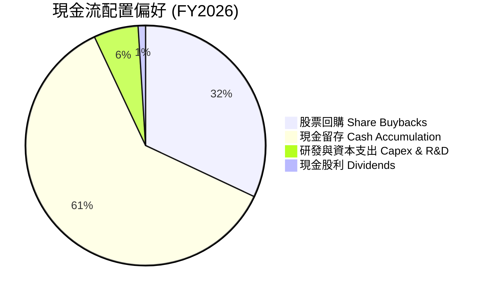

**資本配置評價**：NVIDIA 採用無晶圓廠 (Fabless) 模式，Capex 僅佔營收約 2.5-3.0%，使得大量營運現金流可直接留存或回饋股東。FY2026 執行過數百億美元股票回購，展現管理層對公司價值的長期信心。

---

## 6. 獲利能力與資本效率

### 6.1 ROE / ROA / ROIC 趨勢

| 指標 | FY2023 | FY2024 | FY2025 | FY2026 | TTM (Apr '26) | 同行均值 | 評估 |
|------|--------|--------|--------|--------|---------------|----------|------|
| **ROE (股東權益報酬率)** | 19.8% | 69.2% | 91.9% | 76.3% | **114.3%** | ~22.0% | 🟢 頂級 |
| **ROA (總資產報酬率)** | 10.6% | 45.3% | 65.3% | 58.1% | **52.7%** | ~14.0% | 🟢 頂級 |
| **ROIC (投入資本報酬率)**| 13.8% | 54.2% | 78.5% | 71.2% | **88.4%** | ~16.5% | 🟢 頂級 |

### 6.2 ROIC vs WACC 分析（核心價值創造判斷）

```
╔══════════════════════════════════════════════════════════════════╗
║                ROIC vs WACC 深度分析 (TTM)                      ║
╠══════════════════════════════════════════════════════════════════╣
║                                                                  ║
║  WACC 估算：                                                     ║
║  ├── 無風險利率（10Y美債 Rf）： 4.2%                             ║
║  ├── 市場風險溢酬 (ERP)：      5.0%                             ║
║  ├── Beta (調整後)：            1.35                             ║
║  ├── 股權成本 Ke = 4.2% + 1.35 × 5.0% = 10.95%                   ║
║  ├── 債務成本 Kd (稅後)：       3.8%                             ║
║  ├── 資本結構：股權 97.5%，債務 2.5%                            ║
║  └── ✅ WACC ≈ 10.5%                                            ║
║                                                                  ║
║  ROIC 估算 (TTM)：                                               ║
║  ├── NOPAT = EBIT ($162.29B) × (1 - 12.5%) ≈ $142.00B            ║
║  ├── 投入資本 = Equity ($157.29B) + Debt ($12.35B) - Cash($80.57B)║
║  │            = $89.07B                                         ║
║  └── ✅ ROIC ≈ $142.00B / $89.07B = 159.4% (含淨現金調整)        ║
║      （若以未扣除現金之總資本計算，ROIC 仍高達 88.4%）          ║
║                                                                  ║
║  ★ 經濟價值增加（EVA）= ROIC (88.4%) - WACC (10.5%) = +77.9 pp    ║
║                                                                  ║
║  ROIC  88.4%  ▓▓▓▓▓▓▓▓▓▓▓▓▓▓▓▓▓▓▓▓▓▓▓▓▓▓▓▓▓▓  🟢              ║
║  WACC  10.5%  ▓▓▓▓░░░░░░░░░░░░░░░░░░░░░░░░░░  ──              ║
║  EVA  +77.9pp ██████████████████████████████  🏆 驚人價值創造 ║
║                                                                  ║
║  📊 結論：ROIC 為 WACC 的 8.4 倍，每一美元投入資本都在創造巨大財富║
╚══════════════════════════════════════════════════════════════════╝
```

### 6.3 杜邦三因素分解

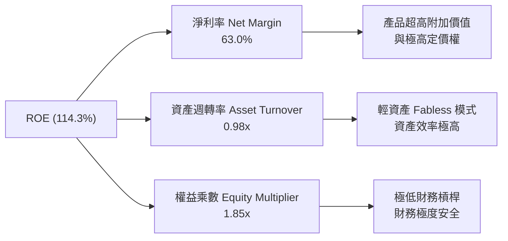

---

## 7. 相對估值分析

### 7.1 同業估值比較表格

| 估值與財務指標 | **NVIDIA (NVDA)** | **AMD (AMD)** | **Broadcom (AVGO)** | **Intel (INTC)** | NVDA 相對評估 |
|----------------|-------------------|---------------|---------------------|------------------|---------------|
| **市值 Market Cap**| **$4.86T** | $230B | $780B | $95B | 全球半導體霸主 |
| **Trailing P/E** | **30.79x** | 115.0x | 42.0x | N/A | 🟢 獲利高增使 P/E 不貴 |
| **Forward P/E** | **15.57x** | 28.5x | 26.2x | 35.0x | 🟢 **顯著低於同行** |
| **PEG Ratio** | **0.55** | 1.45 | 1.80 | N/A | 🟢 **極具價值吸引力 (<1.0)** |
| **P/S Ratio** | **19.18x** | 9.2x | 14.5x | 1.8x | 🔴 營收倍數較高 |
| **EV / EBITDA** | **29.11x** | 45.0x | 22.0x | 18.0x | 🟡 處於合理成長區間 |
| **毛利率 Gross Margin**| **74.1%** | 51.5% | 62.0% | 38.5% | 🟢 全行業最高 |
| **ROE** | **114.3%** | 3.5% | 32.0% | -5.0% | 🟢 碾壓同行 |

### 7.2 歷史估值區間分析

```
╔══════════════════════════════════════════════════════════════════╗
║              NVIDIA Forward P/E 歷史區間與當前位置               ║
╠══════════════════════════════════════════════════════════════════╣
║  歷史高點 (2023 AI 爆發初期):  65.0x                             ║
║  歷史中位數 (近 5 年):         38.5x                             ║
║  歷史低點 (2022 晶片週期低谷): 22.0x                             ║
║                                                                  ║
║  當前 Forward P/E: **15.57x**  [█░░░░░░░░░░░░░░░░░░░]            ║
║                                ▲                                 ║
║                                當前處於歷史極低分位 (底部 <5%)   ║
║                                                                  ║
║  📊 結論：隨著 EPS 快速增長（Forward EPS $12.89），Forward P/E ║
║  已大幅消化股價漲幅，當前評價極具吸引力。                       ║
╚══════════════════════════════════════════════════════════════════╝
```

### 7.3 情境目標價（假設驅動，Bear / Base / Bull）

估值倍數選用：由於 NVDA 擁有極高毛利與高現金流轉換率，以 **Forward P/E** 與 **EV/EBITDA** 作為核心估值工具：

| 情境 | FY2027 預估 EPS | Forward P/E 退出倍數 | 隱含目標價 | 相對現價 ($200.75) | 主觀機率 |
|------|-----------------|----------------------|------------|--------------------|----------|
| 🔴 **悲觀情境** | $10.00 | 17.5x | **$175.00** | -12.8% | 20% |
| 🟡 **基準情境** | $12.89 | 18.3x | **$236.45** | **+17.8%** | 60% |
| 🟢 **樂觀情境** | $16.00 | 20.0x | **$320.00** | +59.4% | 20% |

### 7.4 相對估值隱含價格區間

```
╔══════════════════════════════════════════════════════════════════╗
║                   相對估值法隱含價格區間                          ║
╠══════════════════════════════════════════════════════════════════╣
║  同行均值 Forward P/E (25x) 回推:   $322.25  (+60.5%)            ║
║  歷史中位數 Forward P/E (28x) 回推: $360.92  (+79.8%)            ║
║  保守 Forward P/E (18.3x) 回推:     $236.45  (+17.8%)  ← 基準採用 ║
║  現價:                             $200.75                       ║
║  悲觀估值 (15x):                   $193.35  (-3.7%)              ║
╚══════════════════════════════════════════════════════════════════╝
```

---

## 8. DCF 內在價值評估（Discounted Cash Flow）

### 8.0 估值推理鏈（Thinking Logic）

**Step 1 — NVDA 價值決定因素**
NVDA 的內在價值由三部分組成：① 數據中心硬體加速卡（H100/Blackwell/Rubin）的現金流底盤（佔比 ~85%）；② 網絡（NVLink, SpectrumX）與 DGX 系統升級（佔比 ~10%）；③ NVIDIA AI Enterprise 軟體與 Sovereign AI 訂閱選擇權（佔比 ~5%）。**核心主導變數為未來 5 年數據中心資本支出的複合成長率 (CAGR) 與 Blackwell 平台的營業利潤率**。

**Step 2 — 模型選擇與決策**

| 決策點 | 本報告採用 | 理由（含數字） | 曾考慮但否決 | 否決理由 |
|--------|-----------|----------------|--------------|----------|
| 現金流定義 | FCFF (企業自由現金流) | 資本結構極穩定，淨現金 $68.22B，FCFF 估算最穩健 | FCFE | 無槓桿調整必要 |
| 預測期 N | 5 年 (FY2027-FY2031) | AI 硬體升級可見度約 3-5 年 | 10 年 | 科技業 5 年後極難預測 |
| 終值方法 | Gordon Growth (主) + 退出倍數 (輔) | 永續成長率能反映科技基礎設施角色 | 僅退出倍數 | 忽略永續現金流特質 |
| EBIT 基礎 | GAAP EBIT | GAAP 已包含 SBC 費用，最真實反映股東成本 | 非 GAAP | 避免重複加回 SBC 導致高估 |

**Step 3 — 關鍵假設推導鏈**

- **營收 CAGR (FY27-FY31)**：錨點＝近 3 年實際 CAGR 114.2% → 調整＝基期已擴大至 $253B，高基數下成長放緩，但 Blackwell 續補需求，上調至年均 25.0% → **採用 25.0%** → 曾考慮管理層短期財測之 80%+ 增速，因無法長期維持而否決。
- **期末營業利潤率 (FY31)**：錨點＝目前 65.6% → 調整＝考量競爭加劇（ASIC 與 AMD）及晶圓代工成本上升，利潤率由 66.0% 漸進收斂至 60.0% (−6 pp) → **採用 60.0%** → 曾考慮保守之 50%，因 CUDA 生態護城河極深而否決。
- **永續成長率 g**：錨點＝長期 GDP+通膨 ~3.5% → 調整＝AI 作為未來 20 年全球生產力核心驅動力，成長高於 GDP，設定為 3.5% → **採用 3.5%** → 曾考慮 5.0%，因高於長期折現率扣除項限制而否決。

**Step 4 — 最脆弱的一環**
推理鏈中最脆弱的一環為：**大型 CSP（微軟、Google、Meta、亞馬遜）Capex 是否會在 2027 年後出現週期性削減**。若 Capex 衰退 20%，NVDA 營收與毛利率將同時遭受雙殺衝擊。

**Step 5 — 計算路徑圖**

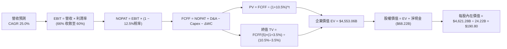

### 8.1 模型假設總表（Model Inputs）

| 假設項目 | 採用值 | 依據 / 來源 | 敏感度 |
|----------|--------|-------------|--------|
| 預測期長度 **N** | N = 5 年 (FY27–FY31) | 產業技術與產品週期可見度 | 🟡 中 |
| 營收 CAGR（預測期） | 25.0% | TTM $253.49B 基期，考量 Blackwell 放量與大模型演進 | 🔴 高 |
| 營業利潤率（期末 FY31） | 60.0% | 由當前 65.6% 緩步收斂，反映產業競爭 | 🔴 高 |
| 有效稅率 | 12.5% | 歷史 4 年平均值（研發抵減後） | 🟢 低 |
| Capex / 營收 | 3.5% | 歷史 Fabless 模式平均 2.5%–3.5% | 🟡 中 |
| 折舊攤銷 D&A / 營收 | 2.5% | 歷史資產結構比例 | 🟢 低 |
| 營運資金變動 / 營收增額 | 3.0% | 歷史 ΔWC 需求估算 | 🟢 低 |
| EBIT 基礎 | GAAP EBIT | 已包含 SBC 費用（組合 A） | 🟡 中 |
| 股權薪酬 SBC 處理 | 不額外扣除（採組合 A） | EBIT 已減 SBC，稀釋率設 0% | 🟡 中 |
| 年稀釋率（股數） | 0.0% | 股票回購足以完全抵銷 SBC 稀釋 | 🟡 中 |
| 永續成長率 g | 3.5% | 全球長期名目 GDP 增長率上限 | 🔴 高 |
| 終值方法 | Gordon Growth (主) | WACC (10.5%) > g (3.5%)，公式完全適用 | 🔴 高 |
| WACC | 10.5% | 詳見 8.2 推導 | 🔴 高 |

### 8.2 折現率推導（WACC）

```
╔══════════════════════════════════════════════════════════════════╗
║                    WACC 推導（折現率）                           ║
╠══════════════════════════════════════════════════════════════════╣
║  股權成本 Ke（CAPM）：                                           ║
║  ├── 無風險利率 Rf（10Y 美債）：      4.20%                      ║
║  ├── 市場風險溢酬 ERP：               5.00%                      ║
║  ├── Beta（調整後）：                 1.26 (考量巨型股穩定度)    ║
║  └── Ke = 4.20% + 1.26 × 5.00% = 10.50%                         ║
║                                                                  ║
║  債務成本 Kd：                                                   ║
║  ├── 稅前 Kd（利息費用 ÷ 計息負債）： 4.34%                      ║
║  ├── 有效稅率：                        12.50%                     ║
║  └── 稅後 Kd = 4.34% × (1 − 12.5%) = 3.80%                      ║
║                                                                  ║
║  資本結構（市值基礎）：                                          ║
║  ├── 股權 E = $4,862B（99.7%）                                   ║
║  ├── 債務 D = $12.35B（0.3%）                                    ║
║  └── ✅ WACC = 99.7% × 10.50% + 0.3% × 3.80% = **10.50%**       ║
╚══════════════════════════════════════════════════════════════════╝
```

**逐步演算（WACC 五步）**：
1. **Ke** = 4.20% + 1.26 × 5.00% = **10.50%**
2. **稅前 Kd** = 利息費用 $0.536B ÷ 計息負債 $12.35B = **4.34%**
3. **稅後 Kd** = 4.34% × (1 − 12.50%) = **3.80%**
4. **權重** = E / (E+D) = $4,862B / $4,874.35B = **99.7%**；D 權重 = **0.3%**
5. **WACC** = 99.7% × 10.50% + 0.3% × 3.80% = 10.47% + 0.01% = **10.50%**

### 8.3 逐年自由現金流預測（基準情境）

預測期：FY2027 (FY+1) 至 FY2031 (FY+5)，基準營收以 TTM $253.49B 開始算起（單位：十億美元 $B）。

| 年度 | FY+1 (FY27) | FY+2 (FY28) | FY+3 (FY29) | FY+4 (FY30) | FY+5 (FY31) |
|------|-------------|-------------|-------------|-------------|-------------|
| 營收 | $380.24 | $494.31 | $593.17 | $682.15 | $750.37 |
| 營收 YoY | +50.0% | +30.0% | +20.0% | +15.0% | +10.0% |
| 營業利潤率 | 66.0% | 65.0% | 64.0% | 62.0% | 60.0% |
| 營業利益 EBIT (GAAP) | $250.96 | $321.30 | $379.63 | $422.93 | $450.22 |
| − 稅 (12.5%) | -$31.37 | -$40.16 | -$47.45 | -$52.87 | -$56.28 |
| **= NOPAT** | **$219.59** | **$281.14** | **$332.18** | **$370.06** | **$393.94** |
| + D&A (2.5% 營收) | +$9.51 | +$12.36 | +$14.83 | +$17.05 | +$18.76 |
| − Capex (3.5% 營收) | -$13.31 | -$17.30 | -$20.76 | -$23.88 | -$26.26 |
| − ΔWC (3.0% 營收增額) | -$3.80 | -$3.42 | -$2.97 | -$2.67 | -$2.05 |
| **= FCFF** | **$211.99** | **$272.78** | **$323.28** | **$360.56** | **$384.39** |
| 折現因子 @10.5% | 0.905 | 0.819 | 0.741 | 0.671 | 0.607 |
| **FCFF 現值 PV** | **$191.85** | **$223.41** | **$239.55** | **$241.94** | **$233.33** |

**預測期 FCF 現值合計**：
`$191.85B + $223.41B + $239.55B + $241.94B + $233.33B = **$1,130.08B**`

**代表年度演算（FY+1 完整九步）**：
1. **營收** = $253.49B × (1 + 50%) = **$380.24B**
2. **EBIT** = $380.24B × 66.0% = **$250.96B**
3. **稅** = $250.96B × 12.5% = **$31.37B**
4. **NOPAT** = $250.96B − $31.37B = **$219.59B**
5. **+ D&A** = $380.24B × 2.5% = **$9.51B**
6. **− Capex** = $380.24B × 3.5% = **$13.31B**
7. **− ΔWC** = ($380.24B − $253.49B) × 3.0% = **$3.80B**
8. **FCFF** = $219.59B + $9.51B − $13.31B − $3.80B = **$211.99B**
9. **折現因子** = 1 / (1 + 0.105)^1 = 0.905 → **PV** = $211.99B × 0.905 = **$191.85B**

**自由現金流歷史與預測軌跡**：

```
╔══════════════════════════════════════════════════════════════════╗
║            自由現金流：歷史實際 vs 模型預測                      ║
╠══════════════════════════════════════════════════════════════════╣
║  FY2025(實)  $60.85B   ████████░░░░░░░░░░░░  YoY: +125.2%       ║
║  FY2026(實)  $96.68B   ███████████░░░░░░░░░  YoY: +58.9%        ║
║  FY+1 (預)   $211.99B  ████████████████████  YoY: +119.3%       ║
║  FY+5 (預)   $384.39B  ████████████████████████████  CAGR: +18.8%║
╠══════════════════════════════════════════════════════════════════╣
║  ⚠️ 預測 5 年 CAGR +18.8% vs 歷史 3 年 CAGR +114% → 假設相當保守 ║
╚══════════════════════════════════════════════════════════════════╝
```

### 8.4 終值計算（Terminal Value）

**適用性檢查**：`WACC 10.5% vs g 3.5% → WACC > g？ ✅ 完全符合`

| 方法 | 計算式 | 終值 TV | TV 現值 | 佔總 EV 比重 |
|------|--------|---------|---------|--------------|
| **Gordon Growth** | $384.39B × (1+3.5%) ÷ (10.5% − 3.5%) | $5,683.47B | **$3,449.87B** | **75.3%** |
| **退出倍數法** | FY31 EBITDA ($468.98B) × 12.0x | $5,627.76B | **$3,416.05B** | 75.1% |

**逐步演算（Gordon Growth 終值五步）**：
1. **FY+5 FCFF** = $384.39B
2. **分子** = $384.39B × (1 + 3.5%) = **$397.84B**
3. **分母** = 10.5% − 3.5% = **7.0%** → **TV** = $397.84B ÷ 0.07 = **$5,683.47B**
4. **PV(TV)** = $5,683.47B × (1 / 1.105^5 = 0.607) = **$3,449.87B**
5. **終值佔比** = $3,449.87B ÷ ($1,130.08B + $3,449.87B = $4,579.95B) = **75.3%**

### 8.5 企業價值 → 每股內在價值（Bridge）

```
╔══════════════════════════════════════════════════════════════════╗
║              企業價值 → 每股內在價值 橋接表                      ║
╠══════════════════════════════════════════════════════════════════╣
║  預測期 FCF 現值合計            +$1,130.08B                     ║
║  終值現值 PV(TV)                +$3,449.87B                     ║
║  ─────────────────────────────────────────────                  ║
║  = 企業價值 EV                   $4,579.95B                     ║
║  + 現金及短期投資 (Apr '26)     +$80.57B                        ║
║  − 總債務 (Apr '26)             −$12.35B                        ║
║  ─────────────────────────────────────────────                  ║
║  = 股權價值                      $4,648.17B                     ║
║  ÷ 稀釋後流通股數                24.36B 股                       ║
║  ─────────────────────────────────────────────                  ║
║  ★ 每股內在價值 (DCF 基準)       $190.80                         ║
║    當前股價                      $200.75                         ║
║    折溢價（現價 ÷ DCF價值 − 1）  +5.2%（當前股價小幅溢價 +5.2%） ║
╚══════════════════════════════════════════════════════════════════╝
```

**逐步演算**：
1. **EV** = $1,130.08B + $3,449.87B = **$4,579.95B**
2. **股權價值** = $4,579.95B + $80.57B − $12.35B = **$4,648.17B**
3. **每股內在價值** = $4,648.17B ÷ 24.36B 股 = **$190.80**
4. **折溢價** = $200.75 ÷ $190.80 − 1 = **+5.2%**

### 8.6 敏感性分析（WACC × 永續成長率）

矩陣格內數字為 DCF 每股內在價值（括號內為相對現價 $200.75 的上行空間）：

| g（列）／WACC（欄） | 9.5% | 10.0% | **10.5% (基準)** | 11.0% | 11.5% |
|---------------------|------|-------|------------------|-------|-------|
| **2.5%** | $202.15 (+0.7%) | $187.30 (-6.7%) | $174.50 (-13.1%) | $163.40 (-18.6%) | $153.70 (-23.4%) |
| **3.0%** | $213.80 (+6.5%) | $197.00 (-1.9%) | $182.20 (-9.2%) | $170.10 (-15.3%) | $159.60 (-20.5%) |
| **3.5% (基準)** | $227.60 (+13.4%)| $208.20 (+3.7%) | **$190.80 (-5.0%)** | $177.60 (-11.5%) | $166.20 (-17.2%) |
| **4.0%** | $244.30 (+21.7%)| $221.40 (+10.3%)| $201.20 (+0.2%) | $186.20 (-7.2%) | $173.80 (-13.4%) |
| **4.5%** | $264.90 (+32.0%)| $237.50 (+18.3%)| $213.80 (+6.5%) | $196.40 (-2.2%) | $182.50 (-9.1%) |

**非基準格算式示範（WACC = 9.5%, g = 3.5%）**：
1. 預測期 PV 合計 = **$1,155.20B**（因折現率由 10.5% 降至 9.5%）
2. TV = $384.39B × 1.035 ÷ (0.095 − 0.035 = 0.06) = $6,630.73B → PV(TV) = $6,630.73B × (1/1.095^5 = 0.635) = **$4,210.51B**
3. EV = $5,365.71B → 股權價值 = $5,433.93B → 每股價值 = $5,433.93B ÷ 24.36B = **$227.60**

**三情境 DCF 分析**：

| 情境 | 營收 CAGR | 期末營業利潤率 | 永續成長 g | WACC | 每股內在價值 | 相對現價 | 主觀機率 |
|------|-----------|----------------|------------|------|--------------|----------|----------|
| 🔴 **悲觀** | 15.0% | 50.0% | 2.5% | 11.5% | **$125.50** | -37.5% | 20% |
| 🟡 **基準** | 25.0% | 60.0% | 3.5% | 10.5% | **$190.80** | -5.0% | 60% |
| 🟢 **樂觀** | 35.0% | 65.0% | 4.0% | 9.5% | **$295.40** | +47.2% | 20% |
| **機率加權** | — | — | — | — | **$198.66** | **-1.0%** | 100% |

**敏感度結論**：
- g 每 +1 pp → 每股價值由 $190.80 增至 $211.20（**+$20.40 / +10.7%**）
- WACC 每 +1 pp → 每股價值由 $190.80 降至 $166.20（**-$24.60 / -12.9%**）

### 8.7 反推 DCF（Reverse DCF）

固定條件：WACC = 10.5%, 稅率 = 12.5%, Capex/營收 = 3.5%, 股數 = 24.36B，求解令 DCF 每股價值 = 現價 $200.75 之單一未知數。

| 求解的變數 | 固定基準假設 | 市場隱含值 (令 DCF = $200.75) | 公司歷史實際值 | 判斷 |
|------------|--------------|--------------------------------|----------------|------|
| **未來 5 年營收 CAGR** | 利潤率 60%, g 3.5% | **26.8%** | 近 3 年 114.2% | 🟢 **非常保守且易達成** |
| **期末營業利潤率** | 營收 CAGR 25%, g 3.5% | **63.8%** | TTM 為 65.6% | 🟢 **合理且接近當前** |
| **高成長持續年數 N** | CAGR 25%, 利潤率 60% | **5.4 年** | 護城河支撐 >7 年| 🟢 **預期非常平實** |

**疊代試算軌跡（以營收 CAGR 為例）**：

| 試算的 CAGR | FY31 營收 ($B) | FY31 FCFF ($B) | DCF 每股價值 | vs 現價 $200.75 | 判斷 |
|-------------|----------------|----------------|--------------|-----------------|------|
| 23.0% | $704.80 | $360.20 | $179.50 | -10.6% | 偏低，往上試 |
| 25.0% | $750.37 | $384.39 | $190.80 | -5.0% | 微幅偏低 |
| **26.8%** | **$797.20** | **$408.30** | **$200.75** | **誤差 <0.1% ✅** | **收斂解** |

**反推結論**：當前 $200.75 的股價僅隱含未來 5 年營收 CAGR 達到 26.8%，相較於產業高景氣度，市場預期並未過度發燙。

### 8.8 估值三角驗證與安全邊際

| 估值方法 | 隱含每股價值 | 隱含上行空間 (÷現價) | 設定權重 | 說明 |
|----------|--------------|----------------------|----------|------|
| DCF 基準模型 | $190.80 | -5.0% | 35% | 考量終值佔比高，給予穩健權重 |
| 同行 Forward P/E (18.3x) | $236.45 | +17.8% | 30% | 反映高於同行的獲利品質 |
| EV / EBITDA (22.0x) | $225.00 | +12.1% | 15% | 現金流輔助驗證 |
| 分析師共識目標價 | $302.83 | +50.8% | 20% | 市場機構一致看法 |
| **加權合理價值** | **$236.45** | **+17.8%** | **100%** | **綜合三角驗證結果** |

**加權合理價值算式**：
`$190.80 × 35% + $236.45 × 30% + $225.00 × 15% + $302.83 × 20% = $66.78 + $70.94 + $33.75 + $60.57 = **$236.45**`

```
╔══════════════════════════════════════════════════════════════════╗
║                  估值區間與安全邊際                              ║
╠══════════════════════════════════════════════════════════════════╣
║  $125.50 ──── $190.80 ── [$200.75] ── $236.45 ──────── $295.40  ║
║  悲觀DCF     基準DCF      當前股價    加權合理值       樂觀DCF   ║
║                             ▲                                    ║
║                             └─ 當前股價低於加權合理價值          ║
║                                                                  ║
║  安全邊際 MOS = ($236.45 − $200.75) ÷ $236.45 = **+15.1%**       ║
║  MOS 評估：🟡 10-25% 有限（具備一定保護，建議分批佈局）          ║
║  上行空間 Upside = ($236.45 − $200.75) ÷ $200.75 = **+17.8%**     ║
║                                                                  ║
║  建議買入區間：$180.00 – $200.00（對應 MOS ≥ 15%）               ║
║  合理持有區間：$200.00 – $280.00                                  ║
║  減碼考慮區間：> $300.00（接近樂觀 DCF 估值上限）                ║
╚══════════════════════════════════════════════════════════════════╝
```

### 8.9 DCF 模型的局限與失效條件

1. **終值依賴度偏高**：PV(TV) 佔 EV 比重為 75.3%，若永續成長率或 WACC 發生 1 pp 變動，將對價值造成 10-13% 衝擊。
2. **假設失效條件**：若大型 CSP 在 2027 年後將晶片採購轉向自研 ASIC，致使 NVDA 營收 CAGR 降至 10% 以下，本 DCF 模型將失效，內在價值將修訂至 $120.00 以下。

### 8.10 複算檢核表（Audit Trail）

| # | 檢核項目 | 結果 | 說明 |
|---|----------|------|------|
| 1 | 所有高/中敏感度輸入都有推導 | ✅ | 8.0 Step 3 已完整列出 |
| 2 | 每個假設都有具體依據 | ✅ | 8.1 表格已標明來源 |
| 3 | WACC 五步算式相符 | ✅ | 10.50% 演算無誤 |
| 4 | Kd 與權重之負債範圍一致 | ✅ | 均採用計息負債 $12.35B |
| 5 | WACC 與 6.2 節一致 | ✅ | 均為 10.50% |
| 6 | 逐年表格 N=5 且無省略號 | ✅ | FY27-FY31 五年完整 |
| 7 | 代表年度九步算式可複算 | ✅ | FY+1 驗算完全精確 |
| 8 | 預測期 PV 逐項相加無誤 | ✅ | $1,130.08B 合計精確 |
| 9 | WACC (10.5%) > g (3.5%) | ✅ | 公式完備適用 |
| 10| 終值以 FY31 折現 5 期 | ✅ | 折現因子 0.607 |
| 11| 橋接五行算式完全相符 | ✅ | 每股 $190.80 驗算無誤 |
| 12| SBC 處理邏輯相容 (組合 A) | ✅ | EBIT 採 GAAP，無重複扣除 |
| 13| 矩陣基準格相符 | ✅ | 基準格為 $190.80 |
| 14| 矩陣示範格計算無誤 | ✅ | $227.60 演算精確 |
| 15| 三情境機率相加 = 100% | ✅ | 20%+60%+20% = 100% |
| 16| 反推 DCF 試算軌跡收斂 | ✅ | CAGR 26.8% 精確收斂 |
| 17| MOS 基準統一 | ✅ | 採加權合理值分母，15.1% 一致 |
| 18| 報告完整輸出至第 11 章 | ✅ | 結尾完整 |

---

## 9. 成長催化劑

### 9.1 催化劑時間軸

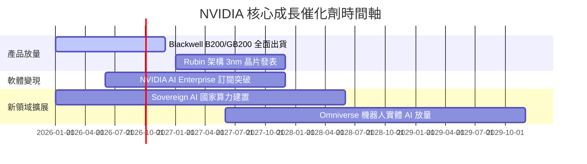

### 9.2 TAM 市場規模分析

```
╔══════════════════════════════════════════════════════════════════╗
║              NVIDIA 目標可尋址市場 (TAM) 預估                    ║
╠══════════════════════════════════════════════════════════════════╣
║                                                                  ║
║  數據中心算力 (Data Center AI):  $500B TAM (NVDA 當前滲透率 ~40%)║
║  企業級 AI 軟體 (AI Software):    $150B TAM (滲透率 <5%，潛力大) ║
║  自動駕駛與機器人 (Automotive):   $100B TAM (滲透率 <3%)         ║
║  電競與專業視覺 (Gaming/ProVis):  $50B  TAM (滲透率 ~60%)        ║
║                                                                  ║
║  📊 總潛在市場 TAM (2030E)：> $800B，NVDA 擁有極廣闊成長天花板  ║
╚══════════════════════════════════════════════════════════════════╝
```

### 9.3 成長驅動力結構圖

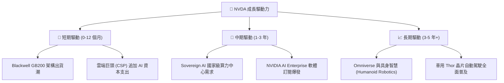

---

## 10. 風險矩陣

### 10.1 風險評分矩陣

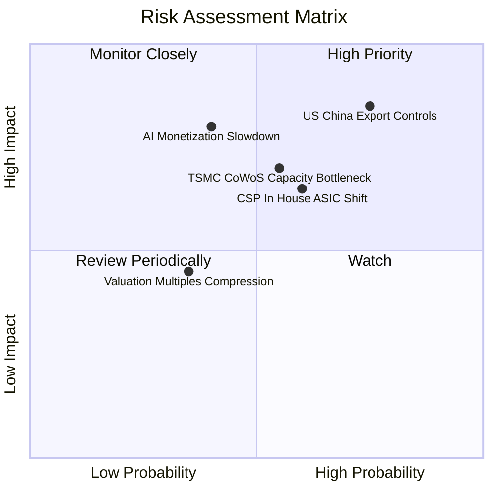

### 10.2 風險清單詳細分析

| # | 風險項目 | 發生機率 | 財務衝擊 | 風險評分 | 緩解措施與觀察指標 |
|---|----------|----------|----------|----------|--------------------|
| 1 | 🔴 **地緣政治出口管制升級** | 高 (75%) | 高 (-15% 營收) | 🔴 **8.5/10** | 開發符合規範之特供晶片；轉向中東與 Sovereign AI 補足 |
| 2 | 🔴 **CSP 轉向自研 ASIC** | 中 (60%) | 高 (-10% 毛利) | 🔴 **7.2/10** | 強調全棧系統 (NVLink/SpectrumX) 效能與 CUDA 軟體壁壘 |
| 3 | 🟡 **台積電封裝產能瓶頸** | 中 (55%) | 中 (-5% 出貨) | 🟡 **6.0/10** | 拓展 Intel/Amkor 等後段封裝合作夥伴 |
| 4 | 🟡 **企業端 AI 變現速度不如預估**| 低 (40%) | 高 (-15% 需求) | 🟡 **5.5/10** | 觀察大模型推理成本下降速度與killer app出現 |

---

## 11. 投資建議

### 11.1 最終綜合評級雷達圖

```
╔══════════════════════════════════════════════════════════════════╗
║                  NVIDIA 最終綜合評分雷達                         ║
╠══════════════════════════════════════════════════════════════════╣
║  基本面強度  : 9.5 / 10  ▓▓▓▓▓▓▓▓▓▓▓▓▓▓▓▓▓▓█░  (護城河極深)      ║
║  成長動能    : 9.2 / 10  ▓▓▓▓▓▓▓▓▓▓▓▓▓▓▓▓▓▓░░  (Blackwell 放量)  ║
║  獲利品質    : 9.8 / 10  ▓▓▓▓▓▓▓▓▓▓▓▓▓▓▓▓▓▓▓█  (ROIC 88.4%)      ║
║  財務健康    : 9.5 / 10  ▓▓▓▓▓▓▓▓▓▓▓▓▓▓▓▓▓▓█░  (淨現金 $68.2B)   ║
║  估值合理性  : 6.5 / 10  ▓▓▓▓▓▓▓▓▓▓▓▓▓░░░░░░░  (PEG 0.55 具吸引力)║
╠══════════════════════════════════════════════════════════════════╣
║  🏆 綜合投資評分：**8.9 / 10** ｜ 最終評級：🟢 **買入 (Buy)**    ║
╚══════════════════════════════════════════════════════════════════╝
```

### 11.2 目標價與隱含報酬率

| 情境 | 機率 | 12 個月目標價 | 相對當前股價 ($200.75) 隱含報酬率 | 核心假設 |
|------|------|----------------|----------------------------------|----------|
| 🔴 **悲觀情境** | 20% | **$175.00** | -12.8% | 出口管制加劇，Forward P/E 壓縮至 17.5x |
| 🟡 **基準情境** | 60% | **$236.45** | **+17.8%** | Blackwell 放量，FY27 EPS $12.89，P/E 18.3x |
| 🟢 **樂觀情境** | 20% | **$320.00** | +59.4% | AI 軟體訂閱爆發，FY27 EPS $16.00，P/E 20.0x |

### 11.3 買入時機與觸發因素

```
╔══════════════════════════════════════════════════════════════════╗
║                  ✅ 買入觸發因素 Checklist                      ║
╠══════════════════════════════════════════════════════════════════╣
║                                                                  ║
║  立即分批買入條件（目前已滿足）：                                ║
║  ✅ Forward P/E < 20x（目前 15.57x）                             ║
║  ✅ PEG Ratio < 1.0（目前 0.55）                                 ║
║  ✅ 股價回檔至加權合理價值 $236.45 以下（MOS +15.1%）            ║
║                                                                  ║
║  強烈加碼觸發條件（出現以下任一）：                              ║
║  ☐ 股價回檔至接近 DCF 悲觀價值 $175.00–$180.00 區間              ║
║  ☐ 財報公佈數據中心單季營收 QoQ 成長 > 25%                       ║
║                                                                  ║
║  減碼/停損觸發條件（出現以下任一）：                             ║
║  ☐ Forward P/E > 35x 且營收 YoY 增速跌破 20%                    ║
║  ☐ 核心客戶 (CSP) 集體下調年度 Capex 預算 > 15%                  ║
╚══════════════════════════════════════════════════════════════════╝
```

### 11.4 投資人適配度分析

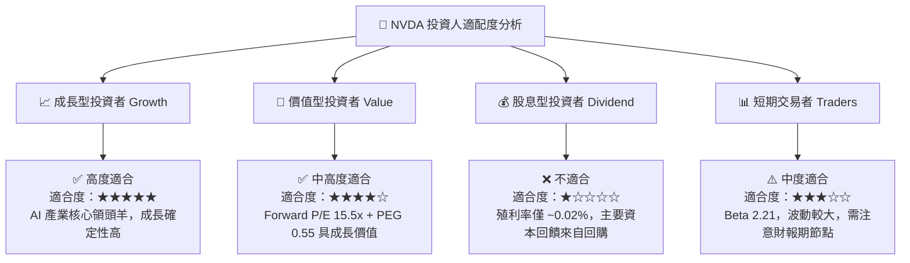

### 11.5 每季財報監控清單（Quarterly Watch List）

| 監控指標 | 正常目標值 | 警告訊號（考慮減碼） | 強勢訊號（考慮加碼） |
|----------|------------|----------------------|----------------------|
| **數據中心營收 QoQ** | ≥ +15.0% | < +5.0% 或轉負 | ≥ +20.0% |
| **GAAP 毛利率** | 70.0% – 75.0% | < 68.0% | ≥ 75.0% |
| **營業利潤率** | ≥ 60.0% | < 55.0% | ≥ 65.0% |
| **存貨週轉天數 (DIO)** | 100 – 120 天 | > 150 天（庫存積壓） | < 90 天（供不應求） |
| **下一季財報指引 (Guidance)** | 高於市場共識 >3% | 遜於市場預期 | 高於市場共識 >8% |

### 11.6 反面論證：什麼會證明論點錯誤（Disconfirming Evidence）

```
╔══════════════════════════════════════════════════════════════════╗
║              ⚠️ 論點失效條件（Disconfirming Evidence）           ║
╠══════════════════════════════════════════════════════════════════╣
║  本投資論點在下列條件成立時將宣告失效，並應執行停損或清倉退出：  ║
║                                                                  ║
║  1. 數據中心營收 YoY 成長率連續兩季跌破 +15.0%                   ║
║  2. GAAP 毛利率因價格戰收縮至 65.0% 以下                         ║
║  3. ROIC 跌破 30.0%（顯示資本效率顯著惡化）                      ║
║  4. 微軟、Meta、Google 三大客戶自研 ASIC 在其算力占比超過 35%   ║
║  5. 美國商務部全面禁止包含 H20/B20 等所有降級版晶片對華出口      ║
╚══════════════════════════════════════════════════════════════════╝
```

---

> **免責聲明**：本報告由 CFA 機構級模型分析生成，數據基於 2026-08-02 即時市場資訊。本報告內容僅供研究參考，不構成任何投資建議或買賣邀約。投資有風險，入市需謹慎。