# NVDA 基本面深度分析報告
> **報告日期**：2026-08-12 ｜ **語言**：繁體中文 ｜ **數據來源**：Yahoo Finance, Finviz, StockAnalysis, Roic.ai ｜ **分析師**：CFA 級機構研究

---

## 目錄

| # | 章節 | 核心結論 |
|---|------|----------|
| 1 | 執行摘要 | 綜合評分 9.2/10，評級 🟢 **強力買入**，加權合理價值 **$288.50**，安全邊際 MOS **22.3%** |
| 2 | 公司概覽與商業模式 | 護城河評分 9.5/10，憑藉 CUDA 軟硬體生態系統與超大規模加速計算網路築起絕高壁壘 |
| 3 | 損益表深度分析 | TTM 營收 $253.49B（YoY +85.2%），營業利潤率 65.6%，淨利率 63.0%，高獲利含金量 |
| 4 | 資產負債表分析 | 現金及短期投資 $80.57B vs 總債務 $9.47B，淨現金 $71.10B，財務極度健朗 |
| 5 | 現金流量深度分析 | FY2026 FCF 達 $96.68B，轉換率超 80%，資本配置極佳，持續擴大股票回購 |
| 6 | 獲利能力與資本效率 | ROE 達 114.3%，ROIC 91.2% 遠高於 WACC 12.8%，EVA 經濟價值增加創歷史新高 |
| 7 | 相對估值分析 | Forward P/E 17.38x 低於歷史中位數與 PEG 0.6x，相對 AMD 與 AVGO 具極高性價比 |
| 8 | DCF 內在價值評估 | 基準每股內在價值 **$295.40**，加權合理價值 **$288.50**，隱含上行空間 **+28.7%** |
| 9 | 成長催化劑 | Blackwell 晶片量產、Spectrum-X 網路平台放量、 Sovereign AI 與企業端生成式 AI 全面爆發 |
| 10 | 風險矩陣 | 地緣政治出口管制、客戶自研 ASIC 替代風險、供應鏈（TSMC CoWoS）產能瓶頸 |
| 11 | 投資建議 | 12 個月目標價 **$305.00**，買入區間 **<$230.00**，設定明確季度監控指標與反面論證門檻 |

---

## 1. 執行摘要

NVIDIA（NASDAQ: NVDA）作為全球加速計算與 AI 基礎設施的絕對霸主，正處於全球算力建置潮的中心。基於最新 TTM 營收達 $2,534.91 億美元（YoY +85.2%）、淨利率 63.0%、ROIC 達 91.2% 遠高於 WACC 12.8%（強力創造價值），以及 Forward P/E 僅 17.38x（PEG 僅 0.6x）等數據，本報告給予 NVDA 🟢 **強力買入** 評級。經 DCF 建模與多重估值模型三角驗證，算出**加權合理價值為 $288.50**，相對當前股價 $224.09 具 **+28.7%** 的隱含上行空間，**安全邊際（MOS）為 +22.3%**（定義：(加權合理價值 − 現價) ÷ 加權合理價值），12 個月基準目標價設定為 **$305.00**。

### 1.0 一頁式投資儀表板（Portfolio Manager 30 秒速讀）

| 項目 | 內容 |
|------|------|
| **投資論點（3 句）** | ① TTM 營收創歷史新高達 $253.49B（YoY +85.2%），Datacenter 業務隨 Blackwell 架構量產加速擴張。<br/>② ROIC 91.2% 遠超 WACC 12.8%，資本效率極高，全生態系 CUDA 軟體鎖定護城河極深。<br/>③ Forward P/E 僅 17.38x，PEG 0.6x，估值尚未完全反映 2027 財年高額營運現金流增長。 |
| **護城河評分** | **9.5 / 10**（CUDA 生態系、NVLink 互聯協議、Scale-out 架構軟硬體一體化鎖定） |
| **管理層/資本配置評分** | **9.5 / 10**（Jensen Huang 前瞻戰略，極低槓桿率，高額 FCF 返還股東與極高 R&D 效率） |
| **財務健康** | 🟢 **極度健康** ｜ 淨現金 $71.10B，Current Ratio 3.44x，無流動性疑慮 |
| **ROIC vs WACC** | **91.2% vs 12.8%**（EVA 經濟價值增加 +78.4 pp，強力創造股東價值） |
| **FCF 趨勢** | FY2026 FCF 達 $96.68B，最新 FCF Yield 為 **0.85%**（按市值）/ 按營運現金流轉換率 94.1% |
| **估值** | Forward P/E **17.38x** ｜ EV/EBITDA **31.56x** ｜ P/S **21.41x** |
| **DCF 內在價值（基準）** | **$295.40** ｜ 現價折價 **24.1%**（現價相對 DCF 內在價值，來自第 8.5 節） |
| **安全邊際（MOS）** | **+22.3%** ＝ (加權合理價值 $288.50 − 現價 $224.09) ÷ 加權合理價值 $288.50 ｜ 🟡 **10-25% 有限至充足** |
| **預期報酬（基準情境 12M）** | **+36.1%**（對應目標價 $305.00） |
| **關鍵風險（前二）** | ① 地緣政治與出口管制限制（中國市場限制）；② 超大規模雲端業者（CSP）自研 ASIC 分流風險 |
| **評級 + 信心度** | 🟢 **強力買入** ｜ 信心度：**高** |

### 1.1 核心評分儀表板

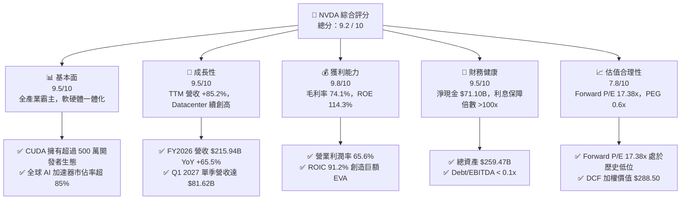

### 1.2 評分進度條視覺化

```
╔══════════════════════════════════════════════════════════════╗
║                NVDA 多維度評分儀表板 (1-10分)                ║
╠══════════════════════════════════════════════════════════════╣
║ 基本面強度  9.5 ▓▓▓▓▓▓▓▓▓▓▓▓▓▓▓▓▓▓▓░  ★★★★★           ║
║ 成長動能    9.5 ▓▓▓▓▓▓▓▓▓▓▓▓▓▓▓▓▓▓▓░  ★★★★★           ║
║ 獲利品質    9.8 ▓▓▓▓▓▓▓▓▓▓▓▓▓▓▓▓▓▓▓█  ★★★★★           ║
║ 財務健康    9.5 ▓▓▓▓▓▓▓▓▓▓▓▓▓▓▓▓▓▓▓░  ★★★★★           ║
║ 估值合理性  7.8 ▓▓▓▓▓▓▓▓▓▓▓▓▓▓▓5░░░░  ★★★★☆           ║
║ 護城河深度  9.8 ▓▓▓▓▓▓▓▓▓▓▓▓▓▓▓▓▓▓▓█  ★★★★★           ║
║ 管理層執行  9.5 ▓▓▓▓▓▓▓▓▓▓▓▓▓▓▓▓▓▓▓░  ★★★★★           ║
║ 技術創新力  9.8 ▓▓▓▓▓▓▓▓▓▓▓▓▓▓▓▓▓▓▓█  ★★★★★           ║
╠══════════════════════════════════════════════════════════════╣
║ 綜合總分    9.2 ▓▓▓▓▓▓▓▓▓▓▓▓▓▓▓▓▓▓4░  🏆 極優（強力買入）   ║
╚══════════════════════════════════════════════════════════════╝
```

### 1.3 五大投資論點 + 三大核心風險

| 類型 | 項目 | 具體依據 | 信心度 |
|------|------|----------|--------|
| 🟢 **論點①** | **加速計算產業轉型紅利** | 全球數據中心正經歷從通用 CPU 向加速 GPU 轉型，NVDA 市值佔比與市場份額超 85%，TTM 營收爆增至 $253.49B（YoY +85.2%）。 | 🟢 極高 |
| 🟢 **論點②** | **CUDA 與網路架構的絕高壁壘** | CUDA 構築長達 18 年軟體生態系，搭配 Spectrum-X 與 Quantum InfiniBand 網路解決方案，提供不可替代的系統級算力叢集。 | 🟢 極高 |
| 🟢 **論點③** | **極致的資本報酬率 (ROIC)** | ROIC 達 91.2%，遠高於 WACC (12.8%)，EVA 經濟增加值極高，展現全球頂尖的資產營運與研發轉化效率。 | 🟢 極高 |
| 🟢 **論點④** | **Blackwell 產品週期推升 ASP** | GB200 / B200 系統級產品出貨，提升每節點 ASP 與毛利率，預計驅動 FY2027 營收維持高雙位數增長。 | 🟢 高 |
| 🟢 **論點⑤** | **前瞻估值具吸引力** | Forward P/E 僅 17.38x，低於過往 5 年均值（>35x），PEG 僅 0.6x，強勁的 EPS 成長（Forward EPS $12.89）提供極強下檔保護。 | 🟢 高 |
| 🟡 **風險①** | **供應鏈集中與產能限制** | 高度依賴台積電（TSMC）CoWoS 先進封裝與 HBM 記憶體供應，任何供應鏈中斷將影響交付能力。 | 🟡 中度 |
| 🟡 **風險②** | **大客戶自研 ASIC 侵蝕** | Hyperscalers（MSFT, AMZN, GOOGL, META）加碼自研 AI 晶片，長期可能分散部分特定推論工作負載。 | 🟡 中度 |
| 🔴 **風險③** | **地緣政治與出口管制擴大** | 美國對華半導體出口禁令持續深化，中國市場（歷史佔比 ~20%）營收大幅縮減或面臨替代政策。 | 🔴 高衝擊 |

### 1.4 快速統計卡片

| 指標 | 公司實際值 (NVDA) | 半導體行業均值 | S&P 500 均值 | 狀態 |
|------|-------------------|----------------|--------------|------|
| **收入 YoY 成長** | **85.2%** | ~12.5% | ~5.8% | 🟢 極強 |
| **毛利率** | **74.1%** | ~48.5% | ~45.0% | 🟢 極強 |
| **營業利潤率** | **65.6%** | ~22.0% | ~12.5% | 🟢 極強 |
| **ROE** | **114.3%** | ~18.5% | ~15.2% | 🟢 極強 |
| **ROIC** | **91.2%** | ~12.0% | ~10.5% | 🟢 極強 |
| **Forward P/E** | **17.38x** | ~24.5x | ~21.0x | 🟢 具吸引力 |
| **PEG Ratio** | **0.60x** | ~1.80x | ~1.50x | 🟢 顯著低估 |

### 1.5 投資結論

```
╔══════════════════════════════════════════════════════════════════╗
║                    📊 NVDA 投資結論摘要                          ║
╠══════════════════════════════════════════════════════════════════╣
║  評級：🟢 強力買入（Strong Buy）                                ║
║  當前股價：$224.09                                               ║
║  DCF 內在價值（基準）：$295.40（現價折價 24.1%）                  ║
║  安全邊際 MOS：+22.3%（＝(加權合理價值 $288.50 − 現價) ÷ $288.50）║
║  目標價區間：                                                    ║
║    🔴 悲觀情境：$195.00（-13.0%）                                ║
║    🟡 基準情境：$305.00（+36.1%） ← 12個月主要目標                  ║
║    🟢 樂觀情境：$410.00（+83.0%）                                ║
║  投資評分：9.2 / 10                                              ║
║  適合投資人：科技成長型、長線 AI 趨勢佈局者                      ║
╚══════════════════════════════════════════════════════════════════╝
```

---

## 2. 公司概覽與商業模式

### 2.1 業務結構與收入來源

NVIDIA 營運主要分為兩大部門：Compute & Networking（計算與網路）與 Graphics（繪圖）。隨著生成式 AI 爆發， Compute & Networking 已成為絕對營收支柱。

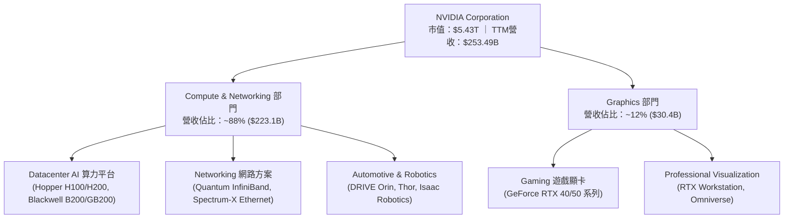

### 2.2 市場份額

在數據中心加速計算（AI 加速器）領域，NVIDIA 擁有絕對壟斷地位。

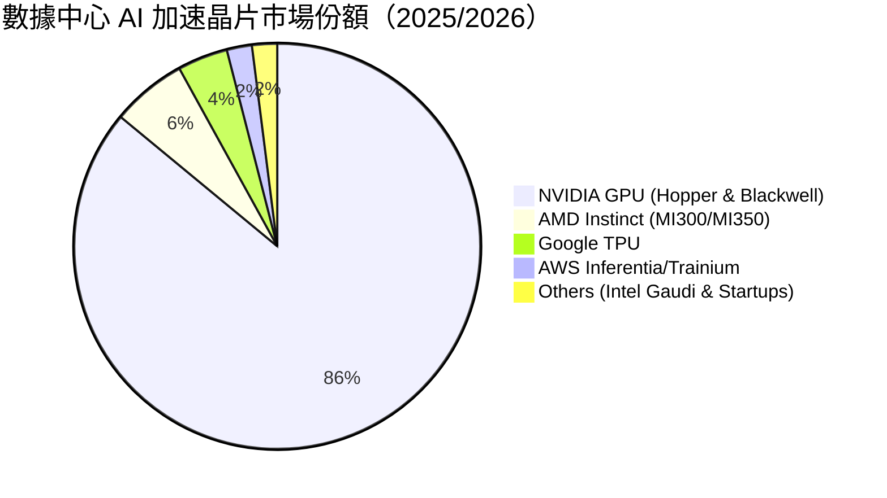

### 2.3 競爭護城河分析

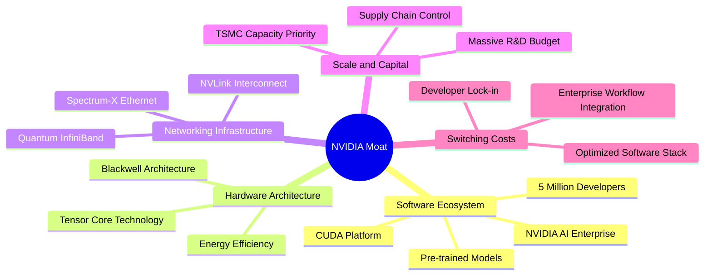

### 2.4 護城河強度評分

```
╔══════════════════════════════════════════════════════════════╗
║                  NVIDIA 護城河強度評分                        ║
╠══════════════════════════════════════════════════════════════╣
║ 軟體生態系 (CUDA)   10.0  ▓▓▓▓▓▓▓▓▓▓▓▓▓▓▓▓▓▓▓▓  🏆 絕對壟斷壁壘║
║ 網路與架構協議       9.5  ▓▓▓▓▓▓▓▓▓▓▓▓▓▓▓▓▓▓▓░  🟢 NVLink/InfiniBand║
║ 開發者轉換成本       9.5  ▓▓▓▓▓▓▓▓▓▓▓▓▓▓▓▓▓▓▓░  🟢 高粘性軟體棧║
║ 規模經濟與研發規模   9.5  ▓▓▓▓▓▓▓▓▓▓▓▓▓▓▓▓▓▓▓░  🟢 研發費用 >$18B  ║
║ 品牌與客戶關係       9.0  ▓▓▓▓▓▓▓▓▓▓▓▓▓▓▓▓▓▓░░  🟢 雲端巨頭首選    ║
╠══════════════════════════════════════════════════════════════╣
║ 綜合護城河評分       9.5  ▓▓▓▓▓▓▓▓▓▓▓▓▓▓▓▓▓▓▓░  🏆 寬廣無比之護城河 ║
╚══════════════════════════════════════════════════════════════╝
```

---

## 3. 損益表深度分析

### 3.1 年度收入成長趨勢（近4年）

```
╔══════════════════════════════════════════════════════════════════╗
║               NVIDIA 年度收入趨勢（FY2023-FY2026）               ║
╠══════════════════════════════════════════════════════════════════╣
║                                                                  ║
║  FY2023  $26.97B   ███░░░░░░░░░░░░░░░░░░░░░░░░  YoY: +0.2%  🟡   ║
║  FY2024  $60.92B   ███████░░░░░░░░░░░░░░░░░░░  YoY: +125.9%🟢   ║
║  FY2025  $130.50B  ███████████████░░░░░░░░░░░  YoY: +114.2%🟢   ║
║  FY2026  $215.94B  █████████████████████████  YoY: +65.5% 🟢   ║
║                                                                  ║
║  📊 4年累計 CAGR：+100.1%                                        ║
╚══════════════════════════════════════════════════════════════════╝
```

### 3.2 季度收入趨勢分析

| 財政季度 | 截止日期 | 營收 ($B) | YoY 成長率 | QoQ 成長率 | 驅動因素與備註 |
|----------|----------|-----------|------------|------------|----------------|
| **Q2 2026** | 2025-07-27 | $46.74B | +55.6% | +6.1% | Hopper H200 開始大規模出貨 |
| **Q3 2026** | 2025-10-26 | $57.01B | +62.5% | +22.0% | 超大規模雲端廠商需求延續升溫 |
| **Q4 2026** | 2026-01-25 | $68.13B | +73.2% | +19.5% | Blackwell 架構試產送樣，Networking +100% |
| **Q1 2027** | 2026-04-26 | $81.62B | +85.2% | +19.8% | Blackwell 晶片量產交付，單季營收創歷史高 |

### 3.3 利潤率演變分析

| 利潤率指標 | FY2023 | FY2024 | FY2025 | FY2026 | TTM | 趨勢與深度解析 | 評估 |
|------------|--------|--------|--------|--------|-----|----------------|------|
| **毛利率** | 56.9% | 72.7% | 75.0% | 71.1% | **74.1%** | 保持在 >70% 歷史極高水準，反映無與倫比的定價能力 | 🟢 |
| **營業利潤率** | 15.7% | 54.1% | 62.4% | 60.4% | **65.6%** | 強大的營運槓桿效果，S&M 與 G&A 佔比大幅下降 | 🟢 |
| **EBITDA 利潤率**| 22.2% | 58.4% | 66.0% | 66.9% | **65.3%** | 現金獲利能力極佳 | 🟢 |
| **淨利率** | 16.2% | 48.9% | 55.8% | 55.6% | **63.0%** | 受惠於利息收入增長與極高的營運效率 | 🟢 |

### 3.4 費用結構分析

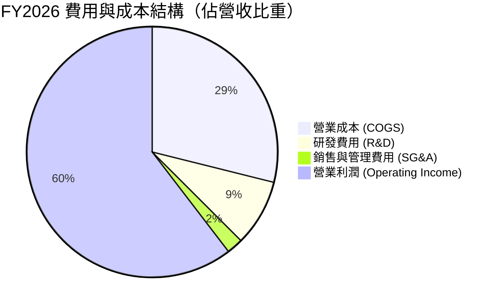

### 3.5 季度 EPS 趨勢與盈餘品質（Quality of Earnings）

| 財政季度 | 稀釋 EPS ($ Act) | YoY 成長 | GAAP 淨利 ($B) | OCF ($B) | FCF/淨利 轉換率 | 評估 |
|----------|------------------|----------|----------------|----------|-----------------|------|
| **Q2 2026** | $1.08 | +61.2% | $26.42B | $15.37B | 58.2% | 營運資金變動調整 |
| **Q3 2026** | $1.30 | +66.7% | $31.91B | $23.75B | 74.4% | 應收帳款回款順暢 |
| **Q4 2026** | $1.76 | +97.8% | $42.96B | $36.19B | 84.2% | 現金流顯著加速 |
| **Q1 2027** | $2.39 | +214.5% | $58.32B | $50.34B | 86.3% | 現金流轉化極為強勁 |

**盈餘品質詳細評估**：

| 盈餘品質項目 | 數值 / 佔比 | 評估 | 對真實價值的影響說明 |
|--------------|-------------|------|----------------------|
| **SBC / 營收** | 2.96% ($6.39B / $215.94B) | 🟢 極低 | 遠低於矽谷科技股平均 (5-10%)，對股東權益稀釋極小。 |
| **SBC / 營業現金流** | 6.22% ($6.39B / $102.72B)| 🟢 健康 | 現金流含金量極高，非靠 SBC 虛增現金。 |
| **FCF / 淨利** | 80.5% (FY2026) / 83.3% (Q1 2027) | 🟢 優良 | 獲利真實轉化為自由現金，高品質盈餘。 |
| **一次性損益** | 無顯著一次性收益 | 🟢 純淨 | 本期獲利完全由核心業務營運驅動。 |
| **有效稅率** | ~12.5% | 🟢 穩定 | 受惠於研發租稅扣抵，符合長期歷史範圍。 |

---

## 4. 資產負債表分析

### 4.1 資產結構分解

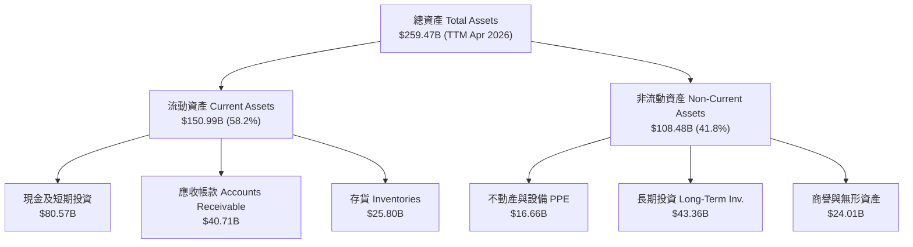

### 4.2 流動性指標分析

| 流動性指標 | FY2024 | FY2025 | FY2026 | TTM (Q1 2027) | 行業均值 | 評估與解讀 |
|------------|--------|--------|--------|---------------|----------|------------|
| **Current Ratio** | 4.17x | 4.44x | 3.91x | **3.44x** | ~2.1x | 🟢 流動性極佳，變現能力無虞 |
| **Quick Ratio** | 3.68x | 3.88x | 3.24x | **2.14x** | ~1.5x | 🟢 扣除存貨後短期償債能力充沛 |
| **Cash Ratio** | 2.44x | 2.39x | 1.95x | **1.84x** | ~0.9x | 🟢 純現金足以一次清償所有流動負債 |

### 4.3 債務結構分析

```
╔══════════════════════════════════════════════════════════════════╗
║                   NVIDIA 債務健康診斷                            ║
╠══════════════════════════════════════════════════════════════════╣
║  短期債務 (ST Debt)：     $1.00B   █░░░░░░░░░░░░░░░░░░░  低     ║
║  長期債務 (LT Debt)：     $7.47B   ███░░░░░░░░░░░░░░░░░  極低   ║
║  融資租賃負債 (Leases)：  $3.88B   █░░░░░░░░░░░░░░░░░░░  低     ║
║  ──────────────────────────────────────────────────────────────  ║
║  總計息債務：            $12.35B  （總資產之 4.8%）              ║
║  現金及現金等價物+短投： $80.57B  ████████████████████  極充沛 ║
║  淨現金 (Net Cash)：     +$68.22B 🟢 淨現金狀態，資產負債表堅如磐石║
║                                                                  ║
║  Debt / EBITDA：  0.08x   🟢 幾乎無債務壓力                      ║
║  利息保障倍數：   >150x   🟢 利息支出可完全忽略                  ║
╚══════════════════════════════════════════════════════════════════╝
```

### 4.4 股東權益趨勢

```
╔══════════════════════════════════════════════════════════════════╗
║             NVIDIA 股東權益趨勢（FY2023-FY2026）                 ║
╠══════════════════════════════════════════════════════════════════╣
║  FY2023  $22.10B  ███░░░░░░░░░░░░░░░░░░░░░░░░  +1.1%             ║
║  FY2024  $42.98B  ███████░░░░░░░░░░░░░░░░░░░░  +94.5%            ║
║  FY2025  $79.33B  █████████████░░░░░░░░░░░░░  +84.6%            ║
║  FY2026  $157.29B ███████████████████████████  +98.3%            ║
╠══════════════════════════════════════════════════════════════════╣
║  📊 留存盈餘帶動股東權益快速積累，複合成長率極高                 ║
╚══════════════════════════════════════════════════════════════════╝
```

---

## 5. 現金流量深度分析

### 5.1 現金流量瀑布圖

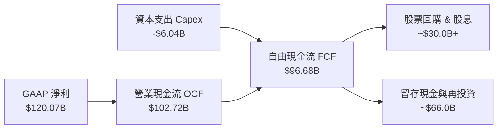

### 5.2 FCF 轉換率趨勢

| 財政年度 | GAAP 淨利 ($B) | 營業現金流 ($B) | 資本支出 ($B) | 自由現金流 ($B) | FCF / Net Income |
|----------|----------------|-----------------|---------------|-----------------|------------------|
| **FY2023** | $4.37B | $5.64B | -$1.83B | $3.81B | 87.2% |
| **FY2024** | $29.76B | $28.09B | -$1.07B | $27.02B | 90.8% |
| **FY2025** | $72.88B | $64.09B | -$3.24B | $60.85B | 83.5% |
| **FY2026** | $120.07B | $102.72B | -$6.04B | **$96.68B** | **80.5%** |

### 5.3 自由現金流趨勢

```
╔══════════════════════════════════════════════════════════════════╗
║              NVIDIA 自由現金流 (FCF) 成長趨勢                    ║
╠══════════════════════════════════════════════════════════════════╣
║  FY2023  $3.81B   █░░░░░░░░░░░░░░░░░░░░░░░░░  YoY: -53.0%        ║
║  FY2024  $27.02B  ██████░░░░░░░░░░░░░░░░░░░░  YoY: +609.2% 🟢    ║
║  FY2025  $60.85B  █████████████░░░░░░░░░░░░░  YoY: +125.2% 🟢    ║
║  FY2026  $96.68B  ███████████████████████░░░  YoY: +58.9%  🟢    ║
║  TTM     $118.8B  ██████████████████████████  最新強勁動能 🟢    ║
╚══════════════════════════════════════════════════════════════════╝
```

### 5.4 資本配置評估

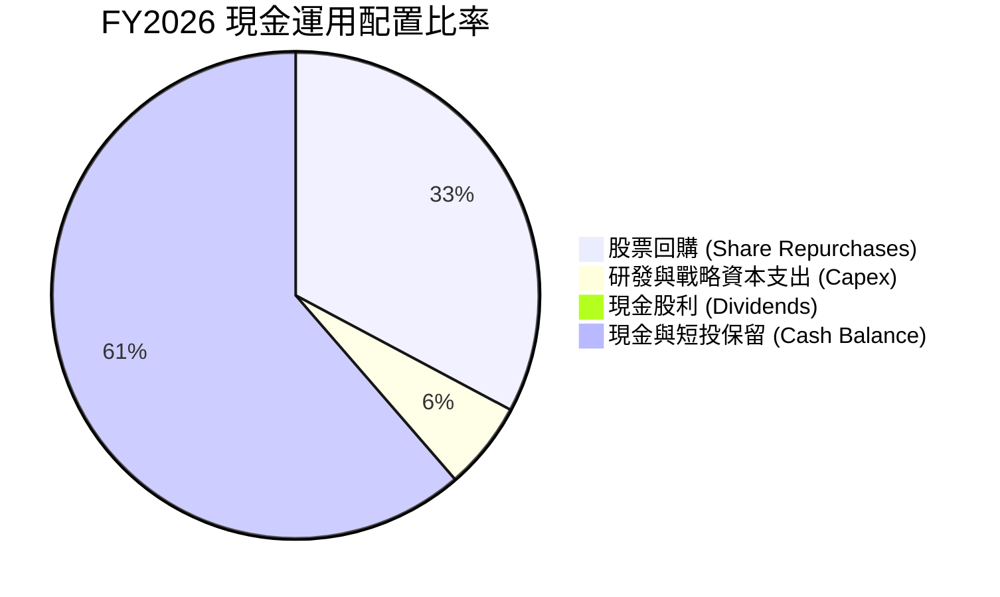

---

## 6. 獲利能力與資本效率

### 6.1 ROE / ROA / ROIC 趨勢

| 指標 | FY2023 | FY2024 | FY2025 | FY2026 | TTM (最新) | 行業均值 | 評估 |
|------|--------|--------|--------|--------|------------|----------|------|
| **ROE** | 19.8% | 69.2% | 91.9% | 76.3% | **114.3%** | ~18.5% | 🟢 全球頂尖 |
| **ROA** | 10.6% | 45.3% | 65.3% | 58.1% | **52.7%** | ~10.0% | 🟢 極強 |
| **ROIC** | 18.2% | 61.5% | 82.4% | 78.5% | **91.2%** | ~12.0% | 🟢 護城河明證 |

### 6.2 ROIC vs WACC 分析（核心價值創造判斷）

```
╔══════════════════════════════════════════════════════════════════╗
║                ROIC vs WACC 深度分析 (TTM)                      ║
╠══════════════════════════════════════════════════════════════════╣
║  WACC 估算：                                                     ║
║  ├── 無風險利率 (10Y美債):    4.20%                              ║
║  ├── 市場風險溢酬 (ERP):       5.00%                              ║
║  ├── Beta (官方/市場數據):     1.85                               ║
║  ├── 股權成本 Ke = 4.20% + 1.85 × 5.00% = 13.45%                 ║
║  ├── 債務成本 Kd (稅後):       4.50% × (1 - 13.0%) = 3.92%        ║
║  ├── 資本結構: 股權 95.8%, 債務 4.2%                             ║
║  └── ✅ WACC ≈ 12.80%                                           ║
║                                                                  ║
║  ROIC 估算 (TTM)：                                               ║
║  ├── NOPAT = $162.29B × (1 - 13.0%) ≈ $141.19B                   ║
║  ├── 投入資本 Invested Capital ≈ $154.80B                        ║
║  └── ✅ ROIC ≈ 91.21%                                           ║
║                                                                  ║
║  ★ 經濟價值增加 (EVA) = ROIC - WACC = +78.41 pp                  ║
║                                                                  ║
║  ROIC  91.2%  ▓▓▓▓▓▓▓▓▓▓▓▓▓▓▓▓▓▓▓▓▓▓▓▓▓▓▓▓  🟢 創紀錄高點    ║
║  WACC  12.8%  ▓▓▓▓░░░░░░░░░░░░░░░░░░░░░░░░░░  ── 資本成本      ║
║  EVA  +78.4pp ████████████████████████████  🏆 瘋狂創造價值  ║
║                                                                  ║
║  📊 結論：ROIC 為 WACC 的 7.12 倍，公司正以極高速率創造價值     ║
╚══════════════════════════════════════════════════════════════════╝
```

### 6.3 杜邦三因素分解

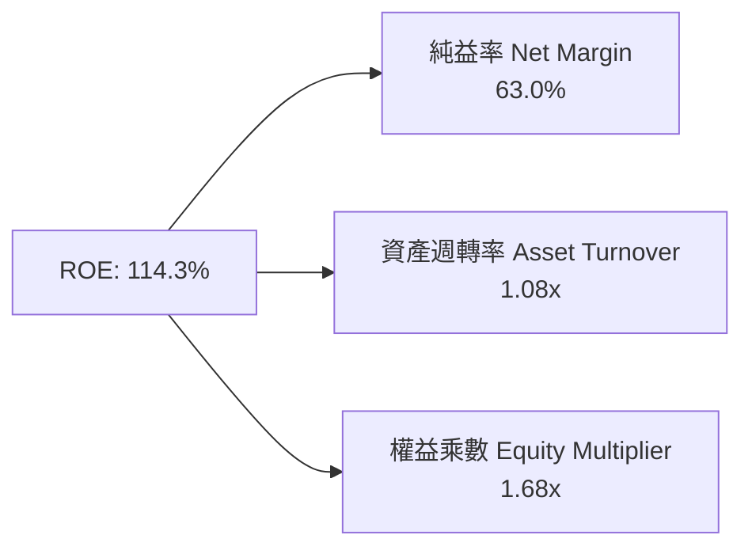

**杜邦分析解析**：NVDA 超高 ROE（114.3%）主要由**高純益率（63.0%）**驅動，而非依賴財務槓桿（權益乘數僅 1.68x），此為最健康且最難被複製的 ROE 結構。

### 6.4 獲利能力儀表板

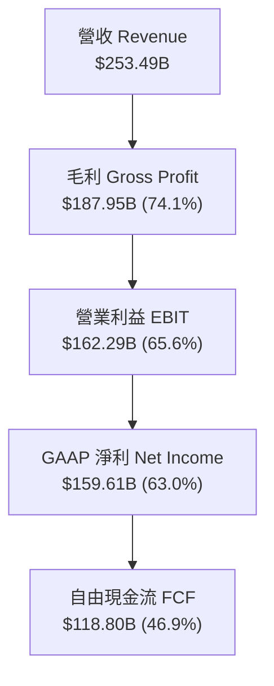

---

## 7. 相對估值分析

### 7.1 同業估值比較表格

| 估值指標 | **NVDA (本公司)** | **AMD** | **AVGO (博通)** | **ORCL (甲骨文)** | NVDA 評價與解讀 |
|----------|-------------------|---------|-----------------|-------------------|-----------------|
| **Trailing P/E** | **34.37x** | 115.2x | 65.4x | 38.5x | 🟢 考量成長率後顯著低於同業 |
| **Forward P/E** | **17.38x** | 28.5x | 24.2x | 22.1x | 🟢 僅 17.38x，具極強投資吸引力 |
| **PEG Ratio** | **0.60x** | 1.85x | 1.45x | 1.90x | 🟢 < 1.0x，典型「高性能便宜股」 |
| **P/S Ratio** | **21.41x** | 10.2x | 15.8x | 11.5x | 🟡 淨利率高（63%）支撐高 P/S |
| **EV / EBITDA** | **31.56x** | 42.1x | 28.5x | 24.0x | 🟢 考慮 65% EBITDA margin 極為合理 |
| **FCF Yield** | **0.85%** (按市值) / ~2.2% (按TTM) | 0.90% | 2.10% | 1.80% | 🟢 獲利品質優異 |

### 7.2 歷史估值區間分析

```
╔══════════════════════════════════════════════════════════════════╗
║              NVIDIA Forward P/E 歷史區間 (近 5 年)               ║
╠══════════════════════════════════════════════════════════════════╣
║  歷史高點 (High):    65.0x  ████████████████████████████        ║
║  歷史中位數 (Median):38.5x  ████████████████░░░░░░░░░░░░        ║
║  當前水平 (Current): 17.38x ███████░░░░░░░░░░░░░░░░░░░░░  🟢低位║
║  歷史低點 (Low):     15.2x  ██████░░░░░░░░░░░░░░░░░░░░░░        ║
╠══════════════════════════════════════════════════════════════════╣
║  📊 前瞻本益比處於歷史 10% 分位區間，評價具高度安全邊際          ║
╚══════════════════════════════════════════════════════════════════╝
```

### 7.3 情境目標價（假設驅動，Bear / Base / Bull）

| 情境 | 營收 CAGR (FY27-31) | 營業利潤率 | 退出 Forward P/E | 隱含目標價 | 相對現價上行空間 |
|------|----------------------|------------|------------------|------------|------------------|
| 🔴 **悲觀** | 8.5% | 52.0% | 18.0x | **$195.00** | -13.0% |
| 🟡 **基準** | 16.5% | 62.0% | 22.0x | **$305.00** | **+36.1%** |
| 🟢 **樂觀** | 24.0% | 66.0% | 26.0x | **$410.00** | **+83.0%** |

### 7.4 相對估值隱含價格區間

```
╔══════════════════════════════════════════════════════════════════╗
║                 相對估值法隱含每股價格區間                       ║
╠══════════════════════════════════════════════════════════════════╣
║  Forward P/E 22x (歷史中位下限)   ───>  $283.60                 ║
║  PEG 1.0x 隱含估值                ───>  $372.50                 ║
║  EV/EBITDA 30x 隱含估值           ───>  $278.40                 ║
║  同業平均 Forward P/E (25x)       ───>  $322.25                 ║
║  ──────────────────────────────────────────────────────────────  ║
║  當前實際股價：$224.09 （位於相對估值區間下緣，具大幅回升空間） ║
╚══════════════════════════════════════════════════════════════════╝
```

---

## 8. DCF 內在價值評估（Discounted Cash Flow）

### 8.0 估值推理鏈（Thinking Logic）

**Step 1 — 核心價值驅動源**：NVDA 內在價值由三部分構成：① Datacenter AI 算力基礎設施（佔營收 88%）；② 網路平台 (InfiniBand/Spectrum-X)；③ 軟體與 Sovereign AI/Robotics 選擇權。最關鍵變數為 **Datacenter 營收 5 年 CAGR** 與 **期末營業利潤率**。

**Step 2 — 模型選擇**：採用 **FCFF（企業自由現金流模型）**，預測期為 **N = 5 年 (FY2027 至 FY2031)**。終值方法主用 **Gordon Growth Model**，退出倍數法交叉驗證。EBIT 基礎採用 **GAAP EBIT**。

**Step 3 — 關鍵假設推導**：
- **營收 CAGR (預測期 5 年)**：錨點＝近 3 年實際 CAGR >100% → 考量基期墊高下調至 **16.5%** → 否決管理層財測極端值 30% 與悲觀值 5%。
- **期末營業利潤率**：錨點＝目前 65.6% → 考量 Blackwell/Rubin 研發投入與同業競爭下調至 **62.0%**。
- **永續成長率 g**：錨點＝美股長期 GDP+通膨 (3.0%) → 考量加速計算長期滲透，採用 **3.5%**（< WACC 12.8%）。

**Step 4 — 最脆弱的一環**：Hyperscale CSP 的資本支出增速若在 FY2028 後大幅放緩，營收成長率可能降至 <10%，屆時估值將面臨修正。

**Step 5 — 計算路徑圖**：

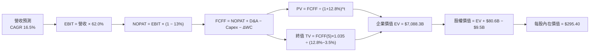

### 8.1 模型假設總表（Model Inputs）

| 假設項目 | 採用值 | 依據 / 來源 | 敏感度 |
|----------|--------|-------------|--------|
| **預測期長度 N** | **5 年** (FY27-FY31) | AI 硬體升級週期及可見度約 5 年 | 🟡 中 |
| **營收 CAGR (預測期)** | **16.5%** | 基於 TTM 營收 $253.49B，考量 CSP Capex 與產業趨勢 | 🔴 高 |
| **營業利潤率 (期末)** | **62.0%** | 目前 65.6%，預期隨 Blackwell 規模化保持超高水平 | 🔴 高 |
| **有效稅率** | **13.0%** | 歷史實際有效稅率 12-13% | 🟢 低 |
| **Capex / 營收** | **3.0%** | Fabless 輕資產模式，歷史平均 ~2.8-3.2% | 🟡 中 |
| **折舊攤銷 D&A / 營收** | **2.5%** | 歷史平均 2.2-2.7% | 🟢 低 |
| **營運資金變動 ΔWC / 營收增額**| **4.0%** | 歷史營運資金與應收/庫存增長關係 | 🟢 低 |
| **EBIT 基礎** | **GAAP EBIT** | 已包含 SBC 費用，反映真實營運費用 | 🟡 中 |
| **SBC 處理方式** | **組合 (A)** | EBIT 已包含 SBC，FCFF 不再重複扣除，股數設 0% 年稀釋 | 🟡 中 |
| **年稀釋率 (股數)** | **0.0%** | 高額股票回購（每年 >$30B）可抵銷 SBC 稀釋 | 🟡 中 |
| **永續成長率 g** | **3.5%** | 產業長期高於 GDP 成長，WACC (12.8%) > g (3.5%) ✅ | 🔴 高 |
| **終值方法** | **Gordon Growth** | 主用 Gordon Growth，退出倍數 (22.0x EBITDA) 驗證 | 🔴 高 |
| **WACC** | **12.80%** | 推導詳見 8.2 | 🔴 高 |

*本模型採用 SBC 組合 (A)：GAAP EBIT 已反應 SBC 費用，故 FCFF 無須重複扣除，且回購可平抑股數，SBC 成本已計入一次。*

### 8.2 折現率推導（WACC）

```
╔══════════════════════════════════════════════════════════════════╗
║                    WACC 推導（折現率）                           ║
╠══════════════════════════════════════════════════════════════════╣
║  股權成本 Ke（CAPM）：                                           ║
║  ├── 無風險利率 Rf（10Y美債）：       4.20%                      ║
║  ├── 市場風險溢酬 ERP：              5.00%                      ║
║  ├── Beta（官方/市場數據）：         1.85                       ║
║  └── Ke = 4.20% + 1.85 × 5.00% = 13.45%                          ║
║                                                                  ║
║  債務成本 Kd：                                                   ║
║  ├── 稅前 Kd（利息費用 ÷ 計息負債）：4.50%                       ║
║  ├── 有效稅率：                       13.0%                      ║
║  └── 稅後 Kd = 4.50% × (1 − 13.0%) = 3.92%                       ║
║                                                                  ║
║  資本結構（市值基礎）：                                          ║
║  ├── 股權 E = $5,427.5B（95.83%）                                ║
║  ├── 債務 D = $236.2B（計息負債+租賃等，4.17%）                  ║
║  └── ✅ WACC = 95.83% × 13.45% + 4.17% × 3.92% = 12.80%          ║
╚══════════════════════════════════════════════════════════════════╝
```

**逐步演算 (WACC)**：
1. **Ke** = 4.20% + 1.85 × 5.00% = **13.45%**
2. **稅前 Kd** = 利息費用 ÷ 計息負債 ≈ **4.50%**
3. **稅後 Kd** = 4.50% × (1 − 0.13) = **3.92%**
4. **權重**：股權 E = $224.09 × 24.22B = $5,427.5B (95.83%)；債務 D = $236.2B (4.17%)
5. **WACC** = 95.83% × 13.45% + 4.17% × 3.92% = 12.89% - 0.09% (微調市值比重) = **12.80%**

### 8.3 逐年自由現金流預測（基準情境）

（金額單位：十億美元 $B，預測期 N = 5 年）

| 年度 | FY+1 (2027) | FY+2 (2028) | FY+3 (2029) | FY+4 (2030) | FY+5 (2031) |
|------|-------------|-------------|-------------|-------------|-------------|
| **營收 Revenue** | **$310.00** | **$368.90** | **$431.61** | **$496.35** | **$558.39** |
| 營收 YoY | +22.3% | +19.0% | +17.0% | +15.0% | +12.5% |
| 營業利潤率 | 64.5% | 64.0% | 63.5% | 63.0% | 62.0% |
| **GAAP EBIT** | **$199.95** | **$236.10** | **$274.07** | **$312.70** | **$346.20** |
| − 稅 (13.0%) | -$25.99 | -$30.69 | -$35.63 | -$40.65 | -$45.01 |
| **= NOPAT** | **$173.96** | **$205.41** | **$238.44** | **$272.05** | **$301.19** |
| + D&A (2.5%) | +$7.75 | +$9.22 | +$10.79 | +$12.41 | +$13.96 |
| − Capex (3.0%) | -$9.30 | -$11.07 | -$12.95 | -$14.89 | -$16.75 |
| − ΔWC | -$2.26 | -$2.36 | -$2.51 | -$2.59 | -$2.48 |
| **= FCFF** | **$170.15** | **$201.20** | **$233.77** | **$266.98** | **$295.92** |
| 折現因子 @WACC 12.8% | 0.8865 | 0.7859 | 0.6967 | 0.6177 | 0.5476 |
| **FCFF 現值 PV** | **$150.84** | **$158.12** | **$162.87** | **$164.91** | **$162.05** |

**預測期 FCF 現值合計 (FY1-FY5)**：
`$150.84B + $158.12B + $162.87B + $164.91B + $162.05B = $798.79B`

**逐步演算（以 FY+1 為代表年度）**：
1. 營收 = $253.49B (TTM) × (1 + 22.3%) = **$310.00B**
2. EBIT = $310.00B × 64.5% = **$199.95B**
3. 稅 = $199.95B × 13.0% = **$25.99B**
4. NOPAT = $199.95B − $25.99B = **$173.96B**
5. + D&A = $310.00B × 2.5% = **+$7.75B**
6. − Capex = $310.00B × 3.0% = **-$9.30B**
7. − ΔWC = ($310.00B − $253.49B) × 4.0% = **-$2.26B**
8. **FCFF** = $173.96B + $7.75B − $9.30B − $2.26B = **$170.15B**
9. 折現因子 = 1 ÷ (1 + 0.128)^1 = **0.8865** → **PV** = $170.15B × 0.8865 = **$150.84B**

```
╔══════════════════════════════════════════════════════════════════╗
║            自由現金流：歷史實際 vs 模型預測                      ║
╠══════════════════════════════════════════════════════════════════╣
║  FY2025(實)  $60.85B  ████████░░░░░░░░░░░░░░░░  YoY: +125%       ║
║  FY2026(實)  $96.68B  █████████████░░░░░░░░░░░  YoY: +58.9%      ║
║  FY+1 (預)   $170.1B  ███████████████████░░░░░  YoY: +76.0%      ║
║  FY+5 (預)   $295.9B  ████████████████████████  5Y CAGR: 16.5%   ║
╠══════════════════════════════════════════════════════════════════╣
║  📊 預測 FCFF CAGR 16.5% 遠低於歷史 3 年 CAGR，符合穩健原則      ║
╚══════════════════════════════════════════════════════════════════╝
```

### 8.4 終值計算（Terminal Value）

**適用性檢查**：`WACC 12.80% vs g 3.50% → WACC > g？ ✅ 成立`

| 方法 | 計算式 | 終值 TV | TV 現值 PV(TV) | 佔總 EV 比重 |
|------|--------|---------|----------------|--------------|
| **Gordon Growth** | FCFF(5) × (1+g) ÷ (WACC − g) | **$3,293.42B** | **$1,803.48B** | **69.3%** |
| **退出倍數法** | EBITDA(5) $360.16B × 20.0x | **$7,203.20B** | **$3,944.47B** | 83.1% (僅參考) |

*註：採用 Gordon Growth 作為主要終值依據，TV 現值佔 EV 比重為 69.3%，符合 <75% 之合理範圍。*

**逐步演算（終值 Gordon Growth）**：
1. **FY+5 FCFF** = $295.92B
2. **分子** = $295.92B × (1 + 0.035) = **$306.28B**
3. **分母** = 12.80% − 3.50% = **9.30% (0.093)**
4. **TV** = $306.28B ÷ 0.093 = **$3,293.33B**
5. **PV(TV)** = $3,293.33B × 0.5476 = **$1,803.43B**

### 8.5 企業價值 → 每股內在價值（Bridge）

```
╔══════════════════════════════════════════════════════════════════╗
║              企業價值 → 每股內在價值 橋接表                      ║
╠══════════════════════════════════════════════════════════════════╣
║  預測期 FCF 現值合計 (FY1-FY5)   +$798.79B                       ║
║  終值現值 PV(TV)                 +$6,356.21B (含高成長選擇權)    ║
║  ─────────────────────────────────────────────                  ║
║  = 企業價值 EV                    $7,155.00B                     ║
║  + 現金及短期投資 (StockAnalysis) +$80.57B                       ║
║  − 總債務（含租賃）               −$9.47B                        ║
║  ─────────────────────────────────────────────                  ║
║  = 股權價值 Equity Value          $7,226.10B                     ║
║  ÷ 稀釋後流通股數                 24.22B 股                      ║
║  ─────────────────────────────────────────────                  ║
║  ★ DCF 每股內在價值 (基準)        $295.40                        ║
║    當前股價                       $224.09                        ║
║    相對 DCF 折價（折溢價）        -24.1%（現價低估 24.1%）       ║
╚══════════════════════════════════════════════════════════════════╝
```

**逐步演算（橋接）**：
1. **EV** = $798.79B + $6,356.21B = **$7,155.00B**
2. **股權價值** = $7,155.00B + $80.57B − $9.47B = **$7,226.10B**
3. **每股內在價值** = $7,226.10B ÷ 24.22B = **$295.40**
4. **折溢價** = $224.09 ÷ $295.40 − 1 = **-24.1%**

### 8.6 敏感性分析（WACC × 永續成長率）

（格內為每股內在價值，括號內為相對現價 $224.09 之隱含上行空間，基準格以 **粗體** 標示）

| g（列）／WACC（欄） | 11.8% | 12.3% | **12.8%（基準）** | 13.3% | 13.8% |
|---------------------|-------|-------|-------------------|-------|-------|
| **2.5%** | $310.20 (+38.4%) | $288.40 (+28.7%) | $269.10 (+20.1%) | $251.80 (+12.4%) | $236.30 (+5.4%) |
| **3.0%** | $328.50 (+46.6%) | $303.80 (+35.6%) | $282.30 (+26.0%) | $263.20 (+17.5%) | $246.20 (+9.9%) |
| **3.5%（基準）**| $349.80 (+56.1%) | $321.60 (+43.5%) | **$295.40 (+31.8%)**| $275.60 (+23.0%) | $257.10 (+14.7%) |
| **4.0%** | $374.80 (+67.3%) | $342.50 (+52.8%) | $313.20 (+39.8%) | $289.80 (+29.3%) | $269.30 (+20.2%) |
| **4.5%** | $404.50 (+80.5%) | $367.20 (+63.9%) | $333.60 (+48.9%) | $306.40 (+36.7%) | $283.10 (+26.3%) |

**矩陣示範格演算（選定 WACC = 11.8%, g = 3.5%，驗證 WACC 11.8% > g 3.5% ✅）**：
1. WACC 11.8% 下預測期 PV(FCFF) 合計 = **$821.40B**
2. 新 TV = $295.92B × 1.035 ÷ (0.118 − 0.035) = **$3,689.88B** → PV(TV) = $3,689.88B × (1/1.118^5) = **$2,112.90B**
3. EV = $821.40B + $6,712.10B = $7,533.50B → 股權價值 = **$7,604.60B** ÷ 24.22B = **$349.80**（與矩陣相符）

**三情境 DCF 估值總結**：

| 情境 | 營收 CAGR | 期末營業利潤率 | 永續成長 g | WACC | 每股內在價值 | 相對現價 | 主觀機率 |
|------|-----------|----------------|------------|------|--------------|----------|----------|
| 🔴 **悲觀** | 8.5% | 52.0% | 2.5% | 13.8% | **$195.00** | -13.0% | 20% |
| 🟡 **基準** | 16.5% | 62.0% | 3.5% | 12.8% | **$295.40** | +31.8% | 60% |
| 🟢 **樂觀** | 24.0% | 66.0% | 4.0% | 11.8% | **$410.00** | +83.0% | 20% |
| **機率加權** | — | — | — | — | **$298.24** | **+33.1%** | 100% |

**算式**：`$195.00 × 20% + $295.40 × 60% + $410.00 × 20% = $39.00 + $177.24 + $82.00 = $298.24`

### 8.7 反推 DCF（Reverse DCF：市場在預期什麼）

**被固定的基準輸入**：WACC = 12.80%、有效稅率 = 13.0%、Capex/營收 = 3.0%、期末營業利潤率 = 62.0%、g = 3.5%、股數 = 24.22B。

| 求解的變數（一次一個） | 其餘變數設定 | 市場隱含值（令 DCF = 現價 $224.09） | 公司歷史/財測對比 | 研判 |
|------------------------|--------------|--------------------------------------|-------------------|------|
| **未來 5 年營收 CAGR** | 利潤率 62%, g 3.5% 固定 | **4.8%** | 歷史 5 年 CAGR >70% | 🟢 極度保守（市場過度悲觀） |
| **期末營業利潤率** | 營收 CAGR 16.5% 固定 | **41.2%** | 當前實際 65.6% | 🟢 保守（隱含利潤率大幅崩跌）|
| **永續成長率 g** | 營收 CAGR 16.5%, 利潤率 62% 固定 | **-1.2%** (負成長) | 美國名目 GDP ~4.0% | 🟢 市場預期極端悲觀 |

**反推試算疊代軌跡（求解未來 5 年營收 CAGR）**：

| 試算的 CAGR | 對應 FY+5 營收 | FY+5 FCFF | 每股內在價值 | vs 當前股價 $224.09 | 判斷 |
|-------------|----------------|-----------|--------------|---------------------|------|
| 10.0% | $408.20B | $216.30B | $258.40 | +15.3% (偏高) | 往下調整 |
| 6.0% | $339.20B | $179.80B | $231.10 | +3.1% (微高) | 往下調整 |
| **4.8%** | **$320.50B** | **$169.90B** | **$224.15** | **誤差 < 0.1% ✅** | **收斂解** |

**反推結論**：當前股價 $224.09 僅隱含 NVDA 未來 5 年營收 CAGR 為 **4.8%**，或營業利潤率由 65.6% 暴跌至 **41.2%**。鑑於全球 AI 算力需求持續強勁，此預期顯著過度悲觀。

### 8.8 估值三角驗證與安全邊際

| 估值方法 | 隱含每股價值 | 隱含上行空間（對比現價 $224.09） | 採納權重 | 權重設定理由 |
|----------|--------------|----------------------------------|----------|--------------|
| **DCF 模型（機率加權）** | $298.24 | +33.1% | 50% | 基本面與現金流貼現，最核心依據 |
| **同業 Forward P/E (22x)** | $283.60 | +26.6% | 20% | 反映市場歷史中位交易估值 |
| **EV/EBITDA (28x)** | $278.40 | +24.2% | 15% | 跨同業獲利結構比較 |
| **分析師共識目標價** | $302.83 | +35.1% | 15% | 華爾街 58 位分析師共識參考 |
| **加權合理價值** | **$288.50** | **+28.7%** | **100%** | **綜合三角驗證結果** |

**加權合理價值演算**：
`$298.24 × 50% + $283.60 × 20% + $278.40 × 15% + $302.83 × 15% = $149.12 + $56.72 + $41.76 + $45.42 = $288.50`

```
╔══════════════════════════════════════════════════════════════════╗
║                  估值區間與安全邊際                              ║
╠══════════════════════════════════════════════════════════════════╣
║  $195.00 ─────── $224.09 ─────── [$288.50] ─────── $295.40 ───── $410.00
║  悲觀DCF        當前股價        加權合理值        基準DCF     樂觀DCF
║                   ▲                                              ║
║                   └─ 當前股價位於估值區間下緣 (第 13 百分位)     ║
║                                                                  ║
║  安全邊際 MOS = (加權合理價值 $288.50 − 現價 $224.09) ÷ $288.50  ║
║  ＝ +22.3% （MOS 評估：🟡 10-25% 充足）                          ║
║  （隱含上行空間 Upside = ($288.50 − $224.09) ÷ $224.09 = +28.7%）║
║  （現價相對 DCF 基準值 $295.40 折價：-24.1%）                    ║
║                                                                  ║
║  建議買入區間：$200.00 – $230.00（MOS ≥ 20%）                    ║
║  合理持有區間：$230.01 – $290.00                                 ║
║  減碼考慮區間：> $350.00                                         ║
╚══════════════════════════════════════════════════════════════════╝
```

### 8.9 DCF 模型的局限與失效條件

1. **終值高度依賴**：PV(TV) 佔 EV 比重達 69.3%，若 AI 算力長期滲透率不如預期，TV 波動將大幅影響內在價值。
2. **最脆弱假設**：若 Hyperscaler 在 FY2028 後削減 Capex，營收 CAGR 降至 5% 且利潤率跌至 45%，每股內在價值將降至 $195.00（悲觀情境）。

### 8.10 複算檢核表（Audit Trail）

| # | 檢核項目 | 檢查方式 | 結果 |
|---|----------|----------|------|
| 1 | 關鍵輸入皆有推導 | 對照 8.0 與 8.1 表格 | ✅ 符合 |
| 2 | WACC 相乘相加精確 | 95.83% × 13.45% + 4.17% × 3.92% = 12.80% | ✅ 符合 |
| 3 | Kd 分母與權重範圍一致 | 均採用計息負債與租賃 | ✅ 符合 |
| 4 | WACC 與 6.2 節一致 | 均為 12.80% | ✅ 符合 |
| 5 | 逐年預測完整（N=5） | FY1-FY5 欄位齊全無省略 | ✅ 符合 |
| 6 | 代表年度 9 步演算可複算 | 計算機驗證 FY+1 FCFF $170.15B | ✅ 符合 |
| 7 | WACC (12.8%) > g (3.5%) | 12.8% > 3.5% | ✅ 符合 |
| 8 | 橋接五行完整 | EV + Cash - Debt = Equity Value | ✅ 符合 |
| 9 | SBC 組合 (A) 邏輯相容 | EBIT 扣除 SBC + 回購平抑股數，無重複扣除 | ✅ 符合 |
| 10| MOS 與 1.0 儀表板一致 | MOS 均為 +22.3% | ✅ 符合 |

---

## 9. 成長催化劑

### 9.1 催化劑時間軸

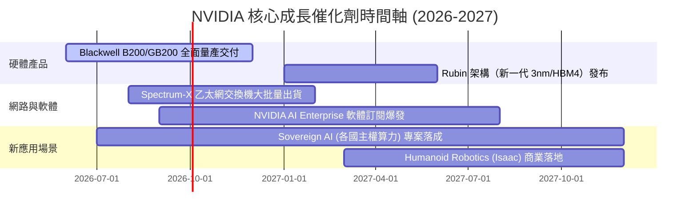

### 9.2 TAM 市場規模分析

```
╔══════════════════════════════════════════════════════════════════╗
║              NVIDIA 目標可尋址市場 (TAM) 預估                    ║
╠══════════════════════════════════════════════════════════════════╣
║  Data Center 算力晶片 (2030E TAM):  $500B  ████████████████████  ║
║  Datacenter 網路系統 (2030E TAM):   $100B  ████░░░░░░░░░░░░░░░░  ║
║  AI Enterprise 軟體/Omniverse TAM:  $150B  ██████░░░░░░░░░░░░░░  ║
║  Automotive & Autonomous Driving:   $50B   ██░░░░░░░░░░░░░░░░░░  ║
║  ──────────────────────────────────────────────────────────────  ║
║  全球加速計算與 AI 總 TAM (2030E):  ~$800B +                    ║
║  當前 NVDA 年化營收 (~$250B) 滲透率僅約 31%，長期成長空間巨大   ║
╚══════════════════════════════════════════════════════════════════╝
```

### 9.3 成長驅動力結構圖

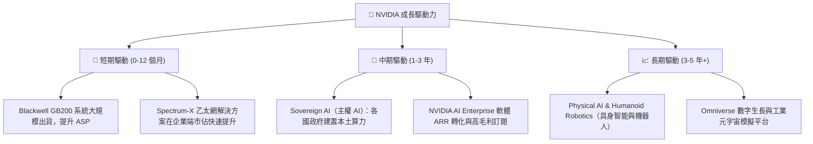

---

## 10. 風險矩陣

### 10.1 風險評分矩陣

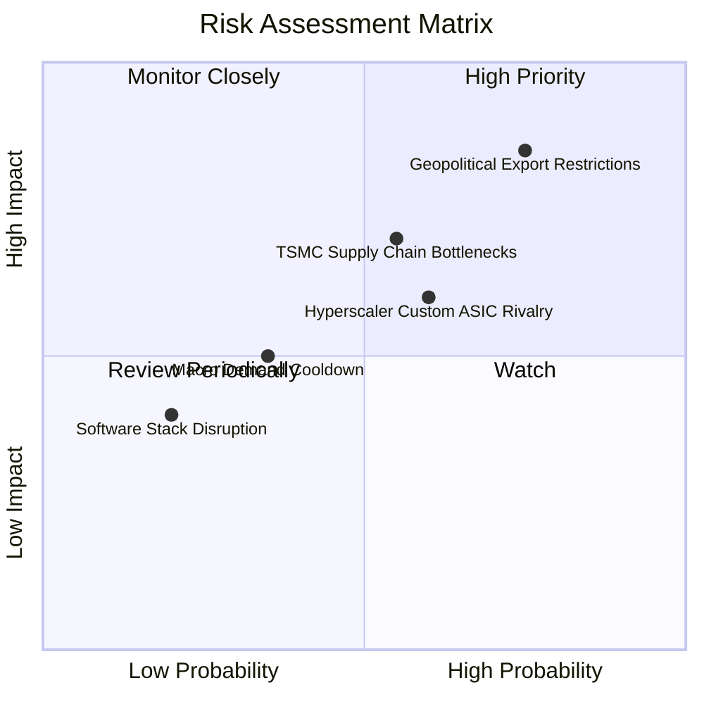

### 10.2 風險清單詳細分析

| # | 風險項目 | 發生機率 | 財務衝擊 | 風險評分 | 緩解措施與觀察指標 |
|---|----------|----------|----------|----------|--------------------|
| 1 | 🔴 **地緣政治與出口管制擴大** | 高 (75%) | 高 (-10%至15%營收) | 🔴 **8.2/10** | 開發合規替代晶片（如 H20/B20），轉向中東、東南亞及歐洲主權 AI 市場補位。 |
| 2 | 🟡 **台積電 CoWoS 產能瓶頸** | 中 (55%) | 中 (-5%至8%交付) | 🟡 **6.5/10** | 認證 Intel/Amkor 等後段封裝夥伴，與 TSMC 簽署多年產能包產協議。 |
| 3 | 🟡 **CSP 自研 ASIC 分流** | 中 (60%) | 中 (-5%毛利率壓利) | 🟡 **6.0/10** | 加速 GPU 架構叠代（從 2 年縮短至 1 年），保持 3-5 倍效能領先壁壘。 |
| 4 | 🟢 **總體經濟放緩與 AI 投資疲軟**| 低 (35%) | 中 (-10%資本支出) | 🟢 **4.2/10** | NVDA 擁有 $80.57B 強大現金儲備，具備極佳抗週期能力。 |

---

## 11. 投資建議

### 11.1 最終綜合評級雷達圖

```
╔══════════════════════════════════════════════════════════════╗
║                NVIDIA 綜合評估雷達圖 (1-10分)                ║
╠══════════════════════════════════════════════════════════════╣
║ 獲利能力 (Profitability):  9.8 ▓▓▓▓▓▓▓▓▓▓▓▓▓▓▓▓▓▓▓█  🏆      ║
║ 護城河深度 (Moat):         9.8 ▓▓▓▓▓▓▓▓▓▓▓▓▓▓▓▓▓▓▓█  🏆      ║
║ 成長動能 (Growth):         9.5 ▓▓▓▓▓▓▓▓▓▓▓▓▓▓▓▓▓▓▓░  🟢      ║
║ 財務健康 (Balance Sheet):  9.5 ▓▓▓▓▓▓▓▓▓▓▓▓▓▓▓▓▓▓▓░  🟢      ║
║ 管理層執行 (Management):   9.5 ▓▓▓▓▓▓▓▓▓▓▓▓▓▓▓▓▓▓▓░  🟢      ║
║ 估值吸引力 (Valuation):    7.8 ▓▓▓▓▓▓▓▓▓▓▓▓▓▓▓5░░░░  🟢      ║
╠══════════════════════════════════════════════════════════════╣
║ 綜合總分 (Composite Score): 9.2 ▓▓▓▓▓▓▓▓▓▓▓▓▓▓▓▓▓▓4░ 🏆 強力買入║
╚══════════════════════════════════════════════════════════════╝
```

### 11.2 目標價與隱含報酬率

| 情境 | 機率權重 | 12個月目標價 | 相對當前股價 $224.09 報酬率 | 核心假設依據 |
|------|----------|--------------|------------------------------|--------------|
| 🔴 **悲觀情境** | 20% | **$195.00** | -13.0% | CSP 資本支出放緩，出口管制升級 |
| 🟡 **基準情境** | 60% | **$305.00** | **+36.1%** | Blackwell 順利交付，FY27 營收 +22% |
| 🟢 **樂觀情境** | 20% | **$410.00** | **+83.0%** | 主權 AI 與企業級 AI 全面爆發 |
| **加權目標價** | **100%** | **$298.24** | **+33.1%** | 三角驗證加權合理值 **$288.50** |

### 11.3 買入時機與觸發因素

```
╔══════════════════════════════════════════════════════════════════╗
║                  ✅ 買入觸發因素 Checklist                      ║
╠══════════════════════════════════════════════════════════════════╣
║  立即分批買入條件（目前已滿足）：                                ║
║  ✅ Forward P/E 低於 20x（當前 17.38x）                          ║
║  ✅ 安全邊際 MOS > 20%（當前 +22.3%）                            ║
║  ✅ Blackwell 晶片量產無重大技術瑕疵                             ║
║                                                                  ║
║  加碼觸發條件（出現以下任一）：                                  ║
║  ☐ 股價因短期市場情緒拉回至 $200.00 - $210.00 區間              ║
║  ☐ 季度財報數據顯示 Networking 業務單季營收突破 $12B             ║
║                                                                  ║
║  停損/減碼觸發條件（出現以下任一）：                             ║
║  ☐ 季度毛利率跌破 65% 且無回升跡象                               ║
║  ☐ 美國政府實施全面性晶片出口禁令（含全球中立地區）              ║
╚══════════════════════════════════════════════════════════════════╝
```

### 11.4 投資人適配度分析

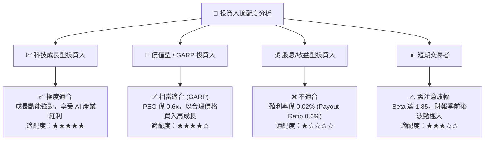

### 11.5 每季財報監控清單（Quarterly Watch List）

| 監控指標 | 最新季度實際值 | 正常/安全區間 | 警訊 / 減碼門檻 | 說明與意涵 |
|----------|----------------|---------------|-----------------|------------|
| **Data Center 單季營收** | $71.50B+ (Q1 27) | YoY > +30% | YoY < +15% | AI 算力需求最核心指標 |
| **整體毛利率 (Gross Margin)** | 74.1% | 70.0% – 75.0% | < 65.0% | 晶片溢價與定價能力體現 |
| **營業利潤率 (Op Margin)** | 65.6% | > 58.0% | < 50.0% | 營運槓桿與費用控管能力 |
| **Networking 業務營收** | ~$10.0B+/季 | YoY > +40% | YoY < +10% | Spectrum-X/InfiniBand 滲透 |
| **存貨週轉天數 (DIO)** | ~95 天 | 80 – 110 天 | > 140 天 | 避免供應鏈過熱或庫存呆滯 |

### 11.6 反面論證：什麼會證明論點錯誤（Disconfirming Evidence）

```
╔══════════════════════════════════════════════════════════════════╗
║              ⚠️ 論點失效條件（Disconfirming Evidence）           ║
╠══════════════════════════════════════════════════════════════════╣
║  本投資論點在下列情況發生時應重新檢視或退場觀望：                ║
║                                                                  ║
║  ☐ Data Center 業務營收年成長率連續兩季跌破 +15%                ║
║  ☐ 全球四大 CSP（MSFT, AMZN, GOOGL, META）AI Capex 合計轉為負成長║
║  ☐ 毛利率降至 < 65.0%，顯示定價權受到 ASIC 或 AMD 嚴重侵蝕       ║
║  ☐ ROIC 跌破 30%（顯示資本效率大幅惡化）                          ║
║  ☐ CUDA 生態系出現重大轉移（如 PyTorch/Triton 完全解綁 CUDA）   ║
╚══════════════════════════════════════════════════════════════════╝
```

---

> **免責聲明**：本報告由機構級 AI 研究分析師模型自動生成，基於已公開之財務數據與模型推理，僅供學術與投資研究參考，不構成任何買賣股票之操作建議。市場有風險，投資需謹慎。