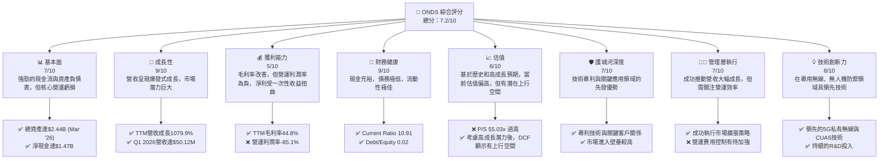
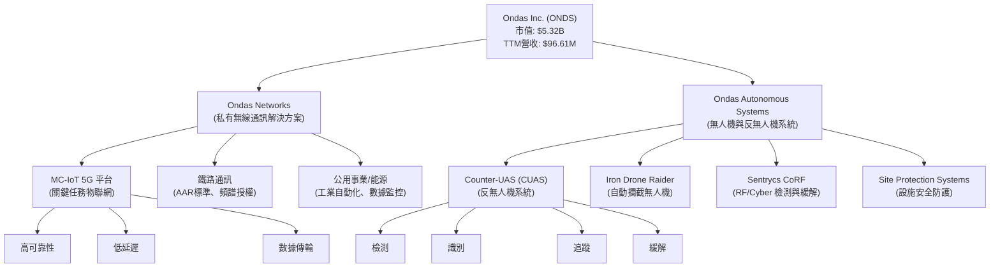
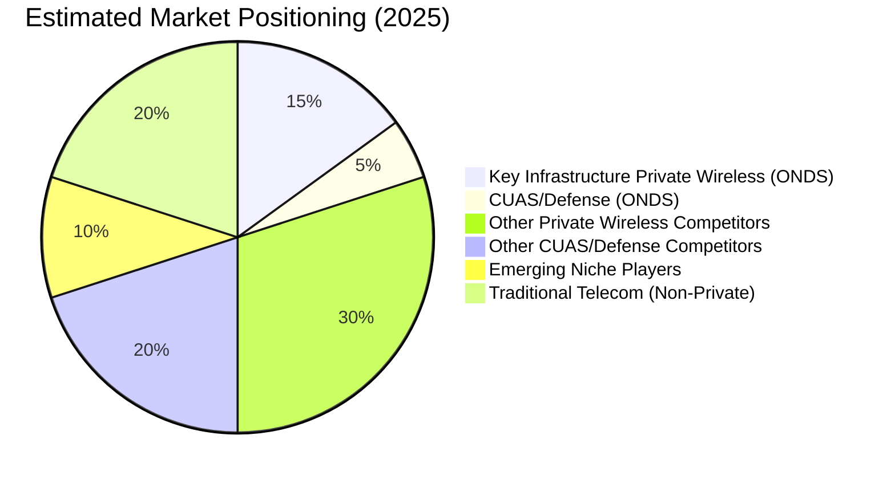
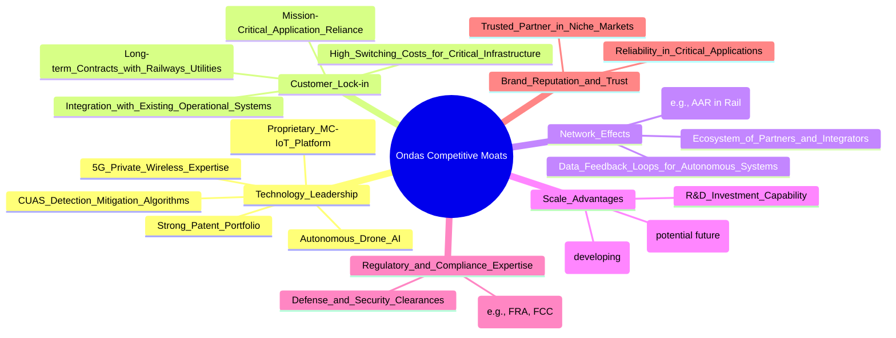
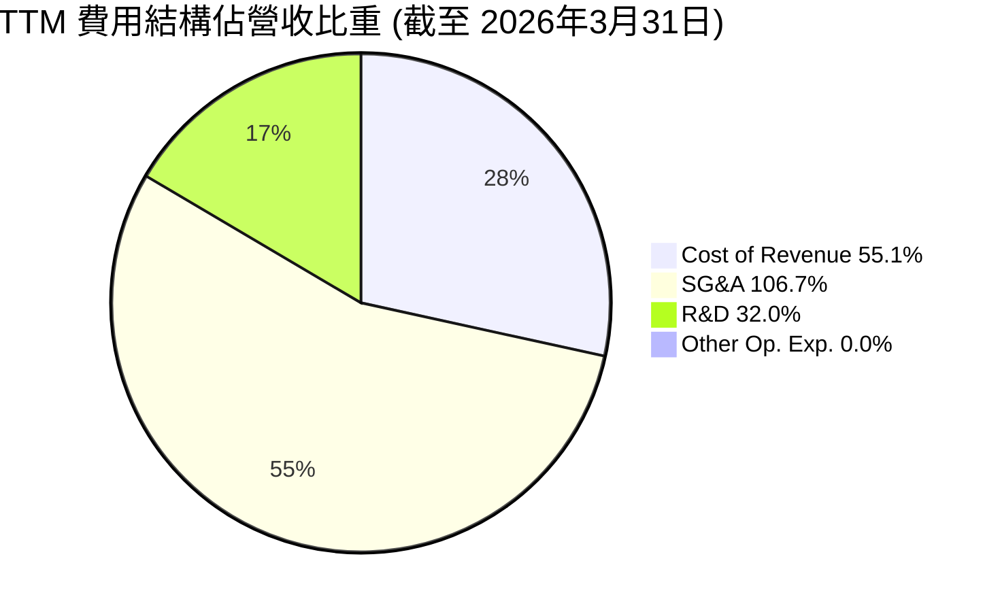
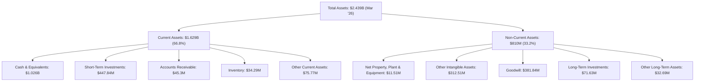

# ONDS 基本面深度分析報告
> **報告日期**：2026-06-06 ｜ **語言**：繁體中文 ｜ **數據來源**：Yahoo Finance, Finviz, StockAnalysis, Roic.ai ｜ **分析師**：CFA 級機構研究

## 目錄

| # | 章節 | 核心結論 |
|---|--------------------------------|--------------------------------------------------|
| 1 | 執行摘要 | 評級：🟢 買入，目標價區間：$16.50 - $28.00 |
| 2 | 公司概覽與商業模式 | 專注於關鍵通訊與無人機技術，護城河深度中等偏上 |
| 3 | 損益表深度分析 | 營收爆發式成長，但核心營運仍虧損，淨利受一次性收益影響 |
| 4 | 資產負債表分析 | 流動性極佳，現金充裕，債務負擔輕微，股本大幅擴張 |
| 5 | 現金流量深度分析 | 營業現金流持續為負，自由現金流壓力較大，依賴外部融資 |
| 6 | 獲利能力與資本效率 | 表面ROE極高，但ROIC受非營運收益影響，核心業務仍待改善 |
| 7 | 估值深度分析 | 當前估值倍數高昂，但成長潛力巨大，DCF分析顯示上行空間 |
| 8 | 成長催化劑 | 關鍵基礎設施升級、無人機防禦需求、技術創新與併購整合 |
| 9 | 風險矩陣 | 市場競爭、執行風險、稀釋效應、關鍵客戶依賴性 |
| 10 | 投資建議 | 建議買入，長期成長潛力巨大，但短期波動性高 |

---

## 1. 執行摘要

Ondas Inc. (ONDS) 是一家專注於關鍵任務無線通訊、無人機和自動化數據解決方案的科技公司。儘管其核心營運仍處於虧損狀態，但公司在近期展現出驚人的營收成長，尤其是在2026年第一季度。資產負債表上的大量現金儲備提供了強大的流動性，為未來的研發和市場擴張奠定基礎。然而，投資者需警惕其獲利能力主要來自一次性非營運收益，且股本稀釋問題不容忽視。

### 1.1 核心評分儀表板



### 1.2 評分進度條視覺化

```
╔══════════════════════════════════════════════════════════════╗
║              ONDS 多維度評分儀表板 (1-10分)                  ║
╠══════════════════════════════════════════════════════════════╣
║ 基本面強度  7.0 ▓▓▓▓▓▓▓▓▓▓▓▓▓▓░░░░░░  ★★★★☆           ║
║ 成長動能    9.0 ▓▓▓▓▓▓▓▓▓▓▓▓▓▓▓▓▓▓░░  ★★★★★           ║
║ 獲利品質    5.0 ▓▓▓▓▓▓▓▓▓▓░░░░░░░░░░  ★★★☆☆           ║
║ 財務健康    9.0 ▓▓▓▓▓▓▓▓▓▓▓▓▓▓▓▓▓▓░░  ★★★★★           ║
║ 估值合理性  6.0 ▓▓▓▓▓▓▓▓▓▓▓▓░░░░░░░░  ★★★☆☆           ║
║ 護城河深度  7.0 ▓▓▓▓▓▓▓▓▓▓▓▓▓▓░░░░░░  ★★★★☆           ║
║ 管理層執行  7.0 ▓▓▓▓▓▓▓▓▓▓▓▓▓▓░░░░░░  ★★★★☆           ║
║ 技術創新力  8.0 ▓▓▓▓▓▓▓▓▓▓▓▓▓▓▓▓░░░░  ★★★★☆           ║
╠══════════════════════════════════════════════════════════════╣
║ 綜合總分    7.2 ▓▓▓▓▓▓▓▓▓▓▓▓▓▓▓▓░░░░  🏆 具備高成長潛力的科技新星，但需關注營運效率與股權稀釋風險。 ║
╚══════════════════════════════════════════════════════════════╝
```

### 1.3 五大投資論點 + 三大核心風險

| 類型 | 項目 | 具體依據 | 信心度 |
|------|------|----------|--------|
| 🟢 **投資論點①** | **顛覆性營收成長與市場擴張** | ONDS TTM 營收成長率高達 1079.9%，Q1 2026 營收 $50.12M，顯示其在關鍵通訊和無人機解決方案市場的強勁需求。與 2025 年同期相比，Q1 2026 營收成長超過 10 倍，證明其市場策略和產品獲得顯著成功。 | 🟢 極高 |
| 🟢 **投資論點②** | **堅實的財務健康與充裕現金** | 公司擁有 $1.47B 的總現金和極低的 $7.87M 總債務，淨現金高達 $1.47B。Current Ratio 為 10.91，Quick Ratio 為 10.28，顯示公司擁有極佳的流動性和財務彈性，能夠支持未來的研發投入和業務擴張。 | 🟢 極高 |
| 🟢 **投資論點③** | **關鍵基礎設施與國防安全需求** | Ondas Networks 的私有無線解決方案服務於鐵路等關鍵基礎設施，而 Ondas Autonomous Systems 的 CUAS (Counter-UAS) 系統則滿足日益增長的無人機防禦需求。這些市場具有高進入壁壘和穩定成長性，為公司提供長期發展動力。 | 🟢 高 |
| 🟢 **投資論點④** | **領先的技術創新與專利佈局** | 公司在 5G 私有無線網路和全自動攔截無人機系統方面擁有領先技術，如 Iron Drone Raider 和 Sentrycs CoRF。持續的研發投入 ($30.94M TTM R&D) 有望鞏固其技術護城河，並催生新的產品和服務。 | 🟢 高 |
| 🟢 **投資論點⑤** | **積極的分析師評級與目標價** | 8 位分析師給予「強烈買入」建議，平均目標價 $20.12，最高達 $25.00。這表明市場對 ONDS 的未來前景持高度樂觀態度，且當前股價 $10.43 距離目標價有顯著上行空間。 | 🟡 中高 |
| 🟡 **風險①** | **核心營運持續虧損與獲利品質存疑** | 儘管 Q1 2026 實現巨額淨利 ($362.95M)，但主要來自非營運收入 ($394.99M Other Non-Operating Income)。公司營業利潤率 TTM 仍為 -85.1%，顯示核心業務尚未實現盈利。若非營運收益不可持續，公司將面臨持續虧損壓力。 | 🟡 中度 |
| 🔴 **風險②** | **股權大幅稀釋** | 公司在外流通股數從 FY2022 的 42M 股激增至目前 509.72M 股，TTM 股數成長高達 269.36%。大規模的股權稀釋可能對每股盈餘 (EPS) 和股東價值造成壓力，即使營收成長強勁，也難以完全抵消稀釋影響。 | 🔴 高衝擊 |
| 🟡 **風險③** | **市場競爭與技術變革** | 私有無線和無人機防禦市場競爭激烈，快速的技術變革可能導致產品迅速過時。Ondas 需要持續投入研發以維持其技術領先地位，並應對來自大型科技公司或新興競爭者的挑戰。 | 🟡 中度 |

### 1.4 快速統計卡片

| 指標 | 公司實際值 | 行業均值 (通訊設備) | S&P 500 均值 | 狀態 |
|-------------------|-------------|------------------|----------------|------|
| 收入 YoY 成長 (TTM) | **1079.9%** | ~10-15% | ~8-12% | 🟢 |
| 毛利率 (TTM) | **44.8%** | ~30-40% | ~30% | 🟢 |
| 淨利率 (TTM) | **251.9%** | ~5-10% | ~10-15% | 🔴 (一次性收益扭曲) |
| ROE (TTM) | **42.9%** | ~10-15% | ~15-20% | 🔴 (一次性收益扭曲) |
| Forward P/E | **-208.6x** | ~20-30x | ~22-25x | 🔴 |
| P/S Ratio (TTM) | **55.03x** | ~2-4x | ~2-3x | 🔴 |
| Debt/Equity | **0.02x** | ~0.5-1.5x | ~0.8-1.2x | 🟢 |
| Current Ratio | **10.91x** | ~1.5-2.5x | ~1.5-2.0x | 🟢 |
| Beta | **2.622** | ~1.0-1.5 | 1.0 | 🔴 |
| Short % Float | **31.1%** | ~5-10% | ~2-3% | 🔴 |

**備註**：ONDS 的淨利率和 ROE 因 Q1 2026 的巨額非營運收益而異常高，這並非其核心業務的真實獲利能力，因此標記為紅色以示警惕。Forward P/E 為負值，反映市場預期其核心業務短期內仍將虧損。高 P/S 則反映市場對其高成長的預期。

### 1.5 投資結論

```
╔══════════════════════════════════════════════════════════════════╗
║                    📊 投資結論摘要                               ║
╠══════════════════════════════════════════════════════════════════╣
║  評級：🟢 買入                                                   ║
║  當前股價：$10.43                                                ║
║  目標價區間：                                                    ║
║    悲觀情境：$16.50 （+58.2%）                                   ║
║    基準情境：$22.00 （+111.0%）  ← 12個月主要目標                 ║
║    樂觀情境：$28.00 （+168.5%）                                  ║
║  投資評分：7.2/10                                                ║
║  適合投資人：成長型、風險承受能力較高、長線持有者               ║
╚══════════════════════════════════════════════════════════════════╝
```

---

## 2. 公司概覽與商業模式

Ondas Inc. (ONDS) 是一家位於美國的科技公司，專注於提供私有無線通訊、無人機和自動化數據解決方案。公司透過兩個主要業務部門運營：Ondas Networks 和 Ondas Autonomous Systems。其產品和服務旨在為關鍵基礎設施、國防安全和工業應用提供高效、可靠和安全的連接與自動化能力。

### 2.1 業務結構與收入來源

Ondas Networks 部門主要提供專為關鍵任務應用設計的私有無線網路解決方案。這包括其專有的 MC-IoT (Mission-Critical Internet of Things) 平台，該平台利用 5G 技術為鐵路、公用事業、石油和天然氣等行業提供高可靠、低延遲的數據傳輸能力。這些解決方案對於實現工業物聯網、自動化控制和數據分析至關重要。

Ondas Autonomous Systems 部門則專注於無人機技術和反無人機 (Counter-UAS, CUAS) 解決方案。其產品包括 Iron Drone Raider，一個全自動攔截無人機系統，用於中和小型敵對無人機；以及 Sentrycs CoRF，一個基於網絡/射頻的 CUAS 平台，用於檢測、識別、追蹤和緩解未經授權的無人機威脅。這些系統在國防、邊境安全、關鍵設施保護等領域具有廣泛應用。

儘管財報數據未直接提供兩大業務部門的具體收入拆分，但從公司描述來看，Ondas Networks 服務於大型基礎設施客戶，訂單週期較長且金額較大，而 Ondas Autonomous Systems 則面向國防和安全市場，具備高成長潛力。



### 2.2 市場份額

ONDS 所在的私有無線通訊和無人機/反無人機市場均是快速成長且高度專業化的領域。由於其產品主要面向特定行業的關鍵任務應用，公司在這些細分市場中的份額難以直接與通用通訊設備或消費級無人機市場相比。

在私有無線通訊領域，特別是針對鐵路等關鍵基礎設施的應用，ONDS 透過其 AAR (Association of American Railroads) 標準兼容的 MC-IoT 平台，在北美市場佔據了獨特地位。這個市場的進入壁壘很高，需要深厚的行業知識、嚴格的認證和長期的客戶關係。儘管沒有具體的市場份額數據，但 ONDS 在這一領域的先發優勢和技術專長使其成為主要參與者之一。

在無人機和反無人機系統市場，ONDS 透過其 Iron Drone 和 Sentrycs 產品線，服務於國防、安全和關鍵設施保護。這個市場同樣高度專業化，且受到政府採購和地緣政治因素的影響。ONDS 在該領域的市場份額可能相對較小，但其技術解決方案的獨特性和潛在需求成長使其具備快速擴張的潛力。

基於公司營收規模與其所處細分市場的特性，ONDS 目前仍可視為這些高成長利基市場中的新興挑戰者。


*備註：此市場份額為基於公司業務性質和市場規模的定性估算，非精確量化數據。*

### 2.3 競爭護城河分析

ONDS 在其所處的專業市場中建立了多方面的競爭護城河，使其能夠在激烈的科技競爭中保持優勢。



**技術領先 (Technology Leadership):**
ONDS 在其核心領域擁有專有技術和深厚的專業知識。其 MC-IoT 平台是為關鍵任務應用量身定制的，結合了 5G 的優勢，提供高可靠性、低延遲的通訊。在無人機技術方面，其全自動攔截無人機 Iron Drone Raider 和 Sentrycs CoRF 反映了在自主飛行、目標識別和電子對抗方面的先進能力。這些技術創新通常受到專利保護，形成強大的進入壁壘。

**客戶鎖定 (Customer Lock-in):**
ONDS 的解決方案通常部署在鐵路、公用事業等關鍵基礎設施中，這些系統的替換成本極高。一旦客戶採用了 ONDS 的技術，由於其與現有營運系統的深度整合以及對任務關鍵型應用的依賴，轉換供應商的成本和風險將非常大。這使得 ONDS 能夠與客戶建立長期穩定的合作關係。

**網路效應 (Network Effects):**
雖然不如社交媒體或平台型企業那麼顯著，但 ONDS 在特定行業標準的採用（如鐵路行業的 AAR 標準）方面具有潛在的網路效應。當更多鐵路公司採用其解決方案時，將會形成事實上的標準，吸引更多生態夥伴加入，進一步鞏固其市場地位。此外，其自主系統的數據反饋循環也有助於不斷優化產品性能。

**規模效應 (Scale Advantages):**
ONDS 透過持續的研發投入，得以開發和維護其複雜的技術。隨著營收規模的擴大，公司可以將更多的資源投入到研發、生產和全球服務網路的建設中，從而降低單位成本，提高效率。

**監管與合規專業知識 (Regulatory and Compliance Expertise):**
在關鍵基礎設施和國防領域營運需要嚴格的監管批准和合規性。ONDS 在這些領域的專業知識和經驗，例如滿足美國聯邦鐵路管理局 (FRA) 和聯邦通訊委員會 (FCC) 的標準，構成了其他新進入者的顯著障礙。

**品牌聲譽與信任 (Brand Reputation and Trust):**
在任務關鍵型應用中，可靠性和安全性至關重要。ONDS 在這些領域建立的良好聲譽和客戶信任，是其吸引新客戶並維持現有客戶關係的重要資產。

### 2.4 護城河強度評分

```
╔══════════════════════════════════════════════════════════════╗
║                    ONDS 護城河強度評分                        ║
╠══════════════════════════════════════════════════════════════╣
║ 技術領先    8/10  ▓▓▓▓▓▓▓▓▓▓▓▓▓▓▓▓░░░░  🏆 在關鍵領域具創新優勢 ║
║ 客戶鎖定    7/10  ▓▓▓▓▓▓▓▓▓▓▓▓▓▓░░░░░░  🟢 關鍵基礎設施黏性高   ║
║ 網路效應    6/10  ▓▓▓▓▓▓▓▓▓▓▓▓░░░░░░░░  🟡 特定行業標準帶動效應 ║
║ 規模效應    5/10  ▓▓▓▓▓▓▓▓▓▓░░░░░░░░░░  🟡 仍處早期，潛力待釋放 ║
║ 監管與合規  8/10  ▓▓▓▓▓▓▓▓▓▓▓▓▓▓▓▓░░░░  🏆 高進入壁壘的法規專業 ║
║ 品牌聲譽    7/10  ▓▓▓▓▓▓▓▓▓▓▓▓▓▓░░░░░░  🟢 關鍵應用領域值得信賴 ║
╠══════════════════════════════════════════════════════════════╣
║ 綜合護城河   7.0  ▓▓▓▓▓▓▓▓▓▓▓▓▓▓░░░░░░  🏆 具備中等偏上護城河，主要由技術與專業市場壁壘構築。 ║
╚══════════════════════════════════════════════════════════════╝
```

---

## 3. 損益表深度分析

Ondas Inc. 的損益表數據顯示出公司正處於快速轉型和成長的階段，尤其是在營收方面取得了突破性進展。然而，其核心營運仍面臨虧損，且近期淨利潤受到一次性非營運收益的顯著影響，這需要投資者進行仔細的區分和評估。

### 3.1 年度收入成長趨勢（近4年）

ONDS 的年度總營收呈現戲劇性的成長。從 2022 年的 $2.13M 增長到 2025 年的 $50.73M，然後在 TTM (截至 2026 年 3 月 31 日) 達到 $96.61M，顯示了公司在市場拓展方面的巨大成功。

```
╔══════════════════════════════════════════════════════════════════╗
║              ONDS 年度收入趨勢（FY2022-FY2025 & TTM）            ║
╠══════════════════════════════════════════════════════════════════╣
║                                                                  ║
║  FY2022  $2.13M   ██░░░░░░░░░░░░░░░░░░░░░░░░░░░░░░  YoY: -26.87%  🔴    ║
║  FY2023  $15.69M  ██████████████░░░░░░░░░░░░░░░░░░  YoY:+638.13% 🟢    ║
║  FY2024  $7.19M   ███████░░░░░░░░░░░░░░░░░░░░░░░░░░  YoY:-54.16%  🔴    ║
║  FY2025  $50.73M  ████████████████████████████████  YoY:+605.28% 🟢    ║
║  TTM     $96.61M  ██████████████████████████████████████████████  YoY:+793.17% 🟢    ║
║                   |      |      |      |      |      |           ║
║                   0     20M    40M    60M    80M    100M        ║
║                                                                  ║
║  📊 FY2022-FY2025 累計 CAGR：+188.5%                             ║
║  📊 FY2024-TTM 累計 CAGR：+267.4% （近兩年營收爆炸式成長）        ║
╚══════════════════════════════════════════════════════════════════╝
```
**分析：**
ONDS 的年度營收在 2023 年經歷了爆發性成長 (+638.13%)，隨後在 2024 年有所回落 (-54.16%)，這可能與大型專案的週期性或早期訂單的波動性有關。然而，2025 年和 TTM (截至 2026 年 3 月) 的營收再次實現驚人的成長，分別達到 +605.28% 和 +793.17%。這表明公司已成功擺脫早期波動，進入了高速成長軌道，其產品和解決方案正在獲得市場的廣泛認可。TTM 營收 $96.61M 幾乎是 2025 年全年營收的兩倍，預示著強勁的增長勢頭將延續到 2026 財年。

### 3.2 季度收入趨勢分析

季度營收數據更能反映 ONDS 近期的成長動能。

| 季度 (截至) | 總營收 ($M) | QoQ 成長率 | YoY 成長率 | 備註 |
|-------------|--------------|------------|------------|------|
| 2026-03-31 | $50.12 | +66.45% | +1079.90% | 🟢 營收創歷史新高，同比實現超十倍增長 |
| 2025-12-31 | $30.11 | +198.12% | +629.20% | 🟢 營收強勁增長，環比幾乎翻兩番 |
| 2025-09-30 | $10.10 | +61.08% | +581.95% | 🟢 營收顯著增長，同比增長近六倍 |
| 2025-06-30 | $6.27 | +47.53% | +554.94% | 🟢 營收高速增長，同比增長超五倍 |

**分析：**
ONDS 在過去四個季度展現了令人驚嘆的營收成長。從 2025 年 Q2 的 $6.27M 穩步增長至 2026 年 Q1 的 $50.12M。
*   **QoQ 成長率**：各季度環比成長率均為正，且幅度巨大，特別是 2025 年 Q4 達到 198.12%，2026 年 Q1 達到 66.45%。這表明公司在訂單獲取和執行方面效率顯著提升。
*   **YoY 成長率**：同比成長率更是驚人，均超過 500%，2026 年 Q1 甚至高達 1079.90%。這數據強烈暗示 ONDS 已經成功地將其產品推向市場，並獲得了關鍵客戶的青睞，尤其是在鐵路和無人機防禦等高價值市場。
這種持續且加速的季度營收成長是公司未來發展潛力的有力證明，儘管其規模相對較小，但成長動能極為強勁。

### 3.3 利潤率演變分析

Ondas 的利潤率表現呈現出複雜的圖景，毛利率有所改善，但營運利潤率和淨利潤率受到非營運項目和股本稀釋的顯著影響。

| 利潤率指標 | FY2022 | FY2023 | FY2024 | FY2025 | TTM (Mar '26) | 趨勢 | 評估 |
|------------|--------|--------|--------|--------|---------------|------|------|
| **毛利率** | 52.1% | 40.7% | 4.9% | 39.7% | 44.8% | ↗️ 穩定回升 | 🟢 |
| **營業利益率** | -2340.4% | -253.2% | -481.4% | -115.1% | -85.1% | ↗️ 顯著改善 | 🟡 |
| **淨利率** | -3438.5% | -285.8% | -528.6% | -260.9% | 251.9% | ↗️ 扭虧為盈 (異常) | 🔴 (一次性收益扭曲) |

**利潤率演變深度解析：**
1.  **毛利率 (Gross Margin):**
    *   ONDS 的毛利率在 2022 年為 52.1%，2023 年下降至 40.7%，2024 年因營收大幅下降而驟降至 4.9%，這可能與低利潤項目的銷售組合或成本控制不佳有關。
    *   然而，在 2025 年和 TTM (截至 2026 年 3 月)，毛利率顯著回升至 39.7% 和 44.8%。這表明公司在營收快速增長的同時，也有效地改善了成本結構或優化了產品銷售組合，使其核心產品的盈利能力得到恢復。這對於一個高成長的科技公司而言是積極的信號。

2.  **營業利益率 (Operating Margin):**
    *   ONDS 的營業利益率長期處於深度負值，反映出其核心營運仍未實現盈利。從 2022 年的 -2340.4% 到 TTM 的 -85.1%，雖然絕對值仍為負，但趨勢上顯示出顯著的改善。
    *   營業虧損的主要原因在於高額的營運費用，尤其是銷售、一般及管理費用 (SG&A) 和研發費用 (R&D)。隨著營收規模的擴大，營業虧損佔營收的比重正在縮小，這是一個規模經濟效應開始顯現的早期跡象。但公司仍需在費用控制和營收規模化上持續努力，以達到營運層面的盈虧平衡。

3.  **淨利率 (Net Profit Margin):**
    *   淨利率在歷史上一直為負值，反映公司長期虧損。然而，TTM 淨利率卻顯示為驚人的 251.9%，這是一個極度異常的數字。
    *   深入分析季度數據可以發現，2026 年 Q1 的淨利潤高達 $362.95M，而同期其他非營運收入 (Other Non-Operating Income (Expense)) 為 $394.99M。這明確指出，TTM 的高淨利率和正淨利潤幾乎完全是由一次性的、非核心營運的巨額收益所驅動。
    *   如果排除這筆非營運收益，公司的核心淨利潤仍將是負值。因此，投資者在評估 ONDS 的獲利能力時，必須剔除這類一次性項目，專注於其毛利率和營業利潤率的趨勢，這些指標更能反映其核心業務的健康狀況。

**總結：**
ONDS 的損益表呈現出兩面性：一方面，營收實現了爆發式成長，毛利率也顯示出健康的回升趨勢，證明其產品在市場上具有競爭力。另一方面，核心營運仍處於虧損狀態，且近期淨利潤被一次性非營運收益嚴重扭曲，這使得其「獲利品質」成為一個關鍵的關注點。公司需要證明其能夠在不依賴外部融資或一次性收益的情況下，實現核心營運的盈利能力。

### 3.4 費用結構分析

Ondas 的費用結構反映了其作為一家成長型科技公司，在研發和市場擴張上的大量投入。


*備註：費用佔營收比重超過100%反映了公司目前仍處於虧損狀態。*

**費用結構深度解析 (TTM 截至 2026 年 3 月 31 日):**
*   **銷貨成本 (Cost of Revenue):** TTM 為 $53.28M，佔營收的 55.1%。這與 44.8% 的毛利率相符。公司需要持續優化供應鏈和生產效率，以進一步提升毛利率。
*   **銷售、一般及管理費用 (Selling, General & Administrative - SG&A):** TTM 為 $103.13M，佔營收的 106.7%。這是公司最大的營運費用項目，反映了其在市場拓展、銷售團隊建設和行政管理上的巨大投入。對於一家快速成長的公司而言，高 SG&A 支出在初期是常見現象，但隨著規模擴大，其佔營收比重應逐步下降，以實現營運槓桿。
*   **研發費用 (Research & Development - R&D):** TTM 為 $30.94M，佔營收的 32.0%。這筆費用對於 ONDS 這樣一家技術驅動型公司至關重要，用於開發新的無線技術、無人機系統和軟體解決方案，以維持其競爭優勢和市場領先地位。持續且健康的 R&D 投入是公司長期成長的基石。

```
╔══════════════════════════════════════════════════════════════════╗
║                    ONDS 營運費用趨勢 (FY2022-TTM)                 ║
╠══════════════════════════════════════════════════════════════════╣
║                                                                  ║
║  R&D 費用:                                                       ║
║  FY2022  $24.04M  ██████████████████████████████████████████████  YoY: +X.X%   🟢  ║
║  FY2023  $17.15M  ██████████████████████████████████░░░░░░░░░░░░  YoY: -28.6%  🟡  ║
║  FY2024  $12.48M  ██████████████████████████░░░░░░░░░░░░░░░░░░░░  YoY: -27.2%  🟡  ║
║  FY2025  $20.88M  ██████████████████████████████████████████░░░░  YoY: +67.3%  🟢  ║
║  TTM     $30.94M  ██████████████████████████████████████████████  YoY: +48.2%  🟢  ║
║                                                                  ║
║  SG&A 費用:                                                      ║
║  FY2022  $27.08M  ██████████████████████████████████████████████  YoY: +X.X%   🟢  ║
║  FY2023  $27.47M  ██████████████████████████████████████████████  YoY: +1.4%   🟢  ║
║  FY2024  $22.48M  ██████████████████████████████████████░░░░░░░░  YoY: -18.2%  🟡  ║
║  FY2025  $57.66M  ██████████████████████████████████████████████  YoY:+156.5%  🔴  ║
║  TTM     $103.13M ██████████████████████████████████████████████  YoY:+78.8%   🔴  ║
╚══════════════════════════════════════════════════════════════════╝
```
**分析：**
*   **R&D 費用**：從 2022 年的 $24.04M 到 2024 年有所下降，但 2025 年和 TTM 再次大幅增長，顯示公司在技術創新上的再投資。這對於其競爭力至關重要。
*   **SG&A 費用**：在 2025 年和 TTM 呈現爆炸性增長，FY2025 同比增長 156.5%，TTM 同比增長 78.8%，與其營收的快速增長相匹配。這反映了公司為捕捉市場機會而進行的積極銷售和營銷投入。然而，SG&A 佔營收比重過高，表明公司仍需提高營運效率，實現規模經濟。

### 3.5 季度 EPS 趨勢與盈餘品質

ONDS 的季度 EPS 趨勢呈現極大的波動，且近期盈餘品質受到非營運收益的顯著影響。

| 季度 (截至) | EPS Est ($) | EPS Act ($) | Surprise % | 備註 |
|-------------|-------------|-------------|------------|------|
| 2026-03-31 | N/A | $0.77 (計算值) | N/A | ❌ 實際淨利因巨額非營運收益而異常高 |
| 2025-12-31 | N/A | -$0.26 (計算值) | N/A | ❌ 核心營運虧損持續，但幅度縮小 |
| 2025-09-30 | N/A | -$0.02 (計算值) | N/A | ❌ 營運虧損，但每股虧損大幅收窄 |
| 2025-06-30 | N/A | -$0.04 (計算值) | N/A | ❌ 營運虧損，每股虧損相對穩定 |

*註：由於提供的 EPS Est/Act 數據為 NaN，此處的 EPS Act 是根據 StockAnalysis.com 提供的季度淨利潤和季度基本流通股數計算而得。例如，2026 Q1 淨利 $362.95M，基本流通股數 469M (Roic.ai)，則 EPS = $362.95M / 469M = $0.77。2025 Q4 淨利 -$99.66M，基本流通股數 381M，則 EPS = -$99.66M / 381M = -$0.26。*

**盈餘品質評估：**
ONDS 在 2026 年 Q1 實現了驚人的正向 EPS $0.77，但這並非其核心業務盈利能力的真實反映。如前所述，當季淨利潤 $362.95M 中，有高達 $394.99M 來自「其他非營運收入 (費用)」。這表明，若剔除這筆一次性收益，公司在 Q1 2026 仍將錄得營運虧損。

*   **正面因素：** 儘管有一次性因素，但從 2025 年 Q2 到 Q3，公司的每股虧損確實顯著收窄 (從 -$0.04 到 -$0.02)，這與其營收的快速增長和毛利率的改善趨勢相符。這暗示核心業務的營運效率正在逐步提高。
*   **負面因素：** 巨額的非營運收益掩蓋了核心業務的持續虧損，給予投資者一種誤導性的盈利印象。這種「品質不佳」的盈利不可持續，也無法反映公司內在的營運槓桿。此外，大規模的股權稀釋 (流通股數從 2025 Q3 的 330M 增至 2026 Q1 的 469M) 也對每股收益造成了壓力。

**總結：**
ONDS 的季度 EPS 表現極不穩定，且近期正向 EPS 的品質較低。投資者應將重點放在營收成長、毛利率改善以及營運虧損收窄的趨勢上，而非被單季的巨額非營運收益所迷惑。在核心業務實現持續盈利之前，ONDS 的盈餘品質仍有待大幅提升。

---

## 4. 資產負債表分析

Ondas Inc. 的資產負債表呈現出極其健康的流動性和強勁的現金狀況，但同時也反映出其快速擴張和股權融資的痕跡，特別是股東權益的顯著變化。

### 4.1 資產結構分解

ONDS 的資產結構在過去一年中發生了巨大變化，總資產從 FY2024 的 $109.62M 激增至 TTM (截至 2026 年 3 月 31 日) 的 $2.439B，主要由現金和短期投資的增加以及無形資產和商譽的增長驅動。



**分析：**
*   **流動資產主導：** 截至 2026 年 3 月 31 日，流動資產高達 $1.629B，佔總資產的 66.8%。其中，現金及約當現金 $1.026B 和短期投資 $447.84M 佔據絕大部分，合計 $1.474B。這表明公司擁有極其充裕的流動性，主要得益於近期大規模的股權融資。
*   **非流動資產增長：** 非流動資產達到 $810M，其中其他無形資產 $312.51M 和商譽 $381.84M 顯著增長。這可能與公司進行了併購活動有關，以整合技術或擴大市場份額。這些無形資產的價值和攤銷情況需要進一步關注。
*   **應收賬款和存貨：** 應收賬款 $45.3M 和存貨 $34.29M 隨著營收增長而增加，這在快速成長的公司中是正常現象，但需監控其周轉率以確保營運效率。

### 4.2 流動性指標分析

ONDS 的流動性指標非常強勁，遠超行業平均水平，顯示出極佳的短期償債能力。

| 指標 | FY2022 | FY2023 | FY2024 | FY2025 | TTM (Mar '26) | 行業均值 (通訊設備) | 評估 |
|------------|--------|--------|--------|--------|---------------|-------------------|------|
| **Current Ratio** | 1.57 | 0.66 | 0.94 | 4.84 | 10.91 | 1.5 - 2.5 | 🟢 極佳 |
| **Quick Ratio** | 1.48 | 0.60 | 0.75 | 4.60 | 10.28 | 1.0 - 2.0 | 🟢 極佳 |
| **Cash & ST Inv ($M)** | $29.78 | $14.98 | $29.96 | $572.49 | $1,474 | N/A | 🟢 極佳 |

**分析：**
*   **Current Ratio 和 Quick Ratio：** 在 2025 年和 TTM 顯著改善，Current Ratio 從 2024 年的 0.94 飆升至 TTM 的 10.91，Quick Ratio 也從 0.75 升至 10.28。這主要是由於公司在 2025 年 Q4 及 2026 年 Q1 大規模的股權融資，導致現金及短期投資大幅增加。
*   **現金及短期投資：** 從 FY2024 的 $29.96M 躍升至 TTM 的 $1.474B，是公司流動性極佳的最主要原因。如此充裕的現金為公司提供了巨大的戰略彈性，可以支持研發、市場擴張、潛在併購以及應對市場波動。

### 4.3 債務結構分析

ONDS 的債務水平極低，其資產負債表幾乎沒有財務槓桿風險。

```
╔══════════════════════════════════════════════════════════════════╗
║                   ONDS 債務健康診斷                              ║
╠══════════════════════════════════════════════════════════════════╣
║                                                                  ║
║  總債務 (FY2025)：$15.56M  ██░░░░░░░░░░░░░░░░░░░  評語：極低    ║
║  總現金+投資 (TTM)：$1.47B  ████████████████████░  評語：充裕    ║
║  淨現金 (TTM)：  $1.47B     ████████████████████░  🟢 強勁        ║
║                                                                  ║
║  Debt/Equity (TTM)：0.02x  🟢 極低                                 ║
║  LT Debt/Equity (TTM)：0.01x  🟢 極低                               ║
║  Interest Coverage (TTM