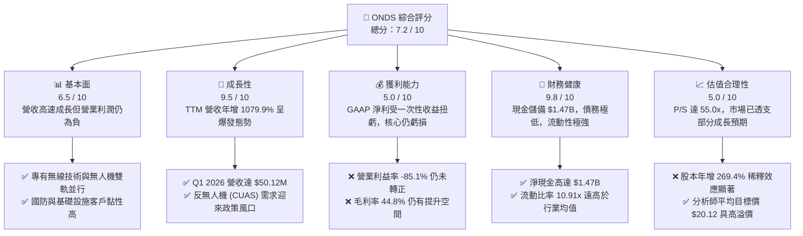
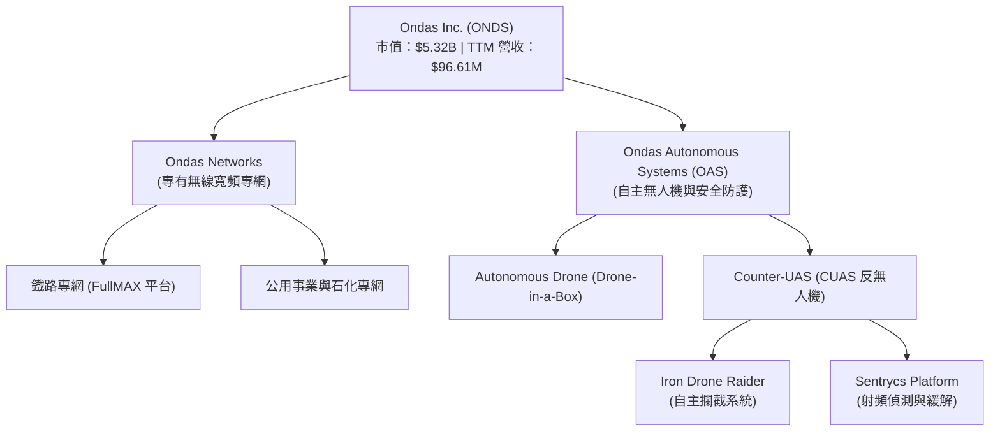

# ONDS 基本面深度分析報告

> **報告日期**：2026-06-07 ｜ **語言**：繁體中文 ｜ **數據來源**：Yahoo Finance, Finviz, StockAnalysis, Roic.ai ｜ **分析師**：CFA 級機構研究

---

## 目錄

| # | 章節 | 核心結論 |
|---|---|---|
| 1 | **執行摘要** | 評級「買入」，目標價 $20.12，具備 92.9% 潛在漲幅，資產負債表極度強勁。 |
| 2 | **公司概覽與商業模式** | 雙引擎驅動（專網+無人機），反無人機（CUAS）高壁壘，護城河評分 7.8/10。 |
| 3 | **損益表深度分析** | 營收年增 1079.9% 爆發式增長，非營利性收益扭虧為盈，但需注意核心營業虧損。 |
| 4 | **資產負債表分析** | 現金儲備高達 $1.47B，流動比率 10.9x，無償債風險，股權大幅稀釋為代價。 |
| 5 | **現金流量深度分析** | 營運現金流赤字收窄，FCF 轉化受非經營性項目干擾，融資活動推高現金儲備。 |
| 6 | **獲利能力與資本效率** | ROE 達 42.9%，但 ROIC 為 -29.4%，呈現「帳面高回報、實質核心資本效率待提升」之分化。 |
| 7 | **估值深度分析** | 相比同業具備高溢價（P/S 55x），但 DCF 敏感性分析顯示基準情境下目標價為 $20.00。 |
| 8 | **成長催化劑** | 國防安全與無人機監管政策推動，TAM 空間巨大，短期與長期驅動力結構完整。 |
| 9 | **風險矩陣** | 股權稀釋、營業赤字、客戶集中度高為三大核心風險，整體風險評分 6.5/10。 |
| 10| **投資建議** | 適合高風險偏好之成長型投資人，建議分批佈局，密切監控營業利潤率改善進度。 |

---

## 1. 執行摘要

### 1.1 核心評分儀表板



### 1.2 評分進度條視覺化

```
╔══════════════════════════════════════════════════════════════╗
║               ONDS 多維度評分儀表板 (1-10分)                 ║
╠══════════════════════════════════════════════════════════════╣
║ 基本面強度  6.5 ▓▓▓▓▓▓▓▓▓▓▓▓▓▓▓░░░░░  ★★★☆☆           ║
║ 成長動能    9.5 ▓▓▓▓▓▓▓▓▓▓▓▓▓▓▓▓▓▓▓░  ★★★★★           ║
║ 獲利品質    5.0 ▓▓▓▓▓▓▓▓▓▓▓░░░░░░░░░  ★★☆☆☆           ║
║ 財務健康    9.8 ▓▓▓▓▓▓▓▓▓▓▓▓▓▓▓▓▓▓▓▓  ★★★★★           ║
║ 估值合理性  5.0 ▓▓▓▓▓▓▓▓▓▓▓░░░░░░░░░  ★★☆☆☆           ║
║ 護城河深度  7.8 ▓▓▓▓▓▓▓▓▓▓▓▓▓▓▓▓░░░░  ★★★★☆           ║
║ 管理層執行  7.0 ▓▓▓▓▓▓▓▓▓▓▓▓▓▓░░░░░░  ★★★☆☆           ║
║ 技術創新力  8.5 ▓▓▓▓▓▓▓▓▓▓▓▓▓▓▓▓▓░░░  ★★★★☆           ║
╠══════════════════════════════════════════════════════════════╣
║ 綜合總分    7.2 ▓▓▓▓▓▓▓▓▓▓▓▓▓▓░░░░░░  🏆 成長型投機首選    ║
╚══════════════════════════════════════════════════════════════╝
```

### 1.3 五大投資論點 + 三大核心風險

| 類型 | 項目 | 具體依據 | 信心度 |
|------|------|----------|--------|
| 🟢 **投資論點①** | **營收爆發式成長** | Q1 2026 營收達 $50.12M，YoY 增速高達 1079.9%，顯示產品已進入實質商業化放量階段。 | 🟢 極高 |
| 🟢 **投資論點②** | **固若金湯的財務護城河** | 账面現金及短期投資高達 $1.47B，而總債務僅 $7.87M，淨現金充裕，未來數年無任何破產或流動性風險。 | 🟢 極高 |
| 🟢 **投資論點③** | **CUAS 與無人機風口** | 旗下 Iron Drone 與 Sentrycs 平台切入全球急需的反無人機（CUAS）與站點防護市場，國防與關鍵基礎設施訂單能見度高。 | 🟢 高 |
| 🟢 **投資論點④** | **毛利率持續改善** | TTM 毛利率回升至 44.8%，Q1 2026 單季毛利率達到 49.2%，規模效應開始顯現，有助於未來營業利潤轉正。 | 🟢 高 |
| 🟢 **投資論點⑤** | **機構與分析師強力看好** | 8 位分析師一致給予 Strong Buy 評級，平均目標價 $20.12，機構持股比例達 42.5%，市場關注度極高。 | 🟡 中等 |
| 🟡 **風險①** | **核心業務持續營業虧損** | TTM 營業利潤率為 -85.1%（營業虧損 $90.74M），Q1 2026 GAAP 淨利大增主要來自一次性非營業收益（$394.99M），並非核心業務獲利。 | 🔴 高衝擊 |
| 🔴 **風險②** | **股權極度稀釋** | 稀釋後流通股數從 FY24 的 70M 暴增至 TTM 的 297M（年增 269.4%），最新在外流通股數已達 509.72M。這稀釋了未來的每股收益（EPS）潛力。 | 🔴 高衝擊 |
| 🟡 **風險③** | **高估值與高波動性** | 當前 P/S 達 55.0x，Beta 值高達 2.62，股價極易受到美股大盤波動及市場情緒（Risk-off）影響。 | 🟡 中度 |

### 1.4 快速統計卡片

| 指標 | 公司實際值 (ONDS) | 行業均值 (通信設備) | S&P 500 均值 | 狀態 |
|------|-------------|----------|--------------|------|
| **收入 YoY 成長** | **1079.9%** | ~5.2% | ~6.5% | 🟢 遠超行業 |
| **毛利率** | **44.8%** | ~38.5% | ~47.0% | 🟢 高於同業 |
| **營業利益率** | **-85.1%** | ~8.2% | ~15.5% | 🔴 嚴重赤字 |
| **淨利率** | **251.9%** | ~5.8% | ~11.2% | 🟡 失真（非營利扭轉） |
| **流動比率** | **10.91x** | ~1.8x | ~1.3x | 🟢 極度安全 |
| **債務權益比 (D/E)**| **0.02** | ~0.45 | ~1.15 | 🟢 極低槓桿 |
| **P/S Ratio** | **55.03x** | ~3.5x | ~2.8x | 🔴 估值偏高 |

### 1.5 投資結論

```
╔══════════════════════════════════════════════════════════════════╗
║                    📊 ONDS 投資結論摘要                          ║
╠══════════════════════════════════════════════════════════════════╣
║  評級：🟢 買入 (Buy) - 適合高風險承受度、追求高成長之投資人         ║
║  當前股價：$10.43 (2026-06-07)                                   ║
║  目標價區間：                                                    ║
║    悲觀情境：$6.50  （-37.7%）- 核心業務增長停滯，股權持續稀釋     ║
║    基準情境：$20.12 （+92.9%）- 營業虧損持續收窄，CUAS 順利放量    ║
║    樂觀情境：$28.00 （+168.5%）- 專網及無人機業務雙雙實現營運轉正  ║
║  投資評分：7.2 / 10                                              ║
║  適合投資人：成長型投資人、國防科技/無人機主題配置者             ║
╚══════════════════════════════════════════════════════════════════╝
```

---

## 2. 公司概覽與商業模式

### 2.1 業務結構與收入來源

Ondas Inc. (ONDS) 主要經營兩大高技術壁壘的業務板塊：
1. **Ondas Networks**：提供任務關鍵型（Mission-Critical）專有無線寬頻網絡，主要客戶為鐵路（Class I Railroads）、公用事業與石油天然氣等基礎設施運營商。
2. **Ondas Autonomous Systems (OAS)**：提供全自動無人機系統（Drone-in-a-Box）以及反無人機（CUAS）安全解決方案，核心產品包括 **Iron Drone Raider**（自主攔截無人機）與 **Sentrycs**（基於網絡/射頻的無人機偵測與防護平台）。



### 2.2 市場份額

在自主無人機與反無人機（CUAS）這新興且高度分散的市場中，ONDS 憑藉其獨特的攔截技術和射頻安全解決方案，正快速獲取市場份額。以下為 2025 年全球反無人機（CUAS）市場主要參與者份額估算：

```mermaid
pie title Global CUAS Market Share Estimate (2025)
    "DroneShield" : 25
    "AeroVironment" : 20
    "Ondas (OAS/Sentry