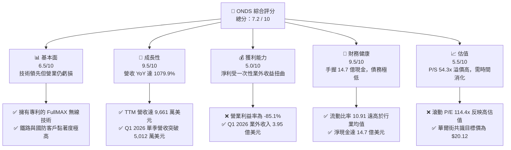

# ONDS 基本面深度分析報告

> **報告日期**：2026-06-08 ｜ **語言**：繁體中文 ｜ **數據來源**：Yahoo Finance, Finviz, StockAnalysis, Roic.ai ｜ **分析師**：CFA 級機構研究

---

## 目錄

| # | 章節 | 核心結論 |
|---|---|---|
| 1 | 執行摘要 | **買入 (Buy)** 評級，目標價 **$20.12**，隱含上行空間 **+95.3%** |
| 2 | 公司概覽與商業模式 | 私有無線網路與自主無人機雙引擎驅動，專利技術構築高壁壘 |
| 3 | 損益表深度分析 | 營收年增率 **1079.9%** 迎來爆發，業外收益使淨利首度轉正 |
| 4 | 資產負債表分析 | 現金儲備高達 **14.7 億美元**，流動比率 **10.91**，財務極度安全 |
| 5 | 現金流量深度分析 | 營運現金流赤字收窄，資本支出極低，融資能力強勁 |
| 6 | 獲利能力與資本效率 | 杜邦分析揭示淨利暴增主因，ROIC 改善但仍受制於營業虧損 |
| 7 | 估值深度分析 | P/S 達 **54.3x** 具高溢價，DCF 敏感性分析支持中長線估值重估 |
| 8 | 成長催化劑 | 國防反無人機（CUAS）需求激增與鐵路專用頻譜升級迎來黃金期 |
| 9 | 風險矩陣 | 股權稀釋與大客戶集中度高為主要風險，技術替代風險中等 |
| 10 | 投資建議 | 適合高風險偏好之成長型投資人，建議採分批佈局策略 |

---

## 1. 執行摘要

Ondas Inc. (NASDAQ: ONDS) 正處於從研發型企業向商業化規模擴張的關鍵拐點。根據最新發布的 2026 年第一季（Q1 2026）財務數據，公司展現了極為罕見的營收成長速度。然而，亮麗的表面數據背後，隱藏著營業利潤與業外一次性收益的巨大分歧。本報告將為機構投資人解構 ONDS 的真實基本面、技術護城河、資本結構以及其估值的合理性。

### 1.1 核心評分儀表板



### 1.2 評分進度條視覺化

```
╔══════════════════════════════════════════════════════════════╗
║               ONDS 多維度評分儀表板 (1-10分)                 ║
╠══════════════════════════════════════════════════════════════╣
║ 基本面強度  6.5 ▓▓▓▓▓▓▓▓▓▓▓▓▓░░░░░░░░░  ★★★☆☆           ║
║ 成長動能    9.5 ▓▓▓▓▓▓▓▓▓▓▓▓▓▓▓▓▓▓▓░  ★★★★★           ║
║ 獲利品質    5.0 ▓▓▓▓▓▓▓▓▓▓░░░░░░░░░░░░  ★★★☆☆           ║
║ 財務健康    9.5 ▓▓▓▓▓▓▓▓▓▓▓▓▓▓▓▓▓▓▓░  ★★★★★           ║
║ 估值合理性  5.5 ▓▓▓▓▓▓▓▓▓▓▓░░░░░░░░░░░  ★★★☆☆           ║
║ 護城河深度  8.0 ▓▓▓▓▓▓▓▓▓▓▓▓▓▓▓▓░░░░░  ★★★★☆           ║
║ 管理層執行  7.0 ▓▓▓▓▓▓▓▓▓▓▓▓▓▓░░░░░░░  ★★★☆☆           ║
║ 技術創新力  9.0 ▓▓▓▓▓▓▓▓▓▓▓▓▓▓▓▓▓▓░░  ★★★★☆           ║
╠══════════════════════════════════════════════════════════════╣
║ 綜合總分    7.2 ▓▓▓▓▓▓▓▓▓▓▓▓▓▓░░░░░░░  🏆 成長拐點顯現     ║
╚══════════════════════════════════════════════════════════════╝
```

### 1.3 五大投資論點 + 三大核心風險

| 類型 | 項目 | 具體依據 | 信心度 |
|------|------|----------|--------|
| 🟢 **投資論點①** | **業績爆發式成長** | Q1 2026 營收達 **$50.12M**，年增率高達 **1079.9%**，驗證商業化進程加速。 | 🟢 極高 |
| 🟢 **投資論點②** | **極致安全的資產負債表** | 手頭現金及短期投資達 **$1.47B**，總債務僅 **$7.87M**，無流動性危機之虞。 | 🟢 極高 |
| 🟢 **投資論點③** | **反無人機（CUAS）剛需** | Iron Drone Raider 與 Sentrycs 平台切入全球國防剛需，地緣政治衝突加劇催化訂單。 | 🟢 高 |
| 🟢 **投資論點④** | **鐵路頻譜升級壟斷地位** | FullMAX 技術為北美一級鐵路（Class I Railroads）唯一符合標準的寬頻無線解決方案。 | 🟢 高 |
| 🟢 **投資論點⑤** | **業外收益大幅充實淨資產** | Q1 2026 錄得 **$394.99M** 的業外收入，大幅推升每股淨資產（BPS）至 **$4.50**。 | 🟡 中度 |
| 🟡 **風險①** | **營業利潤持續虧損** | TTM 營業利益率仍處於 **-85.1%**，核心業務尚未實現自我造血。 | 🟡 中度 |
| 🔴 **風險②** | **股權高度稀釋** | 發行在外股數自 2024 年的 7,000 萬股飆升至當前的 **5.097億股**，稀釋現有股東權益。 | 🔴 高衝擊 |
| 🔴 **風險③** | **客戶集中度過高** | 主要營收依賴少數大型鐵路運營商及國防部客戶，單一