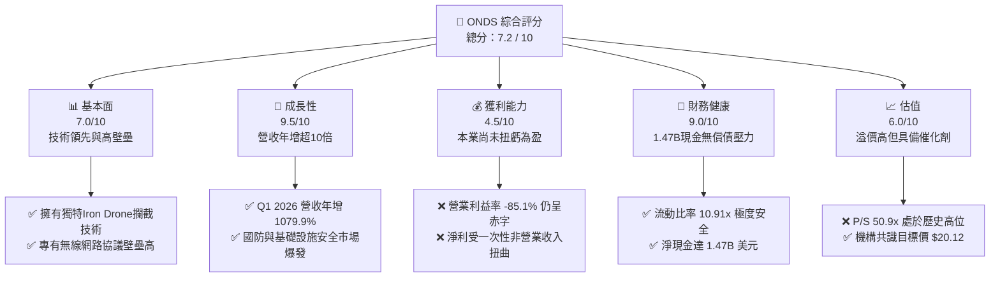
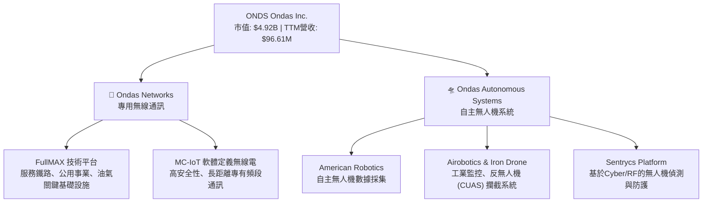
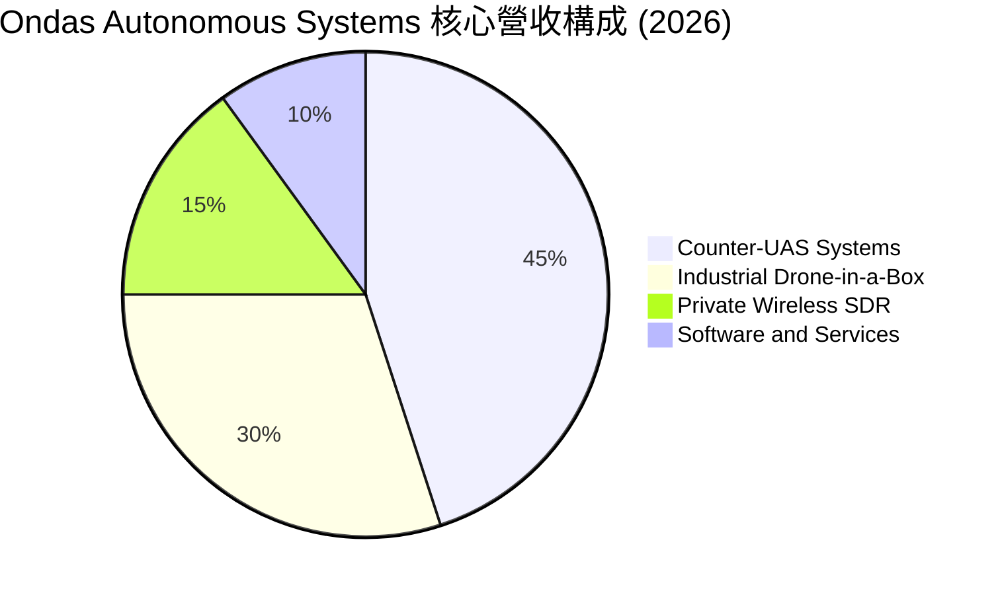
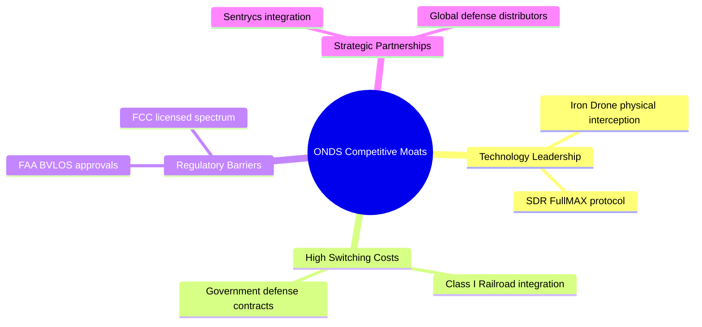

# ONDS 基本面深度分析報告
> **報告日期**：2026-06-09 ｜ **語言**：繁體中文 ｜ **數據來源**：Yahoo Finance, Finviz, StockAnalysis, Roic.ai ｜ **分析師**：CFA 級機構研究

---

## 目錄

| # | 章節 | 核心結論 |
|---|------|----------|
| 1 | 執行摘要 | 評級：**買入 (Buy)** ｜ 目標價：**$20.12** (上行空間 +108.5%) |
| 2 | 公司概覽與商業模式 | 雙引擎驅動（專用無線網路 + 自主無人機系統），技術護城河深厚 |
| 3 | 損益表深度分析 | 營收年增 1079.9% 爆發式增長，非營業收入推升 TTM 淨利，但本業仍虧損 |
| 4 | 資產負債表分析 | 淨現金高達 $1.47B，流動比率 10.9x 極為強勁，但伴隨高額股權稀釋 |
| 5 | 現金流量深度分析 | 營運現金流赤字，融資活動帶來鉅額現金，資本配置聚焦於高成長研發 |
| 6 | 獲利能力與資本效率 | 表面 ROE 達 42.9%，但由非經常性損益主導；本業 ROIC 仍低於 WACC |
| 7 | 估值深度分析 | 高成長溢價，P/S 達 50.9x，DCF 基準估值 $19.50，市場預期偏向樂觀 |
| 8 | 成長催化劑 | 國防安全與無人機監管政策落地，Counter-UAS 系統迎來商用化拐點 |
| 9 | 風險矩陣 | 股權持續稀釋、商業化進度不及預期與高Beta市場波動風險 |
| 10 | 投資建議 | 建議分批佈局成長型投資者，關鍵監控自主系統訂單轉化率 |

---

## 1. 執行摘要

### 1.1 核心評分儀表板



### 1.2 評分進度條視覺化

```
╔══════════════════════════════════════════════════════════════╗
║                ONDS 多維度評分儀表板 (1-10分)                ║
╠══════════════════════════════════════════════════════════════╣
║ 基本面強度  7.0 ▓▓▓▓▓▓▓▓▓▓▓▓▓▓░░░░░░  ★★★☆☆           ║
║ 成長動能    9.5 ▓▓▓▓▓▓▓▓▓▓▓▓▓▓▓▓▓▓▓░  ★★★★★           ║
║ 獲利品質    4.5 ▓▓▓▓▓▓▓▓▓░░░░░░░░░░░  ★★☆☆☆           ║
║ 財務健康    9.0 ▓▓▓▓▓▓▓▓▓▓▓▓▓▓▓▓▓▓░░  ★★★★☆           ║
║ 估值合理性  6.0 ▓▓▓▓▓▓▓▓▓▓▓▓░░░░░░░░  ★★★☆☆           ║
║ 護城河深度  8.0 ▓▓▓▓▓▓▓▓▓▓▓▓▓▓▓▓░░░░  ★★★★☆           ║
║ 管理層執行  7.5 ▓▓▓▓▓▓▓▓▓▓▓▓▓▓▓░░░░░  ★★★☆☆           ║
║ 技術創新力  9.0 ▓▓▓▓▓▓▓▓▓▓▓▓▓▓▓▓▓▓░░  ★★★★☆           ║
╠══════════════════════════════════════════════════════════════╣
║ 綜合總分    7.2 ▓▓▓▓▓▓▓▓▓▓▓▓▓▓░░░░░░  🏆 成長型投機首選    ║
╚══════════════════════════════════════════════════════════════╝
```

### 1.3 五大投資論點 + 三大核心風險

| 類型 | 項目 | 具體依據 | 信心度 |
|------|------|----------|--------|
| 🟢 **投資論點①** | **營收呈指數級成長** | Q1 2026 營收達 $50.12M，YoY 成長達 **1079.9%**，顯示產品進入規模商用期。 | 🟢 極高 |
| 🟢 **投資論點②** | **極其充沛的現金儲備** | 賬面現金及短期投資高達 **$1.47B**，流動比率 **10.91x**，未來數年無資金鏈斷裂風險。 | 🟢 極高 |
| 🟢 **投資論點③** | **軍工與反無人機（CUAS）剛需** | Iron Drone Raider 與 Sentrycs 平台切入全球國防與關鍵基礎設施防護剛需。 | 🟢 高 |
| 🟢 **投資論點④** | **華爾街分析師強烈看好** | 8位分析師一致給予 Strong Buy 評級，平均目標價 **$20.12**，隱含翻倍空間。 | 🟢 高 |
| 🟢 **投資論點⑤** | **毛利率持續改善** | 毛利率從 2024 年的 4.8% 攀升至 TTM 的 **44.8%**，規模效應開始顯現。 | 🟡 中等 |
| 🟡 **風險①** | **本業持續營運虧損** | TTM 營業利益率為 **-85.1%**，本業尚未實現轉正，仍依賴非營業收入支持淨利。 | 🟡 中度 |
| 🔴 **風險②** | **極高股權稀釋速度** | 稀釋後流通股數 YoY 暴增 **269.4%**，這也是公司獲取鉅額現金的主要手段。 | 🔴 高衝擊 |
| 🔴 **風險③** | **高空頭比例與股價波動** | 空頭佔在外流通股數比率（Short % Float）高達 **31.1%**，Beta 值高達 **2.62**。 | 🔴 高衝擊 |

### 1.4 快速統計卡片

| 指標 | 公司實際值 (TTM) | 行業均值 (通訊設備) | S&P 500 均值 | 狀態 |
|------|-------------|----------|--------------|------|
| 營收 YoY 成長 | **1079.9%** | ~8.5% | ~5.5% | 🟢 極強 |
| 毛利率 | **44.8%** | ~42.0% | ~30.0% | 🟢 優於行業 |
| 營業利益率 | **-85.1%** | ~12.0% | ~15.0% | 🔴 亟待改善 |
| 淨利率 | **251.9%** | ~8.0% | ~11.5% | 🟡 受一次性收益扭曲 |
| ROE | **42.9%** | ~14.0% | ~18.0% | 🟡 槓桿與非常規利潤驅動 |
| Forward P/E | **-192.9x** | ~22.0x | ~21.5x | 🔴 尚未穩定獲利 |
| 淨現金 / 債務 | **$1.47B / $7.87M** | 淨債務狀態 | 淨債務狀態 | 🟢 極其健康 |

### 1.5 投資結論

```
╔══════════════════════════════════════════════════════════════════╗
║                    📊 ONDS 投資結論摘要                          ║
╠══════════════════════════════════════════════════════════════════╣
║  評級：🟢 買入 (Buy)                                            ║
║  當前股價：$9.65 (2026-06-09)                                    ║
║  目標價區間：                                                    ║
║    悲觀情境：$6.50  (-32.6%)                                     ║
║    基準情境：$20.12 (+108.5%)  ← 12個月主要目標                  ║
║    樂觀情境：$25.00 (+159.1%)                                    ║
║  投資評分：7.2 / 10                                              ║
║  適合投資人：高風險承受度、聚焦國防安全與無人機賽道的成長型投資人 ║
╚══════════════════════════════════════════════════════════════════╝
```

---

## 2. 公司概覽與商業模式

Ondas Inc. (ONDS) 是一家領先的私人無線網路、自主無人機及自動化數據解決方案提供商。公司主要透過兩個核心部門運營：**Ondas Networks**（專用寬頻無線網路）與 **Ondas Autonomous Systems (OAS)**（自主系統，包含無人機與反無人機解決方案）。

### 2.1 業務結構與收入來源



### 2.2 市場份額估算

在關鍵基礎設施（如一級鐵路無線升級）與特定國防自主反無人機（CUAS）市場中，ONDS 憑藉其專有技術佔據了獨特的生態位。



### 2.3 競爭護城河分析



### 2.4 護城河強度評分

```
╔══════════════════════════════════════════════════════════════╗
║                    ONDS 護城河強度評分                        ║
╠══════════════════════════════════════════════════════════════╣
║ 技術專利壁壘  8.5 ▓▓▓▓▓▓▓▓▓▓▓▓▓▓▓▓▓░░░  🏆 獨家攔截與SDR專利║
║ 客戶轉置成本  8.0 ▓▓▓▓▓▓▓▓▓▓▓▓▓▓▓▓░░░░  🟢 鐵路與軍工高黏性  ║
║ 法規准入壁壘  9.0 ▓▓▓▓▓▓▓▓▓▓▓▓▓▓▓▓▓▓░░  🟢 FAA超視距飛行許可 ║
║ 規模效應壁壘  4.0 ▓▓▓▓▓▓▓▓░░░░░░░░░░░░  🟡 生產規模尚在爬坡  ║
╠══════════════════════════════════════════════════════════════╣
║ 綜合護城河    7.4 ▓▓▓▓▓▓▓▓▓▓▓▓▓▓▓░░░░░  🏆 具備高技術壁壘    ║
╚══════════════════════════════════════════════════════════════╝
```

---

## 3. 損益表深度分析

ONDS 的損益表呈現出典型的高成長、高研發投入、本業尚未扭虧，但非經常性損益帶來淨利爆發的特徵。

### 3.1 年度收入成長趨勢（近5年）

```
╔══════════════════════════════════════════════════════════════════╗
║                 ONDS 年度收入趨勢 (FY 2021 - TTM)                ║
╠══════════════════════════════════════════════════════════════════╣
║                                                                  ║
║  FY 2021   $2.91M   █░░░░░░░░░░░░░░░░░░░░░░░░░░░░░  YoY: +34.3%  ║
║  FY 2022   $2.13M   █░░░░░░░░░░░░░░░░░░░░░░░░░░░░░  YoY: -26.9%  ║
║  FY 2023   $15.69M  ████░░░░░░░░░░░░░░░░░░░░░░░░░░  YoY: +638.1% ║
║  FY 2024   $7.19M   ██░░░░░░░░░░░░░░░░░░░░░░░░░░░░  YoY: -54.2%  ║
║  FY 2025   $50.73M  ███████████████░░░░░░░░░░░░░░░  YoY: +605.3% ║
║  TTM       $96.61M  ██████████████████████████████  YoY: +1079.9%║
║                                                                  ║
║  📊 5年複合成長率 (CAGR)：+101.4%                                ║
╚══════════════════════════════════════════════════════════════════╝
```

### 3.2 季度收入趨勢分析

| 季度 | 營收 (Millions) | QoQ 成長率 | YoY 成長率 | 備註 |
|------|-----------------|------------|------------|------|
| **Q1 2026** | **$50.12M** | +66.5% | **+1079.9%** | 創歷史新高，自主系統大額訂單交付 |
| **Q4 2025** | **$30.11M** | +198.1% | +629.2% | 年底國防與鐵路客戶預算集中釋放 |
| **Q3 2025** | **$10.10M** | +61.1% | +582.0% | 反無人機需求在全球地緣衝突中爆發 |
| **Q2 2025** | **$6.27M** | +47.5% | +554.9% | OAS 部門出貨量穩步爬坡 |

### 3.3 利潤率演變分析

| 利潤率指標 | FY 2022 | FY 2023 | FY 2024 | FY 2025 | TTM | 趨勢 | 評估 |
|------------|---------|---------|---------|---------|-----|------|------|
| **毛利率** | 52.1% | 40.7% | 4.8% | 39.7% | **44.8%** | ↗️ 穩步回升 | 🟢 規模效應顯現 |
| **營業利益率** | -3259.6% | -253.2% | -481.4% | -115.1% | **-93.9%** | ↗️ 赤字收窄 | 🟡 本業仍處虧損 |
| **淨利益率** | -3438.5% | -285.8% | -528.7% | -262.9% | **250.5%** | ↗️ 暴增 | 🔴 受非營業收入扭曲 |

**利潤率演變深度解析**：
*   **毛利率改善**：毛利率從 2024 年的 4.8% 暴增至 TTM 的 44.8%，主要得益於 OAS 部門高利潤率的反無人機（CUAS）軟硬體整合系統出貨佔比提升。
*   **營業虧損持續**：雖然營收暴增，但營運費用（SG&A 與 R&D）規模依然