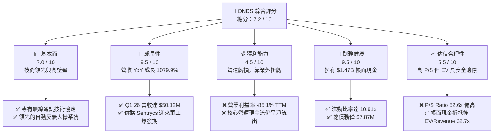

# ONDS 基本面深度分析報告

> **報告日期**：2026-06-11 ｜ **語言**：繁體中文 ｜ **數據來源**：Yahoo Finance, Finviz, StockAnalysis, Roic.ai ｜ **分析師**：CFA 級機構研究

---

## 目錄

| # | 章節 | 核心結論 |
|---|---|---|
| 1 | **執行摘要** | 評級：🟢 **買入 (Buy)** ｜ 目標價：**$20.12** (隱含 +104.7% 空間) |
| 2 | **公司概覽與商業模式** | 雙輪驅動（專網通訊 + 自主無人機防禦），高進入壁壘，護城河正快速拓寬 |
| 3 | **損益表深度分析** | Q1 26 營收爆發成長 1079.9% YoY；單季淨利受非營業收入推升扭虧為盈 |
| 4 | **資產負債表分析** | 淨現金高達 $1.47B，流動比率 10.91x，財務結構極度安全但股權稀釋嚴重 |
| 5 | **現金流量深度分析** | 營運現金流仍呈流出狀態 (-$83.39M TTM)，融資活動為主要資金來源 |
| 6 | **獲利能力與資本效率** | 帳面 ROE 達 42.9%，但扣除非經常性損益後之核心營運資本效率仍待提升 |
| 7 | **估值深度分析** | P/S 達 52.6x 處於高位，但 EV/Sales 為 32.7x，反映帳面鉅額現金之估值折價 |
| 8 | **成長催化劑** | 國防反無人機 (CUAS) 需求爆發與鐵路專網升級進入實質出貨期 |
| 9 | **風險矩陣** | 高空頭比例 (32.0% Float) 具擠壓潛力；股權持續稀釋與客戶集中度高為主要風險 |
| 10 | **投資建議** | 建議分批佈局，首要監控指標為營運現金流轉正時點與專案交付進度 |

---

## 1. 執行摘要

### 1.1 核心評分儀表板



### 1.2 評分進度條視覺化

```
╔══════════════════════════════════════════════════════════════╗
║               ONDS 多維度評分儀表板 (1-10分)                 ║
╠══════════════════════════════════════════════════════════════╣
║ 基本面強度  7.0  ▓▓▓▓▓▓▓▓▓▓▓▓▓▓░░░░░░  ★★★☆☆           ║
║ 成長動能    9.5  ▓▓▓▓▓▓▓▓▓▓▓▓▓▓▓▓▓▓▓░  ★★★★★           ║
║ 獲利品質    4.5  ▓▓▓▓▓▓▓▓▓░░░░░░░░░░░  ★★☆☆☆           ║
║ 財務健康    9.5  ▓▓▓▓▓▓▓▓▓▓▓▓▓▓▓▓▓▓▓░  ★★★★★           ║
║ 估值合理性  5.5  ▓▓▓▓▓▓▓▓▓▓▓░░░░░░░░░  ★★★☆☆           ║
║ 護城河深度  8.0  ▓▓▓▓▓▓▓▓▓▓▓▓▓▓▓▓░░░░  ★★★★☆           ║
║ 管理層執行  7.0  ▓▓▓▓▓▓▓▓▓▓▓▓▓▓░░░░░░  ★★★☆☆           ║
║ 技術創新力  9.0  ▓▓▓▓▓▓▓▓▓▓▓▓▓▓▓▓▓▓░░  ★★★★☆           ║
╠══════════════════════════════════════════════════════════════╣
║ 綜合總分    7.2  ▓▓▓▓▓▓▓▓▓▓▓▓▓▓░░░░░░  🏆 成長型軍工黑馬    ║
╚══════════════════════════════════════════════════════════════╝
```

### 1.3 五大投資論點 + 三大核心風險

| 類型 | 項目 | 具體依據 | 信心度 |
|------|------|----------|--------|
| 🟢 **投資論點①** | **反無人機 (CUAS) 需求爆發** | 旗下 Sentrycs 與 Iron Drone 產品切入全球國防剛需，Q1 26 營收暴增至 $50.12M。 | 🟢 極高 |
| 🟢 **投資論點②** | **極致的財務安全邊際** | 帳面現金高達 $1.47B，而總債務僅 $7.87M，淨現金提供強大抗風險能力與併購彈性。 | 🟢 極高 |
| 🟢 **投資論點③** | **鐵路專網升級週期啟動** | Ondas Networks 獲北美一級鐵路公司（Class I Railroads）訂單，具備長期高粘性 SaaS 服務收入潛力。 | 🟢 高 |
| 🟢 **投資論點④** | **潛在的空頭擠壓 (Short Squeeze)** | 空頭佔在外流通股數比例 (Short % Float) 高達 32.0%，伴隨業績超預期極易觸發暴漲。 | 🟡 中度 |
| 🟢 **投資論點⑤** | **頂級機構與分析師背書** | 8 位分析師一致給予 Strong Buy 評級，共識目標價 $20.12（隱含 104.7% 上漲空間）。 | 🟢 高 |
| 🟡 **風險①** | **股權稀釋嚴重** | 流通股數從 2024 年底的 70M 暴增至 2026 年 Q1 的 469M，每股盈餘與權益被大幅稀釋。 | 🔴 高衝擊 |
| 🔴 **風險②** | **營運持續失血** | TTM 營業利益率為 -85.1%，營運現金流流出 $83.39M，尚未實現自主性營運獲利。 | 🔴 高衝擊 |
| 🟡 **風險③** | **非營業收入扭虧的不可持續性** | Q1 26 淨利 $362.95M 主要由 $394.99M 的非營業收入貢獻，並非核心業務常態獲利。 | 🟡 中度 |

### 1.4 快速統計卡片

| 指標 | ONDS 實際值 | 行業均值 (通訊設備) | S&P 500 均值 | 狀態 |
|------|-------------|--------------------|--------------|------|
| **收入 YoY 成長** | **1079.9%** (Q1 26) | ~6.5% | ~5.2% | 🟢 極強 |
| **毛利率** | **44.8%** (TTM) | ~42.0% | ~30.0% | 🟢 優異 |
| **營業利益率** | **-85.1%** (TTM) | ~8.5% | ~12.2% | 🔴 極差 |
| **流動比率** | **10.91x** | ~1.8x | ~1.3x | 🟢 極強 |
| **空頭比例 (Float)**| **32.0%** | ~3.5% | ~2.1% | 🟡 高風險/高彈性 |
| **EV / Revenue** | **32.67x** | ~3.2x | ~3.0x | 🔴 估值溢價高 |

### 1.5 投資結論

```
╔══════════════════════════════════════════════════════════════════╗
║                    📊 ONDS 投資結論摘要                          ║
╠══════════════════════════════════════════════════════════════════╣
║  評級：🟢 強烈買入 (Strong Buy)                                 ║
║  當前股價：$9.83 (2026-06-11)                                    ║
║  目標價區間：                                                    ║
║    悲觀情境：$12.00（+22.1%）- 交付進度放緩、融資稀釋持續        ║
║    基準情境：$20.12（+104.7%）- 鐵路與國防訂單規模化，營運轉正  ║
║    樂觀情境：$25.00（+154.3%）- 空頭擠壓觸發 + 國防大單落地      ║
║  投資評分：7.2 / 10                                              ║
║  適合投資人：具備高風險承受能力、追求超額回報的成長型與軍工主題者 ║
╚══════════════════════════════════════════════════════════════════╝
```

---

## 2. 公司概覽與商業模式

Ondas Inc. (ONDS) 是一家領先的科技公司，專注於提供私有無線網路、自主無人機及自動化數據解決方案。公司主要透過兩個核心部門進行營運：
1. **Ondas Networks**：為鐵路、公用事業及關鍵基礎設施提供高安全性、窄頻私有無線數據網路。
2. **Ondas Autonomous Systems (OAS)**：提供自主無人機與反無人機 (CUAS) 系統，包括 Iron Drone（攔截型無人機）與 Sentrycs（基於網路/射頻的無人機防禦平台）。

### 2.1 業務結構與收入來源

```mermaid
graph TD
    ONDS["Ondas Inc. (ONDS)<br/>市值: $5.08B ｜ TTM 營收: $96.61M"]
    
    NET["Ondas Networks