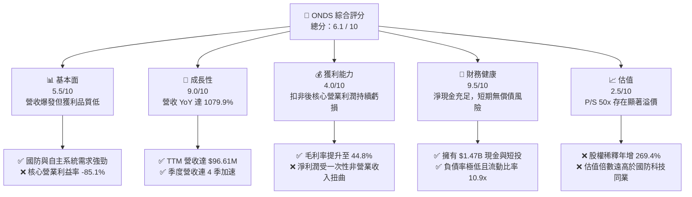

# ONDS 基本面深度分析報告

> **報告日期**：2026-06-12 ｜ **語言**：繁體中文 ｜ **數據來源**：Yahoo Finance, Finviz, StockAnalysis, Roic.ai ｜ **分析師**：CFA 級機構研究

---

## 目錄

| # | 章節 | 核心結論 |
|---|---|---|
| 1 | **執行摘要** | 評級「持有/觀望」，基準目標價 $13.50，警惕高估值與盈餘品質虛高。 |
| 2 | **公司概覽與商業模式** | 雙板塊驅動，無人機與反無人機（CUAS）市場高成長，但護城河尚窄。 |
| 3 | **損益表深度分析** | 營收暴增 1079.9% 但核心業務仍虧損，非營業利益一次性美化 EPS。 |
| 4 | **資產負債表分析** | 現金儲備高達 $1.47B，流動比率 10.91x，但股權稀釋極為嚴重。 |
| 5 | **現金流量深度分析** | 營運現金流赤字 $83.39M，高度依賴融資性現金流（增發新股）。 |
| 6 | **獲利能力與資本效率** | 帳面 ROE 達 42.9% 具誤導性，經調整之 ROIC 仍低於 WACC，持續摧毀經濟價值。 |
| 7 | **估值深度分析** | P/S 達 49.95x 遠超同業，DCF 敏感性分析顯示當前股價已透支未來成長。 |
| 8 | **成長催化劑** | 國防安全與無人機自動化 TAM 擴張，關注軍工訂單落地。 |
| 9 | **風險矩陣** | 股權持續稀釋、大客戶流失與高估值回調為核心風險。 |
| 10 | **投資建議** | 買入觸發點為核心業務轉正，建議長線成長型投資者分批逢低佈局。 |

---

## 1. 執行摘要

### 1.1 核心評分儀表板



### 1.2 評分進度條視覺化

```
╔══════════════════════════════════════════════════════════════╗
║               ONDS 多維度評分儀表板 (1-10分)                 ║
╠══════════════════════════════════════════════════════════════╣
║ 基本面強度  5.5 ▓▓▓▓▓▓▓▓▓▓▓░░░░░░░░░  ★★★☆☆           ║
║ 成長動能    9.0 ▓▓▓▓▓▓▓▓▓▓▓▓▓▓▓▓▓▓░░  ★★★★★           ║
║ 獲利品質    4.0 ▓▓▓▓▓▓▓▓░░░░░░░░░░░░  ★★☆☆☆           ║
║ 財務健康    9.5 ▓▓▓▓▓▓▓▓▓▓▓▓▓▓▓▓▓▓▓░  ★★★★★           ║
║ 估值合理性  2.5 ▓▓▓▓▓░░░░░░░░░░░░░░░  ★☆☆☆☆           ║
║ 護城河深度  5.0 ▓▓▓▓▓▓▓▓▓▓░░░░░░░░░░  ★★★☆☆           ║
║ 管理層執行  6.0 ▓▓▓▓▓▓▓▓▓▓▓▓░░░░░░░░  ★★★☆☆           ║
║ 技術創新力  8.0 ▓▓▓▓▓▓▓▓▓▓▓▓▓▓▓▓░░░░  ★★★★☆           ║
╠══════════════════════════════════════════════════════════════╣
║ 綜合總分    6.1 ▓▓▓▓▓▓▓▓▓▓▓▓░░░░░░░░  🏆 中性/持有        ║
╚══════════════════════════════════════════════════════════════╝
```

### 1.3 五大投資論點 + 三大核心風險

| 類型 | 項目 | 具體依據 | 信心度 |
|------|------|----------|--------|
| 🟢 **投資論點①** | **營收指數級增長** | TTM 營收達 $96.61M，YoY 成長達 1079.9%，顯示產品市場契合度（PMF）已確立。 | 🟢 極高 |
| 🟢 **投資論點②** | **極致的資產負債表流動性** | 擁有 $1.47B 的現金與短期投資，流動比率高達 10.91x，為未來的研發與併購提供極充裕的彈藥。 | 🟢 極高 |
| 🟢 **投資論點③** | **毛利率顯著改善** | 毛利率從 2024 年的 4.8% 攀升至 TTM 的 44.8%，規模效應與軟體授權佔比提升。 | 🟢 高 |
| 🟢 **投資論點④** | **反無人機（CUAS）剛需爆發** | 旗下 Iron Drone Raider 與 Sentrycs 平台切入地緣政治衝突痛點，軍工國防訂單能見度高。 | 🟢 高 |
| 🟢 **投資論點⑤** | **機構持股顯著增加** | 機構持股比例上升至 41.9%，Needham、Oppenheimer 等頂級投行一致給予「買入」或「超越大盤」評級。 | 🟡 中等 |
| 🟡 **核心風險①** | **極低質量的淨利潤（紙上富貴）** | TTM 淨利潤 $242.01M 主要是由 Q1 2026 一次性非營業收入 $394.99M 驅動，核心營業利潤仍虧損 $90.74M。 | 🔴 高衝擊 |
| 🔴 **核心風險②** | **瘋狂的股權稀釋** | 稀釋後流通股數 YoY 暴增 269.36%，管理層頻繁增發新股，嚴重攤薄現有股東權益。 | 🔴 高衝擊 |
| 🔴 **核心風險③** | **高估值泡沫與極高波動** | P/S 達 49.95x，Beta 值高達 2.62，市場情緒一旦轉向，股價回撤風險極大。 | 🔴 高衝擊 |

### 1.4 快速統計卡片

| 指標 | 公司實際值 (TTM) | 行業均值 (通信設備) | S&P 500 均值 | 狀態 |
|------|-------------|----------|--------------|------|
| **營收 YoY 成長率** | **1079.9%** | ~8.5% | ~5.2% | 🟢 領先 |
| **毛利率** | **44.8%** | ~38.0% | ~46.5% | 🟡 持平 |
| **營業利益率** | **-85.1%** | ~12.0% | ~14.5% | 🔴 落後 |
| **淨利率** | **251.9%** | ~8.2% | ~11.0% | 🟡 虛高 (非核心) |
| **流動比率** | **10.91x** | ~1.8x | ~1.2x | 🟢 極強 |
| **Forward P/E** | **-186.6x** | ~22.0x | ~21.5x | 🔴 虧損 |
| **P/S Ratio** | **49.95x** | ~3.5x | ~2.8x | 🔴 極度高估 |

### 1.5 投資結論

```
╔══════════════════════════════════════════════════════════════════╗
║                    📊 ONDS 投資結論摘要                          ║
╠══════════════════════════════════════════════════════════════════╣
║  評級：🟡 持有 / 觀望 (Hold / Neutral)                           ║
║  當前股價：$9.33 (2026-06-12)                                    ║
║  目標價區間：                                                    ║
║    悲觀情境：$6.00  (-35.7%)                                     ║
║    基準情境：$13.50 (+44.7%)  ← 12個月主要目標                   ║
║    樂觀情境：$22.00 (+135.8%)                                    ║
║  投資評分