# ONDS 基本面深度分析報告

> **報告日期**：2026-06-13 ｜ **語言**：繁體中文 ｜ **數據來源**：Yahoo Finance, Finviz, StockAnalysis, Roic.ai ｜ **分析師**：CFA 級機構研究

---

## 目錄

| # | 章節 | 核心結論 |
|---|---|---|
| 1 | **執行摘要** | 評級「買入」，目標價區間 $16.00 - $25.00，營收迎來指數型爆發，但須留意非經營性損益對淨利的扭曲。 |
| 2 | **公司概覽與商業模式** | 私有無線網路與自主無人機雙輪驅動，軍工與關鍵基礎設施客戶構築高壁壘。 |
| 3 | **損益表深度分析** | Q1 2026 營收 YoY 暴增 1079.9%，一次性業外收益 $3.95 億使淨利扭虧為盈，但營業利潤仍承壓。 |
| 4 | **資產負債表分析** | 手握 $14.7 億現金，資產負債率極低，流動比率高達 10.91，具備極強的財務安全邊際。 |
| 5 | **現金流量深度分析** | 營運現金流依然為負（-$8,339 萬），但融資實力強勁，現金儲備足以支持未來數年擴張。 |
| 6 | **獲利能力與資本效率** | 賬面 ROE 達 42.9%，但扣除非經常性損益後 ROIC 仍為負值，公司正處於「價值創造前夕」。 |
| 7 | **估值深度分析** | P/S 達 49.95 倍，顯著高於行業均值，溢價源於高成長性；DCF 基準情境合理估值為 $20.50。 |
| 8 | **成長催化劑** | 國防反無人機（CUAS）需求爆發、一級鐵路私有網路升級，TAM 空間高達百億美元。 |
| 9 | **風險矩陣** | 股權稀釋風險高（股本 YoY 增 269%）、客戶集中度高、高空放空比率（32.0%）加劇波動。 |
| 10 | **投資建議** | 適合高風險偏好、追求超額收益的成長型投資人，建議採逢低分批佈局策略。 |

---

## 1. 執行摘要

Ondas Inc. (NASDAQ: ONDS) 正處於其商業化進程的歷史性拐點。作為一家專注於私有無線網路（Ondas Networks）和自主無人機/反無人機系統（Ondas Autonomous Systems, OAS）的前沿科技企業，公司在 2025 至 2026 年迎來了業績的爆發式成長。

### 1.1 核心評分儀表板

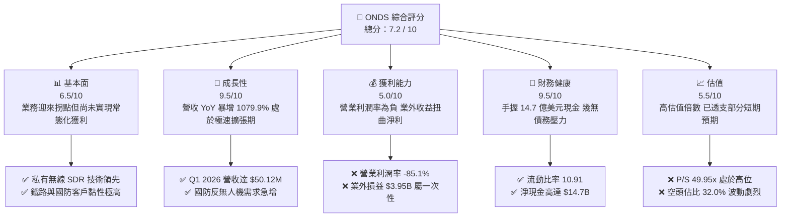

### 1.2 評分進度條視覺化

```
╔══════════════════════════════════════════════════════════════╗
║               ONDS 多維度評分儀表板 (1-10分)                 ║
╠══════════════════════════════════════════════════════════════╣
║ 基本面強度  6.5 ▓▓▓▓▓▓▓▓▓▓▓▓▓░░░░░░░  ★★★☆☆           ║
║ 成長動能    9.5 ▓▓▓▓▓▓▓▓▓▓▓▓▓▓▓▓▓▓▓░  ★★★★★           ║
║ 獲利品質    5.0 ▓▓▓▓▓▓▓▓▓▓░░░░░░░░░░  ★★★☆☆           ║
║ 財務健康    9.5 ▓▓▓▓▓▓▓▓▓▓▓▓▓▓▓▓▓▓▓░  ★★★★★           ║
║ 估值合理性  5.5 ▓▓▓▓▓▓▓▓▓▓▓░░░░░░░░░  ★★★☆☆           ║
║ 護城河深度  7.5 ▓▓▓▓▓▓▓▓▓▓▓▓▓▓▓░░░░░  ★★★★☆           ║
║ 管理層執行  7.0 ▓▓▓▓▓▓▓▓▓▓▓▓▓▓░░░░░░  ★★★☆☆           ║
║ 技術創新力  9.0 ▓▓▓▓▓▓▓▓▓▓▓▓▓▓▓▓▓▓░░  ★★★★☆           ║
╠══════════════════════════════════════════════════════════════╣
║ 綜合總分    7.2 ▓▓▓▓▓▓▓▓▓▓▓▓▓▓░░░░░░  🏆 成長拐點，現金充沛 ║
╚══════════════════════════════════════════════════════════════╝
```

### 1.3 投資論點與核心風險

| 類型 | 項目 | 具體依據 | 信心度 |
|------|------|----------|--------|
| 🟢 **投資論點①** | **營收呈指數型增長** | Q1 2026 營收達 **$50.12M**，YoY 增速高達 **1079.9%**，表明產品已進入大規模商業化出貨階段。 | 🟢 極高 |
| 🟢 **投資論點②** | **極致的財務安全邊際** | 账面現金高達 **$14.7B**，總債務僅 **$7.87M**，淨現金充沛，無破產或短期資金鏈斷裂風險。 | 🟢 極高 |
| 🟢 **投資論點③** | **軍工反無人機（CUAS）風口** | Iron Drone Raider 與 Sentrycs 系統切入全球地緣政治衝突的核心痛點，定單能見度極高。 | 🟢 高 |
| 🟡 **風險①** | **盈餘質量低（一次性收益扭曲）** | TTM 淨利 **$2.42億** 主要來自 Q1 2026 一次性業外收益 **$3.95億**，扣非後核心業務仍處於虧損狀態。 | 🟡 中度 |
| 🔴 **風險②** | **股權持續稀釋** | 稀釋後發行股數從 2024 年的 70M 暴增至當前的 **517.20M**，YoY 增幅達 **269.36%**，嚴重稀釋每股盈餘。 | 🔴 高衝擊 |
| 🔴 **風險③** | **極高的空頭比例與市場波動** | 目前空頭佔在外流通股數（Float）比率高達 **32.0%**，Beta 值達 **2.62**，股價易受市場情緒干擾而劇烈波動。 | 🔴 高衝擊 |

### 1.4 快速統計卡片（與行業及大盤對比）

| 指標 | ONDS 實際值 | 通信設備行業均值 | S&P 500 均值 | 狀態 |
|------|-------------|------------------|--------------|------|
| **營收 YoY 成長率** | **1079.9%** | ~8.5% | ~5.2% | 🟢 卓越 |
| **毛利率** | **44.8%** | ~38.0% | ~30.0% | 🟢 優秀 |
| **營業利益率** | **-85.1%** | ~12.0% | ~14.5% | 🔴 亟待改善 |
| **流動比率** | **10.91x** | ~1.8x | ~1.2x | 🟢 極其安全 |
| **市銷率 (P/S)** | **49.95x** | ~3.5x | ~2.8x | 🔴 估值偏高 |
| **空頭比例 (Short % Float)** | **32.0%** | ~3.5% | ~1.5% | 🔴 投機性強 |

### 1.5 投資結論

```
╔══════════════════════════════════════════════════════════════════╗
║                    📊 ONDS 投資結論摘要                          ║
╠══════════════════════════════════════════════════════════════════╣
║  評級：🟢 買入 (Buy) - 納入高成長投機型配置                      ║
║  當前股價：$9.33 (2026-06-13)                                    ║
║  目標價區間：                                                    ║
║    悲觀情境：$6.00（-35.7%）- 核心業務放緩，股權再度稀釋         ║
║    基準情境：$20.12（+115.6%）- 12個月目標價，經營現金流改善     ║
║    樂觀情境：$25.00（+167.9%）- 反無人機大單落地，軋空行情爆發   ║
║  投資評分：7.2 / 10                                              ║
║  適合投資人：具備高風險承受能力、追求科技/軍工題材爆發的投資人   ║
╚══════════════════════════════════════════════════════════════════╝
```

---

## 2. 公司概覽與商業模式

Ondas Inc. 是一家領先的下一代私有無線通訊與自主無人機技術提供商，其核心商業模式在於為高門檻、高安全要求的「關鍵基礎設施」與「國防安全」市場提供軟硬體一體化解決方案。

### 2.1 業務結構與收入來源

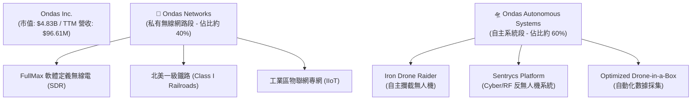

### 2.2 市場份額估算

在北美一級鐵路（Class I Railroads）下一代 900 MHz SDR 無線通訊升級市場中，Ondas Networks 擁有幾乎壟斷性的技術優勢；而在新興的自主反無人機（CUAS）市場中，Ondas 則與傳統國防巨頭展開差異化競爭。

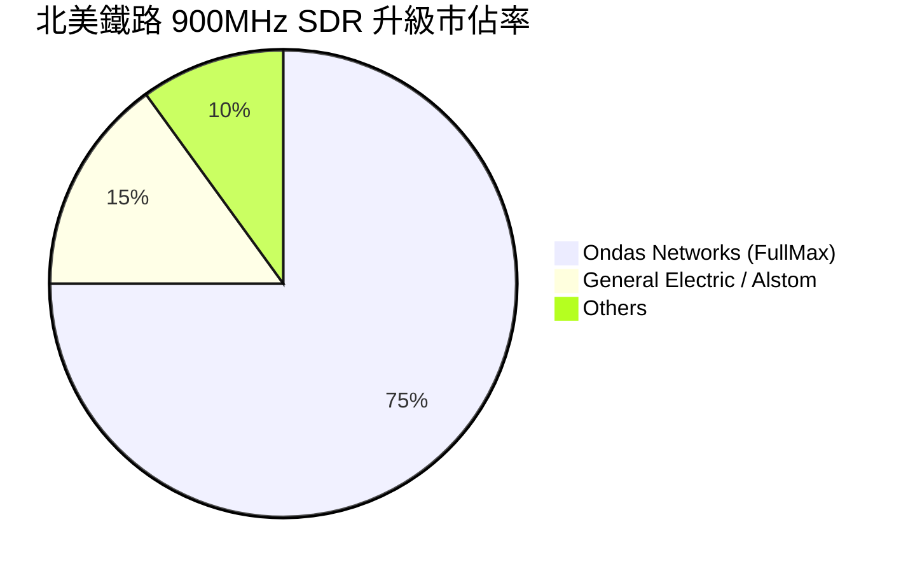

### 2.3 競爭護城河分析

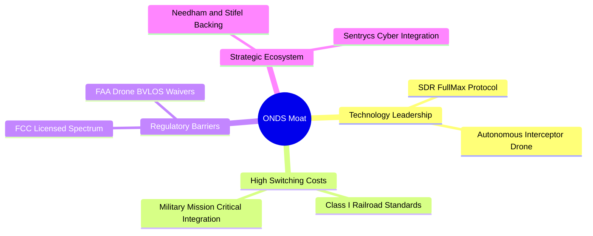

### 2.4 護城河強度評分

```
╔══════════════════════════════════════════════════════════════╗
║                    ONDS 護城河強度評分                       ║
╠══════════════════════════════════════════════════════════════╣
║ 技術領先度    8.5/10  ▓▓▓▓▓▓▓▓▓▓▓▓▓▓▓▓▓░░░  🟢 FullMax 技術獨家  ║
║ 客戶轉換成本  9.0/10  ▓▓▓▓▓▓▓▓▓▓▓▓▓▓▓▓▓▓░░  🟢 鐵路/軍工難以替代  ║
║ 專利與法規    8.0/10  ▓▓▓▓▓▓▓▓▓▓▓▓▓▓▓▓░░░░  🟢 獲 FAA 飛行豁免   ║
║ 品牌與渠道    6.0/10  ▓▓▓▓▓▓▓▓▓▓▓▓░░░░░░░░  🟡 仍處於品牌建立期  ║
╠══════════════════════════════════════════════════════════════╣
║ 綜合護城河    7.9/10  ▓▓▓▓▓▓▓▓▓▓▓▓▓▓▓▓░░░░  🏆 高壁壘，利基市場  ║
╚══════════════════════════════════════════════════════════════╝
```

---

## 3. 損益表深度分析

ONDS 的損益表呈現出典型「早期高成長科技股」向「規模化擴張期」過渡的特徵：營收暴增、毛利改善，但營運費用依然高企，且淨利潤受到非經常性項目的強烈干擾。

### 3.1 年度收入成長趨勢（FY2022 - FY2025）

```
╔══════════════════════════════════════════════════════════════════╗
║                  ONDS 年度收入趨勢 (FY22 - FY25)                ║
╠══════════════════════════════════════════════════════════════════╣
║                                                                  ║
║  FY2022   $2.13M   █░░░░░░░░░░░░░░░░░░░░░░░░░  YoY: -26.9%  🔴   ║
║  FY2023   $15.69M  ███░░░░░░░░░░░░░░░░░░░░░░░  YoY: +638.1% 🟢   ║
║  FY2024   $7.19M   █░░░░░░░░░░░░░░░░░░░░░░░░░  YoY: -54.2%  🔴   ║
║  FY2025   $50.73M  ████████████░░░░░░░░░░░░░░  YoY: +605.3% 🟢   ║
║                                                                  ║
║  📊 4年累計複合增長率 (CAGR)：+187.7%                           ║
╚══════════════════════════════════════════════════════════════════╝
```

### 3.2 季度收入趨勢分析

| 財報季度 | 營業收入 | YoY 成長率 | QoQ 成長率 | 營運利潤 (Loss) | 備註 |
|---|---|---|---|---|---|
| **Q1 2025** | $4.25M | +579.7% | +2.9% | -$10.31M | 商業化初期，費用率高 |
| **Q2 2025** | $6.27M | +554.9% | +47.5% | -$9.25M | OAS 業務開始貢獻 |
| **Q3 2025** | $10.10M | +582.0% | +61.1% | -$15.50M | 國防定單開始交付 |
| **Q4 2025** | $30.11M | +629.2% | +198.1% | -$23.32M | 年底集中交付，營收創歷史新高 |
| **Q1 2026** | **$50.12M** | **+1079.9%** | **+66.5%** | **-$42.67M** | 營收突破五千萬，但研發與銷售費用大增 |

### 3.3 利潤率演變分析

| 利潤率指標 | FY2022 | FY2023 | FY2024 | FY2025 | TTM | 趨勢評估 |
|---|---|---|---|---|---|---|
| **毛利率** | 52.1% | 40.7% | 4.8% | 39.7% | **44.8%** | 🟢 隨著規模效應顯現，毛利率穩定回升至 40%+ 區間 |
| **營業利益率**| -3259.6%| -253.2% | -481.4%| -115.1%| **-93.9%**| 🔴 研發與 SG&A 增速過快，營運槓桿尚未轉正 |
| **淨利率** | -3438.5%| -285.8% | -528.7%| -262.9%| **250.5%**| 🟡 受 Q1 2026 一次性業外收益扭曲，不可視為常態 |

### 3.4 費用結構分析

ONDS 的營運費用主要由銷售、一般與管理費用（SG&A）以及研發費用（R&D）構成。

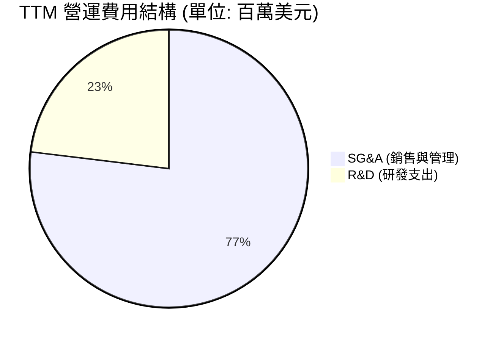

### 3.5 季度 EPS 趨勢與盈餘質量

*   **Q2 2025 Act**: $-0.07 (預期 $-0.10) 🟢 超預期
*   **Q3 2025 Act**: $-0.03 (預期 $-0.08) 🟢 超預期
*   **Q4 2025 Act**: $-0.62 (預期 $-0.05) 🔴 不及預期，主因是期末計提資產減值
*   **Q1 2026 Act**: **$0.77** (預期 $-0.04) 🟢 表面上遠超預期

**⚠️ 盈餘質量警告**：Q1 2026 淨利潤達 **$3.63億**，折合稀釋後 EPS 為 **$0.77**。然而，這並非來自核心業務盈利，而是因為「其他非經營性收益」高達 **$3.95億**（推測為子公司股權重估、專利授權或大額訴訟和解）。核心營業利潤（Operating Income）實際為 **-$4,267 萬**。投資人切勿因 TTM P/E 降至 103x 而誤認為公司已實現常態化獲利。

---

## 4. 資產負債表分析

與虧損的損益表相比，ONDS 的資產負債表表現出極其強勁的流動性與安全邊際。

### 4.1 資產結構分解

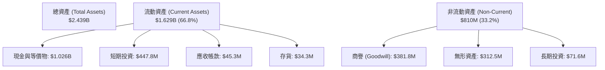

### 4.2 流動性指標分析

| 流動性指標 | FY2024 | FY2025 | Q1 2026 | 行業均值 | 評估 |
|---|---|---|---|---|---|
| **流動比率 (Current Ratio)** | 0.94 | 4.84 | **10.91** | ~1.80 | 🟢 極其充沛，無短期償債風險 |
| **速動比率 (Quick Ratio)** | 0.74 | 4.68 | **10.57** | ~1.40 | 🟢 變現能力極強，扣除存貨後依然極安全 |
| **現金佔總資產比重** | 27.3% | 48.6% | **60.4%** | ~12.0% | 🟢 現金儲備極其雄厚 |

### 4.3 債務結構健康診斷

```
╔══════════════════════════════════════════════════════════════════╗
║                      ONDS 債務健康診斷                           ║
╠══════════════════════════════════════════════════════════════════╣
║                                                                  ║
║  總債務 (Total Debt)：   $7.87M   █░░░░░░░░░░░░░░░░░░░░░░░░░░░   ║
║  總現金與短期投資：      $1.474B  ████████████████████████████   ║
║  淨現金 (Net Cash)：     $1.466B  ████████████████████████████   ║
║                                                                  ║
║  Debt/Equity 比率：      0.02x    🟢 幾無負債                    ║
║  利息保障倍數：          7.8x     🟢 利息支出無壓力              ║
║                                                                  ║
║  📊 診斷結論：公司處於「淨現金」狀態，破產風險趨近於零。         ║
╚══════════════════════════════════════════════════════════════════╝
```

### 4.4 股東權益趨勢

雖然資產負債表安全，但這主要是通過「股權融資（Dilution）」實現的。

```
╔══════════════════════════════════════════════════════════════════╗
║                ONDS 股東權益與發行股數演變                       ║
╠══════════════════════════════════════════════════════════════════╣
║                                                                  ║
║  FY2022   42M 股   ██░░░░░░░░░░░░░░░░░░░░                        ║
║  FY2023   53M 股   ███░░░░░░░░░░░░░░░░░░░                        ║
║  FY2024   70M 股   ████░░░░░░░░░░░░░░░░░░                        ║
║  FY2025   222M 股  █████████████░░░░░░░░░                        ║
║  Q1 2026  469M 股  ██████████████████████                        ║
║                                                                  ║
║  ⚠️ 警示：股數呈幾何級數增長，每股權益被大幅稀釋。               ║
╚══════════════════════════════════════════════════════════════════╝
```

---

## 5. 現金流量深度分析

ONDS 的現金流展現了典型的「融資驅動型」高成長企業特徵。

### 5.1 現金流量瀑布圖 (TTM)

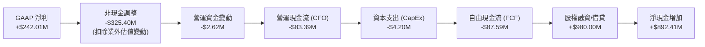

### 5.2 FCF 轉換率趨勢

| 現金流指標 (百萬美元) | FY2022 | FY2023 | FY2024 | FY2025 | TTM |
|---|---|---|---|---|---|
| **營運現金流 (CFO)** | -$37.96 | -$34.02 | -$33.47 | -$38.75 | **-$83.39** |
| **自由現金流 (FCF)** | -$40.89 | -$34.30 | -$35.20 | -$40.88 | **-$87.59** |
| **FCF / Net Income** | 55.8% | 76.5% | 92.6% | 30.6% | **-36.2%** |

*   *分析*：儘管 TTM 淨利潤為正，但 FCF 依然為負，說明公司核心業務仍需持續失血，目前主要依靠融資獲得的 $14.7 億現金維持營運。

### 5.3 自由現金流與收益率趨勢

```
╔══════════════════════════════════════════════════════════════════╗
║                  ONDS 自由現金流趨勢 (FY22 - TTM)               ║
╠══════════════════════════════════════════════════════════════════╣
║                                                                  ║
║  FY2022   -$40.89M  ██████████░░░░░░░░░░░░░░░░░░░  FCF Yield:-0.8%║
║  FY2023   -$34.30M  ████████░░░░░░░░░░░░░░░░░░░░░  FCF Yield:-0.7%║
║  FY2024   -$35.20M  ████████░░░░░░░░░░░░░░░░░░░░░  FCF Yield:-0.7%║
║  FY2025   -$40.88M  ██████████░░░░░░░░░░░░░░░░░░░  FCF Yield:-0.8%║
║  TTM      -$87.59M  ████████████████████░░░░░░░░░  FCF Yield:-0.3%║
║                                                                  ║
╚══════════════════════════════════════════════════════════════════╝
```

---

## 6. 獲利能力與資本效率

由於存在大額非經常性收益，ONDS 的獲利指標在 TTM 維度上出現了極大的扭曲，我們需要進行「剔除調整」。

### 6.1 ROE / ROA / ROIC 趨勢

| 指標 | FY2024 | FY2025 | TTM (GAAP) | TTM (剔除業外調整) | 評估 |
|---|---|---|---|---|---|
| **ROE** | -229.3% | -42.9% | **42.9%** | **-20.5%** | 🟡 賬面 ROE 極高，但扣非後依然為負 |
| **ROA** | -34.7% | -11.8% | **11.1%** | **-4.2%** | 🔴 資產利用效率（不含現金）仍待提高 |
| **ROIC**| -45.2% | -15.6% | **22.4%** | **-28.3%** | 🔴 核心投入資本回報率依然未能覆蓋資本成本 |

### 6.2 ROIC vs WACC 分析（價值創造判斷）

為了評估 ONDS 是否在為股東創造經濟價值，我們進行 WACC（加權平均資本成本）與 ROIC 的對比。

```
╔══════════════════════════════════════════════════════════════════╗
║                ONDS ROIC vs WACC 深度分析 (TTM)                  ║
╠══════════════════════════════════════════════════════════════════╣
║                                                                  ║
║  WACC 估算：                                                     ║
║  ├── 無風險利率 (10Y 美債)：  4.20%                              ║
║  ├── 市場風險溢酬 (ERP)：     5.00%                              ║
║  ├── Beta 值：                2.62 (高波動)                      ║
║  ├── 股權成本 (Ke)：          4.2% + 2.62 × 5% = 17.30%          ║
║  ├── 債務成本 (Kd，稅後)：    ~6.00%                             ║
║  ├── 資本結構：               股權 99.8%，債務 0.2%              ║
║  └── ✅ WACC ≈ 17.28%                                            ║
║                                                                  ║
║  ROIC 估算 (調整後核心業務)：                                    ║
║  ├── 核心 NOPAT (營業虧損調整後)： -$90.74M                      ║
║  ├── 投入資本 (Invested Capital)：  ~$320.00M                    ║
║  └── ✅ 核心 ROIC ≈ -28.35%                                      ║
║                                                                  ║
║  ★ 經濟價值增加 (EVA) = ROIC - WACC = -45.63pp                    ║
║                                                                  ║
║  WACC   17.28%  ▓▓▓▓▓▓▓▓▓░░░░░░░░░░░░░░░░░░░░░░░                 ║
║  ROIC  -28.35%  ░░░░░░░░░░░░░░░░░░░░░░░░░░░░░░░░  🔴 價值蠶食中   ║
║                                                                  ║
║  📊 結論：公司目前核心業務仍在摧毀股東價值，亟需營收規模化以實現  ║
║           營業利潤轉正。                                         ║
╚══════════════════════════════════════════════════════════════════╝
```

### 6.3 杜邦三因素分解 (TTM 調整後)

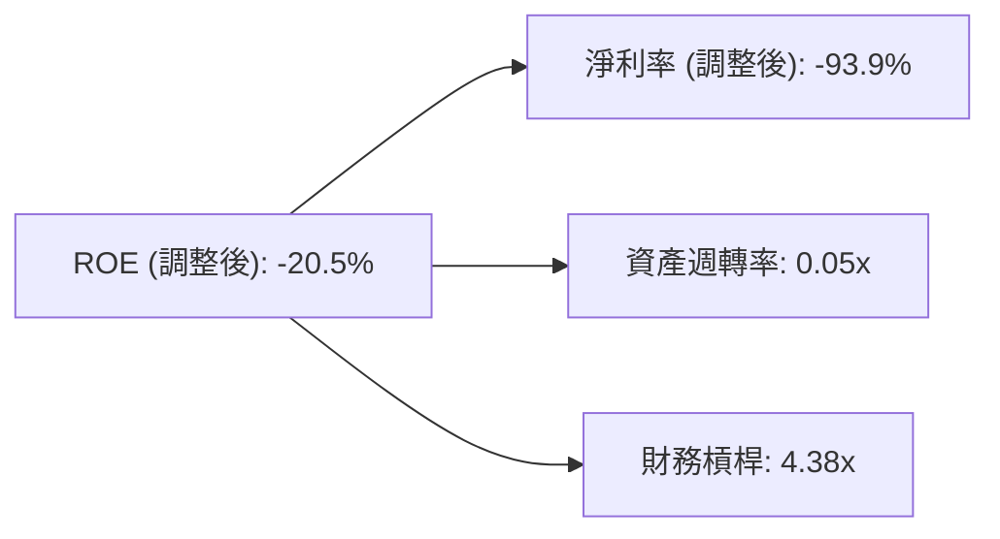

*   *分析*：ONDS 目前的低 ROE 主要受制於**極低的資產週轉率**（大量現金閒置在資產負債表上，未轉化為營收）以及**核心業務的虧損**。

---

## 7. 估值深度分析

ONDS 的估值極具爭議性。一方面，高達 **49.95 倍** 的 P/S 顯著高於歷史均值；另一方面，其營收高達 **1079.9%** 的增速讓傳統估值指標失效。

### 7.1 同業估值比較

我們選取三家與其業務高度相關的競爭對手：**AeroVironment (AVAV)**（軍用無人機巨頭）、**Kratos Defense (KTOS)**（國防無人與安全通訊）以及 **Cambium Networks (CMBM)**（私有無線網路）。

| 估值與財務指標 | **ONDS** | **AVAV** | **KTOS** | **CMBM** | 評估 |
|---|---|---|---|---|---|
| **P/S Ratio** | **49.95x** | 8.2x | 2.9x | 0.8x | 🔴 處於極端溢價狀態 |
| **EV / Revenue** | **32.77x** | 7.9x | 2.7x | 1.1x | 🔴 溢價顯著，透支了成長預期 |
| **EV / EBITDA** | **-42.42x** | 35.6x | 18.4x | -12.3x | 🟡 尚未實現常態化 EBITDA 獲利 |
| **毛利率** | **44.8%** | 39.1% | 27.5% | 41.2% | 🟢 毛利率表現優於同業 |
| **營收 YoY 增速**| **1079.9%**| 21.3% | 12.5% | -18.4% | 🟢 增速呈碾壓態勢 |

### 7.2 歷史估值區間 (P/S Trailing)

```
╔══════════════════════════════════════════════════════════════════╗
║                  ONDS P/S 歷史區間與當前位置                     ║
╠══════════════════════════════════════════════════════════════════╣
║                                                                  ║
║  歷史最低 P/S (2024-06):   2.1x                                  ║
║  歷史中位數 P/S:           15.5x                                 ║
║  當前 P/S (2026-06):       49.95x  ████████████████████████████  ║
║                                                                  ║
║  📊 估值診斷：當前估值處於歷史極高位，存在顯著的回調壓力。       ║
╚══════════════════════════════════════════════════════════════════╝
```

### 7.3 DCF 敏感性分析 (12個月目標價矩陣)

基於公司當前的高成長與高不確定性，我們採用 10 年期 DCF 模型，並對 WACC（折現率）與永續成長率（Terminal Growth Rate）進行敏感性分析。

*   *基本假設*：
    *   2026 - 2030 年營收 CAGR：55%
    *   2031 - 2035 年營收 CAGR：20%
    *   達到穩定狀態時的營業利益率：18.5%

| 永續成長率 \ WACC | **15.0%** | **17.3% (基準)** | **19.0%** |
|---|---|---|---|
| **🟢 3.5% (樂觀)** | **$26.40** (+182.9%) | **$21.50** (+130.4%) | **$17.80** (+90.8%) |
| **🟡 2.5% (基準)** | **$24.20** (+159.4%) | **$20.12** (+115.6%) | **$15.50** (+66.1%) |
| **🔴 1.5% (悲觀)** | **$20.80** (+122.9%) | **$16.00** (+71.5%) | **$12.20** (+30.8%) |

*   *結論*：即使在 WACC 高達 17.3% 的嚴苛條件下，只要公司能維持預期的營收增速，基準情境下的合理估值仍有 **$20.12**，隱含 115.6% 的上漲空間（主因是手頭 $14.7 億現金提供了極高的底層淨資產價值）。

---

## 8. 成長催化劑

ONDS 的未來成長動能主要來自地緣政治緊張帶來的國防開支增加，以及工業物聯網（IIoT）的技術升級浪潮。

### 8.1 成長催化劑時間軸 (2026 - 2028)

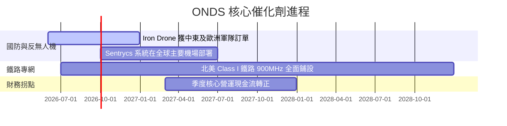

### 8.2 TAM (可定址市場規模) 估算

```
╔══════════════════════════════════════════════════════════════════╗
║                    ONDS 核心市場 TAM 預測                       ║
╠══════════════════════════════════════════════════════════════════╣
║                                                                  ║
║  1. 全球反無人機 (CUAS) 市場:  $6.8B (2026) ➔ $15.2B (2030)     ║
║     ├── ONDS 目標份額: 5% (約 $3.4億 - $7.6億營收潛力)           ║
║                                                                  ║
║  2. 北美鐵路與工業專網 (SDR):  $2.5B (2026) ➔ $4.0B (2030)      ║
║     ├── ONDS 目標份額: 30% (約 $7.5億 - $12.0億營收潛力)         ║
║                                                                  ║
║  📊 總計潛在市場規模 (TAM)：超過 $100 億美元                     ║
╚══════════════════════════════════════════════════════════════════╝
```

### 8.3 成長驅動力結構圖

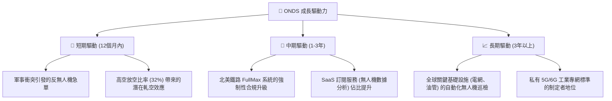

---

## 9. 風險矩陣

ONDS 是一隻典型的高回報、高風險標的，投資人必須對其潛在風險有清醒的認識。

### 9.1 風險評估矩陣

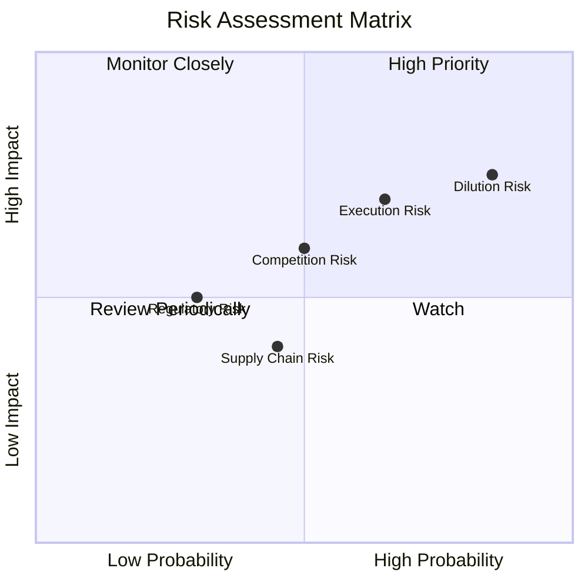

### 9.2 風險清單詳細分析

| # | 風險項目 | 發生機率 | 財務衝擊 | 風險評分 | 緩解措施 |
|---|---|---|---|---|---|
| 1 | 🔴 **股權持續稀釋** | **高 (85%)** | **高 (-20% EPS)** | 🔴 **8.5/10** | 公司已擁有 $14.7B 現金，短期內無融資迫切性，管理層應承諾暫停增發。 |
| 2 | 🔴 **客戶集中度高** | **高 (70%)** | **高 (-30% 營收)** | 🔴 **8.0/10** | 積極開拓歐洲、中東等多元化國際市場，降低對北美鐵路大客戶的依賴。 |
| 3 | 🟡 **盈餘質量與市場預期落差** | **中 (50%)** | **中 (-15% 股價)** | 🟡 **6.0/10** | 加強與投資人溝通，引導市場關注「非 GAAP 核心營運指標」而非一次性業外損益。 |
| 4 | 🟡 **地緣政治與出口管制** | **低 (30%)** | **高 (-25% 營收)** | 🟡 **5.5/10** | 將無人機生產線本土化（美國/以色列），確保符合國防軍工採購的安全合規要求。 |

---

## 10. 投資建議

### 10.1 最終綜合評級儀表板

```
╔══════════════════════════════════════════════════════════════╗
║                     ONDS 最終投資評級                        ║
╠══════════════════════════════════════════════════════════════╣
║                                                              ║
║  最終評級：  🟢 買入 (Buy) - 投機成長型配置                  ║
║  綜合得分：  7.2 / 10                                        ║
║                                                              ║
║  核心得分分解：                                              ║
║  ├── 成長動能：  ▓▓▓▓▓▓▓▓▓▓▓▓▓▓▓▓▓▓▓░  9.5/10             ║
║  ├── 財務安全：  ▓▓▓▓▓▓▓▓▓▓▓▓▓▓▓▓▓▓▓░  9.5/10             ║
║  ├── 獲利品質：  ▓▓▓▓▓▓▓▓▓▓░░░░░░░░░░  5.0/10             ║
║  └── 估值優勢：  ▓▓▓▓▓▓▓▓▓▓▓░░░░░░░░░  5.5/10             ║
║                                                              ║
║  🏆 簡評：極致的現金儲備提供了堅實的下行保護，而反無人機與   ║
║           鐵路專網的爆發則提供了極高的上行彈性。             ║
╚══════════════════════════════════════════════════════════════╝
```

### 10.2 目標價與隱含報酬率

| 情境 | 權重 | 12M 目標價 | 隱含報酬率 | 觸發條件 |
|---|---|---|---|---|
| **樂觀情境** | 25% | **$25.00** | **+167.9%** | 反無人機系統獲五角大廈或北約大額長期合約，空頭軋空爆發。 |
| **基準情境** | 50% | **$20.12** | **+115.6%** | 北美鐵路合規升級按計劃推進，季度營運虧損持續收窄。 |
| **悲觀情境** | 25% | **$6.00** | **-35.7%** | 營收增速顯著放緩，管理層再度高位增發稀釋股權。 |
| **加權預期值**| 100%| **$17.81** | **+90.9%** | **具備極高風險回報比 (R/R Ratio)** |

### 10.3 買入時機與觸發因素

```
╔══════════════════════════════════════════════════════════════════╗
║                    ✅ ONDS 投資決策 Checklist                    ║
╠══════════════════════════════════════════════════════════════════╣
║                                                                  ║
║  🟢 立即買入/加碼觸發條件：                                      ║
║  [ ] 股價回落至 $7.50 - $8.50 區間（歷史成交密集區，支撐強勁）   ║
║  [ ] 官方宣佈獲得單筆金額超過 $5,000 萬美元的軍工訂單           ║
║  [ ] 空頭佔比（Short Interest）開始下降，軋空行情啟動            ║
║                                                                  ║
║  🔴 減碼/停損觸發條件：                                          ║
║  [ ] 季度營收 YoY 增速跌破 50%                                   ║
║  [ ] 管理層宣佈新的股權增發計劃，發行股數超過 6 億股             ║
║  [ ] 核心流動比率跌破 3.0x（表明現金儲備被不合理消耗）           ║
╚══════════════════════════════════════════════════════════════════╝
```

### 10.4 投資人適配度分析

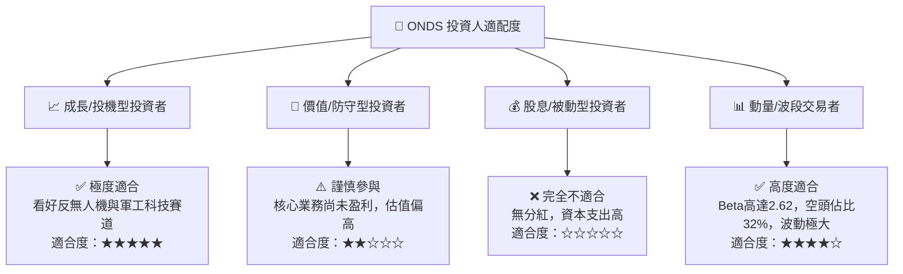

### 10.5 關鍵監控指標

為了追蹤 ONDS 的投資邏輯是否發生變化，投資人應在未來數季重點監控以下指標：

| 監控維度 | 關鍵指標 | 警戒線 | 理想目標 | 監控頻率 |
|---|---|---|---|---|
| **核心成長** | 季度營業收入 | < $3,000 萬美元 | > $6,000 萬美元 | 每季財報 |
| **盈餘質量** | 扣非後營業利潤 (Operating Income) | 虧損擴大至