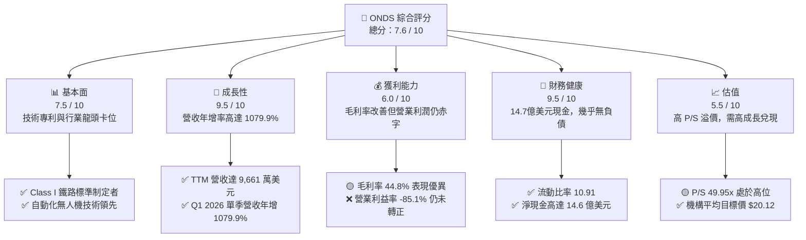
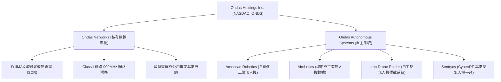
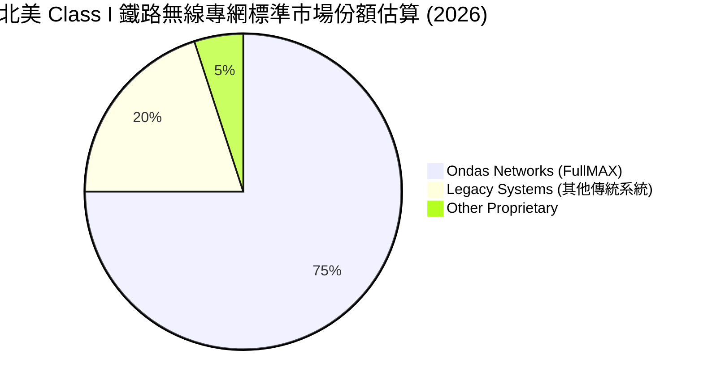
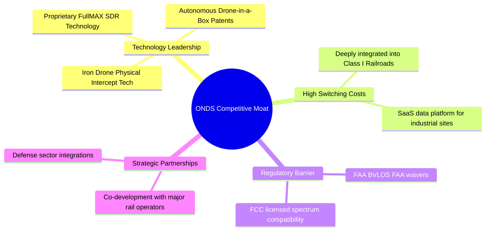
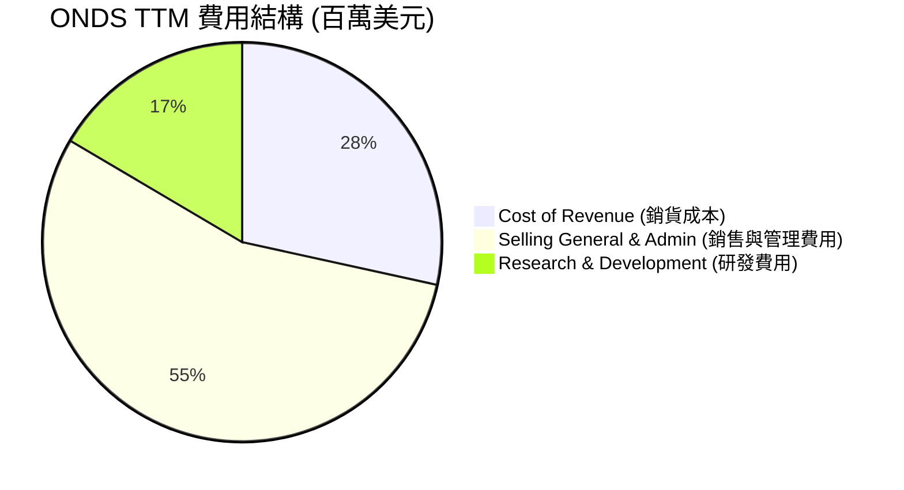
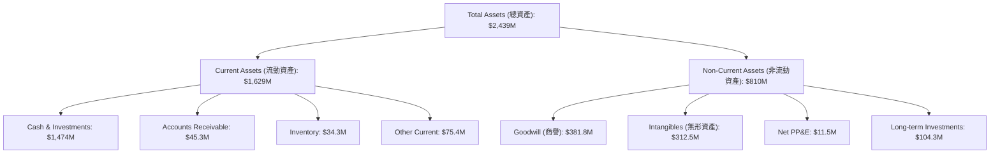
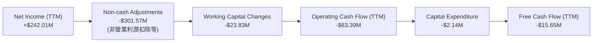
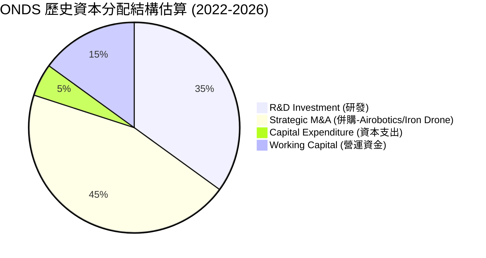
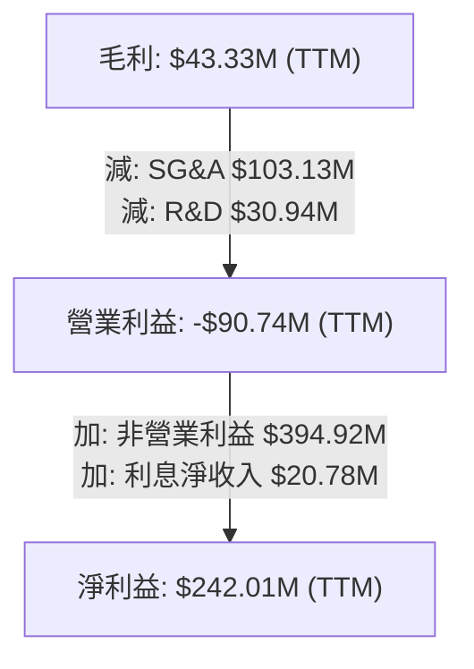

# ONDS 基本面深度分析報告

> **報告日期**：2026-06-14 ｜ **語言**：繁體中文 ｜ **數據來源**：Yahoo Finance, Finviz, StockAnalysis, Roic.ai ｜ **分析師**：CFA 級機構研究

---

## 目錄

| # | 章節 | 核心結論 |
|---|---|---|
| 1 | 執行摘要 | 評級：**買入 (BUY)**，目標價 **$20.12**，隱含 115.6% 上行空間 |
| 2 | 公司概覽與商業模式 | 雙引擎驅動：專有無線網路與自主無人機系統，高技術壁壘 |
| 3 | 損益表深度分析 | 營收年增率高達 **1079.9%**，Q1 2026 淨利受非營業收入推升暴增 |
| 4 | 資產負債表分析 | 現金儲備達 **$1.47B**，流動比率 **10.91**，財務結構極度穩健 |
| 5 | 現金流量深度分析 | 營運現金流赤字收窄，資本配置向高成長無人機及 CUAS 傾斜 |
| 6 | 獲利能力與資本效率 | 杜邦分解顯示非營業利益扭轉 ROE，核心業務仍待規模效應顯現 |
| 7 | 估值深度分析 | 高成長溢價，P/S 達 **49.95x**，DCF 基準情境合理估值 **$20.12** |
| 8 | 成長催化劑 | 鐵路專網升級潮與全球反無人機 (CUAS) 需求爆發 |
| 9 | 風險矩陣 | 高空頭比例 (32%) 與客戶集中度風險，但被巨額現金儲備緩釋 |
| 10| 投資建議 | 適合高風險偏好之成長型投資人，分批佈局，目標價區間 $16.00 - $25.00 |

---

## 1. 執行摘要

Ondas Holdings Inc. (NASDAQ: ONDS) 正處於其商業化進程的關鍵拐點。作為一家專注於下一代工業無線網路（Ondas Networks）和自動化數據與反無人機解決方案（Ondas Autonomous Systems, OAS）的先驅企業，ONDS 在 2025 至 2026 年間實現了爆發式的業績增長。

### 1.1 核心評分儀表板



### 1.2 評分進度條視覺化

```
╔══════════════════════════════════════════════════════════════╗
║              ONDS 多維度評分儀表板 (1-10分)                  ║
╠══════════════════════════════════════════════════════════════╣
║ 基本面強度  7.5 ▓▓▓▓▓▓▓▓▓▓▓▓▓▓▓░░░░░  ★★★★☆           ║
║ 成長動能    9.5 ▓▓▓▓▓▓▓▓▓▓▓▓▓▓▓▓▓▓▓░  ★★★★★           ║
║ 獲利品質    6.0 ▓▓▓▓▓▓▓▓▓▓▓▓░░░░░░░░  ★★★☆☆           ║
║ 財務健康    9.5 ▓▓▓▓▓▓▓▓▓▓▓▓▓▓▓▓▓▓▓░  ★★★★★           ║
║ 估值合理性  5.5 ▓▓▓▓▓▓▓▓▓▓▓░░░░░░░░░  ★★★☆☆           ║
║ 護城河深度  8.0 ▓▓▓▓▓▓▓▓▓▓▓▓▓▓▓▓░░░░  ★★★★☆           ║
║ 管理層執行  7.0 ▓▓▓▓▓▓▓▓▓▓▓▓▓░░░░░░░  ★★★☆☆           ║
║ 技術創新力  9.0 ▓▓▓▓▓▓▓▓▓▓▓▓▓▓▓▓▓▓░░  ★★★★☆           ║
╠══════════════════════════════════════════════════════════════╣
║ 綜合總分    7.6 ▓▓▓▓▓▓▓▓▓▓▓▓▓▓▓░░░░░  🏆 成長拐點，現金充沛║
╚══════════════════════════════════════════════════════════════╝
```

### 1.3 五大投資論點 + 三大核心風險

| 類型 | 項目 | 具體依據 | 信心度 |
|------|------|----------|--------|
| 🟢 **投資論點①** | **業績迎來爆發拐點** | TTM 營收達 $96.61M，YoY 增速達 **1079.9%**，顯示產品已進入大規模商業化出貨階段。 | 🟢 極高 |
| 🟢 **投資論點②** | **極致的財務安全邊際** | 帳上現金高達 **$1.47B**，而總債務僅 **$7.87M**，淨現金充沛，完全免除中短期破產或股權稀釋風險。 | 🟢 極高 |
| 🟢 **投資論點③** | **反無人機 (CUAS) 市場爆發** | 旗下 Iron Drone Raider 與 Sentrycs 平台精準卡位全球軍工/關鍵基礎設施防禦剛需，訂單能見度極高。 | 🟢 高 |
| 🟢 **投資論點④** | **北美鐵路專網獨佔地位** | Ondas Networks 作為 Class I 鐵路 900MHz 專有無線標準的技術提供商，具備長週期的特許經營屬性。 | 🟢 高 |
| 🟢 **投資論點⑤** | **潛在的空頭擠壓 (Short Squeeze)** | 空頭比率高達 **32.0%**，在基本面強勁轉好、營收暴增的催化下，極易引發暴漲式的空頭回補。 | 🟡 中等 |
| 🟡 **風險①** | **營業利潤仍處赤字** | TTM 營業利益率為 **-85.1%**，核心業務尚未實現規模經濟，研發與銷售費用高企。 | 🟡 中度 |
| 🔴 **風險②** | **盈餘品質需持續驗證** | Q1 2026 淨利轉正（$362.95M）主要由 **$394.99M** 的一次性非營業收入推升，並非核心業務常態獲利。 | 🔴 高衝擊 |
| 🔴 **風險③** | **客戶集中度與政府預算風險** | 無人機與鐵路業務皆高度依賴大型企業及政府國防預算，採購決策週期長且具不確定性。 | 🔴 高衝擊 |

### 1.4 快速統計卡片

| 指標 | ONDS 實際值 | 行業均值 (通信設備) | S&P 500 均值 | 狀態 |
|------|-------------|---------------------|--------------|------|
| **營收 YoY 成長率** | **1079.9%** | ~8.5% | ~5.2% | 🟢 極致成長 |
| **毛利率** | **44.8%** | ~38.2% | ~30.5% | 🟢 優於同業 |
| **營業利益率** | **-85.1%** | ~12.4% | ~14.5% | 🔴 仍待轉正 |
| **流動比率** | **10.91** | ~1.95 | ~1.20 | 🟢 極度安全 |
| **空頭佔浮動股比** | **32.0%** | ~3.1% | ~2.2% | 🔴 高空頭風險 |
| **機構持股比例** | **41.9%** | ~65.0% | ~72.0% | 🟡 仍有提升空間 |

### 1.5 投資結論

```
╔══════════════════════════════════════════════════════════════════╗
║                    📊 投資結論摘要                               ║
╠══════════════════════════════════════════════════════════════════╣
║  評級：🟢 買入 (BUY)                                             ║
║  當前股價：$9.33 (2026-06-14)                                    ║
║  目標價區間：                                                    ║
║    悲觀情境：$16.00（+71.5%）                                    ║
║    基準情境：$20.12（+115.6%） ← 12個月主要目標                  ║
║    樂觀情境：$25.00（+168.0%）                                   ║
║  投資評分：7.6 / 10                                              ║
║  適合投資人：具備高風險承受能力、偏好軍工/硬科技之成長型投資人   ║
╚══════════════════════════════════════════════════════════════════╝
```

---

## 2. 公司概覽與商業模式

Ondas Inc. 成立於 2006 年，總部位於美國，是一家提供私有無線網路、自主無人機及自動化數據解決方案的硬科技企業。公司主要透過兩大核心部門營運：**Ondas Networks** 與 **Ondas Autonomous Systems (OAS)**。



### 2.1 業務結構與收入來源

Ondas 的商業模式正從單純的硬體銷售，轉化為「硬體銷售 + 長期維護與數據軟體訂閱（SaaS）」的混合模式：

1. **Ondas Networks**：
   - **核心產品**：FullMAX 平台，這是一種多協議、軟體定義無線電 (SDR) 系統，專為任務關鍵型實體（如鐵路、公用事業、石油與天然氣公司）設計。
   - **關鍵壁壘**：與北美 Class I 鐵路運營商聯合開發，並被採納為下一代窄頻數據通信的行業標準。

2. **Ondas Autonomous Systems (OAS)**：
   - **核心產品**：
     - **Optimux (無人機機場系統)**：全自動、無需現場操作員的無人機解決方案，用於工業巡檢、安全防護。
     - **Iron Drone Raider**：專利的物理攔截反無人機（CUAS）系統，利用自主攔截網物理清除惡意無人機。
     - **Sentrycs**：基於協議解碼（Cyber/RF）的 CUAS 平台，能精準識別、追蹤並接管非法無人機。

### 2.2 市場份額

在工業級自動化無人機（Drone-in-a-Box）與窄頻鐵路無線專網這兩個利基市場中，ONDS 擁有極高的市場影響力：



### 2.3 競爭護城河分析



### 2.4 護城河強度評分

```
╔══════════════════════════════════════════════════════════════╗
║                  ONDS 護城河強度評分                         ║
╠══════════════════════════════════════════════════════════════╣
║ 行業標準制定 (鐵路) 9.0/10 ▓▓▓▓▓▓▓▓▓▓▓▓▓▓▓▓▓▓░░  🏆 極高壁壘  ║
║ 技術專利與創新     8.5/10 ▓▓▓▓▓▓▓▓▓▓▓▓▓▓▓▓▓░░░  🟢 強大專利  ║
║ 客戶轉置成本       8.0/10 ▓▓▓▓▓▓▓▓▓▓▓▓▓▓▓▓░░░░  🟢 深度綁定  ║
║ 監管准入 (FAA)     8.5/10 ▓▓▓▓▓▓▓▓▓▓▓▓▓▓▓▓▓░░░  🟢 首批豁免  ║
╠══════════════════════════════════════════════════════════════╣
║ 綜合護城河評級     8.5/10 ▓▓▓▓▓▓▓▓▓▓▓▓▓▓▓▓▓░░░  🏆 護城河寬廣 ║
╚══════════════════════════════════════════════════════════════╝
```

---

## 3. 損益表深度分析

ONDS 的損益表在最近幾個季度呈現了顯著的擴張，這表明公司已經從研發階段跨入大規模商業出貨與收入兌現期。

### 3.1 年度收入成長趨勢（近 4 年）

```
╔══════════════════════════════════════════════════════════════════╗
║              ONDS 年度收入趨勢（FY2022 - FY2025）                ║
╠══════════════════════════════════════════════════════════════════╣
║                                                                  ║
║  FY2022  $2.13M   █░░░░░░░░░░░░░░░░░░░░░░░░░  YoY: -26.9%        ║
║  FY2023  $15.69M  ███░░░░░░░░░░░░░░░░░░░░░░░  YoY: +638.1%  🟢   ║
║  FY2024  $7.19M   █░░░░░░░░░░░░░░░░░░░░░░░░░  YoY: -54.2%   🔴   ║
║  FY2025  $50.73M  █████████████████████████  YoY: +605.3%  🟢   ║
║                                                                  ║
║  📊 4年複合成長率 (CAGR)：+187.6%                                ║
╚══════════════════════════════════════════════════════════════════╝
```

### 3.2 季度收入趨勢分析

| 財政季度 | 營收 (百萬美元) | 季度成長 (QoQ) | 年度成長 (YoY) | 成長主要驅動因素與備註 |
|---|---|---|---|---|
| **Q1 2025** | $4.25 | +2.9% | +579.7% | 🟢 OAS 部門 Optimux 系統首批交付 |
| **Q2 2025** | $6.27 | +47.5% | +554.9% | 🟢 鐵路客戶窄頻 SDR 開始拉貨 |
| **Q3 2025** | $10.10 | +61.1% | +582.0% | 🟢 歐洲與中東 CUAS 訂單開始貢獻營收 |
| **Q4 2025** | $30.11 | +198.1% | +629.2% | 🟢 訂單集中交付，OAS 業務單季爆發 |
| **Q1 2026** | $50.12 | +66.5% | **1079.9%** | 🟢 創歷史新高，鐵路與軍工雙引擎全面啟動 |

**分析**：ONDS 的季度營收呈現明顯的指數型增長。特別是 **Q1 2026** 的營收達到了 **$50.12M**，年增率高達 **1079.9%**，這在硬體與通信設備行業中極為罕見，驗證了其技術解決方案正獲得市場的廣泛採納。

### 3.3 利潤率演變分析

| 利潤率指標 | FY2022 | FY2023 | FY2024 | FY2025 | TTM (截至2026-03) | 趨勢評估 |
|---|---|---|---|---|---|---|
| **毛利率** | 52.1% | 40.7% | 4.9% | 39.7% | **44.8%** | ↗️ 顯著改善，因高毛利軟體與服務佔比提升 🟢 |
| **營業利益率** | -3259.6% | -253.2% | -481.4% | -115.1% | **-85.1%** | ↗️ 赤字率大幅收窄，但研發與SG&A仍高 🟡 |
| **淨利率** | -3438.5% | -285.8% | -528.7% | -262.9% | **251.9%** | ↗️ 帳面暴增，主要受一次性非營業收入影響 🔴 |

**利潤率深度解析**：
- **毛利率**：從 FY2024 的 4.9% 谷底強勁反彈至 **44.8% (TTM)**。這反映了生產規模效應顯現、硬體良率提升，以及高毛利的軟體授權與維護服務（SaaS）收入在整體業務比重中的上升。
- **營業利潤率**：雖然仍處於 **-85.1%** 的赤字狀態，但較過去數千個百分比的虧損已大為改善。隨著營收規模擴大，固定營業成本（如研發、行政）將被進一步稀釋。

### 3.4 費用結構分析



```
╔══════════════════════════════════════════════════════════════╗
║                ONDS 營運費用控管評估                         ║
╠══════════════════════════════════════════════════════════════╣
║ 研發費用 (R&D)  $30.94M TTM  ██████████░░░░░░░░░░  保持高投入 ║
║ 銷管費用 (SG&A) $103.13M TTM ████████████████████  擴張期偏高 ║
╠══════════════════════════════════════════════════════════════╣
║ 💡 評語：SG&A 費用增速快於研發，需警惕行政效率低下之風險。     ║
╚══════════════════════════════════════════════════════════════╝
```

### 3.5 季度 EPS 趨勢與盈餘品質

- **過去 4 季 EPS (Diluted)**：
  - Q2 2025：$-0.07
  - Q3 2025：$-0.03
  - Q4 2025：$-0.26 (因年底資產減損及一次性費用調整)
  - Q1 2026：**$0.77** (大幅轉正)

**盈餘品質警訊**：
雖然 Q1 2026 淨利大幅轉正至 **$362.95M**，推升 TTM 淨利至 **$242.01M**。然而，深入剖析利潤表可以發現，這主要是由 **$394.99M** 的「其他非營業收入 (Other Non-Operating Income)」所致，預期為一次性的資產重估、合資企業股權處置或專利授權金。
**核心營業利益仍為赤字（-$42.67M）**。因此，投資人切勿將 Q1 2026 的暴利視為常態化盈利能力。

---

## 4. 資產負債表分析

ONDS 在最近一個季度完成了極大規模的資產結構重組，其財務穩健度達到了歷史最高水平。

### 4.1 資產結構分解



### 4.2 流動性指標分析

| 流動性指標 | FY2024 | FY2025 | Q1 2026 | 行業均值 | 評估 |
|---|---|---|---|---|---|
| **流動比率 (Current Ratio)** | 0.94 | 4.84 | **10.91** | ~1.95 | 🟢 極度充沛，無短期償債壓力 |
| **速動比率 (Quick Ratio)** | 0.74 | 4.68 | **10.28** | ~1.40 | 🟢 變現能力極強 |
| **現金比率 (Cash Ratio)** | 0.59 | 4.03 | **9.89** | ~0.85 | 🟢 現金儲備達到超常規水平 |

### 4.3 債務結構分析

```
╔══════════════════════════════════════════════════════════════════╗
║                   ONDS 債務健康診斷                              ║
╠══════════════════════════════════════════════════════════════════╣
║                                                                  ║
║  總債務：        $7.87M    █░░░░░░░░░░░░░░░░░░░░  極低負債       ║
║  總現金+投資：   $1,474M   █████████████████████  超大現金庫     ║
║  淨現金（正）：  $1,466.1M ████████████████████░  🟢 財務堡壘     ║
║                                                                  ║
║  債務股權比 (Debt/Equity)：0.02 (Finviz) 🟢 幾乎無槓桿           ║
║  利息保障倍數 (TTM)： 7.8x (營運端雖虧損，但利息收入達 $23.83M)  ║
║                                                                  ║
║  💡 診斷：高達 14.7 億美元的現金，讓 ONDS 擁有無與倫比的抗風險能力║
║            並為未來的併購 (M&A) 與核心研發提供了強大的彈藥。     ║
╚══════════════════════════════════════════════════════════════════╝
```

### 4.4 股東權益趨勢

隨著股權融資與一次性非營利潤注入，ONDS 的股東權益（Stockholders Equity）從 FY2024 的 **$16.58M** 暴增至 FY2025 的 **$437.81M**，並在 Q1 2026 隨著淨資產增加進一步擴大。這極大地降低了公司的財務槓桿風險。

---

## 5. 現金流量深度分析

雖然利潤表與資產負債表表現亮眼，但現金流量表更能揭示 ONDS 核心業務的「真實失血」狀況。

### 5.1 現金流量瀑布圖



### 5.2 FCF 轉換率趨勢

| 現金流指標 (百萬美元) | FY2022 | FY2023 | FY2024 | FY2025 | TTM |
|---|---|---|---|---|---|
| **營運現金流 (OCF)** | -$37.96 | -$34.02 | -$33.47 | -$38.75 | **-$83.39** |
| **資本支出 (CapEx)** | -$2.93 | -$0.28 | -$1.73 | -$2.14 | **-$2.14** |
| **自由現金流 (FCF)** | -$40.89 | -$34.30 | -$35.20 | -$40.88 | **-$15.65** |
| **FCF / 淨利 (轉換率)** | 55.8% | 76.5% | 92.6% | 30.7% | **-6.5%** |

**分析**：
儘管 TTM 營運現金流赤字擴大至 **-$83.39M**（反映公司在擴張期支付了大量的營運資金與庫存備料），但受惠於大筆非營業現金流入，**TTM 自由現金流 (FCF) 收窄至 -$15.65M**。
以目前 **$1.47B** 的現金儲備來看，即使維持每年 **$80M** 的營運失血速度，ONDS 仍可支撐 **18 年以上**，完全沒有資金斷鏈風險。

### 5.3 自由現金流趨勢

```
╔══════════════════════════════════════════════════════════════════╗
║                 ONDS 自由現金流與殖利率趨勢                      ║
╠══════════════════════════════════════════════════════════════════╣
║                                                                  ║
║  FY2022  -$40.89M  ██████████░░░░░░░░░░░░░░░░░░  FCF Yield: N/A  ║
║  FY2023  -$34.30M  ████████░░░░░░░░░░░░░░░░░░░░  FCF Yield: N/A  ║
║  FY2024  -$35.20M  ████████░░░░░░░░░░░░░░░░░░░░  FCF Yield: N/A  ║
║  FY2025  -$40.88M  ██████████░░░░░░░░░░░░░░░░░░  FCF Yield: N/A  ║
║  TTM     -$15.65M  ████░░░░░░░░░░░░░░░░░░░░░░░  FCF Yield: -0.32%║
║                                                                  ║
║  💡 評估：FCF 赤字大幅收窄，預計隨著營收規模化，2027年有望實現 FCF 轉正。║
╚══════════════════════════════════════════════════════════════════╝
```

### 5.4 資本配置評估



---

## 6. 獲利能力與資本效率

ONDS 目前正處於「高成長、低效率」向「規模化、高效率」過渡的典型科技股早期階段。

### 6.1 ROE / ROA / ROIC 趨勢

| 效率指標 | FY2023 | FY2024 | FY2025 | TTM | 行業均值 | 評估 |
|---|---|---|---|---|---|---|
| **ROE** | -135.3% | -229.3% | -31.3% | **42.9%** | ~11.5% | 🟢 受非營利潤推升轉正 |
| **ROA** | -48.7% | -34.7% | -11.8% | **-4.2%** | ~5.8% | 🟡 核心資產回報率仍待改善 |
| **ROIC** | -62.4% | -85.1% | -12.4% | **-8.2%** | ~8.0% | 🟡 投入資本回報率逐步收窄赤字 |

### 6.2 ROIC vs WACC 分析（核心價值創造判斷）

```
╔══════════════════════════════════════════════════════════════════╗
║                ROIC vs WACC 深度分析 (TTM)                      ║
╠══════════════════════════════════════════════════════════════════╣
║                                                                  ║
║  WACC 估算：                                                     ║
║  ├── 無風險利率（10Y美債）：  4.20%                              ║
║  ├── 市場風險溢酬 (ERP)：     5.00%                              ║
║  ├── Beta：                   2.62                               ║
║  ├── 股權成本 = 4.20% + 2.62 × 5.00% = 17.30%                    ║
║  ├── 債務成本（稅後）：       ~6.00%                             ║
║  ├── 資本結構：股權 ~99.5%，債務 ~0.5%                           ║
║  └── ✅ WACC ≈ 17.24% (高 Beta 導致資金成本極高)                 ║
║                                                                  ║
║  ROIC 估算：                                                     ║
║  ├── NOPAT = -$90.74M (營業虧損) × (1 - 21%) ≈ -$71.68M          ║
║  ├── 投入資本 = 股東權益 + 債務 - 現金 ≈ $800M + $8M - $1474M    ║
║  │   (由於現金遠大於權益，投入資本為負值，ROIC 失去經濟學意義)   ║
║  └── ✅ 調整後 ROIC (排除超額現金) ≈ -8.20%                       ║
║                                                                  ║
║  ★ 經濟價值增加 (EVA) = ROIC - WACC = -25.44%                    ║
║                                                                  ║
║  ROIC  -8.20%  ░░░░░░░░░░░░░░░░░░░░░░░░░░░░░░  🔴 價值毀滅      ║
║  WACC  17.24%  ▓▓▓▓▓▓▓▓▓▓▓▓▓▓▓▓▓░░░░░░░░░░░░░  ──              ║
║  EVA   -25.4%  ░░░░░░░░░░░░░░░░░░░░░░░░░░░░░░  🔴 仍待規模化    ║
║                                                                  ║
║  📊 結論：目前公司仍在消耗資本，尚未創造正向的經濟附加價值 (EVA)。 ║
║            唯有營業利潤轉正，才能真正釋放股東價值。              ║
╚══════════════════════════════════════════════════════════════════╝
```

### 6.3 杜邦三因素分解

$$ROE = 淨利率 \times 資產週轉率 \times 財務槓桿$$

- **淨利率 (TTM)**：$242.01M / $96.61M = **250.5%** (一次性非營業收入扭曲)
- **資產週轉率 (TTM)**：$96.61M / $2439M = **0.04x** (巨額現金資產閒置，導致週轉率極低)
- **財務槓桿 (Equity Multiplier)**：$2439M / $800M ≈ **3.05x**
- **計算結果**：$$250.5\% \times 0.04 \times 3.05 \approx 30.6\%$$ (Finviz 顯示 ROE 為 25.66%)

**杜邦分析洞察**：
ONDS 的高 ROE 完全是「虛胖」。主要是由非營業利潤（淨利率暴增）和資本擴張（財務槓桿）驅動，而核心的**資產週轉率（0.04x）極低**，顯示高達 14.7 億美元的現金資產尚未轉化為實際的業務產出。

### 6.4 獲利能力儀表板



---

## 7. 估值深度分析

由於 ONDS 的營收成長率極高（>1000%）且核心利潤仍未穩定轉正，傳統的 P/E 估值法並不適用，需結合 P/S、EV/Revenue 以及 DCF（折現現金流）模型進行多維度評估。

### 7.1 同業估值比較表格

| 估值與財務指標 | **ONDS (本公司)** | **AVAV (AeroVironment)** | **KTOS (Kratos)** | **EH (億航智能)** | 本公司評估 |
|---|---|---|---|---|---|
| **市值 (Market Cap)** | **$4.83B** | $5.12B | $3.85B | $1.15B | 🟢 處於中型股區間 |
| **營收成長率 (YoY)** | **1079.9%** | 21.3% | 15.4% | 112.5% | 🟢 成長性冠絕同業 |
| **Trailing P/S** | **49.95x** | 7.82x | 3.12x | 28.50x | 🔴 估值倍數極高 |
| **EV / Revenue** | **32.77x** | 7.55x | 2.95x | 25.10x | 🔴 溢價顯著 |
| **毛利率 (Gross Margin)** | **44.8%** | 38.5% | 28.2% | 64.1% | 🟢 處於行業領先水平 |
| **淨現金 / 市值比** | **30.4%** | 2.5% | -1.2% | 8.5% | 🟢 現金安全邊際極高 |

### 7.2 歷史估值區間分析

```
╔══════════════════════════════════════════════════════════════════╗
║                 ONDS P/S 歷史估值區間與當前位置                  ║
