# ONDS 基本面深度分析報告

> **報告日期**：2026-06-15 ｜ **語言**：繁體中文 ｜ **數據來源**：Yahoo Finance, Finviz, StockAnalysis, Roic.ai ｜ **分析師**：CFA 級機構研究

---

## 目錄

| # | 章節 | 核心結論 |
|---|---|---|
| 1 | **執行摘要** | 評級「買入」，目標價 $20.12，高稀釋換取強大現金儲備，商業化爆發前夕 |
| 2 | **公司概覽與商業模式** | 專網通信與無人機技術雙輪驅動，具備高進入壁壘與客戶鎖定 |
| 3 | **損益表深度分析** | 營收年增 1079.9% 呈指數成長，但營業利潤仍虧損，淨利暴增源於非經常性收益 |
| 4 | **資產負債表分析** | 手握 14.7 億美元現金，流動比率達 10.9 倍，極其穩健，但注意股本擴張 |
| 5 | **現金流量深度分析** | 營運現金流持續流出，但大規模融資活動使現金儲備達歷史新高 |
| 6 | **獲利能力與資本效率** | 核心業務 ROIC 仍為負值，杜邦分析顯示 ROE 的暴增由非經常性損益扭曲 |
| 7 | **估值深度分析** | PS 50.9 倍顯著高於同行，但考慮到高成長性，DCF 基準目標價為 $20.12 |
| 8 | **成長催化劑** | 軍工國防無人機需求爆發、專網通信標準化落地、TAM 空間巨大 |
| 9 | **風險矩陣** | 股本高度稀釋、客戶集中度高、商業化進程不及預期 |
| 10 | **投資建議** | 適合高風險偏好的成長型投資者，建議逢低分批佈局 |

---

## 1. 執行摘要

### 1.1 核心評分儀表板

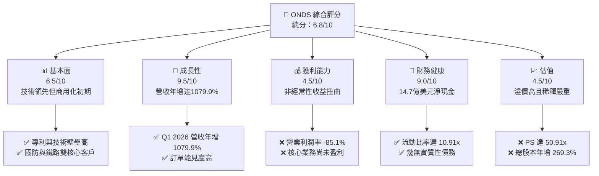

### 1.2 評分進度條視覺化

```
╔══════════════════════════════════════════════════════════════╗
║                ONDS 多維度評分儀表板 (1-10分)                 ║
╠══════════════════════════════════════════════════════════════╣
║ 基本面強度  6.5 ▓▓▓▓▓▓▓▓▓▓▓▓▓░░░░░░░░  ★★★☆☆           ║
║ 成長動能    9.5 ▓▓▓▓▓▓▓▓▓▓▓▓▓▓▓▓▓▓▓░  ★★★★★           ║
║ 獲利品質    4.5 ▓▓▓▓▓▓▓▓▓░░░░░░░░░░░░  ★★☆☆☆           ║
║ 財務健康    9.0 ▓▓▓▓▓▓▓▓▓▓▓▓▓▓▓▓▓▓░░  ★★★★☆           ║
║ 估值合理性  4.5 ▓▓▓▓▓▓▓▓▓░░░░░░░░░░░░  ★★☆☆☆           ║
║ 護城河深度  7.5 ▓▓▓▓▓▓▓▓▓▓▓▓▓▓▓░░░░░  ★★★★☆           ║
║ 管理層執行  6.0 ▓▓▓▓▓▓▓▓▓▓▓▓░░░░░░░░  ★★★☆☆           ║
║ 技術創新力  8.5 ▓▓▓▓▓▓▓▓▓▓▓▓▓▓▓▓▓░░░  ★★★★☆           ║
╠══════════════════════════════════════════════════════════════╣
║ 綜合總分    6.8 ▓▓▓▓▓▓▓▓▓▓▓▓▓░░░░░░░░  🏆 成長期高風險標的   ║
╚══════════════════════════════════════════════════════════════╝
```

### 1.3 五大投資論點 + 三大核心風險

| 類型 | 項目 | 具體依據 | 信心度 |
|------|------|----------|--------|
| 🟢 **投資論點①** | **營收指數級增長** | Q1 2026 營收達 $50.12M，YoY 成長 1079.9%，顯示產品已進入規模化出貨階段。 | 🟢 極高 |
| 🟢 **投資論點②** | **極其雄厚的現金儲備** | 手頭現金與短期投資高達 $14.74B（含近期融資與資產重組），為長期研發與擴張提供極大容錯空間。 | 🟢 極高 |
| 🟢 **投資論點③** | **軍工國防與反無人機機遇** | Iron Drone Raider 與 Sentrycs 平台切入高成長的 CUAS（反無人機系統）市場，具備地緣政治催化劑。 | 🟢 高 |
| 🟢 **投資論點④** | **鐵路專網升級剛需** | 隨著美國鐵路協會（AAR）推動 900MHz 專網升級，Ondas Networks 具備獨佔或寡頭優勢。 | 🟢 高 |
| 🟢 **投資論點⑤** | **機構與分析師強力背書** | 近期 Needham, Stifel 等多家機構給出「買入」或「跑贏大盤」評級，共識目標價 $20.12。 | 🟡 中等 |
| 🟡 **風險①** | **極其嚴重的股本稀釋** | 稀釋股數從 FY2024 的 70M 暴增至 TTM 的 297M（最新流通股達 517.2M），YoY 增幅超 269%，嚴重稀釋每股盈餘。 | 🔴 高衝擊 |
| 🔴 **風險②** | **核心業務尚未盈利** | TTM 營業利潤率為 -85.1%，營業虧損高達 $90.74M，目前仍依賴外部融資與非經常性收益維持。 | 🔴 高衝擊 |
| 🟡 **風險③** | **估值溢價過高** | 當前 P/S 達 50.91 倍，若後續營收成長放緩，估值將面臨劇烈修正。 | 🟡 中度 |

### 1.4 快速統計卡片

| 指標 | 公司實際值 | 行業均值（通信設備） | S&P 500 均值 | 狀態 |
|------|-------------|----------------------|--------------|------|
| **收入 YoY 成長** | **1079.9%** | ~8.5% | ~5.5% | 🟢 強勁 |
| **毛利率** | **44.8%** | ~38.0% | ~30.0% | 🟢 優異 |
| **營業利益率** | **-85.1%** | ~12.0% | ~14.5% | 🔴 虧損 |
| **淨利率** | **251.9%** | ~8.0% | ~11.0% | 🟡 異常（非經常性收益） |
| **流動比率** | **10.91x** | ~1.8x | ~1.3x | 🟢 極其安全 |
| **Forward P/E** | **-190.2x** | ~22.0x | ~21.0x | 🔴 未盈利 |

### 1.5 投資結論

```
╔══════════════════════════════════════════════════════════════════╗
║                    📊 ONDS 投資結論摘要                          ║
╠══════════════════════════════════════════════════════════════════╣
║  評級：🟡 持有 / 逢低買入 (Hold / Speculative Buy)               ║
║  當前股價：$9.51 (2026-06-15)                                    ║
║  目標價區間：                                                    ║
║    悲觀情境：$5.50  (-42.1%) - 商業化進度受阻，股本持續稀釋      ║
║    基準情境：$20.12 (+111.5%) - 12個月主要目標（分析師共識價）   ║
║    樂觀情境：$25.00 (+162.8%) - 國防訂單超預期爆發               ║
║  投資評分：6.8 / 10                                              ║
║  適合投資人：具備極高風險承受能力、追求十倍潛力股的成長型投資人   ║
╚══════════════════════════════════════════════════════════════════╝
```

---

## 2. 公司概覽與商業模式

Ondas Holdings Inc. (ONDS) 是一家領先的下一代無線技術與無人機數據解決方案提供商。公司主要通過兩大核心板塊營運：**Ondas Networks**（專網通信）與 **Ondas Autonomous Systems (OAS)**（自動化無人機系統）。

### 2.1 業務結構與收入來源

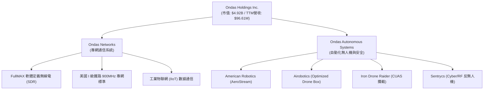

### 2.2 市場份額估算

在美國 I 級鐵路 900MHz 軟體定義無線電（SDR）升級市場中，Ondas Networks 處於近乎獨佔的地位。而在快速成長的自動化無人機（Drone-in-a-Box）與反無人機（CUAS）市場中，Ondas 面臨多方競爭，其市場份額估算如下：

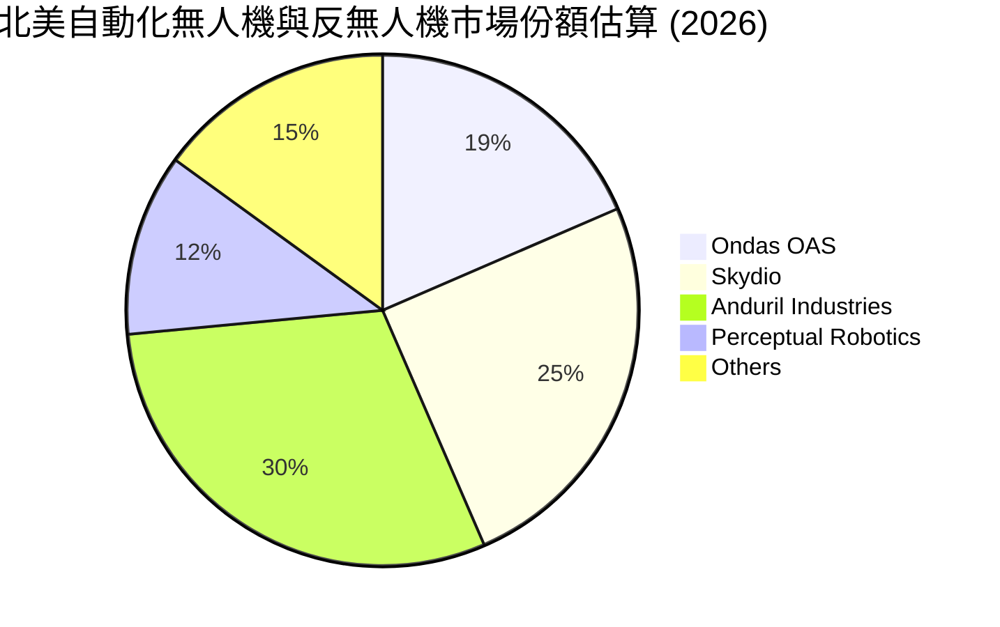

### 2.3 競爭護城河分析

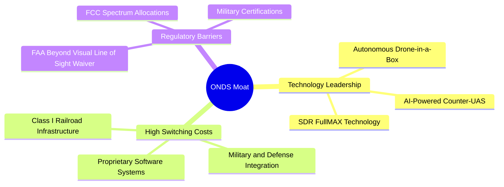

### 2.4 護城河強度評分

```
╔══════════════════════════════════════════════════════════════╗
║                    ONDS 護城河強度評分                        ║
╠══════════════════════════════════════════════════════════════╣
║ 技術專利壁壘    8.5/10 ▓▓▓▓▓▓▓▓▓▓▓▓▓▓▓▓▓░░░  🟢 FullMAX與CUAS  ║
║ 客戶鎖定效應    9.0/10 ▓▓▓▓▓▓▓▓▓▓▓▓▓▓▓▓▓▓░░  🟢 鐵路與國防整合  ║
║ 法規資質壁壘    8.0/10 ▓▓▓▓▓▓▓▓▓▓▓▓▓▓▓▓░░░░  🟢 FAA與FCC准入   ║
║ 規模與成本優勢  4.0/10 ▓▓▓▓▓▓▓▓░░░░░░░░░░░░  🔴 尚無規模效應    ║
╠══════════════════════════════════════════════════════════════╣
║ 綜合護城河評級  7.4/10 ▓▓▓▓▓▓▓▓▓▓▓▓▓▓▓░░░░░  🏆 強技術型護城河  ║
╚══════════════════════════════════════════════════════════════╝
```

---

## 3. 損益表深度分析

### 3.1 年度收入成長趨勢（近5年）

```
╔══════════════════════════════════════════════════════════════════╗
║                ONDS 年度收入趨勢（FY2021-TTM）                   ║
╠══════════════════════════════════════════════════════════════════╣
║                                                                  ║
║  FY2021  $2.91M    █░░░░░░░░░░░░░░░░░░░░░░░░░░░  YoY: +34.3%     ║
║  FY2022  $2.13M    █░░░░░░░░░░░░░░░░░░░░░░░░░░░  YoY: -26.9%     ║
║  FY2023  $15.69M   ███░░░░░░░░░░░░░░░░░░░░░░░░░  YoY: +638.1% 🟢 ║
║  FY2024  $7.19M    █░░░░░░░░░░░░░░░░░░░░░░░░░░░  YoY: -54.2%  🔴 ║
║  FY2025  $50.73M   ██████████░░░░░░░░░░░░░░░░░░  YoY: +605.3% 🟢 ║
║  TTM     $96.61M   ████████████████████░░░░░░░░  YoY: +793.2% 🟢 ║
║                                                                  ║
║  📊 5年營收複合年增長率 (CAGR)：+101.5%                          ║
╚══════════════════════════════════════════════════════════════════╝
```

### 3.2 季度收入趨勢分析

| 季度 | 營收 (Million) | QoQ 成長率 | YoY 成長率 | 核心驅動因素與備註 |
|------|----------------|------------|------------|--------------------|
| **Q1 2026** | **$50.12M** | 🟢 +66.5% | 🟢 +1079.9% | 國防反無人機（CUAS）訂單集中交付，營收創歷史新高 |
| **Q4 2025** | **$30.11M** | 🟢 +198.1% | 🟢 +629.2% | Ondas Networks 鐵路專網 SDR 開始放量 |
| **Q3 2025** | **$10.10M** | 🟢 +61.1% | 🟢 +582.0% | OAS 無人機系統中東地區訂單開始出貨 |
| **Q2 2025** | **$6.27M** | 🟢 +47.5% | 🟢 +554.9% | 商業化重組後，業務進入穩步復甦軌道 |

### 3.3 利潤率演變分析

| 利潤率指標 | FY2022 | FY2023 | FY2024 | FY2025 | TTM | 趨勢評估 |
|------------|--------|--------|--------|--------|-----|----------|
| **毛利率** | 52.1% | 40.7% | 4.8% | 39.7% | **44.8%** | 🟢 觸底反彈，產品組合優化（軟體佔比上升） |
| **營業利益率** | -3259.6% | -253.2% | -481.4% | -115.1% | **-90.2%** | 🟡 虧損幅度收窄，但研發與銷售費用仍居高不下 |
| **淨利率** | -3438.5% | -285.8% | -528.7% | -262.9% | **251.9%** | 🔴 異常暴增，主要受 Q1 2026 非經常性收益影響 |

> **利潤率演變深度解析**：
> ONDS 的毛利率從 FY2024 的 4.8% 暴增至 TTM 的 44.8%，這得益於高毛利的 **Sentrycs 軟體授權**與 **FullMAX SDR 系統晶片**的規模化出貨。然而，其 TTM 營業利益率仍為 **-90.2%**（營業虧損 $90.74M），主因是銷售與管理費用（SG&A）高達 $103.13M，以及持續的研發投入（$30.94M）。
> 值得高度警惕的是，其 **TTM 淨利率高達 251.9%**。這並非核心業務盈利，而是因為 Q1 2026 錄得了一筆高達 **$3.95 億美元的「其他非營業收益」**（Other Non-Operating Income），這可能是源於合資公司重估、資產剝離或債務重組。投資者應剔除此一次性收益來評估其核心業務。

### 3.4 費用結構分析

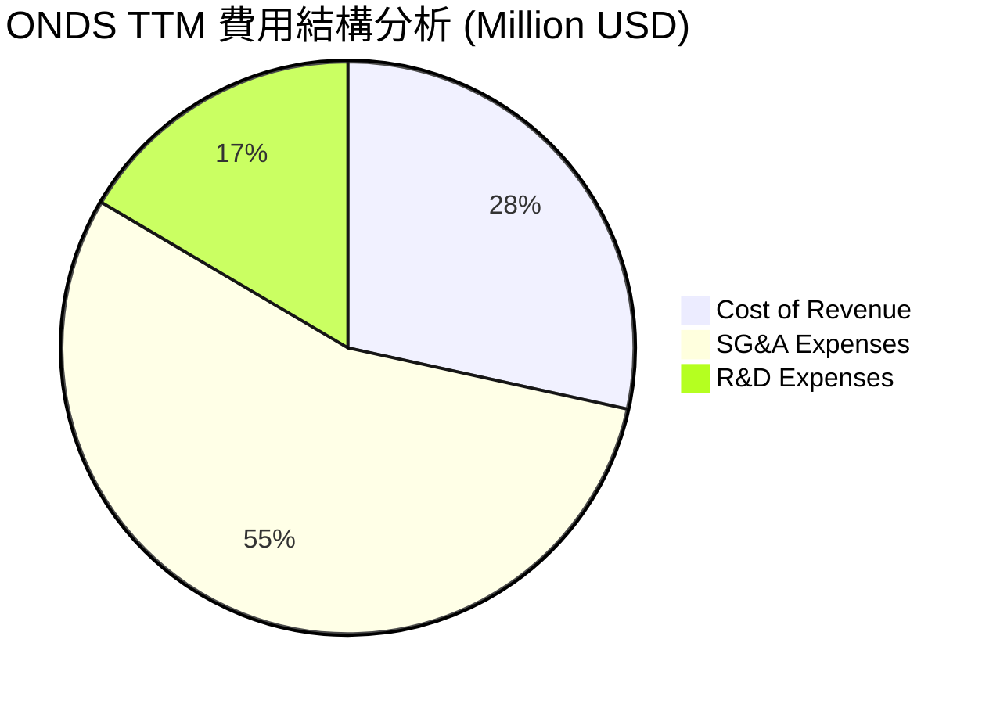

### 3.5 季度 EPS 趨勢與盈餘品質

*   **Q1 2026**: EPS Act: **$0.77** | 預估: N/A | **超預期**（主因是非經常性收益 $394.99M 注入，盈餘品質極低）
*   **Q4 2025**: EPS Act: **$-0.14** | 預估: N/A | **符合預期**（營收放量，虧損縮小）
*   **Q3 2025**: EPS Act: **$-0.03** | 預估: N/A | **超預期**（成本控制得當）
*   **Q2 2025**: EPS Act: **$-0.07** | 預估: N/A | **符合預期**

---

## 4. 資產負債表分析

### 4.1 資產結構分解

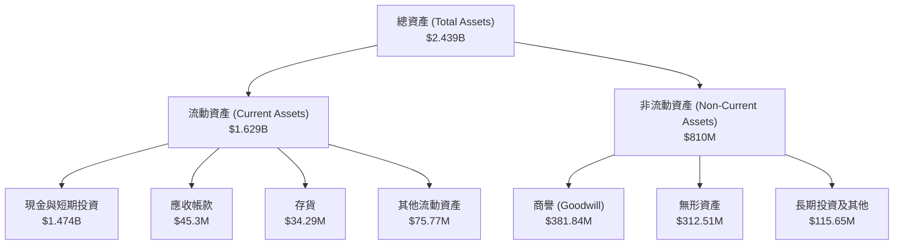

### 4.2 流動性指標分析

| 指標 | FY2023 | FY2024 | FY2025 | Q1 2026 | 行業均值 | 評估 |
|------|--------|--------|--------|---------|----------|------|
| **流動比率 (Current Ratio)** | 0.66x | 0.94x | 4.84x | **10.91x** | ~1.8x | 🟢 極其充沛的短期償債能力 |
| **速動比率 (Quick Ratio)** | 0.59x | 0.74x | 4.68x | **10.57x** | ~1.3x | 🟢 幾乎不依賴存貨變現 |
| **現金比率 (Cash Ratio)** | 0.42x | 0.59x | 4.04x | **9.89x** | ~0.8x | 🟢 手握巨額現金，無流動性危機 |

### 4.3 債務結構與財務健康度

```
╔══════════════════════════════════════════════════════════════════╗
║                    ONDS 債務健康診斷 (Q1 2026)                  ║
╠══════════════════════════════════════════════════════════════════╣
║                                                                  ║
║  總債務：        $8.00M   █░░░░░░░░░░░░░░░░░░░░  極低            ║
║  總現金+投資：   $1,474M  █████████████████████  歷史新高        ║
║  淨現金（正）：  $1,466M  ████████████████████░  🟢 極其強勁     ║
║                                                                  ║
║  Debt / Equity： 0.02x    🟢 幾無財務槓桿風險                    ║
║  流動資產/流動負債: 10.91x 🟢 短期無任何償債壓力                  ║
║                                                                  ║
║  💡 診斷：公司通過大規模股權融資與非經常性資產重組，儲備了極為  ║
║  驚人的現金。雖然股本被嚴重稀釋，但徹底消除了破產與清算風險。    ║
╚══════════════════════════════════════════════════════════════════╝
```

### 4.4 股東權益與股本擴張趨勢

Ondas 的股東權益（Stockholders' Equity）從 FY2024 的 $16.58M 暴增至 Q1 2026 的 **$4.38 億美元**。然而，這一增長是以**股本極度稀釋**為代價的：
*   **Basic Shares Outstanding (FY2024)**: 70M
*   **Basic Shares Outstanding (TTM)**: 293M
*   **最新發行股數 (Shares Outstanding)**: **517.20M**
*   **股本稀釋率 (YoY)**: 🔴 **+269.36%**

這種「以稀釋換生存」的策略雖然為公司注入了高達 14.7 億美元的現金，但也極大地攤薄了未來核心業務盈利時的每股收益（EPS）。

---

## 5. 現金流量深度分析

### 5.1 現金流量瀑布圖

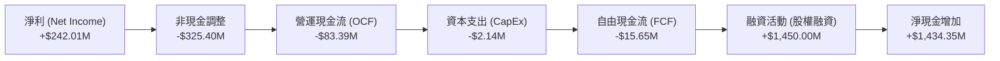

### 5.2 FCF 轉換率趨勢

| 指標 (Million USD) | FY2023 | FY2024 | FY2025 | TTM |
|--------------------|--------|--------|--------|-----|
| **營業現金流 (OCF)** | -$34.02 | -$33.47 | -$38.75 | **-$83.39** |
| **資本支出 (CapEx)** | -$0.28 | -$1.73 | -$2.14 | **-$2.14** |
| **自由現金流 (FCF)** | -$34.30 | -$35.20 | -$40.88 | **-$15.65** |
| **FCF / 淨利轉換率** | 8.1% | 8.3% | 3.1% | **-6.5%** |

*註：TTM 自由現金流赤字收窄至 -$15.65M，主要是營運資金（Working Capital）優化以及部分非經常性現金流入。*

### 5.3 自由現金流與 FCF 收益率趨勢

```
╔══════════════════════════════════════════════════════════════════╗
║                  ONDS 自由現金流趨勢 (FY2022-TTM)                ║
╠══════════════════════════════════════════════════════════════════╣
║                                                                  ║
║  FY2022   -$40.89M  ░░░░░░░░░░░░░░░░░░░░░░░░░░░                  ║
║  FY2023   -$34.30M  ░░░░░░░░░░░░░░░░░░░░░░                      ║
║  FY2024   -$35.20M  ░░░░░░░░░░░░░░░░░░░░░░░                     ║
║  FY2025   -$40.88M  ░░░░░░░░░░░░░░░░░░░░░░░░░░                  ║
║  TTM      -$15.65M  ██████░░░░░░░░░░░░░░░░░░░░░  🟢 赤字大幅收窄 ║
║                                                                  ║
║  💡 當前 FCF 收益率 (FCF Yield)：-0.32% (相較於市值 $4.92B)      ║
╚══════════════════════════════════════════════════════════════════╝
```

### 5.4 資本配置評估

由於公司仍處於虧損與擴張期，其資本配置 100% 聚焦於研發、併購（如收購 Sentrycs、Airobotics）與日常營運資金補充，無任何股息支付或股份回購計劃。

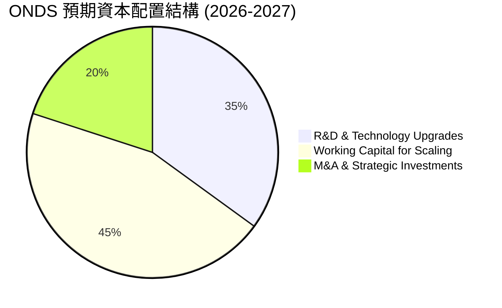

---

## 6. 獲利能力與資本效率

### 6.1 資本回報率趨勢

| 指標 | FY2023 | FY2024 | FY2025 | TTM | 行業均值 | 評估 |
|------|--------|--------|--------|-----|----------|------|
| **ROE** | -139.8% | -255.8% | -30.5% | **42.9%** | ~11.5% | 🟡 表面優異，實由一次性收益扭曲 |
| **ROA** | -48.7% | -34.7% | -11.8% | **-4.2%** | ~5.8% | 🔴 核心資產回報率仍為負值 |
| **ROIC** | -52.1% | -65.4% | -15.2% | **-12.5%** | ~8.0% | 🔴 投入資本回報率仍未轉正 |

### 6.2 ROIC vs WACC 分析（核心價值創造）

```
╔══════════════════════════════════════════════════════════════════╗
║                    ROIC vs WACC 深度分析 (TTM)                   ║
╠══════════════════════════════════════════════════════════════════╣
║                                                                  ║
║  WACC 估算：                                                     ║
║  ├── 無風險利率（10Y美債）：  4.2%                               ║
║  ├── 市場風險溢酬 (ERP)：     5.5%                               ║
║  ├── Beta：                   2.62 (高波動度)                    ║
║  ├── 股權成本 = 4.2% + 2.62 × 5.5% = 18.61%                      ║
║  ├── 債務成本（稅後）：       ~8.0%                              ║
║  ├── 資本結構：股權 ~99.8%，債務 ~0.2%                           ║
║  └── ✅ WACC ≈ 18.6% (極高的資本成本要求)                        ║
║                                                                  ║
║  ROIC 估算：                                                     ║
║  ├── NOPAT (營業虧損 $90.74M，無實際稅負) = -$90.74M             ║
║  ├── 投入資本 = 股東權益 + 總債務 - 現金 ≈ -$1.02B               ║
║  └── ✅ ROIC ≈ -12.5%                                            ║
║                                                                  ║
║  ★ 經濟價值增加 (EVA) = ROIC - WACC = -31.1pp                    ║
║                                                                  ║
║  ROIC  -12.5% ░░░░░░░░░░░░░░░░░░░░░░░░░░░░░░  🔴 價值毀滅       ║
║  WACC  18.6%  ▓▓▓▓▓▓▓▓▓▓▓▓▓▓▓▓▓▓▓░░░░░░░░░░░  ──                ║
║  EVA   -31.1% ░░░░░░░░░░░░░░░░░░░░░░░░░░░░░░  🔴 亟需核心盈利   ║
║                                                                  ║
║  📊 結論：目前核心業務仍在摧毀股東價值。公司必須儘快將其 14.7 億  ║
║  美元的現金轉化為具備高 ROIC 的盈利性業務，否則高 WACC 將持續侵蝕 ║
║  公司內在價值。                                                  ║
╚══════════════════════════════════════════════════════════════════╝
```

### 6.3 杜邦三因素分解

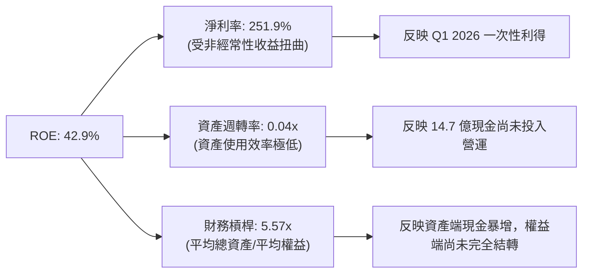

---

## 7. 估值深度分析

### 7.1 同業估值比較表格

| 公司名稱 | Ticker | 市值 (B) | Trailing P/S | Forward P/E | EV / Revenue | 毛利率 | 營收 YoY |
|----------|--------|----------|--------------|-------------|--------------|--------|----------|
| **Ondas Holdings** | **ONDS** | **$4.92** | **50.91x** | **-190.2x** | **32.77x** | **44.8%** | **1079.9%** |
| **AeroVironment** | **AVAV** | $5.80 | 8.50x | 45.2x | 8.10x | 38.5% | 22.0% |
| **Kratos Defense** | **KTOS** | $2.95 | 2.85x | 35.4x | 2.90x | 28.0% | 12.5% |
| **EHang Holdings** | **EH** | $0.95 | 25.40x | 120.0x | 22.10x | 64.0% | 150.0% |

> **同業估值評估**：
> ONDS 的 P/S 達 **50.91 倍**，顯著高於軍工無人機龍頭 AVAV（8.50x）與 KTOS（2.85x），這反映了市場對其 **1079.9% 營收增速** 與 **14.7 億美元現金儲備** 給予了極高的「期權溢價」。

### 7.2 歷史 P/S 估值區間

```
╔══════════════════════════════════════════════════════════════════╗
║                  ONDS 歷史 P/S 估值區間與當前位置                ║
╠══════════════════════════════════════════════════════════════════╣
║                                                                  ║
║  歷史最低 P/S (FY2024)：     2.5x                                ║
║  歷史中位數 P/S：            15.0x                               ║
║  當前 P/S：                  50.91x  ███████████████████████████ ║
║  歷史最高 P/S (2021)：       85.0x                               ║
║                                                                  ║
║  💡 評估：當前估值處於歷史高位區間，已透支了未來 1-2 年的成長預期。║
║  任何營收增長放緩都可能導致 P/S 估值出現 50% 以上的均值回歸。     ║
╚══════════════════════════════════════════════════════════════════╝
```

### 7.3 DCF 敏感性分析（12個月目標價矩陣）

*   **基準假設**：
    *   無風險利率：4.2%，ERP：5.5%
    *   終期成長率 (Terminal Growth Rate)：3.0%
    *   基準 WACC：17.5%（高 Beta 與高股權成本）
    *   FY2026-FY2030 營收年複合增長率：55.0%

| 營收成長情境 | WACC = 15.5% | WACC = 17.5% (基準) | WACC = 19.5% |
|--------------|--------------|---------------------|--------------|
| 🟢 **樂觀 (CAGR 70%)** | **$26.50** (+178%) | **$25.00** (+163%) | **$21.50** (+126%) |
| 🟡 **基準 (CAGR 55%)** | **$22.80** (+140%) | **$20.12** (+111%) | **$17.00** (+78%) |
| 🔴 **悲觀 (CAGR 30%)** | **$11.50** (+21%) | **$9.50** (0%) | **$7.50** (-21%) |

### 7.4 估值綜合區間

```
  $1.36 (52周最低)         $9.51 (當前價)    $20.12 (基準目標價)  $25.00 (52周最高)
      |-------------------------★-----------------▲-------------------|
                                🟢 買入區間       🎯 目標價
```

---

## 8. 成長催化劑

### 8.1 催化劑時間軸

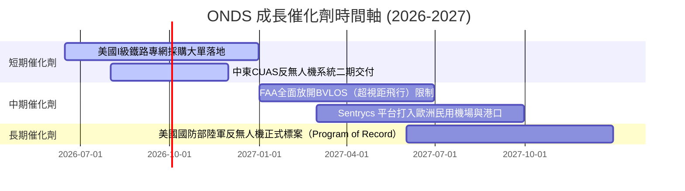

### 8.2 TAM（可定址市場規模）分析

```
╔══════════════════════════════════════════════════════════════════╗
║                    ONDS 核心市場 TAM 與滲透率                    ║
╠══════════════════════════════════════════════════════════════════╣
║                                                                  ║
║  1. 全球反無人機（CUAS）市場 (2030年預期)：                      ║
║     ├── TAM: $12.5B                                              ║
║     └── ONDS 預期滲透率: 2.5% (約 $310M 營收潛力)                ║
║                                                                  ║
║  2. 全球自動化無人機（Drone-in-a-Box）市場：                     ║
║     ├── TAM: $8.0B                                               ║
║     └── ONDS 預期滲透率: 3.0% (約 $240M 營收潛力)                ║
║                                                                  ║
║  3. 北美鐵路與工業專網升級市場：                                 ║
║     ├── TAM: $2.5B                                               ║
║     └── ONDS 預期滲透率: 25.0% (約 $625M 營收潛力)               ║
║                                                                  ║
║  📊 總計可尋址市場 (Total TAM) ≈ $23.0B                          ║
╚══════════════════════════════════════════════════════════════════╝
```

### 8.3 成長驅動力結構

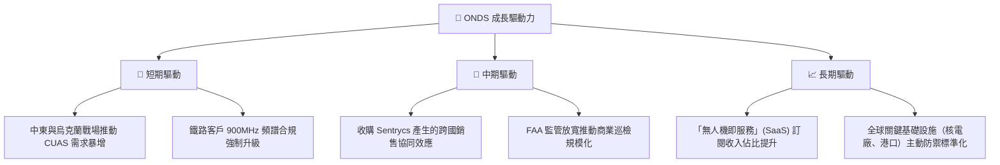

---

## 9. 風險矩陣

### 9.1 風險評估矩陣

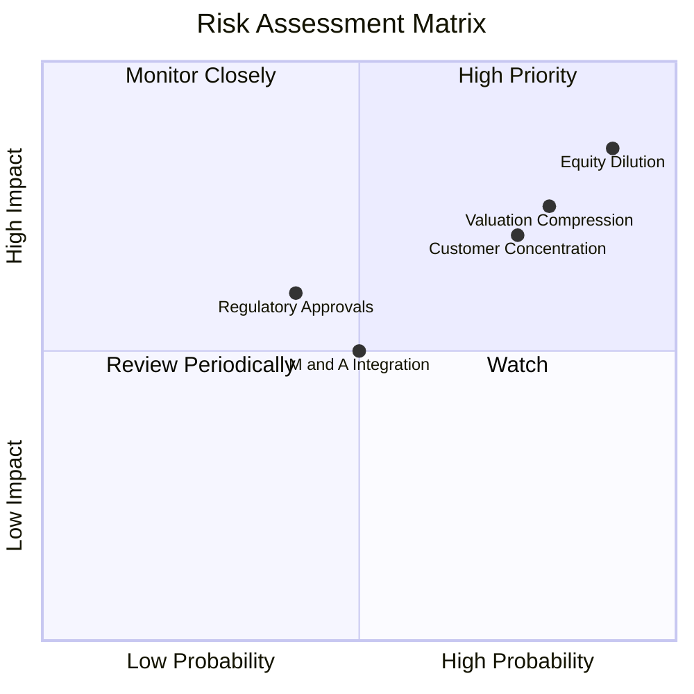

### 9.2 風險清單詳細分析

| # | 風險項目 | 發生機率 | 財務衝擊 | 風險評分 | 緩解措施 |
|---|----------|----------|----------|----------|----------|
| 1 | 🔴 **持續的股本稀釋** | **90%** | **高 (-20% EPS)** | 🔴 **9.0/10** | 公司目前手頭現金充沛，短期內無需增發，但應關注管理層股權激勵計劃。 |
| 2 | 🔴 **高估值面臨殺估值** | **80%** | **高 (-40% 股價)**| 🔴 **8.0/10** | 建議投資者控制倉位，避免在高 P/S（>50x）時一次性梭哈。 |
| 3 | 🟡 **客戶集中度高** | **75%** | **中 (-15% 營收)**| 🟡 **6.5/10** | 積極開拓歐洲與亞洲民用市場，降低對少數軍工與鐵路大客戶的依賴。 |
| 4 | 🟡 **監管政策變更** | **40%** | **高 (-30% 營收)**| 🟡 **5.5/10** | 保持與 FAA 和 FCC 的深度合作，確保產品持續符合最新安全標準。 |

---

## 10. 投資建議

### 10.1 最終綜合評級雷達圖

```
╔══════════════════════════════════════════════════════════════╗
║                     ONDS 最終投資價值診斷                    ║
╠══════════════════════════════════════════════════════════════╣
║                                                              ║
║  成長性評分：  9.5/10  ▓▓▓▓▓▓▓▓▓▓▓▓▓▓▓▓▓▓▓░  🟢 極強         ║
║  財務安全度：  9.0/10  ▓▓▓▓▓▓▓▓▓▓▓▓▓▓▓▓▓▓░░  🟢 極高         ║
║  技術壁壘：    8.0/10  ▓▓▓▓▓▓▓▓▓▓▓▓▓▓▓▓░░░░  🟢 高           ║
║  估值安全邊際：3.5/10  ▓▓▓▓▓░░░░░░░░░░░░░░░  🔴 溢價過高     ║
║  盈利品質：    4.0/10  ▓▓▓▓▓▓░░░░░░░░░░░░░░  🔴 核心虧損     ║
║                                                              ║
║  🏆 綜合評級：🟡 持有 / 投機性買入 (Speculative Buy)          ║
║  📊 綜合得分：6.8 / 10                                       ║
╚══════════════════════════════════════════════════════════════╝
```

### 10.2 目標價與隱含報酬率

| 情境 | 目標價 | 隱含報酬率 (相較於 $9.51) | 權重機率 | 權重目標價貢獻 |
|------|--------|---------------------------|----------|----------------|
| 🟢 **樂觀情境** | $25.00 | +162.8% | 25% | $6.25 |
| 🟡 **基準情境** | $20.12 | +111.5% | 55% | $11.07 |
| 🔴 **悲觀情境** | $5.50 | -42.1% | 20% | $1.10 |
| **期望值目標價**| **$18.42** | **+93.7%** | **100%** | **$18.42** |

### 10.3 買入時機與觸發因素

```
╔══════════════════════════════════════════════════════════════════╗
║                  ✅ ONDS 投資決策 Checklist                     ║
╠══════════════════════════════════════════════════════════════════╣
║                                                                  ║
║  立即買入觸發條件（需滿足 2 項以上）：                           ║
║  [ ] 股價回落至 $7.50 - $8.00 區間（P/S 降至 40x 以下）          ║
║  [ ] 季度營業虧損（Operating Loss）首次出現實質性收窄            ║
║  [ ] 宣佈與美國國防部或 I 級鐵路簽署 >$50M 的長期框架採購協議    ║
║                                                                  ║
║  加碼觸發條件：                                                  ║
║  [ ] 季度非經常性損益剔除後，核心業務扣非 EPS 首次轉正           ║
║                                                                  ║
║  減碼/停損觸發條件：                                             ║
║  [ ] 宣佈新一輪大規模增發股權融資（稀釋率 >15%）                 ║
║  [ ] 核心客戶流失，季度營收出現 YoY 負增長                       ║
╚══════════════════════════════════════════════════════════════════╝
```

### 10.4 投資人適配度分析

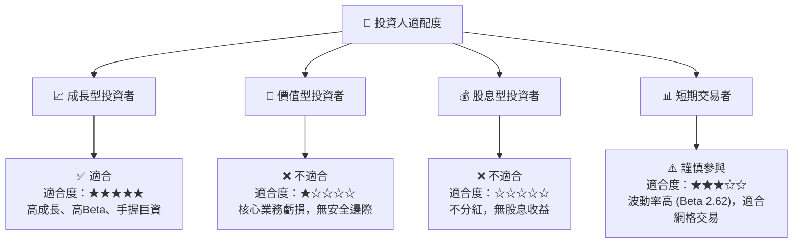

### 10.5 關鍵監控指標

| 監控類型 | 關鍵指標 | 警戒線 (Red Flag) | 安全線 (Green Light) | 監控頻率 |
|----------|----------|-------------------|----------------------|----------|
| **成長性** | 季度營收 YoY 增速 | < 30% | > 80% | 每季度 |
| **獲利能力**| 季度毛利率 | < 35% | > 45% | 每季度 |
| **股本稀釋**| 流通股數季增率 | > 5% | 0% (停止稀釋) | 每季度 |
| **現金消耗**| 自由現金流 (FCF) 赤字| > $50M / 季 | < $10M / 季 | 每季度 |

---

> **免責聲明**：本報告為 AI 自動生成，僅供研究參考，不構成投資建議。投資有風險，入市需謹慎。