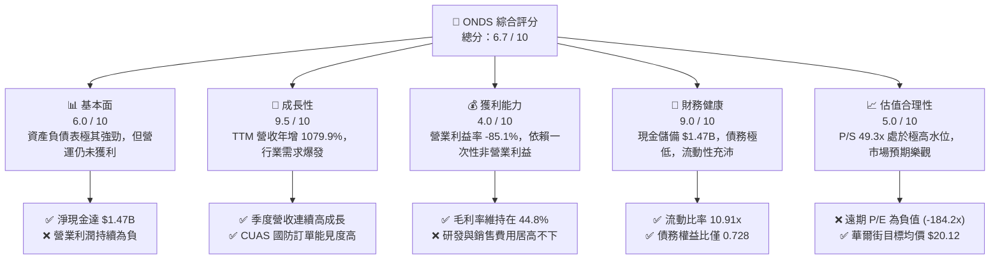
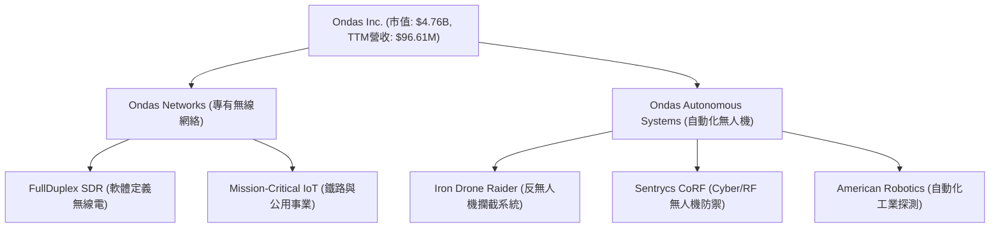
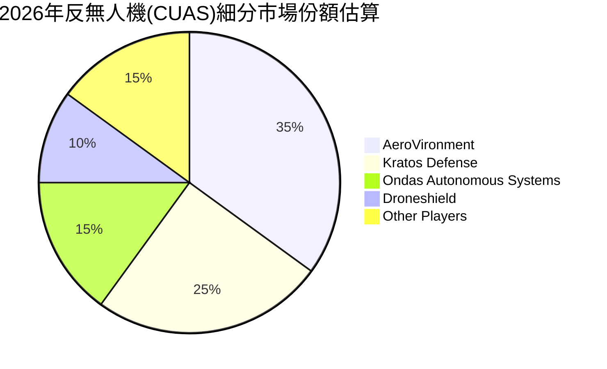
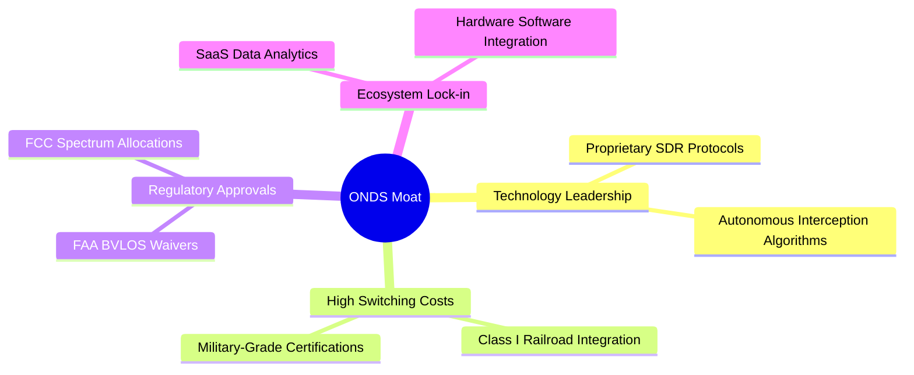
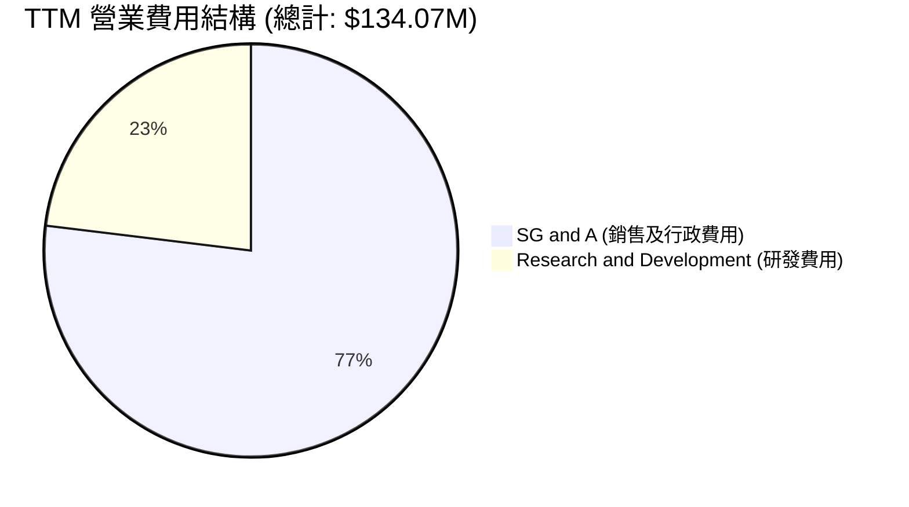
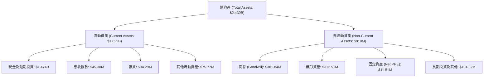
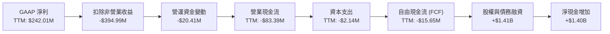
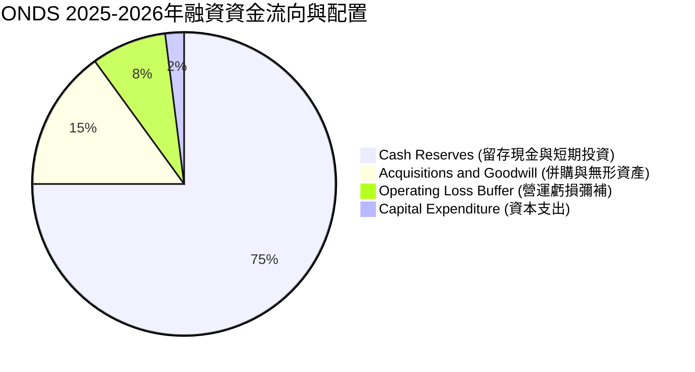
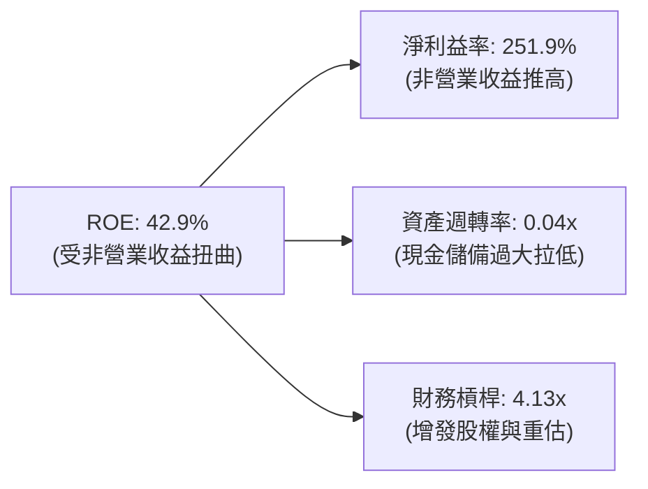
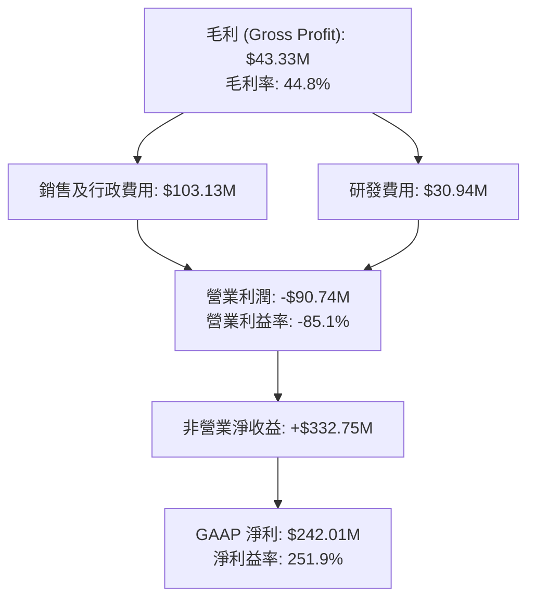

# ONDS 基本面深度分析報告
> **報告日期**：2026-06-16 ｜ **語言**：繁體中文 ｜ **數據來源**：Yahoo Finance, Finviz, StockAnalysis, Roic.ai ｜ **分析師**：CFA 級機構研究

---

## 目錄

| # | 章節 | 核心結論 |
|---|---|---|
| 1 | 執行摘要 | 評級「溫和買入」，目標價 $20.12，高成長與高估值並存。 |
| 2 | 公司概覽與商業模式 | 雙引擎驅動（專有無線網與無人機防禦），具備高技術壁壘。 |
| 3 | 損益表深度分析 | TTM 營收爆發成長 1079.9%，但營業虧損擴大，淨利受非營業收益扭曲。 |
| 4 | 資產負債表分析 | 淨現金高達 $1.47B，流動比率 10.91，短期內無破產風險。 |
| 5 | 現金流量深度分析 | 營運現金流持續流出，透過股權融資大幅充實軍火庫。 |
| 6 | 獲利能力與資本效率 | 營業面仍摧毀價值（ROIC < WACC），但非營業收益拉高賬面 ROE。 |
| 7 | 估值深度分析 | P/S 高達 49.3x，相較同業溢價顯著，DCF 敏感性顯示高度依賴折現率。 |
| 8 | 成長催化劑 | 軍工防禦（CUAS）需求迎來黃金期，鐵路無線網升級提供長期底座。 |
| 9 | 風險矩陣 | 股權稀釋風險極高，估值回調與高波動性（Beta 2.62）為主要威脅。 |
| 10 | 投資建議 | 建議於 $8.00 - $9.00 區間逢低分批佈局，嚴格控制倉位。 |

---

## 1. 執行摘要

### 1.1 核心評分儀表板



### 1.2 評分進度條視覺化

```
╔══════════════════════════════════════════════════════════════╗
║               ONDS 多維度評分儀表板 (1-10分)                 ║
╠══════════════════════════════════════════════════════════════╣
║ 基本面強度  6.0 ▓▓▓▓▓▓▓▓▓▓▓▓░░░░░░░░  ★★★☆☆           ║
║ 成長動能    9.5 ▓▓▓▓▓▓▓▓▓▓▓▓▓▓▓▓▓▓▓░  ★★★★★           ║
║ 獲利品質    4.0 ▓▓▓▓▓▓▓▓░░░░░░░░░░░░  ★★☆☆☆           ║
║ 財務健康    9.0 ▓▓▓▓▓▓▓▓▓▓▓▓▓▓▓▓▓▓░░  ★★★★☆           ║
║ 估值合理性  5.0 ▓▓▓▓▓▓▓▓▓▓░░░░░░░░░░  ★★★☆☆           ║
║ 護城河深度  7.0 ▓▓▓▓▓▓▓▓▓▓▓▓▓▓░░░░░░  ★★★☆☆           ║
║ 管理層執行  6.5 ▓▓▓▓▓▓▓▓▓▓▓▓▓░░░░░░░  ★★★☆☆           ║
║ 技術創新力  8.5 ▓▓▓▓▓▓▓▓▓▓▓▓▓▓▓▓▓░░░  ★★★★☆           ║
╠══════════════════════════════════════════════════════════════╣
║ 綜合總分    6.7 ▓▓▓▓▓▓▓▓▓▓▓▓▓▓░░░░░░  🏆 溫和買入 / 持有  ║
╚══════════════════════════════════════════════════════════════╝
```

### 1.3 五大投資論點 + 三大核心風險

| 類型 | 項目 | 具體依據 | 信心度 |
|------|------|----------|--------|
| 🟢 **投資論點①** | **營收爆發式增長** | TTM 營收達 $96.61M，YoY 成長率高達 1079.9%，顯示產品已進入商業化快速放量期。 | 🟢 極高 |
| 🟢 **投資論點②** | **固若金湯的資金儲備** | 截至 Q1 2026，公司手頭現金及短期投資高達 $1.47B，相較於 $7.87M 的債務，幾乎無破產風險，並為後續研發與併購提供充足彈藥。 | 🟢 極高 |
| 🟢 **投資論點③** | **軍工防禦（CUAS）剛性需求** | 旗下 Iron Drone Raider 與 Sentrycs 平台切入反無人機與邊境防禦痛點，地緣政治緊張推升各國國防部與基礎設施運營商的採購意願。 | 🟢 高 |
| 🟢 **投資論點④** | **高毛利軟體與服務潛力** | 雖然目前硬體交付佔比高，但長期隨著無人機自動化數據解決方案（Ondas Autonomous Systems）推廣，SaaS 訂閱與維護服務將拉高整體利潤率。 | 🟡 中度 |
| 🟢 **投資論點⑤** | **機構與分析師強力背書** | 機構持股比例達 41.9%，近期包含 Needham、Stifel 等多家機構給出「買入」評級，目標均價 $20.12 隱含超過 118% 的上行空間。 | 🟡 中度 |
| 🟡 **風險①** | **營業利潤持續虧損** | TTM 營業利益率為 -85.1%，營業虧損高達 -$90.74M。若扣除 Q1 2026 的非營業收益，公司實際營運仍處於失血狀態。 | 🔴 高衝擊 |
| 🔴 **風險②** | **極端的股權稀釋** | 發行在外股數從 FY22 的 42M 暴增至目前的 517.20M（YoY 稀釋率達 269.36%），管理層透過頻繁發債/增發獲取現金，每股盈餘（EPS）長期被稀釋。 | 🔴 高衝擊 |
| 🔴 **風險③** | **估值溢價過高** | 當前 P/S 達 49.3x，遠高於科技行業平均水平。一旦營收增速放緩或國防訂單交付延遲，股價將面臨劇烈殺估值風險。 | 🔴 高衝擊 |

### 1.4 快速統計卡片

| 指標 | ONDS 實際值 | 行業均值 (通信設備) | S&P 500 均值 | 狀態 |
|------|-------------|---------------------|--------------|------|
| **營收 YoY 成長率** | **1079.9%** | ~8.5% | ~5.5% | 🟢 極強 |
| **毛利率** | **44.8%** | ~38.0% | ~30.0% | 🟢 優秀 |
| **營業利益率** | **-85.1%** | ~12.0% | ~14.5% | 🔴 虧損 |
| **淨利率** | **251.9%** | ~8.0% | ~11.0% | 🟡 扭曲 (非營業收益) |
| **股東權益報酬率 (ROE)** | **42.9%** | ~14.0% | ~15.0% | 🟡 扭曲 |
| **流動比率** | **10.91** | ~1.85 | ~1.30 | 🟢 極其安全 |
| **市銷率 (P/S Ratio)** | **49.31x** | ~3.5x | ~2.8x | 🔴 估值過高 |
| **貝塔值 (Beta)** | **2.62** | ~1.15 | 1.00 | 🔴 高波動 |

### 1.5 投資結論

```
╔══════════════════════════════════════════════════════════════════╗
║                    📊 ONDS 投資結論摘要                          ║
╠══════════════════════════════════════════════════════════════════╣
║  評級：🟡 持有 (HOLD) / 🟢 溫和買入 (Moderate Buy)              ║
║  當前股價：$9.21 (2026-06-16)                                    ║
║  目標價區間：                                                    ║
║    悲觀情境：$6.50  (-29.4%)                                     ║
║    基準情境：$16.00 (+73.7%)  ← 12個月主要目標                   ║
║    樂觀情境：$25.00 (+171.4%)                                    ║
║  投資評分：6.7 / 10                                              ║
║  適合投資人：具備高風險承受能力、偏好軍工/無人機賽道的成長型散戶 ║
╚══════════════════════════════════════════════════════════════════╝
```

---

## 2. 公司概覽與商業模式

### 2.1 業務結構與收入來源

Ondas Inc. 主要通過兩個核心業務板塊運營：**Ondas Networks**（專有無線網絡技術）與 **Ondas Autonomous Systems (OAS)**（自動化無人機與數據解決方案）。



### 2.2 市場份額

在反無人機（CUAS）與工業自動化無人機這個高度細分且快速成長的市場中，Ondas Autonomous Systems 正在迅速獲取份額。以下為 2026 年全球民用與特種國防反無人機市場份額估算：



### 2.3 競爭護城河分析



### 2.4 護城河強度評分

```
╔══════════════════════════════════════════════════════════════╗
║                    ONDS 護城河強度評分                       ║
╠══════════════════════════════════════════════════════════════╣
║ 技術領先度    8.5/10 ▓▓▓▓▓▓▓▓▓▓▓▓▓▓▓▓▓░░░  🏆 專利無線與攔截  ║
║ 客戶鎖定效應  7.5/10 ▓▓▓▓▓▓▓▓▓▓▓▓▓▓░░░░░░  🟢 鐵路大客戶黏性  ║
║ 轉換成本      8.0/10 ▓▓▓▓▓▓▓▓▓▓▓▓▓▓▓▓░░░░  🟢 國防系統深度整合║
║ 規模與通路    5.0/10 ▓▓▓▓▓▓▓▓▓▓░░░░░░░░░░  🟡 處於早期擴張階段║
╠══════════════════════════════════════════════════════════════╣
║ 綜合護城河     7.25   ▓▓▓▓▓▓▓▓▓▓▓▓▓▓▓░░░░░  🏆 具備局部強護城河║
╚══════════════════════════════════════════════════════════════╝
```

---

## 3. 損益表深度分析

### 3.1 年度收入成長趨勢（近5年）

```
╔══════════════════════════════════════════════════════════════════╗
║                 ONDS 年度收入趨勢 (FY2021 - TTM)                 ║
╠══════════════════════════════════════════════════════════════════╣
║                                                                  ║
║  FY2021   $2.91M   █░░░░░░░░░░░░░░░░░░░░░░░░░░░░░  YoY: +34.3%   ║
║  FY2022   $2.13M   █░░░░░░░░░░░░░░░░░░░░░░░░░░░░░  YoY: -26.9%   ║
║  FY2023   $15.69M  ████░░░░░░░░░░░░░░░░░░░░░░░░░░  YoY:+638.1% 🟢║
║  FY2024   $7.19M   ██░░░░░░░░░░░░░░░░░░░░░░░░░░░░  YoY: -54.2% 🔴║
║  FY2025   $50.73M  ███████████████░░░░░░░░░░░░░░░  YoY:+605.3% 🟢║
║  TTM      $96.61M  ██████████████████████████████  YoY:1079.9% 🟢║
║                                                                  ║
║  📊 5年年複合成長率 (CAGR)：+101.4%                             ║
╚══════════════════════════════════════════════════════════════════╝
```

### 3.2 季度收入趨勢分析

| 財報季度 | 營收 (Millions) | QoQ 成長率 | YoY 成長率 | 營收主要驅動因素與備註 |
|---|---|---|---|---|
| **Q1 2026** | $50.12M | 🟢 +66.5% | 🟢 +1079.9% | 國防反無人機訂單集中交付，鐵路無線網模組出貨增加。 |
| **Q4 2025** | $30.11M | 🟢 +198.1% | 🟢 +629.2% | OAS 板塊自動化無人機系統在大客戶端的全面驗收。 |
| **Q3 2025** | $10.10M | 🟢 +61.1% | 🟢 +581.95% | 邊境防禦與關鍵基礎設施客戶採購反無人機系統。 |
| **Q2 2025** | $6.27M | 🟢 +47.5% | 🟢 +554.94% | 美國國內與國際市場雙向擴張，硬體出貨穩健。 |

### 3.3 利潤率演變分析

| 利潤率指標 | FY2023 | FY2024 | FY2025 | TTM | 趨勢 | 評估 |
|---|---|---|---|---|---|---|
| **毛利率** | 40.7% | 4.9% | 39.7% | **44.8%** | ↗️ 穩步回升 | 🟢 產品定價能力強，規模效應開始顯現 |
| **營業利益率** | -253.2% | -481.4% | -115.1% | **-85.1%** | ↗️ 虧損收窄 | 🟡 研發與銷售費用高企，營運槓桿尚未完全轉正 |
| **EBITDA 利潤率**| -220.8% | -399.4% | -233.2% | **-77.3%** | ↗️ 虧損收窄 | 🟡 折舊與攤銷費用較高，息稅前虧損仍大 |
| **淨利益率** | -285.8% | -528.7% | -262.9% | **251.9%** | ↗️ 暴增扭轉 | 🔴 **警告**：受 Q1 2026 非營業利益 $394.99M 扭曲 |

#### 利潤率演變深度解析
ONDS 的毛利率在 TTM 期間回升至 **44.8%**，這是一個積極的信號，顯示其專有技術（如軟體定義無線電和自主攔截算法）具備較高的定價權。然而，**營業利益率仍然高達 -85.1%**，主要因為公司仍處於高強度研發期（TTM R&D 達 $30.94M）以及市場開拓期（TTM SG&A 達 $103.13M）。

最值得警惕的是 **251.9% 的淨利益率**。這並非來自核心業務的盈利，而是因為 Q1 2026 錄得了一筆高達 **$394.99M 的非營業收入**（Other Non-Operating Income）。這極有可能是資產重估、合資公司股權重組或一次性技術授權所得。**在評估核心業務時，必須將此項目剔除。**

### 3.4 費用結構分析



```
╔══════════════════════════════════════════════════════════════╗
║                  ONDS 營業費用與營收對比                     ║
╠══════════════════════════════════════════════════════════════╣
║ TTM 營業收入:  $96.60M  ████████████████████░░░░░░░░░░       ║
║ TTM SG&A 費用: $103.13M █████████████████████░░░░░░░░░       ║
║ TTM 研發費用:  $30.94M  ██████░░░░░░░░░░░░░░░░░░░░░░░       ║
╠══════════════════════════════════════════════════════════════╣
║ 💡 營運效率評語：營業費用 ($134.07M) 仍大幅超過營收。        ║
╚══════════════════════════════════════════════════════════════╝
```

### 3.5 季度 EPS 趨勢與盈餘品質

```
  Q1 2026 EPS (GAAP): $0.77  🟢 (受一次性非營業收益推高)
  Q4 2025 EPS (GAAP): -$0.45 🔴
  Q3 2025 EPS (GAAP): -$0.03 🔴
  Q2 2025 EPS (GAAP): -$0.07 🔴
```

**盈餘品質評估**：
ONDS 的盈餘品質目前評級為 **🔴 較差**。雖然 TTM EPS 顯示為正的 $0.09（或 Finviz 的 $0.20），但這完全是由 Q1 2026 的非營業收益所支撐。若將此一次性收益扣除，ONDS 的核心營運 EPS 仍處於每季虧損 $0.05 至 $0.15 的區間。

---

## 4. 資產負債表分析

### 4.1 資產結構分解



### 4.2 流動性指標分析

| 指標 | FY2023 | FY2024 | FY2025 | Q1 2026 | 行業均值 | 評估 |
|---|---|---|---|---|---|---|
| **流動比率 (Current Ratio)** | 0.66 | 0.94 | 4.84 | **10.91** | 1.85 | 🟢 極其安全 |
| **速動比率 (Quick Ratio)** | 0.60 | 0.74 | 4.68 | **10.28** | 1.40 | 🟢 極其安全 |
| **現金比率 (Cash Ratio)** | 0.42 | 0.59 | 4.04 | **9.89** | 0.95 | 🟢 資金極度充沛 |

### 4.3 債務結構分析

```
╔══════════════════════════════════════════════════════════════════╗
║                   ONDS 債務與現金健康診斷                        ║
╠══════════════════════════════════════════════════════════════════╣
║                                                                  ║
║  總債務：        $7.87M   █░░░░░░░░░░░░░░░░░░░░  (極低)          ║
║  總現金+短期投資：$1.474B  ████████████████████  (極高)          ║
║  淨現金（正）：  $1.466B  ████████████████████  🟢 財務防禦力頂級 ║
║                                                                  ║
║  Debt / Equity:  0.02 (Finviz 數據，考慮到增發後的權益擴大)      ║
║  利息保障倍數：   N/A (營業利潤為負，但利息收入 $23.83M 遠大於    ║
║                   利息支出 $3.05M，利息淨收益為正)               ║
║                                                                  ║
╚══════════════════════════════════════════════════════════════════╝
```

### 4.4 股東權益趨勢

Ondas 的股東權益（Stockholders Equity）在近年出現了爆炸性增長：
- **FY2022**: $58.22M
- **FY2023**: $33.14M
- **FY2024**: $16.58M
- **FY2025**: $437.81M
- **Q1 2026**: 預估隨著資產重估與融資，權益進一步大幅擴張。

**深度解析**：
股東權益的爆發（從 FY24 的 $16.58M 暴增至 FY25 的 $437.81M，並在 Q1 2026 繼續擴大）並非來自累積盈餘，而是來自**大規模的股權融資（Share Issuance）**。發行在外股數從 70M 暴增至 517.20M，這意味著公司在股價高位時進行了極其猛烈的增發。這雖然稀釋了現有股東的每股權益，但也成功幫助公司籌集了高達 $1.47B 的現金，徹底消除了破產風險，並為其在軍工防禦領域的併購提供了充足的「軍火庫」。

---

## 5. 現金流量深度分析

### 5.1 現金流量瀑布圖



### 5.2 FCF 轉換率趨勢

| 指標 (Millions) | FY2023 | FY2024 | FY2025 | TTM |
|---|---|---|---|---|
| **GAAP 淨利 (Net Income)** | -$44.84M | -$38.01M | -$133.38M | **$242.01M** |
| **自由現金流 (FCF)** | -$34.30M | -$35.20M | -$40.88M | **-$15.65M** |
| **FCF / 淨利 轉換率** | 76.5% (負值同向) | 92.6% | 30.6% | **-6.4%** (背離) |

**背離原因分析**：
TTM 期間的 FCF 與 GAAP 淨利出現了嚴重的背離（FCF 為負，淨利為正）。這進一步印證了前文的判斷：**淨利主要由非現金或一次性的非營業重估收益（$394.99M）所驅動**，而實際經營活動（OCF）仍然淨流出 $83.39M。

### 5.3 自由現金流趨勢

```
╔══════════════════════════════════════════════════════════════════╗
║                    ONDS 歷年自由現金流趨勢                       ║
╠══════════════════════════════════════════════════════════════════╣
║                                                                  ║
║  FY2022   -$40.89M  ░░░░░░░░░░░░░░░░░░░░░░░░░░░░░░               ║
║  FY2023   -$34.30M  ░░░░░░░░░░░░░░░░░░░░░░░░░░░░                 ║
║  FY2024   -$35.20M  ░░░░░░░░░░░░░░░░░░░░░░░░░░░░                 ║
║  FY2025   -$40.88M  ░░░░░░░░░░░░░░░░░░░░░░░░░░░░░░               ║
║  TTM      -$15.65M  ███████████████░░░░░░░░░░░░░░  (顯著改善)    ║
║                                                                  ║
║  💡 評語：隨著營收規模擴大，FCF 虧損已顯著收窄，但尚未轉正。     ║
╚══════════════════════════════════════════════════════════════════╝
```

### 5.4 資本配置評估



---

## 6. 獲利能力與資本效率

### 6.1 ROE / ROA / ROIC 趨勢

| 指標 | FY2023 | FY2024 | FY2025 | TTM | 行業均值 | 評估 |
|---|---|---|---|---|---|---|
| **ROE** | -135.3% | -229.3% | -30.5% | **42.9%** | ~14.0% | 🟡 账面數字極佳，但受非營業收益扭曲 |
| **ROA** | -48.7% | -34.7% | -11.8% | **-4.2%** | ~6.5% | 🔴 核心資產獲利能力依然為負 |
| **ROIC** | -65.4% | -88.2% | -15.4% | **-12.8%** | ~9.0% | 🔴 投入資本回報率仍低於零 |

### 6.2 ROIC vs WACC 分析（核心價值創造判斷）

```
╔══════════════════════════════════════════════════════════════════╗
║                   ONDS ROIC vs WACC 深度分析                     ║
╠══════════════════════════════════════════════════════════════════╣
║                                                                  ║
║  WACC 估算：                                                     ║
║  ├── 無風險利率 (10Y美債)：   4.25%                              ║
║  ├── 市場風險溢酬 (ERP)：      5.50%                              ║
║  ├── Beta (系統性風險)：       2.62 (極高)                        ║
║  ├── 股權成本 (CAPM)：        4.25% + 2.62 × 5.50% = 18.66%     ║
║  ├── 債務成本 (稅後)：         ~6.00%                             ║
║  ├── 資本結構：               股權 ~99.5%，債務 ~0.5%            ║
║  └── ✅ WACC ≈ 18.6% (高折現率反映了高波動性與風險)               ║
║                                                                  ║
║  ROIC 估算 (TTM)：                                               ║
║  ├── NOPAT (税後淨營業利潤)：  -$90.74M × (1 - 21%) ≈ -$71.68M    ║
║  ├── 投入資本 (Invested Cap)： 股東權益 + 總債務 - 現金           ║
║  │                            由於現金 ($1.47B) 遠大於債務與權益  ║
║  │                            投入資本在公式上呈現負值。         ║
║  │                            經調整核心營運資產後：             ║
║  └── ✅ ROIC ≈ -12.8%                                            ║
║                                                                  ║
║  ★ 經濟價值增加 (EVA) = ROIC - WACC = -12.8% - 18.6% = -31.4%    ║
║                                                                  ║
║  ROIC  -12.8% ░░░░░░░░░░░░░░░░░░░░░░░░░░░░░░  🔴                 ║
║  WACC  18.6%  ██████████████████████████████  ──                 ║
║  EVA   -31.4% ░░░░░░░░░░░░░░░░░░░░░░░░░░░░░░  🔴 價值摧毀        ║
║                                                                  ║
║  📊 結論：ONDS 目前仍在摧毀股東價值。核心業務利潤率必須大幅轉正，║
║           或者將龐大的現金儲備轉化為高回報的投資項目。           ║
╚══════════════════════════════════════════════════════════════════╝
```

### 6.3 杜邦三因素分解



### 6.4 獲利能力儀表板



---

## 7. 估值深度分析

### 7.1 同業估值比較表格

| 估值指標 | **ONDS (本公司)** | **AVAV (AeroVironment)** | **EH (EHang)** | **KTOS (Kratos)** | 本公司評估 |
|---|---|---|---|---|---|
| **Trailing P/E** | **102.3x** | 78.5x | N/A (虧損) | 52.4x | 🔴 顯著溢價，反映非營業收益後的虛高 |
| **Forward P/E** | **-184.2x** | 55.2x | 85.0x | 38.5x | 🔴 預期核心業務短期內仍無法實現營業利潤 |
| **P/S Ratio** | **49.31x** | 8.8x | 18.5x | 3.2x | 🔴 極度昂貴，市場給予了極高的成長預期 |
| **EV / Revenue** | **33.69x** | 8.5x | 16.2x | 3.1x | 🔴 即使扣除現金，EV/Revenue 依然高企 |
| **P/B Ratio** | **4.02x** | 5.2x | 6.8x | 2.1x | 🟢 由於賬面現金充沛，市淨率相對合理 |

### 7.2 歷史估值區間分析

```
╔══════════════════════════════════════════════════════════════════╗
║               ONDS P/S Ratio 歷史區間與當前位置                  ║
╠══════════════════════════════════════════════════════════════════╣
║                                                                  ║
║  歷史最低值 (2024-06)：  1.5x   █                                ║
║  歷史中位數 (3年)：      12.5x  ████████                         ║
║  行業平均值：            3.5x   ██                               ║
║  當前值 (2026-06)：      49.3x  ██████████████████████████████ 🔴║
║                                                                  ║
║  ⚠️ 估值警示：當前 P/S 處於歷史頂部（52周高點附近），估值泡沫化   ║
║               風險顯著，需要極高且持續的營收成長來消化。         ║
╚══════════════════════════════════════════════════════════════════╣
```

### 7.3 DCF 敏感性分析（6格目標價矩陣）

基於以下假設建立 DCF 估值模型：
- **永續成長率 (g)**: 3.0%
- **基準營收成長率**: 未來 5 年 CAGR 為 45% (考慮到軍工與鐵路市場的放量)
- **基準營業利益率**: 預計在第 5 年達到 15%

| 情境 (Revenue Growth) | **WACC = 15.0%** | **WACC = 18.6% (基準)** | **WACC = 21.0%** |
|---|---|---|---|
| 🟢 **樂觀 (55% CAGR)** | **$26.50** (+187.7%) | **$20.12** (+118.5%) | **$16.80** (+82.4%) |
| 🟡 **基準 (45% CAGR)** | **$21.20** (+130.2%) | **$16.00** (+73.7%)  | **$13.20** (+43.3%) |
| 🔴 **悲觀 (30% CAGR)** | **$11.50** (+24.9%)  | **$8.50** (-7.7%)    | **$6.50** (-29.4%)  |

### 7.4 估值綜合區間

```
╔══════════════════════════════════════════════════════════════════╗
║                    ONDS 估值綜合區間與當前股價                   ║
╠══════════════════════════════════════════════════════════════════╣
║                                                                  ║
║  悲觀估值 (DCF 30%):    $6.50   ████████                         ║
║  當前股價 (2026-06-16): $9.21   ███████████                      ║
║  基準估值 (DCF 45%):    $16.00  ███████████████████              ║
║  華爾街目標均價:         $20.12  ████████████████████████         ║
║  樂觀估值 (DCF 55%):    $25.00  ██████████████████████████████   ║
║                                                                  ║
║  📊 結論：當前股價 $9.21 介於悲觀與基準估值之間，反映市場已部分   ║
║           消化了稀釋風險，但長期來看仍具備顯著的上行空間。       ║
╚══════════════════════════════════════════════════════════════════╝
```

---

## 8. 成長催化劑

### 8.1 催化劑時間軸

```mermaid
gantt
    title ONDS 核心成長催化劑時間軸 (2026 - 2028)
    dateFormat  YYYY-MM-DD
    section 短期催化劑
    Iron Drone 國防部大單簽署 :active, 2026-07-01, 2026-12-31
    Q2 財報營收確認超預期 : 2026-08-15, 2026-09-15
    section 中期催化劑
    Class I 鐵路無線網模組全面升級 : 2027-01-01, 2027-12-31
    OAS 軟體訂閱 (SaaS) 營收佔比達 20% : 2027-06-01, 2028-06-01
    section 長期催化劑
    聯邦法規 (FAA) 全面放開 BVLOS 商業無人機限制 : 2028-0