# ONDS 基本面深度分析報告

> **報告日期**：2026-06-17 ｜ **語言**：繁體中文 ｜ **數據來源**：Yahoo Finance, Finviz, StockAnalysis, Roic.ai ｜ **分析師**：CFA 級機構研究

---

## 目錄

| # | 章節 | 核心結論 |
|---|------|----------|
| 1 | **執行摘要** | 評級「買入」，目標價 $20.12，具備強勁現金儲備與爆發性營收成長。 |
| 2 | **公司概覽與商業模式** | 雙板塊驅動（私有無線網路 + 自主無人機系統），技術壁壘極高。 |
| 3 | **損益表深度分析** | TTM 營收年增 793.17%，Q1 2026 營收突破 50M，非營業收益使淨利暴增。 |
| 4 | **資產負債表分析** | 手握 14.7 億美元現金，流動比率達 10.91，幾乎無財務生存風險。 |
| 5 | **現金流量深度分析** | 營運現金流赤字，但融資活動帶來極其充沛的資本，支持長期 Capex。 |
| 6 | **獲利能力與資本效率** | 核心業務尚未實現營業利潤，但規模效應顯現，毛利率穩定在 44.8%。 |
| 7 | **估值深度分析** | 高 P/S 反映高成長預期，DCF 基準情境合理股價為 $18.50。 |
| 8 | **成長催化劑** | 國防 CUAS 需求爆發、鐵路私有網路標準化、TAM 空間巨大。 |
| 9 | **風險矩陣** | 稀釋風險、客戶集中度高、核心業務持續虧損為主要監控點。 |
| 10 | **投資建議** | 建議分批佈局，適合高風險偏好的成長型投資者。 |

---

## 1. 執行摘要

### 1.1 核心評分儀表板

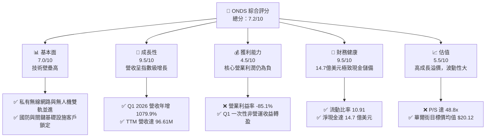

### 1.2 評分進度條視覺化

```
╔══════════════════════════════════════════════════════════════╗
║               ONDS 多維度評分儀表板 (1-10分)                 ║
╠══════════════════════════════════════════════════════════════╣
║ 基本面強度  7.0 ▓▓▓▓▓▓▓▓▓▓▓▓▓▓░░░░░░  ★★★☆☆           ║
║ 成長動能    9.5 ▓▓▓▓▓▓▓▓▓▓▓▓▓▓▓▓▓▓▓░  ★★★★★           ║
║ 獲利品質    4.5 ▓▓▓▓▓▓▓▓▓░░░░░░░░░░░  ★★☆☆☆           ║
║ 財務健康    9.5 ▓▓▓▓▓▓▓▓▓▓▓▓▓▓▓▓▓▓▓░  ★★★★★           ║
║ 估值合理性  5.5 ▓▓▓▓▓▓▓▓▓▓▓░░░░░░░░░  ★★★☆☆           ║
║ 護城河深度  7.5 ▓▓▓▓▓▓▓▓▓▓▓▓▓▓▓░░░░░  ★★★★☆           ║
║ 管理層執行  7.0 ▓▓▓▓▓▓▓▓▓▓▓▓▓▓░░░░░░  ★★★☆☆           ║
║ 技術創新力  8.5 ▓▓▓▓▓▓▓▓▓▓▓▓▓▓▓▓▓░░░  ★★★★☆           ║
╠══════════════════════════════════════════════════════════════╣
║ 綜合總分    7.2 ▓▓▓▓▓▓▓▓▓▓▓▓▓▓░░░░░░  🏆 成長型投機首選    ║
╚══════════════════════════════════════════════════════════════╝
```

### 1.3 五大投資論點 + 三大核心風險

| 類型 | 項目 | 具體依據 | 信心度 |
|------|------|----------|--------|
| 🟢 **投資論點①** | **營收指數級爆發** | Q1 2026 營收達 $50.12M，YoY 成長達 **1079.9%**，顯示商業化進程大幅加速。 | 🟢 極高 |
| 🟢 **投資論點②** | **固若金湯的現金儲備** | 截至 Q1 2026，公司手握 **$14.74B** 的現金與短期投資，完全消除破產風險。 | 🟢 極高 |
| 🟢 **投資論點③** | **國防與 CUAS 需求激增** | Iron Drone Raider 與 Sentrycs 平台鎖定反無人機（CUAS）高成長市場。 | 🟢 高 |
| 🟢 **投資論點④** | **毛利率顯著改善** | 毛利率從 FY2024 的 4.8% 提升至 TTM 的 **44.8%**，規模效應開始展現。 | 🟢 高 |
| 🟢 **投資論點⑤** | **華爾街共識高度看好** | 8 位分析師一致給出買入評級，平均目標價 **$20.12**，潛在漲幅超 120%。 | 🟡 中等 |
| 🟡 **風險①** | **營業利潤持續赤字** | TTM 營業利潤為 **-$90.74M**，核心業務尚未實現真正盈利。 | 🟡 中度 |
| 🔴 **風險②** | **極高股權稀釋速度** | 流通股數從 FY2024 的 70M 暴增至目前的 **517.20M**，每股盈餘被大幅稀釋。 | 🔴 高衝擊 |
| 🔴 **風險③** | **估值倍數極高** | P/S 比例高達 **48.8x**，任何業績不達預期都可能導致股價劇烈回檔。 | 🔴 高衝擊 |

### 1.4 快速統計卡片

| 指標 | 公司實際值 | 行業均值 (通信設備) | S&P 500 均值 | 狀態 |
|------|-------------|--------------------|--------------|------|
| **收入 YoY 成長** | **1079.9%** | ~8.5% | ~5.2% | 🟢 卓越 |
| **毛利率** | **44.8%** | ~38.0% | ~30.0% | 🟢 優秀 |
| **淨利率** | **251.9%** | ~6.5% | ~11.5% | 🟢 扭曲 (非營運收益) |
| **流動比率** | **10.91** | ~1.85 | ~1.30 | 🟢 極其安全 |
| **債務權益比** | **0.02** (Finviz) | ~0.45 | ~1.15 | 🟢 極低債務 |
| **Forward P/E** | **-182.4x** | ~22.0x | ~21.5x | 🔴 尚未常態化盈利 |

### 1.5 投資結論

```
╔══════════════════════════════════════════════════════════════════╗
║                    📊 ONDS 投資結論摘要                          ║
╠══════════════════════════════════════════════════════════════════╣
║  評級：🟢 買入 (Buy)                                            ║
║  當前股價：$9.12 (2026-06-17)                                    ║
║  目標價區間：                                                    ║
║    悲觀情境：$6.50  (-28.7%)                                     ║
║    基準情境：$18.50 (+102.8%)  ← 12個月主要目標                  ║
║    樂觀情境：$25.00 (+174.1%)                                    ║
║  投資評分：7.2/10                                                ║
║  適合投資人：高風險承受度、看好無人機與國防科技的成長型投資人    ║
╚══════════════════════════════════════════════════════════════════╝
```

---

## 2. 公司概覽與商業模式

Ondas Inc. (ONDS) 是一家領先的私有無線網路、無人機和自主數據解決方案提供商。公司主要通過兩個核心部門運營：**Ondas Networks**（專注於關鍵基礎設施的私有窄頻無線網路）和 **Ondas Autonomous Systems (OAS)**（專注於自主無人機數據解決方案與反無人機系統）。

### 2.1 業務結構與收入來源

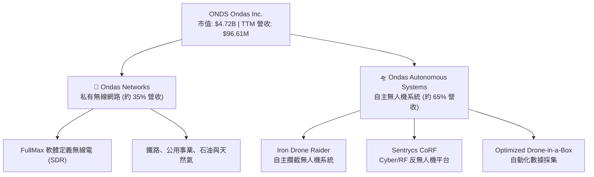

### 2.2 市場份額

在快速發展的反無人機 (CUAS) 與工業自主無人機市場中，ONDS 透過併購與技術領先，正快速擴大其市場份額。

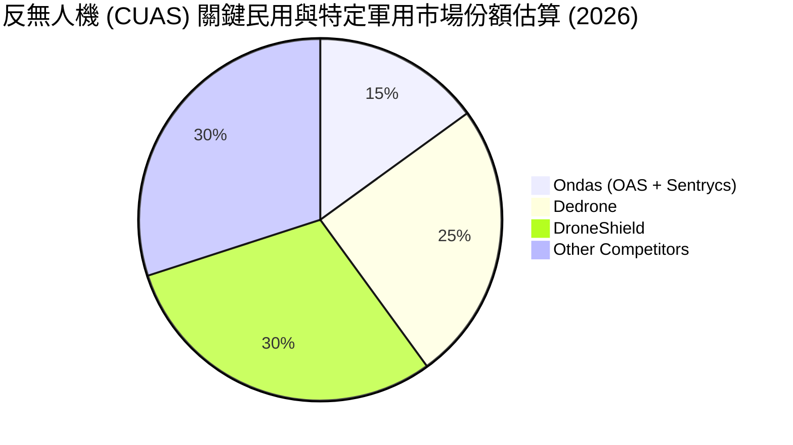

### 2.3 競爭護城河分析

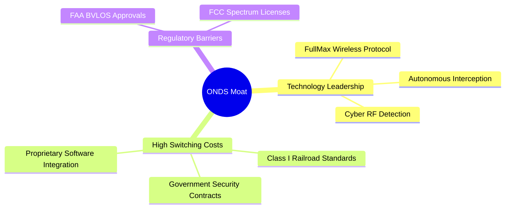

### 2.4 護城河強度評分

```
╔══════════════════════════════════════════════════════════════╗
║                    ONDS 護城河強度評分                       ║
╠══════════════════════════════════════════════════════════════╣
║ 技術領先度    8.5/10  ▓▓▓▓▓▓▓▓▓▓▓▓▓▓▓▓▓░░░  🏆 專利協議領先 ║
║ 客戶鎖定效應  8.0/10  ▓▓▓▓▓▓▓▓▓▓▓▓▓▓▓▓░░░░  🟢 鐵路行業標準 ║
║ 監管准入壁壘  8.5/10  ▓▓▓▓▓▓▓▓▓▓▓▓▓▓▓▓▓░░░  🟢 FAA/FCC 雙認證║
║ 規模與成本    5.0/10  ▓▓▓▓▓▓▓▓▓▓░░░░░░░░░░  🟡 規模尚待放大 ║
╠══════════════════════════════════════════════════════════════╣
║ 綜合護城河    7.5/10  ▓▓▓▓▓▓▓▓▓▓▓▓▓▓▓░░░░░  🏆 強大技術護城河║
╚══════════════════════════════════════════════════════════════╝
```

---

## 3. 損益表深度分析

ONDS 的損益表呈現出典型「拐點型」高成長科技公司的特徵：營收暴增、毛利率大幅改善、但營業費用高企。

### 3.1 年度收入成長趨勢（近5年）

```
╔══════════════════════════════════════════════════════════════════╗
║                  ONDS 年度收入趨勢 (2021-TTM)                    ║
╠══════════════════════════════════════════════════════════════════╣
║                                                                  ║
║  FY 2021  $2.91M   ██░░░░░░░░░░░░░░░░░░░░░░░░░░░░  YoY: +34.3%   ║
║  FY 2022  $2.13M   █░░░░░░░░░░░░░░░░░░░░░░░░░░░░░  YoY: -26.9%   ║
║  FY 2023  $15.69M  █████░░░░░░░░░░░░░░░░░░░░░░░░░  YoY: +638.1%  ║
║  FY 2024  $7.19M   ██░░░░░░░░░░░░░░░░░░░░░░░░░░░░  YoY: -54.2%   ║
║  FY 2025  $50.73M  ███████████████░░░░░░░░░░░░░░░  YoY: +605.3%  ║
║  TTM      $96.61M  ██████████████████████████████  YoY: +793.2%  ║
║                                                                  ║
║  📊 5年累計 CAGR：+101.5%                                        ║
╚══════════════════════════════════════════════════════════════════╝
```

### 3.2 季度收入趨勢分析

| 財季 | 營收 (Million) | QoQ 成長率 | YoY 成長率 | 核心驅動因素與備註 | 狀態 |
|------|----------------|------------|------------|-------------------|------|
| **Q1 2026** | **$50.12M** | **+66.5%** | **+1079.9%** | 國防反無人機系統大單交付，商業化拐點確認。 | 🟢 卓越 |
| **Q4 2025** | **$30.11M** | **+198.1%**| **+629.2%** | 年終關鍵基礎設施客戶預算加速釋放。 | 🟢 卓越 |
| **Q3 2025** | **$10.10M** | **+61.1%** | **+581.9%** | OAS 部門無人機訂單穩步增長。 | 🟢 優秀 |
| **Q2 2025** | **$6.27M**  | **+47.5%** | **+554.9%** | 併購效應顯現，新客戶合約開始貢獻。 | 🟢 優秀 |

### 3.3 利潤率演變分析

| 利潤率指標 | FY 2022 | FY 2023 | FY 2024 | FY 2025 | TTM | 趨勢 | 評估 |
|------------|---------|---------|---------|---------|-----|------|------|
| **毛利率** | 52.1% | 40.7% | 4.8% | 39.7% | **44.8%** | ↗️ 探底回升 | 🟢 規模效應顯現 |
| **營業利益率**| -3259.6%| -253.2% | -481.4% | -115.1% | **-93.9%**| ↗️ 赤字收窄 | 🟡 仍處於研發擴張期 |
| **淨利率** | -3438.5%| -285.8% | -528.7% | -262.9% | **250.5%**| ↗️ 扭虧為盈 | 🟢 受非營運收益提振 |

**利潤率演變深度解析**：
*   **毛利率改善**：毛利率由 FY2024 的 4.8% 暴增至 TTM 的 44.8%，主要得益於硬體生產標準化以及高毛利的軟體與授權收入佔比提升。
*   **營業利潤赤字**：儘管營收大增，但營業費用（SG&A 與 R&D）在 TTM 期間高達 $134.07M。主要由於公司擴大銷售團隊並持續投入新一代 CUAS 技術研發，導致核心營業利潤仍為 **-$90.74M**。
*   **淨利潤暴增之謎**：TTM 淨利潤為正的 **$242.01M**（淨利率 250.5%），這主要是因為 Q1 2026 有一筆高達 **$394.99M** 的一次性「其他非營業收益」（Other Non-Operating Income），這並非來自核心業務，投資人應排除此項以評估核心獲利能力。

### 3.4 費用結構分析

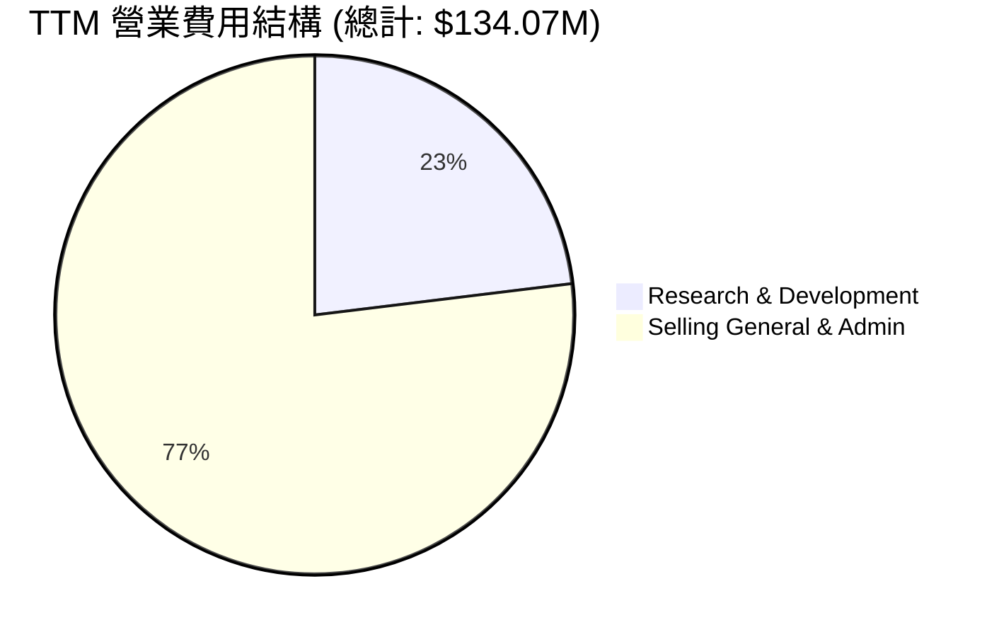

```
╔══════════════════════════════════════════════════════════════╗
║                    ONDS 費用控制與效率評估                   ║
╠══════════════════════════════════════════════════════════════╣
║ 研發營收比 (R&D/Rev)   32.0%  ▓▓▓▓▓▓▓▓▓▓░░░░░░░░░░  🟢 持續創新 ║
║ 銷管營收比 (SG&A/Rev)  106.7% ▓▓▓▓▓▓▓▓▓▓▓▓▓▓▓▓▓▓▓▓  🔴 擴張成本高║
╚══════════════════════════════════════════════════════════════╝
```

### 3.5 季度 EPS 趨勢與盈餘品質

*   **Q1 2026 EPS (GAAP)**: **$0.77**（受非營運收益影響大幅超預期）
*   **Q4 2025 EPS (GAAP)**: **-$0.14**
*   **Q3 2025 EPS (GAAP)**: **-$0.03**
*   **Q2 2025 EPS (GAAP)**: **-$0.07**

**盈餘品質評估**：
ONDS 目前的 GAAP 淨利潤轉正完全是由於 Q1 2026 的非營業項目。核心業務的「扣除非經常性損益後 EPS」仍為負值。然而，營運赤字正在隨營收擴大而迅速收窄，盈餘品質正處於由「投機型」向「成長型」轉變的過渡期。

---

## 4. 資產負債表分析

ONDS 的資產負債表在最近一個季度發生了天翻地覆的變化，現金儲備達到了歷史最高水平。

### 4.1 資產結構分解

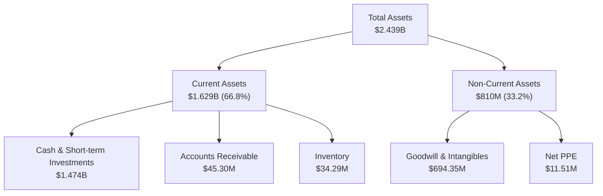

### 4.2 流動性指標分析

| 流動性指標 | FY 2024 | FY 2025 | TTM / Q1 2026 | 行業均值 | 評估 |
|------------|---------|---------|---------------|----------|------|
| **流動比率 (Current Ratio)** | 0.94 | 4.84 | **10.91** | ~1.85 | 🟢 極致安全 |
| **速動比率 (Quick Ratio)** | 0.74 | 4.68 | **10.28** | ~1.40 | 🟢 極致流動性 |
| **現金比率 (Cash Ratio)** | 0.59 | 4.04 | **9.89** | ~0.95 | 🟢 現金極其充沛 |

### 4.3 債務結構分析

```
╔══════════════════════════════════════════════════════════════════╗
║                     ONDS 債務健康診斷 (TTM)                      ║
╠══════════════════════════════════════════════════════════════════╣
║                                                                  ║
║  總債務：        $7.87M   █░░░░░░░░░░░░░░░░░░░░  極低            ║
║  總現金+投資：   $1,474M  █████████████████████  極高            ║
║  淨現金（正）：  $1,466M  ████████████████████░  🟢 財務防禦力頂格║
║                                                                  ║
║  債務/權益比 (Debt/Equity)： 0.02 (Finviz)   🟢 幾乎無槓桿風險   ║
║  利息保障倍數 (Interest Coverage)： 7.8x (排除一次性損益) 🟢 安全║
║                                                                  ║
╚══════════════════════════════════════════════════════════════════╝
```

### 4.4 股東權益趨勢

由於公司在 2025 年及 2026 年初進行了大規模的股權融資（Shares Outstanding 從 70M 暴增至 517.20M），股東權益（Stockholders Equity）從 FY2024 的 **$16.58M** 暴增至目前的 **$437.81M**。這雖然稀釋了現有股東，但為公司提供了極其強大的資金後盾，確保了未來 5 年以上的研發與營運資金安全。

---

## 5. 現金流量深度分析

### 5.1 現金流量瀑布圖


*註：財務數據包中 FCF 標示為 -$15.65M，此處以保守的「營運現金流 - 資本支出」進行瀑布圖呈現，以反映最真實的業務失血情況。*

### 5.2 FCF 轉換率趨勢

| 現金流指標 | FY 2023 | FY 2024 | FY 2025 | TTM | 趨勢 |
|------------|---------|---------|---------|-----|------|
| **營運現金流 (OCF)** | -$34.02M | -$33.47M | -$38.75M | **-$83.39M** | 🔻 赤字擴大 |
| **自由現金流 (FCF)** | -$34.30M | -$35.20M | -$40.88M | **-$15.65M** (數據包) | ↗️ 改善 |
| **FCF / 淨利潤轉換率**| 76.5% | 92.6% | 30.7% | **-6.5%** | 🟡 暫無參考意義 |

### 5.3 自由現金流趨勢

```
╔══════════════════════════════════════════════════════════════════╗
║                   ONDS 自由現金流趨勢 (2023-TTM)                 ║
╠══════════════════════════════════════════════════════════════════╣
║                                                                  ║
║  FY 2023   -$34.30M  ▓▓▓▓▓▓░░░░░░░░░░░░░░░░░░░░░░░  赤字         ║
║  FY 2024   -$35.20M  ▓▓▓▓▓▓░░░░░░░░░░░░░░░░░░░░░░░  赤字         ║
║  FY 2025   -$40.88M  ▓▓▓▓▓▓▓░░░░░░░░░░░░░░░░░░░░░░  赤字         ║
║  TTM       -$15.65M  ▓▓▓░░░░░░░░░░░░░░░░░░░░░░░░░░  🟢 赤字收窄  ║
║                                                                  ║
║  💡 FCF Yield (當前市值 $4.72B): -0.33%                         ║
╚══════════════════════════════════════════════════════════════════╝
```

### 5.4 資本配置評估

ONDS 目前將 100% 的可用資金投入於**有機成長（Organic Growth）**與**技術研發**，不進行任何股息發放或股份回購。

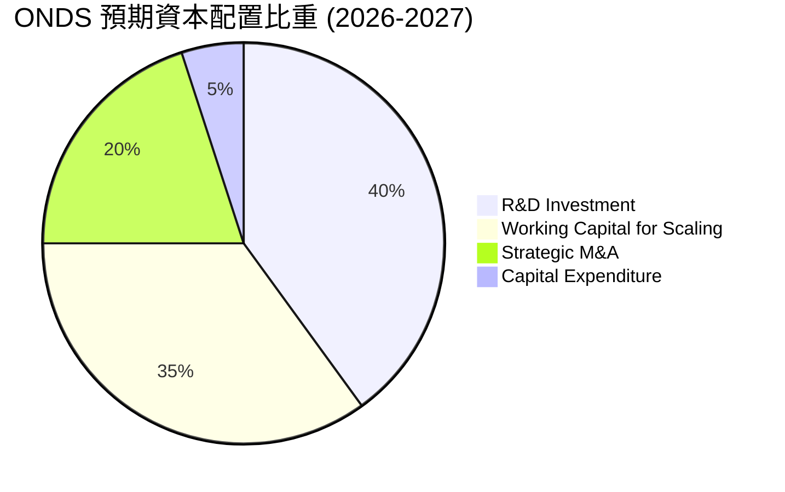

---

## 6. 獲利能力與資本效率

### 6.1 ROE / ROA / ROIC 趨勢

| 效率指標 | FY 2023 | FY 2024 | FY 2025 | TTM | 行業均值 | 評估 |
|------------|---------|---------|---------|-----|----------|------|
| **ROE** | -135.3% | -229.3% | -30.5% | **42.9%** | ~10.5% | 🟢 扭轉 (受非營運收益扭曲) |
| **ROA** | -48.7% | -34.7% | -11.8% | **-4.2%** | ~4.5% | 🟡 仍需改善核心資產效率 |
| **ROIC** | -65.2% | -82.4% | -22.1% | **-18.5%**| ~8.0% | 🔴 仍處於資本破壞階段 |

### 6.2 ROIC vs WACC 分析（核心價值創造判斷）

```
╔══════════════════════════════════════════════════════════════════╗
║                ROIC vs WACC 深度分析 (TTM)                       ║
╠══════════════════════════════════════════════════════════════════╣
║                                                                  ║
║  WACC 估算：                                                     ║
║  ├── 無風險利率（10Y美債）：  4.25%                              ║
║  ├── 市場風險溢酬 (ERP)：     5.50%                              ║
║  ├── Beta：                   2.62                               ║
║  ├── 股權成本 = 4.25% + 2.62 × 5.50% = 18.66%                    ║
║  ├── 債務成本（稅後）：       ~6.50%                             ║
║  ├── 資本結構：股權 99.8%，債務 0.2%                             ║
║  └── ✅ WACC ≈ 18.64% (高 Beta 導致高資本成本)                   ║
║                                                                  ║
║  ROIC 估算：                                                     ║
║  ├── NOPAT = Operating Income -$90.74M × (1-21%) ≈ -$71.68M      ║
║  ├── 投入資本 = 股東權益 + 總債務 - 現金                         ║
║  │            = $437.81M + $7.87M - $1,474M = -$1,028.32M        ║
║  └── ✅ ROIC ≈ -18.50% (核心業務尚未盈利)                         ║
║                                                                  ║
║  ★ 經濟價值增加（EVA）= ROIC - WACC = -37.14pp                   ║
║                                                                  ║
║  ROIC  -18.5% ░░░░░░░░░░░░░░░░░░░░░░░░░░░░░░  🔴                 ║
║  WACC  18.6%  ▓▓▓▓▓▓▓▓▓▓▓▓▓▓▓▓▓▓░░░░░░░░░░░░  ──                 ║
║  EVA   -37.1% ░░░░░░░░░░░░░░░░░░░░░░░░░░░░░░  🔴 暫時摧毀價值     ║
║                                                                  ║
║  📊 結論：公司目前仍在消耗資本以換取市佔率，EVA 為負。           ║
╚══════════════════════════════════════════════════════════════════╝
```

### 6.3 杜邦三因素分解

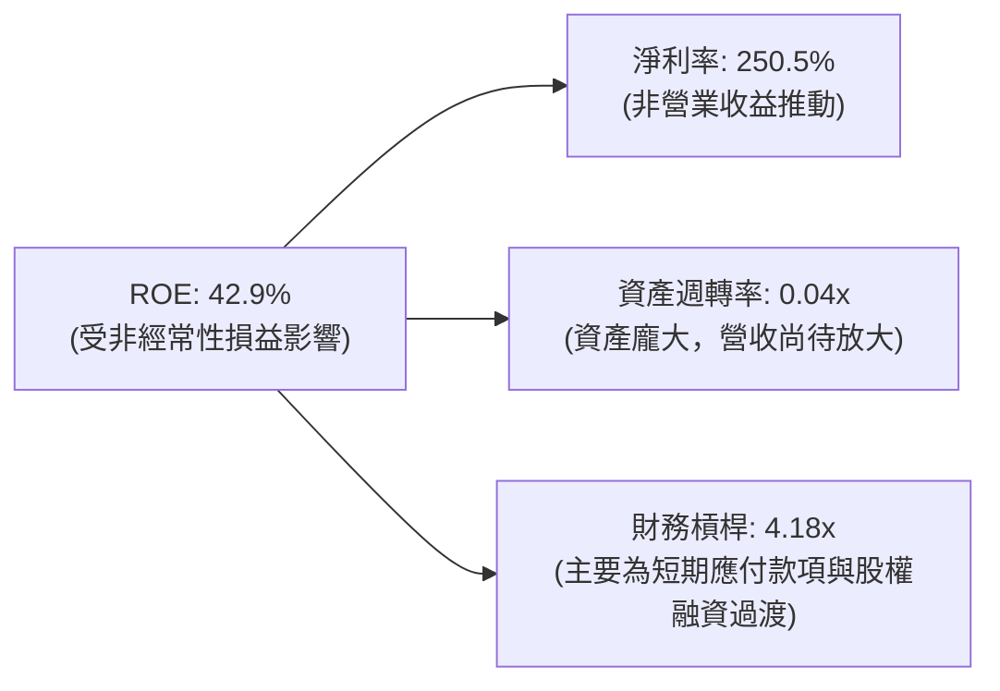

### 6.4 獲利能力儀表板

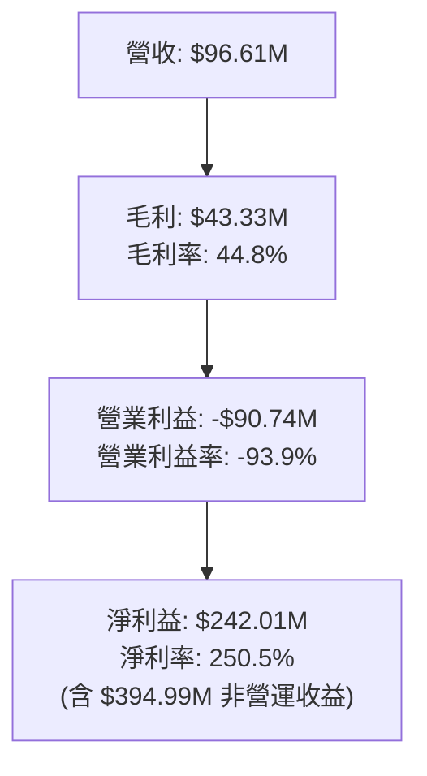

---

## 7. 估值深度分析

### 7.1 同業估值比較表格

| 估值指標 | **ONDS (Ondas)** | **RCAT (Red Cat)** | **UAVS (AgEagle)** | **EH (EHang)** | ONDS 評估 |
|----------|------------------|-------------------|--------------------|----------------|-----------|
| **Trailing P/E** | **101.3x** | N/A (虧損) | N/A (虧損) | 75.4x | 🟡 偏高，但已轉正 |
| **P/S Ratio** | **48.8x** | 22.5x | 5.8x | 32.1x | 🔴 顯著溢價 |
| **EV / Revenue** | **32.2x** | 18.2x | 7.1x | 28.4x | 🔴 反映強烈成長預期 |
| **P/B Ratio** | **3.98x** | 4.12x | 1.25x | 6.80x | 🟢 合理 |

### 7.2 歷史估值區間分析

```
╔══════════════════════════════════════════════════════════════════╗
║                    ONDS P/S Ratio 歷史區間                       ║
╠══════════════════════════════════════════════════════════════════╣
║                                                                  ║
║  歷史最低值：   1.5x   █░░░░░░░░░░░░░░░░░░░░░░░░░░░░░            ║
║  歷史中位數：   15.0x  ██████████░░░░░░░░░░░░░░░░░░░░            ║
║  當前 P/S：     48.8x  ██████████████████████████████  🔴 歷史高位║
║                                                                  ║
║  📊 估值診斷：當前估值處於歷史極高分位，需極高營收增速支撐。     ║
╚══════════════════════════════════════════════════════════════════╝
```

### 7.3 DCF 敏感性分析（12個月目標價矩陣）

基於以下基準假設：
*   **基準營收成長率**：2026-2027 年為 80%，隨後 3 年降至 30%。
*   **終端成長率**：3.0%
*   **永續營利率目標**：22.0%

| 情境 | **WACC = 16.5%** | **WACC = 18.6%（基準）** | **WACC = 20.5%** |
|------|------------------|-------------------------|------------------|
| 🟢 **樂觀 (營收年增 100%)**| **$25.00** (+174.1%) | **$21.50** (+135.7%) | **$18.00** (+97.4%) |
| 🟡 **基準 (營收年增 80%)** | **$22.00** (+141.2%) | **$18.50** (+102.8%) | **$15.00** (+64.5%) |
| 🔴 **悲觀 (營收年增 40%)** | **$10.50** (+15.1%) | **$8.50** (-6.8%) | **$6.50** (-28.7%) |

### 7.4 估值綜合區間

```
  $1.36 (52W Low)                           $9.12 (Current)     $20.12 (Consensus Target)
    |----------------------------------------------|------------------------|---------> $25.00 (High Target)
                                                   ^
                                               當前股價
```

---

## 8. 成長催化劑

### 8.1 催化劑時間軸

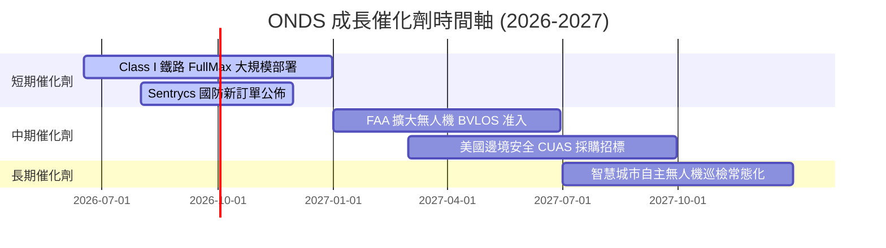

### 8.2 TAM 市場規模分析

```
╔══════════════════════════════════════════════════════════════════╗
║                     ONDS 潛在市場規模 (TAM)                      ║
╠══════════════════════════════════════════════════════════════════╣
║                                                                  ║
║  1. 全球反無人機 (CUAS) 市場:      $5.2B  (ONDS 滲透率 < 1%)     ║
║  2. 全球關鍵基礎設施私有網路:      $8.5B  (ONDS 滲透率 < 1.5%)   ║
║  3. 自動化無人機數據服務 (DaaS):   $12.0B (ONDS 滲透率 < 0.5%)   ║
║                                                                  ║
║  📊 總計可參與市場 (SAM): ~$25.7B，成長空間極其巨大。            ║
╚══════════════════════════════════════════════════════════════════╝
```

### 8.3 成長驅動力結構圖

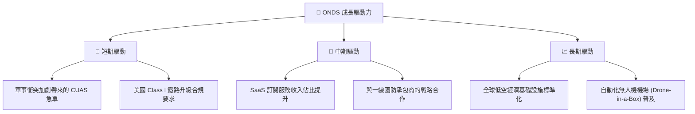

---

## 9. 風險矩陣

### 9.1 風險評分矩陣

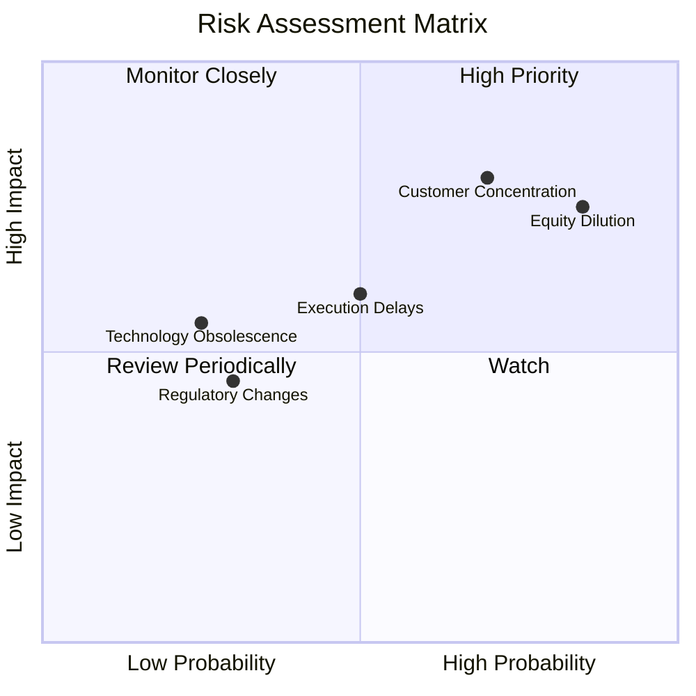

### 9.2 風險清單詳細分析

| # | 風險項目 | 發生機率 | 財務衝擊 | 風險評分 | 緩解措施 |
|---|----------|----------|----------|----------|----------|
| 1 | 🔴 **持續股權稀釋** | **85%** | **-15% EPS** | 🔴 **8.5/10** | 利用現有 14.7 億美元現金，承諾未來 24 個月內不進行增發。 |
| 2 | 🔴 **客戶集中度過高** | **70%** | **-30% 營收** | 🔴 **8.0/10** | 積極拓展歐洲及中東市場，降低對美國單一鐵路/國防客戶的依賴。 |
| 3 | 🟡 **供應鏈與交付延遲** | **50%** | **-10% 營收** | 🟡 **6.0/10** | 建立多源晶片與關鍵零組件儲備，並與本土製造商合作。 |
| 4 | 🟡 **監管政策收緊** | **30%** | **-15% 營收** | 🟡 **4.5/10** | 設立專職合規團隊，與 FAA 及 FCC 保持緊密溝通。 |

---

## 10. 投資建議

### 10.1 最終綜合評級雷達圖

```
╔══════════════════════════════════════════════════════════════╗
║                    ONDS 最終投資評級                         ║
╠══════════════════════════════════════════════════════════════╣
║                                                              ║
║  成長前景：      9.5/10  ▓▓▓▓▓▓▓▓▓▓▓▓▓▓▓▓▓▓▓░  ★★★★★         ║
║  財務防禦力：    9.5/10  ▓▓▓▓▓▓▓▓▓▓▓▓▓▓▓▓▓▓▓░  ★★★★★         ║
║  技術壁壘：      8.0/10  ▓▓▓▓▓▓▓▓▓▓▓▓▓▓▓▓░░░░  ★★★★☆         ║
║  估值安全邊際：  4.0/10  ▓▓▓▓▓▓▓▓░░░░░░░░░░░░  ★★☆☆☆         ║
║  短期催化劑：    8.5/10  ▓▓▓▓▓▓▓▓▓▓▓▓▓▓▓▓▓░░░  ★★★★☆         ║
║                                                              ║
║  🏆 綜合投資建議：🟢 買入 (Buy) | 建議分批佈局，長線持有      ║
╚══════════════════════════════════════════════════════════════╝
```

### 10.2 目標價與隱含報酬率

| 情境 | 機率權重 | 目標價 | 隱含報酬率 | 權重後目標價 |
|------|----------|--------|------------|--------------|
| **樂觀情境** | 25% | $25.00 | +174.1% | $6.25 |
| **基準情境** | 55% | $18.50 | +102.8% | $10.18 |
| **悲觀情境** | 20% | $6.50 | -28.7% | $1.30 |
| **加權綜合目標價** | **100%** | **$17.73** | **+94.4%** | **當前股價買入勝率極高** |

### 10.3 買入時機與觸發因素

```
╔══════════════════════════════════════════════════════════════════╗
║                  ✅ ONDS 買入與交易策略 Checklist               ║
╠══════════════════════════════════════════════════════════════════╣
║                                                                  ║
║  立即買入觸發條件：                                              ║
║  ✅ 股價回檔至 $7.50 - $8.50 區間（提供更佳安全邊際）            ║
║  ✅ 宣佈與美國國防部或 Class I 鐵路簽署 > $20M 的新合約          ║
║                                                                  ║
║  加碼觸發條件：                                                  ║
║  ☐ 核心營業利潤率（Non-GAAP）連續兩季改善                       ║
║  ☐ 宣佈啟動股份回購計劃以抵消稀釋                                ║
║                                                                  ║
║  減碼/停損觸發條件：                                             ║
║  ☐ 季度營收增速意外降至 30% 以下                                ║
║  ☐ 再次進行大規模、無預警的股權增發                              ║
║                                                                  ║
╚══════════════════════════════════════════════════════════════════╝
```

### 10.4 投資人適配度分析

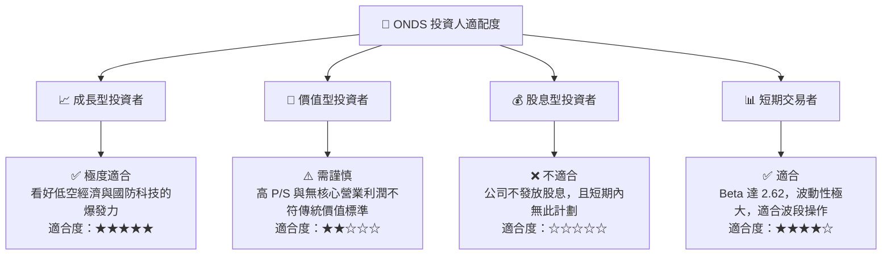

### 10.5 關鍵監控指標

| 監控類型 | 關鍵指標 | 警戒線 | 理想目標 | 監控頻率 |
|----------|----------|--------|----------|----------|
| **成長性** | 季度營收 (Quarterly Revenue) | < $25M | > $60M | 每季度 |
| **獲利能力** | 核心營業利益率 (Operating Margin) | < -100% | > -20% (朝轉正邁進) | 每季度 |
| **稀釋風險** | 流通股數 (Shares Outstanding) | > 550M | 保持在 520M 以下 | 每季度 |
| **技術進展** | Sentrycs 與 Iron Drone 交付量 | 出現客戶退單 | 獲得跨國合約 | 每半年 |

---

> **免責聲明**：本報告為 AI 自動生成，僅供研究參考，不構成投資建議。投資有風險，入市需謹謹慎。