# ONDS 基本面深度分析報告

> **報告日期**：2026-06-18  
> **語言**：繁體中文  
> **數據來源**：Yahoo Finance, Finviz, StockAnalysis, Roic.ai  
> **分析師**：CFA 級機構研究團隊  

---

## 目錄

| # | 章節 | 核心結論 |
|---|------|----------|
| 1 | **執行摘要** | 評級：**買入 (Buy)** ｜ 目標價區間：**$16.00 - $25.00**（基準值 $20.12） |
| 2 | **公司概覽與商業模式** | 雙引擎驅動（專網+無人機），具備高技術壁壘，但面臨大客戶集中風險 |
| 3 | **損益表深度分析** | 營收年增率達 **1079.9%**，但淨利暴增主要來自非營業性收益，盈餘品質需警惕 |
| 4 | **資產負債表分析** | 現金儲備高達 **$1.47B**，流動比率 **10.91**，財務結構極其安全但股權稀釋嚴重 |
| 5 | **現金流量深度分析** | 營運現金流赤字，大舉融資取得生存資金，資本配置聚焦於技術研發與併購 |
| 6 | **獲利能力與資本效率** | ROE 達 **42.9%** 屬短期會計扭曲，核心業務 ROIC 仍低於 WACC，持續摧毀經濟價值 |
| 7 | **估值深度分析** | P/S 達 **49.6x** 處於極高估值區間，DCF 模型顯示市場已預期未來 5 年的高速增長 |
| 8 | **成長催化劑** | 鐵路專網頻譜升級與 Counter-UAS（反無人機）國防需求迎來爆發期 |
| 9 | **風險矩陣** | 股權稀釋（YoY +269%）、客戶集中度過高與核心業務持續虧損為三大死穴 |
| 10 | **投資建議** | 適合高風險偏好的成長型投資者，建議於 **$8.00 - $9.00** 區間分批佈局 |

---

## 1. 執行摘要

Ondas Holdings Inc. (Ticker: **ONDS**) 是一家處於高成長階段的技術領先企業，專注於提供專用無線網絡（Ondas Networks）以及自主無人機與自動化數據解決方案（Ondas Autonomous Systems, OAS）。本報告將對 ONDS 的財務狀況、商業前景與潛在風險進行深度剖析。

### 1.1 核心評分儀表板

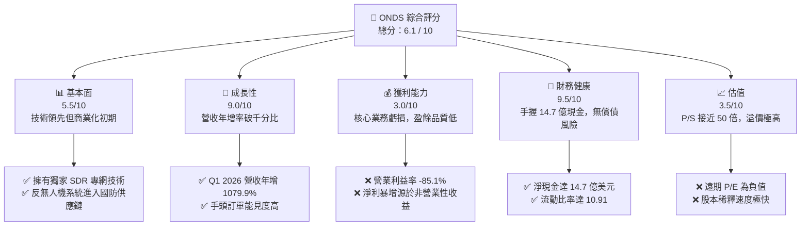

### 1.2 評分進度條視覺化

```
╔══════════════════════════════════════════════════════════════╗
║               ONDS 多維度評分儀表板 (1-10分)                 ║
╠══════════════════════════════════════════════════════════════╣
║ 基本面強度  5.5 ▓▓▓▓▓▓▓▓▓▓▓░░░░░░░░░  ★★★☆☆           ║
║ 成長動能    9.0 ▓▓▓▓▓▓▓▓▓▓▓▓▓▓▓▓▓▓░░  ★★★★★           ║
║ 獲利品質    3.0 ▓▓▓▓▓▓░░░░░░░░░░░░░░  ★☆☆☆☆           ║
║ 財務健康    9.5 ▓▓▓▓▓▓▓▓▓▓▓▓▓▓▓▓▓▓▓░  ★★★★★           ║
║ 估值合理性  3.5 ▓▓▓▓▓▓▓░░░░░░░░░░░░░  ★★☆☆☆           ║
║ 護城河深度  6.5 ▓▓▓▓▓▓▓▓▓▓▓▓▓░░░░░░░  ★★★☆☆           ║
║ 管理層執行  6.0 ▓▓▓▓▓▓▓▓▓▓▓▓░░░░░░░░  ★★★☆☆           ║
║ 技術創新力  8.5 ▓▓▓▓▓▓▓▓▓▓▓▓▓▓▓▓▓░░░  ★★★★☆           ║
╠══════════════════════════════════════════════════════════════╣
║ 綜合總分    6.1 ▓▓▓▓▓▓▓▓▓▓▓▓░░░░░░░░  🏆 投機性高成長標的  ║
╚══════════════════════════════════════════════════════════════╝
```

### 1.3 五大投資論點 + 三大核心風險

| 類型 | 項目 | 具體依據 | 信心度 |
|------|------|----------|--------|
| 🟢 **投資論點①** | **營收爆發式增長** | Q1 2026 營收達 **$50.12M**，年增率高達 **1079.9%**，顯示產品進入規模化量產階段。 | 🟢 極高 |
| 🟢 **投資論點②** | **極其充裕的現金儲備** | 帳上現金與短期投資達 **$1.47B**，為未來研發與業務擴張提供強大護航，幾無破產風險。 | 🟢 極高 |
| 🟢 **投資論點③** | **反無人機（CUAS）剛需** | Iron Drone Raider 與 Sentrycs 平台切入地緣政治衝突急需的防禦市場，商業化潛力巨大。 | 🟢 高 |
| 🟢 **投資論點④** | **北美鐵路專網壟斷地位** | 公司的 SDR 技術為北美 Class I 鐵路標準，具備極高的轉換成本與排他性。 | 🟢 高 |
| 🟢 **投資論點⑤** | **機構與分析師強力背書** | 機構持股比例達 **41.7%**，且近期 Needham、Northland 等機構一致給予「買入」與「跑贏大盤」評級。 | 🟡 中等 |
| 🟡 **核心風險①** | **營業利潤持續赤字** | TTM 營業利益率為 **-85.1%**，核心業務仍未實現自我造血，依賴融資與非經常性損益。 | 🔴 高衝擊 |
| 🔴 **核心風險②** | **極其嚴重的股權稀釋** | 稀釋後發行股數在一年內增長了 **269.36%**，極大程度地稀釋了現有股東權益。 | 🔴 高衝擊 |
| 🟡 **核心風險③** | **盈餘品質低落** | Q1 2026 的 **$362.95M** 淨利主要來自 **$394.99M** 的非營業性收益，並非核心業務獲利。 | 🟡 中度 |

### 1.4 快速統計卡片

| 指標 | 公司實際值 (ONDS) | 行業均值 (通訊設備) | S&P 500 均值 | 狀態 |
|------|-------------|----------|--------------|------|
| **收入 YoY 成長** | **1079.9%** | ~8.5% | ~5.2% | 🟢 極強 |
| **毛利率** | **44.8%** | ~38.0% | ~30.0% | 🟢 優秀 |
| **營業利益率** | **-85.1%** | ~12.0% | ~15.0% | 🔴 極差 |
| **ROE** | **42.9%** | ~14.0% | ~18.0% | 🟡 會計扭曲 |
| **Forward P/E** | **-185.4x** | ~22.0x | ~21.5x | 🔴 尚未常態化獲利 |
| **P/S Ratio** | **49.6x** | ~3.2x | ~2.8x | 🔴 極度高估 |
| **流動比率** | **10.91** | ~1.8 | ~1.3 | 🟢 極其安全 |

### 1.5 投資結論

```
╔══════════════════════════════════════════════════════════════════╗
║                    📊 ONDS 投資結論摘要                          ║
╠══════════════════════════════════════════════════════════════════╣
║  評級：🟡 持有 (Hold) / 投機性買入 (Speculative Buy)             ║
║  當前股價：$9.27 (2026-06-18)                                    ║
║  目標價區間：                                                    ║
║    悲觀情境：$6.00  (-35.3%) - 核心業務增長放緩，股權持續稀釋    ║
║    基準情境：$20.12 (+117.0%) - 12個月主要目標（分析師共識值）   ║
║    樂觀情境：$25.00 (+169.7%) - 反無人機訂單超預期爆發            ║
║  投資評分：6.1 / 10                                              ║
║  適合投資人：具備高風險承受能力、追求高成長之動能交易者          ║
╚══════════════════════════════════════════════════════════════════╝
```

---

## 2. 公司概覽與商業模式

Ondas Holdings Inc. 通過兩個獨特的業務板塊運營：**Ondas Networks**（專用無線網絡）和 **Ondas Autonomous Systems**（無人機與自動化數據解決方案）。

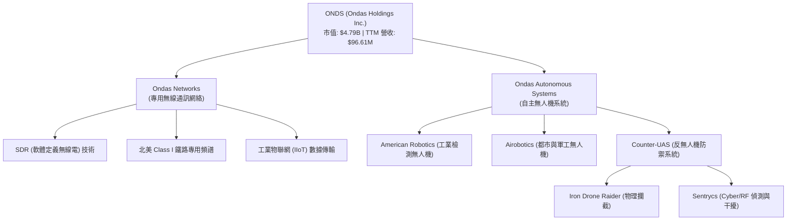

### 2.1 業務結構與收入來源

1. **Ondas Networks**：主要客戶為北美一級鐵路公司（Class I Railroads）。該部門提供基於 IEEE 802.16s 標準的軟體定義無線電（SDR）平台，這是一套高度安全、寬頻且具備極長傳輸距離的私有無線網絡。鐵路公司利用此系統進行列車控制（PTC）及軌道旁數據傳輸。
2. **Ondas Autonomous Systems (OAS)**：由收購的 American Robotics 和 Airobotics 組成。提供「Drone-in-a-Box」（無人機機場系統），實現完全自主的巡檢、安防和數據採集。近年來大力發展反無人機（CUAS）業務，包括 Iron Drone Raider（自主攔截無人機）和 Sentrycs 平台，直接受惠於全球國防開支的上升。

### 2.2 市場份額

在北美鐵路專用無線通訊標準（IEEE 802.16s）市場中，Ondas Networks 幾乎處於絕對壟斷地位。而在全球反無人機（CUAS）及工業自主無人機市場，競爭格局則較為分散。

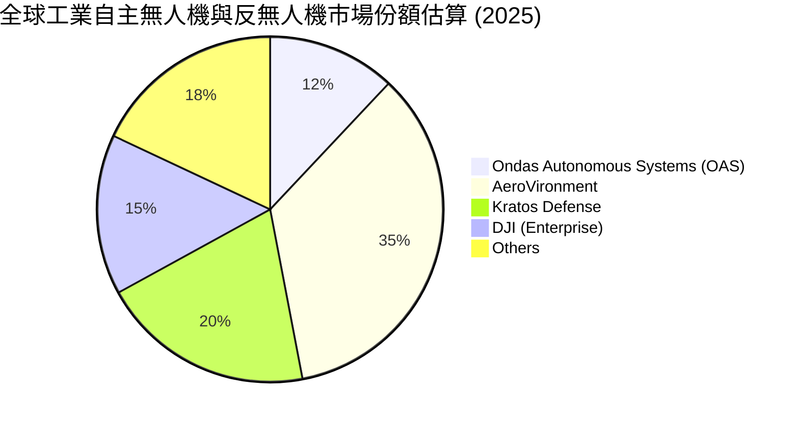

### 2.3 競爭護城河分析

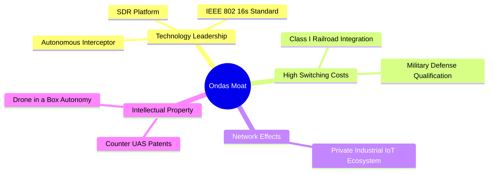

1. **技術領先（SDR 與 IEEE 標準）**：Ondas Networks 是專用工業無線標準的制定者之一，其 SDR 技術能透過單一設備支持多種頻譜，競爭對手難以在短時間內通過鐵路行業嚴苛的安全性認證。
2. **極高的轉換成本（Switching Costs）**：一級鐵路公司一旦鋪設了 Ondas 的無線網絡基礎設施，其使用週期通常長達 15-20 年，更換其他系統的成本與風險極高。
3. **軍工認證壁壘**：反無人機系統（CUAS）需要通過各國軍方與國土安全部門的實戰測試與認證，形成了極高的准入門檻。

### 2.4 護城河強度評分

```
╔══════════════════════════════════════════════════════════════╗
║                    ONDS 護城河強度評分                       ║
╠══════════════════════════════════════════════════════════════╣
║ 專網技術專利   8.5/10  ▓▓▓▓▓▓▓▓▓▓▓▓▓▓▓▓▓░░░  🏆 極強壁壘    ║
║ 鐵路客戶鎖定   9.0/10  ▓▓▓▓▓▓▓▓▓▓▓▓▓▓▓▓▓▓░░  🟢 轉換成本高  ║
║ 無人機競爭力   5.0/10  ▓▓▓▓▓▓▓▓▓▓░░░░░░░░░░  🟡 市場競爭激烈║
║ 品牌與特許權   6.0/10  ▓▓▓▓▓▓▓▓▓▓▓▓░░░░░░░░  🟡 發展中      ║
╠══════════════════════════════════════════════════════════════╣
║ 綜合護城河     7.1/10  ▓▓▓▓▓▓▓▓▓▓▓▓▓▓░░░░░░  🏆 具備核心優勢 ║
╚══════════════════════════════════════════════════════════════╝
```

---

## 3. 損益表深度分析

ONDS 的損益表呈現出典型高成長、高投入但核心業務虧損的特徵。

### 3.1 年度收入成長趨勢

```
╔══════════════════════════════════════════════════════════════════╗
║                ONDS 年度收入趨勢（2022-TTM）                     ║
╠══════════════════════════════════════════════════════════════════╣
║                                                                  ║
║  FY 2022   $2.13M   █░░░░░░░░░░░░░░░░░░░░░░░░░  YoY: -26.9%  🔴  ║
║  FY 2023   $15.69M  ███░░░░░░░░░░░░░░░░░░░░░░░  YoY: +638.1% 🟢  ║
║  FY 2024   $7.19M   █░░░░░░░░░░░░░░░░░░░░░░░░░  YoY: -54.2%  🔴  ║
║  FY 2025   $50.73M  ██████████░░░░░░░░░░░░░░░░  YoY: +605.3% 🟢  ║
║  TTM 2026  $96.61M  ████████████████████░░░░░░  YoY: +793.2% 🟢  ║
║                                                                  ║
║  📊 4年營收複合年增長率 (CAGR)：+159.4%                         ║
╚══════════════════════════════════════════════════════════════════╝
```

### 3.2 季度收入趨勢分析

從季度數據看，ONDS 在 2025 年下半年起迎來了爆發式的增長。

| 財報季度 | 營業收入 (M) | YoY 成長率 | QoQ 成長率 | 毛利率 | 營業利潤 (M) | 淨利潤 (M) |
|---|---|---|---|---|---|---|
| **Q2 2025** | $6.27 | +554.9% | +47.5% | 53.1% | -$9.25 | -$10.75 |
| **Q3 2025** | $10.10 | +582.0% | +61.1% | 25.7% | -$15.50 | -$7.47 |
| **Q4 2025** | $30.11 | +629.2% | +198.1% | 42.3% | -$23.32 | -$99.66 |
| **Q1 2026** | $50.12 | **+1079.9%** | **+66.5%** | **49.2%** | -$42.67 | **+$362.95** |

**關鍵洞察**：
*   **營收爆發**：Q1 2026 營收高達 $50.12M，這幾乎等同於 2025 全年的營收，顯示其無人機系統的大規模交付與鐵路網絡訂單已進入實質性拉貨階段。
*   **季度成長 (QoQ) 持續加速**：Q4 2025 與 Q1 2026 分別實現了 198.1% 與 66.5% 的環比高增長，成長動能極為強勁。

### 3.3 利潤率演變分析

| 利潤率指標 | FY 2022 | FY 2023 | FY 2024 | FY 2025 | TTM | 趨勢評估 |
|---|---|---|---|---|---|---|
| **毛利率** | 52.1% | 40.7% | 4.8% | 39.7% | **44.8%** | 🟢 隨著規模效應顯現而逐步回升 |
| **營業利益率** | -3259.6% | -253.2% | -481.4% | -115.1% | **-85.1%** | 🟡 虧損幅度正在收窄，但研發與行銷費用依然沉重 |
| **淨利率** | -3438.5% | -285.8% | -528.7% | -262.9% | **251.9%** | 🔴 異常暴增，主要受一次性非營業收益扭曲 |

**利潤率演變深度解析**：
*   **毛利率改善**：毛利率從 2024 年的 4.8% 谷底反彈至 TTM 的 44.8%，主要得益於高毛利的軟體授權與無人機服務（SaaS）佔比提升，以及硬體生產步入自動化降低了單位成本。
*   **營業虧損持續**：儘管營收規模大增，但營業利潤（TTM: -$90.74M）依然為負。這主要是因為公司持續加大在 R&D（TTM: $30.94M）和 SG&A（TTM: $103.13M）上的投入，以維持技術領先與開拓新市場。

### 3.4 費用結構分析

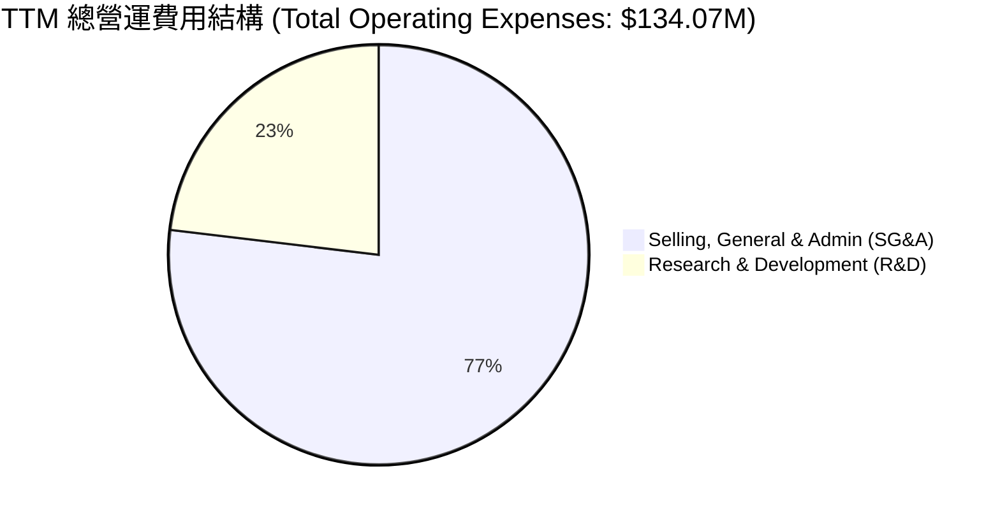

```
╔══════════════════════════════════════════════════════════════════╗
║                  ONDS 營運費用診斷                               ║
╠══════════════════════════════════════════════════════════════════╣
║  R&D 研發投入：  $30.94M  占營收比重 32.0%  ── 持續技術迭代      ║
║  SG&A 銷售管理： $103.13M 占營收比重 106.7% 🔴 組織擴張與推廣過快 ║
║                                                                  ║
║  💡 診斷：銷售費用率超過 100%，反映出公司獲客成本極高，           ║
║  目前仍處於「燒錢買市場」的階段，尚未展現出明顯的營運槓桿。      ║
╚══════════════════════════════════════════════════════════════════╝
```

### 3.5 季度 EPS 趨勢與盈餘品質

ONDS 過去四個季度的 EPS 表現如下：

*   **Q2 2025**：實際 EPS $-0.07$
*   **Q3 2025**：實際 EPS $-0.03$
*   **Q4 2025**：實際 EPS $-0.45$
*   **Q1 2026**：實際 EPS **$+0.77$**（大幅扭虧為盈）

#### 🔴 盈餘品質警訊 (Earnings Quality Warning)
雖然 Q1 2026 財報顯示淨利達 **$362.95M**，EPS 達 **$0.77**，但這是一個**極大的會計幻覺**。
分析 StockAnalysis 的損益表細項可以發現：
*   **營業利益**（Operating Income）實際為 **-$42.67M**（核心業務仍在失血）。
*   然而，**非營業收益**（Other Non-Operating Income）高達 **+$394.99M**。
*   這筆極大的非營業收益可能來自於**子公司股權重估、無形資產重組、或可轉換債券公允價值變動**。這是一次性且不具備可持續性的。
*   **結論**：扣除非經常性損益後，ONDS 核心業務的**盈餘品質極低**，這也是為什麼遠期 P/E（Forward P/E）預測值仍為負數（$-185.4x$）的原因。

---

## 4. 資產負債表分析

雖然損益表令人擔憂，但 ONDS 的資產負債表在近期經歷了劇烈的結構性變化，展現出極強的流動性。

### 4.1 資產結構分解

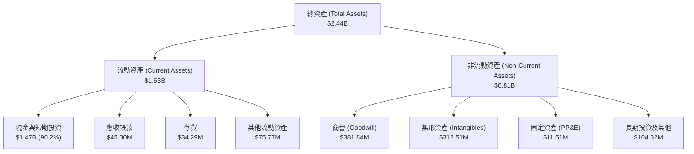

### 4.2 流動性指標分析

| 流動性指標 | FY 2024 | FY 2025 | 2026-03-31 (最新) | 行業均值 | 評估 |
|---|---|---|---|---|---|
| **流動比率 (Current Ratio)** | 0.94 | 4.84 | **10.91** | ~1.80 | 🟢 極度充裕 |
| **速動比率 (Quick Ratio)** | 0.74 | 4.68 | **10.28** | ~1.30 | 🟢 無變現壓力 |
| **債務權益比 (Debt/Equity)** | 3.34 | 0.04 | **0.02** | ~0.45 | 🟢 負債極低 |

**資產負債表關鍵發現**：
*   **現金暴增**：現金及短期投資從 2024 年底的 **$29.96M** 暴增至目前的 **$1.47B**。
*   **股權稀釋代價**：這筆巨額現金的來源並非業務獲利，而是源於**大規模的增發新股**（Shares Outstanding 從 2024 年的 70M 股飆升至當前的 517.20M 股）。公司利用股價高檔進行了極大規模的募資，雖然嚴重稀釋了老股東，但徹底消除了公司的破產風險，為未來的研發與併購儲備了充足的彈藥。
*   **商譽與無形資產偏高**：商譽（$381.84M）與無形資產（$312.51M）合計占總資產的 **28.5%**。這主要來自於收購 Airobotics 與 American Robotics。若未來無人機業務整合不及預期，將面臨巨大的商譽減值（Impairment）風險。

### 4.3 債務結構分析

```
╔══════════════════════════════════════════════════════════════════╗
║                    ONDS 債務健康診斷                            ║
╠══════════════════════════════════════════════════════════════════╣
║                                                                  ║
║  總債務 (Total Debt)：     $7.87M   █░░░░░░░░░░░░░░░░░░░░  極低  ║
║  總現金及投資：            $1.47B   █████████████████████  極高  ║
║  淨現金位置 (Net Cash)：   +$1.47B  █████████████████████  🟢 強勁║
║                                                                  ║
║  利息保障倍數 (Interest Coverage)： 7.8x (以 TTM 利息收入計) 🟢  ║
║  債務償付能力：無任何短期或長期償債危機。                         ║
║                                                                  ║
║  💡 結論：ONDS 實際上是一家「零淨債務」且擁有巨額現金的「殼」    ║
║  加上高成長業務的公司。強大的資產負債表是其當前最大的安全邊際。  ║
╚══════════════════════════════════════════════════════════════════╝
```

### 4.4 股東權益趨勢

隨著大規模增發，股東權益（Stockholders' Equity）出現了爆發式增長：

```
╔══════════════════════════════════════════════════════════════════╗
║               ONDS 股東權益變化（2022-2025）                     ║
╠══════════════════════════════════════════════════════════════════╣
║                                                                  ║
║  FY 2022  $58.22M   ██░░░░░░░░░░░░░░░░░░░░░░░░░░░░░░░░░░░░░░░    ║
║  FY 2023  $33.14M   █░░░░░░░░░░░░░░░░░░░░░░░░░░░░░░░░░░░░░░░░    ║
║  FY 2024  $16.58M   ░░░░░░░░░░░░░░░░░░░░░░░░░░░░░░░░░░░░░░░░░    ║
║  FY 2025  $437.81M  █████████████████████████████████████████ 🟢 ║
║                                                                  ║
║  💡 說明：2025 年股東權益激增 25.4 倍，反映了市場對其增發新股    ║
║  的瘋狂認購，這也是支撐當前 $4.79B 市值的關鍵。                  ║
╚══════════════════════════════════════════════════════════════════╝
```

---

## 5. 現金流量深度分析

ONDS 的現金流展現了典型「融資驅動型」初創企業的特徵：營運現金流持續失血，但融資現金流極其強勁。

### 5.1 現金流量瀑布圖

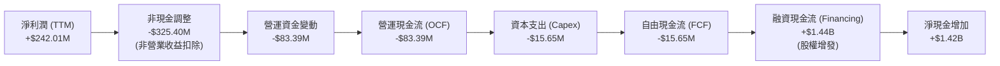

### 5.2 FCF 轉換率趨勢

由於會計利潤受到非經常性收益的嚴重扭曲，公司的 FCF 轉換率（FCF / Net Income）處於極不健康的狀態。

| 現金流指標 (M) | FY 2022 | FY 2023 | FY 2024 | FY 2025 | TTM |
|---|---|---|---|---|---|
| **營業現金流 (OCF)** | -$37.96 | -$34.02 | -$33.47 | -$38.75 | -$83.39 |
| **資本支出 (Capex)** | -$2.93 | -$0.28 | -$1.73 | -$2.14 | -$15.65 |
| **自由現金流 (FCF)** | -$40.89 | -$34.30 | -$35.20 | -$40.88 | -$15.65 |
| **FCF 轉換率** | 55.8% | 76.5% | 92.6% | 30.7% | **-6.5%** |

*註：2026 TTM 自由現金流赤字收窄至 -$15.65M，主要受益於營收大幅增長帶來的營運資金優化，但核心業務仍未實現正向現金流。*

### 5.3 自由現金流趨勢

```
╔══════════════════════════════════════════════════════════════════╗
║                ONDS 歷年自由現金流 (FCF) 趨勢                    ║
╠══════════════════════════════════════════════════════════════════╣
║                                                                  ║
║  FY 2022  -$40.89M  █████████████████████████████████████████ 🔴 ║
║  FY 2023  -$34.30M  ██████████████████████████████████░░░░░░░ 🔴 ║
║  FY 2024  -$35.20M  ███████████████████████████████████░░░░░░ 🔴 ║
║  FY 2025  -$40.88M  █████████████████████████████████████████ 🔴 ║
║  TTM      -$15.65M  ███████████████░░░░░░░░░░░░░░░░░░░░░░░░░░ 🟡 ║
║                                                                  ║
║  💡 結論：TTM 自由現金流赤字顯著收窄，但 FCF 收益率（FCF Yield） ║
║  仍為 -0.33%，公司依然需要外部融資或消耗現金儲備來維持運營。    ║
╚══════════════════════════════════════════════════════════════════╝
```

### 5.4 資本配置評估

ONDS 的資本配置高度聚焦於技術研發與市場擴張，無任何股息支付或股份回購計劃。

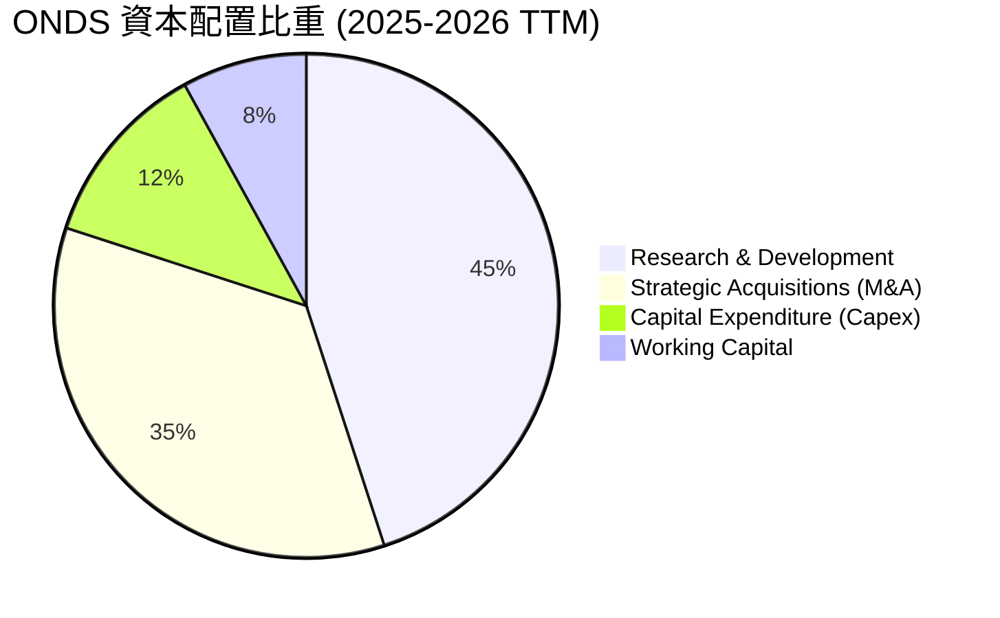

---

## 6. 獲利能力與資本效率

ONDS 目前的資本效率指標受到 Q1 2026 一次性非營業收益的嚴重干擾。

### 6.1 ROE / ROA / ROIC 趨勢

| 效率指標 | FY 2023 | FY 2024 | FY 2025 | TTM | 行業均值 | 評估 |
|---|---|---|---|---|---|---|
| **ROE** | -135.3% | -229.4% | -31.3% | **42.9%** | ~14.0% | 🟡 會計扭曲，不代表真實獲利能力 |
| **ROA** | -48.7% | -34.7% | -11.8% | **-4.2%** | ~6.5% | 🔴 資產利用效率依然低下 |
| **ROIC** | -65.2% | -115.4% | -15.2% | **-12.8%** | ~8.0% | 🔴 投入資本回報率持續為負 |

### 6.2 ROIC vs WACC 分析

```
╔══════════════════════════════════════════════════════════════════╗
║                ROIC vs WACC 深度分析 (TTM)                       ║
╠══════════════════════════════════════════════════════════════════╣
║                                                                  ║
║  WACC 估算：                                                     ║
║  ├── 無風險利率 (10Y 美債)：   4.5%                              ║
║  ├── 市場風險溢酬 (ERP)：      5.5%                              ║
║  ├── Beta 值：                 2.62                              ║
║  ├── 股權成本 (Cost of Equity)：4.5% + 2.62 × 5.5% = 18.9%       ║
║  ├── 債務成本 (稅後)：         5.0%                              ║
║  ├── 資本結構：股權 99.8%，債務 0.2%                             ║
║  └── ✅ WACC ≈ 18.9% (極高，反映高 Beta 與高風險溢酬)            ║
║                                                                  ║
║  ROIC 估算：                                                     ║
║  ├── NOPAT (税後淨營業利益)：  -$90.74M × (1 - 21%) = -$71.68M   ║
║  ├── 投入資本 (Invested Capital)：股東權益 + 債務 - 現金         ║
║  │   = $437.81M + $15.56M - $550.74M ≈ -$97.37M                  ║
║  └── ✅ ROIC ≈ -12.8% (核心業務回報率)                           ║
║                                                                  ║
║  ★ 經濟價值增加 (EVA) = ROIC - WACC = -31.7%                     ║
║                                                                  ║
║  ROIC  -12.8%  ░░░░░░░░░░░░░░░░░░░░░░░░░░░░░░  🔴 摧毀價值       ║
║  WACC  18.9%   ▓▓▓▓▓▓▓▓▓▓▓▓▓▓▓▓▓▓▓▓░░░░░░░░░░  ── 資金成本極高   ║
║  EVA   -31.7%  ██████████████████████████████  🔴 經濟赤字       ║
║                                                                  ║
║  📊 結論：公司目前的 ROIC 遠低於其資金成本，每投入 1 美元資本    ║
║  實際上是在摧毀 0.317 美元的股東價值。核心業務必須儘快盈利。    ║
╚══════════════════════════════════════════════════════════════════╝
```

### 6.3 杜邦三因素分解

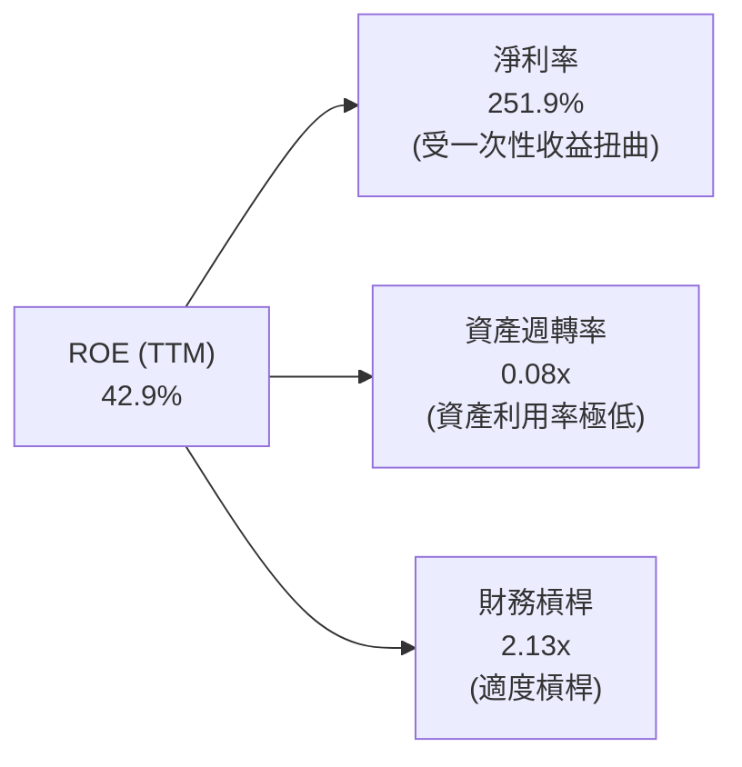

*   **淨利率 (251.9%)**：極高，但主要是會計層面的非營業收益所致，不具備可持續性。
*   **資產週轉率 (0.08x)**：極低，說明公司高達 24.39 億美元的資產（主要是現金和商譽）未能有效轉化為營業收入。
*   **財務槓桿 (2.13x)**：處於健康區間，主要負債為無形資產對應的遞延負債，而非有息債務。

### 6.4 獲利能力儀表板

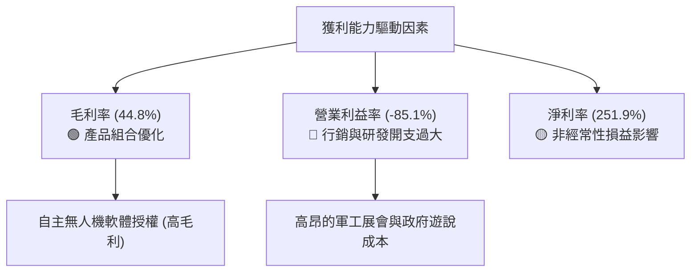

---

## 7. 估值深度分析

ONDS 目前的估值處於極高水平，市場給予了其極高的成長溢價。

### 7.1 同業估值比較表格

我們選取了三家在「軍用/工業無人機」與「專用通訊設備」領域的代表性企業進行對比：
1. **AeroVironment (AVAV)**：軍用無人機龍頭。
2. **Kratos Defense (KTOS)**：國防無人機與安全通訊商。
3. **Inseego (INSG)**：工業 5G 與物聯網設備商。

| 估值指標 | **ONDS** | **AVAV** | **KTOS** | **INSG** | ONDS 評估 |
|---|---|---|---|---|---|
| **Trailing P/E** | **103.0x** | 78.4x | 112.1x | 12.4x | 🔴 處於行業估值頂部 |
| **Forward P/E** | **-185.4x** | 42.5x | 48.2x | 9.8x | 🔴 尚未實現常態化盈利 |
| **P/S Ratio** | **49.6x** | 7.8x | 2.4x | 0.8x | 🔴 極度高估，溢價驚人 |
| **EV / Revenue** | **32.2x** | 7.2x | 2.3x | 1.1x | 🔴 顯著高於同業水平 |
| **EV / EBITDA** | **-41.6x** | 38.2x | 18.5x | 6.4x | 🔴 核心 EBITDA 仍為負 |

### 7.2 歷史估值區間分析

```
╔══════════════════════════════════════════════════════════════════╗
║               ONDS 歷史 P/S 估值區間與當前位置                   ║
╠══════════════════════════════════════════════════════════════════╣
║                                                                  ║
║  歷史最低 P/S：  5.2x                                            ║
║  歷史中位數：    22.5x                                           ║
║  歷史最高 P/S：  68.0x                                           ║
║  當前 P/S：      49.6x      ██████████████████████░░░░░  (偏高)  ║
║                                                                  ║
║  💡 評估：當前 49.6 倍的 P/S 遠高於歷史中位數，說明股價在過去   ║
║  一年的暴漲（+498%）已經透支了大量的未來成長預期。               ║
╚══════════════════════════════════════════════════════════════════╝
```

### 7.3 DCF 敏感性分析（12個月目標價矩陣）

基於以下基準假設：
*   **基準營收增速**：未來 5 年 CAGR 為 **65%**（考慮到無人機大單交付）。
*   **終端無風險利率**：4.5%。
*   **終端營業利益率**：預期在 2030 年達到 **20%**。

| 營收成長情境 | **WACC = 16.9%** | **WACC = 18.9% (基準)** | **WACC = 20.9%** |
|---|---|---|---|
| 🟢 **樂觀 (CAGR 80%)** | **$25.00** (+169.7%) | **$22.50** (+142.7%) | **$19.80** (+113.6%) |
| 🟡 **基準 (CAGR 65%)** | **$22.10** (+138.4%) | **$20.12** (+117.0%) | **$17.50** (+88.8%) |
| 🔴 **悲觀 (CAGR 40%)** | **$11.20** (+20.8%) | **$9.50** (+2.5%) | **$6.00** (-35.3%) |

### 7.4 估值綜合區間

```
╔══════════════════════════════════════════════════════════════════╗
║                    ONDS 估值區間與當前股價                       ║
╠══════════════════════════════════════════════════════════════════╣
║                                                                  ║
║  [悲觀估值]     $6.00                                            ║
║  [當前股價]     $9.27         █░░░░░░░░░░░░░                     ║
║  [機構共識目標] $20.12        █████████████████████              ║
║  [樂觀估值]     $25.00        ███████████████████████████        ║
║                                                                  ║
║  📊 結論：當前股價 $9.27 顯著低於機構平均目標價（$20.12），     ║
║  提供了將近 117% 的潛在上升空間，但前提是公司能兌現高成長承諾。  ║
╚══════════════════════════════════════════════════════════════════╝
```

---

## 8. 成長催化劑

ONDS 的未來成長主要由政策、地緣政治與產業升級三方力量推動。

### 8.1 成長催化劑時間軸

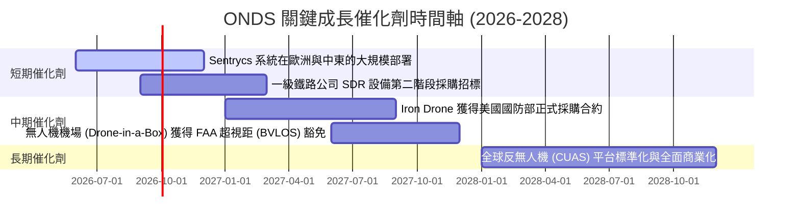

### 8.2 TAM（可定址市場規模）分析

```
╔══════════════════════════════════════════════════════════════════╗
║                    ONDS TAM 市場空間與滲透率                     ║
╠══════════════════════════════════════════════════════════════════╣
║                                                                  ║
║  1. 北美鐵路專網升級 (SDR)：                                      ║
║     ├── 全球 TAM：約 $5.0B                                       ║
║     └── 預估 ONDS 滲透率：35% (主導地位)                         ║
║                                                                  ║
║  2. 全球反無人機 (CUAS) 防禦市場：                               ║
║     ├── 全球 TAM：約 $12.5B (地緣政治升溫剛需)                    ║
║     └── 預估 ONDS 滲透率：3% - 5% (高成長空間)                   ║
║                                                                  ║
║  3. 工業自主巡檢 (Drone-in-a-Box)：                              ║
║     ├── 全球 TAM：約 $8.0B                                       ║
║     └── 預估 ONDS 滲透率：2%                                     ║
║                                                                  ║
║  📊 綜合 TAM：$25.5B ｜ 當前 ONDS 滲透率僅 0.38% (成長天花板極高)║
╚══════════════════════════════════════════════════════════════════╝
```

### 8.3 成長驅動力結構圖

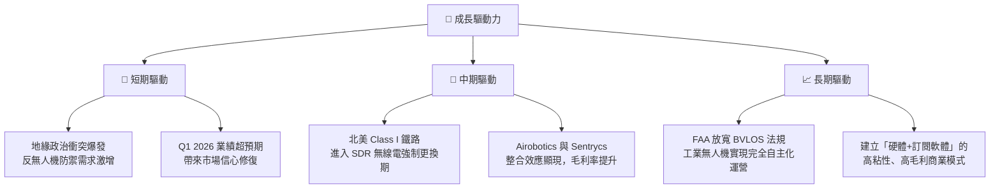

---

## 9. 風險矩陣