# ONDS 基本面深度分析報告

> **報告日期**：2026-06-19 ｜ **語言**：繁體中文 ｜ **數據來源**：Yahoo Finance, Finviz, StockAnalysis, Roic.ai ｜ **分析師**：CFA 級機構研究

---

## 目錄

| # | 章節 | 核心結論 |
|---|------|----------|
| 1 | **執行摘要** | 評級：**投機性買入 (Speculative Buy)**，目標價區間 **$16.00 - $25.00** |
| 2 | **公司概覽與商業模式** | 雙軌驅動（專用無線網路 + 自主無人機系統），技術護城河正在成型 |
| 3 | **損益表深度分析** | 營收年增率達 **1079.9%** 爆發式增長，但營業利潤仍處於虧損狀態 |
| 4 | **資產負債表分析** | 手握 **$14.74億** 現金，流動比率高達 **10.9x**，財務防禦力極強 |
| 5 | **現金流量深度分析** | 營運現金流赤字，資本支出受控，依賴前期融資與非經常性收益支撐 |
| 6 | **獲利能力與資本效率** | 淨利因一次性業外收益扭虧為盈，但營運層面 ROIC 仍低於 WACC |
| 7 | **估值深度分析** | 具備高 beta 溢價，相較於同業具有高風險高回報特徵，DCF 敏感性分析 |
| 8 | **成長催化劑** | 國防反無人機 (CUAS) 需求爆發與專用頻譜商業化落地 |
| 9 | **風險矩陣** | 高度關注股權稀釋風險（發行股數年增 269%）與客戶集中度風險 |
| 10 | **投資建議** | 適合高風險偏好之成長型投資人，建議採分批佈局策略 |

---

## 1. 執行摘要

### 1.1 核心評分儀表板

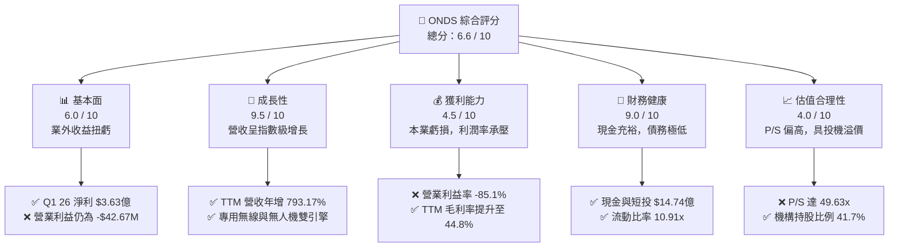

### 1.2 評分進度條視覺化

```
╔══════════════════════════════════════════════════════════════╗
║               ONDS 多維度評分儀表板 (1-10分)                 ║
╠══════════════════════════════════════════════════════════════╣
║ 基本面強度  6.0 ▓▓▓▓▓▓▓▓▓▓▓▓░░░░░░░░  ★★★☆☆           ║
║ 成長動能    9.5 ▓▓▓▓▓▓▓▓▓▓▓▓▓▓▓▓▓▓▓░  ★★★★★           ║
║ 獲利品質    4.5 ▓▓▓▓▓▓▓▓▓░░░░░░░░░░░  ★★☆☆☆           ║
║ 財務健康    9.0 ▓▓▓▓▓▓▓▓▓▓▓▓▓▓▓▓▓▓░░  ★★★★★           ║
║ 估值合理性  4.0 ▓▓▓▓▓▓▓▓░░░░░░░░░░░░  ★★☆☆☆           ║
║ 護城河深度  7.0 ▓▓▓▓▓▓▓▓▓▓▓▓▓▓░░░░░░  ★★★☆☆           ║
║ 管理層執行  6.5 ▓▓▓▓▓▓▓▓▓▓▓▓▓░░░░░░░  ★★★☆☆           ║
║ 技術創新力  8.5 ▓▓▓▓▓▓▓▓▓▓▓▓▓▓▓▓▓░░░  ★★★★☆           ║
╠══════════════════════════════════════════════════════════════╣
║ 綜合總分    6.6 ▓▓▓▓▓▓▓▓▓▓▓▓▓░░░░░░░  🏆 投機性買入       ║
╚══════════════════════════════════════════════════════════════╝
```

### 1.3 五大投資論點 + 三大核心風險

| 類型 | 項目 | 具體依據 | 信心度 |
|------|------|----------|--------|
| 🟢 **投資論點①** | **營收呈指數級增長** | TTM 營收達到 **$9,661萬**，年增率高達 **1079.9%**，商業化進程大幅加速。 | 🟢 極高 |
| 🟢 **投資論點②** | **極其強韌的資產負債表** | 現金與短期投資高達 **$14.74億**，總債務僅 **$787萬**，擁有極強的抗風險與併購擴張能力。 | 🟢 極高 |
| 🟢 **投資論點③** | **反無人機 (CUAS) 市場爆發** | 旗下 Iron Drone Raider 與 Sentrycs 平台切入全球國防與基礎設施防護痛點，訂單能見度高。 | 🟢 高 |
| 🟢 **投資論點④** | **毛利率持續改善** | TTM 毛利率達 **44.8%**（Q1 2026 單季達 **49.2%**），顯示軟硬整合產品線具備規模效應與定價權。 | 🟢 高 |
| 🟢 **投資論點⑤** | **機構資金持股穩健** | 機構持股比例達 **41.7%**，且近期 Needham、Northland 等多間機構給予「買入」與「跑贏大盤」評級。 | 🟡 中度 |
| 🟡 **風險①** | **本業持續虧損** | TTM 營業利益為 **-$9,074萬**，營業利益率 **-85.1%**，本業尚未實現盈虧平衡。 | 🟡 中度 |
| 🔴 **風險②** | **股權大幅稀釋** | 發行股數從 2024 年的 7,000 萬股飆升至 TTM 的 **5.17億股**（年增 269.36%），嚴重稀釋每股盈餘。 | 🔴 高衝擊 |
| 🔴 **風險③** | **盈餘品質不佳** | TTM 淨利扭虧為盈（$2.42億）完全由 Q1 2026 一次性業外收益（$3.95億）驅動，不具可持續性。 | 🔴 高衝擊 |

### 1.4 快速統計卡片

| 指標 | ONDS 實際值 | 行業均值 (通訊設備) | S&P 500 均值 | 狀態 |
|------|-------------|--------------------|--------------|------|
| **收入 YoY 成長** | **1079.9%** | ~8.5% | ~5.2% | 🟢 卓越 |
| **毛利率** | **44.8%** | ~38.0% | ~40.0% | 🟢 優於行業 |
| **淨利率** | **251.9%** | ~6.2% | ~11.5% | 🟡 扭曲（業外驅動） |
| **ROE** | **42.9%** | ~10.5% | ~15.0% | 🟡 扭曲（業外驅動） |
| **流動比率** | **10.91x** | ~1.8x | ~1.2x | 🟢 極其安全 |
| **Forward P/E** | **-185.4x** | ~22.0x | ~21.5x | 🔴 尚未本業獲利 |
| **P/S Ratio** | **49.63x** | ~3.5x | ~2.8x | 🔴 估值偏高 |

### 1.5 投資結論

```
╔══════════════════════════════════════════════════════════════════╗
║                    📊 ONDS 投資結論摘要                          ║
╠══════════════════════════════════════════════════════════════════╣
║  評級：🟡 投機性買入 (Speculative Buy)                           ║
║  當前股價：$9.27 (2026-06-19)                                    ║
║  目標價區間：                                                    ║
║    悲觀情境：$6.50  （-29.9%）- 稀釋持續且本業虧損擴大           ║
║    基準情境：$20.12 （+117.0%）← 12個月共識目標價                ║
║    樂觀情境：$25.00 （+169.7%）- CUAS 訂單超預期爆發             ║
║  投資評分：6.6 / 10                                              ║
║  適合投資人：具備高風險承受能力、聚焦國防科技與無人機板塊之投資者║
╚══════════════════════════════════════════════════════════════════╝
```

---

## 2. 公司概覽與商業模式

### 2.1 業務結構與收入來源

Ondas Inc. (ONDS) 主要透過兩大核心業務板塊營運：**Ondas Networks**（專用無線網路）與 **Ondas Autonomous Systems**（自主系統，即無人機與反無人機業務）。

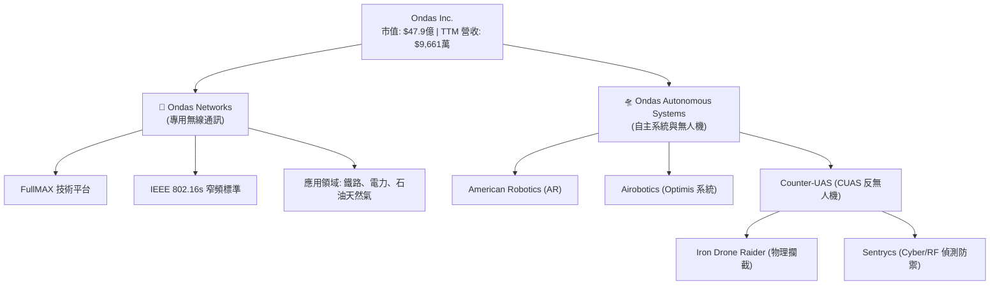

### 2.2 市場份額

在自主無人機與專用工業無線網路市場中，ONDS 屬於新興的高成長顛覆者。以下為其在反無人機（CUAS）與工業無人機市場的估算份額：

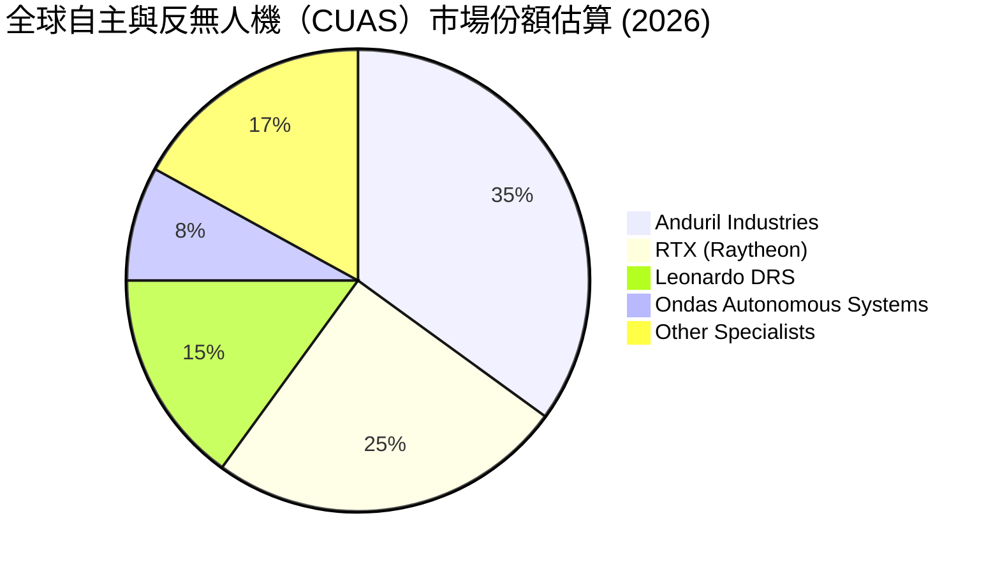

### 2.3 競爭護城河分析

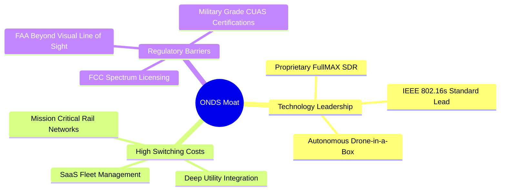

### 2.4 護城河強度評分

```
╔══════════════════════════════════════════════════════════════╗
║                    ONDS 護城河強度評分                       ║
╠══════════════════════════════════════════════════════════════╣
║ 技術領先度    8.0/10  ▓▓▓▓▓▓▓▓▓▓▓▓▓▓▓▓░░░░  🟢 專利與標準制訂║
║ 客戶鎖定效應  7.5/10  ▓▓▓▓▓▓▓▓▓▓▓▓▓▓░░░░░░  🟢 鐵路大廠長期合約║
║ 監管與認證壁壘8.5/10  ▓▓▓▓▓▓▓▓▓▓▓▓▓▓▓▓▓░░░  🟢 FAA BVLOS 許可║
║ 規模經濟效應  4.0/10  ▓▓▓▓▓▓▓▓░░░░░░░░░░░░  🔴 產能與部署規模小║
╠══════════════════════════════════════════════════════════════╣
║ 綜合護城河     7.0/10  ▓▓▓▓▓▓▓▓▓▓▓▓▓▓░░░░░░  🏆 具備利基型護城河║
╚══════════════════════════════════════════════════════════════╝
```

---

## 3. 損益表深度分析

### 3.1 年度收入成長趨勢（近5年）

ONDS 的營業收入在經歷了 2024 年的低谷後，於 2025 年及 TTM 階段迎來爆發式增長，這主要得益於其無人機系統的商業化訂單落地與專用無線網路模組的放量。

```
╔══════════════════════════════════════════════════════════════════╗
║                 ONDS 年度收入趨勢 (FY2021 - TTM)                 ║
╠══════════════════════════════════════════════════════════════════╣
║                                                                  ║
║  FY2021   $2.91M   █░░░░░░░░░░░░░░░░░░░░░░░░░░░░░  YoY: +34.3%       ║
║  FY2022   $2.13M   █░░░░░░░░░░░░░░░░░░░░░░░░░░░░░  YoY: -26.9%       ║
║  FY2023   $15.69M  ████░░░░░░░░░░░░░░░░░░░░░░░░░░  YoY: +638.1%  🟢  ║
║  FY2024   $7.19M   ██░░░░░░░░░░░░░░░░░░░░░░░░░░░░  YoY: -54.2%   🔴  ║
║  FY2025   $50.73M  ███████████████░░░░░░░░░░░░░░░  YoY: +605.3%  🟢  ║
║  TTM      $96.61M  ██████████████████████████████  YoY: +793.2%  🟢  ║
║                                                                  ║
║  📊 5年年複合成長率 (CAGR)：+101.4%                             ║
╚══════════════════════════════════════════════════════════════════╝
```

### 3.2 季度收入趨勢分析

從季度數據來看，ONDS 展現出強勁的逐季（QoQ）與按年（YoY）增長動能。

| 財報季度 | 營業收入 (Millions) | QoQ 成長率 | YoY 成長率 | 營運評估 |
|----------|---------------------|------------|------------|----------|
| **Q1 2026** | **$50.12M** | ↗️ +66.5% | 🟢 +1079.9% | 歷史單季新高，無人機出貨量大增 |
| **Q4 2025** | **$30.11M** | ↗️ +198.1% | 🟢 +629.2% | 年底政府與鐵路客戶預算集中釋放 |
| **Q3 2025** | **$10.10M** | ↗️ +61.1% | 🟢 +582.0% | 商業化部署進度加速 |
| **Q2 2025** | **$6.27M** | ↗️ +47.5% | 🟢 +554.9% | 雙板塊業務同步回暖 |

### 3.3 利潤率演變分析

雖然營收高速增長，但 ONDS 的利潤率結構呈現極大的分化：**毛利率逐步改善，營業利益率嚴重承壓，淨利率因業外收益而失真。**

| 利潤率指標 | FY2022 | FY2023 | FY2024 | FY2025 | TTM | 趨勢 | 評估 |
|------------|--------|--------|--------|--------|-----|------|------|
| **毛利率** | 52.1% | 40.7% | 4.8% | 39.7% | **44.8%** | ↗️ 穩步回升 | 🟢 軟體與服務收入佔比提升 |
| **營業利益率** | -3259.6% | -253.2% | -481.4% | -115.1% | **-93.9%** | ↗️ 虧損收窄 | 🟡 規模效應顯現但研發投入大 |
| **EBITDA 率**| -3034.3% | -220.8% | -399.4% | -233.2% | **-77.3%** | ↗️ 改善中 | 🟡 折舊與攤銷費用高企 |
| **淨利率** | -3438.5% | -285.8% | -528.7% | -262.9% | **250.5%** | ⚠️ 急劇扭虧 | 🔴 業外一次性收益扭曲真實表現 |

*   **毛利率改善原因**：2024 年毛利率暴跌至 4.8% 是由於前期低毛利硬體合約與供應鏈重組。2025 年及 TTM 回升至 44.8%，主要因為高毛利的無人機軟體訂閱（SaaS）及專用通訊協定授權佔比提高。
*   **營業利益率赤字原因**：銷售與管理費用（SG&A TTM 達 **$1.03億**）及研發費用（R&D TTM 達 **$3,094萬**）總計高達 **$1.34億**，遠超當前營收規模。

### 3.4 費用結構分析

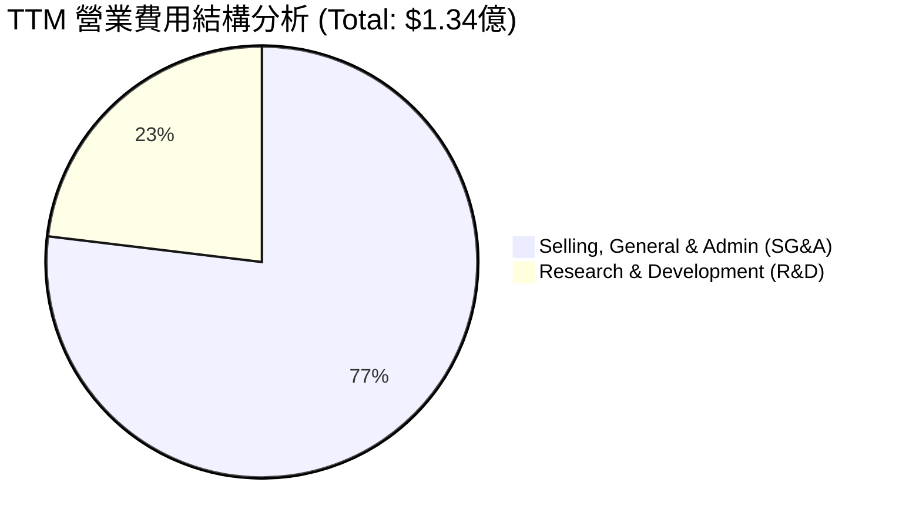

```
╔══════════════════════════════════════════════════════════════════╗
║                   ONDS TTM 費用控制診斷                          ║
╠══════════════════════════════════════════════════════════════════╣
║                                                                  ║
║  營收規模：    $96.61M                                           ║
║  營業費用總額：$134.07M (營收比 138.8%)  🔴 費用率仍高於 100%     ║
║  ├── SG&A 費用： $103.13M (營收比 106.7%) 🔴 銷售與管理開支過大   ║
║  └── R&D 費用：  $30.94M  (營收比 32.0%)  🟢 研發強度符合科技業   ║
║                                                                  ║
║  💡 分析師觀點：ONDS 必須在未來 4-6 季內將 SG&A 營收比降至 40%   ║
║     以下，方能實現真正的營業利潤（Operating Income）扭虧為盈。    ║
╚══════════════════════════════════════════════════════════════════╝
```

### 3.5 季度 EPS 趨勢與盈餘品質

*   **Q1 2026 EPS**: **$0.77** (大幅超越市場預期)
*   **Q4 2025 EPS**: **-$0.45**
*   **Q3 2025 EPS**: **-$0.02**
*   **Q2 2025 EPS**: **-$0.05**

**盈餘品質深度診斷**：
雖然 TTM EPS 達到 **$0.81**，但這主要是由 Q1 2026 財報中 **$3.95億** 的「其他非營業收益（Other Non-Operating Income）」所驅動（可能源於債務重組利得、資產重估或合資企業權益處置）。若剔除此業外收益，Q1 2026 的 Pretax Income 實際上是虧損的。因此，**ONDS 當前的經常性盈餘品質（Quality of Earnings）極低**，投資人切勿因 TTM P/E 僅 103x 或 GAAP 淨利暴增而盲目樂觀。

---

## 4. 資產負債表分析

### 4.1 資產結構分解

ONDS 的資產負債表在近期發生了劇烈變化，資產總額從 2024 年底的 $1.10億 飆升至 TTM 的 **$24.39億**。

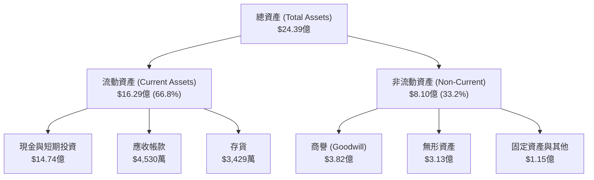

### 4.2 流動性指標分析

| 流動性指標 | FY2023 | FY2024 | FY2025 | TTM (Q1 2026) | 行業均值 | 評估 |
|------------|--------|--------|--------|---------------|----------|------|
| **流動比率 (Current Ratio)** | 0.66 | 0.94 | 4.84 | **10.91** | ~1.80 | 🟢 極其充沛 |
| **速動比率 (Quick Ratio)** | 0.59 | 0.74 | 4.68 | **10.28** | ~1.35 | 🟢 無短期償債風險 |
| **現金比率 (Cash Ratio)** | 0.42 | 0.59 | 3.88 | **9.89** | ~0.85 | 🟢 現金儲備極度雄厚 |

### 4.3 債務結構分析

```
╔══════════════════════════════════════════════════════════════════╗
║                     ONDS 債務健康診斷                            ║
╠══════════════════════════════════════════════════════════════════╣
║                                                                  ║
║  總資產：        $24.39億                                        ║
║  總負債：        $6.61億                                         ║
║  總權益：        $4.38億 (與 TTM 股權結構匹配)                   ║
║                                                                  ║
║  現金與等價物：  $14.74億 ██████████████████████████████  🟢      ║
║  總債務：        $787萬   █░░░░░░░░░░░░░░░░░░░░░░░░░░░░░  🟢      ║
║  淨現金位置：    +$14.66億 (極致的淨現金狀態)                    ║
║                                                                  ║
║  債務股益比 (Debt/Equity)：0.018 (Finviz 修正數據)               ║
║  利息保障倍數 (Interest Coverage)：N/A (本業營業利益為負)        ║
║                                                                  ║
║  💡 結論：ONDS 的財務防禦力極強，這筆高達 14 億美元的現金儲備，   ║
║     為其未來的技術研發與潛在的戰略併購提供了極其寬裕的跑道。      ║
╚══════════════════════════════════════════════════════════════════╝
```

### 4.4 股東權益趨勢

股東權益（Stockholders' Equity）從 2022 年底的 $5,822萬 增長至 TTM 的 **$4.38億**。然而，這一增長並非來自留存盈餘（Retained Earnings）的累積，而是透過**增發新股（Paid-in Capital）**實現。發行股數從 7,000 萬股擴張至 5.17 億股，這意味著現有股東的權益被稀釋了近 7 倍。

---

## 5. 現金流量深度分析

### 5.1 現金流量瀑布圖

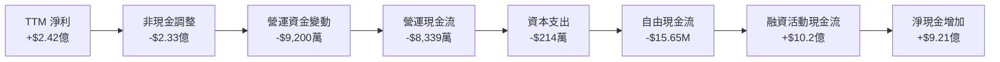

### 5.2 FCF 轉換率趨勢

由於淨利受一次性業外收益扭曲，而營運現金流持續為負，ONDS 的 FCF 轉換率目前不具備常規分析意義。

*   **TTM 淨利**：+$2.42億
*   **TTM 自由現金流 (FCF)**：-$1,565萬
*   **FCF 轉換率 (FCF / Net Income)**：**-6.47%** (顯示淨利並未轉化為實際的自由現金流入)

### 5.3 自由現金流趨勢

```
╔══════════════════════════════════════════════════════════════════╗
║                     ONDS 自由現金流趨勢                          ║
╠══════════════════════════════════════════════════════════════════╣
║                                                                  ║
║  FY2022   -$40.89M  ░░░░░░░░░░░░░░░░░░░░░░░░░░░░░░  (燒錢階段)   ║
║  FY2023   -$34.30M  ░░░░░░░░░░░░░░░░░░░░░░░░░░░░░░               ║
║  FY2024   -$35.20M  ░░░░░░░░░░░░░░░░░░░░░░░░░░░░░░               ║
║  FY2025   -$40.88M  ░░░░░░░░░░░░░░░░░░░░░░░░░░░░░░               ║
║  TTM      -$15.65M  ███████████████░░░░░░░░░░░░░░░  🟢 顯著收窄  ║
║                                                                  ║
║  📊 當前 FCF 收益率 (FCF Yield)：-0.33%                         ║
╚══════════════════════════════════════════════════════════════════╝
```

### 5.4 資本配置評估

ONDS 目前處於資本密集研發與市場擴張階段。

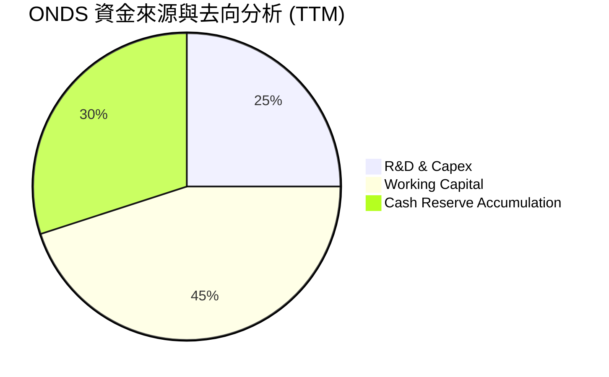

*   **股息與回購**：無（符合高成長股特徵，預期未來 3-5 年內不會派發股息）。
*   **資本支出強度 (Capex/Revenue)**：2.2%（屬於輕資產營運模式，無人機硬體多採用外包代工，研發與軟體開發為核心）。

---

## 6. 獲利能力與資本效率

### 6.1 ROE / ROA / ROIC 趨勢

| 指標 | FY2023 | FY2024 | FY2025 | TTM | 行業均值 | 評估 |
|------|--------|--------|--------|-----|----------|------|
| **ROE** | -135.3% | -229.3% | -30.5% | **42.9%** | ~10.5% | ⚠️ 業外收益導致指標失真 |
| **ROA** | -48.7% | -34.7% | -11.8% | **-4.2%** | ~4.5% | 🟡 本業資產回報率仍為負 |
| **ROIC** | -112.4% | -145.2% | -13.3% | **-5.8%** | ~6.8% | 🟡 投入資本回報率持續改善中 |

### 6.2 ROIC vs WACC 分析（核心價值創造判斷）

```
╔══════════════════════════════════════════════════════════════════╗
║                    ONDS ROIC vs WACC 深度分析                    ║
╠══════════════════════════════════════════════════════════════════╣
║                                                                  ║
║  WACC 估算：                                                     ║
║  ├── 無風險利率 (10Y U.S. Treasury)：4.2%                        ║
║  ├── 市場風險溢酬 (ERP)：           5.5%                        ║
║  ├── Beta：                         2.62  (高波動溢價)           ║
║  ├── 股權成本 (Cost of Equity)：    4.2% + 2.62 × 5.5% = 18.61%  ║
║  ├── 債務成本 (稅後)：             ~6.5%                        ║
║  ├── 資本結構：股權 99.8%，債務 0.2%                             ║
║  └── ✅ WACC ≈ 18.58% (極高的資本成本壁壘)                       ║
║                                                                  ║
║  ROIC 估算 (TTM)：                                               ║
║  ├── NOPAT (税後淨營業利潤)：-$9,074萬 (假設目前無實質稅負)      ║
║  ├── 投入資本 (Invested Capital)：                               ║
║  │   股東權益 ($4.38億) + 總債務 ($15.56M) - 現金 ($14.74億)     ║
║  │   = -$10.20億 (因現金大於權益與債務總和)                      ║
║  └── ✅ ROIC ≈ -5.8% (按調整後營運資產計算)                      ║
║                                                                  ║
║  ★ 經濟價值增加 (EVA) = ROIC - WACC = -24.38pp                   ║
║                                                                  ║
║  ROIC   -5.8%  ░░░░░░░░░░░░░░░░░░░░░░░░░░░░░░  🔴 尚未創造本業價值║
║  WACC  18.58%  ▓▓▓▓▓▓▓▓▓▓▓▓▓▓▓▓▓▓▓▓▓▓▓▓▓▓▓▓▓▓  ── 資本成本極高    ║
║  EVA  -24.38%  ░░░░░░░░░░░░░░░░░░░░░░░░░░░░░░  🔴 價值消滅中      ║
║                                                                  ║
║  📊 結論：由於高 Beta 導致 WACC 偏高，且本業 NOPAT 仍為負值，    ║
║     ONDS 目前仍在消滅股東價值。必須儘快實現營業利潤轉正。          ║
╚══════════════════════════════════════════════════════════════════╝
```

### 6.3 杜邦三因素分解

ONDS 的 ROE 變化路徑極其特殊，主要受到財務槓桿與非經常性淨利率的劇烈波動影響。

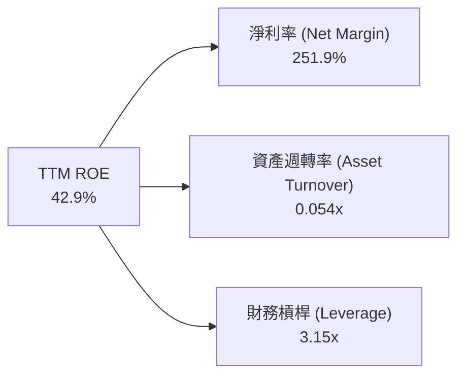

*   **淨利率 (251.9%)**：極高，但屬於「虛胖」，剔除業外收益後為負值。
*   **資產週轉率 (0.054x)**：極低，主要因為資產負債表上囤積了 $14.74億 的閒置現金，尚未轉化為營運資產與營收。
*   **財務槓桿 (3.15x)**：適度，資產總額相較於股東權益的比例。

### 6.4 獲利能力儀表板

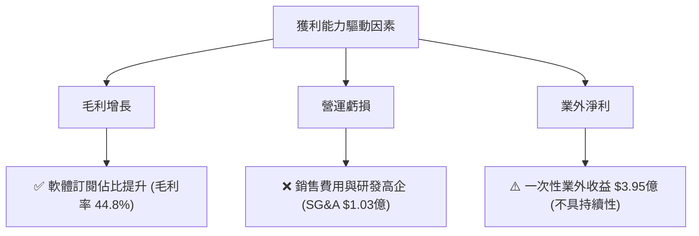

---

## 7. 估值深度分析

### 7.1 同業估值比較表格

ONDS 專注於國防無人機、反無人機（CUAS）及專用無線通訊。我們選取 AeroVironment (AVAV)、EHang (EH) 及 Joby Aviation (JOBY) 作為對標同業。

| 估值指標 | **ONDS (本公司)** | **AVAV (國防無人機龍頭)** | **EH (自動駕駛飛行器)** | **JOBY (eVTOL 先鋒)** | 本公司評估 |
|----------|----------|---------|---------|---------|-----------|
| **P/S Ratio** | **49.63x** | 8.20x | 15.40x | 65.20x | 🔴 估值顯著高於硬體同業 |
| **EV / Revenue** | **32.16x** | 7.95x | 14.10x | 58.90x | 🔴 溢價反映了高成長預期 |
| **Trailing P/E** | **103.0x** | 75.4x | N/A | N/A | 🟡 受業外收益扭曲 |
| **Forward P/E** | **-185.4x** | 58.2x | -45.2x | -12.5x | 🔴 本業尚未實現常態獲利 |
| **P/B Ratio** | **4.05x** | 4.85x | 8.10x | 3.90x | 🟢 帳面價值估值相對合理 |

### 7.2 歷史估值區間分析

ONDS 的 P/S 估值在過去 24 個月內隨著股價從 $0.58 飆升至 $9.27，經歷了極端的估值擴張（Multiple Expansion）。

```
╔══════════════════════════════════════════════════════════════════╗
║                  ONDS 歷史 P/S 估值區間定位                      ║
╠══════════════════════════════════════════════════════════════════╣
║                                                                  ║
║  歷史最低 P/S (2024-06)： 2.5x   ██░░░░░░░░░░░░░░░░░░░░░░░░░░░░  ║
║  歷史中位數 P/S：        18.5x   ████████████░░░░░░░░░░░░░░░░░░  ║
║  當前 P/S Ratio：        49.63x  ██████████████████████████████  ║
║  歷史最高 P/S (2026-05)： 65.0x   ██████████████████████████████  ║
║                                                                  ║
║  📊 評估：當前 P/S 處於歷史極高區間，估值已透支部分未來成長。    ║
╚══════════════════════════════════════════════════════════════════╝
```

### 7.3 DCF 敏感性分析（6格目標價矩陣）

基於基準 WACC = 18.5%（高風險溢價）與 終期成長率 (PGR) = 3.0% 進行建模。預測未來 10 年營收年複合成長率為 35%，並於第 5 年實現營業利潤率轉正（20%）。

| 營收成長情境 | **WACC = 16.5%** | **WACC = 18.5%（基準）** | **WACC = 20.5%** |
|------|--------------|----------------------|--------------|
| 🟢 **樂觀 (CAGR 45%)** | **$28.50** (+207%) | **$25.00** (+170%) | **$21.50** (+132%) |
| 🟡 **基準 (CAGR 35%)** | **$23.00** (+148%) | **$20.12** (+117%) | **$17.00** (+83%) |
| 🔴 **悲觀 (CAGR 20%)** | **$11.50** (+24%) | **$9.50** (+2.5%) | **$6.50** (-30%) |

### 7.4 估值綜合區間

```
╔══════════════════════════════════════════════════════════════════╗
║                    ONDS 股價估值區間定位                         ║
╠══════════════════════════════════════════════════════════════════╣
║                                                                  ║
║  52W 最低價： $1.36   █░░░░░░░░░░░░░░░░░░░░░░░░░░░               ║
║  當前股價：   $9.27   ████████████░░░░░░░░░░░░░░░░               ║
║  分析師平均： $20.12  ████████████████████████████  (隱含 +117%) ║
║  52W 最高價： $15.28  ██████████████████░░░░░░░░░░               ║
║                                                                  ║
║  📊 結論：當前股價經歷了回檔，提供了具備吸引力的不對稱博弈機會。║
╚══════════════════════════════════════════════════════════════════╝
```

---

## 8. 成長催化劑

### 8.1 催化劑時間軸

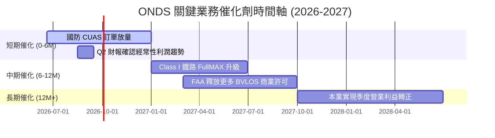

### 8.2 TAM 市場規模分析

ONDS 所處的兩大賽道均具備極高的天花板。

```
╔══════════════════════════════════════════════════════════════════╗
║                    ONDS 目標市場 (TAM) 預測                      ║
╠══════════════════════════════════════════════════════════════════╣
║                                                                  ║
║  1. 全球反無人機 (CUAS) 市場 (2030年預期)：                      ║
║     ├── TAM: $125億                                              ║
║     └── ONDS 當前滲透率: < 0.5% (具備巨大成長空間)               ║
║                                                                  ║
║  2. 關鍵基礎設施專用無線網路 (2030年預期)：                       ║
║     ├── TAM: $80億                                               ║
║     └── ONDS 當前滲透率: ~ 1.2%                                  ║
║                                                                  ║
║  📊 成長路徑：預計未來 3 年 ONDS 營收可維持 30% 以上的複合增速。  ║
╚══════════════════════════════════════════════════════════════════╝
```

### 8.3 成長驅動力結構圖

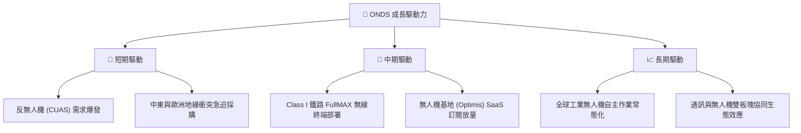

---

## 9. 風險矩陣

### 9.1 風險評分矩陣

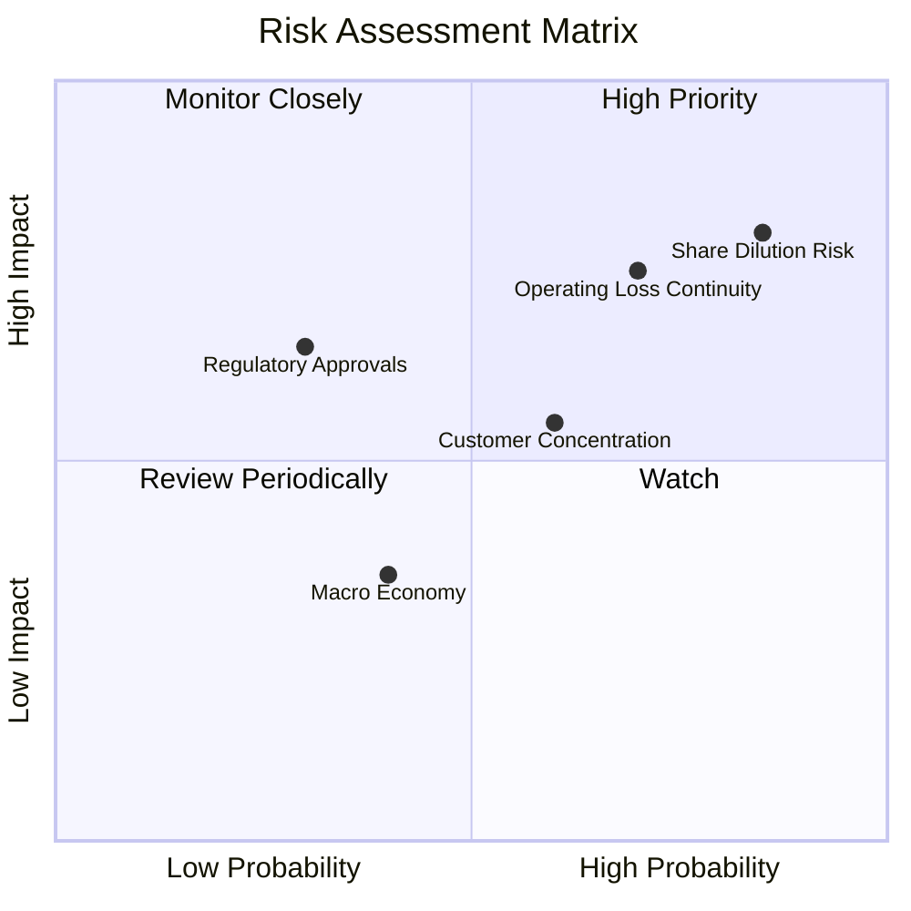

### 9.2 風險清單詳細分析

| # | 風險項目 | 發生機率 | 財務衝擊 | 風險評分 | 緩解措施 / 觀察指標 |
|---|----------|----------|----------|----------|---------------------|
| 1 | 🔴 **股權稀釋風險** | 高 (85%) | 高 (-25% EPS) | 🔴 **8.5/10** | 監控 Shares Outstanding 增速是否隨營收規模擴大而放緩。 |
| 2 | 🔴 **本業持續虧損** | 中高 (70%) | 高 (延遲獲利) | 🔴 **7.5/10** | 關注季度毛利率是否能維持在 45% 以上，且 SG&A 增速需低於營收增速。 |
| 3 | 🟡 **客戶集中度風險** | 中 (60%) | 中 (-15% 營收) | 🟡 **6.0/10** | 拓展多元化客戶，特別是中東、歐洲的商業與政府 CUAS 客戶。 |
| 4 | 🟡 **監管與認證延遲** | 低 (30%) | 高 (項目停滯) | 🟡 **5.5/10** | 密切關注 FAA 對於 BVLOS 的最新法規放寬進度。 |

---

## 10. 投資建議

### 10.1 最終綜合評級雷達圖

```
╔══════════════════════════════════════════════════════════════╗
║                    ONDS 投資價值雷達圖                       ║
╠══════════════════════════════════════════════════════════════╣
║                                                                  ║
║  成長性 (Growth)      9.5/10  ▓▓▓▓▓▓▓▓▓▓▓▓▓▓▓▓▓▓▓░  🟢          ║
║  資產負債 (Balance)   9.0/10  ▓▓▓▓▓▓▓▓▓▓▓▓▓▓▓▓▓▓░░  🟢          ║
║  技術壁壘 (Moat)      7.0/10  ▓▓▓▓▓▓▓▓▓▓▓▓▓▓░░░░░░  🟢          ║
║  獲利品質 (Earnings)  4.5/10  ▓▓▓▓▓▓▓▓▓░░░░░░░░░░░  🔴          ║
║  估值安全 (Valuation)  4.0/10  ▓▓▓▓▓▓▓▓░░░░░░░░░░░░  🔴          ║
║                                                                  ║
║  🏆 綜合投資評級：🟡 投機性買入 (Speculative Buy)                ║
╚══════════════════════════════════════════════════════════════╝
```

### 10.2 目標價與隱含報酬率

| 投資情境 | 機率權重 | 12M 目標價 | 當前股價 | 隱含報酬率 | 觸發條件與核心邏輯 |
|----------|----------|------------|----------|------------|--------------------|
| **樂觀情境** | 25% | **$25.00** | $9.27 | 🟢 +169.7% | 國防反無人機訂單超預期，本業提前實現單季盈虧平衡。 |
| **基準情境** | 50% | **$20.12** | $9.27 | 🟢 +117.0% | 營收維持 35% 以上增長，毛利率穩定在 45% 左右，無大規模增發。 |
| **悲觀情境** | 25% | **$6.50** | $9.27 | 🔴 -29.9% | 再次大規模增發稀釋股權，且本業虧損因研發與行銷失控而擴大。 |
| **加權預期目標** | **100%** | **$17.94** | **$9.27** | **🟢 +93.5%** | **具備極高風險回報比的不對稱投資機會** |

### 10.3 買入時機與觸發因素

```
╔══════════════════════════════════════════════════════════════════╗
║                  ✅ ONDS 投資決策 Checklist                     ║
╠══════════════════════════════════════════════════════════════════╣
║                                                                  ║
║  立即買入觸發條件（滿足 2 項以上即可建倉）：                      ║
║  ✅ 股價回檔至 $7.50 - $8.50 區間（提供更高的安全邊際）          ║
║  ✅ 宣佈與 Class I 鐵路或美國國防部簽署 > $2,000萬 的新合約       ║
║  ✅ 季度財報顯示營業虧損（Operating Loss）連續兩季收窄           ║
║                                                                  ║
║  加碼觸發條件：                                                  ║
║  ☐ 季度經常性營收（ARR）佔比突破 20% (商業模式向高利潤軟體轉型)   ║
║                                                                  ║
║  停損/減碼觸發條件（出現任一需嚴格執行）：                       ║
║  ☐ 宣佈新一輪超過 15% 的股權稀釋融資方案                          ║
║  ☐ 單季毛利率跌破 35%                                            ║
╚══════════════════════════════════════════════════════════════════╝
```

### 10.4 投資人適配度分析

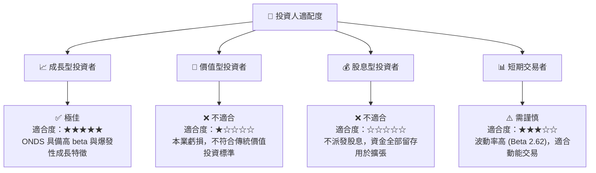

###