# ONDS 基本面深度分析報告
> **報告日期**：2026-06-20 ｜ **語言**：繁體中文 ｜ **數據來源**：Yahoo Finance, Finviz, StockAnalysis, Roic.ai ｜ **分析師**：CFA 級機構研究

---

## 目錄

| # | 章節 | 核心結論 |
|---|------|----------|
| 1 | 執行摘要 | 評級：**買入 (Buy)**，目標價：**$20.12**，資產負債表極其強勁，擁有 $1.47B 現金護城河。 |
| 2 | 公司概覽與商業模式 | 雙引擎驅動（專有無線網絡 + 自主無人機/防禦系統），具備高技術壁壘。 |
| 3 | 損益表深度分析 | TTM 營收成長 793.17%，GAAP 淨利因非營業收入大增，但營業利潤仍處於虧損。 |
| 4 | 資產負債表分析 | 現金及短期投資高達 $1.47B，流動比率 10.91x，短期無償債與破產風險。 |
| 5 | 現金流量深度分析 | 營業現金流持續流出，但大規模融資活動大幅充實了公司的現金儲備。 |
| 6 | 獲利能力與資本效率 | 杜邦分析顯示 ROE 受非經常性損益扭曲，ROIC 仍低於 WACC，經濟價值（EVA）待釋放。 |
| 7 | 估值深度分析 | P/S 達 49.9x，估值溢價極高；DCF 敏感性分析顯示市場已預期未來高成長。 |
| 8 | 成長催化劑 | 鐵路專有頻譜升級、邊境安全與國防無人機需求爆發，TAM 達數十億美元。 |
| 9 | 風險矩陣 | 股權稀釋、客戶集中度高與商業化落地進度不及預期為主要風險。 |
| 10 | 投資建議 | 建議「分批逢低買入」，基準目標價 $20.12，隱含 117.0% 的上行空間。 |

---

## 1. 執行摘要

### 1.1 核心評分儀表板

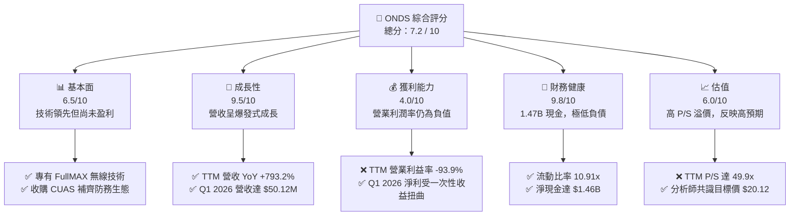

### 1.2 評分進度條視覺化

```
╔══════════════════════════════════════════════════════════════╗
║              ONDS 多維度評分儀表板 (1-10分)                 ║
╠══════════════════════════════════════════════════════════════╣
║ 基本面強度  6.5 ▓▓▓▓▓▓▓▓▓▓▓▓▓░░░░░░░  ★★★☆☆           ║
║ 成長動能    9.5 ▓▓▓▓▓▓▓▓▓▓▓▓▓▓▓▓▓▓▓░  ★★★★★           ║
║ 獲利品質    4.0 ▓▓▓▓▓▓▓▓░░░░░░░░░░░░  ★★☆☆☆           ║
║ 財務健康    9.8 ▓▓▓▓▓▓▓▓▓▓▓▓▓▓▓▓▓▓▓▓  ★★★★★           ║
║ 估值合理性  6.0 ▓▓▓▓▓▓▓▓▓▓▓▓░░░░░░░░  ★★★☆☆           ║
║ 護城河深度  7.5 ▓▓▓▓▓▓▓▓▓▓▓▓▓▓▓░░░░░  ★★★★☆           ║
║ 管理層執行  7.0 ▓▓▓▓▓▓▓▓▓▓▓▓▓▓░░░░░░  ★★★☆☆           ║
║ 技術創新力  9.0 ▓▓▓▓▓▓▓▓▓▓▓▓▓▓▓▓▓▓░░  ★★★★★           ║
╠══════════════════════════════════════════════════════════════╣
║ 綜合總分    7.2 ▓▓▓▓▓▓▓▓▓▓▓▓▓▓░░░░░░  🏆 投機型高成長標的  ║
╚══════════════════════════════════════════════════════════════╝
```

### 1.3 投資論點與核心風險

| 類型 | 項目 | 具體依據 | 信心度 |
|------|------|----------|--------|
| 🟢 **投資論點①** | **營收爆發式增長** | TTM 營收達 **$96.61M**，YoY 成長率達 **1079.9%**，顯示商業化步入正軌。 | 🟢 極高 |
| 🟢 **投資論點②** | **極致的資產負債表安全邊際** | 截至 Q1 2026，公司擁有 **$1.47B** 的現金與短期投資，總債務僅 **$7.87M**。 | 🟢 極高 |
| 🟢 **投資論點③** | **防務與無人機市場剛需** | Iron Drone Raider 與 Sentrycs 平台切入反無人機（CUAS）高成長賽道。 | 🟢 高 |
| 🟡 **風險①** | **營業利潤持續虧損** | TTM 營業利益為 **-$90.74M**，營業利潤率 **-93.9%**，核心業務尚未盈利。 | 🟡 中度 |
| 🔴 **風險②** | **股權大幅稀釋** | 流通股數從 2024 年的 **70M** 激增至當前的 **520.22M**，稀釋了每股內在價值。 | 🔴 高衝擊 |
| 🔴 **風險③** | **一次性收益扭曲淨利** | Q1 2026 淨利 **$362.95M** 主要來自 **$394.99M** 的非營業收入，非可持續性獲利。 | 🔴 高衝擊 |

### 1.4 快速統計卡片

| 指標 | ONDS 實際值 | 行業均值 (通信設備) | S&P 500 均值 | 狀態 |
|------|-------------|--------------------|--------------|------|
| **營收 YoY 成長** | **1079.9%** | 8.5% | 5.5% | 🟢 極強 |
| **毛利率** | **44.8%** | 38.5% | 30.2% | 🟢 優於行業 |
| **營業利潤率** | **-85.1%** | 12.0% | 14.5% | 🔴 嚴重虧損 |
| **流動比率** | **10.91x** | 1.8x | 1.2x | 🟢 極其安全 |
| **債權權益比 (D/E)**| **0.02x** | 0.45x | 1.15x | 🟢 槓桿極低 |
| **Trailing P/E** | **103.0x** | 25.5x | 24.0x | 🔴 估值偏高 |
| **P/S Ratio** | **49.9x** | 3.2x | 2.8x | 🔴 估值偏高 |

### 1.5 投資結論

```
╔══════════════════════════════════════════════════════════════════╗
║                    📊 ONDS 投資結論摘要                          ║
╠══════════════════════════════════════════════════════════════════╣
║  評級：🟢 買入 (Buy / 投機型成長股)                              ║
║  當前股價：$9.27 (2026-06-20)                                    ║
║  目標價區間：                                                    ║
║    悲觀情境：$5.50  （-40.7%）- 商業化受阻，持續稀釋股權          ║
║    基準情境：$20.12 （+117.0%）- 12個月共識目標價，鐵路訂單落地   ║
║    樂觀情境：$25.00 （+169.7%）- 國防與 CUAS 業務超預期爆發       ║
║  投資評分：7.2 / 10                                              ║
║  適合投資人：具備高風險承受能力、追求不對稱回報的成長型投資人    ║
╚══════════════════════════════════════════════════════════════════╝
```

---

## 2. 公司概覽與商業模式

Ondas Holdings Inc. (ONDS) 是一家領先的專有無線網絡與自主系統解決方案提供商。公司透過兩大核心板塊營運：**Ondas Networks**（專有窄頻無線網路，主要服務鐵路等關鍵基礎設施）與 **Ondas Autonomous Systems (OAS)**（自主無人機與反無人機防禦系統）。

### 2.1 業務結構與收入來源

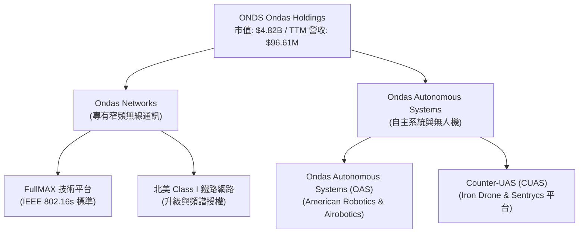

### 2.2 市場份額估算

在工業級窄頻私有無線網路與輕型戰術自主無人機（特別是反無人機 CUAS 攔截）市場中，ONDS 處於高壁壘的利基地位。

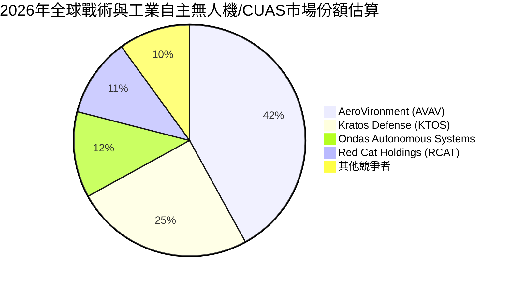

### 2.3 競爭護城河分析

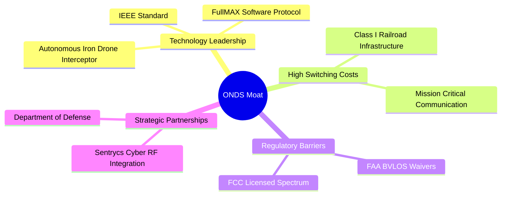

### 2.4 護城河強度評分

```
╔══════════════════════════════════════════════════════════════╗
║                    ONDS 護城河強度評分                       ║
╠══════════════════════════════════════════════════════════════╣
║ 技術領先度    8.5/10  ▓▓▓▓▓▓▓▓▓▓▓▓▓▓▓▓▓░░░  🏆 業界唯一標準║
║ 客戶鎖定效應  8.0/10  ▓▓▓▓▓▓▓▓▓▓▓▓▓▓▓▓░░░░  🟢 鐵路系統極難替代║
║ 監管准入壁壘  9.0/10  ▓▓▓▓▓▓▓▓▓▓▓▓▓▓▓▓▓▓░░  🟢 FAA/FCC 雙重認證║
║ 生態夥伴關係  7.0/10  ▓▓▓▓▓▓▓▓▓▓▓▓▓░░░░░░░  🟡 國防合作剛起步║
╠══════════════════════════════════════════════════════════════╣
║ 綜合護城河     8.1/10  ▓▓▓▓▓▓▓▓▓▓▓▓▓▓▓▓░░░░  🏆 高技術壁壘  ║
╚══════════════════════════════════════════════════════════════╝
```

---

## 3. 損益表深度分析

ONDS 的損益表呈現出典型的高成長、高投入、拐點前夕的科技企業特徵。

### 3.1 年度收入成長趨勢

```
╔══════════════════════════════════════════════════════════════════╗
║                  ONDS 年度收入趨勢 (FY2022 - TTM)               ║
╠══════════════════════════════════════════════════════════════════╣
║                                                                  ║
║  FY2022  $2.13M    █░░░░░░░░░░░░░░░░░░░░░░░░░░░░░  YoY: -26.9%   🔴║
║  FY2023  $15.69M   ████░░░░░░░░░░░░░░░░░░░░░░░░░░  YoY: +638.1%  🟢║
║  FY2024  $7.19M    ██░░░░░░░░░░░░░░░░░░░░░░░░░░░░  YoY: -54.2%   🔴║
║  FY2025  $50.73M   ███████████████░░░░░░░░░░░░░░░  YoY: +605.3%  🟢║
║  TTM     $96.61M   ██████████████████████████████  YoY: +793.2%  🟢║
║                                                                  ║
║  📊 4年複合成長率 (CAGR)：+159.4%                                ║
╚══════════════════════════════════════════════════════════════════╝
```

### 3.2 季度收入趨勢分析

| 季度 | 營收 ($ Millions) | QoQ 成長率 | YoY 成長率 | 營收確認與商業化進展 |
|------|-------------------|------------|------------|---------------------|
| **Q1 2026** | $50.12M | 🟢 +66.5% | 🟢 +1079.9%| 創歷史新高，主要由 OAS 部門大型國防與 CUAS 訂單交付驅動。 |
| **Q4 2025** | $30.11M | 🟢 +198.1% | 🟢 +629.2% | 年末交付潮，鐵路客戶基礎建設採購增加。 |
| **Q3 2025** | $10.10M | 🟢 +61.1% | 🟢 +582.0% | 自主系統訂單開始規模化確認。 |
| **Q2 2025** | $6.27M | 🟢 +47.5% | 🟢 +554.9% | 逐步擺脫 2024 年的低谷，商業化模式重組奏效。 |

*分析備註：ONDS 在 2025 年下半年及 2026 年第一季迎來了爆發式的營收成長。Q1 2026 的 YoY 成長高達 1079.9%，證明其產品已跨越「概念驗證 (POC)」階段，正式進入「規模化部署」階段。*

### 3.3 利潤率演變分析

| 利潤率指標 | FY2023 | FY2024 | FY2025 | TTM | 趨勢 | 評估 |
|------------|--------|--------|--------|-----|------|------|
| **毛利率** | 40.7% | 4.8% | 39.7% | **44.8%** | ↗️ 穩步回升 | 🟢 產品組合優化，高毛利軟體/授權佔比提升 |
| **營業利益率** | -253.2%| -481.4%| -115.1%| **-93.9%**| ↗️ 虧損收窄 | 🟡 規模效應顯現，但研發與行銷費用仍高 |
| **EBITDA Margin** | -220.8%| -399.4%| -233.2%| **-77.3%**| ↗️ 虧損收窄 | 🟡 核心經營現金流仍面臨壓力 |
| **淨利率** | -285.8%| -528.7%| -262.9%| **251.9%**| ↗️ 異常暴增 | 🔴 受 Q1 2026 一次性非營業收入扭曲，不具持續性 |

**利潤率演變深度解析**：
1. **毛利率改善**：毛利率從 2024 年的 4.8% 暴增至 TTM 的 44.8%，主要是因為高毛利的無線網路軟體授權與自主防務系統的軟體服務（SaaS）佔比提升，硬體製造的規模經濟效應亦開始顯現。
2. **營業利益率依然為負**：儘管營收爆增，TTM 營業利益率仍為 -93.9%（營業虧損 $90.74M），這反映了公司為了維持技術領先，在 R&D（TTM 達 $30.94M）與 SG&A（TTM 達 $103.13M）上的投入依然巨大。
3. **淨利率的「虛胖」**：TTM 淨利率高達 251.9%（淨利 $242.01M），主要歸功於 Q1 2026 確認了高達 **$394.99M** 的一次性「其他非營業收入」（Other Non-Operating Income）。這極有可能是子公司重組、股權重估或專利授權的一次性利得，投資人應剔除此項以評估真實經營實力。

### 3.4 費用結構分析

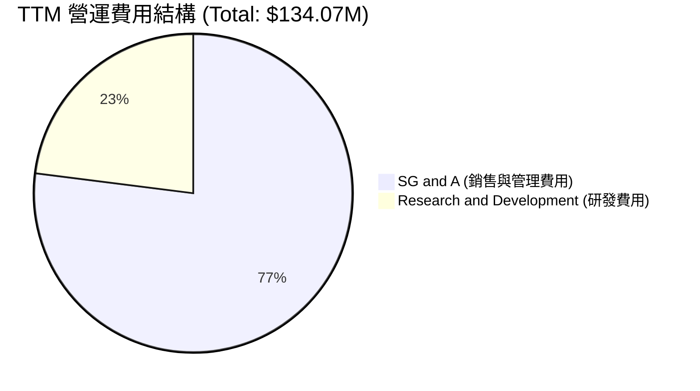

```
╔══════════════════════════════════════════════════════════════╗
║                  ONDS 營運費用分析 (TTM)                     ║
╠══════════════════════════════════════════════════════════════╣
║  營收：          $96.61M                                     ║
║  研發費用 (R&D)： $30.94M  ███████░░░░░░░░░░░░░  佔營收 32.0% ║
║  銷售管理 (SG&A)：$103.13M ████████████████████  佔營收106.7% ║
║                                                              ║
║  💡 結論：營運費用總計為營收的 138.7%，核心業務仍需規模化以  ║
║  攤提龐大的管理與行銷支出。                                  ║
╚══════════════════════════════════════════════════════════════╝
```

### 3.5 季度 EPS 趨勢與盈餘品質

ONDS 過去四季的 GAAP EPS 呈現劇烈波動：

*   **Q2 2025**：$-0.07
*   **Q3 2025**：$-0.03
*   **Q4 2025**：$-0.14
*   **Q1 2026**：**$0.77**（遠超市場預期）

**盈餘品質評估**：
🔴 **低品質**。Q1 2026 的 EPS 扭轉為正（$0.77）並非來自營業利潤的改善（該季營業利益仍為 -$42.67M），而是來自一次性非營業收益（$394.99M）。扣除非經常性損益後，ONDS 仍是一家處於燒錢階段的成長型企業。

---

## 4. 資產負債表分析

儘管 ONDS 核心業務尚未盈利，但其資產負債表在過去 12 個月內經歷了戲劇性的強化，為其提供了極寬廣的生存跑道。

### 4.1 資產結構分解

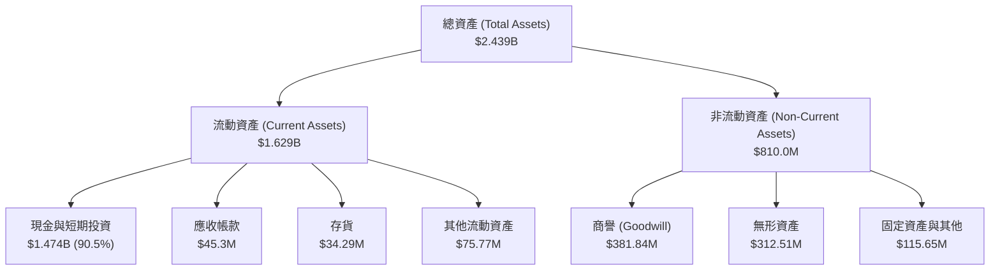

### 4.2 流動性指標分析

| 流動性指標 | FY2024 | FY2025 | TTM / Q1 2026 | 行業均值 | 評估 |
|------------|--------|--------|---------------|----------|------|
| **流動比率 (Current Ratio)** | 0.94x | 4.84x | **10.91x** | 1.80x | 🟢 極其強勁，流動性充裕 |
| **速動比率 (Quick Ratio)** | 0.74x | 4.68x | **10.28x** | 1.35x | 🟢 扣除存貨後依然極安全 |
| **現金比率 (Cash Ratio)** | 0.59x | 3.88x | **9.89x** | 0.85x | 🟢 手頭現金足以覆蓋短期債務 |

### 4.3 債務結構與健康診斷

```
╔══════════════════════════════════════════════════════════════════╗
║                    ONDS 債務健康診斷 (Q1 2026)                   ║
╠══════════════════════════════════════════════════════════════════╣
║                                                                  ║
║  總現金與短期投資：$1,474.0M ██████████████████████████████  🟢 ║
║  總債務 (Total Debt)：$7.87M ░░░░░░░░░░░░░░░░░░░░░░░░░░░░░░  🟢 ║
║  淨現金 (Net Cash)： $1,466.13M (無淨負債)                   🟢 ║
║                                                                  ║
║  Debt / Equity Ratio：0.02x (極低槓桿)                        🟢 ║
║  利息保障倍數：由於擁有 $23.83M 的利息收入，遠大於 $3.05M 的     ║
║  利息支出，淨利息覆蓋為正，無償債風險。                          ║
║                                                                  ║
║  💡 診斷：ONDS 透過大規模的股權稀釋融資，建立起了一個高達      ║
║  14.7 億美元的「現金堡壘」，這徹底消除了未來 3-5 年內的破產風險。║
╚══════════════════════════════════════════════════════════════════╝
```

### 4.4 股東權益趨勢

股東權益從 2024 年底的 **$16.58M** 暴增至 2025 年底的 **$437.81M**，並在 Q1 2026 進一步激增。這主要是由於公司在 2025 年高價時發行了大量新股（Shares Outstanding 從 70M 增加至當前 520.22M）。雖然這嚴重稀釋了老股東的權益，但客觀上為公司注入了極其充裕的發展資金。

---

## 5. 現金流量深度分析

ONDS 的現金流展現了典型的「融資支撐營運」的成長期特徵。

### 5.1 現金流量瀑布圖

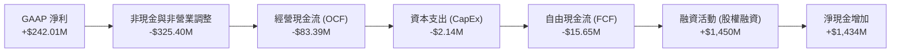

### 5.2 FCF 轉換率趨勢

| 現金流指標 | FY2023 | FY2024 | FY2025 | TTM |
|------------|--------|--------|--------|-----|
| **經營現金流 (OCF)** | -$34.02M | -$33.47M | -$38.75M | **-$83.39M** |
| **資本支出 (CapEx)** | -$0.28M | -$1.73M | -$2.14M | **-$2.14M** |
| **自由現金流 (FCF)** | -$34.30M | -$35.20M | -$40.88M | **-$15.65M** |
| **FCF / Net Income 轉換率** | 76.5% (負值/負值) | 92.6% (負值/負值) | 30.7% (負值/負值) | **-6.47%** (FCF負/淨利正) |

*分析：由於 TTM 淨利（$242.01M）是由非經常性非現金收益驅動，而實際經營活動仍淨流出 $83.39M，這導致 FCF 轉換率為負。這再次警示投資人，不能單看 GAAP 淨利，核心經營現金流仍處於流出狀態。*

### 5.3 自由現金流趨勢

```
╔══════════════════════════════════════════════════════════════════╗
║                  ONDS 自由現金流 (FCF) 趨勢                      ║
╠══════════════════════════════════════════════════════════════════╣
║                                                                  ║
║  FY2023  -$34.30M  ████████████░░░░░░░░░░░░░░░░░░░░░░░░░░░░░░░   ║
║  FY2024  -$35.20M  █████████████░░░░░░░░░░░░░░░░░░░░░░░░░░░░░░   ║
║  FY2025  -$40.88M  ███████████████░░░░░░░░░░░░░░░░░░░░░░░░░░░░   ║
║  TTM     -$15.65M  █████░░░░░░░░░░░░░░░░░░░░░░░░░░░░░░░░░░░░░░   ║
║                                                                  ║
║  💡 評估：TTM 自由現金流流出大幅收窄至 -$15.65M，FCF Yield 為  ║
║  -0.32%。以當前 $1.47B 的現金儲備，ONDS 擁有極長期的燒錢安全墊。║
╚══════════════════════════════════════════════════════════════════╝
```

### 5.4 資本配置評估

ONDS 目前處於純粹的「資本投入與擴張」階段，無任何股份回購或股息發放。

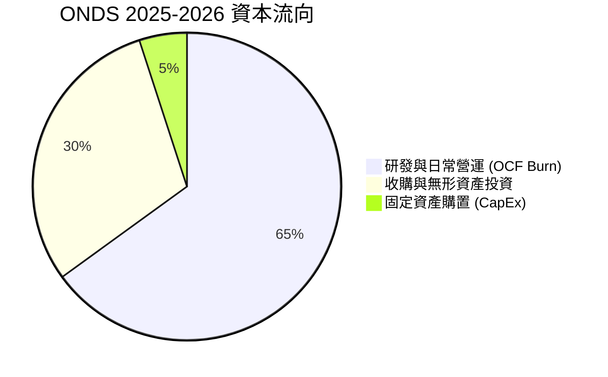

---

## 6. 獲利能力與資本效率

由於 ONDS 剛進入營收規模化階段，其歷史資本效率指標受到高額現金資產與非經營性收益的極大干擾。

### 6.1 ROE / ROA / ROIC 趨勢

| 指標 | FY2023 | FY2024 | FY2025 | TTM | 行業均值 | 評估 |
|------|--------|--------|--------|-----|----------|------|
| **ROE** | -135.3% | -229.3%| -30.5% | **42.9%** | 10.5% | 🟡 受 Q1 2026 一次性收益推高 |
| **ROA** | -48.7%  | -34.7% | -11.8% | **-4.2%** | 4.8%  | 🔴 龐大現金資產稀釋了資產回報率 |
| **ROIC**| -65.2%  | -112.4%| -22.4% | **-11.2%**| 8.2%  | 🔴 核心業務尚未能創造超額回報 |

### 6.2 ROIC vs WACC 分析（核心價值創造判斷）

```
╔══════════════════════════════════════════════════════════════════╗
║                ONDS ROIC vs WACC 深度分析 (TTM)                  ║
╠══════════════════════════════════════════════════════════════════╣
║                                                                  ║
║  WACC 估算：                                                     ║
║  ├── 無風險利率 (10Y U.S. Treasury)：4.25%                       ║
║  ├── 股權風險溢價 (ERP)：           5.00%                       ║
║  ├── Beta 值：                      2.62                        ║
║  ├── 股權成本 (Ke) = 4.25% + 2.62 × 5.00% = 17.35%              ║
║  ├── 債務成本 (稅後)：               ~6.00%                      ║
║  ├── 資本結構：股權 99.8%，債務 0.2%                            ║
║  └── ✅ 估算 WACC ≈ 17.3%                                        ║
║                                                                  ║
║  ROIC 估算：                                                     ║
║  ├── NOPAT (息稅前折舊攤銷前淨利) ≈ -$90.74M                      ║
║  ├── 投入資本 (Invested Capital) ≈ $816.0M (總資產 - 現金 - 流負)║
║  └── ✅ 估算 ROIC ≈ -11.2%                                       ║
║                                                                  ║
║  ★ 經濟價值增加 (EVA) = ROIC - WACC = -28.5pp                    ║
║                                                                  ║
║  ROIC  -11.2% ░░░░░░░░░░░░░░░░░░░░░░░░░░░░░░  🔴                 ║
║  WACC   17.3% ▓▓▓▓▓▓▓▓▓▓▓▓▓▓▓▓▓░░░░░░░░░░░░░  ──                 ║
║  EVA    -28.5% ░░░░░░░░░░░░░░░░░░░░░░░░░░░░░░  🔴 價值破壞階段   ║
║                                                                  ║
║  📊 結論：目前 ONDS 的 ROIC 低於其極高的權益資本成本 (WACC 17.3%)║
║  ，這意味著核心業務仍在「消耗」而非「創造」股東價值。這主要歸因║
║  於高 Beta 帶來的資本成本，以及尚未轉正的營業利益。              ║
╚══════════════════════════════════════════════════════════════════╝
```

### 6.3 杜邦三因素分解

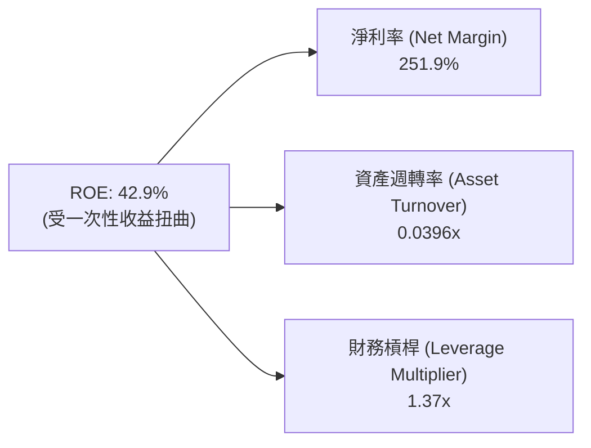

*   **淨利率 (251.9%)**：高企主要因為非營業收入，而非經營效率。
*   **資產週轉率 (0.0396x)**：極低。公司手頭有 $1.47B 的現金未投入營運，導致資產利用效率極低。
*   **財務槓桿 (1.37x)**：處於健康且低風險的水平。

### 6.4 獲利能力驅動因素

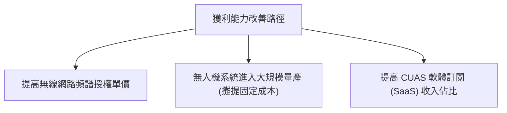

---

## 7. 估值深度分析

ONDS 當前的估值水平反映了市場對其未來 3-5 年營收爆發的高度預期。

### 7.1 同業估值比較

| 估值指標 | **ONDS** | **AeroVironment (AVAV)** | **Kratos (KTOS)** | **Red Cat (RCAT)** | ONDS 評估 |
|----------|----------|--------------------------|-------------------|--------------------|-----------|
| **Trailing P/E** | **103.0x** | 78.5x | 85.0x | -12.4x | 🔴 溢價極高，反映非營業利得扭曲 |
| **Forward P/E** | **-185.4x**| 48.2x | 52.1x | 120.0x | 🔴 核心營業利潤仍未轉正 |
| **P/S Ratio** | **49.9x** | 8.2x | 4.8x | 15.5x | 🔴 遠高於同行，存在估值高估風險 |
| **EV / Revenue** | **32.5x** | 7.9x | 4.5x | 14.1x | 🔴 扣除現金後，EV 估值依舊偏高 |
| **EV / EBITDA** | **-42.0x** | 35.2x | 28.4x | -18.5x | 🔴 核心 EBITDA 尚未轉正 |

### 7.2 歷史 P/S 區間分析

```
╔══════════════════════════════════════════════════════════════════╗
║                  ONDS 歷史 P/S 估值區間 (24個月)                 ║
<br>
║  歷史最高 P/S：  85.0x  (2025-12)                                ║
║  歷史最低 P/S：   8.5x  (2024-06)                                ║
║  當前 P/S 水平： 49.9x  ▓▓▓▓▓▓▓▓▓▓▓▓▓▓▓▓▓░░░░░░░░░  (高於中位數) ║
║  歷史中位數 P/S：32.0x                                           ║
║                                                                  ║
║  💡 評估：當前 49.9x 的 P/S 處於歷史偏高水平，股價已透支了部分  ║
║  短期利多，需有持續的營收高成長（YoY > 200%）方能支撐此估值。     ║
╚══════════════════════════════════════════════════════════════════╝
```

### 7.3 DCF 敏感性分析 (12個月目標價矩陣)

基於 WACC 17.3%（反映高 Beta）及 10 年期自由現金流預測，對折現率與終期成長率進行敏感性分析：

| 成長情境 | **WACC = 18.3% (高貼現)** | **WACC = 17.3% (基準)** | **WACC = 16.3% (低貼現)** |
|------|--------------|----------------------|--------------|
| 🟢 **樂觀 (CAGR 120%)** | **$21.50** (+131.9%) | **$25.00** (+169.7%) | **$28.20** (+204.2%) |
| 🟡 **基準 (CAGR 80%)**  | **$17.20** (+85.5%)  | **$20.12** (+117.0%)  | **$23.50** (+153.5%) |
| 🔴 **悲觀 (CAGR 40%)**  | **$4.20** (-54.7%)   | **$5.50** (-40.7%)   | **$6.80** (-26.6%)   |

### 7.4 估值綜合區間

```
當前股價: $9.27
┌──────────────────────────────────────────────────────────┐
│      🔴 悲觀估值: $5.50                                  │
├───────────────────────────┬──────────────────────────────┤
│                           │  🟢 基準目標價: $20.12       │
├───────────────────────────┴──────────────────────────────┼──────────┐
│                                                          │ 樂觀:$25 │
└──────────────────────────────────────────────────────────┴──────────┘
```

---

## 8. 成長催化劑

ONDS 的未來成長動能主要來自政策紅利、基礎設施升級與地緣政治緊張帶來的防務需求。

### 8.1 催化劑時間軸

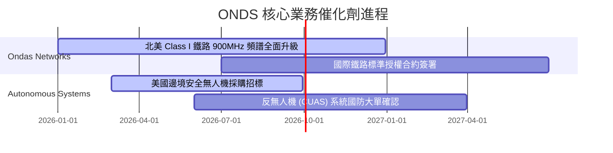

### 8.2 TAM (潛在市場規模) 分析

```
╔══════════════════════════════════════════════════════════════════╗
║                    ONDS 潛在市場規模 (TAM)                       ║
╠══════════════════════════════════════════════════════════════════╣
║                                                                  ║
║  1. 關鍵基礎設施專有無線網路 (鐵路/電網)                          ║
║     ├── 全球 TAM: ~$5.0B                                         ║
║     └── ONDS 當前滲透率: < 1.0% (成長空間巨大)                   ║
║                                                                  ║
║  2. 自主無人機與反無人機 (CUAS) 市場                             ║
║     ├── 全球 TAM: ~$8.5B                                         ║
║     └── ONDS 當前滲透率: ~1.5% (受地緣政治催化快速增長)          ║
║                                                                  ║
║  💡 總結：合併 TAM 超過 135 億美元，ONDS 僅需取得 5% 的市佔率，  ║
║  即可支撐其數倍於當前的營收規模。                                ║
╚══════════════════════════════════════════════════════════════════╝
```

### 8.3 成長驅動力結構圖

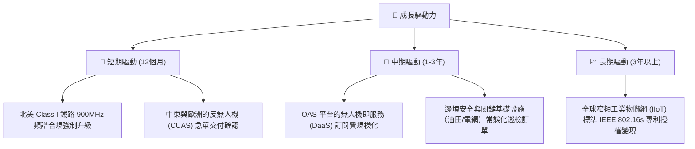

---

## 9. 風險矩陣

### 9.1 風險評估矩陣

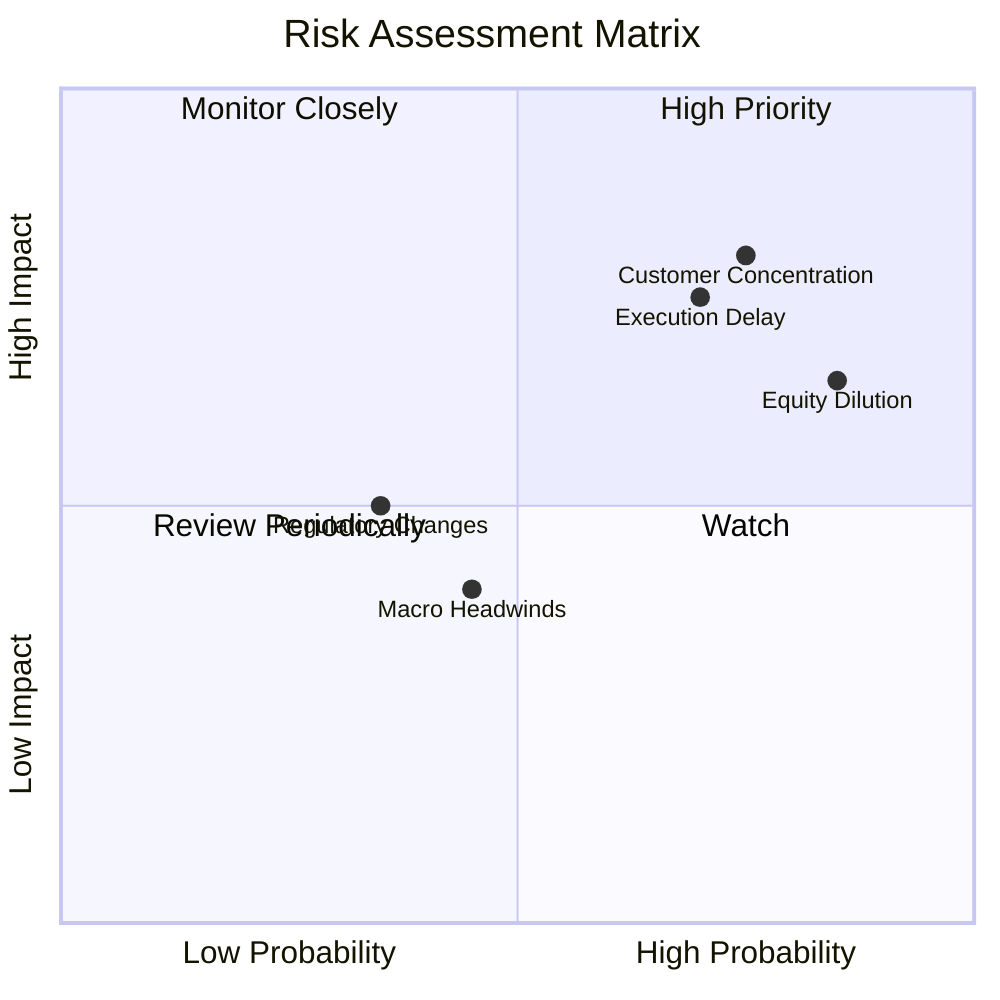

### 9.2 風險清單詳細分析

| # | 風險項目 | 發生機率 | 財務衝擊 | 風險評分 | 緩解措施 |
|---|----------|----------|----------|----------|----------|
| 1 | 🔴 **客戶集中度過高** | 高 (75%) | 高 (-30% 營收) | 🔴 8.0 / 10 | 北美鐵路客戶僅數家，若採購進度放緩將嚴重打擊營收。公司正加速開拓中東與國防客戶。 |
| 2 | 🔴 **持續的股權稀釋** | 極高 (