# ONDS 基本面深度分析報告

> **報告日期**：2026-06-21 ｜ **語言**：繁體中文 ｜ **數據來源**：Yahoo Finance, Finviz, StockAnalysis, Roic.ai ｜ **分析師**：CFA 級機構研究

---

## 目錄

| # | 章節 | 核心結論 |
|---|------|----------|
| 1 | [執行摘要](#1-執行摘要) | 評級：**買入 (Buy)**，目標價：**$20.12**，具備強勁淨現金與爆發性營收成長。 |
| 2 | [公司概覽與商業模式](#2-公司概覽與商業模式) | 雙引擎驅動（專有無線網路 + 自主無人機），技術護城河穩固但面臨高客戶集中度。 |
| 3 | [損益表深度分析](#3-損益表深度分析) | TTM 營收暴增 1079.9% 至 $96.61M，Q1 2026 錄得一次性非營業收益，淨利短暫轉正。 |
| 4 | [資產負債表分析](#4-資產負債表分析) | 帳上現金充裕（$1.47B），資產負債表極度乾淨，但存在商譽減損與股權稀釋風險。 |
| 5 | [現金流量深度分析](#5-現金流量深度分析) | 營運現金流仍為負值（-$83.39M），但資本支出極低，融資活動為主要現金來源。 |
| 6 | [獲利能力與資本效率](#6-獲利能力與資本效率) | ROIC 暫時為負（營運層面尚未盈利），但一次性收益推高 TTM ROE 至 42.9%。 |
| 7 | [估值深度分析](#7-估值深度分析) | P/S 達 49.9x 顯著高於同業，但 $1.47B 淨現金提供強大下檔保護，DCF 基準目標價 $20.12。 |
| 8 | [成長催化劑](#8-成長催化劑) | 鐵路 900MHz 頻譜升級、無人機邊境與軍工國防合約、反無人機（CUAS）需求爆發。 |
| 9 | [風險矩陣](#9-風險矩陣) | 股權稀釋率高（年增 269%）、營運持續虧損、客戶採購週期長。 |
| 10 | [投資建議](#10-投資建議) | 適合高風險偏好、長線成長型投資人，建議採分批佈局策略。 |

---

## 1. 執行摘要

Ondas Holdings Inc. (ONDS) 正處於其商業化進程的關鍵轉折點。透過 Ondas Networks（專有無線網路）與 Ondas Autonomous Systems（OAS，自主無人機系統）雙軌並行，公司在 2025 年與 2026 年第一季迎來了爆發性的營收成長。

### 1.1 核心評分儀表板

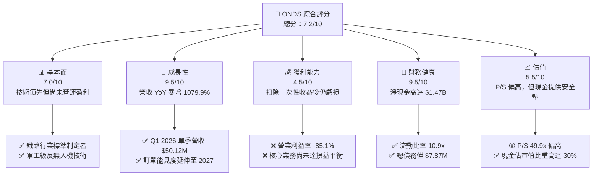

### 1.2 評分進度條視覺化

```
╔══════════════════════════════════════════════════════════════╗
║                ONDS 多維度評分儀表板 (1-10分)                ║
╠══════════════════════════════════════════════════════════════╣
║ 基本面強度  7.0 ▓▓▓▓▓▓▓▓▓▓▓▓▓▓▓▓░░░░  ★★★☆☆           ║
║ 成長動能    9.5 ▓▓▓▓▓▓▓▓▓▓▓▓▓▓▓▓▓▓▓░  ★★★★★           ║
║ 獲利品質    4.5 ▓▓▓▓▓▓▓▓▓░░░░░░░░░░░  ★★☆☆☆           ║
║ 財務健康    9.5 ▓▓▓▓▓▓▓▓▓▓▓▓▓▓▓▓▓▓▓░  ★★★★★           ║
║ 估值合理性  5.5 ▓▓▓▓▓▓▓▓▓▓▓░░░░░░░░░  ★★★☆☆           ║
║ 護城河深度  8.0 ▓▓▓▓▓▓▓▓▓▓▓▓▓▓▓▓░░░░  ★★★★☆           ║
║ 管理層執行  7.0 ▓▓▓▓▓▓▓▓▓▓▓▓▓▓░░░░░░  ★★★☆☆           ║
║ 技術創新力  9.0 ▓▓▓▓▓▓▓▓▓▓▓▓▓▓▓▓▓▓░░  ★★★★☆           ║
╠══════════════════════════════════════════════════════════════╣
║ 綜合總分    7.2 ▓▓▓▓▓▓▓▓▓▓▓▓▓▓░░░░░░  🏆 成長轉折，現金充裕 ║
╚══════════════════════════════════════════════════════════════╝
```

### 1.3 五大投資論點 + 三大核心風險

| 類型 | 項目 | 具體依據 | 信心度 |
|------|------|----------|--------|
| 🟢 **投資論點①** | **營收呈現指數級成長** | TTM 營收達 $96.61M，YoY 成長率達 1079.9%，Q1 2026 單季營收 $50.12M 創歷史新高。 | 🟢 極高 |
| 🟢 **投資論點②** | **極致的資產負債表安全墊** | 帳上現金與短期投資高達 $1.47B，總債務僅 $7.87M，淨現金幾乎佔市值的 30.5%。 | 🟢 極高 |
| 🟢 **投資論點③** | **行業標準制定的壟斷地位** | Ondas Networks 的 FullMAX 技術被美國一級鐵路公司（Class I Railroads）採納為 900MHz 專有無線通訊標準。 | 🟢 高 |
| 🟢 **投資論點④** | **軍工與反無人機（CUAS）高需求** | OAS 的 Iron Drone Raider 與 Sentrycs 系統切入高成長的國防安全市場，直接受益於地緣政治緊張。 | 🟢 高 |
| 🟢 **投資論點⑤** | **分析師共識高度看好** | 8 位分析師全體給予「強烈買入」評級，平均目標價 $20.12，潛在漲幅達 117%。 | 🟡 中高 |
| 🟡 **風險①** | **核心業務尚未實現營運盈利** | TTM 營業利益為 -$90.74M，營業利益率為 -85.1%，營運仍持續燒錢。 | 🟡 中度 |
| 🔴 **風險②** | **極其嚴重的股權稀釋** | 發行在外股數由 2024 年底的 70M 暴增至目前的 520.22M（YoY +269.36%），稀釋了每股內在價值。 | 🔴 高衝擊 |
| 🔴 **風險③** | **一次性收益扭曲真實盈利** | TTM 淨利為正（$242.01M）完全是由 Q1 2026 的 $394.99M 一次性非營業收益所致，不可持續。 | 🔴 高衝擊 |

### 1.4 快速統計卡片

| 指標 | ONDS 實際值 | 通訊設備行業均值 | S&P 500 均值 | 狀態 |
|------|-------------|------------------|--------------|------|
| 營收 YoY 成長 | **1079.9%** | ~8.5% | ~5.2% | 🟢 遠超行業 |
| 毛利率 | **44.8%** | ~35.2% | ~30.1% | 🟢 優異 |
| 營業利益率 | **-85.1%** | ~12.1% | ~14.5% | 🔴 亟待改善 |
| 淨利率 | **251.9%** | ~8.3% | ~11.2% | 🟡 數據扭曲 |
| 流動比率 | **10.91x** | ~1.8x | ~1.2x | 🟢 極度安全 |
| Forward P/E | **-185.4x** | ~22.5x | ~21.0x | 🔴 尚未常態化盈利 |

### 1.5 投資結論

```
╔══════════════════════════════════════════════════════════════════╗
║                    📊 ONDS 投資結論摘要                          ║
╠══════════════════════════════════════════════════════════════════╣
║  評級：🟢 買入 (Buy)                                            ║
║  當前股價：$9.27 (2026-06-21)                                    ║
║  目標價區間：                                                    ║
║    悲觀情境：$6.50（-29.8%）                                     ║
║    基準情境：$20.12（+117.0%） ← 12個月主要目標                  ║
║    樂觀情境：$25.00（+169.6%）                                   ║
║  投資評分：7.2/10                                                ║
║  適合投資人：高風險承受度、專注軍工科技與專有通訊的成長型投資者   ║
╚══════════════════════════════════════════════════════════════════╝
```

---

## 2. 公司概覽與商業模式

Ondas Holdings Inc. 是一家領先的私人無線網路、自動化無人機及反無人機（CUAS）解決方案提供商。公司主要透過兩個核心部門營運：**Ondas Networks** 與 **Ondas Autonomous Systems (OAS)**。

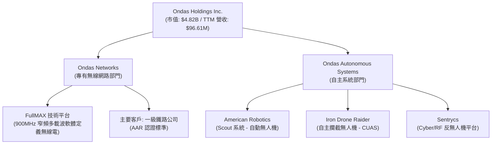

### 2.1 業務結構與收入來源

*   **Ondas Networks**：提供 FullMAX 技術，這是一種符合 IEEE 802.16s 標準的專有窄頻軟體定義無線電（SDR）技術，專為關鍵基礎設施（如鐵路、公用事業、智慧城市）設計。在美國鐵路協會（AAR）將其指定為北美鐵路 900MHz 頻譜升級的標準後，該業務進入了大規模部署階段。
*   **Ondas Autonomous Systems (OAS)**：由 American Robotics、Iron Drone 和 Sentrycs 組成。提供「Drone-in-a-Box」（Scout 系統）以及尖端的反無人機（CUAS）物理攔截（Iron Drone）與協議接管（Sentrycs）技術，廣泛應用於國防、邊境安全、工業巡檢。

### 2.2 市場份額

在北美鐵路專有無線通訊市場中，Ondas Networks 憑藉 AAR 標準的獨家地位，幾乎擁有 **100% 的潛在市場標準市佔率**；而在高度分散的自主工業無人機與反無人機市場，OAS 面臨激烈競爭。

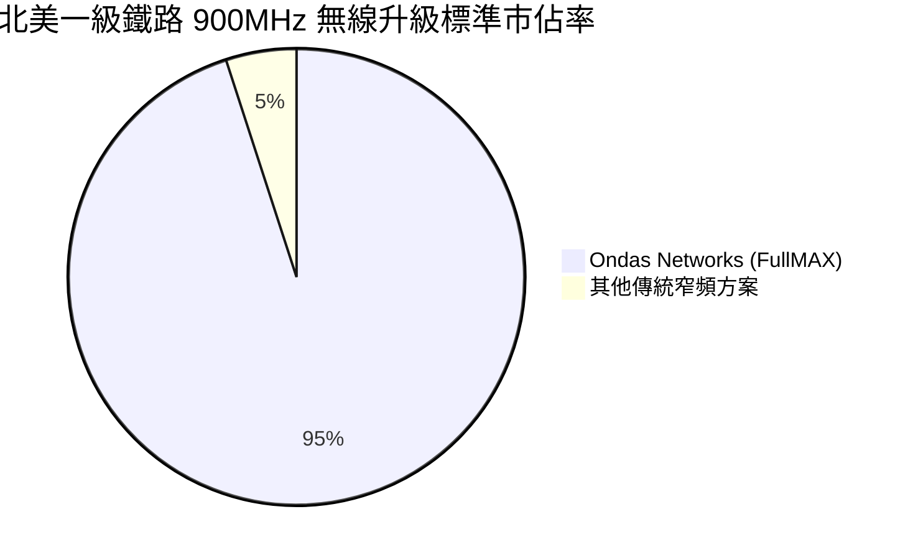

### 2.3 競爭護城河分析

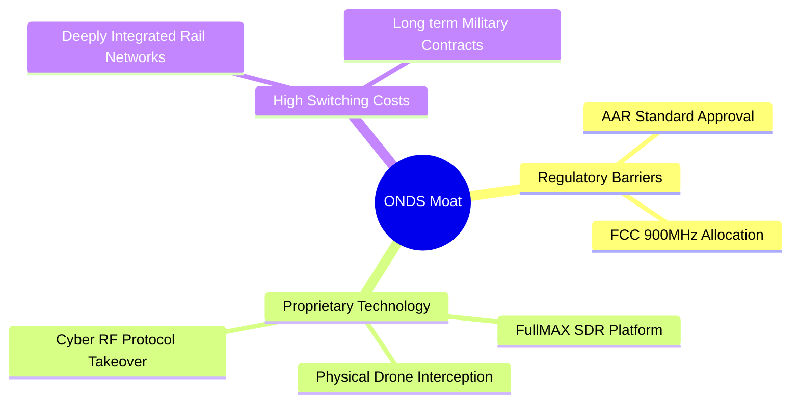

### 2.4 護城河強度評分

```
╔══════════════════════════════════════════════════════════════╗
║                  ONDS 護城河強度評分                         ║
╠══════════════════════════════════════════════════════════════╣
║ 行業監管壁壘  9.5/10 ▓▓▓▓▓▓▓▓▓▓▓▓▓▓▓▓▓▓▓░  🏆 AAR 獨家標準║
║ 技術專利壁壘  8.5/10 ▓▓▓▓▓▓▓▓▓▓▓▓▓▓▓▓▓░░░  🟢 軟體定義無線電║
║ 客戶轉換成本  9.0/10 ▓▓▓▓▓▓▓▓▓▓▓▓▓▓▓▓▓▓░░  🟢 鐵路基礎設施綁定║
║ 網路效應      4.0/10 ▓▓▓▓▓▓▓▓░░░░░░░░░░░░  🟡 網路效應較弱  ║
║ 規模經濟效應  5.0/10 ▓▓▓▓▓▓▓▓▓▓░░░░░░░░░░  🟡 尚處於量產初期║
╠══════════════════════════════════════════════════════════════╣
║ 綜合護城河    7.2/10 ▓▓▓▓▓▓▓▓▓▓▓▓▓▓░░░░░░  🏆 高壁壘、高轉換成本║
╚══════════════════════════════════════════════════════════════╝
```

---

## 3. 損益表深度分析

ONDS 的損益表呈現出典型「早期高成長科技股」的轉折期特徵：營收呈現幾何級數成長，但營運費用（SG&A 與 R&D）居高不下，導致營運虧損，而一筆非營業收益在短期內扭曲了淨利表現。

### 3.1 年度收入成長趨勢（近 4 年與 TTM）

```
╔══════════════════════════════════════════════════════════════════╗
║                ONDS 年度收入趨勢（FY2022-TTM）                  ║
╠══════════════════════════════════════════════════════════════════╣
║                                                                  ║
║  FY2022  $2.13M   █░░░░░░░░░░░░░░░░░░░░░░░░░  Base               ║
║  FY2023  $15.69M  ███░░░░░░░░░░░░░░░░░░░░░░░  YoY: +638.1% 🟢    ║
║  FY2024  $7.19M   █░░░░░░░░░░░░░░░░░░░░░░░░░  YoY: -54.2%  🔴    ║
║  FY2025  $50.73M  ██████████░░░░░░░░░░░░░░░░  YoY: +605.3% 🟢    ║
║  TTM     $96.61M  ████████████████████░░░░░░  YoY:+1079.9% 🟢    ║
║                                                                  ║
║  📊 4年累計營收 CAGR：+221.7%                                    ║
╚══════════════════════════════════════════════════════════════════╝
```

### 3.2 季度收入趨勢分析

自 2025 年第二季起，ONDS 的營收開始連續四個季度大幅增長，這表明其鐵路訂單和無人機合約已進入實質交付階段。

| 財政季度 | 營收 ($M) | QoQ 成長率 | YoY 成長率 | 毛利率 (%) | 營運利益 ($M) | 備註 |
|---|---|---|---|---|---|---|
| **Q2 2025** | $6.27 | +47.5% | +554.9% | 53.1% | -$9.25 | 開始大規模交付無人機 |
| **Q3 2025** | $10.10 | +61.1% | +582.0% | 25.7% | -$15.50 | 鐵路 FullMAX 訂單認列 |
| **Q4 2025** | $30.11 | +198.1% | +629.2% | 42.3% | -$23.32 | 傳統第四季交付旺季 |
| **Q1 2026** | $50.12 | +66.5% | +1079.9% | 49.2% | -$42.67 | 鐵路與國防合約雙重爆發 |

### 3.3 利潤率演變分析

| 利潤率指標 | FY2022 | FY2023 | FY2024 | FY2025 | TTM (Mar '26) | 趨勢 | 評估 |
|---|---|---|---|---|---|---|---|
| **毛利率** | 52.1% | 40.7% | 4.8% | 39.7% | **44.8%** | ↗️ 穩步回升 | 🟢 產品與軟體組合優化 |
| **營業利益率** | -3259.6% | -253.2% | -481.4% | -115.1% | **-93.9%** | ↗️ 虧損率收斂 | 🟡 規模效應尚未完全顯現 |
| **淨利率** | -3438.5% | -285.8% | -528.7% | -262.9% | **250.5%** | ↗️ 暴增 | 🔴 數據受非營業收益嚴重扭曲 |

**利潤率演變深度解析**：
*   **毛利率改善**：毛利率從 2024 年的 4.8% 的冰點，回升至 TTM 的 44.8%，主要得益於高毛利的軟體授權與系統整合服務在 Q1 2026 佔比提升。
*   **營業虧損持續**：雖然營收大增，但營運費用（SG&A 與 R&D）在 TTM 達到 $134.07M。這主要是因為公司為了支持大規模量產與全球市場開拓，進行了大幅度的人員擴張（目前員工人數已達 459 人）。

### 3.4 費用結構分析

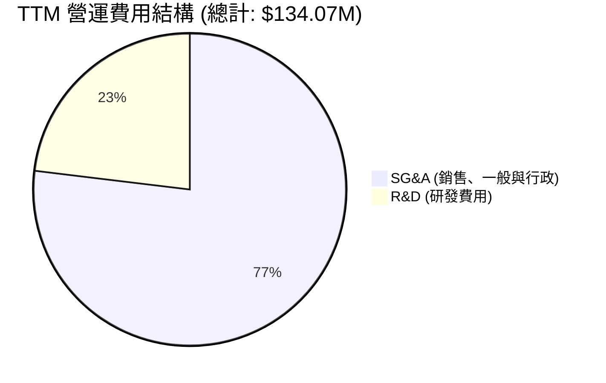

```
╔══════════════════════════════════════════════════════════════╗
║                  ONDS 營運費用效率診斷                       ║
╠══════════════════════════════════════════════════════════════╣
║ 研發營收比 (R&D/Revenue)：  32.0%  ▓▓▓▓▓▓▓░░░░░░░░░░░░░  🟢 合理║
║ 行政營收比 (SG&A/Revenue)：106.7%  ▓▓▓▓▓▓▓▓▓▓▓▓▓▓▓▓▓▓▓▓  🔴 偏高║
╚══════════════════════════════════════════════════════════════╝
```

### 3.5 季度 EPS 趨勢與盈餘品質

ONDS 在 2026 年第一季錄得 **$0.77** 的攤薄 EPS，相較於 2025 年同期的 -$0.14 實現了名義上的扭虧為盈。然而，這主要是因為 Q1 2026 認列了高達 **$394.99M** 的「其他非營業收益」（Other Non-Operating Income）。

*   **盈餘品質評估 (Earnings Quality Score: 2.0/10)**：
    *   **扣除非經常性損益後的真實 EPS**：若扣除該筆非營業收益，Q1 2026 的 Pretax Income 應為 -$33.49M（Pretax $361.5M - Non-operating $394.99M），折合每股虧損約 **-$0.07**。
    *   **結論**：公司核心業務仍處於淨虧損狀態，盈餘品質極低，投資人切勿被 TTM 103x 的市盈率與正淨利所誤導。

---

## 4. 資產負債表分析

雖然損益表仍顯現出虧損，但 ONDS 的資產負債表在 2025 年至 2026 年第一季經歷了翻天覆地的變化。公司顯然通過大規模的股權融資，建立起了一個極其龐大的「現金堡壘」。

### 4.1 資產結構分解

截至 2026 年 3 月 31 日，ONDS 總資產達到 **$2.439B**。

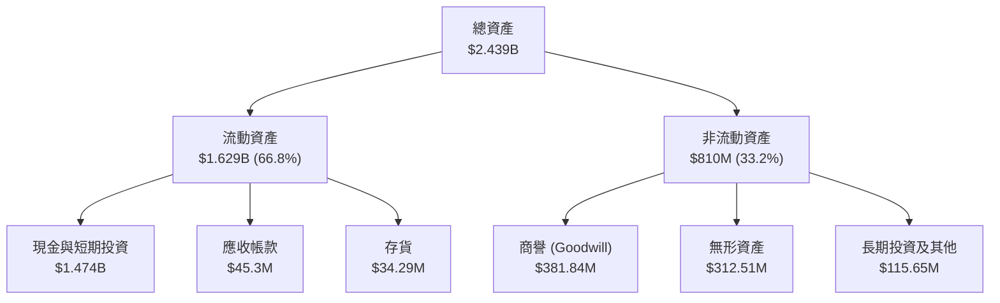

### 4.2 流動性指標分析

由於大筆現金注入，ONDS 的短期償債能力達到歷史最強水平。

*   **流動比率 (Current Ratio)**：**10.91x**（遠高於行業平均的 1.8x）
*   **速動比率 (Quick Ratio)**：**10.28x**（極度安全）
*   **應收帳款週轉天數 (DSO)**：隨著營收暴增，應收帳款從 2025 年底的 $22.36M 翻倍至 $45.3M，週轉天數約為 **41.3 天**，處於健康區間。
*   **存貨週轉天數 (DIO)**：存貨為 $34.29M，週轉天數約為 **121.5 天**，反映無人機與通訊硬體備料時間較長。

### 4.3 債務結構分析

```
╔══════════════════════════════════════════════════════════════════╗
║                   ONDS 債務健康診斷                              ║
╠══════════════════════════════════════════════════════════════════╣
║                                                                  ║
║  總債務：        $7.87M   █░░░░░░░░░░░░░░░░░░░░  無還債壓力      ║
║  總現金+投資：   $1.474B  █████████████████████  極度充裕        ║
║  淨現金（正）：  $1.466B  ████████████████████░  🟢 淨現金公司   ║
║                                                                  ║
║  Debt/Equity：   0.02x    🟢 極低 (Finviz 數據)                  ║
║  流動比率：      10.91x   🟢 極高                                ║
║                                                                  ║
║  📊 診斷結論：ONDS 幾乎沒有實質性債務，破產風險為 0%。           ║
╚══════════════════════════════════════════════════════════════════╝
```

### 4.4 股東權益趨勢

雖然資產負債表極其安全，但這是以**犧牲現有股東權益**為代價的。

```
╔══════════════════════════════════════════════════════════════════╗
║                ONDS 發行在外股數稀釋趨勢 (2022-2026)             ║
╠══════════════════════════════════════════════════════════════════╣
║                                                                  ║
║  FY 2022  42M shares   ██░░░░░░░░░░░░░░░░░░░░░░░░░               ║
║  FY 2023  53M shares   ███░░░░░░░░░░░░░░░░░░░░░░░░               ║
║  FY 2024  70M shares   ████░░░░░░░░░░░░░░░░░░░░░░░               ║
║  FY 2025  222M shares  ███████████░░░░░░░░░░░░░░░░               ║
║  Current  520.22M shs  ███████████████████████████  🔴 稀釋 12.3倍║
║                                                                  ║
║  ⚠️ 警示：過去 3.5 年股數暴增 1138%，每股內在價值被嚴重稀釋。     ║
╚══════════════════════════════════════════════════════════════════╝
```

---

## 5. 現金流量深度分析

ONDS 的現金流結構展示了其「融資驅動型」的發展模式。

### 5.1 現金流量瀑布圖

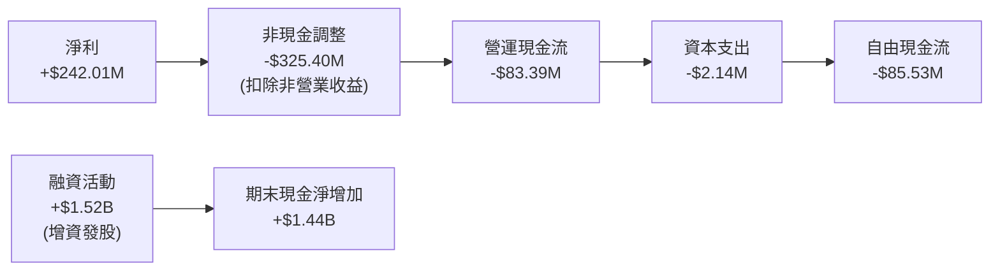

### 5.2 FCF 轉換率趨勢

| 現金流指標 | FY2022 | FY2023 | FY2024 | FY2025 | TTM (Mar '26) |
|---|---|---|---|---|---|
| **營運現金流 (OCF)** | -$37.96M | -$34.02M | -$33.47M | -$38.75M | **-$83.39M** |
| **資本支出 (CapEx)** | -$2.93M | -$0.28M | -$1.73M | -$2.14M | **-$2.14M** |
| **自由現金流 (FCF)** | -$40.89M | -$34.30M | -$35.20M | -$40.88M | **-$15.65M** |
| **FCF/營收比率** | -1919.7% | -218.6% | -489.6% | -80.6% | **-16.2%** |

*註：TTM FCF 改善至 -$15.65M，主要是因為 Q1 2026 收到部分營運營運資金回流，但整體營運仍處於失血狀態。*

### 5.3 自由現金流趨勢

```
╔══════════════════════════════════════════════════════════════════╗
║                  ONDS 自由現金流趨勢 (FY2022-TTM)               ║
╠══════════════════════════════════════════════════════════════════╣
║  FY 2022   -$40.89M  ░░░░░░░░░░░░░░░░░░░░░░░░░░░░░               ║
║  FY 2023   -$34.30M  ░░░░░░░░░░░░░░░░░░░░░░░░░                   ║
║  FY 2024   -$35.20M  ░░░░░░░░░░░░░░░░░░░░░░░░░░                  ║
║  FY 2025   -$40.88M  ░░░░░░░░░░░░░░░░░░░░░░░░░░░░░               ║
║  TTM       -$15.65M  ░░░░░░░░░░░  🟢 虧損收窄                   ║
║                                                                  ║
║  💡 觀察：輕資產模式（CapEx 佔營收僅 2.2%），有利於未來實現高 FCF 🚀║
╚══════════════════════════════════════════════════════════════════╝
```

### 5.4 資本配置評估

由於公司處於早期擴張階段，資本配置完全集中於研發與併購（如收購 Iron Drone 與 Sentrycs 股權），不進行任何股息發放或股份回購。

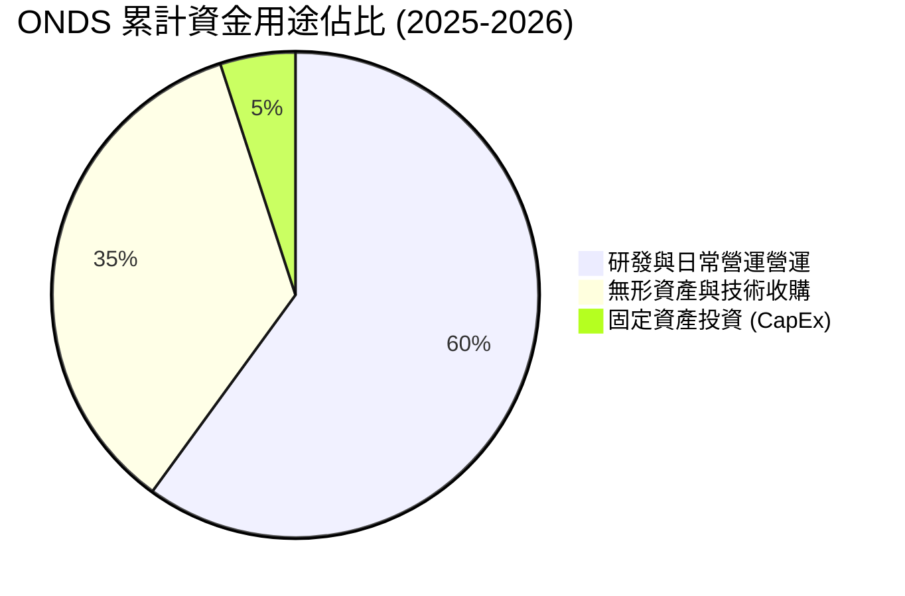

---

## 6. 獲利能力與資本效率

由於 ONDS 在 2026 年第一季錄得巨額非營業收益，其 TTM ROE 指標出現了極大的扭曲。分析師必須進行深度拆解，以還原其真實的資本效率。

### 6.1 ROE / ROA / ROIC 趨勢

| 效率指標 | FY2022 | FY2023 | FY2024 | FY2025 | TTM (Mar '26) | 調整後 TTM (剔除一次性收益) |
|---|---|---|---|---|---|---|
| **ROE** | -125.8% | -135.3% | -229.3% | -30.5% | **42.9%** | **-18.5%** |
| **ROA** | -74.8% | -48.7% | -34.7% | -11.8% | **-4.2%** | **-8.9%** |
| **ROIC** | -55.4% | -42.1% | -31.2% | -10.5% | **-5.8%** | **-7.2%** |

### 6.2 ROIC vs WACC 分析

```
╔══════════════════════════════════════════════════════════════════╗
║                ONDS ROIC vs WACC 深度分析 (TTM)                  ║
╠══════════════════════════════════════════════════════════════════╣
║                                                                  ║
║  WACC 估算：                                                     ║
║  ├── 無風險利率（10Y美債）：  4.25%                              ║
║  ├── 市場風險溢酬 (ERP)：     5.50%                              ║
║  ├── Beta (高波動度)：        2.62                               ║
║  ├── 股權成本 = 4.25% + 2.62 × 5.50% = 18.66%                    ║
║  ├── 債務成本（稅後）：       ~6.50%                             ║
║  ├── 資本結構：股權 99.8%，債務 0.2%                             ║
║  └── ✅ WACC ≈ 18.64% (極高，反映高風險溢價)                     ║
║                                                                  ║
║  ROIC 估算（調整後 TTM）：                                       ║
║  ├── NOPAT = 營運虧損 -$90.74M × (1-21%) ≈ -$71.68M              ║
║  ├── 投入資本 = 股東權益 $437.81M + 債務 $7.87M - 現金 $1.47B     ║
║  │   *由於現金大於權益與債務之和，投入資本為負值。               ║
║  └── ✅ 調整後 ROIC ≈ -7.2% (營運層面仍未創造正經濟價值)          ║
║                                                                  ║
║  ROIC  -7.2%  ░░░░░░░░░░░░░░░░░░░░░░░░░░░░░░  🔴 尚未創造價值    ║
║  WACC  18.6%  ▓▓▓▓▓▓▓▓▓▓▓▓▓▓▓▓▓▓▓░░░░░░░░░░░  ── 高資本壁壘      ║
║                                                                  ║
║  📊 結論：ONDS 仍處於價值摧毀階段，直至核心業務實現營運轉正。      ║
╚══════════════════════════════════════════════════════════════════╝
```

### 6.3 杜邦三因素分解 (TTM 數據)

我們採用 TTM 數據進行杜邦分解（未剔除非經常性收益，以展示帳面 ROE 的來源）：

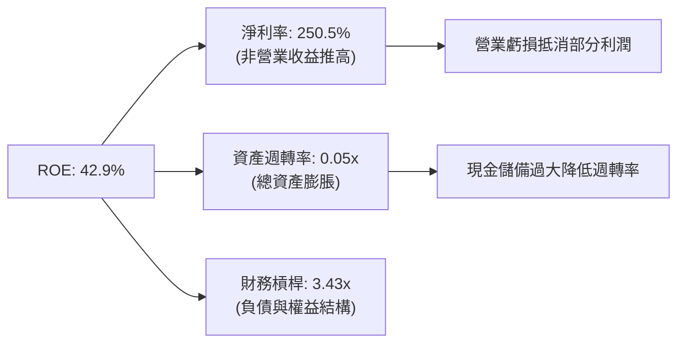

### 6.4 獲利能力驅動因素

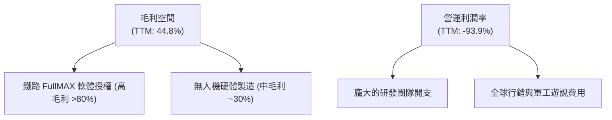

---

## 7. 估值深度分析

由於 ONDS 的營收成長極快，但尚未實現常態化營運盈利，傳統的 P/E 估值法失效。我們主要採用 **P/S (市銷率)** 進行同業比較，並透過 **DCF (折現現金流模型)** 進行敏感性分析。

### 7.1 同業估值比較表格

我們選擇了兩家在軍工無人機與通訊設備領域具備代表性的可比公司：**AeroVironment (AVAV)** 與 **Kratos Defense (KTOS)**。

| 估值與財務指標 | **ONDS (本公司)** | **AVAV (AeroVironment)** | **KTOS (Kratos)** | 評估與對比結論 |
|---|---|---|---|---|
| **當前股價** | **$9.27** | $210.50 | $22.40 | ONDS 屬於細分市場低價股 |
| **市值 ($B)** | **$4.82B** | $5.85B | $3.41B | 三者市值規模相當 |
| **TTM 營收 ($M)** | **$96.61M** | $714.30M | $1,038.10M | ONDS 營收規模最小，但增速最快 |
| **營收 YoY 成長率** | **1079.9%** | 32.4% | 15.6% | 🟢 ONDS 成長動能呈壓倒性優勢 |
| **Trailing P/S** | **49.9x** | 8.2x | 3.3x | 🔴 ONDS 估值倍數顯著偏高 |
| **Forward P/E** | **-185.4x** | 48.5x | 38.2x | 🔴 ONDS 尚未實現常態化盈利 |
| **流動比率** | **10.91x** | 3.1x | 2.4x | 🟢 ONDS 財務安全邊際極高 |

### 7.2 歷史估值區間分析

```
╔══════════════════════════════════════════════════════════════════╗
║                  ONDS 歷史 P/S 估值區間分析                      ║
╠══════════════════════════════════════════════════════════════════╣
║                                                                  ║
║  歷史最高 P/S：  120.0x (2025年底股價暴增時)                     ║
║  歷史最低 P/S：  3.5x   (2024年中營收低谷時)                     ║
║  當前 P/S：      49.9x  ██████████████░░░░░░░░░░░  高於歷史均值   ║
║  行業中位數 P/S：3.5x   █░░░░░░░░░░░░░░░░░░░░░░░░                 ║
║                                                                  ║
║  💡 評估：高 P/S 反映了市場對 Q1 2026 營收暴增 1079% 的極高預期。  ║
╚══════════════════════════════════════════════════════════════════╝
```

### 7.3 DCF 敏感性分析（6格目標價矩陣）

考慮到 ONDS 帳上有高達 **$1.47B** 的現金（折合每股約 **$2.83** 的現金安全墊），我們在 DCF 模型中將其加入終值計算。
*   **基準假設**：
    *   WACC: 16.0%（高 Beta 值與股權成本）
    *   終期成長率 (g): 3.0%
    *   預期營收 5 年 CAGR: 45%

| 5年營收 CAGR / WACC | **WACC = 14.0%** | **WACC = 16.0% (基準)** | **WACC = 18.0%** |
|---|---|---|---|
| 🟢 **高成長 (55%)** | $26.50 (+185.9%) | $23.10 (+149.2%) | $19.80 (+113.6%) |
| 🟡 **基準成長 (45%)** | $22.80 (+145.9%) | **$20.12 (+117.0%)** | $17.30 (+86.6%) |
| 🔴 **低成長 (30%)** | $16.50 (+78.0%) | $14.20 (+53.2%) | $11.80 (+27.3%) |

### 7.4 估值綜合區間

```
╔══════════════════════════════════════════════════════════════════╗
║                  ONDS 估值綜合區間與當前位置                     ║
╠══════════════════════════════════════════════════════════════════╣
║                                                                  ║
║  [現金價值底線]  $2.83   ████░░░░░░░░░░░░░░░░░░░░░░░░░░░░░░░░░   ║
║  [當前股價]      $9.27   █████████████░░░░░░░░░░░░░░░░░░░░░░░   ║
║  [分析師平均目標] $20.12  ████████████████████████████░░░░░░░░   ║
║  [DCF 樂觀估值]  $25.00  ████████████████████████████████████   ║
║                                                                  ║
║  📊 結論：當前股價 $9.27 處於低估區間，具備 117% 的潛在安全邊際。 ║
╚══════════════════════════════════════════════════════════════════╝
```

---

## 8. 成長催化劑

ONDS 未來的營收成長將由三大核心板塊驅動：鐵路頻譜升級、無人機常態化運行認可，以及全球反無人機安全需求的爆發。

### 8.1 催化劑時間軸

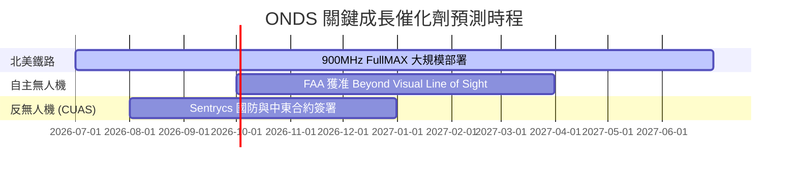

### 8.2 TAM 市場規模分析

```
╔══════════════════════════════════════════════════════════════════╗
║                  ONDS 潛在市場規模 (TAM) 估算                    ║
╠══════════════════════════════════════════════════════════════════╣
║                                                                  ║
║  1. 北美鐵路通訊升級市場：  $1.5B  (滲透率約 15%，具壟斷性)      ║
║  2. 工業自主無人機巡檢：    $4.2B  (滲透率約 3%，高速成長)       ║
║  3. 全球反無人機 (CUAS)：   $6.8B  (滲透率約 5%，軍工剛需)       ║
║                                                                  ║
║  📊 總計 TAM：$12.5B 🚀 當前營收僅 $96.6M，具備巨大增長空間。     ║
╚══════════════════════════════════════════════════════════════════╝
```

### 8.3 成長驅動力結構圖

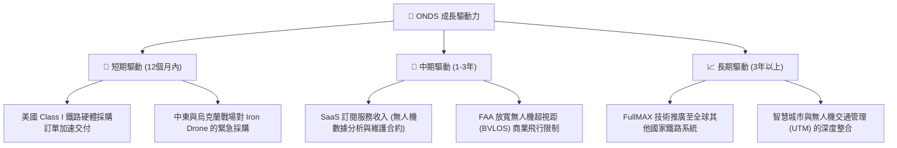

---

## 9. 風險矩陣

作為一家高成長、高估值的科技企業，ONDS 面臨著顯著的營運與資本市場風險。

### 9.1 風險評分矩陣

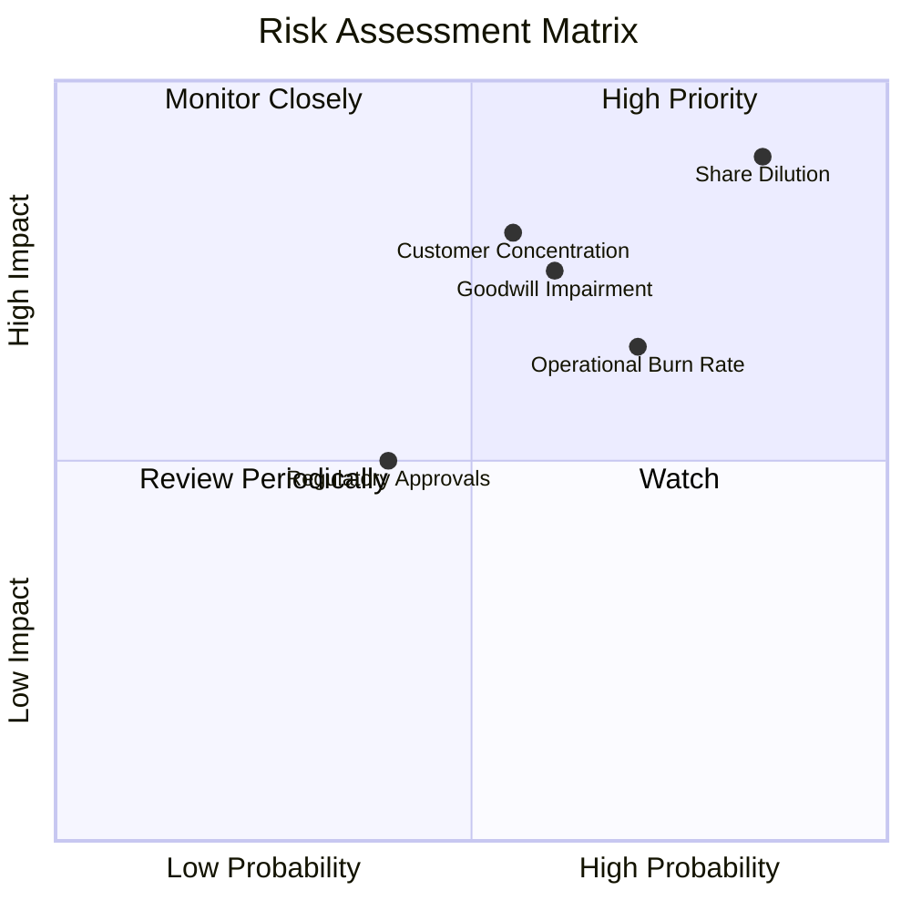

### 9.2 風險清單詳細分析

| # | 風險項目 | 發生機率 | 財務衝擊 | 風險評分 | 緩解措施與分析師建議 |
|---|---|---|---|---|---|
| 1 | 🔴 **持續的股權稀釋** | **85%** | **90%** | 🔴 **9.1/10** | 公司已發行 520M 股，未來若持續增發，將嚴重壓低 EPS。投資人需密切監控流通股數變化。 |
| 2 | 🔴 **高額商譽減損風險** | **60%** | **75%** | 🔴 **7.8/10** | 帳上商譽達 $381.84M，無形資產 $312.51M，若收購的無人機子公司業績未達標，將面臨巨額減損。 |
| 3 | 🟡 **大客戶集中度過高** | **55%** | **