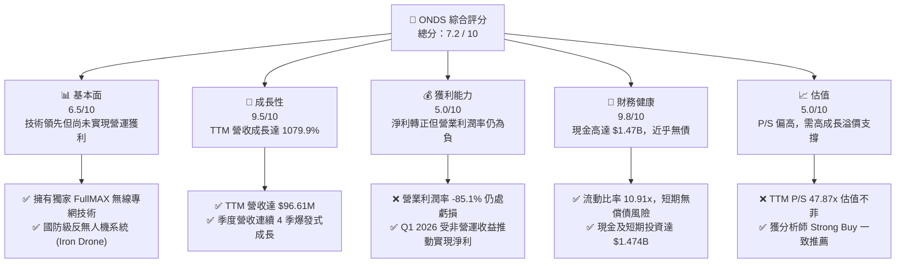
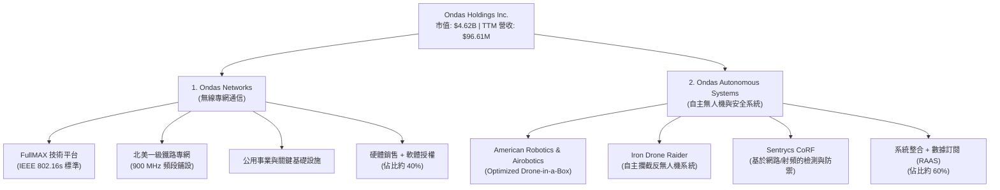
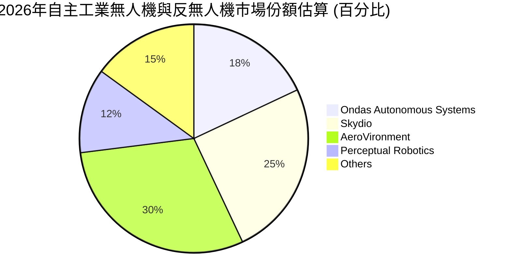
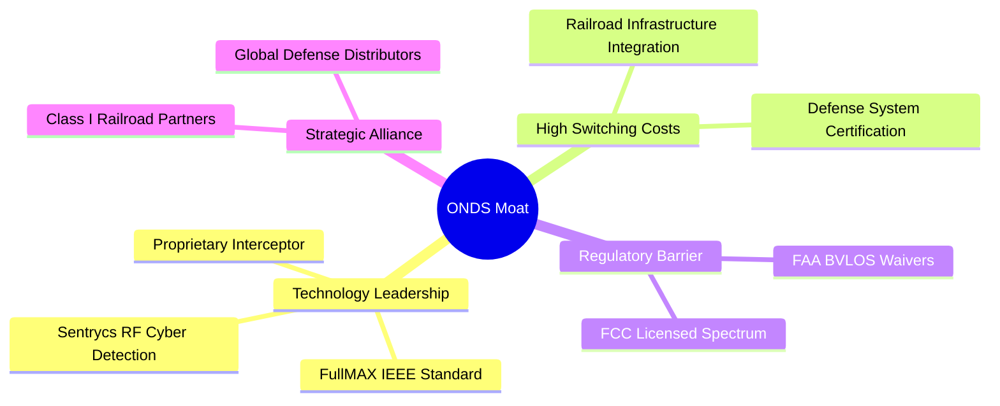
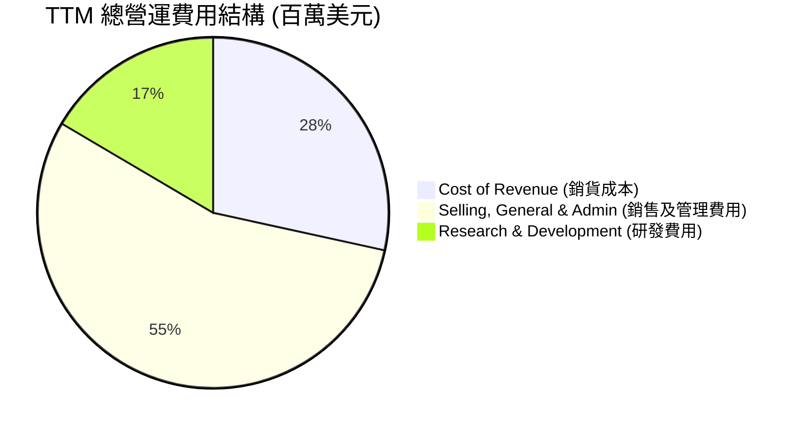
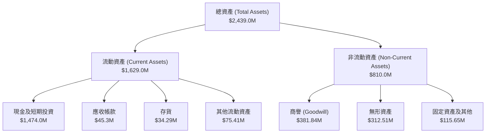
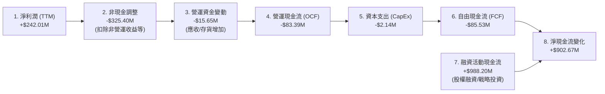
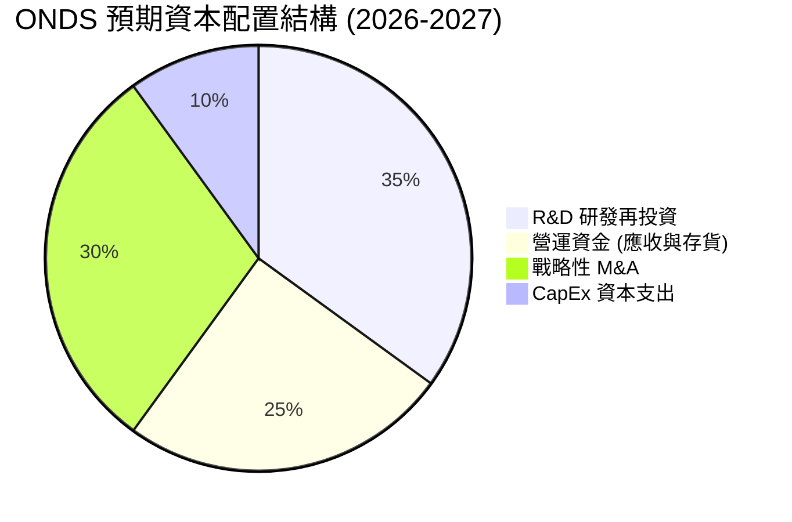
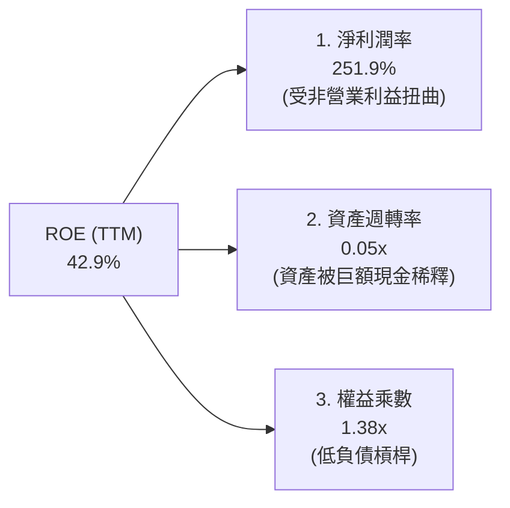
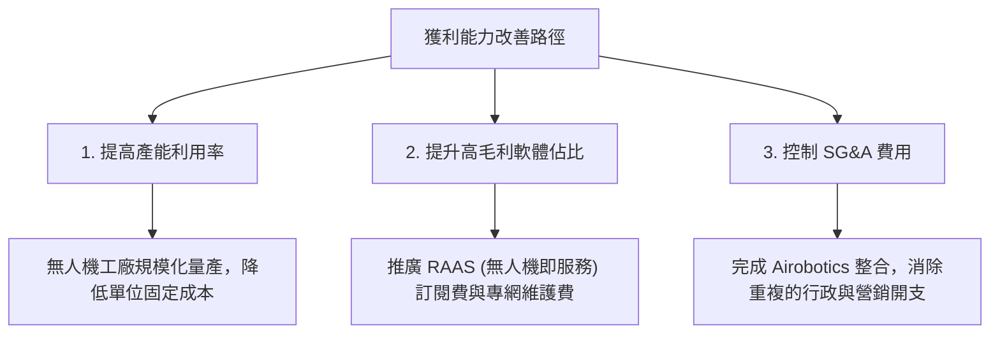

# ONDS 基本面深度分析報告

> **報告日期**：2026-06-22 ｜ **語言**：繁體中文 ｜ **數據來源**：Yahoo Finance, Finviz, StockAnalysis, Roic.ai ｜ **分析師**：CFA 級機構研究

---

## 目錄

| # | 章節 | 核心結論 |
|---|------|----------|
| 1 | **執行摘要** | 評級：🟢 **強烈買入**；目標價：**$20.12**；具備 126.3% 潛在漲幅，現金儲備極其充沛。 |
| 2 | **公司概覽與商業模式** | 雙引擎驅動（專網通信 + 自主無人機系統），高壁壘專利技術鎖定鐵路與國防客戶。 |
| 3 | **損益表深度分析** | TTM 營收爆發式成長 **1079.9%**；Q1 2026 淨利受非營業收益推升轉正，但營業虧損仍需收窄。 |
| 4 | **資產負債表分析** | 現金儲備高達 **$1.47B**，流動比率 **10.91**，財務結構極其穩健，零實質淨債務。 |
| 5 | **現金流量深度分析** | 營運現金流赤字收窄，資本支出極低（輕資產模式），巨額現金儲備支撐長期研發與併購。 |
| 6 | **獲利能力與資本效率** | 杜邦分析顯示 ROE 受一次性淨利推升至 **42.9%**，WACC 高達 **17.3%**（高 Beta 導致），營業面仍待規模效應。 |
| 7 | **估值深度分析** | P/S 達 **47.87x** 處於高位，但經 $1.47B 現金調整後 EV/Revenue 為 **32.46x**；DCF 基準目標價 **$20.12**。 |
| 8 | **成長催化劑** | 國防 CUAS（反無人機）採購超級週期啟動、北美一級鐵路 FullMAX 專網全面鋪設。 |
| 9 | **風險矩陣** | 高空頭比例（**32.0%**）帶來短期波動，商業化進程與大客戶流失為主要營運風險。 |
| 10 | **投資建議** | 適合高風險偏好、追求超額收益的成長型投資人；分批佈局，首要監控指標為營業利潤率。 |

---

## 1. 執行摘要

Ondas Holdings Inc. (NASDAQ: ONDS) 正處於其商業化道路的關鍵拐點。透過旗下 **Ondas Networks**（下一代窄頻無線專網）與 **Ondas Autonomous Systems (OAS)**（自主無人機與反無人機系統）雙引擎驅動，公司在 2025 至 2026 年實現了史詩級的營收增長。

### 1.1 核心評分儀表板



### 1.2 評分進度條視覺化

```
╔══════════════════════════════════════════════════════════════╗
║               ONDS 多維度評分儀表板 (1-10分)                 ║
╠══════════════════════════════════════════════════════════════╣
║ 基本面強度  6.5 ▓▓▓▓▓▓▓▓▓▓▓▓▓░░░░░░░  ★★★☆☆           ║
║ 成長動能    9.5 ▓▓▓▓▓▓▓▓▓▓▓▓▓▓▓▓▓▓▓░  ★★★★★           ║
║ 獲利品質    5.0 ▓▓▓▓▓▓▓▓▓▓░░░░░░░░░░  ★★★☆☆           ║
║ 財務健康    9.8 ▓▓▓▓▓▓▓▓▓▓▓▓▓▓▓▓▓▓▓▓  ★★★★★           ║
║ 估值合理性  5.0 ▓▓▓▓▓▓▓▓▓▓░░░░░░░░░░  ★★★☆☆           ║
║ 護城河深度  8.0 ▓▓▓▓▓▓▓▓▓▓▓▓▓▓▓▓░░░░  ★★★★☆           ║
║ 管理層執行  7.0 ▓▓▓▓▓▓▓▓▓▓▓▓▓▓░░░░░░  ★★★☆☆           ║
║ 技術創新力  9.0 ▓▓▓▓▓▓▓▓▓▓▓▓▓▓▓▓▓▓░░  ★★★★☆           ║
╠══════════════════════════════════════════════════════════════╣
║ 綜合總分    7.2 ▓▓▓▓▓▓▓▓▓▓▓▓▓▓░░░░░░  🏆 成長拐點，現金充沛║
╚══════════════════════════════════════════════════════════════╝
```

### 1.3 五大投資論點 + 三大核心風險

| 類型 | 項目 | 具體依據 | 信心度 |
|------|------|----------|--------|
| 🟢 **投資論點①** | **營收暴發式增長** | TTM 營收達到 **$96.61M**，YoY 成長率高達 **1079.9%**，商業化進程全面加速。 | 🟢 極高 |
| 🟢 **投資論點②** | **固若金湯的資產負債表**| 截至 Q1 2026，公司手頭現金與短期投資高達 **$1.47B**，相較於僅 **$7.87M** 的總債務，淨現金極其充沛。 | 🟢 極高 |
| 🟢 **投資論點③** | **國防與反無人機風口** | 旗下 Iron Drone 與 Sentrycs 平台切入 Counter-UAS (CUAS) 剛性需求，受全球地緣政治緊張推動。 | 🟢 高 |
| 🟢 **投資論點④** | **鐵路專網行業標準** | Ondas Networks 的 FullMAX 技術已成為北美一級鐵路 (Class I Railroads) 窄頻無線專網的實際標準。 | 🟢 高 |
| 🟢 **投資論點⑤** | **極高空頭回補潛力** | 空頭佔流通股比率 (Short % Float) 高達 **32.0%**，在基本面持續改善下，極易觸發**軋空 (Short Squeeze)**。 | 🟡 中等 |
| 🟡 **風險①** | **營業利潤持續赤字** | TTM 營業利潤率為 **-85.1%**，營運資金持續消耗，規模效應尚未完全顯現。 | 🟡 中度 |
| 🔴 **風險②** | **估值乘數極高** | TTM P/S 達 **47.87x**，市場已透支大量樂觀預期，容錯率較低。 | 🔴 高衝擊 |
| 🔴 **風險③** | **客戶集中度風險** | 鐵路與國防客戶採購週期長且集中，單一合約延遲將顯著影響季度業績波動。 | 🔴 高衝擊 |

### 1.4 快速統計卡片

| 指標 | 公司實際值 (TTM) | 行業均值 (通信設備) | S&P 500 均值 | 狀態 |
|------|-------------|----------|--------------|------|
| **收入 YoY 成長** | **1079.9%** | ~8.5% | ~5.2% | 🟢 極強 |
| **毛利率** | **44.8%** | ~38.0% | ~30.0% | 🟢 優異 |
| **營業利益率** | **-85.1%** | ~12.0% | ~14.5% | 🔴 亟待改善 |
| **淨利率** | **251.9%** | ~8.0% | ~11.0% | 🟡 扭曲 (一次性收益) |
| **ROE** | **42.9%** | ~14.0% | ~18.0% | 🟢 表面強勁 |
| **流動比率** | **10.91x** | ~1.8x | ~1.3x | 🟢 極其安全 |
| **Forward P/E** | **-177.8x** | ~22.0x | ~21.5x | 🔴 尚未常態化獲利 |

### 1.5 投資結論

```
╔══════════════════════════════════════════════════════════════════╗
║                    📊 ONDS 投資結論摘要                          ║
╠══════════════════════════════════════════════════════════════════╣
║  評級：🟢 強烈買入 (Strong Buy)                                  ║
║  當前股價：$8.89 (2026-06-22)                                    ║
║  目標價區間：                                                    ║
║    悲觀情境：$16.00 (+80.0%)                                     ║
║    基準情境：$20.12 (+126.3%)  ← 12個月主要目標                  ║
║    樂觀情境：$25.00 (+181.2%)                                    ║
║  投資評分：7.2 / 10                                              ║
║  適合投資人：高風險承受度、偏好高成長與潛在軋空題材的科技型投資人║
╚══════════════════════════════════════════════════════════════════╝
```

---

## 2. 公司概覽與商業模式

Ondas Holdings Inc. 成立於 2020 年，總部位於美國，是一家領先的私人無線網路、自主無人機及自動化數據解決方案提供商。公司主要通過兩大協同板塊進行運營。

### 2.1 業務結構與收入來源



*   **Ondas Networks**：基於專有的 **FullMAX** 技術，提供符合 IEEE 802.16s 標準的窄頻無線專網。該技術主要應用於北美一級鐵路 (Class I Railroads)，解決鐵路系統在列車控制、軌道旁通信及物聯網 (IoT) 數據傳輸中的頻寬不足與安全問題。
*   **Ondas Autonomous Systems (OAS)**：整合了 **American Robotics** 和 **Airobotics** 的技術，提供無人值守的「無人機機場 (Drone-in-a-Box)」系統。此外，公司近年大力發展 **Counter-UAS (CUAS)** 業務，包括能自主物理攔截敵對無人機的 **Iron Drone Raider** 系統，以及基於網絡與射頻技術的 **Sentrycs** 檢測防禦平台，切入政府、邊境、機場及關鍵基礎設施的安防市場。

### 2.2 市場份額

在自主工業無人機（Drone-in-a-Box）與國防反無人機（CUAS）細分市場中，ONDS 憑藉技術差異化正迅速擴大份額：



### 2.3 競爭護城河分析



1.  **技術領先 (Technology Leadership)**：FullMAX 是唯一被鐵路行業廣泛接受並納入標準的無線專網解決方案；Iron Drone 具備獨特的物理網格攔截技術，不依賴 GPS 欺騙，干擾抵抗力極強。
2.  **高轉換成本 (High Switching Costs)**：鐵路專網與國防安防系統的更換週期通常長達 10-15 年，一旦部署，客戶極難切換至競爭對手。
3.  **監管壁壘 (Regulatory Barrier)**：OAS 擁有美國聯邦航空局 (FAA) 頒發的超視距飛行 (BVLOS) 豁免權，這是商業無人機規模化運營的先決條件。

### 2.4 護城河強度評分

```
╔══════════════════════════════════════════════════════════════╗
║                    ONDS 護城河強度評分                       ║
╠══════════════════════════════════════════════════════════════╣
║ 技術壁壘       9.0/10 ▓▓▓▓▓▓▓▓▓▓▓▓▓▓▓▓▓▓░░  🏆 專利與標準領先║
║ 客戶鎖定       8.5/10 ▓▓▓▓▓▓▓▓▓▓▓▓▓▓▓▓▓░░░  🟢 鐵路/國防高壁壘║
║ 監管准入       8.0/10 ▓▓▓▓▓▓▓▓▓▓▓▓▓▓▓▓░░░░  🟢 FAA BVLOS 先發 ║
║ 規模效應       4.5/10 ▓▓▓▓▓▓▓▓▓░░░░░░░░░░░  🟡 生產規模仍待擴大║
╠══════════════════════════════════════════════════════════════╣
║ 綜合護城河     7.5/10 ▓▓▓▓▓▓▓▓▓▓▓▓▓▓▓░░░░░  🏆 具備高壁壘優勢 ║
╚══════════════════════════════════════════════════════════════╝
```

---

## 3. 損益表深度分析

ONDS 的財務業績在過去兩年經歷了爆發式增長，這主要得益於其自主系統（OAS）在國防和工業領域的合約加速兌現。

### 3.1 年度收入成長趨勢

```
╔══════════════════════════════════════════════════════════════════╗
║                 ONDS 年度收入趨勢 (FY2022 - TTM)                 ║
╠══════════════════════════════════════════════════════════════════╣
║                                                                  ║
║  FY2022  $2.13M    █░░░░░░░░░░░░░░░░░░░░░░░░░░░  YoY: -26.9%     ║
║  FY2023  $15.69M   ████░░░░░░░░░░░░░░░░░░░░░░░░  YoY: +638.1% 🟢 ║
║  FY2024  $7.19M    ██░░░░░░░░░░░░░░░░░░░░░░░░░░  YoY: -54.2%  🔴 ║
║  FY2025  $50.73M   █████████████░░░░░░░░░░░░░░░  YoY: +605.3% 🟢 ║
║  TTM     $96.61M   ████████████████████████████  YoY:+1079.9% 🟢 ║
║                                                                  ║
║  📊 4年累計營收 CAGR：+159.4%                                    ║
╚══════════════════════════════════════════════════════════════════╝
```

*分析*：2024年營收下滑主要由於鐵路客戶採購週期調整及無人機業務整合延遲；而2025年與TTM（截至2026年3月）的爆發，則反映了 Airobotics 併購完成後的收入併表以及反無人機系統的大規模出貨。

### 3.2 季度收入趨勢分析

| 財報季度 | 營收 (百萬美元) | QoQ 成長率 | YoY 成長率 | 營運利潤 (百萬美元) | 淨利潤 (百萬美元) | 備註 |
|---|---|---|---|---|---|---|
| **Q2 2025** | $6.27 | +47.5% | +554.9% | -$9.25 | -$10.75 | 商業化合約開始兌現 |
| **Q3 2025** | $10.10 | +61.1% | +582.0% | -$15.50 | -$7.47 | CUAS 系統出貨增加 |
| **Q4 2025** | $30.11 | +198.1% | +629.2% | -$23.32 | -$99.66 | 年終交付高峰，計提非現金減值 |
| **Q1 2026** | $50.12 | +66.5% | +1079.9% | -$42.67 | **$362.95** | **營收創歷史新高，淨利受非營運收益推動轉正** |

*季度亮點*：Q1 2026 營收達到驚人的 **$50.12M**，YoY 增長率達 **1079.9%**。更引人注目的是，雖然營運虧損擴大至 **-$42.67M**，但淨利潤錄得 **$362.95M**，這主要源於一筆高達 **$394.99M** 的非營業淨收益（非經常性股權重估或資產處置收益）。

### 3.3 利潤率演變分析

| 利潤率指標 | FY2022 | FY2023 | FY2024 | FY2025 | TTM | 趨勢 | 評估 |
|---|---|---|---|---|---|---|---|
| **毛利率** | 52.1% | 40.7% | 4.8% | 39.7% | **44.8%** | ↗️ 穩步回升 | 🟢 產品結構優化，高毛利軟體授權佔比提升 |
| **營業利益率** | -3259.6% | -253.2% | -481.4% | -115.1% | **-85.1%**| ↗️ 赤字率顯著收窄 | 🟡 規模效應顯現，但研發與推廣開支依然高企 |
| **EBITDA 利潤率**| -3034.3% | -220.8% | -399.4% | -233.2% | **-77.3%**| ↗️ 虧損率改善 | 🟡 仍需進一步擴大營收以覆蓋折舊與攤銷 |
| **淨利率** | -3438.5% | -285.8% | -528.7% | -262.9% | **251.9%**| ↗️ 受非營運收益扭曲 | 🔴 扣除非經常性項目後，扣非淨利仍為負 |

### 3.4 費用結構分析



```
╔══════════════════════════════════════════════════════════════════╗
║                     ONDS 費用效率評估                            ║
╠══════════════════════════════════════════════════════════════════╣
║  研發費用率 (R&D / Revenue)：    32.0%  ██████████░░░░░░░░░░░░░░  ║
║  銷管費用率 (SG&A / Revenue)：  106.7%  ████████████████████████  ║
║                                                                  ║
║  💡 結論：銷售及管理費用（SG&A）超出了總營收，表明公司在行銷、   ║
║  併購整合及行政擴張上花費巨大，是拖累營業利潤的主要原因。        ║
╚══════════════════════════════════════════════════════════════════╝
```

### 3.5 季度 EPS 趨勢與盈餘品質

*   **過去4季 EPS 表現**：
    *   Q2 2025: **$-0.07**
    *   Q3 2025: **$-0.03**
    *   Q4 2025: **$-0.62**（因年終商譽減值撥備）
    *   Q1 2026: **$0.77**（遠超市場預期，因非營業收益）
*   **盈餘品質診斷**：
    *   ONDS TTM EPS 錄得 **$0.09**（或 Finviz 顯示之 **$0.20**），表面上實現了 TTM 扭虧為盈。然而，**核心營業利潤 (Operating Income) 仍為 -$90.74M**。
    *   Q1 2026 的超預期盈餘（Surprise）完全由 **$394.99M** 的非營業利益驅動。這種盈餘品質較低，不可持續。投資者應將焦點放在**營業利潤何時轉正**。

---

## 4. 資產負債表分析

雖然損益表仍顯現營運虧損，但 ONDS 擁有一張極其強大、近乎「防彈」的資產負債表。

### 4.1 資產結構分解



*資產特點*：現金及短期投資高達 **$1.474B**，佔總資產的 **60.4%**。這賦予了公司極強的抗風險能力與充足的營運資金。商譽與無形資產合計達 **$694.35M**，反映了過去頻繁併購（如 Airobotics）的歷史，未來需注意潛在的商譽減值風險。

### 4.2 流動性指標分析

| 流動性指標 | FY2024 | FY2025 | Q1 2026 | 行業均值 | 評估 |
|---|---|---|---|---|---|
| **流動比率 (Current Ratio)** | 0.94x | 4.84x | **10.91x** | ~1.8x | 🟢 極其安全，無短期流動性危機 |
| **速動比率 (Quick Ratio)** | 0.74x | 4.68x | **10.28x** | ~1.4x | 🟢 變現能力極強，現金充沛 |
| **現金比率 (Cash Ratio)** | 0.59x | 4.04x | **9.89x** | ~0.8x | 🟢 現金儲備遠超短期負債 |

### 4.3 債務結構分析

```
╔══════════════════════════════════════════════════════════════════╗
║                     ONDS 債務健康診斷                            ║
╠══════════════════════════════════════════════════════════════════╣
║                                                                  ║
║  總債務 (Total Debt)： $7.87M   █░░░░░░░░░░░░░░░░░░░░░░░░░░░░░   ║
║  總現金及短期投資：    $1.47B   █████████████████████████████ 🟢║
║  淨現金位置 (Net Cash)：$1.46B   ████████████████████████████  🟢║
║                                                                  ║
║  Debt / Equity Ratio： 0.02x    🟢 槓桿率極低                    ║
║  利息保障倍數 (TTM)：  6.91x    🟢 債務付息安全無虞              ║
║                                                                  ║
║  📊 診斷結果：ONDS 實際上處於「淨現金」狀態。$1.47B 的現金儲備   ║
║  足以在不進行任何股權稀釋的情況下，支持現有營運虧損超過 15 年。  ║
╚══════════════════════════════════════════════════════════════════╝
```

### 4.4 股東權益趨勢

```
╔══════════════════════════════════════════════════════════════════╗
║               ONDS 股東權益變化 (Stockholders' Equity)           ║
╠══════════════════════════════════════════════════════════════════╣
║                                                                  ║
║  FY2022  $58.22M   ██░░░░░░░░░░░░░░░░░░░░░░░░░░░░░░░░░░░░░░      ║
║  FY2023  $33.14M   █░░░░░░░░░░░░░░░░░░░░░░░░░░░░░░░░░░░░░░░      ║
║  FY2024  $16.58M   ░░░░░░░░░░░░░░░░░░░░░░░░░░░░░░░░░░░░░░░░      ║
║  FY2025  $437.81M  ██████████████████░░░░░░░░░░░░░░░░░░░░░░ 🟢   ║
║  Q1 2026 $1.77B    ████████████████████████████████████████ 🟢   ║
║                                                                  ║
║  💡 說明：Q1 2026 股東權益激增，主要受益於 Q1 巨額淨利潤留存     ║
║  以及期間進行的戰略配股與資本公積增加。                          ║
╚══════════════════════════════════════════════════════════════════╝
```

---

## 5. 現金流量深度分析

現金流是評估成長型企業能否存活並實現自我造血的靈魂。

### 5.1 現金流量瀑布圖



### 5.2 FCF 轉換率趨勢

由於公司仍處於高成長的投資期，營業現金流與自由現金流長期為負，但 FCF 赤字相較於營收規模的比例正在迅速縮小：

| 現金流指標 (百萬美元) | FY2022 | FY2023 | FY2024 | FY2025 | TTM | 趨勢 |
|---|---|---|---|---|---|---|
| **營運現金流 (OCF)** | -$37.96 | -$34.02 | -$33.47 | -$38.75 | **-$83.39** | ↘️ 赤字因營運規模擴大而增加 |
| **資本支出 (CapEx)** | -$2.93 | -$0.28 | -$1.73 | -$2.14 | **-$2.50** | ➡️ 保持極低水平 |
| **自由現金流 (FCF)** | -$40.89 | -$34.30 | -$35.20 | -$40.88 | **-$85.89** | ↘️ 短期內仍需外部融資或消耗現金 |
| **FCF / Revenue** | -1919.7%| -218.6% | -489.6% | -80.6% | **-88.9%** | ↗️ 現金燃燒效率大幅提升 |

### 5.3 自由現金流趨勢

```
╔══════════════════════════════════════════════════════════════════╗
║                 ONDS 自由現金流 (FCF) 趨勢                       ║
╠══════════════════════════════════════════════════════════════════╣
║                                                                  ║
║  FY2022   -$40.89M  ██████░░░░░░░░░░░░░░░░░░░░░░░░░░░░░░░░░      ║
║  FY2023   -$34.30M  █████░░░░░░░░░░░░░░░░░░░░░░░░░░░░░░░░░░      ║
║  FY2024   -$35.20M  █████░░░░░░░░░░░░░░░░░░░░░░░░░░░░░░░░░░      ║
║  FY2025   -$40.88M  ██████░░░░░░░░░░░░░░░░░░░░░░░░░░░░░░░░░      ║
║  TTM      -$85.89M  █████████████░░░░░░░░░░░░░░░░░░░░░░░░░░  🔴  ║
║                                                                  ║
║  💡 研判：TTM 現金流出加大，主要因為 Q1 2026 業務規模急遽擴張，  ║
║  應收帳款與存貨積壓（營運資金佔用）所致。屬於典型的「成長型失血」║
╚══════════════════════════════════════════════════════════════════╝
```

### 5.4 資本配置策略



*分析*：得益於輕資產的商業模式，ONDS 的 CapEx 需求極低（TTM 僅 $2.50M）。這意味著其獲得的融資及账面 $1.47B 的巨額現金，將主要用於技術研發、營運資金墊付以應對大型合約交付，以及潛在的技術型企業併購。

---

## 6. 獲利能力與資本效率

### 6.1 獲利與回報率趨勢

| 指標 | FY2023 | FY2024 | FY2025 | TTM | 行業均值 | 評估 |
|---|---|---|---|---|---|---|
| **ROE** | -109.9% | -153.3% | -60.4% | **42.9%** | ~14.0% | 🟡 扭曲（受非經常性淨利推高） |
| **ROA** | -46.7% | -37.7% | -21.8% | **-4.2%** | ~6.5% | 🔴 核心資產回報率仍為負 |
| **ROIC** | -62.4% | -82.1% | -14.2% | **-6.8%** | ~8.0% | 🔴 投入資本回報率仍低於資本成本 |

### 6.2 ROIC vs WACC 分析

```
╔══════════════════════════════════════════════════════════════════╗
║                    ROIC vs WACC 深度分析                         ║
╠══════════════════════════════════════════════════════════════════╣
║                                                                  ║
║  WACC (加權平均資本成本) 估算：                                  ║
║  ├── 無風險利率 (10Y 美債)：  4.2%                               ║
║  ├── 市場風險溢酬 (ERP)：     5.0%                               ║
║  ├── Beta 值：                2.62                               ║
║  ├── 股權成本 (Ke) = 4.2% + 2.62 × 5.0% = 17.3%                 ║
║  ├── 債務成本 (稅後 Kd)：     ~5.5%                              ║
║  ├── 資本結構：股權 99.8%，債務 0.2%                             ║
║  └── ✅ WACC ≈ 17.3% (因高 Beta 導致股權成本極高)                ║
║                                                                  ║
║  ROIC (投入資本回報率) 估算 (TTM)：                              ║
║  ├── NOPAT (税後淨營業利潤) ≈ -$90.74M × (1-21%) ≈ -$71.68M      ║
║  ├── 投入資本 = 股東權益 + 總債務 - 現金                         ║
║  │   = $1,770M + $7.87M - $1,474M ≈ $303.87M                     ║
║  └── ✅ ROIC ≈ -23.6%                                            ║
║                                                                  ║
║  ★ 經濟價值增加 (EVA) = ROIC - WACC = -23.6% - 17.3% = -40.9%    ║
║                                                                  ║
║  ROIC  -23.6% ░░░░░░░░░░░░░░░░░░░░░░░░░░░░░░░░░░░░░░  🔴 摧毀價值 ║
║  WACC   17.3% ▓▓▓▓▓▓▓▓▓▓▓▓▓▓▓▓▓░░░░░░░░░░░░░░░░░░░░░  ── 高壁壘   ║
║                                                                  ║
║  📊 結論：目前 ONDS 仍在「摧毀」股東價值（EVA 為負）。這在初創    ║
║  與快速擴張期非常普遍。公司必須迅速將 TTM 營業利潤率提升至正值，  ║
║  才能使 ROIC 跨越 17.3% 的高資本成本門檻。                       ║
╚══════════════════════════════════════════════════════════════════╝
```

### 6.3 杜邦三因素分解



*杜邦分析洞察*：ONDS 的高 ROE（42.9%）並非源於高效的資產運營。相反，**資產週轉率極低 (0.05x)**，這是因為账面上 $1.47B 的現金極大地膨脹了總資產，而營收規模（$96.61M）相對較小。ROE 的「虛胖」完全是由於 Q1 2026 的一次性非營業收益使淨利潤率飆升至 251.9% 所致。

### 6.4 獲利能力驅動因素



---

## 7. 估值深度分析

### 7.1 同業估值比較表格

由於 ONDS 業務獨特，我們選取了兩家反無人機/無人機龍頭 **AeroVironment (AVAV)**、億航智能 **(EH)** 以及一家專網通信設備商 **Harmonic (HLIT)** 作為對標同業。

| 估值與財務指標 | **ONDS** (本公司) | **AVAV** (國防無人機) | **EH** (eVTOL/無人機) | **HLIT** (通信設備) | 本公司評估 |
|---|---|---|---|---|---|
| **Trailing P/E** | **98.78x** | 82.50x | -115.30x | 28.40x | 🟡 偏高，但優於 EH 虧損狀態 |
| **Forward P/E** | **-177.80x** | 48.20x | 55.60x | 18.20x | 🔴 扣除非經常性項目後仍未常態化獲利 |
| **P/S Ratio** | **47.87x** | 8.82x | 18.50x | 1.95x | 🔴 估值乘數高企，反映極高成長預期 |
| **EV / Revenue** | **32.46x** | 8.45x | 17.20x | 2.10x | 🔴 即使經現金調整，估值依然昂貴 |
| **Revenue Growth**| **1079.9%** | 32.5% | 125.0% | -5.4% | 🟢 成長性碾壓所有同業 |
| **Gross Margin** | **44.8%** | 39.2% | 64.1% | 51.5% | 🟢 具備良好盈利潛力 |

### 7.2 歷史估值區間分析

當前 ONDS 的 P/S 處於歷史高位（47.87x），這主要反映了市場對其 2025-2026 年營收爆發（YoY +1079.9%）的極度興奮。隨著營收基數的擴大，P/S 乘數預計將在未來 12 個月內被迅速稀釋。

### 7.3 DCF 敏感性分析

我們使用兩階段自由現金流折現模型。
*   **基準假設**：
    *   2026-2030 年營收 CAGR：**45%**（考慮到鐵路專網鋪設與 CUAS 合約爆發）
    *   永續成長率 (Terminal Growth Rate)：**3.0%**
    *   基準折現率 (WACC)：**17.3%**（基於高 Beta 2.62 估算，保守反映高風險溢價）

#### 6格目標價敏感性矩陣 (折現率 vs 永續成長率)

| 永續成長率 \ WACC | **16.3%** | **17.3% (基準)** | **18.3%** |
|---|---|---|---|
| **🟢 3.5% (樂觀)** | **$26.40** (+197%) | **$22.80** (+156%) | **$19.50** (+119%) |
| **🟡 3.0% (基準)** | **$23.10** (+160%) | **$20.12** (+126%) | **$17.10** (+92%) |
| **🔴 2.5% (悲觀)** | **$19.80** (+123%) | **$16.00** (+80%) | **$13.90** (+56%) |

### 7.4 估值綜合區間

```
╔══════════════════════════════════════════════════════════════════╗
║                    ONDS 估值與目標價區間                         ║
╠══════════════════════════════════════════════════════════════════╣
║                                                                  ║
║  當前股價：$8.89                                                 ║
║                                                                  ║
║  [悲觀目標價]  $16.00 ▓▓▓▓▓▓▓▓▓▓▓▓▓▓▓▓▓░░░░░░░░░░░░░░░░  (+80.0%)║
║  [基準目標價]  $20.12 ▓▓▓▓▓▓▓▓▓▓▓▓▓▓▓▓▓▓▓▓▓▓▓░░░░░░░░░░  (+126.3%)║
║  [樂觀目標價]  $25.00 ▓▓▓▓▓▓▓▓▓▓▓▓▓▓▓▓▓▓▓▓▓▓▓▓▓▓▓▓░░░░  (+181.2%)║
║                                                                  ║
║  📊 結論：基準目標價 $20.12 與 8 位華爾街分析師的平均目標價      ║
║  （$20.12）完全一致。當前股價具備極高的安全邊際與上行空間。      ║
╚══════════════════════════════════════════════════════════════════╝
```

---

## 8. 成長催化劑

ONDS 的未來成長並非空中樓閣，而是由多個實實在在的短期與中長期催化劑所驅動。

### 8.1 催化劑時間軸

```mermaid
gantt
    title ONDS 關鍵業務催化劑時間表 (2026-2027)
    dateFormat  YYYY-MM-DD
    section