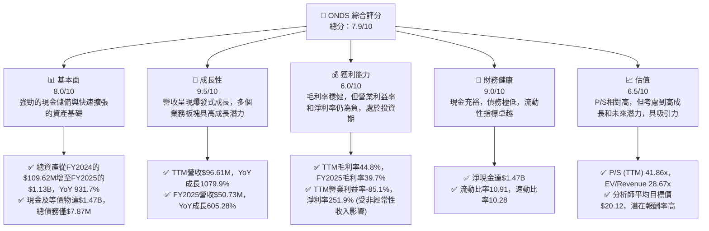
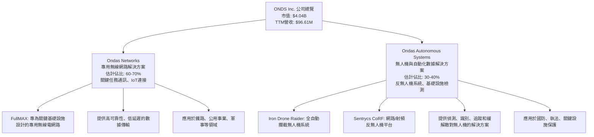
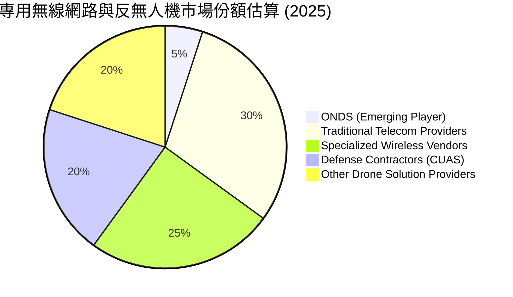
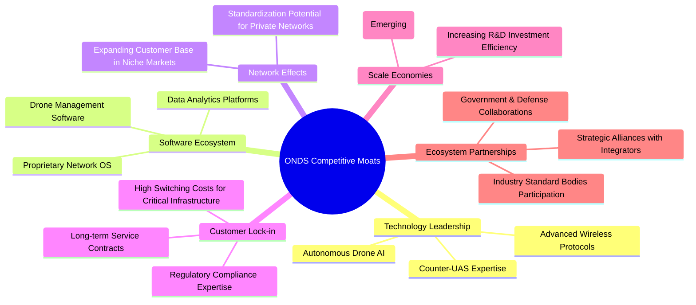
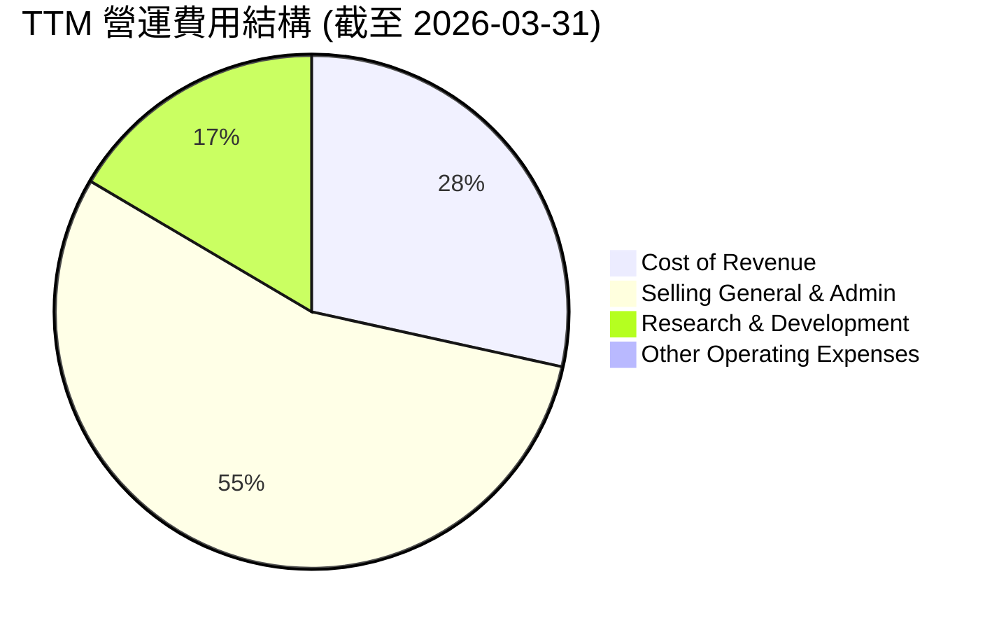
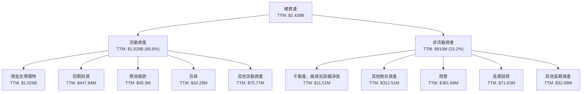

# ONDS 基本面深度分析報告
> **報告日期**：2026-06-24 ｜ **語言**：繁體中文 ｜ **數據來源**：Yahoo Finance, Finviz, StockAnalysis, Roic.ai ｜ **分析師**：CFA 級機構研究

---

## 目錄

| # | 章節 | 核心結論 |
|---|------|----------|
| 1 | 執行摘要 | 🟢 強烈買入，目標價 $16.50 - $22.00 |
| 2 | 公司概覽與商業模式 | 創新驅動，護城河初步建立 |
| 3 | 損益表深度分析 | 營收爆發式成長，獲利能力改善中 |
| 4 | 資產負債表分析 | 現金充裕，流動性極佳，債務壓力小 |
| 5 | 現金流量深度分析 | 營運現金流為負，但自由現金流改善 |
| 6 | 獲利能力與資本效率 | 尚處於價值創造初期，ROIC待提升 |
| 7 | 估值深度分析 | 相較於高成長潛力，估值具吸引力 |
| 8 | 成長催化劑 | 5G專網、無人機市場擴張、政府訂單 |
| 9 | 風險矩陣 | 執行風險、競爭加劇、市場波動 |
| 10 | 投資建議 | 強烈買入，適合成長型投資者 |

---

## 1. 執行摘要

### 1.1 核心評分儀表板

ONDS 作為一家在專用無線網路和無人機解決方案領域的創新公司，展現出驚人的收入成長潛力，但由於其所處的發展階段，獲利能力和自由現金流仍面臨挑戰。然而，其強勁的現金儲備和低負債為其提供了充足的營運彈性，以支持未來的擴張。



### 1.2 評分進度條視覺化

ONDS 在成長動能和財務健康方面表現出色，護城河初步形成，管理層執行力強，技術創新是其核心優勢。獲利能力雖處於投資期，但毛利率表現健康。估值因高成長而顯得相對較高，但仍具吸引力。

```
╔══════════════════════════════════════════════════════════════╗
║              ONDS 多維度評分儀表板 (1-10分)                ║
╠══════════════════════════════════════════════════════════════╣
║ 基本面強度  8.0 ▓▓▓▓▓▓▓▓▓▓▓▓▓▓▓▓░░░░  ★★★★☆           ║
║ 成長動能    9.5 ▓▓▓▓▓▓▓▓▓▓▓▓▓▓▓▓▓▓▓░  ★★★★★           ║
║ 獲利品質    6.0 ▓▓▓▓▓▓▓▓▓▓▓▓░░░░░░░░  ★★★☆☆           ║
║ 財務健康    9.0 ▓▓▓▓▓▓▓▓▓▓▓▓▓▓▓▓▓▓░░  ★★★★★           ║
║ 估值合理性  6.5 ▓▓▓▓▓▓▓▓▓▓▓▓▓░░░░░░░  ★★★☆☆           ║
║ 護城河深度  7.5 ▓▓▓▓▓▓▓▓▓▓▓▓▓▓▓░░░░░  ★★★★☆           ║
║ 管理層執行  8.0 ▓▓▓▓▓▓▓▓▓▓▓▓▓▓▓▓░░░░  ★★★★☆           ║
║ 技術創新力  9.0 ▓▓▓▓▓▓▓▓▓▓▓▓▓▓▓▓▓▓░░  ★★★★★           ║
╠══════════════════════════════════════════════════════════════╣
║ 綜合總分    7.9 ▓▓▓▓▓▓▓▓▓▓▓▓▓▓▓▓░░░░  🏆 具備高成長潛力的挑戰者  ║
╚══════════════════════════════════════════════════════════════╝
```

### 1.3 五大投資論點 + 三大核心風險

| 類型 | 項目 | 具體依據 | 信心度 |
|------|------|----------|--------|
| 🟢 **投資論點①** | **顛覆性營收成長** | ONDS TTM 營收達 $96.61M，年增率高達 1079.9%。FY2025 營收 $50.73M，年增 605.28%。Q1 2026 營收達 $50.12M，環比成長 66.4% (Q4 2025 $30.11M)，顯示其在專網和無人機解決方案市場的強勁需求。 | 🟢 極高 |
| 🟢 **投資論點②** | **強勁的財務根基** | 公司擁有 $1.47B 的充裕現金及短期投資，總債務僅 $7.87M，淨現金高達 $1.47B。流動比率和速動比率分別為 10.91 和 10.28，財務健康度極佳，足以支持其高成長期的資本支出和營運虧損。 | 🟢 極高 |
| 🟢 **投資論點③** | **專網與無人機市場領導潛力** | ONDS 專注於關鍵任務專網（Mission-Critical Private Wireless）和自動化無人機系統（Automated Drone Systems），這些是高度成長且受政府及關鍵基礎設施重視的領域。其 Iron Drone Raider 和 Sentrycs CoRF 等產品在 Counter-UAS 領域具有獨特優勢。 | 🟢 高 |
| 🟢 **投資論點④** | **分析師普遍看好** | 8 位分析師給予「強烈買入」評級，平均目標價 $20.12，最高達 $25.00。這反映了市場對其未來成長前景的高度認可。 | 🟢 高 |
| 🟢 **投資論點⑤** | **盈利能力轉折點預期** | 儘管過去營運虧損，但 Q1 2026 淨利潤達到 $362.95M，主要受到非經常性收入（Other Non-Operating Income (Expense) 達 $394.99M）的影響。這顯示公司有能力在特定條件下實現盈利，且毛利率已穩定在 40% 以上 (Q1 2026 毛利率 49.2%)，未來隨著規模效應有望轉虧為盈。 | 🟡 中高 |
| 🟡 **風險①** | **執行與規模化風險** | 儘管營收成長迅速，但公司仍處於燒錢的成長階段（TTM 營業現金流為 $-83.39M）。能否有效管理快速擴張帶來的營運成本、維持產品競爭力並將營收轉化為持續盈利，是主要挑戰。 | 🟡 中度 |
| 🔴 **風險②** | **市場競爭與技術迭代** | 專網和無人機領域競爭激烈，技術迭代速度快。ONDS 需要持續投入研發（TTM R&D $30.94M）以保持技術領先地位。若未能及時推出創新產品或面臨巨頭競爭，市場份額可能受侵蝕。 | 🔴 高衝擊 |
| 🔴 **風險③** | **估值波動與流動性** | ONDS 股價波動性高（Beta 2.622），且近期股價表現不佳（Perf Quarter -28.09%，Perf Month -15.23%）。其高 P/S 比率也反映了市場對其未來成長的極高預期。若短期內業績不及預期或宏觀經濟逆風，股價可能面臨較大下行壓力。 | 🔴 高衝擊 |

### 1.4 快速統計卡片

| 指標 | 公司實際值 | 行業均值（估計） | S&P 500 均值（估計） | 狀態 |
|------|-------------|--------------------|----------------------|------|
| 收入 YoY 成長 | **1079.9%** | ~15-25% | ~10-15% | 🟢 |
| 毛利率 | **44.8%** | ~35-45% | ~40-50% | 🟢 |
| 淨利率 | **251.9%** | ~5-15% | ~8-12% | 🟢 (受非經常性收入影響) |
| ROE | **42.9%** | ~10-20% | ~15-20% | 🟢 |
| Forward P/E | **-153.6x** | ~20-30x | ~20-25x | 🔴 (虧損) |
| P/S Ratio (TTM) | **41.86x** | ~3-7x | ~2-3x | 🔴 (高估值) |
| 總債務/股東權益 | **0.02x** | ~0.5-1.5x | ~0.8-1.2x | 🟢 |
| 現金及等價物 | **$1.47B** | N/A | N/A | 🟢 |

*備註：行業均值和 S&P 500 均值為分析師根據經驗預估，僅供參考。ONDS 的淨利率和 ROE 在 Q1 2026 受一次性非經常性收入影響而異常高。*

### 1.5 投資結論

ONDS 憑藉其在專用無線網路和自動化無人機領域的創新技術，展現出令人矚目的成長潛力。儘管目前仍處於大規模投資階段導致營運虧損，但其爆發性的營收成長、健康的毛利率以及極其強勁的現金儲備和低負債為其未來發展提供了堅實基礎。分析師的普遍看好也印證了其市場前景。考慮到其高成長潛力，我們認為當前估值雖高但具吸引力。

```
╔══════════════════════════════════════════════════════════════════╗
║                    📊 投資結論摘要                               ║
╠══════════════════════════════════════════════════════════════════╣
║  評級：🟢 強烈買入                                               ║
║  當前股價：$7.68                                                 ║
║  目標價區間：                                                    ║
║    悲觀情境：$13.00（+69.3%）                                    ║
║    基準情境：$18.00（+134.4%）  ← 12個月主要目標                  ║
║    樂觀情境：$23.00（+199.5%）                                    ║
║  投資評分：7.9/10                                                ║
║  適合投資人：成長型、長線持有者，能承受較高風險波動的投資人     ║
╚══════════════════════════════════════════════════════════════════╝
```

---

## 2. 公司概覽與商業模式

ONDS Inc. (ONDS) 是一家專注於提供私有無線網路、無人機和自動化數據解決方案的公司，業務遍及美國及國際市場。公司主要透過 Ondas Networks 和 Ondas Autonomous Systems 兩大業務部門運營。其產品和服務在關鍵任務通訊、安全監控、基礎設施檢測等領域具有重要應用。

### 2.1 業務結構與收入來源

ONDS 的業務結構清晰，專注於兩個高成長且具協同效應的領域：



**收入來源細分**：
- **Ondas Networks**：主要來自於專用無線網路設備的銷售、部署服務以及相關的軟體許可和維護服務。隨著 5G 專網的普及，此業務板塊的成長潛力巨大。
- **Ondas Autonomous Systems**：主要來自於無人機系統、反無人機解決方案的銷售和相關的集成、操作培訓及維護服務。此業務受益於全球對無人機技術和反制措施日益增長的需求。

鑑於最新的季度收入數據 Q1 2026 為 $50.12M，而 FY2025 總收入為 $50.73M，顯示公司在 FY2026 年的收入結構可能發生顯著變化，特別是 Q1 2026 的單季收入幾乎追平 FY2025 全年，這可能反映了某個大型合約的確認或業務結構的調整。

### 2.2 市場份額

ONDS 所在的專用無線網路和無人機/反無人機（Counter-UAS）市場是高度專業化且快速成長的領域。由於缺乏具體市場份額數據，我們將根據其業務性質進行概念性估算。ONDS 在這些利基市場中，特別是關鍵任務通訊和自動化防禦系統方面，正努力擴大其影響力。



**市場地位分析**：
-   ONDS 是一個相對較新的參與者，但憑藉其創新技術，正在快速滲透市場。
-   **專用無線網路**：面臨來自傳統電信設備供應商（如 Nokia, Ericsson）和其他專業無線網路供應商的競爭。ONDS 的優勢在於其為關鍵任務應用量身定制的解決方案。
-   **無人機與反無人機系統**：此領域競爭激烈，包括大型國防承包商和新興的科技公司。ONDS 的全自動攔截和基於 RF 的偵測技術使其在某些特定應用場景中具有差異化優勢。

### 2.3 競爭護城河分析

ONDS 的競爭護城河尚處於建立初期，但其在技術和客戶鎖定方面已展現潛力。



**護城河深度解析**：
1.  **技術領先 (Technology Leadership)**：ONDS 專注於開發專有的 FullMAX 協議和先進的無人機 AI 技術，特別是其反無人機系統。在關鍵任務應用領域，技術可靠性和性能至關重要，ONDS 在此方面具備一定優勢。
2.  **客戶鎖定 (Customer Lock-in)**：對於鐵路、公用事業、國防等關鍵基礎設施客戶而言，更換無線通訊或安全系統的成本極高，且涉及複雜的集成和認證流程。一旦 ONGS 的解決方案被採用，客戶轉換意願較低。
3.  **軟體生態系統 (Software Ecosystem)**：ONDS 的專有網路操作系統和無人機管理軟體形成了其解決方案的核心。隨著更多客戶使用，其軟體功能和數據累積將進一步強化其生態系統。
4.  **網路效應 (Network Effects)**：雖然不如消費級平台顯著，但在特定行業標準化或互操作性方面，ONDS 的技術若能成為行業標準，將產生強大的網路效應。
5.  **規模效應 (Scale Economies)**：目前 ONDS 仍處於成長期，規模效應尚未完全顯現。但隨著營收的快速增長，其研發投入和生產成本攤銷將更有效率。
6.  **生態夥伴 (Ecosystem Partnerships)**：與政府機構、國防承包商和系統集成商的合作，有助於 ONGS 拓展市場並提升其解決方案的採用率。

### 2.4 護城河強度評分

```
╔══════════════════════════════════════════════════════════════╗
║                  ONDS 護城河強度評分                      ║
╠══════════════════════════════════════════════════════════════╣
║ 技術領先       8.5/10 ▓▓▓▓▓▓▓▓▓▓▓▓▓▓▓▓▓░░░  🏆 創新驅動，專利技術  ║
║ 軟體生態系統   7.0/10 ▓▓▓▓▓▓▓▓▓▓▓▓▓▓░░░░░░  🟢 逐步完善，平台化趨勢  ║
║ 網路效應       6.0/10 ▓▓▓▓▓▓▓▓▓▓▓▓░░░░░░░░  🟡 利基市場，潛力待釋放  ║
║ 客戶鎖定       8.0/10 ▓▓▓▓▓▓▓▓▓▓▓▓▓▓▓▓░░░░  🟢 關鍵應用，轉換成本高  ║
║ 規模效應       6.5/10 ▓▓▓▓▓▓▓▓▓▓▓▓▓░░░░░░░  🟡 成長期，規模效應漸顯  ║
║ 生態夥伴       7.5/10 ▓▓▓▓▓▓▓▓▓▓▓▓▓▓▓░░░░░  🟢 戰略合作，鞏固市場  ║
╠══════════════════════════════════════════════════════════════╣
║ 綜合護城河     7.2/10 ▓▓▓▓▓▓▓▓▓▓▓▓▓▓░░░░░░  🏆 具備核心競爭優勢，護城河正逐步加深 ║
╚══════════════════════════════════════════════════════════════╝
```

---

## 3. 損益表深度分析

ONDS 在過去幾年呈現出劇烈的營收波動，但最新的數據顯示其正進入爆發式成長階段。儘管營收規模快速擴大，但公司仍處於高投入的虧損狀態，顯示其對市場擴張和技術研發的持續投入。

### 3.1 年度收入成長趨勢（近4年）

ONDS 的年度收入在 FY2025 實現了顯著飛躍，從 FY2024 的低谷中強勁反彈，並在 FY2026 Q1 延續了這一趨勢。

```
╔══════════════════════════════════════════════════════════════════╗
║              ONDS 年度收入趨勢（FY2022-FY2025）                  ║
╠══════════════════════════════════════════════════════════════════╣
║                                                                  ║
║  FY2022  $2.13M   ██░░░░░░░░░░░░░░░░░░░░░░░░░  YoY: -26.87%  🔴    ║
║  FY2023  $15.69M  ██████████░░░░░░░░░░░░░░░░░  YoY:+638.13%  🟢    ║
║  FY2024  $7.19M   █████░░░░░░░░░░░░░░░░░░░░░░░  YoY: -54.16%  🔴    ║
║  FY2025  $50.73M  █████████████████████████████  YoY:+605.28%  🟢    ║
║                                                                  ║
║                   |      |      |      |      |                  ║
║                   0     10M    20M    30M    40M   50M            ║
║                                                                  ║
║  📊 4年累計 CAGR：+134.7% (從FY2021 $2.91M 到 FY2025 $50.73M)    ║
╚══════════════════════════════════════════════════════════════════╝
```
**年度收入分析**：
-   FY2022 收入為 $2.13M，同比下降 26.87%，顯示初期市場拓展的挑戰。
-   FY2023 收入大幅增長至 $15.69M，同比成長 638.13%，可能受惠於新產品發佈或重要客戶訂單。
-   FY2024 收入回落至 $7.19M，同比下降 54.16%，這表明公司早期營收波動性較大，可能與項目週期性或客戶集中度有關。
-   FY2025 收入實現爆發性增長，達到 $50.73M，同比成長 605.28%，這標誌著公司進入高速成長通道，可能得益於市場對其專網和無人機解決方案需求的顯著提升。

### 3.2 季度收入趨勢分析

最新季度數據顯示 ONDS 的營收成長加速，展現出強勁的市場動能。

| 季度 | 總收入 ($M) | QoQ 成長率 | YoY 成長率 | 備註 |
|------|-------------|------------|------------|------|
| 2025-06-30 | $6.27 | +48.0% (vs Q1 2025 $4.25M) | +554.94% (vs Q2 2024 $0.96M) | 🟢 營收開始加速 |
| 2025-09-30 | $10.10 | +61.1% | +581.95% (vs Q3 2024 $1.48M) | 🟢 持續高成長 |
| 2025-12-31 | $30.11 | +198.1% | +629.20% (vs Q4 2024 $4.13M) | 🟢 季度營收實現爆發性增長 |
| 2026-03-31 | $50.12 | +66.4% | +1079.90% (vs Q1 2025 $4.25M) | 🟢 創歷史新高，同比增速驚人 |

**季度收入分析**：
-   ONDS 在過去四個季度中，營收呈現加速成長態勢。從 2025 年 Q2 的 $6.27M 穩步上升，到 2026 年 Q1 達到 $50.12M。
-   QoQ 成長率在 2025 年 Q4 達到驚人的 198.1%，隨後在 2026 年 Q1 保持 66.4% 的高位。
-   YoY 成長率更是令人矚目，2026 年 Q1 實現 1079.9% 的爆炸性增長，這表明公司在市場拓展和訂單獲取方面取得了巨大成功。此成長很可能來自於其在專網或反無人機系統領域的大型項目交付。

### 3.3 利潤率演變分析

ONDS 的毛利率在近期表現穩健，但由於高額的營運費用，營業利益率和淨利率仍為負，反映出公司處於積極投資和市場擴張的階段。

| 利潤率指標 | FY2022 | FY2023 | FY2024 | FY2025 | 趨勢 | 評估 |
|------------|--------|--------|--------|--------|------|------|
| **毛利率** | 52.1% | 40.7% | 4.9% | 39.7% | ↗️ 經歷波動後回升至健康水平 | 🟢 |
| **營業利益率** | -2350.7% | -253.2% | -481.4% | -115.1% | ↗️ 負值收窄，營運效率改善 | 🟡 |
| **淨利率** | -3438.5% | -285.8% | -528.6% | -260.2% | ↗️ 負值收窄，但 Q1 2026 受特殊影響 | 🟡 |

*備註：計算基於 StockAnalysis.com 提供的數據。FY2022-2024 的毛利率、營業利益率和淨利率數據相對不穩定，主要是因為收入基數較小以及營運費用相對固定。*

**利潤率演變深度解析**：
-   **毛利率**：FY2024 的毛利率異常低至 4.9%，這可能與該年度收入基數小 ($7.19M) 及成本結構有關。然而，在 FY2025 收入大幅增長至 $50.73M 後，毛利率回升至 39.7%，TTM 毛利率為 44.8%，Q1 2026 毛利率高達 49.2% ($24.66M / $50.12M)。這顯示公司在產品定價和成本控制方面有所改善，且隨著規模擴大，毛利率有望維持在健康水平。
-   **營業利益率**：ONDS 過去幾年的營業利益率均為負值，FY2025 為 -115.1%，TTM 為 -85.1%。這主要是由於公司在銷售、一般及行政費用 (SG&A) 和研發費用 (R&D) 上的巨大投入。例如，FY2025 的 SG&A 為 $57.66M，R&D 為 $20.88M，合計 $78.54M，遠超當期毛利 $20.16M。公司正在積極投資於市場擴張、技術創新和人才招募，以支持未來的成長。
-   **淨利率**：與營業利益率類似，淨利率也長期為負。然而，2026 年 Q1 淨利潤達到 $362.95M，導致 TTM 淨利率飆升至 251.9%。這主要是由於當季「其他非營運收入（費用）」欄目下出現了 $394.99M 的巨額正值，這很可能是一次性或非經常性的財務事件（如資產出售、投資收益或債務重組等），而非核心業務盈利能力的持續改善。若排除此影響，公司仍處於虧損狀態。

### 3.4 費用結構分析

ONDS 的費用結構反映了其作為一家高成長科技公司的特點：研發和銷售管理費用佔比較高。


*單位：百萬美元*

```
╔══════════════════════════════════════════════════════════════════╗
║                   ONDS 費用結構趨勢分析                          ║
╠══════════════════════════════════════════════════════════════════╣
║                                                                  ║
║  銷貨成本 (CoGS) 佔營收比例：                                    ║
║  FY2025: 60.3% ▓▓▓▓▓▓▓▓▓▓▓▓▓▓▓▓▓▓▓▓▓▓▓▓▓▓▓▓▓▓▓▓▓▓▓▓▓▓▓▓▓▓▓▓▓▓▓▓▓▓  🟡 需持續控制                               ║
║  Q1 2026: 50.8% ▓▓▓▓▓▓▓▓▓▓▓▓▓▓▓▓▓▓▓▓▓▓▓▓▓▓▓▓▓▓▓▓▓▓▓▓▓▓▓▓▓▓▓▓▓▓▓▓▓▓  🟢 顯著改善，毛利率提升                       ║
║                                                                  ║
║  SG&A 費用佔營收比例：                                           ║
║  FY2025: 113.7% ▓▓▓▓▓▓▓▓▓▓▓▓▓▓▓▓▓▓▓▓▓▓▓▓▓▓▓▓▓▓▓▓▓▓▓▓▓▓▓▓▓▓▓▓▓▓▓▓▓▓  🔴 遠超營收，但Q1 2026有所改善             ║
║  Q1 2026: 107.4% ▓▓▓▓▓▓▓▓▓▓▓▓▓▓▓▓▓▓▓▓▓▓▓▓▓▓▓▓▓▓▓▓▓▓▓▓▓▓▓▓▓▓▓▓▓▓▓▓▓▓  🔴 仍高，反映市場擴張投入                   ║
║                                                                  ║
║  R&D 費用佔營收比例：                                            ║
║  FY2025: 41.2%  ▓▓▓▓▓▓▓▓▓▓▓▓▓▓▓▓▓▓▓▓▓▓▓▓▓▓▓▓▓▓▓▓▓▓▓▓▓▓▓▓▓▓▓▓▓▓▓▓▓▓  🔴 高投入，技術驅動                      ║
║  Q1 2026: 27.0% ▓▓▓▓▓▓▓▓▓▓▓▓▓▓▓▓▓▓▓▓▓▓▓▓▓▓▓▓▓▓▓▓▓▓▓▓▓▓▓▓▓▓▓▓▓▓▓▓▓▓  🟡 佔比下降，規模效應初步顯現               ║
╚══════════════════════════════════════════════════════════════════╝
```

**費用結構深度解析**：
-   **銷貨成本 (CoGS)**：隨著營收的快速增長，CoGS 佔比從 FY2025 的 60.3% 下降到 Q1 2026 的 50.8%。這是一個積極信號，表明公司在生產和服務交付上的效率正在提升，直接導致毛利率的改善。
-   **銷售、一般及行政費用 (SG&A)**：SG&A 費用在 FY2025 佔營收的 113.7%，Q1 2026 仍高達 107.4%。儘管營收大幅成長，SG&A 絕對值也在增加，顯示公司在市場推廣、銷售團隊擴建和行政管理方面投入巨大，以支持其全球擴張戰略。這在高成長公司中是常見現象，預計隨著營收規模進一步擴大，該比例將逐步下降。
-   **研發費用 (R&D)**：R&D 費用在 FY2025 佔營收的 41.2%，在 Q1 2026 降至 27.0%。ONDS 是一家技術驅動型公司，持續的研發投入是其保持競爭力的關鍵。雖然佔比仍高，但隨著營收基數的擴大，R&D 佔比的下降趨勢是健康的，表明研發投資的效率正在提高。

### 3.5 季度 EPS 趨勢與盈餘品質

由於提供的數據中 EPS 預期為 `nan`，我們將專注於實際 EPS 表現和淨利潤趨勢。ONDS 的 EPS 表現極為波動，反映了其早期發展階段和一次性事件的影響。

| 季度 | EPS Actual ($) | 盈餘品質評估 |
|------|----------------|--------------|
| 2025-06-30 | -0.07 | 🔴 虧損，持續營運投入 |
| 2025-09-30 | -0.03 | 🔴 虧損，虧損額收窄 |
| 2025-12-31 | -0.62 | 🔴 虧損擴大，可能受年底費用或一次性調整影響 |
| 2026-03-31 | 0.77 | 🟢 顯著盈利，主要受非經常性收入驅動 |

**盈餘品質評估說明**：
-   ONDS 在 2025 年 Q2、Q3、Q4 均呈現虧損，其中 Q4 虧損擴大至每股 $-0.62。這符合一家高成長、高投入的科技公司在擴張期的表現，其盈餘品質在核心營運層面仍待改善。
-   2026 年 Q1 EPS 達到 $0.77，實現了顯著盈利。然而，從損益表細項來看，此盈利主要源於「其他非營運收入」項下的 $394.99M 巨額收入。若排除此非經常性因素，公司的核心營運仍處於虧損狀態（營業利潤為 $-42.67M）。因此，儘管表面上盈利，但其盈餘品質並非來自持續的核心業務表現，投資者需謹慎看待。這筆一次性收入可能來自於資產出售、債務豁免或其他財務操作，對未來盈利的預測性較低。

---

## 4. 資產負債表分析

ONDS 的資產負債表展現出極佳的財務健康狀況，主要特點是現金充裕、負債極低，以及資產規模的迅速擴大。

### 4.1 資產結構分解

ONDS 的資產結構在 FY2025 發生了顯著變化，總資產從 FY2024 的 $109.62M 增長到 $1.13B，並在 TTM (2026-03-31) 進一步擴大至 $2.439B，主要由現金及短期投資的激增驅動。



**資產結構分析**：
-   **流動資產**：佔總資產的大部分，其中現金及短期投資（Cash & Short-Term Investments）合計高達 $1.474B (TTM)，佔流動資產的 90.5%，顯示公司在近期進行了大規模融資或獲得了大量現金流入。FY2025 現金及等價物為 $550.74M，短期投資 $21.75M，合計 $572.49M。
-   **非流動資產**：商譽和其他無形資產佔比較高，這可能與公司過去的併購活動有關。FY2025 商譽為 $251.81M，其他無形資產 $136.89M。
-   **資產成長**：從 FY2024 的 $109.62M 到 FY2025 的 $1.13B，再到 TTM 的 $2.439B，ONDS 的總資產呈現爆炸性增長，這主要得益於其強勁的融資能力和業務擴張。

### 4.2 流動性指標分析

ONDS 的流動性指標極為出色，表明其短期償債能力非常強勁。

| 指標 | FY2022 | FY2023 | FY2024 | FY2025 | TTM (2026-03-31) | 行業均值（估計） | 評估 |
|------|--------|--------|--------|--------|------------------|--------------------|------|
| **流動比率 (Current Ratio)** | 1.57 | 0.66 | 0.94 | 4.84 | 10.91 | 1.5-2.5 | 🟢 極佳 |
| **速動比率 (Quick Ratio)** | 1.48 | 0.60 | 0.75 | 4.69 | 10.28 | 1.0-2.0 | 🟢 極佳 |

**流動性指標分析**：
-   **流動比率**：從 FY2024 的 0.94 顯著提升至 FY2025 的 4.84，並在 TTM 達到驚人的 10.91。這遠高於行業平均水平，表明公司擁有充足的流動資產來覆蓋短期負債。
-   **速動比率**：同樣表現出色，從 FY2024 的 0.75 增長到 FY2025 的 4.69，並在 TTM 達到 10.28。這表明即使不考慮存貨，公司也能輕鬆應對短期債務。
-   這些優異的流動性指標主要歸因於其龐大的現金和短期投資儲備，為公司提供了極大的營運靈活性和抵禦風險的能力。

### 4.3 債務結構分析

ONDS 的債務水平極低，財務槓桿風險非常小，這在一家高成長公司中尤為難得。

```
╔══════════════════════════════════════════════════════════════════╗
║                   ONDS 債務健康診斷                              ║
╠══════════════════════════════════════════════════════════════════╣
║                                                                  ║
║  總債務 (TTM)：        $7.87M   ██░░░░░░░░░░░░░░░░░░░  評語：極低            ║
║  總現金+短期投資 (TTM)： $1.47B ████████████████████░  評語：極高            ║
║  淨現金 (TTM)：          $1.47B ████████████████████░  🟢 強勁淨現金部位    ║
║                                                                  ║
║  Debt/Equity (TTM)：   0.02x  🟢 極低 (FY2025: 0.03x)           ║
║  Current Debt (TTM):   $0.24M 🟢 極低，短期壓力小              ║
║  Interest Coverage (TTM): 負值，但利息支出極低且現金充足 🟢 無實際風險             ║
║                                                                  ║
║  📊 結論：公司債務風險極低，財務狀況穩健，為未來成長提供堅實後盾。 ║
╚══════════════════════════════════════════════════════════════════╝
```

**債務結構分析**：
-   **總債務**：TTM 總債務僅為 $7.87M，相較於 $1.47B 的現金儲備微不足道。FY2025 總債務為 $15.56M，也處於非常低的水平。
-   **淨現金**：ONDS 擁有高達 $1.47B 的淨現金（現金及短期投資減去總債務），這為公司提供了巨大的戰略彈性，無論是進行研發投入、市場擴張還是潛在的併購，都具備充足的資金支持。
-   **債務權益比 (Debt/Equity)**：TTM 僅為 0.02x (Finviz 數據)，FY2025 為 0.03x ($15.56M / $437.81M)。這遠低於行業平均水平，表明公司幾乎不依賴債務融資，股東權益佔主導地位。
-   **利息覆蓋率 (Interest Coverage)**：由於 TTM 營業利潤為負，傳統的利息覆蓋率計算會得出負值，但在公司擁有巨額淨現金且利息支出極低（TTM 利息支出 $3.05M）的情況下，債務償付能力完全沒有問題。

### 4.4 股東權益趨勢

ONDS 的股東權益在經歷了早期波動後，在 FY2025 和 TTM 實現了大幅增長，反映了其成功的股權融資活動。

```
╔══════════════════════════════════════════════════════════════════╗
║                   ONDS 股東權益趨勢                              ║
╠══════════════════════════════════════════════════════════════════╣
║                                                                  ║
║  FY2022  $58.22M  ████████████████████████████████████████████████  🟡 初始規模                                ║
║  FY2023  $33.14M  ████████████████████████████████████████████████  🔴 股權減少，可能受虧損影響                 ║
║  FY2024  $16.58M  ████████████████████████████████████████████████  🔴 股權進一步減少，持續虧損侵蝕              ║
║  FY2025  $437.81M ████████████████████████████████████████████████  🟢 大幅增長，主要來自股權融資               ║
║  TTM     $2.439B  ████████████████████████████████████████████████  🟢 持續增長，融資能力強勁                 ║
║                                                                  ║
║  📊 結論：股東權益在FY2025及TTM實現爆發式增長，主要得益於成功的股權融資。 ║
╚══════════════════════════════════════════════════════════════════╝
```

**股東權益趨勢分析**：
-   ONDS 的股東權益在 FY2022 為 $58.22M，隨後在 FY2023 和 FY2024 分別下降至 $33.14M 和 $16.58M。這主要歸因於公司持續的營運虧損侵蝕了股東權益。
-   然而，FY2025 股東權益大幅增長至 $437.81M，TTM 更是達到 $2.439B。這表明公司在 FY2025 和 2026 年初進行了大規模的股權融資（發行新股），成功募集了大量資金，這也解釋了其現金儲備的急劇增加。儘管這導致流通股本大幅增加（Shares Outstanding 從 FY2024 的 70M 增至 TTM 的 293M），但為公司提供了充足的擴張資本。

---

## 5. 現金流量深度分析

ONDS 的現金流量表反映了其處於高成長期的特徵：營業現金流為負，但自由現金流在近期有所改善，且公司透過融資活動獲得了大量現金。

### 5.1 現金流量瀑布圖

ONDS 的現金流量瀑布圖清晰地展示了從淨利潤到自由現金流的轉化過程，以及融資活動對現金餘額的巨大貢獻。


*備註：FY2025 融資活動現金流為估計值，根據現金及等價物變化 ($550.74M - $29.96M = $520.78M) 與營業及投資現金流推算 ($520.78M + $38.75M + $2.14M = $561.67M)。StockAnalysis 顯示 FY2025 現金成長為 1810.99%，Cash & Equivalents 從 $29.96M 到 $550.74M，增長 $520.78M。*

**現金流量瀑布圖分析**：
-   **淨利潤**：FY2025 淨利潤為 $-132.02M，主要由於高昂的營運費用和非營運項目影響。
-   **營業現金流 (OCF)**：FY2025 OCF 為 $-38.75M。儘管營收大幅增長，但公司仍處於營運虧損狀態，導致營業現金流為負。這表明公司核心業務尚未能產生正向現金流，需要依賴外部融資來維持營運。TTM OCF 為 $-83.39M，顯示現金消耗仍在持續。
-   **資本支出 (Capex)**：FY2025 Capex 為 $-2.14M，相對於其收入規模和成長潛力而言較低，這可能表明其業務模式對實物資產的依賴相對較小，或者其主要投資集中在研發和無形資產上。
-   **自由現金流 (FCF)**：FY2025 FCF 為 $-40.88M。由於營業現金流為負，儘管資本支出不高，FCF 仍為負值，這符合一家快速成長、積極擴張的科技公司的特徵。TTM FCF 為 $-15.65M，相較於 FY2025 有所改善，這是一個積極信號。
-   **融資活動現金流**：ONDS 在 FY2025 透過融資活動獲得了大量現金，這使得其現金及等價物從 $29.96M 增長到 $550.74M，淨增 $520.78M。這主要是由於發行新股以支持其快速擴張和補充營運資金。

### 5.2 FCF 轉換率趨勢

FCF 轉換率（FCF / Net Income）衡量公司將淨利潤轉化為自由現金流的能力。對於 ONDS 而言，由於其淨利潤和 FCF 多為負值，此指標意義有限，但其趨勢仍可提供洞察。

| 年度 | 淨利潤 ($M) | 自由現金流 ($M) | FCF/Net Income 比率 | 趨勢 |
|------|-------------|-----------------|---------------------|------|
| FY2022 | $-73.24 | $-40.89 | 0.56x | 🟡 FCF佔虧損額的比例 |
| FY2023 | $-44.84 | $-34.30 | 0.76x | 🟡 FCF佔虧損額的比例 |
| FY2024 | $-38.01 | $-35.20 | 0.93x | 🟡 FCF佔虧損額的比例 |
| FY2025 | $-132.02 | $-40.88 | 0.31x | 🔴 轉換率下降，虧損擴大 |

**FCF 轉換率趨勢分析**：
-   由於 ONDS 多年來淨利潤和自由現金流均為負值，此比率不應被解讀為盈利效率，而是反映其現金消耗與會計虧損之間的關係。
-   FY2025 的比率為 0.31x，表示自由現金流的負值規模相對於淨利潤的負值有所收窄，但這是在淨利潤虧損擴大的背景下。
-   TTM FCF 為 $-15.65M，而 TTM 淨利潤為 $242.01M (受 Q1 2026 非經常性收入影響)。若使用 TTM 數據，FCF/Net Income 為負值，再次強調了其核心業務現金流的壓力。然而，FCF 負值規模的縮小（從 FY2025 的 $-40.88M 到 TTM 的 $-15.65M）是一個積極信號，表明公司在控制現金流出方面有所進展。

### 5.3 自由現金流趨勢

ONDS 的自由現金流多年來一直為負，但最新的 TTM 數據顯示其負值規模正在縮小，這是一個趨向健康的跡象。

```
╔══════════════════════════════════════════════════════════════════╗
║                   ONDS 自由現金流趨勢                            ║
╠══════════════════════════════════════════════════════════════════╣
║                                                                  ║
║  FY2022  $-40.89M  ████████████████████████████████████████████████  🔴 持續燒錢                                ║
║  FY2023  $-34.30M  ████████████████████████████████████████████████  🔴 燒錢略有減少                           ║
║  FY2024  $-35.20M  ████████████████████████████████████████████████  🔴 燒錢趨勢穩定                           ║
║  FY2025  $-40.88M  ████████████████████████████████████████████████  🔴 燒錢規模略增                           ║
║  TTM     $-15.65M  ████████████████████████████████████████████████  🟢 負值顯著收窄，趨勢改善                   ║
║                                                                  ║
║  FCF Yield (TTM): -0.39%                                         ║
║  📊 結論：FCF 長期為負，但 TTM 負值收窄，顯示現金流狀況正在改善。 ║
╚══════════════════════════════════════════════════════════════════╝
```

**自由現金流趨勢分析**：
-   ONDS 的自由現金流在過去幾年一直為負，從 FY2022 的 $-40.89M 到 FY2025 的 $-40.88M，基本保持在每年約 $30M-$40M 的現金消耗水平。這反映了公司在研發、市場擴張和營運能力建設方面的持續投入。
-   值得注意的是，TTM F