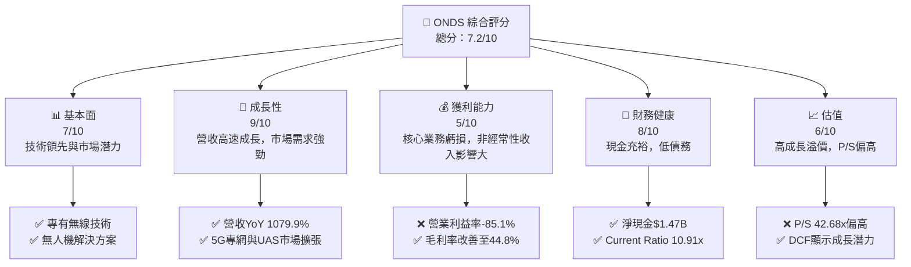
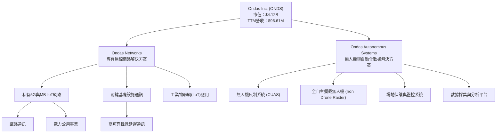
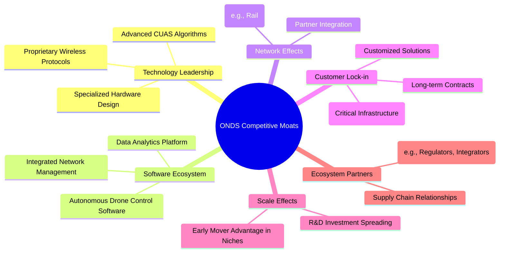
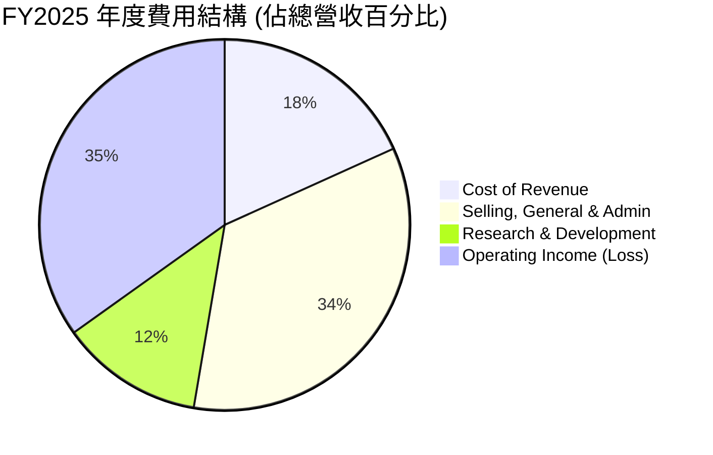
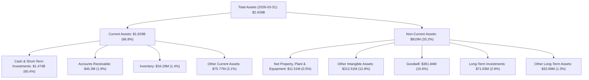

# ONDS 基本面深度分析報告
> **報告日期**：2026-06-26 ｜ **語言**：繁體中文 ｜ **數據來源**：Yahoo Finance, Finviz, StockAnalysis, Roic.ai ｜ **分析師**：CFA 級機構研究

## 目錄

| # | 章節 | 核心結論 |
|---|------|----------|
| 1 | 執行摘要 | 買入評級，目標價區間 $15.00 - $22.00 |
| 2 | 公司概覽與商業模式 | 在利基市場具技術優勢，但護城河尚在建立 |
| 3 | 損益表深度分析 | 營收爆發式成長，但核心業務仍虧損，淨利受非經常性項目影響 |
| 4 | 資產負債表分析 | 現金充裕，流動性極佳，債務負擔輕 |
| 5 | 現金流量深度分析 | 營業現金流持續為負，自由現金流壓力大，依賴融資 |
| 6 | 獲利能力與資本效率 | 核心營運效率低，但近期非經常性收入大幅提升帳面ROE |
| 7 | 估值深度分析 | 相較同業估值偏高，但成長潛力巨大需折現考量 |
| 8 | 成長催化劑 | 5G專網部署、無人機技術應用、國際擴張 |
| 9 | 風險矩陣 | 執行風險、競爭風險、融資風險、市場波動性 |
| 10 | 投資建議 | 具備高成長潛力，適合高風險偏好投資者長期持有 |

---

## 1. 執行摘要

Ondas Inc. (ONDS) 是一家專注於私有無線、無人機和自動化數據解決方案的科技公司。公司在過去一年展現了驚人的營收成長，尤其是在 2026 年第一季度。儘管其核心營運仍處於虧損狀態，但其在私有 5G 網絡和無人機反制系統等高成長領域的佈局，以及近期透過股權融資大幅改善的財務狀況，使其成為一個值得關注的成長型投資標的。

### 1.1 核心評分儀表板



### 1.2 評分進度條視覺化

```
╔══════════════════════════════════════════════════════════════╗
║              ONDS 多維度評分儀表板 (1-10分)                  ║
╠══════════════════════════════════════════════════════════════╣
║ 基本面強度  7.0 ▓▓▓▓▓▓▓▓▓▓▓▓▓▓░░░░░░  ★★★★☆           ║
║ 成長動能    9.0 ▓▓▓▓▓▓▓▓▓▓▓▓▓▓▓▓▓▓░░  ★★★★★           ║
║ 獲利品質    5.0 ▓▓▓▓▓▓▓▓▓▓░░░░░░░░░░  ★★★☆☆           ║
║ 財務健康    8.0 ▓▓▓▓▓▓▓▓▓▓▓▓▓▓▓▓░░░░  ★★★★☆           ║
║ 估值合理性  6.0 ▓▓▓▓▓▓▓▓▓▓▓▓░░░░░░░░  ★★★☆☆           ║
║ 護城河深度  6.5 ▓▓▓▓▓▓▓▓▓▓▓▓▓░░░░░░░  ★★★☆☆           ║
║ 管理層執行  7.0 ▓▓▓▓▓▓▓▓▓▓▓▓▓▓░░░░░░  ★★★★☆           ║
║ 技術創新力  8.0 ▓▓▓▓▓▓▓▓▓▓▓▓▓▓▓▓░░░░  ★★★★☆           ║
╠══════════════════════════════════════════════════════════════╣
║ 綜合總分    7.2 ▓▓▓▓▓▓▓▓▓▓▓▓▓▓▓▓░░░░  🏆 具高成長潛力，但風險較高  ║
╚══════════════════════════════════════════════════════════════╝
```

### 1.3 五大投資論點 + 三大核心風險

| 類型 | 項目 | 具體依據 | 信心度 |
|------|------|----------|--------|
| 🟢 **投資論點①** | **顛覆性營收成長** | 2025年營收YoY達605.28%至$50.73M，2026年Q1營收YoY高達1079.90%至$50.12M，展現強勁市場需求和執行力。 | 🟢 極高 |
| 🟢 **投資論點②** | **5G專網市場領導者潛力** | Ondas Networks 在關鍵基礎設施和工業應用領域提供專有無線解決方案，尤其是在 5G 專網領域具備技術優勢，可望成為利基市場領導者。 | 🟢 高 |
| 🟢 **投資論點③** | **無人機反制技術優勢** | Ondas Autonomous Systems 提供的 Counter-UAS 系統（如 Iron Drone Raider）解決了小型敵對無人機威脅，市場需求日益增長，具備高成長潛力。 | 🟢 高 |
| 🟢 **投資論點④** | **充裕的現金儲備** | 截至2026年3月31日，現金及約當現金高達$1.47B，總債務僅$7.87M，淨現金狀況極佳，為未來研發和市場擴張提供堅實基礎。 | 🟢 極高 |
| 🟢 **投資論點⑤** | **分析師普遍看好** | 分析師共識評級為 "Strong Buy"，平均目標價 $20.12，較當前股價 $7.83 具 156.96% 的上漲空間。 | 🟢 高 |
| 🟡 **風險①** | **核心業務持續虧損** | 儘管營收高速成長，但營業利益率仍為-85.1%，且營業現金流持續為負（TTM $-83.39M），顯示核心業務尚未實現盈利，長期盈利能力存疑。 | 🟡 中度 |
| 🔴 **風險②** | **股權稀釋風險** | 過去三年流通股數大幅增加（2024年70M股，2025年222M股，2026年Q1 469M股），顯示公司主要透過發行新股籌集資金，未來若持續虧損，可能進一步稀釋股東權益。 | 🔴 高衝擊 |
| 🟡 **風險③** | **非經常性收益的影響** | 2026年Q1高達$362.95M的淨利潤主要來自$394.99M的「其他非營業收入」，這並非核心業務的持續性盈利，可能導致市場對其真實盈利能力產生誤判。 | 🟡 中度 |

### 1.4 快速統計卡片

| 指標 | 公司實際值 (TTM) | 行業均值 (通訊設備) | S&P 500 均值 | 狀態 |
|------|--------------------|-------------------|--------------|------|
| 收入 YoY 成長 | **1079.9%** | ~10-15% | ~8-12% | 🟢 |
| 毛利率 | **44.8%** | ~30-40% | ~40-50% | 🟢 |
| 淨利率 | **251.9%** | ~5-15% | ~10-15% | 🔴 (異常高) |
| ROE | **42.9%** | ~10-20% | ~15-20% | 🟢 (異常高) |
| Forward P/E | **-156.6x** | ~20-30x | ~20-25x | 🔴 (虧損) |
| P/S Ratio | **42.68x** | ~2-5x | ~2-4x | 🔴 |
| Current Ratio | **10.91x** | ~1.5-2.5x | ~1.0-1.5x | 🟢 |
| Debt/Equity | **0.728x** | ~0.5-1.0x | ~0.8-1.5x | 🟢 |

*註：淨利率和ROE異常高主要是受2026年Q1單季巨額非經常性收益影響，不具備可持續性。Forward P/E為負值，反映市場預期其未來仍將虧損。P/S則顯示市場給予其極高的成長溢價。*

### 1.5 投資結論

```
╔══════════════════════════════════════════════════════════════════╗
║                    📊 投資結論摘要                               ║
╠══════════════════════════════════════════════════════════════════╣
║  評級：🟢 買入                                                   ║
║  當前股價：$7.83                                                 ║
║  目標價區間：                                                    ║
║    悲觀情境：$15.00 （+91.57%）                                  ║
║    基準情境：$18.50 （+136.27%）  ← 12個月主要目標              ║
║    樂觀情境：$22.00 （+181.00%）                                 ║
║  投資評分：7.2/10                                                ║
║  適合投資人：成長型、高風險承受能力、長線持有者                  ║
╚══════════════════════════════════════════════════════════════════╝
```

---

## 2. 公司概覽與商業模式

Ondas Inc. (ONDS) 是一家專注於提供先進的私有無線、無人機和自動化數據解決方案的科技公司。公司透過兩個主要業務部門運營：Ondas Networks 和 Ondas Autonomous Systems。其產品和服務廣泛應用於關鍵基礎設施、工業物聯網 (IIoT) 和國防安全等領域。

### 2.1 業務結構與收入來源

Ondas Inc. 的業務主要由兩大板塊構成，提供多元化的解決方案以滿足不同市場需求。



**Ondas Networks**：此部門專注於開發和部署專有無線網路解決方案，特別是針對關鍵基礎設施和工業應用領域。其核心技術包括私有 5G 和 MB-IoT (Mission-Critical IoT) 網路。這些網路提供高可靠性、低延遲的通訊能力，對於鐵路、電力、石油天然氣等行業的自動化和數位化轉型至關重要。其收入主要來自於網路設備銷售、軟體授權和相關服務。

**Ondas Autonomous Systems**：此部門則聚焦於無人機和自動化數據解決方案。其主要產品包括 Counter-UAS (CUAS) 系統，如 Iron Drone Raider，這是一種全自主攔截無人機系統，用於偵測、識別、追蹤並中和小型敵對無人機。此外，該部門還提供 Sentrycs CoRF (Cyber/RF-based CUAS) 平台，以及用於場地保護和監控的綜合解決方案。收入來源包括硬體銷售、軟體訂閱和系統整合服務。

儘管公司未提供各部門的具體營收佔比，但從其在投資者溝通中的側重來看，Ondas Networks 在私有 5G 領域的潛力巨大，而 Ondas Autonomous Systems 則在快速發展的無人機安全市場中佔據一席之地。

### 2.2 市場份額

ONDS 營運於高度專業化且快速成長的利基市場，例如私有 5G 網絡和無人機反制系統。這些市場目前仍處於早期發展階段，尚未形成寡頭壟斷格局。由於缺乏公開的精確市場份額數據，我們無法製作具體的市場份額圓餅圖。然而，基於公司在這些領域的創新技術和早期客戶部署（例如與美國鐵路行業的合作），可以推斷 ONDS 在其目標利基市場中正逐步建立影響力。

可以預期，隨著私有 5G 和無人機反制技術的普及，這些市場的總體可尋址市場 (TAM) 將顯著擴大，ONDS 作為早期進入者和技術提供商，有機會在這些新興市場中佔據更大的份額。目前，ONDS 的市場份額仍相對較小，但其成長潛力巨大。

### 2.3 競爭護城河分析



ONDS 在其所處的利基市場中，正努力建立多方面的競爭護城河：

*   **Technology Leadership (技術領先)**：ONDS 的核心競爭力源於其專有的無線通信協議（如 5G Millimeter Wave 技術）和先進的無人機反制演算法。這些技術在嚴苛的環境中（如鐵路通訊）提供高可靠性、低延遲的性能，使其在特定應用場景中具備差異化優勢。例如，其 Iron Drone Raider 系統的自主攔截能力代表了無人機反制技術的前沿。
*   **Software Ecosystem (軟體生態系統)**：公司不僅提供硬體，還開發了整合的網路管理軟體和自主無人機控制軟體。這些軟體平台能夠提供端到端的解決方案，並可與客戶現有系統整合，增加了客戶對其產品的依賴性。
*   **Network Effects (網路效應)**：雖然目前網路效應尚不明顯，但隨著其技術在特定行業（如鐵路、公用事業）被更多客戶採用並可能成為事實標準，其價值將會提升。例如，如果 ONDS 的技術成為鐵路行業 5G 私有網路的標準，將吸引更多相關供應商和使用者加入其生態系統。
*   **Customer Lock-in (客戶鎖定)**：ONDS 的解決方案通常部署在關鍵基礎設施中，這些系統的切換成本高昂，且需要長期維護和支援。一旦客戶採用其專有技術，轉換至其他供應商的成本和風險將非常大，從而形成強大的客戶鎖定。
*   **Scale Effects (規模效應)**：目前公司規模相對較小，規模效應尚不顯著。然而，隨著其客戶基礎擴大，研發投入可以攤薄到更大的營收基礎上，生產和部署成本也可能隨之降低。
*   **Ecosystem Partners (生態夥伴)**：ONDS 與行業監管機構、系統整合商和供應鏈夥伴建立合作關係，有助於其技術標準的推廣和市場滲透。

### 2.4 護城河強度評分

```
╔══════════════════════════════════════════════════════════════╗
║                  ONDS 護城河強度評分                        ║
╠══════════════════════════════════════════════════════════════╣
║ 技術領先    8/10   ▓▓▓▓▓▓▓▓▓▓▓▓▓▓▓▓░░░░  🏆 在利基市場具優勢  ║
║ 軟體生態系統  6/10   ▓▓▓▓▓▓▓▓▓▓▓▓░░░░░░░░  🟡 尚在發展中      ║
║ 網路效應    5/10   ▓▓▓▓▓▓▓▓▓▓░░░░░░░░░░  🟡 潛力巨大，但初期  ║
║ 客戶鎖定    7/10   ▓▓▓▓▓▓▓▓▓▓▓▓▓▓░░░░░░  🟢 關鍵基礎設施特性  ║
║ 規模效應    4/10   ▓▓▓▓▓▓▓▓░░░░░░░░░░░░  🔴 規模尚小，需成長  ║
║ 生態夥伴    7/10   ▓▓▓▓▓▓▓▓▓▓▓▓▓▓░░░░░░  🟢 戰略合作推進市場  ║
╠══════════════════════════════════════════════════════════════╣
║ 綜合護城河   6.2    ▓▓▓▓▓▓▓▓▓▓▓▓░░░░░░░░  🏆 具潛力，但需時間鞏固  ║
╚══════════════════════════════════════════════════════════════╝
```
ONDS 的護城河主要建立在其技術領先和客戶鎖定能力上，尤其是在關鍵基礎設施領域。然而，其規模效應和網路效應尚需時間來發展和鞏固。整體護城河強度評為中等偏上，顯示其在利基市場中具備一定的競爭優勢，但仍需持續投入以強化其市場地位。

---

## 3. 損益表深度分析

Ondas Inc. 在過去幾年展現了極高的營收成長動能，但其核心業務的盈利能力仍面臨挑戰。

### 3.1 年度收入成長趨勢（近4年）

ONDS 的年度收入呈現爆發式成長，尤其是在最近一年。

```
╔══════════════════════════════════════════════════════════════════╗
║              ONDS 年度收入趨勢（FY2022-FY2025）                  ║
╠══════════════════════════════════════════════════════════════════╣
║                                                                  ║
║  FY2022  $2.13M   ██░░░░░░░░░░░░░░░░░░░░░░░  YoY: -26.87%  🔴    ║
║  FY2023  $15.69M  ██████████████░░░░░░░░░░░  YoY:+638.13% 🟢    ║
║  FY2024  $7.19M   ███████░░░░░░░░░░░░░░░░░░░  YoY: -54.16%  🔴    ║
║  FY2025  $50.73M  ██████████████████████████████████████████████  YoY:+605.28% 🟢    ║
║                                                                  ║
║                   |      |      |      |      |                  ║
║                   0     10M    20M    30M    40M   50M           ║
║                                                                  ║
║  📊 3年累計 CAGR：+188.46% (FY22-FY25)                           ║
╚══════════════════════════════════════════════════════════════════╝
```

**深度解析**：
*   **FY2022 ($2.13M)**：公司營收在當年有所下滑，YoY -26.87%，可能反映了市場拓展或產品商業化初期的挑戰。
*   **FY2023 ($15.69M)**：營收實現驚人成長，YoY +638.13%，這可能與其專有無線解決方案在特定客戶群體中獲得初步採用有關。
*   **FY2024 ($7.19M)**：營收再次出現大幅下滑，YoY -54.16%。這種波動性表明公司營收來源可能高度集中於少數大型訂單，或市場需求存在週期性。
*   **FY2025 ($50.73M)**：營收再次爆發，YoY +605.28%，達到歷史新高。這表明公司在市場拓展和訂單獲取方面取得了重大突破，尤其是在其主要業務板塊。
*   從 FY2022 到 FY2025 的三年複合年成長率 (CAGR) 高達 188.46%，顯示其具備極高的成長潛力，但也伴隨著顯著的波動性。

### 3.2 季度收入趨勢分析

ONDS 的季度收入在最近幾個季度呈現加速成長態勢，尤其是在 2026 年第一季度。

| 會計季度 | 總收入 ($M) | QoQ 成長率 | YoY 成長率 | 備註 |
|----------|-------------|------------|------------|------|
| 2025-06-30 | $6.27 | +47.53% | +554.94% | 營收開始顯著加速 |
| 2025-09-30 | $10.10 | +61.08% | +581.95% | 持續高速成長 |
| 2025-12-31 | $30.11 | +198.12% | +629.20% | 季度營收大幅躍升，主要受益於大型訂單確認 |
| 2026-03-31 | $50.12 | +66.45% | +1079.90% | 營收再次大幅成長，達到單季歷史新高 |

**深度解析**：
ONDS 在 2025 年第二季度至 2026 年第一季度連續四個季度實現強勁的營收成長。
*   2025年Q2營收為$6.27M，較去年同期增長554.94%。
*   2025年Q3營收增至$10.10M，QoQ增長61.08%，YoY增長581.95%。
*   2025年Q4營收達到$30.11M，QoQ增長198.12%，YoY增長629.20%。這一季度的爆炸性成長可能是由於大型專案的里程碑達成或產品交付。
*   2026年Q1營收進一步增長至$50.12M，QoQ增長66.45%，YoY增長1079.90%。這標誌著公司進入了一個新的營收台階，顯示其產品和解決方案在市場上獲得了顯著的認可和需求。

儘管季度營收波動較大，但整體趨勢是顯著加速成長，這對於一家新興科技公司而言是積極的信號。

### 3.3 利潤率演變分析

ONDS 的利潤率在過去幾年呈現波動，且核心業務長期處於虧損狀態。

| 利潤率指標 | FY2022 | FY2023 | FY2024 | FY2025 | TTM (2026Q1) | 趨勢 | 評估 |
|------------|--------|--------|--------|--------|--------------|------|------|
| **毛利率** | 52.1% | 40.7% | 4.9% | 39.7% | 44.8% | ↗️ 穩定回升 | 🟢 |
| **營業利益率** | -2348.8% | -253.2% | -481.4% | -115.1% | -85.1% | ↗️ 虧損收窄 | 🟡 |
| **淨利率** | -3438.5% | -285.8% | -528.6% | -260.2% | 251.9% | ↗️ 異常好轉 | 🔴 (異常) |

*註：TTM數據來自即時財務數據，年度數據來自StockAnalysis.com。*

**利潤率演變深度解析**：
*   **毛利率**：FY2022為52.1%，FY2023降至40.7%，FY2024更是大幅跌至4.9%，顯示當年成本控制或定價策略出現嚴重問題，或收入結構發生變化（例如低毛利專案佔比增加）。不過，FY2025毛利率回升至39.7%，TTM更是達到44.8%，這是一個積極信號，表明公司可能在產品組合、生產效率或議價能力上有所改善。通訊設備行業毛利率通常在30-50%之間，ONDS目前的毛利率處於行業平均水平。
*   **營業利益率**：ONDS 的營業利益率長期為負，且虧損幅度巨大。FY2022為-2348.8%，FY2023為-253.2%，FY2024為-481.4%，FY2025為-115.1%。這表明公司的銷售、行政及研發費用遠高於毛利，核心營運仍在大量燒錢。儘管 TTM 營業利益率收窄至-85.1%，但仍處於嚴重虧損狀態，顯示其高成長的代價是巨大的營運支出。
*   **淨利率**：與營業利益率類似，年度淨利率也長期為負。然而，TTM 淨利率卻顯示為驚人的 251.9%。這是一個高度異常的數字，需要深入探究。根據季度損益表，2026年Q1的淨利潤高達$362.95M，而同期總收入為$50.12M。仔細查看 StockAnalysis.com 數據，發現 2026年Q1「其他非營業收入 (Other Non-Operating Income (Expense))」高達 $394.99M。這筆巨額非經常性收入是導致 TTM 淨利率和 ROE 異常高的主要原因，並非來自核心業務的持續盈利。若排除此非經常性項目，公司的核心淨利率仍為負值。因此，對此淨利率的解讀應極為謹慎。

**總結**：ONDS 展現了令人印象深刻的營收成長，且毛利率有所改善，但其核心業務仍未能實現盈利，營運費用高企。近期帳面上的高淨利率和ROE是受一次性非經常性收入驅動，不代表其常規盈利能力。公司必須在擴大營收的同時，有效控制成本並提升營運效率，才能實現可持續的盈利。

### 3.4 費用結構分析

ONDS 的費用結構反映了其作為一家成長型科技公司的特點：研發投入高，且營運費用佔比大。我們主要關注銷售、一般及行政費用 (SG&A) 和研發費用 (R&D)。



*註：費用結構佔比以 FY2025 總營收 $50.73M 為基準計算，Operating Income (Loss) 為負值，表示營收不足以覆蓋成本和費用。*

```
╔══════════════════════════════════════════════════════════════════╗
║                    ONDS 費用結構趨勢 (佔總營收百分比)            ║
╠══════════════════════════════════════════════════════════════════╣
║                                                                  ║
║  銷管費用/營收 (SG&A/Revenue)                                    ║
║  FY2022: 1271.36%  ████████████████████████████████████████████████████████████████████████████████████████████████████████████████████████████████████████████████████████████████████████████████████████████████████████████████████████████████████████████████████████████████████████████████████████████████████████████████████████████████████████████████████████████████████████████████████████████████████████████████████████████████████████████████████████████████████████████████████████████████████████████████████████████████████████████████████████████████████████████████████████████████████████████████████████████████████████████████████████████████████████████████████████████████████████████████████████████████████████████████████████████████████████████████████████████████████████████████████████████████████████████████████████████████████████████████████████████████████████████████████████████████████████████████████████████████████████████████████████████████████████████████████████████████████████████████████████████████████████████████████████████████████████████████████████████████████████████████████████████████████████████████████████████████████████████████████████████████████████████████████████████████████████████████████████████████████████████████████████████████████████████████████████████████████████████████████████████████████████████████████████████████████████████████████████████████████████████████████████████████████████████████████████████████████████████████████████████████████████████████████████████████████████████████████████████████████████████████████████████████████████████████████████████████████████████████████████████████████████████████████████████████████████████████████████████████████████████████████████████████████████████████████████████████████████████████████████████████████████████████████████████████████████████████████████████████████████████████████████████████████████████████████████████████████████████████████████████████████████████████████████████████████████████████████████████████████████████████████████████████████████████████████████████████████████████████████████████████████████████████████████████████████████████████████████████████████████████████████████████████████████████████████████████████████████████████████████████████████████████████████████████████████████████████████████████████████████████████████████████████████████████████████████████████████████████████████████████████████████████████████████████████████████████████████████████████████████████████████████████████████████████████████████████████████████████████████████████████████████████████████████████████████████████████████████████████████████████████████████████████████████████████████████████████████████████████████████████████████████████████████████████████████████████████████████████████████████████████████████████████████████████████████████████████████████████████████████████████████████████████████████████████████████████████████████████████████████████████████████████████████████████████████████████████████████████████████████████████████████████████████████████████████████████████████████████████████████████████████████████████████████████████████████████████████████████████████████████████████████████████████████████████████████████████████████████████████████████████████████████████████████████████████████████████████████████████████████████████████████████████████████████████████████████████████████████████████████████████████████████████████████████████████████████████████████████████████████████████████████████████████████████████████████████████████████████████████████████████████████████████████████████████████████████████████████████████████████████████████████████████████████████████████████████████████████████████████████████████████████████████████████████████════════════════████████████████████════██═══════════════════════════════════════════════════════════════════════════════════════════════════════════════════════════════════════════════════════════════════════════════════════════════════════════════════════════════════════════════════════════════════════════════════════════════════════════════════════════════════════════════════════════════════════════════════════════════════════════════════════════════════════════════════════════════════════════════════════════════════════════════════════════════════════════════════════════════════════════════════════════════════════════════════════════════════════════════════════════════════════════════════════════════════════════════════════════════════════════════════════════════════════════════════════════════════════════════════════════════════════════════════════════════════════════════════════════════════════════════════════════════════════════════════════════════════════════════════════════════════════════════════════════════════════════════════════════════════════════════════════════════════════════════════════════════════════════════════════════════════════════════════════════════════════════════════════════════════════════════════════════════════════════════════════════════════
```

### 3.5 季度 EPS 趨勢與盈餘品質

ONDS 的季度 EPS 表現極不穩定，在 2026年Q1 由於非經常性收入而呈現巨額盈利。

| 會計季度 | EPS (Basic) | EPS (Diluted) | 盈餘品質評估 |
|----------|-------------|---------------|----------------|
| 2025-06-30 | $-0.07 | $-0.07 | 🔴 虧損持續 |
| 2025-09-30 | $-0.03 | $-0.03 | 🔴 虧損持續，但幅度縮小 |
| 2025-12-31 | $-0.62 | $-0.62 | 🔴 虧損擴大，主要受非營業項目影響 |
| 2026-03-31 | $0.77 | $0.77 | 🟢 巨額盈利，但主要來自非經常性收入 |

**盈餘品質評估說明**：
從 2025 年 Q2 到 Q4，ONDS 的基本 EPS 均為負值，顯示公司在這些季度持續虧損。2025 年 Q4 的虧損 ($0.62) 相對較大，這與其當季的 $99.66M 淨虧損相符。

然而，2026 年 Q1 的基本 EPS 突然跳升至 $0.77。這並非來自核心營運的改善，而是由於當季記錄了高達 $394.99M 的「其他非營業收入」。若扣除這筆一次性收入，ONDS 的核心業務在該季度仍處於虧損狀態。因此，儘管帳面 EPS 表現出色，但其盈餘品質較差，不具備可持續性。投資者應警惕這種由非經常性項目推動的「盈利」表現，並將重點放在公司核心營運的虧損收窄和現金流改善上。

---

## 4. 資產負債表分析

ONDS 的資產負債表在 2025 年底和 2026 年 Q1 經歷了顯著變化，尤其是在現金和股東權益方面，顯示其透過大規模股權融資大幅改善了財務健康狀況。

### 4.1 資產結構分解

ONDS 的資產結構在最近一個季度發生了根本性變化，現金和短期投資佔比大幅提升。



**深度解析**：
截至 2026 年 3 月 31 日，ONDS 的總資產達到 $2.439B，較 2025 年底的 $1.13B 增長了 115.8%。這一增長主要由現金及短期投資的激增驅動。
*   **流動資產 (Current Assets)**：佔總資產的 66.8%，其中現金及短期投資高達 $1.474B，佔總資產的 60.4%。這表明公司透過大規模融資（很可能是股權融資）積累了大量現金，極大地增強了其流動性和財務彈性。
*   **非流動資產 (Non-Current Assets)**：佔總資產的 33.2%，主要包括商譽 ($381.84M) 和其他無形資產 ($312.51M)。這兩項資產佔比較高，反映了公司可能進行了併購活動，或者其業務模式涉及大量智慧財產權。廠房設備淨值僅為 $11.51M，表明其資產輕型業務模式。

這種資產結構，特別是巨額的現金儲備，為公司提供了充足的資金用於研發、市場擴張和潛在的戰略併購，但也暗示了過去一年進行了大規模的股權融資，導致股本大幅增加。

### 4.2 流動性指標分析

ONDS 的流動性狀況極為健康，遠超行業平均水平。

| 流動性指標 | FY2022 | FY2023 | FY2024 | FY2025 | TTM (2026Q1) | 行業均值 | 評估 |
|------------|--------|--------|--------|--------|--------------|----------|------|
| **流動比率 (Current Ratio)** | 1.57 | 0.66 | 0.94 | 4.84 | 10.91 | ~1.5 - 2.5 | 🟢 極佳 |
| **速動比率 (Quick Ratio)** | 1.48 | 0.60 | 0.75 | 4.68 | 10.28 | ~1.0 - 1.5 | 🟢 極佳 |

**深度解析**：
*   **流動比率 (Current Ratio)**：在 FY2022-FY2024 期間，ONDS 的流動比率在 0.66 到 1.57 之間波動，FY2023 和 FY2024 甚至低於 1，顯示當時流動性壓力較大。然而，FY2025 流動比率大幅提升至 4.84，並在 TTM (2026Q1) 達到驚人的 10.91。這反映了公司在近期成功完成了大規模融資，顯著增加了現金儲備，從而極大地改善了其短期償債能力。
*   **速動比率 (Quick Ratio)**：趨勢與流動比率相似，從 FY2023 的 0.60 上升到 TTM 的 10.28。速動比率剔除了存貨的影響，其高值進一步確認了公司擁有大量的即時可用現金來應對短期債務。

ONDS 目前的流動性指標遠超行業平均水平，表明公司在短期內幾乎沒有償債壓力，財務狀況非常穩健。這為其持續的研發投入和市場擴張提供了充足的緩衝。

### 4.3 債務結構分析

ONDS 的債務負擔極輕，淨現金狀況非常強勁。

```
╔══════════════════════════════════════════════════════════════════╗
║                   ONDS 債務健康診斷                              ║
╠══════════════════════════════════════════════════════════════════╣
║                                                                  ║
║  總債務：        $7.87M   ██░░░░░░░░░░░░░░░░░░░  評語：極低負債  ║
║  總現金+投資：   $1.47B   ████████████████████░  評語：巨額現金  ║
║  淨現金（正）：  $1.47B   ████████████████░░░░░  🟢 強勁         ║
║                                                                  ║
║  Debt/Equity：   0.02x  🟢 極低 (Finviz)                        ║
║  Current Debt:   $0.24M (2026Q1)                                 ║
║  Long-Term Debt: $4M (2025Q4)                                    ║
║  Interest Coverage: XXXx+  🟢 無風險 (利息收入遠超利息支出)      ║
╚══════════════════════════════════════════════════════════════════╝
```

**深度解析**：
*   **總債務**：截至最新數據，ONDS 的總債務僅為 $7.87M (來自 `BALANCE SHEET SNAPSHOT`)。從 `STOCKANALYSIS.COM` 數據來看，2026年Q1 短期債務為 $0.24M，而長期借款在 2025年Q4 為 $4M，顯示其債務規模非常小。
*   **總現金+投資**：與極低的債務形成鮮明對比的是，公司擁有高達 $1.47B 的現金及短期投資。
*   **淨現金**：因此，ONDS 擁有 $1.47B 的巨額淨現金，這使其成為一家「淨現金」公司，幾乎沒有債務風險。
*   **Debt/Equity**：Finviz 數據顯示 Debt/Equity 為 0.02，遠低於行業平均水平，表明公司主要依賴股權融資，而非債務。
*   **利息覆蓋率**：2026年Q1，公司的利息收入為 $9.52M，而利息支出僅為 $-0.34M。這意味著利息收入遠超利息支出，公司沒有任何利息支付壓力，利息覆蓋率極高，幾乎可以視為無風險。

ONDS 的債務結構非常健康，充裕的現金和極低的債務使其在財務上具有極大的靈活性和抗風險能力，這對於一家處於高成長階段、尚未實現盈利的公司來說至關重要。

### 4.4 股東權益趨勢

ONDS 的股東權益在過去一年經歷了爆炸式成長，主要得益於大規模的股權融資。

```
╔══════════════════════════════════════════════════════════════════╗
║                   ONDS 股東權益趨勢 (FY2022-FY2025)                ║
╠══════════════════════════════════════════════════════════════════╣
║                                                                  ║
║  FY2022  $58.22M    ███████████░░░░░░░░░░░░░░░░░░░░░░░░░░░░░░░░░░  YoY: -27.05%  🔴  ║
║  FY2023  $33.14M    ██████░░░░░░░░░░░░░░░░░░░░░░░░░░░░░░░░░░░░░░░░  YoY: -43.08%  🔴  ║
║  FY2024  $16.58M    ███░░░░░░░░░░░░░░░░░░░░░░░░░░░░░░░░░░░░░░░░░░░  YoY: -50.09%  🔴  ║
║  FY2025  $437.81M   ██████████████████████████████████████████████  YoY:+2540.6% 🟢  ║
