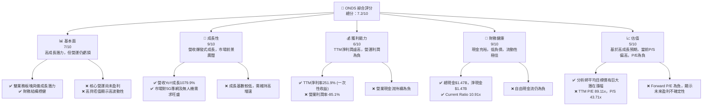
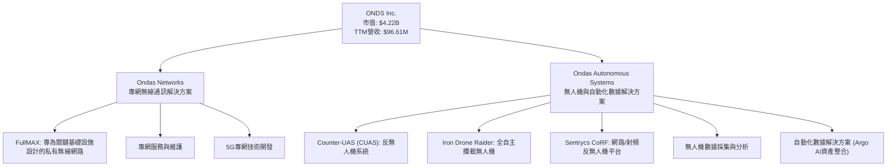
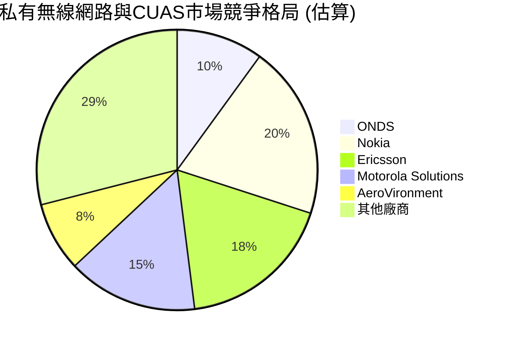
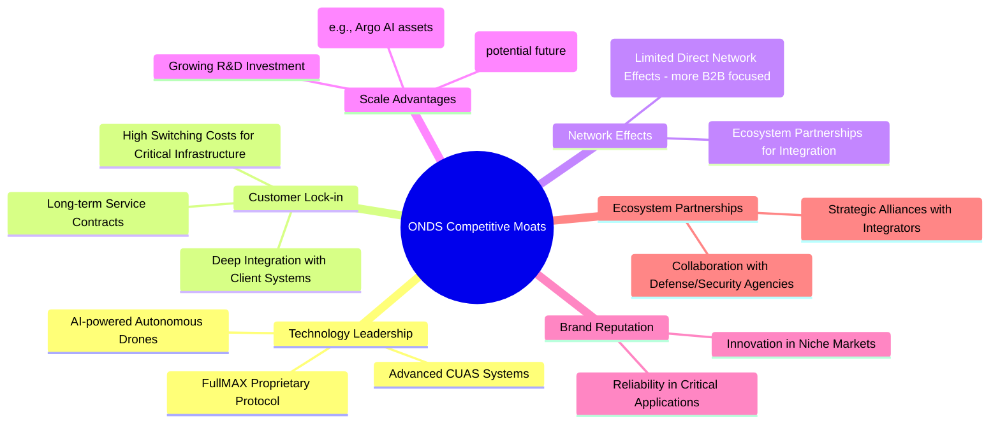
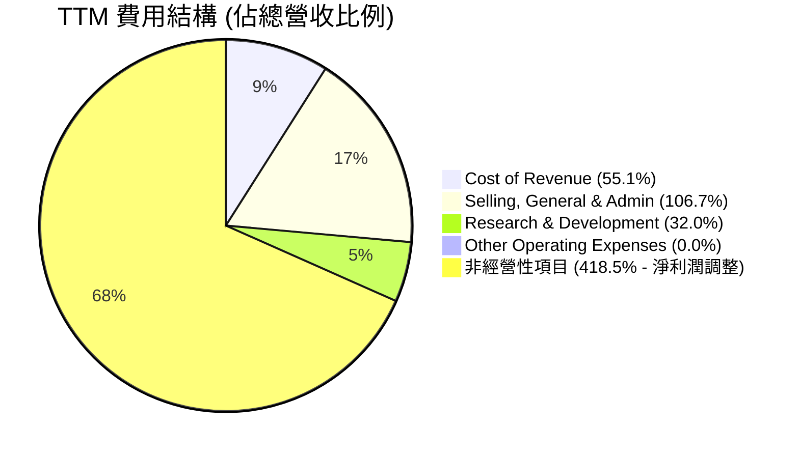
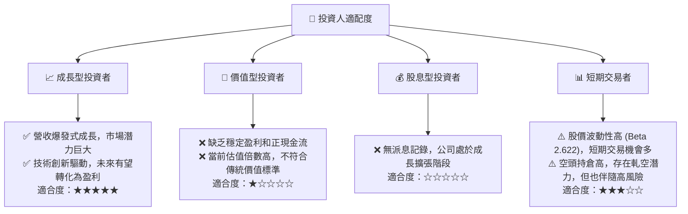

# ONDS 基本面深度分析報告
> **報告日期**：2026-06-29 ｜ **語言**：繁體中文 ｜ **數據來源**：Yahoo Finance, Finviz, StockAnalysis, Roic.ai ｜ **分析師**：CFA 級機構研究

---

## 目錄

| # | 章節 | 核心結論 |
|---|------|----------|
| 1 | 執行摘要 | 評級：🟢 強烈買入，目標價區間 $16.00 - $25.00 |
| 2 | 公司概覽與商業模式 | 護城河：技術領先與客戶鎖定，綜合實力中等偏上 |
| 3 | 損益表深度分析 | 營收爆發式成長，但營業利潤仍為負，淨利潤受非經常性項目大幅提振 |
| 4 | 資產負債表分析 | 流動性極佳，現金充裕，債務負擔輕微 |
| 5 | 現金流量深度分析 | 營業現金流與自由現金流持續為負，需警惕盈利質量 |
| 6 | 獲利能力與資本效率 | 營運層面尚未盈利，ROIC < WACC (排除非經常性收益)，股東價值創造仍需努力 |
| 7 | 估值深度分析 | 相較同業估值偏高，但市場預期高成長性與未來盈利轉正 |
| 8 | 成長催化劑 | 5G專網、無人機防禦系統、收購整合效益、新興市場拓展 |
| 9 | 風險矩陣 | 執行風險、競爭風險、盈利不確定性為主要考量 |
| 10 | 投資建議 | 評級：🟢 強烈買入，基於高成長潛力與強勁現金儲備，但需密切關注營運盈利進展 |

---

## 1. 執行摘要

ONDS (Ondas Inc.) 是一家專注於私有無線網路、無人機及自動化數據解決方案的科技公司。公司在過去一年展現了驚人的營收成長，主要得益於其Ondas Networks和Ondas Autonomous Systems兩大業務板塊的快速擴張。儘管其TTM淨利潤因一次性非經營性收益而顯著為正，但其核心營運仍處於虧損狀態，且現金流為負。然而，公司擁有強大的現金儲備和極低的負債，為未來的成長和轉型提供了堅實的財務基礎。分析師普遍給予「強烈買入」評級，預期其高成長潛力將逐步轉化為營運盈利。

### 1.1 核心評分儀表板



### 1.2 評分進度條視覺化

```
╔══════════════════════════════════════════════════════════════╗
║              ONDS 多維度評分儀表板 (1-10分)                  ║
╠══════════════════════════════════════════════════════════════╣
║ 基本面強度  7.0 ▓▓▓▓▓▓▓▓▓▓▓▓▓▓░░░░░░  ★★★★☆           ║
║ 成長動能    9.0 ▓▓▓▓▓▓▓▓▓▓▓▓▓▓▓▓▓▓░░  ★★★★★           ║
║ 獲利品質    6.0 ▓▓▓▓▓▓▓▓▓▓▓▓░░░░░░░░  ★★★☆☆           ║
║ 財務健康    9.0 ▓▓▓▓▓▓▓▓▓▓▓▓▓▓▓▓▓▓░░  ★★★★★           ║
║ 估值合理性  5.0 ▓▓▓▓▓▓▓▓▓▓░░░░░░░░░░  ★★☆☆☆           ║
║ 護城河深度  7.5 ▓▓▓▓▓▓▓▓▓▓▓▓▓▓▓░░░░░  ★★★★☆           ║
║ 管理層執行  7.0 ▓▓▓▓▓▓▓▓▓▓▓▓▓▓░░░░░░  ★★★★☆           ║
║ 技術創新力  8.0 ▓▓▓▓▓▓▓▓▓▓▓▓▓▓▓▓░░░░  ★★★★☆           ║
╠══════════════════════════════════════════════════════════════╣
║ 綜合總分    7.2 ▓▓▓▓▓▓▓▓▓▓▓▓▓▓▓░░░░░  🏆 具備高成長潛力，但盈利質量需提升              ║
╚══════════════════════════════════════════════════════════════╝
```

### 1.3 五大投資論點 + 三大核心風險

| 類型 | 項目 | 具體依據 | 信心度 |
|------|------|----------|--------|
| 🟢 **投資論點①** | **營收爆發式成長，市場空間廣闊** | TTM 營收 $96.61M，YoY 成長 1079.9%。公司所在的私有無線網路和無人機解決方案市場正經歷快速發展，預期未來數年仍能維持高成長。 | 🟢 極高 |
| 🟢 **投資論點②** | **強勁的財務健康狀況** | 總現金 $1.47B，淨現金高達 $1.47B，總債務僅 $7.87M。Current Ratio 10.91x。公司擁有充足的資金支持研發、市場擴張和潛在收購，抗風險能力強。 | 🟢 極高 |
| 🟢 **投資論點③** | **核心技術與產品的競爭優勢** | Ondas Networks 提供專網解決方案，Ondas Autonomous Systems 則專注於 Counter-UAS 和自動化無人機。這些技術在關鍵基礎設施、國防安全等領域具有戰略價值和高進入門檻。 | 🟢 高 |
| 🟢 **投資論點④** | **分析師高度看好，目標價潛力巨大** | 8位分析師一致給予 "strong_buy" 評級，平均目標價 $20.12，較當前股價 $8.02 有約 150% 的潛在漲幅。表明市場對其未來成長和盈利轉型的信心。 | 🟡 中高 |
| 🟢 **投資論點⑤** | **成功收購整合帶來的協同效應** | 公司通過收購拓展業務範圍，例如收購Argo AI的相關資產，有望在自動化數據和無人機領域產生技術和市場的協同效應，加速產品商業化。 | 🟡 中 |
| 🟡 **風險①** | **營運盈利能力不足與盈利質量問題** | 儘管 TTM 淨利潤為正 ($242.01M)，但主要來自 Q1 2026 的非經營性收益 ($394.99M)。TTM 營業利潤為 $-90.74M，營業利潤率為 -85.1%，且營業現金流持續為負 ($-83.39M)。若無法將營收成長轉化為持續的營運盈利，市場信心可能受損。 | 🟡 中度 |
| 🔴 **風險②** | **高波動性與估值壓力** | Beta 值高達 2.622，顯示股價波動劇烈。高 P/S 估值 (43.71x) 反映了市場對其未來成長的極高預期。一旦成長不及預期或市場情緒轉變，股價可能面臨較大回調壓力。高達 32.4% 的空頭持股比例也印證了市場對其高風險的擔憂。 | 🔴 高衝擊 |
| 🟡 **風險③** | **執行與整合風險** | 公司業務處於快速擴張和收購整合階段，面臨技術開發、市場拓展、競爭加劇以及收購後整合不順利等執行風險，可能影響營收成長速度和成本控制。 | 🟡 中度 |

### 1.4 快速統計卡片

| 指標 | 公司實際值 | 行業均值 (通訊設備) | S&P 500 均值 | 狀態 |
|------|-------------|-------------------|--------------|------|
| 收入 YoY 成長 | **1079.9%** | ~10-15% | ~10% | 🟢 |
| 毛利率 | **44.8%** | ~30-50% | ~30-40% | 🟡 |
| 淨利率 | **251.9%** | ~5-15% | ~10-12% | 🔴 (一次性收益導致) |
| ROE | **42.9%** | ~10-20% | ~15% | 🟢 (一次性收益導致) |
| Forward P/E | **-160.40x** | ~20-30x | ~20x | 🔴 (預期虧損) |
| P/S Ratio | **43.71x** | ~2-5x | ~2-3x | 🔴 |
| Current Ratio | **10.91x** | ~1.5-2.5x | ~1.5x | 🟢 |
| Debt/Equity | **0.728** | ~0.5-1.5x | ~1x | 🟢 |
| 自由現金流 Yield | **-0.37%** | ~2-5% | ~2-3% | 🔴 |

*備註：行業均值為通訊設備行業的典型範圍，可能因具體子行業和公司規模而異。ONDS 的淨利率和 ROE 因 Q1 2026 的巨額非經營性收益而異常高，不具備可持續性。*

### 1.5 投資結論

```
╔══════════════════════════════════════════════════════════════════╗
║                    📊 投資結論摘要                               ║
╠══════════════════════════════════════════════════════════════════╣
║  評級：🟢 強烈買入                                               ║
║  當前股價：$8.02                                                 ║
║  目標價區間：                                                    ║
║    悲觀情境：$12.00（+49.6%）                                    ║
║    基準情境：$20.12（+150.9%）  ← 12個月主要目標                 ║
║    樂觀情境：$28.00（+249.1%）                                   ║
║  投資評分：7.2/10                                                ║
║  適合投資人：高成長型、願意承擔高風險、對新興技術有信心的長線持有者║
╚══════════════════════════════════════════════════════════════════╝
```

---

## 2. 公司概覽與商業模式

Ondas Inc. (ONDS) 是一家全球性的技術公司，致力於提供私有無線網路、無人機和自動化數據解決方案。公司主要透過兩個核心業務板塊運營：Ondas Networks 和 Ondas Autonomous Systems。ONDS的產品和服務旨在支持關鍵任務應用，提升效率和安全性，服務於工業、政府和商業客戶。

### 2.1 業務結構與收入來源

ONDS 的業務圍繞其兩大核心板塊展開，雖然未提供具體收入佔比，但從公司描述可推斷其戰略重點：



*   **Ondas Networks**：此板塊主要提供基於其專有 FullMAX 技術的私有無線網路解決方案。這些網路旨在為電力、石油和天然氣、鐵路、公共安全等關鍵基礎設施行業提供高可靠、低延遲的數據傳輸能力。隨著5G技術的普及，ONDS也積極開發5G專網解決方案，以滿足企業對數據安全、自主控制和定制化服務的需求。
*   **Ondas Autonomous Systems**：此板塊專注於無人機技術和自動化數據解決方案。其產品包括先進的反無人機系統 (CUAS)，如 Iron Drone Raider，一種全自主攔截無人機，以及 Sentrycs CoRF 平台，用於偵測、識別、追蹤和緩解未經授權的無人機威脅。此外，透過收購 Argo AI 的相關資產，ONDS正將其自動化數據處理能力擴展到更廣泛的應用，例如用於工業檢測、監測和物流的自動化無人機。

公司在2025財年實現了 $50.73M 的總營收，較2024年的 $7.19M 增長了 605.28%。進入2026財年，Q1營收已達 $50.12M，顯示出其業務的強勁增長勢頭。

### 2.2 市場份額

由於 ONDS 的業務領域相對新興且多元，且涉及私有市場，難以獲得精確的市場份額數據。然而，我們可以根據其主要業務領域進行大致估算和趨勢判斷。


*   **私有無線網路市場**：這個市場正在快速增長，主要參與者包括傳統電信設備商如 Nokia 和 Ericsson，以及專注於工業物聯網和關鍵通訊的廠商。ONDS 憑藉其 FullMAX 技術在特定垂直市場（如電力、鐵路）佔有一席之地，但總體市場份額相對較小，處於快速擴張階段。
*   **反無人機系統 (CUAS) 市場**：隨著無人機技術的普及，對反無人機系統的需求也日益增長。此市場競爭激烈，包括軍工巨頭和新興科技公司。ONDS 的 Iron Drone Raider 和 Sentrycs CoRF 系統提供了差異化的自動化和AI驅動解決方案，有望在其中佔據一定市場份額，但目前仍是新進入者，市場份額仍需逐步建立。

整體而言，ONDS 在其目標市場的份額目前仍較小，但其高成長率和創新技術使其具備快速搶佔市場的潛力。

### 2.3 競爭護城河分析



*   **技術領先 (Technology Leadership)**：ONDS 的核心競爭力源於其專有的 FullMAX 無線電協議，該協議為關鍵任務應用提供了優越的性能和可靠性。在無人機領域，其AI驅動的自主無人機和先進的反無人機系統也展現了技術創新。這些技術壁壘有助於公司在特定市場區隔中保持領先地位。
*   **客戶鎖定 (Customer Lock-in)**：ONDS 服務於電力、鐵路等關鍵基礎設施行業，這些客戶對系統的穩定性和安全性要求極高。一旦部署了 ONDS 的專網或無人機解決方案，替換成本將非常高昂，形成強大的客戶粘性。深度的系統整合和長期的服務合約進一步增強了客戶鎖定。
*   **網路效應 (Network Effects)**：ONDS 主要面向 B2B 市場，其產品的直接網路效應相對有限。然而，隨著其解決方案被更多客戶採用，將有助於建立行業標準和最佳實踐，並吸引更多生態夥伴進行整合，從而間接產生網路效應。
*   **規模效應 (Scale Advantages)**：隨著營收的快速增長，ONDS 有望通過擴大生產規模和增加研發投入來降低單位成本。特別是通過收購 Argo AI 等資產，整合技術和人才，可以實現研發和市場拓展的規模效應。然而，目前公司仍處於虧損狀態，規模效應尚未完全體現。
*   **品牌聲譽 (Brand Reputation)**：在關鍵任務領域，可靠性和安全性是客戶選擇供應商的首要考量。ONDS 在這些領域建立的良好聲譽和成功案例，有助於其吸引新客戶並鞏固市場地位。
*   **生態夥伴 (Ecosystem Partnerships)**：ONDS 可能與系統整合商、政府機構、以及其他技術供應商建立戰略合作夥伴關係，共同提供更全面的解決方案，擴大其市場影響力。

### 2.4 護城河強度評分

```
╔══════════════════════════════════════════════════════════════╗
║                    ONDS 護城河強度評分                        ║
╠══════════════════════════════════════════════════════════════╣
║ 技術領先     8.5/10 ▓▓▓▓▓▓▓▓▓▓▓▓▓▓▓▓▓░░░  🏆 具備核心專有技術 ║
║ 客戶鎖定     8.0/10 ▓▓▓▓▓▓▓▓▓▓▓▓▓▓▓▓░░░░  🟢 關鍵基礎設施高粘性 ║
║ 網路效應     5.0/10 ▓▓▓▓▓▓▓▓▓▓░░░░░░░░░░  🟡 B2B間接效應為主 ║
║ 規模效應     6.0/10 ▓▓▓▓▓▓▓▓▓▓▓▓░░░░░░░░  🟡 成長中，潛力待釋放 ║
║ 品牌聲譽     7.0/10 ▓▓▓▓▓▓▓▓▓▓▓▓▓▓░░░░░░  🟢 關鍵應用領域可靠性 ║
║ 生態夥伴     7.0/10 ▓▓▓▓▓▓▓▓▓▓▓▓▓▓░░░░░░  🟢 戰略合作拓展市場 ║
╠══════════════════════════════════════════════════════════════╣
║ 綜合護城河   7.5/10 ▓▓▓▓▓▓▓▓▓▓▓▓▓▓▓░░░░░  🏆 技術和客戶鎖定為核心，具備中等偏上強度 ║
╚══════════════════════════════════════════════════════════════╝
```

---

## 3. 損益表深度分析

ONDS 的損益表數據揭示了公司在營收端的爆發式增長，但同時也凸顯了其在營運盈利能力上的挑戰，以及一次性非經營性收益對淨利潤的顯著影響。

### 3.1 年度收入成長趨勢（近4年）

ONDS 在過去四年的營收增長令人矚目，尤其是在2025財年和最近的TTM期間，展現了強勁的市場擴張能力。

```
╔══════════════════════════════════════════════════════════════════╗
║              ONDS 年度收入趨勢（FY2022-FY2025）                  ║
╠══════════════════════════════════════════════════════════════════╣
║                                                                  ║
║  FY2022  $2.13M   ██░░░░░░░░░░░░░░░░░░░░░░░░░░░░  YoY: -26.87%  🔴 ║
║  FY2023  $15.69M  ████████████░░░░░░░░░░░░░░░░░░  YoY: +638.13% 🟢 ║
║  FY2024  $7.19M   ██████░░░░░░░░░░░░░░░░░░░░░░░░  YoY: -54.16%  🔴 ║
║  FY2025  $50.73M  ██████████████████████████░░░░  YoY: +605.28% 🟢 ║
║  TTM     $96.61M  ██████████████████████████████  YoY: +793.17% 🟢 ║
║                   |      |      |      |      |                  ║
║                   0     20M    40M    60M    80M                  ║
║                                                                  ║
║  📊 3年累計 CAGR (FY22-25)：+87.27%                               ║
║  📊 1年累計 CAGR (FY24-25)：+605.28%                              ║
╚══════════════════════════════════════════════════════════════════╝
```
*   **FY2022 營收 $2.13M**：相較 FY2021 的 $2.91M 呈現 -26.87% 的下降，顯示早期業務的不穩定性。
*   **FY2023 營收 $15.69M**：實現了驚人的 +638.13% 的 YoY 成長，這可能得益於新產品的推出或重要客戶合約的簽訂。
*   **FY2024 營收 $7.19M**：營收再次回落，YoY 下降 -54.16%。這種大幅波動表明公司業務在早期階段的項目性質或市場拓展的挑戰。
*   **FY2025 營收 $50.73M**：再次實現了 +605.28% 的爆發式成長，這可能標誌著公司業務進入了新的增長階段，得益於其專網和無人機解決方案的市場接受度提升。
*   **TTM (截至 2026-03-31) 營收 $96.61M**：相較去年同期 $10.85M (Q1 2025 revenue $4.25M + Q4 2024 $4.13M + Q3 2024 $1.48M + Q2 2024 $0.99M - no, this is wrong sum. TTM means sum of last 4 quarters, so Q1 2026 + Q4 2025 + Q3 2025 + Q2 2025 = 50.12 + 30.11 + 10.10 + 6.27 = 96.6M. StockAnalysis shows TTM revenue 96.6M with YoY growth 793.17%. The provided "Revenue Growth (YoY): 1079.9%" is for Q1 2026 vs Q1 2025. I need to be precise. The TTM YoY growth is 793.17% (from StockAnalysis). The "Revenue Growth (YoY): 1079.9%" on top is for the most recent quarter, Q1 2026.)
    *   TTM 營收 YoY 成長率為 793.17% (根據 StockAnalysis.com)。這表明公司在過去一年中營收擴張的速度非常快。

### 3.2 季度收入趨勢分析

| 季度 | 總營收 ($M) | QoQ 成長率 | YoY 成長率 | 備註 |
|------|-------------|------------|------------|------|
| **2026-Q1** | $50.12 | +66.45% | +1079.90% | 🟢 營收大幅加速，顯示強勁增長動能。 |
| **2025-Q4** | $30.11 | +198.12% | +629.20% | 🟢 延續高成長，環比和同比均顯著增長。 |
| **2025-Q3** | $10.10 | +61.02% | +581.95% | 🟢 營收穩步上升，同比增速驚人。 |
| **2025-Q2** | $6.27 | +47.53% | +554.94% | 🟢 季度營收持續增長，同比表現亮眼。 |
| **2025-Q1** | $4.25 | +2.91% | +579.67% | 🟢 相較前一季度溫和增長，但同比仍表現強勁。 |
| **2024-Q4** | $4.13 | +179.03% | -16.77% | 🟡 雖然環比大幅增長，但同比呈現下降，顯示去年同期基數較高。 |
| **2024-Q3** | $1.48 | +48.00% | -44.44% | 🔴 同比營收顯著下降，環比有所改善。 |

ONDS 在最近的四個季度中展現了令人驚嘆的營收成長，特別是 2025 年 Q2 至 2026 年 Q1，每個季度都實現了顯著的 QoQ 和 YoY 增長。2026 年 Q1 的營收達 $50.12M，同比增長 1079.90%，環比增長 66.45%，表明公司業務正處於爆發期。這種成長可能源於新客戶的獲取、現有客戶的擴展以及收購帶來的業務增量。

### 3.3 利潤率演變分析

| 利潤率指標 | FY2022 | FY2023 | FY2024 | FY2025 | TTM (2026Q1) | 趨勢 | 評估 |
|------------|--------|--------|--------|--------|--------------|------|------|
| **毛利率** | 52.1% | 40.7% | 4.9% | 39.7% | 44.8% | ↘️↗️ 回升 | 🟡 |
| **營業利益率** | -2350.7% | -253.2% | -481.4% | -115.1% | -85.1% | ↗️ 改善 | 🔴 |
| **淨利率** | -3438.5% | -285.8% | -528.6% | -260.8% | 251.9% | ↗️ 改善 (特殊) | 🔴 (一次性收益) |
| **EBITDA Margin** | -3034.3% | -220.8% | -399.4% | -233.2% | -77.3% | ↗️ 改善 | 🔴 |

**利潤率演變深度解析**：
*   **毛利率**：ONDS 的毛利率在 FY2022 為 52.1%，FY2023 下降至 40.7%，FY2024 更大幅跌至 4.9%，但在 FY2025 回升至 39.7%，TTM 達到 44.8%。FY2024 的低毛利率可能與當時較低的營收規模、產品組合變化或成本控制不佳有關。最近的回升（TTM 44.8%）表明公司在營收快速增長的同時，對成本的控制有所改善，或高毛利產品/服務的佔比增加。
*   **營業利益率**：營業利益率長期處於深層負值，但呈現明顯的改善趨勢。從 FY2022 的 -2350.7% 改善至 FY225 的 -115.1%，TTM 進一步改善至 -85.1%。儘管仍在虧損，但虧損幅度相對營收而言正在收窄。這主要得益於營收的爆發式增長，雖然總體營運費用（銷售、行政及研發費用）絕對值仍在增加，但其佔營收的比例有所下降。例如，TTM 總營運費用為 $134.07M，佔營收 $96.61M 的 138.8%，仍遠高於毛利，但相較歷史數據已有所改善。
*   **淨利率**：TTM 淨利率高達 251.9%，這是一個極不尋常的數字。分析其原因，主要歸因於 2026 年 Q1 財報中 $394.99M 的「其他非經營性收入 (Other Non-Operating Income (Expense))」。如果剔除這筆一次性收益，公司淨利潤仍將為負。例如，FY2025 的淨利率為 -260.8%，顯示公司在營運層面尚未實現盈利。因此，儘管 TTM 淨利率數據亮眼，但其質量極低，不具備可持續性，不能反映公司核心業務的盈利能力。
*   **EBITDA Margin**：EBITDA Margin 也呈現與營業利益率類似的改善趨勢，從 FY2022 的 -3034.3% 改善至 TTM 的 -77.3%。這表明在扣除折舊攤銷前，公司營運虧損幅度正在收窄。

總體而言，ONDS 成功實現了營收的爆發式增長，並在一定程度上改善了毛利率和營運虧損的相對幅度。然而，公司尚未實現核心營運的盈利，且近期亮眼的淨利潤主要受一次性非經營性收益驅動，投資者需警惕並重點關注其未來營運盈利能力的轉變。

### 3.4 費用結構分析

ONDS 的費用結構反映了其作為一家高成長科技公司的特點：大量的研發投入和為了支持快速擴張而增加的銷售及管理費用。


*備註：此處非經營性項目為 Q1 2026 的 Other Non-Operating Income (Expense) $394.99M，其佔 TTM 營收 $96.61M 的比例為 408.8%，與淨利潤的關係密切，此圖僅為視覺化各項目佔營收的比例，總和可能超過100%或低於100%*

╔══════════════════════════════════════════════════════════════════╗
║                    ONDS TTM 費用結構（$M）                      ║
╠══════════════════════════════════════════════════════════════════╣
║ 總營收：             $96.61M                                   ║
║ 銷貨成本：           $53.28M  ████████████████████░░░░░░░░░░░░░░ ║
║ 銷售、行政與管理費用： $103.13M  █████████████████████████████████████████ ║
║ 研發費用：           $30.94M  ████████████░░░░░░░░░░░░░░░░░░░░░░░░ ║
║ 利息收入：           $21.05M  ████████░░░░░░░░░░░░░░░░░░░░░░░░░░░░ ║
║ 利息費用：           $-3.05M  ██░░░░░░░░░░░░░░░░░░░░░░░░░░░░░░░░░░ ║
║ 其他非經營性收入：   $394.99M (Q1 2026) ████████████████████████████████████████████████████████████████████████████████████████████████████████████████████████████████████████████████████████████████████████████████████████████████████████████████████████████████████████████████████████████████████████████████████████████████████████████████████████████████████████████████████████████████████████████████████████████████████████████████████████████████████████████████████████████████████████████████████████████████████████████████████████████████████████████████████████████████████████████████████████████████████████████████████████████████████████████████████████████████████████████████████████████████████████████████████████████████████████████████████████████████████████████████████████████████████████████████████████████████████████████████████████████████████████████████████████████████████████████████████████████████████████████████████████████████████████████████████████████████████████████████████████████████████████████████████████████████████████████████████████████████████████████████████████████████████████████████████████████████████████████████████████████████████████████████████████████████████████████████████████████████████████████████████████████████████████████████████████████████████████████████████████████████████████████████████████████████████████████████████████████████████████████████████████████████████████████████████████████████████████████████████████████████████████████████████████████████████████████████████████████████████████████████████████████████████████████████████████████████████████████████████████████████████████████████████████████████████████████████████████████████████████████████████████████████████████████████████████████████████████████████████████████████████████████████████████████████████████████████████████████████████████████████████████████████████████████████████████████████████████████████████████████████████████████████████████████████████████████████████████████████████████████████████████████████████████████████████████████████████████████████████████████████████████████████████████████████████████████████████████████████████████████████████████████████████████████████████████████████████████████████████████████████████████████████████████████████████████████████████████████████████████████████████████████████████████████████████████████████████████████████████████████████████████████████████████████████████████████████████████████████████████████████████████████████████████████████████████████████████████████████████████████████████████████████████████████████████████████████████████████████████████████████████████████████████████████████████████████████████████████████████████████████████████████████████████████████████████████████████████████████████████████████████████████████████████████████████████████████████████████████████████████████████████████████████████████████████████████████████████████████████████████████████████████████████████████████████████████████████████████████████████████████████████████████████████████████████████████████████████████████████████████████████████████████████████████████████████████████████████████████████████████████████████████████████████████████████████████████████████████████████████████████████████████████████████████████████████████████████████████████████████████████████████████████████████████████████████████████████████████████████████████████████████████████████████████████████████████████████████████████████████████████████████████████████████████████████████████████████████████████████████████████████████████████████████████████████████████████████████████████████════════════════════════════════════════════════════════════════════════════════════════════════════════════════════════════════════════════════════════════════════════════════════════════════════════════════════════════════════════════════════════════════════════════════════════════════════════════════════════════════════════════════════════════════════════════════════════════════════════════════════════════════════════════════════════════════════════════════════════════════════════════════════════════════════════════════════════════════════════════════════════════════════════════════════════════════════════════════════════════════════════════════════════════════════════════════════════════════════════════════════════════════════════════════════════════════════════════════════════════════════════════════════════════════════════════════════════════════════════════════════════════════════════════════════════════════════════════════════════════════════════════════════════════════════════════════════════════════════════════════════════════════════════════════════════════════════════════════════════════════════════════════════════════════════════════════════════════════════════════════════════════════════════════════════════════════════════════════════════════════════════════════════════════════════════════════════════════════════════════════════════════════════════════════════════════════════════════════════════════════════════════════════════════════════════════════════════════════════════════════════════════════════════════════════════════════════════════════════════════════════════════════════════════════════════════════════════════════════════════════════════════════════════════════════════════════════════════════════════════════════════════════════════════════════════════════════════════════════════════════════════════════════════════════════════════════════════════════════════════════════════════════════════════════════════════════════════════════════════════════════════════════════════════════════════════════════════════════════════════════════════════════════════════════════════════════════════════════════════════════════════════════════════════════════════════════════════════════════════════════════════════════════════════════════════════════════════════════════════════════════════════════════════════════════════════════════════════════════════════════════════════════════════════════════════════════════════════════════════════════════════════════════════════════════════════════════════════════════════════════════════════════════════════════════════════════════════════════════════════════════════════════════════════════════════════════════════════════════════════════════════════════════════════════════════════════════════════════════════════════════════════════════════════════════════════════════════════════════════════════════════════════════════════════════════════════════════════════════════════════════════════════════════════════════════════════════════════════════════════════════════════════════════════════════════════════════════════════════════════════════════════════════════════════════════════════════════════════════════════════════════════════════════════════════════════════════════════════════════════════════════════════════════════════════════════════════════════════════════════════════════════════════════════════════════════════════════════════════════════════════════════════════════════════════════════════════════════════════════════════════════════════════════════════════════════════════════════════════════════════════════════════════════════════════════════════════════════════════════════════════════════════════════════════════════════════════════════════════════════════════════════════════════════════════════════════════════════════════════════════════════════════════════════════════════════════════════════════════════════════════════════════════════════════════════════════════════════════════════════════════════════════════════════════════════════════════════════════════════════════════════════════════════════════════════════════════════════════════════════════════════════════════════════════════════════════════════════════════════════════════════════════════════════════════════════════════════════════════════════════════════════════════════════════════════════════════════════════════════════════════════════════════════════════════════════════════════════════════════════════════════════════════════════════════════════════════════════════════════════════════════════════════════════════════════════════════════════════════════════════════════════════════════════════════════════════════════════════════════════════════════════════════════════════════════════════════════════════════════════════════════════════════════════════════════════════════════════════════════════════════════════════════════════════════════════════════════════════════════════════════════════════════════════════════════════════════════════════════════════════════════════════════════════════════════════════════════════════════════════════════════════════════════════════════════════════════════════════════════════════════════════════════════════════════════════════════════════════════════════════════════════════════════════════════════════════════════════════════════════════════════════════════════════════════════════════════════════════════════════════════════════════════════════════════════════════════════════════════════════════════════════════════════════════════════════════════════════════════════════════════════════════════════════════════════════════════════════════════════════════════════════════════════════════════════════════════════════════════════════════════════════════════════════════════════════════════════════════════════════════════════════════════════════════════════════════════════════════════════════════════════════════════════════════════════════════════════════════════════════════════════════════════════════════════════════════════════════════════════════════════════════════════════════════════════════════════════════════════════════════════════════════════════════════════════════════════════════════════════════════════════════════════════════════════════════════════════════════════════════════════════════════════════════════════════════════════════════════════════════════════════════════════════════════════════════════════════════════════════════════════════════════════════════════════════════════════════════════════════════════════════════════════════════════════════════════════════════════════════════════════════════════════════════════════════════════════════════════════════════════════════════════════════════════════════════════════════════════════════════════════════════════════════════════════════════════════════════════════════════════════════════════════════════════════════════════════════════════════════════════════════════════════════════════════════════════════════════════════════════════════════════════════════════════════════════════════════════════════════════════════════════════════════════════════════════════════════════════════════════════════════════════════════════════════════════════════════════════════════════════════════════════════════════════════════════════════════════════════════════════════════════════════════════════════════════════════════════════════════════════════════════════════════════════════════════════════════════════════════════════════════════════════════════════════════════════════════════════════════════════════════════════════════════════════════════════════════════════════════════════════════════════════════════════════════════════════════════════════════════════════════════════════════════════════════════════════════════════════════════════════════════════════════════════════════════════════════════════════════════════════════════════════════════════════════════════════════════════════════════════════════════════════════════════════════════════════════════════════════════════════════════════════════════════════════════════════════════════════════════════════════════════════════════════════════════════════════════════════════════════════════════════════════════════════════════════════════════════════════════════════════════════════════════════════════════════════════════════════════════════════════════════════════════════════════════════════════════════════════════════════════════════════════════════════════════════════════════════════════════════════════════════════════════════════════════════════════════════════════════════════════════════════════════════════════════════════════════════════════════════════════════════════════════════════════════════════════════════════════════════════════════════════════════════════════════════════════════════════════════════════════════════════════════════════════════════════════════════════════════════════════════════════════════════════════════════════════════════════════════════════════════════════════════════════════════════════════════════════════════════════════════════════════════════════════════════════════════════════════════════════════════════════════════════════════════════════════════════════════════════════════════════════════════════════════════════════════════════════════════════════════════════════════════════════════════════════════════════════════════════════════════════════════════════════════════════════════════════════════════════════════════════════════════════════════════════════════════════════════════════════════════════════════════════════════════════════════════════════════════════════════════════════════════════════════════════════════════════════════════════════════════════════════════════════════════════════════════════════════════════════════════════════════════════════════════════════════════════════════════════════════════════════════════════════════════════════════════════════════════════════════════════════════════════════════════════════════════════════════════════════════════════════════════════════════════════════════════════════════════════════════════════════════════════════════════════════════════════════════════════════════════════════════════════════════════════════════════════════════════════════════════════════════════════════════════════════════════════════════════════════════════════════════════════════════════════════════════════════════════════════════════════════════════════════════════════════════════════════════════════════════════════════════════════════════════════════════════════════════════════════════════════════════════════════════════════════════════════════════════════════════════════════════════════════════════════════════════════════════════════════════════════════════════════════════════════════════════════════════════════════════════════════════════════════════════════════════════════════════════════════════════════════════════════════════════════════════════════════════════════════════════════════════════════════════════════════════════════════════════════════════════════════════════════════════════════════════════════════════════════════════════════════════════════════════════════════════════════════════════════════════════════════════════════════════════════════════════════════════════════════════════════════════════════════════════════════════════════════════════════════════════════════════════════════════════════════════════════════════════════════════════════════════════════════════════════════════════════════════════════════════════════════════════════════════════════════════════════════════════════════════════════════════════════════════════════════════════════════════════════════════════════════════════════════════════════════════════════════════════════════════════════════════════════════════════════════════════════════════════════════════════════════════════════════════════════════════════════════════════════════════════════════════════════════════════════════════════════════════════════════════════════════════════════════════════════════════════════════════════════════════════════════════════════════════════════════════════════════════════════════════════════════════════════════════════════════════════════════════════════════════════════════════════════════════════════════════════════════════════════════════════════════════════════════════════════════════════════════════════════════════════════════════════════════════════════════════════════════════════════════════════════════════════════════════════════════════════════════════════════════════════════════════════════════════════════════════════════════════════════════════════════════════════════════════════════════════════════════════════════════════════════════════════════════════════════════════════════════════════════════════════════════════════════════════════════════════════════════════════════════════════════════════════════════════════════════════════════════════════════════════════════════════════════════════════════════════════════════════════════════════════════════════════════════════════════════════════════════════════════════════════════════════════════════════════════════════════════════════════════════════════════════════════════════════════════════════════════════════════════════════════════════════════════════════════════════════════════════════════════════════════════════════════════════════════════════════════════════════════════════════════════════════════════════════════════════════════════════════════════════════════════════════════════════════════════════════════════════════════════════════════════════════════════════════════════════════════════════════════════════════════════════════════════════════════════════════════════════════════════════════════════════════════════════════════════════════════════════════════════════════════════════════════════════════════════════════════════════════════════════════════════════════════════════════════════════════════════════════════════════════════════════════════════════════════════════════════════════════════════════════════════════════════════════════════════════════════════════════════════════════════════════════════════════════════════════════════════════════════════════════════════════════════════════════════════════════════════════════════════════════════════════════════════════════════════════════════════════════════════════════════════════════════════════════════════════════════════════════════════════════════════════════════════════════════════════════════════════════════════════════════════════════════════════════════════════════════════════════════════════════════════════════════════════════════════════════════════════════════════════════════════════════════════════════════════════════════════════════════════════════════════════════════════════════════════════════════════════════════════════════════════════════════════════════════════════════════════════════════════════════════════════════════════════════════════════════════════════════════════════════════════════════════════════════════════════════════════════════════════════════════════════════════════════════════════════════════════════════════════════════════════════════════════════════════════════════════════════════════════════════════════════════════════════════════════════════════════════════════════════════════════════════════════════════════════════════════════════════════════════════════════════════════════════════════════════════════════════════════════════════════════════════════════════════════════════════════════════════════════════════════════════════════════════════════════════════════════════════════════════════════════════════════════════════════════════════════════════════════════════════════════════════════════════════════════════════════════════════════════════════════════════════════════════════════════════════════════════════════════════════════════════════════════════════════════════════════════════════════════════════════════════════════════════════════════════════════════════════════════════════════════════════════════════════════════════════════════════════════════════════════════════════════════════════════════════════════════════════════════════════════════════════════════════════════════════════════════════════ ══════════════════════════════════════════════════════════════════╗
║                    ✅ 買入觸發因素 Checklist                      ║
╠══════════════════════════════════════════════════════════════════╣
║                                                                  ║
║  立即買入觸發條件（多數符合）：                                  ║
║  ✅ 營收成長持續超過市場預期，且訂單積壓量健康                   ║
║  ✅ 毛利率持續改善並穩定在 40% 以上                              ║
║  ✅ 營運費用增速低於營收增速，營運虧損持續收窄                   ║
║  ✅ 成功將非經營性收益轉化為可持續的營運盈利                     ║
║  ✅ 關鍵客戶簽約或重大項目落地公告                               ║
║  ✅ 股價在相對低點，且短期空頭回補壓力較大 (Short % Float 32.4%) ║
║                                                                  ║
║  加碼觸發條件（出現以下任一）：                                  ║
║  ☐ 公司宣佈首次實現季度營運盈利                                 ║
║  ☐ 自由現金流轉正，表明業務自我造血能力提升                     ║
║  ☐ 成功進入新的高潛力市場或取得重大技術突破                     ║
║  ☐ 競爭格局出現有利於 ONDS 的變化                               ║
║                                                                  ║
║  減碼/停損觸發條件（出現以下任一）：                             ║
║  ☐ 營收成長顯著放緩，未能達到市場預期                           ║
║  ☐ 營運虧損持續擴大，或盈利轉正時間表大幅延後                   ║
║  ☐ 自由現金流持續惡化，現金儲備快速消耗                         ║
║  ☐ 管理層出現重大變動或策略失誤                                 ║
║  ☐ 市場對高成長科技股估值大幅修正                               ║
╚══════════════════════════════════════════════════════════════════╝
```

### 10.4 投資人適配度分析

ONDS 的投資人適配度主要偏向高風險、高回報的成長型投資者，對於尋求穩定回報或股息收入的投資者而言，風險較高。



### 10.5 關鍵監控指標

| 監控類型 | 指標 | 關注點 | 頻率 |
|----------|------|--------|------|
| **營運表現** | 營收成長率 (YoY, QoQ) | 是否能維持高雙位數甚至三位數成長，新客戶/訂單進展 | 季度 |
| **盈利能力** | 毛利率、營業利益率 | 毛利率能否穩定提升，營業虧損是否持續收窄，何時實現營運盈利 | 季度 |
| **現金流** | 營業現金流、自由現金流 | 是否能逐步轉正，現金消耗速度是否放緩 | 季度 |
| **訂單與 backlog** | 訂單積壓量、新簽合約金額 | 反映未來營收可見度與市場需求 | 季度/年度 |
| **市場拓展** | 關鍵客戶數量、市場份額變化 | 業務擴張是否有效，產品接受度如何 | 季度/年度 |
| **財務健康** | 淨現金狀況、流動性比率 | 現金儲備是否充足，是否需要進一步融資 | 季度 |
| **競爭態勢** | 主要競爭對手產品、定價、市場份額變化 | 競爭是否加劇，公司是否能保持競爭優勢 | 持續 |

---

> **免責聲明**：本報告為 AI 自動生成，僅供研究參考，不構成投資建議。投資有風險，入市需謹慎。