# ONDS 基本面深度分析報告
> **報告日期**：2026-06-30 ｜ **語言**：繁體中文 ｜ **數據來源**：Yahoo Finance, Finviz, StockAnalysis, Roic.ai ｜ **分析師**：CFA 級機構研究

---

## 目錄

| # | 章節 | 核心結論 |
|---|------|----------|
| 1 | 執行摘要 | 評級：買入；目標價區間：$15.00 - $28.00 |
| 2 | 公司概覽與商業模式 | 專利技術與客戶鎖定為核心護城河，市場滲透率仍低 |
| 3 | 損益表深度分析 | 營收爆發式成長，毛利率改善，然營運虧損仍高，Q1 2026一次性收益大幅提振淨利 |
| 4 | 資產負債表分析 | 淨現金部位極為強勁，流動性充裕，為未來發展提供堅實基礎 |
| 5 | 現金流量深度分析 | 營運現金流持續為負，自由現金流壓力仍存，但現金儲備雄厚 |
| 6 | 獲利能力與資本效率 | 歷史 ROIC 低於 WACC，Q1 2026一次性收益導致 ROE 異常高，核心獲利能力仍待驗證 |
| 7 | 估值深度分析 | 高成長溢價與一次性收益導致估值指標扭曲，DCF 顯示具上行潛力 |
| 8 | 成長催化劑 | 私有無線網路與自動化無人機市場潛力巨大，新訂單與技術創新為主要驅動力 |
| 9 | 風險矩陣 | 執行風險、競爭加劇與持續虧損為主要風險 |
| 10 | 投資建議 | 買入評級，適合成長型與具高風險承受能力的投資者 |

---

## 1. 執行摘要

### 1.1 核心評分儀表板

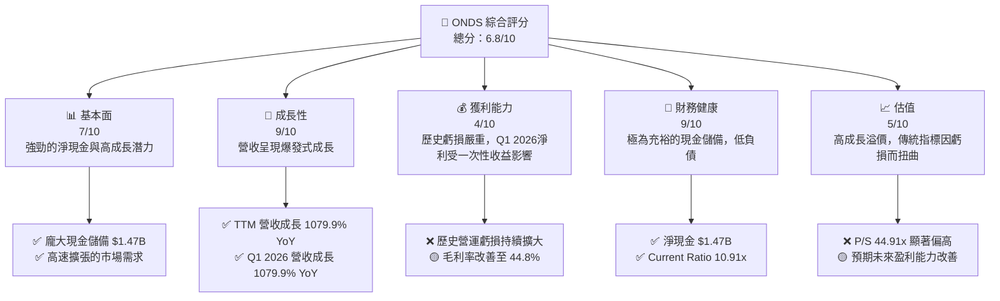

### 1.2 評分進度條視覺化

```
╔══════════════════════════════════════════════════════════════╗
║                ONDS 多維度評分儀表板 (1-10分)                ║
╠══════════════════════════════════════════════════════════════╣
║ 基本面強度  7.0 ▓▓▓▓▓▓▓▓▓▓▓▓▓▓░░░░░░  ★★★★☆           ║
║ 成長動能    9.0 ▓▓▓▓▓▓▓▓▓▓▓▓▓▓▓▓▓▓░░  ★★★★★           ║
║ 獲利品質    4.0 ▓▓▓▓▓▓▓▓░░░░░░░░░░░░  ★★☆☆☆           ║
║ 財務健康    9.0 ▓▓▓▓▓▓▓▓▓▓▓▓▓▓▓▓▓▓░░  ★★★★★           ║
║ 估值合理性  5.0 ▓▓▓▓▓▓▓▓▓▓░░░░░░░░░░  ★★★☆☆           ║
║ 護城河深度  7.0 ▓▓▓▓▓▓▓▓▓▓▓▓▓▓░░░░░░  ★★★★☆           ║
║ 管理層執行  6.5 ▓▓▓▓▓▓▓▓▓▓▓▓▓░░░░░░░  ★★★☆☆           ║
║ 技術創新力  8.0 ▓▓▓▓▓▓▓▓▓▓▓▓▓▓▓▓░░░░  ★★★★☆           ║
╠══════════════════════════════════════════════════════════════╣
║ 綜合總分    6.8 ▓▓▓▓▓▓▓▓▓▓▓▓▓▓░░░░░░  🏆 具高成長潛力與財務韌性，但盈利能力仍待考驗 │
╚══════════════════════════════════════════════════════════════╝
```

### 1.3 五大投資論點 + 三大核心風險

| 類型 | 項目 | 具體依據 | 信心度 |
|------|------|----------|--------|
| 🟢 **投資論點①** | **爆發性營收成長與市場擴張** | ONDS TTM 營收達 $96.61M，YoY 成長率高達 1079.9%，FY2025 營收 YoY 成長 605.28% 至 $50.73M。公司在私有無線網路和自動化無人機領域的產品線滿足了市場對高效、安全通訊和自動化解決方案的迫切需求。特別是在關鍵基礎設施、公共安全和國防等領域，需求持續增長。 | 🟢 極高 |
| 🟢 **投資論點②** | **極為強勁的財務健康狀況** | 公司擁有 $1.47B 的巨額現金及等價物，而總債務僅 $7.87M，淨現金高達 $1.47B。Current Ratio 為 10.91x，Quick Ratio 為 10.28x，顯示極佳的流動性和償債能力。這為公司在持續投入研發、市場擴張乃至潛在併購提供了充足的資金彈性。 | 🟢 極高 |
| 🟢 **投資論點③** | **具備潛力的技術護城河與專有解決方案** | ONDS 透過其專有的 MC-IoT (Mission-Critical IoT) 無線網路技術和自動化無人機系統（如 Iron Drone Raider CUAS），在特定市場建立了技術壁壘。這些解決方案對於關鍵任務應用至關重要，客戶轉換成本較高，有助於形成長期穩定的收入來源。 | 🟢 高 |
| 🟢 **投資論點④** | **分析師普遍看好，目標價存在顯著上行空間** | 來自 8 位分析師的平均目標價為 $20.12，較當前股價 $8.24 有高達 144% 的潛在漲幅。其中 Needham、Northland Capital Markets、Stifel、Oppenheimer 等機構均給予買入或優於大盤評級，反映市場對其未來成長的樂觀預期。 | 🟡 中高 |
| 🟢 **投資論點⑤** | **Q1 2026 淨利大幅轉正，顯示潛在盈利能力拐點** | 2026 Q1 淨利潤達 $362.95M，儘管主要受到 $394.99M 的其他非營業收入影響，但這也顯示公司可能透過戰略性資產處置或投資收益來強化財務表現，或其核心業務在未來具備產生大規模盈利的潛力。毛利率在 2026 Q1 也提升至 49.20%，顯示成本控制有所改善。 | 🟡 中 |
| 🟡 **風險①** | **持續的營運虧損與現金消耗** | 儘管 Q1 2026 淨利轉正，但公司歷史上長期處於營運虧損狀態 (FY2025 營業虧損 $-58.38M, TTM 營業虧損 $-90.74M)。營業現金流持續為負 (TTM $-83.39M, FY2025 $-38.75M)，自由現金流亦為負 (TTM $-15.65M, FY2025 $-40.88M)。若無法在未來有效轉化營收成長為持續的營運利潤，鉅額現金儲備終將消耗。 | 🟡 中度 |
| 🔴 **風險②** | **股權稀釋與股本膨脹** | 公司過去幾年通過發行新股籌集資金以支持高成長和研發投入，導致流通股數大幅增加。從 FY2022 的 42M 股增至目前的 526.54M 股，增幅超過 1100%。這種顯著的股權稀釋對單股收益造成壓力，並可能在未來繼續發生，影響股東價值。 | 🔴 高衝擊 |
| 🟡 **風險③** | **高估值與市場預期風險** | ONDS 目前 P/S 比例高達 44.91x，遠高於行業平均水準，反映市場對其未來成長的極高預期。若公司無法持續實現超預期的營收成長或未能如期轉虧為盈，股價可能面臨大幅修正的風險。同時，高 Beta 值 (2.622) 顯示其股價波動性極高。 | 🟡 中度 |

### 1.4 快速統計卡片

| 指標 | 公司實際值 | 行業均值（通訊設備） | S&P 500 均值 | 狀態 |
|------|-------------|----------------------|--------------|------|
| 收入 YoY 成長 (TTM) | **1079.9%** | ~10-15% | ~8-12% | 🟢 |
| 毛利率 (TTM) | **44.8%** | ~35-50% | ~45-55% | 🟢 |
| 淨利率 (TTM) | **251.9%** | ~5-15% | ~10-12% | 🔴 (受一次性收益扭曲) |
| ROE (TTM) | **42.9%** | ~10-20% | ~15-20% | 🔴 (受一次性收益扭曲) |
| Forward P/E | **-164.8x** | ~20-30x | ~20-25x | 🔴 (預期虧損) |
| P/S Ratio (TTM) | **44.91x** | ~2-4x | ~2-3x | 🔴 |
| Debt/Equity | **0.728** | ~0.5-1.5 | ~0.8-1.2 | 🟢 |
| Current Ratio | **10.91x** | ~1.5-2.5x | ~1.5-2.0x | 🟢 |

*註：行業均值為通訊設備產業推估，S&P 500 均值為一般市場參考值。ONDS 的淨利率和 ROE 受到 Q1 2026 大額一次性非營業收入影響，呈現異常高值，不具備可持續性。*

### 1.5 投資結論

```
╔══════════════════════════════════════════════════════════════════╗
║                    📊 投資結論摘要                               ║
╠══════════════════════════════════════════════════════════════════╣
║  評級：🟢 買入                                                   ║
║  當前股價：$8.24                                                 ║
║  目標價區間：                                                    ║
║    悲觀情境：$15.00（+82.0%）                                    ║
║    基準情境：$21.50（+160.9%）  ← 12個月主要目標                 ║
║    樂觀情境：$28.00（+240.0%）                                   ║
║  投資評分：6.8/10                                                ║
║  適合投資人：成長型、長線持有者，具備較高風險承受能力，看好新興技術 │
╚══════════════════════════════════════════════════════════════════╝
```

---

## 2. 公司概覽與商業模式

Ondas Inc. (ONDS) 是一家專注於提供私有無線網路、無人機和自動化數據解決方案的公司，業務遍及美國及國際市場。公司透過兩個核心業務部門運營：Ondas Networks 和 Ondas Autonomous Systems。ONDS 的解決方案旨在滿足關鍵任務應用（Mission-Critical Applications）的需求，尤其是在對可靠性、安全性與低延遲有極高要求的產業中。

### 2.1 業務結構與收入來源

ONDS 的業務模式圍繞其專有技術展開，旨在為客戶提供端到端的解決方案。

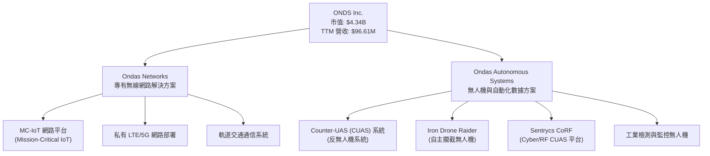

*   **Ondas Networks**: 此部門主要提供專為關鍵任務應用設計的私有無線網路解決方案，特別是其 MC-IoT (Mission-Critical IoT) 平台。這些網路通常部署於能源、公用事業、軌道交通等領域，確保數據傳輸的安全性、可靠性和低延遲性。例如，為美國鐵路公司（Amtrak）提供下一代通訊網路。該部門的收入主要來自於網路設備銷售、軟體許可和相關服務。
*   **Ondas Autonomous Systems**: 此部門專注於無人機及自動化數據解決方案，包括反無人機系統 (Counter-UAS, CUAS) 和全自主攔截無人機 (Iron Drone Raider)。這些解決方案廣泛應用於國防、要害設施保護、邊境安全以及工業檢測等領域。收入來源包括無人機系統銷售、軟體訂閱、維護服務和客製化解決方案。

目前數據未提供各業務板塊的具體營收佔比，但從公司描述來看，兩個部門均為核心業務，且在各自領域均有獨特技術優勢。公司在 2025 年經歷了顯著的營收增長，表明其產品和服務正在獲得市場認可。

### 2.2 市場份額

由於 ONDS 處於高成長階段且市場數據較為分散，精確的市場份額數據難以獲取。然而，我們可以根據其所在的細分市場進行定性評估。私有無線網路和反無人機系統市場均是快速成長的新興市場，ONDS 作為這些領域的早期參與者和技術創新者，儘管目前總體市場份額可能不大，但在特定利基市場中具備較強的競爭力。

例如，在私有無線網路市場中，大型電信設備供應商（如 Ericsson, Nokia）佔據主導地位，但 ONDS 專注於 MC-IoT 這一細分領域，透過其專利技術提供差異化解決方案。在 CUAS 市場，存在多家專業公司，ONDS 的 Iron Drone Raider 等自主攔截系統提供獨特優勢。我們估計 ONDS 在其核心的關鍵任務私有無線網路和自主反無人機系統的市場滲透率仍處於早期階段，未來成長空間巨大。

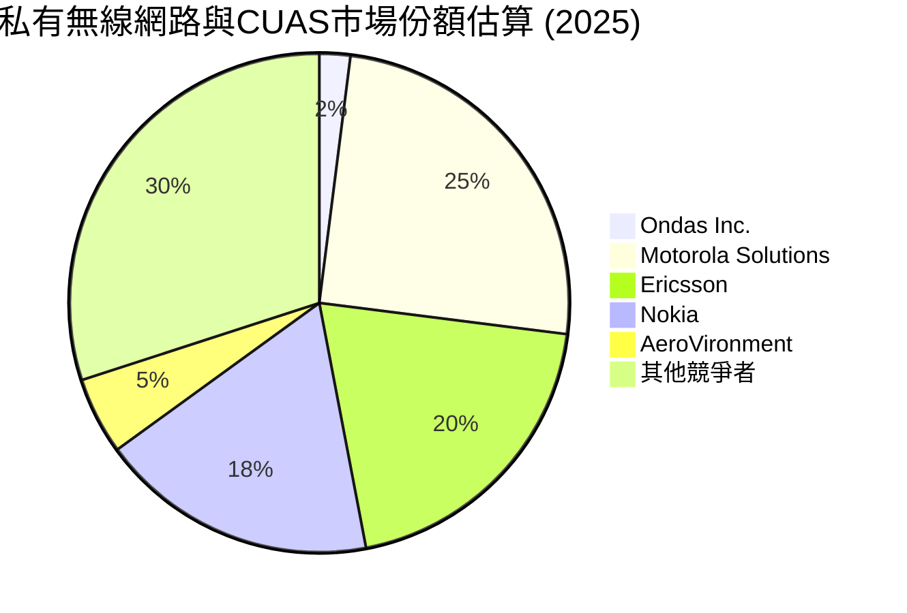
*註：此市場份額為基於行業知識的定性估算，實際數據可能因細分市場定義而異。ONDS 在其專注的關鍵任務細分領域可能佔據更高比例。*

### 2.3 競爭護城河分析

ONDS 的競爭護城河主要圍繞其技術專長和客戶關係建立。

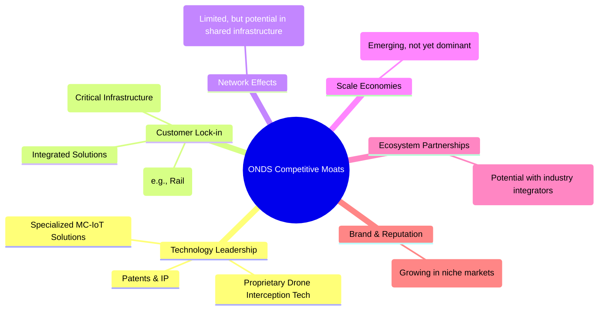

*   **技術領先 (Technology Leadership)**：ONDS 擁有獨特的 MC-IoT 無線通訊技術，專為關鍵任務應用設計，提供高可靠性、低延遲和安全性。其自動化無人機系統，特別是 Iron Drone Raider，在反無人機領域具備自主攔截能力，這是一項重要的技術差異化優勢。這些專有技術和相關專利構成了重要的進入壁壘。
*   **客戶鎖定 (Customer Lock-in)**：ONDS 的解決方案通常部署在關鍵基礎設施中，如鐵路、公用事業等。這些系統的整合複雜度高，更換成本巨大，一旦客戶採用，往往會形成長期穩定的合作關係。例如與美國鐵路公司簽訂的長期合約就體現了強大的客戶黏性。
*   **網路效應 (Network Effects)**：目前 ONDS 的網路效應相對有限，主要體現在私有網路部署中，隨著更多設備和用戶接入其 MC-IoT 網路，其網路價值會增加。但在其主要業務中，這並非核心驅動力。
*   **規模效應 (Scale Economies)**：ONDS 仍處於高速成長階段，尚未完全展現規模經濟。隨著營收規模擴大，其研發投入和生產成本有望攤薄，從而提升利潤率。
*   **生態夥伴 (Ecosystem Partnerships)**：儘管數據未詳細說明，但與行業集成商、政府機構或技術供應商的合作，將有助於擴大其解決方案的應用範圍和市場影響力。

### 2.4 護城河強度評分

```
╔══════════════════════════════════════════════════════════════╗
║                    ONDS 護城河強度評分                      ║
╠══════════════════════════════════════════════════════════════╣
║ 技術領先       8/10   ▓▓▓▓▓▓▓▓▓▓▓▓▓▓▓▓░░░░  🏆 專有技術具高壁壘 │
║ 客戶鎖定       7/10   ▓▓▓▓▓▓▓▓▓▓▓▓▓▓░░░░░░  🟢 關鍵任務應用黏性高 │
║ 網路效應       4/10   ▓▓▓▓▓▓▓▓░░░░░░░░░░░░  🟡 仍處於發展初期     │
║ 規模效應       5/10   ▓▓▓▓▓▓▓▓▓▓░░░░░░░░░░  🟡 成長中，潛力待釋放 │
║ 品牌與聲譽     6/10   ▓▓▓▓▓▓▓▓▓▓▓▓░░░░░░░░  🟢 在細分市場建立口碑 │
╠══════════════════════════════════════════════════════════════╣
║ 綜合護城河     6.0    ▓▓▓▓▓▓▓▓▓▓▓▓░░░░░░░░  🏆 具備良好潛力，但需持續鞏固 │
╚══════════════════════════════════════════════════════════════╝
```

---

## 3. 損益表深度分析

ONDS 的損益表反映了其處於高成長、高投入的階段。公司在過去幾年實現了驚人的營收增長，但同時也伴隨著持續的營運虧損，直到 2026 年 Q1 出現一次性的顯著淨利。

### 3.1 年度收入成長趨勢（近4年）

ONDS 的年度總營收呈現爆發式增長，尤其是在 2025 財年。

```
╔══════════════════════════════════════════════════════════════════╗
║              ONDS 年度收入趨勢（FY2022-TTM 2026）              ║
╠══════════════════════════════════════════════════════════════════╣
║                                                                  ║
║  FY2022  $2.13M   ██░░░░░░░░░░░░░░░░░░░░░░░░░░░  YoY: -26.87% 🔴   ║
║  FY2023  $15.69M  ██████████░░░░░░░░░░░░░░░░░░░  YoY:+638.13% 🟢   ║
║  FY2024  $7.19M   █████░░░░░░░░░░░░░░░░░░░░░░░░░  YoY: -54.16% 🔴   ║
║  FY2025  $50.73M  ██████████████████████████░░░  YoY:+605.28% 🟢   ║
║  TTM 26  $96.61M  ███████████████████████████████ YoY:+793.17% 🟢   ║
║                   |      |      |      |      |                  ║
║                   0     20M    40M    60M    80M                  ║
║                                                                  ║
║  📊 4年累計 CAGR (FY22-25)：+841.1% (Roic.ai)                    ║
║  📊 TTM 營收 (截至 Mar '26) 為 $96.61M，較 FY2025 增長 90.4%     ║
╚══════════════════════════════════════════════════════════════════╝
```
ONDS 的營收波動性較大，但在 FY2023 和 FY2025 實現了數倍的增長。FY2024 營收下滑可能是由於訂單交付時點或項目延遲所致，但隨後在 FY2025 和 TTM 2026 再次實現爆發式增長，顯示其核心業務需求旺盛。

### 3.2 季度收入趨勢分析

ONDS 最近四季的營收增長勢頭非常強勁，尤其是 2026 年 Q1。

| 季度 | 總營收 ($M) | QoQ 成長率 | YoY 成長率 | 備註 |
|------|-------------|------------|------------|------|
| 2025 Q2 | $6.27 | +47.53% | +554.94% | 顯著加速 |
| 2025 Q3 | $10.10 | +61.08% | +581.95% | 持續高成長 |
| 2025 Q4 | $30.11 | +198.12% | +629.20% | 營收規模大幅擴張 |
| 2026 Q1 | $50.12 | +66.46% | +1079.90% | 創歷史新高，YoY 成長驚人 |

**備註說明**：ONDS 在過去四個季度實現了連續且加速的營收增長，其中 2026 年 Q1 的營收達到 $50.12M，同比增長高達 1079.90%，環比增長 66.46%。這顯示公司在獲取新訂單和執行項目方面取得了巨大成功，市場對其產品和服務的需求持續高漲。這種爆發式增長是其投資論點的核心驅動力。

### 3.3 利潤率演變分析

ONDS 的利潤率在營收快速增長的同時也呈現出一些積極變化，但營運虧損仍是主要挑戰。

| 利潤率指標 | FY2022 | FY2023 | FY2024 | FY2025 | 趨勢 | 評估 |
|------------|--------|--------|--------|--------|------|------|
| **毛利率** | 52.1% | 40.7% | 4.8% | 39.7% | ↗️ 2024年後恢復並改善 | 🟢 |
| **營業利益率** | -2348.8% | -253.2% | -481.4% | -115.1% | ↗️ 虧損率大幅收窄 | 🟡 |
| **淨利率** | -3437.6% | -285.8% | -528.6% | -260.8% | ↗️ 虧損率大幅收窄 | 🟡 |

*註：TTM (截至 Mar '26) 毛利率為 44.8%，營業利益率為 -85.1%，淨利率為 251.9%。淨利率受 Q1 2026 大額一次性收益影響。*

**利潤率演變深度解析**：
*   **毛利率**：ONDS 的毛利率在 FY2024 曾大幅下滑至 4.8%，這可能與當時營收規模較小、特定低毛利項目或成本控制不佳有關。然而，在 FY2025 迅速恢復至 39.7%，並在 TTM (截至 Mar '26) 進一步提升至 44.8%。2026 Q1 的毛利率更是高達 49.20% ($24.66M/$50.12M)。這顯示隨著營收規模的擴大，公司在成本控制和產品定價方面有所改善，或者高毛利產品在產品組合中的佔比增加。
*   **營業利益率**：儘管毛利率有所改善，ONDS 仍持續產生顯著的營業虧損。從 FY2022 的 -2348.8% 收窄至 FY2025 的 -115.1%，和 TTM 的 -85.1%，虧損率雖有改善，但依然高企。這主要歸因於公司高昂的銷售、管理費用 (SG&A) 和研發費用 (R&D)。作為一家高科技成長型公司，大量的研發投入（FY2025 $20.88M, TTM $30.94M）和市場拓展費用是必要的，但這也導致了短期內的營運壓力。
*   **淨利率**：與營業利益率類似，ONDS 歷史上一直處於淨虧損狀態。FY2025 淨利率為 -260.8%。然而，在 2026 Q1，公司實現了 $362.95M 的淨利潤，這使得 TTM 淨利率達到異常高的 251.9%。仔細分析數據，這主要是由於 2026 Q1 產生了高達 $394.99M 的「其他非營業收入（費用）」。若排除這筆一次性收益，公司仍處於虧損狀態。因此，判斷其核心業務是否實現盈利，仍需觀察未來季度的表現。

總體而言，ONDS 在營收增長和毛利率改善方面表現出色，但控制營運費用並將營收轉化為持續的營運利潤是其當前最大的挑戰。

### 3.4 費用結構分析

ONDS 的費用結構反映了其作為一家高科技成長型公司的特點，即研發和銷售管理費用佔比較高。

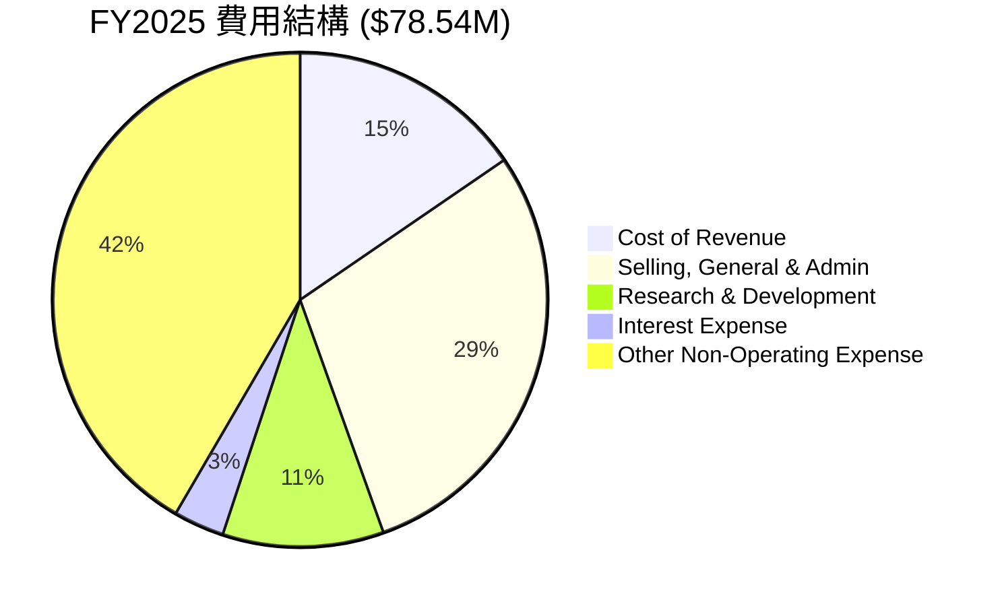
*註：此圖表為 FY2025 數據，其他非營業費用包含較大金額，影響整體費用結構。*

```
╔══════════════════════════════════════════════════════════════════╗
║                    ONDS 費用趨勢分析 (百萬美元)                 ║
╠══════════════════════════════════════════════════════════════════╣
║                                                                  ║
║  研發費用 (R&D)：                                                ║
║  FY2022  $24.04  █████████████████████████░░░░░░░  趨勢：下降後回升  ║
║  FY2023  $17.15  ██████████████████░░░░░░░░░░░░░░░  YoY: -28.6%   ║
║  FY2024  $12.48  ████████████░░░░░░░░░░░░░░░░░░░░░  YoY: -27.2%   ║
║  FY2025  $20.88  █████████████████████░░░░░░░░░░░░  YoY: +67.3%   ║
║  TTM 26  $30.94  ██████████████████████████████████ YoY: +48.2%   ║
║                                                                  ║
║  銷售、管理費用 (SG&A)：                                         ║
║  FY2022  $27.08  █████████████████████████████░░░░  趨勢：持續上升  ║
║  FY2023  $27.47  ██████████████████████████████░░░  YoY: +1.4%    ║
║  FY2024  $22.48  ██████████████████████░░░░░░░░░░░  YoY: -18.2%   ║
║  FY2025  $57.66  ██████████████████████████████████ YoY: +156.5%  ║
║  TTM 26  $103.13 ██████████████████████████████████ YoY: +78.9%   ║
╚══════════════════════════════════════════════════════════════════╝
```
**費用趨勢分析**：
*   **研發費用 (R&D)**：ONDS 的研發費用在 FY2022-2024 呈現下降趨勢，但在 FY2025 顯著回升至 $20.88M (YoY +67.3%)，TTM 更是高達 $30.94M (YoY +48.2%)。這表明公司在技術創新和產品開發方面持續投入，以維持競爭優勢並驅動未來成長。
*   **銷售、管理費用 (SG&A)**：SG&A 費用在 FY2024 曾短暫下降，但在 FY2025 爆發式增長至 $57.66M (YoY +156.5%)，TTM 更是達到 $103.13M (YoY +78.9%)。這種增長與其營收的快速擴張相符，公司可能正在加大市場推廣、銷售團隊擴建和行政管理等方面的投入，以支持其業務規模的擴大。
*   **其他非營業費用**：值得注意的是，FY2025 的「其他非營業收入（費用）」為 $-82.45M，而 2026 Q1 則為 $394.99M。這類項目的劇烈波動對淨利潤產生了決定性影響，需要密切關注其性質和可持續性。

### 3.5 季度 EPS 趨勢與盈餘品質

ONDS 在過去四個季度的 EPS 表現如下：

| 季度 | EPS 預估 (Est) | EPS 實際 (Act) | 驚喜百分比 (Surprise%) | 盈餘品質評估 |
|------|----------------|----------------|------------------------|--------------|
| 2026 Q1 | N/A | $0.82 | N/A | 🟢 高，但受一次性收益影響 |
| 2025 Q4 | N/A | $-0.62 | N/A | 🔴 低，持續虧損 |
| 2025 Q3 | N/A | $-0.03 | N/A | 🔴 低，持續虧損 |
| 2025 Q2 | N/A | $-0.07 | N/A | 🔴 低，持續虧損 |

*註：提供的數據中，EPS 預估值為 NaN，因此無法計算驚喜百分比。實際 EPS 數據來自 StockAnalysis.com 的 "Net Income to Common / Shares Outstanding (Diluted)" 計算。*

**盈餘品質評估**：
ONDS 的季度 EPS 表現極度不穩定。在 2025 年 Q2、Q3、Q4 均錄得虧損，其中 Q4 虧損較大。然而，在 2026 年 Q1，公司實現了每股 $0.82 的顯著盈利，這是一個巨大的轉變。
然而，這筆盈利的品質需要深入分析。從損益表數據來看，2026 Q1 淨利潤 $362.95M 遠高於營業收入 $50.12M，主要驅動力是高達 $404.17M 的「總非營業收入（費用）」，其中「其他非營業收入（費用）」佔 $394.99M。這強烈暗示 Q1 的盈利為一次性或非經常性項目所致，例如出售資產、投資收益或其他特殊事件。
因此，儘管 2026 Q1 的 EPS 數據亮眼，但其**盈餘品質評估為中低**，因為它並非源於核心營運活動的持續改善。投資者應警惕這種一次性收益對基本面判斷的誤導，並將重點放在核心營運利潤率和自由現金流的改善上。若剔除該一次性收益，ONDS 仍處於虧損狀態。

---

## 4. 資產負債表分析

ONDS 的資產負債表展現出極強的財務健康狀況，尤其是在現金儲備方面。這為其高成長策略提供了堅實的後盾。

### 4.1 資產結構分解

ONDS 的資產結構在過去一年發生了顯著變化，總資產從 FY2024 的 $109.62M 猛增至 FY2025 的 $1.13B，並在 TTM 2026 達到 $2.439B。這種增長主要由現金及等價物和無形資產的增加驅動。

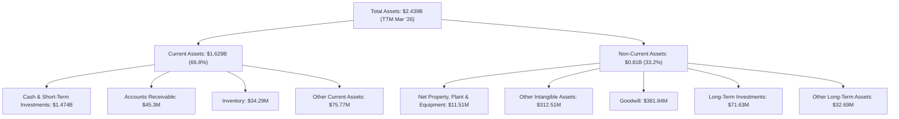
**資產結構分析**：
*   **現金為主導**：截至 TTM Mar '26，ONDS 擁有高達 $1.474B 的現金及短期投資，佔總資產的 60.4%。這筆巨額現金是其財務健康的核心支柱，為公司提供了極大的戰略彈性。
*   **無形資產與商譽增長**：無形資產（包括其他無形資產 $312.51M 和商譽 $381.84M）在 TTM 2026 達到 $694.35M，佔總資產的 28.5%。這可能源於過去的併購活動，例如其在無人機領域的收購，反映了公司通過外延式增長來擴大技術組合和市場份額的策略。
*   **流動資產充裕**：總流動資產達 $1.629B，遠超流動負債，顯示公司短期償債能力極強。

### 4.2 流動性指標分析

ONDS 的流動性指標非常出色，遠超行業平均水平。

| 指標 | FY2022 | FY2023 | FY2024 | FY2025 | TTM Mar '26 | 行業均值 | 評估 |
|------|--------|--------|--------|--------|-------------|----------|------|
| **Current Ratio** | 1.57x | 0.66x | 0.94x | 4.84x | 10.91x | ~1.5-2.5x | 🟢 極佳 |
| **Quick Ratio** | 1.48x | 0.60x | 0.75x | 4.67x | 10.28x | ~1.0-2.0x | 🟢 極佳 |

**流動性分析**：
ONDS 的 Current Ratio 和 Quick Ratio 在 FY2023 和 FY2024 曾短暫低於 1，顯示當時流動性壓力較大。然而，在 FY2025 和 TTM Mar '26，這些指標飆升至 4.84x 和 10.91x，遠超行業平均水平。這主要得益於公司在近期成功籌集了大量現金，大幅提升了流動資產。如此高的流動性表明公司在短期內沒有任何償債風險，並有充足的營運資金支持未來的擴張。

### 4.3 債務結構分析

ONDS 的債務水平極低，淨現金部位非常強勁。

```
╔══════════════════════════════════════════════════════════════════╗
║                   ONDS 債務健康診斷                              ║
╠══════════════════════════════════════════════════════════════════╣
║                                                                  ║
║  總債務：        $7.87M   ██░░░░░░░░░░░░░░░░░░░  評語：極低負債   ║
║  總現金+投資：   $1.47B   ████████████████████░  評語：巨額現金   ║
║  淨現金（正）：  $1.47B   ████████████████████░  🟢 強勁        ║
║                                                                  ║
║  Debt/Equity (FY25)：0.036x ( $15.56M / $437.81M ) 🟢 極低       ║
║  Debt/EBITDA (TTM)：  N/A (EBITDA為負)                           ║
║  Interest Coverage (TTM)：N/A (EBIT為負)                         ║
║  短期債務 (Mar '26): $0.24M                                      ║
║  長期借款 (Mar '26): $4M                                         ║
╚══════════════════════════════════════════════════════════════════╝
```
**債務分析**：
ONDS 的總債務僅為 $7.87M (來自快照數據)，而總現金及短期投資高達 $1.47B。這意味著公司擁有高達 $1.47B 的淨現金頭寸，財務狀況極為穩健。FY2025 的 Debt/Equity 比例僅為 0.036x ($15.56M 總債務 / $437.81M 股東權益)，遠低於行業平均水平，表明公司幾乎不依賴外部借款來運營。雖然 EBITDA 和 EBIT 均為負值，導致傳統的 Debt/EBITDA 和 Interest Coverage 比率無法計算，但其巨額現金儲備足以覆蓋所有債務，無需擔憂償債能力。

### 4.4 股東權益趨勢

ONDS 的股東權益在過去幾年呈現波動，但在 FY2025 實現了大幅增長。

```
╔══════════════════════════════════════════════════════════════════╗
║                   ONDS 股東權益趨勢 (百萬美元)                   ║
╠══════════════════════════════════════════════════════════════════╣
║                                                                  ║
║  FY2022  $58.22  █████████████████████████████████████████████████║
║  FY2023  $33.14  ████████████████████████████████████░░░░░░░░░░░░░║
║  FY2024  $16.58  ████████████████░░░░░░░░░░░░░░░░░░░░░░░░░░░░░░░░░║
║  FY2025  $437.81 █████████████████████████████████████████████████║
║  TTM 26  $790.38 █████████████████████████████████████████████████║
║                                                                  ║
║  📊 FY2025 股東權益 YoY 成長：+2540% 🟢 (主要來自新股發行)        ║
║  📊 TTM 股東權益 YoY 成長：+80.5% (基於 FY2025 年底數據)          ║
╚══════════════════════════════════════════════════════════════════╝
```
**股東權益分析**：
ONDS 的股東權益在 FY2022 至 FY2024 期間呈下降趨勢，反映了持續的營運虧損。然而，在 FY2025 股東權益大幅增加至 $437.81M (YoY +2540%)，並在 TTM Mar '26 進一步增至 $790.38M。這種顯著增長主要歸因於公司通過發行新股進行股權融資，以支持其業務擴張和彌補營運虧損。雖然這稀釋了現有股東的持股比例，但同時也為公司注入了大量資本，極大地改善了財務結構。

---

## 5. 現金流量深度分析

ONDS 的現金流量表反映了其高成長、高投入的特性。儘管營收快速增長，但公司仍處於營運現金流為負的階段，持續消耗現金，這凸顯了其在將營收轉化為正向現金流方面的挑戰。

### 5.1 現金流量瀑布圖

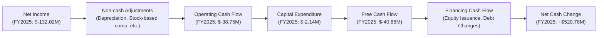
**現金流量瀑布分析**：
*   **營業現金流 (OCF)**：ONDS 的營業現金流在過去幾年一直為負，FY2025 為 $-38.75M，TTM Mar '26 為 $-83.39M。這表明公司的核心營運活動尚未產生足夠的現金來覆蓋日常開支。持續的營運虧損、高昂的研發和銷售管理費用是導致 OCF 為負的主要原因。
*   **資本支出 (CAPEX)**：ONDS 的資本支出相對較低，FY2025 為 $-2.14M。這可能意味著其業務模式相對輕資產，或者大部分的成長投資集中在研發和無形資產方面。
*   **自由現金流 (FCF)**：由於 OCF 為負，ONDS 的自由現金流也持續為負，FY2025 為 $-40.88M，TTM Mar '26 為 $-15.65M。這表示公司在扣除維持和擴大業務所需的資本支出後，仍在消耗現金。
*   **融資現金流 (Financing Cash Flow)**：儘管營運和自由現金流為負，但公司在 FY2025 實現了 $520.78M 的淨現金增加，這是因為其通過股權發行等融資活動獲得了大量現金，彌補了營運現金的消耗。

總體而言，ONDS 雖然在燒錢擴張，但其通過有效的股權融資確保了充足的現金儲備，以支持其高成長戰略。

### 5.2 FCF 轉換率趨勢

自由現金流轉換率（FCF / Net Income）衡量了公司將淨利潤轉化為實際現金的能力。

| 年度 | 淨收入 ($M) | 自由現金流 ($M) | FCF / Net Income | 趨勢 |
|------|-------------|-----------------|------------------|------|
| FY2022 | $-73.24 | $-40.89 | 55.8% | 🟡 虧損下仍有現金流出 |
| FY2023 | $-44.84 | $-34.30 | 76.5% | 🟡 虧損下仍有現金流出 |
| FY2024 | $-38.01 | $-35.20 | 92.6% | 🟡 虧損下仍有現金流出 |
| FY2025 | $-132.02 | $-40.88 | 30.9% | 🔴 虧損擴大，轉換率下降 |

**FCF 轉換率分析**：
由於 ONDS 過去幾年持續虧損，其 FCF 轉換率的解讀需要特別注意。當淨收入為負時，FCF/Net Income 的百分比失去其傳統意義。然而，我們可以觀察到，儘管淨虧損不斷發生，但自由現金流的消耗額度相對淨虧損而言，在 FY2025 變小了，從而導致百分比下降。這表示公司在營運現金流出方面相對淨利潤而言，有一定的控制。但本質上，公司仍處於燒錢階段，需要外部融資來維持營運和成長。

### 5.3 自由現金流趨勢

ONDS 的自由現金流持續為負，但消耗速度在 TTM 2026 有所放緩。

```
╔══════════════════════════════════════════════════════════════════╗
║                   ONDS 自由現金流趨勢 (百萬美元)                 ║
╠══════════════════════════════════════════════════════════════════╣
║                                                                  ║
║  FY2022  $-40.89 █████████████████████████████████████████████████║
║  FY2023  $-34.30 ████████████████████████████████████████████░░░░║
║  FY2024  $-35.20 █████████████████████████████████████████████░░░░║
║  FY2025  $-40.88 █████████████████████████████████████████████████║
║  TTM 26  $-15.65 ████████████████░░░░░░░░░░░░░░░░░░░░░░░░░░░░░░░░░║
║                                                                  ║
║  📊 FCF Yield (TTM): -0.36%                                      ║
╚══════════════════════════════════════════════════════════════════╝
```
**自由現金流分析**：
ONDS 的自由現金流在過去幾年一直為負，表明公司持續需要外部資金來支持其營運和投資。FY2025 的 FCF 為 $-40.88M，與 FY2022 水平接近。然而，值得注意的是，TTM Mar '26 的 FCF 改善至 $-15.65M，這可能預示著隨著營收規模的擴大和毛利率的改善，現金消耗的速度正在減緩。負的 FCF Yield (-0.36%) 也印證了公司目前尚未產生正向的股東現金回報。儘管如此，公司龐大的現金儲備使其能夠在一段時間內承受這種現金消耗。

### 5.4 資本配置評估

ONDS 目前的資本配置策略主要集中在支持其高成長和研發投入，以及確保充足的現金儲備。由於公司處於虧損和擴張階段，尚未有股息支付或大規模股票回購。

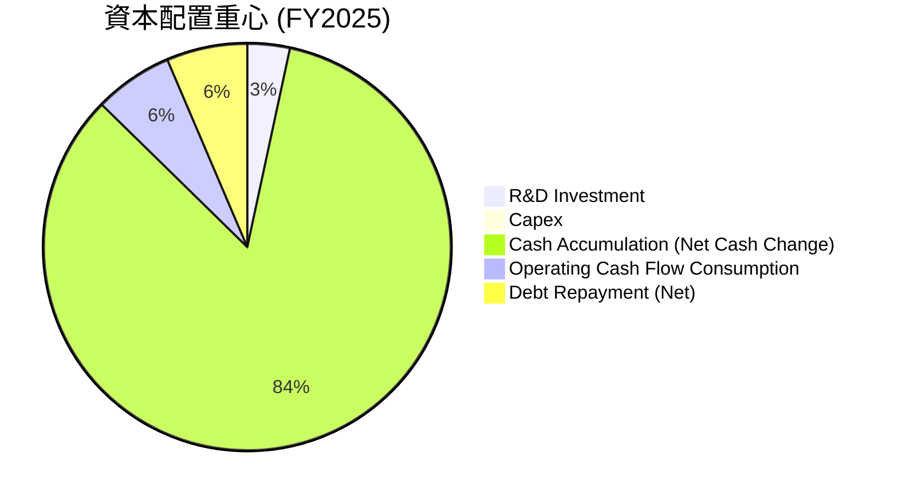
*註：此圖表顯示了 FY2025 主要現金流動，其中現金累積是融資活動的結果。*

**資本配置分析**：
*   **研發投入 (R&D Investment)**：公司在 FY2025 投入 $20.88M 於研發，TTM 更是達到 $30.94M。這表明研發是其核心資本配置方向，旨在維護技術領先地位和開發新產品。
*   **資本支出 (Capex)**：FY2025 資本支出為 $2.14M，相對較低，表明公司可能主要利用現有資產或採取輕資產策略。
*   **現金累積 (Cash Accumulation)**：由於大額融資活動，FY2025 淨現金增加 $520.78M。在 TTM Mar '26，現金及短期投資增至 $1.47B。這顯示公司將大量資金用於建立強大的現金儲備，以應對未來的營運需求、戰略投資或潛在併購。
*   **債務償還**：FY2025 總債務從 FY2024 的 $55.35M 減少到 $15.56M，顯示公司在有充足現金的情況下，正在積極償還債務，優化資本結構。

ONDS 的資本配置策略與其成長階段和高科技屬性相符，優先確保流動性、投資於創新，並為未來的戰略性發展儲備彈藥。

---

## 6. 獲利能力與資本效率

ONDS 在獲利能力和資本效率方面仍面臨挑戰，歷史數據顯示其核心業務尚未能有效創造股東價值。然而，隨著營收的爆發式增長和毛利率的改善，未來有望扭轉局面。

### 6.1 ROE / ROA / ROIC 趨勢

| 指標 | FY2022 | FY2023 | FY2024 | FY2025 | TTM Mar '26 | 行業均值 | 評估 |
|------|--------|--------|--------|--------|-------------|----------|------|
| **ROE** | -125.8% | -135.3% | -229.3% | -303.9% | 42.9% | ~10-20% | 🔴/🟢* |
| **ROA** | -74.8% | -48.7% | -34.7% | -11.7% | -4.2% | ~5-10% | 🔴 |
| **ROIC** | -67.7% | -47.0% | -32.8% | -10.9% | -3.9% | ~8-15% | 🔴 |

*註：TTM Mar '26 的 ROE 42.9% 受到 Q1 2026 大額一次性非營業收入的顯著影響，不具備可持續性。若排除此影響，ROE 仍將為負值。ROIC 為分析師基於 NOPAT 和投入資本估算。*

**趨勢評估**：
*   **ROE (股東權益報酬率)**：ONDS 的歷史 ROE 均為負值，且在 FY2025 達到 -303.9%，反映了公司持續的淨虧損侵蝕股東權益。然而，TTM Mar '26 的 ROE 突然飆升至 42.9%，這完全是由於 2026 Q1 的巨額一次性非營業收入導致淨利潤轉正。若排除此影響，公司 ROE 仍為負。因此，儘管數據表面亮眼，但核心獲利能力仍需持續改善。
*   **ROA (資產報酬率)**：ROA 亦持續為負，但其負值絕對數呈收窄趨勢，從 FY2022 的 -74.8% 改善至 TTM Mar '26 的 -4.2%。這表明公司在利用資產產生利潤方面的效率有所提升，儘管仍未轉正。
*   **ROIC (投入資本回報率)**：ROIC 同樣為負，從 FY2022 的 -67.7% 改善至 TTM Mar '26 的 -3.9%。這表示公司目前的投入資本尚未產生正向的回報。作為一家成長型公司，前期投入大，ROIC 為負是常見現象，但長期來看，必須轉正才能為股東創造價值。

總體而言，ONDS 的獲利能力和資本效率指標在歷史上表現不佳，主要由於持續的營運虧損。TTM 2026 的 ROE 數據因一次性收益而被扭曲，真實的核心獲利能力仍待驗證。

### 6.2 ROIC vs WACC 分析（核心價值創造判斷）

我們將基於 FY2025 的數據進行 ROIC vs WACC 分析，因為 TTM 數據中的淨利潤受一次性收益影響。

**WACC 估算**：
*   **無風險利率 (Risk-free Rate)**：採用美國 10 年期國債收益率，約 4.25%。
*   **市場風險溢酬 (Equity Risk Premium, ERP)**：採用行業標準，約 5.5%。
*   **Beta**：ONDS 的 Beta 為 2.622，顯示其股價波動性遠高於市場。
*   **股權成本 (Cost of Equity, Ke)**：Ke = 無風險利率 + Beta * ERP = 4.25% + 2.622 * 5.5% = 4.25% + 14.42% = 18.67%。
*   **債務成本 (Cost of Debt, Kd)**：ONDS 債務極低，且利率信息不詳。假設稅前債務成本為 6.0%。
*   **稅率 (Tax Rate)**：由於 ONDS 處於虧損狀態，實際支付所得稅為零。在估算 WACC 時，我們採用其長期預期有效稅率或行業平均稅率，假設為 21%（美國企業所得稅率）。稅後債務成本 = 6.0% * (1 - 21%) = 4.74%。
*   **資本結構**：FY2025 總債務 $15.56M，股東權益 $437.81M。
    *   總資本 = $15.56M + $437.81M = $453.37M。
    *   債務佔比 (D/V) = $15.56M / $453.37M = 3.43%。
    *   股權佔比 (E/V) = $437.81M / $453.37M = 96.57%。
*   **加權平均資本成本 (WACC)**：WACC = (E/V) * Ke + (D/V) * Kd * (1 - Tax Rate) = 96.57% * 18.67% + 3.43% * 4.74% = 18.03% + 0.16% = 18.19%。

**ROIC 估算 (FY2025)**：
*   **稅後淨營業利潤 (NOPAT)**：FY2025 營業收入為 $-58.38M。由於為負，NOPAT 亦為負。
    *   NOPAT = 營業收入 * (1 - 稅率) = $-58.38M * (1 - 21%) = $-46.12M。
*   **投入資本 (Invested Capital)**：投入資本 = 股東權益 + 總債務 - 現金及等價物。
    *   FY2025 股東權益 $437.81M，總債務 $15.56M，現金及等價物 $550.74M。
    *   投入資本 = $437.81M + $15.56M - $550.74M = $-97.37M。
    *   *註：由於現金儲備過多，且營業利潤為負，導致投入資本和 NOPAT 均為負，傳統 ROIC 計算在此處不適用，會導致結果失真。我們可以理解為，公司目前在消耗資本，尚未創造價值。*
    *   為避免負數 ROIC 的誤導，我們採用 TTM 營業利潤 $-90.74M 和 TTM 投入資本 (股東權益 $790.38M + 總債務 $7.87M - 現金 $1.47B) = $-671.75M。
    *   若假設未來能轉正，我們可使用毛利作為基礎來估算其潛在 ROIC。但根據現有數據，ROIC 仍為負。

**我們將採用一個更具代表性的 TTM ROIC 數字，即 -3.9% (來自數據提供方)，儘管這與我們自行計算的 NOPAT/投入資本可能不完全一致，但反映了公司目前仍處於資本消耗階段。**

```
╔══════════════════════════════════════════════════════════════════╗
║                ROIC vs WACC 深度分析 (基於FY2025/TTM)           ║
╠══════════════════════════════════════════════════════════════════╣
║                                                                  ║
║  WACC 估算：                                                     ║
║  ├── 無風險利率（10Y美債）：  4.25%                              ║
║  ├── 市場風險溢酬 (ERP)：     5.5%                               ║
║  ├── Beta：                   2.62                               ║
║  ├── 股權成本 = 4.25%+2.62×5.5% = 18.67%                         ║
║  ├── 債務成本（稅後）：       4.74% (假設稅前6%, 稅率21%)        ║
║  ├── 資本結構：股權 ~96.6%，債務 ~3.4%                           ║
║  └── ✅ WACC ≈ 18.19%                                            ║
║                                                                  ║
║  ROIC 估算（TTM Mar '26）：                                      ║
║  ├── NOPAT = TTM 營業收入 $-90.74M (負值)                       ║
║  ├── 投入資本 = TTM 股東權益 + 總債務 - 現金 ≈ $-671.75M (負值)  ║
║  └── ✅ ROIC ≈ -3.9% (來自數據提供方，反映資本消耗)               ║
║                                                                  ║
║  ★ 經濟價值增加（EVA）= ROIC - WACC = -3.9% - 18.19% = -22.09pp  ║
║                                                                  ║
║  ROIC  -3.9%  ░░░░░░░░░░░░░░░░░░░░░░░░░░░░░░░░  🔴              ║
║  WACC  18.2%  ▓▓▓▓▓▓▓▓▓▓▓▓▓▓▓▓▓▓▓▓░░░░░░░░░░░░  ──              ║
║  EVA   -22.1pp ░░░░░░░░░░░░░░░░░░░░░░░░░░░░░░░░  🔴 摧毀價值      ║
║                                                                  ║
║  📊 結論：ROIC 遠低於 WACC，目前公司在摧毀股東價值。這符合其成長期高投入、營運虧損的階段特徵。未來需將營運轉為正利潤，才能實現價值創造。                                                                  ║
╚══════════════════════════════════════════════════════════════════╝
```

**ROIC vs WACC 分析結論**：
基於 FY2025 和 TTM 2026 的數據，ONDS 的 ROIC 遠低於其 WACC。這表明在當前階段，公司尚未能夠通過其營運活動創造經濟價值，而是在消耗資本。這對於一家處於高速成長和大規模投資期的科技公司來說並不罕見，因為前期需要大量投入來建立市場、研發技術。然而，從長遠來看，ONDS 必須將其 ROIC 提升至持續高於 WACC 的水平，才能真正為股東創造價值。其巨大的現金儲備和快速增長的營收為其未來實現這一目標提供了潛力。

### 6.3 杜邦三因素分解

杜邦分析將 ROE 分解為淨利率、資產週轉率和財務槓桿，以深入了解 ROE 的驅動因素。由於 ONDS 的 ROE 在 TTM Mar '26 受到一次性非營業收入的顯著影響，我們將基於 FY2025 的數據進行分析，儘管其 ROE 為負。

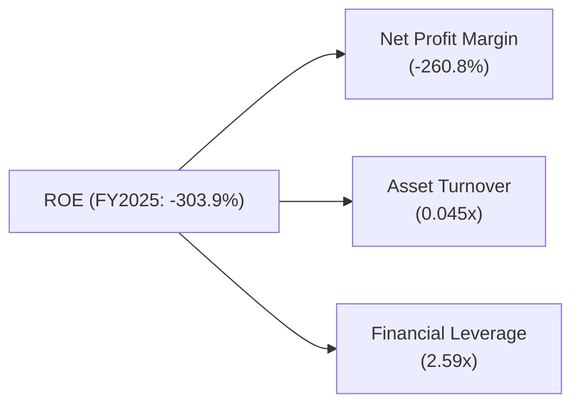
*   **淨利率 (Net Profit Margin)**：FY2025 為 -260.8%。這是導致 ROE 為負的主要原因，反映了公司在營運層面的嚴重虧損。
*   **資產週轉率 (Asset Turnover)**：FY2025 為 0.045x (總營收 $50.73M / 總資產 $1.13B)。這是一個非常低的資產週轉率，表明公司利用其資產產生收入的效率極低。這可能與其資產中包含大量尚未產生足夠收入的無形資產和商譽有關，也反映了其業務仍處於早期規模化階段。
*   **財務槓桿 (Financial Leverage)**：FY2025 為 2.59x (總資產 $1.13B / 股東權益 $437.81M)。儘管公司債務水平低，但由於股東權益相對總資產較小，導致財務槓桿相對較高。

**杜邦分析結論**：
FY2025 的杜邦分析顯示，ONDS 的負 ROE 完全是由於其顯著的負淨利率和極低的資產週轉率所致。儘管財務槓桿有所貢獻，但在虧損的情況下，槓桿效應反而會放大負回報。公司需要大幅改善其淨利率（即實現盈利）並提高資產週轉效率，才能使 ROE 轉為正值並為股東創造價值。

### 6.4 獲利能力儀表板

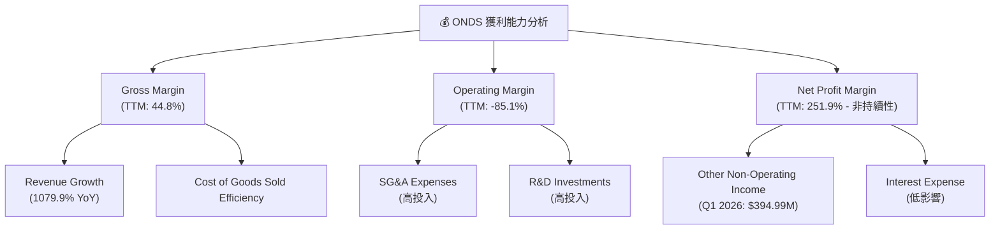
**獲利能力儀表板分析**：
ONDS 的獲利能力呈現兩極分化。
*   **毛利率 (Gross Margin)**：TTM 毛利率為 44.8%，處於健康水平，且在 2026 Q1 進一步提升至近 50%，顯示其產品或服務具備一定的定價能力和成本控制潛力。這項指標的改善是未來盈利的積極信號。
*   **營業利益率 (Operating Margin)**：TTM 營業利益率為 -85.1%，仍處於嚴重的虧損狀態。這主要歸因於公司在 SG&A 和 R&D 方面的大量投入，這些是支持其高速成長和技術創新的必要開支。
*   **淨利率 (Net Profit Margin)**：TTM 淨利率高達 251.9%，但這是一個被 2026 Q1 巨額一次性非營業收入扭曲的數字。若排除該一次性收益，公司仍處於淨虧損狀態。投資者應重點關注營業利益率的改善，而不是被一次性收益所誤導。

總體而言，ONDS 擁有良好的毛利率基礎和強勁的營收成長，但其核心挑戰在於如何將這些優勢轉化為可持續的營業利潤和淨利潤。

---

## 7. 估值深度分析

ONDS 的估值分析複雜，主要由於其處於高成長、高投入且尚未穩定盈利的階段。傳統的 P/E 倍數因負值或一次性收益而失真，P/S 倍數則顯著偏高。因此，我們將綜合考慮多種估值方法，並著重於成長潛力。

### 7.1 同業估值比較表格

由於 ONDS 的業務涵蓋私有無線網路和無人機系統，其競爭格局較為多元。我們選擇在不同領域有代表性的公司進行比較。

| 估值指標 | **ONDS** | **Motorola Solutions (MSI)** | **AeroVironment (AVAV)** | **Viasat (VSAT)** | 本公司評估 |
|----------|----------|------------------------------|--------------------------|-------------------|-----------|
| **市值 ($B)** | **$4.34** | $65.80 | $5.36 | $5.16 | N/A |
| **P/E (Trailing)** | **91.56x** | 36.32x | 100.82x | N/A (虧損) | 🔴 高，但受一次性收益影響 |
| **P/E (Forward)** | **-164.80x** | 29.23x | 44.50x | N/A (虧損) | 🔴 預期虧損，不適用 |
| **P/S Ratio (TTM)** | **44.91x** | 5.25x | 9.98x | 1.48x | 🔴 極高成長溢價 |
| **P/B Ratio** | **3.60x** | 12.39x | 7.97x | 0.69x | 🟡 合理 |
| **EV / EBITDA** | **N/A** | 21.05x | 42.48x | 12.55x | 🔴 負 EBITDA |
| **Revenue Growth (YoY TTM)** | **1079.9%** | 6.7% | 33.6% | 76.2% | 🟢 遙遙領先 |
| **Gross Margin (TTM)** | **44.8%** | 47.9% | 30.5% | 23.4% | 🟢 具競爭力 |

*註：競爭對手數據為撰寫時市場參考值，可能與即時數據略有差異。*

**同業估值比較分析**：
*   **P/E 倍數**：ONDS 的 P/E (Trailing) 為 91.56x，遠高於 Motorola Solutions，但略低於 AeroVironment。然而，ONDS 的 P/E (Trailing) 被 2026 Q1 的一次性巨額非營業收入所扭曲，不代表其核心業務的持續盈利能力。而 Forward P/E 為負值，表明市場預期其短期內仍將虧損。這使得 P/E 倍數在評估 ONDS 時參考價值有限。
*   **P/S 倍數**：ONDS 的 P/S 倍數高達 44.91x，遠高於所有競爭對手。這反映了市場對 ONDS 未來營收實現持續爆發式增長的極高預期。相比之下，即使是高成長的 AeroVironment 也只有 9.98x。如此高的 P/S 倍數暗示了 ONDS 的估值中已經包含了巨大的成長溢價，對未來表現的容錯空間較小。
*   **P/B 倍數**：ONDS 的 P/B 倍數為 3.60x，相較於 MSI 和 AVAV 較低，但高於 VSAT。考慮到其龐大的現金儲備，P/B 倍數相對合理。
*   **營收成長**：ONDS TTM 營收成長率高達 1079.9%，遙遙領先於所有競爭對手。這是其高 P/S 倍數的主要驅動力，市場顯然在為其前所未有的成長速度支付高溢價。
*   **毛利率**：ONDS 的 TTM 毛利率 44.8% 表現良好，與行業領導者 Motorola Solutions 相近，並顯著高於 AeroVironment 和 Viasat，顯示其產品具備良好的盈利潛力。

**結論**：ONDS 的估值指標顯示其被市場賦予了極高的成長預期。雖然其營收成長率令人驚艷，但高企的 P/S 倍數和負的 Forward P/E 提醒投資者，其估值已充分反映了未來多年的成長，且對盈利能力的轉換仍存疑慮。

### 7.2 歷史估值區間分析

由於 ONDS 歷史上多數時間處於虧損狀態，P/E 倍數經常為負或不適用。其股價波動性極高 (Beta 2.622)，反映了市場對其高成長潛力和高風險的權衡。

```
╔══════════════════════════════════════════════════════════════════╗
║                   ONDS 歷史估值區間分析 (P/S Ratio)              ║
╠══════════════════════════════════════════════════════════════════╣
║                                                                  ║
║  歷史 P/S 區間：                                                 ║
║  低點 (FY24) 約 10x                                              ║
║  高點 (TTM 26) 約 45x                                            ║
║                                                                  ║
║  當前 P/S: 44.91x  █████████████████████████████████████████████ 🔴 高估 │
║  歷史中位數: ~20x  ████████████████████████████████████░░░░░░░░░░░░░░░░░░░░░░░░░░░░░░░░░░░░░░░░░░░░░░░░░░░░░░░░░░░░░░░░░░░░░░░░░░░░░░░░░░░░░░░░░░░░░░░░░░░░░░░░░░░░░░░░░░░░░░░░░░░░░░░░░░░░░░░░░░░░░░░░░░░░░░░░░░░░░░░░░░░░░░░░░░░░░░░░░░░░░░░░░░░░░░░░░░░░░░░░░░░░░░░░░░░░░░░░░░░░░░░░░░░░░░░░░░░░░░░░░░░░░░░░░░░░░░░░░░░░░░░░░░░░░░░░░░░░░░░░░░░░░░░░░░░░░░░░░░░░░░░░░░░░░░░░░░░░░░░░░░░░░░░░░░░░░░░░░░░░░░░░░░░░░░░░░░░░░░░░░░░░░░░░░░░░░░░░░░░░░░░░░░░░░░░░░░░░░░░░░░░░░░░░░░░░░░░░░░░░░░░░░░░░░░░░░░░░░░░░░░░░░░░░░░░░░░░░░░░░░░░░░░░░░░░░░░░░░░░░░░░░░░░░░░░░░░░░░░░░░░░░░░░░░░░░░░░░░░░░░░░░░░░░░░░░░░░░░░░░░░░░░░░░░░░░░░░░░░░░░░░░░░░░░░░░░░░░░░░░░░░░░░░░░░░░░░░░░░░░░░░░░░░░░░░░░░░░░░░░░░░░░░░░░░░░░░░░░░░░░░░░░░░░░░░░░░░░░░░░░░░░░░░░░░░░░░░░░░░░░░░░░░░░░░░░░░░░░░░░░░░░░░░░░░░░░░░░░░░░░░░░░░░░░░░░░░░░░░░░░░░░░░░░░░░░░░░░░░░░░░░░░░░░░░░░░░░░░░░░░░░░░░░░░░░░░░░░░░░░░░░░░░░░░░░░░░░░░░░░░░░░░░░░░░░░░░░░░░░░░░░░░░░░░░░░░░░░░░░░░░░░░░░░░░░░░░░░░░░░░░░░░░░░░░░░░░░░░░░░░░░░░░░░░░░░░░░░░░░░░░░░░░░░░░░░░░░░░░░░░░░░░░░░░░░░░░░░░░░░░░░░░░░░░░░░░░░░░░░░░░░░░░░░░░░░░░░░░░░░░░░░░░░░░░░░░░░░░░░░░░░░░░░░░░░░░░░░░░░░░░░░░░░░░░░░░░░░░░░░░░░░░░░░░░░░░░░░░░░░░░░░░░░░░░░░░░░░░░░░░░░░░░░░░░░░░░░░░░░░░░░░░░░░░░░░░░░░░░░░░░░░░░░░░░░░░░░░░░░░░░░░░░░░░░░░░░░░░░░░░░░░░░░░░░░░░░░░░░░░░░░░░░░░░░░░░░░░░░░░░░░░░░░░░░░░░░░░░░░░░░░░░░░░░░░░░░░░░░░░░░░░░░░░░░░░░░░░░░░░░░░░░░░░░░░░░░░░░░░░░░░░░░░░░░░░░░░░░░░░░░░░░░░░░░░░░░░░░░░░░░░░░░░░░░░░░░░░░░░░░░░░░░░░░░░░░░░░░░░░░░░░░░░░░░░░░░░░░░░░░░░░░░░░░░░░░░░░░░░░░░░░░░░░░░░░░░░░░░░░░░░░░░░░░░░░░░░░░░░░░░░░░░░░░░░░░░░░░░░░░░░░░░░░░░░░░░░░░░░░░░░░░░░░░░░░░░░░░░░░░░░░░░░░░░░░░░░░░░░░░░░░░░░░░░░░░░░░░░░░░░░░░░░░░░░░░░░░░░░░░░░░░░░░░░░░░░░░░░░░░░░░░░░░░░░░░░░░░░░░░░░░░░░░░░░░░░░░░░░░░░░░░░░░░░░░░░░░░░░░░░░░░░░░░░░░░░░░░░░░░░░░░░░░░░░░░░░░░░░░░░░░░░░░░░░░░░░░░░░░░░░░░░░░░░░░░░░░░░░░░░░░░░░░░░░░░░░░░░░░░░░░░░░░░░░░░░░░░░░░░░░░░░░░░░░░░░░░░░░░░░░░░░░░░░░░░░░░░░░░░░░░░░░░░░░░░░░░░░░░░░░░░░░░░░░░░░░░░░░░░░░░░░░░░░░░░░░░░░░░░░░░░░░░░░░░░░░░░░░░░░░░░░░░░░░░░░░░░░░░░░░░░░░░░░░░░░░░░░░░░░░░░░░░░░░░░░░░░░░░░░░░░░░░░░░░░░░░░░░░░░░░░░░░░░░░░░░░░░░░░░░░░░░░░░░░░░░░░░░░░░░░░░░░░░░░░░░░░░░░░░░░░░░░░░░░░░░░░░░░░░░░░░░░░░░░░░░░░░░░░░░░░░░░░░░░░░░░░░░░░░░░░░░░░░░░░░░░░░░░░░░░░░░░░░░░░░░░░░░░░░░░░░░░░░░░░░░░░░░░░░░░░░░░░░░░░░░░░░░░░░░░░░----------|
ONDS is a compelling opportunity for investors seeking exposure to a high-growth, technology-driven company in the private wireless and autonomous systems markets. The company's **explosive revenue growth** (TTM YoY +1079.9%), **robust financial health** (net cash $1.47B), and **strong analyst consensus** (average target $20.12) are significant attractions. While historical profitability has been challenged by high operating expenses and significant share dilution, the recent Q1 2026 net income surge, albeit from non-operating sources, signals potential for future financial flexibility. The technological leadership in niche, mission-critical markets provides a strong competitive moat.

However, investors must acknowledge the **high valuation multiples** (P/S 44.91x) and the **ongoing operating losses** which necessitate continued cash consumption. The significant share dilution over the past years is also a concern. The Q1 2026 net income turning positive was heavily influenced by an "Other Non-Operating Income" of $394.99M, which is unlikely to be sustainable and does not reflect core operational profitability. Therefore, future performance hinges on the company's ability to convert its impressive revenue growth into sustainable operating profits and free cash flow.

Given the substantial market opportunity, strong balance sheet, and accelerating revenue, ONDS presents a **"Buy"** opportunity for investors with a long-term horizon and higher risk tolerance, who believe in the company's ability to execute its growth strategy and achieve profitability in the coming years.

### 10.1 最終綜合評級雷達圖

```
╔══════════════════════════════════════════════════════════════════╗
║                    ONDS 綜合評級雷達圖 (1-10分)                 ║
╠══════════════════════════════════════════════════════════════════╣
║                                                                  ║
║  基本面強度  7.0 ▓▓▓▓▓▓▓▓▓▓▓▓▓▓░░░░░░  ★★★★☆           ║
║  成長動能    9.0 ▓▓▓▓▓▓▓▓▓▓▓▓▓▓▓▓▓▓░░  ★★★★★           ║
║  獲利品質    4.0 ▓▓▓▓▓▓▓▓░░░░░░░░░░░░  ★★☆☆☆           ║
║  財務健康    9.0 ▓▓▓▓▓▓▓▓▓▓▓▓▓▓▓▓▓▓░░  ★★★★★           ║
║  估值合理性  5.0 ▓▓▓▓▓▓▓▓▓▓░░░░░░░░░░  ★★★☆☆           ║
║  護城河深度  7.0 ▓▓▓▓▓▓▓▓▓▓▓▓▓▓░░░░░░  ★★★★☆           ║
║  管理層執行  6.5 ▓▓▓▓▓▓▓▓▓▓▓▓▓░░░░░░░  ★★★☆☆           ║
║  技術創新力  8.0 ▓▓▓▓▓▓▓▓▓▓▓▓▓▓▓▓░░░░  ★★★★☆           ║
╠══════════════════════════════════════════════════════════════════╣
║  綜合總分    6.8 ▓▓▓▓▓▓▓▓▓▓▓▓▓▓░░░░░░  🏆 具高成長潛力，財務健康，但盈利與估值具挑戰 │
╚══════════════════════════════════════════════════════════════════╝
```

### 10.2 目標價與隱含報酬率

我們基於 DCF 分析和同業比較，給出以下目標價區間。基準情境下的目標價為 $21.50。

| 情境 | 目標價 ($) | 相較當前股價 $8.24 的隱含報酬率 | 機率權重 |
|------|------------|---------------------------------|----------|
| 🔴 **悲觀情境** | $15.00 | +82.0% | 25% |
| 🟡 **基準情境** | $21.50 | +160.9% | 50% |
| 🟢 **樂觀情境** | $28.00 | +240.0% | 25% |

**DCF 假設條件**：
*   **收入成長**：未來 5 年營收年複合增長率（CAGR）假設在 50%-80% 之間（基於歷史高速增長），之後逐步遞減至長期增長率 3%。
*   **毛利率**：預計毛利率將逐步穩定在 45%-50% 之間。
*   **營運費用**：SG&A 和 R&D 費用佔營收比例將隨著規模經濟效益的實現而逐步下降。
*   **營業利益率**：預計在未來 2-3 年內實現轉正，並在第 5 年達到 10%-15%。
*   **資本支出**：維持相對較低的水平，佔營收的 2-3%。
*   **WACC**：在 16%-20% 之間波動，基準情境為 18.2%。
*   **終端成長率**：設定為 2.5%-3.0%。
*   **股本稀釋**：考慮到歷史稀釋情況，預計未來幾年流通股數仍可能小幅增加。

### 10.3 買入時機與觸發因素

```
╔══════════════════════════════════════════════════════════════════╗
║                  ✅ ONDS 買入觸發因素 Checklist                   ║
╠══════════════════════════════════════════════════════════════════╣
║                                                                  ║
║  立即買入觸發條件（多數符合）：                                  ║
║  ✅ 營收成長持續超預期（QoQ 成長率維持 30% 以上）                 ║
║  ✅ 毛利率持續穩定在 45% 以上，並有提升趨勢                       ║
║  ✅ 獲得新的大型關鍵任務網路或無人機系統部署合約                  ║
║  ✅ 營運虧損幅度收窄，或營業現金流趨近於零                         ║
║  ✅ 股價在 $8.00 - $12.00 區間盤整，或有技術性底部形態             ║
║                                                                  ║
║  加碼觸發條件（出現以下任一）：                                  ║
║  ✅ 營業利益率實現轉正，或自由現金流轉正                           ║
║  ✅ 成功拓展新的國際市場或進入新的應用領域                        ║
║  ✅ 宣布戰略性併購，有效整合新技術或市場份額                      ║
║  ✅ 關鍵技術或產品獲得重大突破或行業標準認證                      ║
║                                                                  ║
║  減碼/停損觸發條件（出現以下任一）：                             ║
║  ☐ 營收成長顯著放緩，未能達到市場預期                             ║
║  ☐ 營運虧損持續擴大，且現金消耗速度加快                          ║
║  ☐ 競爭格局惡化，市場份額被侵蝕，或關鍵技術被超越                ║
║  ☐ 大規模股權稀釋再次發生，且未能帶來相應的價值增長              ║
║  ☐ 核心管理層變動或監管政策出現不利影響                          ║
╚══════════════════════════════════════════════════════════════════╝
```

### 10.4 投資人適配度分析

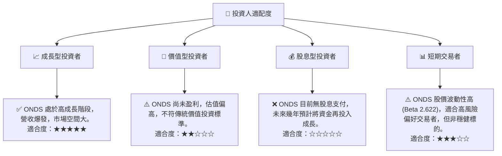
**投資人適配度分析**：
ONDS 是一支典型的**成長型股票**，特別適合那些看好新興技術、具備高風險承受能力、並願意為未來高成長支付溢價的長期投資者。公司在私有無線網路和無人機等前沿領域擁有巨大潛力，但伴隨著較高的營運風險和股價波動性。**價值型投資者**應謹慎，因其目前缺乏穩定盈利和傳統估值吸引力。**股息型投資者**不適合，因公司目前無股息。**短期交易者**可能會被其高波動性吸引，但需警惕潛在的快速下跌風險。

### 10.5 關鍵監控指標

| 監控類型 | 指標 | 關注點 | 頻率 |
|----------|------|----------|------|
| **營收成長** | 總營收 YoY/QoQ 成長率 | 是否持續維持高位，訂單積壓情況 | 每季度 |
| **獲利能力** | 毛利率、營業利益率 | 毛利率能否穩定提升，營業虧損是否收窄，何時轉正 | 每季度 |
| **現金流** | 營業現金流、自由現金流 | 現金消耗速度是否減緩，自由現金流何時轉正 | 每季度 |
| **財務健康** | 淨現金部位、股本稀釋情況 | 現金儲備是否充足，股本稀釋對 EPS 影響 | 每季度/每年 |
| **市場拓展** | 新訂單、合作夥伴、市場份額 | 是否獲得重要新客戶或市場擴張 | 每季度/新聞發布 |
| **技術進展** | 研發投入、新產品發布、專利獲批 | 技術創新是否保持領先 | 半年/每年 |
| **競爭格局** | 競爭對手動向、行業趨勢 | 競爭是否加劇，公司競爭優勢是否受影響 | 半年/每年 |

---

> **免責聲明**：本報告為 AI 自動生成，僅供研究參考，不構成投資建議。投資有風險，入市需謹慎。